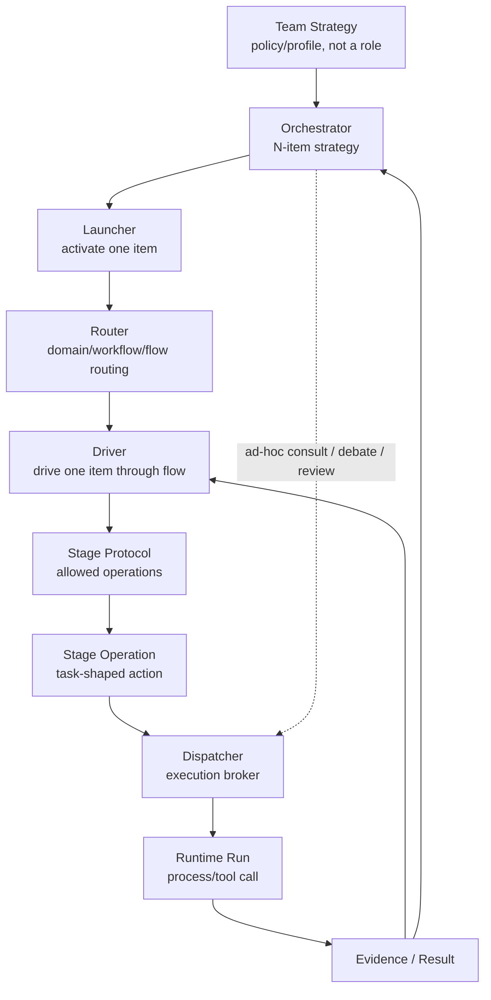

# Review pack: s2-agent-coordination-exact-02

Pack commit: 6df71985bf87b30a7a865e31f22c37ec22a8c8c8

Pack id: 3393b820e669d568e95fb18299971c21812fea2c0bf7d1afc9b3e925c550232b

Author session: codex-session:1@2026-10-08

## claim_4e42262fa92c7b2fc19650be61a024d8

Source: docs/architect/agent-coordination/decisions/ADR-008-coordination-session-and-mission-deferral.md#unheaded-block-8

Target: docs/platform/agent-coordination/history/retired-engine/files/decisions/ADR-008-coordination-session-and-mission-deferral.md#literal-snapshot

### Proposed decision

| Field | Value |
|---|---|
| claimId | claim\_4e42262fa92c7b2fc19650be61a024d8 |
| sourceUnitDigest | aeeb780ab4b1237bc1fb6c7658b669cc80a804378304b9787a8b26811d172516 |
| claimKind | decision |
| disposition | move |
| rationale | The old exact target is now removed or deliberately narrowed; no script approval is carried across that change. The complete prior candidate file is retained verbatim as non-authority history after retirement 2180b4e72701bb090288af8fe8021008d9d42079; see docs/specs/runner.md historical section. Prior rationale: The previously script-proven exact source unit was bound to the pre-retirement candidate rendering. |
| targetOwner | docs/platform/agent-coordination/history/retired-engine/files/decisions/ADR-008-coordination-session-and-mission-deferral.md |
| targetAnchor | literal-snapshot |
| targetUnitDigest | d4d3d4e15f0bb4a573005ac41124dfa93f4a7290590d3c022a8db95cba0db653 |
| targetAncestry | \["Historical File: ADR-008: CoordinationSession As V1 Recovery Root, One-Way Assignment Membership, And Mission Deferral"\] |
| authoredBy | codex-session:1@2026-10-09 |
| reviewStatus | pending |

### Source unit

```text
- A stranger agent can reconstruct and resume a CoordinationSession from its
  manifest and event log without re-deriving membership from timestamps or
  writer identity.
- Assignment, Run, and RunResult remain the single canonical execution record
  set; nothing under `.fgos/coordination/` becomes a second source of
  execution truth.
- Mission can be introduced later purely as a grouping layer over existing
  session ids, without a schema migration on any V1 record.
- `SessionActor`/`Persona`/`Stance` can be added to canonical vocabulary and
  to `FlowDefinition` (ADR-009) without colliding with the platform-level
  `Participant` concept.
- Any future two-way reference (an Assignment learning about its session)
  requires an explicit new ADR superseding this one and ADR-006 §6; it is not
  implied by anything in this decision.
```

### Target unit

````text
## Literal Snapshot

~~~~text
# ADR-008: CoordinationSession As V1 Recovery Root, One-Way Assignment Membership, And Mission Deferral

```txt
Document type: Decision
Audience: Human reviewers, maintainers, documentation agents
Purpose: Preserve source material for ADR-008: CoordinationSession As V1 Recovery Root, One-Way Assignment Membership, And Mission Deferral
Design status: Candidate
Implementation: Not re-verified; source implementation statements remain in the body
Provenance: Retained from docs/architect/agent-coordination/decisions/ADR-008-coordination-session-and-mission-deferral.md at fcfe78cb89585bc9ab23f11bab67d41458834fc4
Writer type: Documentation maintainer
Canonical for: Preserved decision material for ADR-008: CoordinationSession As V1 Recovery Root, One-Way Assignment Membership, And Mission Deferral; no authority cutover
Use this when: Comparing this candidate with its pinned legacy source
Do not use this for: Inferring current implementation or supersession of retained sources
Last reviewed: UNPROVEN; independent content review pending
Related:
- docs/platform/agent-coordination/vision.md
- docs/platform/agent-coordination/decisions/ADR-006-assignment-provenance-and-contract-snapshot.md
- docs/platform/agent-coordination/intent-preservation-ledger.md
Supersedes: None; retained source authority is unchanged
Superseded by: None
Added in candidate: Promotion metadata only; source claims and implementation are not re-decided here
```
Document type: ADR
Design status: Accepted
Implementation: Implemented (`src/runner/coordination/{schema,store,replay,session-engine}.mjs`,
Step 08 Phases 01-07; see `docs/architect/agent-coordination/verification/step-08-standalone-coordination/index.md`
for the per-phase trace and `deferral-audit.md` for the closing AC-I001/AC-I007 audit)
Last reviewed: 2026-09-02
Canonical for: CoordinationSession identity/persistence boundary, session-to-Assignment membership direction, mission-lite cutover posture, and the Role/SessionActor/Persona/Stance actor-instance vocabulary
Related: [Vision V-001/V-005/V-009](../vision.md), [ADR-006 §6](ADR-006-assignment-provenance-and-contract-snapshot.md), [Intent Preservation Ledger AC-I001/AC-I002/AC-I007](../intent-preservation-ledger.md), [CoordinationSession Contract](../contracts/coordination-session.md), [Step 08 checkpoint](../proposals/step-08-standalone-coordination-protocols.md#discussion-checkpoint-step-08-recommended-decisions-and-plan-2026-09-01)

## Context

A read-only mission-lite prototype (`src/runner/dispatch/mission-lite.mjs`)
already dispatches inline Assignments under a local mission envelope, but it
stores Mission directly as the execution/recovery unit, borrows a coding Stage
to reach dispatch, and hard-codes its Assignment patterns. The Step 07 MVP
(ADR-006, ADR-007) accepted the inline-Assignment provenance class and left
the session/ledger shape, the Mission-versus-session boundary, and the
Participant/actor-instance name for later decision.

The maintainer-approved Step 08 checkpoint (2026-09-01) and the reconciled
pre-plan architecture review both lock a narrower set of answers than the
original checkpoint draft proposed: the ledger direction is already one-way by
ADR-006 §6 and Step 07's "Shape Locked" note (no ledger-adopts-Assignment API,
no `createdAt`/`writerId` heuristic); the actor-instance name is `SessionActor`,
not `Participant`, because `docs/specs/platform-foundations.md` D0014 already
defines *participant* as any process speaking the fgOS event-log contract, a
different, system-membership concept at a different layer
(finding H1, `plans/reports/reviewer-260901-1403-GH-07-step08-pre-plan-architecture-review.md`).

This ADR promotes only those locked decisions. It does not create a
CoordinationSession runtime; Phase 01 of the Step 08 plan implements the
ledger and manifest against this contract.

## Decision

1. **CoordinationSession is the V1 executable/recovery root.** One bounded
   coordination invocation — objective, aggregate bounds, status, provenance
   root, and Assignment references — is the unit that a standalone or
   Work-attached run resumes against. It owns collaboration progress only,
   never Work lifecycle (unchanged from the accepted
   [vocabulary entry](../vocabulary/canonical-concepts.md#coordinationsession)
   and [Work Integration](../architecture/work-integration.md)). The exact
   manifest/event schema is defined in the
   [CoordinationSession Contract](../contracts/coordination-session.md).
2. **One-way session-to-Assignment membership.** The session ledger is the
   authoritative membership index: it records that an Assignment belongs to a
   session **atomically at the Assignment's creation**, following the same
   write-then-reference discipline mission-lite already uses for its `wx`
   claim pattern. Assignment stays session-blind — this ADR does not add
   `sessionId`, `coordinationId`, `threadId`, or `coordinationRef` to the
   Assignment schema. That prohibition is not new; it reaffirms
   [ADR-006 §6](ADR-006-assignment-provenance-and-contract-snapshot.md)'s
   `FORBIDDEN_SESSION_FIELDS` gate (`src/runner/dispatch/execution-contract.mjs:48`),
   which this ADR does not reopen or supersede. There is no API by which a
   session "adopts" a prior, independently created Assignment.
3. **Local gitignored runtime state.** `.fgos/coordination/` holds session
   manifests, event logs, and task records as local, gitignored
   runtime/recovery state, the same posture as `.fgos/assignments/`.
   Canonical Assignment, Run, and RunResult records are never duplicated
   into this tree; the session references them. Verification evidence is
   exported deliberately into `verification/` rather than being committed by
   default from `.fgos/coordination/`.
4. **Direct mission-lite cutover, no compatibility mechanism.** The unreleased
   mission-lite prototype's code and tests are replaced directly by the
   CoordinationSession ledger. No migration reader, detector, reporter,
   compatibility writer, or stored-data migration is built for
   `.fgos/missions/` — matching `plan.md`'s Locked Product Decisions and the
   2026-09-01 maintainer checkpoint verbatim.
5. **Mission is deferred-preserved.** No V1 schema — CoordinationSession
   manifest, Assignment, Run, or RunResult — carries a `missionId` field,
   mandatory or optional. A future Mission groups completed session ids from
   above; it is not entered as a foreign key on any V1 record. This preserves
   [AC-I007](../intent-preservation-ledger.md#ac-i007-optional-multi-session-mission-grouping)
   without building Mission identity, persistence, or aggregation now.
6. **Actor-instance vocabulary: `SessionActor`, config namespace `actors:`.**
   The canonical four-way split is:
   - `Role` — a seat / responsibility position, unchanged from the existing
     [Role](../vocabulary/canonical-concepts.md#role) entry;
   - `SessionActor` — one addressable actor instance filling a Role inside a
     definition or session (config key `actors:`);
   - `Persona` — the behavioral identity a SessionActor runs with
     (`policy.preferPersona`);
   - `Stance` — a temporary viewpoint (for example argument-for /
     argument-against); **not a V1 schema field**. Stance is expressed through
     Role/operation naming in V1 (for example a `critical-reviewer` Role), and
     revisited only if a framework needs to track it independently of Role.

   `Participant` is not reused for this concept. It remains reserved for the
   existing fgOS platform-level meaning (any process that speaks the
   event-log contract, `docs/specs/platform-foundations.md` D0014); see the
   [vocabulary reservation](../vocabulary/deprecated-and-reserved.md#participant).
   An operation declares the Role it needs; a graph binding may assign that
   operation to a specific SessionActor id, because more than one SessionActor
   may fill the same Role (for example two independent critics). The
   qualified SessionActor-to-Assignment reference lives only in the one-way
   session ledger (Decision 2), never as an Assignment field.

## Consequences

- A stranger agent can reconstruct and resume a CoordinationSession from its
  manifest and event log without re-deriving membership from timestamps or
  writer identity.
- Assignment, Run, and RunResult remain the single canonical execution record
  set; nothing under `.fgos/coordination/` becomes a second source of
  execution truth.
- Mission can be introduced later purely as a grouping layer over existing
  session ids, without a schema migration on any V1 record.
- `SessionActor`/`Persona`/`Stance` can be added to canonical vocabulary and
  to `FlowDefinition` (ADR-009) without colliding with the platform-level
  `Participant` concept.
- Any future two-way reference (an Assignment learning about its session)
  requires an explicit new ADR superseding this one and ADR-006 §6; it is not
  implied by anything in this decision.

## Rejected Alternatives

- **Two-way ledger with a `createdAt`/`writerId` adoption heuristic.**
  Withdrawn during pre-plan review (finding M7): it fails when one writer runs
  two concurrent sessions, and it would require reopening ADR-006 §6's
  `FORBIDDEN_SESSION_FIELDS` gate, which Phase 00 is explicitly forbidden from
  editing in place.
- **A detect-and-report posture for legacy `.fgos/missions/` data.** The
  pre-plan review's finding M4 recommended a runtime check that reports the
  presence of a legacy `.fgos/missions/` directory (via `doctor` or session
  startup) rather than silently ignoring it, reasoning that `src/` is a
  published package and an external importer remains possible. This was a
  reviewer recommendation for the plan-writing step to weigh, not an
  explicit human decision. `plan.md`'s Locked Product Decisions
  (`plan.md:68-71`) and the 2026-09-01 maintainer checkpoint
  (`proposals/step-08-standalone-coordination-protocols.md:1495-1496`) both
  explicitly rule out any detector or reporter mechanism for mission-lite
  cutover, superseding M4's recommendation. Rejected: a runtime check that
  finds a legacy directory and reports its presence is itself a detector
  plus a reporter, which both higher-authority sources name and reject.
- **Reusing `Participant` for the actor-instance concept.** Rejected because
  it collides with the already-accepted platform-level meaning (finding H1);
  two canonical documents would otherwise define the same word at two
  different layers.
- **A `Role`/`Seat` split (Role as abstract, Seat as the fillable slot).**
  Rejected; repository history already establishes Role as the responsibility
  seat/position itself (`history/implementation-records/orchestration-vocabulary-map-2026-08-27.md:310,785-807`),
  so introducing a separate `Seat` term would duplicate that meaning.
~~~~
````

### Unified diff

````diff
--- "docs/architect/agent-coordination/decisions/ADR-008-coordination-session-and-mission-deferral.md#unheaded-block-8"
+++ "docs/platform/agent-coordination/history/retired-engine/files/decisions/ADR-008-coordination-session-and-mission-deferral.md#literal-snapshot"
@@ -1,3 +1,127 @@
+## Literal Snapshot
+
+~~~~text
+# ADR-008: CoordinationSession As V1 Recovery Root, One-Way Assignment Membership, And Mission Deferral
+
+```txt
+Document type: Decision
+Audience: Human reviewers, maintainers, documentation agents
+Purpose: Preserve source material for ADR-008: CoordinationSession As V1 Recovery Root, One-Way Assignment Membership, And Mission Deferral
+Design status: Candidate
+Implementation: Not re-verified; source implementation statements remain in the body
+Provenance: Retained from docs/architect/agent-coordination/decisions/ADR-008-coordination-session-and-mission-deferral.md at fcfe78cb89585bc9ab23f11bab67d41458834fc4
+Writer type: Documentation maintainer
+Canonical for: Preserved decision material for ADR-008: CoordinationSession As V1 Recovery Root, One-Way Assignment Membership, And Mission Deferral; no authority cutover
+Use this when: Comparing this candidate with its pinned legacy source
+Do not use this for: Inferring current implementation or supersession of retained sources
+Last reviewed: UNPROVEN; independent content review pending
+Related:
+- docs/platform/agent-coordination/vision.md
+- docs/platform/agent-coordination/decisions/ADR-006-assignment-provenance-and-contract-snapshot.md
+- docs/platform/agent-coordination/intent-preservation-ledger.md
+Supersedes: None; retained source authority is unchanged
+Superseded by: None
+Added in candidate: Promotion metadata only; source claims and implementation are not re-decided here
+```
+Document type: ADR
+Design status: Accepted
+Implementation: Implemented (`src/runner/coordination/{schema,store,replay,session-engine}.mjs`,
+Step 08 Phases 01-07; see `docs/architect/agent-coordination/verification/step-08-standalone-coordination/index.md`
+for the per-phase trace and `deferral-audit.md` for the closing AC-I001/AC-I007 audit)
+Last reviewed: 2026-09-02
+Canonical for: CoordinationSession identity/persistence boundary, session-to-Assignment membership direction, mission-lite cutover posture, and the Role/SessionActor/Persona/Stance actor-instance vocabulary
+Related: [Vision V-001/V-005/V-009](../vision.md), [ADR-006 §6](ADR-006-assignment-provenance-and-contract-snapshot.md), [Intent Preservation Ledger AC-I001/AC-I002/AC-I007](../intent-preservation-ledger.md), [CoordinationSession Contract](../contracts/coordination-session.md), [Step 08 checkpoint](../proposals/step-08-standalone-coordination-protocols.md#discussion-checkpoint-step-08-recommended-decisions-and-plan-2026-09-01)
+
+## Context
+
+A read-only mission-lite prototype (`src/runner/dispatch/mission-lite.mjs`)
+already dispatches inline Assignments under a local mission envelope, but it
+stores Mission directly as the execution/recovery unit, borrows a coding Stage
+to reach dispatch, and hard-codes its Assignment patterns. The Step 07 MVP
+(ADR-006, ADR-007) accepted the inline-Assignment provenance class and left
+the session/ledger shape, the Mission-versus-session boundary, and the
+Participant/actor-instance name for later decision.
+
+The maintainer-approved Step 08 checkpoint (2026-09-01) and the reconciled
+pre-plan architecture review both lock a narrower set of answers than the
+original checkpoint draft proposed: the ledger direction is already one-way by
+ADR-006 §6 and Step 07's "Shape Locked" note (no ledger-adopts-Assignment API,
+no `createdAt`/`writerId` heuristic); the actor-instance name is `SessionActor`,
+not `Participant`, because `docs/specs/platform-foundations.md` D0014 already
+defines *participant* as any process speaking the fgOS event-log contract, a
+different, system-membership concept at a different layer
+(finding H1, `plans/reports/reviewer-260901-1403-GH-07-step08-pre-plan-architecture-review.md`).
+
+This ADR promotes only those locked decisions. It does not create a
+CoordinationSession runtime; Phase 01 of the Step 08 plan implements the
+ledger and manifest against this contract.
+
+## Decision
+
+1. **CoordinationSession is the V1 executable/recovery root.** One bounded
+   coordination invocation — objective, aggregate bounds, status, provenance
+   root, and Assignment references — is the unit that a standalone or
+   Work-attached run resumes against. It owns collaboration progress only,
+   never Work lifecycle (unchanged from the accepted
+   [vocabulary entry](../vocabulary/canonical-concepts.md#coordinationsession)
+   and [Work Integration](../architecture/work-integration.md)). The exact
+   manifest/event schema is defined in the
+   [CoordinationSession Contract](../contracts/coordination-session.md).
+2. **One-way session-to-Assignment membership.** The session ledger is the
+   authoritative membership index: it records that an Assignment belongs to a
+   session **atomically at the Assignment's creation**, following the same
+   write-then-reference discipline mission-lite already uses for its `wx`
+   claim pattern. Assignment stays session-blind — this ADR does not add
+   `sessionId`, `coordinationId`, `threadId`, or `coordinationRef` to the
+   Assignment schema. That prohibition is not new; it reaffirms
+   [ADR-006 §6](ADR-006-assignment-provenance-and-contract-snapshot.md)'s
+   `FORBIDDEN_SESSION_FIELDS` gate (`src/runner/dispatch/execution-contract.mjs:48`),
+   which this ADR does not reopen or supersede. There is no API by which a
+   session "adopts" a prior, independently created Assignment.
+3. **Local gitignored runtime state.** `.fgos/coordination/` holds session
+   manifests, event logs, and task records as local, gitignored
+   runtime/recovery state, the same posture as `.fgos/assignments/`.
+   Canonical Assignment, Run, and RunResult records are never duplicated
+   into this tree; the session references them. Verification evidence is
+   exported deliberately into `verification/` rather than being committed by
+   default from `.fgos/coordination/`.
+4. **Direct mission-lite cutover, no compatibility mechanism.** The unreleased
+   mission-lite prototype's code and tests are replaced directly by the
+   CoordinationSession ledger. No migration reader, detector, reporter,
+   compatibility writer, or stored-data migration is built for
+   `.fgos/missions/` — matching `plan.md`'s Locked Product Decisions and the
+   2026-09-01 maintainer checkpoint verbatim.
+5. **Mission is deferred-preserved.** No V1 schema — CoordinationSession
+   manifest, Assignment, Run, or RunResult — carries a `missionId` field,
+   mandatory or optional. A future Mission groups completed session ids from
+   above; it is not entered as a foreign key on any V1 record. This preserves
+   [AC-I007](../intent-preservation-ledger.md#ac-i007-optional-multi-session-mission-grouping)
+   without building Mission identity, persistence, or aggregation now.
+6. **Actor-instance vocabulary: `SessionActor`, config namespace `actors:`.**
+   The canonical four-way split is:
+   - `Role` — a seat / responsibility position, unchanged from the existing
+     [Role](../vocabulary/canonical-concepts.md#role) entry;
+   - `SessionActor` — one addressable actor instance filling a Role inside a
+     definition or session (config key `actors:`);
+   - `Persona` — the behavioral identity a SessionActor runs with
+     (`policy.preferPersona`);
+   - `Stance` — a temporary viewpoint (for example argument-for /
+     argument-against); **not a V1 schema field**. Stance is expressed through
+     Role/operation naming in V1 (for example a `critical-reviewer` Role), and
+     revisited only if a framework needs to track it independently of Role.
+
+   `Participant` is not reused for this concept. It remains reserved for the
+   existing fgOS platform-level meaning (any process that speaks the
+   event-log contract, `docs/specs/platform-foundations.md` D0014); see the
+   [vocabulary reservation](../vocabulary/deprecated-and-reserved.md#participant).
+   An operation declares the Role it needs; a graph binding may assign that
+   operation to a specific SessionActor id, because more than one SessionActor
+   may fill the same Role (for example two independent critics). The
+   qualified SessionActor-to-Assignment reference lives only in the one-way
+   session ledger (Decision 2), never as an Assignment field.
+
+## Consequences
+
 - A stranger agent can reconstruct and resume a CoordinationSession from its
   manifest and event log without re-deriving membership from timestamps or
   writer identity.
@@ -11,4 +135,34 @@
   `Participant` concept.
 - Any future two-way reference (an Assignment learning about its session)
   requires an explicit new ADR superseding this one and ADR-006 §6; it is not
-  implied by anything in this decision.
\ No newline at end of file
+  implied by anything in this decision.
+
+## Rejected Alternatives
+
+- **Two-way ledger with a `createdAt`/`writerId` adoption heuristic.**
+  Withdrawn during pre-plan review (finding M7): it fails when one writer runs
+  two concurrent sessions, and it would require reopening ADR-006 §6's
+  `FORBIDDEN_SESSION_FIELDS` gate, which Phase 00 is explicitly forbidden from
+  editing in place.
+- **A detect-and-report posture for legacy `.fgos/missions/` data.** The
+  pre-plan review's finding M4 recommended a runtime check that reports the
+  presence of a legacy `.fgos/missions/` directory (via `doctor` or session
+  startup) rather than silently ignoring it, reasoning that `src/` is a
+  published package and an external importer remains possible. This was a
+  reviewer recommendation for the plan-writing step to weigh, not an
+  explicit human decision. `plan.md`'s Locked Product Decisions
+  (`plan.md:68-71`) and the 2026-09-01 maintainer checkpoint
+  (`proposals/step-08-standalone-coordination-protocols.md:1495-1496`) both
+  explicitly rule out any detector or reporter mechanism for mission-lite
+  cutover, superseding M4's recommendation. Rejected: a runtime check that
+  finds a legacy directory and reports its presence is itself a detector
+  plus a reporter, which both higher-authority sources name and reject.
+- **Reusing `Participant` for the actor-instance concept.** Rejected because
+  it collides with the already-accepted platform-level meaning (finding H1);
+  two canonical documents would otherwise define the same word at two
+  different layers.
+- **A `Role`/`Seat` split (Role as abstract, Seat as the fillable slot).**
+  Rejected; repository history already establishes Role as the responsibility
+  seat/position itself (`history/implementation-records/orchestration-vocabulary-map-2026-08-27.md:310,785-807`),
+  so introducing a separate `Seat` term would duplicate that meaning.
+~~~~
\ No newline at end of file
````

## claim_02c81a6f3f201a676a25aa6c3ed1dc73

Source: docs/architect/agent-coordination/decisions/ADR-008-coordination-session-and-mission-deferral.md#unheaded-block-9

Target: docs/platform/agent-coordination/history/retired-engine/files/decisions/ADR-008-coordination-session-and-mission-deferral.md#literal-snapshot

### Proposed decision

| Field | Value |
|---|---|
| claimId | claim\_02c81a6f3f201a676a25aa6c3ed1dc73 |
| sourceUnitDigest | abe4ef95a67e5f831e2f6f44666c6adc7fb63c51a35547a2ffb7fbfffb8e80ca |
| claimKind | decision |
| disposition | move |
| rationale | The old exact target is now removed or deliberately narrowed; no script approval is carried across that change. The complete prior candidate file is retained verbatim as non-authority history after retirement 2180b4e72701bb090288af8fe8021008d9d42079; see docs/specs/runner.md historical section. Prior rationale: The previously script-proven exact source unit was bound to the pre-retirement candidate rendering. |
| targetOwner | docs/platform/agent-coordination/history/retired-engine/files/decisions/ADR-008-coordination-session-and-mission-deferral.md |
| targetAnchor | literal-snapshot |
| targetUnitDigest | d4d3d4e15f0bb4a573005ac41124dfa93f4a7290590d3c022a8db95cba0db653 |
| targetAncestry | \["Historical File: ADR-008: CoordinationSession As V1 Recovery Root, One-Way Assignment Membership, And Mission Deferral"\] |
| authoredBy | codex-session:1@2026-10-09 |
| reviewStatus | pending |

### Source unit

```text
- **Two-way ledger with a `createdAt`/`writerId` adoption heuristic.**
  Withdrawn during pre-plan review (finding M7): it fails when one writer runs
  two concurrent sessions, and it would require reopening ADR-006 §6's
  `FORBIDDEN_SESSION_FIELDS` gate, which Phase 00 is explicitly forbidden from
  editing in place.
- **A detect-and-report posture for legacy `.fgos/missions/` data.** The
  pre-plan review's finding M4 recommended a runtime check that reports the
  presence of a legacy `.fgos/missions/` directory (via `doctor` or session
  startup) rather than silently ignoring it, reasoning that `src/` is a
  published package and an external importer remains possible. This was a
  reviewer recommendation for the plan-writing step to weigh, not an
  explicit human decision. `plan.md`'s Locked Product Decisions
  (`plan.md:68-71`) and the 2026-09-01 maintainer checkpoint
  (`proposals/step-08-standalone-coordination-protocols.md:1495-1496`) both
  explicitly rule out any detector or reporter mechanism for mission-lite
  cutover, superseding M4's recommendation. Rejected: a runtime check that
  finds a legacy directory and reports its presence is itself a detector
  plus a reporter, which both higher-authority sources name and reject.
- **Reusing `Participant` for the actor-instance concept.** Rejected because
  it collides with the already-accepted platform-level meaning (finding H1);
  two canonical documents would otherwise define the same word at two
  different layers.
- **A `Role`/`Seat` split (Role as abstract, Seat as the fillable slot).**
  Rejected; repository history already establishes Role as the responsibility
  seat/position itself (`history/implementation-records/orchestration-vocabulary-map-2026-08-27.md:310,785-807`),
  so introducing a separate `Seat` term would duplicate that meaning.
```

### Target unit

````text
## Literal Snapshot

~~~~text
# ADR-008: CoordinationSession As V1 Recovery Root, One-Way Assignment Membership, And Mission Deferral

```txt
Document type: Decision
Audience: Human reviewers, maintainers, documentation agents
Purpose: Preserve source material for ADR-008: CoordinationSession As V1 Recovery Root, One-Way Assignment Membership, And Mission Deferral
Design status: Candidate
Implementation: Not re-verified; source implementation statements remain in the body
Provenance: Retained from docs/architect/agent-coordination/decisions/ADR-008-coordination-session-and-mission-deferral.md at fcfe78cb89585bc9ab23f11bab67d41458834fc4
Writer type: Documentation maintainer
Canonical for: Preserved decision material for ADR-008: CoordinationSession As V1 Recovery Root, One-Way Assignment Membership, And Mission Deferral; no authority cutover
Use this when: Comparing this candidate with its pinned legacy source
Do not use this for: Inferring current implementation or supersession of retained sources
Last reviewed: UNPROVEN; independent content review pending
Related:
- docs/platform/agent-coordination/vision.md
- docs/platform/agent-coordination/decisions/ADR-006-assignment-provenance-and-contract-snapshot.md
- docs/platform/agent-coordination/intent-preservation-ledger.md
Supersedes: None; retained source authority is unchanged
Superseded by: None
Added in candidate: Promotion metadata only; source claims and implementation are not re-decided here
```
Document type: ADR
Design status: Accepted
Implementation: Implemented (`src/runner/coordination/{schema,store,replay,session-engine}.mjs`,
Step 08 Phases 01-07; see `docs/architect/agent-coordination/verification/step-08-standalone-coordination/index.md`
for the per-phase trace and `deferral-audit.md` for the closing AC-I001/AC-I007 audit)
Last reviewed: 2026-09-02
Canonical for: CoordinationSession identity/persistence boundary, session-to-Assignment membership direction, mission-lite cutover posture, and the Role/SessionActor/Persona/Stance actor-instance vocabulary
Related: [Vision V-001/V-005/V-009](../vision.md), [ADR-006 §6](ADR-006-assignment-provenance-and-contract-snapshot.md), [Intent Preservation Ledger AC-I001/AC-I002/AC-I007](../intent-preservation-ledger.md), [CoordinationSession Contract](../contracts/coordination-session.md), [Step 08 checkpoint](../proposals/step-08-standalone-coordination-protocols.md#discussion-checkpoint-step-08-recommended-decisions-and-plan-2026-09-01)

## Context

A read-only mission-lite prototype (`src/runner/dispatch/mission-lite.mjs`)
already dispatches inline Assignments under a local mission envelope, but it
stores Mission directly as the execution/recovery unit, borrows a coding Stage
to reach dispatch, and hard-codes its Assignment patterns. The Step 07 MVP
(ADR-006, ADR-007) accepted the inline-Assignment provenance class and left
the session/ledger shape, the Mission-versus-session boundary, and the
Participant/actor-instance name for later decision.

The maintainer-approved Step 08 checkpoint (2026-09-01) and the reconciled
pre-plan architecture review both lock a narrower set of answers than the
original checkpoint draft proposed: the ledger direction is already one-way by
ADR-006 §6 and Step 07's "Shape Locked" note (no ledger-adopts-Assignment API,
no `createdAt`/`writerId` heuristic); the actor-instance name is `SessionActor`,
not `Participant`, because `docs/specs/platform-foundations.md` D0014 already
defines *participant* as any process speaking the fgOS event-log contract, a
different, system-membership concept at a different layer
(finding H1, `plans/reports/reviewer-260901-1403-GH-07-step08-pre-plan-architecture-review.md`).

This ADR promotes only those locked decisions. It does not create a
CoordinationSession runtime; Phase 01 of the Step 08 plan implements the
ledger and manifest against this contract.

## Decision

1. **CoordinationSession is the V1 executable/recovery root.** One bounded
   coordination invocation — objective, aggregate bounds, status, provenance
   root, and Assignment references — is the unit that a standalone or
   Work-attached run resumes against. It owns collaboration progress only,
   never Work lifecycle (unchanged from the accepted
   [vocabulary entry](../vocabulary/canonical-concepts.md#coordinationsession)
   and [Work Integration](../architecture/work-integration.md)). The exact
   manifest/event schema is defined in the
   [CoordinationSession Contract](../contracts/coordination-session.md).
2. **One-way session-to-Assignment membership.** The session ledger is the
   authoritative membership index: it records that an Assignment belongs to a
   session **atomically at the Assignment's creation**, following the same
   write-then-reference discipline mission-lite already uses for its `wx`
   claim pattern. Assignment stays session-blind — this ADR does not add
   `sessionId`, `coordinationId`, `threadId`, or `coordinationRef` to the
   Assignment schema. That prohibition is not new; it reaffirms
   [ADR-006 §6](ADR-006-assignment-provenance-and-contract-snapshot.md)'s
   `FORBIDDEN_SESSION_FIELDS` gate (`src/runner/dispatch/execution-contract.mjs:48`),
   which this ADR does not reopen or supersede. There is no API by which a
   session "adopts" a prior, independently created Assignment.
3. **Local gitignored runtime state.** `.fgos/coordination/` holds session
   manifests, event logs, and task records as local, gitignored
   runtime/recovery state, the same posture as `.fgos/assignments/`.
   Canonical Assignment, Run, and RunResult records are never duplicated
   into this tree; the session references them. Verification evidence is
   exported deliberately into `verification/` rather than being committed by
   default from `.fgos/coordination/`.
4. **Direct mission-lite cutover, no compatibility mechanism.** The unreleased
   mission-lite prototype's code and tests are replaced directly by the
   CoordinationSession ledger. No migration reader, detector, reporter,
   compatibility writer, or stored-data migration is built for
   `.fgos/missions/` — matching `plan.md`'s Locked Product Decisions and the
   2026-09-01 maintainer checkpoint verbatim.
5. **Mission is deferred-preserved.** No V1 schema — CoordinationSession
   manifest, Assignment, Run, or RunResult — carries a `missionId` field,
   mandatory or optional. A future Mission groups completed session ids from
   above; it is not entered as a foreign key on any V1 record. This preserves
   [AC-I007](../intent-preservation-ledger.md#ac-i007-optional-multi-session-mission-grouping)
   without building Mission identity, persistence, or aggregation now.
6. **Actor-instance vocabulary: `SessionActor`, config namespace `actors:`.**
   The canonical four-way split is:
   - `Role` — a seat / responsibility position, unchanged from the existing
     [Role](../vocabulary/canonical-concepts.md#role) entry;
   - `SessionActor` — one addressable actor instance filling a Role inside a
     definition or session (config key `actors:`);
   - `Persona` — the behavioral identity a SessionActor runs with
     (`policy.preferPersona`);
   - `Stance` — a temporary viewpoint (for example argument-for /
     argument-against); **not a V1 schema field**. Stance is expressed through
     Role/operation naming in V1 (for example a `critical-reviewer` Role), and
     revisited only if a framework needs to track it independently of Role.

   `Participant` is not reused for this concept. It remains reserved for the
   existing fgOS platform-level meaning (any process that speaks the
   event-log contract, `docs/specs/platform-foundations.md` D0014); see the
   [vocabulary reservation](../vocabulary/deprecated-and-reserved.md#participant).
   An operation declares the Role it needs; a graph binding may assign that
   operation to a specific SessionActor id, because more than one SessionActor
   may fill the same Role (for example two independent critics). The
   qualified SessionActor-to-Assignment reference lives only in the one-way
   session ledger (Decision 2), never as an Assignment field.

## Consequences

- A stranger agent can reconstruct and resume a CoordinationSession from its
  manifest and event log without re-deriving membership from timestamps or
  writer identity.
- Assignment, Run, and RunResult remain the single canonical execution record
  set; nothing under `.fgos/coordination/` becomes a second source of
  execution truth.
- Mission can be introduced later purely as a grouping layer over existing
  session ids, without a schema migration on any V1 record.
- `SessionActor`/`Persona`/`Stance` can be added to canonical vocabulary and
  to `FlowDefinition` (ADR-009) without colliding with the platform-level
  `Participant` concept.
- Any future two-way reference (an Assignment learning about its session)
  requires an explicit new ADR superseding this one and ADR-006 §6; it is not
  implied by anything in this decision.

## Rejected Alternatives

- **Two-way ledger with a `createdAt`/`writerId` adoption heuristic.**
  Withdrawn during pre-plan review (finding M7): it fails when one writer runs
  two concurrent sessions, and it would require reopening ADR-006 §6's
  `FORBIDDEN_SESSION_FIELDS` gate, which Phase 00 is explicitly forbidden from
  editing in place.
- **A detect-and-report posture for legacy `.fgos/missions/` data.** The
  pre-plan review's finding M4 recommended a runtime check that reports the
  presence of a legacy `.fgos/missions/` directory (via `doctor` or session
  startup) rather than silently ignoring it, reasoning that `src/` is a
  published package and an external importer remains possible. This was a
  reviewer recommendation for the plan-writing step to weigh, not an
  explicit human decision. `plan.md`'s Locked Product Decisions
  (`plan.md:68-71`) and the 2026-09-01 maintainer checkpoint
  (`proposals/step-08-standalone-coordination-protocols.md:1495-1496`) both
  explicitly rule out any detector or reporter mechanism for mission-lite
  cutover, superseding M4's recommendation. Rejected: a runtime check that
  finds a legacy directory and reports its presence is itself a detector
  plus a reporter, which both higher-authority sources name and reject.
- **Reusing `Participant` for the actor-instance concept.** Rejected because
  it collides with the already-accepted platform-level meaning (finding H1);
  two canonical documents would otherwise define the same word at two
  different layers.
- **A `Role`/`Seat` split (Role as abstract, Seat as the fillable slot).**
  Rejected; repository history already establishes Role as the responsibility
  seat/position itself (`history/implementation-records/orchestration-vocabulary-map-2026-08-27.md:310,785-807`),
  so introducing a separate `Seat` term would duplicate that meaning.
~~~~
````

### Unified diff

````diff
--- "docs/architect/agent-coordination/decisions/ADR-008-coordination-session-and-mission-deferral.md#unheaded-block-9"
+++ "docs/platform/agent-coordination/history/retired-engine/files/decisions/ADR-008-coordination-session-and-mission-deferral.md#literal-snapshot"
@@ -1,3 +1,144 @@
+## Literal Snapshot
+
+~~~~text
+# ADR-008: CoordinationSession As V1 Recovery Root, One-Way Assignment Membership, And Mission Deferral
+
+```txt
+Document type: Decision
+Audience: Human reviewers, maintainers, documentation agents
+Purpose: Preserve source material for ADR-008: CoordinationSession As V1 Recovery Root, One-Way Assignment Membership, And Mission Deferral
+Design status: Candidate
+Implementation: Not re-verified; source implementation statements remain in the body
+Provenance: Retained from docs/architect/agent-coordination/decisions/ADR-008-coordination-session-and-mission-deferral.md at fcfe78cb89585bc9ab23f11bab67d41458834fc4
+Writer type: Documentation maintainer
+Canonical for: Preserved decision material for ADR-008: CoordinationSession As V1 Recovery Root, One-Way Assignment Membership, And Mission Deferral; no authority cutover
+Use this when: Comparing this candidate with its pinned legacy source
+Do not use this for: Inferring current implementation or supersession of retained sources
+Last reviewed: UNPROVEN; independent content review pending
+Related:
+- docs/platform/agent-coordination/vision.md
+- docs/platform/agent-coordination/decisions/ADR-006-assignment-provenance-and-contract-snapshot.md
+- docs/platform/agent-coordination/intent-preservation-ledger.md
+Supersedes: None; retained source authority is unchanged
+Superseded by: None
+Added in candidate: Promotion metadata only; source claims and implementation are not re-decided here
+```
+Document type: ADR
+Design status: Accepted
+Implementation: Implemented (`src/runner/coordination/{schema,store,replay,session-engine}.mjs`,
+Step 08 Phases 01-07; see `docs/architect/agent-coordination/verification/step-08-standalone-coordination/index.md`
+for the per-phase trace and `deferral-audit.md` for the closing AC-I001/AC-I007 audit)
+Last reviewed: 2026-09-02
+Canonical for: CoordinationSession identity/persistence boundary, session-to-Assignment membership direction, mission-lite cutover posture, and the Role/SessionActor/Persona/Stance actor-instance vocabulary
+Related: [Vision V-001/V-005/V-009](../vision.md), [ADR-006 §6](ADR-006-assignment-provenance-and-contract-snapshot.md), [Intent Preservation Ledger AC-I001/AC-I002/AC-I007](../intent-preservation-ledger.md), [CoordinationSession Contract](../contracts/coordination-session.md), [Step 08 checkpoint](../proposals/step-08-standalone-coordination-protocols.md#discussion-checkpoint-step-08-recommended-decisions-and-plan-2026-09-01)
+
+## Context
+
+A read-only mission-lite prototype (`src/runner/dispatch/mission-lite.mjs`)
+already dispatches inline Assignments under a local mission envelope, but it
+stores Mission directly as the execution/recovery unit, borrows a coding Stage
+to reach dispatch, and hard-codes its Assignment patterns. The Step 07 MVP
+(ADR-006, ADR-007) accepted the inline-Assignment provenance class and left
+the session/ledger shape, the Mission-versus-session boundary, and the
+Participant/actor-instance name for later decision.
+
+The maintainer-approved Step 08 checkpoint (2026-09-01) and the reconciled
+pre-plan architecture review both lock a narrower set of answers than the
+original checkpoint draft proposed: the ledger direction is already one-way by
+ADR-006 §6 and Step 07's "Shape Locked" note (no ledger-adopts-Assignment API,
+no `createdAt`/`writerId` heuristic); the actor-instance name is `SessionActor`,
+not `Participant`, because `docs/specs/platform-foundations.md` D0014 already
+defines *participant* as any process speaking the fgOS event-log contract, a
+different, system-membership concept at a different layer
+(finding H1, `plans/reports/reviewer-260901-1403-GH-07-step08-pre-plan-architecture-review.md`).
+
+This ADR promotes only those locked decisions. It does not create a
+CoordinationSession runtime; Phase 01 of the Step 08 plan implements the
+ledger and manifest against this contract.
+
+## Decision
+
+1. **CoordinationSession is the V1 executable/recovery root.** One bounded
+   coordination invocation — objective, aggregate bounds, status, provenance
+   root, and Assignment references — is the unit that a standalone or
+   Work-attached run resumes against. It owns collaboration progress only,
+   never Work lifecycle (unchanged from the accepted
+   [vocabulary entry](../vocabulary/canonical-concepts.md#coordinationsession)
+   and [Work Integration](../architecture/work-integration.md)). The exact
+   manifest/event schema is defined in the
+   [CoordinationSession Contract](../contracts/coordination-session.md).
+2. **One-way session-to-Assignment membership.** The session ledger is the
+   authoritative membership index: it records that an Assignment belongs to a
+   session **atomically at the Assignment's creation**, following the same
+   write-then-reference discipline mission-lite already uses for its `wx`
+   claim pattern. Assignment stays session-blind — this ADR does not add
+   `sessionId`, `coordinationId`, `threadId`, or `coordinationRef` to the
+   Assignment schema. That prohibition is not new; it reaffirms
+   [ADR-006 §6](ADR-006-assignment-provenance-and-contract-snapshot.md)'s
+   `FORBIDDEN_SESSION_FIELDS` gate (`src/runner/dispatch/execution-contract.mjs:48`),
+   which this ADR does not reopen or supersede. There is no API by which a
+   session "adopts" a prior, independently created Assignment.
+3. **Local gitignored runtime state.** `.fgos/coordination/` holds session
+   manifests, event logs, and task records as local, gitignored
+   runtime/recovery state, the same posture as `.fgos/assignments/`.
+   Canonical Assignment, Run, and RunResult records are never duplicated
+   into this tree; the session references them. Verification evidence is
+   exported deliberately into `verification/` rather than being committed by
+   default from `.fgos/coordination/`.
+4. **Direct mission-lite cutover, no compatibility mechanism.** The unreleased
+   mission-lite prototype's code and tests are replaced directly by the
+   CoordinationSession ledger. No migration reader, detector, reporter,
+   compatibility writer, or stored-data migration is built for
+   `.fgos/missions/` — matching `plan.md`'s Locked Product Decisions and the
+   2026-09-01 maintainer checkpoint verbatim.
+5. **Mission is deferred-preserved.** No V1 schema — CoordinationSession
+   manifest, Assignment, Run, or RunResult — carries a `missionId` field,
+   mandatory or optional. A future Mission groups completed session ids from
+   above; it is not entered as a foreign key on any V1 record. This preserves
+   [AC-I007](../intent-preservation-ledger.md#ac-i007-optional-multi-session-mission-grouping)
+   without building Mission identity, persistence, or aggregation now.
+6. **Actor-instance vocabulary: `SessionActor`, config namespace `actors:`.**
+   The canonical four-way split is:
+   - `Role` — a seat / responsibility position, unchanged from the existing
+     [Role](../vocabulary/canonical-concepts.md#role) entry;
+   - `SessionActor` — one addressable actor instance filling a Role inside a
+     definition or session (config key `actors:`);
+   - `Persona` — the behavioral identity a SessionActor runs with
+     (`policy.preferPersona`);
+   - `Stance` — a temporary viewpoint (for example argument-for /
+     argument-against); **not a V1 schema field**. Stance is expressed through
+     Role/operation naming in V1 (for example a `critical-reviewer` Role), and
+     revisited only if a framework needs to track it independently of Role.
+
+   `Participant` is not reused for this concept. It remains reserved for the
+   existing fgOS platform-level meaning (any process that speaks the
+   event-log contract, `docs/specs/platform-foundations.md` D0014); see the
+   [vocabulary reservation](../vocabulary/deprecated-and-reserved.md#participant).
+   An operation declares the Role it needs; a graph binding may assign that
+   operation to a specific SessionActor id, because more than one SessionActor
+   may fill the same Role (for example two independent critics). The
+   qualified SessionActor-to-Assignment reference lives only in the one-way
+   session ledger (Decision 2), never as an Assignment field.
+
+## Consequences
+
+- A stranger agent can reconstruct and resume a CoordinationSession from its
+  manifest and event log without re-deriving membership from timestamps or
+  writer identity.
+- Assignment, Run, and RunResult remain the single canonical execution record
+  set; nothing under `.fgos/coordination/` becomes a second source of
+  execution truth.
+- Mission can be introduced later purely as a grouping layer over existing
+  session ids, without a schema migration on any V1 record.
+- `SessionActor`/`Persona`/`Stance` can be added to canonical vocabulary and
+  to `FlowDefinition` (ADR-009) without colliding with the platform-level
+  `Participant` concept.
+- Any future two-way reference (an Assignment learning about its session)
+  requires an explicit new ADR superseding this one and ADR-006 §6; it is not
+  implied by anything in this decision.
+
+## Rejected Alternatives
+
 - **Two-way ledger with a `createdAt`/`writerId` adoption heuristic.**
   Withdrawn during pre-plan review (finding M7): it fails when one writer runs
   two concurrent sessions, and it would require reopening ADR-006 §6's
@@ -23,4 +164,5 @@
 - **A `Role`/`Seat` split (Role as abstract, Seat as the fillable slot).**
   Rejected; repository history already establishes Role as the responsibility
   seat/position itself (`history/implementation-records/orchestration-vocabulary-map-2026-08-27.md:310,785-807`),
-  so introducing a separate `Seat` term would duplicate that meaning.
\ No newline at end of file
+  so introducing a separate `Seat` term would duplicate that meaning.
+~~~~
\ No newline at end of file
````

## claim_0c1a42ea9436f34cae8f4c3d79693a39

Source: docs/architect/agent-coordination/decisions/ADR-009-flow-definition-shared-ir-and-typed-profiles.md#unheaded-block-3

Target: docs/platform/agent-coordination/history/retired-engine/files/decisions/ADR-009-flow-definition-shared-ir-and-typed-profiles.md#literal-snapshot

### Proposed decision

| Field | Value |
|---|---|
| claimId | claim\_0c1a42ea9436f34cae8f4c3d79693a39 |
| sourceUnitDigest | f4d9b0e52bb43ffd0250f032e5f07f5b84fb8692eeabd57330fea2eb319036d7 |
| claimKind | decision |
| disposition | move |
| rationale | The old exact target is now removed or deliberately narrowed; no script approval is carried across that change. The complete prior candidate file is retained verbatim as non-authority history after retirement 2180b4e72701bb090288af8fe8021008d9d42079; see docs/specs/runner.md historical section. Prior rationale: The previously script-proven exact source unit was bound to the pre-retirement candidate rendering. |
| targetOwner | docs/platform/agent-coordination/history/retired-engine/files/decisions/ADR-009-flow-definition-shared-ir-and-typed-profiles.md |
| targetAnchor | literal-snapshot |
| targetUnitDigest | 8b20d3b72812efcf3ed527a397664085e78da2606ba23a8ca4673fae351dcdf7 |
| targetAncestry | \["Historical File: ADR-009: Versioned FlowDefinition As Shared Graph/Operation/Policy IR With Typed Profiles"\] |
| authoredBy | codex-session:1@2026-10-09 |
| reviewStatus | pending |

### Source unit

```text
`normalizeWorkflow()` (`src/state/workflow-stage-graphs.mjs:188-275`) already
decomposes Workflow YAML into a graph of nodes/transitions plus an operation
map with an identical policy key set to what a standalone
`CoordinationProtocol` needs (`role`, `capabilities`, `policy.minTier`, and
friends — confirmed against `src/setup/registrations.mjs:834`). Workflow and
the proposed `CoordinationProtocol` are two concrete, unlike consumers of the
same graph/operation/policy shape, which meets the Vision's V-012
two-consumer threshold for a shared abstraction.
```

### Target unit

````text
## Literal Snapshot

~~~~text
# ADR-009: Versioned FlowDefinition As Shared Graph/Operation/Policy IR With Typed Profiles

```txt
Document type: Decision
Audience: Human reviewers, maintainers, documentation agents
Purpose: Preserve source material for ADR-009: Versioned FlowDefinition As Shared Graph/Operation/Policy IR With Typed Profiles
Design status: Candidate
Implementation: Not re-verified; source implementation statements remain in the body
Provenance: Retained from docs/architect/agent-coordination/decisions/ADR-009-flow-definition-shared-ir-and-typed-profiles.md at fcfe78cb89585bc9ab23f11bab67d41458834fc4
Writer type: Documentation maintainer
Canonical for: Preserved decision material for ADR-009: Versioned FlowDefinition As Shared Graph/Operation/Policy IR With Typed Profiles; no authority cutover
Use this when: Comparing this candidate with its pinned legacy source
Do not use this for: Inferring current implementation or supersession of retained sources
Last reviewed: UNPROVEN; independent content review pending
Related:
- docs/platform/agent-coordination/vision.md
- docs/platform/agent-coordination/architecture/protocol-model.md
- docs/platform/agent-coordination/contracts/workflow-stage-operation.md
Supersedes: None; retained source authority is unchanged
Superseded by: None
Added in candidate: Promotion metadata only; source claims and implementation are not re-decided here
```
Document type: ADR
Design status: Accepted
Implementation: Implemented (`src/runner/definitions/{schema,workflow-adapter,protocol-loader}.mjs`,
Step 08 Phase 02; see `docs/architect/agent-coordination/verification/step-08-standalone-coordination/index.md`
for the per-phase trace and `deferral-audit.md` for the closing AC-I003/AC-I005 audit)
Last reviewed: 2026-09-02
Canonical for: the FlowDefinition intermediate representation, the Workflow/CoordinationProtocol profile split, and the V1 operation-primitive field set
Related: [Vision V-006/V-008/V-012](../vision.md), [Protocol Model](../architecture/protocol-model.md), [Workflow Stage Operation Contract](../contracts/workflow-stage-operation.md), [FlowDefinition Contract](../contracts/flow-definition.md), [ADR-008](ADR-008-coordination-session-and-mission-deferral.md), [Intent Preservation Ledger AC-I003/AC-I005/AC-I006](../intent-preservation-ledger.md)

## Context

`normalizeWorkflow()` (`src/state/workflow-stage-graphs.mjs:188-275`) already
decomposes Workflow YAML into a graph of nodes/transitions plus an operation
map with an identical policy key set to what a standalone
`CoordinationProtocol` needs (`role`, `capabilities`, `policy.minTier`, and
friends — confirmed against `src/setup/registrations.mjs:834`). Workflow and
the proposed `CoordinationProtocol` are two concrete, unlike consumers of the
same graph/operation/policy shape, which meets the Vision's V-012
two-consumer threshold for a shared abstraction.

Two defects in the original checkpoint draft would have made a naive shared
kernel unsafe: (1) a node-level `kind: Stage | Phase` field would duplicate
the profile discriminator (`spec.profile.kind`), producing two sources of
truth for the same fact (finding M1); and (2) making `purpose` a
cross-definition routing key on every operation has no second consumer today
— nothing on the Assignment path reads it, and only the CLI's unrelated
`decide/execute --for <purpose>` door consumes a same-named string today
(finding M8). The workflow loader also has 15+ existing consumers
(`getDomain`, `operationsForStage`, `effectiveStage`, `stageForStep`, and
direct readers of `domain.stages`/`stepMap`/`operationMap` in
`src/runner/loop.mjs`, `src/intake/plan.mjs`, `src/report/entropy.mjs`,
`src/state/work.mjs`, `src/setup/registrations.mjs`); none of them may be
forced to migrate as a side effect of this decision (finding H3).

## Decision

1. **`FlowDefinition` is the shared, versioned graph/operation/policy IR.**
   One root kind (`apiVersion`, `kind: FlowDefinition`, `metadata.id`) carries
   a common `spec` kernel — `spec.graph`, `spec.roles`, `spec.actors`,
   `spec.operations`, `spec.policy` — plus a required typed `spec.profile`
   discriminator selecting `Workflow` (Stage semantics, Work lifecycle
   integration) or `CoordinationProtocol` (Phase semantics, topology, cohort,
   completion/synthesis, explicitly **no** Work lifecycle authority). The
   exact field set is defined in the
   [FlowDefinition Contract](../contracts/flow-definition.md).
2. **This IR is additive, not a migration of existing consumers.** The
   FlowDefinition/Workflow adapter is a second projection built from the
   *already-normalized* `normalizeWorkflow()` output, not a rewrite of
   `domains/<domain>/workflows/*.yaml` or of the raw-map reading behavior any
   existing consumer relies on. In this phase, none of `getDomain`,
   `operationsForStage`, `effectiveStage`, `stageForStep`, or any direct
   reader of `domain.stages`/`stepMap`/`operationMap` is required to move onto
   the new IR. The adapter's credibility rests on this rule holding; if a
   future phase needs a consumer to migrate, that migration is its own
   decision, not implied by this ADR.
3. **Node-level `kind` is derived, not restated.** A graph node's Stage-versus-
   Phase identity comes from `spec.profile.kind`; the node schema does not
   carry an independent `kind` field a validator could disagree with. A
   `Workflow` FlowDefinition's nodes are Stages; a `CoordinationProtocol`
   FlowDefinition's nodes are Phases. This closes finding M1's duplicated-
   discriminator defect.
4. **`role`/`seat`/responsibility-position stay one concept; `Stage` and
   `Phase` are the profile-typed graph-node public names.** `Workflow`
   normally declares only `roles`; `CoordinationProtocol` declares `actors`
   whenever topology or actor-specific allocation needs stable local
   identities (see [ADR-008](ADR-008-coordination-session-and-mission-deferral.md)
   for the SessionActor/Role/Persona/Stance split this reuses).
5. **`purpose` is dropped from the FlowDefinition V1 operation primitive.**
   The common operation shape is `id`, `role`, `capabilities[]`, `task`
   (`taskSpec` or `contractTemplate`), `policy`, `result`. Activity-kind
   tiering (diverge wants creative, critique wants analytical, judgment wants
   critical) attaches through `operation.policy.minTier`, which is already a
   legal, validated field — not through a new routing key. The existing CLI
   `decide`/`execute --for <purpose>` door is unrelated and unchanged; this
   decision does not touch it or ADR-006. The trigger for re-adding a
   cross-definition `purpose` routing key ("two real definitions need shared
   task-category routing") is recorded in the
   [Intent Preservation Ledger under AC-I006](../intent-preservation-ledger.md#ac-i006-one-governed-dispatch-and-evidence-core),
   not in this ADR's body, so a future revisit does not require amending an
   accepted decision to check whether its trigger has fired.
6. **PolicyPatch is one validated shape reused at every declared scope.**
   `minTier | preferPersona | preferExecutor | fallbackExecutors | visibility`
   is the same key set `src/setup/registrations.mjs:834` already validates.
   Effective values persist with field-level provenance
   `{field: {value, source: {scope, id}}}` (or an equivalent versioned
   machine-readable form); the exact scopes implemented in a given phase are
   a roadmap concern, not this ADR's.
7. **Profile validation keeps Work authority out of protocols.** A
   `CoordinationProtocol` FlowDefinition rejects `profile.work`,
   `baseStepMap`, a required `taskSpec`, and `resultKind: gate-verdict` — all
   Workflow-only fields. A `Workflow` FlowDefinition rejects protocol-only
   fields (`topology`, `cohort`, `completion.mode`). Both directions are
   explicit negative-fixture requirements in the
   [FlowDefinition Contract](../contracts/flow-definition.md).

## Consequences

- Workflow and CoordinationProtocol definitions share one normalization,
  reference-validation, and policy-vocabulary path without either profile
  gaining the other's authority.
- A domain or organization package can add a `CoordinationProtocol`
  definition without forking the loader used for `Workflow`.
- Cohort/diversity allocation (Step 08 Phase 04+) has a stable IR to build on
  without a second graph-normalization implementation.
- Existing Workflow consumers and golden tests are unaffected until an
  explicit future decision migrates them.
- A cross-definition `purpose` routing key remains available to add later
  without contradicting this ADR, once its recorded ledger trigger fires.

## Rejected Alternatives

- **Copy the Workflow schema into protocol definitions.** Rejected: forks
  normalization, validation, and policy vocabulary between the two profiles,
  which is exactly the duplication the Vision's two-consumer threshold exists
  to prevent.
- **Reuse `Stage` literally for standalone protocol nodes.** Rejected: `Stage`
  carries Work lifecycle meaning in the accepted vocabulary; reusing it for a
  Work-independent protocol would leak that meaning into standalone
  coordination.
- **One flat, universal YAML schema for both profiles.** Rejected: fields
  legal only in one profile (`baseStepMap`, `topology`) would become
  representable, and often accidentally legal, in the other.
- **Node-level `kind: Stage | Phase` as an explicit, independently-set
  field.** Rejected (finding M1): a Workflow FlowDefinition could then
  represent a node whose `kind` disagrees with its own `profile.kind`, with
  no single source of truth for which one governs.
- **Keep `purpose` on every operation with a `capabilities.<purpose>.prefer`
  routing rung.** Rejected (finding M8): the only current consumer of a
  `purpose`-shaped key is the unrelated CLI capability-purpose resolver;
  adding a second, semantically different `purpose` to the kernel before any
  Assignment-path consumer exists would widen the contract speculatively.
~~~~
````

### Unified diff

````diff
--- "docs/architect/agent-coordination/decisions/ADR-009-flow-definition-shared-ir-and-typed-profiles.md#unheaded-block-3"
+++ "docs/platform/agent-coordination/history/retired-engine/files/decisions/ADR-009-flow-definition-shared-ir-and-typed-profiles.md#literal-snapshot"
@@ -1,3 +1,39 @@
+## Literal Snapshot
+
+~~~~text
+# ADR-009: Versioned FlowDefinition As Shared Graph/Operation/Policy IR With Typed Profiles
+
+```txt
+Document type: Decision
+Audience: Human reviewers, maintainers, documentation agents
+Purpose: Preserve source material for ADR-009: Versioned FlowDefinition As Shared Graph/Operation/Policy IR With Typed Profiles
+Design status: Candidate
+Implementation: Not re-verified; source implementation statements remain in the body
+Provenance: Retained from docs/architect/agent-coordination/decisions/ADR-009-flow-definition-shared-ir-and-typed-profiles.md at fcfe78cb89585bc9ab23f11bab67d41458834fc4
+Writer type: Documentation maintainer
+Canonical for: Preserved decision material for ADR-009: Versioned FlowDefinition As Shared Graph/Operation/Policy IR With Typed Profiles; no authority cutover
+Use this when: Comparing this candidate with its pinned legacy source
+Do not use this for: Inferring current implementation or supersession of retained sources
+Last reviewed: UNPROVEN; independent content review pending
+Related:
+- docs/platform/agent-coordination/vision.md
+- docs/platform/agent-coordination/architecture/protocol-model.md
+- docs/platform/agent-coordination/contracts/workflow-stage-operation.md
+Supersedes: None; retained source authority is unchanged
+Superseded by: None
+Added in candidate: Promotion metadata only; source claims and implementation are not re-decided here
+```
+Document type: ADR
+Design status: Accepted
+Implementation: Implemented (`src/runner/definitions/{schema,workflow-adapter,protocol-loader}.mjs`,
+Step 08 Phase 02; see `docs/architect/agent-coordination/verification/step-08-standalone-coordination/index.md`
+for the per-phase trace and `deferral-audit.md` for the closing AC-I003/AC-I005 audit)
+Last reviewed: 2026-09-02
+Canonical for: the FlowDefinition intermediate representation, the Workflow/CoordinationProtocol profile split, and the V1 operation-primitive field set
+Related: [Vision V-006/V-008/V-012](../vision.md), [Protocol Model](../architecture/protocol-model.md), [Workflow Stage Operation Contract](../contracts/workflow-stage-operation.md), [FlowDefinition Contract](../contracts/flow-definition.md), [ADR-008](ADR-008-coordination-session-and-mission-deferral.md), [Intent Preservation Ledger AC-I003/AC-I005/AC-I006](../intent-preservation-ledger.md)
+
+## Context
+
 `normalizeWorkflow()` (`src/state/workflow-stage-graphs.mjs:188-275`) already
 decomposes Workflow YAML into a graph of nodes/transitions plus an operation
 map with an identical policy key set to what a standalone
@@ -5,4 +41,117 @@ map with an identical policy key set to what a standalone
 friends — confirmed against `src/setup/registrations.mjs:834`). Workflow and
 the proposed `CoordinationProtocol` are two concrete, unlike consumers of the
 same graph/operation/policy shape, which meets the Vision's V-012
-two-consumer threshold for a shared abstraction.
\ No newline at end of file
+two-consumer threshold for a shared abstraction.
+
+Two defects in the original checkpoint draft would have made a naive shared
+kernel unsafe: (1) a node-level `kind: Stage | Phase` field would duplicate
+the profile discriminator (`spec.profile.kind`), producing two sources of
+truth for the same fact (finding M1); and (2) making `purpose` a
+cross-definition routing key on every operation has no second consumer today
+— nothing on the Assignment path reads it, and only the CLI's unrelated
+`decide/execute --for <purpose>` door consumes a same-named string today
+(finding M8). The workflow loader also has 15+ existing consumers
+(`getDomain`, `operationsForStage`, `effectiveStage`, `stageForStep`, and
+direct readers of `domain.stages`/`stepMap`/`operationMap` in
+`src/runner/loop.mjs`, `src/intake/plan.mjs`, `src/report/entropy.mjs`,
+`src/state/work.mjs`, `src/setup/registrations.mjs`); none of them may be
+forced to migrate as a side effect of this decision (finding H3).
+
+## Decision
+
+1. **`FlowDefinition` is the shared, versioned graph/operation/policy IR.**
+   One root kind (`apiVersion`, `kind: FlowDefinition`, `metadata.id`) carries
+   a common `spec` kernel — `spec.graph`, `spec.roles`, `spec.actors`,
+   `spec.operations`, `spec.policy` — plus a required typed `spec.profile`
+   discriminator selecting `Workflow` (Stage semantics, Work lifecycle
+   integration) or `CoordinationProtocol` (Phase semantics, topology, cohort,
+   completion/synthesis, explicitly **no** Work lifecycle authority). The
+   exact field set is defined in the
+   [FlowDefinition Contract](../contracts/flow-definition.md).
+2. **This IR is additive, not a migration of existing consumers.** The
+   FlowDefinition/Workflow adapter is a second projection built from the
+   *already-normalized* `normalizeWorkflow()` output, not a rewrite of
+   `domains/<domain>/workflows/*.yaml` or of the raw-map reading behavior any
+   existing consumer relies on. In this phase, none of `getDomain`,
+   `operationsForStage`, `effectiveStage`, `stageForStep`, or any direct
+   reader of `domain.stages`/`stepMap`/`operationMap` is required to move onto
+   the new IR. The adapter's credibility rests on this rule holding; if a
+   future phase needs a consumer to migrate, that migration is its own
+   decision, not implied by this ADR.
+3. **Node-level `kind` is derived, not restated.** A graph node's Stage-versus-
+   Phase identity comes from `spec.profile.kind`; the node schema does not
+   carry an independent `kind` field a validator could disagree with. A
+   `Workflow` FlowDefinition's nodes are Stages; a `CoordinationProtocol`
+   FlowDefinition's nodes are Phases. This closes finding M1's duplicated-
+   discriminator defect.
+4. **`role`/`seat`/responsibility-position stay one concept; `Stage` and
+   `Phase` are the profile-typed graph-node public names.** `Workflow`
+   normally declares only `roles`; `CoordinationProtocol` declares `actors`
+   whenever topology or actor-specific allocation needs stable local
+   identities (see [ADR-008](ADR-008-coordination-session-and-mission-deferral.md)
+   for the SessionActor/Role/Persona/Stance split this reuses).
+5. **`purpose` is dropped from the FlowDefinition V1 operation primitive.**
+   The common operation shape is `id`, `role`, `capabilities[]`, `task`
+   (`taskSpec` or `contractTemplate`), `policy`, `result`. Activity-kind
+   tiering (diverge wants creative, critique wants analytical, judgment wants
+   critical) attaches through `operation.policy.minTier`, which is already a
+   legal, validated field — not through a new routing key. The existing CLI
+   `decide`/`execute --for <purpose>` door is unrelated and unchanged; this
+   decision does not touch it or ADR-006. The trigger for re-adding a
+   cross-definition `purpose` routing key ("two real definitions need shared
+   task-category routing") is recorded in the
+   [Intent Preservation Ledger under AC-I006](../intent-preservation-ledger.md#ac-i006-one-governed-dispatch-and-evidence-core),
+   not in this ADR's body, so a future revisit does not require amending an
+   accepted decision to check whether its trigger has fired.
+6. **PolicyPatch is one validated shape reused at every declared scope.**
+   `minTier | preferPersona | preferExecutor | fallbackExecutors | visibility`
+   is the same key set `src/setup/registrations.mjs:834` already validates.
+   Effective values persist with field-level provenance
+   `{field: {value, source: {scope, id}}}` (or an equivalent versioned
+   machine-readable form); the exact scopes implemented in a given phase are
+   a roadmap concern, not this ADR's.
+7. **Profile validation keeps Work authority out of protocols.** A
+   `CoordinationProtocol` FlowDefinition rejects `profile.work`,
+   `baseStepMap`, a required `taskSpec`, and `resultKind: gate-verdict` — all
+   Workflow-only fields. A `Workflow` FlowDefinition rejects protocol-only
+   fields (`topology`, `cohort`, `completion.mode`). Both directions are
+   explicit negative-fixture requirements in the
+   [FlowDefinition Contract](../contracts/flow-definition.md).
+
+## Consequences
+
+- Workflow and CoordinationProtocol definitions share one normalization,
+  reference-validation, and policy-vocabulary path without either profile
+  gaining the other's authority.
+- A domain or organization package can add a `CoordinationProtocol`
+  definition without forking the loader used for `Workflow`.
+- Cohort/diversity allocation (Step 08 Phase 04+) has a stable IR to build on
+  without a second graph-normalization implementation.
+- Existing Workflow consumers and golden tests are unaffected until an
+  explicit future decision migrates them.
+- A cross-definition `purpose` routing key remains available to add later
+  without contradicting this ADR, once its recorded ledger trigger fires.
+
+## Rejected Alternatives
+
+- **Copy the Workflow schema into protocol definitions.** Rejected: forks
+  normalization, validation, and policy vocabulary between the two profiles,
+  which is exactly the duplication the Vision's two-consumer threshold exists
+  to prevent.
+- **Reuse `Stage` literally for standalone protocol nodes.** Rejected: `Stage`
+  carries Work lifecycle meaning in the accepted vocabulary; reusing it for a
+  Work-independent protocol would leak that meaning into standalone
+  coordination.
+- **One flat, universal YAML schema for both profiles.** Rejected: fields
+  legal only in one profile (`baseStepMap`, `topology`) would become
+  representable, and often accidentally legal, in the other.
+- **Node-level `kind: Stage | Phase` as an explicit, independently-set
+  field.** Rejected (finding M1): a Workflow FlowDefinition could then
+  represent a node whose `kind` disagrees with its own `profile.kind`, with
+  no single source of truth for which one governs.
+- **Keep `purpose` on every operation with a `capabilities.<purpose>.prefer`
+  routing rung.** Rejected (finding M8): the only current consumer of a
+  `purpose`-shaped key is the unrelated CLI capability-purpose resolver;
+  adding a second, semantically different `purpose` to the kernel before any
+  Assignment-path consumer exists would widen the contract speculatively.
+~~~~
\ No newline at end of file
````

## claim_2411c7f612284f31578d445b01cb523d

Source: docs/architect/agent-coordination/decisions/ADR-009-flow-definition-shared-ir-and-typed-profiles.md#unheaded-block-4

Target: docs/platform/agent-coordination/history/retired-engine/files/decisions/ADR-009-flow-definition-shared-ir-and-typed-profiles.md#literal-snapshot

### Proposed decision

| Field | Value |
|---|---|
| claimId | claim\_2411c7f612284f31578d445b01cb523d |
| sourceUnitDigest | e6d529ab91d68068b702d4f9c6a6e3f52a84a8af8f7803b8b64c9c8417182884 |
| claimKind | decision |
| disposition | move |
| rationale | The old exact target is now removed or deliberately narrowed; no script approval is carried across that change. The complete prior candidate file is retained verbatim as non-authority history after retirement 2180b4e72701bb090288af8fe8021008d9d42079; see docs/specs/runner.md historical section. Prior rationale: The previously script-proven exact source unit was bound to the pre-retirement candidate rendering. |
| targetOwner | docs/platform/agent-coordination/history/retired-engine/files/decisions/ADR-009-flow-definition-shared-ir-and-typed-profiles.md |
| targetAnchor | literal-snapshot |
| targetUnitDigest | 8b20d3b72812efcf3ed527a397664085e78da2606ba23a8ca4673fae351dcdf7 |
| targetAncestry | \["Historical File: ADR-009: Versioned FlowDefinition As Shared Graph/Operation/Policy IR With Typed Profiles"\] |
| authoredBy | codex-session:1@2026-10-09 |
| reviewStatus | pending |

### Source unit

```text
Two defects in the original checkpoint draft would have made a naive shared
kernel unsafe: (1) a node-level `kind: Stage | Phase` field would duplicate
the profile discriminator (`spec.profile.kind`), producing two sources of
truth for the same fact (finding M1); and (2) making `purpose` a
cross-definition routing key on every operation has no second consumer today
— nothing on the Assignment path reads it, and only the CLI's unrelated
`decide/execute --for <purpose>` door consumes a same-named string today
(finding M8). The workflow loader also has 15+ existing consumers
(`getDomain`, `operationsForStage`, `effectiveStage`, `stageForStep`, and
direct readers of `domain.stages`/`stepMap`/`operationMap` in
`src/runner/loop.mjs`, `src/intake/plan.mjs`, `src/report/entropy.mjs`,
`src/state/work.mjs`, `src/setup/registrations.mjs`); none of them may be
forced to migrate as a side effect of this decision (finding H3).
```

### Target unit

````text
## Literal Snapshot

~~~~text
# ADR-009: Versioned FlowDefinition As Shared Graph/Operation/Policy IR With Typed Profiles

```txt
Document type: Decision
Audience: Human reviewers, maintainers, documentation agents
Purpose: Preserve source material for ADR-009: Versioned FlowDefinition As Shared Graph/Operation/Policy IR With Typed Profiles
Design status: Candidate
Implementation: Not re-verified; source implementation statements remain in the body
Provenance: Retained from docs/architect/agent-coordination/decisions/ADR-009-flow-definition-shared-ir-and-typed-profiles.md at fcfe78cb89585bc9ab23f11bab67d41458834fc4
Writer type: Documentation maintainer
Canonical for: Preserved decision material for ADR-009: Versioned FlowDefinition As Shared Graph/Operation/Policy IR With Typed Profiles; no authority cutover
Use this when: Comparing this candidate with its pinned legacy source
Do not use this for: Inferring current implementation or supersession of retained sources
Last reviewed: UNPROVEN; independent content review pending
Related:
- docs/platform/agent-coordination/vision.md
- docs/platform/agent-coordination/architecture/protocol-model.md
- docs/platform/agent-coordination/contracts/workflow-stage-operation.md
Supersedes: None; retained source authority is unchanged
Superseded by: None
Added in candidate: Promotion metadata only; source claims and implementation are not re-decided here
```
Document type: ADR
Design status: Accepted
Implementation: Implemented (`src/runner/definitions/{schema,workflow-adapter,protocol-loader}.mjs`,
Step 08 Phase 02; see `docs/architect/agent-coordination/verification/step-08-standalone-coordination/index.md`
for the per-phase trace and `deferral-audit.md` for the closing AC-I003/AC-I005 audit)
Last reviewed: 2026-09-02
Canonical for: the FlowDefinition intermediate representation, the Workflow/CoordinationProtocol profile split, and the V1 operation-primitive field set
Related: [Vision V-006/V-008/V-012](../vision.md), [Protocol Model](../architecture/protocol-model.md), [Workflow Stage Operation Contract](../contracts/workflow-stage-operation.md), [FlowDefinition Contract](../contracts/flow-definition.md), [ADR-008](ADR-008-coordination-session-and-mission-deferral.md), [Intent Preservation Ledger AC-I003/AC-I005/AC-I006](../intent-preservation-ledger.md)

## Context

`normalizeWorkflow()` (`src/state/workflow-stage-graphs.mjs:188-275`) already
decomposes Workflow YAML into a graph of nodes/transitions plus an operation
map with an identical policy key set to what a standalone
`CoordinationProtocol` needs (`role`, `capabilities`, `policy.minTier`, and
friends — confirmed against `src/setup/registrations.mjs:834`). Workflow and
the proposed `CoordinationProtocol` are two concrete, unlike consumers of the
same graph/operation/policy shape, which meets the Vision's V-012
two-consumer threshold for a shared abstraction.

Two defects in the original checkpoint draft would have made a naive shared
kernel unsafe: (1) a node-level `kind: Stage | Phase` field would duplicate
the profile discriminator (`spec.profile.kind`), producing two sources of
truth for the same fact (finding M1); and (2) making `purpose` a
cross-definition routing key on every operation has no second consumer today
— nothing on the Assignment path reads it, and only the CLI's unrelated
`decide/execute --for <purpose>` door consumes a same-named string today
(finding M8). The workflow loader also has 15+ existing consumers
(`getDomain`, `operationsForStage`, `effectiveStage`, `stageForStep`, and
direct readers of `domain.stages`/`stepMap`/`operationMap` in
`src/runner/loop.mjs`, `src/intake/plan.mjs`, `src/report/entropy.mjs`,
`src/state/work.mjs`, `src/setup/registrations.mjs`); none of them may be
forced to migrate as a side effect of this decision (finding H3).

## Decision

1. **`FlowDefinition` is the shared, versioned graph/operation/policy IR.**
   One root kind (`apiVersion`, `kind: FlowDefinition`, `metadata.id`) carries
   a common `spec` kernel — `spec.graph`, `spec.roles`, `spec.actors`,
   `spec.operations`, `spec.policy` — plus a required typed `spec.profile`
   discriminator selecting `Workflow` (Stage semantics, Work lifecycle
   integration) or `CoordinationProtocol` (Phase semantics, topology, cohort,
   completion/synthesis, explicitly **no** Work lifecycle authority). The
   exact field set is defined in the
   [FlowDefinition Contract](../contracts/flow-definition.md).
2. **This IR is additive, not a migration of existing consumers.** The
   FlowDefinition/Workflow adapter is a second projection built from the
   *already-normalized* `normalizeWorkflow()` output, not a rewrite of
   `domains/<domain>/workflows/*.yaml` or of the raw-map reading behavior any
   existing consumer relies on. In this phase, none of `getDomain`,
   `operationsForStage`, `effectiveStage`, `stageForStep`, or any direct
   reader of `domain.stages`/`stepMap`/`operationMap` is required to move onto
   the new IR. The adapter's credibility rests on this rule holding; if a
   future phase needs a consumer to migrate, that migration is its own
   decision, not implied by this ADR.
3. **Node-level `kind` is derived, not restated.** A graph node's Stage-versus-
   Phase identity comes from `spec.profile.kind`; the node schema does not
   carry an independent `kind` field a validator could disagree with. A
   `Workflow` FlowDefinition's nodes are Stages; a `CoordinationProtocol`
   FlowDefinition's nodes are Phases. This closes finding M1's duplicated-
   discriminator defect.
4. **`role`/`seat`/responsibility-position stay one concept; `Stage` and
   `Phase` are the profile-typed graph-node public names.** `Workflow`
   normally declares only `roles`; `CoordinationProtocol` declares `actors`
   whenever topology or actor-specific allocation needs stable local
   identities (see [ADR-008](ADR-008-coordination-session-and-mission-deferral.md)
   for the SessionActor/Role/Persona/Stance split this reuses).
5. **`purpose` is dropped from the FlowDefinition V1 operation primitive.**
   The common operation shape is `id`, `role`, `capabilities[]`, `task`
   (`taskSpec` or `contractTemplate`), `policy`, `result`. Activity-kind
   tiering (diverge wants creative, critique wants analytical, judgment wants
   critical) attaches through `operation.policy.minTier`, which is already a
   legal, validated field — not through a new routing key. The existing CLI
   `decide`/`execute --for <purpose>` door is unrelated and unchanged; this
   decision does not touch it or ADR-006. The trigger for re-adding a
   cross-definition `purpose` routing key ("two real definitions need shared
   task-category routing") is recorded in the
   [Intent Preservation Ledger under AC-I006](../intent-preservation-ledger.md#ac-i006-one-governed-dispatch-and-evidence-core),
   not in this ADR's body, so a future revisit does not require amending an
   accepted decision to check whether its trigger has fired.
6. **PolicyPatch is one validated shape reused at every declared scope.**
   `minTier | preferPersona | preferExecutor | fallbackExecutors | visibility`
   is the same key set `src/setup/registrations.mjs:834` already validates.
   Effective values persist with field-level provenance
   `{field: {value, source: {scope, id}}}` (or an equivalent versioned
   machine-readable form); the exact scopes implemented in a given phase are
   a roadmap concern, not this ADR's.
7. **Profile validation keeps Work authority out of protocols.** A
   `CoordinationProtocol` FlowDefinition rejects `profile.work`,
   `baseStepMap`, a required `taskSpec`, and `resultKind: gate-verdict` — all
   Workflow-only fields. A `Workflow` FlowDefinition rejects protocol-only
   fields (`topology`, `cohort`, `completion.mode`). Both directions are
   explicit negative-fixture requirements in the
   [FlowDefinition Contract](../contracts/flow-definition.md).

## Consequences

- Workflow and CoordinationProtocol definitions share one normalization,
  reference-validation, and policy-vocabulary path without either profile
  gaining the other's authority.
- A domain or organization package can add a `CoordinationProtocol`
  definition without forking the loader used for `Workflow`.
- Cohort/diversity allocation (Step 08 Phase 04+) has a stable IR to build on
  without a second graph-normalization implementation.
- Existing Workflow consumers and golden tests are unaffected until an
  explicit future decision migrates them.
- A cross-definition `purpose` routing key remains available to add later
  without contradicting this ADR, once its recorded ledger trigger fires.

## Rejected Alternatives

- **Copy the Workflow schema into protocol definitions.** Rejected: forks
  normalization, validation, and policy vocabulary between the two profiles,
  which is exactly the duplication the Vision's two-consumer threshold exists
  to prevent.
- **Reuse `Stage` literally for standalone protocol nodes.** Rejected: `Stage`
  carries Work lifecycle meaning in the accepted vocabulary; reusing it for a
  Work-independent protocol would leak that meaning into standalone
  coordination.
- **One flat, universal YAML schema for both profiles.** Rejected: fields
  legal only in one profile (`baseStepMap`, `topology`) would become
  representable, and often accidentally legal, in the other.
- **Node-level `kind: Stage | Phase` as an explicit, independently-set
  field.** Rejected (finding M1): a Workflow FlowDefinition could then
  represent a node whose `kind` disagrees with its own `profile.kind`, with
  no single source of truth for which one governs.
- **Keep `purpose` on every operation with a `capabilities.<purpose>.prefer`
  routing rung.** Rejected (finding M8): the only current consumer of a
  `purpose`-shaped key is the unrelated CLI capability-purpose resolver;
  adding a second, semantically different `purpose` to the kernel before any
  Assignment-path consumer exists would widen the contract speculatively.
~~~~
````

### Unified diff

````diff
--- "docs/architect/agent-coordination/decisions/ADR-009-flow-definition-shared-ir-and-typed-profiles.md#unheaded-block-4"
+++ "docs/platform/agent-coordination/history/retired-engine/files/decisions/ADR-009-flow-definition-shared-ir-and-typed-profiles.md#literal-snapshot"
@@ -1,3 +1,48 @@
+## Literal Snapshot
+
+~~~~text
+# ADR-009: Versioned FlowDefinition As Shared Graph/Operation/Policy IR With Typed Profiles
+
+```txt
+Document type: Decision
+Audience: Human reviewers, maintainers, documentation agents
+Purpose: Preserve source material for ADR-009: Versioned FlowDefinition As Shared Graph/Operation/Policy IR With Typed Profiles
+Design status: Candidate
+Implementation: Not re-verified; source implementation statements remain in the body
+Provenance: Retained from docs/architect/agent-coordination/decisions/ADR-009-flow-definition-shared-ir-and-typed-profiles.md at fcfe78cb89585bc9ab23f11bab67d41458834fc4
+Writer type: Documentation maintainer
+Canonical for: Preserved decision material for ADR-009: Versioned FlowDefinition As Shared Graph/Operation/Policy IR With Typed Profiles; no authority cutover
+Use this when: Comparing this candidate with its pinned legacy source
+Do not use this for: Inferring current implementation or supersession of retained sources
+Last reviewed: UNPROVEN; independent content review pending
+Related:
+- docs/platform/agent-coordination/vision.md
+- docs/platform/agent-coordination/architecture/protocol-model.md
+- docs/platform/agent-coordination/contracts/workflow-stage-operation.md
+Supersedes: None; retained source authority is unchanged
+Superseded by: None
+Added in candidate: Promotion metadata only; source claims and implementation are not re-decided here
+```
+Document type: ADR
+Design status: Accepted
+Implementation: Implemented (`src/runner/definitions/{schema,workflow-adapter,protocol-loader}.mjs`,
+Step 08 Phase 02; see `docs/architect/agent-coordination/verification/step-08-standalone-coordination/index.md`
+for the per-phase trace and `deferral-audit.md` for the closing AC-I003/AC-I005 audit)
+Last reviewed: 2026-09-02
+Canonical for: the FlowDefinition intermediate representation, the Workflow/CoordinationProtocol profile split, and the V1 operation-primitive field set
+Related: [Vision V-006/V-008/V-012](../vision.md), [Protocol Model](../architecture/protocol-model.md), [Workflow Stage Operation Contract](../contracts/workflow-stage-operation.md), [FlowDefinition Contract](../contracts/flow-definition.md), [ADR-008](ADR-008-coordination-session-and-mission-deferral.md), [Intent Preservation Ledger AC-I003/AC-I005/AC-I006](../intent-preservation-ledger.md)
+
+## Context
+
+`normalizeWorkflow()` (`src/state/workflow-stage-graphs.mjs:188-275`) already
+decomposes Workflow YAML into a graph of nodes/transitions plus an operation
+map with an identical policy key set to what a standalone
+`CoordinationProtocol` needs (`role`, `capabilities`, `policy.minTier`, and
+friends — confirmed against `src/setup/registrations.mjs:834`). Workflow and
+the proposed `CoordinationProtocol` are two concrete, unlike consumers of the
+same graph/operation/policy shape, which meets the Vision's V-012
+two-consumer threshold for a shared abstraction.
+
 Two defects in the original checkpoint draft would have made a naive shared
 kernel unsafe: (1) a node-level `kind: Stage | Phase` field would duplicate
 the profile discriminator (`spec.profile.kind`), producing two sources of
@@ -10,4 +55,103 @@ cross-definition routing key on every operation has no second consumer today
 direct readers of `domain.stages`/`stepMap`/`operationMap` in
 `src/runner/loop.mjs`, `src/intake/plan.mjs`, `src/report/entropy.mjs`,
 `src/state/work.mjs`, `src/setup/registrations.mjs`); none of them may be
-forced to migrate as a side effect of this decision (finding H3).
\ No newline at end of file
+forced to migrate as a side effect of this decision (finding H3).
+
+## Decision
+
+1. **`FlowDefinition` is the shared, versioned graph/operation/policy IR.**
+   One root kind (`apiVersion`, `kind: FlowDefinition`, `metadata.id`) carries
+   a common `spec` kernel — `spec.graph`, `spec.roles`, `spec.actors`,
+   `spec.operations`, `spec.policy` — plus a required typed `spec.profile`
+   discriminator selecting `Workflow` (Stage semantics, Work lifecycle
+   integration) or `CoordinationProtocol` (Phase semantics, topology, cohort,
+   completion/synthesis, explicitly **no** Work lifecycle authority). The
+   exact field set is defined in the
+   [FlowDefinition Contract](../contracts/flow-definition.md).
+2. **This IR is additive, not a migration of existing consumers.** The
+   FlowDefinition/Workflow adapter is a second projection built from the
+   *already-normalized* `normalizeWorkflow()` output, not a rewrite of
+   `domains/<domain>/workflows/*.yaml` or of the raw-map reading behavior any
+   existing consumer relies on. In this phase, none of `getDomain`,
+   `operationsForStage`, `effectiveStage`, `stageForStep`, or any direct
+   reader of `domain.stages`/`stepMap`/`operationMap` is required to move onto
+   the new IR. The adapter's credibility rests on this rule holding; if a
+   future phase needs a consumer to migrate, that migration is its own
+   decision, not implied by this ADR.
+3. **Node-level `kind` is derived, not restated.** A graph node's Stage-versus-
+   Phase identity comes from `spec.profile.kind`; the node schema does not
+   carry an independent `kind` field a validator could disagree with. A
+   `Workflow` FlowDefinition's nodes are Stages; a `CoordinationProtocol`
+   FlowDefinition's nodes are Phases. This closes finding M1's duplicated-
+   discriminator defect.
+4. **`role`/`seat`/responsibility-position stay one concept; `Stage` and
+   `Phase` are the profile-typed graph-node public names.** `Workflow`
+   normally declares only `roles`; `CoordinationProtocol` declares `actors`
+   whenever topology or actor-specific allocation needs stable local
+   identities (see [ADR-008](ADR-008-coordination-session-and-mission-deferral.md)
+   for the SessionActor/Role/Persona/Stance split this reuses).
+5. **`purpose` is dropped from the FlowDefinition V1 operation primitive.**
+   The common operation shape is `id`, `role`, `capabilities[]`, `task`
+   (`taskSpec` or `contractTemplate`), `policy`, `result`. Activity-kind
+   tiering (diverge wants creative, critique wants analytical, judgment wants
+   critical) attaches through `operation.policy.minTier`, which is already a
+   legal, validated field — not through a new routing key. The existing CLI
+   `decide`/`execute --for <purpose>` door is unrelated and unchanged; this
+   decision does not touch it or ADR-006. The trigger for re-adding a
+   cross-definition `purpose` routing key ("two real definitions need shared
+   task-category routing") is recorded in the
+   [Intent Preservation Ledger under AC-I006](../intent-preservation-ledger.md#ac-i006-one-governed-dispatch-and-evidence-core),
+   not in this ADR's body, so a future revisit does not require amending an
+   accepted decision to check whether its trigger has fired.
+6. **PolicyPatch is one validated shape reused at every declared scope.**
+   `minTier | preferPersona | preferExecutor | fallbackExecutors | visibility`
+   is the same key set `src/setup/registrations.mjs:834` already validates.
+   Effective values persist with field-level provenance
+   `{field: {value, source: {scope, id}}}` (or an equivalent versioned
+   machine-readable form); the exact scopes implemented in a given phase are
+   a roadmap concern, not this ADR's.
+7. **Profile validation keeps Work authority out of protocols.** A
+   `CoordinationProtocol` FlowDefinition rejects `profile.work`,
+   `baseStepMap`, a required `taskSpec`, and `resultKind: gate-verdict` — all
+   Workflow-only fields. A `Workflow` FlowDefinition rejects protocol-only
+   fields (`topology`, `cohort`, `completion.mode`). Both directions are
+   explicit negative-fixture requirements in the
+   [FlowDefinition Contract](../contracts/flow-definition.md).
+
+## Consequences
+
+- Workflow and CoordinationProtocol definitions share one normalization,
+  reference-validation, and policy-vocabulary path without either profile
+  gaining the other's authority.
+- A domain or organization package can add a `CoordinationProtocol`
+  definition without forking the loader used for `Workflow`.
+- Cohort/diversity allocation (Step 08 Phase 04+) has a stable IR to build on
+  without a second graph-normalization implementation.
+- Existing Workflow consumers and golden tests are unaffected until an
+  explicit future decision migrates them.
+- A cross-definition `purpose` routing key remains available to add later
+  without contradicting this ADR, once its recorded ledger trigger fires.
+
+## Rejected Alternatives
+
+- **Copy the Workflow schema into protocol definitions.** Rejected: forks
+  normalization, validation, and policy vocabulary between the two profiles,
+  which is exactly the duplication the Vision's two-consumer threshold exists
+  to prevent.
+- **Reuse `Stage` literally for standalone protocol nodes.** Rejected: `Stage`
+  carries Work lifecycle meaning in the accepted vocabulary; reusing it for a
+  Work-independent protocol would leak that meaning into standalone
+  coordination.
+- **One flat, universal YAML schema for both profiles.** Rejected: fields
+  legal only in one profile (`baseStepMap`, `topology`) would become
+  representable, and often accidentally legal, in the other.
+- **Node-level `kind: Stage | Phase` as an explicit, independently-set
+  field.** Rejected (finding M1): a Workflow FlowDefinition could then
+  represent a node whose `kind` disagrees with its own `profile.kind`, with
+  no single source of truth for which one governs.
+- **Keep `purpose` on every operation with a `capabilities.<purpose>.prefer`
+  routing rung.** Rejected (finding M8): the only current consumer of a
+  `purpose`-shaped key is the unrelated CLI capability-purpose resolver;
+  adding a second, semantically different `purpose` to the kernel before any
+  Assignment-path consumer exists would widen the contract speculatively.
+~~~~
\ No newline at end of file
````

## claim_c93311617d42e5b4b068eacaabf0c769

Source: docs/architect/agent-coordination/decisions/ADR-009-flow-definition-shared-ir-and-typed-profiles.md#unheaded-block-5

Target: docs/platform/agent-coordination/history/retired-engine/files/decisions/ADR-009-flow-definition-shared-ir-and-typed-profiles.md#literal-snapshot

### Proposed decision

| Field | Value |
|---|---|
| claimId | claim\_c93311617d42e5b4b068eacaabf0c769 |
| sourceUnitDigest | 5e22a015544675bef682b7bbf3a19fef40900941e350fbf10503a07d8e18aaac |
| claimKind | decision |
| disposition | move |
| rationale | The old exact target is now removed or deliberately narrowed; no script approval is carried across that change. The complete prior candidate file is retained verbatim as non-authority history after retirement 2180b4e72701bb090288af8fe8021008d9d42079; see docs/specs/runner.md historical section. Prior rationale: The previously script-proven exact source unit was bound to the pre-retirement candidate rendering. |
| targetOwner | docs/platform/agent-coordination/history/retired-engine/files/decisions/ADR-009-flow-definition-shared-ir-and-typed-profiles.md |
| targetAnchor | literal-snapshot |
| targetUnitDigest | 8b20d3b72812efcf3ed527a397664085e78da2606ba23a8ca4673fae351dcdf7 |
| targetAncestry | \["Historical File: ADR-009: Versioned FlowDefinition As Shared Graph/Operation/Policy IR With Typed Profiles"\] |
| authoredBy | codex-session:1@2026-10-09 |
| reviewStatus | pending |

### Source unit

```text
1. **`FlowDefinition` is the shared, versioned graph/operation/policy IR.**
   One root kind (`apiVersion`, `kind: FlowDefinition`, `metadata.id`) carries
   a common `spec` kernel — `spec.graph`, `spec.roles`, `spec.actors`,
   `spec.operations`, `spec.policy` — plus a required typed `spec.profile`
   discriminator selecting `Workflow` (Stage semantics, Work lifecycle
   integration) or `CoordinationProtocol` (Phase semantics, topology, cohort,
   completion/synthesis, explicitly **no** Work lifecycle authority). The
   exact field set is defined in the
   [FlowDefinition Contract](../contracts/flow-definition.md).
2. **This IR is additive, not a migration of existing consumers.** The
   FlowDefinition/Workflow adapter is a second projection built from the
   *already-normalized* `normalizeWorkflow()` output, not a rewrite of
   `domains/<domain>/workflows/*.yaml` or of the raw-map reading behavior any
   existing consumer relies on. In this phase, none of `getDomain`,
   `operationsForStage`, `effectiveStage`, `stageForStep`, or any direct
   reader of `domain.stages`/`stepMap`/`operationMap` is required to move onto
   the new IR. The adapter's credibility rests on this rule holding; if a
   future phase needs a consumer to migrate, that migration is its own
   decision, not implied by this ADR.
3. **Node-level `kind` is derived, not restated.** A graph node's Stage-versus-
   Phase identity comes from `spec.profile.kind`; the node schema does not
   carry an independent `kind` field a validator could disagree with. A
   `Workflow` FlowDefinition's nodes are Stages; a `CoordinationProtocol`
   FlowDefinition's nodes are Phases. This closes finding M1's duplicated-
   discriminator defect.
4. **`role`/`seat`/responsibility-position stay one concept; `Stage` and
   `Phase` are the profile-typed graph-node public names.** `Workflow`
   normally declares only `roles`; `CoordinationProtocol` declares `actors`
   whenever topology or actor-specific allocation needs stable local
   identities (see [ADR-008](ADR-008-coordination-session-and-mission-deferral.md)
   for the SessionActor/Role/Persona/Stance split this reuses).
5. **`purpose` is dropped from the FlowDefinition V1 operation primitive.**
   The common operation shape is `id`, `role`, `capabilities[]`, `task`
   (`taskSpec` or `contractTemplate`), `policy`, `result`. Activity-kind
   tiering (diverge wants creative, critique wants analytical, judgment wants
   critical) attaches through `operation.policy.minTier`, which is already a
   legal, validated field — not through a new routing key. The existing CLI
   `decide`/`execute --for <purpose>` door is unrelated and unchanged; this
   decision does not touch it or ADR-006. The trigger for re-adding a
   cross-definition `purpose` routing key ("two real definitions need shared
   task-category routing") is recorded in the
   [Intent Preservation Ledger under AC-I006](../intent-preservation-ledger.md#ac-i006-one-governed-dispatch-and-evidence-core),
   not in this ADR's body, so a future revisit does not require amending an
   accepted decision to check whether its trigger has fired.
6. **PolicyPatch is one validated shape reused at every declared scope.**
   `minTier | preferPersona | preferExecutor | fallbackExecutors | visibility`
   is the same key set `src/setup/registrations.mjs:834` already validates.
   Effective values persist with field-level provenance
   `{field: {value, source: {scope, id}}}` (or an equivalent versioned
   machine-readable form); the exact scopes implemented in a given phase are
   a roadmap concern, not this ADR's.
7. **Profile validation keeps Work authority out of protocols.** A
   `CoordinationProtocol` FlowDefinition rejects `profile.work`,
   `baseStepMap`, a required `taskSpec`, and `resultKind: gate-verdict` — all
   Workflow-only fields. A `Workflow` FlowDefinition rejects protocol-only
   fields (`topology`, `cohort`, `completion.mode`). Both directions are
   explicit negative-fixture requirements in the
   [FlowDefinition Contract](../contracts/flow-definition.md).
```

### Target unit

````text
## Literal Snapshot

~~~~text
# ADR-009: Versioned FlowDefinition As Shared Graph/Operation/Policy IR With Typed Profiles

```txt
Document type: Decision
Audience: Human reviewers, maintainers, documentation agents
Purpose: Preserve source material for ADR-009: Versioned FlowDefinition As Shared Graph/Operation/Policy IR With Typed Profiles
Design status: Candidate
Implementation: Not re-verified; source implementation statements remain in the body
Provenance: Retained from docs/architect/agent-coordination/decisions/ADR-009-flow-definition-shared-ir-and-typed-profiles.md at fcfe78cb89585bc9ab23f11bab67d41458834fc4
Writer type: Documentation maintainer
Canonical for: Preserved decision material for ADR-009: Versioned FlowDefinition As Shared Graph/Operation/Policy IR With Typed Profiles; no authority cutover
Use this when: Comparing this candidate with its pinned legacy source
Do not use this for: Inferring current implementation or supersession of retained sources
Last reviewed: UNPROVEN; independent content review pending
Related:
- docs/platform/agent-coordination/vision.md
- docs/platform/agent-coordination/architecture/protocol-model.md
- docs/platform/agent-coordination/contracts/workflow-stage-operation.md
Supersedes: None; retained source authority is unchanged
Superseded by: None
Added in candidate: Promotion metadata only; source claims and implementation are not re-decided here
```
Document type: ADR
Design status: Accepted
Implementation: Implemented (`src/runner/definitions/{schema,workflow-adapter,protocol-loader}.mjs`,
Step 08 Phase 02; see `docs/architect/agent-coordination/verification/step-08-standalone-coordination/index.md`
for the per-phase trace and `deferral-audit.md` for the closing AC-I003/AC-I005 audit)
Last reviewed: 2026-09-02
Canonical for: the FlowDefinition intermediate representation, the Workflow/CoordinationProtocol profile split, and the V1 operation-primitive field set
Related: [Vision V-006/V-008/V-012](../vision.md), [Protocol Model](../architecture/protocol-model.md), [Workflow Stage Operation Contract](../contracts/workflow-stage-operation.md), [FlowDefinition Contract](../contracts/flow-definition.md), [ADR-008](ADR-008-coordination-session-and-mission-deferral.md), [Intent Preservation Ledger AC-I003/AC-I005/AC-I006](../intent-preservation-ledger.md)

## Context

`normalizeWorkflow()` (`src/state/workflow-stage-graphs.mjs:188-275`) already
decomposes Workflow YAML into a graph of nodes/transitions plus an operation
map with an identical policy key set to what a standalone
`CoordinationProtocol` needs (`role`, `capabilities`, `policy.minTier`, and
friends — confirmed against `src/setup/registrations.mjs:834`). Workflow and
the proposed `CoordinationProtocol` are two concrete, unlike consumers of the
same graph/operation/policy shape, which meets the Vision's V-012
two-consumer threshold for a shared abstraction.

Two defects in the original checkpoint draft would have made a naive shared
kernel unsafe: (1) a node-level `kind: Stage | Phase` field would duplicate
the profile discriminator (`spec.profile.kind`), producing two sources of
truth for the same fact (finding M1); and (2) making `purpose` a
cross-definition routing key on every operation has no second consumer today
— nothing on the Assignment path reads it, and only the CLI's unrelated
`decide/execute --for <purpose>` door consumes a same-named string today
(finding M8). The workflow loader also has 15+ existing consumers
(`getDomain`, `operationsForStage`, `effectiveStage`, `stageForStep`, and
direct readers of `domain.stages`/`stepMap`/`operationMap` in
`src/runner/loop.mjs`, `src/intake/plan.mjs`, `src/report/entropy.mjs`,
`src/state/work.mjs`, `src/setup/registrations.mjs`); none of them may be
forced to migrate as a side effect of this decision (finding H3).

## Decision

1. **`FlowDefinition` is the shared, versioned graph/operation/policy IR.**
   One root kind (`apiVersion`, `kind: FlowDefinition`, `metadata.id`) carries
   a common `spec` kernel — `spec.graph`, `spec.roles`, `spec.actors`,
   `spec.operations`, `spec.policy` — plus a required typed `spec.profile`
   discriminator selecting `Workflow` (Stage semantics, Work lifecycle
   integration) or `CoordinationProtocol` (Phase semantics, topology, cohort,
   completion/synthesis, explicitly **no** Work lifecycle authority). The
   exact field set is defined in the
   [FlowDefinition Contract](../contracts/flow-definition.md).
2. **This IR is additive, not a migration of existing consumers.** The
   FlowDefinition/Workflow adapter is a second projection built from the
   *already-normalized* `normalizeWorkflow()` output, not a rewrite of
   `domains/<domain>/workflows/*.yaml` or of the raw-map reading behavior any
   existing consumer relies on. In this phase, none of `getDomain`,
   `operationsForStage`, `effectiveStage`, `stageForStep`, or any direct
   reader of `domain.stages`/`stepMap`/`operationMap` is required to move onto
   the new IR. The adapter's credibility rests on this rule holding; if a
   future phase needs a consumer to migrate, that migration is its own
   decision, not implied by this ADR.
3. **Node-level `kind` is derived, not restated.** A graph node's Stage-versus-
   Phase identity comes from `spec.profile.kind`; the node schema does not
   carry an independent `kind` field a validator could disagree with. A
   `Workflow` FlowDefinition's nodes are Stages; a `CoordinationProtocol`
   FlowDefinition's nodes are Phases. This closes finding M1's duplicated-
   discriminator defect.
4. **`role`/`seat`/responsibility-position stay one concept; `Stage` and
   `Phase` are the profile-typed graph-node public names.** `Workflow`
   normally declares only `roles`; `CoordinationProtocol` declares `actors`
   whenever topology or actor-specific allocation needs stable local
   identities (see [ADR-008](ADR-008-coordination-session-and-mission-deferral.md)
   for the SessionActor/Role/Persona/Stance split this reuses).
5. **`purpose` is dropped from the FlowDefinition V1 operation primitive.**
   The common operation shape is `id`, `role`, `capabilities[]`, `task`
   (`taskSpec` or `contractTemplate`), `policy`, `result`. Activity-kind
   tiering (diverge wants creative, critique wants analytical, judgment wants
   critical) attaches through `operation.policy.minTier`, which is already a
   legal, validated field — not through a new routing key. The existing CLI
   `decide`/`execute --for <purpose>` door is unrelated and unchanged; this
   decision does not touch it or ADR-006. The trigger for re-adding a
   cross-definition `purpose` routing key ("two real definitions need shared
   task-category routing") is recorded in the
   [Intent Preservation Ledger under AC-I006](../intent-preservation-ledger.md#ac-i006-one-governed-dispatch-and-evidence-core),
   not in this ADR's body, so a future revisit does not require amending an
   accepted decision to check whether its trigger has fired.
6. **PolicyPatch is one validated shape reused at every declared scope.**
   `minTier | preferPersona | preferExecutor | fallbackExecutors | visibility`
   is the same key set `src/setup/registrations.mjs:834` already validates.
   Effective values persist with field-level provenance
   `{field: {value, source: {scope, id}}}` (or an equivalent versioned
   machine-readable form); the exact scopes implemented in a given phase are
   a roadmap concern, not this ADR's.
7. **Profile validation keeps Work authority out of protocols.** A
   `CoordinationProtocol` FlowDefinition rejects `profile.work`,
   `baseStepMap`, a required `taskSpec`, and `resultKind: gate-verdict` — all
   Workflow-only fields. A `Workflow` FlowDefinition rejects protocol-only
   fields (`topology`, `cohort`, `completion.mode`). Both directions are
   explicit negative-fixture requirements in the
   [FlowDefinition Contract](../contracts/flow-definition.md).

## Consequences

- Workflow and CoordinationProtocol definitions share one normalization,
  reference-validation, and policy-vocabulary path without either profile
  gaining the other's authority.
- A domain or organization package can add a `CoordinationProtocol`
  definition without forking the loader used for `Workflow`.
- Cohort/diversity allocation (Step 08 Phase 04+) has a stable IR to build on
  without a second graph-normalization implementation.
- Existing Workflow consumers and golden tests are unaffected until an
  explicit future decision migrates them.
- A cross-definition `purpose` routing key remains available to add later
  without contradicting this ADR, once its recorded ledger trigger fires.

## Rejected Alternatives

- **Copy the Workflow schema into protocol definitions.** Rejected: forks
  normalization, validation, and policy vocabulary between the two profiles,
  which is exactly the duplication the Vision's two-consumer threshold exists
  to prevent.
- **Reuse `Stage` literally for standalone protocol nodes.** Rejected: `Stage`
  carries Work lifecycle meaning in the accepted vocabulary; reusing it for a
  Work-independent protocol would leak that meaning into standalone
  coordination.
- **One flat, universal YAML schema for both profiles.** Rejected: fields
  legal only in one profile (`baseStepMap`, `topology`) would become
  representable, and often accidentally legal, in the other.
- **Node-level `kind: Stage | Phase` as an explicit, independently-set
  field.** Rejected (finding M1): a Workflow FlowDefinition could then
  represent a node whose `kind` disagrees with its own `profile.kind`, with
  no single source of truth for which one governs.
- **Keep `purpose` on every operation with a `capabilities.<purpose>.prefer`
  routing rung.** Rejected (finding M8): the only current consumer of a
  `purpose`-shaped key is the unrelated CLI capability-purpose resolver;
  adding a second, semantically different `purpose` to the kernel before any
  Assignment-path consumer exists would widen the contract speculatively.
~~~~
````

### Unified diff

````diff
--- "docs/architect/agent-coordination/decisions/ADR-009-flow-definition-shared-ir-and-typed-profiles.md#unheaded-block-5"
+++ "docs/platform/agent-coordination/history/retired-engine/files/decisions/ADR-009-flow-definition-shared-ir-and-typed-profiles.md#literal-snapshot"
@@ -1,3 +1,64 @@
+## Literal Snapshot
+
+~~~~text
+# ADR-009: Versioned FlowDefinition As Shared Graph/Operation/Policy IR With Typed Profiles
+
+```txt
+Document type: Decision
+Audience: Human reviewers, maintainers, documentation agents
+Purpose: Preserve source material for ADR-009: Versioned FlowDefinition As Shared Graph/Operation/Policy IR With Typed Profiles
+Design status: Candidate
+Implementation: Not re-verified; source implementation statements remain in the body
+Provenance: Retained from docs/architect/agent-coordination/decisions/ADR-009-flow-definition-shared-ir-and-typed-profiles.md at fcfe78cb89585bc9ab23f11bab67d41458834fc4
+Writer type: Documentation maintainer
+Canonical for: Preserved decision material for ADR-009: Versioned FlowDefinition As Shared Graph/Operation/Policy IR With Typed Profiles; no authority cutover
+Use this when: Comparing this candidate with its pinned legacy source
+Do not use this for: Inferring current implementation or supersession of retained sources
+Last reviewed: UNPROVEN; independent content review pending
+Related:
+- docs/platform/agent-coordination/vision.md
+- docs/platform/agent-coordination/architecture/protocol-model.md
+- docs/platform/agent-coordination/contracts/workflow-stage-operation.md
+Supersedes: None; retained source authority is unchanged
+Superseded by: None
+Added in candidate: Promotion metadata only; source claims and implementation are not re-decided here
+```
+Document type: ADR
+Design status: Accepted
+Implementation: Implemented (`src/runner/definitions/{schema,workflow-adapter,protocol-loader}.mjs`,
+Step 08 Phase 02; see `docs/architect/agent-coordination/verification/step-08-standalone-coordination/index.md`
+for the per-phase trace and `deferral-audit.md` for the closing AC-I003/AC-I005 audit)
+Last reviewed: 2026-09-02
+Canonical for: the FlowDefinition intermediate representation, the Workflow/CoordinationProtocol profile split, and the V1 operation-primitive field set
+Related: [Vision V-006/V-008/V-012](../vision.md), [Protocol Model](../architecture/protocol-model.md), [Workflow Stage Operation Contract](../contracts/workflow-stage-operation.md), [FlowDefinition Contract](../contracts/flow-definition.md), [ADR-008](ADR-008-coordination-session-and-mission-deferral.md), [Intent Preservation Ledger AC-I003/AC-I005/AC-I006](../intent-preservation-ledger.md)
+
+## Context
+
+`normalizeWorkflow()` (`src/state/workflow-stage-graphs.mjs:188-275`) already
+decomposes Workflow YAML into a graph of nodes/transitions plus an operation
+map with an identical policy key set to what a standalone
+`CoordinationProtocol` needs (`role`, `capabilities`, `policy.minTier`, and
+friends — confirmed against `src/setup/registrations.mjs:834`). Workflow and
+the proposed `CoordinationProtocol` are two concrete, unlike consumers of the
+same graph/operation/policy shape, which meets the Vision's V-012
+two-consumer threshold for a shared abstraction.
+
+Two defects in the original checkpoint draft would have made a naive shared
+kernel unsafe: (1) a node-level `kind: Stage | Phase` field would duplicate
+the profile discriminator (`spec.profile.kind`), producing two sources of
+truth for the same fact (finding M1); and (2) making `purpose` a
+cross-definition routing key on every operation has no second consumer today
+— nothing on the Assignment path reads it, and only the CLI's unrelated
+`decide/execute --for <purpose>` door consumes a same-named string today
+(finding M8). The workflow loader also has 15+ existing consumers
+(`getDomain`, `operationsForStage`, `effectiveStage`, `stageForStep`, and
+direct readers of `domain.stages`/`stepMap`/`operationMap` in
+`src/runner/loop.mjs`, `src/intake/plan.mjs`, `src/report/entropy.mjs`,
+`src/state/work.mjs`, `src/setup/registrations.mjs`); none of them may be
+forced to migrate as a side effect of this decision (finding H3).
+
+## Decision
+
 1. **`FlowDefinition` is the shared, versioned graph/operation/policy IR.**
    One root kind (`apiVersion`, `kind: FlowDefinition`, `metadata.id`) carries
    a common `spec` kernel — `spec.graph`, `spec.roles`, `spec.actors`,
@@ -55,4 +116,42 @@
    Workflow-only fields. A `Workflow` FlowDefinition rejects protocol-only
    fields (`topology`, `cohort`, `completion.mode`). Both directions are
    explicit negative-fixture requirements in the
-   [FlowDefinition Contract](../contracts/flow-definition.md).
\ No newline at end of file
+   [FlowDefinition Contract](../contracts/flow-definition.md).
+
+## Consequences
+
+- Workflow and CoordinationProtocol definitions share one normalization,
+  reference-validation, and policy-vocabulary path without either profile
+  gaining the other's authority.
+- A domain or organization package can add a `CoordinationProtocol`
+  definition without forking the loader used for `Workflow`.
+- Cohort/diversity allocation (Step 08 Phase 04+) has a stable IR to build on
+  without a second graph-normalization implementation.
+- Existing Workflow consumers and golden tests are unaffected until an
+  explicit future decision migrates them.
+- A cross-definition `purpose` routing key remains available to add later
+  without contradicting this ADR, once its recorded ledger trigger fires.
+
+## Rejected Alternatives
+
+- **Copy the Workflow schema into protocol definitions.** Rejected: forks
+  normalization, validation, and policy vocabulary between the two profiles,
+  which is exactly the duplication the Vision's two-consumer threshold exists
+  to prevent.
+- **Reuse `Stage` literally for standalone protocol nodes.** Rejected: `Stage`
+  carries Work lifecycle meaning in the accepted vocabulary; reusing it for a
+  Work-independent protocol would leak that meaning into standalone
+  coordination.
+- **One flat, universal YAML schema for both profiles.** Rejected: fields
+  legal only in one profile (`baseStepMap`, `topology`) would become
+  representable, and often accidentally legal, in the other.
+- **Node-level `kind: Stage | Phase` as an explicit, independently-set
+  field.** Rejected (finding M1): a Workflow FlowDefinition could then
+  represent a node whose `kind` disagrees with its own `profile.kind`, with
+  no single source of truth for which one governs.
+- **Keep `purpose` on every operation with a `capabilities.<purpose>.prefer`
+  routing rung.** Rejected (finding M8): the only current consumer of a
+  `purpose`-shaped key is the unrelated CLI capability-purpose resolver;
+  adding a second, semantically different `purpose` to the kernel before any
+  Assignment-path consumer exists would widen the contract speculatively.
+~~~~
\ No newline at end of file
````

## claim_a000ecb349f6b68d1a1fe48f5c173ced

Source: docs/architect/agent-coordination/decisions/ADR-009-flow-definition-shared-ir-and-typed-profiles.md#unheaded-block-6

Target: docs/platform/agent-coordination/history/retired-engine/files/decisions/ADR-009-flow-definition-shared-ir-and-typed-profiles.md#literal-snapshot

### Proposed decision

| Field | Value |
|---|---|
| claimId | claim\_a000ecb349f6b68d1a1fe48f5c173ced |
| sourceUnitDigest | 5537e14983a1f44a34245de2231d98ee48730dd105a20b966a529177a54c8afa |
| claimKind | decision |
| disposition | move |
| rationale | The old exact target is now removed or deliberately narrowed; no script approval is carried across that change. The complete prior candidate file is retained verbatim as non-authority history after retirement 2180b4e72701bb090288af8fe8021008d9d42079; see docs/specs/runner.md historical section. Prior rationale: The previously script-proven exact source unit was bound to the pre-retirement candidate rendering. |
| targetOwner | docs/platform/agent-coordination/history/retired-engine/files/decisions/ADR-009-flow-definition-shared-ir-and-typed-profiles.md |
| targetAnchor | literal-snapshot |
| targetUnitDigest | 8b20d3b72812efcf3ed527a397664085e78da2606ba23a8ca4673fae351dcdf7 |
| targetAncestry | \["Historical File: ADR-009: Versioned FlowDefinition As Shared Graph/Operation/Policy IR With Typed Profiles"\] |
| authoredBy | codex-session:1@2026-10-09 |
| reviewStatus | pending |

### Source unit

```text
- Workflow and CoordinationProtocol definitions share one normalization,
  reference-validation, and policy-vocabulary path without either profile
  gaining the other's authority.
- A domain or organization package can add a `CoordinationProtocol`
  definition without forking the loader used for `Workflow`.
- Cohort/diversity allocation (Step 08 Phase 04+) has a stable IR to build on
  without a second graph-normalization implementation.
- Existing Workflow consumers and golden tests are unaffected until an
  explicit future decision migrates them.
- A cross-definition `purpose` routing key remains available to add later
  without contradicting this ADR, once its recorded ledger trigger fires.
```

### Target unit

````text
## Literal Snapshot

~~~~text
# ADR-009: Versioned FlowDefinition As Shared Graph/Operation/Policy IR With Typed Profiles

```txt
Document type: Decision
Audience: Human reviewers, maintainers, documentation agents
Purpose: Preserve source material for ADR-009: Versioned FlowDefinition As Shared Graph/Operation/Policy IR With Typed Profiles
Design status: Candidate
Implementation: Not re-verified; source implementation statements remain in the body
Provenance: Retained from docs/architect/agent-coordination/decisions/ADR-009-flow-definition-shared-ir-and-typed-profiles.md at fcfe78cb89585bc9ab23f11bab67d41458834fc4
Writer type: Documentation maintainer
Canonical for: Preserved decision material for ADR-009: Versioned FlowDefinition As Shared Graph/Operation/Policy IR With Typed Profiles; no authority cutover
Use this when: Comparing this candidate with its pinned legacy source
Do not use this for: Inferring current implementation or supersession of retained sources
Last reviewed: UNPROVEN; independent content review pending
Related:
- docs/platform/agent-coordination/vision.md
- docs/platform/agent-coordination/architecture/protocol-model.md
- docs/platform/agent-coordination/contracts/workflow-stage-operation.md
Supersedes: None; retained source authority is unchanged
Superseded by: None
Added in candidate: Promotion metadata only; source claims and implementation are not re-decided here
```
Document type: ADR
Design status: Accepted
Implementation: Implemented (`src/runner/definitions/{schema,workflow-adapter,protocol-loader}.mjs`,
Step 08 Phase 02; see `docs/architect/agent-coordination/verification/step-08-standalone-coordination/index.md`
for the per-phase trace and `deferral-audit.md` for the closing AC-I003/AC-I005 audit)
Last reviewed: 2026-09-02
Canonical for: the FlowDefinition intermediate representation, the Workflow/CoordinationProtocol profile split, and the V1 operation-primitive field set
Related: [Vision V-006/V-008/V-012](../vision.md), [Protocol Model](../architecture/protocol-model.md), [Workflow Stage Operation Contract](../contracts/workflow-stage-operation.md), [FlowDefinition Contract](../contracts/flow-definition.md), [ADR-008](ADR-008-coordination-session-and-mission-deferral.md), [Intent Preservation Ledger AC-I003/AC-I005/AC-I006](../intent-preservation-ledger.md)

## Context

`normalizeWorkflow()` (`src/state/workflow-stage-graphs.mjs:188-275`) already
decomposes Workflow YAML into a graph of nodes/transitions plus an operation
map with an identical policy key set to what a standalone
`CoordinationProtocol` needs (`role`, `capabilities`, `policy.minTier`, and
friends — confirmed against `src/setup/registrations.mjs:834`). Workflow and
the proposed `CoordinationProtocol` are two concrete, unlike consumers of the
same graph/operation/policy shape, which meets the Vision's V-012
two-consumer threshold for a shared abstraction.

Two defects in the original checkpoint draft would have made a naive shared
kernel unsafe: (1) a node-level `kind: Stage | Phase` field would duplicate
the profile discriminator (`spec.profile.kind`), producing two sources of
truth for the same fact (finding M1); and (2) making `purpose` a
cross-definition routing key on every operation has no second consumer today
— nothing on the Assignment path reads it, and only the CLI's unrelated
`decide/execute --for <purpose>` door consumes a same-named string today
(finding M8). The workflow loader also has 15+ existing consumers
(`getDomain`, `operationsForStage`, `effectiveStage`, `stageForStep`, and
direct readers of `domain.stages`/`stepMap`/`operationMap` in
`src/runner/loop.mjs`, `src/intake/plan.mjs`, `src/report/entropy.mjs`,
`src/state/work.mjs`, `src/setup/registrations.mjs`); none of them may be
forced to migrate as a side effect of this decision (finding H3).

## Decision

1. **`FlowDefinition` is the shared, versioned graph/operation/policy IR.**
   One root kind (`apiVersion`, `kind: FlowDefinition`, `metadata.id`) carries
   a common `spec` kernel — `spec.graph`, `spec.roles`, `spec.actors`,
   `spec.operations`, `spec.policy` — plus a required typed `spec.profile`
   discriminator selecting `Workflow` (Stage semantics, Work lifecycle
   integration) or `CoordinationProtocol` (Phase semantics, topology, cohort,
   completion/synthesis, explicitly **no** Work lifecycle authority). The
   exact field set is defined in the
   [FlowDefinition Contract](../contracts/flow-definition.md).
2. **This IR is additive, not a migration of existing consumers.** The
   FlowDefinition/Workflow adapter is a second projection built from the
   *already-normalized* `normalizeWorkflow()` output, not a rewrite of
   `domains/<domain>/workflows/*.yaml` or of the raw-map reading behavior any
   existing consumer relies on. In this phase, none of `getDomain`,
   `operationsForStage`, `effectiveStage`, `stageForStep`, or any direct
   reader of `domain.stages`/`stepMap`/`operationMap` is required to move onto
   the new IR. The adapter's credibility rests on this rule holding; if a
   future phase needs a consumer to migrate, that migration is its own
   decision, not implied by this ADR.
3. **Node-level `kind` is derived, not restated.** A graph node's Stage-versus-
   Phase identity comes from `spec.profile.kind`; the node schema does not
   carry an independent `kind` field a validator could disagree with. A
   `Workflow` FlowDefinition's nodes are Stages; a `CoordinationProtocol`
   FlowDefinition's nodes are Phases. This closes finding M1's duplicated-
   discriminator defect.
4. **`role`/`seat`/responsibility-position stay one concept; `Stage` and
   `Phase` are the profile-typed graph-node public names.** `Workflow`
   normally declares only `roles`; `CoordinationProtocol` declares `actors`
   whenever topology or actor-specific allocation needs stable local
   identities (see [ADR-008](ADR-008-coordination-session-and-mission-deferral.md)
   for the SessionActor/Role/Persona/Stance split this reuses).
5. **`purpose` is dropped from the FlowDefinition V1 operation primitive.**
   The common operation shape is `id`, `role`, `capabilities[]`, `task`
   (`taskSpec` or `contractTemplate`), `policy`, `result`. Activity-kind
   tiering (diverge wants creative, critique wants analytical, judgment wants
   critical) attaches through `operation.policy.minTier`, which is already a
   legal, validated field — not through a new routing key. The existing CLI
   `decide`/`execute --for <purpose>` door is unrelated and unchanged; this
   decision does not touch it or ADR-006. The trigger for re-adding a
   cross-definition `purpose` routing key ("two real definitions need shared
   task-category routing") is recorded in the
   [Intent Preservation Ledger under AC-I006](../intent-preservation-ledger.md#ac-i006-one-governed-dispatch-and-evidence-core),
   not in this ADR's body, so a future revisit does not require amending an
   accepted decision to check whether its trigger has fired.
6. **PolicyPatch is one validated shape reused at every declared scope.**
   `minTier | preferPersona | preferExecutor | fallbackExecutors | visibility`
   is the same key set `src/setup/registrations.mjs:834` already validates.
   Effective values persist with field-level provenance
   `{field: {value, source: {scope, id}}}` (or an equivalent versioned
   machine-readable form); the exact scopes implemented in a given phase are
   a roadmap concern, not this ADR's.
7. **Profile validation keeps Work authority out of protocols.** A
   `CoordinationProtocol` FlowDefinition rejects `profile.work`,
   `baseStepMap`, a required `taskSpec`, and `resultKind: gate-verdict` — all
   Workflow-only fields. A `Workflow` FlowDefinition rejects protocol-only
   fields (`topology`, `cohort`, `completion.mode`). Both directions are
   explicit negative-fixture requirements in the
   [FlowDefinition Contract](../contracts/flow-definition.md).

## Consequences

- Workflow and CoordinationProtocol definitions share one normalization,
  reference-validation, and policy-vocabulary path without either profile
  gaining the other's authority.
- A domain or organization package can add a `CoordinationProtocol`
  definition without forking the loader used for `Workflow`.
- Cohort/diversity allocation (Step 08 Phase 04+) has a stable IR to build on
  without a second graph-normalization implementation.
- Existing Workflow consumers and golden tests are unaffected until an
  explicit future decision migrates them.
- A cross-definition `purpose` routing key remains available to add later
  without contradicting this ADR, once its recorded ledger trigger fires.

## Rejected Alternatives

- **Copy the Workflow schema into protocol definitions.** Rejected: forks
  normalization, validation, and policy vocabulary between the two profiles,
  which is exactly the duplication the Vision's two-consumer threshold exists
  to prevent.
- **Reuse `Stage` literally for standalone protocol nodes.** Rejected: `Stage`
  carries Work lifecycle meaning in the accepted vocabulary; reusing it for a
  Work-independent protocol would leak that meaning into standalone
  coordination.
- **One flat, universal YAML schema for both profiles.** Rejected: fields
  legal only in one profile (`baseStepMap`, `topology`) would become
  representable, and often accidentally legal, in the other.
- **Node-level `kind: Stage | Phase` as an explicit, independently-set
  field.** Rejected (finding M1): a Workflow FlowDefinition could then
  represent a node whose `kind` disagrees with its own `profile.kind`, with
  no single source of truth for which one governs.
- **Keep `purpose` on every operation with a `capabilities.<purpose>.prefer`
  routing rung.** Rejected (finding M8): the only current consumer of a
  `purpose`-shaped key is the unrelated CLI capability-purpose resolver;
  adding a second, semantically different `purpose` to the kernel before any
  Assignment-path consumer exists would widen the contract speculatively.
~~~~
````

### Unified diff

````diff
--- "docs/architect/agent-coordination/decisions/ADR-009-flow-definition-shared-ir-and-typed-profiles.md#unheaded-block-6"
+++ "docs/platform/agent-coordination/history/retired-engine/files/decisions/ADR-009-flow-definition-shared-ir-and-typed-profiles.md#literal-snapshot"
@@ -1,3 +1,125 @@
+## Literal Snapshot
+
+~~~~text
+# ADR-009: Versioned FlowDefinition As Shared Graph/Operation/Policy IR With Typed Profiles
+
+```txt
+Document type: Decision
+Audience: Human reviewers, maintainers, documentation agents
+Purpose: Preserve source material for ADR-009: Versioned FlowDefinition As Shared Graph/Operation/Policy IR With Typed Profiles
+Design status: Candidate
+Implementation: Not re-verified; source implementation statements remain in the body
+Provenance: Retained from docs/architect/agent-coordination/decisions/ADR-009-flow-definition-shared-ir-and-typed-profiles.md at fcfe78cb89585bc9ab23f11bab67d41458834fc4
+Writer type: Documentation maintainer
+Canonical for: Preserved decision material for ADR-009: Versioned FlowDefinition As Shared Graph/Operation/Policy IR With Typed Profiles; no authority cutover
+Use this when: Comparing this candidate with its pinned legacy source
+Do not use this for: Inferring current implementation or supersession of retained sources
+Last reviewed: UNPROVEN; independent content review pending
+Related:
+- docs/platform/agent-coordination/vision.md
+- docs/platform/agent-coordination/architecture/protocol-model.md
+- docs/platform/agent-coordination/contracts/workflow-stage-operation.md
+Supersedes: None; retained source authority is unchanged
+Superseded by: None
+Added in candidate: Promotion metadata only; source claims and implementation are not re-decided here
+```
+Document type: ADR
+Design status: Accepted
+Implementation: Implemented (`src/runner/definitions/{schema,workflow-adapter,protocol-loader}.mjs`,
+Step 08 Phase 02; see `docs/architect/agent-coordination/verification/step-08-standalone-coordination/index.md`
+for the per-phase trace and `deferral-audit.md` for the closing AC-I003/AC-I005 audit)
+Last reviewed: 2026-09-02
+Canonical for: the FlowDefinition intermediate representation, the Workflow/CoordinationProtocol profile split, and the V1 operation-primitive field set
+Related: [Vision V-006/V-008/V-012](../vision.md), [Protocol Model](../architecture/protocol-model.md), [Workflow Stage Operation Contract](../contracts/workflow-stage-operation.md), [FlowDefinition Contract](../contracts/flow-definition.md), [ADR-008](ADR-008-coordination-session-and-mission-deferral.md), [Intent Preservation Ledger AC-I003/AC-I005/AC-I006](../intent-preservation-ledger.md)
+
+## Context
+
+`normalizeWorkflow()` (`src/state/workflow-stage-graphs.mjs:188-275`) already
+decomposes Workflow YAML into a graph of nodes/transitions plus an operation
+map with an identical policy key set to what a standalone
+`CoordinationProtocol` needs (`role`, `capabilities`, `policy.minTier`, and
+friends — confirmed against `src/setup/registrations.mjs:834`). Workflow and
+the proposed `CoordinationProtocol` are two concrete, unlike consumers of the
+same graph/operation/policy shape, which meets the Vision's V-012
+two-consumer threshold for a shared abstraction.
+
+Two defects in the original checkpoint draft would have made a naive shared
+kernel unsafe: (1) a node-level `kind: Stage | Phase` field would duplicate
+the profile discriminator (`spec.profile.kind`), producing two sources of
+truth for the same fact (finding M1); and (2) making `purpose` a
+cross-definition routing key on every operation has no second consumer today
+— nothing on the Assignment path reads it, and only the CLI's unrelated
+`decide/execute --for <purpose>` door consumes a same-named string today
+(finding M8). The workflow loader also has 15+ existing consumers
+(`getDomain`, `operationsForStage`, `effectiveStage`, `stageForStep`, and
+direct readers of `domain.stages`/`stepMap`/`operationMap` in
+`src/runner/loop.mjs`, `src/intake/plan.mjs`, `src/report/entropy.mjs`,
+`src/state/work.mjs`, `src/setup/registrations.mjs`); none of them may be
+forced to migrate as a side effect of this decision (finding H3).
+
+## Decision
+
+1. **`FlowDefinition` is the shared, versioned graph/operation/policy IR.**
+   One root kind (`apiVersion`, `kind: FlowDefinition`, `metadata.id`) carries
+   a common `spec` kernel — `spec.graph`, `spec.roles`, `spec.actors`,
+   `spec.operations`, `spec.policy` — plus a required typed `spec.profile`
+   discriminator selecting `Workflow` (Stage semantics, Work lifecycle
+   integration) or `CoordinationProtocol` (Phase semantics, topology, cohort,
+   completion/synthesis, explicitly **no** Work lifecycle authority). The
+   exact field set is defined in the
+   [FlowDefinition Contract](../contracts/flow-definition.md).
+2. **This IR is additive, not a migration of existing consumers.** The
+   FlowDefinition/Workflow adapter is a second projection built from the
+   *already-normalized* `normalizeWorkflow()` output, not a rewrite of
+   `domains/<domain>/workflows/*.yaml` or of the raw-map reading behavior any
+   existing consumer relies on. In this phase, none of `getDomain`,
+   `operationsForStage`, `effectiveStage`, `stageForStep`, or any direct
+   reader of `domain.stages`/`stepMap`/`operationMap` is required to move onto
+   the new IR. The adapter's credibility rests on this rule holding; if a
+   future phase needs a consumer to migrate, that migration is its own
+   decision, not implied by this ADR.
+3. **Node-level `kind` is derived, not restated.** A graph node's Stage-versus-
+   Phase identity comes from `spec.profile.kind`; the node schema does not
+   carry an independent `kind` field a validator could disagree with. A
+   `Workflow` FlowDefinition's nodes are Stages; a `CoordinationProtocol`
+   FlowDefinition's nodes are Phases. This closes finding M1's duplicated-
+   discriminator defect.
+4. **`role`/`seat`/responsibility-position stay one concept; `Stage` and
+   `Phase` are the profile-typed graph-node public names.** `Workflow`
+   normally declares only `roles`; `CoordinationProtocol` declares `actors`
+   whenever topology or actor-specific allocation needs stable local
+   identities (see [ADR-008](ADR-008-coordination-session-and-mission-deferral.md)
+   for the SessionActor/Role/Persona/Stance split this reuses).
+5. **`purpose` is dropped from the FlowDefinition V1 operation primitive.**
+   The common operation shape is `id`, `role`, `capabilities[]`, `task`
+   (`taskSpec` or `contractTemplate`), `policy`, `result`. Activity-kind
+   tiering (diverge wants creative, critique wants analytical, judgment wants
+   critical) attaches through `operation.policy.minTier`, which is already a
+   legal, validated field — not through a new routing key. The existing CLI
+   `decide`/`execute --for <purpose>` door is unrelated and unchanged; this
+   decision does not touch it or ADR-006. The trigger for re-adding a
+   cross-definition `purpose` routing key ("two real definitions need shared
+   task-category routing") is recorded in the
+   [Intent Preservation Ledger under AC-I006](../intent-preservation-ledger.md#ac-i006-one-governed-dispatch-and-evidence-core),
+   not in this ADR's body, so a future revisit does not require amending an
+   accepted decision to check whether its trigger has fired.
+6. **PolicyPatch is one validated shape reused at every declared scope.**
+   `minTier | preferPersona | preferExecutor | fallbackExecutors | visibility`
+   is the same key set `src/setup/registrations.mjs:834` already validates.
+   Effective values persist with field-level provenance
+   `{field: {value, source: {scope, id}}}` (or an equivalent versioned
+   machine-readable form); the exact scopes implemented in a given phase are
+   a roadmap concern, not this ADR's.
+7. **Profile validation keeps Work authority out of protocols.** A
+   `CoordinationProtocol` FlowDefinition rejects `profile.work`,
+   `baseStepMap`, a required `taskSpec`, and `resultKind: gate-verdict` — all
+   Workflow-only fields. A `Workflow` FlowDefinition rejects protocol-only
+   fields (`topology`, `cohort`, `completion.mode`). Both directions are
+   explicit negative-fixture requirements in the
+   [FlowDefinition Contract](../contracts/flow-definition.md).
+
+## Consequences
+
 - Workflow and CoordinationProtocol definitions share one normalization,
   reference-validation, and policy-vocabulary path without either profile
   gaining the other's authority.
@@ -8,4 +130,28 @@
 - Existing Workflow consumers and golden tests are unaffected until an
   explicit future decision migrates them.
 - A cross-definition `purpose` routing key remains available to add later
-  without contradicting this ADR, once its recorded ledger trigger fires.
\ No newline at end of file
+  without contradicting this ADR, once its recorded ledger trigger fires.
+
+## Rejected Alternatives
+
+- **Copy the Workflow schema into protocol definitions.** Rejected: forks
+  normalization, validation, and policy vocabulary between the two profiles,
+  which is exactly the duplication the Vision's two-consumer threshold exists
+  to prevent.
+- **Reuse `Stage` literally for standalone protocol nodes.** Rejected: `Stage`
+  carries Work lifecycle meaning in the accepted vocabulary; reusing it for a
+  Work-independent protocol would leak that meaning into standalone
+  coordination.
+- **One flat, universal YAML schema for both profiles.** Rejected: fields
+  legal only in one profile (`baseStepMap`, `topology`) would become
+  representable, and often accidentally legal, in the other.
+- **Node-level `kind: Stage | Phase` as an explicit, independently-set
+  field.** Rejected (finding M1): a Workflow FlowDefinition could then
+  represent a node whose `kind` disagrees with its own `profile.kind`, with
+  no single source of truth for which one governs.
+- **Keep `purpose` on every operation with a `capabilities.<purpose>.prefer`
+  routing rung.** Rejected (finding M8): the only current consumer of a
+  `purpose`-shaped key is the unrelated CLI capability-purpose resolver;
+  adding a second, semantically different `purpose` to the kernel before any
+  Assignment-path consumer exists would widen the contract speculatively.
+~~~~
\ No newline at end of file
````

## claim_64e1534920ca2870b642580f33d5156a

Source: docs/architect/agent-coordination/decisions/ADR-009-flow-definition-shared-ir-and-typed-profiles.md#unheaded-block-7

Target: docs/platform/agent-coordination/history/retired-engine/files/decisions/ADR-009-flow-definition-shared-ir-and-typed-profiles.md#literal-snapshot

### Proposed decision

| Field | Value |
|---|---|
| claimId | claim\_64e1534920ca2870b642580f33d5156a |
| sourceUnitDigest | f32261de5ce914e7b52528da6bb59d1a3dd1579b42c3942e298918276b5baeff |
| claimKind | decision |
| disposition | move |
| rationale | The old exact target is now removed or deliberately narrowed; no script approval is carried across that change. The complete prior candidate file is retained verbatim as non-authority history after retirement 2180b4e72701bb090288af8fe8021008d9d42079; see docs/specs/runner.md historical section. Prior rationale: The previously script-proven exact source unit was bound to the pre-retirement candidate rendering. |
| targetOwner | docs/platform/agent-coordination/history/retired-engine/files/decisions/ADR-009-flow-definition-shared-ir-and-typed-profiles.md |
| targetAnchor | literal-snapshot |
| targetUnitDigest | 8b20d3b72812efcf3ed527a397664085e78da2606ba23a8ca4673fae351dcdf7 |
| targetAncestry | \["Historical File: ADR-009: Versioned FlowDefinition As Shared Graph/Operation/Policy IR With Typed Profiles"\] |
| authoredBy | codex-session:1@2026-10-09 |
| reviewStatus | pending |

### Source unit

```text
- **Copy the Workflow schema into protocol definitions.** Rejected: forks
  normalization, validation, and policy vocabulary between the two profiles,
  which is exactly the duplication the Vision's two-consumer threshold exists
  to prevent.
- **Reuse `Stage` literally for standalone protocol nodes.** Rejected: `Stage`
  carries Work lifecycle meaning in the accepted vocabulary; reusing it for a
  Work-independent protocol would leak that meaning into standalone
  coordination.
- **One flat, universal YAML schema for both profiles.** Rejected: fields
  legal only in one profile (`baseStepMap`, `topology`) would become
  representable, and often accidentally legal, in the other.
- **Node-level `kind: Stage | Phase` as an explicit, independently-set
  field.** Rejected (finding M1): a Workflow FlowDefinition could then
  represent a node whose `kind` disagrees with its own `profile.kind`, with
  no single source of truth for which one governs.
- **Keep `purpose` on every operation with a `capabilities.<purpose>.prefer`
  routing rung.** Rejected (finding M8): the only current consumer of a
  `purpose`-shaped key is the unrelated CLI capability-purpose resolver;
  adding a second, semantically different `purpose` to the kernel before any
  Assignment-path consumer exists would widen the contract speculatively.
```

### Target unit

````text
## Literal Snapshot

~~~~text
# ADR-009: Versioned FlowDefinition As Shared Graph/Operation/Policy IR With Typed Profiles

```txt
Document type: Decision
Audience: Human reviewers, maintainers, documentation agents
Purpose: Preserve source material for ADR-009: Versioned FlowDefinition As Shared Graph/Operation/Policy IR With Typed Profiles
Design status: Candidate
Implementation: Not re-verified; source implementation statements remain in the body
Provenance: Retained from docs/architect/agent-coordination/decisions/ADR-009-flow-definition-shared-ir-and-typed-profiles.md at fcfe78cb89585bc9ab23f11bab67d41458834fc4
Writer type: Documentation maintainer
Canonical for: Preserved decision material for ADR-009: Versioned FlowDefinition As Shared Graph/Operation/Policy IR With Typed Profiles; no authority cutover
Use this when: Comparing this candidate with its pinned legacy source
Do not use this for: Inferring current implementation or supersession of retained sources
Last reviewed: UNPROVEN; independent content review pending
Related:
- docs/platform/agent-coordination/vision.md
- docs/platform/agent-coordination/architecture/protocol-model.md
- docs/platform/agent-coordination/contracts/workflow-stage-operation.md
Supersedes: None; retained source authority is unchanged
Superseded by: None
Added in candidate: Promotion metadata only; source claims and implementation are not re-decided here
```
Document type: ADR
Design status: Accepted
Implementation: Implemented (`src/runner/definitions/{schema,workflow-adapter,protocol-loader}.mjs`,
Step 08 Phase 02; see `docs/architect/agent-coordination/verification/step-08-standalone-coordination/index.md`
for the per-phase trace and `deferral-audit.md` for the closing AC-I003/AC-I005 audit)
Last reviewed: 2026-09-02
Canonical for: the FlowDefinition intermediate representation, the Workflow/CoordinationProtocol profile split, and the V1 operation-primitive field set
Related: [Vision V-006/V-008/V-012](../vision.md), [Protocol Model](../architecture/protocol-model.md), [Workflow Stage Operation Contract](../contracts/workflow-stage-operation.md), [FlowDefinition Contract](../contracts/flow-definition.md), [ADR-008](ADR-008-coordination-session-and-mission-deferral.md), [Intent Preservation Ledger AC-I003/AC-I005/AC-I006](../intent-preservation-ledger.md)

## Context

`normalizeWorkflow()` (`src/state/workflow-stage-graphs.mjs:188-275`) already
decomposes Workflow YAML into a graph of nodes/transitions plus an operation
map with an identical policy key set to what a standalone
`CoordinationProtocol` needs (`role`, `capabilities`, `policy.minTier`, and
friends — confirmed against `src/setup/registrations.mjs:834`). Workflow and
the proposed `CoordinationProtocol` are two concrete, unlike consumers of the
same graph/operation/policy shape, which meets the Vision's V-012
two-consumer threshold for a shared abstraction.

Two defects in the original checkpoint draft would have made a naive shared
kernel unsafe: (1) a node-level `kind: Stage | Phase` field would duplicate
the profile discriminator (`spec.profile.kind`), producing two sources of
truth for the same fact (finding M1); and (2) making `purpose` a
cross-definition routing key on every operation has no second consumer today
— nothing on the Assignment path reads it, and only the CLI's unrelated
`decide/execute --for <purpose>` door consumes a same-named string today
(finding M8). The workflow loader also has 15+ existing consumers
(`getDomain`, `operationsForStage`, `effectiveStage`, `stageForStep`, and
direct readers of `domain.stages`/`stepMap`/`operationMap` in
`src/runner/loop.mjs`, `src/intake/plan.mjs`, `src/report/entropy.mjs`,
`src/state/work.mjs`, `src/setup/registrations.mjs`); none of them may be
forced to migrate as a side effect of this decision (finding H3).

## Decision

1. **`FlowDefinition` is the shared, versioned graph/operation/policy IR.**
   One root kind (`apiVersion`, `kind: FlowDefinition`, `metadata.id`) carries
   a common `spec` kernel — `spec.graph`, `spec.roles`, `spec.actors`,
   `spec.operations`, `spec.policy` — plus a required typed `spec.profile`
   discriminator selecting `Workflow` (Stage semantics, Work lifecycle
   integration) or `CoordinationProtocol` (Phase semantics, topology, cohort,
   completion/synthesis, explicitly **no** Work lifecycle authority). The
   exact field set is defined in the
   [FlowDefinition Contract](../contracts/flow-definition.md).
2. **This IR is additive, not a migration of existing consumers.** The
   FlowDefinition/Workflow adapter is a second projection built from the
   *already-normalized* `normalizeWorkflow()` output, not a rewrite of
   `domains/<domain>/workflows/*.yaml` or of the raw-map reading behavior any
   existing consumer relies on. In this phase, none of `getDomain`,
   `operationsForStage`, `effectiveStage`, `stageForStep`, or any direct
   reader of `domain.stages`/`stepMap`/`operationMap` is required to move onto
   the new IR. The adapter's credibility rests on this rule holding; if a
   future phase needs a consumer to migrate, that migration is its own
   decision, not implied by this ADR.
3. **Node-level `kind` is derived, not restated.** A graph node's Stage-versus-
   Phase identity comes from `spec.profile.kind`; the node schema does not
   carry an independent `kind` field a validator could disagree with. A
   `Workflow` FlowDefinition's nodes are Stages; a `CoordinationProtocol`
   FlowDefinition's nodes are Phases. This closes finding M1's duplicated-
   discriminator defect.
4. **`role`/`seat`/responsibility-position stay one concept; `Stage` and
   `Phase` are the profile-typed graph-node public names.** `Workflow`
   normally declares only `roles`; `CoordinationProtocol` declares `actors`
   whenever topology or actor-specific allocation needs stable local
   identities (see [ADR-008](ADR-008-coordination-session-and-mission-deferral.md)
   for the SessionActor/Role/Persona/Stance split this reuses).
5. **`purpose` is dropped from the FlowDefinition V1 operation primitive.**
   The common operation shape is `id`, `role`, `capabilities[]`, `task`
   (`taskSpec` or `contractTemplate`), `policy`, `result`. Activity-kind
   tiering (diverge wants creative, critique wants analytical, judgment wants
   critical) attaches through `operation.policy.minTier`, which is already a
   legal, validated field — not through a new routing key. The existing CLI
   `decide`/`execute --for <purpose>` door is unrelated and unchanged; this
   decision does not touch it or ADR-006. The trigger for re-adding a
   cross-definition `purpose` routing key ("two real definitions need shared
   task-category routing") is recorded in the
   [Intent Preservation Ledger under AC-I006](../intent-preservation-ledger.md#ac-i006-one-governed-dispatch-and-evidence-core),
   not in this ADR's body, so a future revisit does not require amending an
   accepted decision to check whether its trigger has fired.
6. **PolicyPatch is one validated shape reused at every declared scope.**
   `minTier | preferPersona | preferExecutor | fallbackExecutors | visibility`
   is the same key set `src/setup/registrations.mjs:834` already validates.
   Effective values persist with field-level provenance
   `{field: {value, source: {scope, id}}}` (or an equivalent versioned
   machine-readable form); the exact scopes implemented in a given phase are
   a roadmap concern, not this ADR's.
7. **Profile validation keeps Work authority out of protocols.** A
   `CoordinationProtocol` FlowDefinition rejects `profile.work`,
   `baseStepMap`, a required `taskSpec`, and `resultKind: gate-verdict` — all
   Workflow-only fields. A `Workflow` FlowDefinition rejects protocol-only
   fields (`topology`, `cohort`, `completion.mode`). Both directions are
   explicit negative-fixture requirements in the
   [FlowDefinition Contract](../contracts/flow-definition.md).

## Consequences

- Workflow and CoordinationProtocol definitions share one normalization,
  reference-validation, and policy-vocabulary path without either profile
  gaining the other's authority.
- A domain or organization package can add a `CoordinationProtocol`
  definition without forking the loader used for `Workflow`.
- Cohort/diversity allocation (Step 08 Phase 04+) has a stable IR to build on
  without a second graph-normalization implementation.
- Existing Workflow consumers and golden tests are unaffected until an
  explicit future decision migrates them.
- A cross-definition `purpose` routing key remains available to add later
  without contradicting this ADR, once its recorded ledger trigger fires.

## Rejected Alternatives

- **Copy the Workflow schema into protocol definitions.** Rejected: forks
  normalization, validation, and policy vocabulary between the two profiles,
  which is exactly the duplication the Vision's two-consumer threshold exists
  to prevent.
- **Reuse `Stage` literally for standalone protocol nodes.** Rejected: `Stage`
  carries Work lifecycle meaning in the accepted vocabulary; reusing it for a
  Work-independent protocol would leak that meaning into standalone
  coordination.
- **One flat, universal YAML schema for both profiles.** Rejected: fields
  legal only in one profile (`baseStepMap`, `topology`) would become
  representable, and often accidentally legal, in the other.
- **Node-level `kind: Stage | Phase` as an explicit, independently-set
  field.** Rejected (finding M1): a Workflow FlowDefinition could then
  represent a node whose `kind` disagrees with its own `profile.kind`, with
  no single source of truth for which one governs.
- **Keep `purpose` on every operation with a `capabilities.<purpose>.prefer`
  routing rung.** Rejected (finding M8): the only current consumer of a
  `purpose`-shaped key is the unrelated CLI capability-purpose resolver;
  adding a second, semantically different `purpose` to the kernel before any
  Assignment-path consumer exists would widen the contract speculatively.
~~~~
````

### Unified diff

````diff
--- "docs/architect/agent-coordination/decisions/ADR-009-flow-definition-shared-ir-and-typed-profiles.md#unheaded-block-7"
+++ "docs/platform/agent-coordination/history/retired-engine/files/decisions/ADR-009-flow-definition-shared-ir-and-typed-profiles.md#literal-snapshot"
@@ -1,3 +1,139 @@
+## Literal Snapshot
+
+~~~~text
+# ADR-009: Versioned FlowDefinition As Shared Graph/Operation/Policy IR With Typed Profiles
+
+```txt
+Document type: Decision
+Audience: Human reviewers, maintainers, documentation agents
+Purpose: Preserve source material for ADR-009: Versioned FlowDefinition As Shared Graph/Operation/Policy IR With Typed Profiles
+Design status: Candidate
+Implementation: Not re-verified; source implementation statements remain in the body
+Provenance: Retained from docs/architect/agent-coordination/decisions/ADR-009-flow-definition-shared-ir-and-typed-profiles.md at fcfe78cb89585bc9ab23f11bab67d41458834fc4
+Writer type: Documentation maintainer
+Canonical for: Preserved decision material for ADR-009: Versioned FlowDefinition As Shared Graph/Operation/Policy IR With Typed Profiles; no authority cutover
+Use this when: Comparing this candidate with its pinned legacy source
+Do not use this for: Inferring current implementation or supersession of retained sources
+Last reviewed: UNPROVEN; independent content review pending
+Related:
+- docs/platform/agent-coordination/vision.md
+- docs/platform/agent-coordination/architecture/protocol-model.md
+- docs/platform/agent-coordination/contracts/workflow-stage-operation.md
+Supersedes: None; retained source authority is unchanged
+Superseded by: None
+Added in candidate: Promotion metadata only; source claims and implementation are not re-decided here
+```
+Document type: ADR
+Design status: Accepted
+Implementation: Implemented (`src/runner/definitions/{schema,workflow-adapter,protocol-loader}.mjs`,
+Step 08 Phase 02; see `docs/architect/agent-coordination/verification/step-08-standalone-coordination/index.md`
+for the per-phase trace and `deferral-audit.md` for the closing AC-I003/AC-I005 audit)
+Last reviewed: 2026-09-02
+Canonical for: the FlowDefinition intermediate representation, the Workflow/CoordinationProtocol profile split, and the V1 operation-primitive field set
+Related: [Vision V-006/V-008/V-012](../vision.md), [Protocol Model](../architecture/protocol-model.md), [Workflow Stage Operation Contract](../contracts/workflow-stage-operation.md), [FlowDefinition Contract](../contracts/flow-definition.md), [ADR-008](ADR-008-coordination-session-and-mission-deferral.md), [Intent Preservation Ledger AC-I003/AC-I005/AC-I006](../intent-preservation-ledger.md)
+
+## Context
+
+`normalizeWorkflow()` (`src/state/workflow-stage-graphs.mjs:188-275`) already
+decomposes Workflow YAML into a graph of nodes/transitions plus an operation
+map with an identical policy key set to what a standalone
+`CoordinationProtocol` needs (`role`, `capabilities`, `policy.minTier`, and
+friends — confirmed against `src/setup/registrations.mjs:834`). Workflow and
+the proposed `CoordinationProtocol` are two concrete, unlike consumers of the
+same graph/operation/policy shape, which meets the Vision's V-012
+two-consumer threshold for a shared abstraction.
+
+Two defects in the original checkpoint draft would have made a naive shared
+kernel unsafe: (1) a node-level `kind: Stage | Phase` field would duplicate
+the profile discriminator (`spec.profile.kind`), producing two sources of
+truth for the same fact (finding M1); and (2) making `purpose` a
+cross-definition routing key on every operation has no second consumer today
+— nothing on the Assignment path reads it, and only the CLI's unrelated
+`decide/execute --for <purpose>` door consumes a same-named string today
+(finding M8). The workflow loader also has 15+ existing consumers
+(`getDomain`, `operationsForStage`, `effectiveStage`, `stageForStep`, and
+direct readers of `domain.stages`/`stepMap`/`operationMap` in
+`src/runner/loop.mjs`, `src/intake/plan.mjs`, `src/report/entropy.mjs`,
+`src/state/work.mjs`, `src/setup/registrations.mjs`); none of them may be
+forced to migrate as a side effect of this decision (finding H3).
+
+## Decision
+
+1. **`FlowDefinition` is the shared, versioned graph/operation/policy IR.**
+   One root kind (`apiVersion`, `kind: FlowDefinition`, `metadata.id`) carries
+   a common `spec` kernel — `spec.graph`, `spec.roles`, `spec.actors`,
+   `spec.operations`, `spec.policy` — plus a required typed `spec.profile`
+   discriminator selecting `Workflow` (Stage semantics, Work lifecycle
+   integration) or `CoordinationProtocol` (Phase semantics, topology, cohort,
+   completion/synthesis, explicitly **no** Work lifecycle authority). The
+   exact field set is defined in the
+   [FlowDefinition Contract](../contracts/flow-definition.md).
+2. **This IR is additive, not a migration of existing consumers.** The
+   FlowDefinition/Workflow adapter is a second projection built from the
+   *already-normalized* `normalizeWorkflow()` output, not a rewrite of
+   `domains/<domain>/workflows/*.yaml` or of the raw-map reading behavior any
+   existing consumer relies on. In this phase, none of `getDomain`,
+   `operationsForStage`, `effectiveStage`, `stageForStep`, or any direct
+   reader of `domain.stages`/`stepMap`/`operationMap` is required to move onto
+   the new IR. The adapter's credibility rests on this rule holding; if a
+   future phase needs a consumer to migrate, that migration is its own
+   decision, not implied by this ADR.
+3. **Node-level `kind` is derived, not restated.** A graph node's Stage-versus-
+   Phase identity comes from `spec.profile.kind`; the node schema does not
+   carry an independent `kind` field a validator could disagree with. A
+   `Workflow` FlowDefinition's nodes are Stages; a `CoordinationProtocol`
+   FlowDefinition's nodes are Phases. This closes finding M1's duplicated-
+   discriminator defect.
+4. **`role`/`seat`/responsibility-position stay one concept; `Stage` and
+   `Phase` are the profile-typed graph-node public names.** `Workflow`
+   normally declares only `roles`; `CoordinationProtocol` declares `actors`
+   whenever topology or actor-specific allocation needs stable local
+   identities (see [ADR-008](ADR-008-coordination-session-and-mission-deferral.md)
+   for the SessionActor/Role/Persona/Stance split this reuses).
+5. **`purpose` is dropped from the FlowDefinition V1 operation primitive.**
+   The common operation shape is `id`, `role`, `capabilities[]`, `task`
+   (`taskSpec` or `contractTemplate`), `policy`, `result`. Activity-kind
+   tiering (diverge wants creative, critique wants analytical, judgment wants
+   critical) attaches through `operation.policy.minTier`, which is already a
+   legal, validated field — not through a new routing key. The existing CLI
+   `decide`/`execute --for <purpose>` door is unrelated and unchanged; this
+   decision does not touch it or ADR-006. The trigger for re-adding a
+   cross-definition `purpose` routing key ("two real definitions need shared
+   task-category routing") is recorded in the
+   [Intent Preservation Ledger under AC-I006](../intent-preservation-ledger.md#ac-i006-one-governed-dispatch-and-evidence-core),
+   not in this ADR's body, so a future revisit does not require amending an
+   accepted decision to check whether its trigger has fired.
+6. **PolicyPatch is one validated shape reused at every declared scope.**
+   `minTier | preferPersona | preferExecutor | fallbackExecutors | visibility`
+   is the same key set `src/setup/registrations.mjs:834` already validates.
+   Effective values persist with field-level provenance
+   `{field: {value, source: {scope, id}}}` (or an equivalent versioned
+   machine-readable form); the exact scopes implemented in a given phase are
+   a roadmap concern, not this ADR's.
+7. **Profile validation keeps Work authority out of protocols.** A
+   `CoordinationProtocol` FlowDefinition rejects `profile.work`,
+   `baseStepMap`, a required `taskSpec`, and `resultKind: gate-verdict` — all
+   Workflow-only fields. A `Workflow` FlowDefinition rejects protocol-only
+   fields (`topology`, `cohort`, `completion.mode`). Both directions are
+   explicit negative-fixture requirements in the
+   [FlowDefinition Contract](../contracts/flow-definition.md).
+
+## Consequences
+
+- Workflow and CoordinationProtocol definitions share one normalization,
+  reference-validation, and policy-vocabulary path without either profile
+  gaining the other's authority.
+- A domain or organization package can add a `CoordinationProtocol`
+  definition without forking the loader used for `Workflow`.
+- Cohort/diversity allocation (Step 08 Phase 04+) has a stable IR to build on
+  without a second graph-normalization implementation.
+- Existing Workflow consumers and golden tests are unaffected until an
+  explicit future decision migrates them.
+- A cross-definition `purpose` routing key remains available to add later
+  without contradicting this ADR, once its recorded ledger trigger fires.
+
+## Rejected Alternatives
+
 - **Copy the Workflow schema into protocol definitions.** Rejected: forks
   normalization, validation, and policy vocabulary between the two profiles,
   which is exactly the duplication the Vision's two-consumer threshold exists
@@ -17,4 +153,5 @@
   routing rung.** Rejected (finding M8): the only current consumer of a
   `purpose`-shaped key is the unrelated CLI capability-purpose resolver;
   adding a second, semantically different `purpose` to the kernel before any
-  Assignment-path consumer exists would widen the contract speculatively.
\ No newline at end of file
+  Assignment-path consumer exists would widen the contract speculatively.
+~~~~
\ No newline at end of file
````

## claim_163507e3c43f5e07310289219d98064e

Source: docs/architect/agent-coordination/decisions/ADR-010-interactive-headless-parity-and-work-isolation.md#unheaded-block-3

Target: docs/platform/agent-coordination/history/retired-engine/files/decisions/ADR-010-interactive-headless-parity-and-work-isolation.md#literal-snapshot

### Proposed decision

| Field | Value |
|---|---|
| claimId | claim\_163507e3c43f5e07310289219d98064e |
| sourceUnitDigest | 3bc50e6b98cdee1b778fc585347e8232245dcfcdb79b8083a6daeeaebf8a7e6c |
| claimKind | decision |
| disposition | move |
| rationale | The old exact target is now removed or deliberately narrowed; no script approval is carried across that change. The complete prior candidate file is retained verbatim as non-authority history after retirement 2180b4e72701bb090288af8fe8021008d9d42079; see docs/specs/runner.md historical section. Prior rationale: The previously script-proven exact source unit was bound to the pre-retirement candidate rendering. |
| targetOwner | docs/platform/agent-coordination/history/retired-engine/files/decisions/ADR-010-interactive-headless-parity-and-work-isolation.md |
| targetAnchor | literal-snapshot |
| targetUnitDigest | ed7e7736dd560a21c07fa8e967b2739a670393580538a9f4c017e2c60b442eab |
| targetAncestry | \["Historical File: ADR-010: Interactive/Headless Capability Parity As An Intended Future Property, And Domain-Owned Work Isolation"\] |
| authoredBy | codex-session:1@2026-10-09 |
| reviewStatus | pending |

### Source unit

```text
The 2026-08-31 Step 07 decision fixed only an *order* — interactive plus
CLI-spawn execution first, headless/herdr-spawn after — not a claim that both
modes must ship with identical capability on day one
(`plans/260831-1637-step07-inline-assignment-mvp/plan.md:74-82`). The
2026-09-01 Step 08 checkpoint separately records target capability *parity*
as an original human-confirmed intention: interactive and headless should
expose the same Agent Coordination capabilities and semantic contracts over
time, differing only in visibility/operator presence, with interactive
shipping first so a maintainer can observe and correct real agent behavior
before it runs unattended (pre-plan review finding M5c raised this as an open
question; the 2026-09-01 checkpoint records the maintainer's resolution;
ledger entry AC-I008).
```

### Target unit

````text
## Literal Snapshot

~~~~text
# ADR-010: Interactive/Headless Capability Parity As An Intended Future Property, And Domain-Owned Work Isolation

```txt
Document type: Decision
Audience: Human reviewers, maintainers, documentation agents
Purpose: Preserve source material for ADR-010: Interactive/Headless Capability Parity As An Intended Future Property, And Domain-Owned Work Isolation
Design status: Candidate
Implementation: Not re-verified; source implementation statements remain in the body
Provenance: Retained from docs/architect/agent-coordination/decisions/ADR-010-interactive-headless-parity-and-work-isolation.md at fcfe78cb89585bc9ab23f11bab67d41458834fc4
Writer type: Documentation maintainer
Canonical for: Preserved decision material for ADR-010: Interactive/Headless Capability Parity As An Intended Future Property, And Domain-Owned Work Isolation; no authority cutover
Use this when: Comparing this candidate with its pinned legacy source
Do not use this for: Inferring current implementation or supersession of retained sources
Last reviewed: UNPROVEN; independent content review pending
Related:
- docs/platform/agent-coordination/vision.md
- docs/platform/agent-coordination/architecture/work-integration.md
- docs/platform/agent-coordination/decisions/ADR-001-work-lifecycle-authority.md
Supersedes: None; retained source authority is unchanged
Superseded by: None
Added in candidate: Promotion metadata only; source claims and implementation are not re-decided here
```
Document type: ADR
Design status: Accepted
Implementation: Implemented (`src/verbs/coordination/{schema,run,show}.mjs`,
`src/runner/coordination/headless-adapter.mjs`, Step 08 Phase 07; capability
parity proven live at P07.2 R5, `docs/architect/agent-coordination/verification/step-08-standalone-coordination/proofs/P07.2/r5-parity/`;
Work-isolation boundary proven at P06.2's static export-surface check and
P07.1's R2 request/schema trust boundary. See
`docs/architect/agent-coordination/verification/step-08-standalone-coordination/index.md`
for the per-phase trace and `deferral-audit.md` for the closing AC-I008/AC-I009 audit)
Last reviewed: 2026-09-02
Canonical for: the interactive-first rollout sequencing intention and the boundary keeping merge/Work-transition authority out of `src/runner/coordination/**`
Related: [Vision V-008/V-012](../vision.md), [Work Integration](../architecture/work-integration.md), [ADR-001](ADR-001-work-lifecycle-authority.md), [ADR-008](ADR-008-coordination-session-and-mission-deferral.md), [Intent Preservation Ledger AC-I008/AC-I009](../intent-preservation-ledger.md)

## Context

The 2026-08-31 Step 07 decision fixed only an *order* — interactive plus
CLI-spawn execution first, headless/herdr-spawn after — not a claim that both
modes must ship with identical capability on day one
(`plans/260831-1637-step07-inline-assignment-mvp/plan.md:74-82`). The
2026-09-01 Step 08 checkpoint separately records target capability *parity*
as an original human-confirmed intention: interactive and headless should
expose the same Agent Coordination capabilities and semantic contracts over
time, differing only in visibility/operator presence, with interactive
shipping first so a maintainer can observe and correct real agent behavior
before it runs unattended (pre-plan review finding M5c raised this as an open
question; the 2026-09-01 checkpoint records the maintainer's resolution;
ledger entry AC-I008).

Separately, the accepted boundary that Work lifecycle mutation belongs only to
Work engine verbs (ADR-001) and that a domain harness — not the coordination
core — owns isolation, resource-conflict, branch, and merge authority
(`architecture/work-integration.md`) must hold as CoordinationSession and
FlowDefinition are promoted to canonical status. Step 08's first live proofs
are read-only; nothing in this phase grants coordination code merge or Work-
transition capability (ledger entry AC-I009).

## Decision

1. **Interactive ships first for explicit observation.** The first
   CoordinationSession live proofs run interactively — operator-attached,
   explicitly observable — so agent behavior can be corrected before it runs
   unattended.
2. **Headless is a later invocation of the same engine, not a second one.**
   When headless operation is built, it invokes the same
   CoordinationSession/protocol/dispatch/Assignment/Run/RunResult/evidence/
   recovery contracts interactive operation uses. Visibility and operator
   presence are the intended difference between the two modes; neither mode
   gets a private contract, recovery model, or evidence model the other
   lacks.
3. **Target capability parity is an intended future property, not a shipped
   V1 guarantee.** No phase may introduce an interactive-only or
   headless-only coordination capability without naming the gap explicitly.
   Telemetry for unattended headless observation and continuous improvement
   is `deferred-preserved` (AC-I008) and does not justify weakening execution
   truth or creating a second, headless-specific execution path in the
   interim.
4. **Domain-owned Work isolation is preserved.** No coordination code path —
   specifically nothing under `src/runner/coordination/**` once that module
   exists — gains merge authority, branch-management authority, or Work
   status/stage-transition authority. Two mutating actors may never run
   concurrently in one worktree. A CoordinationSession's ledger may record
   references to domain-provisioned workspace/isolation context (for
   auditability), but it cannot invent isolation policy, claim resources, or
   perform a merge itself; that remains the domain harness's and Work
   engine's authority, per [Work Integration](../architecture/work-integration.md)
   and ADR-001.
5. **Work-attached mutation stays a stop gate.** Standalone Step 08 proofs
   remain read-only until a coding-domain live proof demonstrates resource-
   conflict detection, worktree/branch isolation, merge ownership, recovery,
   and Work-transition authority under real concurrent load. This decision
   does not authorize Work-attached mutating coordination; it only states the
   boundary such a future proof must respect.

## Consequences

- A future headless implementation phase has an explicit target (parity) and
  an explicit non-blocker (telemetry) to plan against, rather than an
  ambiguous "later" with no acceptance shape.
- Reviewers can check any Step 08 phase against a concrete rule: does this
  add a capability only one operating mode can reach, and if so, is that gap
  named?
- `src/runner/coordination/**`, when it is created in Phase 01+, inherits a
  hard negative constraint from day one: no merge/Work-transition API, ever,
  regardless of how CoordinationSession's own runtime evolves.
- Work-attached mutating coordination remains explicitly deferred rather than
  silently possible once a session ledger exists.

## Rejected Alternatives

- **Require simultaneous interactive/headless delivery in V1.** Rejected:
  the 2026-08-31 order decision fixes sequencing, not simultaneity; forcing
  both modes to ship together would either delay the interactive observation
  proof the maintainer explicitly wants first, or ship headless before its
  behavior has been observed and corrected.
- **Treat mechanism parity as fully out of scope / unrecorded.** Rejected
  (finding M5c reconciliation): parity is a human-confirmed intention, even
  though full simultaneous capability is not required now; recording it as
  `deferred-preserved` prevents a later phase from silently deciding headless
  never needs to match interactive.
- **Let a Work-attached CoordinationSession perform its own merge/isolation
  handling for convenience.** Rejected: this would duplicate Work
  stage/status/approval/merge state in a second runtime, which
  `architecture/work-integration.md`'s Core Invariant already forbids, and
  would preclude the coding-domain live proof this ADR requires before any
  Work-attached mutation is allowed at all.
~~~~
````

### Unified diff

````diff
--- "docs/architect/agent-coordination/decisions/ADR-010-interactive-headless-parity-and-work-isolation.md#unheaded-block-3"
+++ "docs/platform/agent-coordination/history/retired-engine/files/decisions/ADR-010-interactive-headless-parity-and-work-isolation.md#literal-snapshot"
@@ -1,3 +1,43 @@
+## Literal Snapshot
+
+~~~~text
+# ADR-010: Interactive/Headless Capability Parity As An Intended Future Property, And Domain-Owned Work Isolation
+
+```txt
+Document type: Decision
+Audience: Human reviewers, maintainers, documentation agents
+Purpose: Preserve source material for ADR-010: Interactive/Headless Capability Parity As An Intended Future Property, And Domain-Owned Work Isolation
+Design status: Candidate
+Implementation: Not re-verified; source implementation statements remain in the body
+Provenance: Retained from docs/architect/agent-coordination/decisions/ADR-010-interactive-headless-parity-and-work-isolation.md at fcfe78cb89585bc9ab23f11bab67d41458834fc4
+Writer type: Documentation maintainer
+Canonical for: Preserved decision material for ADR-010: Interactive/Headless Capability Parity As An Intended Future Property, And Domain-Owned Work Isolation; no authority cutover
+Use this when: Comparing this candidate with its pinned legacy source
+Do not use this for: Inferring current implementation or supersession of retained sources
+Last reviewed: UNPROVEN; independent content review pending
+Related:
+- docs/platform/agent-coordination/vision.md
+- docs/platform/agent-coordination/architecture/work-integration.md
+- docs/platform/agent-coordination/decisions/ADR-001-work-lifecycle-authority.md
+Supersedes: None; retained source authority is unchanged
+Superseded by: None
+Added in candidate: Promotion metadata only; source claims and implementation are not re-decided here
+```
+Document type: ADR
+Design status: Accepted
+Implementation: Implemented (`src/verbs/coordination/{schema,run,show}.mjs`,
+`src/runner/coordination/headless-adapter.mjs`, Step 08 Phase 07; capability
+parity proven live at P07.2 R5, `docs/architect/agent-coordination/verification/step-08-standalone-coordination/proofs/P07.2/r5-parity/`;
+Work-isolation boundary proven at P06.2's static export-surface check and
+P07.1's R2 request/schema trust boundary. See
+`docs/architect/agent-coordination/verification/step-08-standalone-coordination/index.md`
+for the per-phase trace and `deferral-audit.md` for the closing AC-I008/AC-I009 audit)
+Last reviewed: 2026-09-02
+Canonical for: the interactive-first rollout sequencing intention and the boundary keeping merge/Work-transition authority out of `src/runner/coordination/**`
+Related: [Vision V-008/V-012](../vision.md), [Work Integration](../architecture/work-integration.md), [ADR-001](ADR-001-work-lifecycle-authority.md), [ADR-008](ADR-008-coordination-session-and-mission-deferral.md), [Intent Preservation Ledger AC-I008/AC-I009](../intent-preservation-ledger.md)
+
+## Context
+
 The 2026-08-31 Step 07 decision fixed only an *order* — interactive plus
 CLI-spawn execution first, headless/herdr-spawn after — not a claim that both
 modes must ship with identical capability on day one
@@ -9,4 +49,83 @@ time, differing only in visibility/operator presence, with interactive
 shipping first so a maintainer can observe and correct real agent behavior
 before it runs unattended (pre-plan review finding M5c raised this as an open
 question; the 2026-09-01 checkpoint records the maintainer's resolution;
-ledger entry AC-I008).
\ No newline at end of file
+ledger entry AC-I008).
+
+Separately, the accepted boundary that Work lifecycle mutation belongs only to
+Work engine verbs (ADR-001) and that a domain harness — not the coordination
+core — owns isolation, resource-conflict, branch, and merge authority
+(`architecture/work-integration.md`) must hold as CoordinationSession and
+FlowDefinition are promoted to canonical status. Step 08's first live proofs
+are read-only; nothing in this phase grants coordination code merge or Work-
+transition capability (ledger entry AC-I009).
+
+## Decision
+
+1. **Interactive ships first for explicit observation.** The first
+   CoordinationSession live proofs run interactively — operator-attached,
+   explicitly observable — so agent behavior can be corrected before it runs
+   unattended.
+2. **Headless is a later invocation of the same engine, not a second one.**
+   When headless operation is built, it invokes the same
+   CoordinationSession/protocol/dispatch/Assignment/Run/RunResult/evidence/
+   recovery contracts interactive operation uses. Visibility and operator
+   presence are the intended difference between the two modes; neither mode
+   gets a private contract, recovery model, or evidence model the other
+   lacks.
+3. **Target capability parity is an intended future property, not a shipped
+   V1 guarantee.** No phase may introduce an interactive-only or
+   headless-only coordination capability without naming the gap explicitly.
+   Telemetry for unattended headless observation and continuous improvement
+   is `deferred-preserved` (AC-I008) and does not justify weakening execution
+   truth or creating a second, headless-specific execution path in the
+   interim.
+4. **Domain-owned Work isolation is preserved.** No coordination code path —
+   specifically nothing under `src/runner/coordination/**` once that module
+   exists — gains merge authority, branch-management authority, or Work
+   status/stage-transition authority. Two mutating actors may never run
+   concurrently in one worktree. A CoordinationSession's ledger may record
+   references to domain-provisioned workspace/isolation context (for
+   auditability), but it cannot invent isolation policy, claim resources, or
+   perform a merge itself; that remains the domain harness's and Work
+   engine's authority, per [Work Integration](../architecture/work-integration.md)
+   and ADR-001.
+5. **Work-attached mutation stays a stop gate.** Standalone Step 08 proofs
+   remain read-only until a coding-domain live proof demonstrates resource-
+   conflict detection, worktree/branch isolation, merge ownership, recovery,
+   and Work-transition authority under real concurrent load. This decision
+   does not authorize Work-attached mutating coordination; it only states the
+   boundary such a future proof must respect.
+
+## Consequences
+
+- A future headless implementation phase has an explicit target (parity) and
+  an explicit non-blocker (telemetry) to plan against, rather than an
+  ambiguous "later" with no acceptance shape.
+- Reviewers can check any Step 08 phase against a concrete rule: does this
+  add a capability only one operating mode can reach, and if so, is that gap
+  named?
+- `src/runner/coordination/**`, when it is created in Phase 01+, inherits a
+  hard negative constraint from day one: no merge/Work-transition API, ever,
+  regardless of how CoordinationSession's own runtime evolves.
+- Work-attached mutating coordination remains explicitly deferred rather than
+  silently possible once a session ledger exists.
+
+## Rejected Alternatives
+
+- **Require simultaneous interactive/headless delivery in V1.** Rejected:
+  the 2026-08-31 order decision fixes sequencing, not simultaneity; forcing
+  both modes to ship together would either delay the interactive observation
+  proof the maintainer explicitly wants first, or ship headless before its
+  behavior has been observed and corrected.
+- **Treat mechanism parity as fully out of scope / unrecorded.** Rejected
+  (finding M5c reconciliation): parity is a human-confirmed intention, even
+  though full simultaneous capability is not required now; recording it as
+  `deferred-preserved` prevents a later phase from silently deciding headless
+  never needs to match interactive.
+- **Let a Work-attached CoordinationSession perform its own merge/isolation
+  handling for convenience.** Rejected: this would duplicate Work
+  stage/status/approval/merge state in a second runtime, which
+  `architecture/work-integration.md`'s Core Invariant already forbids, and
+  would preclude the coding-domain live proof this ADR requires before any
+  Work-attached mutation is allowed at all.
+~~~~
\ No newline at end of file
````

## claim_f827ac75e170bbac568fba0ef57be348

Source: docs/architect/agent-coordination/decisions/ADR-010-interactive-headless-parity-and-work-isolation.md#unheaded-block-4

Target: docs/platform/agent-coordination/history/retired-engine/files/decisions/ADR-010-interactive-headless-parity-and-work-isolation.md#literal-snapshot

### Proposed decision

| Field | Value |
|---|---|
| claimId | claim\_f827ac75e170bbac568fba0ef57be348 |
| sourceUnitDigest | cb9cef08ec839f6ff3e3a883e7a9e9ea57fc9c28ed3e690e050a3e21e9b638be |
| claimKind | decision |
| disposition | move |
| rationale | The old exact target is now removed or deliberately narrowed; no script approval is carried across that change. The complete prior candidate file is retained verbatim as non-authority history after retirement 2180b4e72701bb090288af8fe8021008d9d42079; see docs/specs/runner.md historical section. Prior rationale: The previously script-proven exact source unit was bound to the pre-retirement candidate rendering. |
| targetOwner | docs/platform/agent-coordination/history/retired-engine/files/decisions/ADR-010-interactive-headless-parity-and-work-isolation.md |
| targetAnchor | literal-snapshot |
| targetUnitDigest | ed7e7736dd560a21c07fa8e967b2739a670393580538a9f4c017e2c60b442eab |
| targetAncestry | \["Historical File: ADR-010: Interactive/Headless Capability Parity As An Intended Future Property, And Domain-Owned Work Isolation"\] |
| authoredBy | codex-session:1@2026-10-09 |
| reviewStatus | pending |

### Source unit

```text
Separately, the accepted boundary that Work lifecycle mutation belongs only to
Work engine verbs (ADR-001) and that a domain harness — not the coordination
core — owns isolation, resource-conflict, branch, and merge authority
(`architecture/work-integration.md`) must hold as CoordinationSession and
FlowDefinition are promoted to canonical status. Step 08's first live proofs
are read-only; nothing in this phase grants coordination code merge or Work-
transition capability (ledger entry AC-I009).
```

### Target unit

````text
## Literal Snapshot

~~~~text
# ADR-010: Interactive/Headless Capability Parity As An Intended Future Property, And Domain-Owned Work Isolation

```txt
Document type: Decision
Audience: Human reviewers, maintainers, documentation agents
Purpose: Preserve source material for ADR-010: Interactive/Headless Capability Parity As An Intended Future Property, And Domain-Owned Work Isolation
Design status: Candidate
Implementation: Not re-verified; source implementation statements remain in the body
Provenance: Retained from docs/architect/agent-coordination/decisions/ADR-010-interactive-headless-parity-and-work-isolation.md at fcfe78cb89585bc9ab23f11bab67d41458834fc4
Writer type: Documentation maintainer
Canonical for: Preserved decision material for ADR-010: Interactive/Headless Capability Parity As An Intended Future Property, And Domain-Owned Work Isolation; no authority cutover
Use this when: Comparing this candidate with its pinned legacy source
Do not use this for: Inferring current implementation or supersession of retained sources
Last reviewed: UNPROVEN; independent content review pending
Related:
- docs/platform/agent-coordination/vision.md
- docs/platform/agent-coordination/architecture/work-integration.md
- docs/platform/agent-coordination/decisions/ADR-001-work-lifecycle-authority.md
Supersedes: None; retained source authority is unchanged
Superseded by: None
Added in candidate: Promotion metadata only; source claims and implementation are not re-decided here
```
Document type: ADR
Design status: Accepted
Implementation: Implemented (`src/verbs/coordination/{schema,run,show}.mjs`,
`src/runner/coordination/headless-adapter.mjs`, Step 08 Phase 07; capability
parity proven live at P07.2 R5, `docs/architect/agent-coordination/verification/step-08-standalone-coordination/proofs/P07.2/r5-parity/`;
Work-isolation boundary proven at P06.2's static export-surface check and
P07.1's R2 request/schema trust boundary. See
`docs/architect/agent-coordination/verification/step-08-standalone-coordination/index.md`
for the per-phase trace and `deferral-audit.md` for the closing AC-I008/AC-I009 audit)
Last reviewed: 2026-09-02
Canonical for: the interactive-first rollout sequencing intention and the boundary keeping merge/Work-transition authority out of `src/runner/coordination/**`
Related: [Vision V-008/V-012](../vision.md), [Work Integration](../architecture/work-integration.md), [ADR-001](ADR-001-work-lifecycle-authority.md), [ADR-008](ADR-008-coordination-session-and-mission-deferral.md), [Intent Preservation Ledger AC-I008/AC-I009](../intent-preservation-ledger.md)

## Context

The 2026-08-31 Step 07 decision fixed only an *order* — interactive plus
CLI-spawn execution first, headless/herdr-spawn after — not a claim that both
modes must ship with identical capability on day one
(`plans/260831-1637-step07-inline-assignment-mvp/plan.md:74-82`). The
2026-09-01 Step 08 checkpoint separately records target capability *parity*
as an original human-confirmed intention: interactive and headless should
expose the same Agent Coordination capabilities and semantic contracts over
time, differing only in visibility/operator presence, with interactive
shipping first so a maintainer can observe and correct real agent behavior
before it runs unattended (pre-plan review finding M5c raised this as an open
question; the 2026-09-01 checkpoint records the maintainer's resolution;
ledger entry AC-I008).

Separately, the accepted boundary that Work lifecycle mutation belongs only to
Work engine verbs (ADR-001) and that a domain harness — not the coordination
core — owns isolation, resource-conflict, branch, and merge authority
(`architecture/work-integration.md`) must hold as CoordinationSession and
FlowDefinition are promoted to canonical status. Step 08's first live proofs
are read-only; nothing in this phase grants coordination code merge or Work-
transition capability (ledger entry AC-I009).

## Decision

1. **Interactive ships first for explicit observation.** The first
   CoordinationSession live proofs run interactively — operator-attached,
   explicitly observable — so agent behavior can be corrected before it runs
   unattended.
2. **Headless is a later invocation of the same engine, not a second one.**
   When headless operation is built, it invokes the same
   CoordinationSession/protocol/dispatch/Assignment/Run/RunResult/evidence/
   recovery contracts interactive operation uses. Visibility and operator
   presence are the intended difference between the two modes; neither mode
   gets a private contract, recovery model, or evidence model the other
   lacks.
3. **Target capability parity is an intended future property, not a shipped
   V1 guarantee.** No phase may introduce an interactive-only or
   headless-only coordination capability without naming the gap explicitly.
   Telemetry for unattended headless observation and continuous improvement
   is `deferred-preserved` (AC-I008) and does not justify weakening execution
   truth or creating a second, headless-specific execution path in the
   interim.
4. **Domain-owned Work isolation is preserved.** No coordination code path —
   specifically nothing under `src/runner/coordination/**` once that module
   exists — gains merge authority, branch-management authority, or Work
   status/stage-transition authority. Two mutating actors may never run
   concurrently in one worktree. A CoordinationSession's ledger may record
   references to domain-provisioned workspace/isolation context (for
   auditability), but it cannot invent isolation policy, claim resources, or
   perform a merge itself; that remains the domain harness's and Work
   engine's authority, per [Work Integration](../architecture/work-integration.md)
   and ADR-001.
5. **Work-attached mutation stays a stop gate.** Standalone Step 08 proofs
   remain read-only until a coding-domain live proof demonstrates resource-
   conflict detection, worktree/branch isolation, merge ownership, recovery,
   and Work-transition authority under real concurrent load. This decision
   does not authorize Work-attached mutating coordination; it only states the
   boundary such a future proof must respect.

## Consequences

- A future headless implementation phase has an explicit target (parity) and
  an explicit non-blocker (telemetry) to plan against, rather than an
  ambiguous "later" with no acceptance shape.
- Reviewers can check any Step 08 phase against a concrete rule: does this
  add a capability only one operating mode can reach, and if so, is that gap
  named?
- `src/runner/coordination/**`, when it is created in Phase 01+, inherits a
  hard negative constraint from day one: no merge/Work-transition API, ever,
  regardless of how CoordinationSession's own runtime evolves.
- Work-attached mutating coordination remains explicitly deferred rather than
  silently possible once a session ledger exists.

## Rejected Alternatives

- **Require simultaneous interactive/headless delivery in V1.** Rejected:
  the 2026-08-31 order decision fixes sequencing, not simultaneity; forcing
  both modes to ship together would either delay the interactive observation
  proof the maintainer explicitly wants first, or ship headless before its
  behavior has been observed and corrected.
- **Treat mechanism parity as fully out of scope / unrecorded.** Rejected
  (finding M5c reconciliation): parity is a human-confirmed intention, even
  though full simultaneous capability is not required now; recording it as
  `deferred-preserved` prevents a later phase from silently deciding headless
  never needs to match interactive.
- **Let a Work-attached CoordinationSession perform its own merge/isolation
  handling for convenience.** Rejected: this would duplicate Work
  stage/status/approval/merge state in a second runtime, which
  `architecture/work-integration.md`'s Core Invariant already forbids, and
  would preclude the coding-domain live proof this ADR requires before any
  Work-attached mutation is allowed at all.
~~~~
````

### Unified diff

````diff
--- "docs/architect/agent-coordination/decisions/ADR-010-interactive-headless-parity-and-work-isolation.md#unheaded-block-4"
+++ "docs/platform/agent-coordination/history/retired-engine/files/decisions/ADR-010-interactive-headless-parity-and-work-isolation.md#literal-snapshot"
@@ -1,7 +1,131 @@
+## Literal Snapshot
+
+~~~~text
+# ADR-010: Interactive/Headless Capability Parity As An Intended Future Property, And Domain-Owned Work Isolation
+
+```txt
+Document type: Decision
+Audience: Human reviewers, maintainers, documentation agents
+Purpose: Preserve source material for ADR-010: Interactive/Headless Capability Parity As An Intended Future Property, And Domain-Owned Work Isolation
+Design status: Candidate
+Implementation: Not re-verified; source implementation statements remain in the body
+Provenance: Retained from docs/architect/agent-coordination/decisions/ADR-010-interactive-headless-parity-and-work-isolation.md at fcfe78cb89585bc9ab23f11bab67d41458834fc4
+Writer type: Documentation maintainer
+Canonical for: Preserved decision material for ADR-010: Interactive/Headless Capability Parity As An Intended Future Property, And Domain-Owned Work Isolation; no authority cutover
+Use this when: Comparing this candidate with its pinned legacy source
+Do not use this for: Inferring current implementation or supersession of retained sources
+Last reviewed: UNPROVEN; independent content review pending
+Related:
+- docs/platform/agent-coordination/vision.md
+- docs/platform/agent-coordination/architecture/work-integration.md
+- docs/platform/agent-coordination/decisions/ADR-001-work-lifecycle-authority.md
+Supersedes: None; retained source authority is unchanged
+Superseded by: None
+Added in candidate: Promotion metadata only; source claims and implementation are not re-decided here
+```
+Document type: ADR
+Design status: Accepted
+Implementation: Implemented (`src/verbs/coordination/{schema,run,show}.mjs`,
+`src/runner/coordination/headless-adapter.mjs`, Step 08 Phase 07; capability
+parity proven live at P07.2 R5, `docs/architect/agent-coordination/verification/step-08-standalone-coordination/proofs/P07.2/r5-parity/`;
+Work-isolation boundary proven at P06.2's static export-surface check and
+P07.1's R2 request/schema trust boundary. See
+`docs/architect/agent-coordination/verification/step-08-standalone-coordination/index.md`
+for the per-phase trace and `deferral-audit.md` for the closing AC-I008/AC-I009 audit)
+Last reviewed: 2026-09-02
+Canonical for: the interactive-first rollout sequencing intention and the boundary keeping merge/Work-transition authority out of `src/runner/coordination/**`
+Related: [Vision V-008/V-012](../vision.md), [Work Integration](../architecture/work-integration.md), [ADR-001](ADR-001-work-lifecycle-authority.md), [ADR-008](ADR-008-coordination-session-and-mission-deferral.md), [Intent Preservation Ledger AC-I008/AC-I009](../intent-preservation-ledger.md)
+
+## Context
+
+The 2026-08-31 Step 07 decision fixed only an *order* — interactive plus
+CLI-spawn execution first, headless/herdr-spawn after — not a claim that both
+modes must ship with identical capability on day one
+(`plans/260831-1637-step07-inline-assignment-mvp/plan.md:74-82`). The
+2026-09-01 Step 08 checkpoint separately records target capability *parity*
+as an original human-confirmed intention: interactive and headless should
+expose the same Agent Coordination capabilities and semantic contracts over
+time, differing only in visibility/operator presence, with interactive
+shipping first so a maintainer can observe and correct real agent behavior
+before it runs unattended (pre-plan review finding M5c raised this as an open
+question; the 2026-09-01 checkpoint records the maintainer's resolution;
+ledger entry AC-I008).
+
 Separately, the accepted boundary that Work lifecycle mutation belongs only to
 Work engine verbs (ADR-001) and that a domain harness — not the coordination
 core — owns isolation, resource-conflict, branch, and merge authority
 (`architecture/work-integration.md`) must hold as CoordinationSession and
 FlowDefinition are promoted to canonical status. Step 08's first live proofs
 are read-only; nothing in this phase grants coordination code merge or Work-
-transition capability (ledger entry AC-I009).
\ No newline at end of file
+transition capability (ledger entry AC-I009).
+
+## Decision
+
+1. **Interactive ships first for explicit observation.** The first
+   CoordinationSession live proofs run interactively — operator-attached,
+   explicitly observable — so agent behavior can be corrected before it runs
+   unattended.
+2. **Headless is a later invocation of the same engine, not a second one.**
+   When headless operation is built, it invokes the same
+   CoordinationSession/protocol/dispatch/Assignment/Run/RunResult/evidence/
+   recovery contracts interactive operation uses. Visibility and operator
+   presence are the intended difference between the two modes; neither mode
+   gets a private contract, recovery model, or evidence model the other
+   lacks.
+3. **Target capability parity is an intended future property, not a shipped
+   V1 guarantee.** No phase may introduce an interactive-only or
+   headless-only coordination capability without naming the gap explicitly.
+   Telemetry for unattended headless observation and continuous improvement
+   is `deferred-preserved` (AC-I008) and does not justify weakening execution
+   truth or creating a second, headless-specific execution path in the
+   interim.
+4. **Domain-owned Work isolation is preserved.** No coordination code path —
+   specifically nothing under `src/runner/coordination/**` once that module
+   exists — gains merge authority, branch-management authority, or Work
+   status/stage-transition authority. Two mutating actors may never run
+   concurrently in one worktree. A CoordinationSession's ledger may record
+   references to domain-provisioned workspace/isolation context (for
+   auditability), but it cannot invent isolation policy, claim resources, or
+   perform a merge itself; that remains the domain harness's and Work
+   engine's authority, per [Work Integration](../architecture/work-integration.md)
+   and ADR-001.
+5. **Work-attached mutation stays a stop gate.** Standalone Step 08 proofs
+   remain read-only until a coding-domain live proof demonstrates resource-
+   conflict detection, worktree/branch isolation, merge ownership, recovery,
+   and Work-transition authority under real concurrent load. This decision
+   does not authorize Work-attached mutating coordination; it only states the
+   boundary such a future proof must respect.
+
+## Consequences
+
+- A future headless implementation phase has an explicit target (parity) and
+  an explicit non-blocker (telemetry) to plan against, rather than an
+  ambiguous "later" with no acceptance shape.
+- Reviewers can check any Step 08 phase against a concrete rule: does this
+  add a capability only one operating mode can reach, and if so, is that gap
+  named?
+- `src/runner/coordination/**`, when it is created in Phase 01+, inherits a
+  hard negative constraint from day one: no merge/Work-transition API, ever,
+  regardless of how CoordinationSession's own runtime evolves.
+- Work-attached mutating coordination remains explicitly deferred rather than
+  silently possible once a session ledger exists.
+
+## Rejected Alternatives
+
+- **Require simultaneous interactive/headless delivery in V1.** Rejected:
+  the 2026-08-31 order decision fixes sequencing, not simultaneity; forcing
+  both modes to ship together would either delay the interactive observation
+  proof the maintainer explicitly wants first, or ship headless before its
+  behavior has been observed and corrected.
+- **Treat mechanism parity as fully out of scope / unrecorded.** Rejected
+  (finding M5c reconciliation): parity is a human-confirmed intention, even
+  though full simultaneous capability is not required now; recording it as
+  `deferred-preserved` prevents a later phase from silently deciding headless
+  never needs to match interactive.
+- **Let a Work-attached CoordinationSession perform its own merge/isolation
+  handling for convenience.** Rejected: this would duplicate Work
+  stage/status/approval/merge state in a second runtime, which
+  `architecture/work-integration.md`'s Core Invariant already forbids, and
+  would preclude the coding-domain live proof this ADR requires before any
+  Work-attached mutation is allowed at all.
+~~~~
\ No newline at end of file
````

## claim_09f23659759e6ebf25852d6229c4da5c

Source: docs/architect/agent-coordination/decisions/ADR-010-interactive-headless-parity-and-work-isolation.md#unheaded-block-5

Target: docs/platform/agent-coordination/history/retired-engine/files/decisions/ADR-010-interactive-headless-parity-and-work-isolation.md#literal-snapshot

### Proposed decision

| Field | Value |
|---|---|
| claimId | claim\_09f23659759e6ebf25852d6229c4da5c |
| sourceUnitDigest | 96015eee2c555b093d028c69a5804ab91ae4e75fc3e21fa2e088a893dd7dcc4d |
| claimKind | decision |
| disposition | move |
| rationale | The old exact target is now removed or deliberately narrowed; no script approval is carried across that change. The complete prior candidate file is retained verbatim as non-authority history after retirement 2180b4e72701bb090288af8fe8021008d9d42079; see docs/specs/runner.md historical section. Prior rationale: The previously script-proven exact source unit was bound to the pre-retirement candidate rendering. |
| targetOwner | docs/platform/agent-coordination/history/retired-engine/files/decisions/ADR-010-interactive-headless-parity-and-work-isolation.md |
| targetAnchor | literal-snapshot |
| targetUnitDigest | ed7e7736dd560a21c07fa8e967b2739a670393580538a9f4c017e2c60b442eab |
| targetAncestry | \["Historical File: ADR-010: Interactive/Headless Capability Parity As An Intended Future Property, And Domain-Owned Work Isolation"\] |
| authoredBy | codex-session:1@2026-10-09 |
| reviewStatus | pending |

### Source unit

```text
1. **Interactive ships first for explicit observation.** The first
   CoordinationSession live proofs run interactively — operator-attached,
   explicitly observable — so agent behavior can be corrected before it runs
   unattended.
2. **Headless is a later invocation of the same engine, not a second one.**
   When headless operation is built, it invokes the same
   CoordinationSession/protocol/dispatch/Assignment/Run/RunResult/evidence/
   recovery contracts interactive operation uses. Visibility and operator
   presence are the intended difference between the two modes; neither mode
   gets a private contract, recovery model, or evidence model the other
   lacks.
3. **Target capability parity is an intended future property, not a shipped
   V1 guarantee.** No phase may introduce an interactive-only or
   headless-only coordination capability without naming the gap explicitly.
   Telemetry for unattended headless observation and continuous improvement
   is `deferred-preserved` (AC-I008) and does not justify weakening execution
   truth or creating a second, headless-specific execution path in the
   interim.
4. **Domain-owned Work isolation is preserved.** No coordination code path —
   specifically nothing under `src/runner/coordination/**` once that module
   exists — gains merge authority, branch-management authority, or Work
   status/stage-transition authority. Two mutating actors may never run
   concurrently in one worktree. A CoordinationSession's ledger may record
   references to domain-provisioned workspace/isolation context (for
   auditability), but it cannot invent isolation policy, claim resources, or
   perform a merge itself; that remains the domain harness's and Work
   engine's authority, per [Work Integration](../architecture/work-integration.md)
   and ADR-001.
5. **Work-attached mutation stays a stop gate.** Standalone Step 08 proofs
   remain read-only until a coding-domain live proof demonstrates resource-
   conflict detection, worktree/branch isolation, merge ownership, recovery,
   and Work-transition authority under real concurrent load. This decision
   does not authorize Work-attached mutating coordination; it only states the
   boundary such a future proof must respect.
```

### Target unit

````text
## Literal Snapshot

~~~~text
# ADR-010: Interactive/Headless Capability Parity As An Intended Future Property, And Domain-Owned Work Isolation

```txt
Document type: Decision
Audience: Human reviewers, maintainers, documentation agents
Purpose: Preserve source material for ADR-010: Interactive/Headless Capability Parity As An Intended Future Property, And Domain-Owned Work Isolation
Design status: Candidate
Implementation: Not re-verified; source implementation statements remain in the body
Provenance: Retained from docs/architect/agent-coordination/decisions/ADR-010-interactive-headless-parity-and-work-isolation.md at fcfe78cb89585bc9ab23f11bab67d41458834fc4
Writer type: Documentation maintainer
Canonical for: Preserved decision material for ADR-010: Interactive/Headless Capability Parity As An Intended Future Property, And Domain-Owned Work Isolation; no authority cutover
Use this when: Comparing this candidate with its pinned legacy source
Do not use this for: Inferring current implementation or supersession of retained sources
Last reviewed: UNPROVEN; independent content review pending
Related:
- docs/platform/agent-coordination/vision.md
- docs/platform/agent-coordination/architecture/work-integration.md
- docs/platform/agent-coordination/decisions/ADR-001-work-lifecycle-authority.md
Supersedes: None; retained source authority is unchanged
Superseded by: None
Added in candidate: Promotion metadata only; source claims and implementation are not re-decided here
```
Document type: ADR
Design status: Accepted
Implementation: Implemented (`src/verbs/coordination/{schema,run,show}.mjs`,
`src/runner/coordination/headless-adapter.mjs`, Step 08 Phase 07; capability
parity proven live at P07.2 R5, `docs/architect/agent-coordination/verification/step-08-standalone-coordination/proofs/P07.2/r5-parity/`;
Work-isolation boundary proven at P06.2's static export-surface check and
P07.1's R2 request/schema trust boundary. See
`docs/architect/agent-coordination/verification/step-08-standalone-coordination/index.md`
for the per-phase trace and `deferral-audit.md` for the closing AC-I008/AC-I009 audit)
Last reviewed: 2026-09-02
Canonical for: the interactive-first rollout sequencing intention and the boundary keeping merge/Work-transition authority out of `src/runner/coordination/**`
Related: [Vision V-008/V-012](../vision.md), [Work Integration](../architecture/work-integration.md), [ADR-001](ADR-001-work-lifecycle-authority.md), [ADR-008](ADR-008-coordination-session-and-mission-deferral.md), [Intent Preservation Ledger AC-I008/AC-I009](../intent-preservation-ledger.md)

## Context

The 2026-08-31 Step 07 decision fixed only an *order* — interactive plus
CLI-spawn execution first, headless/herdr-spawn after — not a claim that both
modes must ship with identical capability on day one
(`plans/260831-1637-step07-inline-assignment-mvp/plan.md:74-82`). The
2026-09-01 Step 08 checkpoint separately records target capability *parity*
as an original human-confirmed intention: interactive and headless should
expose the same Agent Coordination capabilities and semantic contracts over
time, differing only in visibility/operator presence, with interactive
shipping first so a maintainer can observe and correct real agent behavior
before it runs unattended (pre-plan review finding M5c raised this as an open
question; the 2026-09-01 checkpoint records the maintainer's resolution;
ledger entry AC-I008).

Separately, the accepted boundary that Work lifecycle mutation belongs only to
Work engine verbs (ADR-001) and that a domain harness — not the coordination
core — owns isolation, resource-conflict, branch, and merge authority
(`architecture/work-integration.md`) must hold as CoordinationSession and
FlowDefinition are promoted to canonical status. Step 08's first live proofs
are read-only; nothing in this phase grants coordination code merge or Work-
transition capability (ledger entry AC-I009).

## Decision

1. **Interactive ships first for explicit observation.** The first
   CoordinationSession live proofs run interactively — operator-attached,
   explicitly observable — so agent behavior can be corrected before it runs
   unattended.
2. **Headless is a later invocation of the same engine, not a second one.**
   When headless operation is built, it invokes the same
   CoordinationSession/protocol/dispatch/Assignment/Run/RunResult/evidence/
   recovery contracts interactive operation uses. Visibility and operator
   presence are the intended difference between the two modes; neither mode
   gets a private contract, recovery model, or evidence model the other
   lacks.
3. **Target capability parity is an intended future property, not a shipped
   V1 guarantee.** No phase may introduce an interactive-only or
   headless-only coordination capability without naming the gap explicitly.
   Telemetry for unattended headless observation and continuous improvement
   is `deferred-preserved` (AC-I008) and does not justify weakening execution
   truth or creating a second, headless-specific execution path in the
   interim.
4. **Domain-owned Work isolation is preserved.** No coordination code path —
   specifically nothing under `src/runner/coordination/**` once that module
   exists — gains merge authority, branch-management authority, or Work
   status/stage-transition authority. Two mutating actors may never run
   concurrently in one worktree. A CoordinationSession's ledger may record
   references to domain-provisioned workspace/isolation context (for
   auditability), but it cannot invent isolation policy, claim resources, or
   perform a merge itself; that remains the domain harness's and Work
   engine's authority, per [Work Integration](../architecture/work-integration.md)
   and ADR-001.
5. **Work-attached mutation stays a stop gate.** Standalone Step 08 proofs
   remain read-only until a coding-domain live proof demonstrates resource-
   conflict detection, worktree/branch isolation, merge ownership, recovery,
   and Work-transition authority under real concurrent load. This decision
   does not authorize Work-attached mutating coordination; it only states the
   boundary such a future proof must respect.

## Consequences

- A future headless implementation phase has an explicit target (parity) and
  an explicit non-blocker (telemetry) to plan against, rather than an
  ambiguous "later" with no acceptance shape.
- Reviewers can check any Step 08 phase against a concrete rule: does this
  add a capability only one operating mode can reach, and if so, is that gap
  named?
- `src/runner/coordination/**`, when it is created in Phase 01+, inherits a
  hard negative constraint from day one: no merge/Work-transition API, ever,
  regardless of how CoordinationSession's own runtime evolves.
- Work-attached mutating coordination remains explicitly deferred rather than
  silently possible once a session ledger exists.

## Rejected Alternatives

- **Require simultaneous interactive/headless delivery in V1.** Rejected:
  the 2026-08-31 order decision fixes sequencing, not simultaneity; forcing
  both modes to ship together would either delay the interactive observation
  proof the maintainer explicitly wants first, or ship headless before its
  behavior has been observed and corrected.
- **Treat mechanism parity as fully out of scope / unrecorded.** Rejected
  (finding M5c reconciliation): parity is a human-confirmed intention, even
  though full simultaneous capability is not required now; recording it as
  `deferred-preserved` prevents a later phase from silently deciding headless
  never needs to match interactive.
- **Let a Work-attached CoordinationSession perform its own merge/isolation
  handling for convenience.** Rejected: this would duplicate Work
  stage/status/approval/merge state in a second runtime, which
  `architecture/work-integration.md`'s Core Invariant already forbids, and
  would preclude the coding-domain live proof this ADR requires before any
  Work-attached mutation is allowed at all.
~~~~
````

### Unified diff

````diff
--- "docs/architect/agent-coordination/decisions/ADR-010-interactive-headless-parity-and-work-isolation.md#unheaded-block-5"
+++ "docs/platform/agent-coordination/history/retired-engine/files/decisions/ADR-010-interactive-headless-parity-and-work-isolation.md#literal-snapshot"
@@ -1,3 +1,66 @@
+## Literal Snapshot
+
+~~~~text
+# ADR-010: Interactive/Headless Capability Parity As An Intended Future Property, And Domain-Owned Work Isolation
+
+```txt
+Document type: Decision
+Audience: Human reviewers, maintainers, documentation agents
+Purpose: Preserve source material for ADR-010: Interactive/Headless Capability Parity As An Intended Future Property, And Domain-Owned Work Isolation
+Design status: Candidate
+Implementation: Not re-verified; source implementation statements remain in the body
+Provenance: Retained from docs/architect/agent-coordination/decisions/ADR-010-interactive-headless-parity-and-work-isolation.md at fcfe78cb89585bc9ab23f11bab67d41458834fc4
+Writer type: Documentation maintainer
+Canonical for: Preserved decision material for ADR-010: Interactive/Headless Capability Parity As An Intended Future Property, And Domain-Owned Work Isolation; no authority cutover
+Use this when: Comparing this candidate with its pinned legacy source
+Do not use this for: Inferring current implementation or supersession of retained sources
+Last reviewed: UNPROVEN; independent content review pending
+Related:
+- docs/platform/agent-coordination/vision.md
+- docs/platform/agent-coordination/architecture/work-integration.md
+- docs/platform/agent-coordination/decisions/ADR-001-work-lifecycle-authority.md
+Supersedes: None; retained source authority is unchanged
+Superseded by: None
+Added in candidate: Promotion metadata only; source claims and implementation are not re-decided here
+```
+Document type: ADR
+Design status: Accepted
+Implementation: Implemented (`src/verbs/coordination/{schema,run,show}.mjs`,
+`src/runner/coordination/headless-adapter.mjs`, Step 08 Phase 07; capability
+parity proven live at P07.2 R5, `docs/architect/agent-coordination/verification/step-08-standalone-coordination/proofs/P07.2/r5-parity/`;
+Work-isolation boundary proven at P06.2's static export-surface check and
+P07.1's R2 request/schema trust boundary. See
+`docs/architect/agent-coordination/verification/step-08-standalone-coordination/index.md`
+for the per-phase trace and `deferral-audit.md` for the closing AC-I008/AC-I009 audit)
+Last reviewed: 2026-09-02
+Canonical for: the interactive-first rollout sequencing intention and the boundary keeping merge/Work-transition authority out of `src/runner/coordination/**`
+Related: [Vision V-008/V-012](../vision.md), [Work Integration](../architecture/work-integration.md), [ADR-001](ADR-001-work-lifecycle-authority.md), [ADR-008](ADR-008-coordination-session-and-mission-deferral.md), [Intent Preservation Ledger AC-I008/AC-I009](../intent-preservation-ledger.md)
+
+## Context
+
+The 2026-08-31 Step 07 decision fixed only an *order* — interactive plus
+CLI-spawn execution first, headless/herdr-spawn after — not a claim that both
+modes must ship with identical capability on day one
+(`plans/260831-1637-step07-inline-assignment-mvp/plan.md:74-82`). The
+2026-09-01 Step 08 checkpoint separately records target capability *parity*
+as an original human-confirmed intention: interactive and headless should
+expose the same Agent Coordination capabilities and semantic contracts over
+time, differing only in visibility/operator presence, with interactive
+shipping first so a maintainer can observe and correct real agent behavior
+before it runs unattended (pre-plan review finding M5c raised this as an open
+question; the 2026-09-01 checkpoint records the maintainer's resolution;
+ledger entry AC-I008).
+
+Separately, the accepted boundary that Work lifecycle mutation belongs only to
+Work engine verbs (ADR-001) and that a domain harness — not the coordination
+core — owns isolation, resource-conflict, branch, and merge authority
+(`architecture/work-integration.md`) must hold as CoordinationSession and
+FlowDefinition are promoted to canonical status. Step 08's first live proofs
+are read-only; nothing in this phase grants coordination code merge or Work-
+transition capability (ledger entry AC-I009).
+
+## Decision
+
 1. **Interactive ships first for explicit observation.** The first
    CoordinationSession live proofs run interactively — operator-attached,
    explicitly observable — so agent behavior can be corrected before it runs
@@ -31,4 +94,38 @@
    conflict detection, worktree/branch isolation, merge ownership, recovery,
    and Work-transition authority under real concurrent load. This decision
    does not authorize Work-attached mutating coordination; it only states the
-   boundary such a future proof must respect.
\ No newline at end of file
+   boundary such a future proof must respect.
+
+## Consequences
+
+- A future headless implementation phase has an explicit target (parity) and
+  an explicit non-blocker (telemetry) to plan against, rather than an
+  ambiguous "later" with no acceptance shape.
+- Reviewers can check any Step 08 phase against a concrete rule: does this
+  add a capability only one operating mode can reach, and if so, is that gap
+  named?
+- `src/runner/coordination/**`, when it is created in Phase 01+, inherits a
+  hard negative constraint from day one: no merge/Work-transition API, ever,
+  regardless of how CoordinationSession's own runtime evolves.
+- Work-attached mutating coordination remains explicitly deferred rather than
+  silently possible once a session ledger exists.
+
+## Rejected Alternatives
+
+- **Require simultaneous interactive/headless delivery in V1.** Rejected:
+  the 2026-08-31 order decision fixes sequencing, not simultaneity; forcing
+  both modes to ship together would either delay the interactive observation
+  proof the maintainer explicitly wants first, or ship headless before its
+  behavior has been observed and corrected.
+- **Treat mechanism parity as fully out of scope / unrecorded.** Rejected
+  (finding M5c reconciliation): parity is a human-confirmed intention, even
+  though full simultaneous capability is not required now; recording it as
+  `deferred-preserved` prevents a later phase from silently deciding headless
+  never needs to match interactive.
+- **Let a Work-attached CoordinationSession perform its own merge/isolation
+  handling for convenience.** Rejected: this would duplicate Work
+  stage/status/approval/merge state in a second runtime, which
+  `architecture/work-integration.md`'s Core Invariant already forbids, and
+  would preclude the coding-domain live proof this ADR requires before any
+  Work-attached mutation is allowed at all.
+~~~~
\ No newline at end of file
````

## claim_57ff7e3547debb8bcb2798792913b5d8

Source: docs/architect/agent-coordination/decisions/ADR-010-interactive-headless-parity-and-work-isolation.md#unheaded-block-6

Target: docs/platform/agent-coordination/history/retired-engine/files/decisions/ADR-010-interactive-headless-parity-and-work-isolation.md#literal-snapshot

### Proposed decision

| Field | Value |
|---|---|
| claimId | claim\_57ff7e3547debb8bcb2798792913b5d8 |
| sourceUnitDigest | 0ba6dc5651e9b488ecf708b2ff2be854cdddbf81bf7f127dc2485f457053785f |
| claimKind | decision |
| disposition | move |
| rationale | The old exact target is now removed or deliberately narrowed; no script approval is carried across that change. The complete prior candidate file is retained verbatim as non-authority history after retirement 2180b4e72701bb090288af8fe8021008d9d42079; see docs/specs/runner.md historical section. Prior rationale: The previously script-proven exact source unit was bound to the pre-retirement candidate rendering. |
| targetOwner | docs/platform/agent-coordination/history/retired-engine/files/decisions/ADR-010-interactive-headless-parity-and-work-isolation.md |
| targetAnchor | literal-snapshot |
| targetUnitDigest | ed7e7736dd560a21c07fa8e967b2739a670393580538a9f4c017e2c60b442eab |
| targetAncestry | \["Historical File: ADR-010: Interactive/Headless Capability Parity As An Intended Future Property, And Domain-Owned Work Isolation"\] |
| authoredBy | codex-session:1@2026-10-09 |
| reviewStatus | pending |

### Source unit

```text
- A future headless implementation phase has an explicit target (parity) and
  an explicit non-blocker (telemetry) to plan against, rather than an
  ambiguous "later" with no acceptance shape.
- Reviewers can check any Step 08 phase against a concrete rule: does this
  add a capability only one operating mode can reach, and if so, is that gap
  named?
- `src/runner/coordination/**`, when it is created in Phase 01+, inherits a
  hard negative constraint from day one: no merge/Work-transition API, ever,
  regardless of how CoordinationSession's own runtime evolves.
- Work-attached mutating coordination remains explicitly deferred rather than
  silently possible once a session ledger exists.
```

### Target unit

````text
## Literal Snapshot

~~~~text
# ADR-010: Interactive/Headless Capability Parity As An Intended Future Property, And Domain-Owned Work Isolation

```txt
Document type: Decision
Audience: Human reviewers, maintainers, documentation agents
Purpose: Preserve source material for ADR-010: Interactive/Headless Capability Parity As An Intended Future Property, And Domain-Owned Work Isolation
Design status: Candidate
Implementation: Not re-verified; source implementation statements remain in the body
Provenance: Retained from docs/architect/agent-coordination/decisions/ADR-010-interactive-headless-parity-and-work-isolation.md at fcfe78cb89585bc9ab23f11bab67d41458834fc4
Writer type: Documentation maintainer
Canonical for: Preserved decision material for ADR-010: Interactive/Headless Capability Parity As An Intended Future Property, And Domain-Owned Work Isolation; no authority cutover
Use this when: Comparing this candidate with its pinned legacy source
Do not use this for: Inferring current implementation or supersession of retained sources
Last reviewed: UNPROVEN; independent content review pending
Related:
- docs/platform/agent-coordination/vision.md
- docs/platform/agent-coordination/architecture/work-integration.md
- docs/platform/agent-coordination/decisions/ADR-001-work-lifecycle-authority.md
Supersedes: None; retained source authority is unchanged
Superseded by: None
Added in candidate: Promotion metadata only; source claims and implementation are not re-decided here
```
Document type: ADR
Design status: Accepted
Implementation: Implemented (`src/verbs/coordination/{schema,run,show}.mjs`,
`src/runner/coordination/headless-adapter.mjs`, Step 08 Phase 07; capability
parity proven live at P07.2 R5, `docs/architect/agent-coordination/verification/step-08-standalone-coordination/proofs/P07.2/r5-parity/`;
Work-isolation boundary proven at P06.2's static export-surface check and
P07.1's R2 request/schema trust boundary. See
`docs/architect/agent-coordination/verification/step-08-standalone-coordination/index.md`
for the per-phase trace and `deferral-audit.md` for the closing AC-I008/AC-I009 audit)
Last reviewed: 2026-09-02
Canonical for: the interactive-first rollout sequencing intention and the boundary keeping merge/Work-transition authority out of `src/runner/coordination/**`
Related: [Vision V-008/V-012](../vision.md), [Work Integration](../architecture/work-integration.md), [ADR-001](ADR-001-work-lifecycle-authority.md), [ADR-008](ADR-008-coordination-session-and-mission-deferral.md), [Intent Preservation Ledger AC-I008/AC-I009](../intent-preservation-ledger.md)

## Context

The 2026-08-31 Step 07 decision fixed only an *order* — interactive plus
CLI-spawn execution first, headless/herdr-spawn after — not a claim that both
modes must ship with identical capability on day one
(`plans/260831-1637-step07-inline-assignment-mvp/plan.md:74-82`). The
2026-09-01 Step 08 checkpoint separately records target capability *parity*
as an original human-confirmed intention: interactive and headless should
expose the same Agent Coordination capabilities and semantic contracts over
time, differing only in visibility/operator presence, with interactive
shipping first so a maintainer can observe and correct real agent behavior
before it runs unattended (pre-plan review finding M5c raised this as an open
question; the 2026-09-01 checkpoint records the maintainer's resolution;
ledger entry AC-I008).

Separately, the accepted boundary that Work lifecycle mutation belongs only to
Work engine verbs (ADR-001) and that a domain harness — not the coordination
core — owns isolation, resource-conflict, branch, and merge authority
(`architecture/work-integration.md`) must hold as CoordinationSession and
FlowDefinition are promoted to canonical status. Step 08's first live proofs
are read-only; nothing in this phase grants coordination code merge or Work-
transition capability (ledger entry AC-I009).

## Decision

1. **Interactive ships first for explicit observation.** The first
   CoordinationSession live proofs run interactively — operator-attached,
   explicitly observable — so agent behavior can be corrected before it runs
   unattended.
2. **Headless is a later invocation of the same engine, not a second one.**
   When headless operation is built, it invokes the same
   CoordinationSession/protocol/dispatch/Assignment/Run/RunResult/evidence/
   recovery contracts interactive operation uses. Visibility and operator
   presence are the intended difference between the two modes; neither mode
   gets a private contract, recovery model, or evidence model the other
   lacks.
3. **Target capability parity is an intended future property, not a shipped
   V1 guarantee.** No phase may introduce an interactive-only or
   headless-only coordination capability without naming the gap explicitly.
   Telemetry for unattended headless observation and continuous improvement
   is `deferred-preserved` (AC-I008) and does not justify weakening execution
   truth or creating a second, headless-specific execution path in the
   interim.
4. **Domain-owned Work isolation is preserved.** No coordination code path —
   specifically nothing under `src/runner/coordination/**` once that module
   exists — gains merge authority, branch-management authority, or Work
   status/stage-transition authority. Two mutating actors may never run
   concurrently in one worktree. A CoordinationSession's ledger may record
   references to domain-provisioned workspace/isolation context (for
   auditability), but it cannot invent isolation policy, claim resources, or
   perform a merge itself; that remains the domain harness's and Work
   engine's authority, per [Work Integration](../architecture/work-integration.md)
   and ADR-001.
5. **Work-attached mutation stays a stop gate.** Standalone Step 08 proofs
   remain read-only until a coding-domain live proof demonstrates resource-
   conflict detection, worktree/branch isolation, merge ownership, recovery,
   and Work-transition authority under real concurrent load. This decision
   does not authorize Work-attached mutating coordination; it only states the
   boundary such a future proof must respect.

## Consequences

- A future headless implementation phase has an explicit target (parity) and
  an explicit non-blocker (telemetry) to plan against, rather than an
  ambiguous "later" with no acceptance shape.
- Reviewers can check any Step 08 phase against a concrete rule: does this
  add a capability only one operating mode can reach, and if so, is that gap
  named?
- `src/runner/coordination/**`, when it is created in Phase 01+, inherits a
  hard negative constraint from day one: no merge/Work-transition API, ever,
  regardless of how CoordinationSession's own runtime evolves.
- Work-attached mutating coordination remains explicitly deferred rather than
  silently possible once a session ledger exists.

## Rejected Alternatives

- **Require simultaneous interactive/headless delivery in V1.** Rejected:
  the 2026-08-31 order decision fixes sequencing, not simultaneity; forcing
  both modes to ship together would either delay the interactive observation
  proof the maintainer explicitly wants first, or ship headless before its
  behavior has been observed and corrected.
- **Treat mechanism parity as fully out of scope / unrecorded.** Rejected
  (finding M5c reconciliation): parity is a human-confirmed intention, even
  though full simultaneous capability is not required now; recording it as
  `deferred-preserved` prevents a later phase from silently deciding headless
  never needs to match interactive.
- **Let a Work-attached CoordinationSession perform its own merge/isolation
  handling for convenience.** Rejected: this would duplicate Work
  stage/status/approval/merge state in a second runtime, which
  `architecture/work-integration.md`'s Core Invariant already forbids, and
  would preclude the coding-domain live proof this ADR requires before any
  Work-attached mutation is allowed at all.
~~~~
````

### Unified diff

````diff
--- "docs/architect/agent-coordination/decisions/ADR-010-interactive-headless-parity-and-work-isolation.md#unheaded-block-6"
+++ "docs/platform/agent-coordination/history/retired-engine/files/decisions/ADR-010-interactive-headless-parity-and-work-isolation.md#literal-snapshot"
@@ -1,3 +1,103 @@
+## Literal Snapshot
+
+~~~~text
+# ADR-010: Interactive/Headless Capability Parity As An Intended Future Property, And Domain-Owned Work Isolation
+
+```txt
+Document type: Decision
+Audience: Human reviewers, maintainers, documentation agents
+Purpose: Preserve source material for ADR-010: Interactive/Headless Capability Parity As An Intended Future Property, And Domain-Owned Work Isolation
+Design status: Candidate
+Implementation: Not re-verified; source implementation statements remain in the body
+Provenance: Retained from docs/architect/agent-coordination/decisions/ADR-010-interactive-headless-parity-and-work-isolation.md at fcfe78cb89585bc9ab23f11bab67d41458834fc4
+Writer type: Documentation maintainer
+Canonical for: Preserved decision material for ADR-010: Interactive/Headless Capability Parity As An Intended Future Property, And Domain-Owned Work Isolation; no authority cutover
+Use this when: Comparing this candidate with its pinned legacy source
+Do not use this for: Inferring current implementation or supersession of retained sources
+Last reviewed: UNPROVEN; independent content review pending
+Related:
+- docs/platform/agent-coordination/vision.md
+- docs/platform/agent-coordination/architecture/work-integration.md
+- docs/platform/agent-coordination/decisions/ADR-001-work-lifecycle-authority.md
+Supersedes: None; retained source authority is unchanged
+Superseded by: None
+Added in candidate: Promotion metadata only; source claims and implementation are not re-decided here
+```
+Document type: ADR
+Design status: Accepted
+Implementation: Implemented (`src/verbs/coordination/{schema,run,show}.mjs`,
+`src/runner/coordination/headless-adapter.mjs`, Step 08 Phase 07; capability
+parity proven live at P07.2 R5, `docs/architect/agent-coordination/verification/step-08-standalone-coordination/proofs/P07.2/r5-parity/`;
+Work-isolation boundary proven at P06.2's static export-surface check and
+P07.1's R2 request/schema trust boundary. See
+`docs/architect/agent-coordination/verification/step-08-standalone-coordination/index.md`
+for the per-phase trace and `deferral-audit.md` for the closing AC-I008/AC-I009 audit)
+Last reviewed: 2026-09-02
+Canonical for: the interactive-first rollout sequencing intention and the boundary keeping merge/Work-transition authority out of `src/runner/coordination/**`
+Related: [Vision V-008/V-012](../vision.md), [Work Integration](../architecture/work-integration.md), [ADR-001](ADR-001-work-lifecycle-authority.md), [ADR-008](ADR-008-coordination-session-and-mission-deferral.md), [Intent Preservation Ledger AC-I008/AC-I009](../intent-preservation-ledger.md)
+
+## Context
+
+The 2026-08-31 Step 07 decision fixed only an *order* — interactive plus
+CLI-spawn execution first, headless/herdr-spawn after — not a claim that both
+modes must ship with identical capability on day one
+(`plans/260831-1637-step07-inline-assignment-mvp/plan.md:74-82`). The
+2026-09-01 Step 08 checkpoint separately records target capability *parity*
+as an original human-confirmed intention: interactive and headless should
+expose the same Agent Coordination capabilities and semantic contracts over
+time, differing only in visibility/operator presence, with interactive
+shipping first so a maintainer can observe and correct real agent behavior
+before it runs unattended (pre-plan review finding M5c raised this as an open
+question; the 2026-09-01 checkpoint records the maintainer's resolution;
+ledger entry AC-I008).
+
+Separately, the accepted boundary that Work lifecycle mutation belongs only to
+Work engine verbs (ADR-001) and that a domain harness — not the coordination
+core — owns isolation, resource-conflict, branch, and merge authority
+(`architecture/work-integration.md`) must hold as CoordinationSession and
+FlowDefinition are promoted to canonical status. Step 08's first live proofs
+are read-only; nothing in this phase grants coordination code merge or Work-
+transition capability (ledger entry AC-I009).
+
+## Decision
+
+1. **Interactive ships first for explicit observation.** The first
+   CoordinationSession live proofs run interactively — operator-attached,
+   explicitly observable — so agent behavior can be corrected before it runs
+   unattended.
+2. **Headless is a later invocation of the same engine, not a second one.**
+   When headless operation is built, it invokes the same
+   CoordinationSession/protocol/dispatch/Assignment/Run/RunResult/evidence/
+   recovery contracts interactive operation uses. Visibility and operator
+   presence are the intended difference between the two modes; neither mode
+   gets a private contract, recovery model, or evidence model the other
+   lacks.
+3. **Target capability parity is an intended future property, not a shipped
+   V1 guarantee.** No phase may introduce an interactive-only or
+   headless-only coordination capability without naming the gap explicitly.
+   Telemetry for unattended headless observation and continuous improvement
+   is `deferred-preserved` (AC-I008) and does not justify weakening execution
+   truth or creating a second, headless-specific execution path in the
+   interim.
+4. **Domain-owned Work isolation is preserved.** No coordination code path —
+   specifically nothing under `src/runner/coordination/**` once that module
+   exists — gains merge authority, branch-management authority, or Work
+   status/stage-transition authority. Two mutating actors may never run
+   concurrently in one worktree. A CoordinationSession's ledger may record
+   references to domain-provisioned workspace/isolation context (for
+   auditability), but it cannot invent isolation policy, claim resources, or
+   perform a merge itself; that remains the domain harness's and Work
+   engine's authority, per [Work Integration](../architecture/work-integration.md)
+   and ADR-001.
+5. **Work-attached mutation stays a stop gate.** Standalone Step 08 proofs
+   remain read-only until a coding-domain live proof demonstrates resource-
+   conflict detection, worktree/branch isolation, merge ownership, recovery,
+   and Work-transition authority under real concurrent load. This decision
+   does not authorize Work-attached mutating coordination; it only states the
+   boundary such a future proof must respect.
+
+## Consequences
+
 - A future headless implementation phase has an explicit target (parity) and
   an explicit non-blocker (telemetry) to plan against, rather than an
   ambiguous "later" with no acceptance shape.
@@ -8,4 +108,24 @@
   hard negative constraint from day one: no merge/Work-transition API, ever,
   regardless of how CoordinationSession's own runtime evolves.
 - Work-attached mutating coordination remains explicitly deferred rather than
-  silently possible once a session ledger exists.
\ No newline at end of file
+  silently possible once a session ledger exists.
+
+## Rejected Alternatives
+
+- **Require simultaneous interactive/headless delivery in V1.** Rejected:
+  the 2026-08-31 order decision fixes sequencing, not simultaneity; forcing
+  both modes to ship together would either delay the interactive observation
+  proof the maintainer explicitly wants first, or ship headless before its
+  behavior has been observed and corrected.
+- **Treat mechanism parity as fully out of scope / unrecorded.** Rejected
+  (finding M5c reconciliation): parity is a human-confirmed intention, even
+  though full simultaneous capability is not required now; recording it as
+  `deferred-preserved` prevents a later phase from silently deciding headless
+  never needs to match interactive.
+- **Let a Work-attached CoordinationSession perform its own merge/isolation
+  handling for convenience.** Rejected: this would duplicate Work
+  stage/status/approval/merge state in a second runtime, which
+  `architecture/work-integration.md`'s Core Invariant already forbids, and
+  would preclude the coding-domain live proof this ADR requires before any
+  Work-attached mutation is allowed at all.
+~~~~
\ No newline at end of file
````

## claim_83b494809c76c456a303b797a07ecf4b

Source: docs/architect/agent-coordination/decisions/ADR-010-interactive-headless-parity-and-work-isolation.md#unheaded-block-7

Target: docs/platform/agent-coordination/history/retired-engine/files/decisions/ADR-010-interactive-headless-parity-and-work-isolation.md#literal-snapshot

### Proposed decision

| Field | Value |
|---|---|
| claimId | claim\_83b494809c76c456a303b797a07ecf4b |
| sourceUnitDigest | 3bd3bbadc0c1822c61994175fc52fdf9ca75351bea0c8be3ca94efda1a26f2b5 |
| claimKind | decision |
| disposition | move |
| rationale | The old exact target is now removed or deliberately narrowed; no script approval is carried across that change. The complete prior candidate file is retained verbatim as non-authority history after retirement 2180b4e72701bb090288af8fe8021008d9d42079; see docs/specs/runner.md historical section. Prior rationale: The previously script-proven exact source unit was bound to the pre-retirement candidate rendering. |
| targetOwner | docs/platform/agent-coordination/history/retired-engine/files/decisions/ADR-010-interactive-headless-parity-and-work-isolation.md |
| targetAnchor | literal-snapshot |
| targetUnitDigest | ed7e7736dd560a21c07fa8e967b2739a670393580538a9f4c017e2c60b442eab |
| targetAncestry | \["Historical File: ADR-010: Interactive/Headless Capability Parity As An Intended Future Property, And Domain-Owned Work Isolation"\] |
| authoredBy | codex-session:1@2026-10-09 |
| reviewStatus | pending |

### Source unit

```text
- **Require simultaneous interactive/headless delivery in V1.** Rejected:
  the 2026-08-31 order decision fixes sequencing, not simultaneity; forcing
  both modes to ship together would either delay the interactive observation
  proof the maintainer explicitly wants first, or ship headless before its
  behavior has been observed and corrected.
- **Treat mechanism parity as fully out of scope / unrecorded.** Rejected
  (finding M5c reconciliation): parity is a human-confirmed intention, even
  though full simultaneous capability is not required now; recording it as
  `deferred-preserved` prevents a later phase from silently deciding headless
  never needs to match interactive.
- **Let a Work-attached CoordinationSession perform its own merge/isolation
  handling for convenience.** Rejected: this would duplicate Work
  stage/status/approval/merge state in a second runtime, which
  `architecture/work-integration.md`'s Core Invariant already forbids, and
  would preclude the coding-domain live proof this ADR requires before any
  Work-attached mutation is allowed at all.
```

### Target unit

````text
## Literal Snapshot

~~~~text
# ADR-010: Interactive/Headless Capability Parity As An Intended Future Property, And Domain-Owned Work Isolation

```txt
Document type: Decision
Audience: Human reviewers, maintainers, documentation agents
Purpose: Preserve source material for ADR-010: Interactive/Headless Capability Parity As An Intended Future Property, And Domain-Owned Work Isolation
Design status: Candidate
Implementation: Not re-verified; source implementation statements remain in the body
Provenance: Retained from docs/architect/agent-coordination/decisions/ADR-010-interactive-headless-parity-and-work-isolation.md at fcfe78cb89585bc9ab23f11bab67d41458834fc4
Writer type: Documentation maintainer
Canonical for: Preserved decision material for ADR-010: Interactive/Headless Capability Parity As An Intended Future Property, And Domain-Owned Work Isolation; no authority cutover
Use this when: Comparing this candidate with its pinned legacy source
Do not use this for: Inferring current implementation or supersession of retained sources
Last reviewed: UNPROVEN; independent content review pending
Related:
- docs/platform/agent-coordination/vision.md
- docs/platform/agent-coordination/architecture/work-integration.md
- docs/platform/agent-coordination/decisions/ADR-001-work-lifecycle-authority.md
Supersedes: None; retained source authority is unchanged
Superseded by: None
Added in candidate: Promotion metadata only; source claims and implementation are not re-decided here
```
Document type: ADR
Design status: Accepted
Implementation: Implemented (`src/verbs/coordination/{schema,run,show}.mjs`,
`src/runner/coordination/headless-adapter.mjs`, Step 08 Phase 07; capability
parity proven live at P07.2 R5, `docs/architect/agent-coordination/verification/step-08-standalone-coordination/proofs/P07.2/r5-parity/`;
Work-isolation boundary proven at P06.2's static export-surface check and
P07.1's R2 request/schema trust boundary. See
`docs/architect/agent-coordination/verification/step-08-standalone-coordination/index.md`
for the per-phase trace and `deferral-audit.md` for the closing AC-I008/AC-I009 audit)
Last reviewed: 2026-09-02
Canonical for: the interactive-first rollout sequencing intention and the boundary keeping merge/Work-transition authority out of `src/runner/coordination/**`
Related: [Vision V-008/V-012](../vision.md), [Work Integration](../architecture/work-integration.md), [ADR-001](ADR-001-work-lifecycle-authority.md), [ADR-008](ADR-008-coordination-session-and-mission-deferral.md), [Intent Preservation Ledger AC-I008/AC-I009](../intent-preservation-ledger.md)

## Context

The 2026-08-31 Step 07 decision fixed only an *order* — interactive plus
CLI-spawn execution first, headless/herdr-spawn after — not a claim that both
modes must ship with identical capability on day one
(`plans/260831-1637-step07-inline-assignment-mvp/plan.md:74-82`). The
2026-09-01 Step 08 checkpoint separately records target capability *parity*
as an original human-confirmed intention: interactive and headless should
expose the same Agent Coordination capabilities and semantic contracts over
time, differing only in visibility/operator presence, with interactive
shipping first so a maintainer can observe and correct real agent behavior
before it runs unattended (pre-plan review finding M5c raised this as an open
question; the 2026-09-01 checkpoint records the maintainer's resolution;
ledger entry AC-I008).

Separately, the accepted boundary that Work lifecycle mutation belongs only to
Work engine verbs (ADR-001) and that a domain harness — not the coordination
core — owns isolation, resource-conflict, branch, and merge authority
(`architecture/work-integration.md`) must hold as CoordinationSession and
FlowDefinition are promoted to canonical status. Step 08's first live proofs
are read-only; nothing in this phase grants coordination code merge or Work-
transition capability (ledger entry AC-I009).

## Decision

1. **Interactive ships first for explicit observation.** The first
   CoordinationSession live proofs run interactively — operator-attached,
   explicitly observable — so agent behavior can be corrected before it runs
   unattended.
2. **Headless is a later invocation of the same engine, not a second one.**
   When headless operation is built, it invokes the same
   CoordinationSession/protocol/dispatch/Assignment/Run/RunResult/evidence/
   recovery contracts interactive operation uses. Visibility and operator
   presence are the intended difference between the two modes; neither mode
   gets a private contract, recovery model, or evidence model the other
   lacks.
3. **Target capability parity is an intended future property, not a shipped
   V1 guarantee.** No phase may introduce an interactive-only or
   headless-only coordination capability without naming the gap explicitly.
   Telemetry for unattended headless observation and continuous improvement
   is `deferred-preserved` (AC-I008) and does not justify weakening execution
   truth or creating a second, headless-specific execution path in the
   interim.
4. **Domain-owned Work isolation is preserved.** No coordination code path —
   specifically nothing under `src/runner/coordination/**` once that module
   exists — gains merge authority, branch-management authority, or Work
   status/stage-transition authority. Two mutating actors may never run
   concurrently in one worktree. A CoordinationSession's ledger may record
   references to domain-provisioned workspace/isolation context (for
   auditability), but it cannot invent isolation policy, claim resources, or
   perform a merge itself; that remains the domain harness's and Work
   engine's authority, per [Work Integration](../architecture/work-integration.md)
   and ADR-001.
5. **Work-attached mutation stays a stop gate.** Standalone Step 08 proofs
   remain read-only until a coding-domain live proof demonstrates resource-
   conflict detection, worktree/branch isolation, merge ownership, recovery,
   and Work-transition authority under real concurrent load. This decision
   does not authorize Work-attached mutating coordination; it only states the
   boundary such a future proof must respect.

## Consequences

- A future headless implementation phase has an explicit target (parity) and
  an explicit non-blocker (telemetry) to plan against, rather than an
  ambiguous "later" with no acceptance shape.
- Reviewers can check any Step 08 phase against a concrete rule: does this
  add a capability only one operating mode can reach, and if so, is that gap
  named?
- `src/runner/coordination/**`, when it is created in Phase 01+, inherits a
  hard negative constraint from day one: no merge/Work-transition API, ever,
  regardless of how CoordinationSession's own runtime evolves.
- Work-attached mutating coordination remains explicitly deferred rather than
  silently possible once a session ledger exists.

## Rejected Alternatives

- **Require simultaneous interactive/headless delivery in V1.** Rejected:
  the 2026-08-31 order decision fixes sequencing, not simultaneity; forcing
  both modes to ship together would either delay the interactive observation
  proof the maintainer explicitly wants first, or ship headless before its
  behavior has been observed and corrected.
- **Treat mechanism parity as fully out of scope / unrecorded.** Rejected
  (finding M5c reconciliation): parity is a human-confirmed intention, even
  though full simultaneous capability is not required now; recording it as
  `deferred-preserved` prevents a later phase from silently deciding headless
  never needs to match interactive.
- **Let a Work-attached CoordinationSession perform its own merge/isolation
  handling for convenience.** Rejected: this would duplicate Work
  stage/status/approval/merge state in a second runtime, which
  `architecture/work-integration.md`'s Core Invariant already forbids, and
  would preclude the coding-domain live proof this ADR requires before any
  Work-attached mutation is allowed at all.
~~~~
````

### Unified diff

````diff
--- "docs/architect/agent-coordination/decisions/ADR-010-interactive-headless-parity-and-work-isolation.md#unheaded-block-7"
+++ "docs/platform/agent-coordination/history/retired-engine/files/decisions/ADR-010-interactive-headless-parity-and-work-isolation.md#literal-snapshot"
@@ -1,3 +1,117 @@
+## Literal Snapshot
+
+~~~~text
+# ADR-010: Interactive/Headless Capability Parity As An Intended Future Property, And Domain-Owned Work Isolation
+
+```txt
+Document type: Decision
+Audience: Human reviewers, maintainers, documentation agents
+Purpose: Preserve source material for ADR-010: Interactive/Headless Capability Parity As An Intended Future Property, And Domain-Owned Work Isolation
+Design status: Candidate
+Implementation: Not re-verified; source implementation statements remain in the body
+Provenance: Retained from docs/architect/agent-coordination/decisions/ADR-010-interactive-headless-parity-and-work-isolation.md at fcfe78cb89585bc9ab23f11bab67d41458834fc4
+Writer type: Documentation maintainer
+Canonical for: Preserved decision material for ADR-010: Interactive/Headless Capability Parity As An Intended Future Property, And Domain-Owned Work Isolation; no authority cutover
+Use this when: Comparing this candidate with its pinned legacy source
+Do not use this for: Inferring current implementation or supersession of retained sources
+Last reviewed: UNPROVEN; independent content review pending
+Related:
+- docs/platform/agent-coordination/vision.md
+- docs/platform/agent-coordination/architecture/work-integration.md
+- docs/platform/agent-coordination/decisions/ADR-001-work-lifecycle-authority.md
+Supersedes: None; retained source authority is unchanged
+Superseded by: None
+Added in candidate: Promotion metadata only; source claims and implementation are not re-decided here
+```
+Document type: ADR
+Design status: Accepted
+Implementation: Implemented (`src/verbs/coordination/{schema,run,show}.mjs`,
+`src/runner/coordination/headless-adapter.mjs`, Step 08 Phase 07; capability
+parity proven live at P07.2 R5, `docs/architect/agent-coordination/verification/step-08-standalone-coordination/proofs/P07.2/r5-parity/`;
+Work-isolation boundary proven at P06.2's static export-surface check and
+P07.1's R2 request/schema trust boundary. See
+`docs/architect/agent-coordination/verification/step-08-standalone-coordination/index.md`
+for the per-phase trace and `deferral-audit.md` for the closing AC-I008/AC-I009 audit)
+Last reviewed: 2026-09-02
+Canonical for: the interactive-first rollout sequencing intention and the boundary keeping merge/Work-transition authority out of `src/runner/coordination/**`
+Related: [Vision V-008/V-012](../vision.md), [Work Integration](../architecture/work-integration.md), [ADR-001](ADR-001-work-lifecycle-authority.md), [ADR-008](ADR-008-coordination-session-and-mission-deferral.md), [Intent Preservation Ledger AC-I008/AC-I009](../intent-preservation-ledger.md)
+
+## Context
+
+The 2026-08-31 Step 07 decision fixed only an *order* — interactive plus
+CLI-spawn execution first, headless/herdr-spawn after — not a claim that both
+modes must ship with identical capability on day one
+(`plans/260831-1637-step07-inline-assignment-mvp/plan.md:74-82`). The
+2026-09-01 Step 08 checkpoint separately records target capability *parity*
+as an original human-confirmed intention: interactive and headless should
+expose the same Agent Coordination capabilities and semantic contracts over
+time, differing only in visibility/operator presence, with interactive
+shipping first so a maintainer can observe and correct real agent behavior
+before it runs unattended (pre-plan review finding M5c raised this as an open
+question; the 2026-09-01 checkpoint records the maintainer's resolution;
+ledger entry AC-I008).
+
+Separately, the accepted boundary that Work lifecycle mutation belongs only to
+Work engine verbs (ADR-001) and that a domain harness — not the coordination
+core — owns isolation, resource-conflict, branch, and merge authority
+(`architecture/work-integration.md`) must hold as CoordinationSession and
+FlowDefinition are promoted to canonical status. Step 08's first live proofs
+are read-only; nothing in this phase grants coordination code merge or Work-
+transition capability (ledger entry AC-I009).
+
+## Decision
+
+1. **Interactive ships first for explicit observation.** The first
+   CoordinationSession live proofs run interactively — operator-attached,
+   explicitly observable — so agent behavior can be corrected before it runs
+   unattended.
+2. **Headless is a later invocation of the same engine, not a second one.**
+   When headless operation is built, it invokes the same
+   CoordinationSession/protocol/dispatch/Assignment/Run/RunResult/evidence/
+   recovery contracts interactive operation uses. Visibility and operator
+   presence are the intended difference between the two modes; neither mode
+   gets a private contract, recovery model, or evidence model the other
+   lacks.
+3. **Target capability parity is an intended future property, not a shipped
+   V1 guarantee.** No phase may introduce an interactive-only or
+   headless-only coordination capability without naming the gap explicitly.
+   Telemetry for unattended headless observation and continuous improvement
+   is `deferred-preserved` (AC-I008) and does not justify weakening execution
+   truth or creating a second, headless-specific execution path in the
+   interim.
+4. **Domain-owned Work isolation is preserved.** No coordination code path —
+   specifically nothing under `src/runner/coordination/**` once that module
+   exists — gains merge authority, branch-management authority, or Work
+   status/stage-transition authority. Two mutating actors may never run
+   concurrently in one worktree. A CoordinationSession's ledger may record
+   references to domain-provisioned workspace/isolation context (for
+   auditability), but it cannot invent isolation policy, claim resources, or
+   perform a merge itself; that remains the domain harness's and Work
+   engine's authority, per [Work Integration](../architecture/work-integration.md)
+   and ADR-001.
+5. **Work-attached mutation stays a stop gate.** Standalone Step 08 proofs
+   remain read-only until a coding-domain live proof demonstrates resource-
+   conflict detection, worktree/branch isolation, merge ownership, recovery,
+   and Work-transition authority under real concurrent load. This decision
+   does not authorize Work-attached mutating coordination; it only states the
+   boundary such a future proof must respect.
+
+## Consequences
+
+- A future headless implementation phase has an explicit target (parity) and
+  an explicit non-blocker (telemetry) to plan against, rather than an
+  ambiguous "later" with no acceptance shape.
+- Reviewers can check any Step 08 phase against a concrete rule: does this
+  add a capability only one operating mode can reach, and if so, is that gap
+  named?
+- `src/runner/coordination/**`, when it is created in Phase 01+, inherits a
+  hard negative constraint from day one: no merge/Work-transition API, ever,
+  regardless of how CoordinationSession's own runtime evolves.
+- Work-attached mutating coordination remains explicitly deferred rather than
+  silently possible once a session ledger exists.
+
+## Rejected Alternatives
+
 - **Require simultaneous interactive/headless delivery in V1.** Rejected:
   the 2026-08-31 order decision fixes sequencing, not simultaneity; forcing
   both modes to ship together would either delay the interactive observation
@@ -13,4 +127,5 @@
   stage/status/approval/merge state in a second runtime, which
   `architecture/work-integration.md`'s Core Invariant already forbids, and
   would preclude the coding-domain live proof this ADR requires before any
-  Work-attached mutation is allowed at all.
\ No newline at end of file
+  Work-attached mutation is allowed at all.
+~~~~
\ No newline at end of file
````

## claim_d9401602aca75e4fa1c5b2efe3aa903c

Source: docs/architect/agent-coordination/decisions/ADR-011-dispatch-owns-lifecycle-receiver-writes-receipt.md#unheaded-block-3

Target: docs/platform/agent-coordination/history/retired-engine/files/decisions/ADR-011-dispatch-owns-lifecycle-receiver-writes-receipt.md#literal-snapshot

### Proposed decision

| Field | Value |
|---|---|
| claimId | claim\_d9401602aca75e4fa1c5b2efe3aa903c |
| sourceUnitDigest | e75651b37d276ea3ad60df661f1a75abdfe4b6a858396c5df38b40740035b887 |
| claimKind | decision |
| disposition | move |
| rationale | The old exact target is now removed or deliberately narrowed; no script approval is carried across that change. The complete prior candidate file is retained verbatim as non-authority history after retirement 2180b4e72701bb090288af8fe8021008d9d42079; see docs/specs/runner.md historical section. Prior rationale: The previously script-proven exact source unit was bound to the pre-retirement candidate rendering. |
| targetOwner | docs/platform/agent-coordination/history/retired-engine/files/decisions/ADR-011-dispatch-owns-lifecycle-receiver-writes-receipt.md |
| targetAnchor | literal-snapshot |
| targetUnitDigest | 05491a4d1abf1dfbd8d33e73027bb48caeb4f284bd7f6ef09e0c5c1124729950 |
| targetAncestry | \["Historical File: surviving transport-versus-receipt boundary"\] |
| authoredBy | codex-session:1@2026-10-09 |
| reviewStatus | pending |

### Source unit

```text
ADR-005 settled that herdr is visibility, not evidence. What it did not settle
was how an interactive Run is actually driven, and the gap was filled by
inference: the adapter typed the prompt into a pane, polled `agent_status`,
and treated the first stable idle reading as completion.
```

### Target unit

````text
## Literal Snapshot

~~~~text
# ADR-011: Dispatch Owns Lifecycle, Herdr Is Transport, The Receiver Writes The Receipt

```txt
Document type: Decision
Audience: Human reviewers, maintainers, documentation agents
Purpose: Preserve source material for ADR-011: Dispatch Owns Lifecycle, Herdr Is Transport, The Receiver Writes The Receipt
Design status: Candidate
Implementation: Not re-verified; source implementation statements remain in the body
Provenance: Retained from docs/architect/agent-coordination/decisions/ADR-011-dispatch-owns-lifecycle-receiver-writes-receipt.md at fcfe78cb89585bc9ab23f11bab67d41458834fc4
Writer type: Documentation maintainer
Canonical for: Preserved decision material for ADR-011: Dispatch Owns Lifecycle, Herdr Is Transport, The Receiver Writes The Receipt; no authority cutover
Use this when: Comparing this candidate with its pinned legacy source
Do not use this for: Inferring current implementation or supersession of retained sources
Last reviewed: UNPROVEN; independent content review pending
Related:
- None
Supersedes: None; retained source authority is unchanged
Superseded by: None
Added in candidate: Promotion metadata only; source claims and implementation are not re-decided here
```
Document type: ADR
Design status: Accepted
Implementation: Partial
Last reviewed: 2026-09-07
Canonical for: who owns an interactive Run's lifecycle, and what may end one

## Context

ADR-005 settled that herdr is visibility, not evidence. What it did not settle
was how an interactive Run is actually driven, and the gap was filled by
inference: the adapter typed the prompt into a pane, polled `agent_status`,
and treated the first stable idle reading as completion.

That inference was measured wrong twice in production, in two different ways.
An agent reported `idle` before it had started at all, so a dispatch that had
delivered nothing reported success with an unchanged HEAD. And a multi-step
turn showed an idle-looking gap between two tool calls, ending roughly a
quarter of runs mid-work. Each was patched — a "must have seen working first"
gate, then a three-poll debounce — and the second patch's own author recorded
that it was a heuristic, not a proof.

A third, separate defect had the same root. The prompt travelled as an argv
string typed into the pane as keystrokes, so every multi-line prompt was
corrupted before the agent ever saw it — and every real implementation prompt
is multi-line.

All three are the same mistake: reading the terminal as though it were the
record. No amount of tuning fixes that, because the terminal is not where the
answer is.

## Decision

**Dispatch owns lifecycle truth.** Pane, pid and agent session are bindings —
losable, rebindable, and never authoritative. They are recorded so a Run can be
found again, not so it can be judged.

**herdr is transport and failure detector, never truth and never receipt.**
Its agent API is used deliberately: `agent start` to bring an agent to ready
(which absorbs the shell boot race the old path had to guess at), `agent
prompt --wait` to confirm a submission was accepted, `agent read` to explain a
failure, `pane process-info` to ask whether a process is still there. Every one
of those answers a question about the transport. None of them answers whether
work happened.

**A receipt is an artifact the receiver wrote.** A round ends when the worker's
own result file appears in its outbox, and at no other moment. `agent_status`
is never read as completion anywhere; it says only whether it is safe to type
right now, which is the only question it was ever able to answer.

**Visibility and contact are separate capabilities.** V0 grants observation
only: any number of watchers, exactly one actor holding a pid-and-token lease.
A mechanism that cannot support a capability refuses it by name rather than
degrading quietly.

## Consequences

- The prompt never travels on a command line. It is written to a file and a
  one-line pointer is submitted, which makes the multi-line corruption
  structurally impossible rather than unlikely. An inline delivery stays
  available as a declared per-executor choice with its own evidence.
- The `sawWorking` gate and the three-poll debounce are deleted rather than
  kept. They were patches on a reading that no longer happens, and keeping
  them would preserve the debt without the belief.
- A failure is named. `agent_not_ready`, `agent_prompt_stalled`,
  `agent_blocked`, `died`, `timed-out-idle`, `timed-out-ceiling` and
  `paused-limit` are seven different answers where there used to be one
  timeout, and each decides what happens to the pane.
- A liveness probe that fails reports `unknown`, never `absent`, and death
  requires consecutive absences. A gate may refuse on bad information; a
  decision to kill may not.
- A Run that ended says so. `run.json` is closed out at settlement, and a Run
  whose dispatch process died is reconciled to `settled`, `died` or `unknown`
  — where `unknown` is a real answer, not a retry and not a success.
- Panes of failed runs are kept. Forensics accumulate, and that cost is
  accepted in exchange for failures that stay legible.
- Closing a pane is not cancelling a worker: the foreground process dies and a
  `setsid` descendant survives it. No outcome is reported as cancelled.

## Open, and stated rather than hidden

- The worker holds a copy of the operator's provider credential. Only a relay
  closes that, and V0 does not have one.
- `blocked` and `paused-limit` both map to the coarse `worker-timeout` error
  class the recovery matrix matches on, so the matrix will retry them like any
  other timeout. The precise answer is on the result as `outcome`; giving the
  matrix its own entries is separate work.
- Hang detection remains unsolved. Upstream measured that neither CPU nor an
  output counter distinguishes a thinking agent from a stuck one, and parked
  it. V0 has an idle timeout and a ceiling, and calls that a gap rather than
  pretending otherwise.

Supersedes nothing. Extends ADR-005 (herdr is visibility, not evidence) with
who drives, and ADR-010 §3 (interactive and headless must have identical
capability, declared) with what a mechanism must declare about itself.
~~~~
````

### Unified diff

````diff
--- "docs/architect/agent-coordination/decisions/ADR-011-dispatch-owns-lifecycle-receiver-writes-receipt.md#unheaded-block-3"
+++ "docs/platform/agent-coordination/history/retired-engine/files/decisions/ADR-011-dispatch-owns-lifecycle-receiver-writes-receipt.md#literal-snapshot"
@@ -1,4 +1,118 @@
+## Literal Snapshot
+
+~~~~text
+# ADR-011: Dispatch Owns Lifecycle, Herdr Is Transport, The Receiver Writes The Receipt
+
+```txt
+Document type: Decision
+Audience: Human reviewers, maintainers, documentation agents
+Purpose: Preserve source material for ADR-011: Dispatch Owns Lifecycle, Herdr Is Transport, The Receiver Writes The Receipt
+Design status: Candidate
+Implementation: Not re-verified; source implementation statements remain in the body
+Provenance: Retained from docs/architect/agent-coordination/decisions/ADR-011-dispatch-owns-lifecycle-receiver-writes-receipt.md at fcfe78cb89585bc9ab23f11bab67d41458834fc4
+Writer type: Documentation maintainer
+Canonical for: Preserved decision material for ADR-011: Dispatch Owns Lifecycle, Herdr Is Transport, The Receiver Writes The Receipt; no authority cutover
+Use this when: Comparing this candidate with its pinned legacy source
+Do not use this for: Inferring current implementation or supersession of retained sources
+Last reviewed: UNPROVEN; independent content review pending
+Related:
+- None
+Supersedes: None; retained source authority is unchanged
+Superseded by: None
+Added in candidate: Promotion metadata only; source claims and implementation are not re-decided here
+```
+Document type: ADR
+Design status: Accepted
+Implementation: Partial
+Last reviewed: 2026-09-07
+Canonical for: who owns an interactive Run's lifecycle, and what may end one
+
+## Context
+
 ADR-005 settled that herdr is visibility, not evidence. What it did not settle
 was how an interactive Run is actually driven, and the gap was filled by
 inference: the adapter typed the prompt into a pane, polled `agent_status`,
-and treated the first stable idle reading as completion.
\ No newline at end of file
+and treated the first stable idle reading as completion.
+
+That inference was measured wrong twice in production, in two different ways.
+An agent reported `idle` before it had started at all, so a dispatch that had
+delivered nothing reported success with an unchanged HEAD. And a multi-step
+turn showed an idle-looking gap between two tool calls, ending roughly a
+quarter of runs mid-work. Each was patched — a "must have seen working first"
+gate, then a three-poll debounce — and the second patch's own author recorded
+that it was a heuristic, not a proof.
+
+A third, separate defect had the same root. The prompt travelled as an argv
+string typed into the pane as keystrokes, so every multi-line prompt was
+corrupted before the agent ever saw it — and every real implementation prompt
+is multi-line.
+
+All three are the same mistake: reading the terminal as though it were the
+record. No amount of tuning fixes that, because the terminal is not where the
+answer is.
+
+## Decision
+
+**Dispatch owns lifecycle truth.** Pane, pid and agent session are bindings —
+losable, rebindable, and never authoritative. They are recorded so a Run can be
+found again, not so it can be judged.
+
+**herdr is transport and failure detector, never truth and never receipt.**
+Its agent API is used deliberately: `agent start` to bring an agent to ready
+(which absorbs the shell boot race the old path had to guess at), `agent
+prompt --wait` to confirm a submission was accepted, `agent read` to explain a
+failure, `pane process-info` to ask whether a process is still there. Every one
+of those answers a question about the transport. None of them answers whether
+work happened.
+
+**A receipt is an artifact the receiver wrote.** A round ends when the worker's
+own result file appears in its outbox, and at no other moment. `agent_status`
+is never read as completion anywhere; it says only whether it is safe to type
+right now, which is the only question it was ever able to answer.
+
+**Visibility and contact are separate capabilities.** V0 grants observation
+only: any number of watchers, exactly one actor holding a pid-and-token lease.
+A mechanism that cannot support a capability refuses it by name rather than
+degrading quietly.
+
+## Consequences
+
+- The prompt never travels on a command line. It is written to a file and a
+  one-line pointer is submitted, which makes the multi-line corruption
+  structurally impossible rather than unlikely. An inline delivery stays
+  available as a declared per-executor choice with its own evidence.
+- The `sawWorking` gate and the three-poll debounce are deleted rather than
+  kept. They were patches on a reading that no longer happens, and keeping
+  them would preserve the debt without the belief.
+- A failure is named. `agent_not_ready`, `agent_prompt_stalled`,
+  `agent_blocked`, `died`, `timed-out-idle`, `timed-out-ceiling` and
+  `paused-limit` are seven different answers where there used to be one
+  timeout, and each decides what happens to the pane.
+- A liveness probe that fails reports `unknown`, never `absent`, and death
+  requires consecutive absences. A gate may refuse on bad information; a
+  decision to kill may not.
+- A Run that ended says so. `run.json` is closed out at settlement, and a Run
+  whose dispatch process died is reconciled to `settled`, `died` or `unknown`
+  — where `unknown` is a real answer, not a retry and not a success.
+- Panes of failed runs are kept. Forensics accumulate, and that cost is
+  accepted in exchange for failures that stay legible.
+- Closing a pane is not cancelling a worker: the foreground process dies and a
+  `setsid` descendant survives it. No outcome is reported as cancelled.
+
+## Open, and stated rather than hidden
+
+- The worker holds a copy of the operator's provider credential. Only a relay
+  closes that, and V0 does not have one.
+- `blocked` and `paused-limit` both map to the coarse `worker-timeout` error
+  class the recovery matrix matches on, so the matrix will retry them like any
+  other timeout. The precise answer is on the result as `outcome`; giving the
+  matrix its own entries is separate work.
+- Hang detection remains unsolved. Upstream measured that neither CPU nor an
+  output counter distinguishes a thinking agent from a stuck one, and parked
+  it. V0 has an idle timeout and a ceiling, and calls that a gap rather than
+  pretending otherwise.
+
+Supersedes nothing. Extends ADR-005 (herdr is visibility, not evidence) with
+who drives, and ADR-010 §3 (interactive and headless must have identical
+capability, declared) with what a mechanism must declare about itself.
+~~~~
\ No newline at end of file
````

## claim_e058ee730b7253c519dc8f38dd892f00

Source: docs/architect/agent-coordination/decisions/ADR-011-dispatch-owns-lifecycle-receiver-writes-receipt.md#unheaded-block-4

Target: docs/platform/agent-coordination/history/retired-engine/files/decisions/ADR-011-dispatch-owns-lifecycle-receiver-writes-receipt.md#literal-snapshot

### Proposed decision

| Field | Value |
|---|---|
| claimId | claim\_e058ee730b7253c519dc8f38dd892f00 |
| sourceUnitDigest | 5dc425d1f0bad971e829261eb29409bf3848cc58867814796e2ab428a3287363 |
| claimKind | decision |
| disposition | move |
| rationale | The old exact target is now removed or deliberately narrowed; no script approval is carried across that change. The complete prior candidate file is retained verbatim as non-authority history after retirement 2180b4e72701bb090288af8fe8021008d9d42079; see docs/specs/runner.md historical section. Prior rationale: The previously script-proven exact source unit was bound to the pre-retirement candidate rendering. |
| targetOwner | docs/platform/agent-coordination/history/retired-engine/files/decisions/ADR-011-dispatch-owns-lifecycle-receiver-writes-receipt.md |
| targetAnchor | literal-snapshot |
| targetUnitDigest | 05491a4d1abf1dfbd8d33e73027bb48caeb4f284bd7f6ef09e0c5c1124729950 |
| targetAncestry | \["Historical File: surviving transport-versus-receipt boundary"\] |
| authoredBy | codex-session:1@2026-10-09 |
| reviewStatus | pending |

### Source unit

```text
That inference was measured wrong twice in production, in two different ways.
An agent reported `idle` before it had started at all, so a dispatch that had
delivered nothing reported success with an unchanged HEAD. And a multi-step
turn showed an idle-looking gap between two tool calls, ending roughly a
quarter of runs mid-work. Each was patched — a "must have seen working first"
gate, then a three-poll debounce — and the second patch's own author recorded
that it was a heuristic, not a proof.
```

### Target unit

````text
## Literal Snapshot

~~~~text
# ADR-011: Dispatch Owns Lifecycle, Herdr Is Transport, The Receiver Writes The Receipt

```txt
Document type: Decision
Audience: Human reviewers, maintainers, documentation agents
Purpose: Preserve source material for ADR-011: Dispatch Owns Lifecycle, Herdr Is Transport, The Receiver Writes The Receipt
Design status: Candidate
Implementation: Not re-verified; source implementation statements remain in the body
Provenance: Retained from docs/architect/agent-coordination/decisions/ADR-011-dispatch-owns-lifecycle-receiver-writes-receipt.md at fcfe78cb89585bc9ab23f11bab67d41458834fc4
Writer type: Documentation maintainer
Canonical for: Preserved decision material for ADR-011: Dispatch Owns Lifecycle, Herdr Is Transport, The Receiver Writes The Receipt; no authority cutover
Use this when: Comparing this candidate with its pinned legacy source
Do not use this for: Inferring current implementation or supersession of retained sources
Last reviewed: UNPROVEN; independent content review pending
Related:
- None
Supersedes: None; retained source authority is unchanged
Superseded by: None
Added in candidate: Promotion metadata only; source claims and implementation are not re-decided here
```
Document type: ADR
Design status: Accepted
Implementation: Partial
Last reviewed: 2026-09-07
Canonical for: who owns an interactive Run's lifecycle, and what may end one

## Context

ADR-005 settled that herdr is visibility, not evidence. What it did not settle
was how an interactive Run is actually driven, and the gap was filled by
inference: the adapter typed the prompt into a pane, polled `agent_status`,
and treated the first stable idle reading as completion.

That inference was measured wrong twice in production, in two different ways.
An agent reported `idle` before it had started at all, so a dispatch that had
delivered nothing reported success with an unchanged HEAD. And a multi-step
turn showed an idle-looking gap between two tool calls, ending roughly a
quarter of runs mid-work. Each was patched — a "must have seen working first"
gate, then a three-poll debounce — and the second patch's own author recorded
that it was a heuristic, not a proof.

A third, separate defect had the same root. The prompt travelled as an argv
string typed into the pane as keystrokes, so every multi-line prompt was
corrupted before the agent ever saw it — and every real implementation prompt
is multi-line.

All three are the same mistake: reading the terminal as though it were the
record. No amount of tuning fixes that, because the terminal is not where the
answer is.

## Decision

**Dispatch owns lifecycle truth.** Pane, pid and agent session are bindings —
losable, rebindable, and never authoritative. They are recorded so a Run can be
found again, not so it can be judged.

**herdr is transport and failure detector, never truth and never receipt.**
Its agent API is used deliberately: `agent start` to bring an agent to ready
(which absorbs the shell boot race the old path had to guess at), `agent
prompt --wait` to confirm a submission was accepted, `agent read` to explain a
failure, `pane process-info` to ask whether a process is still there. Every one
of those answers a question about the transport. None of them answers whether
work happened.

**A receipt is an artifact the receiver wrote.** A round ends when the worker's
own result file appears in its outbox, and at no other moment. `agent_status`
is never read as completion anywhere; it says only whether it is safe to type
right now, which is the only question it was ever able to answer.

**Visibility and contact are separate capabilities.** V0 grants observation
only: any number of watchers, exactly one actor holding a pid-and-token lease.
A mechanism that cannot support a capability refuses it by name rather than
degrading quietly.

## Consequences

- The prompt never travels on a command line. It is written to a file and a
  one-line pointer is submitted, which makes the multi-line corruption
  structurally impossible rather than unlikely. An inline delivery stays
  available as a declared per-executor choice with its own evidence.
- The `sawWorking` gate and the three-poll debounce are deleted rather than
  kept. They were patches on a reading that no longer happens, and keeping
  them would preserve the debt without the belief.
- A failure is named. `agent_not_ready`, `agent_prompt_stalled`,
  `agent_blocked`, `died`, `timed-out-idle`, `timed-out-ceiling` and
  `paused-limit` are seven different answers where there used to be one
  timeout, and each decides what happens to the pane.
- A liveness probe that fails reports `unknown`, never `absent`, and death
  requires consecutive absences. A gate may refuse on bad information; a
  decision to kill may not.
- A Run that ended says so. `run.json` is closed out at settlement, and a Run
  whose dispatch process died is reconciled to `settled`, `died` or `unknown`
  — where `unknown` is a real answer, not a retry and not a success.
- Panes of failed runs are kept. Forensics accumulate, and that cost is
  accepted in exchange for failures that stay legible.
- Closing a pane is not cancelling a worker: the foreground process dies and a
  `setsid` descendant survives it. No outcome is reported as cancelled.

## Open, and stated rather than hidden

- The worker holds a copy of the operator's provider credential. Only a relay
  closes that, and V0 does not have one.
- `blocked` and `paused-limit` both map to the coarse `worker-timeout` error
  class the recovery matrix matches on, so the matrix will retry them like any
  other timeout. The precise answer is on the result as `outcome`; giving the
  matrix its own entries is separate work.
- Hang detection remains unsolved. Upstream measured that neither CPU nor an
  output counter distinguishes a thinking agent from a stuck one, and parked
  it. V0 has an idle timeout and a ceiling, and calls that a gap rather than
  pretending otherwise.

Supersedes nothing. Extends ADR-005 (herdr is visibility, not evidence) with
who drives, and ADR-010 §3 (interactive and headless must have identical
capability, declared) with what a mechanism must declare about itself.
~~~~
````

### Unified diff

````diff
--- "docs/architect/agent-coordination/decisions/ADR-011-dispatch-owns-lifecycle-receiver-writes-receipt.md#unheaded-block-4"
+++ "docs/platform/agent-coordination/history/retired-engine/files/decisions/ADR-011-dispatch-owns-lifecycle-receiver-writes-receipt.md#literal-snapshot"
@@ -1,7 +1,118 @@
+## Literal Snapshot
+
+~~~~text
+# ADR-011: Dispatch Owns Lifecycle, Herdr Is Transport, The Receiver Writes The Receipt
+
+```txt
+Document type: Decision
+Audience: Human reviewers, maintainers, documentation agents
+Purpose: Preserve source material for ADR-011: Dispatch Owns Lifecycle, Herdr Is Transport, The Receiver Writes The Receipt
+Design status: Candidate
+Implementation: Not re-verified; source implementation statements remain in the body
+Provenance: Retained from docs/architect/agent-coordination/decisions/ADR-011-dispatch-owns-lifecycle-receiver-writes-receipt.md at fcfe78cb89585bc9ab23f11bab67d41458834fc4
+Writer type: Documentation maintainer
+Canonical for: Preserved decision material for ADR-011: Dispatch Owns Lifecycle, Herdr Is Transport, The Receiver Writes The Receipt; no authority cutover
+Use this when: Comparing this candidate with its pinned legacy source
+Do not use this for: Inferring current implementation or supersession of retained sources
+Last reviewed: UNPROVEN; independent content review pending
+Related:
+- None
+Supersedes: None; retained source authority is unchanged
+Superseded by: None
+Added in candidate: Promotion metadata only; source claims and implementation are not re-decided here
+```
+Document type: ADR
+Design status: Accepted
+Implementation: Partial
+Last reviewed: 2026-09-07
+Canonical for: who owns an interactive Run's lifecycle, and what may end one
+
+## Context
+
+ADR-005 settled that herdr is visibility, not evidence. What it did not settle
+was how an interactive Run is actually driven, and the gap was filled by
+inference: the adapter typed the prompt into a pane, polled `agent_status`,
+and treated the first stable idle reading as completion.
+
 That inference was measured wrong twice in production, in two different ways.
 An agent reported `idle` before it had started at all, so a dispatch that had
 delivered nothing reported success with an unchanged HEAD. And a multi-step
 turn showed an idle-looking gap between two tool calls, ending roughly a
 quarter of runs mid-work. Each was patched — a "must have seen working first"
 gate, then a three-poll debounce — and the second patch's own author recorded
-that it was a heuristic, not a proof.
\ No newline at end of file
+that it was a heuristic, not a proof.
+
+A third, separate defect had the same root. The prompt travelled as an argv
+string typed into the pane as keystrokes, so every multi-line prompt was
+corrupted before the agent ever saw it — and every real implementation prompt
+is multi-line.
+
+All three are the same mistake: reading the terminal as though it were the
+record. No amount of tuning fixes that, because the terminal is not where the
+answer is.
+
+## Decision
+
+**Dispatch owns lifecycle truth.** Pane, pid and agent session are bindings —
+losable, rebindable, and never authoritative. They are recorded so a Run can be
+found again, not so it can be judged.
+
+**herdr is transport and failure detector, never truth and never receipt.**
+Its agent API is used deliberately: `agent start` to bring an agent to ready
+(which absorbs the shell boot race the old path had to guess at), `agent
+prompt --wait` to confirm a submission was accepted, `agent read` to explain a
+failure, `pane process-info` to ask whether a process is still there. Every one
+of those answers a question about the transport. None of them answers whether
+work happened.
+
+**A receipt is an artifact the receiver wrote.** A round ends when the worker's
+own result file appears in its outbox, and at no other moment. `agent_status`
+is never read as completion anywhere; it says only whether it is safe to type
+right now, which is the only question it was ever able to answer.
+
+**Visibility and contact are separate capabilities.** V0 grants observation
+only: any number of watchers, exactly one actor holding a pid-and-token lease.
+A mechanism that cannot support a capability refuses it by name rather than
+degrading quietly.
+
+## Consequences
+
+- The prompt never travels on a command line. It is written to a file and a
+  one-line pointer is submitted, which makes the multi-line corruption
+  structurally impossible rather than unlikely. An inline delivery stays
+  available as a declared per-executor choice with its own evidence.
+- The `sawWorking` gate and the three-poll debounce are deleted rather than
+  kept. They were patches on a reading that no longer happens, and keeping
+  them would preserve the debt without the belief.
+- A failure is named. `agent_not_ready`, `agent_prompt_stalled`,
+  `agent_blocked`, `died`, `timed-out-idle`, `timed-out-ceiling` and
+  `paused-limit` are seven different answers where there used to be one
+  timeout, and each decides what happens to the pane.
+- A liveness probe that fails reports `unknown`, never `absent`, and death
+  requires consecutive absences. A gate may refuse on bad information; a
+  decision to kill may not.
+- A Run that ended says so. `run.json` is closed out at settlement, and a Run
+  whose dispatch process died is reconciled to `settled`, `died` or `unknown`
+  — where `unknown` is a real answer, not a retry and not a success.
+- Panes of failed runs are kept. Forensics accumulate, and that cost is
+  accepted in exchange for failures that stay legible.
+- Closing a pane is not cancelling a worker: the foreground process dies and a
+  `setsid` descendant survives it. No outcome is reported as cancelled.
+
+## Open, and stated rather than hidden
+
+- The worker holds a copy of the operator's provider credential. Only a relay
+  closes that, and V0 does not have one.
+- `blocked` and `paused-limit` both map to the coarse `worker-timeout` error
+  class the recovery matrix matches on, so the matrix will retry them like any
+  other timeout. The precise answer is on the result as `outcome`; giving the
+  matrix its own entries is separate work.
+- Hang detection remains unsolved. Upstream measured that neither CPU nor an
+  output counter distinguishes a thinking agent from a stuck one, and parked
+  it. V0 has an idle timeout and a ceiling, and calls that a gap rather than
+  pretending otherwise.
+
+Supersedes nothing. Extends ADR-005 (herdr is visibility, not evidence) with
+who drives, and ADR-010 §3 (interactive and headless must have identical
+capability, declared) with what a mechanism must declare about itself.
+~~~~
\ No newline at end of file
````

## claim_82e3f1824c9fb3f0f4c4c292ec067ef8

Source: docs/architect/agent-coordination/decisions/ADR-011-dispatch-owns-lifecycle-receiver-writes-receipt.md#unheaded-block-5

Target: docs/platform/agent-coordination/history/retired-engine/files/decisions/ADR-011-dispatch-owns-lifecycle-receiver-writes-receipt.md#literal-snapshot

### Proposed decision

| Field | Value |
|---|---|
| claimId | claim\_82e3f1824c9fb3f0f4c4c292ec067ef8 |
| sourceUnitDigest | 8726d0e02b20ac2beb203a002f2c7f99d3c6745fa01a188d7b5c91daceac34ec |
| claimKind | decision |
| disposition | move |
| rationale | The old exact target is now removed or deliberately narrowed; no script approval is carried across that change. The complete prior candidate file is retained verbatim as non-authority history after retirement 2180b4e72701bb090288af8fe8021008d9d42079; see docs/specs/runner.md historical section. Prior rationale: The previously script-proven exact source unit was bound to the pre-retirement candidate rendering. |
| targetOwner | docs/platform/agent-coordination/history/retired-engine/files/decisions/ADR-011-dispatch-owns-lifecycle-receiver-writes-receipt.md |
| targetAnchor | literal-snapshot |
| targetUnitDigest | 05491a4d1abf1dfbd8d33e73027bb48caeb4f284bd7f6ef09e0c5c1124729950 |
| targetAncestry | \["Historical File: surviving transport-versus-receipt boundary"\] |
| authoredBy | codex-session:1@2026-10-09 |
| reviewStatus | pending |

### Source unit

```text
A third, separate defect had the same root. The prompt travelled as an argv
string typed into the pane as keystrokes, so every multi-line prompt was
corrupted before the agent ever saw it — and every real implementation prompt
is multi-line.
```

### Target unit

````text
## Literal Snapshot

~~~~text
# ADR-011: Dispatch Owns Lifecycle, Herdr Is Transport, The Receiver Writes The Receipt

```txt
Document type: Decision
Audience: Human reviewers, maintainers, documentation agents
Purpose: Preserve source material for ADR-011: Dispatch Owns Lifecycle, Herdr Is Transport, The Receiver Writes The Receipt
Design status: Candidate
Implementation: Not re-verified; source implementation statements remain in the body
Provenance: Retained from docs/architect/agent-coordination/decisions/ADR-011-dispatch-owns-lifecycle-receiver-writes-receipt.md at fcfe78cb89585bc9ab23f11bab67d41458834fc4
Writer type: Documentation maintainer
Canonical for: Preserved decision material for ADR-011: Dispatch Owns Lifecycle, Herdr Is Transport, The Receiver Writes The Receipt; no authority cutover
Use this when: Comparing this candidate with its pinned legacy source
Do not use this for: Inferring current implementation or supersession of retained sources
Last reviewed: UNPROVEN; independent content review pending
Related:
- None
Supersedes: None; retained source authority is unchanged
Superseded by: None
Added in candidate: Promotion metadata only; source claims and implementation are not re-decided here
```
Document type: ADR
Design status: Accepted
Implementation: Partial
Last reviewed: 2026-09-07
Canonical for: who owns an interactive Run's lifecycle, and what may end one

## Context

ADR-005 settled that herdr is visibility, not evidence. What it did not settle
was how an interactive Run is actually driven, and the gap was filled by
inference: the adapter typed the prompt into a pane, polled `agent_status`,
and treated the first stable idle reading as completion.

That inference was measured wrong twice in production, in two different ways.
An agent reported `idle` before it had started at all, so a dispatch that had
delivered nothing reported success with an unchanged HEAD. And a multi-step
turn showed an idle-looking gap between two tool calls, ending roughly a
quarter of runs mid-work. Each was patched — a "must have seen working first"
gate, then a three-poll debounce — and the second patch's own author recorded
that it was a heuristic, not a proof.

A third, separate defect had the same root. The prompt travelled as an argv
string typed into the pane as keystrokes, so every multi-line prompt was
corrupted before the agent ever saw it — and every real implementation prompt
is multi-line.

All three are the same mistake: reading the terminal as though it were the
record. No amount of tuning fixes that, because the terminal is not where the
answer is.

## Decision

**Dispatch owns lifecycle truth.** Pane, pid and agent session are bindings —
losable, rebindable, and never authoritative. They are recorded so a Run can be
found again, not so it can be judged.

**herdr is transport and failure detector, never truth and never receipt.**
Its agent API is used deliberately: `agent start` to bring an agent to ready
(which absorbs the shell boot race the old path had to guess at), `agent
prompt --wait` to confirm a submission was accepted, `agent read` to explain a
failure, `pane process-info` to ask whether a process is still there. Every one
of those answers a question about the transport. None of them answers whether
work happened.

**A receipt is an artifact the receiver wrote.** A round ends when the worker's
own result file appears in its outbox, and at no other moment. `agent_status`
is never read as completion anywhere; it says only whether it is safe to type
right now, which is the only question it was ever able to answer.

**Visibility and contact are separate capabilities.** V0 grants observation
only: any number of watchers, exactly one actor holding a pid-and-token lease.
A mechanism that cannot support a capability refuses it by name rather than
degrading quietly.

## Consequences

- The prompt never travels on a command line. It is written to a file and a
  one-line pointer is submitted, which makes the multi-line corruption
  structurally impossible rather than unlikely. An inline delivery stays
  available as a declared per-executor choice with its own evidence.
- The `sawWorking` gate and the three-poll debounce are deleted rather than
  kept. They were patches on a reading that no longer happens, and keeping
  them would preserve the debt without the belief.
- A failure is named. `agent_not_ready`, `agent_prompt_stalled`,
  `agent_blocked`, `died`, `timed-out-idle`, `timed-out-ceiling` and
  `paused-limit` are seven different answers where there used to be one
  timeout, and each decides what happens to the pane.
- A liveness probe that fails reports `unknown`, never `absent`, and death
  requires consecutive absences. A gate may refuse on bad information; a
  decision to kill may not.
- A Run that ended says so. `run.json` is closed out at settlement, and a Run
  whose dispatch process died is reconciled to `settled`, `died` or `unknown`
  — where `unknown` is a real answer, not a retry and not a success.
- Panes of failed runs are kept. Forensics accumulate, and that cost is
  accepted in exchange for failures that stay legible.
- Closing a pane is not cancelling a worker: the foreground process dies and a
  `setsid` descendant survives it. No outcome is reported as cancelled.

## Open, and stated rather than hidden

- The worker holds a copy of the operator's provider credential. Only a relay
  closes that, and V0 does not have one.
- `blocked` and `paused-limit` both map to the coarse `worker-timeout` error
  class the recovery matrix matches on, so the matrix will retry them like any
  other timeout. The precise answer is on the result as `outcome`; giving the
  matrix its own entries is separate work.
- Hang detection remains unsolved. Upstream measured that neither CPU nor an
  output counter distinguishes a thinking agent from a stuck one, and parked
  it. V0 has an idle timeout and a ceiling, and calls that a gap rather than
  pretending otherwise.

Supersedes nothing. Extends ADR-005 (herdr is visibility, not evidence) with
who drives, and ADR-010 §3 (interactive and headless must have identical
capability, declared) with what a mechanism must declare about itself.
~~~~
````

### Unified diff

````diff
--- "docs/architect/agent-coordination/decisions/ADR-011-dispatch-owns-lifecycle-receiver-writes-receipt.md#unheaded-block-5"
+++ "docs/platform/agent-coordination/history/retired-engine/files/decisions/ADR-011-dispatch-owns-lifecycle-receiver-writes-receipt.md#literal-snapshot"
@@ -1,4 +1,118 @@
+## Literal Snapshot
+
+~~~~text
+# ADR-011: Dispatch Owns Lifecycle, Herdr Is Transport, The Receiver Writes The Receipt
+
+```txt
+Document type: Decision
+Audience: Human reviewers, maintainers, documentation agents
+Purpose: Preserve source material for ADR-011: Dispatch Owns Lifecycle, Herdr Is Transport, The Receiver Writes The Receipt
+Design status: Candidate
+Implementation: Not re-verified; source implementation statements remain in the body
+Provenance: Retained from docs/architect/agent-coordination/decisions/ADR-011-dispatch-owns-lifecycle-receiver-writes-receipt.md at fcfe78cb89585bc9ab23f11bab67d41458834fc4
+Writer type: Documentation maintainer
+Canonical for: Preserved decision material for ADR-011: Dispatch Owns Lifecycle, Herdr Is Transport, The Receiver Writes The Receipt; no authority cutover
+Use this when: Comparing this candidate with its pinned legacy source
+Do not use this for: Inferring current implementation or supersession of retained sources
+Last reviewed: UNPROVEN; independent content review pending
+Related:
+- None
+Supersedes: None; retained source authority is unchanged
+Superseded by: None
+Added in candidate: Promotion metadata only; source claims and implementation are not re-decided here
+```
+Document type: ADR
+Design status: Accepted
+Implementation: Partial
+Last reviewed: 2026-09-07
+Canonical for: who owns an interactive Run's lifecycle, and what may end one
+
+## Context
+
+ADR-005 settled that herdr is visibility, not evidence. What it did not settle
+was how an interactive Run is actually driven, and the gap was filled by
+inference: the adapter typed the prompt into a pane, polled `agent_status`,
+and treated the first stable idle reading as completion.
+
+That inference was measured wrong twice in production, in two different ways.
+An agent reported `idle` before it had started at all, so a dispatch that had
+delivered nothing reported success with an unchanged HEAD. And a multi-step
+turn showed an idle-looking gap between two tool calls, ending roughly a
+quarter of runs mid-work. Each was patched — a "must have seen working first"
+gate, then a three-poll debounce — and the second patch's own author recorded
+that it was a heuristic, not a proof.
+
 A third, separate defect had the same root. The prompt travelled as an argv
 string typed into the pane as keystrokes, so every multi-line prompt was
 corrupted before the agent ever saw it — and every real implementation prompt
-is multi-line.
\ No newline at end of file
+is multi-line.
+
+All three are the same mistake: reading the terminal as though it were the
+record. No amount of tuning fixes that, because the terminal is not where the
+answer is.
+
+## Decision
+
+**Dispatch owns lifecycle truth.** Pane, pid and agent session are bindings —
+losable, rebindable, and never authoritative. They are recorded so a Run can be
+found again, not so it can be judged.
+
+**herdr is transport and failure detector, never truth and never receipt.**
+Its agent API is used deliberately: `agent start` to bring an agent to ready
+(which absorbs the shell boot race the old path had to guess at), `agent
+prompt --wait` to confirm a submission was accepted, `agent read` to explain a
+failure, `pane process-info` to ask whether a process is still there. Every one
+of those answers a question about the transport. None of them answers whether
+work happened.
+
+**A receipt is an artifact the receiver wrote.** A round ends when the worker's
+own result file appears in its outbox, and at no other moment. `agent_status`
+is never read as completion anywhere; it says only whether it is safe to type
+right now, which is the only question it was ever able to answer.
+
+**Visibility and contact are separate capabilities.** V0 grants observation
+only: any number of watchers, exactly one actor holding a pid-and-token lease.
+A mechanism that cannot support a capability refuses it by name rather than
+degrading quietly.
+
+## Consequences
+
+- The prompt never travels on a command line. It is written to a file and a
+  one-line pointer is submitted, which makes the multi-line corruption
+  structurally impossible rather than unlikely. An inline delivery stays
+  available as a declared per-executor choice with its own evidence.
+- The `sawWorking` gate and the three-poll debounce are deleted rather than
+  kept. They were patches on a reading that no longer happens, and keeping
+  them would preserve the debt without the belief.
+- A failure is named. `agent_not_ready`, `agent_prompt_stalled`,
+  `agent_blocked`, `died`, `timed-out-idle`, `timed-out-ceiling` and
+  `paused-limit` are seven different answers where there used to be one
+  timeout, and each decides what happens to the pane.
+- A liveness probe that fails reports `unknown`, never `absent`, and death
+  requires consecutive absences. A gate may refuse on bad information; a
+  decision to kill may not.
+- A Run that ended says so. `run.json` is closed out at settlement, and a Run
+  whose dispatch process died is reconciled to `settled`, `died` or `unknown`
+  — where `unknown` is a real answer, not a retry and not a success.
+- Panes of failed runs are kept. Forensics accumulate, and that cost is
+  accepted in exchange for failures that stay legible.
+- Closing a pane is not cancelling a worker: the foreground process dies and a
+  `setsid` descendant survives it. No outcome is reported as cancelled.
+
+## Open, and stated rather than hidden
+
+- The worker holds a copy of the operator's provider credential. Only a relay
+  closes that, and V0 does not have one.
+- `blocked` and `paused-limit` both map to the coarse `worker-timeout` error
+  class the recovery matrix matches on, so the matrix will retry them like any
+  other timeout. The precise answer is on the result as `outcome`; giving the
+  matrix its own entries is separate work.
+- Hang detection remains unsolved. Upstream measured that neither CPU nor an
+  output counter distinguishes a thinking agent from a stuck one, and parked
+  it. V0 has an idle timeout and a ceiling, and calls that a gap rather than
+  pretending otherwise.
+
+Supersedes nothing. Extends ADR-005 (herdr is visibility, not evidence) with
+who drives, and ADR-010 §3 (interactive and headless must have identical
+capability, declared) with what a mechanism must declare about itself.
+~~~~
\ No newline at end of file
````

## claim_276d64851e2136e50539e46180122ceb

Source: docs/architect/agent-coordination/decisions/ADR-011-dispatch-owns-lifecycle-receiver-writes-receipt.md#unheaded-block-6

Target: docs/platform/agent-coordination/history/retired-engine/files/decisions/ADR-011-dispatch-owns-lifecycle-receiver-writes-receipt.md#literal-snapshot

### Proposed decision

| Field | Value |
|---|---|
| claimId | claim\_276d64851e2136e50539e46180122ceb |
| sourceUnitDigest | 7b239f28d2bfe5f5d4ae21bb7345fc38fbdca034836bd0049ff5af965ad71930 |
| claimKind | decision |
| disposition | move |
| rationale | The old exact target is now removed or deliberately narrowed; no script approval is carried across that change. The complete prior candidate file is retained verbatim as non-authority history after retirement 2180b4e72701bb090288af8fe8021008d9d42079; see docs/specs/runner.md historical section. Prior rationale: The previously script-proven exact source unit was bound to the pre-retirement candidate rendering. |
| targetOwner | docs/platform/agent-coordination/history/retired-engine/files/decisions/ADR-011-dispatch-owns-lifecycle-receiver-writes-receipt.md |
| targetAnchor | literal-snapshot |
| targetUnitDigest | 05491a4d1abf1dfbd8d33e73027bb48caeb4f284bd7f6ef09e0c5c1124729950 |
| targetAncestry | \["Historical File: surviving transport-versus-receipt boundary"\] |
| authoredBy | codex-session:1@2026-10-09 |
| reviewStatus | pending |

### Source unit

```text
All three are the same mistake: reading the terminal as though it were the
record. No amount of tuning fixes that, because the terminal is not where the
answer is.
```

### Target unit

````text
## Literal Snapshot

~~~~text
# ADR-011: Dispatch Owns Lifecycle, Herdr Is Transport, The Receiver Writes The Receipt

```txt
Document type: Decision
Audience: Human reviewers, maintainers, documentation agents
Purpose: Preserve source material for ADR-011: Dispatch Owns Lifecycle, Herdr Is Transport, The Receiver Writes The Receipt
Design status: Candidate
Implementation: Not re-verified; source implementation statements remain in the body
Provenance: Retained from docs/architect/agent-coordination/decisions/ADR-011-dispatch-owns-lifecycle-receiver-writes-receipt.md at fcfe78cb89585bc9ab23f11bab67d41458834fc4
Writer type: Documentation maintainer
Canonical for: Preserved decision material for ADR-011: Dispatch Owns Lifecycle, Herdr Is Transport, The Receiver Writes The Receipt; no authority cutover
Use this when: Comparing this candidate with its pinned legacy source
Do not use this for: Inferring current implementation or supersession of retained sources
Last reviewed: UNPROVEN; independent content review pending
Related:
- None
Supersedes: None; retained source authority is unchanged
Superseded by: None
Added in candidate: Promotion metadata only; source claims and implementation are not re-decided here
```
Document type: ADR
Design status: Accepted
Implementation: Partial
Last reviewed: 2026-09-07
Canonical for: who owns an interactive Run's lifecycle, and what may end one

## Context

ADR-005 settled that herdr is visibility, not evidence. What it did not settle
was how an interactive Run is actually driven, and the gap was filled by
inference: the adapter typed the prompt into a pane, polled `agent_status`,
and treated the first stable idle reading as completion.

That inference was measured wrong twice in production, in two different ways.
An agent reported `idle` before it had started at all, so a dispatch that had
delivered nothing reported success with an unchanged HEAD. And a multi-step
turn showed an idle-looking gap between two tool calls, ending roughly a
quarter of runs mid-work. Each was patched — a "must have seen working first"
gate, then a three-poll debounce — and the second patch's own author recorded
that it was a heuristic, not a proof.

A third, separate defect had the same root. The prompt travelled as an argv
string typed into the pane as keystrokes, so every multi-line prompt was
corrupted before the agent ever saw it — and every real implementation prompt
is multi-line.

All three are the same mistake: reading the terminal as though it were the
record. No amount of tuning fixes that, because the terminal is not where the
answer is.

## Decision

**Dispatch owns lifecycle truth.** Pane, pid and agent session are bindings —
losable, rebindable, and never authoritative. They are recorded so a Run can be
found again, not so it can be judged.

**herdr is transport and failure detector, never truth and never receipt.**
Its agent API is used deliberately: `agent start` to bring an agent to ready
(which absorbs the shell boot race the old path had to guess at), `agent
prompt --wait` to confirm a submission was accepted, `agent read` to explain a
failure, `pane process-info` to ask whether a process is still there. Every one
of those answers a question about the transport. None of them answers whether
work happened.

**A receipt is an artifact the receiver wrote.** A round ends when the worker's
own result file appears in its outbox, and at no other moment. `agent_status`
is never read as completion anywhere; it says only whether it is safe to type
right now, which is the only question it was ever able to answer.

**Visibility and contact are separate capabilities.** V0 grants observation
only: any number of watchers, exactly one actor holding a pid-and-token lease.
A mechanism that cannot support a capability refuses it by name rather than
degrading quietly.

## Consequences

- The prompt never travels on a command line. It is written to a file and a
  one-line pointer is submitted, which makes the multi-line corruption
  structurally impossible rather than unlikely. An inline delivery stays
  available as a declared per-executor choice with its own evidence.
- The `sawWorking` gate and the three-poll debounce are deleted rather than
  kept. They were patches on a reading that no longer happens, and keeping
  them would preserve the debt without the belief.
- A failure is named. `agent_not_ready`, `agent_prompt_stalled`,
  `agent_blocked`, `died`, `timed-out-idle`, `timed-out-ceiling` and
  `paused-limit` are seven different answers where there used to be one
  timeout, and each decides what happens to the pane.
- A liveness probe that fails reports `unknown`, never `absent`, and death
  requires consecutive absences. A gate may refuse on bad information; a
  decision to kill may not.
- A Run that ended says so. `run.json` is closed out at settlement, and a Run
  whose dispatch process died is reconciled to `settled`, `died` or `unknown`
  — where `unknown` is a real answer, not a retry and not a success.
- Panes of failed runs are kept. Forensics accumulate, and that cost is
  accepted in exchange for failures that stay legible.
- Closing a pane is not cancelling a worker: the foreground process dies and a
  `setsid` descendant survives it. No outcome is reported as cancelled.

## Open, and stated rather than hidden

- The worker holds a copy of the operator's provider credential. Only a relay
  closes that, and V0 does not have one.
- `blocked` and `paused-limit` both map to the coarse `worker-timeout` error
  class the recovery matrix matches on, so the matrix will retry them like any
  other timeout. The precise answer is on the result as `outcome`; giving the
  matrix its own entries is separate work.
- Hang detection remains unsolved. Upstream measured that neither CPU nor an
  output counter distinguishes a thinking agent from a stuck one, and parked
  it. V0 has an idle timeout and a ceiling, and calls that a gap rather than
  pretending otherwise.

Supersedes nothing. Extends ADR-005 (herdr is visibility, not evidence) with
who drives, and ADR-010 §3 (interactive and headless must have identical
capability, declared) with what a mechanism must declare about itself.
~~~~
````

### Unified diff

````diff
--- "docs/architect/agent-coordination/decisions/ADR-011-dispatch-owns-lifecycle-receiver-writes-receipt.md#unheaded-block-6"
+++ "docs/platform/agent-coordination/history/retired-engine/files/decisions/ADR-011-dispatch-owns-lifecycle-receiver-writes-receipt.md#literal-snapshot"
@@ -1,3 +1,118 @@
+## Literal Snapshot
+
+~~~~text
+# ADR-011: Dispatch Owns Lifecycle, Herdr Is Transport, The Receiver Writes The Receipt
+
+```txt
+Document type: Decision
+Audience: Human reviewers, maintainers, documentation agents
+Purpose: Preserve source material for ADR-011: Dispatch Owns Lifecycle, Herdr Is Transport, The Receiver Writes The Receipt
+Design status: Candidate
+Implementation: Not re-verified; source implementation statements remain in the body
+Provenance: Retained from docs/architect/agent-coordination/decisions/ADR-011-dispatch-owns-lifecycle-receiver-writes-receipt.md at fcfe78cb89585bc9ab23f11bab67d41458834fc4
+Writer type: Documentation maintainer
+Canonical for: Preserved decision material for ADR-011: Dispatch Owns Lifecycle, Herdr Is Transport, The Receiver Writes The Receipt; no authority cutover
+Use this when: Comparing this candidate with its pinned legacy source
+Do not use this for: Inferring current implementation or supersession of retained sources
+Last reviewed: UNPROVEN; independent content review pending
+Related:
+- None
+Supersedes: None; retained source authority is unchanged
+Superseded by: None
+Added in candidate: Promotion metadata only; source claims and implementation are not re-decided here
+```
+Document type: ADR
+Design status: Accepted
+Implementation: Partial
+Last reviewed: 2026-09-07
+Canonical for: who owns an interactive Run's lifecycle, and what may end one
+
+## Context
+
+ADR-005 settled that herdr is visibility, not evidence. What it did not settle
+was how an interactive Run is actually driven, and the gap was filled by
+inference: the adapter typed the prompt into a pane, polled `agent_status`,
+and treated the first stable idle reading as completion.
+
+That inference was measured wrong twice in production, in two different ways.
+An agent reported `idle` before it had started at all, so a dispatch that had
+delivered nothing reported success with an unchanged HEAD. And a multi-step
+turn showed an idle-looking gap between two tool calls, ending roughly a
+quarter of runs mid-work. Each was patched — a "must have seen working first"
+gate, then a three-poll debounce — and the second patch's own author recorded
+that it was a heuristic, not a proof.
+
+A third, separate defect had the same root. The prompt travelled as an argv
+string typed into the pane as keystrokes, so every multi-line prompt was
+corrupted before the agent ever saw it — and every real implementation prompt
+is multi-line.
+
 All three are the same mistake: reading the terminal as though it were the
 record. No amount of tuning fixes that, because the terminal is not where the
-answer is.
\ No newline at end of file
+answer is.
+
+## Decision
+
+**Dispatch owns lifecycle truth.** Pane, pid and agent session are bindings —
+losable, rebindable, and never authoritative. They are recorded so a Run can be
+found again, not so it can be judged.
+
+**herdr is transport and failure detector, never truth and never receipt.**
+Its agent API is used deliberately: `agent start` to bring an agent to ready
+(which absorbs the shell boot race the old path had to guess at), `agent
+prompt --wait` to confirm a submission was accepted, `agent read` to explain a
+failure, `pane process-info` to ask whether a process is still there. Every one
+of those answers a question about the transport. None of them answers whether
+work happened.
+
+**A receipt is an artifact the receiver wrote.** A round ends when the worker's
+own result file appears in its outbox, and at no other moment. `agent_status`
+is never read as completion anywhere; it says only whether it is safe to type
+right now, which is the only question it was ever able to answer.
+
+**Visibility and contact are separate capabilities.** V0 grants observation
+only: any number of watchers, exactly one actor holding a pid-and-token lease.
+A mechanism that cannot support a capability refuses it by name rather than
+degrading quietly.
+
+## Consequences
+
+- The prompt never travels on a command line. It is written to a file and a
+  one-line pointer is submitted, which makes the multi-line corruption
+  structurally impossible rather than unlikely. An inline delivery stays
+  available as a declared per-executor choice with its own evidence.
+- The `sawWorking` gate and the three-poll debounce are deleted rather than
+  kept. They were patches on a reading that no longer happens, and keeping
+  them would preserve the debt without the belief.
+- A failure is named. `agent_not_ready`, `agent_prompt_stalled`,
+  `agent_blocked`, `died`, `timed-out-idle`, `timed-out-ceiling` and
+  `paused-limit` are seven different answers where there used to be one
+  timeout, and each decides what happens to the pane.
+- A liveness probe that fails reports `unknown`, never `absent`, and death
+  requires consecutive absences. A gate may refuse on bad information; a
+  decision to kill may not.
+- A Run that ended says so. `run.json` is closed out at settlement, and a Run
+  whose dispatch process died is reconciled to `settled`, `died` or `unknown`
+  — where `unknown` is a real answer, not a retry and not a success.
+- Panes of failed runs are kept. Forensics accumulate, and that cost is
+  accepted in exchange for failures that stay legible.
+- Closing a pane is not cancelling a worker: the foreground process dies and a
+  `setsid` descendant survives it. No outcome is reported as cancelled.
+
+## Open, and stated rather than hidden
+
+- The worker holds a copy of the operator's provider credential. Only a relay
+  closes that, and V0 does not have one.
+- `blocked` and `paused-limit` both map to the coarse `worker-timeout` error
+  class the recovery matrix matches on, so the matrix will retry them like any
+  other timeout. The precise answer is on the result as `outcome`; giving the
+  matrix its own entries is separate work.
+- Hang detection remains unsolved. Upstream measured that neither CPU nor an
+  output counter distinguishes a thinking agent from a stuck one, and parked
+  it. V0 has an idle timeout and a ceiling, and calls that a gap rather than
+  pretending otherwise.
+
+Supersedes nothing. Extends ADR-005 (herdr is visibility, not evidence) with
+who drives, and ADR-010 §3 (interactive and headless must have identical
+capability, declared) with what a mechanism must declare about itself.
+~~~~
\ No newline at end of file
````

## claim_020a1e424ee511993f0797d7ead1dfdc

Source: docs/architect/agent-coordination/decisions/ADR-011-dispatch-owns-lifecycle-receiver-writes-receipt.md#unheaded-block-7

Target: docs/platform/agent-coordination/history/retired-engine/files/decisions/ADR-011-dispatch-owns-lifecycle-receiver-writes-receipt.md#literal-snapshot

### Proposed decision

| Field | Value |
|---|---|
| claimId | claim\_020a1e424ee511993f0797d7ead1dfdc |
| sourceUnitDigest | afdd3d1f20e74db0d8cbb32edd6793c277862dd5d413f615350b1a80dd84127a |
| claimKind | decision |
| disposition | move |
| rationale | The old exact target is now removed or deliberately narrowed; no script approval is carried across that change. The complete prior candidate file is retained verbatim as non-authority history after retirement 2180b4e72701bb090288af8fe8021008d9d42079; see docs/specs/runner.md historical section. Prior rationale: The previously script-proven exact source unit was bound to the pre-retirement candidate rendering. |
| targetOwner | docs/platform/agent-coordination/history/retired-engine/files/decisions/ADR-011-dispatch-owns-lifecycle-receiver-writes-receipt.md |
| targetAnchor | literal-snapshot |
| targetUnitDigest | 05491a4d1abf1dfbd8d33e73027bb48caeb4f284bd7f6ef09e0c5c1124729950 |
| targetAncestry | \["Historical File: surviving transport-versus-receipt boundary"\] |
| authoredBy | codex-session:1@2026-10-09 |
| reviewStatus | pending |

### Source unit

```text
**Dispatch owns lifecycle truth.** Pane, pid and agent session are bindings —
losable, rebindable, and never authoritative. They are recorded so a Run can be
found again, not so it can be judged.
```

### Target unit

````text
## Literal Snapshot

~~~~text
# ADR-011: Dispatch Owns Lifecycle, Herdr Is Transport, The Receiver Writes The Receipt

```txt
Document type: Decision
Audience: Human reviewers, maintainers, documentation agents
Purpose: Preserve source material for ADR-011: Dispatch Owns Lifecycle, Herdr Is Transport, The Receiver Writes The Receipt
Design status: Candidate
Implementation: Not re-verified; source implementation statements remain in the body
Provenance: Retained from docs/architect/agent-coordination/decisions/ADR-011-dispatch-owns-lifecycle-receiver-writes-receipt.md at fcfe78cb89585bc9ab23f11bab67d41458834fc4
Writer type: Documentation maintainer
Canonical for: Preserved decision material for ADR-011: Dispatch Owns Lifecycle, Herdr Is Transport, The Receiver Writes The Receipt; no authority cutover
Use this when: Comparing this candidate with its pinned legacy source
Do not use this for: Inferring current implementation or supersession of retained sources
Last reviewed: UNPROVEN; independent content review pending
Related:
- None
Supersedes: None; retained source authority is unchanged
Superseded by: None
Added in candidate: Promotion metadata only; source claims and implementation are not re-decided here
```
Document type: ADR
Design status: Accepted
Implementation: Partial
Last reviewed: 2026-09-07
Canonical for: who owns an interactive Run's lifecycle, and what may end one

## Context

ADR-005 settled that herdr is visibility, not evidence. What it did not settle
was how an interactive Run is actually driven, and the gap was filled by
inference: the adapter typed the prompt into a pane, polled `agent_status`,
and treated the first stable idle reading as completion.

That inference was measured wrong twice in production, in two different ways.
An agent reported `idle` before it had started at all, so a dispatch that had
delivered nothing reported success with an unchanged HEAD. And a multi-step
turn showed an idle-looking gap between two tool calls, ending roughly a
quarter of runs mid-work. Each was patched — a "must have seen working first"
gate, then a three-poll debounce — and the second patch's own author recorded
that it was a heuristic, not a proof.

A third, separate defect had the same root. The prompt travelled as an argv
string typed into the pane as keystrokes, so every multi-line prompt was
corrupted before the agent ever saw it — and every real implementation prompt
is multi-line.

All three are the same mistake: reading the terminal as though it were the
record. No amount of tuning fixes that, because the terminal is not where the
answer is.

## Decision

**Dispatch owns lifecycle truth.** Pane, pid and agent session are bindings —
losable, rebindable, and never authoritative. They are recorded so a Run can be
found again, not so it can be judged.

**herdr is transport and failure detector, never truth and never receipt.**
Its agent API is used deliberately: `agent start` to bring an agent to ready
(which absorbs the shell boot race the old path had to guess at), `agent
prompt --wait` to confirm a submission was accepted, `agent read` to explain a
failure, `pane process-info` to ask whether a process is still there. Every one
of those answers a question about the transport. None of them answers whether
work happened.

**A receipt is an artifact the receiver wrote.** A round ends when the worker's
own result file appears in its outbox, and at no other moment. `agent_status`
is never read as completion anywhere; it says only whether it is safe to type
right now, which is the only question it was ever able to answer.

**Visibility and contact are separate capabilities.** V0 grants observation
only: any number of watchers, exactly one actor holding a pid-and-token lease.
A mechanism that cannot support a capability refuses it by name rather than
degrading quietly.

## Consequences

- The prompt never travels on a command line. It is written to a file and a
  one-line pointer is submitted, which makes the multi-line corruption
  structurally impossible rather than unlikely. An inline delivery stays
  available as a declared per-executor choice with its own evidence.
- The `sawWorking` gate and the three-poll debounce are deleted rather than
  kept. They were patches on a reading that no longer happens, and keeping
  them would preserve the debt without the belief.
- A failure is named. `agent_not_ready`, `agent_prompt_stalled`,
  `agent_blocked`, `died`, `timed-out-idle`, `timed-out-ceiling` and
  `paused-limit` are seven different answers where there used to be one
  timeout, and each decides what happens to the pane.
- A liveness probe that fails reports `unknown`, never `absent`, and death
  requires consecutive absences. A gate may refuse on bad information; a
  decision to kill may not.
- A Run that ended says so. `run.json` is closed out at settlement, and a Run
  whose dispatch process died is reconciled to `settled`, `died` or `unknown`
  — where `unknown` is a real answer, not a retry and not a success.
- Panes of failed runs are kept. Forensics accumulate, and that cost is
  accepted in exchange for failures that stay legible.
- Closing a pane is not cancelling a worker: the foreground process dies and a
  `setsid` descendant survives it. No outcome is reported as cancelled.

## Open, and stated rather than hidden

- The worker holds a copy of the operator's provider credential. Only a relay
  closes that, and V0 does not have one.
- `blocked` and `paused-limit` both map to the coarse `worker-timeout` error
  class the recovery matrix matches on, so the matrix will retry them like any
  other timeout. The precise answer is on the result as `outcome`; giving the
  matrix its own entries is separate work.
- Hang detection remains unsolved. Upstream measured that neither CPU nor an
  output counter distinguishes a thinking agent from a stuck one, and parked
  it. V0 has an idle timeout and a ceiling, and calls that a gap rather than
  pretending otherwise.

Supersedes nothing. Extends ADR-005 (herdr is visibility, not evidence) with
who drives, and ADR-010 §3 (interactive and headless must have identical
capability, declared) with what a mechanism must declare about itself.
~~~~
````

### Unified diff

````diff
--- "docs/architect/agent-coordination/decisions/ADR-011-dispatch-owns-lifecycle-receiver-writes-receipt.md#unheaded-block-7"
+++ "docs/platform/agent-coordination/history/retired-engine/files/decisions/ADR-011-dispatch-owns-lifecycle-receiver-writes-receipt.md#literal-snapshot"
@@ -1,3 +1,118 @@
+## Literal Snapshot
+
+~~~~text
+# ADR-011: Dispatch Owns Lifecycle, Herdr Is Transport, The Receiver Writes The Receipt
+
+```txt
+Document type: Decision
+Audience: Human reviewers, maintainers, documentation agents
+Purpose: Preserve source material for ADR-011: Dispatch Owns Lifecycle, Herdr Is Transport, The Receiver Writes The Receipt
+Design status: Candidate
+Implementation: Not re-verified; source implementation statements remain in the body
+Provenance: Retained from docs/architect/agent-coordination/decisions/ADR-011-dispatch-owns-lifecycle-receiver-writes-receipt.md at fcfe78cb89585bc9ab23f11bab67d41458834fc4
+Writer type: Documentation maintainer
+Canonical for: Preserved decision material for ADR-011: Dispatch Owns Lifecycle, Herdr Is Transport, The Receiver Writes The Receipt; no authority cutover
+Use this when: Comparing this candidate with its pinned legacy source
+Do not use this for: Inferring current implementation or supersession of retained sources
+Last reviewed: UNPROVEN; independent content review pending
+Related:
+- None
+Supersedes: None; retained source authority is unchanged
+Superseded by: None
+Added in candidate: Promotion metadata only; source claims and implementation are not re-decided here
+```
+Document type: ADR
+Design status: Accepted
+Implementation: Partial
+Last reviewed: 2026-09-07
+Canonical for: who owns an interactive Run's lifecycle, and what may end one
+
+## Context
+
+ADR-005 settled that herdr is visibility, not evidence. What it did not settle
+was how an interactive Run is actually driven, and the gap was filled by
+inference: the adapter typed the prompt into a pane, polled `agent_status`,
+and treated the first stable idle reading as completion.
+
+That inference was measured wrong twice in production, in two different ways.
+An agent reported `idle` before it had started at all, so a dispatch that had
+delivered nothing reported success with an unchanged HEAD. And a multi-step
+turn showed an idle-looking gap between two tool calls, ending roughly a
+quarter of runs mid-work. Each was patched — a "must have seen working first"
+gate, then a three-poll debounce — and the second patch's own author recorded
+that it was a heuristic, not a proof.
+
+A third, separate defect had the same root. The prompt travelled as an argv
+string typed into the pane as keystrokes, so every multi-line prompt was
+corrupted before the agent ever saw it — and every real implementation prompt
+is multi-line.
+
+All three are the same mistake: reading the terminal as though it were the
+record. No amount of tuning fixes that, because the terminal is not where the
+answer is.
+
+## Decision
+
 **Dispatch owns lifecycle truth.** Pane, pid and agent session are bindings —
 losable, rebindable, and never authoritative. They are recorded so a Run can be
-found again, not so it can be judged.
\ No newline at end of file
+found again, not so it can be judged.
+
+**herdr is transport and failure detector, never truth and never receipt.**
+Its agent API is used deliberately: `agent start` to bring an agent to ready
+(which absorbs the shell boot race the old path had to guess at), `agent
+prompt --wait` to confirm a submission was accepted, `agent read` to explain a
+failure, `pane process-info` to ask whether a process is still there. Every one
+of those answers a question about the transport. None of them answers whether
+work happened.
+
+**A receipt is an artifact the receiver wrote.** A round ends when the worker's
+own result file appears in its outbox, and at no other moment. `agent_status`
+is never read as completion anywhere; it says only whether it is safe to type
+right now, which is the only question it was ever able to answer.
+
+**Visibility and contact are separate capabilities.** V0 grants observation
+only: any number of watchers, exactly one actor holding a pid-and-token lease.
+A mechanism that cannot support a capability refuses it by name rather than
+degrading quietly.
+
+## Consequences
+
+- The prompt never travels on a command line. It is written to a file and a
+  one-line pointer is submitted, which makes the multi-line corruption
+  structurally impossible rather than unlikely. An inline delivery stays
+  available as a declared per-executor choice with its own evidence.
+- The `sawWorking` gate and the three-poll debounce are deleted rather than
+  kept. They were patches on a reading that no longer happens, and keeping
+  them would preserve the debt without the belief.
+- A failure is named. `agent_not_ready`, `agent_prompt_stalled`,
+  `agent_blocked`, `died`, `timed-out-idle`, `timed-out-ceiling` and
+  `paused-limit` are seven different answers where there used to be one
+  timeout, and each decides what happens to the pane.
+- A liveness probe that fails reports `unknown`, never `absent`, and death
+  requires consecutive absences. A gate may refuse on bad information; a
+  decision to kill may not.
+- A Run that ended says so. `run.json` is closed out at settlement, and a Run
+  whose dispatch process died is reconciled to `settled`, `died` or `unknown`
+  — where `unknown` is a real answer, not a retry and not a success.
+- Panes of failed runs are kept. Forensics accumulate, and that cost is
+  accepted in exchange for failures that stay legible.
+- Closing a pane is not cancelling a worker: the foreground process dies and a
+  `setsid` descendant survives it. No outcome is reported as cancelled.
+
+## Open, and stated rather than hidden
+
+- The worker holds a copy of the operator's provider credential. Only a relay
+  closes that, and V0 does not have one.
+- `blocked` and `paused-limit` both map to the coarse `worker-timeout` error
+  class the recovery matrix matches on, so the matrix will retry them like any
+  other timeout. The precise answer is on the result as `outcome`; giving the
+  matrix its own entries is separate work.
+- Hang detection remains unsolved. Upstream measured that neither CPU nor an
+  output counter distinguishes a thinking agent from a stuck one, and parked
+  it. V0 has an idle timeout and a ceiling, and calls that a gap rather than
+  pretending otherwise.
+
+Supersedes nothing. Extends ADR-005 (herdr is visibility, not evidence) with
+who drives, and ADR-010 §3 (interactive and headless must have identical
+capability, declared) with what a mechanism must declare about itself.
+~~~~
\ No newline at end of file
````

## claim_006a0abb9d507402215439fb23fdca5d

Source: docs/architect/agent-coordination/decisions/ADR-011-dispatch-owns-lifecycle-receiver-writes-receipt.md#unheaded-block-8

Target: docs/platform/agent-coordination/history/retired-engine/files/decisions/ADR-011-dispatch-owns-lifecycle-receiver-writes-receipt.md#literal-snapshot

### Proposed decision

| Field | Value |
|---|---|
| claimId | claim\_006a0abb9d507402215439fb23fdca5d |
| sourceUnitDigest | 0df8ef05fe5ffd0192a1ff7a258d9fe2c62fe5f09fbe96db97b21c3e3382b925 |
| claimKind | decision |
| disposition | move |
| rationale | The old exact target is now removed or deliberately narrowed; no script approval is carried across that change. The complete prior candidate file is retained verbatim as non-authority history after retirement 2180b4e72701bb090288af8fe8021008d9d42079; see docs/specs/runner.md historical section. Prior rationale: The previously script-proven exact source unit was bound to the pre-retirement candidate rendering. |
| targetOwner | docs/platform/agent-coordination/history/retired-engine/files/decisions/ADR-011-dispatch-owns-lifecycle-receiver-writes-receipt.md |
| targetAnchor | literal-snapshot |
| targetUnitDigest | 05491a4d1abf1dfbd8d33e73027bb48caeb4f284bd7f6ef09e0c5c1124729950 |
| targetAncestry | \["Historical File: surviving transport-versus-receipt boundary"\] |
| authoredBy | codex-session:1@2026-10-09 |
| reviewStatus | pending |

### Source unit

```text
**herdr is transport and failure detector, never truth and never receipt.**
Its agent API is used deliberately: `agent start` to bring an agent to ready
(which absorbs the shell boot race the old path had to guess at), `agent
prompt --wait` to confirm a submission was accepted, `agent read` to explain a
failure, `pane process-info` to ask whether a process is still there. Every one
of those answers a question about the transport. None of them answers whether
work happened.
```

### Target unit

````text
## Literal Snapshot

~~~~text
# ADR-011: Dispatch Owns Lifecycle, Herdr Is Transport, The Receiver Writes The Receipt

```txt
Document type: Decision
Audience: Human reviewers, maintainers, documentation agents
Purpose: Preserve source material for ADR-011: Dispatch Owns Lifecycle, Herdr Is Transport, The Receiver Writes The Receipt
Design status: Candidate
Implementation: Not re-verified; source implementation statements remain in the body
Provenance: Retained from docs/architect/agent-coordination/decisions/ADR-011-dispatch-owns-lifecycle-receiver-writes-receipt.md at fcfe78cb89585bc9ab23f11bab67d41458834fc4
Writer type: Documentation maintainer
Canonical for: Preserved decision material for ADR-011: Dispatch Owns Lifecycle, Herdr Is Transport, The Receiver Writes The Receipt; no authority cutover
Use this when: Comparing this candidate with its pinned legacy source
Do not use this for: Inferring current implementation or supersession of retained sources
Last reviewed: UNPROVEN; independent content review pending
Related:
- None
Supersedes: None; retained source authority is unchanged
Superseded by: None
Added in candidate: Promotion metadata only; source claims and implementation are not re-decided here
```
Document type: ADR
Design status: Accepted
Implementation: Partial
Last reviewed: 2026-09-07
Canonical for: who owns an interactive Run's lifecycle, and what may end one

## Context

ADR-005 settled that herdr is visibility, not evidence. What it did not settle
was how an interactive Run is actually driven, and the gap was filled by
inference: the adapter typed the prompt into a pane, polled `agent_status`,
and treated the first stable idle reading as completion.

That inference was measured wrong twice in production, in two different ways.
An agent reported `idle` before it had started at all, so a dispatch that had
delivered nothing reported success with an unchanged HEAD. And a multi-step
turn showed an idle-looking gap between two tool calls, ending roughly a
quarter of runs mid-work. Each was patched — a "must have seen working first"
gate, then a three-poll debounce — and the second patch's own author recorded
that it was a heuristic, not a proof.

A third, separate defect had the same root. The prompt travelled as an argv
string typed into the pane as keystrokes, so every multi-line prompt was
corrupted before the agent ever saw it — and every real implementation prompt
is multi-line.

All three are the same mistake: reading the terminal as though it were the
record. No amount of tuning fixes that, because the terminal is not where the
answer is.

## Decision

**Dispatch owns lifecycle truth.** Pane, pid and agent session are bindings —
losable, rebindable, and never authoritative. They are recorded so a Run can be
found again, not so it can be judged.

**herdr is transport and failure detector, never truth and never receipt.**
Its agent API is used deliberately: `agent start` to bring an agent to ready
(which absorbs the shell boot race the old path had to guess at), `agent
prompt --wait` to confirm a submission was accepted, `agent read` to explain a
failure, `pane process-info` to ask whether a process is still there. Every one
of those answers a question about the transport. None of them answers whether
work happened.

**A receipt is an artifact the receiver wrote.** A round ends when the worker's
own result file appears in its outbox, and at no other moment. `agent_status`
is never read as completion anywhere; it says only whether it is safe to type
right now, which is the only question it was ever able to answer.

**Visibility and contact are separate capabilities.** V0 grants observation
only: any number of watchers, exactly one actor holding a pid-and-token lease.
A mechanism that cannot support a capability refuses it by name rather than
degrading quietly.

## Consequences

- The prompt never travels on a command line. It is written to a file and a
  one-line pointer is submitted, which makes the multi-line corruption
  structurally impossible rather than unlikely. An inline delivery stays
  available as a declared per-executor choice with its own evidence.
- The `sawWorking` gate and the three-poll debounce are deleted rather than
  kept. They were patches on a reading that no longer happens, and keeping
  them would preserve the debt without the belief.
- A failure is named. `agent_not_ready`, `agent_prompt_stalled`,
  `agent_blocked`, `died`, `timed-out-idle`, `timed-out-ceiling` and
  `paused-limit` are seven different answers where there used to be one
  timeout, and each decides what happens to the pane.
- A liveness probe that fails reports `unknown`, never `absent`, and death
  requires consecutive absences. A gate may refuse on bad information; a
  decision to kill may not.
- A Run that ended says so. `run.json` is closed out at settlement, and a Run
  whose dispatch process died is reconciled to `settled`, `died` or `unknown`
  — where `unknown` is a real answer, not a retry and not a success.
- Panes of failed runs are kept. Forensics accumulate, and that cost is
  accepted in exchange for failures that stay legible.
- Closing a pane is not cancelling a worker: the foreground process dies and a
  `setsid` descendant survives it. No outcome is reported as cancelled.

## Open, and stated rather than hidden

- The worker holds a copy of the operator's provider credential. Only a relay
  closes that, and V0 does not have one.
- `blocked` and `paused-limit` both map to the coarse `worker-timeout` error
  class the recovery matrix matches on, so the matrix will retry them like any
  other timeout. The precise answer is on the result as `outcome`; giving the
  matrix its own entries is separate work.
- Hang detection remains unsolved. Upstream measured that neither CPU nor an
  output counter distinguishes a thinking agent from a stuck one, and parked
  it. V0 has an idle timeout and a ceiling, and calls that a gap rather than
  pretending otherwise.

Supersedes nothing. Extends ADR-005 (herdr is visibility, not evidence) with
who drives, and ADR-010 §3 (interactive and headless must have identical
capability, declared) with what a mechanism must declare about itself.
~~~~
````

### Unified diff

````diff
--- "docs/architect/agent-coordination/decisions/ADR-011-dispatch-owns-lifecycle-receiver-writes-receipt.md#unheaded-block-8"
+++ "docs/platform/agent-coordination/history/retired-engine/files/decisions/ADR-011-dispatch-owns-lifecycle-receiver-writes-receipt.md#literal-snapshot"
@@ -1,7 +1,118 @@
+## Literal Snapshot
+
+~~~~text
+# ADR-011: Dispatch Owns Lifecycle, Herdr Is Transport, The Receiver Writes The Receipt
+
+```txt
+Document type: Decision
+Audience: Human reviewers, maintainers, documentation agents
+Purpose: Preserve source material for ADR-011: Dispatch Owns Lifecycle, Herdr Is Transport, The Receiver Writes The Receipt
+Design status: Candidate
+Implementation: Not re-verified; source implementation statements remain in the body
+Provenance: Retained from docs/architect/agent-coordination/decisions/ADR-011-dispatch-owns-lifecycle-receiver-writes-receipt.md at fcfe78cb89585bc9ab23f11bab67d41458834fc4
+Writer type: Documentation maintainer
+Canonical for: Preserved decision material for ADR-011: Dispatch Owns Lifecycle, Herdr Is Transport, The Receiver Writes The Receipt; no authority cutover
+Use this when: Comparing this candidate with its pinned legacy source
+Do not use this for: Inferring current implementation or supersession of retained sources
+Last reviewed: UNPROVEN; independent content review pending
+Related:
+- None
+Supersedes: None; retained source authority is unchanged
+Superseded by: None
+Added in candidate: Promotion metadata only; source claims and implementation are not re-decided here
+```
+Document type: ADR
+Design status: Accepted
+Implementation: Partial
+Last reviewed: 2026-09-07
+Canonical for: who owns an interactive Run's lifecycle, and what may end one
+
+## Context
+
+ADR-005 settled that herdr is visibility, not evidence. What it did not settle
+was how an interactive Run is actually driven, and the gap was filled by
+inference: the adapter typed the prompt into a pane, polled `agent_status`,
+and treated the first stable idle reading as completion.
+
+That inference was measured wrong twice in production, in two different ways.
+An agent reported `idle` before it had started at all, so a dispatch that had
+delivered nothing reported success with an unchanged HEAD. And a multi-step
+turn showed an idle-looking gap between two tool calls, ending roughly a
+quarter of runs mid-work. Each was patched — a "must have seen working first"
+gate, then a three-poll debounce — and the second patch's own author recorded
+that it was a heuristic, not a proof.
+
+A third, separate defect had the same root. The prompt travelled as an argv
+string typed into the pane as keystrokes, so every multi-line prompt was
+corrupted before the agent ever saw it — and every real implementation prompt
+is multi-line.
+
+All three are the same mistake: reading the terminal as though it were the
+record. No amount of tuning fixes that, because the terminal is not where the
+answer is.
+
+## Decision
+
+**Dispatch owns lifecycle truth.** Pane, pid and agent session are bindings —
+losable, rebindable, and never authoritative. They are recorded so a Run can be
+found again, not so it can be judged.
+
 **herdr is transport and failure detector, never truth and never receipt.**
 Its agent API is used deliberately: `agent start` to bring an agent to ready
 (which absorbs the shell boot race the old path had to guess at), `agent
 prompt --wait` to confirm a submission was accepted, `agent read` to explain a
 failure, `pane process-info` to ask whether a process is still there. Every one
 of those answers a question about the transport. None of them answers whether
-work happened.
\ No newline at end of file
+work happened.
+
+**A receipt is an artifact the receiver wrote.** A round ends when the worker's
+own result file appears in its outbox, and at no other moment. `agent_status`
+is never read as completion anywhere; it says only whether it is safe to type
+right now, which is the only question it was ever able to answer.
+
+**Visibility and contact are separate capabilities.** V0 grants observation
+only: any number of watchers, exactly one actor holding a pid-and-token lease.
+A mechanism that cannot support a capability refuses it by name rather than
+degrading quietly.
+
+## Consequences
+
+- The prompt never travels on a command line. It is written to a file and a
+  one-line pointer is submitted, which makes the multi-line corruption
+  structurally impossible rather than unlikely. An inline delivery stays
+  available as a declared per-executor choice with its own evidence.
+- The `sawWorking` gate and the three-poll debounce are deleted rather than
+  kept. They were patches on a reading that no longer happens, and keeping
+  them would preserve the debt without the belief.
+- A failure is named. `agent_not_ready`, `agent_prompt_stalled`,
+  `agent_blocked`, `died`, `timed-out-idle`, `timed-out-ceiling` and
+  `paused-limit` are seven different answers where there used to be one
+  timeout, and each decides what happens to the pane.
+- A liveness probe that fails reports `unknown`, never `absent`, and death
+  requires consecutive absences. A gate may refuse on bad information; a
+  decision to kill may not.
+- A Run that ended says so. `run.json` is closed out at settlement, and a Run
+  whose dispatch process died is reconciled to `settled`, `died` or `unknown`
+  — where `unknown` is a real answer, not a retry and not a success.
+- Panes of failed runs are kept. Forensics accumulate, and that cost is
+  accepted in exchange for failures that stay legible.
+- Closing a pane is not cancelling a worker: the foreground process dies and a
+  `setsid` descendant survives it. No outcome is reported as cancelled.
+
+## Open, and stated rather than hidden
+
+- The worker holds a copy of the operator's provider credential. Only a relay
+  closes that, and V0 does not have one.
+- `blocked` and `paused-limit` both map to the coarse `worker-timeout` error
+  class the recovery matrix matches on, so the matrix will retry them like any
+  other timeout. The precise answer is on the result as `outcome`; giving the
+  matrix its own entries is separate work.
+- Hang detection remains unsolved. Upstream measured that neither CPU nor an
+  output counter distinguishes a thinking agent from a stuck one, and parked
+  it. V0 has an idle timeout and a ceiling, and calls that a gap rather than
+  pretending otherwise.
+
+Supersedes nothing. Extends ADR-005 (herdr is visibility, not evidence) with
+who drives, and ADR-010 §3 (interactive and headless must have identical
+capability, declared) with what a mechanism must declare about itself.
+~~~~
\ No newline at end of file
````

## claim_7804fb0af6accd3b19f0e927d5c64300

Source: docs/architect/agent-coordination/decisions/ADR-011-dispatch-owns-lifecycle-receiver-writes-receipt.md#unheaded-block-9

Target: docs/platform/agent-coordination/history/retired-engine/files/decisions/ADR-011-dispatch-owns-lifecycle-receiver-writes-receipt.md#literal-snapshot

### Proposed decision

| Field | Value |
|---|---|
| claimId | claim\_7804fb0af6accd3b19f0e927d5c64300 |
| sourceUnitDigest | be45e63ac22d9bfb6f4e4d0c3ef9043a592ccb87096d220208b8cf602add14a8 |
| claimKind | decision |
| disposition | move |
| rationale | The old exact target is now removed or deliberately narrowed; no script approval is carried across that change. The complete prior candidate file is retained verbatim as non-authority history after retirement 2180b4e72701bb090288af8fe8021008d9d42079; see docs/specs/runner.md historical section. Prior rationale: The previously script-proven exact source unit was bound to the pre-retirement candidate rendering. |
| targetOwner | docs/platform/agent-coordination/history/retired-engine/files/decisions/ADR-011-dispatch-owns-lifecycle-receiver-writes-receipt.md |
| targetAnchor | literal-snapshot |
| targetUnitDigest | 05491a4d1abf1dfbd8d33e73027bb48caeb4f284bd7f6ef09e0c5c1124729950 |
| targetAncestry | \["Historical File: surviving transport-versus-receipt boundary"\] |
| authoredBy | codex-session:1@2026-10-09 |
| reviewStatus | pending |

### Source unit

```text
**A receipt is an artifact the receiver wrote.** A round ends when the worker's
own result file appears in its outbox, and at no other moment. `agent_status`
is never read as completion anywhere; it says only whether it is safe to type
right now, which is the only question it was ever able to answer.
```

### Target unit

````text
## Literal Snapshot

~~~~text
# ADR-011: Dispatch Owns Lifecycle, Herdr Is Transport, The Receiver Writes The Receipt

```txt
Document type: Decision
Audience: Human reviewers, maintainers, documentation agents
Purpose: Preserve source material for ADR-011: Dispatch Owns Lifecycle, Herdr Is Transport, The Receiver Writes The Receipt
Design status: Candidate
Implementation: Not re-verified; source implementation statements remain in the body
Provenance: Retained from docs/architect/agent-coordination/decisions/ADR-011-dispatch-owns-lifecycle-receiver-writes-receipt.md at fcfe78cb89585bc9ab23f11bab67d41458834fc4
Writer type: Documentation maintainer
Canonical for: Preserved decision material for ADR-011: Dispatch Owns Lifecycle, Herdr Is Transport, The Receiver Writes The Receipt; no authority cutover
Use this when: Comparing this candidate with its pinned legacy source
Do not use this for: Inferring current implementation or supersession of retained sources
Last reviewed: UNPROVEN; independent content review pending
Related:
- None
Supersedes: None; retained source authority is unchanged
Superseded by: None
Added in candidate: Promotion metadata only; source claims and implementation are not re-decided here
```
Document type: ADR
Design status: Accepted
Implementation: Partial
Last reviewed: 2026-09-07
Canonical for: who owns an interactive Run's lifecycle, and what may end one

## Context

ADR-005 settled that herdr is visibility, not evidence. What it did not settle
was how an interactive Run is actually driven, and the gap was filled by
inference: the adapter typed the prompt into a pane, polled `agent_status`,
and treated the first stable idle reading as completion.

That inference was measured wrong twice in production, in two different ways.
An agent reported `idle` before it had started at all, so a dispatch that had
delivered nothing reported success with an unchanged HEAD. And a multi-step
turn showed an idle-looking gap between two tool calls, ending roughly a
quarter of runs mid-work. Each was patched — a "must have seen working first"
gate, then a three-poll debounce — and the second patch's own author recorded
that it was a heuristic, not a proof.

A third, separate defect had the same root. The prompt travelled as an argv
string typed into the pane as keystrokes, so every multi-line prompt was
corrupted before the agent ever saw it — and every real implementation prompt
is multi-line.

All three are the same mistake: reading the terminal as though it were the
record. No amount of tuning fixes that, because the terminal is not where the
answer is.

## Decision

**Dispatch owns lifecycle truth.** Pane, pid and agent session are bindings —
losable, rebindable, and never authoritative. They are recorded so a Run can be
found again, not so it can be judged.

**herdr is transport and failure detector, never truth and never receipt.**
Its agent API is used deliberately: `agent start` to bring an agent to ready
(which absorbs the shell boot race the old path had to guess at), `agent
prompt --wait` to confirm a submission was accepted, `agent read` to explain a
failure, `pane process-info` to ask whether a process is still there. Every one
of those answers a question about the transport. None of them answers whether
work happened.

**A receipt is an artifact the receiver wrote.** A round ends when the worker's
own result file appears in its outbox, and at no other moment. `agent_status`
is never read as completion anywhere; it says only whether it is safe to type
right now, which is the only question it was ever able to answer.

**Visibility and contact are separate capabilities.** V0 grants observation
only: any number of watchers, exactly one actor holding a pid-and-token lease.
A mechanism that cannot support a capability refuses it by name rather than
degrading quietly.

## Consequences

- The prompt never travels on a command line. It is written to a file and a
  one-line pointer is submitted, which makes the multi-line corruption
  structurally impossible rather than unlikely. An inline delivery stays
  available as a declared per-executor choice with its own evidence.
- The `sawWorking` gate and the three-poll debounce are deleted rather than
  kept. They were patches on a reading that no longer happens, and keeping
  them would preserve the debt without the belief.
- A failure is named. `agent_not_ready`, `agent_prompt_stalled`,
  `agent_blocked`, `died`, `timed-out-idle`, `timed-out-ceiling` and
  `paused-limit` are seven different answers where there used to be one
  timeout, and each decides what happens to the pane.
- A liveness probe that fails reports `unknown`, never `absent`, and death
  requires consecutive absences. A gate may refuse on bad information; a
  decision to kill may not.
- A Run that ended says so. `run.json` is closed out at settlement, and a Run
  whose dispatch process died is reconciled to `settled`, `died` or `unknown`
  — where `unknown` is a real answer, not a retry and not a success.
- Panes of failed runs are kept. Forensics accumulate, and that cost is
  accepted in exchange for failures that stay legible.
- Closing a pane is not cancelling a worker: the foreground process dies and a
  `setsid` descendant survives it. No outcome is reported as cancelled.

## Open, and stated rather than hidden

- The worker holds a copy of the operator's provider credential. Only a relay
  closes that, and V0 does not have one.
- `blocked` and `paused-limit` both map to the coarse `worker-timeout` error
  class the recovery matrix matches on, so the matrix will retry them like any
  other timeout. The precise answer is on the result as `outcome`; giving the
  matrix its own entries is separate work.
- Hang detection remains unsolved. Upstream measured that neither CPU nor an
  output counter distinguishes a thinking agent from a stuck one, and parked
  it. V0 has an idle timeout and a ceiling, and calls that a gap rather than
  pretending otherwise.

Supersedes nothing. Extends ADR-005 (herdr is visibility, not evidence) with
who drives, and ADR-010 §3 (interactive and headless must have identical
capability, declared) with what a mechanism must declare about itself.
~~~~
````

### Unified diff

````diff
--- "docs/architect/agent-coordination/decisions/ADR-011-dispatch-owns-lifecycle-receiver-writes-receipt.md#unheaded-block-9"
+++ "docs/platform/agent-coordination/history/retired-engine/files/decisions/ADR-011-dispatch-owns-lifecycle-receiver-writes-receipt.md#literal-snapshot"
@@ -1,4 +1,118 @@
+## Literal Snapshot
+
+~~~~text
+# ADR-011: Dispatch Owns Lifecycle, Herdr Is Transport, The Receiver Writes The Receipt
+
+```txt
+Document type: Decision
+Audience: Human reviewers, maintainers, documentation agents
+Purpose: Preserve source material for ADR-011: Dispatch Owns Lifecycle, Herdr Is Transport, The Receiver Writes The Receipt
+Design status: Candidate
+Implementation: Not re-verified; source implementation statements remain in the body
+Provenance: Retained from docs/architect/agent-coordination/decisions/ADR-011-dispatch-owns-lifecycle-receiver-writes-receipt.md at fcfe78cb89585bc9ab23f11bab67d41458834fc4
+Writer type: Documentation maintainer
+Canonical for: Preserved decision material for ADR-011: Dispatch Owns Lifecycle, Herdr Is Transport, The Receiver Writes The Receipt; no authority cutover
+Use this when: Comparing this candidate with its pinned legacy source
+Do not use this for: Inferring current implementation or supersession of retained sources
+Last reviewed: UNPROVEN; independent content review pending
+Related:
+- None
+Supersedes: None; retained source authority is unchanged
+Superseded by: None
+Added in candidate: Promotion metadata only; source claims and implementation are not re-decided here
+```
+Document type: ADR
+Design status: Accepted
+Implementation: Partial
+Last reviewed: 2026-09-07
+Canonical for: who owns an interactive Run's lifecycle, and what may end one
+
+## Context
+
+ADR-005 settled that herdr is visibility, not evidence. What it did not settle
+was how an interactive Run is actually driven, and the gap was filled by
+inference: the adapter typed the prompt into a pane, polled `agent_status`,
+and treated the first stable idle reading as completion.
+
+That inference was measured wrong twice in production, in two different ways.
+An agent reported `idle` before it had started at all, so a dispatch that had
+delivered nothing reported success with an unchanged HEAD. And a multi-step
+turn showed an idle-looking gap between two tool calls, ending roughly a
+quarter of runs mid-work. Each was patched — a "must have seen working first"
+gate, then a three-poll debounce — and the second patch's own author recorded
+that it was a heuristic, not a proof.
+
+A third, separate defect had the same root. The prompt travelled as an argv
+string typed into the pane as keystrokes, so every multi-line prompt was
+corrupted before the agent ever saw it — and every real implementation prompt
+is multi-line.
+
+All three are the same mistake: reading the terminal as though it were the
+record. No amount of tuning fixes that, because the terminal is not where the
+answer is.
+
+## Decision
+
+**Dispatch owns lifecycle truth.** Pane, pid and agent session are bindings —
+losable, rebindable, and never authoritative. They are recorded so a Run can be
+found again, not so it can be judged.
+
+**herdr is transport and failure detector, never truth and never receipt.**
+Its agent API is used deliberately: `agent start` to bring an agent to ready
+(which absorbs the shell boot race the old path had to guess at), `agent
+prompt --wait` to confirm a submission was accepted, `agent read` to explain a
+failure, `pane process-info` to ask whether a process is still there. Every one
+of those answers a question about the transport. None of them answers whether
+work happened.
+
 **A receipt is an artifact the receiver wrote.** A round ends when the worker's
 own result file appears in its outbox, and at no other moment. `agent_status`
 is never read as completion anywhere; it says only whether it is safe to type
-right now, which is the only question it was ever able to answer.
\ No newline at end of file
+right now, which is the only question it was ever able to answer.
+
+**Visibility and contact are separate capabilities.** V0 grants observation
+only: any number of watchers, exactly one actor holding a pid-and-token lease.
+A mechanism that cannot support a capability refuses it by name rather than
+degrading quietly.
+
+## Consequences
+
+- The prompt never travels on a command line. It is written to a file and a
+  one-line pointer is submitted, which makes the multi-line corruption
+  structurally impossible rather than unlikely. An inline delivery stays
+  available as a declared per-executor choice with its own evidence.
+- The `sawWorking` gate and the three-poll debounce are deleted rather than
+  kept. They were patches on a reading that no longer happens, and keeping
+  them would preserve the debt without the belief.
+- A failure is named. `agent_not_ready`, `agent_prompt_stalled`,
+  `agent_blocked`, `died`, `timed-out-idle`, `timed-out-ceiling` and
+  `paused-limit` are seven different answers where there used to be one
+  timeout, and each decides what happens to the pane.
+- A liveness probe that fails reports `unknown`, never `absent`, and death
+  requires consecutive absences. A gate may refuse on bad information; a
+  decision to kill may not.
+- A Run that ended says so. `run.json` is closed out at settlement, and a Run
+  whose dispatch process died is reconciled to `settled`, `died` or `unknown`
+  — where `unknown` is a real answer, not a retry and not a success.
+- Panes of failed runs are kept. Forensics accumulate, and that cost is
+  accepted in exchange for failures that stay legible.
+- Closing a pane is not cancelling a worker: the foreground process dies and a
+  `setsid` descendant survives it. No outcome is reported as cancelled.
+
+## Open, and stated rather than hidden
+
+- The worker holds a copy of the operator's provider credential. Only a relay
+  closes that, and V0 does not have one.
+- `blocked` and `paused-limit` both map to the coarse `worker-timeout` error
+  class the recovery matrix matches on, so the matrix will retry them like any
+  other timeout. The precise answer is on the result as `outcome`; giving the
+  matrix its own entries is separate work.
+- Hang detection remains unsolved. Upstream measured that neither CPU nor an
+  output counter distinguishes a thinking agent from a stuck one, and parked
+  it. V0 has an idle timeout and a ceiling, and calls that a gap rather than
+  pretending otherwise.
+
+Supersedes nothing. Extends ADR-005 (herdr is visibility, not evidence) with
+who drives, and ADR-010 §3 (interactive and headless must have identical
+capability, declared) with what a mechanism must declare about itself.
+~~~~
\ No newline at end of file
````

## claim_1fe2f9d8bcd07ea0d9cac3dd064f63cf

Source: docs/architect/agent-coordination/decisions/ADR-011-dispatch-owns-lifecycle-receiver-writes-receipt.md#unheaded-block-10

Target: docs/platform/agent-coordination/history/retired-engine/files/decisions/ADR-011-dispatch-owns-lifecycle-receiver-writes-receipt.md#literal-snapshot

### Proposed decision

| Field | Value |
|---|---|
| claimId | claim\_1fe2f9d8bcd07ea0d9cac3dd064f63cf |
| sourceUnitDigest | 548acb199c1ea893fe110e379efb440d2105e6928665a144ed1455b3433b9cac |
| claimKind | decision |
| disposition | move |
| rationale | The old exact target is now removed or deliberately narrowed; no script approval is carried across that change. The complete prior candidate file is retained verbatim as non-authority history after retirement 2180b4e72701bb090288af8fe8021008d9d42079; see docs/specs/runner.md historical section. Prior rationale: The previously script-proven exact source unit was bound to the pre-retirement candidate rendering. |
| targetOwner | docs/platform/agent-coordination/history/retired-engine/files/decisions/ADR-011-dispatch-owns-lifecycle-receiver-writes-receipt.md |
| targetAnchor | literal-snapshot |
| targetUnitDigest | 05491a4d1abf1dfbd8d33e73027bb48caeb4f284bd7f6ef09e0c5c1124729950 |
| targetAncestry | \["Historical File: surviving transport-versus-receipt boundary"\] |
| authoredBy | codex-session:1@2026-10-09 |
| reviewStatus | pending |

### Source unit

```text
**Visibility and contact are separate capabilities.** V0 grants observation
only: any number of watchers, exactly one actor holding a pid-and-token lease.
A mechanism that cannot support a capability refuses it by name rather than
degrading quietly.
```

### Target unit

````text
## Literal Snapshot

~~~~text
# ADR-011: Dispatch Owns Lifecycle, Herdr Is Transport, The Receiver Writes The Receipt

```txt
Document type: Decision
Audience: Human reviewers, maintainers, documentation agents
Purpose: Preserve source material for ADR-011: Dispatch Owns Lifecycle, Herdr Is Transport, The Receiver Writes The Receipt
Design status: Candidate
Implementation: Not re-verified; source implementation statements remain in the body
Provenance: Retained from docs/architect/agent-coordination/decisions/ADR-011-dispatch-owns-lifecycle-receiver-writes-receipt.md at fcfe78cb89585bc9ab23f11bab67d41458834fc4
Writer type: Documentation maintainer
Canonical for: Preserved decision material for ADR-011: Dispatch Owns Lifecycle, Herdr Is Transport, The Receiver Writes The Receipt; no authority cutover
Use this when: Comparing this candidate with its pinned legacy source
Do not use this for: Inferring current implementation or supersession of retained sources
Last reviewed: UNPROVEN; independent content review pending
Related:
- None
Supersedes: None; retained source authority is unchanged
Superseded by: None
Added in candidate: Promotion metadata only; source claims and implementation are not re-decided here
```
Document type: ADR
Design status: Accepted
Implementation: Partial
Last reviewed: 2026-09-07
Canonical for: who owns an interactive Run's lifecycle, and what may end one

## Context

ADR-005 settled that herdr is visibility, not evidence. What it did not settle
was how an interactive Run is actually driven, and the gap was filled by
inference: the adapter typed the prompt into a pane, polled `agent_status`,
and treated the first stable idle reading as completion.

That inference was measured wrong twice in production, in two different ways.
An agent reported `idle` before it had started at all, so a dispatch that had
delivered nothing reported success with an unchanged HEAD. And a multi-step
turn showed an idle-looking gap between two tool calls, ending roughly a
quarter of runs mid-work. Each was patched — a "must have seen working first"
gate, then a three-poll debounce — and the second patch's own author recorded
that it was a heuristic, not a proof.

A third, separate defect had the same root. The prompt travelled as an argv
string typed into the pane as keystrokes, so every multi-line prompt was
corrupted before the agent ever saw it — and every real implementation prompt
is multi-line.

All three are the same mistake: reading the terminal as though it were the
record. No amount of tuning fixes that, because the terminal is not where the
answer is.

## Decision

**Dispatch owns lifecycle truth.** Pane, pid and agent session are bindings —
losable, rebindable, and never authoritative. They are recorded so a Run can be
found again, not so it can be judged.

**herdr is transport and failure detector, never truth and never receipt.**
Its agent API is used deliberately: `agent start` to bring an agent to ready
(which absorbs the shell boot race the old path had to guess at), `agent
prompt --wait` to confirm a submission was accepted, `agent read` to explain a
failure, `pane process-info` to ask whether a process is still there. Every one
of those answers a question about the transport. None of them answers whether
work happened.

**A receipt is an artifact the receiver wrote.** A round ends when the worker's
own result file appears in its outbox, and at no other moment. `agent_status`
is never read as completion anywhere; it says only whether it is safe to type
right now, which is the only question it was ever able to answer.

**Visibility and contact are separate capabilities.** V0 grants observation
only: any number of watchers, exactly one actor holding a pid-and-token lease.
A mechanism that cannot support a capability refuses it by name rather than
degrading quietly.

## Consequences

- The prompt never travels on a command line. It is written to a file and a
  one-line pointer is submitted, which makes the multi-line corruption
  structurally impossible rather than unlikely. An inline delivery stays
  available as a declared per-executor choice with its own evidence.
- The `sawWorking` gate and the three-poll debounce are deleted rather than
  kept. They were patches on a reading that no longer happens, and keeping
  them would preserve the debt without the belief.
- A failure is named. `agent_not_ready`, `agent_prompt_stalled`,
  `agent_blocked`, `died`, `timed-out-idle`, `timed-out-ceiling` and
  `paused-limit` are seven different answers where there used to be one
  timeout, and each decides what happens to the pane.
- A liveness probe that fails reports `unknown`, never `absent`, and death
  requires consecutive absences. A gate may refuse on bad information; a
  decision to kill may not.
- A Run that ended says so. `run.json` is closed out at settlement, and a Run
  whose dispatch process died is reconciled to `settled`, `died` or `unknown`
  — where `unknown` is a real answer, not a retry and not a success.
- Panes of failed runs are kept. Forensics accumulate, and that cost is
  accepted in exchange for failures that stay legible.
- Closing a pane is not cancelling a worker: the foreground process dies and a
  `setsid` descendant survives it. No outcome is reported as cancelled.

## Open, and stated rather than hidden

- The worker holds a copy of the operator's provider credential. Only a relay
  closes that, and V0 does not have one.
- `blocked` and `paused-limit` both map to the coarse `worker-timeout` error
  class the recovery matrix matches on, so the matrix will retry them like any
  other timeout. The precise answer is on the result as `outcome`; giving the
  matrix its own entries is separate work.
- Hang detection remains unsolved. Upstream measured that neither CPU nor an
  output counter distinguishes a thinking agent from a stuck one, and parked
  it. V0 has an idle timeout and a ceiling, and calls that a gap rather than
  pretending otherwise.

Supersedes nothing. Extends ADR-005 (herdr is visibility, not evidence) with
who drives, and ADR-010 §3 (interactive and headless must have identical
capability, declared) with what a mechanism must declare about itself.
~~~~
````

### Unified diff

````diff
--- "docs/architect/agent-coordination/decisions/ADR-011-dispatch-owns-lifecycle-receiver-writes-receipt.md#unheaded-block-10"
+++ "docs/platform/agent-coordination/history/retired-engine/files/decisions/ADR-011-dispatch-owns-lifecycle-receiver-writes-receipt.md#literal-snapshot"
@@ -1,4 +1,118 @@
+## Literal Snapshot
+
+~~~~text
+# ADR-011: Dispatch Owns Lifecycle, Herdr Is Transport, The Receiver Writes The Receipt
+
+```txt
+Document type: Decision
+Audience: Human reviewers, maintainers, documentation agents
+Purpose: Preserve source material for ADR-011: Dispatch Owns Lifecycle, Herdr Is Transport, The Receiver Writes The Receipt
+Design status: Candidate
+Implementation: Not re-verified; source implementation statements remain in the body
+Provenance: Retained from docs/architect/agent-coordination/decisions/ADR-011-dispatch-owns-lifecycle-receiver-writes-receipt.md at fcfe78cb89585bc9ab23f11bab67d41458834fc4
+Writer type: Documentation maintainer
+Canonical for: Preserved decision material for ADR-011: Dispatch Owns Lifecycle, Herdr Is Transport, The Receiver Writes The Receipt; no authority cutover
+Use this when: Comparing this candidate with its pinned legacy source
+Do not use this for: Inferring current implementation or supersession of retained sources
+Last reviewed: UNPROVEN; independent content review pending
+Related:
+- None
+Supersedes: None; retained source authority is unchanged
+Superseded by: None
+Added in candidate: Promotion metadata only; source claims and implementation are not re-decided here
+```
+Document type: ADR
+Design status: Accepted
+Implementation: Partial
+Last reviewed: 2026-09-07
+Canonical for: who owns an interactive Run's lifecycle, and what may end one
+
+## Context
+
+ADR-005 settled that herdr is visibility, not evidence. What it did not settle
+was how an interactive Run is actually driven, and the gap was filled by
+inference: the adapter typed the prompt into a pane, polled `agent_status`,
+and treated the first stable idle reading as completion.
+
+That inference was measured wrong twice in production, in two different ways.
+An agent reported `idle` before it had started at all, so a dispatch that had
+delivered nothing reported success with an unchanged HEAD. And a multi-step
+turn showed an idle-looking gap between two tool calls, ending roughly a
+quarter of runs mid-work. Each was patched — a "must have seen working first"
+gate, then a three-poll debounce — and the second patch's own author recorded
+that it was a heuristic, not a proof.
+
+A third, separate defect had the same root. The prompt travelled as an argv
+string typed into the pane as keystrokes, so every multi-line prompt was
+corrupted before the agent ever saw it — and every real implementation prompt
+is multi-line.
+
+All three are the same mistake: reading the terminal as though it were the
+record. No amount of tuning fixes that, because the terminal is not where the
+answer is.
+
+## Decision
+
+**Dispatch owns lifecycle truth.** Pane, pid and agent session are bindings —
+losable, rebindable, and never authoritative. They are recorded so a Run can be
+found again, not so it can be judged.
+
+**herdr is transport and failure detector, never truth and never receipt.**
+Its agent API is used deliberately: `agent start` to bring an agent to ready
+(which absorbs the shell boot race the old path had to guess at), `agent
+prompt --wait` to confirm a submission was accepted, `agent read` to explain a
+failure, `pane process-info` to ask whether a process is still there. Every one
+of those answers a question about the transport. None of them answers whether
+work happened.
+
+**A receipt is an artifact the receiver wrote.** A round ends when the worker's
+own result file appears in its outbox, and at no other moment. `agent_status`
+is never read as completion anywhere; it says only whether it is safe to type
+right now, which is the only question it was ever able to answer.
+
 **Visibility and contact are separate capabilities.** V0 grants observation
 only: any number of watchers, exactly one actor holding a pid-and-token lease.
 A mechanism that cannot support a capability refuses it by name rather than
-degrading quietly.
\ No newline at end of file
+degrading quietly.
+
+## Consequences
+
+- The prompt never travels on a command line. It is written to a file and a
+  one-line pointer is submitted, which makes the multi-line corruption
+  structurally impossible rather than unlikely. An inline delivery stays
+  available as a declared per-executor choice with its own evidence.
+- The `sawWorking` gate and the three-poll debounce are deleted rather than
+  kept. They were patches on a reading that no longer happens, and keeping
+  them would preserve the debt without the belief.
+- A failure is named. `agent_not_ready`, `agent_prompt_stalled`,
+  `agent_blocked`, `died`, `timed-out-idle`, `timed-out-ceiling` and
+  `paused-limit` are seven different answers where there used to be one
+  timeout, and each decides what happens to the pane.
+- A liveness probe that fails reports `unknown`, never `absent`, and death
+  requires consecutive absences. A gate may refuse on bad information; a
+  decision to kill may not.
+- A Run that ended says so. `run.json` is closed out at settlement, and a Run
+  whose dispatch process died is reconciled to `settled`, `died` or `unknown`
+  — where `unknown` is a real answer, not a retry and not a success.
+- Panes of failed runs are kept. Forensics accumulate, and that cost is
+  accepted in exchange for failures that stay legible.
+- Closing a pane is not cancelling a worker: the foreground process dies and a
+  `setsid` descendant survives it. No outcome is reported as cancelled.
+
+## Open, and stated rather than hidden
+
+- The worker holds a copy of the operator's provider credential. Only a relay
+  closes that, and V0 does not have one.
+- `blocked` and `paused-limit` both map to the coarse `worker-timeout` error
+  class the recovery matrix matches on, so the matrix will retry them like any
+  other timeout. The precise answer is on the result as `outcome`; giving the
+  matrix its own entries is separate work.
+- Hang detection remains unsolved. Upstream measured that neither CPU nor an
+  output counter distinguishes a thinking agent from a stuck one, and parked
+  it. V0 has an idle timeout and a ceiling, and calls that a gap rather than
+  pretending otherwise.
+
+Supersedes nothing. Extends ADR-005 (herdr is visibility, not evidence) with
+who drives, and ADR-010 §3 (interactive and headless must have identical
+capability, declared) with what a mechanism must declare about itself.
+~~~~
\ No newline at end of file
````

## claim_1374dd72d941a06cc894364357e6e9be

Source: docs/architect/agent-coordination/decisions/ADR-011-dispatch-owns-lifecycle-receiver-writes-receipt.md#unheaded-block-11

Target: docs/platform/agent-coordination/history/retired-engine/files/decisions/ADR-011-dispatch-owns-lifecycle-receiver-writes-receipt.md#literal-snapshot

### Proposed decision

| Field | Value |
|---|---|
| claimId | claim\_1374dd72d941a06cc894364357e6e9be |
| sourceUnitDigest | ae92a69c02fd45641328aeba3d4ae2c41f72b2b2d6eb2585d5822399db5e484c |
| claimKind | decision |
| disposition | move |
| rationale | The old exact target is now removed or deliberately narrowed; no script approval is carried across that change. The complete prior candidate file is retained verbatim as non-authority history after retirement 2180b4e72701bb090288af8fe8021008d9d42079; see docs/specs/runner.md historical section. Prior rationale: The previously script-proven exact source unit was bound to the pre-retirement candidate rendering. |
| targetOwner | docs/platform/agent-coordination/history/retired-engine/files/decisions/ADR-011-dispatch-owns-lifecycle-receiver-writes-receipt.md |
| targetAnchor | literal-snapshot |
| targetUnitDigest | 05491a4d1abf1dfbd8d33e73027bb48caeb4f284bd7f6ef09e0c5c1124729950 |
| targetAncestry | \["Historical File: surviving transport-versus-receipt boundary"\] |
| authoredBy | codex-session:1@2026-10-09 |
| reviewStatus | pending |

### Source unit

```text
- The prompt never travels on a command line. It is written to a file and a
  one-line pointer is submitted, which makes the multi-line corruption
  structurally impossible rather than unlikely. An inline delivery stays
  available as a declared per-executor choice with its own evidence.
- The `sawWorking` gate and the three-poll debounce are deleted rather than
  kept. They were patches on a reading that no longer happens, and keeping
  them would preserve the debt without the belief.
- A failure is named. `agent_not_ready`, `agent_prompt_stalled`,
  `agent_blocked`, `died`, `timed-out-idle`, `timed-out-ceiling` and
  `paused-limit` are seven different answers where there used to be one
  timeout, and each decides what happens to the pane.
- A liveness probe that fails reports `unknown`, never `absent`, and death
  requires consecutive absences. A gate may refuse on bad information; a
  decision to kill may not.
- A Run that ended says so. `run.json` is closed out at settlement, and a Run
  whose dispatch process died is reconciled to `settled`, `died` or `unknown`
  — where `unknown` is a real answer, not a retry and not a success.
- Panes of failed runs are kept. Forensics accumulate, and that cost is
  accepted in exchange for failures that stay legible.
- Closing a pane is not cancelling a worker: the foreground process dies and a
  `setsid` descendant survives it. No outcome is reported as cancelled.
```

### Target unit

````text
## Literal Snapshot

~~~~text
# ADR-011: Dispatch Owns Lifecycle, Herdr Is Transport, The Receiver Writes The Receipt

```txt
Document type: Decision
Audience: Human reviewers, maintainers, documentation agents
Purpose: Preserve source material for ADR-011: Dispatch Owns Lifecycle, Herdr Is Transport, The Receiver Writes The Receipt
Design status: Candidate
Implementation: Not re-verified; source implementation statements remain in the body
Provenance: Retained from docs/architect/agent-coordination/decisions/ADR-011-dispatch-owns-lifecycle-receiver-writes-receipt.md at fcfe78cb89585bc9ab23f11bab67d41458834fc4
Writer type: Documentation maintainer
Canonical for: Preserved decision material for ADR-011: Dispatch Owns Lifecycle, Herdr Is Transport, The Receiver Writes The Receipt; no authority cutover
Use this when: Comparing this candidate with its pinned legacy source
Do not use this for: Inferring current implementation or supersession of retained sources
Last reviewed: UNPROVEN; independent content review pending
Related:
- None
Supersedes: None; retained source authority is unchanged
Superseded by: None
Added in candidate: Promotion metadata only; source claims and implementation are not re-decided here
```
Document type: ADR
Design status: Accepted
Implementation: Partial
Last reviewed: 2026-09-07
Canonical for: who owns an interactive Run's lifecycle, and what may end one

## Context

ADR-005 settled that herdr is visibility, not evidence. What it did not settle
was how an interactive Run is actually driven, and the gap was filled by
inference: the adapter typed the prompt into a pane, polled `agent_status`,
and treated the first stable idle reading as completion.

That inference was measured wrong twice in production, in two different ways.
An agent reported `idle` before it had started at all, so a dispatch that had
delivered nothing reported success with an unchanged HEAD. And a multi-step
turn showed an idle-looking gap between two tool calls, ending roughly a
quarter of runs mid-work. Each was patched — a "must have seen working first"
gate, then a three-poll debounce — and the second patch's own author recorded
that it was a heuristic, not a proof.

A third, separate defect had the same root. The prompt travelled as an argv
string typed into the pane as keystrokes, so every multi-line prompt was
corrupted before the agent ever saw it — and every real implementation prompt
is multi-line.

All three are the same mistake: reading the terminal as though it were the
record. No amount of tuning fixes that, because the terminal is not where the
answer is.

## Decision

**Dispatch owns lifecycle truth.** Pane, pid and agent session are bindings —
losable, rebindable, and never authoritative. They are recorded so a Run can be
found again, not so it can be judged.

**herdr is transport and failure detector, never truth and never receipt.**
Its agent API is used deliberately: `agent start` to bring an agent to ready
(which absorbs the shell boot race the old path had to guess at), `agent
prompt --wait` to confirm a submission was accepted, `agent read` to explain a
failure, `pane process-info` to ask whether a process is still there. Every one
of those answers a question about the transport. None of them answers whether
work happened.

**A receipt is an artifact the receiver wrote.** A round ends when the worker's
own result file appears in its outbox, and at no other moment. `agent_status`
is never read as completion anywhere; it says only whether it is safe to type
right now, which is the only question it was ever able to answer.

**Visibility and contact are separate capabilities.** V0 grants observation
only: any number of watchers, exactly one actor holding a pid-and-token lease.
A mechanism that cannot support a capability refuses it by name rather than
degrading quietly.

## Consequences

- The prompt never travels on a command line. It is written to a file and a
  one-line pointer is submitted, which makes the multi-line corruption
  structurally impossible rather than unlikely. An inline delivery stays
  available as a declared per-executor choice with its own evidence.
- The `sawWorking` gate and the three-poll debounce are deleted rather than
  kept. They were patches on a reading that no longer happens, and keeping
  them would preserve the debt without the belief.
- A failure is named. `agent_not_ready`, `agent_prompt_stalled`,
  `agent_blocked`, `died`, `timed-out-idle`, `timed-out-ceiling` and
  `paused-limit` are seven different answers where there used to be one
  timeout, and each decides what happens to the pane.
- A liveness probe that fails reports `unknown`, never `absent`, and death
  requires consecutive absences. A gate may refuse on bad information; a
  decision to kill may not.
- A Run that ended says so. `run.json` is closed out at settlement, and a Run
  whose dispatch process died is reconciled to `settled`, `died` or `unknown`
  — where `unknown` is a real answer, not a retry and not a success.
- Panes of failed runs are kept. Forensics accumulate, and that cost is
  accepted in exchange for failures that stay legible.
- Closing a pane is not cancelling a worker: the foreground process dies and a
  `setsid` descendant survives it. No outcome is reported as cancelled.

## Open, and stated rather than hidden

- The worker holds a copy of the operator's provider credential. Only a relay
  closes that, and V0 does not have one.
- `blocked` and `paused-limit` both map to the coarse `worker-timeout` error
  class the recovery matrix matches on, so the matrix will retry them like any
  other timeout. The precise answer is on the result as `outcome`; giving the
  matrix its own entries is separate work.
- Hang detection remains unsolved. Upstream measured that neither CPU nor an
  output counter distinguishes a thinking agent from a stuck one, and parked
  it. V0 has an idle timeout and a ceiling, and calls that a gap rather than
  pretending otherwise.

Supersedes nothing. Extends ADR-005 (herdr is visibility, not evidence) with
who drives, and ADR-010 §3 (interactive and headless must have identical
capability, declared) with what a mechanism must declare about itself.
~~~~
````

### Unified diff

````diff
--- "docs/architect/agent-coordination/decisions/ADR-011-dispatch-owns-lifecycle-receiver-writes-receipt.md#unheaded-block-11"
+++ "docs/platform/agent-coordination/history/retired-engine/files/decisions/ADR-011-dispatch-owns-lifecycle-receiver-writes-receipt.md#literal-snapshot"
@@ -1,3 +1,82 @@
+## Literal Snapshot
+
+~~~~text
+# ADR-011: Dispatch Owns Lifecycle, Herdr Is Transport, The Receiver Writes The Receipt
+
+```txt
+Document type: Decision
+Audience: Human reviewers, maintainers, documentation agents
+Purpose: Preserve source material for ADR-011: Dispatch Owns Lifecycle, Herdr Is Transport, The Receiver Writes The Receipt
+Design status: Candidate
+Implementation: Not re-verified; source implementation statements remain in the body
+Provenance: Retained from docs/architect/agent-coordination/decisions/ADR-011-dispatch-owns-lifecycle-receiver-writes-receipt.md at fcfe78cb89585bc9ab23f11bab67d41458834fc4
+Writer type: Documentation maintainer
+Canonical for: Preserved decision material for ADR-011: Dispatch Owns Lifecycle, Herdr Is Transport, The Receiver Writes The Receipt; no authority cutover
+Use this when: Comparing this candidate with its pinned legacy source
+Do not use this for: Inferring current implementation or supersession of retained sources
+Last reviewed: UNPROVEN; independent content review pending
+Related:
+- None
+Supersedes: None; retained source authority is unchanged
+Superseded by: None
+Added in candidate: Promotion metadata only; source claims and implementation are not re-decided here
+```
+Document type: ADR
+Design status: Accepted
+Implementation: Partial
+Last reviewed: 2026-09-07
+Canonical for: who owns an interactive Run's lifecycle, and what may end one
+
+## Context
+
+ADR-005 settled that herdr is visibility, not evidence. What it did not settle
+was how an interactive Run is actually driven, and the gap was filled by
+inference: the adapter typed the prompt into a pane, polled `agent_status`,
+and treated the first stable idle reading as completion.
+
+That inference was measured wrong twice in production, in two different ways.
+An agent reported `idle` before it had started at all, so a dispatch that had
+delivered nothing reported success with an unchanged HEAD. And a multi-step
+turn showed an idle-looking gap between two tool calls, ending roughly a
+quarter of runs mid-work. Each was patched — a "must have seen working first"
+gate, then a three-poll debounce — and the second patch's own author recorded
+that it was a heuristic, not a proof.
+
+A third, separate defect had the same root. The prompt travelled as an argv
+string typed into the pane as keystrokes, so every multi-line prompt was
+corrupted before the agent ever saw it — and every real implementation prompt
+is multi-line.
+
+All three are the same mistake: reading the terminal as though it were the
+record. No amount of tuning fixes that, because the terminal is not where the
+answer is.
+
+## Decision
+
+**Dispatch owns lifecycle truth.** Pane, pid and agent session are bindings —
+losable, rebindable, and never authoritative. They are recorded so a Run can be
+found again, not so it can be judged.
+
+**herdr is transport and failure detector, never truth and never receipt.**
+Its agent API is used deliberately: `agent start` to bring an agent to ready
+(which absorbs the shell boot race the old path had to guess at), `agent
+prompt --wait` to confirm a submission was accepted, `agent read` to explain a
+failure, `pane process-info` to ask whether a process is still there. Every one
+of those answers a question about the transport. None of them answers whether
+work happened.
+
+**A receipt is an artifact the receiver wrote.** A round ends when the worker's
+own result file appears in its outbox, and at no other moment. `agent_status`
+is never read as completion anywhere; it says only whether it is safe to type
+right now, which is the only question it was ever able to answer.
+
+**Visibility and contact are separate capabilities.** V0 grants observation
+only: any number of watchers, exactly one actor holding a pid-and-token lease.
+A mechanism that cannot support a capability refuses it by name rather than
+degrading quietly.
+
+## Consequences
+
 - The prompt never travels on a command line. It is written to a file and a
   one-line pointer is submitted, which makes the multi-line corruption
   structurally impossible rather than unlikely. An inline delivery stays
@@ -18,4 +97,22 @@
 - Panes of failed runs are kept. Forensics accumulate, and that cost is
   accepted in exchange for failures that stay legible.
 - Closing a pane is not cancelling a worker: the foreground process dies and a
-  `setsid` descendant survives it. No outcome is reported as cancelled.
\ No newline at end of file
+  `setsid` descendant survives it. No outcome is reported as cancelled.
+
+## Open, and stated rather than hidden
+
+- The worker holds a copy of the operator's provider credential. Only a relay
+  closes that, and V0 does not have one.
+- `blocked` and `paused-limit` both map to the coarse `worker-timeout` error
+  class the recovery matrix matches on, so the matrix will retry them like any
+  other timeout. The precise answer is on the result as `outcome`; giving the
+  matrix its own entries is separate work.
+- Hang detection remains unsolved. Upstream measured that neither CPU nor an
+  output counter distinguishes a thinking agent from a stuck one, and parked
+  it. V0 has an idle timeout and a ceiling, and calls that a gap rather than
+  pretending otherwise.
+
+Supersedes nothing. Extends ADR-005 (herdr is visibility, not evidence) with
+who drives, and ADR-010 §3 (interactive and headless must have identical
+capability, declared) with what a mechanism must declare about itself.
+~~~~
\ No newline at end of file
````

## claim_f9be8311c31aa61219e25fe732c7a373

Source: docs/architect/agent-coordination/decisions/ADR-011-dispatch-owns-lifecycle-receiver-writes-receipt.md#unheaded-block-12

Target: docs/platform/agent-coordination/history/retired-engine/files/decisions/ADR-011-dispatch-owns-lifecycle-receiver-writes-receipt.md#literal-snapshot

### Proposed decision

| Field | Value |
|---|---|
| claimId | claim\_f9be8311c31aa61219e25fe732c7a373 |
| sourceUnitDigest | c89408caeabe8db8e23ef2e3e21858c6088f6d2f3c758d20a77063437e560ff5 |
| claimKind | decision |
| disposition | move |
| rationale | The old exact target is now removed or deliberately narrowed; no script approval is carried across that change. The complete prior candidate file is retained verbatim as non-authority history after retirement 2180b4e72701bb090288af8fe8021008d9d42079; see docs/specs/runner.md historical section. Prior rationale: The previously script-proven exact source unit was bound to the pre-retirement candidate rendering. |
| targetOwner | docs/platform/agent-coordination/history/retired-engine/files/decisions/ADR-011-dispatch-owns-lifecycle-receiver-writes-receipt.md |
| targetAnchor | literal-snapshot |
| targetUnitDigest | 05491a4d1abf1dfbd8d33e73027bb48caeb4f284bd7f6ef09e0c5c1124729950 |
| targetAncestry | \["Historical File: surviving transport-versus-receipt boundary"\] |
| authoredBy | codex-session:1@2026-10-09 |
| reviewStatus | pending |

### Source unit

```text
- The worker holds a copy of the operator's provider credential. Only a relay
  closes that, and V0 does not have one.
- `blocked` and `paused-limit` both map to the coarse `worker-timeout` error
  class the recovery matrix matches on, so the matrix will retry them like any
  other timeout. The precise answer is on the result as `outcome`; giving the
  matrix its own entries is separate work.
- Hang detection remains unsolved. Upstream measured that neither CPU nor an
  output counter distinguishes a thinking agent from a stuck one, and parked
  it. V0 has an idle timeout and a ceiling, and calls that a gap rather than
  pretending otherwise.
```

### Target unit

````text
## Literal Snapshot

~~~~text
# ADR-011: Dispatch Owns Lifecycle, Herdr Is Transport, The Receiver Writes The Receipt

```txt
Document type: Decision
Audience: Human reviewers, maintainers, documentation agents
Purpose: Preserve source material for ADR-011: Dispatch Owns Lifecycle, Herdr Is Transport, The Receiver Writes The Receipt
Design status: Candidate
Implementation: Not re-verified; source implementation statements remain in the body
Provenance: Retained from docs/architect/agent-coordination/decisions/ADR-011-dispatch-owns-lifecycle-receiver-writes-receipt.md at fcfe78cb89585bc9ab23f11bab67d41458834fc4
Writer type: Documentation maintainer
Canonical for: Preserved decision material for ADR-011: Dispatch Owns Lifecycle, Herdr Is Transport, The Receiver Writes The Receipt; no authority cutover
Use this when: Comparing this candidate with its pinned legacy source
Do not use this for: Inferring current implementation or supersession of retained sources
Last reviewed: UNPROVEN; independent content review pending
Related:
- None
Supersedes: None; retained source authority is unchanged
Superseded by: None
Added in candidate: Promotion metadata only; source claims and implementation are not re-decided here
```
Document type: ADR
Design status: Accepted
Implementation: Partial
Last reviewed: 2026-09-07
Canonical for: who owns an interactive Run's lifecycle, and what may end one

## Context

ADR-005 settled that herdr is visibility, not evidence. What it did not settle
was how an interactive Run is actually driven, and the gap was filled by
inference: the adapter typed the prompt into a pane, polled `agent_status`,
and treated the first stable idle reading as completion.

That inference was measured wrong twice in production, in two different ways.
An agent reported `idle` before it had started at all, so a dispatch that had
delivered nothing reported success with an unchanged HEAD. And a multi-step
turn showed an idle-looking gap between two tool calls, ending roughly a
quarter of runs mid-work. Each was patched — a "must have seen working first"
gate, then a three-poll debounce — and the second patch's own author recorded
that it was a heuristic, not a proof.

A third, separate defect had the same root. The prompt travelled as an argv
string typed into the pane as keystrokes, so every multi-line prompt was
corrupted before the agent ever saw it — and every real implementation prompt
is multi-line.

All three are the same mistake: reading the terminal as though it were the
record. No amount of tuning fixes that, because the terminal is not where the
answer is.

## Decision

**Dispatch owns lifecycle truth.** Pane, pid and agent session are bindings —
losable, rebindable, and never authoritative. They are recorded so a Run can be
found again, not so it can be judged.

**herdr is transport and failure detector, never truth and never receipt.**
Its agent API is used deliberately: `agent start` to bring an agent to ready
(which absorbs the shell boot race the old path had to guess at), `agent
prompt --wait` to confirm a submission was accepted, `agent read` to explain a
failure, `pane process-info` to ask whether a process is still there. Every one
of those answers a question about the transport. None of them answers whether
work happened.

**A receipt is an artifact the receiver wrote.** A round ends when the worker's
own result file appears in its outbox, and at no other moment. `agent_status`
is never read as completion anywhere; it says only whether it is safe to type
right now, which is the only question it was ever able to answer.

**Visibility and contact are separate capabilities.** V0 grants observation
only: any number of watchers, exactly one actor holding a pid-and-token lease.
A mechanism that cannot support a capability refuses it by name rather than
degrading quietly.

## Consequences

- The prompt never travels on a command line. It is written to a file and a
  one-line pointer is submitted, which makes the multi-line corruption
  structurally impossible rather than unlikely. An inline delivery stays
  available as a declared per-executor choice with its own evidence.
- The `sawWorking` gate and the three-poll debounce are deleted rather than
  kept. They were patches on a reading that no longer happens, and keeping
  them would preserve the debt without the belief.
- A failure is named. `agent_not_ready`, `agent_prompt_stalled`,
  `agent_blocked`, `died`, `timed-out-idle`, `timed-out-ceiling` and
  `paused-limit` are seven different answers where there used to be one
  timeout, and each decides what happens to the pane.
- A liveness probe that fails reports `unknown`, never `absent`, and death
  requires consecutive absences. A gate may refuse on bad information; a
  decision to kill may not.
- A Run that ended says so. `run.json` is closed out at settlement, and a Run
  whose dispatch process died is reconciled to `settled`, `died` or `unknown`
  — where `unknown` is a real answer, not a retry and not a success.
- Panes of failed runs are kept. Forensics accumulate, and that cost is
  accepted in exchange for failures that stay legible.
- Closing a pane is not cancelling a worker: the foreground process dies and a
  `setsid` descendant survives it. No outcome is reported as cancelled.

## Open, and stated rather than hidden

- The worker holds a copy of the operator's provider credential. Only a relay
  closes that, and V0 does not have one.
- `blocked` and `paused-limit` both map to the coarse `worker-timeout` error
  class the recovery matrix matches on, so the matrix will retry them like any
  other timeout. The precise answer is on the result as `outcome`; giving the
  matrix its own entries is separate work.
- Hang detection remains unsolved. Upstream measured that neither CPU nor an
  output counter distinguishes a thinking agent from a stuck one, and parked
  it. V0 has an idle timeout and a ceiling, and calls that a gap rather than
  pretending otherwise.

Supersedes nothing. Extends ADR-005 (herdr is visibility, not evidence) with
who drives, and ADR-010 §3 (interactive and headless must have identical
capability, declared) with what a mechanism must declare about itself.
~~~~
````

### Unified diff

````diff
--- "docs/architect/agent-coordination/decisions/ADR-011-dispatch-owns-lifecycle-receiver-writes-receipt.md#unheaded-block-12"
+++ "docs/platform/agent-coordination/history/retired-engine/files/decisions/ADR-011-dispatch-owns-lifecycle-receiver-writes-receipt.md#literal-snapshot"
@@ -1,3 +1,106 @@
+## Literal Snapshot
+
+~~~~text
+# ADR-011: Dispatch Owns Lifecycle, Herdr Is Transport, The Receiver Writes The Receipt
+
+```txt
+Document type: Decision
+Audience: Human reviewers, maintainers, documentation agents
+Purpose: Preserve source material for ADR-011: Dispatch Owns Lifecycle, Herdr Is Transport, The Receiver Writes The Receipt
+Design status: Candidate
+Implementation: Not re-verified; source implementation statements remain in the body
+Provenance: Retained from docs/architect/agent-coordination/decisions/ADR-011-dispatch-owns-lifecycle-receiver-writes-receipt.md at fcfe78cb89585bc9ab23f11bab67d41458834fc4
+Writer type: Documentation maintainer
+Canonical for: Preserved decision material for ADR-011: Dispatch Owns Lifecycle, Herdr Is Transport, The Receiver Writes The Receipt; no authority cutover
+Use this when: Comparing this candidate with its pinned legacy source
+Do not use this for: Inferring current implementation or supersession of retained sources
+Last reviewed: UNPROVEN; independent content review pending
+Related:
+- None
+Supersedes: None; retained source authority is unchanged
+Superseded by: None
+Added in candidate: Promotion metadata only; source claims and implementation are not re-decided here
+```
+Document type: ADR
+Design status: Accepted
+Implementation: Partial
+Last reviewed: 2026-09-07
+Canonical for: who owns an interactive Run's lifecycle, and what may end one
+
+## Context
+
+ADR-005 settled that herdr is visibility, not evidence. What it did not settle
+was how an interactive Run is actually driven, and the gap was filled by
+inference: the adapter typed the prompt into a pane, polled `agent_status`,
+and treated the first stable idle reading as completion.
+
+That inference was measured wrong twice in production, in two different ways.
+An agent reported `idle` before it had started at all, so a dispatch that had
+delivered nothing reported success with an unchanged HEAD. And a multi-step
+turn showed an idle-looking gap between two tool calls, ending roughly a
+quarter of runs mid-work. Each was patched — a "must have seen working first"
+gate, then a three-poll debounce — and the second patch's own author recorded
+that it was a heuristic, not a proof.
+
+A third, separate defect had the same root. The prompt travelled as an argv
+string typed into the pane as keystrokes, so every multi-line prompt was
+corrupted before the agent ever saw it — and every real implementation prompt
+is multi-line.
+
+All three are the same mistake: reading the terminal as though it were the
+record. No amount of tuning fixes that, because the terminal is not where the
+answer is.
+
+## Decision
+
+**Dispatch owns lifecycle truth.** Pane, pid and agent session are bindings —
+losable, rebindable, and never authoritative. They are recorded so a Run can be
+found again, not so it can be judged.
+
+**herdr is transport and failure detector, never truth and never receipt.**
+Its agent API is used deliberately: `agent start` to bring an agent to ready
+(which absorbs the shell boot race the old path had to guess at), `agent
+prompt --wait` to confirm a submission was accepted, `agent read` to explain a
+failure, `pane process-info` to ask whether a process is still there. Every one
+of those answers a question about the transport. None of them answers whether
+work happened.
+
+**A receipt is an artifact the receiver wrote.** A round ends when the worker's
+own result file appears in its outbox, and at no other moment. `agent_status`
+is never read as completion anywhere; it says only whether it is safe to type
+right now, which is the only question it was ever able to answer.
+
+**Visibility and contact are separate capabilities.** V0 grants observation
+only: any number of watchers, exactly one actor holding a pid-and-token lease.
+A mechanism that cannot support a capability refuses it by name rather than
+degrading quietly.
+
+## Consequences
+
+- The prompt never travels on a command line. It is written to a file and a
+  one-line pointer is submitted, which makes the multi-line corruption
+  structurally impossible rather than unlikely. An inline delivery stays
+  available as a declared per-executor choice with its own evidence.
+- The `sawWorking` gate and the three-poll debounce are deleted rather than
+  kept. They were patches on a reading that no longer happens, and keeping
+  them would preserve the debt without the belief.
+- A failure is named. `agent_not_ready`, `agent_prompt_stalled`,
+  `agent_blocked`, `died`, `timed-out-idle`, `timed-out-ceiling` and
+  `paused-limit` are seven different answers where there used to be one
+  timeout, and each decides what happens to the pane.
+- A liveness probe that fails reports `unknown`, never `absent`, and death
+  requires consecutive absences. A gate may refuse on bad information; a
+  decision to kill may not.
+- A Run that ended says so. `run.json` is closed out at settlement, and a Run
+  whose dispatch process died is reconciled to `settled`, `died` or `unknown`
+  — where `unknown` is a real answer, not a retry and not a success.
+- Panes of failed runs are kept. Forensics accumulate, and that cost is
+  accepted in exchange for failures that stay legible.
+- Closing a pane is not cancelling a worker: the foreground process dies and a
+  `setsid` descendant survives it. No outcome is reported as cancelled.
+
+## Open, and stated rather than hidden
+
 - The worker holds a copy of the operator's provider credential. Only a relay
   closes that, and V0 does not have one.
 - `blocked` and `paused-limit` both map to the coarse `worker-timeout` error
@@ -7,4 +110,9 @@
 - Hang detection remains unsolved. Upstream measured that neither CPU nor an
   output counter distinguishes a thinking agent from a stuck one, and parked
   it. V0 has an idle timeout and a ceiling, and calls that a gap rather than
-  pretending otherwise.
\ No newline at end of file
+  pretending otherwise.
+
+Supersedes nothing. Extends ADR-005 (herdr is visibility, not evidence) with
+who drives, and ADR-010 §3 (interactive and headless must have identical
+capability, declared) with what a mechanism must declare about itself.
+~~~~
\ No newline at end of file
````

## claim_ab3ec78b6c0504016f5d6061946c2490

Source: docs/architect/agent-coordination/decisions/ADR-011-dispatch-owns-lifecycle-receiver-writes-receipt.md#unheaded-block-13

Target: docs/platform/agent-coordination/history/retired-engine/files/decisions/ADR-011-dispatch-owns-lifecycle-receiver-writes-receipt.md#literal-snapshot

### Proposed decision

| Field | Value |
|---|---|
| claimId | claim\_ab3ec78b6c0504016f5d6061946c2490 |
| sourceUnitDigest | 86f57f83225410f2d71e4493aa7563265c167cb74eaa4fb6cef09db6cdf3c778 |
| claimKind | decision |
| disposition | move |
| rationale | The old exact target is now removed or deliberately narrowed; no script approval is carried across that change. The complete prior candidate file is retained verbatim as non-authority history after retirement 2180b4e72701bb090288af8fe8021008d9d42079; see docs/specs/runner.md historical section. Prior rationale: The previously script-proven exact source unit was bound to the pre-retirement candidate rendering. |
| targetOwner | docs/platform/agent-coordination/history/retired-engine/files/decisions/ADR-011-dispatch-owns-lifecycle-receiver-writes-receipt.md |
| targetAnchor | literal-snapshot |
| targetUnitDigest | 05491a4d1abf1dfbd8d33e73027bb48caeb4f284bd7f6ef09e0c5c1124729950 |
| targetAncestry | \["Historical File: surviving transport-versus-receipt boundary"\] |
| authoredBy | codex-session:1@2026-10-09 |
| reviewStatus | pending |

### Source unit

```text
Supersedes nothing. Extends ADR-005 (herdr is visibility, not evidence) with
who drives, and ADR-010 §3 (interactive and headless must have identical
capability, declared) with what a mechanism must declare about itself.
```

### Target unit

````text
## Literal Snapshot

~~~~text
# ADR-011: Dispatch Owns Lifecycle, Herdr Is Transport, The Receiver Writes The Receipt

```txt
Document type: Decision
Audience: Human reviewers, maintainers, documentation agents
Purpose: Preserve source material for ADR-011: Dispatch Owns Lifecycle, Herdr Is Transport, The Receiver Writes The Receipt
Design status: Candidate
Implementation: Not re-verified; source implementation statements remain in the body
Provenance: Retained from docs/architect/agent-coordination/decisions/ADR-011-dispatch-owns-lifecycle-receiver-writes-receipt.md at fcfe78cb89585bc9ab23f11bab67d41458834fc4
Writer type: Documentation maintainer
Canonical for: Preserved decision material for ADR-011: Dispatch Owns Lifecycle, Herdr Is Transport, The Receiver Writes The Receipt; no authority cutover
Use this when: Comparing this candidate with its pinned legacy source
Do not use this for: Inferring current implementation or supersession of retained sources
Last reviewed: UNPROVEN; independent content review pending
Related:
- None
Supersedes: None; retained source authority is unchanged
Superseded by: None
Added in candidate: Promotion metadata only; source claims and implementation are not re-decided here
```
Document type: ADR
Design status: Accepted
Implementation: Partial
Last reviewed: 2026-09-07
Canonical for: who owns an interactive Run's lifecycle, and what may end one

## Context

ADR-005 settled that herdr is visibility, not evidence. What it did not settle
was how an interactive Run is actually driven, and the gap was filled by
inference: the adapter typed the prompt into a pane, polled `agent_status`,
and treated the first stable idle reading as completion.

That inference was measured wrong twice in production, in two different ways.
An agent reported `idle` before it had started at all, so a dispatch that had
delivered nothing reported success with an unchanged HEAD. And a multi-step
turn showed an idle-looking gap between two tool calls, ending roughly a
quarter of runs mid-work. Each was patched — a "must have seen working first"
gate, then a three-poll debounce — and the second patch's own author recorded
that it was a heuristic, not a proof.

A third, separate defect had the same root. The prompt travelled as an argv
string typed into the pane as keystrokes, so every multi-line prompt was
corrupted before the agent ever saw it — and every real implementation prompt
is multi-line.

All three are the same mistake: reading the terminal as though it were the
record. No amount of tuning fixes that, because the terminal is not where the
answer is.

## Decision

**Dispatch owns lifecycle truth.** Pane, pid and agent session are bindings —
losable, rebindable, and never authoritative. They are recorded so a Run can be
found again, not so it can be judged.

**herdr is transport and failure detector, never truth and never receipt.**
Its agent API is used deliberately: `agent start` to bring an agent to ready
(which absorbs the shell boot race the old path had to guess at), `agent
prompt --wait` to confirm a submission was accepted, `agent read` to explain a
failure, `pane process-info` to ask whether a process is still there. Every one
of those answers a question about the transport. None of them answers whether
work happened.

**A receipt is an artifact the receiver wrote.** A round ends when the worker's
own result file appears in its outbox, and at no other moment. `agent_status`
is never read as completion anywhere; it says only whether it is safe to type
right now, which is the only question it was ever able to answer.

**Visibility and contact are separate capabilities.** V0 grants observation
only: any number of watchers, exactly one actor holding a pid-and-token lease.
A mechanism that cannot support a capability refuses it by name rather than
degrading quietly.

## Consequences

- The prompt never travels on a command line. It is written to a file and a
  one-line pointer is submitted, which makes the multi-line corruption
  structurally impossible rather than unlikely. An inline delivery stays
  available as a declared per-executor choice with its own evidence.
- The `sawWorking` gate and the three-poll debounce are deleted rather than
  kept. They were patches on a reading that no longer happens, and keeping
  them would preserve the debt without the belief.
- A failure is named. `agent_not_ready`, `agent_prompt_stalled`,
  `agent_blocked`, `died`, `timed-out-idle`, `timed-out-ceiling` and
  `paused-limit` are seven different answers where there used to be one
  timeout, and each decides what happens to the pane.
- A liveness probe that fails reports `unknown`, never `absent`, and death
  requires consecutive absences. A gate may refuse on bad information; a
  decision to kill may not.
- A Run that ended says so. `run.json` is closed out at settlement, and a Run
  whose dispatch process died is reconciled to `settled`, `died` or `unknown`
  — where `unknown` is a real answer, not a retry and not a success.
- Panes of failed runs are kept. Forensics accumulate, and that cost is
  accepted in exchange for failures that stay legible.
- Closing a pane is not cancelling a worker: the foreground process dies and a
  `setsid` descendant survives it. No outcome is reported as cancelled.

## Open, and stated rather than hidden

- The worker holds a copy of the operator's provider credential. Only a relay
  closes that, and V0 does not have one.
- `blocked` and `paused-limit` both map to the coarse `worker-timeout` error
  class the recovery matrix matches on, so the matrix will retry them like any
  other timeout. The precise answer is on the result as `outcome`; giving the
  matrix its own entries is separate work.
- Hang detection remains unsolved. Upstream measured that neither CPU nor an
  output counter distinguishes a thinking agent from a stuck one, and parked
  it. V0 has an idle timeout and a ceiling, and calls that a gap rather than
  pretending otherwise.

Supersedes nothing. Extends ADR-005 (herdr is visibility, not evidence) with
who drives, and ADR-010 §3 (interactive and headless must have identical
capability, declared) with what a mechanism must declare about itself.
~~~~
````

### Unified diff

````diff
--- "docs/architect/agent-coordination/decisions/ADR-011-dispatch-owns-lifecycle-receiver-writes-receipt.md#unheaded-block-13"
+++ "docs/platform/agent-coordination/history/retired-engine/files/decisions/ADR-011-dispatch-owns-lifecycle-receiver-writes-receipt.md#literal-snapshot"
@@ -1,3 +1,118 @@
+## Literal Snapshot
+
+~~~~text
+# ADR-011: Dispatch Owns Lifecycle, Herdr Is Transport, The Receiver Writes The Receipt
+
+```txt
+Document type: Decision
+Audience: Human reviewers, maintainers, documentation agents
+Purpose: Preserve source material for ADR-011: Dispatch Owns Lifecycle, Herdr Is Transport, The Receiver Writes The Receipt
+Design status: Candidate
+Implementation: Not re-verified; source implementation statements remain in the body
+Provenance: Retained from docs/architect/agent-coordination/decisions/ADR-011-dispatch-owns-lifecycle-receiver-writes-receipt.md at fcfe78cb89585bc9ab23f11bab67d41458834fc4
+Writer type: Documentation maintainer
+Canonical for: Preserved decision material for ADR-011: Dispatch Owns Lifecycle, Herdr Is Transport, The Receiver Writes The Receipt; no authority cutover
+Use this when: Comparing this candidate with its pinned legacy source
+Do not use this for: Inferring current implementation or supersession of retained sources
+Last reviewed: UNPROVEN; independent content review pending
+Related:
+- None
+Supersedes: None; retained source authority is unchanged
+Superseded by: None
+Added in candidate: Promotion metadata only; source claims and implementation are not re-decided here
+```
+Document type: ADR
+Design status: Accepted
+Implementation: Partial
+Last reviewed: 2026-09-07
+Canonical for: who owns an interactive Run's lifecycle, and what may end one
+
+## Context
+
+ADR-005 settled that herdr is visibility, not evidence. What it did not settle
+was how an interactive Run is actually driven, and the gap was filled by
+inference: the adapter typed the prompt into a pane, polled `agent_status`,
+and treated the first stable idle reading as completion.
+
+That inference was measured wrong twice in production, in two different ways.
+An agent reported `idle` before it had started at all, so a dispatch that had
+delivered nothing reported success with an unchanged HEAD. And a multi-step
+turn showed an idle-looking gap between two tool calls, ending roughly a
+quarter of runs mid-work. Each was patched — a "must have seen working first"
+gate, then a three-poll debounce — and the second patch's own author recorded
+that it was a heuristic, not a proof.
+
+A third, separate defect had the same root. The prompt travelled as an argv
+string typed into the pane as keystrokes, so every multi-line prompt was
+corrupted before the agent ever saw it — and every real implementation prompt
+is multi-line.
+
+All three are the same mistake: reading the terminal as though it were the
+record. No amount of tuning fixes that, because the terminal is not where the
+answer is.
+
+## Decision
+
+**Dispatch owns lifecycle truth.** Pane, pid and agent session are bindings —
+losable, rebindable, and never authoritative. They are recorded so a Run can be
+found again, not so it can be judged.
+
+**herdr is transport and failure detector, never truth and never receipt.**
+Its agent API is used deliberately: `agent start` to bring an agent to ready
+(which absorbs the shell boot race the old path had to guess at), `agent
+prompt --wait` to confirm a submission was accepted, `agent read` to explain a
+failure, `pane process-info` to ask whether a process is still there. Every one
+of those answers a question about the transport. None of them answers whether
+work happened.
+
+**A receipt is an artifact the receiver wrote.** A round ends when the worker's
+own result file appears in its outbox, and at no other moment. `agent_status`
+is never read as completion anywhere; it says only whether it is safe to type
+right now, which is the only question it was ever able to answer.
+
+**Visibility and contact are separate capabilities.** V0 grants observation
+only: any number of watchers, exactly one actor holding a pid-and-token lease.
+A mechanism that cannot support a capability refuses it by name rather than
+degrading quietly.
+
+## Consequences
+
+- The prompt never travels on a command line. It is written to a file and a
+  one-line pointer is submitted, which makes the multi-line corruption
+  structurally impossible rather than unlikely. An inline delivery stays
+  available as a declared per-executor choice with its own evidence.
+- The `sawWorking` gate and the three-poll debounce are deleted rather than
+  kept. They were patches on a reading that no longer happens, and keeping
+  them would preserve the debt without the belief.
+- A failure is named. `agent_not_ready`, `agent_prompt_stalled`,
+  `agent_blocked`, `died`, `timed-out-idle`, `timed-out-ceiling` and
+  `paused-limit` are seven different answers where there used to be one
+  timeout, and each decides what happens to the pane.
+- A liveness probe that fails reports `unknown`, never `absent`, and death
+  requires consecutive absences. A gate may refuse on bad information; a
+  decision to kill may not.
+- A Run that ended says so. `run.json` is closed out at settlement, and a Run
+  whose dispatch process died is reconciled to `settled`, `died` or `unknown`
+  — where `unknown` is a real answer, not a retry and not a success.
+- Panes of failed runs are kept. Forensics accumulate, and that cost is
+  accepted in exchange for failures that stay legible.
+- Closing a pane is not cancelling a worker: the foreground process dies and a
+  `setsid` descendant survives it. No outcome is reported as cancelled.
+
+## Open, and stated rather than hidden
+
+- The worker holds a copy of the operator's provider credential. Only a relay
+  closes that, and V0 does not have one.
+- `blocked` and `paused-limit` both map to the coarse `worker-timeout` error
+  class the recovery matrix matches on, so the matrix will retry them like any
+  other timeout. The precise answer is on the result as `outcome`; giving the
+  matrix its own entries is separate work.
+- Hang detection remains unsolved. Upstream measured that neither CPU nor an
+  output counter distinguishes a thinking agent from a stuck one, and parked
+  it. V0 has an idle timeout and a ceiling, and calls that a gap rather than
+  pretending otherwise.
+
 Supersedes nothing. Extends ADR-005 (herdr is visibility, not evidence) with
 who drives, and ADR-010 §3 (interactive and headless must have identical
-capability, declared) with what a mechanism must declare about itself.
\ No newline at end of file
+capability, declared) with what a mechanism must declare about itself.
+~~~~
\ No newline at end of file
````

## claim_f7be1d8a794e7f9c867378b67fbc3158

Source: docs/architect/agent-coordination/decisions/README.md#unheaded-block-3

Target: docs/platform/agent-coordination/history/retired-engine/files/decisions/README.md#literal-snapshot

### Proposed decision

| Field | Value |
|---|---|
| claimId | claim\_f7be1d8a794e7f9c867378b67fbc3158 |
| sourceUnitDigest | 4220e3a9675537c9fe609c9cfbf7324d589f26b484441c45a0ebf1ec2d0fa4dc |
| claimKind | decision |
| disposition | move |
| rationale | The old exact target is now removed or deliberately narrowed; no script approval is carried across that change. The complete prior candidate file is retained verbatim as non-authority history after retirement 2180b4e72701bb090288af8fe8021008d9d42079; see docs/specs/runner.md historical section. Prior rationale: The previously script-proven exact source unit was bound to the pre-retirement candidate rendering. |
| targetOwner | docs/platform/agent-coordination/history/retired-engine/files/decisions/README.md |
| targetAnchor | literal-snapshot |
| targetUnitDigest | 12a2346ba601a88f6df91b657fe91ae64966a814a197e3dbef202f8fb1c4b76a |
| targetAncestry | \["Historical File: Agent Coordination Architecture Decisions"\] |
| authoredBy | codex-session:1@2026-10-09 |
| reviewStatus | pending |

### Source unit

```text
The [Agent Coordination Foundation Vision](../vision.md) records accepted
direction decisions V-001 through V-012 above the specific ADRs below.
```

### Target unit

````text
## Literal Snapshot

~~~~text
# Agent Coordination Architecture Decisions

```txt
Document type: Collection index
Audience: Human reviewers, maintainers, documentation agents
Purpose: Preserve source material for Agent Coordination Architecture Decisions
Design status: Candidate
Implementation: Not re-verified; source implementation statements remain in the body
Provenance: Retained from docs/architect/agent-coordination/decisions/README.md at fcfe78cb89585bc9ab23f11bab67d41458834fc4
Writer type: Documentation maintainer
Canonical for: Preserved collection-index material for Agent Coordination Architecture Decisions; no authority cutover
Use this when: Comparing this candidate with its pinned legacy source
Do not use this for: Inferring current implementation or supersession of retained sources
Last reviewed: UNPROVEN; independent content review pending
Related:
- docs/platform/agent-coordination/vision.md
- docs/platform/agent-coordination/decisions/ADR-001-work-lifecycle-authority.md
- docs/platform/agent-coordination/decisions/ADR-002-stage-operation-compatibility.md
Supersedes: None; retained source authority is unchanged
Superseded by: None
Added in candidate: Promotion metadata only; source claims and implementation are not re-decided here
```
Document type: Index
Design status: Accepted
Implementation: Active
Last reviewed: 2026-09-01
Canonical for: decision-record navigation

## Migration Status

This directory has been promoted from
`docs/architect/agent-coordination/decisions/` during the platform
documentation migration. ADR IDs, titles, decisions, consequences, and
implementation notes are preserved; this index does not merge ADRs into a
summary replacement.

## Accepted Decisions

The [Agent Coordination Foundation Vision](../vision.md) records accepted
direction decisions V-001 through V-012 above the specific ADRs below.

1. [ADR-001: Work Owns Delivery Lifecycle](ADR-001-work-lifecycle-authority.md)
2. [ADR-002: Preserve Stage Primary Operation Compatibility](ADR-002-stage-operation-compatibility.md)
3. [ADR-003: Separate Assignment, Run, And RunResult](ADR-003-assignment-run-runresult-separation.md)
4. [ADR-004: Reserve Job For A Future Scheduler](ADR-004-reserve-job.md)
5. [ADR-005: Herdr Is Visibility, Not Evidence](ADR-005-herdr-visibility-only.md)
6. [ADR-006: Assignment Provenance And Normalized Execution-Contract Snapshot](ADR-006-assignment-provenance-and-contract-snapshot.md)
7. [ADR-007: Domain Harness Seam And Non-Driving Inline Evidence](ADR-007-domain-harness-seam-and-non-driving-inline-evidence.md)
8. [ADR-008: CoordinationSession As V1 Recovery Root, One-Way Assignment Membership, And Mission Deferral](ADR-008-coordination-session-and-mission-deferral.md)
9. [ADR-009: Versioned FlowDefinition As Shared Graph/Operation/Policy IR With Typed Profiles](ADR-009-flow-definition-shared-ir-and-typed-profiles.md)
10. [ADR-010: Interactive/Headless Capability Parity And Domain-Owned Work Isolation](ADR-010-interactive-headless-parity-and-work-isolation.md)

ADR-006 and ADR-007 extract the Step 07 MVP boundary accepted on 2026-08-31;
the remaining Step 07 questions (task graph, mutation and isolation, planning
materialization, nested Work topology) stay in the proposal's discussion
checkpoints. ADR-008, ADR-009, and ADR-010 extract the Step 08 Phase 00
checkpoint decisions accepted on 2026-09-01
(see [Intent Preservation Ledger](../intent-preservation-ledger.md)). As of
Step 08's close (Phase 07, P07.2), the runtime these three ADRs name --
CoordinationSession, the shared FlowDefinition kernel, consult/research/Group
Cognition, Cohort Planner, and interactive/headless capability parity -- is
implemented and live-proved; see each ADR's own `Implementation` line and the
plan's own final Deferral Audit
(`docs/architect/agent-coordination/verification/step-08-standalone-coordination/deferral-audit.md`)
for what remains `deferred-preserved` (Mission, additional frameworks,
organization overlays, AgentMessage, AdhocTask, provider scoring/router,
telemetry, herdr, and Work-attached mutation).

Other discussion-stage schema and implementation choices from Step 07 and
Step 08 must not be added here until explicitly accepted. They also must not reopen or
contradict Vision decisions without changing the Vision first.
~~~~
````

### Unified diff

````diff
--- "docs/architect/agent-coordination/decisions/README.md#unheaded-block-3"
+++ "docs/platform/agent-coordination/history/retired-engine/files/decisions/README.md#literal-snapshot"
@@ -1,2 +1,75 @@
+## Literal Snapshot
+
+~~~~text
+# Agent Coordination Architecture Decisions
+
+```txt
+Document type: Collection index
+Audience: Human reviewers, maintainers, documentation agents
+Purpose: Preserve source material for Agent Coordination Architecture Decisions
+Design status: Candidate
+Implementation: Not re-verified; source implementation statements remain in the body
+Provenance: Retained from docs/architect/agent-coordination/decisions/README.md at fcfe78cb89585bc9ab23f11bab67d41458834fc4
+Writer type: Documentation maintainer
+Canonical for: Preserved collection-index material for Agent Coordination Architecture Decisions; no authority cutover
+Use this when: Comparing this candidate with its pinned legacy source
+Do not use this for: Inferring current implementation or supersession of retained sources
+Last reviewed: UNPROVEN; independent content review pending
+Related:
+- docs/platform/agent-coordination/vision.md
+- docs/platform/agent-coordination/decisions/ADR-001-work-lifecycle-authority.md
+- docs/platform/agent-coordination/decisions/ADR-002-stage-operation-compatibility.md
+Supersedes: None; retained source authority is unchanged
+Superseded by: None
+Added in candidate: Promotion metadata only; source claims and implementation are not re-decided here
+```
+Document type: Index
+Design status: Accepted
+Implementation: Active
+Last reviewed: 2026-09-01
+Canonical for: decision-record navigation
+
+## Migration Status
+
+This directory has been promoted from
+`docs/architect/agent-coordination/decisions/` during the platform
+documentation migration. ADR IDs, titles, decisions, consequences, and
+implementation notes are preserved; this index does not merge ADRs into a
+summary replacement.
+
+## Accepted Decisions
+
 The [Agent Coordination Foundation Vision](../vision.md) records accepted
-direction decisions V-001 through V-012 above the specific ADRs below.
\ No newline at end of file
+direction decisions V-001 through V-012 above the specific ADRs below.
+
+1. [ADR-001: Work Owns Delivery Lifecycle](ADR-001-work-lifecycle-authority.md)
+2. [ADR-002: Preserve Stage Primary Operation Compatibility](ADR-002-stage-operation-compatibility.md)
+3. [ADR-003: Separate Assignment, Run, And RunResult](ADR-003-assignment-run-runresult-separation.md)
+4. [ADR-004: Reserve Job For A Future Scheduler](ADR-004-reserve-job.md)
+5. [ADR-005: Herdr Is Visibility, Not Evidence](ADR-005-herdr-visibility-only.md)
+6. [ADR-006: Assignment Provenance And Normalized Execution-Contract Snapshot](ADR-006-assignment-provenance-and-contract-snapshot.md)
+7. [ADR-007: Domain Harness Seam And Non-Driving Inline Evidence](ADR-007-domain-harness-seam-and-non-driving-inline-evidence.md)
+8. [ADR-008: CoordinationSession As V1 Recovery Root, One-Way Assignment Membership, And Mission Deferral](ADR-008-coordination-session-and-mission-deferral.md)
+9. [ADR-009: Versioned FlowDefinition As Shared Graph/Operation/Policy IR With Typed Profiles](ADR-009-flow-definition-shared-ir-and-typed-profiles.md)
+10. [ADR-010: Interactive/Headless Capability Parity And Domain-Owned Work Isolation](ADR-010-interactive-headless-parity-and-work-isolation.md)
+
+ADR-006 and ADR-007 extract the Step 07 MVP boundary accepted on 2026-08-31;
+the remaining Step 07 questions (task graph, mutation and isolation, planning
+materialization, nested Work topology) stay in the proposal's discussion
+checkpoints. ADR-008, ADR-009, and ADR-010 extract the Step 08 Phase 00
+checkpoint decisions accepted on 2026-09-01
+(see [Intent Preservation Ledger](../intent-preservation-ledger.md)). As of
+Step 08's close (Phase 07, P07.2), the runtime these three ADRs name --
+CoordinationSession, the shared FlowDefinition kernel, consult/research/Group
+Cognition, Cohort Planner, and interactive/headless capability parity -- is
+implemented and live-proved; see each ADR's own `Implementation` line and the
+plan's own final Deferral Audit
+(`docs/architect/agent-coordination/verification/step-08-standalone-coordination/deferral-audit.md`)
+for what remains `deferred-preserved` (Mission, additional frameworks,
+organization overlays, AgentMessage, AdhocTask, provider scoring/router,
+telemetry, herdr, and Work-attached mutation).
+
+Other discussion-stage schema and implementation choices from Step 07 and
+Step 08 must not be added here until explicitly accepted. They also must not reopen or
+contradict Vision decisions without changing the Vision first.
+~~~~
\ No newline at end of file
````

## claim_128087ed2e98dd5ca8dfdf2adeed72fd

Source: docs/architect/agent-coordination/decisions/README.md#unheaded-block-4

Target: docs/platform/agent-coordination/history/retired-engine/files/decisions/README.md#literal-snapshot

### Proposed decision

| Field | Value |
|---|---|
| claimId | claim\_128087ed2e98dd5ca8dfdf2adeed72fd |
| sourceUnitDigest | 0a311d99026944161e5c278e27c04c9751122d186dd7718cac1293e704bd2104 |
| claimKind | decision |
| disposition | move |
| rationale | The old exact target is now removed or deliberately narrowed; no script approval is carried across that change. The complete prior candidate file is retained verbatim as non-authority history after retirement 2180b4e72701bb090288af8fe8021008d9d42079; see docs/specs/runner.md historical section. Prior rationale: The previously script-proven exact source unit was bound to the pre-retirement candidate rendering. |
| targetOwner | docs/platform/agent-coordination/history/retired-engine/files/decisions/README.md |
| targetAnchor | literal-snapshot |
| targetUnitDigest | 12a2346ba601a88f6df91b657fe91ae64966a814a197e3dbef202f8fb1c4b76a |
| targetAncestry | \["Historical File: Agent Coordination Architecture Decisions"\] |
| authoredBy | codex-session:1@2026-10-09 |
| reviewStatus | pending |

### Source unit

```text
1. [ADR-001: Work Owns Delivery Lifecycle](ADR-001-work-lifecycle-authority.md)
2. [ADR-002: Preserve Stage Primary Operation Compatibility](ADR-002-stage-operation-compatibility.md)
3. [ADR-003: Separate Assignment, Run, And RunResult](ADR-003-assignment-run-runresult-separation.md)
4. [ADR-004: Reserve Job For A Future Scheduler](ADR-004-reserve-job.md)
5. [ADR-005: Herdr Is Visibility, Not Evidence](ADR-005-herdr-visibility-only.md)
6. [ADR-006: Assignment Provenance And Normalized Execution-Contract Snapshot](ADR-006-assignment-provenance-and-contract-snapshot.md)
7. [ADR-007: Domain Harness Seam And Non-Driving Inline Evidence](ADR-007-domain-harness-seam-and-non-driving-inline-evidence.md)
8. [ADR-008: CoordinationSession As V1 Recovery Root, One-Way Assignment Membership, And Mission Deferral](ADR-008-coordination-session-and-mission-deferral.md)
9. [ADR-009: Versioned FlowDefinition As Shared Graph/Operation/Policy IR With Typed Profiles](ADR-009-flow-definition-shared-ir-and-typed-profiles.md)
10. [ADR-010: Interactive/Headless Capability Parity And Domain-Owned Work Isolation](ADR-010-interactive-headless-parity-and-work-isolation.md)
```

### Target unit

````text
## Literal Snapshot

~~~~text
# Agent Coordination Architecture Decisions

```txt
Document type: Collection index
Audience: Human reviewers, maintainers, documentation agents
Purpose: Preserve source material for Agent Coordination Architecture Decisions
Design status: Candidate
Implementation: Not re-verified; source implementation statements remain in the body
Provenance: Retained from docs/architect/agent-coordination/decisions/README.md at fcfe78cb89585bc9ab23f11bab67d41458834fc4
Writer type: Documentation maintainer
Canonical for: Preserved collection-index material for Agent Coordination Architecture Decisions; no authority cutover
Use this when: Comparing this candidate with its pinned legacy source
Do not use this for: Inferring current implementation or supersession of retained sources
Last reviewed: UNPROVEN; independent content review pending
Related:
- docs/platform/agent-coordination/vision.md
- docs/platform/agent-coordination/decisions/ADR-001-work-lifecycle-authority.md
- docs/platform/agent-coordination/decisions/ADR-002-stage-operation-compatibility.md
Supersedes: None; retained source authority is unchanged
Superseded by: None
Added in candidate: Promotion metadata only; source claims and implementation are not re-decided here
```
Document type: Index
Design status: Accepted
Implementation: Active
Last reviewed: 2026-09-01
Canonical for: decision-record navigation

## Migration Status

This directory has been promoted from
`docs/architect/agent-coordination/decisions/` during the platform
documentation migration. ADR IDs, titles, decisions, consequences, and
implementation notes are preserved; this index does not merge ADRs into a
summary replacement.

## Accepted Decisions

The [Agent Coordination Foundation Vision](../vision.md) records accepted
direction decisions V-001 through V-012 above the specific ADRs below.

1. [ADR-001: Work Owns Delivery Lifecycle](ADR-001-work-lifecycle-authority.md)
2. [ADR-002: Preserve Stage Primary Operation Compatibility](ADR-002-stage-operation-compatibility.md)
3. [ADR-003: Separate Assignment, Run, And RunResult](ADR-003-assignment-run-runresult-separation.md)
4. [ADR-004: Reserve Job For A Future Scheduler](ADR-004-reserve-job.md)
5. [ADR-005: Herdr Is Visibility, Not Evidence](ADR-005-herdr-visibility-only.md)
6. [ADR-006: Assignment Provenance And Normalized Execution-Contract Snapshot](ADR-006-assignment-provenance-and-contract-snapshot.md)
7. [ADR-007: Domain Harness Seam And Non-Driving Inline Evidence](ADR-007-domain-harness-seam-and-non-driving-inline-evidence.md)
8. [ADR-008: CoordinationSession As V1 Recovery Root, One-Way Assignment Membership, And Mission Deferral](ADR-008-coordination-session-and-mission-deferral.md)
9. [ADR-009: Versioned FlowDefinition As Shared Graph/Operation/Policy IR With Typed Profiles](ADR-009-flow-definition-shared-ir-and-typed-profiles.md)
10. [ADR-010: Interactive/Headless Capability Parity And Domain-Owned Work Isolation](ADR-010-interactive-headless-parity-and-work-isolation.md)

ADR-006 and ADR-007 extract the Step 07 MVP boundary accepted on 2026-08-31;
the remaining Step 07 questions (task graph, mutation and isolation, planning
materialization, nested Work topology) stay in the proposal's discussion
checkpoints. ADR-008, ADR-009, and ADR-010 extract the Step 08 Phase 00
checkpoint decisions accepted on 2026-09-01
(see [Intent Preservation Ledger](../intent-preservation-ledger.md)). As of
Step 08's close (Phase 07, P07.2), the runtime these three ADRs name --
CoordinationSession, the shared FlowDefinition kernel, consult/research/Group
Cognition, Cohort Planner, and interactive/headless capability parity -- is
implemented and live-proved; see each ADR's own `Implementation` line and the
plan's own final Deferral Audit
(`docs/architect/agent-coordination/verification/step-08-standalone-coordination/deferral-audit.md`)
for what remains `deferred-preserved` (Mission, additional frameworks,
organization overlays, AgentMessage, AdhocTask, provider scoring/router,
telemetry, herdr, and Work-attached mutation).

Other discussion-stage schema and implementation choices from Step 07 and
Step 08 must not be added here until explicitly accepted. They also must not reopen or
contradict Vision decisions without changing the Vision first.
~~~~
````

### Unified diff

````diff
--- "docs/architect/agent-coordination/decisions/README.md#unheaded-block-4"
+++ "docs/platform/agent-coordination/history/retired-engine/files/decisions/README.md#literal-snapshot"
@@ -1,3 +1,47 @@
+## Literal Snapshot
+
+~~~~text
+# Agent Coordination Architecture Decisions
+
+```txt
+Document type: Collection index
+Audience: Human reviewers, maintainers, documentation agents
+Purpose: Preserve source material for Agent Coordination Architecture Decisions
+Design status: Candidate
+Implementation: Not re-verified; source implementation statements remain in the body
+Provenance: Retained from docs/architect/agent-coordination/decisions/README.md at fcfe78cb89585bc9ab23f11bab67d41458834fc4
+Writer type: Documentation maintainer
+Canonical for: Preserved collection-index material for Agent Coordination Architecture Decisions; no authority cutover
+Use this when: Comparing this candidate with its pinned legacy source
+Do not use this for: Inferring current implementation or supersession of retained sources
+Last reviewed: UNPROVEN; independent content review pending
+Related:
+- docs/platform/agent-coordination/vision.md
+- docs/platform/agent-coordination/decisions/ADR-001-work-lifecycle-authority.md
+- docs/platform/agent-coordination/decisions/ADR-002-stage-operation-compatibility.md
+Supersedes: None; retained source authority is unchanged
+Superseded by: None
+Added in candidate: Promotion metadata only; source claims and implementation are not re-decided here
+```
+Document type: Index
+Design status: Accepted
+Implementation: Active
+Last reviewed: 2026-09-01
+Canonical for: decision-record navigation
+
+## Migration Status
+
+This directory has been promoted from
+`docs/architect/agent-coordination/decisions/` during the platform
+documentation migration. ADR IDs, titles, decisions, consequences, and
+implementation notes are preserved; this index does not merge ADRs into a
+summary replacement.
+
+## Accepted Decisions
+
+The [Agent Coordination Foundation Vision](../vision.md) records accepted
+direction decisions V-001 through V-012 above the specific ADRs below.
+
 1. [ADR-001: Work Owns Delivery Lifecycle](ADR-001-work-lifecycle-authority.md)
 2. [ADR-002: Preserve Stage Primary Operation Compatibility](ADR-002-stage-operation-compatibility.md)
 3. [ADR-003: Separate Assignment, Run, And RunResult](ADR-003-assignment-run-runresult-separation.md)
@@ -7,4 +51,25 @@
 7. [ADR-007: Domain Harness Seam And Non-Driving Inline Evidence](ADR-007-domain-harness-seam-and-non-driving-inline-evidence.md)
 8. [ADR-008: CoordinationSession As V1 Recovery Root, One-Way Assignment Membership, And Mission Deferral](ADR-008-coordination-session-and-mission-deferral.md)
 9. [ADR-009: Versioned FlowDefinition As Shared Graph/Operation/Policy IR With Typed Profiles](ADR-009-flow-definition-shared-ir-and-typed-profiles.md)
-10. [ADR-010: Interactive/Headless Capability Parity And Domain-Owned Work Isolation](ADR-010-interactive-headless-parity-and-work-isolation.md)
\ No newline at end of file
+10. [ADR-010: Interactive/Headless Capability Parity And Domain-Owned Work Isolation](ADR-010-interactive-headless-parity-and-work-isolation.md)
+
+ADR-006 and ADR-007 extract the Step 07 MVP boundary accepted on 2026-08-31;
+the remaining Step 07 questions (task graph, mutation and isolation, planning
+materialization, nested Work topology) stay in the proposal's discussion
+checkpoints. ADR-008, ADR-009, and ADR-010 extract the Step 08 Phase 00
+checkpoint decisions accepted on 2026-09-01
+(see [Intent Preservation Ledger](../intent-preservation-ledger.md)). As of
+Step 08's close (Phase 07, P07.2), the runtime these three ADRs name --
+CoordinationSession, the shared FlowDefinition kernel, consult/research/Group
+Cognition, Cohort Planner, and interactive/headless capability parity -- is
+implemented and live-proved; see each ADR's own `Implementation` line and the
+plan's own final Deferral Audit
+(`docs/architect/agent-coordination/verification/step-08-standalone-coordination/deferral-audit.md`)
+for what remains `deferred-preserved` (Mission, additional frameworks,
+organization overlays, AgentMessage, AdhocTask, provider scoring/router,
+telemetry, herdr, and Work-attached mutation).
+
+Other discussion-stage schema and implementation choices from Step 07 and
+Step 08 must not be added here until explicitly accepted. They also must not reopen or
+contradict Vision decisions without changing the Vision first.
+~~~~
\ No newline at end of file
````

## claim_a8914714b51091a9f0a487f739172da2

Source: docs/architect/agent-coordination/decisions/README.md#unheaded-block-5

Target: docs/platform/agent-coordination/history/retired-engine/files/decisions/README.md#literal-snapshot

### Proposed decision

| Field | Value |
|---|---|
| claimId | claim\_a8914714b51091a9f0a487f739172da2 |
| sourceUnitDigest | 5ba4d36d43461dcc3047edaf13a0aa0685b4352f9e177191e29dd1bd980a66bf |
| claimKind | decision |
| disposition | move |
| rationale | The old exact target is now removed or deliberately narrowed; no script approval is carried across that change. The complete prior candidate file is retained verbatim as non-authority history after retirement 2180b4e72701bb090288af8fe8021008d9d42079; see docs/specs/runner.md historical section. Prior rationale: The previously script-proven exact source unit was bound to the pre-retirement candidate rendering. |
| targetOwner | docs/platform/agent-coordination/history/retired-engine/files/decisions/README.md |
| targetAnchor | literal-snapshot |
| targetUnitDigest | 12a2346ba601a88f6df91b657fe91ae64966a814a197e3dbef202f8fb1c4b76a |
| targetAncestry | \["Historical File: Agent Coordination Architecture Decisions"\] |
| authoredBy | codex-session:1@2026-10-09 |
| reviewStatus | pending |

### Source unit

```text
ADR-006 and ADR-007 extract the Step 07 MVP boundary accepted on 2026-08-31;
the remaining Step 07 questions (task graph, mutation and isolation, planning
materialization, nested Work topology) stay in the proposal's discussion
checkpoints. ADR-008, ADR-009, and ADR-010 extract the Step 08 Phase 00
checkpoint decisions accepted on 2026-09-01
(see [Intent Preservation Ledger](../intent-preservation-ledger.md)). As of
Step 08's close (Phase 07, P07.2), the runtime these three ADRs name --
CoordinationSession, the shared FlowDefinition kernel, consult/research/Group
Cognition, Cohort Planner, and interactive/headless capability parity -- is
implemented and live-proved; see each ADR's own `Implementation` line and the
plan's own final Deferral Audit
(`docs/architect/agent-coordination/verification/step-08-standalone-coordination/deferral-audit.md`)
for what remains `deferred-preserved` (Mission, additional frameworks,
organization overlays, AgentMessage, AdhocTask, provider scoring/router,
telemetry, herdr, and Work-attached mutation).
```

### Target unit

````text
## Literal Snapshot

~~~~text
# Agent Coordination Architecture Decisions

```txt
Document type: Collection index
Audience: Human reviewers, maintainers, documentation agents
Purpose: Preserve source material for Agent Coordination Architecture Decisions
Design status: Candidate
Implementation: Not re-verified; source implementation statements remain in the body
Provenance: Retained from docs/architect/agent-coordination/decisions/README.md at fcfe78cb89585bc9ab23f11bab67d41458834fc4
Writer type: Documentation maintainer
Canonical for: Preserved collection-index material for Agent Coordination Architecture Decisions; no authority cutover
Use this when: Comparing this candidate with its pinned legacy source
Do not use this for: Inferring current implementation or supersession of retained sources
Last reviewed: UNPROVEN; independent content review pending
Related:
- docs/platform/agent-coordination/vision.md
- docs/platform/agent-coordination/decisions/ADR-001-work-lifecycle-authority.md
- docs/platform/agent-coordination/decisions/ADR-002-stage-operation-compatibility.md
Supersedes: None; retained source authority is unchanged
Superseded by: None
Added in candidate: Promotion metadata only; source claims and implementation are not re-decided here
```
Document type: Index
Design status: Accepted
Implementation: Active
Last reviewed: 2026-09-01
Canonical for: decision-record navigation

## Migration Status

This directory has been promoted from
`docs/architect/agent-coordination/decisions/` during the platform
documentation migration. ADR IDs, titles, decisions, consequences, and
implementation notes are preserved; this index does not merge ADRs into a
summary replacement.

## Accepted Decisions

The [Agent Coordination Foundation Vision](../vision.md) records accepted
direction decisions V-001 through V-012 above the specific ADRs below.

1. [ADR-001: Work Owns Delivery Lifecycle](ADR-001-work-lifecycle-authority.md)
2. [ADR-002: Preserve Stage Primary Operation Compatibility](ADR-002-stage-operation-compatibility.md)
3. [ADR-003: Separate Assignment, Run, And RunResult](ADR-003-assignment-run-runresult-separation.md)
4. [ADR-004: Reserve Job For A Future Scheduler](ADR-004-reserve-job.md)
5. [ADR-005: Herdr Is Visibility, Not Evidence](ADR-005-herdr-visibility-only.md)
6. [ADR-006: Assignment Provenance And Normalized Execution-Contract Snapshot](ADR-006-assignment-provenance-and-contract-snapshot.md)
7. [ADR-007: Domain Harness Seam And Non-Driving Inline Evidence](ADR-007-domain-harness-seam-and-non-driving-inline-evidence.md)
8. [ADR-008: CoordinationSession As V1 Recovery Root, One-Way Assignment Membership, And Mission Deferral](ADR-008-coordination-session-and-mission-deferral.md)
9. [ADR-009: Versioned FlowDefinition As Shared Graph/Operation/Policy IR With Typed Profiles](ADR-009-flow-definition-shared-ir-and-typed-profiles.md)
10. [ADR-010: Interactive/Headless Capability Parity And Domain-Owned Work Isolation](ADR-010-interactive-headless-parity-and-work-isolation.md)

ADR-006 and ADR-007 extract the Step 07 MVP boundary accepted on 2026-08-31;
the remaining Step 07 questions (task graph, mutation and isolation, planning
materialization, nested Work topology) stay in the proposal's discussion
checkpoints. ADR-008, ADR-009, and ADR-010 extract the Step 08 Phase 00
checkpoint decisions accepted on 2026-09-01
(see [Intent Preservation Ledger](../intent-preservation-ledger.md)). As of
Step 08's close (Phase 07, P07.2), the runtime these three ADRs name --
CoordinationSession, the shared FlowDefinition kernel, consult/research/Group
Cognition, Cohort Planner, and interactive/headless capability parity -- is
implemented and live-proved; see each ADR's own `Implementation` line and the
plan's own final Deferral Audit
(`docs/architect/agent-coordination/verification/step-08-standalone-coordination/deferral-audit.md`)
for what remains `deferred-preserved` (Mission, additional frameworks,
organization overlays, AgentMessage, AdhocTask, provider scoring/router,
telemetry, herdr, and Work-attached mutation).

Other discussion-stage schema and implementation choices from Step 07 and
Step 08 must not be added here until explicitly accepted. They also must not reopen or
contradict Vision decisions without changing the Vision first.
~~~~
````

### Unified diff

````diff
--- "docs/architect/agent-coordination/decisions/README.md#unheaded-block-5"
+++ "docs/platform/agent-coordination/history/retired-engine/files/decisions/README.md#literal-snapshot"
@@ -1,3 +1,58 @@
+## Literal Snapshot
+
+~~~~text
+# Agent Coordination Architecture Decisions
+
+```txt
+Document type: Collection index
+Audience: Human reviewers, maintainers, documentation agents
+Purpose: Preserve source material for Agent Coordination Architecture Decisions
+Design status: Candidate
+Implementation: Not re-verified; source implementation statements remain in the body
+Provenance: Retained from docs/architect/agent-coordination/decisions/README.md at fcfe78cb89585bc9ab23f11bab67d41458834fc4
+Writer type: Documentation maintainer
+Canonical for: Preserved collection-index material for Agent Coordination Architecture Decisions; no authority cutover
+Use this when: Comparing this candidate with its pinned legacy source
+Do not use this for: Inferring current implementation or supersession of retained sources
+Last reviewed: UNPROVEN; independent content review pending
+Related:
+- docs/platform/agent-coordination/vision.md
+- docs/platform/agent-coordination/decisions/ADR-001-work-lifecycle-authority.md
+- docs/platform/agent-coordination/decisions/ADR-002-stage-operation-compatibility.md
+Supersedes: None; retained source authority is unchanged
+Superseded by: None
+Added in candidate: Promotion metadata only; source claims and implementation are not re-decided here
+```
+Document type: Index
+Design status: Accepted
+Implementation: Active
+Last reviewed: 2026-09-01
+Canonical for: decision-record navigation
+
+## Migration Status
+
+This directory has been promoted from
+`docs/architect/agent-coordination/decisions/` during the platform
+documentation migration. ADR IDs, titles, decisions, consequences, and
+implementation notes are preserved; this index does not merge ADRs into a
+summary replacement.
+
+## Accepted Decisions
+
+The [Agent Coordination Foundation Vision](../vision.md) records accepted
+direction decisions V-001 through V-012 above the specific ADRs below.
+
+1. [ADR-001: Work Owns Delivery Lifecycle](ADR-001-work-lifecycle-authority.md)
+2. [ADR-002: Preserve Stage Primary Operation Compatibility](ADR-002-stage-operation-compatibility.md)
+3. [ADR-003: Separate Assignment, Run, And RunResult](ADR-003-assignment-run-runresult-separation.md)
+4. [ADR-004: Reserve Job For A Future Scheduler](ADR-004-reserve-job.md)
+5. [ADR-005: Herdr Is Visibility, Not Evidence](ADR-005-herdr-visibility-only.md)
+6. [ADR-006: Assignment Provenance And Normalized Execution-Contract Snapshot](ADR-006-assignment-provenance-and-contract-snapshot.md)
+7. [ADR-007: Domain Harness Seam And Non-Driving Inline Evidence](ADR-007-domain-harness-seam-and-non-driving-inline-evidence.md)
+8. [ADR-008: CoordinationSession As V1 Recovery Root, One-Way Assignment Membership, And Mission Deferral](ADR-008-coordination-session-and-mission-deferral.md)
+9. [ADR-009: Versioned FlowDefinition As Shared Graph/Operation/Policy IR With Typed Profiles](ADR-009-flow-definition-shared-ir-and-typed-profiles.md)
+10. [ADR-010: Interactive/Headless Capability Parity And Domain-Owned Work Isolation](ADR-010-interactive-headless-parity-and-work-isolation.md)
+
 ADR-006 and ADR-007 extract the Step 07 MVP boundary accepted on 2026-08-31;
 the remaining Step 07 questions (task graph, mutation and isolation, planning
 materialization, nested Work topology) stay in the proposal's discussion
@@ -12,4 +67,9 @@ plan's own final Deferral Audit
 (`docs/architect/agent-coordination/verification/step-08-standalone-coordination/deferral-audit.md`)
 for what remains `deferred-preserved` (Mission, additional frameworks,
 organization overlays, AgentMessage, AdhocTask, provider scoring/router,
-telemetry, herdr, and Work-attached mutation).
\ No newline at end of file
+telemetry, herdr, and Work-attached mutation).
+
+Other discussion-stage schema and implementation choices from Step 07 and
+Step 08 must not be added here until explicitly accepted. They also must not reopen or
+contradict Vision decisions without changing the Vision first.
+~~~~
\ No newline at end of file
````

## claim_1794a3b9ec470264eb9fdd9c4c3b1cf1

Source: docs/architect/agent-coordination/decisions/README.md#unheaded-block-6

Target: docs/platform/agent-coordination/history/retired-engine/files/decisions/README.md#literal-snapshot

### Proposed decision

| Field | Value |
|---|---|
| claimId | claim\_1794a3b9ec470264eb9fdd9c4c3b1cf1 |
| sourceUnitDigest | 26471c23caf04fd432e5938a6a01baf54c14e49bd56a4cc47b73d61880117c90 |
| claimKind | decision |
| disposition | move |
| rationale | The old exact target is now removed or deliberately narrowed; no script approval is carried across that change. The complete prior candidate file is retained verbatim as non-authority history after retirement 2180b4e72701bb090288af8fe8021008d9d42079; see docs/specs/runner.md historical section. Prior rationale: The previously script-proven exact source unit was bound to the pre-retirement candidate rendering. |
| targetOwner | docs/platform/agent-coordination/history/retired-engine/files/decisions/README.md |
| targetAnchor | literal-snapshot |
| targetUnitDigest | 12a2346ba601a88f6df91b657fe91ae64966a814a197e3dbef202f8fb1c4b76a |
| targetAncestry | \["Historical File: Agent Coordination Architecture Decisions"\] |
| authoredBy | codex-session:1@2026-10-09 |
| reviewStatus | pending |

### Source unit

```text
Other discussion-stage schema and implementation choices from Step 07 and
Step 08 must not be added here until explicitly accepted. They also must not reopen or
contradict Vision decisions without changing the Vision first.
```

### Target unit

````text
## Literal Snapshot

~~~~text
# Agent Coordination Architecture Decisions

```txt
Document type: Collection index
Audience: Human reviewers, maintainers, documentation agents
Purpose: Preserve source material for Agent Coordination Architecture Decisions
Design status: Candidate
Implementation: Not re-verified; source implementation statements remain in the body
Provenance: Retained from docs/architect/agent-coordination/decisions/README.md at fcfe78cb89585bc9ab23f11bab67d41458834fc4
Writer type: Documentation maintainer
Canonical for: Preserved collection-index material for Agent Coordination Architecture Decisions; no authority cutover
Use this when: Comparing this candidate with its pinned legacy source
Do not use this for: Inferring current implementation or supersession of retained sources
Last reviewed: UNPROVEN; independent content review pending
Related:
- docs/platform/agent-coordination/vision.md
- docs/platform/agent-coordination/decisions/ADR-001-work-lifecycle-authority.md
- docs/platform/agent-coordination/decisions/ADR-002-stage-operation-compatibility.md
Supersedes: None; retained source authority is unchanged
Superseded by: None
Added in candidate: Promotion metadata only; source claims and implementation are not re-decided here
```
Document type: Index
Design status: Accepted
Implementation: Active
Last reviewed: 2026-09-01
Canonical for: decision-record navigation

## Migration Status

This directory has been promoted from
`docs/architect/agent-coordination/decisions/` during the platform
documentation migration. ADR IDs, titles, decisions, consequences, and
implementation notes are preserved; this index does not merge ADRs into a
summary replacement.

## Accepted Decisions

The [Agent Coordination Foundation Vision](../vision.md) records accepted
direction decisions V-001 through V-012 above the specific ADRs below.

1. [ADR-001: Work Owns Delivery Lifecycle](ADR-001-work-lifecycle-authority.md)
2. [ADR-002: Preserve Stage Primary Operation Compatibility](ADR-002-stage-operation-compatibility.md)
3. [ADR-003: Separate Assignment, Run, And RunResult](ADR-003-assignment-run-runresult-separation.md)
4. [ADR-004: Reserve Job For A Future Scheduler](ADR-004-reserve-job.md)
5. [ADR-005: Herdr Is Visibility, Not Evidence](ADR-005-herdr-visibility-only.md)
6. [ADR-006: Assignment Provenance And Normalized Execution-Contract Snapshot](ADR-006-assignment-provenance-and-contract-snapshot.md)
7. [ADR-007: Domain Harness Seam And Non-Driving Inline Evidence](ADR-007-domain-harness-seam-and-non-driving-inline-evidence.md)
8. [ADR-008: CoordinationSession As V1 Recovery Root, One-Way Assignment Membership, And Mission Deferral](ADR-008-coordination-session-and-mission-deferral.md)
9. [ADR-009: Versioned FlowDefinition As Shared Graph/Operation/Policy IR With Typed Profiles](ADR-009-flow-definition-shared-ir-and-typed-profiles.md)
10. [ADR-010: Interactive/Headless Capability Parity And Domain-Owned Work Isolation](ADR-010-interactive-headless-parity-and-work-isolation.md)

ADR-006 and ADR-007 extract the Step 07 MVP boundary accepted on 2026-08-31;
the remaining Step 07 questions (task graph, mutation and isolation, planning
materialization, nested Work topology) stay in the proposal's discussion
checkpoints. ADR-008, ADR-009, and ADR-010 extract the Step 08 Phase 00
checkpoint decisions accepted on 2026-09-01
(see [Intent Preservation Ledger](../intent-preservation-ledger.md)). As of
Step 08's close (Phase 07, P07.2), the runtime these three ADRs name --
CoordinationSession, the shared FlowDefinition kernel, consult/research/Group
Cognition, Cohort Planner, and interactive/headless capability parity -- is
implemented and live-proved; see each ADR's own `Implementation` line and the
plan's own final Deferral Audit
(`docs/architect/agent-coordination/verification/step-08-standalone-coordination/deferral-audit.md`)
for what remains `deferred-preserved` (Mission, additional frameworks,
organization overlays, AgentMessage, AdhocTask, provider scoring/router,
telemetry, herdr, and Work-attached mutation).

Other discussion-stage schema and implementation choices from Step 07 and
Step 08 must not be added here until explicitly accepted. They also must not reopen or
contradict Vision decisions without changing the Vision first.
~~~~
````

### Unified diff

````diff
--- "docs/architect/agent-coordination/decisions/README.md#unheaded-block-6"
+++ "docs/platform/agent-coordination/history/retired-engine/files/decisions/README.md#literal-snapshot"
@@ -1,3 +1,75 @@
+## Literal Snapshot
+
+~~~~text
+# Agent Coordination Architecture Decisions
+
+```txt
+Document type: Collection index
+Audience: Human reviewers, maintainers, documentation agents
+Purpose: Preserve source material for Agent Coordination Architecture Decisions
+Design status: Candidate
+Implementation: Not re-verified; source implementation statements remain in the body
+Provenance: Retained from docs/architect/agent-coordination/decisions/README.md at fcfe78cb89585bc9ab23f11bab67d41458834fc4
+Writer type: Documentation maintainer
+Canonical for: Preserved collection-index material for Agent Coordination Architecture Decisions; no authority cutover
+Use this when: Comparing this candidate with its pinned legacy source
+Do not use this for: Inferring current implementation or supersession of retained sources
+Last reviewed: UNPROVEN; independent content review pending
+Related:
+- docs/platform/agent-coordination/vision.md
+- docs/platform/agent-coordination/decisions/ADR-001-work-lifecycle-authority.md
+- docs/platform/agent-coordination/decisions/ADR-002-stage-operation-compatibility.md
+Supersedes: None; retained source authority is unchanged
+Superseded by: None
+Added in candidate: Promotion metadata only; source claims and implementation are not re-decided here
+```
+Document type: Index
+Design status: Accepted
+Implementation: Active
+Last reviewed: 2026-09-01
+Canonical for: decision-record navigation
+
+## Migration Status
+
+This directory has been promoted from
+`docs/architect/agent-coordination/decisions/` during the platform
+documentation migration. ADR IDs, titles, decisions, consequences, and
+implementation notes are preserved; this index does not merge ADRs into a
+summary replacement.
+
+## Accepted Decisions
+
+The [Agent Coordination Foundation Vision](../vision.md) records accepted
+direction decisions V-001 through V-012 above the specific ADRs below.
+
+1. [ADR-001: Work Owns Delivery Lifecycle](ADR-001-work-lifecycle-authority.md)
+2. [ADR-002: Preserve Stage Primary Operation Compatibility](ADR-002-stage-operation-compatibility.md)
+3. [ADR-003: Separate Assignment, Run, And RunResult](ADR-003-assignment-run-runresult-separation.md)
+4. [ADR-004: Reserve Job For A Future Scheduler](ADR-004-reserve-job.md)
+5. [ADR-005: Herdr Is Visibility, Not Evidence](ADR-005-herdr-visibility-only.md)
+6. [ADR-006: Assignment Provenance And Normalized Execution-Contract Snapshot](ADR-006-assignment-provenance-and-contract-snapshot.md)
+7. [ADR-007: Domain Harness Seam And Non-Driving Inline Evidence](ADR-007-domain-harness-seam-and-non-driving-inline-evidence.md)
+8. [ADR-008: CoordinationSession As V1 Recovery Root, One-Way Assignment Membership, And Mission Deferral](ADR-008-coordination-session-and-mission-deferral.md)
+9. [ADR-009: Versioned FlowDefinition As Shared Graph/Operation/Policy IR With Typed Profiles](ADR-009-flow-definition-shared-ir-and-typed-profiles.md)
+10. [ADR-010: Interactive/Headless Capability Parity And Domain-Owned Work Isolation](ADR-010-interactive-headless-parity-and-work-isolation.md)
+
+ADR-006 and ADR-007 extract the Step 07 MVP boundary accepted on 2026-08-31;
+the remaining Step 07 questions (task graph, mutation and isolation, planning
+materialization, nested Work topology) stay in the proposal's discussion
+checkpoints. ADR-008, ADR-009, and ADR-010 extract the Step 08 Phase 00
+checkpoint decisions accepted on 2026-09-01
+(see [Intent Preservation Ledger](../intent-preservation-ledger.md)). As of
+Step 08's close (Phase 07, P07.2), the runtime these three ADRs name --
+CoordinationSession, the shared FlowDefinition kernel, consult/research/Group
+Cognition, Cohort Planner, and interactive/headless capability parity -- is
+implemented and live-proved; see each ADR's own `Implementation` line and the
+plan's own final Deferral Audit
+(`docs/architect/agent-coordination/verification/step-08-standalone-coordination/deferral-audit.md`)
+for what remains `deferred-preserved` (Mission, additional frameworks,
+organization overlays, AgentMessage, AdhocTask, provider scoring/router,
+telemetry, herdr, and Work-attached mutation).
+
 Other discussion-stage schema and implementation choices from Step 07 and
 Step 08 must not be added here until explicitly accepted. They also must not reopen or
-contradict Vision decisions without changing the Vision first.
\ No newline at end of file
+contradict Vision decisions without changing the Vision first.
+~~~~
\ No newline at end of file
````

## claim_4a2d082437d31677a4344a224ac8e5a3

Source: docs/architect/agent-coordination/intent-preservation-ledger.md#unheaded-block-2

Target: docs/platform/agent-coordination/history/retired-engine/files/intent-preservation-ledger.md#literal-snapshot

### Proposed decision

| Field | Value |
|---|---|
| claimId | claim\_4a2d082437d31677a4344a224ac8e5a3 |
| sourceUnitDigest | 2974465880fabd81b35af062d7a7e2b5d10709e486b63f1e530f92d7d15e2b34 |
| claimKind | architecture |
| disposition | move |
| rationale | The old exact target is now removed or deliberately narrowed; no script approval is carried across that change. The complete prior candidate file is retained verbatim as non-authority history after retirement 2180b4e72701bb090288af8fe8021008d9d42079; see docs/specs/runner.md historical section. Prior rationale: The previously script-proven exact source unit was bound to the pre-retirement candidate rendering. |
| targetOwner | docs/platform/agent-coordination/history/retired-engine/files/intent-preservation-ledger.md |
| targetAnchor | literal-snapshot |
| targetUnitDigest | 8dcd150127d7a4a5649be0f1201638d7aa73512af9f5ea70ee7f4dbc6ffdddba |
| targetAncestry | \["Historical File: Agent Coordination Intent Preservation Ledger"\] |
| authoredBy | codex-session:1@2026-10-09 |
| reviewStatus | pending |

### Source unit

```text
Read the [Agent Coordination Foundation Vision](vision.md) first, then this
ledger before a proposal, roadmap, or implementation plan narrows scope.
```

### Target unit

````text
## Literal Snapshot

~~~~text
# Agent Coordination Intent Preservation Ledger

```txt
Document type: Intent preservation ledger
Audience: Human reviewer, maintainer and implementation agent
Purpose: Navigate preserved design and historical material without asserting a retired runtime
Design status: Candidate
Implementation: Retired engine material is non-authority history; verified retained units remain unchanged
Provenance: Reframed under owner A15; complete previous document preserved in history/retired-engine
Writer type: Human + agent coauthor
Canonical for: Retained-document navigation only; no current engine authority
Use this when: Locating current execution owners or auditing historical claims
Do not use this for: Reinstating CoordinationSession, CoordinationProtocol or FlowDefinition as current implementation
Last reviewed: Pending independent reframe review
Related:
- docs/platform/agent-coordination/README.md
- docs/specs/runner.md
- docs/platform/agent-coordination/history/retired-engine/intent-preservation-ledger.md
Supersedes: Stale current-state framing only; all old claims are preserved verbatim
Superseded by: Runtime ownership in docs/specs/runner.md
Added in candidate: Retirement framing and current-owner navigation
```

## Reading Rule

Read the [Agent Coordination Foundation Vision](vision.md) first, then this
ledger before a proposal, roadmap, or implementation plan narrows scope.

This ledger prevents an incremental implementation from silently becoming a
replacement for the original intention. It does not accept architecture by
itself. Vision, ADRs, contracts, and architecture retain their authority under
[Documentation Governance](../../architect/agent-coordination/documentation-governance.md).

## Status Vocabulary

| Status | Meaning |
|---|---|
| `deferred-preserved` | Not implemented in the current slice; the slice must not preclude it and a revisit trigger is recorded. |
| `implemented` | Proven by accepted contract and verification evidence. |
| `superseded` | Replaced by an explicit accepted decision that preserves or intentionally changes the objective. |
| `rejected` | Explicitly abandoned by a human decision with rationale. |

Silence, omission from a phase, or implementation inconvenience cannot change a
status. Only an explicit human decision may mark an original intention
`superseded` or `rejected`.

## Required Plan Traceability

Every Agent Coordination implementation plan must include:

1. an **Intent Traceability** table mapping its scope to ledger entries;
2. a **Must Not Preclude** check for every `deferred-preserved` entry it touches;
3. at least one executable proof for each applicable **Must Not Preclude** rule;
4. a phase-closing **Deferral Audit** recording what was implemented, remains
   preserved, was superseded, or was rejected;
5. links to accepted decisions and evidence for every status change.

Only human-confirmed product intentions belong here. Ordinary ideas and feature
backlog items stay in proposals or backlog so this ledger does not become an
unbounded wish list.

## Deferred Capability Inventory

This inventory orders preserved deferred capabilities by expected impact on
real consuming projects first, then by breadth of reuse across protocols,
domains, and host surfaces. It is a prioritization aid, not implementation
approval. A later plan still needs its own intent traceability, proof, and
must-not-preclude checks.

| Priority | Capability | Intent Bucket | Impact / Reuse Reason | Revisit Trigger |
|---|---|---|---|---|
| 1 | Work-attached mutating coordination with domain-owned isolation | AC-I009, AC-I008 | Highest direct value for Coding Domain adoption: enables implementer/helper/reviewer collaboration without giving Agent Coordination git, merge, or Work-transition authority. Also proves the second unlike consumer required by V-012. | Step 10 mutating live proof after Workspace Topology resolver/root migration can enforce worker workspace, footprint, lease, and coordination roots. |
| 2 | Evidence-preserving aggregation | AC-I004, AC-I006 | Broadly useful across review, research, RFC, Delphi-like feedback, and coding validation. Prevents synthesis from hiding dissent, failed actors, missing sources, stale artifacts, or unsupported claims. | A second real protocol or Coding Domain review path needs aggregate output that must remain auditable rather than prose-only. |
| 3 | Visibility windows and context grants | AC-I004, AC-I008, AC-I009 | Enables private first pass, post-verdict sharing, reviewer/red-team recheck, RFC-style staged visibility, and Work-attached evidence reuse without sibling leakage. | Read-only Step 10 bridge or a group-thinking protocol needs controlled sharing beyond static topology edges. |
| 4 | Driver-authorized optional rounds and recheck distinct from retry | AC-I002, AC-I004, AC-I006 | Reusable backbone for master-coordinator, review/fix/recheck, adversarial triad, RFC follow-up, and coding plan validation loops. Keeps stop/go authority outside worker self-report. | A protocol needs a new judgment on a new artifact revision while preserving prior verdicts and idempotent authorization. |
| 5 | Typed deliberation memory | AC-I004 | Useful for RFC, NGT, adversarial review, and long-running design discussions: proposal, objection, response, clarification, rank, specialist-request, and disposition lineage survive compaction. | Evidence-preserving aggregation or a design/review protocol needs structured contribution lineage that Assignment artifacts alone cannot explain. |
| 6 | Bounded specialist pull-in through predeclared slots | AC-I002, AC-I004, AC-I005 | High leverage for research/review sessions, but narrower than visibility/aggregation because V1 can often predeclare optional specialists. | Two real sessions need unknown-at-start expertise and declared optional slots prove too narrow or too manual. |
| 7 | Organization overlay syntax / extension SDK | AC-I005 | Important for external adoption and business workflows, but should follow two real consumers so the seam does not become speculative. | A second organization or domain consumer cannot express needed doctrine/protocol/policy through current project/domain/core definition loading. |
| 8 | Cross-session grants and Mission-level grouping | AC-I007, AC-I004 | Valuable for long initiatives and multi-session objectives, but less urgent than single-session Coding Domain adoption. | One objective demonstrably needs multiple independently executable sessions with auditable shared context. |
| 9 | Vote/rank/weighted scoring/convergence semantics | AC-I004 | Important for Delphi/NGT and decision methods, but should wait until typed deliberation and aggregation exist so scoring does not become ungrounded prose parsing. | Two real protocols need first-class scoring over typed inputs and evidence-preserving aggregation cannot represent the outcome honestly. |
| 10 | Anonymization or pseudonymous feedback | AC-I004 | Required for richer Delphi-like methods, but costly because it touches identity, visibility, audit, and operator trust. | A Delphi/NGT-style protocol has a real user and cannot work with visible actor identities or aggregate-only feedback. |
| 11 | Arbitrary `addSessionEdge` / runtime topology overlay | AC-I002, AC-I004 | Powerful but high-risk: it can weaken static FlowDefinition legality and isolation fixtures. Prefer declared optional operations and predeclared specialist slots first. | Multiple real consumers prove that declared optional operations plus specialist slots cannot express the needed runtime graph change. |
| 12 | Driver handoff and persistent organization membership | AC-I002, AC-I005, AC-I007 | Operationally useful for long-lived teams, but not needed for the next Coding Domain adoption proof and likely depends on Mission/organization concepts. | Long-lived sessions or organization workflows need durable driver transfer or roster continuity across sessions. |
| 13 | Peer-invited specialists | AC-I004, AC-I005 | Useful later, but it changes authority: workers would influence recruitment. Keep driver-owned specialist authorization until proven insufficient. | Driver-owned specialist slots repeatedly block valid workflows and a human-approved ADR accepts worker request semantics without worker dispatch authority. |

## Preserved Intentions

### AC-I001: Work-Independent Agent Coordination

- **Original intent:** coordinate governed agent activity with or without Work.
- **Source:** [Vision](vision.md#vision) and
  [V-001](vision.md#v-001-agent-coordination-is-a-foundation-layer).
- **Status:** `implemented` -- Step 08 P01.1/P01.2 built and live-proved a
  persistent standalone CoordinationSession with `workId: null`, no
  Workflow, no Stage, no TaskSpec, and no protocol id (plan.md's own
  Plan-Level Acceptance criterion); reconfirmed live in P07.2's own R5/R6
  proofs (`docs/architect/agent-coordination/verification/step-08-standalone-coordination/proofs/P07.2/`).
- **Current slice:** persistent standalone CoordinationSession
  (`src/runner/coordination/{schema,store,replay,session-engine}.mjs`),
  crash-safe idempotent resume (P01.2), agent-led/declared/research/Group
  Cognition families all running on the same session ledger (P01-P06),
  exposed through the public CLI and headless adapter (P07).
- **Deferred:** nothing residual specific to AC-I001 itself; the
  "declared protocols" and "broader coordination families" this entry
  originally deferred are now their own fully-tracked entries
  (AC-I003/AC-I004 below).
- **Must not preclude:** no universal Work, Stage, Workflow, or TaskSpec
  requirement may enter the execution core.
- **Revisit when:** each Step 08 phase closes.
- **Abandonment rule:** explicit Vision supersession only.

### AC-I002: Agent-Led Coordination Without A Predeclared Protocol

- **Original intent:** a coordinator may form and revise a bounded runtime plan
  without selecting a Workflow or Coordination Protocol first.
- **Source:** [V-005](vision.md#v-005-agents-own-adaptive-reasoning-the-foundation-owns-authority)
  and [V-009](vision.md#v-009-runtime-graphs-may-be-trivial-dynamic-or-declared).
- **Status:** `implemented` for the accepted V1 shape (one primary actor plus
  dynamic consult, no predeclared protocol required) -- P01.2 built
  `openStandaloneSession`/`dispatchPrimaryTask`/`proposeConsult` and proved it
  live; reconfirmed live in P07.2's own R5/R6 proofs. `deferred-preserved`
  for anything beyond that fixed V1 shape (see Deferred).
- **Current slice:** one primary actor may dynamically consult one specialist
  actor mid-session, with no protocol id, Work, Stage, or TaskSpec required
  (`kind: "agent-led"` in the public request schema, `src/verbs/coordination/schema.mjs`).
- **Deferred:** richer dynamic task graphs (an agent freely authoring its own
  multi-step branching plan at runtime, beyond one primary plus one consult)
  and bounded adaptation -- never attempted in Step 08, no revisit trigger
  hit yet.
- **Must not preclude:** declared protocol config must remain optional.
- **Revisit when:** Step 8.1 evidence is reviewed and whenever protocol loading
  becomes a runtime prerequisite.
- **Abandonment rule:** explicit Vision supersession only.

### AC-I003: Reusable Declared Coordination Protocols

- **Original intent:** reusable consult, research, brainstorm, debate, and other
  coordination structures may constrain and accelerate repeated activity.
- **Source:** [Vision](vision.md#vision) and the human-approved direction recorded
  in the [Step 08 checkpoint](../../architect/agent-coordination/proposals/step-08-standalone-coordination-protocols.md#discussion-checkpoint-step-08-recommended-decisions-and-plan-2026-09-01).
- **Status:** `implemented` -- P02.1/P02.2 built the shared `FlowDefinition`
  kernel and typed `CoordinationProtocol` profile; P03 declared consult,
  P04 research fan-out/fan-in, P05 one Group Cognition framework, all
  statically AND runtime-proven to reach `executeAssignment` with no direct
  spawn (this track's own recurring "one execution core" static-import
  test, e.g. `test/runner/coordination-static.test.mjs`). Reconfirmed live
  in P07.2's own R5/R6 proofs using the published `declared-consult`
  protocol.
- **Current slice:** three real `CoordinationProtocol` definitions ship in
  `core/coordination-protocols/` (declared-consult, independent research
  fan-out/fan-in, group-cognition-framework), discovered through a
  project/domain/core loader (`src/runner/definitions/protocol-loader.mjs`)
  reachable from a real external consuming project (P07.2 R6, confirmed via
  `fgos doctor`'s `coordination-protocol-fixtures-valid` check from
  `/home/vantt/projects/mdview`'s own cwd against the installed package).
- **Deferred:** broad protocol catalog, marketplace, and unrestricted peer
  chat.
- **Must not preclude:** protocols remain optional and cannot create a second
  execution core.
- **Revisit when:** Steps 8.3 through 8.5 close.
- **Abandonment rule:** explicit human decision plus reconciliation with Vision.

### AC-I004: Group Cognition And Heterogeneous Cohorts

- **Original intent:** support collaborative problem-solving and group
  decision-making beyond generic brainstorm, including divergent, convergent,
  creative, critical, debate, evidence-review, and synthesis activities whose
  SessionActors may need different provider/model/tier characteristics.
- **Source:** human-approved Step 08 discussion recorded on 2026-09-01 in the
  [Step 08 checkpoints](../../architect/agent-coordination/proposals/step-08-standalone-coordination-protocols.md#discussion-checkpoint-step-08-recommended-decisions-and-plan-2026-09-01).
- **Status:** `implemented` at the MECHANISM level -- P04.1 built a
  deterministic, zero-scoring/zero-ranking Cohort Planner
  (`src/runner/coordination/cohort-planner.mjs`), P04.2 proved isolated
  concurrent fan-out and fan-in synthesis that never upgrades `reported`,
  failed, stale, or foreign evidence, P05.1 declared the first Group
  Cognition framework, and P05.2 live-ran it against a real external
  question with dissent-preservation behaving honestly. Whether the
  framework delivers a real QUALITY GAIN over a single agent remains an
  open empirical question -- P05.2's own live run returned an honest null
  result (8 of 9 real dispatches failed for infrastructure/dispatch-layer
  reasons, not for reasons traceable to the framework's cognitive design;
  see `P05.2.md`), which Phase 05's own accepted exit criterion explicitly
  treats as a valid, non-blocking close ("records quality gain or honest
  null result with dissent preserved").
- **Current slice:** deterministic heterogeneous cohort allocation plus one
  real 6-phase Group Cognition framework (`core/coordination-protocols/group-cognition-framework.yaml`),
  mechanism-proven; real-world quality gain unproven (honest null result,
  not a negative result -- the pipeline mostly didn't finish executing).
- **Deferred:** complete framework library, fitness scoring, learning
  allocation, and autonomous optimization; a repeat live quality proof
  outside the infrastructure friction observed in P05.2 (per-cwd dispatch
  concurrency lock, provider-quota headroom, cross-provider
  `agent-result.json` schema-validation mismatch -- all named as a
  recommended product reassessment in P05.2's Gaps).
- **Must not preclude:** per-role/actor/activity requirements, provider/model-family
  diversity constraints, dissent preservation, and evidence-aware synthesis.
- **Revisit when:** Steps 8.4 and 8.5 close or a second framework needs a missing
  primitive.
- **Abandonment rule:** explicit human rejection with evidence that heterogeneous
  group cognition does not improve a consuming project's decisions.

### AC-I005: Domain And Organization Customization

- **Original intent:** domain and organization packages can add doctrine,
  protocols, roles, policy, validation, evidence posture, and lifecycle
  integration without forking foundation execution.
- **Source:** [V-008](vision.md#v-008-domain-and-organization-augmentation-creates-differentiation).
- **Status:** `implemented` for the project/domain/core discovery seam --
  P02.2 built `discoverCoordinationProtocols`/`loadCoordinationProtocol`
  (`src/runner/definitions/protocol-loader.mjs`), zero foundation fork
  (`src/runner/dispatch/**` and `src/runner/coordination/**` stayed at zero
  diff for the whole of Phase 02). Reconfirmed working from a REAL external
  consuming project's own cwd in P07.2's own R6 proof (installed package,
  not source checkout).
- **Current slice:** foundation and domain definitions share one versioned
  definition loader and typed profile validators; a project outside this
  repo can add its own `.fgos/coordination-protocols/` (project tier) or
  rely on the packaged core tier with no fork.
- **Deferred:** organization overlay syntax and general extension SDK until
  two real consumers prove a common seam -- mdview (P07.2 R6) is the first
  real external consumer of the DISCOVERY seam, not yet of an organization
  OVERLAY, so this trigger is not yet met.
- **Must not preclude:** project/domain-owned definitions and policy enrichment
  through the same validated kernel.
- **Revisit when:** a second organization consumer appears or a domain cannot
  express a proven requirement through current seams.
- **Abandonment rule:** explicit Vision supersession only.

### AC-I006: One Governed Dispatch And Evidence Core

- **Original intent:** every agent-led, protocol-led, and domain-assisted action
  resolves infrastructure through dispatch and records Assignment, Run,
  RunResult, and evidence through one core.
- **Source:** [V-006](vision.md#v-006-planning-is-pluggable-and-composable) and
  [V-007](vision.md#v-007-dispatch-is-a-primary-foundation-capability).
- **Status:** `implemented` -- the finding H2 provenance defect was fixed at
  P00.2/P00.4 (`deriveProviderFamily` call-site disagreement, confirmed
  affecting 3 of 12 registered executors, fixed and re-verified). Cohort
  Planner (P04.1) emits inputs to the existing Assignment resolver, never
  spawns directly (statically confirmed, zero scoring/ranking logic).
  Session-wide policy provenance (the 7-scope PolicyPatch precedence chain
  `runner < definition < operation < role < actor < assignment < cli`) landed
  at P03.1. All three revisit triggers named below (Steps 8.0, 8.4, 8.Final)
  have now closed.
- **Current slice:** every live Assignment dispatch across every coordination
  kind (agent-led, declared-protocol, research fan-out) resolves executor/
  provider/tier/model through the one hardened resolver
  (`resolveAssignmentDispatchPolicy`) and persists full provenance; unknown
  executor/provider/tier fails closed (adversarially tested clean at P06.2
  and again at P07.1's R2 trust-boundary review).
- **Deferred:** generalized task-category scoring, cross-definition `purpose`
  routing, or autonomous provider router. Per finding M8, `purpose` is
  dropped from `FlowDefinition` V1 entirely
  ([ADR-009](../../architect/agent-coordination/decisions/ADR-009-flow-definition-shared-ir-and-typed-profiles.md));
  the revisit trigger is: reconsider a cross-definition `purpose` routing key
  only when **two real definitions need shared task-category routing** — not
  before, and not merely because a routing rung would be convenient.
- **Must not preclude:** governance remains final; no profile, role, Skill,
  protocol, or coordinator gains a private executor path.
- **Revisit when:** Steps 8.0, 8.4, and 8.Final close.
- **Abandonment rule:** dispatch-core replacement requires an accepted ADR and
  migration plan.

### AC-I007: Optional Multi-Session Mission Grouping

- **Original intent:** Mission is an optional durable strategic objective that
  may group multiple CoordinationSessions and outcomes without becoming a Work
  lifecycle or direct execution envelope.
- **Source:** [Step 08, Mission Versus CoordinationSession](../../architect/agent-coordination/proposals/step-08-standalone-coordination-protocols.md#6-mission-versus-coordinationsession)
  and the human decision recorded on 2026-09-01.
- **Status:** `deferred-preserved`, not replaced or rejected -- by design,
  for the whole of Step 08 (plan.md's own Out Of Scope list: "Mission
  identity, persistence, aggregation, or migration compatibility"). The
  must-not-preclude check is proven: `missionId` is structurally rejected
  everywhere a coordination request or Assignment could carry it (P01.1's
  direct mission-lite cutover dropped the field from Assignment
  construction entirely; P07.1's request schema recursively rejects
  `missionId` at any nesting depth, `src/verbs/coordination/schema.mjs`'s
  `WORK_LIFECYCLE_KEYS`, adversarially tested clean).
- **Current slice:** CoordinationSession is the V1 executable and recovery root.
- **Deferred:** Mission identity, persistence, aggregation, and multi-session
  outcome policy.
- **Must not preclude:** a future Mission must be able to reference N existing
  sessions without changing their execution, Assignment, Run, RunResult, or
  evidence contracts. V1 must not add a dead mandatory `missionId` field.
- **Revisit when:** one objective demonstrably needs multiple independently
  executable sessions or Step 8.Final evaluates a second consumer.
- **Abandonment rule:** explicit human rejection or accepted superseding concept;
  implementation omission is insufficient.

### AC-I008: Interactive And Headless Capability Parity

- **Original intent:** interactive and headless operation expose the same Agent
  Coordination capabilities and semantic contracts. Interactive ships first to
  make agent behavior explicitly observable during stabilization; headless runs
  the same capability quietly once that behavior is trusted.
- **Source:** explicit human clarification recorded on 2026-09-01 in the
  [Step 08 checkpoint](../../architect/agent-coordination/proposals/step-08-standalone-coordination-protocols.md#discussion-checkpoint-step-08-recommended-decisions-and-plan-2026-09-01).
- **Status:** `implemented` -- P07.1 built `runCoordinationHeadless`
  (`src/runner/coordination/headless-adapter.mjs`), proven by reference
  identity to call the exact same `runCoordinationUseCase` the interactive
  CLI calls (no fork). P07.2's own R5 proof executed the same deterministic
  `declared-consult` fixture through both doors and diffed the full
  persisted output (manifest, Assignments, policy provenance, Runs/
  RunResults, evidence, quorum, budgets, final status): zero unexplained
  differences after normalizing only named, justified volatile fields
  (timestamps, wall-clock durations, pid, the two doors' deliberately
  distinct coordinationId, and live-LLM-generated content hashes); matching
  negative-case parity confirmed too (`docs/architect/agent-coordination/verification/step-08-standalone-coordination/proofs/P07.2/r5-parity/`).
- **Current slice:** interactive CLI (`fgos coordination run`/`show`) and
  headless adapter both invoke one shared engine with proven equivalent
  persisted output; visibility/operator-presence is the only intended
  difference.
- **Deferred:** telemetry for observing and improving headless runs --
  explicitly out of V1 scope per plan.md's Locked Product Decisions
  ("Interactive ships first for explicit observation... telemetry is
  deferred"), never built.
- **Must not preclude:** no interactive-only or headless-only coordination
  engine, contract, protocol semantics, recovery model, or evidence model.
  Temporary rollout gaps must be named and closed; visibility/operator presence
  is the intended mode difference.
- **Revisit when:** every phase that adds a user-visible coordination capability
  closes, and at Step 8.Final before claiming headless readiness.
- **Abandonment rule:** explicit human decision changing capability parity;
  implementation convenience is insufficient.

### AC-I009: Work-Attached Coordination Preserves Domain Isolation

- **Original intent:** CoordinationSession can support real Work, including
  coding work on Git branches/worktrees, without creating conflicting mutations
  or taking lifecycle/isolation authority away from Work and the domain harness.
- **Source:** explicit human clarification recorded on 2026-09-01, consistent
  with [Vision, V-012](vision.md#v-012-generalization-requires-two-unlike-consumers)
  and [V-008](vision.md#v-008-domain-and-organization-augmentation-creates-differentiation).
- **Status:** `deferred-preserved` -- by design, for the whole of Step 08
  (plan.md's own Locked Product Decisions: "Standalone proofs are read-only.
  Work-attached mutation is a stop gate..."). The must-not-preclude checks
  are proven, currently vacuously for the concurrency-refusal half (V1 has
  no mutating-actor capability at all yet) and structurally for the
  no-private-authority half: P06.2 added a static export-surface check
  confirming zero merge/Work-transition capability anywhere under
  `src/runner/coordination/**`, adversarially tested; the request/schema
  trust boundary (P07.1 R2) additionally rejects `mutation` unless it is
  the literal string `"read-only"`, at every step/branch/task nesting
  level, adversarially tested clean.
- **Current slice:** standalone read-only coordination plus ledger fields that
  can reference domain-provisioned workspace/isolation context.
- **Deferred:** Work-attached mutating coordination until a coding-domain live
  proof covers resource conflict, worktree allocation, serialization, merge
  ownership, recovery, and Work transition authority -- never attempted in
  Step 08, no revisit trigger hit.
- **Must not preclude:** two mutating actors never run concurrently in one
  worktree; coordination never creates private merge/lifecycle authority;
  domain-provisioned isolation and resource claims remain attachable and
  auditable from the session ledger.
- **Revisit when:** any mutating Assignment, coding-domain protocol, or
  Work-attached session enters a Step 08 plan.
- **Abandonment rule:** explicit Vision/ADR supersession only.

### AC-I010: One Shared Driver Discipline Across Coordination Facades

Historical content moved verbatim to the [retired-engine snapshot](history/retired-engine/intent-preservation-ledger.md#literal-snapshot). The engine was retired in `2180b4e72701bb090288af8fe8021008d9d42079`; this retained section is not a current runtime description.

## Current Step 08 Decision Trace

| Decision | Ledger effect | State on 2026-09-01 |
|---|---|---|
| Shared kernel plus typed profiles | Advances AC-I003 and AC-I005 without flattening Stage/Phase semantics. | Accepted: [ADR-009](../../architect/agent-coordination/decisions/ADR-009-flow-definition-shared-ir-and-typed-profiles.md), [FlowDefinition Contract](../../architect/agent-coordination/contracts/flow-definition.md) (P00.1). Runtime kernel not yet implemented. |
| CoordinationSession as V1 root | Advances AC-I001 while preserving AC-I007. | Accepted: [ADR-008](../../architect/agent-coordination/decisions/ADR-008-coordination-session-and-mission-deferral.md), [CoordinationSession Contract](../../architect/agent-coordination/contracts/coordination-session.md) (P00.1). Runtime ledger not yet implemented. |
| Consult, then research/cohort, then Group Cognition | Advances AC-I002, AC-I003, and AC-I004 incrementally. | Human-approved order. |
| External consuming-project comparison | Tests mission #1/#2 value rather than fgOS-only convenience. | Case selection deferred until before Step 8.5. |
| Partial completion in hardening; no first-class AgentMessage yet | Keeps V1 bounded while retaining explicit revisit points. | Human-approved scope. |
| Interactive before headless, with target capability parity | Advances AC-I008; visibility and operator presence are the intended difference. | Accepted: [ADR-010](../../architect/agent-coordination/decisions/ADR-010-interactive-headless-parity-and-work-isolation.md) (P00.1); telemetry deferred. |
| Gitignored coordination state plus domain-owned Work isolation | Advances AC-I009 without confusing local runtime state with Git/worktree isolation. | Accepted: [ADR-010](../../architect/agent-coordination/decisions/ADR-010-interactive-headless-parity-and-work-isolation.md), [CoordinationSession Contract](../../architect/agent-coordination/contracts/coordination-session.md) storage layout (P00.1). |
| Mission-lite direct cutover | Removes prototype code/tests directly, with no legacy reader, detector, reporter, or stored-data migration for `.fgos/missions/` data. | Accepted: [ADR-008](../../architect/agent-coordination/decisions/ADR-008-coordination-session-and-mission-deferral.md) (P00.1); fgOS is unreleased with no customer consumer. Cutover implementation lands in P01.1. |

The table above is a historical snapshot as of 2026-09-01 (Phase 00's own
close) and is left unedited as that record. Every "not yet implemented"
note in it is now stale: by the close of Phase 07 (P07.2, canonical
closure), every row's runtime is built, live-proved, and reflected in each
entry's own **Status** line above -- see those lines, and the plan's own
Intent Traceability table (`plans/260901-1542-step08-standalone-coordination/plan.md`),
for the current, accurate state. The plan's own final Deferral Audit
(`docs/architect/agent-coordination/verification/step-08-standalone-coordination/deferral-audit.md`)
is the authoritative closing record.

## Step 08 Phase 00 Intent Proof Matrix (Cell P00.1)

Phase 00 R1-R4 is documentation-only: it extracts already-approved checkpoint
decisions into accepted ADRs/contracts/vocabulary/spec and fixes decision
reconciliation debt (stale plan row, proposal extraction pointers, AC-I003
source, AC-I006 annotation). This is not the phase-closing Deferral Audit; it
records which entries this cell's *documentation* work advances versus which
remain untouched until later cells implement runtime behavior.

| Intent | This cell's effect | Remains open until |
|---|---|---|
| AC-I001 | Boundary named (CoordinationSession accepted as V1 root, ADR-008). | P01.1/P01.2 implement and prove the ledger/runtime. |
| AC-I002 | Boundary named (declared protocol stays optional, ADR-008/ADR-009). | P01.2 proves a live agent-led dynamic-consult session. |
| AC-I003 | Source citation corrected to the dated human decision (checkpoint §22 "Human decisions recorded", 2026-09-01); shared-kernel direction named in ADR-009. | P02.x-P05.x implement and prove declared consult/research/Group Cognition. |
| AC-I004 | Untouched by this cell (no cohort/tier runtime work here). | P04.x/P05.x. |
| AC-I005 | FlowDefinition's shared loader contract named (ADR-009); no code. | P02.x implements the shared kernel/adapter. |
| AC-I006 | Provenance defect (H2) explicitly attributed to P00.2, not silently left as `implemented`; `purpose` revisit trigger recorded. | P00.2 fixes provider/tier/executor truth; Steps 8.4/8.Final extend provenance. |
| AC-I007 | Mission deferral and the no-`missionId` rule made explicit and Accepted (ADR-008), closing the ambiguity M4/M6 flagged. | Mission identity/persistence itself remains out of scope for all of Step 08. |
| AC-I008 | Interactive-first/headless-parity boundary recorded as Accepted (ADR-010); telemetry stays deferred. | Later phases that add user-visible capability; Step 8.Final headless proof. |
| AC-I009 | Domain-owned Work isolation boundary recorded as Accepted (ADR-010); no merge/Work-transition capability permitted in `src/runner/coordination/**`. | A coding-domain live proof (post-Step-08-hardening) before any Work-attached mutation is allowed. |

No ledger entry was removed, narrowed, or marked `implemented`/`superseded`/
`rejected` by this cell. Every status change above is a documentation
promotion of an already-human-approved boundary, not a new product decision.

## Deferral Audit Template

```md
## Deferral Audit

| Intent ID | Before | Evidence produced | After | Must-not-preclude check |
|---|---|---|---|---|
| AC-Ixxx | deferred-preserved | ... | implemented / deferred-preserved | Pass / Fail: ... |

No ledger intention was removed or reinterpreted by omission.
```
~~~~
````

### Unified diff

````diff
--- "docs/architect/agent-coordination/intent-preservation-ledger.md#unheaded-block-2"
+++ "docs/platform/agent-coordination/history/retired-engine/files/intent-preservation-ledger.md#literal-snapshot"
@@ -1,2 +1,426 @@
+## Literal Snapshot
+
+~~~~text
+# Agent Coordination Intent Preservation Ledger
+
+```txt
+Document type: Intent preservation ledger
+Audience: Human reviewer, maintainer and implementation agent
+Purpose: Navigate preserved design and historical material without asserting a retired runtime
+Design status: Candidate
+Implementation: Retired engine material is non-authority history; verified retained units remain unchanged
+Provenance: Reframed under owner A15; complete previous document preserved in history/retired-engine
+Writer type: Human + agent coauthor
+Canonical for: Retained-document navigation only; no current engine authority
+Use this when: Locating current execution owners or auditing historical claims
+Do not use this for: Reinstating CoordinationSession, CoordinationProtocol or FlowDefinition as current implementation
+Last reviewed: Pending independent reframe review
+Related:
+- docs/platform/agent-coordination/README.md
+- docs/specs/runner.md
+- docs/platform/agent-coordination/history/retired-engine/intent-preservation-ledger.md
+Supersedes: Stale current-state framing only; all old claims are preserved verbatim
+Superseded by: Runtime ownership in docs/specs/runner.md
+Added in candidate: Retirement framing and current-owner navigation
+```
+
+## Reading Rule
+
 Read the [Agent Coordination Foundation Vision](vision.md) first, then this
-ledger before a proposal, roadmap, or implementation plan narrows scope.
\ No newline at end of file
+ledger before a proposal, roadmap, or implementation plan narrows scope.
+
+This ledger prevents an incremental implementation from silently becoming a
+replacement for the original intention. It does not accept architecture by
+itself. Vision, ADRs, contracts, and architecture retain their authority under
+[Documentation Governance](../../architect/agent-coordination/documentation-governance.md).
+
+## Status Vocabulary
+
+| Status | Meaning |
+|---|---|
+| `deferred-preserved` | Not implemented in the current slice; the slice must not preclude it and a revisit trigger is recorded. |
+| `implemented` | Proven by accepted contract and verification evidence. |
+| `superseded` | Replaced by an explicit accepted decision that preserves or intentionally changes the objective. |
+| `rejected` | Explicitly abandoned by a human decision with rationale. |
+
+Silence, omission from a phase, or implementation inconvenience cannot change a
+status. Only an explicit human decision may mark an original intention
+`superseded` or `rejected`.
+
+## Required Plan Traceability
+
+Every Agent Coordination implementation plan must include:
+
+1. an **Intent Traceability** table mapping its scope to ledger entries;
+2. a **Must Not Preclude** check for every `deferred-preserved` entry it touches;
+3. at least one executable proof for each applicable **Must Not Preclude** rule;
+4. a phase-closing **Deferral Audit** recording what was implemented, remains
+   preserved, was superseded, or was rejected;
+5. links to accepted decisions and evidence for every status change.
+
+Only human-confirmed product intentions belong here. Ordinary ideas and feature
+backlog items stay in proposals or backlog so this ledger does not become an
+unbounded wish list.
+
+## Deferred Capability Inventory
+
+This inventory orders preserved deferred capabilities by expected impact on
+real consuming projects first, then by breadth of reuse across protocols,
+domains, and host surfaces. It is a prioritization aid, not implementation
+approval. A later plan still needs its own intent traceability, proof, and
+must-not-preclude checks.
+
+| Priority | Capability | Intent Bucket | Impact / Reuse Reason | Revisit Trigger |
+|---|---|---|---|---|
+| 1 | Work-attached mutating coordination with domain-owned isolation | AC-I009, AC-I008 | Highest direct value for Coding Domain adoption: enables implementer/helper/reviewer collaboration without giving Agent Coordination git, merge, or Work-transition authority. Also proves the second unlike consumer required by V-012. | Step 10 mutating live proof after Workspace Topology resolver/root migration can enforce worker workspace, footprint, lease, and coordination roots. |
+| 2 | Evidence-preserving aggregation | AC-I004, AC-I006 | Broadly useful across review, research, RFC, Delphi-like feedback, and coding validation. Prevents synthesis from hiding dissent, failed actors, missing sources, stale artifacts, or unsupported claims. | A second real protocol or Coding Domain review path needs aggregate output that must remain auditable rather than prose-only. |
+| 3 | Visibility windows and context grants | AC-I004, AC-I008, AC-I009 | Enables private first pass, post-verdict sharing, reviewer/red-team recheck, RFC-style staged visibility, and Work-attached evidence reuse without sibling leakage. | Read-only Step 10 bridge or a group-thinking protocol needs controlled sharing beyond static topology edges. |
+| 4 | Driver-authorized optional rounds and recheck distinct from retry | AC-I002, AC-I004, AC-I006 | Reusable backbone for master-coordinator, review/fix/recheck, adversarial triad, RFC follow-up, and coding plan validation loops. Keeps stop/go authority outside worker self-report. | A protocol needs a new judgment on a new artifact revision while preserving prior verdicts and idempotent authorization. |
+| 5 | Typed deliberation memory | AC-I004 | Useful for RFC, NGT, adversarial review, and long-running design discussions: proposal, objection, response, clarification, rank, specialist-request, and disposition lineage survive compaction. | Evidence-preserving aggregation or a design/review protocol needs structured contribution lineage that Assignment artifacts alone cannot explain. |
+| 6 | Bounded specialist pull-in through predeclared slots | AC-I002, AC-I004, AC-I005 | High leverage for research/review sessions, but narrower than visibility/aggregation because V1 can often predeclare optional specialists. | Two real sessions need unknown-at-start expertise and declared optional slots prove too narrow or too manual. |
+| 7 | Organization overlay syntax / extension SDK | AC-I005 | Important for external adoption and business workflows, but should follow two real consumers so the seam does not become speculative. | A second organization or domain consumer cannot express needed doctrine/protocol/policy through current project/domain/core definition loading. |
+| 8 | Cross-session grants and Mission-level grouping | AC-I007, AC-I004 | Valuable for long initiatives and multi-session objectives, but less urgent than single-session Coding Domain adoption. | One objective demonstrably needs multiple independently executable sessions with auditable shared context. |
+| 9 | Vote/rank/weighted scoring/convergence semantics | AC-I004 | Important for Delphi/NGT and decision methods, but should wait until typed deliberation and aggregation exist so scoring does not become ungrounded prose parsing. | Two real protocols need first-class scoring over typed inputs and evidence-preserving aggregation cannot represent the outcome honestly. |
+| 10 | Anonymization or pseudonymous feedback | AC-I004 | Required for richer Delphi-like methods, but costly because it touches identity, visibility, audit, and operator trust. | A Delphi/NGT-style protocol has a real user and cannot work with visible actor identities or aggregate-only feedback. |
+| 11 | Arbitrary `addSessionEdge` / runtime topology overlay | AC-I002, AC-I004 | Powerful but high-risk: it can weaken static FlowDefinition legality and isolation fixtures. Prefer declared optional operations and predeclared specialist slots first. | Multiple real consumers prove that declared optional operations plus specialist slots cannot express the needed runtime graph change. |
+| 12 | Driver handoff and persistent organization membership | AC-I002, AC-I005, AC-I007 | Operationally useful for long-lived teams, but not needed for the next Coding Domain adoption proof and likely depends on Mission/organization concepts. | Long-lived sessions or organization workflows need durable driver transfer or roster continuity across sessions. |
+| 13 | Peer-invited specialists | AC-I004, AC-I005 | Useful later, but it changes authority: workers would influence recruitment. Keep driver-owned specialist authorization until proven insufficient. | Driver-owned specialist slots repeatedly block valid workflows and a human-approved ADR accepts worker request semantics without worker dispatch authority. |
+
+## Preserved Intentions
+
+### AC-I001: Work-Independent Agent Coordination
+
+- **Original intent:** coordinate governed agent activity with or without Work.
+- **Source:** [Vision](vision.md#vision) and
+  [V-001](vision.md#v-001-agent-coordination-is-a-foundation-layer).
+- **Status:** `implemented` -- Step 08 P01.1/P01.2 built and live-proved a
+  persistent standalone CoordinationSession with `workId: null`, no
+  Workflow, no Stage, no TaskSpec, and no protocol id (plan.md's own
+  Plan-Level Acceptance criterion); reconfirmed live in P07.2's own R5/R6
+  proofs (`docs/architect/agent-coordination/verification/step-08-standalone-coordination/proofs/P07.2/`).
+- **Current slice:** persistent standalone CoordinationSession
+  (`src/runner/coordination/{schema,store,replay,session-engine}.mjs`),
+  crash-safe idempotent resume (P01.2), agent-led/declared/research/Group
+  Cognition families all running on the same session ledger (P01-P06),
+  exposed through the public CLI and headless adapter (P07).
+- **Deferred:** nothing residual specific to AC-I001 itself; the
+  "declared protocols" and "broader coordination families" this entry
+  originally deferred are now their own fully-tracked entries
+  (AC-I003/AC-I004 below).
+- **Must not preclude:** no universal Work, Stage, Workflow, or TaskSpec
+  requirement may enter the execution core.
+- **Revisit when:** each Step 08 phase closes.
+- **Abandonment rule:** explicit Vision supersession only.
+
+### AC-I002: Agent-Led Coordination Without A Predeclared Protocol
+
+- **Original intent:** a coordinator may form and revise a bounded runtime plan
+  without selecting a Workflow or Coordination Protocol first.
+- **Source:** [V-005](vision.md#v-005-agents-own-adaptive-reasoning-the-foundation-owns-authority)
+  and [V-009](vision.md#v-009-runtime-graphs-may-be-trivial-dynamic-or-declared).
+- **Status:** `implemented` for the accepted V1 shape (one primary actor plus
+  dynamic consult, no predeclared protocol required) -- P01.2 built
+  `openStandaloneSession`/`dispatchPrimaryTask`/`proposeConsult` and proved it
+  live; reconfirmed live in P07.2's own R5/R6 proofs. `deferred-preserved`
+  for anything beyond that fixed V1 shape (see Deferred).
+- **Current slice:** one primary actor may dynamically consult one specialist
+  actor mid-session, with no protocol id, Work, Stage, or TaskSpec required
+  (`kind: "agent-led"` in the public request schema, `src/verbs/coordination/schema.mjs`).
+- **Deferred:** richer dynamic task graphs (an agent freely authoring its own
+  multi-step branching plan at runtime, beyond one primary plus one consult)
+  and bounded adaptation -- never attempted in Step 08, no revisit trigger
+  hit yet.
+- **Must not preclude:** declared protocol config must remain optional.
+- **Revisit when:** Step 8.1 evidence is reviewed and whenever protocol loading
+  becomes a runtime prerequisite.
+- **Abandonment rule:** explicit Vision supersession only.
+
+### AC-I003: Reusable Declared Coordination Protocols
+
+- **Original intent:** reusable consult, research, brainstorm, debate, and other
+  coordination structures may constrain and accelerate repeated activity.
+- **Source:** [Vision](vision.md#vision) and the human-approved direction recorded
+  in the [Step 08 checkpoint](../../architect/agent-coordination/proposals/step-08-standalone-coordination-protocols.md#discussion-checkpoint-step-08-recommended-decisions-and-plan-2026-09-01).
+- **Status:** `implemented` -- P02.1/P02.2 built the shared `FlowDefinition`
+  kernel and typed `CoordinationProtocol` profile; P03 declared consult,
+  P04 research fan-out/fan-in, P05 one Group Cognition framework, all
+  statically AND runtime-proven to reach `executeAssignment` with no direct
+  spawn (this track's own recurring "one execution core" static-import
+  test, e.g. `test/runner/coordination-static.test.mjs`). Reconfirmed live
+  in P07.2's own R5/R6 proofs using the published `declared-consult`
+  protocol.
+- **Current slice:** three real `CoordinationProtocol` definitions ship in
+  `core/coordination-protocols/` (declared-consult, independent research
+  fan-out/fan-in, group-cognition-framework), discovered through a
+  project/domain/core loader (`src/runner/definitions/protocol-loader.mjs`)
+  reachable from a real external consuming project (P07.2 R6, confirmed via
+  `fgos doctor`'s `coordination-protocol-fixtures-valid` check from
+  `/home/vantt/projects/mdview`'s own cwd against the installed package).
+- **Deferred:** broad protocol catalog, marketplace, and unrestricted peer
+  chat.
+- **Must not preclude:** protocols remain optional and cannot create a second
+  execution core.
+- **Revisit when:** Steps 8.3 through 8.5 close.
+- **Abandonment rule:** explicit human decision plus reconciliation with Vision.
+
+### AC-I004: Group Cognition And Heterogeneous Cohorts
+
+- **Original intent:** support collaborative problem-solving and group
+  decision-making beyond generic brainstorm, including divergent, convergent,
+  creative, critical, debate, evidence-review, and synthesis activities whose
+  SessionActors may need different provider/model/tier characteristics.
+- **Source:** human-approved Step 08 discussion recorded on 2026-09-01 in the
+  [Step 08 checkpoints](../../architect/agent-coordination/proposals/step-08-standalone-coordination-protocols.md#discussion-checkpoint-step-08-recommended-decisions-and-plan-2026-09-01).
+- **Status:** `implemented` at the MECHANISM level -- P04.1 built a
+  deterministic, zero-scoring/zero-ranking Cohort Planner
+  (`src/runner/coordination/cohort-planner.mjs`), P04.2 proved isolated
+  concurrent fan-out and fan-in synthesis that never upgrades `reported`,
+  failed, stale, or foreign evidence, P05.1 declared the first Group
+  Cognition framework, and P05.2 live-ran it against a real external
+  question with dissent-preservation behaving honestly. Whether the
+  framework delivers a real QUALITY GAIN over a single agent remains an
+  open empirical question -- P05.2's own live run returned an honest null
+  result (8 of 9 real dispatches failed for infrastructure/dispatch-layer
+  reasons, not for reasons traceable to the framework's cognitive design;
+  see `P05.2.md`), which Phase 05's own accepted exit criterion explicitly
+  treats as a valid, non-blocking close ("records quality gain or honest
+  null result with dissent preserved").
+- **Current slice:** deterministic heterogeneous cohort allocation plus one
+  real 6-phase Group Cognition framework (`core/coordination-protocols/group-cognition-framework.yaml`),
+  mechanism-proven; real-world quality gain unproven (honest null result,
+  not a negative result -- the pipeline mostly didn't finish executing).
+- **Deferred:** complete framework library, fitness scoring, learning
+  allocation, and autonomous optimization; a repeat live quality proof
+  outside the infrastructure friction observed in P05.2 (per-cwd dispatch
+  concurrency lock, provider-quota headroom, cross-provider
+  `agent-result.json` schema-validation mismatch -- all named as a
+  recommended product reassessment in P05.2's Gaps).
+- **Must not preclude:** per-role/actor/activity requirements, provider/model-family
+  diversity constraints, dissent preservation, and evidence-aware synthesis.
+- **Revisit when:** Steps 8.4 and 8.5 close or a second framework needs a missing
+  primitive.
+- **Abandonment rule:** explicit human rejection with evidence that heterogeneous
+  group cognition does not improve a consuming project's decisions.
+
+### AC-I005: Domain And Organization Customization
+
+- **Original intent:** domain and organization packages can add doctrine,
+  protocols, roles, policy, validation, evidence posture, and lifecycle
+  integration without forking foundation execution.
+- **Source:** [V-008](vision.md#v-008-domain-and-organization-augmentation-creates-differentiation).
+- **Status:** `implemented` for the project/domain/core discovery seam --
+  P02.2 built `discoverCoordinationProtocols`/`loadCoordinationProtocol`
+  (`src/runner/definitions/protocol-loader.mjs`), zero foundation fork
+  (`src/runner/dispatch/**` and `src/runner/coordination/**` stayed at zero
+  diff for the whole of Phase 02). Reconfirmed working from a REAL external
+  consuming project's own cwd in P07.2's own R6 proof (installed package,
+  not source checkout).
+- **Current slice:** foundation and domain definitions share one versioned
+  definition loader and typed profile validators; a project outside this
+  repo can add its own `.fgos/coordination-protocols/` (project tier) or
+  rely on the packaged core tier with no fork.
+- **Deferred:** organization overlay syntax and general extension SDK until
+  two real consumers prove a common seam -- mdview (P07.2 R6) is the first
+  real external consumer of the DISCOVERY seam, not yet of an organization
+  OVERLAY, so this trigger is not yet met.
+- **Must not preclude:** project/domain-owned definitions and policy enrichment
+  through the same validated kernel.
+- **Revisit when:** a second organization consumer appears or a domain cannot
+  express a proven requirement through current seams.
+- **Abandonment rule:** explicit Vision supersession only.
+
+### AC-I006: One Governed Dispatch And Evidence Core
+
+- **Original intent:** every agent-led, protocol-led, and domain-assisted action
+  resolves infrastructure through dispatch and records Assignment, Run,
+  RunResult, and evidence through one core.
+- **Source:** [V-006](vision.md#v-006-planning-is-pluggable-and-composable) and
+  [V-007](vision.md#v-007-dispatch-is-a-primary-foundation-capability).
+- **Status:** `implemented` -- the finding H2 provenance defect was fixed at
+  P00.2/P00.4 (`deriveProviderFamily` call-site disagreement, confirmed
+  affecting 3 of 12 registered executors, fixed and re-verified). Cohort
+  Planner (P04.1) emits inputs to the existing Assignment resolver, never
+  spawns directly (statically confirmed, zero scoring/ranking logic).
+  Session-wide policy provenance (the 7-scope PolicyPatch precedence chain
+  `runner < definition < operation < role < actor < assignment < cli`) landed
+  at P03.1. All three revisit triggers named below (Steps 8.0, 8.4, 8.Final)
+  have now closed.
+- **Current slice:** every live Assignment dispatch across every coordination
+  kind (agent-led, declared-protocol, research fan-out) resolves executor/
+  provider/tier/model through the one hardened resolver
+  (`resolveAssignmentDispatchPolicy`) and persists full provenance; unknown
+  executor/provider/tier fails closed (adversarially tested clean at P06.2
+  and again at P07.1's R2 trust-boundary review).
+- **Deferred:** generalized task-category scoring, cross-definition `purpose`
+  routing, or autonomous provider router. Per finding M8, `purpose` is
+  dropped from `FlowDefinition` V1 entirely
+  ([ADR-009](../../architect/agent-coordination/decisions/ADR-009-flow-definition-shared-ir-and-typed-profiles.md));
+  the revisit trigger is: reconsider a cross-definition `purpose` routing key
+  only when **two real definitions need shared task-category routing** — not
+  before, and not merely because a routing rung would be convenient.
+- **Must not preclude:** governance remains final; no profile, role, Skill,
+  protocol, or coordinator gains a private executor path.
+- **Revisit when:** Steps 8.0, 8.4, and 8.Final close.
+- **Abandonment rule:** dispatch-core replacement requires an accepted ADR and
+  migration plan.
+
+### AC-I007: Optional Multi-Session Mission Grouping
+
+- **Original intent:** Mission is an optional durable strategic objective that
+  may group multiple CoordinationSessions and outcomes without becoming a Work
+  lifecycle or direct execution envelope.
+- **Source:** [Step 08, Mission Versus CoordinationSession](../../architect/agent-coordination/proposals/step-08-standalone-coordination-protocols.md#6-mission-versus-coordinationsession)
+  and the human decision recorded on 2026-09-01.
+- **Status:** `deferred-preserved`, not replaced or rejected -- by design,
+  for the whole of Step 08 (plan.md's own Out Of Scope list: "Mission
+  identity, persistence, aggregation, or migration compatibility"). The
+  must-not-preclude check is proven: `missionId` is structurally rejected
+  everywhere a coordination request or Assignment could carry it (P01.1's
+  direct mission-lite cutover dropped the field from Assignment
+  construction entirely; P07.1's request schema recursively rejects
+  `missionId` at any nesting depth, `src/verbs/coordination/schema.mjs`'s
+  `WORK_LIFECYCLE_KEYS`, adversarially tested clean).
+- **Current slice:** CoordinationSession is the V1 executable and recovery root.
+- **Deferred:** Mission identity, persistence, aggregation, and multi-session
+  outcome policy.
+- **Must not preclude:** a future Mission must be able to reference N existing
+  sessions without changing their execution, Assignment, Run, RunResult, or
+  evidence contracts. V1 must not add a dead mandatory `missionId` field.
+- **Revisit when:** one objective demonstrably needs multiple independently
+  executable sessions or Step 8.Final evaluates a second consumer.
+- **Abandonment rule:** explicit human rejection or accepted superseding concept;
+  implementation omission is insufficient.
+
+### AC-I008: Interactive And Headless Capability Parity
+
+- **Original intent:** interactive and headless operation expose the same Agent
+  Coordination capabilities and semantic contracts. Interactive ships first to
+  make agent behavior explicitly observable during stabilization; headless runs
+  the same capability quietly once that behavior is trusted.
+- **Source:** explicit human clarification recorded on 2026-09-01 in the
+  [Step 08 checkpoint](../../architect/agent-coordination/proposals/step-08-standalone-coordination-protocols.md#discussion-checkpoint-step-08-recommended-decisions-and-plan-2026-09-01).
+- **Status:** `implemented` -- P07.1 built `runCoordinationHeadless`
+  (`src/runner/coordination/headless-adapter.mjs`), proven by reference
+  identity to call the exact same `runCoordinationUseCase` the interactive
+  CLI calls (no fork). P07.2's own R5 proof executed the same deterministic
+  `declared-consult` fixture through both doors and diffed the full
+  persisted output (manifest, Assignments, policy provenance, Runs/
+  RunResults, evidence, quorum, budgets, final status): zero unexplained
+  differences after normalizing only named, justified volatile fields
+  (timestamps, wall-clock durations, pid, the two doors' deliberately
+  distinct coordinationId, and live-LLM-generated content hashes); matching
+  negative-case parity confirmed too (`docs/architect/agent-coordination/verification/step-08-standalone-coordination/proofs/P07.2/r5-parity/`).
+- **Current slice:** interactive CLI (`fgos coordination run`/`show`) and
+  headless adapter both invoke one shared engine with proven equivalent
+  persisted output; visibility/operator-presence is the only intended
+  difference.
+- **Deferred:** telemetry for observing and improving headless runs --
+  explicitly out of V1 scope per plan.md's Locked Product Decisions
+  ("Interactive ships first for explicit observation... telemetry is
+  deferred"), never built.
+- **Must not preclude:** no interactive-only or headless-only coordination
+  engine, contract, protocol semantics, recovery model, or evidence model.
+  Temporary rollout gaps must be named and closed; visibility/operator presence
+  is the intended mode difference.
+- **Revisit when:** every phase that adds a user-visible coordination capability
+  closes, and at Step 8.Final before claiming headless readiness.
+- **Abandonment rule:** explicit human decision changing capability parity;
+  implementation convenience is insufficient.
+
+### AC-I009: Work-Attached Coordination Preserves Domain Isolation
+
+- **Original intent:** CoordinationSession can support real Work, including
+  coding work on Git branches/worktrees, without creating conflicting mutations
+  or taking lifecycle/isolation authority away from Work and the domain harness.
+- **Source:** explicit human clarification recorded on 2026-09-01, consistent
+  with [Vision, V-012](vision.md#v-012-generalization-requires-two-unlike-consumers)
+  and [V-008](vision.md#v-008-domain-and-organization-augmentation-creates-differentiation).
+- **Status:** `deferred-preserved` -- by design, for the whole of Step 08
+  (plan.md's own Locked Product Decisions: "Standalone proofs are read-only.
+  Work-attached mutation is a stop gate..."). The must-not-preclude checks
+  are proven, currently vacuously for the concurrency-refusal half (V1 has
+  no mutating-actor capability at all yet) and structurally for the
+  no-private-authority half: P06.2 added a static export-surface check
+  confirming zero merge/Work-transition capability anywhere under
+  `src/runner/coordination/**`, adversarially tested; the request/schema
+  trust boundary (P07.1 R2) additionally rejects `mutation` unless it is
+  the literal string `"read-only"`, at every step/branch/task nesting
+  level, adversarially tested clean.
+- **Current slice:** standalone read-only coordination plus ledger fields that
+  can reference domain-provisioned workspace/isolation context.
+- **Deferred:** Work-attached mutating coordination until a coding-domain live
+  proof covers resource conflict, worktree allocation, serialization, merge
+  ownership, recovery, and Work transition authority -- never attempted in
+  Step 08, no revisit trigger hit.
+- **Must not preclude:** two mutating actors never run concurrently in one
+  worktree; coordination never creates private merge/lifecycle authority;
+  domain-provisioned isolation and resource claims remain attachable and
+  auditable from the session ledger.
+- **Revisit when:** any mutating Assignment, coding-domain protocol, or
+  Work-attached session enters a Step 08 plan.
+- **Abandonment rule:** explicit Vision/ADR supersession only.
+
+### AC-I010: One Shared Driver Discipline Across Coordination Facades
+
+Historical content moved verbatim to the [retired-engine snapshot](history/retired-engine/intent-preservation-ledger.md#literal-snapshot). The engine was retired in `2180b4e72701bb090288af8fe8021008d9d42079`; this retained section is not a current runtime description.
+
+## Current Step 08 Decision Trace
+
+| Decision | Ledger effect | State on 2026-09-01 |
+|---|---|---|
+| Shared kernel plus typed profiles | Advances AC-I003 and AC-I005 without flattening Stage/Phase semantics. | Accepted: [ADR-009](../../architect/agent-coordination/decisions/ADR-009-flow-definition-shared-ir-and-typed-profiles.md), [FlowDefinition Contract](../../architect/agent-coordination/contracts/flow-definition.md) (P00.1). Runtime kernel not yet implemented. |
+| CoordinationSession as V1 root | Advances AC-I001 while preserving AC-I007. | Accepted: [ADR-008](../../architect/agent-coordination/decisions/ADR-008-coordination-session-and-mission-deferral.md), [CoordinationSession Contract](../../architect/agent-coordination/contracts/coordination-session.md) (P00.1). Runtime ledger not yet implemented. |
+| Consult, then research/cohort, then Group Cognition | Advances AC-I002, AC-I003, and AC-I004 incrementally. | Human-approved order. |
+| External consuming-project comparison | Tests mission #1/#2 value rather than fgOS-only convenience. | Case selection deferred until before Step 8.5. |
+| Partial completion in hardening; no first-class AgentMessage yet | Keeps V1 bounded while retaining explicit revisit points. | Human-approved scope. |
+| Interactive before headless, with target capability parity | Advances AC-I008; visibility and operator presence are the intended difference. | Accepted: [ADR-010](../../architect/agent-coordination/decisions/ADR-010-interactive-headless-parity-and-work-isolation.md) (P00.1); telemetry deferred. |
+| Gitignored coordination state plus domain-owned Work isolation | Advances AC-I009 without confusing local runtime state with Git/worktree isolation. | Accepted: [ADR-010](../../architect/agent-coordination/decisions/ADR-010-interactive-headless-parity-and-work-isolation.md), [CoordinationSession Contract](../../architect/agent-coordination/contracts/coordination-session.md) storage layout (P00.1). |
+| Mission-lite direct cutover | Removes prototype code/tests directly, with no legacy reader, detector, reporter, or stored-data migration for `.fgos/missions/` data. | Accepted: [ADR-008](../../architect/agent-coordination/decisions/ADR-008-coordination-session-and-mission-deferral.md) (P00.1); fgOS is unreleased with no customer consumer. Cutover implementation lands in P01.1. |
+
+The table above is a historical snapshot as of 2026-09-01 (Phase 00's own
+close) and is left unedited as that record. Every "not yet implemented"
+note in it is now stale: by the close of Phase 07 (P07.2, canonical
+closure), every row's runtime is built, live-proved, and reflected in each
+entry's own **Status** line above -- see those lines, and the plan's own
+Intent Traceability table (`plans/260901-1542-step08-standalone-coordination/plan.md`),
+for the current, accurate state. The plan's own final Deferral Audit
+(`docs/architect/agent-coordination/verification/step-08-standalone-coordination/deferral-audit.md`)
+is the authoritative closing record.
+
+## Step 08 Phase 00 Intent Proof Matrix (Cell P00.1)
+
+Phase 00 R1-R4 is documentation-only: it extracts already-approved checkpoint
+decisions into accepted ADRs/contracts/vocabulary/spec and fixes decision
+reconciliation debt (stale plan row, proposal extraction pointers, AC-I003
+source, AC-I006 annotation). This is not the phase-closing Deferral Audit; it
+records which entries this cell's *documentation* work advances versus which
+remain untouched until later cells implement runtime behavior.
+
+| Intent | This cell's effect | Remains open until |
+|---|---|---|
+| AC-I001 | Boundary named (CoordinationSession accepted as V1 root, ADR-008). | P01.1/P01.2 implement and prove the ledger/runtime. |
+| AC-I002 | Boundary named (declared protocol stays optional, ADR-008/ADR-009). | P01.2 proves a live agent-led dynamic-consult session. |
+| AC-I003 | Source citation corrected to the dated human decision (checkpoint §22 "Human decisions recorded", 2026-09-01); shared-kernel direction named in ADR-009. | P02.x-P05.x implement and prove declared consult/research/Group Cognition. |
+| AC-I004 | Untouched by this cell (no cohort/tier runtime work here). | P04.x/P05.x. |
+| AC-I005 | FlowDefinition's shared loader contract named (ADR-009); no code. | P02.x implements the shared kernel/adapter. |
+| AC-I006 | Provenance defect (H2) explicitly attributed to P00.2, not silently left as `implemented`; `purpose` revisit trigger recorded. | P00.2 fixes provider/tier/executor truth; Steps 8.4/8.Final extend provenance. |
+| AC-I007 | Mission deferral and the no-`missionId` rule made explicit and Accepted (ADR-008), closing the ambiguity M4/M6 flagged. | Mission identity/persistence itself remains out of scope for all of Step 08. |
+| AC-I008 | Interactive-first/headless-parity boundary recorded as Accepted (ADR-010); telemetry stays deferred. | Later phases that add user-visible capability; Step 8.Final headless proof. |
+| AC-I009 | Domain-owned Work isolation boundary recorded as Accepted (ADR-010); no merge/Work-transition capability permitted in `src/runner/coordination/**`. | A coding-domain live proof (post-Step-08-hardening) before any Work-attached mutation is allowed. |
+
+No ledger entry was removed, narrowed, or marked `implemented`/`superseded`/
+`rejected` by this cell. Every status change above is a documentation
+promotion of an already-human-approved boundary, not a new product decision.
+
+## Deferral Audit Template
+
+```md
+## Deferral Audit
+
+| Intent ID | Before | Evidence produced | After | Must-not-preclude check |
+|---|---|---|---|---|
+| AC-Ixxx | deferred-preserved | ... | implemented / deferred-preserved | Pass / Fail: ... |
+
+No ledger intention was removed or reinterpreted by omission.
+```
+~~~~
\ No newline at end of file
````

## claim_9f49e2879aa40f1ea8ca6ae7f10ab63f

Source: docs/architect/agent-coordination/intent-preservation-ledger.md#unheaded-block-4

Target: docs/platform/agent-coordination/history/retired-engine/files/intent-preservation-ledger.md#literal-snapshot

### Proposed decision

| Field | Value |
|---|---|
| claimId | claim\_9f49e2879aa40f1ea8ca6ae7f10ab63f |
| sourceUnitDigest | 4b2fcfe6432f7143b210dbed0c176cb9e8e08a3a9b8227c333f907aba5b978b8 |
| claimKind | architecture |
| disposition | move |
| rationale | The old exact target is now removed or deliberately narrowed; no script approval is carried across that change. The complete prior candidate file is retained verbatim as non-authority history after retirement 2180b4e72701bb090288af8fe8021008d9d42079; see docs/specs/runner.md historical section. Prior rationale: The previously script-proven exact source unit was bound to the pre-retirement candidate rendering. |
| targetOwner | docs/platform/agent-coordination/history/retired-engine/files/intent-preservation-ledger.md |
| targetAnchor | literal-snapshot |
| targetUnitDigest | 8dcd150127d7a4a5649be0f1201638d7aa73512af9f5ea70ee7f4dbc6ffdddba |
| targetAncestry | \["Historical File: Agent Coordination Intent Preservation Ledger"\] |
| authoredBy | codex-session:1@2026-10-09 |
| reviewStatus | pending |

### Source unit

```text
| Status | Meaning |
|---|---|
| `deferred-preserved` | Not implemented in the current slice; the slice must not preclude it and a revisit trigger is recorded. |
| `implemented` | Proven by accepted contract and verification evidence. |
| `superseded` | Replaced by an explicit accepted decision that preserves or intentionally changes the objective. |
| `rejected` | Explicitly abandoned by a human decision with rationale. |
```

### Target unit

````text
## Literal Snapshot

~~~~text
# Agent Coordination Intent Preservation Ledger

```txt
Document type: Intent preservation ledger
Audience: Human reviewer, maintainer and implementation agent
Purpose: Navigate preserved design and historical material without asserting a retired runtime
Design status: Candidate
Implementation: Retired engine material is non-authority history; verified retained units remain unchanged
Provenance: Reframed under owner A15; complete previous document preserved in history/retired-engine
Writer type: Human + agent coauthor
Canonical for: Retained-document navigation only; no current engine authority
Use this when: Locating current execution owners or auditing historical claims
Do not use this for: Reinstating CoordinationSession, CoordinationProtocol or FlowDefinition as current implementation
Last reviewed: Pending independent reframe review
Related:
- docs/platform/agent-coordination/README.md
- docs/specs/runner.md
- docs/platform/agent-coordination/history/retired-engine/intent-preservation-ledger.md
Supersedes: Stale current-state framing only; all old claims are preserved verbatim
Superseded by: Runtime ownership in docs/specs/runner.md
Added in candidate: Retirement framing and current-owner navigation
```

## Reading Rule

Read the [Agent Coordination Foundation Vision](vision.md) first, then this
ledger before a proposal, roadmap, or implementation plan narrows scope.

This ledger prevents an incremental implementation from silently becoming a
replacement for the original intention. It does not accept architecture by
itself. Vision, ADRs, contracts, and architecture retain their authority under
[Documentation Governance](../../architect/agent-coordination/documentation-governance.md).

## Status Vocabulary

| Status | Meaning |
|---|---|
| `deferred-preserved` | Not implemented in the current slice; the slice must not preclude it and a revisit trigger is recorded. |
| `implemented` | Proven by accepted contract and verification evidence. |
| `superseded` | Replaced by an explicit accepted decision that preserves or intentionally changes the objective. |
| `rejected` | Explicitly abandoned by a human decision with rationale. |

Silence, omission from a phase, or implementation inconvenience cannot change a
status. Only an explicit human decision may mark an original intention
`superseded` or `rejected`.

## Required Plan Traceability

Every Agent Coordination implementation plan must include:

1. an **Intent Traceability** table mapping its scope to ledger entries;
2. a **Must Not Preclude** check for every `deferred-preserved` entry it touches;
3. at least one executable proof for each applicable **Must Not Preclude** rule;
4. a phase-closing **Deferral Audit** recording what was implemented, remains
   preserved, was superseded, or was rejected;
5. links to accepted decisions and evidence for every status change.

Only human-confirmed product intentions belong here. Ordinary ideas and feature
backlog items stay in proposals or backlog so this ledger does not become an
unbounded wish list.

## Deferred Capability Inventory

This inventory orders preserved deferred capabilities by expected impact on
real consuming projects first, then by breadth of reuse across protocols,
domains, and host surfaces. It is a prioritization aid, not implementation
approval. A later plan still needs its own intent traceability, proof, and
must-not-preclude checks.

| Priority | Capability | Intent Bucket | Impact / Reuse Reason | Revisit Trigger |
|---|---|---|---|---|
| 1 | Work-attached mutating coordination with domain-owned isolation | AC-I009, AC-I008 | Highest direct value for Coding Domain adoption: enables implementer/helper/reviewer collaboration without giving Agent Coordination git, merge, or Work-transition authority. Also proves the second unlike consumer required by V-012. | Step 10 mutating live proof after Workspace Topology resolver/root migration can enforce worker workspace, footprint, lease, and coordination roots. |
| 2 | Evidence-preserving aggregation | AC-I004, AC-I006 | Broadly useful across review, research, RFC, Delphi-like feedback, and coding validation. Prevents synthesis from hiding dissent, failed actors, missing sources, stale artifacts, or unsupported claims. | A second real protocol or Coding Domain review path needs aggregate output that must remain auditable rather than prose-only. |
| 3 | Visibility windows and context grants | AC-I004, AC-I008, AC-I009 | Enables private first pass, post-verdict sharing, reviewer/red-team recheck, RFC-style staged visibility, and Work-attached evidence reuse without sibling leakage. | Read-only Step 10 bridge or a group-thinking protocol needs controlled sharing beyond static topology edges. |
| 4 | Driver-authorized optional rounds and recheck distinct from retry | AC-I002, AC-I004, AC-I006 | Reusable backbone for master-coordinator, review/fix/recheck, adversarial triad, RFC follow-up, and coding plan validation loops. Keeps stop/go authority outside worker self-report. | A protocol needs a new judgment on a new artifact revision while preserving prior verdicts and idempotent authorization. |
| 5 | Typed deliberation memory | AC-I004 | Useful for RFC, NGT, adversarial review, and long-running design discussions: proposal, objection, response, clarification, rank, specialist-request, and disposition lineage survive compaction. | Evidence-preserving aggregation or a design/review protocol needs structured contribution lineage that Assignment artifacts alone cannot explain. |
| 6 | Bounded specialist pull-in through predeclared slots | AC-I002, AC-I004, AC-I005 | High leverage for research/review sessions, but narrower than visibility/aggregation because V1 can often predeclare optional specialists. | Two real sessions need unknown-at-start expertise and declared optional slots prove too narrow or too manual. |
| 7 | Organization overlay syntax / extension SDK | AC-I005 | Important for external adoption and business workflows, but should follow two real consumers so the seam does not become speculative. | A second organization or domain consumer cannot express needed doctrine/protocol/policy through current project/domain/core definition loading. |
| 8 | Cross-session grants and Mission-level grouping | AC-I007, AC-I004 | Valuable for long initiatives and multi-session objectives, but less urgent than single-session Coding Domain adoption. | One objective demonstrably needs multiple independently executable sessions with auditable shared context. |
| 9 | Vote/rank/weighted scoring/convergence semantics | AC-I004 | Important for Delphi/NGT and decision methods, but should wait until typed deliberation and aggregation exist so scoring does not become ungrounded prose parsing. | Two real protocols need first-class scoring over typed inputs and evidence-preserving aggregation cannot represent the outcome honestly. |
| 10 | Anonymization or pseudonymous feedback | AC-I004 | Required for richer Delphi-like methods, but costly because it touches identity, visibility, audit, and operator trust. | A Delphi/NGT-style protocol has a real user and cannot work with visible actor identities or aggregate-only feedback. |
| 11 | Arbitrary `addSessionEdge` / runtime topology overlay | AC-I002, AC-I004 | Powerful but high-risk: it can weaken static FlowDefinition legality and isolation fixtures. Prefer declared optional operations and predeclared specialist slots first. | Multiple real consumers prove that declared optional operations plus specialist slots cannot express the needed runtime graph change. |
| 12 | Driver handoff and persistent organization membership | AC-I002, AC-I005, AC-I007 | Operationally useful for long-lived teams, but not needed for the next Coding Domain adoption proof and likely depends on Mission/organization concepts. | Long-lived sessions or organization workflows need durable driver transfer or roster continuity across sessions. |
| 13 | Peer-invited specialists | AC-I004, AC-I005 | Useful later, but it changes authority: workers would influence recruitment. Keep driver-owned specialist authorization until proven insufficient. | Driver-owned specialist slots repeatedly block valid workflows and a human-approved ADR accepts worker request semantics without worker dispatch authority. |

## Preserved Intentions

### AC-I001: Work-Independent Agent Coordination

- **Original intent:** coordinate governed agent activity with or without Work.
- **Source:** [Vision](vision.md#vision) and
  [V-001](vision.md#v-001-agent-coordination-is-a-foundation-layer).
- **Status:** `implemented` -- Step 08 P01.1/P01.2 built and live-proved a
  persistent standalone CoordinationSession with `workId: null`, no
  Workflow, no Stage, no TaskSpec, and no protocol id (plan.md's own
  Plan-Level Acceptance criterion); reconfirmed live in P07.2's own R5/R6
  proofs (`docs/architect/agent-coordination/verification/step-08-standalone-coordination/proofs/P07.2/`).
- **Current slice:** persistent standalone CoordinationSession
  (`src/runner/coordination/{schema,store,replay,session-engine}.mjs`),
  crash-safe idempotent resume (P01.2), agent-led/declared/research/Group
  Cognition families all running on the same session ledger (P01-P06),
  exposed through the public CLI and headless adapter (P07).
- **Deferred:** nothing residual specific to AC-I001 itself; the
  "declared protocols" and "broader coordination families" this entry
  originally deferred are now their own fully-tracked entries
  (AC-I003/AC-I004 below).
- **Must not preclude:** no universal Work, Stage, Workflow, or TaskSpec
  requirement may enter the execution core.
- **Revisit when:** each Step 08 phase closes.
- **Abandonment rule:** explicit Vision supersession only.

### AC-I002: Agent-Led Coordination Without A Predeclared Protocol

- **Original intent:** a coordinator may form and revise a bounded runtime plan
  without selecting a Workflow or Coordination Protocol first.
- **Source:** [V-005](vision.md#v-005-agents-own-adaptive-reasoning-the-foundation-owns-authority)
  and [V-009](vision.md#v-009-runtime-graphs-may-be-trivial-dynamic-or-declared).
- **Status:** `implemented` for the accepted V1 shape (one primary actor plus
  dynamic consult, no predeclared protocol required) -- P01.2 built
  `openStandaloneSession`/`dispatchPrimaryTask`/`proposeConsult` and proved it
  live; reconfirmed live in P07.2's own R5/R6 proofs. `deferred-preserved`
  for anything beyond that fixed V1 shape (see Deferred).
- **Current slice:** one primary actor may dynamically consult one specialist
  actor mid-session, with no protocol id, Work, Stage, or TaskSpec required
  (`kind: "agent-led"` in the public request schema, `src/verbs/coordination/schema.mjs`).
- **Deferred:** richer dynamic task graphs (an agent freely authoring its own
  multi-step branching plan at runtime, beyond one primary plus one consult)
  and bounded adaptation -- never attempted in Step 08, no revisit trigger
  hit yet.
- **Must not preclude:** declared protocol config must remain optional.
- **Revisit when:** Step 8.1 evidence is reviewed and whenever protocol loading
  becomes a runtime prerequisite.
- **Abandonment rule:** explicit Vision supersession only.

### AC-I003: Reusable Declared Coordination Protocols

- **Original intent:** reusable consult, research, brainstorm, debate, and other
  coordination structures may constrain and accelerate repeated activity.
- **Source:** [Vision](vision.md#vision) and the human-approved direction recorded
  in the [Step 08 checkpoint](../../architect/agent-coordination/proposals/step-08-standalone-coordination-protocols.md#discussion-checkpoint-step-08-recommended-decisions-and-plan-2026-09-01).
- **Status:** `implemented` -- P02.1/P02.2 built the shared `FlowDefinition`
  kernel and typed `CoordinationProtocol` profile; P03 declared consult,
  P04 research fan-out/fan-in, P05 one Group Cognition framework, all
  statically AND runtime-proven to reach `executeAssignment` with no direct
  spawn (this track's own recurring "one execution core" static-import
  test, e.g. `test/runner/coordination-static.test.mjs`). Reconfirmed live
  in P07.2's own R5/R6 proofs using the published `declared-consult`
  protocol.
- **Current slice:** three real `CoordinationProtocol` definitions ship in
  `core/coordination-protocols/` (declared-consult, independent research
  fan-out/fan-in, group-cognition-framework), discovered through a
  project/domain/core loader (`src/runner/definitions/protocol-loader.mjs`)
  reachable from a real external consuming project (P07.2 R6, confirmed via
  `fgos doctor`'s `coordination-protocol-fixtures-valid` check from
  `/home/vantt/projects/mdview`'s own cwd against the installed package).
- **Deferred:** broad protocol catalog, marketplace, and unrestricted peer
  chat.
- **Must not preclude:** protocols remain optional and cannot create a second
  execution core.
- **Revisit when:** Steps 8.3 through 8.5 close.
- **Abandonment rule:** explicit human decision plus reconciliation with Vision.

### AC-I004: Group Cognition And Heterogeneous Cohorts

- **Original intent:** support collaborative problem-solving and group
  decision-making beyond generic brainstorm, including divergent, convergent,
  creative, critical, debate, evidence-review, and synthesis activities whose
  SessionActors may need different provider/model/tier characteristics.
- **Source:** human-approved Step 08 discussion recorded on 2026-09-01 in the
  [Step 08 checkpoints](../../architect/agent-coordination/proposals/step-08-standalone-coordination-protocols.md#discussion-checkpoint-step-08-recommended-decisions-and-plan-2026-09-01).
- **Status:** `implemented` at the MECHANISM level -- P04.1 built a
  deterministic, zero-scoring/zero-ranking Cohort Planner
  (`src/runner/coordination/cohort-planner.mjs`), P04.2 proved isolated
  concurrent fan-out and fan-in synthesis that never upgrades `reported`,
  failed, stale, or foreign evidence, P05.1 declared the first Group
  Cognition framework, and P05.2 live-ran it against a real external
  question with dissent-preservation behaving honestly. Whether the
  framework delivers a real QUALITY GAIN over a single agent remains an
  open empirical question -- P05.2's own live run returned an honest null
  result (8 of 9 real dispatches failed for infrastructure/dispatch-layer
  reasons, not for reasons traceable to the framework's cognitive design;
  see `P05.2.md`), which Phase 05's own accepted exit criterion explicitly
  treats as a valid, non-blocking close ("records quality gain or honest
  null result with dissent preserved").
- **Current slice:** deterministic heterogeneous cohort allocation plus one
  real 6-phase Group Cognition framework (`core/coordination-protocols/group-cognition-framework.yaml`),
  mechanism-proven; real-world quality gain unproven (honest null result,
  not a negative result -- the pipeline mostly didn't finish executing).
- **Deferred:** complete framework library, fitness scoring, learning
  allocation, and autonomous optimization; a repeat live quality proof
  outside the infrastructure friction observed in P05.2 (per-cwd dispatch
  concurrency lock, provider-quota headroom, cross-provider
  `agent-result.json` schema-validation mismatch -- all named as a
  recommended product reassessment in P05.2's Gaps).
- **Must not preclude:** per-role/actor/activity requirements, provider/model-family
  diversity constraints, dissent preservation, and evidence-aware synthesis.
- **Revisit when:** Steps 8.4 and 8.5 close or a second framework needs a missing
  primitive.
- **Abandonment rule:** explicit human rejection with evidence that heterogeneous
  group cognition does not improve a consuming project's decisions.

### AC-I005: Domain And Organization Customization

- **Original intent:** domain and organization packages can add doctrine,
  protocols, roles, policy, validation, evidence posture, and lifecycle
  integration without forking foundation execution.
- **Source:** [V-008](vision.md#v-008-domain-and-organization-augmentation-creates-differentiation).
- **Status:** `implemented` for the project/domain/core discovery seam --
  P02.2 built `discoverCoordinationProtocols`/`loadCoordinationProtocol`
  (`src/runner/definitions/protocol-loader.mjs`), zero foundation fork
  (`src/runner/dispatch/**` and `src/runner/coordination/**` stayed at zero
  diff for the whole of Phase 02). Reconfirmed working from a REAL external
  consuming project's own cwd in P07.2's own R6 proof (installed package,
  not source checkout).
- **Current slice:** foundation and domain definitions share one versioned
  definition loader and typed profile validators; a project outside this
  repo can add its own `.fgos/coordination-protocols/` (project tier) or
  rely on the packaged core tier with no fork.
- **Deferred:** organization overlay syntax and general extension SDK until
  two real consumers prove a common seam -- mdview (P07.2 R6) is the first
  real external consumer of the DISCOVERY seam, not yet of an organization
  OVERLAY, so this trigger is not yet met.
- **Must not preclude:** project/domain-owned definitions and policy enrichment
  through the same validated kernel.
- **Revisit when:** a second organization consumer appears or a domain cannot
  express a proven requirement through current seams.
- **Abandonment rule:** explicit Vision supersession only.

### AC-I006: One Governed Dispatch And Evidence Core

- **Original intent:** every agent-led, protocol-led, and domain-assisted action
  resolves infrastructure through dispatch and records Assignment, Run,
  RunResult, and evidence through one core.
- **Source:** [V-006](vision.md#v-006-planning-is-pluggable-and-composable) and
  [V-007](vision.md#v-007-dispatch-is-a-primary-foundation-capability).
- **Status:** `implemented` -- the finding H2 provenance defect was fixed at
  P00.2/P00.4 (`deriveProviderFamily` call-site disagreement, confirmed
  affecting 3 of 12 registered executors, fixed and re-verified). Cohort
  Planner (P04.1) emits inputs to the existing Assignment resolver, never
  spawns directly (statically confirmed, zero scoring/ranking logic).
  Session-wide policy provenance (the 7-scope PolicyPatch precedence chain
  `runner < definition < operation < role < actor < assignment < cli`) landed
  at P03.1. All three revisit triggers named below (Steps 8.0, 8.4, 8.Final)
  have now closed.
- **Current slice:** every live Assignment dispatch across every coordination
  kind (agent-led, declared-protocol, research fan-out) resolves executor/
  provider/tier/model through the one hardened resolver
  (`resolveAssignmentDispatchPolicy`) and persists full provenance; unknown
  executor/provider/tier fails closed (adversarially tested clean at P06.2
  and again at P07.1's R2 trust-boundary review).
- **Deferred:** generalized task-category scoring, cross-definition `purpose`
  routing, or autonomous provider router. Per finding M8, `purpose` is
  dropped from `FlowDefinition` V1 entirely
  ([ADR-009](../../architect/agent-coordination/decisions/ADR-009-flow-definition-shared-ir-and-typed-profiles.md));
  the revisit trigger is: reconsider a cross-definition `purpose` routing key
  only when **two real definitions need shared task-category routing** — not
  before, and not merely because a routing rung would be convenient.
- **Must not preclude:** governance remains final; no profile, role, Skill,
  protocol, or coordinator gains a private executor path.
- **Revisit when:** Steps 8.0, 8.4, and 8.Final close.
- **Abandonment rule:** dispatch-core replacement requires an accepted ADR and
  migration plan.

### AC-I007: Optional Multi-Session Mission Grouping

- **Original intent:** Mission is an optional durable strategic objective that
  may group multiple CoordinationSessions and outcomes without becoming a Work
  lifecycle or direct execution envelope.
- **Source:** [Step 08, Mission Versus CoordinationSession](../../architect/agent-coordination/proposals/step-08-standalone-coordination-protocols.md#6-mission-versus-coordinationsession)
  and the human decision recorded on 2026-09-01.
- **Status:** `deferred-preserved`, not replaced or rejected -- by design,
  for the whole of Step 08 (plan.md's own Out Of Scope list: "Mission
  identity, persistence, aggregation, or migration compatibility"). The
  must-not-preclude check is proven: `missionId` is structurally rejected
  everywhere a coordination request or Assignment could carry it (P01.1's
  direct mission-lite cutover dropped the field from Assignment
  construction entirely; P07.1's request schema recursively rejects
  `missionId` at any nesting depth, `src/verbs/coordination/schema.mjs`'s
  `WORK_LIFECYCLE_KEYS`, adversarially tested clean).
- **Current slice:** CoordinationSession is the V1 executable and recovery root.
- **Deferred:** Mission identity, persistence, aggregation, and multi-session
  outcome policy.
- **Must not preclude:** a future Mission must be able to reference N existing
  sessions without changing their execution, Assignment, Run, RunResult, or
  evidence contracts. V1 must not add a dead mandatory `missionId` field.
- **Revisit when:** one objective demonstrably needs multiple independently
  executable sessions or Step 8.Final evaluates a second consumer.
- **Abandonment rule:** explicit human rejection or accepted superseding concept;
  implementation omission is insufficient.

### AC-I008: Interactive And Headless Capability Parity

- **Original intent:** interactive and headless operation expose the same Agent
  Coordination capabilities and semantic contracts. Interactive ships first to
  make agent behavior explicitly observable during stabilization; headless runs
  the same capability quietly once that behavior is trusted.
- **Source:** explicit human clarification recorded on 2026-09-01 in the
  [Step 08 checkpoint](../../architect/agent-coordination/proposals/step-08-standalone-coordination-protocols.md#discussion-checkpoint-step-08-recommended-decisions-and-plan-2026-09-01).
- **Status:** `implemented` -- P07.1 built `runCoordinationHeadless`
  (`src/runner/coordination/headless-adapter.mjs`), proven by reference
  identity to call the exact same `runCoordinationUseCase` the interactive
  CLI calls (no fork). P07.2's own R5 proof executed the same deterministic
  `declared-consult` fixture through both doors and diffed the full
  persisted output (manifest, Assignments, policy provenance, Runs/
  RunResults, evidence, quorum, budgets, final status): zero unexplained
  differences after normalizing only named, justified volatile fields
  (timestamps, wall-clock durations, pid, the two doors' deliberately
  distinct coordinationId, and live-LLM-generated content hashes); matching
  negative-case parity confirmed too (`docs/architect/agent-coordination/verification/step-08-standalone-coordination/proofs/P07.2/r5-parity/`).
- **Current slice:** interactive CLI (`fgos coordination run`/`show`) and
  headless adapter both invoke one shared engine with proven equivalent
  persisted output; visibility/operator-presence is the only intended
  difference.
- **Deferred:** telemetry for observing and improving headless runs --
  explicitly out of V1 scope per plan.md's Locked Product Decisions
  ("Interactive ships first for explicit observation... telemetry is
  deferred"), never built.
- **Must not preclude:** no interactive-only or headless-only coordination
  engine, contract, protocol semantics, recovery model, or evidence model.
  Temporary rollout gaps must be named and closed; visibility/operator presence
  is the intended mode difference.
- **Revisit when:** every phase that adds a user-visible coordination capability
  closes, and at Step 8.Final before claiming headless readiness.
- **Abandonment rule:** explicit human decision changing capability parity;
  implementation convenience is insufficient.

### AC-I009: Work-Attached Coordination Preserves Domain Isolation

- **Original intent:** CoordinationSession can support real Work, including
  coding work on Git branches/worktrees, without creating conflicting mutations
  or taking lifecycle/isolation authority away from Work and the domain harness.
- **Source:** explicit human clarification recorded on 2026-09-01, consistent
  with [Vision, V-012](vision.md#v-012-generalization-requires-two-unlike-consumers)
  and [V-008](vision.md#v-008-domain-and-organization-augmentation-creates-differentiation).
- **Status:** `deferred-preserved` -- by design, for the whole of Step 08
  (plan.md's own Locked Product Decisions: "Standalone proofs are read-only.
  Work-attached mutation is a stop gate..."). The must-not-preclude checks
  are proven, currently vacuously for the concurrency-refusal half (V1 has
  no mutating-actor capability at all yet) and structurally for the
  no-private-authority half: P06.2 added a static export-surface check
  confirming zero merge/Work-transition capability anywhere under
  `src/runner/coordination/**`, adversarially tested; the request/schema
  trust boundary (P07.1 R2) additionally rejects `mutation` unless it is
  the literal string `"read-only"`, at every step/branch/task nesting
  level, adversarially tested clean.
- **Current slice:** standalone read-only coordination plus ledger fields that
  can reference domain-provisioned workspace/isolation context.
- **Deferred:** Work-attached mutating coordination until a coding-domain live
  proof covers resource conflict, worktree allocation, serialization, merge
  ownership, recovery, and Work transition authority -- never attempted in
  Step 08, no revisit trigger hit.
- **Must not preclude:** two mutating actors never run concurrently in one
  worktree; coordination never creates private merge/lifecycle authority;
  domain-provisioned isolation and resource claims remain attachable and
  auditable from the session ledger.
- **Revisit when:** any mutating Assignment, coding-domain protocol, or
  Work-attached session enters a Step 08 plan.
- **Abandonment rule:** explicit Vision/ADR supersession only.

### AC-I010: One Shared Driver Discipline Across Coordination Facades

Historical content moved verbatim to the [retired-engine snapshot](history/retired-engine/intent-preservation-ledger.md#literal-snapshot). The engine was retired in `2180b4e72701bb090288af8fe8021008d9d42079`; this retained section is not a current runtime description.

## Current Step 08 Decision Trace

| Decision | Ledger effect | State on 2026-09-01 |
|---|---|---|
| Shared kernel plus typed profiles | Advances AC-I003 and AC-I005 without flattening Stage/Phase semantics. | Accepted: [ADR-009](../../architect/agent-coordination/decisions/ADR-009-flow-definition-shared-ir-and-typed-profiles.md), [FlowDefinition Contract](../../architect/agent-coordination/contracts/flow-definition.md) (P00.1). Runtime kernel not yet implemented. |
| CoordinationSession as V1 root | Advances AC-I001 while preserving AC-I007. | Accepted: [ADR-008](../../architect/agent-coordination/decisions/ADR-008-coordination-session-and-mission-deferral.md), [CoordinationSession Contract](../../architect/agent-coordination/contracts/coordination-session.md) (P00.1). Runtime ledger not yet implemented. |
| Consult, then research/cohort, then Group Cognition | Advances AC-I002, AC-I003, and AC-I004 incrementally. | Human-approved order. |
| External consuming-project comparison | Tests mission #1/#2 value rather than fgOS-only convenience. | Case selection deferred until before Step 8.5. |
| Partial completion in hardening; no first-class AgentMessage yet | Keeps V1 bounded while retaining explicit revisit points. | Human-approved scope. |
| Interactive before headless, with target capability parity | Advances AC-I008; visibility and operator presence are the intended difference. | Accepted: [ADR-010](../../architect/agent-coordination/decisions/ADR-010-interactive-headless-parity-and-work-isolation.md) (P00.1); telemetry deferred. |
| Gitignored coordination state plus domain-owned Work isolation | Advances AC-I009 without confusing local runtime state with Git/worktree isolation. | Accepted: [ADR-010](../../architect/agent-coordination/decisions/ADR-010-interactive-headless-parity-and-work-isolation.md), [CoordinationSession Contract](../../architect/agent-coordination/contracts/coordination-session.md) storage layout (P00.1). |
| Mission-lite direct cutover | Removes prototype code/tests directly, with no legacy reader, detector, reporter, or stored-data migration for `.fgos/missions/` data. | Accepted: [ADR-008](../../architect/agent-coordination/decisions/ADR-008-coordination-session-and-mission-deferral.md) (P00.1); fgOS is unreleased with no customer consumer. Cutover implementation lands in P01.1. |

The table above is a historical snapshot as of 2026-09-01 (Phase 00's own
close) and is left unedited as that record. Every "not yet implemented"
note in it is now stale: by the close of Phase 07 (P07.2, canonical
closure), every row's runtime is built, live-proved, and reflected in each
entry's own **Status** line above -- see those lines, and the plan's own
Intent Traceability table (`plans/260901-1542-step08-standalone-coordination/plan.md`),
for the current, accurate state. The plan's own final Deferral Audit
(`docs/architect/agent-coordination/verification/step-08-standalone-coordination/deferral-audit.md`)
is the authoritative closing record.

## Step 08 Phase 00 Intent Proof Matrix (Cell P00.1)

Phase 00 R1-R4 is documentation-only: it extracts already-approved checkpoint
decisions into accepted ADRs/contracts/vocabulary/spec and fixes decision
reconciliation debt (stale plan row, proposal extraction pointers, AC-I003
source, AC-I006 annotation). This is not the phase-closing Deferral Audit; it
records which entries this cell's *documentation* work advances versus which
remain untouched until later cells implement runtime behavior.

| Intent | This cell's effect | Remains open until |
|---|---|---|
| AC-I001 | Boundary named (CoordinationSession accepted as V1 root, ADR-008). | P01.1/P01.2 implement and prove the ledger/runtime. |
| AC-I002 | Boundary named (declared protocol stays optional, ADR-008/ADR-009). | P01.2 proves a live agent-led dynamic-consult session. |
| AC-I003 | Source citation corrected to the dated human decision (checkpoint §22 "Human decisions recorded", 2026-09-01); shared-kernel direction named in ADR-009. | P02.x-P05.x implement and prove declared consult/research/Group Cognition. |
| AC-I004 | Untouched by this cell (no cohort/tier runtime work here). | P04.x/P05.x. |
| AC-I005 | FlowDefinition's shared loader contract named (ADR-009); no code. | P02.x implements the shared kernel/adapter. |
| AC-I006 | Provenance defect (H2) explicitly attributed to P00.2, not silently left as `implemented`; `purpose` revisit trigger recorded. | P00.2 fixes provider/tier/executor truth; Steps 8.4/8.Final extend provenance. |
| AC-I007 | Mission deferral and the no-`missionId` rule made explicit and Accepted (ADR-008), closing the ambiguity M4/M6 flagged. | Mission identity/persistence itself remains out of scope for all of Step 08. |
| AC-I008 | Interactive-first/headless-parity boundary recorded as Accepted (ADR-010); telemetry stays deferred. | Later phases that add user-visible capability; Step 8.Final headless proof. |
| AC-I009 | Domain-owned Work isolation boundary recorded as Accepted (ADR-010); no merge/Work-transition capability permitted in `src/runner/coordination/**`. | A coding-domain live proof (post-Step-08-hardening) before any Work-attached mutation is allowed. |

No ledger entry was removed, narrowed, or marked `implemented`/`superseded`/
`rejected` by this cell. Every status change above is a documentation
promotion of an already-human-approved boundary, not a new product decision.

## Deferral Audit Template

```md
## Deferral Audit

| Intent ID | Before | Evidence produced | After | Must-not-preclude check |
|---|---|---|---|---|
| AC-Ixxx | deferred-preserved | ... | implemented / deferred-preserved | Pass / Fail: ... |

No ledger intention was removed or reinterpreted by omission.
```
~~~~
````

### Unified diff

````diff
--- "docs/architect/agent-coordination/intent-preservation-ledger.md#unheaded-block-4"
+++ "docs/platform/agent-coordination/history/retired-engine/files/intent-preservation-ledger.md#literal-snapshot"
@@ -1,6 +1,426 @@
+## Literal Snapshot
+
+~~~~text
+# Agent Coordination Intent Preservation Ledger
+
+```txt
+Document type: Intent preservation ledger
+Audience: Human reviewer, maintainer and implementation agent
+Purpose: Navigate preserved design and historical material without asserting a retired runtime
+Design status: Candidate
+Implementation: Retired engine material is non-authority history; verified retained units remain unchanged
+Provenance: Reframed under owner A15; complete previous document preserved in history/retired-engine
+Writer type: Human + agent coauthor
+Canonical for: Retained-document navigation only; no current engine authority
+Use this when: Locating current execution owners or auditing historical claims
+Do not use this for: Reinstating CoordinationSession, CoordinationProtocol or FlowDefinition as current implementation
+Last reviewed: Pending independent reframe review
+Related:
+- docs/platform/agent-coordination/README.md
+- docs/specs/runner.md
+- docs/platform/agent-coordination/history/retired-engine/intent-preservation-ledger.md
+Supersedes: Stale current-state framing only; all old claims are preserved verbatim
+Superseded by: Runtime ownership in docs/specs/runner.md
+Added in candidate: Retirement framing and current-owner navigation
+```
+
+## Reading Rule
+
+Read the [Agent Coordination Foundation Vision](vision.md) first, then this
+ledger before a proposal, roadmap, or implementation plan narrows scope.
+
+This ledger prevents an incremental implementation from silently becoming a
+replacement for the original intention. It does not accept architecture by
+itself. Vision, ADRs, contracts, and architecture retain their authority under
+[Documentation Governance](../../architect/agent-coordination/documentation-governance.md).
+
+## Status Vocabulary
+
 | Status | Meaning |
 |---|---|
 | `deferred-preserved` | Not implemented in the current slice; the slice must not preclude it and a revisit trigger is recorded. |
 | `implemented` | Proven by accepted contract and verification evidence. |
 | `superseded` | Replaced by an explicit accepted decision that preserves or intentionally changes the objective. |
-| `rejected` | Explicitly abandoned by a human decision with rationale. |
\ No newline at end of file
+| `rejected` | Explicitly abandoned by a human decision with rationale. |
+
+Silence, omission from a phase, or implementation inconvenience cannot change a
+status. Only an explicit human decision may mark an original intention
+`superseded` or `rejected`.
+
+## Required Plan Traceability
+
+Every Agent Coordination implementation plan must include:
+
+1. an **Intent Traceability** table mapping its scope to ledger entries;
+2. a **Must Not Preclude** check for every `deferred-preserved` entry it touches;
+3. at least one executable proof for each applicable **Must Not Preclude** rule;
+4. a phase-closing **Deferral Audit** recording what was implemented, remains
+   preserved, was superseded, or was rejected;
+5. links to accepted decisions and evidence for every status change.
+
+Only human-confirmed product intentions belong here. Ordinary ideas and feature
+backlog items stay in proposals or backlog so this ledger does not become an
+unbounded wish list.
+
+## Deferred Capability Inventory
+
+This inventory orders preserved deferred capabilities by expected impact on
+real consuming projects first, then by breadth of reuse across protocols,
+domains, and host surfaces. It is a prioritization aid, not implementation
+approval. A later plan still needs its own intent traceability, proof, and
+must-not-preclude checks.
+
+| Priority | Capability | Intent Bucket | Impact / Reuse Reason | Revisit Trigger |
+|---|---|---|---|---|
+| 1 | Work-attached mutating coordination with domain-owned isolation | AC-I009, AC-I008 | Highest direct value for Coding Domain adoption: enables implementer/helper/reviewer collaboration without giving Agent Coordination git, merge, or Work-transition authority. Also proves the second unlike consumer required by V-012. | Step 10 mutating live proof after Workspace Topology resolver/root migration can enforce worker workspace, footprint, lease, and coordination roots. |
+| 2 | Evidence-preserving aggregation | AC-I004, AC-I006 | Broadly useful across review, research, RFC, Delphi-like feedback, and coding validation. Prevents synthesis from hiding dissent, failed actors, missing sources, stale artifacts, or unsupported claims. | A second real protocol or Coding Domain review path needs aggregate output that must remain auditable rather than prose-only. |
+| 3 | Visibility windows and context grants | AC-I004, AC-I008, AC-I009 | Enables private first pass, post-verdict sharing, reviewer/red-team recheck, RFC-style staged visibility, and Work-attached evidence reuse without sibling leakage. | Read-only Step 10 bridge or a group-thinking protocol needs controlled sharing beyond static topology edges. |
+| 4 | Driver-authorized optional rounds and recheck distinct from retry | AC-I002, AC-I004, AC-I006 | Reusable backbone for master-coordinator, review/fix/recheck, adversarial triad, RFC follow-up, and coding plan validation loops. Keeps stop/go authority outside worker self-report. | A protocol needs a new judgment on a new artifact revision while preserving prior verdicts and idempotent authorization. |
+| 5 | Typed deliberation memory | AC-I004 | Useful for RFC, NGT, adversarial review, and long-running design discussions: proposal, objection, response, clarification, rank, specialist-request, and disposition lineage survive compaction. | Evidence-preserving aggregation or a design/review protocol needs structured contribution lineage that Assignment artifacts alone cannot explain. |
+| 6 | Bounded specialist pull-in through predeclared slots | AC-I002, AC-I004, AC-I005 | High leverage for research/review sessions, but narrower than visibility/aggregation because V1 can often predeclare optional specialists. | Two real sessions need unknown-at-start expertise and declared optional slots prove too narrow or too manual. |
+| 7 | Organization overlay syntax / extension SDK | AC-I005 | Important for external adoption and business workflows, but should follow two real consumers so the seam does not become speculative. | A second organization or domain consumer cannot express needed doctrine/protocol/policy through current project/domain/core definition loading. |
+| 8 | Cross-session grants and Mission-level grouping | AC-I007, AC-I004 | Valuable for long initiatives and multi-session objectives, but less urgent than single-session Coding Domain adoption. | One objective demonstrably needs multiple independently executable sessions with auditable shared context. |
+| 9 | Vote/rank/weighted scoring/convergence semantics | AC-I004 | Important for Delphi/NGT and decision methods, but should wait until typed deliberation and aggregation exist so scoring does not become ungrounded prose parsing. | Two real protocols need first-class scoring over typed inputs and evidence-preserving aggregation cannot represent the outcome honestly. |
+| 10 | Anonymization or pseudonymous feedback | AC-I004 | Required for richer Delphi-like methods, but costly because it touches identity, visibility, audit, and operator trust. | A Delphi/NGT-style protocol has a real user and cannot work with visible actor identities or aggregate-only feedback. |
+| 11 | Arbitrary `addSessionEdge` / runtime topology overlay | AC-I002, AC-I004 | Powerful but high-risk: it can weaken static FlowDefinition legality and isolation fixtures. Prefer declared optional operations and predeclared specialist slots first. | Multiple real consumers prove that declared optional operations plus specialist slots cannot express the needed runtime graph change. |
+| 12 | Driver handoff and persistent organization membership | AC-I002, AC-I005, AC-I007 | Operationally useful for long-lived teams, but not needed for the next Coding Domain adoption proof and likely depends on Mission/organization concepts. | Long-lived sessions or organization workflows need durable driver transfer or roster continuity across sessions. |
+| 13 | Peer-invited specialists | AC-I004, AC-I005 | Useful later, but it changes authority: workers would influence recruitment. Keep driver-owned specialist authorization until proven insufficient. | Driver-owned specialist slots repeatedly block valid workflows and a human-approved ADR accepts worker request semantics without worker dispatch authority. |
+
+## Preserved Intentions
+
+### AC-I001: Work-Independent Agent Coordination
+
+- **Original intent:** coordinate governed agent activity with or without Work.
+- **Source:** [Vision](vision.md#vision) and
+  [V-001](vision.md#v-001-agent-coordination-is-a-foundation-layer).
+- **Status:** `implemented` -- Step 08 P01.1/P01.2 built and live-proved a
+  persistent standalone CoordinationSession with `workId: null`, no
+  Workflow, no Stage, no TaskSpec, and no protocol id (plan.md's own
+  Plan-Level Acceptance criterion); reconfirmed live in P07.2's own R5/R6
+  proofs (`docs/architect/agent-coordination/verification/step-08-standalone-coordination/proofs/P07.2/`).
+- **Current slice:** persistent standalone CoordinationSession
+  (`src/runner/coordination/{schema,store,replay,session-engine}.mjs`),
+  crash-safe idempotent resume (P01.2), agent-led/declared/research/Group
+  Cognition families all running on the same session ledger (P01-P06),
+  exposed through the public CLI and headless adapter (P07).
+- **Deferred:** nothing residual specific to AC-I001 itself; the
+  "declared protocols" and "broader coordination families" this entry
+  originally deferred are now their own fully-tracked entries
+  (AC-I003/AC-I004 below).
+- **Must not preclude:** no universal Work, Stage, Workflow, or TaskSpec
+  requirement may enter the execution core.
+- **Revisit when:** each Step 08 phase closes.
+- **Abandonment rule:** explicit Vision supersession only.
+
+### AC-I002: Agent-Led Coordination Without A Predeclared Protocol
+
+- **Original intent:** a coordinator may form and revise a bounded runtime plan
+  without selecting a Workflow or Coordination Protocol first.
+- **Source:** [V-005](vision.md#v-005-agents-own-adaptive-reasoning-the-foundation-owns-authority)
+  and [V-009](vision.md#v-009-runtime-graphs-may-be-trivial-dynamic-or-declared).
+- **Status:** `implemented` for the accepted V1 shape (one primary actor plus
+  dynamic consult, no predeclared protocol required) -- P01.2 built
+  `openStandaloneSession`/`dispatchPrimaryTask`/`proposeConsult` and proved it
+  live; reconfirmed live in P07.2's own R5/R6 proofs. `deferred-preserved`
+  for anything beyond that fixed V1 shape (see Deferred).
+- **Current slice:** one primary actor may dynamically consult one specialist
+  actor mid-session, with no protocol id, Work, Stage, or TaskSpec required
+  (`kind: "agent-led"` in the public request schema, `src/verbs/coordination/schema.mjs`).
+- **Deferred:** richer dynamic task graphs (an agent freely authoring its own
+  multi-step branching plan at runtime, beyond one primary plus one consult)
+  and bounded adaptation -- never attempted in Step 08, no revisit trigger
+  hit yet.
+- **Must not preclude:** declared protocol config must remain optional.
+- **Revisit when:** Step 8.1 evidence is reviewed and whenever protocol loading
+  becomes a runtime prerequisite.
+- **Abandonment rule:** explicit Vision supersession only.
+
+### AC-I003: Reusable Declared Coordination Protocols
+
+- **Original intent:** reusable consult, research, brainstorm, debate, and other
+  coordination structures may constrain and accelerate repeated activity.
+- **Source:** [Vision](vision.md#vision) and the human-approved direction recorded
+  in the [Step 08 checkpoint](../../architect/agent-coordination/proposals/step-08-standalone-coordination-protocols.md#discussion-checkpoint-step-08-recommended-decisions-and-plan-2026-09-01).
+- **Status:** `implemented` -- P02.1/P02.2 built the shared `FlowDefinition`
+  kernel and typed `CoordinationProtocol` profile; P03 declared consult,
+  P04 research fan-out/fan-in, P05 one Group Cognition framework, all
+  statically AND runtime-proven to reach `executeAssignment` with no direct
+  spawn (this track's own recurring "one execution core" static-import
+  test, e.g. `test/runner/coordination-static.test.mjs`). Reconfirmed live
+  in P07.2's own R5/R6 proofs using the published `declared-consult`
+  protocol.
+- **Current slice:** three real `CoordinationProtocol` definitions ship in
+  `core/coordination-protocols/` (declared-consult, independent research
+  fan-out/fan-in, group-cognition-framework), discovered through a
+  project/domain/core loader (`src/runner/definitions/protocol-loader.mjs`)
+  reachable from a real external consuming project (P07.2 R6, confirmed via
+  `fgos doctor`'s `coordination-protocol-fixtures-valid` check from
+  `/home/vantt/projects/mdview`'s own cwd against the installed package).
+- **Deferred:** broad protocol catalog, marketplace, and unrestricted peer
+  chat.
+- **Must not preclude:** protocols remain optional and cannot create a second
+  execution core.
+- **Revisit when:** Steps 8.3 through 8.5 close.
+- **Abandonment rule:** explicit human decision plus reconciliation with Vision.
+
+### AC-I004: Group Cognition And Heterogeneous Cohorts
+
+- **Original intent:** support collaborative problem-solving and group
+  decision-making beyond generic brainstorm, including divergent, convergent,
+  creative, critical, debate, evidence-review, and synthesis activities whose
+  SessionActors may need different provider/model/tier characteristics.
+- **Source:** human-approved Step 08 discussion recorded on 2026-09-01 in the
+  [Step 08 checkpoints](../../architect/agent-coordination/proposals/step-08-standalone-coordination-protocols.md#discussion-checkpoint-step-08-recommended-decisions-and-plan-2026-09-01).
+- **Status:** `implemented` at the MECHANISM level -- P04.1 built a
+  deterministic, zero-scoring/zero-ranking Cohort Planner
+  (`src/runner/coordination/cohort-planner.mjs`), P04.2 proved isolated
+  concurrent fan-out and fan-in synthesis that never upgrades `reported`,
+  failed, stale, or foreign evidence, P05.1 declared the first Group
+  Cognition framework, and P05.2 live-ran it against a real external
+  question with dissent-preservation behaving honestly. Whether the
+  framework delivers a real QUALITY GAIN over a single agent remains an
+  open empirical question -- P05.2's own live run returned an honest null
+  result (8 of 9 real dispatches failed for infrastructure/dispatch-layer
+  reasons, not for reasons traceable to the framework's cognitive design;
+  see `P05.2.md`), which Phase 05's own accepted exit criterion explicitly
+  treats as a valid, non-blocking close ("records quality gain or honest
+  null result with dissent preserved").
+- **Current slice:** deterministic heterogeneous cohort allocation plus one
+  real 6-phase Group Cognition framework (`core/coordination-protocols/group-cognition-framework.yaml`),
+  mechanism-proven; real-world quality gain unproven (honest null result,
+  not a negative result -- the pipeline mostly didn't finish executing).
+- **Deferred:** complete framework library, fitness scoring, learning
+  allocation, and autonomous optimization; a repeat live quality proof
+  outside the infrastructure friction observed in P05.2 (per-cwd dispatch
+  concurrency lock, provider-quota headroom, cross-provider
+  `agent-result.json` schema-validation mismatch -- all named as a
+  recommended product reassessment in P05.2's Gaps).
+- **Must not preclude:** per-role/actor/activity requirements, provider/model-family
+  diversity constraints, dissent preservation, and evidence-aware synthesis.
+- **Revisit when:** Steps 8.4 and 8.5 close or a second framework needs a missing
+  primitive.
+- **Abandonment rule:** explicit human rejection with evidence that heterogeneous
+  group cognition does not improve a consuming project's decisions.
+
+### AC-I005: Domain And Organization Customization
+
+- **Original intent:** domain and organization packages can add doctrine,
+  protocols, roles, policy, validation, evidence posture, and lifecycle
+  integration without forking foundation execution.
+- **Source:** [V-008](vision.md#v-008-domain-and-organization-augmentation-creates-differentiation).
+- **Status:** `implemented` for the project/domain/core discovery seam --
+  P02.2 built `discoverCoordinationProtocols`/`loadCoordinationProtocol`
+  (`src/runner/definitions/protocol-loader.mjs`), zero foundation fork
+  (`src/runner/dispatch/**` and `src/runner/coordination/**` stayed at zero
+  diff for the whole of Phase 02). Reconfirmed working from a REAL external
+  consuming project's own cwd in P07.2's own R6 proof (installed package,
+  not source checkout).
+- **Current slice:** foundation and domain definitions share one versioned
+  definition loader and typed profile validators; a project outside this
+  repo can add its own `.fgos/coordination-protocols/` (project tier) or
+  rely on the packaged core tier with no fork.
+- **Deferred:** organization overlay syntax and general extension SDK until
+  two real consumers prove a common seam -- mdview (P07.2 R6) is the first
+  real external consumer of the DISCOVERY seam, not yet of an organization
+  OVERLAY, so this trigger is not yet met.
+- **Must not preclude:** project/domain-owned definitions and policy enrichment
+  through the same validated kernel.
+- **Revisit when:** a second organization consumer appears or a domain cannot
+  express a proven requirement through current seams.
+- **Abandonment rule:** explicit Vision supersession only.
+
+### AC-I006: One Governed Dispatch And Evidence Core
+
+- **Original intent:** every agent-led, protocol-led, and domain-assisted action
+  resolves infrastructure through dispatch and records Assignment, Run,
+  RunResult, and evidence through one core.
+- **Source:** [V-006](vision.md#v-006-planning-is-pluggable-and-composable) and
+  [V-007](vision.md#v-007-dispatch-is-a-primary-foundation-capability).
+- **Status:** `implemented` -- the finding H2 provenance defect was fixed at
+  P00.2/P00.4 (`deriveProviderFamily` call-site disagreement, confirmed
+  affecting 3 of 12 registered executors, fixed and re-verified). Cohort
+  Planner (P04.1) emits inputs to the existing Assignment resolver, never
+  spawns directly (statically confirmed, zero scoring/ranking logic).
+  Session-wide policy provenance (the 7-scope PolicyPatch precedence chain
+  `runner < definition < operation < role < actor < assignment < cli`) landed
+  at P03.1. All three revisit triggers named below (Steps 8.0, 8.4, 8.Final)
+  have now closed.
+- **Current slice:** every live Assignment dispatch across every coordination
+  kind (agent-led, declared-protocol, research fan-out) resolves executor/
+  provider/tier/model through the one hardened resolver
+  (`resolveAssignmentDispatchPolicy`) and persists full provenance; unknown
+  executor/provider/tier fails closed (adversarially tested clean at P06.2
+  and again at P07.1's R2 trust-boundary review).
+- **Deferred:** generalized task-category scoring, cross-definition `purpose`
+  routing, or autonomous provider router. Per finding M8, `purpose` is
+  dropped from `FlowDefinition` V1 entirely
+  ([ADR-009](../../architect/agent-coordination/decisions/ADR-009-flow-definition-shared-ir-and-typed-profiles.md));
+  the revisit trigger is: reconsider a cross-definition `purpose` routing key
+  only when **two real definitions need shared task-category routing** — not
+  before, and not merely because a routing rung would be convenient.
+- **Must not preclude:** governance remains final; no profile, role, Skill,
+  protocol, or coordinator gains a private executor path.
+- **Revisit when:** Steps 8.0, 8.4, and 8.Final close.
+- **Abandonment rule:** dispatch-core replacement requires an accepted ADR and
+  migration plan.
+
+### AC-I007: Optional Multi-Session Mission Grouping
+
+- **Original intent:** Mission is an optional durable strategic objective that
+  may group multiple CoordinationSessions and outcomes without becoming a Work
+  lifecycle or direct execution envelope.
+- **Source:** [Step 08, Mission Versus CoordinationSession](../../architect/agent-coordination/proposals/step-08-standalone-coordination-protocols.md#6-mission-versus-coordinationsession)
+  and the human decision recorded on 2026-09-01.
+- **Status:** `deferred-preserved`, not replaced or rejected -- by design,
+  for the whole of Step 08 (plan.md's own Out Of Scope list: "Mission
+  identity, persistence, aggregation, or migration compatibility"). The
+  must-not-preclude check is proven: `missionId` is structurally rejected
+  everywhere a coordination request or Assignment could carry it (P01.1's
+  direct mission-lite cutover dropped the field from Assignment
+  construction entirely; P07.1's request schema recursively rejects
+  `missionId` at any nesting depth, `src/verbs/coordination/schema.mjs`'s
+  `WORK_LIFECYCLE_KEYS`, adversarially tested clean).
+- **Current slice:** CoordinationSession is the V1 executable and recovery root.
+- **Deferred:** Mission identity, persistence, aggregation, and multi-session
+  outcome policy.
+- **Must not preclude:** a future Mission must be able to reference N existing
+  sessions without changing their execution, Assignment, Run, RunResult, or
+  evidence contracts. V1 must not add a dead mandatory `missionId` field.
+- **Revisit when:** one objective demonstrably needs multiple independently
+  executable sessions or Step 8.Final evaluates a second consumer.
+- **Abandonment rule:** explicit human rejection or accepted superseding concept;
+  implementation omission is insufficient.
+
+### AC-I008: Interactive And Headless Capability Parity
+
+- **Original intent:** interactive and headless operation expose the same Agent
+  Coordination capabilities and semantic contracts. Interactive ships first to
+  make agent behavior explicitly observable during stabilization; headless runs
+  the same capability quietly once that behavior is trusted.
+- **Source:** explicit human clarification recorded on 2026-09-01 in the
+  [Step 08 checkpoint](../../architect/agent-coordination/proposals/step-08-standalone-coordination-protocols.md#discussion-checkpoint-step-08-recommended-decisions-and-plan-2026-09-01).
+- **Status:** `implemented` -- P07.1 built `runCoordinationHeadless`
+  (`src/runner/coordination/headless-adapter.mjs`), proven by reference
+  identity to call the exact same `runCoordinationUseCase` the interactive
+  CLI calls (no fork). P07.2's own R5 proof executed the same deterministic
+  `declared-consult` fixture through both doors and diffed the full
+  persisted output (manifest, Assignments, policy provenance, Runs/
+  RunResults, evidence, quorum, budgets, final status): zero unexplained
+  differences after normalizing only named, justified volatile fields
+  (timestamps, wall-clock durations, pid, the two doors' deliberately
+  distinct coordinationId, and live-LLM-generated content hashes); matching
+  negative-case parity confirmed too (`docs/architect/agent-coordination/verification/step-08-standalone-coordination/proofs/P07.2/r5-parity/`).
+- **Current slice:** interactive CLI (`fgos coordination run`/`show`) and
+  headless adapter both invoke one shared engine with proven equivalent
+  persisted output; visibility/operator-presence is the only intended
+  difference.
+- **Deferred:** telemetry for observing and improving headless runs --
+  explicitly out of V1 scope per plan.md's Locked Product Decisions
+  ("Interactive ships first for explicit observation... telemetry is
+  deferred"), never built.
+- **Must not preclude:** no interactive-only or headless-only coordination
+  engine, contract, protocol semantics, recovery model, or evidence model.
+  Temporary rollout gaps must be named and closed; visibility/operator presence
+  is the intended mode difference.
+- **Revisit when:** every phase that adds a user-visible coordination capability
+  closes, and at Step 8.Final before claiming headless readiness.
+- **Abandonment rule:** explicit human decision changing capability parity;
+  implementation convenience is insufficient.
+
+### AC-I009: Work-Attached Coordination Preserves Domain Isolation
+
+- **Original intent:** CoordinationSession can support real Work, including
+  coding work on Git branches/worktrees, without creating conflicting mutations
+  or taking lifecycle/isolation authority away from Work and the domain harness.
+- **Source:** explicit human clarification recorded on 2026-09-01, consistent
+  with [Vision, V-012](vision.md#v-012-generalization-requires-two-unlike-consumers)
+  and [V-008](vision.md#v-008-domain-and-organization-augmentation-creates-differentiation).
+- **Status:** `deferred-preserved` -- by design, for the whole of Step 08
+  (plan.md's own Locked Product Decisions: "Standalone proofs are read-only.
+  Work-attached mutation is a stop gate..."). The must-not-preclude checks
+  are proven, currently vacuously for the concurrency-refusal half (V1 has
+  no mutating-actor capability at all yet) and structurally for the
+  no-private-authority half: P06.2 added a static export-surface check
+  confirming zero merge/Work-transition capability anywhere under
+  `src/runner/coordination/**`, adversarially tested; the request/schema
+  trust boundary (P07.1 R2) additionally rejects `mutation` unless it is
+  the literal string `"read-only"`, at every step/branch/task nesting
+  level, adversarially tested clean.
+- **Current slice:** standalone read-only coordination plus ledger fields that
+  can reference domain-provisioned workspace/isolation context.
+- **Deferred:** Work-attached mutating coordination until a coding-domain live
+  proof covers resource conflict, worktree allocation, serialization, merge
+  ownership, recovery, and Work transition authority -- never attempted in
+  Step 08, no revisit trigger hit.
+- **Must not preclude:** two mutating actors never run concurrently in one
+  worktree; coordination never creates private merge/lifecycle authority;
+  domain-provisioned isolation and resource claims remain attachable and
+  auditable from the session ledger.
+- **Revisit when:** any mutating Assignment, coding-domain protocol, or
+  Work-attached session enters a Step 08 plan.
+- **Abandonment rule:** explicit Vision/ADR supersession only.
+
+### AC-I010: One Shared Driver Discipline Across Coordination Facades
+
+Historical content moved verbatim to the [retired-engine snapshot](history/retired-engine/intent-preservation-ledger.md#literal-snapshot). The engine was retired in `2180b4e72701bb090288af8fe8021008d9d42079`; this retained section is not a current runtime description.
+
+## Current Step 08 Decision Trace
+
+| Decision | Ledger effect | State on 2026-09-01 |
+|---|---|---|
+| Shared kernel plus typed profiles | Advances AC-I003 and AC-I005 without flattening Stage/Phase semantics. | Accepted: [ADR-009](../../architect/agent-coordination/decisions/ADR-009-flow-definition-shared-ir-and-typed-profiles.md), [FlowDefinition Contract](../../architect/agent-coordination/contracts/flow-definition.md) (P00.1). Runtime kernel not yet implemented. |
+| CoordinationSession as V1 root | Advances AC-I001 while preserving AC-I007. | Accepted: [ADR-008](../../architect/agent-coordination/decisions/ADR-008-coordination-session-and-mission-deferral.md), [CoordinationSession Contract](../../architect/agent-coordination/contracts/coordination-session.md) (P00.1). Runtime ledger not yet implemented. |
+| Consult, then research/cohort, then Group Cognition | Advances AC-I002, AC-I003, and AC-I004 incrementally. | Human-approved order. |
+| External consuming-project comparison | Tests mission #1/#2 value rather than fgOS-only convenience. | Case selection deferred until before Step 8.5. |
+| Partial completion in hardening; no first-class AgentMessage yet | Keeps V1 bounded while retaining explicit revisit points. | Human-approved scope. |
+| Interactive before headless, with target capability parity | Advances AC-I008; visibility and operator presence are the intended difference. | Accepted: [ADR-010](../../architect/agent-coordination/decisions/ADR-010-interactive-headless-parity-and-work-isolation.md) (P00.1); telemetry deferred. |
+| Gitignored coordination state plus domain-owned Work isolation | Advances AC-I009 without confusing local runtime state with Git/worktree isolation. | Accepted: [ADR-010](../../architect/agent-coordination/decisions/ADR-010-interactive-headless-parity-and-work-isolation.md), [CoordinationSession Contract](../../architect/agent-coordination/contracts/coordination-session.md) storage layout (P00.1). |
+| Mission-lite direct cutover | Removes prototype code/tests directly, with no legacy reader, detector, reporter, or stored-data migration for `.fgos/missions/` data. | Accepted: [ADR-008](../../architect/agent-coordination/decisions/ADR-008-coordination-session-and-mission-deferral.md) (P00.1); fgOS is unreleased with no customer consumer. Cutover implementation lands in P01.1. |
+
+The table above is a historical snapshot as of 2026-09-01 (Phase 00's own
+close) and is left unedited as that record. Every "not yet implemented"
+note in it is now stale: by the close of Phase 07 (P07.2, canonical
+closure), every row's runtime is built, live-proved, and reflected in each
+entry's own **Status** line above -- see those lines, and the plan's own
+Intent Traceability table (`plans/260901-1542-step08-standalone-coordination/plan.md`),
+for the current, accurate state. The plan's own final Deferral Audit
+(`docs/architect/agent-coordination/verification/step-08-standalone-coordination/deferral-audit.md`)
+is the authoritative closing record.
+
+## Step 08 Phase 00 Intent Proof Matrix (Cell P00.1)
+
+Phase 00 R1-R4 is documentation-only: it extracts already-approved checkpoint
+decisions into accepted ADRs/contracts/vocabulary/spec and fixes decision
+reconciliation debt (stale plan row, proposal extraction pointers, AC-I003
+source, AC-I006 annotation). This is not the phase-closing Deferral Audit; it
+records which entries this cell's *documentation* work advances versus which
+remain untouched until later cells implement runtime behavior.
+
+| Intent | This cell's effect | Remains open until |
+|---|---|---|
+| AC-I001 | Boundary named (CoordinationSession accepted as V1 root, ADR-008). | P01.1/P01.2 implement and prove the ledger/runtime. |
+| AC-I002 | Boundary named (declared protocol stays optional, ADR-008/ADR-009). | P01.2 proves a live agent-led dynamic-consult session. |
+| AC-I003 | Source citation corrected to the dated human decision (checkpoint §22 "Human decisions recorded", 2026-09-01); shared-kernel direction named in ADR-009. | P02.x-P05.x implement and prove declared consult/research/Group Cognition. |
+| AC-I004 | Untouched by this cell (no cohort/tier runtime work here). | P04.x/P05.x. |
+| AC-I005 | FlowDefinition's shared loader contract named (ADR-009); no code. | P02.x implements the shared kernel/adapter. |
+| AC-I006 | Provenance defect (H2) explicitly attributed to P00.2, not silently left as `implemented`; `purpose` revisit trigger recorded. | P00.2 fixes provider/tier/executor truth; Steps 8.4/8.Final extend provenance. |
+| AC-I007 | Mission deferral and the no-`missionId` rule made explicit and Accepted (ADR-008), closing the ambiguity M4/M6 flagged. | Mission identity/persistence itself remains out of scope for all of Step 08. |
+| AC-I008 | Interactive-first/headless-parity boundary recorded as Accepted (ADR-010); telemetry stays deferred. | Later phases that add user-visible capability; Step 8.Final headless proof. |
+| AC-I009 | Domain-owned Work isolation boundary recorded as Accepted (ADR-010); no merge/Work-transition capability permitted in `src/runner/coordination/**`. | A coding-domain live proof (post-Step-08-hardening) before any Work-attached mutation is allowed. |
+
+No ledger entry was removed, narrowed, or marked `implemented`/`superseded`/
+`rejected` by this cell. Every status change above is a documentation
+promotion of an already-human-approved boundary, not a new product decision.
+
+## Deferral Audit Template
+
+```md
+## Deferral Audit
+
+| Intent ID | Before | Evidence produced | After | Must-not-preclude check |
+|---|---|---|---|---|
+| AC-Ixxx | deferred-preserved | ... | implemented / deferred-preserved | Pass / Fail: ... |
+
+No ledger intention was removed or reinterpreted by omission.
+```
+~~~~
\ No newline at end of file
````

## claim_0d49dd0a8f8933ec1063cc7c4eda7d30

Source: docs/architect/agent-coordination/intent-preservation-ledger.md#unheaded-block-5

Target: docs/platform/agent-coordination/history/retired-engine/files/intent-preservation-ledger.md#literal-snapshot

### Proposed decision

| Field | Value |
|---|---|
| claimId | claim\_0d49dd0a8f8933ec1063cc7c4eda7d30 |
| sourceUnitDigest | 32a6d8488b147f5122e3b13318d1ab623f696e7479f858fa0227ab3bc7eee424 |
| claimKind | decision |
| disposition | move |
| rationale | The old exact target is now removed or deliberately narrowed; no script approval is carried across that change. The complete prior candidate file is retained verbatim as non-authority history after retirement 2180b4e72701bb090288af8fe8021008d9d42079; see docs/specs/runner.md historical section. Prior rationale: The previously script-proven exact source unit was bound to the pre-retirement candidate rendering. |
| targetOwner | docs/platform/agent-coordination/history/retired-engine/files/intent-preservation-ledger.md |
| targetAnchor | literal-snapshot |
| targetUnitDigest | 8dcd150127d7a4a5649be0f1201638d7aa73512af9f5ea70ee7f4dbc6ffdddba |
| targetAncestry | \["Historical File: Agent Coordination Intent Preservation Ledger"\] |
| authoredBy | codex-session:1@2026-10-09 |
| reviewStatus | pending |

### Source unit

```text
Silence, omission from a phase, or implementation inconvenience cannot change a
status. Only an explicit human decision may mark an original intention
`superseded` or `rejected`.
```

### Target unit

````text
## Literal Snapshot

~~~~text
# Agent Coordination Intent Preservation Ledger

```txt
Document type: Intent preservation ledger
Audience: Human reviewer, maintainer and implementation agent
Purpose: Navigate preserved design and historical material without asserting a retired runtime
Design status: Candidate
Implementation: Retired engine material is non-authority history; verified retained units remain unchanged
Provenance: Reframed under owner A15; complete previous document preserved in history/retired-engine
Writer type: Human + agent coauthor
Canonical for: Retained-document navigation only; no current engine authority
Use this when: Locating current execution owners or auditing historical claims
Do not use this for: Reinstating CoordinationSession, CoordinationProtocol or FlowDefinition as current implementation
Last reviewed: Pending independent reframe review
Related:
- docs/platform/agent-coordination/README.md
- docs/specs/runner.md
- docs/platform/agent-coordination/history/retired-engine/intent-preservation-ledger.md
Supersedes: Stale current-state framing only; all old claims are preserved verbatim
Superseded by: Runtime ownership in docs/specs/runner.md
Added in candidate: Retirement framing and current-owner navigation
```

## Reading Rule

Read the [Agent Coordination Foundation Vision](vision.md) first, then this
ledger before a proposal, roadmap, or implementation plan narrows scope.

This ledger prevents an incremental implementation from silently becoming a
replacement for the original intention. It does not accept architecture by
itself. Vision, ADRs, contracts, and architecture retain their authority under
[Documentation Governance](../../architect/agent-coordination/documentation-governance.md).

## Status Vocabulary

| Status | Meaning |
|---|---|
| `deferred-preserved` | Not implemented in the current slice; the slice must not preclude it and a revisit trigger is recorded. |
| `implemented` | Proven by accepted contract and verification evidence. |
| `superseded` | Replaced by an explicit accepted decision that preserves or intentionally changes the objective. |
| `rejected` | Explicitly abandoned by a human decision with rationale. |

Silence, omission from a phase, or implementation inconvenience cannot change a
status. Only an explicit human decision may mark an original intention
`superseded` or `rejected`.

## Required Plan Traceability

Every Agent Coordination implementation plan must include:

1. an **Intent Traceability** table mapping its scope to ledger entries;
2. a **Must Not Preclude** check for every `deferred-preserved` entry it touches;
3. at least one executable proof for each applicable **Must Not Preclude** rule;
4. a phase-closing **Deferral Audit** recording what was implemented, remains
   preserved, was superseded, or was rejected;
5. links to accepted decisions and evidence for every status change.

Only human-confirmed product intentions belong here. Ordinary ideas and feature
backlog items stay in proposals or backlog so this ledger does not become an
unbounded wish list.

## Deferred Capability Inventory

This inventory orders preserved deferred capabilities by expected impact on
real consuming projects first, then by breadth of reuse across protocols,
domains, and host surfaces. It is a prioritization aid, not implementation
approval. A later plan still needs its own intent traceability, proof, and
must-not-preclude checks.

| Priority | Capability | Intent Bucket | Impact / Reuse Reason | Revisit Trigger |
|---|---|---|---|---|
| 1 | Work-attached mutating coordination with domain-owned isolation | AC-I009, AC-I008 | Highest direct value for Coding Domain adoption: enables implementer/helper/reviewer collaboration without giving Agent Coordination git, merge, or Work-transition authority. Also proves the second unlike consumer required by V-012. | Step 10 mutating live proof after Workspace Topology resolver/root migration can enforce worker workspace, footprint, lease, and coordination roots. |
| 2 | Evidence-preserving aggregation | AC-I004, AC-I006 | Broadly useful across review, research, RFC, Delphi-like feedback, and coding validation. Prevents synthesis from hiding dissent, failed actors, missing sources, stale artifacts, or unsupported claims. | A second real protocol or Coding Domain review path needs aggregate output that must remain auditable rather than prose-only. |
| 3 | Visibility windows and context grants | AC-I004, AC-I008, AC-I009 | Enables private first pass, post-verdict sharing, reviewer/red-team recheck, RFC-style staged visibility, and Work-attached evidence reuse without sibling leakage. | Read-only Step 10 bridge or a group-thinking protocol needs controlled sharing beyond static topology edges. |
| 4 | Driver-authorized optional rounds and recheck distinct from retry | AC-I002, AC-I004, AC-I006 | Reusable backbone for master-coordinator, review/fix/recheck, adversarial triad, RFC follow-up, and coding plan validation loops. Keeps stop/go authority outside worker self-report. | A protocol needs a new judgment on a new artifact revision while preserving prior verdicts and idempotent authorization. |
| 5 | Typed deliberation memory | AC-I004 | Useful for RFC, NGT, adversarial review, and long-running design discussions: proposal, objection, response, clarification, rank, specialist-request, and disposition lineage survive compaction. | Evidence-preserving aggregation or a design/review protocol needs structured contribution lineage that Assignment artifacts alone cannot explain. |
| 6 | Bounded specialist pull-in through predeclared slots | AC-I002, AC-I004, AC-I005 | High leverage for research/review sessions, but narrower than visibility/aggregation because V1 can often predeclare optional specialists. | Two real sessions need unknown-at-start expertise and declared optional slots prove too narrow or too manual. |
| 7 | Organization overlay syntax / extension SDK | AC-I005 | Important for external adoption and business workflows, but should follow two real consumers so the seam does not become speculative. | A second organization or domain consumer cannot express needed doctrine/protocol/policy through current project/domain/core definition loading. |
| 8 | Cross-session grants and Mission-level grouping | AC-I007, AC-I004 | Valuable for long initiatives and multi-session objectives, but less urgent than single-session Coding Domain adoption. | One objective demonstrably needs multiple independently executable sessions with auditable shared context. |
| 9 | Vote/rank/weighted scoring/convergence semantics | AC-I004 | Important for Delphi/NGT and decision methods, but should wait until typed deliberation and aggregation exist so scoring does not become ungrounded prose parsing. | Two real protocols need first-class scoring over typed inputs and evidence-preserving aggregation cannot represent the outcome honestly. |
| 10 | Anonymization or pseudonymous feedback | AC-I004 | Required for richer Delphi-like methods, but costly because it touches identity, visibility, audit, and operator trust. | A Delphi/NGT-style protocol has a real user and cannot work with visible actor identities or aggregate-only feedback. |
| 11 | Arbitrary `addSessionEdge` / runtime topology overlay | AC-I002, AC-I004 | Powerful but high-risk: it can weaken static FlowDefinition legality and isolation fixtures. Prefer declared optional operations and predeclared specialist slots first. | Multiple real consumers prove that declared optional operations plus specialist slots cannot express the needed runtime graph change. |
| 12 | Driver handoff and persistent organization membership | AC-I002, AC-I005, AC-I007 | Operationally useful for long-lived teams, but not needed for the next Coding Domain adoption proof and likely depends on Mission/organization concepts. | Long-lived sessions or organization workflows need durable driver transfer or roster continuity across sessions. |
| 13 | Peer-invited specialists | AC-I004, AC-I005 | Useful later, but it changes authority: workers would influence recruitment. Keep driver-owned specialist authorization until proven insufficient. | Driver-owned specialist slots repeatedly block valid workflows and a human-approved ADR accepts worker request semantics without worker dispatch authority. |

## Preserved Intentions

### AC-I001: Work-Independent Agent Coordination

- **Original intent:** coordinate governed agent activity with or without Work.
- **Source:** [Vision](vision.md#vision) and
  [V-001](vision.md#v-001-agent-coordination-is-a-foundation-layer).
- **Status:** `implemented` -- Step 08 P01.1/P01.2 built and live-proved a
  persistent standalone CoordinationSession with `workId: null`, no
  Workflow, no Stage, no TaskSpec, and no protocol id (plan.md's own
  Plan-Level Acceptance criterion); reconfirmed live in P07.2's own R5/R6
  proofs (`docs/architect/agent-coordination/verification/step-08-standalone-coordination/proofs/P07.2/`).
- **Current slice:** persistent standalone CoordinationSession
  (`src/runner/coordination/{schema,store,replay,session-engine}.mjs`),
  crash-safe idempotent resume (P01.2), agent-led/declared/research/Group
  Cognition families all running on the same session ledger (P01-P06),
  exposed through the public CLI and headless adapter (P07).
- **Deferred:** nothing residual specific to AC-I001 itself; the
  "declared protocols" and "broader coordination families" this entry
  originally deferred are now their own fully-tracked entries
  (AC-I003/AC-I004 below).
- **Must not preclude:** no universal Work, Stage, Workflow, or TaskSpec
  requirement may enter the execution core.
- **Revisit when:** each Step 08 phase closes.
- **Abandonment rule:** explicit Vision supersession only.

### AC-I002: Agent-Led Coordination Without A Predeclared Protocol

- **Original intent:** a coordinator may form and revise a bounded runtime plan
  without selecting a Workflow or Coordination Protocol first.
- **Source:** [V-005](vision.md#v-005-agents-own-adaptive-reasoning-the-foundation-owns-authority)
  and [V-009](vision.md#v-009-runtime-graphs-may-be-trivial-dynamic-or-declared).
- **Status:** `implemented` for the accepted V1 shape (one primary actor plus
  dynamic consult, no predeclared protocol required) -- P01.2 built
  `openStandaloneSession`/`dispatchPrimaryTask`/`proposeConsult` and proved it
  live; reconfirmed live in P07.2's own R5/R6 proofs. `deferred-preserved`
  for anything beyond that fixed V1 shape (see Deferred).
- **Current slice:** one primary actor may dynamically consult one specialist
  actor mid-session, with no protocol id, Work, Stage, or TaskSpec required
  (`kind: "agent-led"` in the public request schema, `src/verbs/coordination/schema.mjs`).
- **Deferred:** richer dynamic task graphs (an agent freely authoring its own
  multi-step branching plan at runtime, beyond one primary plus one consult)
  and bounded adaptation -- never attempted in Step 08, no revisit trigger
  hit yet.
- **Must not preclude:** declared protocol config must remain optional.
- **Revisit when:** Step 8.1 evidence is reviewed and whenever protocol loading
  becomes a runtime prerequisite.
- **Abandonment rule:** explicit Vision supersession only.

### AC-I003: Reusable Declared Coordination Protocols

- **Original intent:** reusable consult, research, brainstorm, debate, and other
  coordination structures may constrain and accelerate repeated activity.
- **Source:** [Vision](vision.md#vision) and the human-approved direction recorded
  in the [Step 08 checkpoint](../../architect/agent-coordination/proposals/step-08-standalone-coordination-protocols.md#discussion-checkpoint-step-08-recommended-decisions-and-plan-2026-09-01).
- **Status:** `implemented` -- P02.1/P02.2 built the shared `FlowDefinition`
  kernel and typed `CoordinationProtocol` profile; P03 declared consult,
  P04 research fan-out/fan-in, P05 one Group Cognition framework, all
  statically AND runtime-proven to reach `executeAssignment` with no direct
  spawn (this track's own recurring "one execution core" static-import
  test, e.g. `test/runner/coordination-static.test.mjs`). Reconfirmed live
  in P07.2's own R5/R6 proofs using the published `declared-consult`
  protocol.
- **Current slice:** three real `CoordinationProtocol` definitions ship in
  `core/coordination-protocols/` (declared-consult, independent research
  fan-out/fan-in, group-cognition-framework), discovered through a
  project/domain/core loader (`src/runner/definitions/protocol-loader.mjs`)
  reachable from a real external consuming project (P07.2 R6, confirmed via
  `fgos doctor`'s `coordination-protocol-fixtures-valid` check from
  `/home/vantt/projects/mdview`'s own cwd against the installed package).
- **Deferred:** broad protocol catalog, marketplace, and unrestricted peer
  chat.
- **Must not preclude:** protocols remain optional and cannot create a second
  execution core.
- **Revisit when:** Steps 8.3 through 8.5 close.
- **Abandonment rule:** explicit human decision plus reconciliation with Vision.

### AC-I004: Group Cognition And Heterogeneous Cohorts

- **Original intent:** support collaborative problem-solving and group
  decision-making beyond generic brainstorm, including divergent, convergent,
  creative, critical, debate, evidence-review, and synthesis activities whose
  SessionActors may need different provider/model/tier characteristics.
- **Source:** human-approved Step 08 discussion recorded on 2026-09-01 in the
  [Step 08 checkpoints](../../architect/agent-coordination/proposals/step-08-standalone-coordination-protocols.md#discussion-checkpoint-step-08-recommended-decisions-and-plan-2026-09-01).
- **Status:** `implemented` at the MECHANISM level -- P04.1 built a
  deterministic, zero-scoring/zero-ranking Cohort Planner
  (`src/runner/coordination/cohort-planner.mjs`), P04.2 proved isolated
  concurrent fan-out and fan-in synthesis that never upgrades `reported`,
  failed, stale, or foreign evidence, P05.1 declared the first Group
  Cognition framework, and P05.2 live-ran it against a real external
  question with dissent-preservation behaving honestly. Whether the
  framework delivers a real QUALITY GAIN over a single agent remains an
  open empirical question -- P05.2's own live run returned an honest null
  result (8 of 9 real dispatches failed for infrastructure/dispatch-layer
  reasons, not for reasons traceable to the framework's cognitive design;
  see `P05.2.md`), which Phase 05's own accepted exit criterion explicitly
  treats as a valid, non-blocking close ("records quality gain or honest
  null result with dissent preserved").
- **Current slice:** deterministic heterogeneous cohort allocation plus one
  real 6-phase Group Cognition framework (`core/coordination-protocols/group-cognition-framework.yaml`),
  mechanism-proven; real-world quality gain unproven (honest null result,
  not a negative result -- the pipeline mostly didn't finish executing).
- **Deferred:** complete framework library, fitness scoring, learning
  allocation, and autonomous optimization; a repeat live quality proof
  outside the infrastructure friction observed in P05.2 (per-cwd dispatch
  concurrency lock, provider-quota headroom, cross-provider
  `agent-result.json` schema-validation mismatch -- all named as a
  recommended product reassessment in P05.2's Gaps).
- **Must not preclude:** per-role/actor/activity requirements, provider/model-family
  diversity constraints, dissent preservation, and evidence-aware synthesis.
- **Revisit when:** Steps 8.4 and 8.5 close or a second framework needs a missing
  primitive.
- **Abandonment rule:** explicit human rejection with evidence that heterogeneous
  group cognition does not improve a consuming project's decisions.

### AC-I005: Domain And Organization Customization

- **Original intent:** domain and organization packages can add doctrine,
  protocols, roles, policy, validation, evidence posture, and lifecycle
  integration without forking foundation execution.
- **Source:** [V-008](vision.md#v-008-domain-and-organization-augmentation-creates-differentiation).
- **Status:** `implemented` for the project/domain/core discovery seam --
  P02.2 built `discoverCoordinationProtocols`/`loadCoordinationProtocol`
  (`src/runner/definitions/protocol-loader.mjs`), zero foundation fork
  (`src/runner/dispatch/**` and `src/runner/coordination/**` stayed at zero
  diff for the whole of Phase 02). Reconfirmed working from a REAL external
  consuming project's own cwd in P07.2's own R6 proof (installed package,
  not source checkout).
- **Current slice:** foundation and domain definitions share one versioned
  definition loader and typed profile validators; a project outside this
  repo can add its own `.fgos/coordination-protocols/` (project tier) or
  rely on the packaged core tier with no fork.
- **Deferred:** organization overlay syntax and general extension SDK until
  two real consumers prove a common seam -- mdview (P07.2 R6) is the first
  real external consumer of the DISCOVERY seam, not yet of an organization
  OVERLAY, so this trigger is not yet met.
- **Must not preclude:** project/domain-owned definitions and policy enrichment
  through the same validated kernel.
- **Revisit when:** a second organization consumer appears or a domain cannot
  express a proven requirement through current seams.
- **Abandonment rule:** explicit Vision supersession only.

### AC-I006: One Governed Dispatch And Evidence Core

- **Original intent:** every agent-led, protocol-led, and domain-assisted action
  resolves infrastructure through dispatch and records Assignment, Run,
  RunResult, and evidence through one core.
- **Source:** [V-006](vision.md#v-006-planning-is-pluggable-and-composable) and
  [V-007](vision.md#v-007-dispatch-is-a-primary-foundation-capability).
- **Status:** `implemented` -- the finding H2 provenance defect was fixed at
  P00.2/P00.4 (`deriveProviderFamily` call-site disagreement, confirmed
  affecting 3 of 12 registered executors, fixed and re-verified). Cohort
  Planner (P04.1) emits inputs to the existing Assignment resolver, never
  spawns directly (statically confirmed, zero scoring/ranking logic).
  Session-wide policy provenance (the 7-scope PolicyPatch precedence chain
  `runner < definition < operation < role < actor < assignment < cli`) landed
  at P03.1. All three revisit triggers named below (Steps 8.0, 8.4, 8.Final)
  have now closed.
- **Current slice:** every live Assignment dispatch across every coordination
  kind (agent-led, declared-protocol, research fan-out) resolves executor/
  provider/tier/model through the one hardened resolver
  (`resolveAssignmentDispatchPolicy`) and persists full provenance; unknown
  executor/provider/tier fails closed (adversarially tested clean at P06.2
  and again at P07.1's R2 trust-boundary review).
- **Deferred:** generalized task-category scoring, cross-definition `purpose`
  routing, or autonomous provider router. Per finding M8, `purpose` is
  dropped from `FlowDefinition` V1 entirely
  ([ADR-009](../../architect/agent-coordination/decisions/ADR-009-flow-definition-shared-ir-and-typed-profiles.md));
  the revisit trigger is: reconsider a cross-definition `purpose` routing key
  only when **two real definitions need shared task-category routing** — not
  before, and not merely because a routing rung would be convenient.
- **Must not preclude:** governance remains final; no profile, role, Skill,
  protocol, or coordinator gains a private executor path.
- **Revisit when:** Steps 8.0, 8.4, and 8.Final close.
- **Abandonment rule:** dispatch-core replacement requires an accepted ADR and
  migration plan.

### AC-I007: Optional Multi-Session Mission Grouping

- **Original intent:** Mission is an optional durable strategic objective that
  may group multiple CoordinationSessions and outcomes without becoming a Work
  lifecycle or direct execution envelope.
- **Source:** [Step 08, Mission Versus CoordinationSession](../../architect/agent-coordination/proposals/step-08-standalone-coordination-protocols.md#6-mission-versus-coordinationsession)
  and the human decision recorded on 2026-09-01.
- **Status:** `deferred-preserved`, not replaced or rejected -- by design,
  for the whole of Step 08 (plan.md's own Out Of Scope list: "Mission
  identity, persistence, aggregation, or migration compatibility"). The
  must-not-preclude check is proven: `missionId` is structurally rejected
  everywhere a coordination request or Assignment could carry it (P01.1's
  direct mission-lite cutover dropped the field from Assignment
  construction entirely; P07.1's request schema recursively rejects
  `missionId` at any nesting depth, `src/verbs/coordination/schema.mjs`'s
  `WORK_LIFECYCLE_KEYS`, adversarially tested clean).
- **Current slice:** CoordinationSession is the V1 executable and recovery root.
- **Deferred:** Mission identity, persistence, aggregation, and multi-session
  outcome policy.
- **Must not preclude:** a future Mission must be able to reference N existing
  sessions without changing their execution, Assignment, Run, RunResult, or
  evidence contracts. V1 must not add a dead mandatory `missionId` field.
- **Revisit when:** one objective demonstrably needs multiple independently
  executable sessions or Step 8.Final evaluates a second consumer.
- **Abandonment rule:** explicit human rejection or accepted superseding concept;
  implementation omission is insufficient.

### AC-I008: Interactive And Headless Capability Parity

- **Original intent:** interactive and headless operation expose the same Agent
  Coordination capabilities and semantic contracts. Interactive ships first to
  make agent behavior explicitly observable during stabilization; headless runs
  the same capability quietly once that behavior is trusted.
- **Source:** explicit human clarification recorded on 2026-09-01 in the
  [Step 08 checkpoint](../../architect/agent-coordination/proposals/step-08-standalone-coordination-protocols.md#discussion-checkpoint-step-08-recommended-decisions-and-plan-2026-09-01).
- **Status:** `implemented` -- P07.1 built `runCoordinationHeadless`
  (`src/runner/coordination/headless-adapter.mjs`), proven by reference
  identity to call the exact same `runCoordinationUseCase` the interactive
  CLI calls (no fork). P07.2's own R5 proof executed the same deterministic
  `declared-consult` fixture through both doors and diffed the full
  persisted output (manifest, Assignments, policy provenance, Runs/
  RunResults, evidence, quorum, budgets, final status): zero unexplained
  differences after normalizing only named, justified volatile fields
  (timestamps, wall-clock durations, pid, the two doors' deliberately
  distinct coordinationId, and live-LLM-generated content hashes); matching
  negative-case parity confirmed too (`docs/architect/agent-coordination/verification/step-08-standalone-coordination/proofs/P07.2/r5-parity/`).
- **Current slice:** interactive CLI (`fgos coordination run`/`show`) and
  headless adapter both invoke one shared engine with proven equivalent
  persisted output; visibility/operator-presence is the only intended
  difference.
- **Deferred:** telemetry for observing and improving headless runs --
  explicitly out of V1 scope per plan.md's Locked Product Decisions
  ("Interactive ships first for explicit observation... telemetry is
  deferred"), never built.
- **Must not preclude:** no interactive-only or headless-only coordination
  engine, contract, protocol semantics, recovery model, or evidence model.
  Temporary rollout gaps must be named and closed; visibility/operator presence
  is the intended mode difference.
- **Revisit when:** every phase that adds a user-visible coordination capability
  closes, and at Step 8.Final before claiming headless readiness.
- **Abandonment rule:** explicit human decision changing capability parity;
  implementation convenience is insufficient.

### AC-I009: Work-Attached Coordination Preserves Domain Isolation

- **Original intent:** CoordinationSession can support real Work, including
  coding work on Git branches/worktrees, without creating conflicting mutations
  or taking lifecycle/isolation authority away from Work and the domain harness.
- **Source:** explicit human clarification recorded on 2026-09-01, consistent
  with [Vision, V-012](vision.md#v-012-generalization-requires-two-unlike-consumers)
  and [V-008](vision.md#v-008-domain-and-organization-augmentation-creates-differentiation).
- **Status:** `deferred-preserved` -- by design, for the whole of Step 08
  (plan.md's own Locked Product Decisions: "Standalone proofs are read-only.
  Work-attached mutation is a stop gate..."). The must-not-preclude checks
  are proven, currently vacuously for the concurrency-refusal half (V1 has
  no mutating-actor capability at all yet) and structurally for the
  no-private-authority half: P06.2 added a static export-surface check
  confirming zero merge/Work-transition capability anywhere under
  `src/runner/coordination/**`, adversarially tested; the request/schema
  trust boundary (P07.1 R2) additionally rejects `mutation` unless it is
  the literal string `"read-only"`, at every step/branch/task nesting
  level, adversarially tested clean.
- **Current slice:** standalone read-only coordination plus ledger fields that
  can reference domain-provisioned workspace/isolation context.
- **Deferred:** Work-attached mutating coordination until a coding-domain live
  proof covers resource conflict, worktree allocation, serialization, merge
  ownership, recovery, and Work transition authority -- never attempted in
  Step 08, no revisit trigger hit.
- **Must not preclude:** two mutating actors never run concurrently in one
  worktree; coordination never creates private merge/lifecycle authority;
  domain-provisioned isolation and resource claims remain attachable and
  auditable from the session ledger.
- **Revisit when:** any mutating Assignment, coding-domain protocol, or
  Work-attached session enters a Step 08 plan.
- **Abandonment rule:** explicit Vision/ADR supersession only.

### AC-I010: One Shared Driver Discipline Across Coordination Facades

Historical content moved verbatim to the [retired-engine snapshot](history/retired-engine/intent-preservation-ledger.md#literal-snapshot). The engine was retired in `2180b4e72701bb090288af8fe8021008d9d42079`; this retained section is not a current runtime description.

## Current Step 08 Decision Trace

| Decision | Ledger effect | State on 2026-09-01 |
|---|---|---|
| Shared kernel plus typed profiles | Advances AC-I003 and AC-I005 without flattening Stage/Phase semantics. | Accepted: [ADR-009](../../architect/agent-coordination/decisions/ADR-009-flow-definition-shared-ir-and-typed-profiles.md), [FlowDefinition Contract](../../architect/agent-coordination/contracts/flow-definition.md) (P00.1). Runtime kernel not yet implemented. |
| CoordinationSession as V1 root | Advances AC-I001 while preserving AC-I007. | Accepted: [ADR-008](../../architect/agent-coordination/decisions/ADR-008-coordination-session-and-mission-deferral.md), [CoordinationSession Contract](../../architect/agent-coordination/contracts/coordination-session.md) (P00.1). Runtime ledger not yet implemented. |
| Consult, then research/cohort, then Group Cognition | Advances AC-I002, AC-I003, and AC-I004 incrementally. | Human-approved order. |
| External consuming-project comparison | Tests mission #1/#2 value rather than fgOS-only convenience. | Case selection deferred until before Step 8.5. |
| Partial completion in hardening; no first-class AgentMessage yet | Keeps V1 bounded while retaining explicit revisit points. | Human-approved scope. |
| Interactive before headless, with target capability parity | Advances AC-I008; visibility and operator presence are the intended difference. | Accepted: [ADR-010](../../architect/agent-coordination/decisions/ADR-010-interactive-headless-parity-and-work-isolation.md) (P00.1); telemetry deferred. |
| Gitignored coordination state plus domain-owned Work isolation | Advances AC-I009 without confusing local runtime state with Git/worktree isolation. | Accepted: [ADR-010](../../architect/agent-coordination/decisions/ADR-010-interactive-headless-parity-and-work-isolation.md), [CoordinationSession Contract](../../architect/agent-coordination/contracts/coordination-session.md) storage layout (P00.1). |
| Mission-lite direct cutover | Removes prototype code/tests directly, with no legacy reader, detector, reporter, or stored-data migration for `.fgos/missions/` data. | Accepted: [ADR-008](../../architect/agent-coordination/decisions/ADR-008-coordination-session-and-mission-deferral.md) (P00.1); fgOS is unreleased with no customer consumer. Cutover implementation lands in P01.1. |

The table above is a historical snapshot as of 2026-09-01 (Phase 00's own
close) and is left unedited as that record. Every "not yet implemented"
note in it is now stale: by the close of Phase 07 (P07.2, canonical
closure), every row's runtime is built, live-proved, and reflected in each
entry's own **Status** line above -- see those lines, and the plan's own
Intent Traceability table (`plans/260901-1542-step08-standalone-coordination/plan.md`),
for the current, accurate state. The plan's own final Deferral Audit
(`docs/architect/agent-coordination/verification/step-08-standalone-coordination/deferral-audit.md`)
is the authoritative closing record.

## Step 08 Phase 00 Intent Proof Matrix (Cell P00.1)

Phase 00 R1-R4 is documentation-only: it extracts already-approved checkpoint
decisions into accepted ADRs/contracts/vocabulary/spec and fixes decision
reconciliation debt (stale plan row, proposal extraction pointers, AC-I003
source, AC-I006 annotation). This is not the phase-closing Deferral Audit; it
records which entries this cell's *documentation* work advances versus which
remain untouched until later cells implement runtime behavior.

| Intent | This cell's effect | Remains open until |
|---|---|---|
| AC-I001 | Boundary named (CoordinationSession accepted as V1 root, ADR-008). | P01.1/P01.2 implement and prove the ledger/runtime. |
| AC-I002 | Boundary named (declared protocol stays optional, ADR-008/ADR-009). | P01.2 proves a live agent-led dynamic-consult session. |
| AC-I003 | Source citation corrected to the dated human decision (checkpoint §22 "Human decisions recorded", 2026-09-01); shared-kernel direction named in ADR-009. | P02.x-P05.x implement and prove declared consult/research/Group Cognition. |
| AC-I004 | Untouched by this cell (no cohort/tier runtime work here). | P04.x/P05.x. |
| AC-I005 | FlowDefinition's shared loader contract named (ADR-009); no code. | P02.x implements the shared kernel/adapter. |
| AC-I006 | Provenance defect (H2) explicitly attributed to P00.2, not silently left as `implemented`; `purpose` revisit trigger recorded. | P00.2 fixes provider/tier/executor truth; Steps 8.4/8.Final extend provenance. |
| AC-I007 | Mission deferral and the no-`missionId` rule made explicit and Accepted (ADR-008), closing the ambiguity M4/M6 flagged. | Mission identity/persistence itself remains out of scope for all of Step 08. |
| AC-I008 | Interactive-first/headless-parity boundary recorded as Accepted (ADR-010); telemetry stays deferred. | Later phases that add user-visible capability; Step 8.Final headless proof. |
| AC-I009 | Domain-owned Work isolation boundary recorded as Accepted (ADR-010); no merge/Work-transition capability permitted in `src/runner/coordination/**`. | A coding-domain live proof (post-Step-08-hardening) before any Work-attached mutation is allowed. |

No ledger entry was removed, narrowed, or marked `implemented`/`superseded`/
`rejected` by this cell. Every status change above is a documentation
promotion of an already-human-approved boundary, not a new product decision.

## Deferral Audit Template

```md
## Deferral Audit

| Intent ID | Before | Evidence produced | After | Must-not-preclude check |
|---|---|---|---|---|
| AC-Ixxx | deferred-preserved | ... | implemented / deferred-preserved | Pass / Fail: ... |

No ledger intention was removed or reinterpreted by omission.
```
~~~~
````

### Unified diff

````diff
--- "docs/architect/agent-coordination/intent-preservation-ledger.md#unheaded-block-5"
+++ "docs/platform/agent-coordination/history/retired-engine/files/intent-preservation-ledger.md#literal-snapshot"
@@ -1,3 +1,426 @@
+## Literal Snapshot
+
+~~~~text
+# Agent Coordination Intent Preservation Ledger
+
+```txt
+Document type: Intent preservation ledger
+Audience: Human reviewer, maintainer and implementation agent
+Purpose: Navigate preserved design and historical material without asserting a retired runtime
+Design status: Candidate
+Implementation: Retired engine material is non-authority history; verified retained units remain unchanged
+Provenance: Reframed under owner A15; complete previous document preserved in history/retired-engine
+Writer type: Human + agent coauthor
+Canonical for: Retained-document navigation only; no current engine authority
+Use this when: Locating current execution owners or auditing historical claims
+Do not use this for: Reinstating CoordinationSession, CoordinationProtocol or FlowDefinition as current implementation
+Last reviewed: Pending independent reframe review
+Related:
+- docs/platform/agent-coordination/README.md
+- docs/specs/runner.md
+- docs/platform/agent-coordination/history/retired-engine/intent-preservation-ledger.md
+Supersedes: Stale current-state framing only; all old claims are preserved verbatim
+Superseded by: Runtime ownership in docs/specs/runner.md
+Added in candidate: Retirement framing and current-owner navigation
+```
+
+## Reading Rule
+
+Read the [Agent Coordination Foundation Vision](vision.md) first, then this
+ledger before a proposal, roadmap, or implementation plan narrows scope.
+
+This ledger prevents an incremental implementation from silently becoming a
+replacement for the original intention. It does not accept architecture by
+itself. Vision, ADRs, contracts, and architecture retain their authority under
+[Documentation Governance](../../architect/agent-coordination/documentation-governance.md).
+
+## Status Vocabulary
+
+| Status | Meaning |
+|---|---|
+| `deferred-preserved` | Not implemented in the current slice; the slice must not preclude it and a revisit trigger is recorded. |
+| `implemented` | Proven by accepted contract and verification evidence. |
+| `superseded` | Replaced by an explicit accepted decision that preserves or intentionally changes the objective. |
+| `rejected` | Explicitly abandoned by a human decision with rationale. |
+
 Silence, omission from a phase, or implementation inconvenience cannot change a
 status. Only an explicit human decision may mark an original intention
-`superseded` or `rejected`.
\ No newline at end of file
+`superseded` or `rejected`.
+
+## Required Plan Traceability
+
+Every Agent Coordination implementation plan must include:
+
+1. an **Intent Traceability** table mapping its scope to ledger entries;
+2. a **Must Not Preclude** check for every `deferred-preserved` entry it touches;
+3. at least one executable proof for each applicable **Must Not Preclude** rule;
+4. a phase-closing **Deferral Audit** recording what was implemented, remains
+   preserved, was superseded, or was rejected;
+5. links to accepted decisions and evidence for every status change.
+
+Only human-confirmed product intentions belong here. Ordinary ideas and feature
+backlog items stay in proposals or backlog so this ledger does not become an
+unbounded wish list.
+
+## Deferred Capability Inventory
+
+This inventory orders preserved deferred capabilities by expected impact on
+real consuming projects first, then by breadth of reuse across protocols,
+domains, and host surfaces. It is a prioritization aid, not implementation
+approval. A later plan still needs its own intent traceability, proof, and
+must-not-preclude checks.
+
+| Priority | Capability | Intent Bucket | Impact / Reuse Reason | Revisit Trigger |
+|---|---|---|---|---|
+| 1 | Work-attached mutating coordination with domain-owned isolation | AC-I009, AC-I008 | Highest direct value for Coding Domain adoption: enables implementer/helper/reviewer collaboration without giving Agent Coordination git, merge, or Work-transition authority. Also proves the second unlike consumer required by V-012. | Step 10 mutating live proof after Workspace Topology resolver/root migration can enforce worker workspace, footprint, lease, and coordination roots. |
+| 2 | Evidence-preserving aggregation | AC-I004, AC-I006 | Broadly useful across review, research, RFC, Delphi-like feedback, and coding validation. Prevents synthesis from hiding dissent, failed actors, missing sources, stale artifacts, or unsupported claims. | A second real protocol or Coding Domain review path needs aggregate output that must remain auditable rather than prose-only. |
+| 3 | Visibility windows and context grants | AC-I004, AC-I008, AC-I009 | Enables private first pass, post-verdict sharing, reviewer/red-team recheck, RFC-style staged visibility, and Work-attached evidence reuse without sibling leakage. | Read-only Step 10 bridge or a group-thinking protocol needs controlled sharing beyond static topology edges. |
+| 4 | Driver-authorized optional rounds and recheck distinct from retry | AC-I002, AC-I004, AC-I006 | Reusable backbone for master-coordinator, review/fix/recheck, adversarial triad, RFC follow-up, and coding plan validation loops. Keeps stop/go authority outside worker self-report. | A protocol needs a new judgment on a new artifact revision while preserving prior verdicts and idempotent authorization. |
+| 5 | Typed deliberation memory | AC-I004 | Useful for RFC, NGT, adversarial review, and long-running design discussions: proposal, objection, response, clarification, rank, specialist-request, and disposition lineage survive compaction. | Evidence-preserving aggregation or a design/review protocol needs structured contribution lineage that Assignment artifacts alone cannot explain. |
+| 6 | Bounded specialist pull-in through predeclared slots | AC-I002, AC-I004, AC-I005 | High leverage for research/review sessions, but narrower than visibility/aggregation because V1 can often predeclare optional specialists. | Two real sessions need unknown-at-start expertise and declared optional slots prove too narrow or too manual. |
+| 7 | Organization overlay syntax / extension SDK | AC-I005 | Important for external adoption and business workflows, but should follow two real consumers so the seam does not become speculative. | A second organization or domain consumer cannot express needed doctrine/protocol/policy through current project/domain/core definition loading. |
+| 8 | Cross-session grants and Mission-level grouping | AC-I007, AC-I004 | Valuable for long initiatives and multi-session objectives, but less urgent than single-session Coding Domain adoption. | One objective demonstrably needs multiple independently executable sessions with auditable shared context. |
+| 9 | Vote/rank/weighted scoring/convergence semantics | AC-I004 | Important for Delphi/NGT and decision methods, but should wait until typed deliberation and aggregation exist so scoring does not become ungrounded prose parsing. | Two real protocols need first-class scoring over typed inputs and evidence-preserving aggregation cannot represent the outcome honestly. |
+| 10 | Anonymization or pseudonymous feedback | AC-I004 | Required for richer Delphi-like methods, but costly because it touches identity, visibility, audit, and operator trust. | A Delphi/NGT-style protocol has a real user and cannot work with visible actor identities or aggregate-only feedback. |
+| 11 | Arbitrary `addSessionEdge` / runtime topology overlay | AC-I002, AC-I004 | Powerful but high-risk: it can weaken static FlowDefinition legality and isolation fixtures. Prefer declared optional operations and predeclared specialist slots first. | Multiple real consumers prove that declared optional operations plus specialist slots cannot express the needed runtime graph change. |
+| 12 | Driver handoff and persistent organization membership | AC-I002, AC-I005, AC-I007 | Operationally useful for long-lived teams, but not needed for the next Coding Domain adoption proof and likely depends on Mission/organization concepts. | Long-lived sessions or organization workflows need durable driver transfer or roster continuity across sessions. |
+| 13 | Peer-invited specialists | AC-I004, AC-I005 | Useful later, but it changes authority: workers would influence recruitment. Keep driver-owned specialist authorization until proven insufficient. | Driver-owned specialist slots repeatedly block valid workflows and a human-approved ADR accepts worker request semantics without worker dispatch authority. |
+
+## Preserved Intentions
+
+### AC-I001: Work-Independent Agent Coordination
+
+- **Original intent:** coordinate governed agent activity with or without Work.
+- **Source:** [Vision](vision.md#vision) and
+  [V-001](vision.md#v-001-agent-coordination-is-a-foundation-layer).
+- **Status:** `implemented` -- Step 08 P01.1/P01.2 built and live-proved a
+  persistent standalone CoordinationSession with `workId: null`, no
+  Workflow, no Stage, no TaskSpec, and no protocol id (plan.md's own
+  Plan-Level Acceptance criterion); reconfirmed live in P07.2's own R5/R6
+  proofs (`docs/architect/agent-coordination/verification/step-08-standalone-coordination/proofs/P07.2/`).
+- **Current slice:** persistent standalone CoordinationSession
+  (`src/runner/coordination/{schema,store,replay,session-engine}.mjs`),
+  crash-safe idempotent resume (P01.2), agent-led/declared/research/Group
+  Cognition families all running on the same session ledger (P01-P06),
+  exposed through the public CLI and headless adapter (P07).
+- **Deferred:** nothing residual specific to AC-I001 itself; the
+  "declared protocols" and "broader coordination families" this entry
+  originally deferred are now their own fully-tracked entries
+  (AC-I003/AC-I004 below).
+- **Must not preclude:** no universal Work, Stage, Workflow, or TaskSpec
+  requirement may enter the execution core.
+- **Revisit when:** each Step 08 phase closes.
+- **Abandonment rule:** explicit Vision supersession only.
+
+### AC-I002: Agent-Led Coordination Without A Predeclared Protocol
+
+- **Original intent:** a coordinator may form and revise a bounded runtime plan
+  without selecting a Workflow or Coordination Protocol first.
+- **Source:** [V-005](vision.md#v-005-agents-own-adaptive-reasoning-the-foundation-owns-authority)
+  and [V-009](vision.md#v-009-runtime-graphs-may-be-trivial-dynamic-or-declared).
+- **Status:** `implemented` for the accepted V1 shape (one primary actor plus
+  dynamic consult, no predeclared protocol required) -- P01.2 built
+  `openStandaloneSession`/`dispatchPrimaryTask`/`proposeConsult` and proved it
+  live; reconfirmed live in P07.2's own R5/R6 proofs. `deferred-preserved`
+  for anything beyond that fixed V1 shape (see Deferred).
+- **Current slice:** one primary actor may dynamically consult one specialist
+  actor mid-session, with no protocol id, Work, Stage, or TaskSpec required
+  (`kind: "agent-led"` in the public request schema, `src/verbs/coordination/schema.mjs`).
+- **Deferred:** richer dynamic task graphs (an agent freely authoring its own
+  multi-step branching plan at runtime, beyond one primary plus one consult)
+  and bounded adaptation -- never attempted in Step 08, no revisit trigger
+  hit yet.
+- **Must not preclude:** declared protocol config must remain optional.
+- **Revisit when:** Step 8.1 evidence is reviewed and whenever protocol loading
+  becomes a runtime prerequisite.
+- **Abandonment rule:** explicit Vision supersession only.
+
+### AC-I003: Reusable Declared Coordination Protocols
+
+- **Original intent:** reusable consult, research, brainstorm, debate, and other
+  coordination structures may constrain and accelerate repeated activity.
+- **Source:** [Vision](vision.md#vision) and the human-approved direction recorded
+  in the [Step 08 checkpoint](../../architect/agent-coordination/proposals/step-08-standalone-coordination-protocols.md#discussion-checkpoint-step-08-recommended-decisions-and-plan-2026-09-01).
+- **Status:** `implemented` -- P02.1/P02.2 built the shared `FlowDefinition`
+  kernel and typed `CoordinationProtocol` profile; P03 declared consult,
+  P04 research fan-out/fan-in, P05 one Group Cognition framework, all
+  statically AND runtime-proven to reach `executeAssignment` with no direct
+  spawn (this track's own recurring "one execution core" static-import
+  test, e.g. `test/runner/coordination-static.test.mjs`). Reconfirmed live
+  in P07.2's own R5/R6 proofs using the published `declared-consult`
+  protocol.
+- **Current slice:** three real `CoordinationProtocol` definitions ship in
+  `core/coordination-protocols/` (declared-consult, independent research
+  fan-out/fan-in, group-cognition-framework), discovered through a
+  project/domain/core loader (`src/runner/definitions/protocol-loader.mjs`)
+  reachable from a real external consuming project (P07.2 R6, confirmed via
+  `fgos doctor`'s `coordination-protocol-fixtures-valid` check from
+  `/home/vantt/projects/mdview`'s own cwd against the installed package).
+- **Deferred:** broad protocol catalog, marketplace, and unrestricted peer
+  chat.
+- **Must not preclude:** protocols remain optional and cannot create a second
+  execution core.
+- **Revisit when:** Steps 8.3 through 8.5 close.
+- **Abandonment rule:** explicit human decision plus reconciliation with Vision.
+
+### AC-I004: Group Cognition And Heterogeneous Cohorts
+
+- **Original intent:** support collaborative problem-solving and group
+  decision-making beyond generic brainstorm, including divergent, convergent,
+  creative, critical, debate, evidence-review, and synthesis activities whose
+  SessionActors may need different provider/model/tier characteristics.
+- **Source:** human-approved Step 08 discussion recorded on 2026-09-01 in the
+  [Step 08 checkpoints](../../architect/agent-coordination/proposals/step-08-standalone-coordination-protocols.md#discussion-checkpoint-step-08-recommended-decisions-and-plan-2026-09-01).
+- **Status:** `implemented` at the MECHANISM level -- P04.1 built a
+  deterministic, zero-scoring/zero-ranking Cohort Planner
+  (`src/runner/coordination/cohort-planner.mjs`), P04.2 proved isolated
+  concurrent fan-out and fan-in synthesis that never upgrades `reported`,
+  failed, stale, or foreign evidence, P05.1 declared the first Group
+  Cognition framework, and P05.2 live-ran it against a real external
+  question with dissent-preservation behaving honestly. Whether the
+  framework delivers a real QUALITY GAIN over a single agent remains an
+  open empirical question -- P05.2's own live run returned an honest null
+  result (8 of 9 real dispatches failed for infrastructure/dispatch-layer
+  reasons, not for reasons traceable to the framework's cognitive design;
+  see `P05.2.md`), which Phase 05's own accepted exit criterion explicitly
+  treats as a valid, non-blocking close ("records quality gain or honest
+  null result with dissent preserved").
+- **Current slice:** deterministic heterogeneous cohort allocation plus one
+  real 6-phase Group Cognition framework (`core/coordination-protocols/group-cognition-framework.yaml`),
+  mechanism-proven; real-world quality gain unproven (honest null result,
+  not a negative result -- the pipeline mostly didn't finish executing).
+- **Deferred:** complete framework library, fitness scoring, learning
+  allocation, and autonomous optimization; a repeat live quality proof
+  outside the infrastructure friction observed in P05.2 (per-cwd dispatch
+  concurrency lock, provider-quota headroom, cross-provider
+  `agent-result.json` schema-validation mismatch -- all named as a
+  recommended product reassessment in P05.2's Gaps).
+- **Must not preclude:** per-role/actor/activity requirements, provider/model-family
+  diversity constraints, dissent preservation, and evidence-aware synthesis.
+- **Revisit when:** Steps 8.4 and 8.5 close or a second framework needs a missing
+  primitive.
+- **Abandonment rule:** explicit human rejection with evidence that heterogeneous
+  group cognition does not improve a consuming project's decisions.
+
+### AC-I005: Domain And Organization Customization
+
+- **Original intent:** domain and organization packages can add doctrine,
+  protocols, roles, policy, validation, evidence posture, and lifecycle
+  integration without forking foundation execution.
+- **Source:** [V-008](vision.md#v-008-domain-and-organization-augmentation-creates-differentiation).
+- **Status:** `implemented` for the project/domain/core discovery seam --
+  P02.2 built `discoverCoordinationProtocols`/`loadCoordinationProtocol`
+  (`src/runner/definitions/protocol-loader.mjs`), zero foundation fork
+  (`src/runner/dispatch/**` and `src/runner/coordination/**` stayed at zero
+  diff for the whole of Phase 02). Reconfirmed working from a REAL external
+  consuming project's own cwd in P07.2's own R6 proof (installed package,
+  not source checkout).
+- **Current slice:** foundation and domain definitions share one versioned
+  definition loader and typed profile validators; a project outside this
+  repo can add its own `.fgos/coordination-protocols/` (project tier) or
+  rely on the packaged core tier with no fork.
+- **Deferred:** organization overlay syntax and general extension SDK until
+  two real consumers prove a common seam -- mdview (P07.2 R6) is the first
+  real external consumer of the DISCOVERY seam, not yet of an organization
+  OVERLAY, so this trigger is not yet met.
+- **Must not preclude:** project/domain-owned definitions and policy enrichment
+  through the same validated kernel.
+- **Revisit when:** a second organization consumer appears or a domain cannot
+  express a proven requirement through current seams.
+- **Abandonment rule:** explicit Vision supersession only.
+
+### AC-I006: One Governed Dispatch And Evidence Core
+
+- **Original intent:** every agent-led, protocol-led, and domain-assisted action
+  resolves infrastructure through dispatch and records Assignment, Run,
+  RunResult, and evidence through one core.
+- **Source:** [V-006](vision.md#v-006-planning-is-pluggable-and-composable) and
+  [V-007](vision.md#v-007-dispatch-is-a-primary-foundation-capability).
+- **Status:** `implemented` -- the finding H2 provenance defect was fixed at
+  P00.2/P00.4 (`deriveProviderFamily` call-site disagreement, confirmed
+  affecting 3 of 12 registered executors, fixed and re-verified). Cohort
+  Planner (P04.1) emits inputs to the existing Assignment resolver, never
+  spawns directly (statically confirmed, zero scoring/ranking logic).
+  Session-wide policy provenance (the 7-scope PolicyPatch precedence chain
+  `runner < definition < operation < role < actor < assignment < cli`) landed
+  at P03.1. All three revisit triggers named below (Steps 8.0, 8.4, 8.Final)
+  have now closed.
+- **Current slice:** every live Assignment dispatch across every coordination
+  kind (agent-led, declared-protocol, research fan-out) resolves executor/
+  provider/tier/model through the one hardened resolver
+  (`resolveAssignmentDispatchPolicy`) and persists full provenance; unknown
+  executor/provider/tier fails closed (adversarially tested clean at P06.2
+  and again at P07.1's R2 trust-boundary review).
+- **Deferred:** generalized task-category scoring, cross-definition `purpose`
+  routing, or autonomous provider router. Per finding M8, `purpose` is
+  dropped from `FlowDefinition` V1 entirely
+  ([ADR-009](../../architect/agent-coordination/decisions/ADR-009-flow-definition-shared-ir-and-typed-profiles.md));
+  the revisit trigger is: reconsider a cross-definition `purpose` routing key
+  only when **two real definitions need shared task-category routing** — not
+  before, and not merely because a routing rung would be convenient.
+- **Must not preclude:** governance remains final; no profile, role, Skill,
+  protocol, or coordinator gains a private executor path.
+- **Revisit when:** Steps 8.0, 8.4, and 8.Final close.
+- **Abandonment rule:** dispatch-core replacement requires an accepted ADR and
+  migration plan.
+
+### AC-I007: Optional Multi-Session Mission Grouping
+
+- **Original intent:** Mission is an optional durable strategic objective that
+  may group multiple CoordinationSessions and outcomes without becoming a Work
+  lifecycle or direct execution envelope.
+- **Source:** [Step 08, Mission Versus CoordinationSession](../../architect/agent-coordination/proposals/step-08-standalone-coordination-protocols.md#6-mission-versus-coordinationsession)
+  and the human decision recorded on 2026-09-01.
+- **Status:** `deferred-preserved`, not replaced or rejected -- by design,
+  for the whole of Step 08 (plan.md's own Out Of Scope list: "Mission
+  identity, persistence, aggregation, or migration compatibility"). The
+  must-not-preclude check is proven: `missionId` is structurally rejected
+  everywhere a coordination request or Assignment could carry it (P01.1's
+  direct mission-lite cutover dropped the field from Assignment
+  construction entirely; P07.1's request schema recursively rejects
+  `missionId` at any nesting depth, `src/verbs/coordination/schema.mjs`'s
+  `WORK_LIFECYCLE_KEYS`, adversarially tested clean).
+- **Current slice:** CoordinationSession is the V1 executable and recovery root.
+- **Deferred:** Mission identity, persistence, aggregation, and multi-session
+  outcome policy.
+- **Must not preclude:** a future Mission must be able to reference N existing
+  sessions without changing their execution, Assignment, Run, RunResult, or
+  evidence contracts. V1 must not add a dead mandatory `missionId` field.
+- **Revisit when:** one objective demonstrably needs multiple independently
+  executable sessions or Step 8.Final evaluates a second consumer.
+- **Abandonment rule:** explicit human rejection or accepted superseding concept;
+  implementation omission is insufficient.
+
+### AC-I008: Interactive And Headless Capability Parity
+
+- **Original intent:** interactive and headless operation expose the same Agent
+  Coordination capabilities and semantic contracts. Interactive ships first to
+  make agent behavior explicitly observable during stabilization; headless runs
+  the same capability quietly once that behavior is trusted.
+- **Source:** explicit human clarification recorded on 2026-09-01 in the
+  [Step 08 checkpoint](../../architect/agent-coordination/proposals/step-08-standalone-coordination-protocols.md#discussion-checkpoint-step-08-recommended-decisions-and-plan-2026-09-01).
+- **Status:** `implemented` -- P07.1 built `runCoordinationHeadless`
+  (`src/runner/coordination/headless-adapter.mjs`), proven by reference
+  identity to call the exact same `runCoordinationUseCase` the interactive
+  CLI calls (no fork). P07.2's own R5 proof executed the same deterministic
+  `declared-consult` fixture through both doors and diffed the full
+  persisted output (manifest, Assignments, policy provenance, Runs/
+  RunResults, evidence, quorum, budgets, final status): zero unexplained
+  differences after normalizing only named, justified volatile fields
+  (timestamps, wall-clock durations, pid, the two doors' deliberately
+  distinct coordinationId, and live-LLM-generated content hashes); matching
+  negative-case parity confirmed too (`docs/architect/agent-coordination/verification/step-08-standalone-coordination/proofs/P07.2/r5-parity/`).
+- **Current slice:** interactive CLI (`fgos coordination run`/`show`) and
+  headless adapter both invoke one shared engine with proven equivalent
+  persisted output; visibility/operator-presence is the only intended
+  difference.
+- **Deferred:** telemetry for observing and improving headless runs --
+  explicitly out of V1 scope per plan.md's Locked Product Decisions
+  ("Interactive ships first for explicit observation... telemetry is
+  deferred"), never built.
+- **Must not preclude:** no interactive-only or headless-only coordination
+  engine, contract, protocol semantics, recovery model, or evidence model.
+  Temporary rollout gaps must be named and closed; visibility/operator presence
+  is the intended mode difference.
+- **Revisit when:** every phase that adds a user-visible coordination capability
+  closes, and at Step 8.Final before claiming headless readiness.
+- **Abandonment rule:** explicit human decision changing capability parity;
+  implementation convenience is insufficient.
+
+### AC-I009: Work-Attached Coordination Preserves Domain Isolation
+
+- **Original intent:** CoordinationSession can support real Work, including
+  coding work on Git branches/worktrees, without creating conflicting mutations
+  or taking lifecycle/isolation authority away from Work and the domain harness.
+- **Source:** explicit human clarification recorded on 2026-09-01, consistent
+  with [Vision, V-012](vision.md#v-012-generalization-requires-two-unlike-consumers)
+  and [V-008](vision.md#v-008-domain-and-organization-augmentation-creates-differentiation).
+- **Status:** `deferred-preserved` -- by design, for the whole of Step 08
+  (plan.md's own Locked Product Decisions: "Standalone proofs are read-only.
+  Work-attached mutation is a stop gate..."). The must-not-preclude checks
+  are proven, currently vacuously for the concurrency-refusal half (V1 has
+  no mutating-actor capability at all yet) and structurally for the
+  no-private-authority half: P06.2 added a static export-surface check
+  confirming zero merge/Work-transition capability anywhere under
+  `src/runner/coordination/**`, adversarially tested; the request/schema
+  trust boundary (P07.1 R2) additionally rejects `mutation` unless it is
+  the literal string `"read-only"`, at every step/branch/task nesting
+  level, adversarially tested clean.
+- **Current slice:** standalone read-only coordination plus ledger fields that
+  can reference domain-provisioned workspace/isolation context.
+- **Deferred:** Work-attached mutating coordination until a coding-domain live
+  proof covers resource conflict, worktree allocation, serialization, merge
+  ownership, recovery, and Work transition authority -- never attempted in
+  Step 08, no revisit trigger hit.
+- **Must not preclude:** two mutating actors never run concurrently in one
+  worktree; coordination never creates private merge/lifecycle authority;
+  domain-provisioned isolation and resource claims remain attachable and
+  auditable from the session ledger.
+- **Revisit when:** any mutating Assignment, coding-domain protocol, or
+  Work-attached session enters a Step 08 plan.
+- **Abandonment rule:** explicit Vision/ADR supersession only.
+
+### AC-I010: One Shared Driver Discipline Across Coordination Facades
+
+Historical content moved verbatim to the [retired-engine snapshot](history/retired-engine/intent-preservation-ledger.md#literal-snapshot). The engine was retired in `2180b4e72701bb090288af8fe8021008d9d42079`; this retained section is not a current runtime description.
+
+## Current Step 08 Decision Trace
+
+| Decision | Ledger effect | State on 2026-09-01 |
+|---|---|---|
+| Shared kernel plus typed profiles | Advances AC-I003 and AC-I005 without flattening Stage/Phase semantics. | Accepted: [ADR-009](../../architect/agent-coordination/decisions/ADR-009-flow-definition-shared-ir-and-typed-profiles.md), [FlowDefinition Contract](../../architect/agent-coordination/contracts/flow-definition.md) (P00.1). Runtime kernel not yet implemented. |
+| CoordinationSession as V1 root | Advances AC-I001 while preserving AC-I007. | Accepted: [ADR-008](../../architect/agent-coordination/decisions/ADR-008-coordination-session-and-mission-deferral.md), [CoordinationSession Contract](../../architect/agent-coordination/contracts/coordination-session.md) (P00.1). Runtime ledger not yet implemented. |
+| Consult, then research/cohort, then Group Cognition | Advances AC-I002, AC-I003, and AC-I004 incrementally. | Human-approved order. |
+| External consuming-project comparison | Tests mission #1/#2 value rather than fgOS-only convenience. | Case selection deferred until before Step 8.5. |
+| Partial completion in hardening; no first-class AgentMessage yet | Keeps V1 bounded while retaining explicit revisit points. | Human-approved scope. |
+| Interactive before headless, with target capability parity | Advances AC-I008; visibility and operator presence are the intended difference. | Accepted: [ADR-010](../../architect/agent-coordination/decisions/ADR-010-interactive-headless-parity-and-work-isolation.md) (P00.1); telemetry deferred. |
+| Gitignored coordination state plus domain-owned Work isolation | Advances AC-I009 without confusing local runtime state with Git/worktree isolation. | Accepted: [ADR-010](../../architect/agent-coordination/decisions/ADR-010-interactive-headless-parity-and-work-isolation.md), [CoordinationSession Contract](../../architect/agent-coordination/contracts/coordination-session.md) storage layout (P00.1). |
+| Mission-lite direct cutover | Removes prototype code/tests directly, with no legacy reader, detector, reporter, or stored-data migration for `.fgos/missions/` data. | Accepted: [ADR-008](../../architect/agent-coordination/decisions/ADR-008-coordination-session-and-mission-deferral.md) (P00.1); fgOS is unreleased with no customer consumer. Cutover implementation lands in P01.1. |
+
+The table above is a historical snapshot as of 2026-09-01 (Phase 00's own
+close) and is left unedited as that record. Every "not yet implemented"
+note in it is now stale: by the close of Phase 07 (P07.2, canonical
+closure), every row's runtime is built, live-proved, and reflected in each
+entry's own **Status** line above -- see those lines, and the plan's own
+Intent Traceability table (`plans/260901-1542-step08-standalone-coordination/plan.md`),
+for the current, accurate state. The plan's own final Deferral Audit
+(`docs/architect/agent-coordination/verification/step-08-standalone-coordination/deferral-audit.md`)
+is the authoritative closing record.
+
+## Step 08 Phase 00 Intent Proof Matrix (Cell P00.1)
+
+Phase 00 R1-R4 is documentation-only: it extracts already-approved checkpoint
+decisions into accepted ADRs/contracts/vocabulary/spec and fixes decision
+reconciliation debt (stale plan row, proposal extraction pointers, AC-I003
+source, AC-I006 annotation). This is not the phase-closing Deferral Audit; it
+records which entries this cell's *documentation* work advances versus which
+remain untouched until later cells implement runtime behavior.
+
+| Intent | This cell's effect | Remains open until |
+|---|---|---|
+| AC-I001 | Boundary named (CoordinationSession accepted as V1 root, ADR-008). | P01.1/P01.2 implement and prove the ledger/runtime. |
+| AC-I002 | Boundary named (declared protocol stays optional, ADR-008/ADR-009). | P01.2 proves a live agent-led dynamic-consult session. |
+| AC-I003 | Source citation corrected to the dated human decision (checkpoint §22 "Human decisions recorded", 2026-09-01); shared-kernel direction named in ADR-009. | P02.x-P05.x implement and prove declared consult/research/Group Cognition. |
+| AC-I004 | Untouched by this cell (no cohort/tier runtime work here). | P04.x/P05.x. |
+| AC-I005 | FlowDefinition's shared loader contract named (ADR-009); no code. | P02.x implements the shared kernel/adapter. |
+| AC-I006 | Provenance defect (H2) explicitly attributed to P00.2, not silently left as `implemented`; `purpose` revisit trigger recorded. | P00.2 fixes provider/tier/executor truth; Steps 8.4/8.Final extend provenance. |
+| AC-I007 | Mission deferral and the no-`missionId` rule made explicit and Accepted (ADR-008), closing the ambiguity M4/M6 flagged. | Mission identity/persistence itself remains out of scope for all of Step 08. |
+| AC-I008 | Interactive-first/headless-parity boundary recorded as Accepted (ADR-010); telemetry stays deferred. | Later phases that add user-visible capability; Step 8.Final headless proof. |
+| AC-I009 | Domain-owned Work isolation boundary recorded as Accepted (ADR-010); no merge/Work-transition capability permitted in `src/runner/coordination/**`. | A coding-domain live proof (post-Step-08-hardening) before any Work-attached mutation is allowed. |
+
+No ledger entry was removed, narrowed, or marked `implemented`/`superseded`/
+`rejected` by this cell. Every status change above is a documentation
+promotion of an already-human-approved boundary, not a new product decision.
+
+## Deferral Audit Template
+
+```md
+## Deferral Audit
+
+| Intent ID | Before | Evidence produced | After | Must-not-preclude check |
+|---|---|---|---|---|
+| AC-Ixxx | deferred-preserved | ... | implemented / deferred-preserved | Pass / Fail: ... |
+
+No ledger intention was removed or reinterpreted by omission.
+```
+~~~~
\ No newline at end of file
````

## claim_197f781846e81137ac930c44555b7632

Source: docs/architect/agent-coordination/intent-preservation-ledger.md#unheaded-block-6

Target: docs/platform/agent-coordination/history/retired-engine/files/intent-preservation-ledger.md#literal-snapshot

### Proposed decision

| Field | Value |
|---|---|
| claimId | claim\_197f781846e81137ac930c44555b7632 |
| sourceUnitDigest | 3657e8e79a3a8df722ba54135e2bbff0d86eab3c6a2c88d3e3e48b83228b4490 |
| claimKind | architecture |
| disposition | move |
| rationale | The old exact target is now removed or deliberately narrowed; no script approval is carried across that change. The complete prior candidate file is retained verbatim as non-authority history after retirement 2180b4e72701bb090288af8fe8021008d9d42079; see docs/specs/runner.md historical section. Prior rationale: The previously script-proven exact source unit was bound to the pre-retirement candidate rendering. |
| targetOwner | docs/platform/agent-coordination/history/retired-engine/files/intent-preservation-ledger.md |
| targetAnchor | literal-snapshot |
| targetUnitDigest | 8dcd150127d7a4a5649be0f1201638d7aa73512af9f5ea70ee7f4dbc6ffdddba |
| targetAncestry | \["Historical File: Agent Coordination Intent Preservation Ledger"\] |
| authoredBy | codex-session:1@2026-10-09 |
| reviewStatus | pending |

### Source unit

```text
Every Agent Coordination implementation plan must include:
```

### Target unit

````text
## Literal Snapshot

~~~~text
# Agent Coordination Intent Preservation Ledger

```txt
Document type: Intent preservation ledger
Audience: Human reviewer, maintainer and implementation agent
Purpose: Navigate preserved design and historical material without asserting a retired runtime
Design status: Candidate
Implementation: Retired engine material is non-authority history; verified retained units remain unchanged
Provenance: Reframed under owner A15; complete previous document preserved in history/retired-engine
Writer type: Human + agent coauthor
Canonical for: Retained-document navigation only; no current engine authority
Use this when: Locating current execution owners or auditing historical claims
Do not use this for: Reinstating CoordinationSession, CoordinationProtocol or FlowDefinition as current implementation
Last reviewed: Pending independent reframe review
Related:
- docs/platform/agent-coordination/README.md
- docs/specs/runner.md
- docs/platform/agent-coordination/history/retired-engine/intent-preservation-ledger.md
Supersedes: Stale current-state framing only; all old claims are preserved verbatim
Superseded by: Runtime ownership in docs/specs/runner.md
Added in candidate: Retirement framing and current-owner navigation
```

## Reading Rule

Read the [Agent Coordination Foundation Vision](vision.md) first, then this
ledger before a proposal, roadmap, or implementation plan narrows scope.

This ledger prevents an incremental implementation from silently becoming a
replacement for the original intention. It does not accept architecture by
itself. Vision, ADRs, contracts, and architecture retain their authority under
[Documentation Governance](../../architect/agent-coordination/documentation-governance.md).

## Status Vocabulary

| Status | Meaning |
|---|---|
| `deferred-preserved` | Not implemented in the current slice; the slice must not preclude it and a revisit trigger is recorded. |
| `implemented` | Proven by accepted contract and verification evidence. |
| `superseded` | Replaced by an explicit accepted decision that preserves or intentionally changes the objective. |
| `rejected` | Explicitly abandoned by a human decision with rationale. |

Silence, omission from a phase, or implementation inconvenience cannot change a
status. Only an explicit human decision may mark an original intention
`superseded` or `rejected`.

## Required Plan Traceability

Every Agent Coordination implementation plan must include:

1. an **Intent Traceability** table mapping its scope to ledger entries;
2. a **Must Not Preclude** check for every `deferred-preserved` entry it touches;
3. at least one executable proof for each applicable **Must Not Preclude** rule;
4. a phase-closing **Deferral Audit** recording what was implemented, remains
   preserved, was superseded, or was rejected;
5. links to accepted decisions and evidence for every status change.

Only human-confirmed product intentions belong here. Ordinary ideas and feature
backlog items stay in proposals or backlog so this ledger does not become an
unbounded wish list.

## Deferred Capability Inventory

This inventory orders preserved deferred capabilities by expected impact on
real consuming projects first, then by breadth of reuse across protocols,
domains, and host surfaces. It is a prioritization aid, not implementation
approval. A later plan still needs its own intent traceability, proof, and
must-not-preclude checks.

| Priority | Capability | Intent Bucket | Impact / Reuse Reason | Revisit Trigger |
|---|---|---|---|---|
| 1 | Work-attached mutating coordination with domain-owned isolation | AC-I009, AC-I008 | Highest direct value for Coding Domain adoption: enables implementer/helper/reviewer collaboration without giving Agent Coordination git, merge, or Work-transition authority. Also proves the second unlike consumer required by V-012. | Step 10 mutating live proof after Workspace Topology resolver/root migration can enforce worker workspace, footprint, lease, and coordination roots. |
| 2 | Evidence-preserving aggregation | AC-I004, AC-I006 | Broadly useful across review, research, RFC, Delphi-like feedback, and coding validation. Prevents synthesis from hiding dissent, failed actors, missing sources, stale artifacts, or unsupported claims. | A second real protocol or Coding Domain review path needs aggregate output that must remain auditable rather than prose-only. |
| 3 | Visibility windows and context grants | AC-I004, AC-I008, AC-I009 | Enables private first pass, post-verdict sharing, reviewer/red-team recheck, RFC-style staged visibility, and Work-attached evidence reuse without sibling leakage. | Read-only Step 10 bridge or a group-thinking protocol needs controlled sharing beyond static topology edges. |
| 4 | Driver-authorized optional rounds and recheck distinct from retry | AC-I002, AC-I004, AC-I006 | Reusable backbone for master-coordinator, review/fix/recheck, adversarial triad, RFC follow-up, and coding plan validation loops. Keeps stop/go authority outside worker self-report. | A protocol needs a new judgment on a new artifact revision while preserving prior verdicts and idempotent authorization. |
| 5 | Typed deliberation memory | AC-I004 | Useful for RFC, NGT, adversarial review, and long-running design discussions: proposal, objection, response, clarification, rank, specialist-request, and disposition lineage survive compaction. | Evidence-preserving aggregation or a design/review protocol needs structured contribution lineage that Assignment artifacts alone cannot explain. |
| 6 | Bounded specialist pull-in through predeclared slots | AC-I002, AC-I004, AC-I005 | High leverage for research/review sessions, but narrower than visibility/aggregation because V1 can often predeclare optional specialists. | Two real sessions need unknown-at-start expertise and declared optional slots prove too narrow or too manual. |
| 7 | Organization overlay syntax / extension SDK | AC-I005 | Important for external adoption and business workflows, but should follow two real consumers so the seam does not become speculative. | A second organization or domain consumer cannot express needed doctrine/protocol/policy through current project/domain/core definition loading. |
| 8 | Cross-session grants and Mission-level grouping | AC-I007, AC-I004 | Valuable for long initiatives and multi-session objectives, but less urgent than single-session Coding Domain adoption. | One objective demonstrably needs multiple independently executable sessions with auditable shared context. |
| 9 | Vote/rank/weighted scoring/convergence semantics | AC-I004 | Important for Delphi/NGT and decision methods, but should wait until typed deliberation and aggregation exist so scoring does not become ungrounded prose parsing. | Two real protocols need first-class scoring over typed inputs and evidence-preserving aggregation cannot represent the outcome honestly. |
| 10 | Anonymization or pseudonymous feedback | AC-I004 | Required for richer Delphi-like methods, but costly because it touches identity, visibility, audit, and operator trust. | A Delphi/NGT-style protocol has a real user and cannot work with visible actor identities or aggregate-only feedback. |
| 11 | Arbitrary `addSessionEdge` / runtime topology overlay | AC-I002, AC-I004 | Powerful but high-risk: it can weaken static FlowDefinition legality and isolation fixtures. Prefer declared optional operations and predeclared specialist slots first. | Multiple real consumers prove that declared optional operations plus specialist slots cannot express the needed runtime graph change. |
| 12 | Driver handoff and persistent organization membership | AC-I002, AC-I005, AC-I007 | Operationally useful for long-lived teams, but not needed for the next Coding Domain adoption proof and likely depends on Mission/organization concepts. | Long-lived sessions or organization workflows need durable driver transfer or roster continuity across sessions. |
| 13 | Peer-invited specialists | AC-I004, AC-I005 | Useful later, but it changes authority: workers would influence recruitment. Keep driver-owned specialist authorization until proven insufficient. | Driver-owned specialist slots repeatedly block valid workflows and a human-approved ADR accepts worker request semantics without worker dispatch authority. |

## Preserved Intentions

### AC-I001: Work-Independent Agent Coordination

- **Original intent:** coordinate governed agent activity with or without Work.
- **Source:** [Vision](vision.md#vision) and
  [V-001](vision.md#v-001-agent-coordination-is-a-foundation-layer).
- **Status:** `implemented` -- Step 08 P01.1/P01.2 built and live-proved a
  persistent standalone CoordinationSession with `workId: null`, no
  Workflow, no Stage, no TaskSpec, and no protocol id (plan.md's own
  Plan-Level Acceptance criterion); reconfirmed live in P07.2's own R5/R6
  proofs (`docs/architect/agent-coordination/verification/step-08-standalone-coordination/proofs/P07.2/`).
- **Current slice:** persistent standalone CoordinationSession
  (`src/runner/coordination/{schema,store,replay,session-engine}.mjs`),
  crash-safe idempotent resume (P01.2), agent-led/declared/research/Group
  Cognition families all running on the same session ledger (P01-P06),
  exposed through the public CLI and headless adapter (P07).
- **Deferred:** nothing residual specific to AC-I001 itself; the
  "declared protocols" and "broader coordination families" this entry
  originally deferred are now their own fully-tracked entries
  (AC-I003/AC-I004 below).
- **Must not preclude:** no universal Work, Stage, Workflow, or TaskSpec
  requirement may enter the execution core.
- **Revisit when:** each Step 08 phase closes.
- **Abandonment rule:** explicit Vision supersession only.

### AC-I002: Agent-Led Coordination Without A Predeclared Protocol

- **Original intent:** a coordinator may form and revise a bounded runtime plan
  without selecting a Workflow or Coordination Protocol first.
- **Source:** [V-005](vision.md#v-005-agents-own-adaptive-reasoning-the-foundation-owns-authority)
  and [V-009](vision.md#v-009-runtime-graphs-may-be-trivial-dynamic-or-declared).
- **Status:** `implemented` for the accepted V1 shape (one primary actor plus
  dynamic consult, no predeclared protocol required) -- P01.2 built
  `openStandaloneSession`/`dispatchPrimaryTask`/`proposeConsult` and proved it
  live; reconfirmed live in P07.2's own R5/R6 proofs. `deferred-preserved`
  for anything beyond that fixed V1 shape (see Deferred).
- **Current slice:** one primary actor may dynamically consult one specialist
  actor mid-session, with no protocol id, Work, Stage, or TaskSpec required
  (`kind: "agent-led"` in the public request schema, `src/verbs/coordination/schema.mjs`).
- **Deferred:** richer dynamic task graphs (an agent freely authoring its own
  multi-step branching plan at runtime, beyond one primary plus one consult)
  and bounded adaptation -- never attempted in Step 08, no revisit trigger
  hit yet.
- **Must not preclude:** declared protocol config must remain optional.
- **Revisit when:** Step 8.1 evidence is reviewed and whenever protocol loading
  becomes a runtime prerequisite.
- **Abandonment rule:** explicit Vision supersession only.

### AC-I003: Reusable Declared Coordination Protocols

- **Original intent:** reusable consult, research, brainstorm, debate, and other
  coordination structures may constrain and accelerate repeated activity.
- **Source:** [Vision](vision.md#vision) and the human-approved direction recorded
  in the [Step 08 checkpoint](../../architect/agent-coordination/proposals/step-08-standalone-coordination-protocols.md#discussion-checkpoint-step-08-recommended-decisions-and-plan-2026-09-01).
- **Status:** `implemented` -- P02.1/P02.2 built the shared `FlowDefinition`
  kernel and typed `CoordinationProtocol` profile; P03 declared consult,
  P04 research fan-out/fan-in, P05 one Group Cognition framework, all
  statically AND runtime-proven to reach `executeAssignment` with no direct
  spawn (this track's own recurring "one execution core" static-import
  test, e.g. `test/runner/coordination-static.test.mjs`). Reconfirmed live
  in P07.2's own R5/R6 proofs using the published `declared-consult`
  protocol.
- **Current slice:** three real `CoordinationProtocol` definitions ship in
  `core/coordination-protocols/` (declared-consult, independent research
  fan-out/fan-in, group-cognition-framework), discovered through a
  project/domain/core loader (`src/runner/definitions/protocol-loader.mjs`)
  reachable from a real external consuming project (P07.2 R6, confirmed via
  `fgos doctor`'s `coordination-protocol-fixtures-valid` check from
  `/home/vantt/projects/mdview`'s own cwd against the installed package).
- **Deferred:** broad protocol catalog, marketplace, and unrestricted peer
  chat.
- **Must not preclude:** protocols remain optional and cannot create a second
  execution core.
- **Revisit when:** Steps 8.3 through 8.5 close.
- **Abandonment rule:** explicit human decision plus reconciliation with Vision.

### AC-I004: Group Cognition And Heterogeneous Cohorts

- **Original intent:** support collaborative problem-solving and group
  decision-making beyond generic brainstorm, including divergent, convergent,
  creative, critical, debate, evidence-review, and synthesis activities whose
  SessionActors may need different provider/model/tier characteristics.
- **Source:** human-approved Step 08 discussion recorded on 2026-09-01 in the
  [Step 08 checkpoints](../../architect/agent-coordination/proposals/step-08-standalone-coordination-protocols.md#discussion-checkpoint-step-08-recommended-decisions-and-plan-2026-09-01).
- **Status:** `implemented` at the MECHANISM level -- P04.1 built a
  deterministic, zero-scoring/zero-ranking Cohort Planner
  (`src/runner/coordination/cohort-planner.mjs`), P04.2 proved isolated
  concurrent fan-out and fan-in synthesis that never upgrades `reported`,
  failed, stale, or foreign evidence, P05.1 declared the first Group
  Cognition framework, and P05.2 live-ran it against a real external
  question with dissent-preservation behaving honestly. Whether the
  framework delivers a real QUALITY GAIN over a single agent remains an
  open empirical question -- P05.2's own live run returned an honest null
  result (8 of 9 real dispatches failed for infrastructure/dispatch-layer
  reasons, not for reasons traceable to the framework's cognitive design;
  see `P05.2.md`), which Phase 05's own accepted exit criterion explicitly
  treats as a valid, non-blocking close ("records quality gain or honest
  null result with dissent preserved").
- **Current slice:** deterministic heterogeneous cohort allocation plus one
  real 6-phase Group Cognition framework (`core/coordination-protocols/group-cognition-framework.yaml`),
  mechanism-proven; real-world quality gain unproven (honest null result,
  not a negative result -- the pipeline mostly didn't finish executing).
- **Deferred:** complete framework library, fitness scoring, learning
  allocation, and autonomous optimization; a repeat live quality proof
  outside the infrastructure friction observed in P05.2 (per-cwd dispatch
  concurrency lock, provider-quota headroom, cross-provider
  `agent-result.json` schema-validation mismatch -- all named as a
  recommended product reassessment in P05.2's Gaps).
- **Must not preclude:** per-role/actor/activity requirements, provider/model-family
  diversity constraints, dissent preservation, and evidence-aware synthesis.
- **Revisit when:** Steps 8.4 and 8.5 close or a second framework needs a missing
  primitive.
- **Abandonment rule:** explicit human rejection with evidence that heterogeneous
  group cognition does not improve a consuming project's decisions.

### AC-I005: Domain And Organization Customization

- **Original intent:** domain and organization packages can add doctrine,
  protocols, roles, policy, validation, evidence posture, and lifecycle
  integration without forking foundation execution.
- **Source:** [V-008](vision.md#v-008-domain-and-organization-augmentation-creates-differentiation).
- **Status:** `implemented` for the project/domain/core discovery seam --
  P02.2 built `discoverCoordinationProtocols`/`loadCoordinationProtocol`
  (`src/runner/definitions/protocol-loader.mjs`), zero foundation fork
  (`src/runner/dispatch/**` and `src/runner/coordination/**` stayed at zero
  diff for the whole of Phase 02). Reconfirmed working from a REAL external
  consuming project's own cwd in P07.2's own R6 proof (installed package,
  not source checkout).
- **Current slice:** foundation and domain definitions share one versioned
  definition loader and typed profile validators; a project outside this
  repo can add its own `.fgos/coordination-protocols/` (project tier) or
  rely on the packaged core tier with no fork.
- **Deferred:** organization overlay syntax and general extension SDK until
  two real consumers prove a common seam -- mdview (P07.2 R6) is the first
  real external consumer of the DISCOVERY seam, not yet of an organization
  OVERLAY, so this trigger is not yet met.
- **Must not preclude:** project/domain-owned definitions and policy enrichment
  through the same validated kernel.
- **Revisit when:** a second organization consumer appears or a domain cannot
  express a proven requirement through current seams.
- **Abandonment rule:** explicit Vision supersession only.

### AC-I006: One Governed Dispatch And Evidence Core

- **Original intent:** every agent-led, protocol-led, and domain-assisted action
  resolves infrastructure through dispatch and records Assignment, Run,
  RunResult, and evidence through one core.
- **Source:** [V-006](vision.md#v-006-planning-is-pluggable-and-composable) and
  [V-007](vision.md#v-007-dispatch-is-a-primary-foundation-capability).
- **Status:** `implemented` -- the finding H2 provenance defect was fixed at
  P00.2/P00.4 (`deriveProviderFamily` call-site disagreement, confirmed
  affecting 3 of 12 registered executors, fixed and re-verified). Cohort
  Planner (P04.1) emits inputs to the existing Assignment resolver, never
  spawns directly (statically confirmed, zero scoring/ranking logic).
  Session-wide policy provenance (the 7-scope PolicyPatch precedence chain
  `runner < definition < operation < role < actor < assignment < cli`) landed
  at P03.1. All three revisit triggers named below (Steps 8.0, 8.4, 8.Final)
  have now closed.
- **Current slice:** every live Assignment dispatch across every coordination
  kind (agent-led, declared-protocol, research fan-out) resolves executor/
  provider/tier/model through the one hardened resolver
  (`resolveAssignmentDispatchPolicy`) and persists full provenance; unknown
  executor/provider/tier fails closed (adversarially tested clean at P06.2
  and again at P07.1's R2 trust-boundary review).
- **Deferred:** generalized task-category scoring, cross-definition `purpose`
  routing, or autonomous provider router. Per finding M8, `purpose` is
  dropped from `FlowDefinition` V1 entirely
  ([ADR-009](../../architect/agent-coordination/decisions/ADR-009-flow-definition-shared-ir-and-typed-profiles.md));
  the revisit trigger is: reconsider a cross-definition `purpose` routing key
  only when **two real definitions need shared task-category routing** — not
  before, and not merely because a routing rung would be convenient.
- **Must not preclude:** governance remains final; no profile, role, Skill,
  protocol, or coordinator gains a private executor path.
- **Revisit when:** Steps 8.0, 8.4, and 8.Final close.
- **Abandonment rule:** dispatch-core replacement requires an accepted ADR and
  migration plan.

### AC-I007: Optional Multi-Session Mission Grouping

- **Original intent:** Mission is an optional durable strategic objective that
  may group multiple CoordinationSessions and outcomes without becoming a Work
  lifecycle or direct execution envelope.
- **Source:** [Step 08, Mission Versus CoordinationSession](../../architect/agent-coordination/proposals/step-08-standalone-coordination-protocols.md#6-mission-versus-coordinationsession)
  and the human decision recorded on 2026-09-01.
- **Status:** `deferred-preserved`, not replaced or rejected -- by design,
  for the whole of Step 08 (plan.md's own Out Of Scope list: "Mission
  identity, persistence, aggregation, or migration compatibility"). The
  must-not-preclude check is proven: `missionId` is structurally rejected
  everywhere a coordination request or Assignment could carry it (P01.1's
  direct mission-lite cutover dropped the field from Assignment
  construction entirely; P07.1's request schema recursively rejects
  `missionId` at any nesting depth, `src/verbs/coordination/schema.mjs`'s
  `WORK_LIFECYCLE_KEYS`, adversarially tested clean).
- **Current slice:** CoordinationSession is the V1 executable and recovery root.
- **Deferred:** Mission identity, persistence, aggregation, and multi-session
  outcome policy.
- **Must not preclude:** a future Mission must be able to reference N existing
  sessions without changing their execution, Assignment, Run, RunResult, or
  evidence contracts. V1 must not add a dead mandatory `missionId` field.
- **Revisit when:** one objective demonstrably needs multiple independently
  executable sessions or Step 8.Final evaluates a second consumer.
- **Abandonment rule:** explicit human rejection or accepted superseding concept;
  implementation omission is insufficient.

### AC-I008: Interactive And Headless Capability Parity

- **Original intent:** interactive and headless operation expose the same Agent
  Coordination capabilities and semantic contracts. Interactive ships first to
  make agent behavior explicitly observable during stabilization; headless runs
  the same capability quietly once that behavior is trusted.
- **Source:** explicit human clarification recorded on 2026-09-01 in the
  [Step 08 checkpoint](../../architect/agent-coordination/proposals/step-08-standalone-coordination-protocols.md#discussion-checkpoint-step-08-recommended-decisions-and-plan-2026-09-01).
- **Status:** `implemented` -- P07.1 built `runCoordinationHeadless`
  (`src/runner/coordination/headless-adapter.mjs`), proven by reference
  identity to call the exact same `runCoordinationUseCase` the interactive
  CLI calls (no fork). P07.2's own R5 proof executed the same deterministic
  `declared-consult` fixture through both doors and diffed the full
  persisted output (manifest, Assignments, policy provenance, Runs/
  RunResults, evidence, quorum, budgets, final status): zero unexplained
  differences after normalizing only named, justified volatile fields
  (timestamps, wall-clock durations, pid, the two doors' deliberately
  distinct coordinationId, and live-LLM-generated content hashes); matching
  negative-case parity confirmed too (`docs/architect/agent-coordination/verification/step-08-standalone-coordination/proofs/P07.2/r5-parity/`).
- **Current slice:** interactive CLI (`fgos coordination run`/`show`) and
  headless adapter both invoke one shared engine with proven equivalent
  persisted output; visibility/operator-presence is the only intended
  difference.
- **Deferred:** telemetry for observing and improving headless runs --
  explicitly out of V1 scope per plan.md's Locked Product Decisions
  ("Interactive ships first for explicit observation... telemetry is
  deferred"), never built.
- **Must not preclude:** no interactive-only or headless-only coordination
  engine, contract, protocol semantics, recovery model, or evidence model.
  Temporary rollout gaps must be named and closed; visibility/operator presence
  is the intended mode difference.
- **Revisit when:** every phase that adds a user-visible coordination capability
  closes, and at Step 8.Final before claiming headless readiness.
- **Abandonment rule:** explicit human decision changing capability parity;
  implementation convenience is insufficient.

### AC-I009: Work-Attached Coordination Preserves Domain Isolation

- **Original intent:** CoordinationSession can support real Work, including
  coding work on Git branches/worktrees, without creating conflicting mutations
  or taking lifecycle/isolation authority away from Work and the domain harness.
- **Source:** explicit human clarification recorded on 2026-09-01, consistent
  with [Vision, V-012](vision.md#v-012-generalization-requires-two-unlike-consumers)
  and [V-008](vision.md#v-008-domain-and-organization-augmentation-creates-differentiation).
- **Status:** `deferred-preserved` -- by design, for the whole of Step 08
  (plan.md's own Locked Product Decisions: "Standalone proofs are read-only.
  Work-attached mutation is a stop gate..."). The must-not-preclude checks
  are proven, currently vacuously for the concurrency-refusal half (V1 has
  no mutating-actor capability at all yet) and structurally for the
  no-private-authority half: P06.2 added a static export-surface check
  confirming zero merge/Work-transition capability anywhere under
  `src/runner/coordination/**`, adversarially tested; the request/schema
  trust boundary (P07.1 R2) additionally rejects `mutation` unless it is
  the literal string `"read-only"`, at every step/branch/task nesting
  level, adversarially tested clean.
- **Current slice:** standalone read-only coordination plus ledger fields that
  can reference domain-provisioned workspace/isolation context.
- **Deferred:** Work-attached mutating coordination until a coding-domain live
  proof covers resource conflict, worktree allocation, serialization, merge
  ownership, recovery, and Work transition authority -- never attempted in
  Step 08, no revisit trigger hit.
- **Must not preclude:** two mutating actors never run concurrently in one
  worktree; coordination never creates private merge/lifecycle authority;
  domain-provisioned isolation and resource claims remain attachable and
  auditable from the session ledger.
- **Revisit when:** any mutating Assignment, coding-domain protocol, or
  Work-attached session enters a Step 08 plan.
- **Abandonment rule:** explicit Vision/ADR supersession only.

### AC-I010: One Shared Driver Discipline Across Coordination Facades

Historical content moved verbatim to the [retired-engine snapshot](history/retired-engine/intent-preservation-ledger.md#literal-snapshot). The engine was retired in `2180b4e72701bb090288af8fe8021008d9d42079`; this retained section is not a current runtime description.

## Current Step 08 Decision Trace

| Decision | Ledger effect | State on 2026-09-01 |
|---|---|---|
| Shared kernel plus typed profiles | Advances AC-I003 and AC-I005 without flattening Stage/Phase semantics. | Accepted: [ADR-009](../../architect/agent-coordination/decisions/ADR-009-flow-definition-shared-ir-and-typed-profiles.md), [FlowDefinition Contract](../../architect/agent-coordination/contracts/flow-definition.md) (P00.1). Runtime kernel not yet implemented. |
| CoordinationSession as V1 root | Advances AC-I001 while preserving AC-I007. | Accepted: [ADR-008](../../architect/agent-coordination/decisions/ADR-008-coordination-session-and-mission-deferral.md), [CoordinationSession Contract](../../architect/agent-coordination/contracts/coordination-session.md) (P00.1). Runtime ledger not yet implemented. |
| Consult, then research/cohort, then Group Cognition | Advances AC-I002, AC-I003, and AC-I004 incrementally. | Human-approved order. |
| External consuming-project comparison | Tests mission #1/#2 value rather than fgOS-only convenience. | Case selection deferred until before Step 8.5. |
| Partial completion in hardening; no first-class AgentMessage yet | Keeps V1 bounded while retaining explicit revisit points. | Human-approved scope. |
| Interactive before headless, with target capability parity | Advances AC-I008; visibility and operator presence are the intended difference. | Accepted: [ADR-010](../../architect/agent-coordination/decisions/ADR-010-interactive-headless-parity-and-work-isolation.md) (P00.1); telemetry deferred. |
| Gitignored coordination state plus domain-owned Work isolation | Advances AC-I009 without confusing local runtime state with Git/worktree isolation. | Accepted: [ADR-010](../../architect/agent-coordination/decisions/ADR-010-interactive-headless-parity-and-work-isolation.md), [CoordinationSession Contract](../../architect/agent-coordination/contracts/coordination-session.md) storage layout (P00.1). |
| Mission-lite direct cutover | Removes prototype code/tests directly, with no legacy reader, detector, reporter, or stored-data migration for `.fgos/missions/` data. | Accepted: [ADR-008](../../architect/agent-coordination/decisions/ADR-008-coordination-session-and-mission-deferral.md) (P00.1); fgOS is unreleased with no customer consumer. Cutover implementation lands in P01.1. |

The table above is a historical snapshot as of 2026-09-01 (Phase 00's own
close) and is left unedited as that record. Every "not yet implemented"
note in it is now stale: by the close of Phase 07 (P07.2, canonical
closure), every row's runtime is built, live-proved, and reflected in each
entry's own **Status** line above -- see those lines, and the plan's own
Intent Traceability table (`plans/260901-1542-step08-standalone-coordination/plan.md`),
for the current, accurate state. The plan's own final Deferral Audit
(`docs/architect/agent-coordination/verification/step-08-standalone-coordination/deferral-audit.md`)
is the authoritative closing record.

## Step 08 Phase 00 Intent Proof Matrix (Cell P00.1)

Phase 00 R1-R4 is documentation-only: it extracts already-approved checkpoint
decisions into accepted ADRs/contracts/vocabulary/spec and fixes decision
reconciliation debt (stale plan row, proposal extraction pointers, AC-I003
source, AC-I006 annotation). This is not the phase-closing Deferral Audit; it
records which entries this cell's *documentation* work advances versus which
remain untouched until later cells implement runtime behavior.

| Intent | This cell's effect | Remains open until |
|---|---|---|
| AC-I001 | Boundary named (CoordinationSession accepted as V1 root, ADR-008). | P01.1/P01.2 implement and prove the ledger/runtime. |
| AC-I002 | Boundary named (declared protocol stays optional, ADR-008/ADR-009). | P01.2 proves a live agent-led dynamic-consult session. |
| AC-I003 | Source citation corrected to the dated human decision (checkpoint §22 "Human decisions recorded", 2026-09-01); shared-kernel direction named in ADR-009. | P02.x-P05.x implement and prove declared consult/research/Group Cognition. |
| AC-I004 | Untouched by this cell (no cohort/tier runtime work here). | P04.x/P05.x. |
| AC-I005 | FlowDefinition's shared loader contract named (ADR-009); no code. | P02.x implements the shared kernel/adapter. |
| AC-I006 | Provenance defect (H2) explicitly attributed to P00.2, not silently left as `implemented`; `purpose` revisit trigger recorded. | P00.2 fixes provider/tier/executor truth; Steps 8.4/8.Final extend provenance. |
| AC-I007 | Mission deferral and the no-`missionId` rule made explicit and Accepted (ADR-008), closing the ambiguity M4/M6 flagged. | Mission identity/persistence itself remains out of scope for all of Step 08. |
| AC-I008 | Interactive-first/headless-parity boundary recorded as Accepted (ADR-010); telemetry stays deferred. | Later phases that add user-visible capability; Step 8.Final headless proof. |
| AC-I009 | Domain-owned Work isolation boundary recorded as Accepted (ADR-010); no merge/Work-transition capability permitted in `src/runner/coordination/**`. | A coding-domain live proof (post-Step-08-hardening) before any Work-attached mutation is allowed. |

No ledger entry was removed, narrowed, or marked `implemented`/`superseded`/
`rejected` by this cell. Every status change above is a documentation
promotion of an already-human-approved boundary, not a new product decision.

## Deferral Audit Template

```md
## Deferral Audit

| Intent ID | Before | Evidence produced | After | Must-not-preclude check |
|---|---|---|---|---|
| AC-Ixxx | deferred-preserved | ... | implemented / deferred-preserved | Pass / Fail: ... |

No ledger intention was removed or reinterpreted by omission.
```
~~~~
````

### Unified diff

````diff
--- "docs/architect/agent-coordination/intent-preservation-ledger.md#unheaded-block-6"
+++ "docs/platform/agent-coordination/history/retired-engine/files/intent-preservation-ledger.md#literal-snapshot"
@@ -1 +1,426 @@
-Every Agent Coordination implementation plan must include:
\ No newline at end of file
+## Literal Snapshot
+
+~~~~text
+# Agent Coordination Intent Preservation Ledger
+
+```txt
+Document type: Intent preservation ledger
+Audience: Human reviewer, maintainer and implementation agent
+Purpose: Navigate preserved design and historical material without asserting a retired runtime
+Design status: Candidate
+Implementation: Retired engine material is non-authority history; verified retained units remain unchanged
+Provenance: Reframed under owner A15; complete previous document preserved in history/retired-engine
+Writer type: Human + agent coauthor
+Canonical for: Retained-document navigation only; no current engine authority
+Use this when: Locating current execution owners or auditing historical claims
+Do not use this for: Reinstating CoordinationSession, CoordinationProtocol or FlowDefinition as current implementation
+Last reviewed: Pending independent reframe review
+Related:
+- docs/platform/agent-coordination/README.md
+- docs/specs/runner.md
+- docs/platform/agent-coordination/history/retired-engine/intent-preservation-ledger.md
+Supersedes: Stale current-state framing only; all old claims are preserved verbatim
+Superseded by: Runtime ownership in docs/specs/runner.md
+Added in candidate: Retirement framing and current-owner navigation
+```
+
+## Reading Rule
+
+Read the [Agent Coordination Foundation Vision](vision.md) first, then this
+ledger before a proposal, roadmap, or implementation plan narrows scope.
+
+This ledger prevents an incremental implementation from silently becoming a
+replacement for the original intention. It does not accept architecture by
+itself. Vision, ADRs, contracts, and architecture retain their authority under
+[Documentation Governance](../../architect/agent-coordination/documentation-governance.md).
+
+## Status Vocabulary
+
+| Status | Meaning |
+|---|---|
+| `deferred-preserved` | Not implemented in the current slice; the slice must not preclude it and a revisit trigger is recorded. |
+| `implemented` | Proven by accepted contract and verification evidence. |
+| `superseded` | Replaced by an explicit accepted decision that preserves or intentionally changes the objective. |
+| `rejected` | Explicitly abandoned by a human decision with rationale. |
+
+Silence, omission from a phase, or implementation inconvenience cannot change a
+status. Only an explicit human decision may mark an original intention
+`superseded` or `rejected`.
+
+## Required Plan Traceability
+
+Every Agent Coordination implementation plan must include:
+
+1. an **Intent Traceability** table mapping its scope to ledger entries;
+2. a **Must Not Preclude** check for every `deferred-preserved` entry it touches;
+3. at least one executable proof for each applicable **Must Not Preclude** rule;
+4. a phase-closing **Deferral Audit** recording what was implemented, remains
+   preserved, was superseded, or was rejected;
+5. links to accepted decisions and evidence for every status change.
+
+Only human-confirmed product intentions belong here. Ordinary ideas and feature
+backlog items stay in proposals or backlog so this ledger does not become an
+unbounded wish list.
+
+## Deferred Capability Inventory
+
+This inventory orders preserved deferred capabilities by expected impact on
+real consuming projects first, then by breadth of reuse across protocols,
+domains, and host surfaces. It is a prioritization aid, not implementation
+approval. A later plan still needs its own intent traceability, proof, and
+must-not-preclude checks.
+
+| Priority | Capability | Intent Bucket | Impact / Reuse Reason | Revisit Trigger |
+|---|---|---|---|---|
+| 1 | Work-attached mutating coordination with domain-owned isolation | AC-I009, AC-I008 | Highest direct value for Coding Domain adoption: enables implementer/helper/reviewer collaboration without giving Agent Coordination git, merge, or Work-transition authority. Also proves the second unlike consumer required by V-012. | Step 10 mutating live proof after Workspace Topology resolver/root migration can enforce worker workspace, footprint, lease, and coordination roots. |
+| 2 | Evidence-preserving aggregation | AC-I004, AC-I006 | Broadly useful across review, research, RFC, Delphi-like feedback, and coding validation. Prevents synthesis from hiding dissent, failed actors, missing sources, stale artifacts, or unsupported claims. | A second real protocol or Coding Domain review path needs aggregate output that must remain auditable rather than prose-only. |
+| 3 | Visibility windows and context grants | AC-I004, AC-I008, AC-I009 | Enables private first pass, post-verdict sharing, reviewer/red-team recheck, RFC-style staged visibility, and Work-attached evidence reuse without sibling leakage. | Read-only Step 10 bridge or a group-thinking protocol needs controlled sharing beyond static topology edges. |
+| 4 | Driver-authorized optional rounds and recheck distinct from retry | AC-I002, AC-I004, AC-I006 | Reusable backbone for master-coordinator, review/fix/recheck, adversarial triad, RFC follow-up, and coding plan validation loops. Keeps stop/go authority outside worker self-report. | A protocol needs a new judgment on a new artifact revision while preserving prior verdicts and idempotent authorization. |
+| 5 | Typed deliberation memory | AC-I004 | Useful for RFC, NGT, adversarial review, and long-running design discussions: proposal, objection, response, clarification, rank, specialist-request, and disposition lineage survive compaction. | Evidence-preserving aggregation or a design/review protocol needs structured contribution lineage that Assignment artifacts alone cannot explain. |
+| 6 | Bounded specialist pull-in through predeclared slots | AC-I002, AC-I004, AC-I005 | High leverage for research/review sessions, but narrower than visibility/aggregation because V1 can often predeclare optional specialists. | Two real sessions need unknown-at-start expertise and declared optional slots prove too narrow or too manual. |
+| 7 | Organization overlay syntax / extension SDK | AC-I005 | Important for external adoption and business workflows, but should follow two real consumers so the seam does not become speculative. | A second organization or domain consumer cannot express needed doctrine/protocol/policy through current project/domain/core definition loading. |
+| 8 | Cross-session grants and Mission-level grouping | AC-I007, AC-I004 | Valuable for long initiatives and multi-session objectives, but less urgent than single-session Coding Domain adoption. | One objective demonstrably needs multiple independently executable sessions with auditable shared context. |
+| 9 | Vote/rank/weighted scoring/convergence semantics | AC-I004 | Important for Delphi/NGT and decision methods, but should wait until typed deliberation and aggregation exist so scoring does not become ungrounded prose parsing. | Two real protocols need first-class scoring over typed inputs and evidence-preserving aggregation cannot represent the outcome honestly. |
+| 10 | Anonymization or pseudonymous feedback | AC-I004 | Required for richer Delphi-like methods, but costly because it touches identity, visibility, audit, and operator trust. | A Delphi/NGT-style protocol has a real user and cannot work with visible actor identities or aggregate-only feedback. |
+| 11 | Arbitrary `addSessionEdge` / runtime topology overlay | AC-I002, AC-I004 | Powerful but high-risk: it can weaken static FlowDefinition legality and isolation fixtures. Prefer declared optional operations and predeclared specialist slots first. | Multiple real consumers prove that declared optional operations plus specialist slots cannot express the needed runtime graph change. |
+| 12 | Driver handoff and persistent organization membership | AC-I002, AC-I005, AC-I007 | Operationally useful for long-lived teams, but not needed for the next Coding Domain adoption proof and likely depends on Mission/organization concepts. | Long-lived sessions or organization workflows need durable driver transfer or roster continuity across sessions. |
+| 13 | Peer-invited specialists | AC-I004, AC-I005 | Useful later, but it changes authority: workers would influence recruitment. Keep driver-owned specialist authorization until proven insufficient. | Driver-owned specialist slots repeatedly block valid workflows and a human-approved ADR accepts worker request semantics without worker dispatch authority. |
+
+## Preserved Intentions
+
+### AC-I001: Work-Independent Agent Coordination
+
+- **Original intent:** coordinate governed agent activity with or without Work.
+- **Source:** [Vision](vision.md#vision) and
+  [V-001](vision.md#v-001-agent-coordination-is-a-foundation-layer).
+- **Status:** `implemented` -- Step 08 P01.1/P01.2 built and live-proved a
+  persistent standalone CoordinationSession with `workId: null`, no
+  Workflow, no Stage, no TaskSpec, and no protocol id (plan.md's own
+  Plan-Level Acceptance criterion); reconfirmed live in P07.2's own R5/R6
+  proofs (`docs/architect/agent-coordination/verification/step-08-standalone-coordination/proofs/P07.2/`).
+- **Current slice:** persistent standalone CoordinationSession
+  (`src/runner/coordination/{schema,store,replay,session-engine}.mjs`),
+  crash-safe idempotent resume (P01.2), agent-led/declared/research/Group
+  Cognition families all running on the same session ledger (P01-P06),
+  exposed through the public CLI and headless adapter (P07).
+- **Deferred:** nothing residual specific to AC-I001 itself; the
+  "declared protocols" and "broader coordination families" this entry
+  originally deferred are now their own fully-tracked entries
+  (AC-I003/AC-I004 below).
+- **Must not preclude:** no universal Work, Stage, Workflow, or TaskSpec
+  requirement may enter the execution core.
+- **Revisit when:** each Step 08 phase closes.
+- **Abandonment rule:** explicit Vision supersession only.
+
+### AC-I002: Agent-Led Coordination Without A Predeclared Protocol
+
+- **Original intent:** a coordinator may form and revise a bounded runtime plan
+  without selecting a Workflow or Coordination Protocol first.
+- **Source:** [V-005](vision.md#v-005-agents-own-adaptive-reasoning-the-foundation-owns-authority)
+  and [V-009](vision.md#v-009-runtime-graphs-may-be-trivial-dynamic-or-declared).
+- **Status:** `implemented` for the accepted V1 shape (one primary actor plus
+  dynamic consult, no predeclared protocol required) -- P01.2 built
+  `openStandaloneSession`/`dispatchPrimaryTask`/`proposeConsult` and proved it
+  live; reconfirmed live in P07.2's own R5/R6 proofs. `deferred-preserved`
+  for anything beyond that fixed V1 shape (see Deferred).
+- **Current slice:** one primary actor may dynamically consult one specialist
+  actor mid-session, with no protocol id, Work, Stage, or TaskSpec required
+  (`kind: "agent-led"` in the public request schema, `src/verbs/coordination/schema.mjs`).
+- **Deferred:** richer dynamic task graphs (an agent freely authoring its own
+  multi-step branching plan at runtime, beyond one primary plus one consult)
+  and bounded adaptation -- never attempted in Step 08, no revisit trigger
+  hit yet.
+- **Must not preclude:** declared protocol config must remain optional.
+- **Revisit when:** Step 8.1 evidence is reviewed and whenever protocol loading
+  becomes a runtime prerequisite.
+- **Abandonment rule:** explicit Vision supersession only.
+
+### AC-I003: Reusable Declared Coordination Protocols
+
+- **Original intent:** reusable consult, research, brainstorm, debate, and other
+  coordination structures may constrain and accelerate repeated activity.
+- **Source:** [Vision](vision.md#vision) and the human-approved direction recorded
+  in the [Step 08 checkpoint](../../architect/agent-coordination/proposals/step-08-standalone-coordination-protocols.md#discussion-checkpoint-step-08-recommended-decisions-and-plan-2026-09-01).
+- **Status:** `implemented` -- P02.1/P02.2 built the shared `FlowDefinition`
+  kernel and typed `CoordinationProtocol` profile; P03 declared consult,
+  P04 research fan-out/fan-in, P05 one Group Cognition framework, all
+  statically AND runtime-proven to reach `executeAssignment` with no direct
+  spawn (this track's own recurring "one execution core" static-import
+  test, e.g. `test/runner/coordination-static.test.mjs`). Reconfirmed live
+  in P07.2's own R5/R6 proofs using the published `declared-consult`
+  protocol.
+- **Current slice:** three real `CoordinationProtocol` definitions ship in
+  `core/coordination-protocols/` (declared-consult, independent research
+  fan-out/fan-in, group-cognition-framework), discovered through a
+  project/domain/core loader (`src/runner/definitions/protocol-loader.mjs`)
+  reachable from a real external consuming project (P07.2 R6, confirmed via
+  `fgos doctor`'s `coordination-protocol-fixtures-valid` check from
+  `/home/vantt/projects/mdview`'s own cwd against the installed package).
+- **Deferred:** broad protocol catalog, marketplace, and unrestricted peer
+  chat.
+- **Must not preclude:** protocols remain optional and cannot create a second
+  execution core.
+- **Revisit when:** Steps 8.3 through 8.5 close.
+- **Abandonment rule:** explicit human decision plus reconciliation with Vision.
+
+### AC-I004: Group Cognition And Heterogeneous Cohorts
+
+- **Original intent:** support collaborative problem-solving and group
+  decision-making beyond generic brainstorm, including divergent, convergent,
+  creative, critical, debate, evidence-review, and synthesis activities whose
+  SessionActors may need different provider/model/tier characteristics.
+- **Source:** human-approved Step 08 discussion recorded on 2026-09-01 in the
+  [Step 08 checkpoints](../../architect/agent-coordination/proposals/step-08-standalone-coordination-protocols.md#discussion-checkpoint-step-08-recommended-decisions-and-plan-2026-09-01).
+- **Status:** `implemented` at the MECHANISM level -- P04.1 built a
+  deterministic, zero-scoring/zero-ranking Cohort Planner
+  (`src/runner/coordination/cohort-planner.mjs`), P04.2 proved isolated
+  concurrent fan-out and fan-in synthesis that never upgrades `reported`,
+  failed, stale, or foreign evidence, P05.1 declared the first Group
+  Cognition framework, and P05.2 live-ran it against a real external
+  question with dissent-preservation behaving honestly. Whether the
+  framework delivers a real QUALITY GAIN over a single agent remains an
+  open empirical question -- P05.2's own live run returned an honest null
+  result (8 of 9 real dispatches failed for infrastructure/dispatch-layer
+  reasons, not for reasons traceable to the framework's cognitive design;
+  see `P05.2.md`), which Phase 05's own accepted exit criterion explicitly
+  treats as a valid, non-blocking close ("records quality gain or honest
+  null result with dissent preserved").
+- **Current slice:** deterministic heterogeneous cohort allocation plus one
+  real 6-phase Group Cognition framework (`core/coordination-protocols/group-cognition-framework.yaml`),
+  mechanism-proven; real-world quality gain unproven (honest null result,
+  not a negative result -- the pipeline mostly didn't finish executing).
+- **Deferred:** complete framework library, fitness scoring, learning
+  allocation, and autonomous optimization; a repeat live quality proof
+  outside the infrastructure friction observed in P05.2 (per-cwd dispatch
+  concurrency lock, provider-quota headroom, cross-provider
+  `agent-result.json` schema-validation mismatch -- all named as a
+  recommended product reassessment in P05.2's Gaps).
+- **Must not preclude:** per-role/actor/activity requirements, provider/model-family
+  diversity constraints, dissent preservation, and evidence-aware synthesis.
+- **Revisit when:** Steps 8.4 and 8.5 close or a second framework needs a missing
+  primitive.
+- **Abandonment rule:** explicit human rejection with evidence that heterogeneous
+  group cognition does not improve a consuming project's decisions.
+
+### AC-I005: Domain And Organization Customization
+
+- **Original intent:** domain and organization packages can add doctrine,
+  protocols, roles, policy, validation, evidence posture, and lifecycle
+  integration without forking foundation execution.
+- **Source:** [V-008](vision.md#v-008-domain-and-organization-augmentation-creates-differentiation).
+- **Status:** `implemented` for the project/domain/core discovery seam --
+  P02.2 built `discoverCoordinationProtocols`/`loadCoordinationProtocol`
+  (`src/runner/definitions/protocol-loader.mjs`), zero foundation fork
+  (`src/runner/dispatch/**` and `src/runner/coordination/**` stayed at zero
+  diff for the whole of Phase 02). Reconfirmed working from a REAL external
+  consuming project's own cwd in P07.2's own R6 proof (installed package,
+  not source checkout).
+- **Current slice:** foundation and domain definitions share one versioned
+  definition loader and typed profile validators; a project outside this
+  repo can add its own `.fgos/coordination-protocols/` (project tier) or
+  rely on the packaged core tier with no fork.
+- **Deferred:** organization overlay syntax and general extension SDK until
+  two real consumers prove a common seam -- mdview (P07.2 R6) is the first
+  real external consumer of the DISCOVERY seam, not yet of an organization
+  OVERLAY, so this trigger is not yet met.
+- **Must not preclude:** project/domain-owned definitions and policy enrichment
+  through the same validated kernel.
+- **Revisit when:** a second organization consumer appears or a domain cannot
+  express a proven requirement through current seams.
+- **Abandonment rule:** explicit Vision supersession only.
+
+### AC-I006: One Governed Dispatch And Evidence Core
+
+- **Original intent:** every agent-led, protocol-led, and domain-assisted action
+  resolves infrastructure through dispatch and records Assignment, Run,
+  RunResult, and evidence through one core.
+- **Source:** [V-006](vision.md#v-006-planning-is-pluggable-and-composable) and
+  [V-007](vision.md#v-007-dispatch-is-a-primary-foundation-capability).
+- **Status:** `implemented` -- the finding H2 provenance defect was fixed at
+  P00.2/P00.4 (`deriveProviderFamily` call-site disagreement, confirmed
+  affecting 3 of 12 registered executors, fixed and re-verified). Cohort
+  Planner (P04.1) emits inputs to the existing Assignment resolver, never
+  spawns directly (statically confirmed, zero scoring/ranking logic).
+  Session-wide policy provenance (the 7-scope PolicyPatch precedence chain
+  `runner < definition < operation < role < actor < assignment < cli`) landed
+  at P03.1. All three revisit triggers named below (Steps 8.0, 8.4, 8.Final)
+  have now closed.
+- **Current slice:** every live Assignment dispatch across every coordination
+  kind (agent-led, declared-protocol, research fan-out) resolves executor/
+  provider/tier/model through the one hardened resolver
+  (`resolveAssignmentDispatchPolicy`) and persists full provenance; unknown
+  executor/provider/tier fails closed (adversarially tested clean at P06.2
+  and again at P07.1's R2 trust-boundary review).
+- **Deferred:** generalized task-category scoring, cross-definition `purpose`
+  routing, or autonomous provider router. Per finding M8, `purpose` is
+  dropped from `FlowDefinition` V1 entirely
+  ([ADR-009](../../architect/agent-coordination/decisions/ADR-009-flow-definition-shared-ir-and-typed-profiles.md));
+  the revisit trigger is: reconsider a cross-definition `purpose` routing key
+  only when **two real definitions need shared task-category routing** — not
+  before, and not merely because a routing rung would be convenient.
+- **Must not preclude:** governance remains final; no profile, role, Skill,
+  protocol, or coordinator gains a private executor path.
+- **Revisit when:** Steps 8.0, 8.4, and 8.Final close.
+- **Abandonment rule:** dispatch-core replacement requires an accepted ADR and
+  migration plan.
+
+### AC-I007: Optional Multi-Session Mission Grouping
+
+- **Original intent:** Mission is an optional durable strategic objective that
+  may group multiple CoordinationSessions and outcomes without becoming a Work
+  lifecycle or direct execution envelope.
+- **Source:** [Step 08, Mission Versus CoordinationSession](../../architect/agent-coordination/proposals/step-08-standalone-coordination-protocols.md#6-mission-versus-coordinationsession)
+  and the human decision recorded on 2026-09-01.
+- **Status:** `deferred-preserved`, not replaced or rejected -- by design,
+  for the whole of Step 08 (plan.md's own Out Of Scope list: "Mission
+  identity, persistence, aggregation, or migration compatibility"). The
+  must-not-preclude check is proven: `missionId` is structurally rejected
+  everywhere a coordination request or Assignment could carry it (P01.1's
+  direct mission-lite cutover dropped the field from Assignment
+  construction entirely; P07.1's request schema recursively rejects
+  `missionId` at any nesting depth, `src/verbs/coordination/schema.mjs`'s
+  `WORK_LIFECYCLE_KEYS`, adversarially tested clean).
+- **Current slice:** CoordinationSession is the V1 executable and recovery root.
+- **Deferred:** Mission identity, persistence, aggregation, and multi-session
+  outcome policy.
+- **Must not preclude:** a future Mission must be able to reference N existing
+  sessions without changing their execution, Assignment, Run, RunResult, or
+  evidence contracts. V1 must not add a dead mandatory `missionId` field.
+- **Revisit when:** one objective demonstrably needs multiple independently
+  executable sessions or Step 8.Final evaluates a second consumer.
+- **Abandonment rule:** explicit human rejection or accepted superseding concept;
+  implementation omission is insufficient.
+
+### AC-I008: Interactive And Headless Capability Parity
+
+- **Original intent:** interactive and headless operation expose the same Agent
+  Coordination capabilities and semantic contracts. Interactive ships first to
+  make agent behavior explicitly observable during stabilization; headless runs
+  the same capability quietly once that behavior is trusted.
+- **Source:** explicit human clarification recorded on 2026-09-01 in the
+  [Step 08 checkpoint](../../architect/agent-coordination/proposals/step-08-standalone-coordination-protocols.md#discussion-checkpoint-step-08-recommended-decisions-and-plan-2026-09-01).
+- **Status:** `implemented` -- P07.1 built `runCoordinationHeadless`
+  (`src/runner/coordination/headless-adapter.mjs`), proven by reference
+  identity to call the exact same `runCoordinationUseCase` the interactive
+  CLI calls (no fork). P07.2's own R5 proof executed the same deterministic
+  `declared-consult` fixture through both doors and diffed the full
+  persisted output (manifest, Assignments, policy provenance, Runs/
+  RunResults, evidence, quorum, budgets, final status): zero unexplained
+  differences after normalizing only named, justified volatile fields
+  (timestamps, wall-clock durations, pid, the two doors' deliberately
+  distinct coordinationId, and live-LLM-generated content hashes); matching
+  negative-case parity confirmed too (`docs/architect/agent-coordination/verification/step-08-standalone-coordination/proofs/P07.2/r5-parity/`).
+- **Current slice:** interactive CLI (`fgos coordination run`/`show`) and
+  headless adapter both invoke one shared engine with proven equivalent
+  persisted output; visibility/operator-presence is the only intended
+  difference.
+- **Deferred:** telemetry for observing and improving headless runs --
+  explicitly out of V1 scope per plan.md's Locked Product Decisions
+  ("Interactive ships first for explicit observation... telemetry is
+  deferred"), never built.
+- **Must not preclude:** no interactive-only or headless-only coordination
+  engine, contract, protocol semantics, recovery model, or evidence model.
+  Temporary rollout gaps must be named and closed; visibility/operator presence
+  is the intended mode difference.
+- **Revisit when:** every phase that adds a user-visible coordination capability
+  closes, and at Step 8.Final before claiming headless readiness.
+- **Abandonment rule:** explicit human decision changing capability parity;
+  implementation convenience is insufficient.
+
+### AC-I009: Work-Attached Coordination Preserves Domain Isolation
+
+- **Original intent:** CoordinationSession can support real Work, including
+  coding work on Git branches/worktrees, without creating conflicting mutations
+  or taking lifecycle/isolation authority away from Work and the domain harness.
+- **Source:** explicit human clarification recorded on 2026-09-01, consistent
+  with [Vision, V-012](vision.md#v-012-generalization-requires-two-unlike-consumers)
+  and [V-008](vision.md#v-008-domain-and-organization-augmentation-creates-differentiation).
+- **Status:** `deferred-preserved` -- by design, for the whole of Step 08
+  (plan.md's own Locked Product Decisions: "Standalone proofs are read-only.
+  Work-attached mutation is a stop gate..."). The must-not-preclude checks
+  are proven, currently vacuously for the concurrency-refusal half (V1 has
+  no mutating-actor capability at all yet) and structurally for the
+  no-private-authority half: P06.2 added a static export-surface check
+  confirming zero merge/Work-transition capability anywhere under
+  `src/runner/coordination/**`, adversarially tested; the request/schema
+  trust boundary (P07.1 R2) additionally rejects `mutation` unless it is
+  the literal string `"read-only"`, at every step/branch/task nesting
+  level, adversarially tested clean.
+- **Current slice:** standalone read-only coordination plus ledger fields that
+  can reference domain-provisioned workspace/isolation context.
+- **Deferred:** Work-attached mutating coordination until a coding-domain live
+  proof covers resource conflict, worktree allocation, serialization, merge
+  ownership, recovery, and Work transition authority -- never attempted in
+  Step 08, no revisit trigger hit.
+- **Must not preclude:** two mutating actors never run concurrently in one
+  worktree; coordination never creates private merge/lifecycle authority;
+  domain-provisioned isolation and resource claims remain attachable and
+  auditable from the session ledger.
+- **Revisit when:** any mutating Assignment, coding-domain protocol, or
+  Work-attached session enters a Step 08 plan.
+- **Abandonment rule:** explicit Vision/ADR supersession only.
+
+### AC-I010: One Shared Driver Discipline Across Coordination Facades
+
+Historical content moved verbatim to the [retired-engine snapshot](history/retired-engine/intent-preservation-ledger.md#literal-snapshot). The engine was retired in `2180b4e72701bb090288af8fe8021008d9d42079`; this retained section is not a current runtime description.
+
+## Current Step 08 Decision Trace
+
+| Decision | Ledger effect | State on 2026-09-01 |
+|---|---|---|
+| Shared kernel plus typed profiles | Advances AC-I003 and AC-I005 without flattening Stage/Phase semantics. | Accepted: [ADR-009](../../architect/agent-coordination/decisions/ADR-009-flow-definition-shared-ir-and-typed-profiles.md), [FlowDefinition Contract](../../architect/agent-coordination/contracts/flow-definition.md) (P00.1). Runtime kernel not yet implemented. |
+| CoordinationSession as V1 root | Advances AC-I001 while preserving AC-I007. | Accepted: [ADR-008](../../architect/agent-coordination/decisions/ADR-008-coordination-session-and-mission-deferral.md), [CoordinationSession Contract](../../architect/agent-coordination/contracts/coordination-session.md) (P00.1). Runtime ledger not yet implemented. |
+| Consult, then research/cohort, then Group Cognition | Advances AC-I002, AC-I003, and AC-I004 incrementally. | Human-approved order. |
+| External consuming-project comparison | Tests mission #1/#2 value rather than fgOS-only convenience. | Case selection deferred until before Step 8.5. |
+| Partial completion in hardening; no first-class AgentMessage yet | Keeps V1 bounded while retaining explicit revisit points. | Human-approved scope. |
+| Interactive before headless, with target capability parity | Advances AC-I008; visibility and operator presence are the intended difference. | Accepted: [ADR-010](../../architect/agent-coordination/decisions/ADR-010-interactive-headless-parity-and-work-isolation.md) (P00.1); telemetry deferred. |
+| Gitignored coordination state plus domain-owned Work isolation | Advances AC-I009 without confusing local runtime state with Git/worktree isolation. | Accepted: [ADR-010](../../architect/agent-coordination/decisions/ADR-010-interactive-headless-parity-and-work-isolation.md), [CoordinationSession Contract](../../architect/agent-coordination/contracts/coordination-session.md) storage layout (P00.1). |
+| Mission-lite direct cutover | Removes prototype code/tests directly, with no legacy reader, detector, reporter, or stored-data migration for `.fgos/missions/` data. | Accepted: [ADR-008](../../architect/agent-coordination/decisions/ADR-008-coordination-session-and-mission-deferral.md) (P00.1); fgOS is unreleased with no customer consumer. Cutover implementation lands in P01.1. |
+
+The table above is a historical snapshot as of 2026-09-01 (Phase 00's own
+close) and is left unedited as that record. Every "not yet implemented"
+note in it is now stale: by the close of Phase 07 (P07.2, canonical
+closure), every row's runtime is built, live-proved, and reflected in each
+entry's own **Status** line above -- see those lines, and the plan's own
+Intent Traceability table (`plans/260901-1542-step08-standalone-coordination/plan.md`),
+for the current, accurate state. The plan's own final Deferral Audit
+(`docs/architect/agent-coordination/verification/step-08-standalone-coordination/deferral-audit.md`)
+is the authoritative closing record.
+
+## Step 08 Phase 00 Intent Proof Matrix (Cell P00.1)
+
+Phase 00 R1-R4 is documentation-only: it extracts already-approved checkpoint
+decisions into accepted ADRs/contracts/vocabulary/spec and fixes decision
+reconciliation debt (stale plan row, proposal extraction pointers, AC-I003
+source, AC-I006 annotation). This is not the phase-closing Deferral Audit; it
+records which entries this cell's *documentation* work advances versus which
+remain untouched until later cells implement runtime behavior.
+
+| Intent | This cell's effect | Remains open until |
+|---|---|---|
+| AC-I001 | Boundary named (CoordinationSession accepted as V1 root, ADR-008). | P01.1/P01.2 implement and prove the ledger/runtime. |
+| AC-I002 | Boundary named (declared protocol stays optional, ADR-008/ADR-009). | P01.2 proves a live agent-led dynamic-consult session. |
+| AC-I003 | Source citation corrected to the dated human decision (checkpoint §22 "Human decisions recorded", 2026-09-01); shared-kernel direction named in ADR-009. | P02.x-P05.x implement and prove declared consult/research/Group Cognition. |
+| AC-I004 | Untouched by this cell (no cohort/tier runtime work here). | P04.x/P05.x. |
+| AC-I005 | FlowDefinition's shared loader contract named (ADR-009); no code. | P02.x implements the shared kernel/adapter. |
+| AC-I006 | Provenance defect (H2) explicitly attributed to P00.2, not silently left as `implemented`; `purpose` revisit trigger recorded. | P00.2 fixes provider/tier/executor truth; Steps 8.4/8.Final extend provenance. |
+| AC-I007 | Mission deferral and the no-`missionId` rule made explicit and Accepted (ADR-008), closing the ambiguity M4/M6 flagged. | Mission identity/persistence itself remains out of scope for all of Step 08. |
+| AC-I008 | Interactive-first/headless-parity boundary recorded as Accepted (ADR-010); telemetry stays deferred. | Later phases that add user-visible capability; Step 8.Final headless proof. |
+| AC-I009 | Domain-owned Work isolation boundary recorded as Accepted (ADR-010); no merge/Work-transition capability permitted in `src/runner/coordination/**`. | A coding-domain live proof (post-Step-08-hardening) before any Work-attached mutation is allowed. |
+
+No ledger entry was removed, narrowed, or marked `implemented`/`superseded`/
+`rejected` by this cell. Every status change above is a documentation
+promotion of an already-human-approved boundary, not a new product decision.
+
+## Deferral Audit Template
+
+```md
+## Deferral Audit
+
+| Intent ID | Before | Evidence produced | After | Must-not-preclude check |
+|---|---|---|---|---|
+| AC-Ixxx | deferred-preserved | ... | implemented / deferred-preserved | Pass / Fail: ... |
+
+No ledger intention was removed or reinterpreted by omission.
+```
+~~~~
\ No newline at end of file
````

## claim_8571d7d5d1a915cf5888f14873d9dafc

Source: docs/architect/agent-coordination/intent-preservation-ledger.md#unheaded-block-7

Target: docs/platform/agent-coordination/history/retired-engine/files/intent-preservation-ledger.md#literal-snapshot

### Proposed decision

| Field | Value |
|---|---|
| claimId | claim\_8571d7d5d1a915cf5888f14873d9dafc |
| sourceUnitDigest | acb9f88839eee202bee3e0ed7b35d8ad51b18660a524f6d2b9c3d043445291b8 |
| claimKind | architecture |
| disposition | move |
| rationale | The old exact target is now removed or deliberately narrowed; no script approval is carried across that change. The complete prior candidate file is retained verbatim as non-authority history after retirement 2180b4e72701bb090288af8fe8021008d9d42079; see docs/specs/runner.md historical section. Prior rationale: The previously script-proven exact source unit was bound to the pre-retirement candidate rendering. |
| targetOwner | docs/platform/agent-coordination/history/retired-engine/files/intent-preservation-ledger.md |
| targetAnchor | literal-snapshot |
| targetUnitDigest | 8dcd150127d7a4a5649be0f1201638d7aa73512af9f5ea70ee7f4dbc6ffdddba |
| targetAncestry | \["Historical File: Agent Coordination Intent Preservation Ledger"\] |
| authoredBy | codex-session:1@2026-10-09 |
| reviewStatus | pending |

### Source unit

```text
1. an **Intent Traceability** table mapping its scope to ledger entries;
2. a **Must Not Preclude** check for every `deferred-preserved` entry it touches;
3. at least one executable proof for each applicable **Must Not Preclude** rule;
4. a phase-closing **Deferral Audit** recording what was implemented, remains
   preserved, was superseded, or was rejected;
5. links to accepted decisions and evidence for every status change.
```

### Target unit

````text
## Literal Snapshot

~~~~text
# Agent Coordination Intent Preservation Ledger

```txt
Document type: Intent preservation ledger
Audience: Human reviewer, maintainer and implementation agent
Purpose: Navigate preserved design and historical material without asserting a retired runtime
Design status: Candidate
Implementation: Retired engine material is non-authority history; verified retained units remain unchanged
Provenance: Reframed under owner A15; complete previous document preserved in history/retired-engine
Writer type: Human + agent coauthor
Canonical for: Retained-document navigation only; no current engine authority
Use this when: Locating current execution owners or auditing historical claims
Do not use this for: Reinstating CoordinationSession, CoordinationProtocol or FlowDefinition as current implementation
Last reviewed: Pending independent reframe review
Related:
- docs/platform/agent-coordination/README.md
- docs/specs/runner.md
- docs/platform/agent-coordination/history/retired-engine/intent-preservation-ledger.md
Supersedes: Stale current-state framing only; all old claims are preserved verbatim
Superseded by: Runtime ownership in docs/specs/runner.md
Added in candidate: Retirement framing and current-owner navigation
```

## Reading Rule

Read the [Agent Coordination Foundation Vision](vision.md) first, then this
ledger before a proposal, roadmap, or implementation plan narrows scope.

This ledger prevents an incremental implementation from silently becoming a
replacement for the original intention. It does not accept architecture by
itself. Vision, ADRs, contracts, and architecture retain their authority under
[Documentation Governance](../../architect/agent-coordination/documentation-governance.md).

## Status Vocabulary

| Status | Meaning |
|---|---|
| `deferred-preserved` | Not implemented in the current slice; the slice must not preclude it and a revisit trigger is recorded. |
| `implemented` | Proven by accepted contract and verification evidence. |
| `superseded` | Replaced by an explicit accepted decision that preserves or intentionally changes the objective. |
| `rejected` | Explicitly abandoned by a human decision with rationale. |

Silence, omission from a phase, or implementation inconvenience cannot change a
status. Only an explicit human decision may mark an original intention
`superseded` or `rejected`.

## Required Plan Traceability

Every Agent Coordination implementation plan must include:

1. an **Intent Traceability** table mapping its scope to ledger entries;
2. a **Must Not Preclude** check for every `deferred-preserved` entry it touches;
3. at least one executable proof for each applicable **Must Not Preclude** rule;
4. a phase-closing **Deferral Audit** recording what was implemented, remains
   preserved, was superseded, or was rejected;
5. links to accepted decisions and evidence for every status change.

Only human-confirmed product intentions belong here. Ordinary ideas and feature
backlog items stay in proposals or backlog so this ledger does not become an
unbounded wish list.

## Deferred Capability Inventory

This inventory orders preserved deferred capabilities by expected impact on
real consuming projects first, then by breadth of reuse across protocols,
domains, and host surfaces. It is a prioritization aid, not implementation
approval. A later plan still needs its own intent traceability, proof, and
must-not-preclude checks.

| Priority | Capability | Intent Bucket | Impact / Reuse Reason | Revisit Trigger |
|---|---|---|---|---|
| 1 | Work-attached mutating coordination with domain-owned isolation | AC-I009, AC-I008 | Highest direct value for Coding Domain adoption: enables implementer/helper/reviewer collaboration without giving Agent Coordination git, merge, or Work-transition authority. Also proves the second unlike consumer required by V-012. | Step 10 mutating live proof after Workspace Topology resolver/root migration can enforce worker workspace, footprint, lease, and coordination roots. |
| 2 | Evidence-preserving aggregation | AC-I004, AC-I006 | Broadly useful across review, research, RFC, Delphi-like feedback, and coding validation. Prevents synthesis from hiding dissent, failed actors, missing sources, stale artifacts, or unsupported claims. | A second real protocol or Coding Domain review path needs aggregate output that must remain auditable rather than prose-only. |
| 3 | Visibility windows and context grants | AC-I004, AC-I008, AC-I009 | Enables private first pass, post-verdict sharing, reviewer/red-team recheck, RFC-style staged visibility, and Work-attached evidence reuse without sibling leakage. | Read-only Step 10 bridge or a group-thinking protocol needs controlled sharing beyond static topology edges. |
| 4 | Driver-authorized optional rounds and recheck distinct from retry | AC-I002, AC-I004, AC-I006 | Reusable backbone for master-coordinator, review/fix/recheck, adversarial triad, RFC follow-up, and coding plan validation loops. Keeps stop/go authority outside worker self-report. | A protocol needs a new judgment on a new artifact revision while preserving prior verdicts and idempotent authorization. |
| 5 | Typed deliberation memory | AC-I004 | Useful for RFC, NGT, adversarial review, and long-running design discussions: proposal, objection, response, clarification, rank, specialist-request, and disposition lineage survive compaction. | Evidence-preserving aggregation or a design/review protocol needs structured contribution lineage that Assignment artifacts alone cannot explain. |
| 6 | Bounded specialist pull-in through predeclared slots | AC-I002, AC-I004, AC-I005 | High leverage for research/review sessions, but narrower than visibility/aggregation because V1 can often predeclare optional specialists. | Two real sessions need unknown-at-start expertise and declared optional slots prove too narrow or too manual. |
| 7 | Organization overlay syntax / extension SDK | AC-I005 | Important for external adoption and business workflows, but should follow two real consumers so the seam does not become speculative. | A second organization or domain consumer cannot express needed doctrine/protocol/policy through current project/domain/core definition loading. |
| 8 | Cross-session grants and Mission-level grouping | AC-I007, AC-I004 | Valuable for long initiatives and multi-session objectives, but less urgent than single-session Coding Domain adoption. | One objective demonstrably needs multiple independently executable sessions with auditable shared context. |
| 9 | Vote/rank/weighted scoring/convergence semantics | AC-I004 | Important for Delphi/NGT and decision methods, but should wait until typed deliberation and aggregation exist so scoring does not become ungrounded prose parsing. | Two real protocols need first-class scoring over typed inputs and evidence-preserving aggregation cannot represent the outcome honestly. |
| 10 | Anonymization or pseudonymous feedback | AC-I004 | Required for richer Delphi-like methods, but costly because it touches identity, visibility, audit, and operator trust. | A Delphi/NGT-style protocol has a real user and cannot work with visible actor identities or aggregate-only feedback. |
| 11 | Arbitrary `addSessionEdge` / runtime topology overlay | AC-I002, AC-I004 | Powerful but high-risk: it can weaken static FlowDefinition legality and isolation fixtures. Prefer declared optional operations and predeclared specialist slots first. | Multiple real consumers prove that declared optional operations plus specialist slots cannot express the needed runtime graph change. |
| 12 | Driver handoff and persistent organization membership | AC-I002, AC-I005, AC-I007 | Operationally useful for long-lived teams, but not needed for the next Coding Domain adoption proof and likely depends on Mission/organization concepts. | Long-lived sessions or organization workflows need durable driver transfer or roster continuity across sessions. |
| 13 | Peer-invited specialists | AC-I004, AC-I005 | Useful later, but it changes authority: workers would influence recruitment. Keep driver-owned specialist authorization until proven insufficient. | Driver-owned specialist slots repeatedly block valid workflows and a human-approved ADR accepts worker request semantics without worker dispatch authority. |

## Preserved Intentions

### AC-I001: Work-Independent Agent Coordination

- **Original intent:** coordinate governed agent activity with or without Work.
- **Source:** [Vision](vision.md#vision) and
  [V-001](vision.md#v-001-agent-coordination-is-a-foundation-layer).
- **Status:** `implemented` -- Step 08 P01.1/P01.2 built and live-proved a
  persistent standalone CoordinationSession with `workId: null`, no
  Workflow, no Stage, no TaskSpec, and no protocol id (plan.md's own
  Plan-Level Acceptance criterion); reconfirmed live in P07.2's own R5/R6
  proofs (`docs/architect/agent-coordination/verification/step-08-standalone-coordination/proofs/P07.2/`).
- **Current slice:** persistent standalone CoordinationSession
  (`src/runner/coordination/{schema,store,replay,session-engine}.mjs`),
  crash-safe idempotent resume (P01.2), agent-led/declared/research/Group
  Cognition families all running on the same session ledger (P01-P06),
  exposed through the public CLI and headless adapter (P07).
- **Deferred:** nothing residual specific to AC-I001 itself; the
  "declared protocols" and "broader coordination families" this entry
  originally deferred are now their own fully-tracked entries
  (AC-I003/AC-I004 below).
- **Must not preclude:** no universal Work, Stage, Workflow, or TaskSpec
  requirement may enter the execution core.
- **Revisit when:** each Step 08 phase closes.
- **Abandonment rule:** explicit Vision supersession only.

### AC-I002: Agent-Led Coordination Without A Predeclared Protocol

- **Original intent:** a coordinator may form and revise a bounded runtime plan
  without selecting a Workflow or Coordination Protocol first.
- **Source:** [V-005](vision.md#v-005-agents-own-adaptive-reasoning-the-foundation-owns-authority)
  and [V-009](vision.md#v-009-runtime-graphs-may-be-trivial-dynamic-or-declared).
- **Status:** `implemented` for the accepted V1 shape (one primary actor plus
  dynamic consult, no predeclared protocol required) -- P01.2 built
  `openStandaloneSession`/`dispatchPrimaryTask`/`proposeConsult` and proved it
  live; reconfirmed live in P07.2's own R5/R6 proofs. `deferred-preserved`
  for anything beyond that fixed V1 shape (see Deferred).
- **Current slice:** one primary actor may dynamically consult one specialist
  actor mid-session, with no protocol id, Work, Stage, or TaskSpec required
  (`kind: "agent-led"` in the public request schema, `src/verbs/coordination/schema.mjs`).
- **Deferred:** richer dynamic task graphs (an agent freely authoring its own
  multi-step branching plan at runtime, beyond one primary plus one consult)
  and bounded adaptation -- never attempted in Step 08, no revisit trigger
  hit yet.
- **Must not preclude:** declared protocol config must remain optional.
- **Revisit when:** Step 8.1 evidence is reviewed and whenever protocol loading
  becomes a runtime prerequisite.
- **Abandonment rule:** explicit Vision supersession only.

### AC-I003: Reusable Declared Coordination Protocols

- **Original intent:** reusable consult, research, brainstorm, debate, and other
  coordination structures may constrain and accelerate repeated activity.
- **Source:** [Vision](vision.md#vision) and the human-approved direction recorded
  in the [Step 08 checkpoint](../../architect/agent-coordination/proposals/step-08-standalone-coordination-protocols.md#discussion-checkpoint-step-08-recommended-decisions-and-plan-2026-09-01).
- **Status:** `implemented` -- P02.1/P02.2 built the shared `FlowDefinition`
  kernel and typed `CoordinationProtocol` profile; P03 declared consult,
  P04 research fan-out/fan-in, P05 one Group Cognition framework, all
  statically AND runtime-proven to reach `executeAssignment` with no direct
  spawn (this track's own recurring "one execution core" static-import
  test, e.g. `test/runner/coordination-static.test.mjs`). Reconfirmed live
  in P07.2's own R5/R6 proofs using the published `declared-consult`
  protocol.
- **Current slice:** three real `CoordinationProtocol` definitions ship in
  `core/coordination-protocols/` (declared-consult, independent research
  fan-out/fan-in, group-cognition-framework), discovered through a
  project/domain/core loader (`src/runner/definitions/protocol-loader.mjs`)
  reachable from a real external consuming project (P07.2 R6, confirmed via
  `fgos doctor`'s `coordination-protocol-fixtures-valid` check from
  `/home/vantt/projects/mdview`'s own cwd against the installed package).
- **Deferred:** broad protocol catalog, marketplace, and unrestricted peer
  chat.
- **Must not preclude:** protocols remain optional and cannot create a second
  execution core.
- **Revisit when:** Steps 8.3 through 8.5 close.
- **Abandonment rule:** explicit human decision plus reconciliation with Vision.

### AC-I004: Group Cognition And Heterogeneous Cohorts

- **Original intent:** support collaborative problem-solving and group
  decision-making beyond generic brainstorm, including divergent, convergent,
  creative, critical, debate, evidence-review, and synthesis activities whose
  SessionActors may need different provider/model/tier characteristics.
- **Source:** human-approved Step 08 discussion recorded on 2026-09-01 in the
  [Step 08 checkpoints](../../architect/agent-coordination/proposals/step-08-standalone-coordination-protocols.md#discussion-checkpoint-step-08-recommended-decisions-and-plan-2026-09-01).
- **Status:** `implemented` at the MECHANISM level -- P04.1 built a
  deterministic, zero-scoring/zero-ranking Cohort Planner
  (`src/runner/coordination/cohort-planner.mjs`), P04.2 proved isolated
  concurrent fan-out and fan-in synthesis that never upgrades `reported`,
  failed, stale, or foreign evidence, P05.1 declared the first Group
  Cognition framework, and P05.2 live-ran it against a real external
  question with dissent-preservation behaving honestly. Whether the
  framework delivers a real QUALITY GAIN over a single agent remains an
  open empirical question -- P05.2's own live run returned an honest null
  result (8 of 9 real dispatches failed for infrastructure/dispatch-layer
  reasons, not for reasons traceable to the framework's cognitive design;
  see `P05.2.md`), which Phase 05's own accepted exit criterion explicitly
  treats as a valid, non-blocking close ("records quality gain or honest
  null result with dissent preserved").
- **Current slice:** deterministic heterogeneous cohort allocation plus one
  real 6-phase Group Cognition framework (`core/coordination-protocols/group-cognition-framework.yaml`),
  mechanism-proven; real-world quality gain unproven (honest null result,
  not a negative result -- the pipeline mostly didn't finish executing).
- **Deferred:** complete framework library, fitness scoring, learning
  allocation, and autonomous optimization; a repeat live quality proof
  outside the infrastructure friction observed in P05.2 (per-cwd dispatch
  concurrency lock, provider-quota headroom, cross-provider
  `agent-result.json` schema-validation mismatch -- all named as a
  recommended product reassessment in P05.2's Gaps).
- **Must not preclude:** per-role/actor/activity requirements, provider/model-family
  diversity constraints, dissent preservation, and evidence-aware synthesis.
- **Revisit when:** Steps 8.4 and 8.5 close or a second framework needs a missing
  primitive.
- **Abandonment rule:** explicit human rejection with evidence that heterogeneous
  group cognition does not improve a consuming project's decisions.

### AC-I005: Domain And Organization Customization

- **Original intent:** domain and organization packages can add doctrine,
  protocols, roles, policy, validation, evidence posture, and lifecycle
  integration without forking foundation execution.
- **Source:** [V-008](vision.md#v-008-domain-and-organization-augmentation-creates-differentiation).
- **Status:** `implemented` for the project/domain/core discovery seam --
  P02.2 built `discoverCoordinationProtocols`/`loadCoordinationProtocol`
  (`src/runner/definitions/protocol-loader.mjs`), zero foundation fork
  (`src/runner/dispatch/**` and `src/runner/coordination/**` stayed at zero
  diff for the whole of Phase 02). Reconfirmed working from a REAL external
  consuming project's own cwd in P07.2's own R6 proof (installed package,
  not source checkout).
- **Current slice:** foundation and domain definitions share one versioned
  definition loader and typed profile validators; a project outside this
  repo can add its own `.fgos/coordination-protocols/` (project tier) or
  rely on the packaged core tier with no fork.
- **Deferred:** organization overlay syntax and general extension SDK until
  two real consumers prove a common seam -- mdview (P07.2 R6) is the first
  real external consumer of the DISCOVERY seam, not yet of an organization
  OVERLAY, so this trigger is not yet met.
- **Must not preclude:** project/domain-owned definitions and policy enrichment
  through the same validated kernel.
- **Revisit when:** a second organization consumer appears or a domain cannot
  express a proven requirement through current seams.
- **Abandonment rule:** explicit Vision supersession only.

### AC-I006: One Governed Dispatch And Evidence Core

- **Original intent:** every agent-led, protocol-led, and domain-assisted action
  resolves infrastructure through dispatch and records Assignment, Run,
  RunResult, and evidence through one core.
- **Source:** [V-006](vision.md#v-006-planning-is-pluggable-and-composable) and
  [V-007](vision.md#v-007-dispatch-is-a-primary-foundation-capability).
- **Status:** `implemented` -- the finding H2 provenance defect was fixed at
  P00.2/P00.4 (`deriveProviderFamily` call-site disagreement, confirmed
  affecting 3 of 12 registered executors, fixed and re-verified). Cohort
  Planner (P04.1) emits inputs to the existing Assignment resolver, never
  spawns directly (statically confirmed, zero scoring/ranking logic).
  Session-wide policy provenance (the 7-scope PolicyPatch precedence chain
  `runner < definition < operation < role < actor < assignment < cli`) landed
  at P03.1. All three revisit triggers named below (Steps 8.0, 8.4, 8.Final)
  have now closed.
- **Current slice:** every live Assignment dispatch across every coordination
  kind (agent-led, declared-protocol, research fan-out) resolves executor/
  provider/tier/model through the one hardened resolver
  (`resolveAssignmentDispatchPolicy`) and persists full provenance; unknown
  executor/provider/tier fails closed (adversarially tested clean at P06.2
  and again at P07.1's R2 trust-boundary review).
- **Deferred:** generalized task-category scoring, cross-definition `purpose`
  routing, or autonomous provider router. Per finding M8, `purpose` is
  dropped from `FlowDefinition` V1 entirely
  ([ADR-009](../../architect/agent-coordination/decisions/ADR-009-flow-definition-shared-ir-and-typed-profiles.md));
  the revisit trigger is: reconsider a cross-definition `purpose` routing key
  only when **two real definitions need shared task-category routing** — not
  before, and not merely because a routing rung would be convenient.
- **Must not preclude:** governance remains final; no profile, role, Skill,
  protocol, or coordinator gains a private executor path.
- **Revisit when:** Steps 8.0, 8.4, and 8.Final close.
- **Abandonment rule:** dispatch-core replacement requires an accepted ADR and
  migration plan.

### AC-I007: Optional Multi-Session Mission Grouping

- **Original intent:** Mission is an optional durable strategic objective that
  may group multiple CoordinationSessions and outcomes without becoming a Work
  lifecycle or direct execution envelope.
- **Source:** [Step 08, Mission Versus CoordinationSession](../../architect/agent-coordination/proposals/step-08-standalone-coordination-protocols.md#6-mission-versus-coordinationsession)
  and the human decision recorded on 2026-09-01.
- **Status:** `deferred-preserved`, not replaced or rejected -- by design,
  for the whole of Step 08 (plan.md's own Out Of Scope list: "Mission
  identity, persistence, aggregation, or migration compatibility"). The
  must-not-preclude check is proven: `missionId` is structurally rejected
  everywhere a coordination request or Assignment could carry it (P01.1's
  direct mission-lite cutover dropped the field from Assignment
  construction entirely; P07.1's request schema recursively rejects
  `missionId` at any nesting depth, `src/verbs/coordination/schema.mjs`'s
  `WORK_LIFECYCLE_KEYS`, adversarially tested clean).
- **Current slice:** CoordinationSession is the V1 executable and recovery root.
- **Deferred:** Mission identity, persistence, aggregation, and multi-session
  outcome policy.
- **Must not preclude:** a future Mission must be able to reference N existing
  sessions without changing their execution, Assignment, Run, RunResult, or
  evidence contracts. V1 must not add a dead mandatory `missionId` field.
- **Revisit when:** one objective demonstrably needs multiple independently
  executable sessions or Step 8.Final evaluates a second consumer.
- **Abandonment rule:** explicit human rejection or accepted superseding concept;
  implementation omission is insufficient.

### AC-I008: Interactive And Headless Capability Parity

- **Original intent:** interactive and headless operation expose the same Agent
  Coordination capabilities and semantic contracts. Interactive ships first to
  make agent behavior explicitly observable during stabilization; headless runs
  the same capability quietly once that behavior is trusted.
- **Source:** explicit human clarification recorded on 2026-09-01 in the
  [Step 08 checkpoint](../../architect/agent-coordination/proposals/step-08-standalone-coordination-protocols.md#discussion-checkpoint-step-08-recommended-decisions-and-plan-2026-09-01).
- **Status:** `implemented` -- P07.1 built `runCoordinationHeadless`
  (`src/runner/coordination/headless-adapter.mjs`), proven by reference
  identity to call the exact same `runCoordinationUseCase` the interactive
  CLI calls (no fork). P07.2's own R5 proof executed the same deterministic
  `declared-consult` fixture through both doors and diffed the full
  persisted output (manifest, Assignments, policy provenance, Runs/
  RunResults, evidence, quorum, budgets, final status): zero unexplained
  differences after normalizing only named, justified volatile fields
  (timestamps, wall-clock durations, pid, the two doors' deliberately
  distinct coordinationId, and live-LLM-generated content hashes); matching
  negative-case parity confirmed too (`docs/architect/agent-coordination/verification/step-08-standalone-coordination/proofs/P07.2/r5-parity/`).
- **Current slice:** interactive CLI (`fgos coordination run`/`show`) and
  headless adapter both invoke one shared engine with proven equivalent
  persisted output; visibility/operator-presence is the only intended
  difference.
- **Deferred:** telemetry for observing and improving headless runs --
  explicitly out of V1 scope per plan.md's Locked Product Decisions
  ("Interactive ships first for explicit observation... telemetry is
  deferred"), never built.
- **Must not preclude:** no interactive-only or headless-only coordination
  engine, contract, protocol semantics, recovery model, or evidence model.
  Temporary rollout gaps must be named and closed; visibility/operator presence
  is the intended mode difference.
- **Revisit when:** every phase that adds a user-visible coordination capability
  closes, and at Step 8.Final before claiming headless readiness.
- **Abandonment rule:** explicit human decision changing capability parity;
  implementation convenience is insufficient.

### AC-I009: Work-Attached Coordination Preserves Domain Isolation

- **Original intent:** CoordinationSession can support real Work, including
  coding work on Git branches/worktrees, without creating conflicting mutations
  or taking lifecycle/isolation authority away from Work and the domain harness.
- **Source:** explicit human clarification recorded on 2026-09-01, consistent
  with [Vision, V-012](vision.md#v-012-generalization-requires-two-unlike-consumers)
  and [V-008](vision.md#v-008-domain-and-organization-augmentation-creates-differentiation).
- **Status:** `deferred-preserved` -- by design, for the whole of Step 08
  (plan.md's own Locked Product Decisions: "Standalone proofs are read-only.
  Work-attached mutation is a stop gate..."). The must-not-preclude checks
  are proven, currently vacuously for the concurrency-refusal half (V1 has
  no mutating-actor capability at all yet) and structurally for the
  no-private-authority half: P06.2 added a static export-surface check
  confirming zero merge/Work-transition capability anywhere under
  `src/runner/coordination/**`, adversarially tested; the request/schema
  trust boundary (P07.1 R2) additionally rejects `mutation` unless it is
  the literal string `"read-only"`, at every step/branch/task nesting
  level, adversarially tested clean.
- **Current slice:** standalone read-only coordination plus ledger fields that
  can reference domain-provisioned workspace/isolation context.
- **Deferred:** Work-attached mutating coordination until a coding-domain live
  proof covers resource conflict, worktree allocation, serialization, merge
  ownership, recovery, and Work transition authority -- never attempted in
  Step 08, no revisit trigger hit.
- **Must not preclude:** two mutating actors never run concurrently in one
  worktree; coordination never creates private merge/lifecycle authority;
  domain-provisioned isolation and resource claims remain attachable and
  auditable from the session ledger.
- **Revisit when:** any mutating Assignment, coding-domain protocol, or
  Work-attached session enters a Step 08 plan.
- **Abandonment rule:** explicit Vision/ADR supersession only.

### AC-I010: One Shared Driver Discipline Across Coordination Facades

Historical content moved verbatim to the [retired-engine snapshot](history/retired-engine/intent-preservation-ledger.md#literal-snapshot). The engine was retired in `2180b4e72701bb090288af8fe8021008d9d42079`; this retained section is not a current runtime description.

## Current Step 08 Decision Trace

| Decision | Ledger effect | State on 2026-09-01 |
|---|---|---|
| Shared kernel plus typed profiles | Advances AC-I003 and AC-I005 without flattening Stage/Phase semantics. | Accepted: [ADR-009](../../architect/agent-coordination/decisions/ADR-009-flow-definition-shared-ir-and-typed-profiles.md), [FlowDefinition Contract](../../architect/agent-coordination/contracts/flow-definition.md) (P00.1). Runtime kernel not yet implemented. |
| CoordinationSession as V1 root | Advances AC-I001 while preserving AC-I007. | Accepted: [ADR-008](../../architect/agent-coordination/decisions/ADR-008-coordination-session-and-mission-deferral.md), [CoordinationSession Contract](../../architect/agent-coordination/contracts/coordination-session.md) (P00.1). Runtime ledger not yet implemented. |
| Consult, then research/cohort, then Group Cognition | Advances AC-I002, AC-I003, and AC-I004 incrementally. | Human-approved order. |
| External consuming-project comparison | Tests mission #1/#2 value rather than fgOS-only convenience. | Case selection deferred until before Step 8.5. |
| Partial completion in hardening; no first-class AgentMessage yet | Keeps V1 bounded while retaining explicit revisit points. | Human-approved scope. |
| Interactive before headless, with target capability parity | Advances AC-I008; visibility and operator presence are the intended difference. | Accepted: [ADR-010](../../architect/agent-coordination/decisions/ADR-010-interactive-headless-parity-and-work-isolation.md) (P00.1); telemetry deferred. |
| Gitignored coordination state plus domain-owned Work isolation | Advances AC-I009 without confusing local runtime state with Git/worktree isolation. | Accepted: [ADR-010](../../architect/agent-coordination/decisions/ADR-010-interactive-headless-parity-and-work-isolation.md), [CoordinationSession Contract](../../architect/agent-coordination/contracts/coordination-session.md) storage layout (P00.1). |
| Mission-lite direct cutover | Removes prototype code/tests directly, with no legacy reader, detector, reporter, or stored-data migration for `.fgos/missions/` data. | Accepted: [ADR-008](../../architect/agent-coordination/decisions/ADR-008-coordination-session-and-mission-deferral.md) (P00.1); fgOS is unreleased with no customer consumer. Cutover implementation lands in P01.1. |

The table above is a historical snapshot as of 2026-09-01 (Phase 00's own
close) and is left unedited as that record. Every "not yet implemented"
note in it is now stale: by the close of Phase 07 (P07.2, canonical
closure), every row's runtime is built, live-proved, and reflected in each
entry's own **Status** line above -- see those lines, and the plan's own
Intent Traceability table (`plans/260901-1542-step08-standalone-coordination/plan.md`),
for the current, accurate state. The plan's own final Deferral Audit
(`docs/architect/agent-coordination/verification/step-08-standalone-coordination/deferral-audit.md`)
is the authoritative closing record.

## Step 08 Phase 00 Intent Proof Matrix (Cell P00.1)

Phase 00 R1-R4 is documentation-only: it extracts already-approved checkpoint
decisions into accepted ADRs/contracts/vocabulary/spec and fixes decision
reconciliation debt (stale plan row, proposal extraction pointers, AC-I003
source, AC-I006 annotation). This is not the phase-closing Deferral Audit; it
records which entries this cell's *documentation* work advances versus which
remain untouched until later cells implement runtime behavior.

| Intent | This cell's effect | Remains open until |
|---|---|---|
| AC-I001 | Boundary named (CoordinationSession accepted as V1 root, ADR-008). | P01.1/P01.2 implement and prove the ledger/runtime. |
| AC-I002 | Boundary named (declared protocol stays optional, ADR-008/ADR-009). | P01.2 proves a live agent-led dynamic-consult session. |
| AC-I003 | Source citation corrected to the dated human decision (checkpoint §22 "Human decisions recorded", 2026-09-01); shared-kernel direction named in ADR-009. | P02.x-P05.x implement and prove declared consult/research/Group Cognition. |
| AC-I004 | Untouched by this cell (no cohort/tier runtime work here). | P04.x/P05.x. |
| AC-I005 | FlowDefinition's shared loader contract named (ADR-009); no code. | P02.x implements the shared kernel/adapter. |
| AC-I006 | Provenance defect (H2) explicitly attributed to P00.2, not silently left as `implemented`; `purpose` revisit trigger recorded. | P00.2 fixes provider/tier/executor truth; Steps 8.4/8.Final extend provenance. |
| AC-I007 | Mission deferral and the no-`missionId` rule made explicit and Accepted (ADR-008), closing the ambiguity M4/M6 flagged. | Mission identity/persistence itself remains out of scope for all of Step 08. |
| AC-I008 | Interactive-first/headless-parity boundary recorded as Accepted (ADR-010); telemetry stays deferred. | Later phases that add user-visible capability; Step 8.Final headless proof. |
| AC-I009 | Domain-owned Work isolation boundary recorded as Accepted (ADR-010); no merge/Work-transition capability permitted in `src/runner/coordination/**`. | A coding-domain live proof (post-Step-08-hardening) before any Work-attached mutation is allowed. |

No ledger entry was removed, narrowed, or marked `implemented`/`superseded`/
`rejected` by this cell. Every status change above is a documentation
promotion of an already-human-approved boundary, not a new product decision.

## Deferral Audit Template

```md
## Deferral Audit

| Intent ID | Before | Evidence produced | After | Must-not-preclude check |
|---|---|---|---|---|
| AC-Ixxx | deferred-preserved | ... | implemented / deferred-preserved | Pass / Fail: ... |

No ledger intention was removed or reinterpreted by omission.
```
~~~~
````

### Unified diff

````diff
--- "docs/architect/agent-coordination/intent-preservation-ledger.md#unheaded-block-7"
+++ "docs/platform/agent-coordination/history/retired-engine/files/intent-preservation-ledger.md#literal-snapshot"
@@ -1,6 +1,426 @@
+## Literal Snapshot
+
+~~~~text
+# Agent Coordination Intent Preservation Ledger
+
+```txt
+Document type: Intent preservation ledger
+Audience: Human reviewer, maintainer and implementation agent
+Purpose: Navigate preserved design and historical material without asserting a retired runtime
+Design status: Candidate
+Implementation: Retired engine material is non-authority history; verified retained units remain unchanged
+Provenance: Reframed under owner A15; complete previous document preserved in history/retired-engine
+Writer type: Human + agent coauthor
+Canonical for: Retained-document navigation only; no current engine authority
+Use this when: Locating current execution owners or auditing historical claims
+Do not use this for: Reinstating CoordinationSession, CoordinationProtocol or FlowDefinition as current implementation
+Last reviewed: Pending independent reframe review
+Related:
+- docs/platform/agent-coordination/README.md
+- docs/specs/runner.md
+- docs/platform/agent-coordination/history/retired-engine/intent-preservation-ledger.md
+Supersedes: Stale current-state framing only; all old claims are preserved verbatim
+Superseded by: Runtime ownership in docs/specs/runner.md
+Added in candidate: Retirement framing and current-owner navigation
+```
+
+## Reading Rule
+
+Read the [Agent Coordination Foundation Vision](vision.md) first, then this
+ledger before a proposal, roadmap, or implementation plan narrows scope.
+
+This ledger prevents an incremental implementation from silently becoming a
+replacement for the original intention. It does not accept architecture by
+itself. Vision, ADRs, contracts, and architecture retain their authority under
+[Documentation Governance](../../architect/agent-coordination/documentation-governance.md).
+
+## Status Vocabulary
+
+| Status | Meaning |
+|---|---|
+| `deferred-preserved` | Not implemented in the current slice; the slice must not preclude it and a revisit trigger is recorded. |
+| `implemented` | Proven by accepted contract and verification evidence. |
+| `superseded` | Replaced by an explicit accepted decision that preserves or intentionally changes the objective. |
+| `rejected` | Explicitly abandoned by a human decision with rationale. |
+
+Silence, omission from a phase, or implementation inconvenience cannot change a
+status. Only an explicit human decision may mark an original intention
+`superseded` or `rejected`.
+
+## Required Plan Traceability
+
+Every Agent Coordination implementation plan must include:
+
 1. an **Intent Traceability** table mapping its scope to ledger entries;
 2. a **Must Not Preclude** check for every `deferred-preserved` entry it touches;
 3. at least one executable proof for each applicable **Must Not Preclude** rule;
 4. a phase-closing **Deferral Audit** recording what was implemented, remains
    preserved, was superseded, or was rejected;
-5. links to accepted decisions and evidence for every status change.
\ No newline at end of file
+5. links to accepted decisions and evidence for every status change.
+
+Only human-confirmed product intentions belong here. Ordinary ideas and feature
+backlog items stay in proposals or backlog so this ledger does not become an
+unbounded wish list.
+
+## Deferred Capability Inventory
+
+This inventory orders preserved deferred capabilities by expected impact on
+real consuming projects first, then by breadth of reuse across protocols,
+domains, and host surfaces. It is a prioritization aid, not implementation
+approval. A later plan still needs its own intent traceability, proof, and
+must-not-preclude checks.
+
+| Priority | Capability | Intent Bucket | Impact / Reuse Reason | Revisit Trigger |
+|---|---|---|---|---|
+| 1 | Work-attached mutating coordination with domain-owned isolation | AC-I009, AC-I008 | Highest direct value for Coding Domain adoption: enables implementer/helper/reviewer collaboration without giving Agent Coordination git, merge, or Work-transition authority. Also proves the second unlike consumer required by V-012. | Step 10 mutating live proof after Workspace Topology resolver/root migration can enforce worker workspace, footprint, lease, and coordination roots. |
+| 2 | Evidence-preserving aggregation | AC-I004, AC-I006 | Broadly useful across review, research, RFC, Delphi-like feedback, and coding validation. Prevents synthesis from hiding dissent, failed actors, missing sources, stale artifacts, or unsupported claims. | A second real protocol or Coding Domain review path needs aggregate output that must remain auditable rather than prose-only. |
+| 3 | Visibility windows and context grants | AC-I004, AC-I008, AC-I009 | Enables private first pass, post-verdict sharing, reviewer/red-team recheck, RFC-style staged visibility, and Work-attached evidence reuse without sibling leakage. | Read-only Step 10 bridge or a group-thinking protocol needs controlled sharing beyond static topology edges. |
+| 4 | Driver-authorized optional rounds and recheck distinct from retry | AC-I002, AC-I004, AC-I006 | Reusable backbone for master-coordinator, review/fix/recheck, adversarial triad, RFC follow-up, and coding plan validation loops. Keeps stop/go authority outside worker self-report. | A protocol needs a new judgment on a new artifact revision while preserving prior verdicts and idempotent authorization. |
+| 5 | Typed deliberation memory | AC-I004 | Useful for RFC, NGT, adversarial review, and long-running design discussions: proposal, objection, response, clarification, rank, specialist-request, and disposition lineage survive compaction. | Evidence-preserving aggregation or a design/review protocol needs structured contribution lineage that Assignment artifacts alone cannot explain. |
+| 6 | Bounded specialist pull-in through predeclared slots | AC-I002, AC-I004, AC-I005 | High leverage for research/review sessions, but narrower than visibility/aggregation because V1 can often predeclare optional specialists. | Two real sessions need unknown-at-start expertise and declared optional slots prove too narrow or too manual. |
+| 7 | Organization overlay syntax / extension SDK | AC-I005 | Important for external adoption and business workflows, but should follow two real consumers so the seam does not become speculative. | A second organization or domain consumer cannot express needed doctrine/protocol/policy through current project/domain/core definition loading. |
+| 8 | Cross-session grants and Mission-level grouping | AC-I007, AC-I004 | Valuable for long initiatives and multi-session objectives, but less urgent than single-session Coding Domain adoption. | One objective demonstrably needs multiple independently executable sessions with auditable shared context. |
+| 9 | Vote/rank/weighted scoring/convergence semantics | AC-I004 | Important for Delphi/NGT and decision methods, but should wait until typed deliberation and aggregation exist so scoring does not become ungrounded prose parsing. | Two real protocols need first-class scoring over typed inputs and evidence-preserving aggregation cannot represent the outcome honestly. |
+| 10 | Anonymization or pseudonymous feedback | AC-I004 | Required for richer Delphi-like methods, but costly because it touches identity, visibility, audit, and operator trust. | A Delphi/NGT-style protocol has a real user and cannot work with visible actor identities or aggregate-only feedback. |
+| 11 | Arbitrary `addSessionEdge` / runtime topology overlay | AC-I002, AC-I004 | Powerful but high-risk: it can weaken static FlowDefinition legality and isolation fixtures. Prefer declared optional operations and predeclared specialist slots first. | Multiple real consumers prove that declared optional operations plus specialist slots cannot express the needed runtime graph change. |
+| 12 | Driver handoff and persistent organization membership | AC-I002, AC-I005, AC-I007 | Operationally useful for long-lived teams, but not needed for the next Coding Domain adoption proof and likely depends on Mission/organization concepts. | Long-lived sessions or organization workflows need durable driver transfer or roster continuity across sessions. |
+| 13 | Peer-invited specialists | AC-I004, AC-I005 | Useful later, but it changes authority: workers would influence recruitment. Keep driver-owned specialist authorization until proven insufficient. | Driver-owned specialist slots repeatedly block valid workflows and a human-approved ADR accepts worker request semantics without worker dispatch authority. |
+
+## Preserved Intentions
+
+### AC-I001: Work-Independent Agent Coordination
+
+- **Original intent:** coordinate governed agent activity with or without Work.
+- **Source:** [Vision](vision.md#vision) and
+  [V-001](vision.md#v-001-agent-coordination-is-a-foundation-layer).
+- **Status:** `implemented` -- Step 08 P01.1/P01.2 built and live-proved a
+  persistent standalone CoordinationSession with `workId: null`, no
+  Workflow, no Stage, no TaskSpec, and no protocol id (plan.md's own
+  Plan-Level Acceptance criterion); reconfirmed live in P07.2's own R5/R6
+  proofs (`docs/architect/agent-coordination/verification/step-08-standalone-coordination/proofs/P07.2/`).
+- **Current slice:** persistent standalone CoordinationSession
+  (`src/runner/coordination/{schema,store,replay,session-engine}.mjs`),
+  crash-safe idempotent resume (P01.2), agent-led/declared/research/Group
+  Cognition families all running on the same session ledger (P01-P06),
+  exposed through the public CLI and headless adapter (P07).
+- **Deferred:** nothing residual specific to AC-I001 itself; the
+  "declared protocols" and "broader coordination families" this entry
+  originally deferred are now their own fully-tracked entries
+  (AC-I003/AC-I004 below).
+- **Must not preclude:** no universal Work, Stage, Workflow, or TaskSpec
+  requirement may enter the execution core.
+- **Revisit when:** each Step 08 phase closes.
+- **Abandonment rule:** explicit Vision supersession only.
+
+### AC-I002: Agent-Led Coordination Without A Predeclared Protocol
+
+- **Original intent:** a coordinator may form and revise a bounded runtime plan
+  without selecting a Workflow or Coordination Protocol first.
+- **Source:** [V-005](vision.md#v-005-agents-own-adaptive-reasoning-the-foundation-owns-authority)
+  and [V-009](vision.md#v-009-runtime-graphs-may-be-trivial-dynamic-or-declared).
+- **Status:** `implemented` for the accepted V1 shape (one primary actor plus
+  dynamic consult, no predeclared protocol required) -- P01.2 built
+  `openStandaloneSession`/`dispatchPrimaryTask`/`proposeConsult` and proved it
+  live; reconfirmed live in P07.2's own R5/R6 proofs. `deferred-preserved`
+  for anything beyond that fixed V1 shape (see Deferred).
+- **Current slice:** one primary actor may dynamically consult one specialist
+  actor mid-session, with no protocol id, Work, Stage, or TaskSpec required
+  (`kind: "agent-led"` in the public request schema, `src/verbs/coordination/schema.mjs`).
+- **Deferred:** richer dynamic task graphs (an agent freely authoring its own
+  multi-step branching plan at runtime, beyond one primary plus one consult)
+  and bounded adaptation -- never attempted in Step 08, no revisit trigger
+  hit yet.
+- **Must not preclude:** declared protocol config must remain optional.
+- **Revisit when:** Step 8.1 evidence is reviewed and whenever protocol loading
+  becomes a runtime prerequisite.
+- **Abandonment rule:** explicit Vision supersession only.
+
+### AC-I003: Reusable Declared Coordination Protocols
+
+- **Original intent:** reusable consult, research, brainstorm, debate, and other
+  coordination structures may constrain and accelerate repeated activity.
+- **Source:** [Vision](vision.md#vision) and the human-approved direction recorded
+  in the [Step 08 checkpoint](../../architect/agent-coordination/proposals/step-08-standalone-coordination-protocols.md#discussion-checkpoint-step-08-recommended-decisions-and-plan-2026-09-01).
+- **Status:** `implemented` -- P02.1/P02.2 built the shared `FlowDefinition`
+  kernel and typed `CoordinationProtocol` profile; P03 declared consult,
+  P04 research fan-out/fan-in, P05 one Group Cognition framework, all
+  statically AND runtime-proven to reach `executeAssignment` with no direct
+  spawn (this track's own recurring "one execution core" static-import
+  test, e.g. `test/runner/coordination-static.test.mjs`). Reconfirmed live
+  in P07.2's own R5/R6 proofs using the published `declared-consult`
+  protocol.
+- **Current slice:** three real `CoordinationProtocol` definitions ship in
+  `core/coordination-protocols/` (declared-consult, independent research
+  fan-out/fan-in, group-cognition-framework), discovered through a
+  project/domain/core loader (`src/runner/definitions/protocol-loader.mjs`)
+  reachable from a real external consuming project (P07.2 R6, confirmed via
+  `fgos doctor`'s `coordination-protocol-fixtures-valid` check from
+  `/home/vantt/projects/mdview`'s own cwd against the installed package).
+- **Deferred:** broad protocol catalog, marketplace, and unrestricted peer
+  chat.
+- **Must not preclude:** protocols remain optional and cannot create a second
+  execution core.
+- **Revisit when:** Steps 8.3 through 8.5 close.
+- **Abandonment rule:** explicit human decision plus reconciliation with Vision.
+
+### AC-I004: Group Cognition And Heterogeneous Cohorts
+
+- **Original intent:** support collaborative problem-solving and group
+  decision-making beyond generic brainstorm, including divergent, convergent,
+  creative, critical, debate, evidence-review, and synthesis activities whose
+  SessionActors may need different provider/model/tier characteristics.
+- **Source:** human-approved Step 08 discussion recorded on 2026-09-01 in the
+  [Step 08 checkpoints](../../architect/agent-coordination/proposals/step-08-standalone-coordination-protocols.md#discussion-checkpoint-step-08-recommended-decisions-and-plan-2026-09-01).
+- **Status:** `implemented` at the MECHANISM level -- P04.1 built a
+  deterministic, zero-scoring/zero-ranking Cohort Planner
+  (`src/runner/coordination/cohort-planner.mjs`), P04.2 proved isolated
+  concurrent fan-out and fan-in synthesis that never upgrades `reported`,
+  failed, stale, or foreign evidence, P05.1 declared the first Group
+  Cognition framework, and P05.2 live-ran it against a real external
+  question with dissent-preservation behaving honestly. Whether the
+  framework delivers a real QUALITY GAIN over a single agent remains an
+  open empirical question -- P05.2's own live run returned an honest null
+  result (8 of 9 real dispatches failed for infrastructure/dispatch-layer
+  reasons, not for reasons traceable to the framework's cognitive design;
+  see `P05.2.md`), which Phase 05's own accepted exit criterion explicitly
+  treats as a valid, non-blocking close ("records quality gain or honest
+  null result with dissent preserved").
+- **Current slice:** deterministic heterogeneous cohort allocation plus one
+  real 6-phase Group Cognition framework (`core/coordination-protocols/group-cognition-framework.yaml`),
+  mechanism-proven; real-world quality gain unproven (honest null result,
+  not a negative result -- the pipeline mostly didn't finish executing).
+- **Deferred:** complete framework library, fitness scoring, learning
+  allocation, and autonomous optimization; a repeat live quality proof
+  outside the infrastructure friction observed in P05.2 (per-cwd dispatch
+  concurrency lock, provider-quota headroom, cross-provider
+  `agent-result.json` schema-validation mismatch -- all named as a
+  recommended product reassessment in P05.2's Gaps).
+- **Must not preclude:** per-role/actor/activity requirements, provider/model-family
+  diversity constraints, dissent preservation, and evidence-aware synthesis.
+- **Revisit when:** Steps 8.4 and 8.5 close or a second framework needs a missing
+  primitive.
+- **Abandonment rule:** explicit human rejection with evidence that heterogeneous
+  group cognition does not improve a consuming project's decisions.
+
+### AC-I005: Domain And Organization Customization
+
+- **Original intent:** domain and organization packages can add doctrine,
+  protocols, roles, policy, validation, evidence posture, and lifecycle
+  integration without forking foundation execution.
+- **Source:** [V-008](vision.md#v-008-domain-and-organization-augmentation-creates-differentiation).
+- **Status:** `implemented` for the project/domain/core discovery seam --
+  P02.2 built `discoverCoordinationProtocols`/`loadCoordinationProtocol`
+  (`src/runner/definitions/protocol-loader.mjs`), zero foundation fork
+  (`src/runner/dispatch/**` and `src/runner/coordination/**` stayed at zero
+  diff for the whole of Phase 02). Reconfirmed working from a REAL external
+  consuming project's own cwd in P07.2's own R6 proof (installed package,
+  not source checkout).
+- **Current slice:** foundation and domain definitions share one versioned
+  definition loader and typed profile validators; a project outside this
+  repo can add its own `.fgos/coordination-protocols/` (project tier) or
+  rely on the packaged core tier with no fork.
+- **Deferred:** organization overlay syntax and general extension SDK until
+  two real consumers prove a common seam -- mdview (P07.2 R6) is the first
+  real external consumer of the DISCOVERY seam, not yet of an organization
+  OVERLAY, so this trigger is not yet met.
+- **Must not preclude:** project/domain-owned definitions and policy enrichment
+  through the same validated kernel.
+- **Revisit when:** a second organization consumer appears or a domain cannot
+  express a proven requirement through current seams.
+- **Abandonment rule:** explicit Vision supersession only.
+
+### AC-I006: One Governed Dispatch And Evidence Core
+
+- **Original intent:** every agent-led, protocol-led, and domain-assisted action
+  resolves infrastructure through dispatch and records Assignment, Run,
+  RunResult, and evidence through one core.
+- **Source:** [V-006](vision.md#v-006-planning-is-pluggable-and-composable) and
+  [V-007](vision.md#v-007-dispatch-is-a-primary-foundation-capability).
+- **Status:** `implemented` -- the finding H2 provenance defect was fixed at
+  P00.2/P00.4 (`deriveProviderFamily` call-site disagreement, confirmed
+  affecting 3 of 12 registered executors, fixed and re-verified). Cohort
+  Planner (P04.1) emits inputs to the existing Assignment resolver, never
+  spawns directly (statically confirmed, zero scoring/ranking logic).
+  Session-wide policy provenance (the 7-scope PolicyPatch precedence chain
+  `runner < definition < operation < role < actor < assignment < cli`) landed
+  at P03.1. All three revisit triggers named below (Steps 8.0, 8.4, 8.Final)
+  have now closed.
+- **Current slice:** every live Assignment dispatch across every coordination
+  kind (agent-led, declared-protocol, research fan-out) resolves executor/
+  provider/tier/model through the one hardened resolver
+  (`resolveAssignmentDispatchPolicy`) and persists full provenance; unknown
+  executor/provider/tier fails closed (adversarially tested clean at P06.2
+  and again at P07.1's R2 trust-boundary review).
+- **Deferred:** generalized task-category scoring, cross-definition `purpose`
+  routing, or autonomous provider router. Per finding M8, `purpose` is
+  dropped from `FlowDefinition` V1 entirely
+  ([ADR-009](../../architect/agent-coordination/decisions/ADR-009-flow-definition-shared-ir-and-typed-profiles.md));
+  the revisit trigger is: reconsider a cross-definition `purpose` routing key
+  only when **two real definitions need shared task-category routing** — not
+  before, and not merely because a routing rung would be convenient.
+- **Must not preclude:** governance remains final; no profile, role, Skill,
+  protocol, or coordinator gains a private executor path.
+- **Revisit when:** Steps 8.0, 8.4, and 8.Final close.
+- **Abandonment rule:** dispatch-core replacement requires an accepted ADR and
+  migration plan.
+
+### AC-I007: Optional Multi-Session Mission Grouping
+
+- **Original intent:** Mission is an optional durable strategic objective that
+  may group multiple CoordinationSessions and outcomes without becoming a Work
+  lifecycle or direct execution envelope.
+- **Source:** [Step 08, Mission Versus CoordinationSession](../../architect/agent-coordination/proposals/step-08-standalone-coordination-protocols.md#6-mission-versus-coordinationsession)
+  and the human decision recorded on 2026-09-01.
+- **Status:** `deferred-preserved`, not replaced or rejected -- by design,
+  for the whole of Step 08 (plan.md's own Out Of Scope list: "Mission
+  identity, persistence, aggregation, or migration compatibility"). The
+  must-not-preclude check is proven: `missionId` is structurally rejected
+  everywhere a coordination request or Assignment could carry it (P01.1's
+  direct mission-lite cutover dropped the field from Assignment
+  construction entirely; P07.1's request schema recursively rejects
+  `missionId` at any nesting depth, `src/verbs/coordination/schema.mjs`'s
+  `WORK_LIFECYCLE_KEYS`, adversarially tested clean).
+- **Current slice:** CoordinationSession is the V1 executable and recovery root.
+- **Deferred:** Mission identity, persistence, aggregation, and multi-session
+  outcome policy.
+- **Must not preclude:** a future Mission must be able to reference N existing
+  sessions without changing their execution, Assignment, Run, RunResult, or
+  evidence contracts. V1 must not add a dead mandatory `missionId` field.
+- **Revisit when:** one objective demonstrably needs multiple independently
+  executable sessions or Step 8.Final evaluates a second consumer.
+- **Abandonment rule:** explicit human rejection or accepted superseding concept;
+  implementation omission is insufficient.
+
+### AC-I008: Interactive And Headless Capability Parity
+
+- **Original intent:** interactive and headless operation expose the same Agent
+  Coordination capabilities and semantic contracts. Interactive ships first to
+  make agent behavior explicitly observable during stabilization; headless runs
+  the same capability quietly once that behavior is trusted.
+- **Source:** explicit human clarification recorded on 2026-09-01 in the
+  [Step 08 checkpoint](../../architect/agent-coordination/proposals/step-08-standalone-coordination-protocols.md#discussion-checkpoint-step-08-recommended-decisions-and-plan-2026-09-01).
+- **Status:** `implemented` -- P07.1 built `runCoordinationHeadless`
+  (`src/runner/coordination/headless-adapter.mjs`), proven by reference
+  identity to call the exact same `runCoordinationUseCase` the interactive
+  CLI calls (no fork). P07.2's own R5 proof executed the same deterministic
+  `declared-consult` fixture through both doors and diffed the full
+  persisted output (manifest, Assignments, policy provenance, Runs/
+  RunResults, evidence, quorum, budgets, final status): zero unexplained
+  differences after normalizing only named, justified volatile fields
+  (timestamps, wall-clock durations, pid, the two doors' deliberately
+  distinct coordinationId, and live-LLM-generated content hashes); matching
+  negative-case parity confirmed too (`docs/architect/agent-coordination/verification/step-08-standalone-coordination/proofs/P07.2/r5-parity/`).
+- **Current slice:** interactive CLI (`fgos coordination run`/`show`) and
+  headless adapter both invoke one shared engine with proven equivalent
+  persisted output; visibility/operator-presence is the only intended
+  difference.
+- **Deferred:** telemetry for observing and improving headless runs --
+  explicitly out of V1 scope per plan.md's Locked Product Decisions
+  ("Interactive ships first for explicit observation... telemetry is
+  deferred"), never built.
+- **Must not preclude:** no interactive-only or headless-only coordination
+  engine, contract, protocol semantics, recovery model, or evidence model.
+  Temporary rollout gaps must be named and closed; visibility/operator presence
+  is the intended mode difference.
+- **Revisit when:** every phase that adds a user-visible coordination capability
+  closes, and at Step 8.Final before claiming headless readiness.
+- **Abandonment rule:** explicit human decision changing capability parity;
+  implementation convenience is insufficient.
+
+### AC-I009: Work-Attached Coordination Preserves Domain Isolation
+
+- **Original intent:** CoordinationSession can support real Work, including
+  coding work on Git branches/worktrees, without creating conflicting mutations
+  or taking lifecycle/isolation authority away from Work and the domain harness.
+- **Source:** explicit human clarification recorded on 2026-09-01, consistent
+  with [Vision, V-012](vision.md#v-012-generalization-requires-two-unlike-consumers)
+  and [V-008](vision.md#v-008-domain-and-organization-augmentation-creates-differentiation).
+- **Status:** `deferred-preserved` -- by design, for the whole of Step 08
+  (plan.md's own Locked Product Decisions: "Standalone proofs are read-only.
+  Work-attached mutation is a stop gate..."). The must-not-preclude checks
+  are proven, currently vacuously for the concurrency-refusal half (V1 has
+  no mutating-actor capability at all yet) and structurally for the
+  no-private-authority half: P06.2 added a static export-surface check
+  confirming zero merge/Work-transition capability anywhere under
+  `src/runner/coordination/**`, adversarially tested; the request/schema
+  trust boundary (P07.1 R2) additionally rejects `mutation` unless it is
+  the literal string `"read-only"`, at every step/branch/task nesting
+  level, adversarially tested clean.
+- **Current slice:** standalone read-only coordination plus ledger fields that
+  can reference domain-provisioned workspace/isolation context.
+- **Deferred:** Work-attached mutating coordination until a coding-domain live
+  proof covers resource conflict, worktree allocation, serialization, merge
+  ownership, recovery, and Work transition authority -- never attempted in
+  Step 08, no revisit trigger hit.
+- **Must not preclude:** two mutating actors never run concurrently in one
+  worktree; coordination never creates private merge/lifecycle authority;
+  domain-provisioned isolation and resource claims remain attachable and
+  auditable from the session ledger.
+- **Revisit when:** any mutating Assignment, coding-domain protocol, or
+  Work-attached session enters a Step 08 plan.
+- **Abandonment rule:** explicit Vision/ADR supersession only.
+
+### AC-I010: One Shared Driver Discipline Across Coordination Facades
+
+Historical content moved verbatim to the [retired-engine snapshot](history/retired-engine/intent-preservation-ledger.md#literal-snapshot). The engine was retired in `2180b4e72701bb090288af8fe8021008d9d42079`; this retained section is not a current runtime description.
+
+## Current Step 08 Decision Trace
+
+| Decision | Ledger effect | State on 2026-09-01 |
+|---|---|---|
+| Shared kernel plus typed profiles | Advances AC-I003 and AC-I005 without flattening Stage/Phase semantics. | Accepted: [ADR-009](../../architect/agent-coordination/decisions/ADR-009-flow-definition-shared-ir-and-typed-profiles.md), [FlowDefinition Contract](../../architect/agent-coordination/contracts/flow-definition.md) (P00.1). Runtime kernel not yet implemented. |
+| CoordinationSession as V1 root | Advances AC-I001 while preserving AC-I007. | Accepted: [ADR-008](../../architect/agent-coordination/decisions/ADR-008-coordination-session-and-mission-deferral.md), [CoordinationSession Contract](../../architect/agent-coordination/contracts/coordination-session.md) (P00.1). Runtime ledger not yet implemented. |
+| Consult, then research/cohort, then Group Cognition | Advances AC-I002, AC-I003, and AC-I004 incrementally. | Human-approved order. |
+| External consuming-project comparison | Tests mission #1/#2 value rather than fgOS-only convenience. | Case selection deferred until before Step 8.5. |
+| Partial completion in hardening; no first-class AgentMessage yet | Keeps V1 bounded while retaining explicit revisit points. | Human-approved scope. |
+| Interactive before headless, with target capability parity | Advances AC-I008; visibility and operator presence are the intended difference. | Accepted: [ADR-010](../../architect/agent-coordination/decisions/ADR-010-interactive-headless-parity-and-work-isolation.md) (P00.1); telemetry deferred. |
+| Gitignored coordination state plus domain-owned Work isolation | Advances AC-I009 without confusing local runtime state with Git/worktree isolation. | Accepted: [ADR-010](../../architect/agent-coordination/decisions/ADR-010-interactive-headless-parity-and-work-isolation.md), [CoordinationSession Contract](../../architect/agent-coordination/contracts/coordination-session.md) storage layout (P00.1). |
+| Mission-lite direct cutover | Removes prototype code/tests directly, with no legacy reader, detector, reporter, or stored-data migration for `.fgos/missions/` data. | Accepted: [ADR-008](../../architect/agent-coordination/decisions/ADR-008-coordination-session-and-mission-deferral.md) (P00.1); fgOS is unreleased with no customer consumer. Cutover implementation lands in P01.1. |
+
+The table above is a historical snapshot as of 2026-09-01 (Phase 00's own
+close) and is left unedited as that record. Every "not yet implemented"
+note in it is now stale: by the close of Phase 07 (P07.2, canonical
+closure), every row's runtime is built, live-proved, and reflected in each
+entry's own **Status** line above -- see those lines, and the plan's own
+Intent Traceability table (`plans/260901-1542-step08-standalone-coordination/plan.md`),
+for the current, accurate state. The plan's own final Deferral Audit
+(`docs/architect/agent-coordination/verification/step-08-standalone-coordination/deferral-audit.md`)
+is the authoritative closing record.
+
+## Step 08 Phase 00 Intent Proof Matrix (Cell P00.1)
+
+Phase 00 R1-R4 is documentation-only: it extracts already-approved checkpoint
+decisions into accepted ADRs/contracts/vocabulary/spec and fixes decision
+reconciliation debt (stale plan row, proposal extraction pointers, AC-I003
+source, AC-I006 annotation). This is not the phase-closing Deferral Audit; it
+records which entries this cell's *documentation* work advances versus which
+remain untouched until later cells implement runtime behavior.
+
+| Intent | This cell's effect | Remains open until |
+|---|---|---|
+| AC-I001 | Boundary named (CoordinationSession accepted as V1 root, ADR-008). | P01.1/P01.2 implement and prove the ledger/runtime. |
+| AC-I002 | Boundary named (declared protocol stays optional, ADR-008/ADR-009). | P01.2 proves a live agent-led dynamic-consult session. |
+| AC-I003 | Source citation corrected to the dated human decision (checkpoint §22 "Human decisions recorded", 2026-09-01); shared-kernel direction named in ADR-009. | P02.x-P05.x implement and prove declared consult/research/Group Cognition. |
+| AC-I004 | Untouched by this cell (no cohort/tier runtime work here). | P04.x/P05.x. |
+| AC-I005 | FlowDefinition's shared loader contract named (ADR-009); no code. | P02.x implements the shared kernel/adapter. |
+| AC-I006 | Provenance defect (H2) explicitly attributed to P00.2, not silently left as `implemented`; `purpose` revisit trigger recorded. | P00.2 fixes provider/tier/executor truth; Steps 8.4/8.Final extend provenance. |
+| AC-I007 | Mission deferral and the no-`missionId` rule made explicit and Accepted (ADR-008), closing the ambiguity M4/M6 flagged. | Mission identity/persistence itself remains out of scope for all of Step 08. |
+| AC-I008 | Interactive-first/headless-parity boundary recorded as Accepted (ADR-010); telemetry stays deferred. | Later phases that add user-visible capability; Step 8.Final headless proof. |
+| AC-I009 | Domain-owned Work isolation boundary recorded as Accepted (ADR-010); no merge/Work-transition capability permitted in `src/runner/coordination/**`. | A coding-domain live proof (post-Step-08-hardening) before any Work-attached mutation is allowed. |
+
+No ledger entry was removed, narrowed, or marked `implemented`/`superseded`/
+`rejected` by this cell. Every status change above is a documentation
+promotion of an already-human-approved boundary, not a new product decision.
+
+## Deferral Audit Template
+
+```md
+## Deferral Audit
+
+| Intent ID | Before | Evidence produced | After | Must-not-preclude check |
+|---|---|---|---|---|
+| AC-Ixxx | deferred-preserved | ... | implemented / deferred-preserved | Pass / Fail: ... |
+
+No ledger intention was removed or reinterpreted by omission.
+```
+~~~~
\ No newline at end of file
````

## claim_f4e4e8274cfd47ceba3edfa2e0fdfc3f

Source: docs/architect/agent-coordination/intent-preservation-ledger.md#unheaded-block-8

Target: docs/platform/agent-coordination/history/retired-engine/files/intent-preservation-ledger.md#literal-snapshot

### Proposed decision

| Field | Value |
|---|---|
| claimId | claim\_f4e4e8274cfd47ceba3edfa2e0fdfc3f |
| sourceUnitDigest | 9b8c1bbe8029651b80a6f39ce5598788d698a1e43b432db8f998b2e6dde571ff |
| claimKind | architecture |
| disposition | move |
| rationale | The old exact target is now removed or deliberately narrowed; no script approval is carried across that change. The complete prior candidate file is retained verbatim as non-authority history after retirement 2180b4e72701bb090288af8fe8021008d9d42079; see docs/specs/runner.md historical section. Prior rationale: The previously script-proven exact source unit was bound to the pre-retirement candidate rendering. |
| targetOwner | docs/platform/agent-coordination/history/retired-engine/files/intent-preservation-ledger.md |
| targetAnchor | literal-snapshot |
| targetUnitDigest | 8dcd150127d7a4a5649be0f1201638d7aa73512af9f5ea70ee7f4dbc6ffdddba |
| targetAncestry | \["Historical File: Agent Coordination Intent Preservation Ledger"\] |
| authoredBy | codex-session:1@2026-10-09 |
| reviewStatus | pending |

### Source unit

```text
Only human-confirmed product intentions belong here. Ordinary ideas and feature
backlog items stay in proposals or backlog so this ledger does not become an
unbounded wish list.
```

### Target unit

````text
## Literal Snapshot

~~~~text
# Agent Coordination Intent Preservation Ledger

```txt
Document type: Intent preservation ledger
Audience: Human reviewer, maintainer and implementation agent
Purpose: Navigate preserved design and historical material without asserting a retired runtime
Design status: Candidate
Implementation: Retired engine material is non-authority history; verified retained units remain unchanged
Provenance: Reframed under owner A15; complete previous document preserved in history/retired-engine
Writer type: Human + agent coauthor
Canonical for: Retained-document navigation only; no current engine authority
Use this when: Locating current execution owners or auditing historical claims
Do not use this for: Reinstating CoordinationSession, CoordinationProtocol or FlowDefinition as current implementation
Last reviewed: Pending independent reframe review
Related:
- docs/platform/agent-coordination/README.md
- docs/specs/runner.md
- docs/platform/agent-coordination/history/retired-engine/intent-preservation-ledger.md
Supersedes: Stale current-state framing only; all old claims are preserved verbatim
Superseded by: Runtime ownership in docs/specs/runner.md
Added in candidate: Retirement framing and current-owner navigation
```

## Reading Rule

Read the [Agent Coordination Foundation Vision](vision.md) first, then this
ledger before a proposal, roadmap, or implementation plan narrows scope.

This ledger prevents an incremental implementation from silently becoming a
replacement for the original intention. It does not accept architecture by
itself. Vision, ADRs, contracts, and architecture retain their authority under
[Documentation Governance](../../architect/agent-coordination/documentation-governance.md).

## Status Vocabulary

| Status | Meaning |
|---|---|
| `deferred-preserved` | Not implemented in the current slice; the slice must not preclude it and a revisit trigger is recorded. |
| `implemented` | Proven by accepted contract and verification evidence. |
| `superseded` | Replaced by an explicit accepted decision that preserves or intentionally changes the objective. |
| `rejected` | Explicitly abandoned by a human decision with rationale. |

Silence, omission from a phase, or implementation inconvenience cannot change a
status. Only an explicit human decision may mark an original intention
`superseded` or `rejected`.

## Required Plan Traceability

Every Agent Coordination implementation plan must include:

1. an **Intent Traceability** table mapping its scope to ledger entries;
2. a **Must Not Preclude** check for every `deferred-preserved` entry it touches;
3. at least one executable proof for each applicable **Must Not Preclude** rule;
4. a phase-closing **Deferral Audit** recording what was implemented, remains
   preserved, was superseded, or was rejected;
5. links to accepted decisions and evidence for every status change.

Only human-confirmed product intentions belong here. Ordinary ideas and feature
backlog items stay in proposals or backlog so this ledger does not become an
unbounded wish list.

## Deferred Capability Inventory

This inventory orders preserved deferred capabilities by expected impact on
real consuming projects first, then by breadth of reuse across protocols,
domains, and host surfaces. It is a prioritization aid, not implementation
approval. A later plan still needs its own intent traceability, proof, and
must-not-preclude checks.

| Priority | Capability | Intent Bucket | Impact / Reuse Reason | Revisit Trigger |
|---|---|---|---|---|
| 1 | Work-attached mutating coordination with domain-owned isolation | AC-I009, AC-I008 | Highest direct value for Coding Domain adoption: enables implementer/helper/reviewer collaboration without giving Agent Coordination git, merge, or Work-transition authority. Also proves the second unlike consumer required by V-012. | Step 10 mutating live proof after Workspace Topology resolver/root migration can enforce worker workspace, footprint, lease, and coordination roots. |
| 2 | Evidence-preserving aggregation | AC-I004, AC-I006 | Broadly useful across review, research, RFC, Delphi-like feedback, and coding validation. Prevents synthesis from hiding dissent, failed actors, missing sources, stale artifacts, or unsupported claims. | A second real protocol or Coding Domain review path needs aggregate output that must remain auditable rather than prose-only. |
| 3 | Visibility windows and context grants | AC-I004, AC-I008, AC-I009 | Enables private first pass, post-verdict sharing, reviewer/red-team recheck, RFC-style staged visibility, and Work-attached evidence reuse without sibling leakage. | Read-only Step 10 bridge or a group-thinking protocol needs controlled sharing beyond static topology edges. |
| 4 | Driver-authorized optional rounds and recheck distinct from retry | AC-I002, AC-I004, AC-I006 | Reusable backbone for master-coordinator, review/fix/recheck, adversarial triad, RFC follow-up, and coding plan validation loops. Keeps stop/go authority outside worker self-report. | A protocol needs a new judgment on a new artifact revision while preserving prior verdicts and idempotent authorization. |
| 5 | Typed deliberation memory | AC-I004 | Useful for RFC, NGT, adversarial review, and long-running design discussions: proposal, objection, response, clarification, rank, specialist-request, and disposition lineage survive compaction. | Evidence-preserving aggregation or a design/review protocol needs structured contribution lineage that Assignment artifacts alone cannot explain. |
| 6 | Bounded specialist pull-in through predeclared slots | AC-I002, AC-I004, AC-I005 | High leverage for research/review sessions, but narrower than visibility/aggregation because V1 can often predeclare optional specialists. | Two real sessions need unknown-at-start expertise and declared optional slots prove too narrow or too manual. |
| 7 | Organization overlay syntax / extension SDK | AC-I005 | Important for external adoption and business workflows, but should follow two real consumers so the seam does not become speculative. | A second organization or domain consumer cannot express needed doctrine/protocol/policy through current project/domain/core definition loading. |
| 8 | Cross-session grants and Mission-level grouping | AC-I007, AC-I004 | Valuable for long initiatives and multi-session objectives, but less urgent than single-session Coding Domain adoption. | One objective demonstrably needs multiple independently executable sessions with auditable shared context. |
| 9 | Vote/rank/weighted scoring/convergence semantics | AC-I004 | Important for Delphi/NGT and decision methods, but should wait until typed deliberation and aggregation exist so scoring does not become ungrounded prose parsing. | Two real protocols need first-class scoring over typed inputs and evidence-preserving aggregation cannot represent the outcome honestly. |
| 10 | Anonymization or pseudonymous feedback | AC-I004 | Required for richer Delphi-like methods, but costly because it touches identity, visibility, audit, and operator trust. | A Delphi/NGT-style protocol has a real user and cannot work with visible actor identities or aggregate-only feedback. |
| 11 | Arbitrary `addSessionEdge` / runtime topology overlay | AC-I002, AC-I004 | Powerful but high-risk: it can weaken static FlowDefinition legality and isolation fixtures. Prefer declared optional operations and predeclared specialist slots first. | Multiple real consumers prove that declared optional operations plus specialist slots cannot express the needed runtime graph change. |
| 12 | Driver handoff and persistent organization membership | AC-I002, AC-I005, AC-I007 | Operationally useful for long-lived teams, but not needed for the next Coding Domain adoption proof and likely depends on Mission/organization concepts. | Long-lived sessions or organization workflows need durable driver transfer or roster continuity across sessions. |
| 13 | Peer-invited specialists | AC-I004, AC-I005 | Useful later, but it changes authority: workers would influence recruitment. Keep driver-owned specialist authorization until proven insufficient. | Driver-owned specialist slots repeatedly block valid workflows and a human-approved ADR accepts worker request semantics without worker dispatch authority. |

## Preserved Intentions

### AC-I001: Work-Independent Agent Coordination

- **Original intent:** coordinate governed agent activity with or without Work.
- **Source:** [Vision](vision.md#vision) and
  [V-001](vision.md#v-001-agent-coordination-is-a-foundation-layer).
- **Status:** `implemented` -- Step 08 P01.1/P01.2 built and live-proved a
  persistent standalone CoordinationSession with `workId: null`, no
  Workflow, no Stage, no TaskSpec, and no protocol id (plan.md's own
  Plan-Level Acceptance criterion); reconfirmed live in P07.2's own R5/R6
  proofs (`docs/architect/agent-coordination/verification/step-08-standalone-coordination/proofs/P07.2/`).
- **Current slice:** persistent standalone CoordinationSession
  (`src/runner/coordination/{schema,store,replay,session-engine}.mjs`),
  crash-safe idempotent resume (P01.2), agent-led/declared/research/Group
  Cognition families all running on the same session ledger (P01-P06),
  exposed through the public CLI and headless adapter (P07).
- **Deferred:** nothing residual specific to AC-I001 itself; the
  "declared protocols" and "broader coordination families" this entry
  originally deferred are now their own fully-tracked entries
  (AC-I003/AC-I004 below).
- **Must not preclude:** no universal Work, Stage, Workflow, or TaskSpec
  requirement may enter the execution core.
- **Revisit when:** each Step 08 phase closes.
- **Abandonment rule:** explicit Vision supersession only.

### AC-I002: Agent-Led Coordination Without A Predeclared Protocol

- **Original intent:** a coordinator may form and revise a bounded runtime plan
  without selecting a Workflow or Coordination Protocol first.
- **Source:** [V-005](vision.md#v-005-agents-own-adaptive-reasoning-the-foundation-owns-authority)
  and [V-009](vision.md#v-009-runtime-graphs-may-be-trivial-dynamic-or-declared).
- **Status:** `implemented` for the accepted V1 shape (one primary actor plus
  dynamic consult, no predeclared protocol required) -- P01.2 built
  `openStandaloneSession`/`dispatchPrimaryTask`/`proposeConsult` and proved it
  live; reconfirmed live in P07.2's own R5/R6 proofs. `deferred-preserved`
  for anything beyond that fixed V1 shape (see Deferred).
- **Current slice:** one primary actor may dynamically consult one specialist
  actor mid-session, with no protocol id, Work, Stage, or TaskSpec required
  (`kind: "agent-led"` in the public request schema, `src/verbs/coordination/schema.mjs`).
- **Deferred:** richer dynamic task graphs (an agent freely authoring its own
  multi-step branching plan at runtime, beyond one primary plus one consult)
  and bounded adaptation -- never attempted in Step 08, no revisit trigger
  hit yet.
- **Must not preclude:** declared protocol config must remain optional.
- **Revisit when:** Step 8.1 evidence is reviewed and whenever protocol loading
  becomes a runtime prerequisite.
- **Abandonment rule:** explicit Vision supersession only.

### AC-I003: Reusable Declared Coordination Protocols

- **Original intent:** reusable consult, research, brainstorm, debate, and other
  coordination structures may constrain and accelerate repeated activity.
- **Source:** [Vision](vision.md#vision) and the human-approved direction recorded
  in the [Step 08 checkpoint](../../architect/agent-coordination/proposals/step-08-standalone-coordination-protocols.md#discussion-checkpoint-step-08-recommended-decisions-and-plan-2026-09-01).
- **Status:** `implemented` -- P02.1/P02.2 built the shared `FlowDefinition`
  kernel and typed `CoordinationProtocol` profile; P03 declared consult,
  P04 research fan-out/fan-in, P05 one Group Cognition framework, all
  statically AND runtime-proven to reach `executeAssignment` with no direct
  spawn (this track's own recurring "one execution core" static-import
  test, e.g. `test/runner/coordination-static.test.mjs`). Reconfirmed live
  in P07.2's own R5/R6 proofs using the published `declared-consult`
  protocol.
- **Current slice:** three real `CoordinationProtocol` definitions ship in
  `core/coordination-protocols/` (declared-consult, independent research
  fan-out/fan-in, group-cognition-framework), discovered through a
  project/domain/core loader (`src/runner/definitions/protocol-loader.mjs`)
  reachable from a real external consuming project (P07.2 R6, confirmed via
  `fgos doctor`'s `coordination-protocol-fixtures-valid` check from
  `/home/vantt/projects/mdview`'s own cwd against the installed package).
- **Deferred:** broad protocol catalog, marketplace, and unrestricted peer
  chat.
- **Must not preclude:** protocols remain optional and cannot create a second
  execution core.
- **Revisit when:** Steps 8.3 through 8.5 close.
- **Abandonment rule:** explicit human decision plus reconciliation with Vision.

### AC-I004: Group Cognition And Heterogeneous Cohorts

- **Original intent:** support collaborative problem-solving and group
  decision-making beyond generic brainstorm, including divergent, convergent,
  creative, critical, debate, evidence-review, and synthesis activities whose
  SessionActors may need different provider/model/tier characteristics.
- **Source:** human-approved Step 08 discussion recorded on 2026-09-01 in the
  [Step 08 checkpoints](../../architect/agent-coordination/proposals/step-08-standalone-coordination-protocols.md#discussion-checkpoint-step-08-recommended-decisions-and-plan-2026-09-01).
- **Status:** `implemented` at the MECHANISM level -- P04.1 built a
  deterministic, zero-scoring/zero-ranking Cohort Planner
  (`src/runner/coordination/cohort-planner.mjs`), P04.2 proved isolated
  concurrent fan-out and fan-in synthesis that never upgrades `reported`,
  failed, stale, or foreign evidence, P05.1 declared the first Group
  Cognition framework, and P05.2 live-ran it against a real external
  question with dissent-preservation behaving honestly. Whether the
  framework delivers a real QUALITY GAIN over a single agent remains an
  open empirical question -- P05.2's own live run returned an honest null
  result (8 of 9 real dispatches failed for infrastructure/dispatch-layer
  reasons, not for reasons traceable to the framework's cognitive design;
  see `P05.2.md`), which Phase 05's own accepted exit criterion explicitly
  treats as a valid, non-blocking close ("records quality gain or honest
  null result with dissent preserved").
- **Current slice:** deterministic heterogeneous cohort allocation plus one
  real 6-phase Group Cognition framework (`core/coordination-protocols/group-cognition-framework.yaml`),
  mechanism-proven; real-world quality gain unproven (honest null result,
  not a negative result -- the pipeline mostly didn't finish executing).
- **Deferred:** complete framework library, fitness scoring, learning
  allocation, and autonomous optimization; a repeat live quality proof
  outside the infrastructure friction observed in P05.2 (per-cwd dispatch
  concurrency lock, provider-quota headroom, cross-provider
  `agent-result.json` schema-validation mismatch -- all named as a
  recommended product reassessment in P05.2's Gaps).
- **Must not preclude:** per-role/actor/activity requirements, provider/model-family
  diversity constraints, dissent preservation, and evidence-aware synthesis.
- **Revisit when:** Steps 8.4 and 8.5 close or a second framework needs a missing
  primitive.
- **Abandonment rule:** explicit human rejection with evidence that heterogeneous
  group cognition does not improve a consuming project's decisions.

### AC-I005: Domain And Organization Customization

- **Original intent:** domain and organization packages can add doctrine,
  protocols, roles, policy, validation, evidence posture, and lifecycle
  integration without forking foundation execution.
- **Source:** [V-008](vision.md#v-008-domain-and-organization-augmentation-creates-differentiation).
- **Status:** `implemented` for the project/domain/core discovery seam --
  P02.2 built `discoverCoordinationProtocols`/`loadCoordinationProtocol`
  (`src/runner/definitions/protocol-loader.mjs`), zero foundation fork
  (`src/runner/dispatch/**` and `src/runner/coordination/**` stayed at zero
  diff for the whole of Phase 02). Reconfirmed working from a REAL external
  consuming project's own cwd in P07.2's own R6 proof (installed package,
  not source checkout).
- **Current slice:** foundation and domain definitions share one versioned
  definition loader and typed profile validators; a project outside this
  repo can add its own `.fgos/coordination-protocols/` (project tier) or
  rely on the packaged core tier with no fork.
- **Deferred:** organization overlay syntax and general extension SDK until
  two real consumers prove a common seam -- mdview (P07.2 R6) is the first
  real external consumer of the DISCOVERY seam, not yet of an organization
  OVERLAY, so this trigger is not yet met.
- **Must not preclude:** project/domain-owned definitions and policy enrichment
  through the same validated kernel.
- **Revisit when:** a second organization consumer appears or a domain cannot
  express a proven requirement through current seams.
- **Abandonment rule:** explicit Vision supersession only.

### AC-I006: One Governed Dispatch And Evidence Core

- **Original intent:** every agent-led, protocol-led, and domain-assisted action
  resolves infrastructure through dispatch and records Assignment, Run,
  RunResult, and evidence through one core.
- **Source:** [V-006](vision.md#v-006-planning-is-pluggable-and-composable) and
  [V-007](vision.md#v-007-dispatch-is-a-primary-foundation-capability).
- **Status:** `implemented` -- the finding H2 provenance defect was fixed at
  P00.2/P00.4 (`deriveProviderFamily` call-site disagreement, confirmed
  affecting 3 of 12 registered executors, fixed and re-verified). Cohort
  Planner (P04.1) emits inputs to the existing Assignment resolver, never
  spawns directly (statically confirmed, zero scoring/ranking logic).
  Session-wide policy provenance (the 7-scope PolicyPatch precedence chain
  `runner < definition < operation < role < actor < assignment < cli`) landed
  at P03.1. All three revisit triggers named below (Steps 8.0, 8.4, 8.Final)
  have now closed.
- **Current slice:** every live Assignment dispatch across every coordination
  kind (agent-led, declared-protocol, research fan-out) resolves executor/
  provider/tier/model through the one hardened resolver
  (`resolveAssignmentDispatchPolicy`) and persists full provenance; unknown
  executor/provider/tier fails closed (adversarially tested clean at P06.2
  and again at P07.1's R2 trust-boundary review).
- **Deferred:** generalized task-category scoring, cross-definition `purpose`
  routing, or autonomous provider router. Per finding M8, `purpose` is
  dropped from `FlowDefinition` V1 entirely
  ([ADR-009](../../architect/agent-coordination/decisions/ADR-009-flow-definition-shared-ir-and-typed-profiles.md));
  the revisit trigger is: reconsider a cross-definition `purpose` routing key
  only when **two real definitions need shared task-category routing** — not
  before, and not merely because a routing rung would be convenient.
- **Must not preclude:** governance remains final; no profile, role, Skill,
  protocol, or coordinator gains a private executor path.
- **Revisit when:** Steps 8.0, 8.4, and 8.Final close.
- **Abandonment rule:** dispatch-core replacement requires an accepted ADR and
  migration plan.

### AC-I007: Optional Multi-Session Mission Grouping

- **Original intent:** Mission is an optional durable strategic objective that
  may group multiple CoordinationSessions and outcomes without becoming a Work
  lifecycle or direct execution envelope.
- **Source:** [Step 08, Mission Versus CoordinationSession](../../architect/agent-coordination/proposals/step-08-standalone-coordination-protocols.md#6-mission-versus-coordinationsession)
  and the human decision recorded on 2026-09-01.
- **Status:** `deferred-preserved`, not replaced or rejected -- by design,
  for the whole of Step 08 (plan.md's own Out Of Scope list: "Mission
  identity, persistence, aggregation, or migration compatibility"). The
  must-not-preclude check is proven: `missionId` is structurally rejected
  everywhere a coordination request or Assignment could carry it (P01.1's
  direct mission-lite cutover dropped the field from Assignment
  construction entirely; P07.1's request schema recursively rejects
  `missionId` at any nesting depth, `src/verbs/coordination/schema.mjs`'s
  `WORK_LIFECYCLE_KEYS`, adversarially tested clean).
- **Current slice:** CoordinationSession is the V1 executable and recovery root.
- **Deferred:** Mission identity, persistence, aggregation, and multi-session
  outcome policy.
- **Must not preclude:** a future Mission must be able to reference N existing
  sessions without changing their execution, Assignment, Run, RunResult, or
  evidence contracts. V1 must not add a dead mandatory `missionId` field.
- **Revisit when:** one objective demonstrably needs multiple independently
  executable sessions or Step 8.Final evaluates a second consumer.
- **Abandonment rule:** explicit human rejection or accepted superseding concept;
  implementation omission is insufficient.

### AC-I008: Interactive And Headless Capability Parity

- **Original intent:** interactive and headless operation expose the same Agent
  Coordination capabilities and semantic contracts. Interactive ships first to
  make agent behavior explicitly observable during stabilization; headless runs
  the same capability quietly once that behavior is trusted.
- **Source:** explicit human clarification recorded on 2026-09-01 in the
  [Step 08 checkpoint](../../architect/agent-coordination/proposals/step-08-standalone-coordination-protocols.md#discussion-checkpoint-step-08-recommended-decisions-and-plan-2026-09-01).
- **Status:** `implemented` -- P07.1 built `runCoordinationHeadless`
  (`src/runner/coordination/headless-adapter.mjs`), proven by reference
  identity to call the exact same `runCoordinationUseCase` the interactive
  CLI calls (no fork). P07.2's own R5 proof executed the same deterministic
  `declared-consult` fixture through both doors and diffed the full
  persisted output (manifest, Assignments, policy provenance, Runs/
  RunResults, evidence, quorum, budgets, final status): zero unexplained
  differences after normalizing only named, justified volatile fields
  (timestamps, wall-clock durations, pid, the two doors' deliberately
  distinct coordinationId, and live-LLM-generated content hashes); matching
  negative-case parity confirmed too (`docs/architect/agent-coordination/verification/step-08-standalone-coordination/proofs/P07.2/r5-parity/`).
- **Current slice:** interactive CLI (`fgos coordination run`/`show`) and
  headless adapter both invoke one shared engine with proven equivalent
  persisted output; visibility/operator-presence is the only intended
  difference.
- **Deferred:** telemetry for observing and improving headless runs --
  explicitly out of V1 scope per plan.md's Locked Product Decisions
  ("Interactive ships first for explicit observation... telemetry is
  deferred"), never built.
- **Must not preclude:** no interactive-only or headless-only coordination
  engine, contract, protocol semantics, recovery model, or evidence model.
  Temporary rollout gaps must be named and closed; visibility/operator presence
  is the intended mode difference.
- **Revisit when:** every phase that adds a user-visible coordination capability
  closes, and at Step 8.Final before claiming headless readiness.
- **Abandonment rule:** explicit human decision changing capability parity;
  implementation convenience is insufficient.

### AC-I009: Work-Attached Coordination Preserves Domain Isolation

- **Original intent:** CoordinationSession can support real Work, including
  coding work on Git branches/worktrees, without creating conflicting mutations
  or taking lifecycle/isolation authority away from Work and the domain harness.
- **Source:** explicit human clarification recorded on 2026-09-01, consistent
  with [Vision, V-012](vision.md#v-012-generalization-requires-two-unlike-consumers)
  and [V-008](vision.md#v-008-domain-and-organization-augmentation-creates-differentiation).
- **Status:** `deferred-preserved` -- by design, for the whole of Step 08
  (plan.md's own Locked Product Decisions: "Standalone proofs are read-only.
  Work-attached mutation is a stop gate..."). The must-not-preclude checks
  are proven, currently vacuously for the concurrency-refusal half (V1 has
  no mutating-actor capability at all yet) and structurally for the
  no-private-authority half: P06.2 added a static export-surface check
  confirming zero merge/Work-transition capability anywhere under
  `src/runner/coordination/**`, adversarially tested; the request/schema
  trust boundary (P07.1 R2) additionally rejects `mutation` unless it is
  the literal string `"read-only"`, at every step/branch/task nesting
  level, adversarially tested clean.
- **Current slice:** standalone read-only coordination plus ledger fields that
  can reference domain-provisioned workspace/isolation context.
- **Deferred:** Work-attached mutating coordination until a coding-domain live
  proof covers resource conflict, worktree allocation, serialization, merge
  ownership, recovery, and Work transition authority -- never attempted in
  Step 08, no revisit trigger hit.
- **Must not preclude:** two mutating actors never run concurrently in one
  worktree; coordination never creates private merge/lifecycle authority;
  domain-provisioned isolation and resource claims remain attachable and
  auditable from the session ledger.
- **Revisit when:** any mutating Assignment, coding-domain protocol, or
  Work-attached session enters a Step 08 plan.
- **Abandonment rule:** explicit Vision/ADR supersession only.

### AC-I010: One Shared Driver Discipline Across Coordination Facades

Historical content moved verbatim to the [retired-engine snapshot](history/retired-engine/intent-preservation-ledger.md#literal-snapshot). The engine was retired in `2180b4e72701bb090288af8fe8021008d9d42079`; this retained section is not a current runtime description.

## Current Step 08 Decision Trace

| Decision | Ledger effect | State on 2026-09-01 |
|---|---|---|
| Shared kernel plus typed profiles | Advances AC-I003 and AC-I005 without flattening Stage/Phase semantics. | Accepted: [ADR-009](../../architect/agent-coordination/decisions/ADR-009-flow-definition-shared-ir-and-typed-profiles.md), [FlowDefinition Contract](../../architect/agent-coordination/contracts/flow-definition.md) (P00.1). Runtime kernel not yet implemented. |
| CoordinationSession as V1 root | Advances AC-I001 while preserving AC-I007. | Accepted: [ADR-008](../../architect/agent-coordination/decisions/ADR-008-coordination-session-and-mission-deferral.md), [CoordinationSession Contract](../../architect/agent-coordination/contracts/coordination-session.md) (P00.1). Runtime ledger not yet implemented. |
| Consult, then research/cohort, then Group Cognition | Advances AC-I002, AC-I003, and AC-I004 incrementally. | Human-approved order. |
| External consuming-project comparison | Tests mission #1/#2 value rather than fgOS-only convenience. | Case selection deferred until before Step 8.5. |
| Partial completion in hardening; no first-class AgentMessage yet | Keeps V1 bounded while retaining explicit revisit points. | Human-approved scope. |
| Interactive before headless, with target capability parity | Advances AC-I008; visibility and operator presence are the intended difference. | Accepted: [ADR-010](../../architect/agent-coordination/decisions/ADR-010-interactive-headless-parity-and-work-isolation.md) (P00.1); telemetry deferred. |
| Gitignored coordination state plus domain-owned Work isolation | Advances AC-I009 without confusing local runtime state with Git/worktree isolation. | Accepted: [ADR-010](../../architect/agent-coordination/decisions/ADR-010-interactive-headless-parity-and-work-isolation.md), [CoordinationSession Contract](../../architect/agent-coordination/contracts/coordination-session.md) storage layout (P00.1). |
| Mission-lite direct cutover | Removes prototype code/tests directly, with no legacy reader, detector, reporter, or stored-data migration for `.fgos/missions/` data. | Accepted: [ADR-008](../../architect/agent-coordination/decisions/ADR-008-coordination-session-and-mission-deferral.md) (P00.1); fgOS is unreleased with no customer consumer. Cutover implementation lands in P01.1. |

The table above is a historical snapshot as of 2026-09-01 (Phase 00's own
close) and is left unedited as that record. Every "not yet implemented"
note in it is now stale: by the close of Phase 07 (P07.2, canonical
closure), every row's runtime is built, live-proved, and reflected in each
entry's own **Status** line above -- see those lines, and the plan's own
Intent Traceability table (`plans/260901-1542-step08-standalone-coordination/plan.md`),
for the current, accurate state. The plan's own final Deferral Audit
(`docs/architect/agent-coordination/verification/step-08-standalone-coordination/deferral-audit.md`)
is the authoritative closing record.

## Step 08 Phase 00 Intent Proof Matrix (Cell P00.1)

Phase 00 R1-R4 is documentation-only: it extracts already-approved checkpoint
decisions into accepted ADRs/contracts/vocabulary/spec and fixes decision
reconciliation debt (stale plan row, proposal extraction pointers, AC-I003
source, AC-I006 annotation). This is not the phase-closing Deferral Audit; it
records which entries this cell's *documentation* work advances versus which
remain untouched until later cells implement runtime behavior.

| Intent | This cell's effect | Remains open until |
|---|---|---|
| AC-I001 | Boundary named (CoordinationSession accepted as V1 root, ADR-008). | P01.1/P01.2 implement and prove the ledger/runtime. |
| AC-I002 | Boundary named (declared protocol stays optional, ADR-008/ADR-009). | P01.2 proves a live agent-led dynamic-consult session. |
| AC-I003 | Source citation corrected to the dated human decision (checkpoint §22 "Human decisions recorded", 2026-09-01); shared-kernel direction named in ADR-009. | P02.x-P05.x implement and prove declared consult/research/Group Cognition. |
| AC-I004 | Untouched by this cell (no cohort/tier runtime work here). | P04.x/P05.x. |
| AC-I005 | FlowDefinition's shared loader contract named (ADR-009); no code. | P02.x implements the shared kernel/adapter. |
| AC-I006 | Provenance defect (H2) explicitly attributed to P00.2, not silently left as `implemented`; `purpose` revisit trigger recorded. | P00.2 fixes provider/tier/executor truth; Steps 8.4/8.Final extend provenance. |
| AC-I007 | Mission deferral and the no-`missionId` rule made explicit and Accepted (ADR-008), closing the ambiguity M4/M6 flagged. | Mission identity/persistence itself remains out of scope for all of Step 08. |
| AC-I008 | Interactive-first/headless-parity boundary recorded as Accepted (ADR-010); telemetry stays deferred. | Later phases that add user-visible capability; Step 8.Final headless proof. |
| AC-I009 | Domain-owned Work isolation boundary recorded as Accepted (ADR-010); no merge/Work-transition capability permitted in `src/runner/coordination/**`. | A coding-domain live proof (post-Step-08-hardening) before any Work-attached mutation is allowed. |

No ledger entry was removed, narrowed, or marked `implemented`/`superseded`/
`rejected` by this cell. Every status change above is a documentation
promotion of an already-human-approved boundary, not a new product decision.

## Deferral Audit Template

```md
## Deferral Audit

| Intent ID | Before | Evidence produced | After | Must-not-preclude check |
|---|---|---|---|---|
| AC-Ixxx | deferred-preserved | ... | implemented / deferred-preserved | Pass / Fail: ... |

No ledger intention was removed or reinterpreted by omission.
```
~~~~
````

### Unified diff

````diff
--- "docs/architect/agent-coordination/intent-preservation-ledger.md#unheaded-block-8"
+++ "docs/platform/agent-coordination/history/retired-engine/files/intent-preservation-ledger.md#literal-snapshot"
@@ -1,3 +1,426 @@
+## Literal Snapshot
+
+~~~~text
+# Agent Coordination Intent Preservation Ledger
+
+```txt
+Document type: Intent preservation ledger
+Audience: Human reviewer, maintainer and implementation agent
+Purpose: Navigate preserved design and historical material without asserting a retired runtime
+Design status: Candidate
+Implementation: Retired engine material is non-authority history; verified retained units remain unchanged
+Provenance: Reframed under owner A15; complete previous document preserved in history/retired-engine
+Writer type: Human + agent coauthor
+Canonical for: Retained-document navigation only; no current engine authority
+Use this when: Locating current execution owners or auditing historical claims
+Do not use this for: Reinstating CoordinationSession, CoordinationProtocol or FlowDefinition as current implementation
+Last reviewed: Pending independent reframe review
+Related:
+- docs/platform/agent-coordination/README.md
+- docs/specs/runner.md
+- docs/platform/agent-coordination/history/retired-engine/intent-preservation-ledger.md
+Supersedes: Stale current-state framing only; all old claims are preserved verbatim
+Superseded by: Runtime ownership in docs/specs/runner.md
+Added in candidate: Retirement framing and current-owner navigation
+```
+
+## Reading Rule
+
+Read the [Agent Coordination Foundation Vision](vision.md) first, then this
+ledger before a proposal, roadmap, or implementation plan narrows scope.
+
+This ledger prevents an incremental implementation from silently becoming a
+replacement for the original intention. It does not accept architecture by
+itself. Vision, ADRs, contracts, and architecture retain their authority under
+[Documentation Governance](../../architect/agent-coordination/documentation-governance.md).
+
+## Status Vocabulary
+
+| Status | Meaning |
+|---|---|
+| `deferred-preserved` | Not implemented in the current slice; the slice must not preclude it and a revisit trigger is recorded. |
+| `implemented` | Proven by accepted contract and verification evidence. |
+| `superseded` | Replaced by an explicit accepted decision that preserves or intentionally changes the objective. |
+| `rejected` | Explicitly abandoned by a human decision with rationale. |
+
+Silence, omission from a phase, or implementation inconvenience cannot change a
+status. Only an explicit human decision may mark an original intention
+`superseded` or `rejected`.
+
+## Required Plan Traceability
+
+Every Agent Coordination implementation plan must include:
+
+1. an **Intent Traceability** table mapping its scope to ledger entries;
+2. a **Must Not Preclude** check for every `deferred-preserved` entry it touches;
+3. at least one executable proof for each applicable **Must Not Preclude** rule;
+4. a phase-closing **Deferral Audit** recording what was implemented, remains
+   preserved, was superseded, or was rejected;
+5. links to accepted decisions and evidence for every status change.
+
 Only human-confirmed product intentions belong here. Ordinary ideas and feature
 backlog items stay in proposals or backlog so this ledger does not become an
-unbounded wish list.
\ No newline at end of file
+unbounded wish list.
+
+## Deferred Capability Inventory
+
+This inventory orders preserved deferred capabilities by expected impact on
+real consuming projects first, then by breadth of reuse across protocols,
+domains, and host surfaces. It is a prioritization aid, not implementation
+approval. A later plan still needs its own intent traceability, proof, and
+must-not-preclude checks.
+
+| Priority | Capability | Intent Bucket | Impact / Reuse Reason | Revisit Trigger |
+|---|---|---|---|---|
+| 1 | Work-attached mutating coordination with domain-owned isolation | AC-I009, AC-I008 | Highest direct value for Coding Domain adoption: enables implementer/helper/reviewer collaboration without giving Agent Coordination git, merge, or Work-transition authority. Also proves the second unlike consumer required by V-012. | Step 10 mutating live proof after Workspace Topology resolver/root migration can enforce worker workspace, footprint, lease, and coordination roots. |
+| 2 | Evidence-preserving aggregation | AC-I004, AC-I006 | Broadly useful across review, research, RFC, Delphi-like feedback, and coding validation. Prevents synthesis from hiding dissent, failed actors, missing sources, stale artifacts, or unsupported claims. | A second real protocol or Coding Domain review path needs aggregate output that must remain auditable rather than prose-only. |
+| 3 | Visibility windows and context grants | AC-I004, AC-I008, AC-I009 | Enables private first pass, post-verdict sharing, reviewer/red-team recheck, RFC-style staged visibility, and Work-attached evidence reuse without sibling leakage. | Read-only Step 10 bridge or a group-thinking protocol needs controlled sharing beyond static topology edges. |
+| 4 | Driver-authorized optional rounds and recheck distinct from retry | AC-I002, AC-I004, AC-I006 | Reusable backbone for master-coordinator, review/fix/recheck, adversarial triad, RFC follow-up, and coding plan validation loops. Keeps stop/go authority outside worker self-report. | A protocol needs a new judgment on a new artifact revision while preserving prior verdicts and idempotent authorization. |
+| 5 | Typed deliberation memory | AC-I004 | Useful for RFC, NGT, adversarial review, and long-running design discussions: proposal, objection, response, clarification, rank, specialist-request, and disposition lineage survive compaction. | Evidence-preserving aggregation or a design/review protocol needs structured contribution lineage that Assignment artifacts alone cannot explain. |
+| 6 | Bounded specialist pull-in through predeclared slots | AC-I002, AC-I004, AC-I005 | High leverage for research/review sessions, but narrower than visibility/aggregation because V1 can often predeclare optional specialists. | Two real sessions need unknown-at-start expertise and declared optional slots prove too narrow or too manual. |
+| 7 | Organization overlay syntax / extension SDK | AC-I005 | Important for external adoption and business workflows, but should follow two real consumers so the seam does not become speculative. | A second organization or domain consumer cannot express needed doctrine/protocol/policy through current project/domain/core definition loading. |
+| 8 | Cross-session grants and Mission-level grouping | AC-I007, AC-I004 | Valuable for long initiatives and multi-session objectives, but less urgent than single-session Coding Domain adoption. | One objective demonstrably needs multiple independently executable sessions with auditable shared context. |
+| 9 | Vote/rank/weighted scoring/convergence semantics | AC-I004 | Important for Delphi/NGT and decision methods, but should wait until typed deliberation and aggregation exist so scoring does not become ungrounded prose parsing. | Two real protocols need first-class scoring over typed inputs and evidence-preserving aggregation cannot represent the outcome honestly. |
+| 10 | Anonymization or pseudonymous feedback | AC-I004 | Required for richer Delphi-like methods, but costly because it touches identity, visibility, audit, and operator trust. | A Delphi/NGT-style protocol has a real user and cannot work with visible actor identities or aggregate-only feedback. |
+| 11 | Arbitrary `addSessionEdge` / runtime topology overlay | AC-I002, AC-I004 | Powerful but high-risk: it can weaken static FlowDefinition legality and isolation fixtures. Prefer declared optional operations and predeclared specialist slots first. | Multiple real consumers prove that declared optional operations plus specialist slots cannot express the needed runtime graph change. |
+| 12 | Driver handoff and persistent organization membership | AC-I002, AC-I005, AC-I007 | Operationally useful for long-lived teams, but not needed for the next Coding Domain adoption proof and likely depends on Mission/organization concepts. | Long-lived sessions or organization workflows need durable driver transfer or roster continuity across sessions. |
+| 13 | Peer-invited specialists | AC-I004, AC-I005 | Useful later, but it changes authority: workers would influence recruitment. Keep driver-owned specialist authorization until proven insufficient. | Driver-owned specialist slots repeatedly block valid workflows and a human-approved ADR accepts worker request semantics without worker dispatch authority. |
+
+## Preserved Intentions
+
+### AC-I001: Work-Independent Agent Coordination
+
+- **Original intent:** coordinate governed agent activity with or without Work.
+- **Source:** [Vision](vision.md#vision) and
+  [V-001](vision.md#v-001-agent-coordination-is-a-foundation-layer).
+- **Status:** `implemented` -- Step 08 P01.1/P01.2 built and live-proved a
+  persistent standalone CoordinationSession with `workId: null`, no
+  Workflow, no Stage, no TaskSpec, and no protocol id (plan.md's own
+  Plan-Level Acceptance criterion); reconfirmed live in P07.2's own R5/R6
+  proofs (`docs/architect/agent-coordination/verification/step-08-standalone-coordination/proofs/P07.2/`).
+- **Current slice:** persistent standalone CoordinationSession
+  (`src/runner/coordination/{schema,store,replay,session-engine}.mjs`),
+  crash-safe idempotent resume (P01.2), agent-led/declared/research/Group
+  Cognition families all running on the same session ledger (P01-P06),
+  exposed through the public CLI and headless adapter (P07).
+- **Deferred:** nothing residual specific to AC-I001 itself; the
+  "declared protocols" and "broader coordination families" this entry
+  originally deferred are now their own fully-tracked entries
+  (AC-I003/AC-I004 below).
+- **Must not preclude:** no universal Work, Stage, Workflow, or TaskSpec
+  requirement may enter the execution core.
+- **Revisit when:** each Step 08 phase closes.
+- **Abandonment rule:** explicit Vision supersession only.
+
+### AC-I002: Agent-Led Coordination Without A Predeclared Protocol
+
+- **Original intent:** a coordinator may form and revise a bounded runtime plan
+  without selecting a Workflow or Coordination Protocol first.
+- **Source:** [V-005](vision.md#v-005-agents-own-adaptive-reasoning-the-foundation-owns-authority)
+  and [V-009](vision.md#v-009-runtime-graphs-may-be-trivial-dynamic-or-declared).
+- **Status:** `implemented` for the accepted V1 shape (one primary actor plus
+  dynamic consult, no predeclared protocol required) -- P01.2 built
+  `openStandaloneSession`/`dispatchPrimaryTask`/`proposeConsult` and proved it
+  live; reconfirmed live in P07.2's own R5/R6 proofs. `deferred-preserved`
+  for anything beyond that fixed V1 shape (see Deferred).
+- **Current slice:** one primary actor may dynamically consult one specialist
+  actor mid-session, with no protocol id, Work, Stage, or TaskSpec required
+  (`kind: "agent-led"` in the public request schema, `src/verbs/coordination/schema.mjs`).
+- **Deferred:** richer dynamic task graphs (an agent freely authoring its own
+  multi-step branching plan at runtime, beyond one primary plus one consult)
+  and bounded adaptation -- never attempted in Step 08, no revisit trigger
+  hit yet.
+- **Must not preclude:** declared protocol config must remain optional.
+- **Revisit when:** Step 8.1 evidence is reviewed and whenever protocol loading
+  becomes a runtime prerequisite.
+- **Abandonment rule:** explicit Vision supersession only.
+
+### AC-I003: Reusable Declared Coordination Protocols
+
+- **Original intent:** reusable consult, research, brainstorm, debate, and other
+  coordination structures may constrain and accelerate repeated activity.
+- **Source:** [Vision](vision.md#vision) and the human-approved direction recorded
+  in the [Step 08 checkpoint](../../architect/agent-coordination/proposals/step-08-standalone-coordination-protocols.md#discussion-checkpoint-step-08-recommended-decisions-and-plan-2026-09-01).
+- **Status:** `implemented` -- P02.1/P02.2 built the shared `FlowDefinition`
+  kernel and typed `CoordinationProtocol` profile; P03 declared consult,
+  P04 research fan-out/fan-in, P05 one Group Cognition framework, all
+  statically AND runtime-proven to reach `executeAssignment` with no direct
+  spawn (this track's own recurring "one execution core" static-import
+  test, e.g. `test/runner/coordination-static.test.mjs`). Reconfirmed live
+  in P07.2's own R5/R6 proofs using the published `declared-consult`
+  protocol.
+- **Current slice:** three real `CoordinationProtocol` definitions ship in
+  `core/coordination-protocols/` (declared-consult, independent research
+  fan-out/fan-in, group-cognition-framework), discovered through a
+  project/domain/core loader (`src/runner/definitions/protocol-loader.mjs`)
+  reachable from a real external consuming project (P07.2 R6, confirmed via
+  `fgos doctor`'s `coordination-protocol-fixtures-valid` check from
+  `/home/vantt/projects/mdview`'s own cwd against the installed package).
+- **Deferred:** broad protocol catalog, marketplace, and unrestricted peer
+  chat.
+- **Must not preclude:** protocols remain optional and cannot create a second
+  execution core.
+- **Revisit when:** Steps 8.3 through 8.5 close.
+- **Abandonment rule:** explicit human decision plus reconciliation with Vision.
+
+### AC-I004: Group Cognition And Heterogeneous Cohorts
+
+- **Original intent:** support collaborative problem-solving and group
+  decision-making beyond generic brainstorm, including divergent, convergent,
+  creative, critical, debate, evidence-review, and synthesis activities whose
+  SessionActors may need different provider/model/tier characteristics.
+- **Source:** human-approved Step 08 discussion recorded on 2026-09-01 in the
+  [Step 08 checkpoints](../../architect/agent-coordination/proposals/step-08-standalone-coordination-protocols.md#discussion-checkpoint-step-08-recommended-decisions-and-plan-2026-09-01).
+- **Status:** `implemented` at the MECHANISM level -- P04.1 built a
+  deterministic, zero-scoring/zero-ranking Cohort Planner
+  (`src/runner/coordination/cohort-planner.mjs`), P04.2 proved isolated
+  concurrent fan-out and fan-in synthesis that never upgrades `reported`,
+  failed, stale, or foreign evidence, P05.1 declared the first Group
+  Cognition framework, and P05.2 live-ran it against a real external
+  question with dissent-preservation behaving honestly. Whether the
+  framework delivers a real QUALITY GAIN over a single agent remains an
+  open empirical question -- P05.2's own live run returned an honest null
+  result (8 of 9 real dispatches failed for infrastructure/dispatch-layer
+  reasons, not for reasons traceable to the framework's cognitive design;
+  see `P05.2.md`), which Phase 05's own accepted exit criterion explicitly
+  treats as a valid, non-blocking close ("records quality gain or honest
+  null result with dissent preserved").
+- **Current slice:** deterministic heterogeneous cohort allocation plus one
+  real 6-phase Group Cognition framework (`core/coordination-protocols/group-cognition-framework.yaml`),
+  mechanism-proven; real-world quality gain unproven (honest null result,
+  not a negative result -- the pipeline mostly didn't finish executing).
+- **Deferred:** complete framework library, fitness scoring, learning
+  allocation, and autonomous optimization; a repeat live quality proof
+  outside the infrastructure friction observed in P05.2 (per-cwd dispatch
+  concurrency lock, provider-quota headroom, cross-provider
+  `agent-result.json` schema-validation mismatch -- all named as a
+  recommended product reassessment in P05.2's Gaps).
+- **Must not preclude:** per-role/actor/activity requirements, provider/model-family
+  diversity constraints, dissent preservation, and evidence-aware synthesis.
+- **Revisit when:** Steps 8.4 and 8.5 close or a second framework needs a missing
+  primitive.
+- **Abandonment rule:** explicit human rejection with evidence that heterogeneous
+  group cognition does not improve a consuming project's decisions.
+
+### AC-I005: Domain And Organization Customization
+
+- **Original intent:** domain and organization packages can add doctrine,
+  protocols, roles, policy, validation, evidence posture, and lifecycle
+  integration without forking foundation execution.
+- **Source:** [V-008](vision.md#v-008-domain-and-organization-augmentation-creates-differentiation).
+- **Status:** `implemented` for the project/domain/core discovery seam --
+  P02.2 built `discoverCoordinationProtocols`/`loadCoordinationProtocol`
+  (`src/runner/definitions/protocol-loader.mjs`), zero foundation fork
+  (`src/runner/dispatch/**` and `src/runner/coordination/**` stayed at zero
+  diff for the whole of Phase 02). Reconfirmed working from a REAL external
+  consuming project's own cwd in P07.2's own R6 proof (installed package,
+  not source checkout).
+- **Current slice:** foundation and domain definitions share one versioned
+  definition loader and typed profile validators; a project outside this
+  repo can add its own `.fgos/coordination-protocols/` (project tier) or
+  rely on the packaged core tier with no fork.
+- **Deferred:** organization overlay syntax and general extension SDK until
+  two real consumers prove a common seam -- mdview (P07.2 R6) is the first
+  real external consumer of the DISCOVERY seam, not yet of an organization
+  OVERLAY, so this trigger is not yet met.
+- **Must not preclude:** project/domain-owned definitions and policy enrichment
+  through the same validated kernel.
+- **Revisit when:** a second organization consumer appears or a domain cannot
+  express a proven requirement through current seams.
+- **Abandonment rule:** explicit Vision supersession only.
+
+### AC-I006: One Governed Dispatch And Evidence Core
+
+- **Original intent:** every agent-led, protocol-led, and domain-assisted action
+  resolves infrastructure through dispatch and records Assignment, Run,
+  RunResult, and evidence through one core.
+- **Source:** [V-006](vision.md#v-006-planning-is-pluggable-and-composable) and
+  [V-007](vision.md#v-007-dispatch-is-a-primary-foundation-capability).
+- **Status:** `implemented` -- the finding H2 provenance defect was fixed at
+  P00.2/P00.4 (`deriveProviderFamily` call-site disagreement, confirmed
+  affecting 3 of 12 registered executors, fixed and re-verified). Cohort
+  Planner (P04.1) emits inputs to the existing Assignment resolver, never
+  spawns directly (statically confirmed, zero scoring/ranking logic).
+  Session-wide policy provenance (the 7-scope PolicyPatch precedence chain
+  `runner < definition < operation < role < actor < assignment < cli`) landed
+  at P03.1. All three revisit triggers named below (Steps 8.0, 8.4, 8.Final)
+  have now closed.
+- **Current slice:** every live Assignment dispatch across every coordination
+  kind (agent-led, declared-protocol, research fan-out) resolves executor/
+  provider/tier/model through the one hardened resolver
+  (`resolveAssignmentDispatchPolicy`) and persists full provenance; unknown
+  executor/provider/tier fails closed (adversarially tested clean at P06.2
+  and again at P07.1's R2 trust-boundary review).
+- **Deferred:** generalized task-category scoring, cross-definition `purpose`
+  routing, or autonomous provider router. Per finding M8, `purpose` is
+  dropped from `FlowDefinition` V1 entirely
+  ([ADR-009](../../architect/agent-coordination/decisions/ADR-009-flow-definition-shared-ir-and-typed-profiles.md));
+  the revisit trigger is: reconsider a cross-definition `purpose` routing key
+  only when **two real definitions need shared task-category routing** — not
+  before, and not merely because a routing rung would be convenient.
+- **Must not preclude:** governance remains final; no profile, role, Skill,
+  protocol, or coordinator gains a private executor path.
+- **Revisit when:** Steps 8.0, 8.4, and 8.Final close.
+- **Abandonment rule:** dispatch-core replacement requires an accepted ADR and
+  migration plan.
+
+### AC-I007: Optional Multi-Session Mission Grouping
+
+- **Original intent:** Mission is an optional durable strategic objective that
+  may group multiple CoordinationSessions and outcomes without becoming a Work
+  lifecycle or direct execution envelope.
+- **Source:** [Step 08, Mission Versus CoordinationSession](../../architect/agent-coordination/proposals/step-08-standalone-coordination-protocols.md#6-mission-versus-coordinationsession)
+  and the human decision recorded on 2026-09-01.
+- **Status:** `deferred-preserved`, not replaced or rejected -- by design,
+  for the whole of Step 08 (plan.md's own Out Of Scope list: "Mission
+  identity, persistence, aggregation, or migration compatibility"). The
+  must-not-preclude check is proven: `missionId` is structurally rejected
+  everywhere a coordination request or Assignment could carry it (P01.1's
+  direct mission-lite cutover dropped the field from Assignment
+  construction entirely; P07.1's request schema recursively rejects
+  `missionId` at any nesting depth, `src/verbs/coordination/schema.mjs`'s
+  `WORK_LIFECYCLE_KEYS`, adversarially tested clean).
+- **Current slice:** CoordinationSession is the V1 executable and recovery root.
+- **Deferred:** Mission identity, persistence, aggregation, and multi-session
+  outcome policy.
+- **Must not preclude:** a future Mission must be able to reference N existing
+  sessions without changing their execution, Assignment, Run, RunResult, or
+  evidence contracts. V1 must not add a dead mandatory `missionId` field.
+- **Revisit when:** one objective demonstrably needs multiple independently
+  executable sessions or Step 8.Final evaluates a second consumer.
+- **Abandonment rule:** explicit human rejection or accepted superseding concept;
+  implementation omission is insufficient.
+
+### AC-I008: Interactive And Headless Capability Parity
+
+- **Original intent:** interactive and headless operation expose the same Agent
+  Coordination capabilities and semantic contracts. Interactive ships first to
+  make agent behavior explicitly observable during stabilization; headless runs
+  the same capability quietly once that behavior is trusted.
+- **Source:** explicit human clarification recorded on 2026-09-01 in the
+  [Step 08 checkpoint](../../architect/agent-coordination/proposals/step-08-standalone-coordination-protocols.md#discussion-checkpoint-step-08-recommended-decisions-and-plan-2026-09-01).
+- **Status:** `implemented` -- P07.1 built `runCoordinationHeadless`
+  (`src/runner/coordination/headless-adapter.mjs`), proven by reference
+  identity to call the exact same `runCoordinationUseCase` the interactive
+  CLI calls (no fork). P07.2's own R5 proof executed the same deterministic
+  `declared-consult` fixture through both doors and diffed the full
+  persisted output (manifest, Assignments, policy provenance, Runs/
+  RunResults, evidence, quorum, budgets, final status): zero unexplained
+  differences after normalizing only named, justified volatile fields
+  (timestamps, wall-clock durations, pid, the two doors' deliberately
+  distinct coordinationId, and live-LLM-generated content hashes); matching
+  negative-case parity confirmed too (`docs/architect/agent-coordination/verification/step-08-standalone-coordination/proofs/P07.2/r5-parity/`).
+- **Current slice:** interactive CLI (`fgos coordination run`/`show`) and
+  headless adapter both invoke one shared engine with proven equivalent
+  persisted output; visibility/operator-presence is the only intended
+  difference.
+- **Deferred:** telemetry for observing and improving headless runs --
+  explicitly out of V1 scope per plan.md's Locked Product Decisions
+  ("Interactive ships first for explicit observation... telemetry is
+  deferred"), never built.
+- **Must not preclude:** no interactive-only or headless-only coordination
+  engine, contract, protocol semantics, recovery model, or evidence model.
+  Temporary rollout gaps must be named and closed; visibility/operator presence
+  is the intended mode difference.
+- **Revisit when:** every phase that adds a user-visible coordination capability
+  closes, and at Step 8.Final before claiming headless readiness.
+- **Abandonment rule:** explicit human decision changing capability parity;
+  implementation convenience is insufficient.
+
+### AC-I009: Work-Attached Coordination Preserves Domain Isolation
+
+- **Original intent:** CoordinationSession can support real Work, including
+  coding work on Git branches/worktrees, without creating conflicting mutations
+  or taking lifecycle/isolation authority away from Work and the domain harness.
+- **Source:** explicit human clarification recorded on 2026-09-01, consistent
+  with [Vision, V-012](vision.md#v-012-generalization-requires-two-unlike-consumers)
+  and [V-008](vision.md#v-008-domain-and-organization-augmentation-creates-differentiation).
+- **Status:** `deferred-preserved` -- by design, for the whole of Step 08
+  (plan.md's own Locked Product Decisions: "Standalone proofs are read-only.
+  Work-attached mutation is a stop gate..."). The must-not-preclude checks
+  are proven, currently vacuously for the concurrency-refusal half (V1 has
+  no mutating-actor capability at all yet) and structurally for the
+  no-private-authority half: P06.2 added a static export-surface check
+  confirming zero merge/Work-transition capability anywhere under
+  `src/runner/coordination/**`, adversarially tested; the request/schema
+  trust boundary (P07.1 R2) additionally rejects `mutation` unless it is
+  the literal string `"read-only"`, at every step/branch/task nesting
+  level, adversarially tested clean.
+- **Current slice:** standalone read-only coordination plus ledger fields that
+  can reference domain-provisioned workspace/isolation context.
+- **Deferred:** Work-attached mutating coordination until a coding-domain live
+  proof covers resource conflict, worktree allocation, serialization, merge
+  ownership, recovery, and Work transition authority -- never attempted in
+  Step 08, no revisit trigger hit.
+- **Must not preclude:** two mutating actors never run concurrently in one
+  worktree; coordination never creates private merge/lifecycle authority;
+  domain-provisioned isolation and resource claims remain attachable and
+  auditable from the session ledger.
+- **Revisit when:** any mutating Assignment, coding-domain protocol, or
+  Work-attached session enters a Step 08 plan.
+- **Abandonment rule:** explicit Vision/ADR supersession only.
+
+### AC-I010: One Shared Driver Discipline Across Coordination Facades
+
+Historical content moved verbatim to the [retired-engine snapshot](history/retired-engine/intent-preservation-ledger.md#literal-snapshot). The engine was retired in `2180b4e72701bb090288af8fe8021008d9d42079`; this retained section is not a current runtime description.
+
+## Current Step 08 Decision Trace
+
+| Decision | Ledger effect | State on 2026-09-01 |
+|---|---|---|
+| Shared kernel plus typed profiles | Advances AC-I003 and AC-I005 without flattening Stage/Phase semantics. | Accepted: [ADR-009](../../architect/agent-coordination/decisions/ADR-009-flow-definition-shared-ir-and-typed-profiles.md), [FlowDefinition Contract](../../architect/agent-coordination/contracts/flow-definition.md) (P00.1). Runtime kernel not yet implemented. |
+| CoordinationSession as V1 root | Advances AC-I001 while preserving AC-I007. | Accepted: [ADR-008](../../architect/agent-coordination/decisions/ADR-008-coordination-session-and-mission-deferral.md), [CoordinationSession Contract](../../architect/agent-coordination/contracts/coordination-session.md) (P00.1). Runtime ledger not yet implemented. |
+| Consult, then research/cohort, then Group Cognition | Advances AC-I002, AC-I003, and AC-I004 incrementally. | Human-approved order. |
+| External consuming-project comparison | Tests mission #1/#2 value rather than fgOS-only convenience. | Case selection deferred until before Step 8.5. |
+| Partial completion in hardening; no first-class AgentMessage yet | Keeps V1 bounded while retaining explicit revisit points. | Human-approved scope. |
+| Interactive before headless, with target capability parity | Advances AC-I008; visibility and operator presence are the intended difference. | Accepted: [ADR-010](../../architect/agent-coordination/decisions/ADR-010-interactive-headless-parity-and-work-isolation.md) (P00.1); telemetry deferred. |
+| Gitignored coordination state plus domain-owned Work isolation | Advances AC-I009 without confusing local runtime state with Git/worktree isolation. | Accepted: [ADR-010](../../architect/agent-coordination/decisions/ADR-010-interactive-headless-parity-and-work-isolation.md), [CoordinationSession Contract](../../architect/agent-coordination/contracts/coordination-session.md) storage layout (P00.1). |
+| Mission-lite direct cutover | Removes prototype code/tests directly, with no legacy reader, detector, reporter, or stored-data migration for `.fgos/missions/` data. | Accepted: [ADR-008](../../architect/agent-coordination/decisions/ADR-008-coordination-session-and-mission-deferral.md) (P00.1); fgOS is unreleased with no customer consumer. Cutover implementation lands in P01.1. |
+
+The table above is a historical snapshot as of 2026-09-01 (Phase 00's own
+close) and is left unedited as that record. Every "not yet implemented"
+note in it is now stale: by the close of Phase 07 (P07.2, canonical
+closure), every row's runtime is built, live-proved, and reflected in each
+entry's own **Status** line above -- see those lines, and the plan's own
+Intent Traceability table (`plans/260901-1542-step08-standalone-coordination/plan.md`),
+for the current, accurate state. The plan's own final Deferral Audit
+(`docs/architect/agent-coordination/verification/step-08-standalone-coordination/deferral-audit.md`)
+is the authoritative closing record.
+
+## Step 08 Phase 00 Intent Proof Matrix (Cell P00.1)
+
+Phase 00 R1-R4 is documentation-only: it extracts already-approved checkpoint
+decisions into accepted ADRs/contracts/vocabulary/spec and fixes decision
+reconciliation debt (stale plan row, proposal extraction pointers, AC-I003
+source, AC-I006 annotation). This is not the phase-closing Deferral Audit; it
+records which entries this cell's *documentation* work advances versus which
+remain untouched until later cells implement runtime behavior.
+
+| Intent | This cell's effect | Remains open until |
+|---|---|---|
+| AC-I001 | Boundary named (CoordinationSession accepted as V1 root, ADR-008). | P01.1/P01.2 implement and prove the ledger/runtime. |
+| AC-I002 | Boundary named (declared protocol stays optional, ADR-008/ADR-009). | P01.2 proves a live agent-led dynamic-consult session. |
+| AC-I003 | Source citation corrected to the dated human decision (checkpoint §22 "Human decisions recorded", 2026-09-01); shared-kernel direction named in ADR-009. | P02.x-P05.x implement and prove declared consult/research/Group Cognition. |
+| AC-I004 | Untouched by this cell (no cohort/tier runtime work here). | P04.x/P05.x. |
+| AC-I005 | FlowDefinition's shared loader contract named (ADR-009); no code. | P02.x implements the shared kernel/adapter. |
+| AC-I006 | Provenance defect (H2) explicitly attributed to P00.2, not silently left as `implemented`; `purpose` revisit trigger recorded. | P00.2 fixes provider/tier/executor truth; Steps 8.4/8.Final extend provenance. |
+| AC-I007 | Mission deferral and the no-`missionId` rule made explicit and Accepted (ADR-008), closing the ambiguity M4/M6 flagged. | Mission identity/persistence itself remains out of scope for all of Step 08. |
+| AC-I008 | Interactive-first/headless-parity boundary recorded as Accepted (ADR-010); telemetry stays deferred. | Later phases that add user-visible capability; Step 8.Final headless proof. |
+| AC-I009 | Domain-owned Work isolation boundary recorded as Accepted (ADR-010); no merge/Work-transition capability permitted in `src/runner/coordination/**`. | A coding-domain live proof (post-Step-08-hardening) before any Work-attached mutation is allowed. |
+
+No ledger entry was removed, narrowed, or marked `implemented`/`superseded`/
+`rejected` by this cell. Every status change above is a documentation
+promotion of an already-human-approved boundary, not a new product decision.
+
+## Deferral Audit Template
+
+```md
+## Deferral Audit
+
+| Intent ID | Before | Evidence produced | After | Must-not-preclude check |
+|---|---|---|---|---|
+| AC-Ixxx | deferred-preserved | ... | implemented / deferred-preserved | Pass / Fail: ... |
+
+No ledger intention was removed or reinterpreted by omission.
+```
+~~~~
\ No newline at end of file
````

## claim_f603c4dca35ecd50296db67119679e02

Source: docs/architect/agent-coordination/intent-preservation-ledger.md#unheaded-block-9

Target: docs/platform/agent-coordination/history/retired-engine/files/intent-preservation-ledger.md#literal-snapshot

### Proposed decision

| Field | Value |
|---|---|
| claimId | claim\_f603c4dca35ecd50296db67119679e02 |
| sourceUnitDigest | 4f339ab8e050d02807558bceb1533232b6d9f0d89fd142830975dbb6423b6f4e |
| claimKind | architecture |
| disposition | move |
| rationale | The old exact target is now removed or deliberately narrowed; no script approval is carried across that change. The complete prior candidate file is retained verbatim as non-authority history after retirement 2180b4e72701bb090288af8fe8021008d9d42079; see docs/specs/runner.md historical section. Prior rationale: The previously script-proven exact source unit was bound to the pre-retirement candidate rendering. |
| targetOwner | docs/platform/agent-coordination/history/retired-engine/files/intent-preservation-ledger.md |
| targetAnchor | literal-snapshot |
| targetUnitDigest | 8dcd150127d7a4a5649be0f1201638d7aa73512af9f5ea70ee7f4dbc6ffdddba |
| targetAncestry | \["Historical File: Agent Coordination Intent Preservation Ledger"\] |
| authoredBy | codex-session:1@2026-10-09 |
| reviewStatus | pending |

### Source unit

```text
This inventory orders preserved deferred capabilities by expected impact on
real consuming projects first, then by breadth of reuse across protocols,
domains, and host surfaces. It is a prioritization aid, not implementation
approval. A later plan still needs its own intent traceability, proof, and
must-not-preclude checks.
```

### Target unit

````text
## Literal Snapshot

~~~~text
# Agent Coordination Intent Preservation Ledger

```txt
Document type: Intent preservation ledger
Audience: Human reviewer, maintainer and implementation agent
Purpose: Navigate preserved design and historical material without asserting a retired runtime
Design status: Candidate
Implementation: Retired engine material is non-authority history; verified retained units remain unchanged
Provenance: Reframed under owner A15; complete previous document preserved in history/retired-engine
Writer type: Human + agent coauthor
Canonical for: Retained-document navigation only; no current engine authority
Use this when: Locating current execution owners or auditing historical claims
Do not use this for: Reinstating CoordinationSession, CoordinationProtocol or FlowDefinition as current implementation
Last reviewed: Pending independent reframe review
Related:
- docs/platform/agent-coordination/README.md
- docs/specs/runner.md
- docs/platform/agent-coordination/history/retired-engine/intent-preservation-ledger.md
Supersedes: Stale current-state framing only; all old claims are preserved verbatim
Superseded by: Runtime ownership in docs/specs/runner.md
Added in candidate: Retirement framing and current-owner navigation
```

## Reading Rule

Read the [Agent Coordination Foundation Vision](vision.md) first, then this
ledger before a proposal, roadmap, or implementation plan narrows scope.

This ledger prevents an incremental implementation from silently becoming a
replacement for the original intention. It does not accept architecture by
itself. Vision, ADRs, contracts, and architecture retain their authority under
[Documentation Governance](../../architect/agent-coordination/documentation-governance.md).

## Status Vocabulary

| Status | Meaning |
|---|---|
| `deferred-preserved` | Not implemented in the current slice; the slice must not preclude it and a revisit trigger is recorded. |
| `implemented` | Proven by accepted contract and verification evidence. |
| `superseded` | Replaced by an explicit accepted decision that preserves or intentionally changes the objective. |
| `rejected` | Explicitly abandoned by a human decision with rationale. |

Silence, omission from a phase, or implementation inconvenience cannot change a
status. Only an explicit human decision may mark an original intention
`superseded` or `rejected`.

## Required Plan Traceability

Every Agent Coordination implementation plan must include:

1. an **Intent Traceability** table mapping its scope to ledger entries;
2. a **Must Not Preclude** check for every `deferred-preserved` entry it touches;
3. at least one executable proof for each applicable **Must Not Preclude** rule;
4. a phase-closing **Deferral Audit** recording what was implemented, remains
   preserved, was superseded, or was rejected;
5. links to accepted decisions and evidence for every status change.

Only human-confirmed product intentions belong here. Ordinary ideas and feature
backlog items stay in proposals or backlog so this ledger does not become an
unbounded wish list.

## Deferred Capability Inventory

This inventory orders preserved deferred capabilities by expected impact on
real consuming projects first, then by breadth of reuse across protocols,
domains, and host surfaces. It is a prioritization aid, not implementation
approval. A later plan still needs its own intent traceability, proof, and
must-not-preclude checks.

| Priority | Capability | Intent Bucket | Impact / Reuse Reason | Revisit Trigger |
|---|---|---|---|---|
| 1 | Work-attached mutating coordination with domain-owned isolation | AC-I009, AC-I008 | Highest direct value for Coding Domain adoption: enables implementer/helper/reviewer collaboration without giving Agent Coordination git, merge, or Work-transition authority. Also proves the second unlike consumer required by V-012. | Step 10 mutating live proof after Workspace Topology resolver/root migration can enforce worker workspace, footprint, lease, and coordination roots. |
| 2 | Evidence-preserving aggregation | AC-I004, AC-I006 | Broadly useful across review, research, RFC, Delphi-like feedback, and coding validation. Prevents synthesis from hiding dissent, failed actors, missing sources, stale artifacts, or unsupported claims. | A second real protocol or Coding Domain review path needs aggregate output that must remain auditable rather than prose-only. |
| 3 | Visibility windows and context grants | AC-I004, AC-I008, AC-I009 | Enables private first pass, post-verdict sharing, reviewer/red-team recheck, RFC-style staged visibility, and Work-attached evidence reuse without sibling leakage. | Read-only Step 10 bridge or a group-thinking protocol needs controlled sharing beyond static topology edges. |
| 4 | Driver-authorized optional rounds and recheck distinct from retry | AC-I002, AC-I004, AC-I006 | Reusable backbone for master-coordinator, review/fix/recheck, adversarial triad, RFC follow-up, and coding plan validation loops. Keeps stop/go authority outside worker self-report. | A protocol needs a new judgment on a new artifact revision while preserving prior verdicts and idempotent authorization. |
| 5 | Typed deliberation memory | AC-I004 | Useful for RFC, NGT, adversarial review, and long-running design discussions: proposal, objection, response, clarification, rank, specialist-request, and disposition lineage survive compaction. | Evidence-preserving aggregation or a design/review protocol needs structured contribution lineage that Assignment artifacts alone cannot explain. |
| 6 | Bounded specialist pull-in through predeclared slots | AC-I002, AC-I004, AC-I005 | High leverage for research/review sessions, but narrower than visibility/aggregation because V1 can often predeclare optional specialists. | Two real sessions need unknown-at-start expertise and declared optional slots prove too narrow or too manual. |
| 7 | Organization overlay syntax / extension SDK | AC-I005 | Important for external adoption and business workflows, but should follow two real consumers so the seam does not become speculative. | A second organization or domain consumer cannot express needed doctrine/protocol/policy through current project/domain/core definition loading. |
| 8 | Cross-session grants and Mission-level grouping | AC-I007, AC-I004 | Valuable for long initiatives and multi-session objectives, but less urgent than single-session Coding Domain adoption. | One objective demonstrably needs multiple independently executable sessions with auditable shared context. |
| 9 | Vote/rank/weighted scoring/convergence semantics | AC-I004 | Important for Delphi/NGT and decision methods, but should wait until typed deliberation and aggregation exist so scoring does not become ungrounded prose parsing. | Two real protocols need first-class scoring over typed inputs and evidence-preserving aggregation cannot represent the outcome honestly. |
| 10 | Anonymization or pseudonymous feedback | AC-I004 | Required for richer Delphi-like methods, but costly because it touches identity, visibility, audit, and operator trust. | A Delphi/NGT-style protocol has a real user and cannot work with visible actor identities or aggregate-only feedback. |
| 11 | Arbitrary `addSessionEdge` / runtime topology overlay | AC-I002, AC-I004 | Powerful but high-risk: it can weaken static FlowDefinition legality and isolation fixtures. Prefer declared optional operations and predeclared specialist slots first. | Multiple real consumers prove that declared optional operations plus specialist slots cannot express the needed runtime graph change. |
| 12 | Driver handoff and persistent organization membership | AC-I002, AC-I005, AC-I007 | Operationally useful for long-lived teams, but not needed for the next Coding Domain adoption proof and likely depends on Mission/organization concepts. | Long-lived sessions or organization workflows need durable driver transfer or roster continuity across sessions. |
| 13 | Peer-invited specialists | AC-I004, AC-I005 | Useful later, but it changes authority: workers would influence recruitment. Keep driver-owned specialist authorization until proven insufficient. | Driver-owned specialist slots repeatedly block valid workflows and a human-approved ADR accepts worker request semantics without worker dispatch authority. |

## Preserved Intentions

### AC-I001: Work-Independent Agent Coordination

- **Original intent:** coordinate governed agent activity with or without Work.
- **Source:** [Vision](vision.md#vision) and
  [V-001](vision.md#v-001-agent-coordination-is-a-foundation-layer).
- **Status:** `implemented` -- Step 08 P01.1/P01.2 built and live-proved a
  persistent standalone CoordinationSession with `workId: null`, no
  Workflow, no Stage, no TaskSpec, and no protocol id (plan.md's own
  Plan-Level Acceptance criterion); reconfirmed live in P07.2's own R5/R6
  proofs (`docs/architect/agent-coordination/verification/step-08-standalone-coordination/proofs/P07.2/`).
- **Current slice:** persistent standalone CoordinationSession
  (`src/runner/coordination/{schema,store,replay,session-engine}.mjs`),
  crash-safe idempotent resume (P01.2), agent-led/declared/research/Group
  Cognition families all running on the same session ledger (P01-P06),
  exposed through the public CLI and headless adapter (P07).
- **Deferred:** nothing residual specific to AC-I001 itself; the
  "declared protocols" and "broader coordination families" this entry
  originally deferred are now their own fully-tracked entries
  (AC-I003/AC-I004 below).
- **Must not preclude:** no universal Work, Stage, Workflow, or TaskSpec
  requirement may enter the execution core.
- **Revisit when:** each Step 08 phase closes.
- **Abandonment rule:** explicit Vision supersession only.

### AC-I002: Agent-Led Coordination Without A Predeclared Protocol

- **Original intent:** a coordinator may form and revise a bounded runtime plan
  without selecting a Workflow or Coordination Protocol first.
- **Source:** [V-005](vision.md#v-005-agents-own-adaptive-reasoning-the-foundation-owns-authority)
  and [V-009](vision.md#v-009-runtime-graphs-may-be-trivial-dynamic-or-declared).
- **Status:** `implemented` for the accepted V1 shape (one primary actor plus
  dynamic consult, no predeclared protocol required) -- P01.2 built
  `openStandaloneSession`/`dispatchPrimaryTask`/`proposeConsult` and proved it
  live; reconfirmed live in P07.2's own R5/R6 proofs. `deferred-preserved`
  for anything beyond that fixed V1 shape (see Deferred).
- **Current slice:** one primary actor may dynamically consult one specialist
  actor mid-session, with no protocol id, Work, Stage, or TaskSpec required
  (`kind: "agent-led"` in the public request schema, `src/verbs/coordination/schema.mjs`).
- **Deferred:** richer dynamic task graphs (an agent freely authoring its own
  multi-step branching plan at runtime, beyond one primary plus one consult)
  and bounded adaptation -- never attempted in Step 08, no revisit trigger
  hit yet.
- **Must not preclude:** declared protocol config must remain optional.
- **Revisit when:** Step 8.1 evidence is reviewed and whenever protocol loading
  becomes a runtime prerequisite.
- **Abandonment rule:** explicit Vision supersession only.

### AC-I003: Reusable Declared Coordination Protocols

- **Original intent:** reusable consult, research, brainstorm, debate, and other
  coordination structures may constrain and accelerate repeated activity.
- **Source:** [Vision](vision.md#vision) and the human-approved direction recorded
  in the [Step 08 checkpoint](../../architect/agent-coordination/proposals/step-08-standalone-coordination-protocols.md#discussion-checkpoint-step-08-recommended-decisions-and-plan-2026-09-01).
- **Status:** `implemented` -- P02.1/P02.2 built the shared `FlowDefinition`
  kernel and typed `CoordinationProtocol` profile; P03 declared consult,
  P04 research fan-out/fan-in, P05 one Group Cognition framework, all
  statically AND runtime-proven to reach `executeAssignment` with no direct
  spawn (this track's own recurring "one execution core" static-import
  test, e.g. `test/runner/coordination-static.test.mjs`). Reconfirmed live
  in P07.2's own R5/R6 proofs using the published `declared-consult`
  protocol.
- **Current slice:** three real `CoordinationProtocol` definitions ship in
  `core/coordination-protocols/` (declared-consult, independent research
  fan-out/fan-in, group-cognition-framework), discovered through a
  project/domain/core loader (`src/runner/definitions/protocol-loader.mjs`)
  reachable from a real external consuming project (P07.2 R6, confirmed via
  `fgos doctor`'s `coordination-protocol-fixtures-valid` check from
  `/home/vantt/projects/mdview`'s own cwd against the installed package).
- **Deferred:** broad protocol catalog, marketplace, and unrestricted peer
  chat.
- **Must not preclude:** protocols remain optional and cannot create a second
  execution core.
- **Revisit when:** Steps 8.3 through 8.5 close.
- **Abandonment rule:** explicit human decision plus reconciliation with Vision.

### AC-I004: Group Cognition And Heterogeneous Cohorts

- **Original intent:** support collaborative problem-solving and group
  decision-making beyond generic brainstorm, including divergent, convergent,
  creative, critical, debate, evidence-review, and synthesis activities whose
  SessionActors may need different provider/model/tier characteristics.
- **Source:** human-approved Step 08 discussion recorded on 2026-09-01 in the
  [Step 08 checkpoints](../../architect/agent-coordination/proposals/step-08-standalone-coordination-protocols.md#discussion-checkpoint-step-08-recommended-decisions-and-plan-2026-09-01).
- **Status:** `implemented` at the MECHANISM level -- P04.1 built a
  deterministic, zero-scoring/zero-ranking Cohort Planner
  (`src/runner/coordination/cohort-planner.mjs`), P04.2 proved isolated
  concurrent fan-out and fan-in synthesis that never upgrades `reported`,
  failed, stale, or foreign evidence, P05.1 declared the first Group
  Cognition framework, and P05.2 live-ran it against a real external
  question with dissent-preservation behaving honestly. Whether the
  framework delivers a real QUALITY GAIN over a single agent remains an
  open empirical question -- P05.2's own live run returned an honest null
  result (8 of 9 real dispatches failed for infrastructure/dispatch-layer
  reasons, not for reasons traceable to the framework's cognitive design;
  see `P05.2.md`), which Phase 05's own accepted exit criterion explicitly
  treats as a valid, non-blocking close ("records quality gain or honest
  null result with dissent preserved").
- **Current slice:** deterministic heterogeneous cohort allocation plus one
  real 6-phase Group Cognition framework (`core/coordination-protocols/group-cognition-framework.yaml`),
  mechanism-proven; real-world quality gain unproven (honest null result,
  not a negative result -- the pipeline mostly didn't finish executing).
- **Deferred:** complete framework library, fitness scoring, learning
  allocation, and autonomous optimization; a repeat live quality proof
  outside the infrastructure friction observed in P05.2 (per-cwd dispatch
  concurrency lock, provider-quota headroom, cross-provider
  `agent-result.json` schema-validation mismatch -- all named as a
  recommended product reassessment in P05.2's Gaps).
- **Must not preclude:** per-role/actor/activity requirements, provider/model-family
  diversity constraints, dissent preservation, and evidence-aware synthesis.
- **Revisit when:** Steps 8.4 and 8.5 close or a second framework needs a missing
  primitive.
- **Abandonment rule:** explicit human rejection with evidence that heterogeneous
  group cognition does not improve a consuming project's decisions.

### AC-I005: Domain And Organization Customization

- **Original intent:** domain and organization packages can add doctrine,
  protocols, roles, policy, validation, evidence posture, and lifecycle
  integration without forking foundation execution.
- **Source:** [V-008](vision.md#v-008-domain-and-organization-augmentation-creates-differentiation).
- **Status:** `implemented` for the project/domain/core discovery seam --
  P02.2 built `discoverCoordinationProtocols`/`loadCoordinationProtocol`
  (`src/runner/definitions/protocol-loader.mjs`), zero foundation fork
  (`src/runner/dispatch/**` and `src/runner/coordination/**` stayed at zero
  diff for the whole of Phase 02). Reconfirmed working from a REAL external
  consuming project's own cwd in P07.2's own R6 proof (installed package,
  not source checkout).
- **Current slice:** foundation and domain definitions share one versioned
  definition loader and typed profile validators; a project outside this
  repo can add its own `.fgos/coordination-protocols/` (project tier) or
  rely on the packaged core tier with no fork.
- **Deferred:** organization overlay syntax and general extension SDK until
  two real consumers prove a common seam -- mdview (P07.2 R6) is the first
  real external consumer of the DISCOVERY seam, not yet of an organization
  OVERLAY, so this trigger is not yet met.
- **Must not preclude:** project/domain-owned definitions and policy enrichment
  through the same validated kernel.
- **Revisit when:** a second organization consumer appears or a domain cannot
  express a proven requirement through current seams.
- **Abandonment rule:** explicit Vision supersession only.

### AC-I006: One Governed Dispatch And Evidence Core

- **Original intent:** every agent-led, protocol-led, and domain-assisted action
  resolves infrastructure through dispatch and records Assignment, Run,
  RunResult, and evidence through one core.
- **Source:** [V-006](vision.md#v-006-planning-is-pluggable-and-composable) and
  [V-007](vision.md#v-007-dispatch-is-a-primary-foundation-capability).
- **Status:** `implemented` -- the finding H2 provenance defect was fixed at
  P00.2/P00.4 (`deriveProviderFamily` call-site disagreement, confirmed
  affecting 3 of 12 registered executors, fixed and re-verified). Cohort
  Planner (P04.1) emits inputs to the existing Assignment resolver, never
  spawns directly (statically confirmed, zero scoring/ranking logic).
  Session-wide policy provenance (the 7-scope PolicyPatch precedence chain
  `runner < definition < operation < role < actor < assignment < cli`) landed
  at P03.1. All three revisit triggers named below (Steps 8.0, 8.4, 8.Final)
  have now closed.
- **Current slice:** every live Assignment dispatch across every coordination
  kind (agent-led, declared-protocol, research fan-out) resolves executor/
  provider/tier/model through the one hardened resolver
  (`resolveAssignmentDispatchPolicy`) and persists full provenance; unknown
  executor/provider/tier fails closed (adversarially tested clean at P06.2
  and again at P07.1's R2 trust-boundary review).
- **Deferred:** generalized task-category scoring, cross-definition `purpose`
  routing, or autonomous provider router. Per finding M8, `purpose` is
  dropped from `FlowDefinition` V1 entirely
  ([ADR-009](../../architect/agent-coordination/decisions/ADR-009-flow-definition-shared-ir-and-typed-profiles.md));
  the revisit trigger is: reconsider a cross-definition `purpose` routing key
  only when **two real definitions need shared task-category routing** — not
  before, and not merely because a routing rung would be convenient.
- **Must not preclude:** governance remains final; no profile, role, Skill,
  protocol, or coordinator gains a private executor path.
- **Revisit when:** Steps 8.0, 8.4, and 8.Final close.
- **Abandonment rule:** dispatch-core replacement requires an accepted ADR and
  migration plan.

### AC-I007: Optional Multi-Session Mission Grouping

- **Original intent:** Mission is an optional durable strategic objective that
  may group multiple CoordinationSessions and outcomes without becoming a Work
  lifecycle or direct execution envelope.
- **Source:** [Step 08, Mission Versus CoordinationSession](../../architect/agent-coordination/proposals/step-08-standalone-coordination-protocols.md#6-mission-versus-coordinationsession)
  and the human decision recorded on 2026-09-01.
- **Status:** `deferred-preserved`, not replaced or rejected -- by design,
  for the whole of Step 08 (plan.md's own Out Of Scope list: "Mission
  identity, persistence, aggregation, or migration compatibility"). The
  must-not-preclude check is proven: `missionId` is structurally rejected
  everywhere a coordination request or Assignment could carry it (P01.1's
  direct mission-lite cutover dropped the field from Assignment
  construction entirely; P07.1's request schema recursively rejects
  `missionId` at any nesting depth, `src/verbs/coordination/schema.mjs`'s
  `WORK_LIFECYCLE_KEYS`, adversarially tested clean).
- **Current slice:** CoordinationSession is the V1 executable and recovery root.
- **Deferred:** Mission identity, persistence, aggregation, and multi-session
  outcome policy.
- **Must not preclude:** a future Mission must be able to reference N existing
  sessions without changing their execution, Assignment, Run, RunResult, or
  evidence contracts. V1 must not add a dead mandatory `missionId` field.
- **Revisit when:** one objective demonstrably needs multiple independently
  executable sessions or Step 8.Final evaluates a second consumer.
- **Abandonment rule:** explicit human rejection or accepted superseding concept;
  implementation omission is insufficient.

### AC-I008: Interactive And Headless Capability Parity

- **Original intent:** interactive and headless operation expose the same Agent
  Coordination capabilities and semantic contracts. Interactive ships first to
  make agent behavior explicitly observable during stabilization; headless runs
  the same capability quietly once that behavior is trusted.
- **Source:** explicit human clarification recorded on 2026-09-01 in the
  [Step 08 checkpoint](../../architect/agent-coordination/proposals/step-08-standalone-coordination-protocols.md#discussion-checkpoint-step-08-recommended-decisions-and-plan-2026-09-01).
- **Status:** `implemented` -- P07.1 built `runCoordinationHeadless`
  (`src/runner/coordination/headless-adapter.mjs`), proven by reference
  identity to call the exact same `runCoordinationUseCase` the interactive
  CLI calls (no fork). P07.2's own R5 proof executed the same deterministic
  `declared-consult` fixture through both doors and diffed the full
  persisted output (manifest, Assignments, policy provenance, Runs/
  RunResults, evidence, quorum, budgets, final status): zero unexplained
  differences after normalizing only named, justified volatile fields
  (timestamps, wall-clock durations, pid, the two doors' deliberately
  distinct coordinationId, and live-LLM-generated content hashes); matching
  negative-case parity confirmed too (`docs/architect/agent-coordination/verification/step-08-standalone-coordination/proofs/P07.2/r5-parity/`).
- **Current slice:** interactive CLI (`fgos coordination run`/`show`) and
  headless adapter both invoke one shared engine with proven equivalent
  persisted output; visibility/operator-presence is the only intended
  difference.
- **Deferred:** telemetry for observing and improving headless runs --
  explicitly out of V1 scope per plan.md's Locked Product Decisions
  ("Interactive ships first for explicit observation... telemetry is
  deferred"), never built.
- **Must not preclude:** no interactive-only or headless-only coordination
  engine, contract, protocol semantics, recovery model, or evidence model.
  Temporary rollout gaps must be named and closed; visibility/operator presence
  is the intended mode difference.
- **Revisit when:** every phase that adds a user-visible coordination capability
  closes, and at Step 8.Final before claiming headless readiness.
- **Abandonment rule:** explicit human decision changing capability parity;
  implementation convenience is insufficient.

### AC-I009: Work-Attached Coordination Preserves Domain Isolation

- **Original intent:** CoordinationSession can support real Work, including
  coding work on Git branches/worktrees, without creating conflicting mutations
  or taking lifecycle/isolation authority away from Work and the domain harness.
- **Source:** explicit human clarification recorded on 2026-09-01, consistent
  with [Vision, V-012](vision.md#v-012-generalization-requires-two-unlike-consumers)
  and [V-008](vision.md#v-008-domain-and-organization-augmentation-creates-differentiation).
- **Status:** `deferred-preserved` -- by design, for the whole of Step 08
  (plan.md's own Locked Product Decisions: "Standalone proofs are read-only.
  Work-attached mutation is a stop gate..."). The must-not-preclude checks
  are proven, currently vacuously for the concurrency-refusal half (V1 has
  no mutating-actor capability at all yet) and structurally for the
  no-private-authority half: P06.2 added a static export-surface check
  confirming zero merge/Work-transition capability anywhere under
  `src/runner/coordination/**`, adversarially tested; the request/schema
  trust boundary (P07.1 R2) additionally rejects `mutation` unless it is
  the literal string `"read-only"`, at every step/branch/task nesting
  level, adversarially tested clean.
- **Current slice:** standalone read-only coordination plus ledger fields that
  can reference domain-provisioned workspace/isolation context.
- **Deferred:** Work-attached mutating coordination until a coding-domain live
  proof covers resource conflict, worktree allocation, serialization, merge
  ownership, recovery, and Work transition authority -- never attempted in
  Step 08, no revisit trigger hit.
- **Must not preclude:** two mutating actors never run concurrently in one
  worktree; coordination never creates private merge/lifecycle authority;
  domain-provisioned isolation and resource claims remain attachable and
  auditable from the session ledger.
- **Revisit when:** any mutating Assignment, coding-domain protocol, or
  Work-attached session enters a Step 08 plan.
- **Abandonment rule:** explicit Vision/ADR supersession only.

### AC-I010: One Shared Driver Discipline Across Coordination Facades

Historical content moved verbatim to the [retired-engine snapshot](history/retired-engine/intent-preservation-ledger.md#literal-snapshot). The engine was retired in `2180b4e72701bb090288af8fe8021008d9d42079`; this retained section is not a current runtime description.

## Current Step 08 Decision Trace

| Decision | Ledger effect | State on 2026-09-01 |
|---|---|---|
| Shared kernel plus typed profiles | Advances AC-I003 and AC-I005 without flattening Stage/Phase semantics. | Accepted: [ADR-009](../../architect/agent-coordination/decisions/ADR-009-flow-definition-shared-ir-and-typed-profiles.md), [FlowDefinition Contract](../../architect/agent-coordination/contracts/flow-definition.md) (P00.1). Runtime kernel not yet implemented. |
| CoordinationSession as V1 root | Advances AC-I001 while preserving AC-I007. | Accepted: [ADR-008](../../architect/agent-coordination/decisions/ADR-008-coordination-session-and-mission-deferral.md), [CoordinationSession Contract](../../architect/agent-coordination/contracts/coordination-session.md) (P00.1). Runtime ledger not yet implemented. |
| Consult, then research/cohort, then Group Cognition | Advances AC-I002, AC-I003, and AC-I004 incrementally. | Human-approved order. |
| External consuming-project comparison | Tests mission #1/#2 value rather than fgOS-only convenience. | Case selection deferred until before Step 8.5. |
| Partial completion in hardening; no first-class AgentMessage yet | Keeps V1 bounded while retaining explicit revisit points. | Human-approved scope. |
| Interactive before headless, with target capability parity | Advances AC-I008; visibility and operator presence are the intended difference. | Accepted: [ADR-010](../../architect/agent-coordination/decisions/ADR-010-interactive-headless-parity-and-work-isolation.md) (P00.1); telemetry deferred. |
| Gitignored coordination state plus domain-owned Work isolation | Advances AC-I009 without confusing local runtime state with Git/worktree isolation. | Accepted: [ADR-010](../../architect/agent-coordination/decisions/ADR-010-interactive-headless-parity-and-work-isolation.md), [CoordinationSession Contract](../../architect/agent-coordination/contracts/coordination-session.md) storage layout (P00.1). |
| Mission-lite direct cutover | Removes prototype code/tests directly, with no legacy reader, detector, reporter, or stored-data migration for `.fgos/missions/` data. | Accepted: [ADR-008](../../architect/agent-coordination/decisions/ADR-008-coordination-session-and-mission-deferral.md) (P00.1); fgOS is unreleased with no customer consumer. Cutover implementation lands in P01.1. |

The table above is a historical snapshot as of 2026-09-01 (Phase 00's own
close) and is left unedited as that record. Every "not yet implemented"
note in it is now stale: by the close of Phase 07 (P07.2, canonical
closure), every row's runtime is built, live-proved, and reflected in each
entry's own **Status** line above -- see those lines, and the plan's own
Intent Traceability table (`plans/260901-1542-step08-standalone-coordination/plan.md`),
for the current, accurate state. The plan's own final Deferral Audit
(`docs/architect/agent-coordination/verification/step-08-standalone-coordination/deferral-audit.md`)
is the authoritative closing record.

## Step 08 Phase 00 Intent Proof Matrix (Cell P00.1)

Phase 00 R1-R4 is documentation-only: it extracts already-approved checkpoint
decisions into accepted ADRs/contracts/vocabulary/spec and fixes decision
reconciliation debt (stale plan row, proposal extraction pointers, AC-I003
source, AC-I006 annotation). This is not the phase-closing Deferral Audit; it
records which entries this cell's *documentation* work advances versus which
remain untouched until later cells implement runtime behavior.

| Intent | This cell's effect | Remains open until |
|---|---|---|
| AC-I001 | Boundary named (CoordinationSession accepted as V1 root, ADR-008). | P01.1/P01.2 implement and prove the ledger/runtime. |
| AC-I002 | Boundary named (declared protocol stays optional, ADR-008/ADR-009). | P01.2 proves a live agent-led dynamic-consult session. |
| AC-I003 | Source citation corrected to the dated human decision (checkpoint §22 "Human decisions recorded", 2026-09-01); shared-kernel direction named in ADR-009. | P02.x-P05.x implement and prove declared consult/research/Group Cognition. |
| AC-I004 | Untouched by this cell (no cohort/tier runtime work here). | P04.x/P05.x. |
| AC-I005 | FlowDefinition's shared loader contract named (ADR-009); no code. | P02.x implements the shared kernel/adapter. |
| AC-I006 | Provenance defect (H2) explicitly attributed to P00.2, not silently left as `implemented`; `purpose` revisit trigger recorded. | P00.2 fixes provider/tier/executor truth; Steps 8.4/8.Final extend provenance. |
| AC-I007 | Mission deferral and the no-`missionId` rule made explicit and Accepted (ADR-008), closing the ambiguity M4/M6 flagged. | Mission identity/persistence itself remains out of scope for all of Step 08. |
| AC-I008 | Interactive-first/headless-parity boundary recorded as Accepted (ADR-010); telemetry stays deferred. | Later phases that add user-visible capability; Step 8.Final headless proof. |
| AC-I009 | Domain-owned Work isolation boundary recorded as Accepted (ADR-010); no merge/Work-transition capability permitted in `src/runner/coordination/**`. | A coding-domain live proof (post-Step-08-hardening) before any Work-attached mutation is allowed. |

No ledger entry was removed, narrowed, or marked `implemented`/`superseded`/
`rejected` by this cell. Every status change above is a documentation
promotion of an already-human-approved boundary, not a new product decision.

## Deferral Audit Template

```md
## Deferral Audit

| Intent ID | Before | Evidence produced | After | Must-not-preclude check |
|---|---|---|---|---|
| AC-Ixxx | deferred-preserved | ... | implemented / deferred-preserved | Pass / Fail: ... |

No ledger intention was removed or reinterpreted by omission.
```
~~~~
````

### Unified diff

````diff
--- "docs/architect/agent-coordination/intent-preservation-ledger.md#unheaded-block-9"
+++ "docs/platform/agent-coordination/history/retired-engine/files/intent-preservation-ledger.md#literal-snapshot"
@@ -1,5 +1,426 @@
+## Literal Snapshot
+
+~~~~text
+# Agent Coordination Intent Preservation Ledger
+
+```txt
+Document type: Intent preservation ledger
+Audience: Human reviewer, maintainer and implementation agent
+Purpose: Navigate preserved design and historical material without asserting a retired runtime
+Design status: Candidate
+Implementation: Retired engine material is non-authority history; verified retained units remain unchanged
+Provenance: Reframed under owner A15; complete previous document preserved in history/retired-engine
+Writer type: Human + agent coauthor
+Canonical for: Retained-document navigation only; no current engine authority
+Use this when: Locating current execution owners or auditing historical claims
+Do not use this for: Reinstating CoordinationSession, CoordinationProtocol or FlowDefinition as current implementation
+Last reviewed: Pending independent reframe review
+Related:
+- docs/platform/agent-coordination/README.md
+- docs/specs/runner.md
+- docs/platform/agent-coordination/history/retired-engine/intent-preservation-ledger.md
+Supersedes: Stale current-state framing only; all old claims are preserved verbatim
+Superseded by: Runtime ownership in docs/specs/runner.md
+Added in candidate: Retirement framing and current-owner navigation
+```
+
+## Reading Rule
+
+Read the [Agent Coordination Foundation Vision](vision.md) first, then this
+ledger before a proposal, roadmap, or implementation plan narrows scope.
+
+This ledger prevents an incremental implementation from silently becoming a
+replacement for the original intention. It does not accept architecture by
+itself. Vision, ADRs, contracts, and architecture retain their authority under
+[Documentation Governance](../../architect/agent-coordination/documentation-governance.md).
+
+## Status Vocabulary
+
+| Status | Meaning |
+|---|---|
+| `deferred-preserved` | Not implemented in the current slice; the slice must not preclude it and a revisit trigger is recorded. |
+| `implemented` | Proven by accepted contract and verification evidence. |
+| `superseded` | Replaced by an explicit accepted decision that preserves or intentionally changes the objective. |
+| `rejected` | Explicitly abandoned by a human decision with rationale. |
+
+Silence, omission from a phase, or implementation inconvenience cannot change a
+status. Only an explicit human decision may mark an original intention
+`superseded` or `rejected`.
+
+## Required Plan Traceability
+
+Every Agent Coordination implementation plan must include:
+
+1. an **Intent Traceability** table mapping its scope to ledger entries;
+2. a **Must Not Preclude** check for every `deferred-preserved` entry it touches;
+3. at least one executable proof for each applicable **Must Not Preclude** rule;
+4. a phase-closing **Deferral Audit** recording what was implemented, remains
+   preserved, was superseded, or was rejected;
+5. links to accepted decisions and evidence for every status change.
+
+Only human-confirmed product intentions belong here. Ordinary ideas and feature
+backlog items stay in proposals or backlog so this ledger does not become an
+unbounded wish list.
+
+## Deferred Capability Inventory
+
 This inventory orders preserved deferred capabilities by expected impact on
 real consuming projects first, then by breadth of reuse across protocols,
 domains, and host surfaces. It is a prioritization aid, not implementation
 approval. A later plan still needs its own intent traceability, proof, and
-must-not-preclude checks.
\ No newline at end of file
+must-not-preclude checks.
+
+| Priority | Capability | Intent Bucket | Impact / Reuse Reason | Revisit Trigger |
+|---|---|---|---|---|
+| 1 | Work-attached mutating coordination with domain-owned isolation | AC-I009, AC-I008 | Highest direct value for Coding Domain adoption: enables implementer/helper/reviewer collaboration without giving Agent Coordination git, merge, or Work-transition authority. Also proves the second unlike consumer required by V-012. | Step 10 mutating live proof after Workspace Topology resolver/root migration can enforce worker workspace, footprint, lease, and coordination roots. |
+| 2 | Evidence-preserving aggregation | AC-I004, AC-I006 | Broadly useful across review, research, RFC, Delphi-like feedback, and coding validation. Prevents synthesis from hiding dissent, failed actors, missing sources, stale artifacts, or unsupported claims. | A second real protocol or Coding Domain review path needs aggregate output that must remain auditable rather than prose-only. |
+| 3 | Visibility windows and context grants | AC-I004, AC-I008, AC-I009 | Enables private first pass, post-verdict sharing, reviewer/red-team recheck, RFC-style staged visibility, and Work-attached evidence reuse without sibling leakage. | Read-only Step 10 bridge or a group-thinking protocol needs controlled sharing beyond static topology edges. |
+| 4 | Driver-authorized optional rounds and recheck distinct from retry | AC-I002, AC-I004, AC-I006 | Reusable backbone for master-coordinator, review/fix/recheck, adversarial triad, RFC follow-up, and coding plan validation loops. Keeps stop/go authority outside worker self-report. | A protocol needs a new judgment on a new artifact revision while preserving prior verdicts and idempotent authorization. |
+| 5 | Typed deliberation memory | AC-I004 | Useful for RFC, NGT, adversarial review, and long-running design discussions: proposal, objection, response, clarification, rank, specialist-request, and disposition lineage survive compaction. | Evidence-preserving aggregation or a design/review protocol needs structured contribution lineage that Assignment artifacts alone cannot explain. |
+| 6 | Bounded specialist pull-in through predeclared slots | AC-I002, AC-I004, AC-I005 | High leverage for research/review sessions, but narrower than visibility/aggregation because V1 can often predeclare optional specialists. | Two real sessions need unknown-at-start expertise and declared optional slots prove too narrow or too manual. |
+| 7 | Organization overlay syntax / extension SDK | AC-I005 | Important for external adoption and business workflows, but should follow two real consumers so the seam does not become speculative. | A second organization or domain consumer cannot express needed doctrine/protocol/policy through current project/domain/core definition loading. |
+| 8 | Cross-session grants and Mission-level grouping | AC-I007, AC-I004 | Valuable for long initiatives and multi-session objectives, but less urgent than single-session Coding Domain adoption. | One objective demonstrably needs multiple independently executable sessions with auditable shared context. |
+| 9 | Vote/rank/weighted scoring/convergence semantics | AC-I004 | Important for Delphi/NGT and decision methods, but should wait until typed deliberation and aggregation exist so scoring does not become ungrounded prose parsing. | Two real protocols need first-class scoring over typed inputs and evidence-preserving aggregation cannot represent the outcome honestly. |
+| 10 | Anonymization or pseudonymous feedback | AC-I004 | Required for richer Delphi-like methods, but costly because it touches identity, visibility, audit, and operator trust. | A Delphi/NGT-style protocol has a real user and cannot work with visible actor identities or aggregate-only feedback. |
+| 11 | Arbitrary `addSessionEdge` / runtime topology overlay | AC-I002, AC-I004 | Powerful but high-risk: it can weaken static FlowDefinition legality and isolation fixtures. Prefer declared optional operations and predeclared specialist slots first. | Multiple real consumers prove that declared optional operations plus specialist slots cannot express the needed runtime graph change. |
+| 12 | Driver handoff and persistent organization membership | AC-I002, AC-I005, AC-I007 | Operationally useful for long-lived teams, but not needed for the next Coding Domain adoption proof and likely depends on Mission/organization concepts. | Long-lived sessions or organization workflows need durable driver transfer or roster continuity across sessions. |
+| 13 | Peer-invited specialists | AC-I004, AC-I005 | Useful later, but it changes authority: workers would influence recruitment. Keep driver-owned specialist authorization until proven insufficient. | Driver-owned specialist slots repeatedly block valid workflows and a human-approved ADR accepts worker request semantics without worker dispatch authority. |
+
+## Preserved Intentions
+
+### AC-I001: Work-Independent Agent Coordination
+
+- **Original intent:** coordinate governed agent activity with or without Work.
+- **Source:** [Vision](vision.md#vision) and
+  [V-001](vision.md#v-001-agent-coordination-is-a-foundation-layer).
+- **Status:** `implemented` -- Step 08 P01.1/P01.2 built and live-proved a
+  persistent standalone CoordinationSession with `workId: null`, no
+  Workflow, no Stage, no TaskSpec, and no protocol id (plan.md's own
+  Plan-Level Acceptance criterion); reconfirmed live in P07.2's own R5/R6
+  proofs (`docs/architect/agent-coordination/verification/step-08-standalone-coordination/proofs/P07.2/`).
+- **Current slice:** persistent standalone CoordinationSession
+  (`src/runner/coordination/{schema,store,replay,session-engine}.mjs`),
+  crash-safe idempotent resume (P01.2), agent-led/declared/research/Group
+  Cognition families all running on the same session ledger (P01-P06),
+  exposed through the public CLI and headless adapter (P07).
+- **Deferred:** nothing residual specific to AC-I001 itself; the
+  "declared protocols" and "broader coordination families" this entry
+  originally deferred are now their own fully-tracked entries
+  (AC-I003/AC-I004 below).
+- **Must not preclude:** no universal Work, Stage, Workflow, or TaskSpec
+  requirement may enter the execution core.
+- **Revisit when:** each Step 08 phase closes.
+- **Abandonment rule:** explicit Vision supersession only.
+
+### AC-I002: Agent-Led Coordination Without A Predeclared Protocol
+
+- **Original intent:** a coordinator may form and revise a bounded runtime plan
+  without selecting a Workflow or Coordination Protocol first.
+- **Source:** [V-005](vision.md#v-005-agents-own-adaptive-reasoning-the-foundation-owns-authority)
+  and [V-009](vision.md#v-009-runtime-graphs-may-be-trivial-dynamic-or-declared).
+- **Status:** `implemented` for the accepted V1 shape (one primary actor plus
+  dynamic consult, no predeclared protocol required) -- P01.2 built
+  `openStandaloneSession`/`dispatchPrimaryTask`/`proposeConsult` and proved it
+  live; reconfirmed live in P07.2's own R5/R6 proofs. `deferred-preserved`
+  for anything beyond that fixed V1 shape (see Deferred).
+- **Current slice:** one primary actor may dynamically consult one specialist
+  actor mid-session, with no protocol id, Work, Stage, or TaskSpec required
+  (`kind: "agent-led"` in the public request schema, `src/verbs/coordination/schema.mjs`).
+- **Deferred:** richer dynamic task graphs (an agent freely authoring its own
+  multi-step branching plan at runtime, beyond one primary plus one consult)
+  and bounded adaptation -- never attempted in Step 08, no revisit trigger
+  hit yet.
+- **Must not preclude:** declared protocol config must remain optional.
+- **Revisit when:** Step 8.1 evidence is reviewed and whenever protocol loading
+  becomes a runtime prerequisite.
+- **Abandonment rule:** explicit Vision supersession only.
+
+### AC-I003: Reusable Declared Coordination Protocols
+
+- **Original intent:** reusable consult, research, brainstorm, debate, and other
+  coordination structures may constrain and accelerate repeated activity.
+- **Source:** [Vision](vision.md#vision) and the human-approved direction recorded
+  in the [Step 08 checkpoint](../../architect/agent-coordination/proposals/step-08-standalone-coordination-protocols.md#discussion-checkpoint-step-08-recommended-decisions-and-plan-2026-09-01).
+- **Status:** `implemented` -- P02.1/P02.2 built the shared `FlowDefinition`
+  kernel and typed `CoordinationProtocol` profile; P03 declared consult,
+  P04 research fan-out/fan-in, P05 one Group Cognition framework, all
+  statically AND runtime-proven to reach `executeAssignment` with no direct
+  spawn (this track's own recurring "one execution core" static-import
+  test, e.g. `test/runner/coordination-static.test.mjs`). Reconfirmed live
+  in P07.2's own R5/R6 proofs using the published `declared-consult`
+  protocol.
+- **Current slice:** three real `CoordinationProtocol` definitions ship in
+  `core/coordination-protocols/` (declared-consult, independent research
+  fan-out/fan-in, group-cognition-framework), discovered through a
+  project/domain/core loader (`src/runner/definitions/protocol-loader.mjs`)
+  reachable from a real external consuming project (P07.2 R6, confirmed via
+  `fgos doctor`'s `coordination-protocol-fixtures-valid` check from
+  `/home/vantt/projects/mdview`'s own cwd against the installed package).
+- **Deferred:** broad protocol catalog, marketplace, and unrestricted peer
+  chat.
+- **Must not preclude:** protocols remain optional and cannot create a second
+  execution core.
+- **Revisit when:** Steps 8.3 through 8.5 close.
+- **Abandonment rule:** explicit human decision plus reconciliation with Vision.
+
+### AC-I004: Group Cognition And Heterogeneous Cohorts
+
+- **Original intent:** support collaborative problem-solving and group
+  decision-making beyond generic brainstorm, including divergent, convergent,
+  creative, critical, debate, evidence-review, and synthesis activities whose
+  SessionActors may need different provider/model/tier characteristics.
+- **Source:** human-approved Step 08 discussion recorded on 2026-09-01 in the
+  [Step 08 checkpoints](../../architect/agent-coordination/proposals/step-08-standalone-coordination-protocols.md#discussion-checkpoint-step-08-recommended-decisions-and-plan-2026-09-01).
+- **Status:** `implemented` at the MECHANISM level -- P04.1 built a
+  deterministic, zero-scoring/zero-ranking Cohort Planner
+  (`src/runner/coordination/cohort-planner.mjs`), P04.2 proved isolated
+  concurrent fan-out and fan-in synthesis that never upgrades `reported`,
+  failed, stale, or foreign evidence, P05.1 declared the first Group
+  Cognition framework, and P05.2 live-ran it against a real external
+  question with dissent-preservation behaving honestly. Whether the
+  framework delivers a real QUALITY GAIN over a single agent remains an
+  open empirical question -- P05.2's own live run returned an honest null
+  result (8 of 9 real dispatches failed for infrastructure/dispatch-layer
+  reasons, not for reasons traceable to the framework's cognitive design;
+  see `P05.2.md`), which Phase 05's own accepted exit criterion explicitly
+  treats as a valid, non-blocking close ("records quality gain or honest
+  null result with dissent preserved").
+- **Current slice:** deterministic heterogeneous cohort allocation plus one
+  real 6-phase Group Cognition framework (`core/coordination-protocols/group-cognition-framework.yaml`),
+  mechanism-proven; real-world quality gain unproven (honest null result,
+  not a negative result -- the pipeline mostly didn't finish executing).
+- **Deferred:** complete framework library, fitness scoring, learning
+  allocation, and autonomous optimization; a repeat live quality proof
+  outside the infrastructure friction observed in P05.2 (per-cwd dispatch
+  concurrency lock, provider-quota headroom, cross-provider
+  `agent-result.json` schema-validation mismatch -- all named as a
+  recommended product reassessment in P05.2's Gaps).
+- **Must not preclude:** per-role/actor/activity requirements, provider/model-family
+  diversity constraints, dissent preservation, and evidence-aware synthesis.
+- **Revisit when:** Steps 8.4 and 8.5 close or a second framework needs a missing
+  primitive.
+- **Abandonment rule:** explicit human rejection with evidence that heterogeneous
+  group cognition does not improve a consuming project's decisions.
+
+### AC-I005: Domain And Organization Customization
+
+- **Original intent:** domain and organization packages can add doctrine,
+  protocols, roles, policy, validation, evidence posture, and lifecycle
+  integration without forking foundation execution.
+- **Source:** [V-008](vision.md#v-008-domain-and-organization-augmentation-creates-differentiation).
+- **Status:** `implemented` for the project/domain/core discovery seam --
+  P02.2 built `discoverCoordinationProtocols`/`loadCoordinationProtocol`
+  (`src/runner/definitions/protocol-loader.mjs`), zero foundation fork
+  (`src/runner/dispatch/**` and `src/runner/coordination/**` stayed at zero
+  diff for the whole of Phase 02). Reconfirmed working from a REAL external
+  consuming project's own cwd in P07.2's own R6 proof (installed package,
+  not source checkout).
+- **Current slice:** foundation and domain definitions share one versioned
+  definition loader and typed profile validators; a project outside this
+  repo can add its own `.fgos/coordination-protocols/` (project tier) or
+  rely on the packaged core tier with no fork.
+- **Deferred:** organization overlay syntax and general extension SDK until
+  two real consumers prove a common seam -- mdview (P07.2 R6) is the first
+  real external consumer of the DISCOVERY seam, not yet of an organization
+  OVERLAY, so this trigger is not yet met.
+- **Must not preclude:** project/domain-owned definitions and policy enrichment
+  through the same validated kernel.
+- **Revisit when:** a second organization consumer appears or a domain cannot
+  express a proven requirement through current seams.
+- **Abandonment rule:** explicit Vision supersession only.
+
+### AC-I006: One Governed Dispatch And Evidence Core
+
+- **Original intent:** every agent-led, protocol-led, and domain-assisted action
+  resolves infrastructure through dispatch and records Assignment, Run,
+  RunResult, and evidence through one core.
+- **Source:** [V-006](vision.md#v-006-planning-is-pluggable-and-composable) and
+  [V-007](vision.md#v-007-dispatch-is-a-primary-foundation-capability).
+- **Status:** `implemented` -- the finding H2 provenance defect was fixed at
+  P00.2/P00.4 (`deriveProviderFamily` call-site disagreement, confirmed
+  affecting 3 of 12 registered executors, fixed and re-verified). Cohort
+  Planner (P04.1) emits inputs to the existing Assignment resolver, never
+  spawns directly (statically confirmed, zero scoring/ranking logic).
+  Session-wide policy provenance (the 7-scope PolicyPatch precedence chain
+  `runner < definition < operation < role < actor < assignment < cli`) landed
+  at P03.1. All three revisit triggers named below (Steps 8.0, 8.4, 8.Final)
+  have now closed.
+- **Current slice:** every live Assignment dispatch across every coordination
+  kind (agent-led, declared-protocol, research fan-out) resolves executor/
+  provider/tier/model through the one hardened resolver
+  (`resolveAssignmentDispatchPolicy`) and persists full provenance; unknown
+  executor/provider/tier fails closed (adversarially tested clean at P06.2
+  and again at P07.1's R2 trust-boundary review).
+- **Deferred:** generalized task-category scoring, cross-definition `purpose`
+  routing, or autonomous provider router. Per finding M8, `purpose` is
+  dropped from `FlowDefinition` V1 entirely
+  ([ADR-009](../../architect/agent-coordination/decisions/ADR-009-flow-definition-shared-ir-and-typed-profiles.md));
+  the revisit trigger is: reconsider a cross-definition `purpose` routing key
+  only when **two real definitions need shared task-category routing** — not
+  before, and not merely because a routing rung would be convenient.
+- **Must not preclude:** governance remains final; no profile, role, Skill,
+  protocol, or coordinator gains a private executor path.
+- **Revisit when:** Steps 8.0, 8.4, and 8.Final close.
+- **Abandonment rule:** dispatch-core replacement requires an accepted ADR and
+  migration plan.
+
+### AC-I007: Optional Multi-Session Mission Grouping
+
+- **Original intent:** Mission is an optional durable strategic objective that
+  may group multiple CoordinationSessions and outcomes without becoming a Work
+  lifecycle or direct execution envelope.
+- **Source:** [Step 08, Mission Versus CoordinationSession](../../architect/agent-coordination/proposals/step-08-standalone-coordination-protocols.md#6-mission-versus-coordinationsession)
+  and the human decision recorded on 2026-09-01.
+- **Status:** `deferred-preserved`, not replaced or rejected -- by design,
+  for the whole of Step 08 (plan.md's own Out Of Scope list: "Mission
+  identity, persistence, aggregation, or migration compatibility"). The
+  must-not-preclude check is proven: `missionId` is structurally rejected
+  everywhere a coordination request or Assignment could carry it (P01.1's
+  direct mission-lite cutover dropped the field from Assignment
+  construction entirely; P07.1's request schema recursively rejects
+  `missionId` at any nesting depth, `src/verbs/coordination/schema.mjs`'s
+  `WORK_LIFECYCLE_KEYS`, adversarially tested clean).
+- **Current slice:** CoordinationSession is the V1 executable and recovery root.
+- **Deferred:** Mission identity, persistence, aggregation, and multi-session
+  outcome policy.
+- **Must not preclude:** a future Mission must be able to reference N existing
+  sessions without changing their execution, Assignment, Run, RunResult, or
+  evidence contracts. V1 must not add a dead mandatory `missionId` field.
+- **Revisit when:** one objective demonstrably needs multiple independently
+  executable sessions or Step 8.Final evaluates a second consumer.
+- **Abandonment rule:** explicit human rejection or accepted superseding concept;
+  implementation omission is insufficient.
+
+### AC-I008: Interactive And Headless Capability Parity
+
+- **Original intent:** interactive and headless operation expose the same Agent
+  Coordination capabilities and semantic contracts. Interactive ships first to
+  make agent behavior explicitly observable during stabilization; headless runs
+  the same capability quietly once that behavior is trusted.
+- **Source:** explicit human clarification recorded on 2026-09-01 in the
+  [Step 08 checkpoint](../../architect/agent-coordination/proposals/step-08-standalone-coordination-protocols.md#discussion-checkpoint-step-08-recommended-decisions-and-plan-2026-09-01).
+- **Status:** `implemented` -- P07.1 built `runCoordinationHeadless`
+  (`src/runner/coordination/headless-adapter.mjs`), proven by reference
+  identity to call the exact same `runCoordinationUseCase` the interactive
+  CLI calls (no fork). P07.2's own R5 proof executed the same deterministic
+  `declared-consult` fixture through both doors and diffed the full
+  persisted output (manifest, Assignments, policy provenance, Runs/
+  RunResults, evidence, quorum, budgets, final status): zero unexplained
+  differences after normalizing only named, justified volatile fields
+  (timestamps, wall-clock durations, pid, the two doors' deliberately
+  distinct coordinationId, and live-LLM-generated content hashes); matching
+  negative-case parity confirmed too (`docs/architect/agent-coordination/verification/step-08-standalone-coordination/proofs/P07.2/r5-parity/`).
+- **Current slice:** interactive CLI (`fgos coordination run`/`show`) and
+  headless adapter both invoke one shared engine with proven equivalent
+  persisted output; visibility/operator-presence is the only intended
+  difference.
+- **Deferred:** telemetry for observing and improving headless runs --
+  explicitly out of V1 scope per plan.md's Locked Product Decisions
+  ("Interactive ships first for explicit observation... telemetry is
+  deferred"), never built.
+- **Must not preclude:** no interactive-only or headless-only coordination
+  engine, contract, protocol semantics, recovery model, or evidence model.
+  Temporary rollout gaps must be named and closed; visibility/operator presence
+  is the intended mode difference.
+- **Revisit when:** every phase that adds a user-visible coordination capability
+  closes, and at Step 8.Final before claiming headless readiness.
+- **Abandonment rule:** explicit human decision changing capability parity;
+  implementation convenience is insufficient.
+
+### AC-I009: Work-Attached Coordination Preserves Domain Isolation
+
+- **Original intent:** CoordinationSession can support real Work, including
+  coding work on Git branches/worktrees, without creating conflicting mutations
+  or taking lifecycle/isolation authority away from Work and the domain harness.
+- **Source:** explicit human clarification recorded on 2026-09-01, consistent
+  with [Vision, V-012](vision.md#v-012-generalization-requires-two-unlike-consumers)
+  and [V-008](vision.md#v-008-domain-and-organization-augmentation-creates-differentiation).
+- **Status:** `deferred-preserved` -- by design, for the whole of Step 08
+  (plan.md's own Locked Product Decisions: "Standalone proofs are read-only.
+  Work-attached mutation is a stop gate..."). The must-not-preclude checks
+  are proven, currently vacuously for the concurrency-refusal half (V1 has
+  no mutating-actor capability at all yet) and structurally for the
+  no-private-authority half: P06.2 added a static export-surface check
+  confirming zero merge/Work-transition capability anywhere under
+  `src/runner/coordination/**`, adversarially tested; the request/schema
+  trust boundary (P07.1 R2) additionally rejects `mutation` unless it is
+  the literal string `"read-only"`, at every step/branch/task nesting
+  level, adversarially tested clean.
+- **Current slice:** standalone read-only coordination plus ledger fields that
+  can reference domain-provisioned workspace/isolation context.
+- **Deferred:** Work-attached mutating coordination until a coding-domain live
+  proof covers resource conflict, worktree allocation, serialization, merge
+  ownership, recovery, and Work transition authority -- never attempted in
+  Step 08, no revisit trigger hit.
+- **Must not preclude:** two mutating actors never run concurrently in one
+  worktree; coordination never creates private merge/lifecycle authority;
+  domain-provisioned isolation and resource claims remain attachable and
+  auditable from the session ledger.
+- **Revisit when:** any mutating Assignment, coding-domain protocol, or
+  Work-attached session enters a Step 08 plan.
+- **Abandonment rule:** explicit Vision/ADR supersession only.
+
+### AC-I010: One Shared Driver Discipline Across Coordination Facades
+
+Historical content moved verbatim to the [retired-engine snapshot](history/retired-engine/intent-preservation-ledger.md#literal-snapshot). The engine was retired in `2180b4e72701bb090288af8fe8021008d9d42079`; this retained section is not a current runtime description.
+
+## Current Step 08 Decision Trace
+
+| Decision | Ledger effect | State on 2026-09-01 |
+|---|---|---|
+| Shared kernel plus typed profiles | Advances AC-I003 and AC-I005 without flattening Stage/Phase semantics. | Accepted: [ADR-009](../../architect/agent-coordination/decisions/ADR-009-flow-definition-shared-ir-and-typed-profiles.md), [FlowDefinition Contract](../../architect/agent-coordination/contracts/flow-definition.md) (P00.1). Runtime kernel not yet implemented. |
+| CoordinationSession as V1 root | Advances AC-I001 while preserving AC-I007. | Accepted: [ADR-008](../../architect/agent-coordination/decisions/ADR-008-coordination-session-and-mission-deferral.md), [CoordinationSession Contract](../../architect/agent-coordination/contracts/coordination-session.md) (P00.1). Runtime ledger not yet implemented. |
+| Consult, then research/cohort, then Group Cognition | Advances AC-I002, AC-I003, and AC-I004 incrementally. | Human-approved order. |
+| External consuming-project comparison | Tests mission #1/#2 value rather than fgOS-only convenience. | Case selection deferred until before Step 8.5. |
+| Partial completion in hardening; no first-class AgentMessage yet | Keeps V1 bounded while retaining explicit revisit points. | Human-approved scope. |
+| Interactive before headless, with target capability parity | Advances AC-I008; visibility and operator presence are the intended difference. | Accepted: [ADR-010](../../architect/agent-coordination/decisions/ADR-010-interactive-headless-parity-and-work-isolation.md) (P00.1); telemetry deferred. |
+| Gitignored coordination state plus domain-owned Work isolation | Advances AC-I009 without confusing local runtime state with Git/worktree isolation. | Accepted: [ADR-010](../../architect/agent-coordination/decisions/ADR-010-interactive-headless-parity-and-work-isolation.md), [CoordinationSession Contract](../../architect/agent-coordination/contracts/coordination-session.md) storage layout (P00.1). |
+| Mission-lite direct cutover | Removes prototype code/tests directly, with no legacy reader, detector, reporter, or stored-data migration for `.fgos/missions/` data. | Accepted: [ADR-008](../../architect/agent-coordination/decisions/ADR-008-coordination-session-and-mission-deferral.md) (P00.1); fgOS is unreleased with no customer consumer. Cutover implementation lands in P01.1. |
+
+The table above is a historical snapshot as of 2026-09-01 (Phase 00's own
+close) and is left unedited as that record. Every "not yet implemented"
+note in it is now stale: by the close of Phase 07 (P07.2, canonical
+closure), every row's runtime is built, live-proved, and reflected in each
+entry's own **Status** line above -- see those lines, and the plan's own
+Intent Traceability table (`plans/260901-1542-step08-standalone-coordination/plan.md`),
+for the current, accurate state. The plan's own final Deferral Audit
+(`docs/architect/agent-coordination/verification/step-08-standalone-coordination/deferral-audit.md`)
+is the authoritative closing record.
+
+## Step 08 Phase 00 Intent Proof Matrix (Cell P00.1)
+
+Phase 00 R1-R4 is documentation-only: it extracts already-approved checkpoint
+decisions into accepted ADRs/contracts/vocabulary/spec and fixes decision
+reconciliation debt (stale plan row, proposal extraction pointers, AC-I003
+source, AC-I006 annotation). This is not the phase-closing Deferral Audit; it
+records which entries this cell's *documentation* work advances versus which
+remain untouched until later cells implement runtime behavior.
+
+| Intent | This cell's effect | Remains open until |
+|---|---|---|
+| AC-I001 | Boundary named (CoordinationSession accepted as V1 root, ADR-008). | P01.1/P01.2 implement and prove the ledger/runtime. |
+| AC-I002 | Boundary named (declared protocol stays optional, ADR-008/ADR-009). | P01.2 proves a live agent-led dynamic-consult session. |
+| AC-I003 | Source citation corrected to the dated human decision (checkpoint §22 "Human decisions recorded", 2026-09-01); shared-kernel direction named in ADR-009. | P02.x-P05.x implement and prove declared consult/research/Group Cognition. |
+| AC-I004 | Untouched by this cell (no cohort/tier runtime work here). | P04.x/P05.x. |
+| AC-I005 | FlowDefinition's shared loader contract named (ADR-009); no code. | P02.x implements the shared kernel/adapter. |
+| AC-I006 | Provenance defect (H2) explicitly attributed to P00.2, not silently left as `implemented`; `purpose` revisit trigger recorded. | P00.2 fixes provider/tier/executor truth; Steps 8.4/8.Final extend provenance. |
+| AC-I007 | Mission deferral and the no-`missionId` rule made explicit and Accepted (ADR-008), closing the ambiguity M4/M6 flagged. | Mission identity/persistence itself remains out of scope for all of Step 08. |
+| AC-I008 | Interactive-first/headless-parity boundary recorded as Accepted (ADR-010); telemetry stays deferred. | Later phases that add user-visible capability; Step 8.Final headless proof. |
+| AC-I009 | Domain-owned Work isolation boundary recorded as Accepted (ADR-010); no merge/Work-transition capability permitted in `src/runner/coordination/**`. | A coding-domain live proof (post-Step-08-hardening) before any Work-attached mutation is allowed. |
+
+No ledger entry was removed, narrowed, or marked `implemented`/`superseded`/
+`rejected` by this cell. Every status change above is a documentation
+promotion of an already-human-approved boundary, not a new product decision.
+
+## Deferral Audit Template
+
+```md
+## Deferral Audit
+
+| Intent ID | Before | Evidence produced | After | Must-not-preclude check |
+|---|---|---|---|---|
+| AC-Ixxx | deferred-preserved | ... | implemented / deferred-preserved | Pass / Fail: ... |
+
+No ledger intention was removed or reinterpreted by omission.
+```
+~~~~
\ No newline at end of file
````

## claim_89d73c80b36260ddb1143f6f300d06f4

Source: docs/architect/agent-coordination/intent-preservation-ledger.md#unheaded-block-10

Target: docs/platform/agent-coordination/history/retired-engine/files/intent-preservation-ledger.md#literal-snapshot

### Proposed decision

| Field | Value |
|---|---|
| claimId | claim\_89d73c80b36260ddb1143f6f300d06f4 |
| sourceUnitDigest | 8f411a184cc0681f2bd3b7b466296be26c89797459dfc7b0b6905c04915b56dc |
| claimKind | architecture |
| disposition | move |
| rationale | The old exact target is now removed or deliberately narrowed; no script approval is carried across that change. The complete prior candidate file is retained verbatim as non-authority history after retirement 2180b4e72701bb090288af8fe8021008d9d42079; see docs/specs/runner.md historical section. Prior rationale: The previously script-proven exact source unit was bound to the pre-retirement candidate rendering. |
| targetOwner | docs/platform/agent-coordination/history/retired-engine/files/intent-preservation-ledger.md |
| targetAnchor | literal-snapshot |
| targetUnitDigest | 8dcd150127d7a4a5649be0f1201638d7aa73512af9f5ea70ee7f4dbc6ffdddba |
| targetAncestry | \["Historical File: Agent Coordination Intent Preservation Ledger"\] |
| authoredBy | codex-session:1@2026-10-09 |
| reviewStatus | pending |

### Source unit

```text
| Priority | Capability | Intent Bucket | Impact / Reuse Reason | Revisit Trigger |
|---|---|---|---|---|
| 1 | Work-attached mutating coordination with domain-owned isolation | AC-I009, AC-I008 | Highest direct value for Coding Domain adoption: enables implementer/helper/reviewer collaboration without giving Agent Coordination git, merge, or Work-transition authority. Also proves the second unlike consumer required by V-012. | Step 10 mutating live proof after Workspace Topology resolver/root migration can enforce worker workspace, footprint, lease, and coordination roots. |
| 2 | Evidence-preserving aggregation | AC-I004, AC-I006 | Broadly useful across review, research, RFC, Delphi-like feedback, and coding validation. Prevents synthesis from hiding dissent, failed actors, missing sources, stale artifacts, or unsupported claims. | A second real protocol or Coding Domain review path needs aggregate output that must remain auditable rather than prose-only. |
| 3 | Visibility windows and context grants | AC-I004, AC-I008, AC-I009 | Enables private first pass, post-verdict sharing, reviewer/red-team recheck, RFC-style staged visibility, and Work-attached evidence reuse without sibling leakage. | Read-only Step 10 bridge or a group-thinking protocol needs controlled sharing beyond static topology edges. |
| 4 | Driver-authorized optional rounds and recheck distinct from retry | AC-I002, AC-I004, AC-I006 | Reusable backbone for master-coordinator, review/fix/recheck, adversarial triad, RFC follow-up, and coding plan validation loops. Keeps stop/go authority outside worker self-report. | A protocol needs a new judgment on a new artifact revision while preserving prior verdicts and idempotent authorization. |
| 5 | Typed deliberation memory | AC-I004 | Useful for RFC, NGT, adversarial review, and long-running design discussions: proposal, objection, response, clarification, rank, specialist-request, and disposition lineage survive compaction. | Evidence-preserving aggregation or a design/review protocol needs structured contribution lineage that Assignment artifacts alone cannot explain. |
| 6 | Bounded specialist pull-in through predeclared slots | AC-I002, AC-I004, AC-I005 | High leverage for research/review sessions, but narrower than visibility/aggregation because V1 can often predeclare optional specialists. | Two real sessions need unknown-at-start expertise and declared optional slots prove too narrow or too manual. |
| 7 | Organization overlay syntax / extension SDK | AC-I005 | Important for external adoption and business workflows, but should follow two real consumers so the seam does not become speculative. | A second organization or domain consumer cannot express needed doctrine/protocol/policy through current project/domain/core definition loading. |
| 8 | Cross-session grants and Mission-level grouping | AC-I007, AC-I004 | Valuable for long initiatives and multi-session objectives, but less urgent than single-session Coding Domain adoption. | One objective demonstrably needs multiple independently executable sessions with auditable shared context. |
| 9 | Vote/rank/weighted scoring/convergence semantics | AC-I004 | Important for Delphi/NGT and decision methods, but should wait until typed deliberation and aggregation exist so scoring does not become ungrounded prose parsing. | Two real protocols need first-class scoring over typed inputs and evidence-preserving aggregation cannot represent the outcome honestly. |
| 10 | Anonymization or pseudonymous feedback | AC-I004 | Required for richer Delphi-like methods, but costly because it touches identity, visibility, audit, and operator trust. | A Delphi/NGT-style protocol has a real user and cannot work with visible actor identities or aggregate-only feedback. |
| 11 | Arbitrary `addSessionEdge` / runtime topology overlay | AC-I002, AC-I004 | Powerful but high-risk: it can weaken static FlowDefinition legality and isolation fixtures. Prefer declared optional operations and predeclared specialist slots first. | Multiple real consumers prove that declared optional operations plus specialist slots cannot express the needed runtime graph change. |
| 12 | Driver handoff and persistent organization membership | AC-I002, AC-I005, AC-I007 | Operationally useful for long-lived teams, but not needed for the next Coding Domain adoption proof and likely depends on Mission/organization concepts. | Long-lived sessions or organization workflows need durable driver transfer or roster continuity across sessions. |
| 13 | Peer-invited specialists | AC-I004, AC-I005 | Useful later, but it changes authority: workers would influence recruitment. Keep driver-owned specialist authorization until proven insufficient. | Driver-owned specialist slots repeatedly block valid workflows and a human-approved ADR accepts worker request semantics without worker dispatch authority. |
```

### Target unit

````text
## Literal Snapshot

~~~~text
# Agent Coordination Intent Preservation Ledger

```txt
Document type: Intent preservation ledger
Audience: Human reviewer, maintainer and implementation agent
Purpose: Navigate preserved design and historical material without asserting a retired runtime
Design status: Candidate
Implementation: Retired engine material is non-authority history; verified retained units remain unchanged
Provenance: Reframed under owner A15; complete previous document preserved in history/retired-engine
Writer type: Human + agent coauthor
Canonical for: Retained-document navigation only; no current engine authority
Use this when: Locating current execution owners or auditing historical claims
Do not use this for: Reinstating CoordinationSession, CoordinationProtocol or FlowDefinition as current implementation
Last reviewed: Pending independent reframe review
Related:
- docs/platform/agent-coordination/README.md
- docs/specs/runner.md
- docs/platform/agent-coordination/history/retired-engine/intent-preservation-ledger.md
Supersedes: Stale current-state framing only; all old claims are preserved verbatim
Superseded by: Runtime ownership in docs/specs/runner.md
Added in candidate: Retirement framing and current-owner navigation
```

## Reading Rule

Read the [Agent Coordination Foundation Vision](vision.md) first, then this
ledger before a proposal, roadmap, or implementation plan narrows scope.

This ledger prevents an incremental implementation from silently becoming a
replacement for the original intention. It does not accept architecture by
itself. Vision, ADRs, contracts, and architecture retain their authority under
[Documentation Governance](../../architect/agent-coordination/documentation-governance.md).

## Status Vocabulary

| Status | Meaning |
|---|---|
| `deferred-preserved` | Not implemented in the current slice; the slice must not preclude it and a revisit trigger is recorded. |
| `implemented` | Proven by accepted contract and verification evidence. |
| `superseded` | Replaced by an explicit accepted decision that preserves or intentionally changes the objective. |
| `rejected` | Explicitly abandoned by a human decision with rationale. |

Silence, omission from a phase, or implementation inconvenience cannot change a
status. Only an explicit human decision may mark an original intention
`superseded` or `rejected`.

## Required Plan Traceability

Every Agent Coordination implementation plan must include:

1. an **Intent Traceability** table mapping its scope to ledger entries;
2. a **Must Not Preclude** check for every `deferred-preserved` entry it touches;
3. at least one executable proof for each applicable **Must Not Preclude** rule;
4. a phase-closing **Deferral Audit** recording what was implemented, remains
   preserved, was superseded, or was rejected;
5. links to accepted decisions and evidence for every status change.

Only human-confirmed product intentions belong here. Ordinary ideas and feature
backlog items stay in proposals or backlog so this ledger does not become an
unbounded wish list.

## Deferred Capability Inventory

This inventory orders preserved deferred capabilities by expected impact on
real consuming projects first, then by breadth of reuse across protocols,
domains, and host surfaces. It is a prioritization aid, not implementation
approval. A later plan still needs its own intent traceability, proof, and
must-not-preclude checks.

| Priority | Capability | Intent Bucket | Impact / Reuse Reason | Revisit Trigger |
|---|---|---|---|---|
| 1 | Work-attached mutating coordination with domain-owned isolation | AC-I009, AC-I008 | Highest direct value for Coding Domain adoption: enables implementer/helper/reviewer collaboration without giving Agent Coordination git, merge, or Work-transition authority. Also proves the second unlike consumer required by V-012. | Step 10 mutating live proof after Workspace Topology resolver/root migration can enforce worker workspace, footprint, lease, and coordination roots. |
| 2 | Evidence-preserving aggregation | AC-I004, AC-I006 | Broadly useful across review, research, RFC, Delphi-like feedback, and coding validation. Prevents synthesis from hiding dissent, failed actors, missing sources, stale artifacts, or unsupported claims. | A second real protocol or Coding Domain review path needs aggregate output that must remain auditable rather than prose-only. |
| 3 | Visibility windows and context grants | AC-I004, AC-I008, AC-I009 | Enables private first pass, post-verdict sharing, reviewer/red-team recheck, RFC-style staged visibility, and Work-attached evidence reuse without sibling leakage. | Read-only Step 10 bridge or a group-thinking protocol needs controlled sharing beyond static topology edges. |
| 4 | Driver-authorized optional rounds and recheck distinct from retry | AC-I002, AC-I004, AC-I006 | Reusable backbone for master-coordinator, review/fix/recheck, adversarial triad, RFC follow-up, and coding plan validation loops. Keeps stop/go authority outside worker self-report. | A protocol needs a new judgment on a new artifact revision while preserving prior verdicts and idempotent authorization. |
| 5 | Typed deliberation memory | AC-I004 | Useful for RFC, NGT, adversarial review, and long-running design discussions: proposal, objection, response, clarification, rank, specialist-request, and disposition lineage survive compaction. | Evidence-preserving aggregation or a design/review protocol needs structured contribution lineage that Assignment artifacts alone cannot explain. |
| 6 | Bounded specialist pull-in through predeclared slots | AC-I002, AC-I004, AC-I005 | High leverage for research/review sessions, but narrower than visibility/aggregation because V1 can often predeclare optional specialists. | Two real sessions need unknown-at-start expertise and declared optional slots prove too narrow or too manual. |
| 7 | Organization overlay syntax / extension SDK | AC-I005 | Important for external adoption and business workflows, but should follow two real consumers so the seam does not become speculative. | A second organization or domain consumer cannot express needed doctrine/protocol/policy through current project/domain/core definition loading. |
| 8 | Cross-session grants and Mission-level grouping | AC-I007, AC-I004 | Valuable for long initiatives and multi-session objectives, but less urgent than single-session Coding Domain adoption. | One objective demonstrably needs multiple independently executable sessions with auditable shared context. |
| 9 | Vote/rank/weighted scoring/convergence semantics | AC-I004 | Important for Delphi/NGT and decision methods, but should wait until typed deliberation and aggregation exist so scoring does not become ungrounded prose parsing. | Two real protocols need first-class scoring over typed inputs and evidence-preserving aggregation cannot represent the outcome honestly. |
| 10 | Anonymization or pseudonymous feedback | AC-I004 | Required for richer Delphi-like methods, but costly because it touches identity, visibility, audit, and operator trust. | A Delphi/NGT-style protocol has a real user and cannot work with visible actor identities or aggregate-only feedback. |
| 11 | Arbitrary `addSessionEdge` / runtime topology overlay | AC-I002, AC-I004 | Powerful but high-risk: it can weaken static FlowDefinition legality and isolation fixtures. Prefer declared optional operations and predeclared specialist slots first. | Multiple real consumers prove that declared optional operations plus specialist slots cannot express the needed runtime graph change. |
| 12 | Driver handoff and persistent organization membership | AC-I002, AC-I005, AC-I007 | Operationally useful for long-lived teams, but not needed for the next Coding Domain adoption proof and likely depends on Mission/organization concepts. | Long-lived sessions or organization workflows need durable driver transfer or roster continuity across sessions. |
| 13 | Peer-invited specialists | AC-I004, AC-I005 | Useful later, but it changes authority: workers would influence recruitment. Keep driver-owned specialist authorization until proven insufficient. | Driver-owned specialist slots repeatedly block valid workflows and a human-approved ADR accepts worker request semantics without worker dispatch authority. |

## Preserved Intentions

### AC-I001: Work-Independent Agent Coordination

- **Original intent:** coordinate governed agent activity with or without Work.
- **Source:** [Vision](vision.md#vision) and
  [V-001](vision.md#v-001-agent-coordination-is-a-foundation-layer).
- **Status:** `implemented` -- Step 08 P01.1/P01.2 built and live-proved a
  persistent standalone CoordinationSession with `workId: null`, no
  Workflow, no Stage, no TaskSpec, and no protocol id (plan.md's own
  Plan-Level Acceptance criterion); reconfirmed live in P07.2's own R5/R6
  proofs (`docs/architect/agent-coordination/verification/step-08-standalone-coordination/proofs/P07.2/`).
- **Current slice:** persistent standalone CoordinationSession
  (`src/runner/coordination/{schema,store,replay,session-engine}.mjs`),
  crash-safe idempotent resume (P01.2), agent-led/declared/research/Group
  Cognition families all running on the same session ledger (P01-P06),
  exposed through the public CLI and headless adapter (P07).
- **Deferred:** nothing residual specific to AC-I001 itself; the
  "declared protocols" and "broader coordination families" this entry
  originally deferred are now their own fully-tracked entries
  (AC-I003/AC-I004 below).
- **Must not preclude:** no universal Work, Stage, Workflow, or TaskSpec
  requirement may enter the execution core.
- **Revisit when:** each Step 08 phase closes.
- **Abandonment rule:** explicit Vision supersession only.

### AC-I002: Agent-Led Coordination Without A Predeclared Protocol

- **Original intent:** a coordinator may form and revise a bounded runtime plan
  without selecting a Workflow or Coordination Protocol first.
- **Source:** [V-005](vision.md#v-005-agents-own-adaptive-reasoning-the-foundation-owns-authority)
  and [V-009](vision.md#v-009-runtime-graphs-may-be-trivial-dynamic-or-declared).
- **Status:** `implemented` for the accepted V1 shape (one primary actor plus
  dynamic consult, no predeclared protocol required) -- P01.2 built
  `openStandaloneSession`/`dispatchPrimaryTask`/`proposeConsult` and proved it
  live; reconfirmed live in P07.2's own R5/R6 proofs. `deferred-preserved`
  for anything beyond that fixed V1 shape (see Deferred).
- **Current slice:** one primary actor may dynamically consult one specialist
  actor mid-session, with no protocol id, Work, Stage, or TaskSpec required
  (`kind: "agent-led"` in the public request schema, `src/verbs/coordination/schema.mjs`).
- **Deferred:** richer dynamic task graphs (an agent freely authoring its own
  multi-step branching plan at runtime, beyond one primary plus one consult)
  and bounded adaptation -- never attempted in Step 08, no revisit trigger
  hit yet.
- **Must not preclude:** declared protocol config must remain optional.
- **Revisit when:** Step 8.1 evidence is reviewed and whenever protocol loading
  becomes a runtime prerequisite.
- **Abandonment rule:** explicit Vision supersession only.

### AC-I003: Reusable Declared Coordination Protocols

- **Original intent:** reusable consult, research, brainstorm, debate, and other
  coordination structures may constrain and accelerate repeated activity.
- **Source:** [Vision](vision.md#vision) and the human-approved direction recorded
  in the [Step 08 checkpoint](../../architect/agent-coordination/proposals/step-08-standalone-coordination-protocols.md#discussion-checkpoint-step-08-recommended-decisions-and-plan-2026-09-01).
- **Status:** `implemented` -- P02.1/P02.2 built the shared `FlowDefinition`
  kernel and typed `CoordinationProtocol` profile; P03 declared consult,
  P04 research fan-out/fan-in, P05 one Group Cognition framework, all
  statically AND runtime-proven to reach `executeAssignment` with no direct
  spawn (this track's own recurring "one execution core" static-import
  test, e.g. `test/runner/coordination-static.test.mjs`). Reconfirmed live
  in P07.2's own R5/R6 proofs using the published `declared-consult`
  protocol.
- **Current slice:** three real `CoordinationProtocol` definitions ship in
  `core/coordination-protocols/` (declared-consult, independent research
  fan-out/fan-in, group-cognition-framework), discovered through a
  project/domain/core loader (`src/runner/definitions/protocol-loader.mjs`)
  reachable from a real external consuming project (P07.2 R6, confirmed via
  `fgos doctor`'s `coordination-protocol-fixtures-valid` check from
  `/home/vantt/projects/mdview`'s own cwd against the installed package).
- **Deferred:** broad protocol catalog, marketplace, and unrestricted peer
  chat.
- **Must not preclude:** protocols remain optional and cannot create a second
  execution core.
- **Revisit when:** Steps 8.3 through 8.5 close.
- **Abandonment rule:** explicit human decision plus reconciliation with Vision.

### AC-I004: Group Cognition And Heterogeneous Cohorts

- **Original intent:** support collaborative problem-solving and group
  decision-making beyond generic brainstorm, including divergent, convergent,
  creative, critical, debate, evidence-review, and synthesis activities whose
  SessionActors may need different provider/model/tier characteristics.
- **Source:** human-approved Step 08 discussion recorded on 2026-09-01 in the
  [Step 08 checkpoints](../../architect/agent-coordination/proposals/step-08-standalone-coordination-protocols.md#discussion-checkpoint-step-08-recommended-decisions-and-plan-2026-09-01).
- **Status:** `implemented` at the MECHANISM level -- P04.1 built a
  deterministic, zero-scoring/zero-ranking Cohort Planner
  (`src/runner/coordination/cohort-planner.mjs`), P04.2 proved isolated
  concurrent fan-out and fan-in synthesis that never upgrades `reported`,
  failed, stale, or foreign evidence, P05.1 declared the first Group
  Cognition framework, and P05.2 live-ran it against a real external
  question with dissent-preservation behaving honestly. Whether the
  framework delivers a real QUALITY GAIN over a single agent remains an
  open empirical question -- P05.2's own live run returned an honest null
  result (8 of 9 real dispatches failed for infrastructure/dispatch-layer
  reasons, not for reasons traceable to the framework's cognitive design;
  see `P05.2.md`), which Phase 05's own accepted exit criterion explicitly
  treats as a valid, non-blocking close ("records quality gain or honest
  null result with dissent preserved").
- **Current slice:** deterministic heterogeneous cohort allocation plus one
  real 6-phase Group Cognition framework (`core/coordination-protocols/group-cognition-framework.yaml`),
  mechanism-proven; real-world quality gain unproven (honest null result,
  not a negative result -- the pipeline mostly didn't finish executing).
- **Deferred:** complete framework library, fitness scoring, learning
  allocation, and autonomous optimization; a repeat live quality proof
  outside the infrastructure friction observed in P05.2 (per-cwd dispatch
  concurrency lock, provider-quota headroom, cross-provider
  `agent-result.json` schema-validation mismatch -- all named as a
  recommended product reassessment in P05.2's Gaps).
- **Must not preclude:** per-role/actor/activity requirements, provider/model-family
  diversity constraints, dissent preservation, and evidence-aware synthesis.
- **Revisit when:** Steps 8.4 and 8.5 close or a second framework needs a missing
  primitive.
- **Abandonment rule:** explicit human rejection with evidence that heterogeneous
  group cognition does not improve a consuming project's decisions.

### AC-I005: Domain And Organization Customization

- **Original intent:** domain and organization packages can add doctrine,
  protocols, roles, policy, validation, evidence posture, and lifecycle
  integration without forking foundation execution.
- **Source:** [V-008](vision.md#v-008-domain-and-organization-augmentation-creates-differentiation).
- **Status:** `implemented` for the project/domain/core discovery seam --
  P02.2 built `discoverCoordinationProtocols`/`loadCoordinationProtocol`
  (`src/runner/definitions/protocol-loader.mjs`), zero foundation fork
  (`src/runner/dispatch/**` and `src/runner/coordination/**` stayed at zero
  diff for the whole of Phase 02). Reconfirmed working from a REAL external
  consuming project's own cwd in P07.2's own R6 proof (installed package,
  not source checkout).
- **Current slice:** foundation and domain definitions share one versioned
  definition loader and typed profile validators; a project outside this
  repo can add its own `.fgos/coordination-protocols/` (project tier) or
  rely on the packaged core tier with no fork.
- **Deferred:** organization overlay syntax and general extension SDK until
  two real consumers prove a common seam -- mdview (P07.2 R6) is the first
  real external consumer of the DISCOVERY seam, not yet of an organization
  OVERLAY, so this trigger is not yet met.
- **Must not preclude:** project/domain-owned definitions and policy enrichment
  through the same validated kernel.
- **Revisit when:** a second organization consumer appears or a domain cannot
  express a proven requirement through current seams.
- **Abandonment rule:** explicit Vision supersession only.

### AC-I006: One Governed Dispatch And Evidence Core

- **Original intent:** every agent-led, protocol-led, and domain-assisted action
  resolves infrastructure through dispatch and records Assignment, Run,
  RunResult, and evidence through one core.
- **Source:** [V-006](vision.md#v-006-planning-is-pluggable-and-composable) and
  [V-007](vision.md#v-007-dispatch-is-a-primary-foundation-capability).
- **Status:** `implemented` -- the finding H2 provenance defect was fixed at
  P00.2/P00.4 (`deriveProviderFamily` call-site disagreement, confirmed
  affecting 3 of 12 registered executors, fixed and re-verified). Cohort
  Planner (P04.1) emits inputs to the existing Assignment resolver, never
  spawns directly (statically confirmed, zero scoring/ranking logic).
  Session-wide policy provenance (the 7-scope PolicyPatch precedence chain
  `runner < definition < operation < role < actor < assignment < cli`) landed
  at P03.1. All three revisit triggers named below (Steps 8.0, 8.4, 8.Final)
  have now closed.
- **Current slice:** every live Assignment dispatch across every coordination
  kind (agent-led, declared-protocol, research fan-out) resolves executor/
  provider/tier/model through the one hardened resolver
  (`resolveAssignmentDispatchPolicy`) and persists full provenance; unknown
  executor/provider/tier fails closed (adversarially tested clean at P06.2
  and again at P07.1's R2 trust-boundary review).
- **Deferred:** generalized task-category scoring, cross-definition `purpose`
  routing, or autonomous provider router. Per finding M8, `purpose` is
  dropped from `FlowDefinition` V1 entirely
  ([ADR-009](../../architect/agent-coordination/decisions/ADR-009-flow-definition-shared-ir-and-typed-profiles.md));
  the revisit trigger is: reconsider a cross-definition `purpose` routing key
  only when **two real definitions need shared task-category routing** — not
  before, and not merely because a routing rung would be convenient.
- **Must not preclude:** governance remains final; no profile, role, Skill,
  protocol, or coordinator gains a private executor path.
- **Revisit when:** Steps 8.0, 8.4, and 8.Final close.
- **Abandonment rule:** dispatch-core replacement requires an accepted ADR and
  migration plan.

### AC-I007: Optional Multi-Session Mission Grouping

- **Original intent:** Mission is an optional durable strategic objective that
  may group multiple CoordinationSessions and outcomes without becoming a Work
  lifecycle or direct execution envelope.
- **Source:** [Step 08, Mission Versus CoordinationSession](../../architect/agent-coordination/proposals/step-08-standalone-coordination-protocols.md#6-mission-versus-coordinationsession)
  and the human decision recorded on 2026-09-01.
- **Status:** `deferred-preserved`, not replaced or rejected -- by design,
  for the whole of Step 08 (plan.md's own Out Of Scope list: "Mission
  identity, persistence, aggregation, or migration compatibility"). The
  must-not-preclude check is proven: `missionId` is structurally rejected
  everywhere a coordination request or Assignment could carry it (P01.1's
  direct mission-lite cutover dropped the field from Assignment
  construction entirely; P07.1's request schema recursively rejects
  `missionId` at any nesting depth, `src/verbs/coordination/schema.mjs`'s
  `WORK_LIFECYCLE_KEYS`, adversarially tested clean).
- **Current slice:** CoordinationSession is the V1 executable and recovery root.
- **Deferred:** Mission identity, persistence, aggregation, and multi-session
  outcome policy.
- **Must not preclude:** a future Mission must be able to reference N existing
  sessions without changing their execution, Assignment, Run, RunResult, or
  evidence contracts. V1 must not add a dead mandatory `missionId` field.
- **Revisit when:** one objective demonstrably needs multiple independently
  executable sessions or Step 8.Final evaluates a second consumer.
- **Abandonment rule:** explicit human rejection or accepted superseding concept;
  implementation omission is insufficient.

### AC-I008: Interactive And Headless Capability Parity

- **Original intent:** interactive and headless operation expose the same Agent
  Coordination capabilities and semantic contracts. Interactive ships first to
  make agent behavior explicitly observable during stabilization; headless runs
  the same capability quietly once that behavior is trusted.
- **Source:** explicit human clarification recorded on 2026-09-01 in the
  [Step 08 checkpoint](../../architect/agent-coordination/proposals/step-08-standalone-coordination-protocols.md#discussion-checkpoint-step-08-recommended-decisions-and-plan-2026-09-01).
- **Status:** `implemented` -- P07.1 built `runCoordinationHeadless`
  (`src/runner/coordination/headless-adapter.mjs`), proven by reference
  identity to call the exact same `runCoordinationUseCase` the interactive
  CLI calls (no fork). P07.2's own R5 proof executed the same deterministic
  `declared-consult` fixture through both doors and diffed the full
  persisted output (manifest, Assignments, policy provenance, Runs/
  RunResults, evidence, quorum, budgets, final status): zero unexplained
  differences after normalizing only named, justified volatile fields
  (timestamps, wall-clock durations, pid, the two doors' deliberately
  distinct coordinationId, and live-LLM-generated content hashes); matching
  negative-case parity confirmed too (`docs/architect/agent-coordination/verification/step-08-standalone-coordination/proofs/P07.2/r5-parity/`).
- **Current slice:** interactive CLI (`fgos coordination run`/`show`) and
  headless adapter both invoke one shared engine with proven equivalent
  persisted output; visibility/operator-presence is the only intended
  difference.
- **Deferred:** telemetry for observing and improving headless runs --
  explicitly out of V1 scope per plan.md's Locked Product Decisions
  ("Interactive ships first for explicit observation... telemetry is
  deferred"), never built.
- **Must not preclude:** no interactive-only or headless-only coordination
  engine, contract, protocol semantics, recovery model, or evidence model.
  Temporary rollout gaps must be named and closed; visibility/operator presence
  is the intended mode difference.
- **Revisit when:** every phase that adds a user-visible coordination capability
  closes, and at Step 8.Final before claiming headless readiness.
- **Abandonment rule:** explicit human decision changing capability parity;
  implementation convenience is insufficient.

### AC-I009: Work-Attached Coordination Preserves Domain Isolation

- **Original intent:** CoordinationSession can support real Work, including
  coding work on Git branches/worktrees, without creating conflicting mutations
  or taking lifecycle/isolation authority away from Work and the domain harness.
- **Source:** explicit human clarification recorded on 2026-09-01, consistent
  with [Vision, V-012](vision.md#v-012-generalization-requires-two-unlike-consumers)
  and [V-008](vision.md#v-008-domain-and-organization-augmentation-creates-differentiation).
- **Status:** `deferred-preserved` -- by design, for the whole of Step 08
  (plan.md's own Locked Product Decisions: "Standalone proofs are read-only.
  Work-attached mutation is a stop gate..."). The must-not-preclude checks
  are proven, currently vacuously for the concurrency-refusal half (V1 has
  no mutating-actor capability at all yet) and structurally for the
  no-private-authority half: P06.2 added a static export-surface check
  confirming zero merge/Work-transition capability anywhere under
  `src/runner/coordination/**`, adversarially tested; the request/schema
  trust boundary (P07.1 R2) additionally rejects `mutation` unless it is
  the literal string `"read-only"`, at every step/branch/task nesting
  level, adversarially tested clean.
- **Current slice:** standalone read-only coordination plus ledger fields that
  can reference domain-provisioned workspace/isolation context.
- **Deferred:** Work-attached mutating coordination until a coding-domain live
  proof covers resource conflict, worktree allocation, serialization, merge
  ownership, recovery, and Work transition authority -- never attempted in
  Step 08, no revisit trigger hit.
- **Must not preclude:** two mutating actors never run concurrently in one
  worktree; coordination never creates private merge/lifecycle authority;
  domain-provisioned isolation and resource claims remain attachable and
  auditable from the session ledger.
- **Revisit when:** any mutating Assignment, coding-domain protocol, or
  Work-attached session enters a Step 08 plan.
- **Abandonment rule:** explicit Vision/ADR supersession only.

### AC-I010: One Shared Driver Discipline Across Coordination Facades

Historical content moved verbatim to the [retired-engine snapshot](history/retired-engine/intent-preservation-ledger.md#literal-snapshot). The engine was retired in `2180b4e72701bb090288af8fe8021008d9d42079`; this retained section is not a current runtime description.

## Current Step 08 Decision Trace

| Decision | Ledger effect | State on 2026-09-01 |
|---|---|---|
| Shared kernel plus typed profiles | Advances AC-I003 and AC-I005 without flattening Stage/Phase semantics. | Accepted: [ADR-009](../../architect/agent-coordination/decisions/ADR-009-flow-definition-shared-ir-and-typed-profiles.md), [FlowDefinition Contract](../../architect/agent-coordination/contracts/flow-definition.md) (P00.1). Runtime kernel not yet implemented. |
| CoordinationSession as V1 root | Advances AC-I001 while preserving AC-I007. | Accepted: [ADR-008](../../architect/agent-coordination/decisions/ADR-008-coordination-session-and-mission-deferral.md), [CoordinationSession Contract](../../architect/agent-coordination/contracts/coordination-session.md) (P00.1). Runtime ledger not yet implemented. |
| Consult, then research/cohort, then Group Cognition | Advances AC-I002, AC-I003, and AC-I004 incrementally. | Human-approved order. |
| External consuming-project comparison | Tests mission #1/#2 value rather than fgOS-only convenience. | Case selection deferred until before Step 8.5. |
| Partial completion in hardening; no first-class AgentMessage yet | Keeps V1 bounded while retaining explicit revisit points. | Human-approved scope. |
| Interactive before headless, with target capability parity | Advances AC-I008; visibility and operator presence are the intended difference. | Accepted: [ADR-010](../../architect/agent-coordination/decisions/ADR-010-interactive-headless-parity-and-work-isolation.md) (P00.1); telemetry deferred. |
| Gitignored coordination state plus domain-owned Work isolation | Advances AC-I009 without confusing local runtime state with Git/worktree isolation. | Accepted: [ADR-010](../../architect/agent-coordination/decisions/ADR-010-interactive-headless-parity-and-work-isolation.md), [CoordinationSession Contract](../../architect/agent-coordination/contracts/coordination-session.md) storage layout (P00.1). |
| Mission-lite direct cutover | Removes prototype code/tests directly, with no legacy reader, detector, reporter, or stored-data migration for `.fgos/missions/` data. | Accepted: [ADR-008](../../architect/agent-coordination/decisions/ADR-008-coordination-session-and-mission-deferral.md) (P00.1); fgOS is unreleased with no customer consumer. Cutover implementation lands in P01.1. |

The table above is a historical snapshot as of 2026-09-01 (Phase 00's own
close) and is left unedited as that record. Every "not yet implemented"
note in it is now stale: by the close of Phase 07 (P07.2, canonical
closure), every row's runtime is built, live-proved, and reflected in each
entry's own **Status** line above -- see those lines, and the plan's own
Intent Traceability table (`plans/260901-1542-step08-standalone-coordination/plan.md`),
for the current, accurate state. The plan's own final Deferral Audit
(`docs/architect/agent-coordination/verification/step-08-standalone-coordination/deferral-audit.md`)
is the authoritative closing record.

## Step 08 Phase 00 Intent Proof Matrix (Cell P00.1)

Phase 00 R1-R4 is documentation-only: it extracts already-approved checkpoint
decisions into accepted ADRs/contracts/vocabulary/spec and fixes decision
reconciliation debt (stale plan row, proposal extraction pointers, AC-I003
source, AC-I006 annotation). This is not the phase-closing Deferral Audit; it
records which entries this cell's *documentation* work advances versus which
remain untouched until later cells implement runtime behavior.

| Intent | This cell's effect | Remains open until |
|---|---|---|
| AC-I001 | Boundary named (CoordinationSession accepted as V1 root, ADR-008). | P01.1/P01.2 implement and prove the ledger/runtime. |
| AC-I002 | Boundary named (declared protocol stays optional, ADR-008/ADR-009). | P01.2 proves a live agent-led dynamic-consult session. |
| AC-I003 | Source citation corrected to the dated human decision (checkpoint §22 "Human decisions recorded", 2026-09-01); shared-kernel direction named in ADR-009. | P02.x-P05.x implement and prove declared consult/research/Group Cognition. |
| AC-I004 | Untouched by this cell (no cohort/tier runtime work here). | P04.x/P05.x. |
| AC-I005 | FlowDefinition's shared loader contract named (ADR-009); no code. | P02.x implements the shared kernel/adapter. |
| AC-I006 | Provenance defect (H2) explicitly attributed to P00.2, not silently left as `implemented`; `purpose` revisit trigger recorded. | P00.2 fixes provider/tier/executor truth; Steps 8.4/8.Final extend provenance. |
| AC-I007 | Mission deferral and the no-`missionId` rule made explicit and Accepted (ADR-008), closing the ambiguity M4/M6 flagged. | Mission identity/persistence itself remains out of scope for all of Step 08. |
| AC-I008 | Interactive-first/headless-parity boundary recorded as Accepted (ADR-010); telemetry stays deferred. | Later phases that add user-visible capability; Step 8.Final headless proof. |
| AC-I009 | Domain-owned Work isolation boundary recorded as Accepted (ADR-010); no merge/Work-transition capability permitted in `src/runner/coordination/**`. | A coding-domain live proof (post-Step-08-hardening) before any Work-attached mutation is allowed. |

No ledger entry was removed, narrowed, or marked `implemented`/`superseded`/
`rejected` by this cell. Every status change above is a documentation
promotion of an already-human-approved boundary, not a new product decision.

## Deferral Audit Template

```md
## Deferral Audit

| Intent ID | Before | Evidence produced | After | Must-not-preclude check |
|---|---|---|---|---|
| AC-Ixxx | deferred-preserved | ... | implemented / deferred-preserved | Pass / Fail: ... |

No ledger intention was removed or reinterpreted by omission.
```
~~~~
````

### Unified diff

````diff
--- "docs/architect/agent-coordination/intent-preservation-ledger.md#unheaded-block-10"
+++ "docs/platform/agent-coordination/history/retired-engine/files/intent-preservation-ledger.md#literal-snapshot"
@@ -1,3 +1,75 @@
+## Literal Snapshot
+
+~~~~text
+# Agent Coordination Intent Preservation Ledger
+
+```txt
+Document type: Intent preservation ledger
+Audience: Human reviewer, maintainer and implementation agent
+Purpose: Navigate preserved design and historical material without asserting a retired runtime
+Design status: Candidate
+Implementation: Retired engine material is non-authority history; verified retained units remain unchanged
+Provenance: Reframed under owner A15; complete previous document preserved in history/retired-engine
+Writer type: Human + agent coauthor
+Canonical for: Retained-document navigation only; no current engine authority
+Use this when: Locating current execution owners or auditing historical claims
+Do not use this for: Reinstating CoordinationSession, CoordinationProtocol or FlowDefinition as current implementation
+Last reviewed: Pending independent reframe review
+Related:
+- docs/platform/agent-coordination/README.md
+- docs/specs/runner.md
+- docs/platform/agent-coordination/history/retired-engine/intent-preservation-ledger.md
+Supersedes: Stale current-state framing only; all old claims are preserved verbatim
+Superseded by: Runtime ownership in docs/specs/runner.md
+Added in candidate: Retirement framing and current-owner navigation
+```
+
+## Reading Rule
+
+Read the [Agent Coordination Foundation Vision](vision.md) first, then this
+ledger before a proposal, roadmap, or implementation plan narrows scope.
+
+This ledger prevents an incremental implementation from silently becoming a
+replacement for the original intention. It does not accept architecture by
+itself. Vision, ADRs, contracts, and architecture retain their authority under
+[Documentation Governance](../../architect/agent-coordination/documentation-governance.md).
+
+## Status Vocabulary
+
+| Status | Meaning |
+|---|---|
+| `deferred-preserved` | Not implemented in the current slice; the slice must not preclude it and a revisit trigger is recorded. |
+| `implemented` | Proven by accepted contract and verification evidence. |
+| `superseded` | Replaced by an explicit accepted decision that preserves or intentionally changes the objective. |
+| `rejected` | Explicitly abandoned by a human decision with rationale. |
+
+Silence, omission from a phase, or implementation inconvenience cannot change a
+status. Only an explicit human decision may mark an original intention
+`superseded` or `rejected`.
+
+## Required Plan Traceability
+
+Every Agent Coordination implementation plan must include:
+
+1. an **Intent Traceability** table mapping its scope to ledger entries;
+2. a **Must Not Preclude** check for every `deferred-preserved` entry it touches;
+3. at least one executable proof for each applicable **Must Not Preclude** rule;
+4. a phase-closing **Deferral Audit** recording what was implemented, remains
+   preserved, was superseded, or was rejected;
+5. links to accepted decisions and evidence for every status change.
+
+Only human-confirmed product intentions belong here. Ordinary ideas and feature
+backlog items stay in proposals or backlog so this ledger does not become an
+unbounded wish list.
+
+## Deferred Capability Inventory
+
+This inventory orders preserved deferred capabilities by expected impact on
+real consuming projects first, then by breadth of reuse across protocols,
+domains, and host surfaces. It is a prioritization aid, not implementation
+approval. A later plan still needs its own intent traceability, proof, and
+must-not-preclude checks.
+
 | Priority | Capability | Intent Bucket | Impact / Reuse Reason | Revisit Trigger |
 |---|---|---|---|---|
 | 1 | Work-attached mutating coordination with domain-owned isolation | AC-I009, AC-I008 | Highest direct value for Coding Domain adoption: enables implementer/helper/reviewer collaboration without giving Agent Coordination git, merge, or Work-transition authority. Also proves the second unlike consumer required by V-012. | Step 10 mutating live proof after Workspace Topology resolver/root migration can enforce worker workspace, footprint, lease, and coordination roots. |
@@ -12,4 +84,343 @@
 | 10 | Anonymization or pseudonymous feedback | AC-I004 | Required for richer Delphi-like methods, but costly because it touches identity, visibility, audit, and operator trust. | A Delphi/NGT-style protocol has a real user and cannot work with visible actor identities or aggregate-only feedback. |
 | 11 | Arbitrary `addSessionEdge` / runtime topology overlay | AC-I002, AC-I004 | Powerful but high-risk: it can weaken static FlowDefinition legality and isolation fixtures. Prefer declared optional operations and predeclared specialist slots first. | Multiple real consumers prove that declared optional operations plus specialist slots cannot express the needed runtime graph change. |
 | 12 | Driver handoff and persistent organization membership | AC-I002, AC-I005, AC-I007 | Operationally useful for long-lived teams, but not needed for the next Coding Domain adoption proof and likely depends on Mission/organization concepts. | Long-lived sessions or organization workflows need durable driver transfer or roster continuity across sessions. |
-| 13 | Peer-invited specialists | AC-I004, AC-I005 | Useful later, but it changes authority: workers would influence recruitment. Keep driver-owned specialist authorization until proven insufficient. | Driver-owned specialist slots repeatedly block valid workflows and a human-approved ADR accepts worker request semantics without worker dispatch authority. |
\ No newline at end of file
+| 13 | Peer-invited specialists | AC-I004, AC-I005 | Useful later, but it changes authority: workers would influence recruitment. Keep driver-owned specialist authorization until proven insufficient. | Driver-owned specialist slots repeatedly block valid workflows and a human-approved ADR accepts worker request semantics without worker dispatch authority. |
+
+## Preserved Intentions
+
+### AC-I001: Work-Independent Agent Coordination
+
+- **Original intent:** coordinate governed agent activity with or without Work.
+- **Source:** [Vision](vision.md#vision) and
+  [V-001](vision.md#v-001-agent-coordination-is-a-foundation-layer).
+- **Status:** `implemented` -- Step 08 P01.1/P01.2 built and live-proved a
+  persistent standalone CoordinationSession with `workId: null`, no
+  Workflow, no Stage, no TaskSpec, and no protocol id (plan.md's own
+  Plan-Level Acceptance criterion); reconfirmed live in P07.2's own R5/R6
+  proofs (`docs/architect/agent-coordination/verification/step-08-standalone-coordination/proofs/P07.2/`).
+- **Current slice:** persistent standalone CoordinationSession
+  (`src/runner/coordination/{schema,store,replay,session-engine}.mjs`),
+  crash-safe idempotent resume (P01.2), agent-led/declared/research/Group
+  Cognition families all running on the same session ledger (P01-P06),
+  exposed through the public CLI and headless adapter (P07).
+- **Deferred:** nothing residual specific to AC-I001 itself; the
+  "declared protocols" and "broader coordination families" this entry
+  originally deferred are now their own fully-tracked entries
+  (AC-I003/AC-I004 below).
+- **Must not preclude:** no universal Work, Stage, Workflow, or TaskSpec
+  requirement may enter the execution core.
+- **Revisit when:** each Step 08 phase closes.
+- **Abandonment rule:** explicit Vision supersession only.
+
+### AC-I002: Agent-Led Coordination Without A Predeclared Protocol
+
+- **Original intent:** a coordinator may form and revise a bounded runtime plan
+  without selecting a Workflow or Coordination Protocol first.
+- **Source:** [V-005](vision.md#v-005-agents-own-adaptive-reasoning-the-foundation-owns-authority)
+  and [V-009](vision.md#v-009-runtime-graphs-may-be-trivial-dynamic-or-declared).
+- **Status:** `implemented` for the accepted V1 shape (one primary actor plus
+  dynamic consult, no predeclared protocol required) -- P01.2 built
+  `openStandaloneSession`/`dispatchPrimaryTask`/`proposeConsult` and proved it
+  live; reconfirmed live in P07.2's own R5/R6 proofs. `deferred-preserved`
+  for anything beyond that fixed V1 shape (see Deferred).
+- **Current slice:** one primary actor may dynamically consult one specialist
+  actor mid-session, with no protocol id, Work, Stage, or TaskSpec required
+  (`kind: "agent-led"` in the public request schema, `src/verbs/coordination/schema.mjs`).
+- **Deferred:** richer dynamic task graphs (an agent freely authoring its own
+  multi-step branching plan at runtime, beyond one primary plus one consult)
+  and bounded adaptation -- never attempted in Step 08, no revisit trigger
+  hit yet.
+- **Must not preclude:** declared protocol config must remain optional.
+- **Revisit when:** Step 8.1 evidence is reviewed and whenever protocol loading
+  becomes a runtime prerequisite.
+- **Abandonment rule:** explicit Vision supersession only.
+
+### AC-I003: Reusable Declared Coordination Protocols
+
+- **Original intent:** reusable consult, research, brainstorm, debate, and other
+  coordination structures may constrain and accelerate repeated activity.
+- **Source:** [Vision](vision.md#vision) and the human-approved direction recorded
+  in the [Step 08 checkpoint](../../architect/agent-coordination/proposals/step-08-standalone-coordination-protocols.md#discussion-checkpoint-step-08-recommended-decisions-and-plan-2026-09-01).
+- **Status:** `implemented` -- P02.1/P02.2 built the shared `FlowDefinition`
+  kernel and typed `CoordinationProtocol` profile; P03 declared consult,
+  P04 research fan-out/fan-in, P05 one Group Cognition framework, all
+  statically AND runtime-proven to reach `executeAssignment` with no direct
+  spawn (this track's own recurring "one execution core" static-import
+  test, e.g. `test/runner/coordination-static.test.mjs`). Reconfirmed live
+  in P07.2's own R5/R6 proofs using the published `declared-consult`
+  protocol.
+- **Current slice:** three real `CoordinationProtocol` definitions ship in
+  `core/coordination-protocols/` (declared-consult, independent research
+  fan-out/fan-in, group-cognition-framework), discovered through a
+  project/domain/core loader (`src/runner/definitions/protocol-loader.mjs`)
+  reachable from a real external consuming project (P07.2 R6, confirmed via
+  `fgos doctor`'s `coordination-protocol-fixtures-valid` check from
+  `/home/vantt/projects/mdview`'s own cwd against the installed package).
+- **Deferred:** broad protocol catalog, marketplace, and unrestricted peer
+  chat.
+- **Must not preclude:** protocols remain optional and cannot create a second
+  execution core.
+- **Revisit when:** Steps 8.3 through 8.5 close.
+- **Abandonment rule:** explicit human decision plus reconciliation with Vision.
+
+### AC-I004: Group Cognition And Heterogeneous Cohorts
+
+- **Original intent:** support collaborative problem-solving and group
+  decision-making beyond generic brainstorm, including divergent, convergent,
+  creative, critical, debate, evidence-review, and synthesis activities whose
+  SessionActors may need different provider/model/tier characteristics.
+- **Source:** human-approved Step 08 discussion recorded on 2026-09-01 in the
+  [Step 08 checkpoints](../../architect/agent-coordination/proposals/step-08-standalone-coordination-protocols.md#discussion-checkpoint-step-08-recommended-decisions-and-plan-2026-09-01).
+- **Status:** `implemented` at the MECHANISM level -- P04.1 built a
+  deterministic, zero-scoring/zero-ranking Cohort Planner
+  (`src/runner/coordination/cohort-planner.mjs`), P04.2 proved isolated
+  concurrent fan-out and fan-in synthesis that never upgrades `reported`,
+  failed, stale, or foreign evidence, P05.1 declared the first Group
+  Cognition framework, and P05.2 live-ran it against a real external
+  question with dissent-preservation behaving honestly. Whether the
+  framework delivers a real QUALITY GAIN over a single agent remains an
+  open empirical question -- P05.2's own live run returned an honest null
+  result (8 of 9 real dispatches failed for infrastructure/dispatch-layer
+  reasons, not for reasons traceable to the framework's cognitive design;
+  see `P05.2.md`), which Phase 05's own accepted exit criterion explicitly
+  treats as a valid, non-blocking close ("records quality gain or honest
+  null result with dissent preserved").
+- **Current slice:** deterministic heterogeneous cohort allocation plus one
+  real 6-phase Group Cognition framework (`core/coordination-protocols/group-cognition-framework.yaml`),
+  mechanism-proven; real-world quality gain unproven (honest null result,
+  not a negative result -- the pipeline mostly didn't finish executing).
+- **Deferred:** complete framework library, fitness scoring, learning
+  allocation, and autonomous optimization; a repeat live quality proof
+  outside the infrastructure friction observed in P05.2 (per-cwd dispatch
+  concurrency lock, provider-quota headroom, cross-provider
+  `agent-result.json` schema-validation mismatch -- all named as a
+  recommended product reassessment in P05.2's Gaps).
+- **Must not preclude:** per-role/actor/activity requirements, provider/model-family
+  diversity constraints, dissent preservation, and evidence-aware synthesis.
+- **Revisit when:** Steps 8.4 and 8.5 close or a second framework needs a missing
+  primitive.
+- **Abandonment rule:** explicit human rejection with evidence that heterogeneous
+  group cognition does not improve a consuming project's decisions.
+
+### AC-I005: Domain And Organization Customization
+
+- **Original intent:** domain and organization packages can add doctrine,
+  protocols, roles, policy, validation, evidence posture, and lifecycle
+  integration without forking foundation execution.
+- **Source:** [V-008](vision.md#v-008-domain-and-organization-augmentation-creates-differentiation).
+- **Status:** `implemented` for the project/domain/core discovery seam --
+  P02.2 built `discoverCoordinationProtocols`/`loadCoordinationProtocol`
+  (`src/runner/definitions/protocol-loader.mjs`), zero foundation fork
+  (`src/runner/dispatch/**` and `src/runner/coordination/**` stayed at zero
+  diff for the whole of Phase 02). Reconfirmed working from a REAL external
+  consuming project's own cwd in P07.2's own R6 proof (installed package,
+  not source checkout).
+- **Current slice:** foundation and domain definitions share one versioned
+  definition loader and typed profile validators; a project outside this
+  repo can add its own `.fgos/coordination-protocols/` (project tier) or
+  rely on the packaged core tier with no fork.
+- **Deferred:** organization overlay syntax and general extension SDK until
+  two real consumers prove a common seam -- mdview (P07.2 R6) is the first
+  real external consumer of the DISCOVERY seam, not yet of an organization
+  OVERLAY, so this trigger is not yet met.
+- **Must not preclude:** project/domain-owned definitions and policy enrichment
+  through the same validated kernel.
+- **Revisit when:** a second organization consumer appears or a domain cannot
+  express a proven requirement through current seams.
+- **Abandonment rule:** explicit Vision supersession only.
+
+### AC-I006: One Governed Dispatch And Evidence Core
+
+- **Original intent:** every agent-led, protocol-led, and domain-assisted action
+  resolves infrastructure through dispatch and records Assignment, Run,
+  RunResult, and evidence through one core.
+- **Source:** [V-006](vision.md#v-006-planning-is-pluggable-and-composable) and
+  [V-007](vision.md#v-007-dispatch-is-a-primary-foundation-capability).
+- **Status:** `implemented` -- the finding H2 provenance defect was fixed at
+  P00.2/P00.4 (`deriveProviderFamily` call-site disagreement, confirmed
+  affecting 3 of 12 registered executors, fixed and re-verified). Cohort
+  Planner (P04.1) emits inputs to the existing Assignment resolver, never
+  spawns directly (statically confirmed, zero scoring/ranking logic).
+  Session-wide policy provenance (the 7-scope PolicyPatch precedence chain
+  `runner < definition < operation < role < actor < assignment < cli`) landed
+  at P03.1. All three revisit triggers named below (Steps 8.0, 8.4, 8.Final)
+  have now closed.
+- **Current slice:** every live Assignment dispatch across every coordination
+  kind (agent-led, declared-protocol, research fan-out) resolves executor/
+  provider/tier/model through the one hardened resolver
+  (`resolveAssignmentDispatchPolicy`) and persists full provenance; unknown
+  executor/provider/tier fails closed (adversarially tested clean at P06.2
+  and again at P07.1's R2 trust-boundary review).
+- **Deferred:** generalized task-category scoring, cross-definition `purpose`
+  routing, or autonomous provider router. Per finding M8, `purpose` is
+  dropped from `FlowDefinition` V1 entirely
+  ([ADR-009](../../architect/agent-coordination/decisions/ADR-009-flow-definition-shared-ir-and-typed-profiles.md));
+  the revisit trigger is: reconsider a cross-definition `purpose` routing key
+  only when **two real definitions need shared task-category routing** — not
+  before, and not merely because a routing rung would be convenient.
+- **Must not preclude:** governance remains final; no profile, role, Skill,
+  protocol, or coordinator gains a private executor path.
+- **Revisit when:** Steps 8.0, 8.4, and 8.Final close.
+- **Abandonment rule:** dispatch-core replacement requires an accepted ADR and
+  migration plan.
+
+### AC-I007: Optional Multi-Session Mission Grouping
+
+- **Original intent:** Mission is an optional durable strategic objective that
+  may group multiple CoordinationSessions and outcomes without becoming a Work
+  lifecycle or direct execution envelope.
+- **Source:** [Step 08, Mission Versus CoordinationSession](../../architect/agent-coordination/proposals/step-08-standalone-coordination-protocols.md#6-mission-versus-coordinationsession)
+  and the human decision recorded on 2026-09-01.
+- **Status:** `deferred-preserved`, not replaced or rejected -- by design,
+  for the whole of Step 08 (plan.md's own Out Of Scope list: "Mission
+  identity, persistence, aggregation, or migration compatibility"). The
+  must-not-preclude check is proven: `missionId` is structurally rejected
+  everywhere a coordination request or Assignment could carry it (P01.1's
+  direct mission-lite cutover dropped the field from Assignment
+  construction entirely; P07.1's request schema recursively rejects
+  `missionId` at any nesting depth, `src/verbs/coordination/schema.mjs`'s
+  `WORK_LIFECYCLE_KEYS`, adversarially tested clean).
+- **Current slice:** CoordinationSession is the V1 executable and recovery root.
+- **Deferred:** Mission identity, persistence, aggregation, and multi-session
+  outcome policy.
+- **Must not preclude:** a future Mission must be able to reference N existing
+  sessions without changing their execution, Assignment, Run, RunResult, or
+  evidence contracts. V1 must not add a dead mandatory `missionId` field.
+- **Revisit when:** one objective demonstrably needs multiple independently
+  executable sessions or Step 8.Final evaluates a second consumer.
+- **Abandonment rule:** explicit human rejection or accepted superseding concept;
+  implementation omission is insufficient.
+
+### AC-I008: Interactive And Headless Capability Parity
+
+- **Original intent:** interactive and headless operation expose the same Agent
+  Coordination capabilities and semantic contracts. Interactive ships first to
+  make agent behavior explicitly observable during stabilization; headless runs
+  the same capability quietly once that behavior is trusted.
+- **Source:** explicit human clarification recorded on 2026-09-01 in the
+  [Step 08 checkpoint](../../architect/agent-coordination/proposals/step-08-standalone-coordination-protocols.md#discussion-checkpoint-step-08-recommended-decisions-and-plan-2026-09-01).
+- **Status:** `implemented` -- P07.1 built `runCoordinationHeadless`
+  (`src/runner/coordination/headless-adapter.mjs`), proven by reference
+  identity to call the exact same `runCoordinationUseCase` the interactive
+  CLI calls (no fork). P07.2's own R5 proof executed the same deterministic
+  `declared-consult` fixture through both doors and diffed the full
+  persisted output (manifest, Assignments, policy provenance, Runs/
+  RunResults, evidence, quorum, budgets, final status): zero unexplained
+  differences after normalizing only named, justified volatile fields
+  (timestamps, wall-clock durations, pid, the two doors' deliberately
+  distinct coordinationId, and live-LLM-generated content hashes); matching
+  negative-case parity confirmed too (`docs/architect/agent-coordination/verification/step-08-standalone-coordination/proofs/P07.2/r5-parity/`).
+- **Current slice:** interactive CLI (`fgos coordination run`/`show`) and
+  headless adapter both invoke one shared engine with proven equivalent
+  persisted output; visibility/operator-presence is the only intended
+  difference.
+- **Deferred:** telemetry for observing and improving headless runs --
+  explicitly out of V1 scope per plan.md's Locked Product Decisions
+  ("Interactive ships first for explicit observation... telemetry is
+  deferred"), never built.
+- **Must not preclude:** no interactive-only or headless-only coordination
+  engine, contract, protocol semantics, recovery model, or evidence model.
+  Temporary rollout gaps must be named and closed; visibility/operator presence
+  is the intended mode difference.
+- **Revisit when:** every phase that adds a user-visible coordination capability
+  closes, and at Step 8.Final before claiming headless readiness.
+- **Abandonment rule:** explicit human decision changing capability parity;
+  implementation convenience is insufficient.
+
+### AC-I009: Work-Attached Coordination Preserves Domain Isolation
+
+- **Original intent:** CoordinationSession can support real Work, including
+  coding work on Git branches/worktrees, without creating conflicting mutations
+  or taking lifecycle/isolation authority away from Work and the domain harness.
+- **Source:** explicit human clarification recorded on 2026-09-01, consistent
+  with [Vision, V-012](vision.md#v-012-generalization-requires-two-unlike-consumers)
+  and [V-008](vision.md#v-008-domain-and-organization-augmentation-creates-differentiation).
+- **Status:** `deferred-preserved` -- by design, for the whole of Step 08
+  (plan.md's own Locked Product Decisions: "Standalone proofs are read-only.
+  Work-attached mutation is a stop gate..."). The must-not-preclude checks
+  are proven, currently vacuously for the concurrency-refusal half (V1 has
+  no mutating-actor capability at all yet) and structurally for the
+  no-private-authority half: P06.2 added a static export-surface check
+  confirming zero merge/Work-transition capability anywhere under
+  `src/runner/coordination/**`, adversarially tested; the request/schema
+  trust boundary (P07.1 R2) additionally rejects `mutation` unless it is
+  the literal string `"read-only"`, at every step/branch/task nesting
+  level, adversarially tested clean.
+- **Current slice:** standalone read-only coordination plus ledger fields that
+  can reference domain-provisioned workspace/isolation context.
+- **Deferred:** Work-attached mutating coordination until a coding-domain live
+  proof covers resource conflict, worktree allocation, serialization, merge
+  ownership, recovery, and Work transition authority -- never attempted in
+  Step 08, no revisit trigger hit.
+- **Must not preclude:** two mutating actors never run concurrently in one
+  worktree; coordination never creates private merge/lifecycle authority;
+  domain-provisioned isolation and resource claims remain attachable and
+  auditable from the session ledger.
+- **Revisit when:** any mutating Assignment, coding-domain protocol, or
+  Work-attached session enters a Step 08 plan.
+- **Abandonment rule:** explicit Vision/ADR supersession only.
+
+### AC-I010: One Shared Driver Discipline Across Coordination Facades
+
+Historical content moved verbatim to the [retired-engine snapshot](history/retired-engine/intent-preservation-ledger.md#literal-snapshot). The engine was retired in `2180b4e72701bb090288af8fe8021008d9d42079`; this retained section is not a current runtime description.
+
+## Current Step 08 Decision Trace
+
+| Decision | Ledger effect | State on 2026-09-01 |
+|---|---|---|
+| Shared kernel plus typed profiles | Advances AC-I003 and AC-I005 without flattening Stage/Phase semantics. | Accepted: [ADR-009](../../architect/agent-coordination/decisions/ADR-009-flow-definition-shared-ir-and-typed-profiles.md), [FlowDefinition Contract](../../architect/agent-coordination/contracts/flow-definition.md) (P00.1). Runtime kernel not yet implemented. |
+| CoordinationSession as V1 root | Advances AC-I001 while preserving AC-I007. | Accepted: [ADR-008](../../architect/agent-coordination/decisions/ADR-008-coordination-session-and-mission-deferral.md), [CoordinationSession Contract](../../architect/agent-coordination/contracts/coordination-session.md) (P00.1). Runtime ledger not yet implemented. |
+| Consult, then research/cohort, then Group Cognition | Advances AC-I002, AC-I003, and AC-I004 incrementally. | Human-approved order. |
+| External consuming-project comparison | Tests mission #1/#2 value rather than fgOS-only convenience. | Case selection deferred until before Step 8.5. |
+| Partial completion in hardening; no first-class AgentMessage yet | Keeps V1 bounded while retaining explicit revisit points. | Human-approved scope. |
+| Interactive before headless, with target capability parity | Advances AC-I008; visibility and operator presence are the intended difference. | Accepted: [ADR-010](../../architect/agent-coordination/decisions/ADR-010-interactive-headless-parity-and-work-isolation.md) (P00.1); telemetry deferred. |
+| Gitignored coordination state plus domain-owned Work isolation | Advances AC-I009 without confusing local runtime state with Git/worktree isolation. | Accepted: [ADR-010](../../architect/agent-coordination/decisions/ADR-010-interactive-headless-parity-and-work-isolation.md), [CoordinationSession Contract](../../architect/agent-coordination/contracts/coordination-session.md) storage layout (P00.1). |
+| Mission-lite direct cutover | Removes prototype code/tests directly, with no legacy reader, detector, reporter, or stored-data migration for `.fgos/missions/` data. | Accepted: [ADR-008](../../architect/agent-coordination/decisions/ADR-008-coordination-session-and-mission-deferral.md) (P00.1); fgOS is unreleased with no customer consumer. Cutover implementation lands in P01.1. |
+
+The table above is a historical snapshot as of 2026-09-01 (Phase 00's own
+close) and is left unedited as that record. Every "not yet implemented"
+note in it is now stale: by the close of Phase 07 (P07.2, canonical
+closure), every row's runtime is built, live-proved, and reflected in each
+entry's own **Status** line above -- see those lines, and the plan's own
+Intent Traceability table (`plans/260901-1542-step08-standalone-coordination/plan.md`),
+for the current, accurate state. The plan's own final Deferral Audit
+(`docs/architect/agent-coordination/verification/step-08-standalone-coordination/deferral-audit.md`)
+is the authoritative closing record.
+
+## Step 08 Phase 00 Intent Proof Matrix (Cell P00.1)
+
+Phase 00 R1-R4 is documentation-only: it extracts already-approved checkpoint
+decisions into accepted ADRs/contracts/vocabulary/spec and fixes decision
+reconciliation debt (stale plan row, proposal extraction pointers, AC-I003
+source, AC-I006 annotation). This is not the phase-closing Deferral Audit; it
+records which entries this cell's *documentation* work advances versus which
+remain untouched until later cells implement runtime behavior.
+
+| Intent | This cell's effect | Remains open until |
+|---|---|---|
+| AC-I001 | Boundary named (CoordinationSession accepted as V1 root, ADR-008). | P01.1/P01.2 implement and prove the ledger/runtime. |
+| AC-I002 | Boundary named (declared protocol stays optional, ADR-008/ADR-009). | P01.2 proves a live agent-led dynamic-consult session. |
+| AC-I003 | Source citation corrected to the dated human decision (checkpoint §22 "Human decisions recorded", 2026-09-01); shared-kernel direction named in ADR-009. | P02.x-P05.x implement and prove declared consult/research/Group Cognition. |
+| AC-I004 | Untouched by this cell (no cohort/tier runtime work here). | P04.x/P05.x. |
+| AC-I005 | FlowDefinition's shared loader contract named (ADR-009); no code. | P02.x implements the shared kernel/adapter. |
+| AC-I006 | Provenance defect (H2) explicitly attributed to P00.2, not silently left as `implemented`; `purpose` revisit trigger recorded. | P00.2 fixes provider/tier/executor truth; Steps 8.4/8.Final extend provenance. |
+| AC-I007 | Mission deferral and the no-`missionId` rule made explicit and Accepted (ADR-008), closing the ambiguity M4/M6 flagged. | Mission identity/persistence itself remains out of scope for all of Step 08. |
+| AC-I008 | Interactive-first/headless-parity boundary recorded as Accepted (ADR-010); telemetry stays deferred. | Later phases that add user-visible capability; Step 8.Final headless proof. |
+| AC-I009 | Domain-owned Work isolation boundary recorded as Accepted (ADR-010); no merge/Work-transition capability permitted in `src/runner/coordination/**`. | A coding-domain live proof (post-Step-08-hardening) before any Work-attached mutation is allowed. |
+
+No ledger entry was removed, narrowed, or marked `implemented`/`superseded`/
+`rejected` by this cell. Every status change above is a documentation
+promotion of an already-human-approved boundary, not a new product decision.
+
+## Deferral Audit Template
+
+```md
+## Deferral Audit
+
+| Intent ID | Before | Evidence produced | After | Must-not-preclude check |
+|---|---|---|---|---|
+| AC-Ixxx | deferred-preserved | ... | implemented / deferred-preserved | Pass / Fail: ... |
+
+No ledger intention was removed or reinterpreted by omission.
+```
+~~~~
\ No newline at end of file
````

## claim_d51cf9f83a70b92f25357f49df4dab8e

Source: docs/architect/agent-coordination/intent-preservation-ledger.md#ac-i001-work-independent-agent-coordination

Target: docs/platform/agent-coordination/history/retired-engine/files/intent-preservation-ledger.md#literal-snapshot

### Proposed decision

| Field | Value |
|---|---|
| claimId | claim\_d51cf9f83a70b92f25357f49df4dab8e |
| sourceUnitDigest | ad0b9c07b67e211a44c0afe67721d187850751bbce755aaf58645d6908beb1dd |
| claimKind | architecture |
| disposition | move |
| rationale | The old exact target is now removed or deliberately narrowed; no script approval is carried across that change. The complete prior candidate file is retained verbatim as non-authority history after retirement 2180b4e72701bb090288af8fe8021008d9d42079; see docs/specs/runner.md historical section. Prior rationale: The previously script-proven exact source unit was bound to the pre-retirement candidate rendering. |
| targetOwner | docs/platform/agent-coordination/history/retired-engine/files/intent-preservation-ledger.md |
| targetAnchor | literal-snapshot |
| targetUnitDigest | 8dcd150127d7a4a5649be0f1201638d7aa73512af9f5ea70ee7f4dbc6ffdddba |
| targetAncestry | \["Historical File: Agent Coordination Intent Preservation Ledger"\] |
| authoredBy | codex-session:1@2026-10-09 |
| reviewStatus | pending |

### Source unit

```text
### AC-I001: Work-Independent Agent Coordination

- **Original intent:** coordinate governed agent activity with or without Work.
- **Source:** [Vision](vision.md#vision) and
  [V-001](vision.md#v-001-agent-coordination-is-a-foundation-layer).
- **Status:** `implemented` -- Step 08 P01.1/P01.2 built and live-proved a
  persistent standalone CoordinationSession with `workId: null`, no
  Workflow, no Stage, no TaskSpec, and no protocol id (plan.md's own
  Plan-Level Acceptance criterion); reconfirmed live in P07.2's own R5/R6
  proofs (`docs/architect/agent-coordination/verification/step-08-standalone-coordination/proofs/P07.2/`).
- **Current slice:** persistent standalone CoordinationSession
  (`src/runner/coordination/{schema,store,replay,session-engine}.mjs`),
  crash-safe idempotent resume (P01.2), agent-led/declared/research/Group
  Cognition families all running on the same session ledger (P01-P06),
  exposed through the public CLI and headless adapter (P07).
- **Deferred:** nothing residual specific to AC-I001 itself; the
  "declared protocols" and "broader coordination families" this entry
  originally deferred are now their own fully-tracked entries
  (AC-I003/AC-I004 below).
- **Must not preclude:** no universal Work, Stage, Workflow, or TaskSpec
  requirement may enter the execution core.
- **Revisit when:** each Step 08 phase closes.
- **Abandonment rule:** explicit Vision supersession only.
```

### Target unit

````text
## Literal Snapshot

~~~~text
# Agent Coordination Intent Preservation Ledger

```txt
Document type: Intent preservation ledger
Audience: Human reviewer, maintainer and implementation agent
Purpose: Navigate preserved design and historical material without asserting a retired runtime
Design status: Candidate
Implementation: Retired engine material is non-authority history; verified retained units remain unchanged
Provenance: Reframed under owner A15; complete previous document preserved in history/retired-engine
Writer type: Human + agent coauthor
Canonical for: Retained-document navigation only; no current engine authority
Use this when: Locating current execution owners or auditing historical claims
Do not use this for: Reinstating CoordinationSession, CoordinationProtocol or FlowDefinition as current implementation
Last reviewed: Pending independent reframe review
Related:
- docs/platform/agent-coordination/README.md
- docs/specs/runner.md
- docs/platform/agent-coordination/history/retired-engine/intent-preservation-ledger.md
Supersedes: Stale current-state framing only; all old claims are preserved verbatim
Superseded by: Runtime ownership in docs/specs/runner.md
Added in candidate: Retirement framing and current-owner navigation
```

## Reading Rule

Read the [Agent Coordination Foundation Vision](vision.md) first, then this
ledger before a proposal, roadmap, or implementation plan narrows scope.

This ledger prevents an incremental implementation from silently becoming a
replacement for the original intention. It does not accept architecture by
itself. Vision, ADRs, contracts, and architecture retain their authority under
[Documentation Governance](../../architect/agent-coordination/documentation-governance.md).

## Status Vocabulary

| Status | Meaning |
|---|---|
| `deferred-preserved` | Not implemented in the current slice; the slice must not preclude it and a revisit trigger is recorded. |
| `implemented` | Proven by accepted contract and verification evidence. |
| `superseded` | Replaced by an explicit accepted decision that preserves or intentionally changes the objective. |
| `rejected` | Explicitly abandoned by a human decision with rationale. |

Silence, omission from a phase, or implementation inconvenience cannot change a
status. Only an explicit human decision may mark an original intention
`superseded` or `rejected`.

## Required Plan Traceability

Every Agent Coordination implementation plan must include:

1. an **Intent Traceability** table mapping its scope to ledger entries;
2. a **Must Not Preclude** check for every `deferred-preserved` entry it touches;
3. at least one executable proof for each applicable **Must Not Preclude** rule;
4. a phase-closing **Deferral Audit** recording what was implemented, remains
   preserved, was superseded, or was rejected;
5. links to accepted decisions and evidence for every status change.

Only human-confirmed product intentions belong here. Ordinary ideas and feature
backlog items stay in proposals or backlog so this ledger does not become an
unbounded wish list.

## Deferred Capability Inventory

This inventory orders preserved deferred capabilities by expected impact on
real consuming projects first, then by breadth of reuse across protocols,
domains, and host surfaces. It is a prioritization aid, not implementation
approval. A later plan still needs its own intent traceability, proof, and
must-not-preclude checks.

| Priority | Capability | Intent Bucket | Impact / Reuse Reason | Revisit Trigger |
|---|---|---|---|---|
| 1 | Work-attached mutating coordination with domain-owned isolation | AC-I009, AC-I008 | Highest direct value for Coding Domain adoption: enables implementer/helper/reviewer collaboration without giving Agent Coordination git, merge, or Work-transition authority. Also proves the second unlike consumer required by V-012. | Step 10 mutating live proof after Workspace Topology resolver/root migration can enforce worker workspace, footprint, lease, and coordination roots. |
| 2 | Evidence-preserving aggregation | AC-I004, AC-I006 | Broadly useful across review, research, RFC, Delphi-like feedback, and coding validation. Prevents synthesis from hiding dissent, failed actors, missing sources, stale artifacts, or unsupported claims. | A second real protocol or Coding Domain review path needs aggregate output that must remain auditable rather than prose-only. |
| 3 | Visibility windows and context grants | AC-I004, AC-I008, AC-I009 | Enables private first pass, post-verdict sharing, reviewer/red-team recheck, RFC-style staged visibility, and Work-attached evidence reuse without sibling leakage. | Read-only Step 10 bridge or a group-thinking protocol needs controlled sharing beyond static topology edges. |
| 4 | Driver-authorized optional rounds and recheck distinct from retry | AC-I002, AC-I004, AC-I006 | Reusable backbone for master-coordinator, review/fix/recheck, adversarial triad, RFC follow-up, and coding plan validation loops. Keeps stop/go authority outside worker self-report. | A protocol needs a new judgment on a new artifact revision while preserving prior verdicts and idempotent authorization. |
| 5 | Typed deliberation memory | AC-I004 | Useful for RFC, NGT, adversarial review, and long-running design discussions: proposal, objection, response, clarification, rank, specialist-request, and disposition lineage survive compaction. | Evidence-preserving aggregation or a design/review protocol needs structured contribution lineage that Assignment artifacts alone cannot explain. |
| 6 | Bounded specialist pull-in through predeclared slots | AC-I002, AC-I004, AC-I005 | High leverage for research/review sessions, but narrower than visibility/aggregation because V1 can often predeclare optional specialists. | Two real sessions need unknown-at-start expertise and declared optional slots prove too narrow or too manual. |
| 7 | Organization overlay syntax / extension SDK | AC-I005 | Important for external adoption and business workflows, but should follow two real consumers so the seam does not become speculative. | A second organization or domain consumer cannot express needed doctrine/protocol/policy through current project/domain/core definition loading. |
| 8 | Cross-session grants and Mission-level grouping | AC-I007, AC-I004 | Valuable for long initiatives and multi-session objectives, but less urgent than single-session Coding Domain adoption. | One objective demonstrably needs multiple independently executable sessions with auditable shared context. |
| 9 | Vote/rank/weighted scoring/convergence semantics | AC-I004 | Important for Delphi/NGT and decision methods, but should wait until typed deliberation and aggregation exist so scoring does not become ungrounded prose parsing. | Two real protocols need first-class scoring over typed inputs and evidence-preserving aggregation cannot represent the outcome honestly. |
| 10 | Anonymization or pseudonymous feedback | AC-I004 | Required for richer Delphi-like methods, but costly because it touches identity, visibility, audit, and operator trust. | A Delphi/NGT-style protocol has a real user and cannot work with visible actor identities or aggregate-only feedback. |
| 11 | Arbitrary `addSessionEdge` / runtime topology overlay | AC-I002, AC-I004 | Powerful but high-risk: it can weaken static FlowDefinition legality and isolation fixtures. Prefer declared optional operations and predeclared specialist slots first. | Multiple real consumers prove that declared optional operations plus specialist slots cannot express the needed runtime graph change. |
| 12 | Driver handoff and persistent organization membership | AC-I002, AC-I005, AC-I007 | Operationally useful for long-lived teams, but not needed for the next Coding Domain adoption proof and likely depends on Mission/organization concepts. | Long-lived sessions or organization workflows need durable driver transfer or roster continuity across sessions. |
| 13 | Peer-invited specialists | AC-I004, AC-I005 | Useful later, but it changes authority: workers would influence recruitment. Keep driver-owned specialist authorization until proven insufficient. | Driver-owned specialist slots repeatedly block valid workflows and a human-approved ADR accepts worker request semantics without worker dispatch authority. |

## Preserved Intentions

### AC-I001: Work-Independent Agent Coordination

- **Original intent:** coordinate governed agent activity with or without Work.
- **Source:** [Vision](vision.md#vision) and
  [V-001](vision.md#v-001-agent-coordination-is-a-foundation-layer).
- **Status:** `implemented` -- Step 08 P01.1/P01.2 built and live-proved a
  persistent standalone CoordinationSession with `workId: null`, no
  Workflow, no Stage, no TaskSpec, and no protocol id (plan.md's own
  Plan-Level Acceptance criterion); reconfirmed live in P07.2's own R5/R6
  proofs (`docs/architect/agent-coordination/verification/step-08-standalone-coordination/proofs/P07.2/`).
- **Current slice:** persistent standalone CoordinationSession
  (`src/runner/coordination/{schema,store,replay,session-engine}.mjs`),
  crash-safe idempotent resume (P01.2), agent-led/declared/research/Group
  Cognition families all running on the same session ledger (P01-P06),
  exposed through the public CLI and headless adapter (P07).
- **Deferred:** nothing residual specific to AC-I001 itself; the
  "declared protocols" and "broader coordination families" this entry
  originally deferred are now their own fully-tracked entries
  (AC-I003/AC-I004 below).
- **Must not preclude:** no universal Work, Stage, Workflow, or TaskSpec
  requirement may enter the execution core.
- **Revisit when:** each Step 08 phase closes.
- **Abandonment rule:** explicit Vision supersession only.

### AC-I002: Agent-Led Coordination Without A Predeclared Protocol

- **Original intent:** a coordinator may form and revise a bounded runtime plan
  without selecting a Workflow or Coordination Protocol first.
- **Source:** [V-005](vision.md#v-005-agents-own-adaptive-reasoning-the-foundation-owns-authority)
  and [V-009](vision.md#v-009-runtime-graphs-may-be-trivial-dynamic-or-declared).
- **Status:** `implemented` for the accepted V1 shape (one primary actor plus
  dynamic consult, no predeclared protocol required) -- P01.2 built
  `openStandaloneSession`/`dispatchPrimaryTask`/`proposeConsult` and proved it
  live; reconfirmed live in P07.2's own R5/R6 proofs. `deferred-preserved`
  for anything beyond that fixed V1 shape (see Deferred).
- **Current slice:** one primary actor may dynamically consult one specialist
  actor mid-session, with no protocol id, Work, Stage, or TaskSpec required
  (`kind: "agent-led"` in the public request schema, `src/verbs/coordination/schema.mjs`).
- **Deferred:** richer dynamic task graphs (an agent freely authoring its own
  multi-step branching plan at runtime, beyond one primary plus one consult)
  and bounded adaptation -- never attempted in Step 08, no revisit trigger
  hit yet.
- **Must not preclude:** declared protocol config must remain optional.
- **Revisit when:** Step 8.1 evidence is reviewed and whenever protocol loading
  becomes a runtime prerequisite.
- **Abandonment rule:** explicit Vision supersession only.

### AC-I003: Reusable Declared Coordination Protocols

- **Original intent:** reusable consult, research, brainstorm, debate, and other
  coordination structures may constrain and accelerate repeated activity.
- **Source:** [Vision](vision.md#vision) and the human-approved direction recorded
  in the [Step 08 checkpoint](../../architect/agent-coordination/proposals/step-08-standalone-coordination-protocols.md#discussion-checkpoint-step-08-recommended-decisions-and-plan-2026-09-01).
- **Status:** `implemented` -- P02.1/P02.2 built the shared `FlowDefinition`
  kernel and typed `CoordinationProtocol` profile; P03 declared consult,
  P04 research fan-out/fan-in, P05 one Group Cognition framework, all
  statically AND runtime-proven to reach `executeAssignment` with no direct
  spawn (this track's own recurring "one execution core" static-import
  test, e.g. `test/runner/coordination-static.test.mjs`). Reconfirmed live
  in P07.2's own R5/R6 proofs using the published `declared-consult`
  protocol.
- **Current slice:** three real `CoordinationProtocol` definitions ship in
  `core/coordination-protocols/` (declared-consult, independent research
  fan-out/fan-in, group-cognition-framework), discovered through a
  project/domain/core loader (`src/runner/definitions/protocol-loader.mjs`)
  reachable from a real external consuming project (P07.2 R6, confirmed via
  `fgos doctor`'s `coordination-protocol-fixtures-valid` check from
  `/home/vantt/projects/mdview`'s own cwd against the installed package).
- **Deferred:** broad protocol catalog, marketplace, and unrestricted peer
  chat.
- **Must not preclude:** protocols remain optional and cannot create a second
  execution core.
- **Revisit when:** Steps 8.3 through 8.5 close.
- **Abandonment rule:** explicit human decision plus reconciliation with Vision.

### AC-I004: Group Cognition And Heterogeneous Cohorts

- **Original intent:** support collaborative problem-solving and group
  decision-making beyond generic brainstorm, including divergent, convergent,
  creative, critical, debate, evidence-review, and synthesis activities whose
  SessionActors may need different provider/model/tier characteristics.
- **Source:** human-approved Step 08 discussion recorded on 2026-09-01 in the
  [Step 08 checkpoints](../../architect/agent-coordination/proposals/step-08-standalone-coordination-protocols.md#discussion-checkpoint-step-08-recommended-decisions-and-plan-2026-09-01).
- **Status:** `implemented` at the MECHANISM level -- P04.1 built a
  deterministic, zero-scoring/zero-ranking Cohort Planner
  (`src/runner/coordination/cohort-planner.mjs`), P04.2 proved isolated
  concurrent fan-out and fan-in synthesis that never upgrades `reported`,
  failed, stale, or foreign evidence, P05.1 declared the first Group
  Cognition framework, and P05.2 live-ran it against a real external
  question with dissent-preservation behaving honestly. Whether the
  framework delivers a real QUALITY GAIN over a single agent remains an
  open empirical question -- P05.2's own live run returned an honest null
  result (8 of 9 real dispatches failed for infrastructure/dispatch-layer
  reasons, not for reasons traceable to the framework's cognitive design;
  see `P05.2.md`), which Phase 05's own accepted exit criterion explicitly
  treats as a valid, non-blocking close ("records quality gain or honest
  null result with dissent preserved").
- **Current slice:** deterministic heterogeneous cohort allocation plus one
  real 6-phase Group Cognition framework (`core/coordination-protocols/group-cognition-framework.yaml`),
  mechanism-proven; real-world quality gain unproven (honest null result,
  not a negative result -- the pipeline mostly didn't finish executing).
- **Deferred:** complete framework library, fitness scoring, learning
  allocation, and autonomous optimization; a repeat live quality proof
  outside the infrastructure friction observed in P05.2 (per-cwd dispatch
  concurrency lock, provider-quota headroom, cross-provider
  `agent-result.json` schema-validation mismatch -- all named as a
  recommended product reassessment in P05.2's Gaps).
- **Must not preclude:** per-role/actor/activity requirements, provider/model-family
  diversity constraints, dissent preservation, and evidence-aware synthesis.
- **Revisit when:** Steps 8.4 and 8.5 close or a second framework needs a missing
  primitive.
- **Abandonment rule:** explicit human rejection with evidence that heterogeneous
  group cognition does not improve a consuming project's decisions.

### AC-I005: Domain And Organization Customization

- **Original intent:** domain and organization packages can add doctrine,
  protocols, roles, policy, validation, evidence posture, and lifecycle
  integration without forking foundation execution.
- **Source:** [V-008](vision.md#v-008-domain-and-organization-augmentation-creates-differentiation).
- **Status:** `implemented` for the project/domain/core discovery seam --
  P02.2 built `discoverCoordinationProtocols`/`loadCoordinationProtocol`
  (`src/runner/definitions/protocol-loader.mjs`), zero foundation fork
  (`src/runner/dispatch/**` and `src/runner/coordination/**` stayed at zero
  diff for the whole of Phase 02). Reconfirmed working from a REAL external
  consuming project's own cwd in P07.2's own R6 proof (installed package,
  not source checkout).
- **Current slice:** foundation and domain definitions share one versioned
  definition loader and typed profile validators; a project outside this
  repo can add its own `.fgos/coordination-protocols/` (project tier) or
  rely on the packaged core tier with no fork.
- **Deferred:** organization overlay syntax and general extension SDK until
  two real consumers prove a common seam -- mdview (P07.2 R6) is the first
  real external consumer of the DISCOVERY seam, not yet of an organization
  OVERLAY, so this trigger is not yet met.
- **Must not preclude:** project/domain-owned definitions and policy enrichment
  through the same validated kernel.
- **Revisit when:** a second organization consumer appears or a domain cannot
  express a proven requirement through current seams.
- **Abandonment rule:** explicit Vision supersession only.

### AC-I006: One Governed Dispatch And Evidence Core

- **Original intent:** every agent-led, protocol-led, and domain-assisted action
  resolves infrastructure through dispatch and records Assignment, Run,
  RunResult, and evidence through one core.
- **Source:** [V-006](vision.md#v-006-planning-is-pluggable-and-composable) and
  [V-007](vision.md#v-007-dispatch-is-a-primary-foundation-capability).
- **Status:** `implemented` -- the finding H2 provenance defect was fixed at
  P00.2/P00.4 (`deriveProviderFamily` call-site disagreement, confirmed
  affecting 3 of 12 registered executors, fixed and re-verified). Cohort
  Planner (P04.1) emits inputs to the existing Assignment resolver, never
  spawns directly (statically confirmed, zero scoring/ranking logic).
  Session-wide policy provenance (the 7-scope PolicyPatch precedence chain
  `runner < definition < operation < role < actor < assignment < cli`) landed
  at P03.1. All three revisit triggers named below (Steps 8.0, 8.4, 8.Final)
  have now closed.
- **Current slice:** every live Assignment dispatch across every coordination
  kind (agent-led, declared-protocol, research fan-out) resolves executor/
  provider/tier/model through the one hardened resolver
  (`resolveAssignmentDispatchPolicy`) and persists full provenance; unknown
  executor/provider/tier fails closed (adversarially tested clean at P06.2
  and again at P07.1's R2 trust-boundary review).
- **Deferred:** generalized task-category scoring, cross-definition `purpose`
  routing, or autonomous provider router. Per finding M8, `purpose` is
  dropped from `FlowDefinition` V1 entirely
  ([ADR-009](../../architect/agent-coordination/decisions/ADR-009-flow-definition-shared-ir-and-typed-profiles.md));
  the revisit trigger is: reconsider a cross-definition `purpose` routing key
  only when **two real definitions need shared task-category routing** — not
  before, and not merely because a routing rung would be convenient.
- **Must not preclude:** governance remains final; no profile, role, Skill,
  protocol, or coordinator gains a private executor path.
- **Revisit when:** Steps 8.0, 8.4, and 8.Final close.
- **Abandonment rule:** dispatch-core replacement requires an accepted ADR and
  migration plan.

### AC-I007: Optional Multi-Session Mission Grouping

- **Original intent:** Mission is an optional durable strategic objective that
  may group multiple CoordinationSessions and outcomes without becoming a Work
  lifecycle or direct execution envelope.
- **Source:** [Step 08, Mission Versus CoordinationSession](../../architect/agent-coordination/proposals/step-08-standalone-coordination-protocols.md#6-mission-versus-coordinationsession)
  and the human decision recorded on 2026-09-01.
- **Status:** `deferred-preserved`, not replaced or rejected -- by design,
  for the whole of Step 08 (plan.md's own Out Of Scope list: "Mission
  identity, persistence, aggregation, or migration compatibility"). The
  must-not-preclude check is proven: `missionId` is structurally rejected
  everywhere a coordination request or Assignment could carry it (P01.1's
  direct mission-lite cutover dropped the field from Assignment
  construction entirely; P07.1's request schema recursively rejects
  `missionId` at any nesting depth, `src/verbs/coordination/schema.mjs`'s
  `WORK_LIFECYCLE_KEYS`, adversarially tested clean).
- **Current slice:** CoordinationSession is the V1 executable and recovery root.
- **Deferred:** Mission identity, persistence, aggregation, and multi-session
  outcome policy.
- **Must not preclude:** a future Mission must be able to reference N existing
  sessions without changing their execution, Assignment, Run, RunResult, or
  evidence contracts. V1 must not add a dead mandatory `missionId` field.
- **Revisit when:** one objective demonstrably needs multiple independently
  executable sessions or Step 8.Final evaluates a second consumer.
- **Abandonment rule:** explicit human rejection or accepted superseding concept;
  implementation omission is insufficient.

### AC-I008: Interactive And Headless Capability Parity

- **Original intent:** interactive and headless operation expose the same Agent
  Coordination capabilities and semantic contracts. Interactive ships first to
  make agent behavior explicitly observable during stabilization; headless runs
  the same capability quietly once that behavior is trusted.
- **Source:** explicit human clarification recorded on 2026-09-01 in the
  [Step 08 checkpoint](../../architect/agent-coordination/proposals/step-08-standalone-coordination-protocols.md#discussion-checkpoint-step-08-recommended-decisions-and-plan-2026-09-01).
- **Status:** `implemented` -- P07.1 built `runCoordinationHeadless`
  (`src/runner/coordination/headless-adapter.mjs`), proven by reference
  identity to call the exact same `runCoordinationUseCase` the interactive
  CLI calls (no fork). P07.2's own R5 proof executed the same deterministic
  `declared-consult` fixture through both doors and diffed the full
  persisted output (manifest, Assignments, policy provenance, Runs/
  RunResults, evidence, quorum, budgets, final status): zero unexplained
  differences after normalizing only named, justified volatile fields
  (timestamps, wall-clock durations, pid, the two doors' deliberately
  distinct coordinationId, and live-LLM-generated content hashes); matching
  negative-case parity confirmed too (`docs/architect/agent-coordination/verification/step-08-standalone-coordination/proofs/P07.2/r5-parity/`).
- **Current slice:** interactive CLI (`fgos coordination run`/`show`) and
  headless adapter both invoke one shared engine with proven equivalent
  persisted output; visibility/operator-presence is the only intended
  difference.
- **Deferred:** telemetry for observing and improving headless runs --
  explicitly out of V1 scope per plan.md's Locked Product Decisions
  ("Interactive ships first for explicit observation... telemetry is
  deferred"), never built.
- **Must not preclude:** no interactive-only or headless-only coordination
  engine, contract, protocol semantics, recovery model, or evidence model.
  Temporary rollout gaps must be named and closed; visibility/operator presence
  is the intended mode difference.
- **Revisit when:** every phase that adds a user-visible coordination capability
  closes, and at Step 8.Final before claiming headless readiness.
- **Abandonment rule:** explicit human decision changing capability parity;
  implementation convenience is insufficient.

### AC-I009: Work-Attached Coordination Preserves Domain Isolation

- **Original intent:** CoordinationSession can support real Work, including
  coding work on Git branches/worktrees, without creating conflicting mutations
  or taking lifecycle/isolation authority away from Work and the domain harness.
- **Source:** explicit human clarification recorded on 2026-09-01, consistent
  with [Vision, V-012](vision.md#v-012-generalization-requires-two-unlike-consumers)
  and [V-008](vision.md#v-008-domain-and-organization-augmentation-creates-differentiation).
- **Status:** `deferred-preserved` -- by design, for the whole of Step 08
  (plan.md's own Locked Product Decisions: "Standalone proofs are read-only.
  Work-attached mutation is a stop gate..."). The must-not-preclude checks
  are proven, currently vacuously for the concurrency-refusal half (V1 has
  no mutating-actor capability at all yet) and structurally for the
  no-private-authority half: P06.2 added a static export-surface check
  confirming zero merge/Work-transition capability anywhere under
  `src/runner/coordination/**`, adversarially tested; the request/schema
  trust boundary (P07.1 R2) additionally rejects `mutation` unless it is
  the literal string `"read-only"`, at every step/branch/task nesting
  level, adversarially tested clean.
- **Current slice:** standalone read-only coordination plus ledger fields that
  can reference domain-provisioned workspace/isolation context.
- **Deferred:** Work-attached mutating coordination until a coding-domain live
  proof covers resource conflict, worktree allocation, serialization, merge
  ownership, recovery, and Work transition authority -- never attempted in
  Step 08, no revisit trigger hit.
- **Must not preclude:** two mutating actors never run concurrently in one
  worktree; coordination never creates private merge/lifecycle authority;
  domain-provisioned isolation and resource claims remain attachable and
  auditable from the session ledger.
- **Revisit when:** any mutating Assignment, coding-domain protocol, or
  Work-attached session enters a Step 08 plan.
- **Abandonment rule:** explicit Vision/ADR supersession only.

### AC-I010: One Shared Driver Discipline Across Coordination Facades

Historical content moved verbatim to the [retired-engine snapshot](history/retired-engine/intent-preservation-ledger.md#literal-snapshot). The engine was retired in `2180b4e72701bb090288af8fe8021008d9d42079`; this retained section is not a current runtime description.

## Current Step 08 Decision Trace

| Decision | Ledger effect | State on 2026-09-01 |
|---|---|---|
| Shared kernel plus typed profiles | Advances AC-I003 and AC-I005 without flattening Stage/Phase semantics. | Accepted: [ADR-009](../../architect/agent-coordination/decisions/ADR-009-flow-definition-shared-ir-and-typed-profiles.md), [FlowDefinition Contract](../../architect/agent-coordination/contracts/flow-definition.md) (P00.1). Runtime kernel not yet implemented. |
| CoordinationSession as V1 root | Advances AC-I001 while preserving AC-I007. | Accepted: [ADR-008](../../architect/agent-coordination/decisions/ADR-008-coordination-session-and-mission-deferral.md), [CoordinationSession Contract](../../architect/agent-coordination/contracts/coordination-session.md) (P00.1). Runtime ledger not yet implemented. |
| Consult, then research/cohort, then Group Cognition | Advances AC-I002, AC-I003, and AC-I004 incrementally. | Human-approved order. |
| External consuming-project comparison | Tests mission #1/#2 value rather than fgOS-only convenience. | Case selection deferred until before Step 8.5. |
| Partial completion in hardening; no first-class AgentMessage yet | Keeps V1 bounded while retaining explicit revisit points. | Human-approved scope. |
| Interactive before headless, with target capability parity | Advances AC-I008; visibility and operator presence are the intended difference. | Accepted: [ADR-010](../../architect/agent-coordination/decisions/ADR-010-interactive-headless-parity-and-work-isolation.md) (P00.1); telemetry deferred. |
| Gitignored coordination state plus domain-owned Work isolation | Advances AC-I009 without confusing local runtime state with Git/worktree isolation. | Accepted: [ADR-010](../../architect/agent-coordination/decisions/ADR-010-interactive-headless-parity-and-work-isolation.md), [CoordinationSession Contract](../../architect/agent-coordination/contracts/coordination-session.md) storage layout (P00.1). |
| Mission-lite direct cutover | Removes prototype code/tests directly, with no legacy reader, detector, reporter, or stored-data migration for `.fgos/missions/` data. | Accepted: [ADR-008](../../architect/agent-coordination/decisions/ADR-008-coordination-session-and-mission-deferral.md) (P00.1); fgOS is unreleased with no customer consumer. Cutover implementation lands in P01.1. |

The table above is a historical snapshot as of 2026-09-01 (Phase 00's own
close) and is left unedited as that record. Every "not yet implemented"
note in it is now stale: by the close of Phase 07 (P07.2, canonical
closure), every row's runtime is built, live-proved, and reflected in each
entry's own **Status** line above -- see those lines, and the plan's own
Intent Traceability table (`plans/260901-1542-step08-standalone-coordination/plan.md`),
for the current, accurate state. The plan's own final Deferral Audit
(`docs/architect/agent-coordination/verification/step-08-standalone-coordination/deferral-audit.md`)
is the authoritative closing record.

## Step 08 Phase 00 Intent Proof Matrix (Cell P00.1)

Phase 00 R1-R4 is documentation-only: it extracts already-approved checkpoint
decisions into accepted ADRs/contracts/vocabulary/spec and fixes decision
reconciliation debt (stale plan row, proposal extraction pointers, AC-I003
source, AC-I006 annotation). This is not the phase-closing Deferral Audit; it
records which entries this cell's *documentation* work advances versus which
remain untouched until later cells implement runtime behavior.

| Intent | This cell's effect | Remains open until |
|---|---|---|
| AC-I001 | Boundary named (CoordinationSession accepted as V1 root, ADR-008). | P01.1/P01.2 implement and prove the ledger/runtime. |
| AC-I002 | Boundary named (declared protocol stays optional, ADR-008/ADR-009). | P01.2 proves a live agent-led dynamic-consult session. |
| AC-I003 | Source citation corrected to the dated human decision (checkpoint §22 "Human decisions recorded", 2026-09-01); shared-kernel direction named in ADR-009. | P02.x-P05.x implement and prove declared consult/research/Group Cognition. |
| AC-I004 | Untouched by this cell (no cohort/tier runtime work here). | P04.x/P05.x. |
| AC-I005 | FlowDefinition's shared loader contract named (ADR-009); no code. | P02.x implements the shared kernel/adapter. |
| AC-I006 | Provenance defect (H2) explicitly attributed to P00.2, not silently left as `implemented`; `purpose` revisit trigger recorded. | P00.2 fixes provider/tier/executor truth; Steps 8.4/8.Final extend provenance. |
| AC-I007 | Mission deferral and the no-`missionId` rule made explicit and Accepted (ADR-008), closing the ambiguity M4/M6 flagged. | Mission identity/persistence itself remains out of scope for all of Step 08. |
| AC-I008 | Interactive-first/headless-parity boundary recorded as Accepted (ADR-010); telemetry stays deferred. | Later phases that add user-visible capability; Step 8.Final headless proof. |
| AC-I009 | Domain-owned Work isolation boundary recorded as Accepted (ADR-010); no merge/Work-transition capability permitted in `src/runner/coordination/**`. | A coding-domain live proof (post-Step-08-hardening) before any Work-attached mutation is allowed. |

No ledger entry was removed, narrowed, or marked `implemented`/`superseded`/
`rejected` by this cell. Every status change above is a documentation
promotion of an already-human-approved boundary, not a new product decision.

## Deferral Audit Template

```md
## Deferral Audit

| Intent ID | Before | Evidence produced | After | Must-not-preclude check |
|---|---|---|---|---|
| AC-Ixxx | deferred-preserved | ... | implemented / deferred-preserved | Pass / Fail: ... |

No ledger intention was removed or reinterpreted by omission.
```
~~~~
````

### Unified diff

````diff
--- "docs/architect/agent-coordination/intent-preservation-ledger.md#ac-i001-work-independent-agent-coordination"
+++ "docs/platform/agent-coordination/history/retired-engine/files/intent-preservation-ledger.md#literal-snapshot"
@@ -1,3 +1,93 @@
+## Literal Snapshot
+
+~~~~text
+# Agent Coordination Intent Preservation Ledger
+
+```txt
+Document type: Intent preservation ledger
+Audience: Human reviewer, maintainer and implementation agent
+Purpose: Navigate preserved design and historical material without asserting a retired runtime
+Design status: Candidate
+Implementation: Retired engine material is non-authority history; verified retained units remain unchanged
+Provenance: Reframed under owner A15; complete previous document preserved in history/retired-engine
+Writer type: Human + agent coauthor
+Canonical for: Retained-document navigation only; no current engine authority
+Use this when: Locating current execution owners or auditing historical claims
+Do not use this for: Reinstating CoordinationSession, CoordinationProtocol or FlowDefinition as current implementation
+Last reviewed: Pending independent reframe review
+Related:
+- docs/platform/agent-coordination/README.md
+- docs/specs/runner.md
+- docs/platform/agent-coordination/history/retired-engine/intent-preservation-ledger.md
+Supersedes: Stale current-state framing only; all old claims are preserved verbatim
+Superseded by: Runtime ownership in docs/specs/runner.md
+Added in candidate: Retirement framing and current-owner navigation
+```
+
+## Reading Rule
+
+Read the [Agent Coordination Foundation Vision](vision.md) first, then this
+ledger before a proposal, roadmap, or implementation plan narrows scope.
+
+This ledger prevents an incremental implementation from silently becoming a
+replacement for the original intention. It does not accept architecture by
+itself. Vision, ADRs, contracts, and architecture retain their authority under
+[Documentation Governance](../../architect/agent-coordination/documentation-governance.md).
+
+## Status Vocabulary
+
+| Status | Meaning |
+|---|---|
+| `deferred-preserved` | Not implemented in the current slice; the slice must not preclude it and a revisit trigger is recorded. |
+| `implemented` | Proven by accepted contract and verification evidence. |
+| `superseded` | Replaced by an explicit accepted decision that preserves or intentionally changes the objective. |
+| `rejected` | Explicitly abandoned by a human decision with rationale. |
+
+Silence, omission from a phase, or implementation inconvenience cannot change a
+status. Only an explicit human decision may mark an original intention
+`superseded` or `rejected`.
+
+## Required Plan Traceability
+
+Every Agent Coordination implementation plan must include:
+
+1. an **Intent Traceability** table mapping its scope to ledger entries;
+2. a **Must Not Preclude** check for every `deferred-preserved` entry it touches;
+3. at least one executable proof for each applicable **Must Not Preclude** rule;
+4. a phase-closing **Deferral Audit** recording what was implemented, remains
+   preserved, was superseded, or was rejected;
+5. links to accepted decisions and evidence for every status change.
+
+Only human-confirmed product intentions belong here. Ordinary ideas and feature
+backlog items stay in proposals or backlog so this ledger does not become an
+unbounded wish list.
+
+## Deferred Capability Inventory
+
+This inventory orders preserved deferred capabilities by expected impact on
+real consuming projects first, then by breadth of reuse across protocols,
+domains, and host surfaces. It is a prioritization aid, not implementation
+approval. A later plan still needs its own intent traceability, proof, and
+must-not-preclude checks.
+
+| Priority | Capability | Intent Bucket | Impact / Reuse Reason | Revisit Trigger |
+|---|---|---|---|---|
+| 1 | Work-attached mutating coordination with domain-owned isolation | AC-I009, AC-I008 | Highest direct value for Coding Domain adoption: enables implementer/helper/reviewer collaboration without giving Agent Coordination git, merge, or Work-transition authority. Also proves the second unlike consumer required by V-012. | Step 10 mutating live proof after Workspace Topology resolver/root migration can enforce worker workspace, footprint, lease, and coordination roots. |
+| 2 | Evidence-preserving aggregation | AC-I004, AC-I006 | Broadly useful across review, research, RFC, Delphi-like feedback, and coding validation. Prevents synthesis from hiding dissent, failed actors, missing sources, stale artifacts, or unsupported claims. | A second real protocol or Coding Domain review path needs aggregate output that must remain auditable rather than prose-only. |
+| 3 | Visibility windows and context grants | AC-I004, AC-I008, AC-I009 | Enables private first pass, post-verdict sharing, reviewer/red-team recheck, RFC-style staged visibility, and Work-attached evidence reuse without sibling leakage. | Read-only Step 10 bridge or a group-thinking protocol needs controlled sharing beyond static topology edges. |
+| 4 | Driver-authorized optional rounds and recheck distinct from retry | AC-I002, AC-I004, AC-I006 | Reusable backbone for master-coordinator, review/fix/recheck, adversarial triad, RFC follow-up, and coding plan validation loops. Keeps stop/go authority outside worker self-report. | A protocol needs a new judgment on a new artifact revision while preserving prior verdicts and idempotent authorization. |
+| 5 | Typed deliberation memory | AC-I004 | Useful for RFC, NGT, adversarial review, and long-running design discussions: proposal, objection, response, clarification, rank, specialist-request, and disposition lineage survive compaction. | Evidence-preserving aggregation or a design/review protocol needs structured contribution lineage that Assignment artifacts alone cannot explain. |
+| 6 | Bounded specialist pull-in through predeclared slots | AC-I002, AC-I004, AC-I005 | High leverage for research/review sessions, but narrower than visibility/aggregation because V1 can often predeclare optional specialists. | Two real sessions need unknown-at-start expertise and declared optional slots prove too narrow or too manual. |
+| 7 | Organization overlay syntax / extension SDK | AC-I005 | Important for external adoption and business workflows, but should follow two real consumers so the seam does not become speculative. | A second organization or domain consumer cannot express needed doctrine/protocol/policy through current project/domain/core definition loading. |
+| 8 | Cross-session grants and Mission-level grouping | AC-I007, AC-I004 | Valuable for long initiatives and multi-session objectives, but less urgent than single-session Coding Domain adoption. | One objective demonstrably needs multiple independently executable sessions with auditable shared context. |
+| 9 | Vote/rank/weighted scoring/convergence semantics | AC-I004 | Important for Delphi/NGT and decision methods, but should wait until typed deliberation and aggregation exist so scoring does not become ungrounded prose parsing. | Two real protocols need first-class scoring over typed inputs and evidence-preserving aggregation cannot represent the outcome honestly. |
+| 10 | Anonymization or pseudonymous feedback | AC-I004 | Required for richer Delphi-like methods, but costly because it touches identity, visibility, audit, and operator trust. | A Delphi/NGT-style protocol has a real user and cannot work with visible actor identities or aggregate-only feedback. |
+| 11 | Arbitrary `addSessionEdge` / runtime topology overlay | AC-I002, AC-I004 | Powerful but high-risk: it can weaken static FlowDefinition legality and isolation fixtures. Prefer declared optional operations and predeclared specialist slots first. | Multiple real consumers prove that declared optional operations plus specialist slots cannot express the needed runtime graph change. |
+| 12 | Driver handoff and persistent organization membership | AC-I002, AC-I005, AC-I007 | Operationally useful for long-lived teams, but not needed for the next Coding Domain adoption proof and likely depends on Mission/organization concepts. | Long-lived sessions or organization workflows need durable driver transfer or roster continuity across sessions. |
+| 13 | Peer-invited specialists | AC-I004, AC-I005 | Useful later, but it changes authority: workers would influence recruitment. Keep driver-owned specialist authorization until proven insufficient. | Driver-owned specialist slots repeatedly block valid workflows and a human-approved ADR accepts worker request semantics without worker dispatch authority. |
+
+## Preserved Intentions
+
 ### AC-I001: Work-Independent Agent Coordination
 
 - **Original intent:** coordinate governed agent activity with or without Work.
@@ -20,4 +110,317 @@
 - **Must not preclude:** no universal Work, Stage, Workflow, or TaskSpec
   requirement may enter the execution core.
 - **Revisit when:** each Step 08 phase closes.
-- **Abandonment rule:** explicit Vision supersession only.
\ No newline at end of file
+- **Abandonment rule:** explicit Vision supersession only.
+
+### AC-I002: Agent-Led Coordination Without A Predeclared Protocol
+
+- **Original intent:** a coordinator may form and revise a bounded runtime plan
+  without selecting a Workflow or Coordination Protocol first.
+- **Source:** [V-005](vision.md#v-005-agents-own-adaptive-reasoning-the-foundation-owns-authority)
+  and [V-009](vision.md#v-009-runtime-graphs-may-be-trivial-dynamic-or-declared).
+- **Status:** `implemented` for the accepted V1 shape (one primary actor plus
+  dynamic consult, no predeclared protocol required) -- P01.2 built
+  `openStandaloneSession`/`dispatchPrimaryTask`/`proposeConsult` and proved it
+  live; reconfirmed live in P07.2's own R5/R6 proofs. `deferred-preserved`
+  for anything beyond that fixed V1 shape (see Deferred).
+- **Current slice:** one primary actor may dynamically consult one specialist
+  actor mid-session, with no protocol id, Work, Stage, or TaskSpec required
+  (`kind: "agent-led"` in the public request schema, `src/verbs/coordination/schema.mjs`).
+- **Deferred:** richer dynamic task graphs (an agent freely authoring its own
+  multi-step branching plan at runtime, beyond one primary plus one consult)
+  and bounded adaptation -- never attempted in Step 08, no revisit trigger
+  hit yet.
+- **Must not preclude:** declared protocol config must remain optional.
+- **Revisit when:** Step 8.1 evidence is reviewed and whenever protocol loading
+  becomes a runtime prerequisite.
+- **Abandonment rule:** explicit Vision supersession only.
+
+### AC-I003: Reusable Declared Coordination Protocols
+
+- **Original intent:** reusable consult, research, brainstorm, debate, and other
+  coordination structures may constrain and accelerate repeated activity.
+- **Source:** [Vision](vision.md#vision) and the human-approved direction recorded
+  in the [Step 08 checkpoint](../../architect/agent-coordination/proposals/step-08-standalone-coordination-protocols.md#discussion-checkpoint-step-08-recommended-decisions-and-plan-2026-09-01).
+- **Status:** `implemented` -- P02.1/P02.2 built the shared `FlowDefinition`
+  kernel and typed `CoordinationProtocol` profile; P03 declared consult,
+  P04 research fan-out/fan-in, P05 one Group Cognition framework, all
+  statically AND runtime-proven to reach `executeAssignment` with no direct
+  spawn (this track's own recurring "one execution core" static-import
+  test, e.g. `test/runner/coordination-static.test.mjs`). Reconfirmed live
+  in P07.2's own R5/R6 proofs using the published `declared-consult`
+  protocol.
+- **Current slice:** three real `CoordinationProtocol` definitions ship in
+  `core/coordination-protocols/` (declared-consult, independent research
+  fan-out/fan-in, group-cognition-framework), discovered through a
+  project/domain/core loader (`src/runner/definitions/protocol-loader.mjs`)
+  reachable from a real external consuming project (P07.2 R6, confirmed via
+  `fgos doctor`'s `coordination-protocol-fixtures-valid` check from
+  `/home/vantt/projects/mdview`'s own cwd against the installed package).
+- **Deferred:** broad protocol catalog, marketplace, and unrestricted peer
+  chat.
+- **Must not preclude:** protocols remain optional and cannot create a second
+  execution core.
+- **Revisit when:** Steps 8.3 through 8.5 close.
+- **Abandonment rule:** explicit human decision plus reconciliation with Vision.
+
+### AC-I004: Group Cognition And Heterogeneous Cohorts
+
+- **Original intent:** support collaborative problem-solving and group
+  decision-making beyond generic brainstorm, including divergent, convergent,
+  creative, critical, debate, evidence-review, and synthesis activities whose
+  SessionActors may need different provider/model/tier characteristics.
+- **Source:** human-approved Step 08 discussion recorded on 2026-09-01 in the
+  [Step 08 checkpoints](../../architect/agent-coordination/proposals/step-08-standalone-coordination-protocols.md#discussion-checkpoint-step-08-recommended-decisions-and-plan-2026-09-01).
+- **Status:** `implemented` at the MECHANISM level -- P04.1 built a
+  deterministic, zero-scoring/zero-ranking Cohort Planner
+  (`src/runner/coordination/cohort-planner.mjs`), P04.2 proved isolated
+  concurrent fan-out and fan-in synthesis that never upgrades `reported`,
+  failed, stale, or foreign evidence, P05.1 declared the first Group
+  Cognition framework, and P05.2 live-ran it against a real external
+  question with dissent-preservation behaving honestly. Whether the
+  framework delivers a real QUALITY GAIN over a single agent remains an
+  open empirical question -- P05.2's own live run returned an honest null
+  result (8 of 9 real dispatches failed for infrastructure/dispatch-layer
+  reasons, not for reasons traceable to the framework's cognitive design;
+  see `P05.2.md`), which Phase 05's own accepted exit criterion explicitly
+  treats as a valid, non-blocking close ("records quality gain or honest
+  null result with dissent preserved").
+- **Current slice:** deterministic heterogeneous cohort allocation plus one
+  real 6-phase Group Cognition framework (`core/coordination-protocols/group-cognition-framework.yaml`),
+  mechanism-proven; real-world quality gain unproven (honest null result,
+  not a negative result -- the pipeline mostly didn't finish executing).
+- **Deferred:** complete framework library, fitness scoring, learning
+  allocation, and autonomous optimization; a repeat live quality proof
+  outside the infrastructure friction observed in P05.2 (per-cwd dispatch
+  concurrency lock, provider-quota headroom, cross-provider
+  `agent-result.json` schema-validation mismatch -- all named as a
+  recommended product reassessment in P05.2's Gaps).
+- **Must not preclude:** per-role/actor/activity requirements, provider/model-family
+  diversity constraints, dissent preservation, and evidence-aware synthesis.
+- **Revisit when:** Steps 8.4 and 8.5 close or a second framework needs a missing
+  primitive.
+- **Abandonment rule:** explicit human rejection with evidence that heterogeneous
+  group cognition does not improve a consuming project's decisions.
+
+### AC-I005: Domain And Organization Customization
+
+- **Original intent:** domain and organization packages can add doctrine,
+  protocols, roles, policy, validation, evidence posture, and lifecycle
+  integration without forking foundation execution.
+- **Source:** [V-008](vision.md#v-008-domain-and-organization-augmentation-creates-differentiation).
+- **Status:** `implemented` for the project/domain/core discovery seam --
+  P02.2 built `discoverCoordinationProtocols`/`loadCoordinationProtocol`
+  (`src/runner/definitions/protocol-loader.mjs`), zero foundation fork
+  (`src/runner/dispatch/**` and `src/runner/coordination/**` stayed at zero
+  diff for the whole of Phase 02). Reconfirmed working from a REAL external
+  consuming project's own cwd in P07.2's own R6 proof (installed package,
+  not source checkout).
+- **Current slice:** foundation and domain definitions share one versioned
+  definition loader and typed profile validators; a project outside this
+  repo can add its own `.fgos/coordination-protocols/` (project tier) or
+  rely on the packaged core tier with no fork.
+- **Deferred:** organization overlay syntax and general extension SDK until
+  two real consumers prove a common seam -- mdview (P07.2 R6) is the first
+  real external consumer of the DISCOVERY seam, not yet of an organization
+  OVERLAY, so this trigger is not yet met.
+- **Must not preclude:** project/domain-owned definitions and policy enrichment
+  through the same validated kernel.
+- **Revisit when:** a second organization consumer appears or a domain cannot
+  express a proven requirement through current seams.
+- **Abandonment rule:** explicit Vision supersession only.
+
+### AC-I006: One Governed Dispatch And Evidence Core
+
+- **Original intent:** every agent-led, protocol-led, and domain-assisted action
+  resolves infrastructure through dispatch and records Assignment, Run,
+  RunResult, and evidence through one core.
+- **Source:** [V-006](vision.md#v-006-planning-is-pluggable-and-composable) and
+  [V-007](vision.md#v-007-dispatch-is-a-primary-foundation-capability).
+- **Status:** `implemented` -- the finding H2 provenance defect was fixed at
+  P00.2/P00.4 (`deriveProviderFamily` call-site disagreement, confirmed
+  affecting 3 of 12 registered executors, fixed and re-verified). Cohort
+  Planner (P04.1) emits inputs to the existing Assignment resolver, never
+  spawns directly (statically confirmed, zero scoring/ranking logic).
+  Session-wide policy provenance (the 7-scope PolicyPatch precedence chain
+  `runner < definition < operation < role < actor < assignment < cli`) landed
+  at P03.1. All three revisit triggers named below (Steps 8.0, 8.4, 8.Final)
+  have now closed.
+- **Current slice:** every live Assignment dispatch across every coordination
+  kind (agent-led, declared-protocol, research fan-out) resolves executor/
+  provider/tier/model through the one hardened resolver
+  (`resolveAssignmentDispatchPolicy`) and persists full provenance; unknown
+  executor/provider/tier fails closed (adversarially tested clean at P06.2
+  and again at P07.1's R2 trust-boundary review).
+- **Deferred:** generalized task-category scoring, cross-definition `purpose`
+  routing, or autonomous provider router. Per finding M8, `purpose` is
+  dropped from `FlowDefinition` V1 entirely
+  ([ADR-009](../../architect/agent-coordination/decisions/ADR-009-flow-definition-shared-ir-and-typed-profiles.md));
+  the revisit trigger is: reconsider a cross-definition `purpose` routing key
+  only when **two real definitions need shared task-category routing** — not
+  before, and not merely because a routing rung would be convenient.
+- **Must not preclude:** governance remains final; no profile, role, Skill,
+  protocol, or coordinator gains a private executor path.
+- **Revisit when:** Steps 8.0, 8.4, and 8.Final close.
+- **Abandonment rule:** dispatch-core replacement requires an accepted ADR and
+  migration plan.
+
+### AC-I007: Optional Multi-Session Mission Grouping
+
+- **Original intent:** Mission is an optional durable strategic objective that
+  may group multiple CoordinationSessions and outcomes without becoming a Work
+  lifecycle or direct execution envelope.
+- **Source:** [Step 08, Mission Versus CoordinationSession](../../architect/agent-coordination/proposals/step-08-standalone-coordination-protocols.md#6-mission-versus-coordinationsession)
+  and the human decision recorded on 2026-09-01.
+- **Status:** `deferred-preserved`, not replaced or rejected -- by design,
+  for the whole of Step 08 (plan.md's own Out Of Scope list: "Mission
+  identity, persistence, aggregation, or migration compatibility"). The
+  must-not-preclude check is proven: `missionId` is structurally rejected
+  everywhere a coordination request or Assignment could carry it (P01.1's
+  direct mission-lite cutover dropped the field from Assignment
+  construction entirely; P07.1's request schema recursively rejects
+  `missionId` at any nesting depth, `src/verbs/coordination/schema.mjs`'s
+  `WORK_LIFECYCLE_KEYS`, adversarially tested clean).
+- **Current slice:** CoordinationSession is the V1 executable and recovery root.
+- **Deferred:** Mission identity, persistence, aggregation, and multi-session
+  outcome policy.
+- **Must not preclude:** a future Mission must be able to reference N existing
+  sessions without changing their execution, Assignment, Run, RunResult, or
+  evidence contracts. V1 must not add a dead mandatory `missionId` field.
+- **Revisit when:** one objective demonstrably needs multiple independently
+  executable sessions or Step 8.Final evaluates a second consumer.
+- **Abandonment rule:** explicit human rejection or accepted superseding concept;
+  implementation omission is insufficient.
+
+### AC-I008: Interactive And Headless Capability Parity
+
+- **Original intent:** interactive and headless operation expose the same Agent
+  Coordination capabilities and semantic contracts. Interactive ships first to
+  make agent behavior explicitly observable during stabilization; headless runs
+  the same capability quietly once that behavior is trusted.
+- **Source:** explicit human clarification recorded on 2026-09-01 in the
+  [Step 08 checkpoint](../../architect/agent-coordination/proposals/step-08-standalone-coordination-protocols.md#discussion-checkpoint-step-08-recommended-decisions-and-plan-2026-09-01).
+- **Status:** `implemented` -- P07.1 built `runCoordinationHeadless`
+  (`src/runner/coordination/headless-adapter.mjs`), proven by reference
+  identity to call the exact same `runCoordinationUseCase` the interactive
+  CLI calls (no fork). P07.2's own R5 proof executed the same deterministic
+  `declared-consult` fixture through both doors and diffed the full
+  persisted output (manifest, Assignments, policy provenance, Runs/
+  RunResults, evidence, quorum, budgets, final status): zero unexplained
+  differences after normalizing only named, justified volatile fields
+  (timestamps, wall-clock durations, pid, the two doors' deliberately
+  distinct coordinationId, and live-LLM-generated content hashes); matching
+  negative-case parity confirmed too (`docs/architect/agent-coordination/verification/step-08-standalone-coordination/proofs/P07.2/r5-parity/`).
+- **Current slice:** interactive CLI (`fgos coordination run`/`show`) and
+  headless adapter both invoke one shared engine with proven equivalent
+  persisted output; visibility/operator-presence is the only intended
+  difference.
+- **Deferred:** telemetry for observing and improving headless runs --
+  explicitly out of V1 scope per plan.md's Locked Product Decisions
+  ("Interactive ships first for explicit observation... telemetry is
+  deferred"), never built.
+- **Must not preclude:** no interactive-only or headless-only coordination
+  engine, contract, protocol semantics, recovery model, or evidence model.
+  Temporary rollout gaps must be named and closed; visibility/operator presence
+  is the intended mode difference.
+- **Revisit when:** every phase that adds a user-visible coordination capability
+  closes, and at Step 8.Final before claiming headless readiness.
+- **Abandonment rule:** explicit human decision changing capability parity;
+  implementation convenience is insufficient.
+
+### AC-I009: Work-Attached Coordination Preserves Domain Isolation
+
+- **Original intent:** CoordinationSession can support real Work, including
+  coding work on Git branches/worktrees, without creating conflicting mutations
+  or taking lifecycle/isolation authority away from Work and the domain harness.
+- **Source:** explicit human clarification recorded on 2026-09-01, consistent
+  with [Vision, V-012](vision.md#v-012-generalization-requires-two-unlike-consumers)
+  and [V-008](vision.md#v-008-domain-and-organization-augmentation-creates-differentiation).
+- **Status:** `deferred-preserved` -- by design, for the whole of Step 08
+  (plan.md's own Locked Product Decisions: "Standalone proofs are read-only.
+  Work-attached mutation is a stop gate..."). The must-not-preclude checks
+  are proven, currently vacuously for the concurrency-refusal half (V1 has
+  no mutating-actor capability at all yet) and structurally for the
+  no-private-authority half: P06.2 added a static export-surface check
+  confirming zero merge/Work-transition capability anywhere under
+  `src/runner/coordination/**`, adversarially tested; the request/schema
+  trust boundary (P07.1 R2) additionally rejects `mutation` unless it is
+  the literal string `"read-only"`, at every step/branch/task nesting
+  level, adversarially tested clean.
+- **Current slice:** standalone read-only coordination plus ledger fields that
+  can reference domain-provisioned workspace/isolation context.
+- **Deferred:** Work-attached mutating coordination until a coding-domain live
+  proof covers resource conflict, worktree allocation, serialization, merge
+  ownership, recovery, and Work transition authority -- never attempted in
+  Step 08, no revisit trigger hit.
+- **Must not preclude:** two mutating actors never run concurrently in one
+  worktree; coordination never creates private merge/lifecycle authority;
+  domain-provisioned isolation and resource claims remain attachable and
+  auditable from the session ledger.
+- **Revisit when:** any mutating Assignment, coding-domain protocol, or
+  Work-attached session enters a Step 08 plan.
+- **Abandonment rule:** explicit Vision/ADR supersession only.
+
+### AC-I010: One Shared Driver Discipline Across Coordination Facades
+
+Historical content moved verbatim to the [retired-engine snapshot](history/retired-engine/intent-preservation-ledger.md#literal-snapshot). The engine was retired in `2180b4e72701bb090288af8fe8021008d9d42079`; this retained section is not a current runtime description.
+
+## Current Step 08 Decision Trace
+
+| Decision | Ledger effect | State on 2026-09-01 |
+|---|---|---|
+| Shared kernel plus typed profiles | Advances AC-I003 and AC-I005 without flattening Stage/Phase semantics. | Accepted: [ADR-009](../../architect/agent-coordination/decisions/ADR-009-flow-definition-shared-ir-and-typed-profiles.md), [FlowDefinition Contract](../../architect/agent-coordination/contracts/flow-definition.md) (P00.1). Runtime kernel not yet implemented. |
+| CoordinationSession as V1 root | Advances AC-I001 while preserving AC-I007. | Accepted: [ADR-008](../../architect/agent-coordination/decisions/ADR-008-coordination-session-and-mission-deferral.md), [CoordinationSession Contract](../../architect/agent-coordination/contracts/coordination-session.md) (P00.1). Runtime ledger not yet implemented. |
+| Consult, then research/cohort, then Group Cognition | Advances AC-I002, AC-I003, and AC-I004 incrementally. | Human-approved order. |
+| External consuming-project comparison | Tests mission #1/#2 value rather than fgOS-only convenience. | Case selection deferred until before Step 8.5. |
+| Partial completion in hardening; no first-class AgentMessage yet | Keeps V1 bounded while retaining explicit revisit points. | Human-approved scope. |
+| Interactive before headless, with target capability parity | Advances AC-I008; visibility and operator presence are the intended difference. | Accepted: [ADR-010](../../architect/agent-coordination/decisions/ADR-010-interactive-headless-parity-and-work-isolation.md) (P00.1); telemetry deferred. |
+| Gitignored coordination state plus domain-owned Work isolation | Advances AC-I009 without confusing local runtime state with Git/worktree isolation. | Accepted: [ADR-010](../../architect/agent-coordination/decisions/ADR-010-interactive-headless-parity-and-work-isolation.md), [CoordinationSession Contract](../../architect/agent-coordination/contracts/coordination-session.md) storage layout (P00.1). |
+| Mission-lite direct cutover | Removes prototype code/tests directly, with no legacy reader, detector, reporter, or stored-data migration for `.fgos/missions/` data. | Accepted: [ADR-008](../../architect/agent-coordination/decisions/ADR-008-coordination-session-and-mission-deferral.md) (P00.1); fgOS is unreleased with no customer consumer. Cutover implementation lands in P01.1. |
+
+The table above is a historical snapshot as of 2026-09-01 (Phase 00's own
+close) and is left unedited as that record. Every "not yet implemented"
+note in it is now stale: by the close of Phase 07 (P07.2, canonical
+closure), every row's runtime is built, live-proved, and reflected in each
+entry's own **Status** line above -- see those lines, and the plan's own
+Intent Traceability table (`plans/260901-1542-step08-standalone-coordination/plan.md`),
+for the current, accurate state. The plan's own final Deferral Audit
+(`docs/architect/agent-coordination/verification/step-08-standalone-coordination/deferral-audit.md`)
+is the authoritative closing record.
+
+## Step 08 Phase 00 Intent Proof Matrix (Cell P00.1)
+
+Phase 00 R1-R4 is documentation-only: it extracts already-approved checkpoint
+decisions into accepted ADRs/contracts/vocabulary/spec and fixes decision
+reconciliation debt (stale plan row, proposal extraction pointers, AC-I003
+source, AC-I006 annotation). This is not the phase-closing Deferral Audit; it
+records which entries this cell's *documentation* work advances versus which
+remain untouched until later cells implement runtime behavior.
+
+| Intent | This cell's effect | Remains open until |
+|---|---|---|
+| AC-I001 | Boundary named (CoordinationSession accepted as V1 root, ADR-008). | P01.1/P01.2 implement and prove the ledger/runtime. |
+| AC-I002 | Boundary named (declared protocol stays optional, ADR-008/ADR-009). | P01.2 proves a live agent-led dynamic-consult session. |
+| AC-I003 | Source citation corrected to the dated human decision (checkpoint §22 "Human decisions recorded", 2026-09-01); shared-kernel direction named in ADR-009. | P02.x-P05.x implement and prove declared consult/research/Group Cognition. |
+| AC-I004 | Untouched by this cell (no cohort/tier runtime work here). | P04.x/P05.x. |
+| AC-I005 | FlowDefinition's shared loader contract named (ADR-009); no code. | P02.x implements the shared kernel/adapter. |
+| AC-I006 | Provenance defect (H2) explicitly attributed to P00.2, not silently left as `implemented`; `purpose` revisit trigger recorded. | P00.2 fixes provider/tier/executor truth; Steps 8.4/8.Final extend provenance. |
+| AC-I007 | Mission deferral and the no-`missionId` rule made explicit and Accepted (ADR-008), closing the ambiguity M4/M6 flagged. | Mission identity/persistence itself remains out of scope for all of Step 08. |
+| AC-I008 | Interactive-first/headless-parity boundary recorded as Accepted (ADR-010); telemetry stays deferred. | Later phases that add user-visible capability; Step 8.Final headless proof. |
+| AC-I009 | Domain-owned Work isolation boundary recorded as Accepted (ADR-010); no merge/Work-transition capability permitted in `src/runner/coordination/**`. | A coding-domain live proof (post-Step-08-hardening) before any Work-attached mutation is allowed. |
+
+No ledger entry was removed, narrowed, or marked `implemented`/`superseded`/
+`rejected` by this cell. Every status change above is a documentation
+promotion of an already-human-approved boundary, not a new product decision.
+
+## Deferral Audit Template
+
+```md
+## Deferral Audit
+
+| Intent ID | Before | Evidence produced | After | Must-not-preclude check |
+|---|---|---|---|---|
+| AC-Ixxx | deferred-preserved | ... | implemented / deferred-preserved | Pass / Fail: ... |
+
+No ledger intention was removed or reinterpreted by omission.
+```
+~~~~
\ No newline at end of file
````

## claim_0650fd875d76cc8491534b6be0d43324

Source: docs/architect/agent-coordination/intent-preservation-ledger.md#unheaded-block-11

Target: docs/platform/agent-coordination/history/retired-engine/files/intent-preservation-ledger.md#literal-snapshot

### Proposed decision

| Field | Value |
|---|---|
| claimId | claim\_0650fd875d76cc8491534b6be0d43324 |
| sourceUnitDigest | 7876bf12c73ebc2488336f377b1578f1994d4e93e4aa491f4c05b023e9d5a121 |
| claimKind | architecture |
| disposition | move |
| rationale | The old exact target is now removed or deliberately narrowed; no script approval is carried across that change. The complete prior candidate file is retained verbatim as non-authority history after retirement 2180b4e72701bb090288af8fe8021008d9d42079; see docs/specs/runner.md historical section. Prior rationale: The previously script-proven exact source unit was bound to the pre-retirement candidate rendering. |
| targetOwner | docs/platform/agent-coordination/history/retired-engine/files/intent-preservation-ledger.md |
| targetAnchor | literal-snapshot |
| targetUnitDigest | 8dcd150127d7a4a5649be0f1201638d7aa73512af9f5ea70ee7f4dbc6ffdddba |
| targetAncestry | \["Historical File: Agent Coordination Intent Preservation Ledger"\] |
| authoredBy | codex-session:1@2026-10-09 |
| reviewStatus | pending |

### Source unit

```text
- **Original intent:** coordinate governed agent activity with or without Work.
- **Source:** [Vision](vision.md#vision) and
  [V-001](vision.md#v-001-agent-coordination-is-a-foundation-layer).
- **Status:** `implemented` -- Step 08 P01.1/P01.2 built and live-proved a
  persistent standalone CoordinationSession with `workId: null`, no
  Workflow, no Stage, no TaskSpec, and no protocol id (plan.md's own
  Plan-Level Acceptance criterion); reconfirmed live in P07.2's own R5/R6
  proofs (`docs/architect/agent-coordination/verification/step-08-standalone-coordination/proofs/P07.2/`).
- **Current slice:** persistent standalone CoordinationSession
  (`src/runner/coordination/{schema,store,replay,session-engine}.mjs`),
  crash-safe idempotent resume (P01.2), agent-led/declared/research/Group
  Cognition families all running on the same session ledger (P01-P06),
  exposed through the public CLI and headless adapter (P07).
- **Deferred:** nothing residual specific to AC-I001 itself; the
  "declared protocols" and "broader coordination families" this entry
  originally deferred are now their own fully-tracked entries
  (AC-I003/AC-I004 below).
- **Must not preclude:** no universal Work, Stage, Workflow, or TaskSpec
  requirement may enter the execution core.
- **Revisit when:** each Step 08 phase closes.
- **Abandonment rule:** explicit Vision supersession only.
```

### Target unit

````text
## Literal Snapshot

~~~~text
# Agent Coordination Intent Preservation Ledger

```txt
Document type: Intent preservation ledger
Audience: Human reviewer, maintainer and implementation agent
Purpose: Navigate preserved design and historical material without asserting a retired runtime
Design status: Candidate
Implementation: Retired engine material is non-authority history; verified retained units remain unchanged
Provenance: Reframed under owner A15; complete previous document preserved in history/retired-engine
Writer type: Human + agent coauthor
Canonical for: Retained-document navigation only; no current engine authority
Use this when: Locating current execution owners or auditing historical claims
Do not use this for: Reinstating CoordinationSession, CoordinationProtocol or FlowDefinition as current implementation
Last reviewed: Pending independent reframe review
Related:
- docs/platform/agent-coordination/README.md
- docs/specs/runner.md
- docs/platform/agent-coordination/history/retired-engine/intent-preservation-ledger.md
Supersedes: Stale current-state framing only; all old claims are preserved verbatim
Superseded by: Runtime ownership in docs/specs/runner.md
Added in candidate: Retirement framing and current-owner navigation
```

## Reading Rule

Read the [Agent Coordination Foundation Vision](vision.md) first, then this
ledger before a proposal, roadmap, or implementation plan narrows scope.

This ledger prevents an incremental implementation from silently becoming a
replacement for the original intention. It does not accept architecture by
itself. Vision, ADRs, contracts, and architecture retain their authority under
[Documentation Governance](../../architect/agent-coordination/documentation-governance.md).

## Status Vocabulary

| Status | Meaning |
|---|---|
| `deferred-preserved` | Not implemented in the current slice; the slice must not preclude it and a revisit trigger is recorded. |
| `implemented` | Proven by accepted contract and verification evidence. |
| `superseded` | Replaced by an explicit accepted decision that preserves or intentionally changes the objective. |
| `rejected` | Explicitly abandoned by a human decision with rationale. |

Silence, omission from a phase, or implementation inconvenience cannot change a
status. Only an explicit human decision may mark an original intention
`superseded` or `rejected`.

## Required Plan Traceability

Every Agent Coordination implementation plan must include:

1. an **Intent Traceability** table mapping its scope to ledger entries;
2. a **Must Not Preclude** check for every `deferred-preserved` entry it touches;
3. at least one executable proof for each applicable **Must Not Preclude** rule;
4. a phase-closing **Deferral Audit** recording what was implemented, remains
   preserved, was superseded, or was rejected;
5. links to accepted decisions and evidence for every status change.

Only human-confirmed product intentions belong here. Ordinary ideas and feature
backlog items stay in proposals or backlog so this ledger does not become an
unbounded wish list.

## Deferred Capability Inventory

This inventory orders preserved deferred capabilities by expected impact on
real consuming projects first, then by breadth of reuse across protocols,
domains, and host surfaces. It is a prioritization aid, not implementation
approval. A later plan still needs its own intent traceability, proof, and
must-not-preclude checks.

| Priority | Capability | Intent Bucket | Impact / Reuse Reason | Revisit Trigger |
|---|---|---|---|---|
| 1 | Work-attached mutating coordination with domain-owned isolation | AC-I009, AC-I008 | Highest direct value for Coding Domain adoption: enables implementer/helper/reviewer collaboration without giving Agent Coordination git, merge, or Work-transition authority. Also proves the second unlike consumer required by V-012. | Step 10 mutating live proof after Workspace Topology resolver/root migration can enforce worker workspace, footprint, lease, and coordination roots. |
| 2 | Evidence-preserving aggregation | AC-I004, AC-I006 | Broadly useful across review, research, RFC, Delphi-like feedback, and coding validation. Prevents synthesis from hiding dissent, failed actors, missing sources, stale artifacts, or unsupported claims. | A second real protocol or Coding Domain review path needs aggregate output that must remain auditable rather than prose-only. |
| 3 | Visibility windows and context grants | AC-I004, AC-I008, AC-I009 | Enables private first pass, post-verdict sharing, reviewer/red-team recheck, RFC-style staged visibility, and Work-attached evidence reuse without sibling leakage. | Read-only Step 10 bridge or a group-thinking protocol needs controlled sharing beyond static topology edges. |
| 4 | Driver-authorized optional rounds and recheck distinct from retry | AC-I002, AC-I004, AC-I006 | Reusable backbone for master-coordinator, review/fix/recheck, adversarial triad, RFC follow-up, and coding plan validation loops. Keeps stop/go authority outside worker self-report. | A protocol needs a new judgment on a new artifact revision while preserving prior verdicts and idempotent authorization. |
| 5 | Typed deliberation memory | AC-I004 | Useful for RFC, NGT, adversarial review, and long-running design discussions: proposal, objection, response, clarification, rank, specialist-request, and disposition lineage survive compaction. | Evidence-preserving aggregation or a design/review protocol needs structured contribution lineage that Assignment artifacts alone cannot explain. |
| 6 | Bounded specialist pull-in through predeclared slots | AC-I002, AC-I004, AC-I005 | High leverage for research/review sessions, but narrower than visibility/aggregation because V1 can often predeclare optional specialists. | Two real sessions need unknown-at-start expertise and declared optional slots prove too narrow or too manual. |
| 7 | Organization overlay syntax / extension SDK | AC-I005 | Important for external adoption and business workflows, but should follow two real consumers so the seam does not become speculative. | A second organization or domain consumer cannot express needed doctrine/protocol/policy through current project/domain/core definition loading. |
| 8 | Cross-session grants and Mission-level grouping | AC-I007, AC-I004 | Valuable for long initiatives and multi-session objectives, but less urgent than single-session Coding Domain adoption. | One objective demonstrably needs multiple independently executable sessions with auditable shared context. |
| 9 | Vote/rank/weighted scoring/convergence semantics | AC-I004 | Important for Delphi/NGT and decision methods, but should wait until typed deliberation and aggregation exist so scoring does not become ungrounded prose parsing. | Two real protocols need first-class scoring over typed inputs and evidence-preserving aggregation cannot represent the outcome honestly. |
| 10 | Anonymization or pseudonymous feedback | AC-I004 | Required for richer Delphi-like methods, but costly because it touches identity, visibility, audit, and operator trust. | A Delphi/NGT-style protocol has a real user and cannot work with visible actor identities or aggregate-only feedback. |
| 11 | Arbitrary `addSessionEdge` / runtime topology overlay | AC-I002, AC-I004 | Powerful but high-risk: it can weaken static FlowDefinition legality and isolation fixtures. Prefer declared optional operations and predeclared specialist slots first. | Multiple real consumers prove that declared optional operations plus specialist slots cannot express the needed runtime graph change. |
| 12 | Driver handoff and persistent organization membership | AC-I002, AC-I005, AC-I007 | Operationally useful for long-lived teams, but not needed for the next Coding Domain adoption proof and likely depends on Mission/organization concepts. | Long-lived sessions or organization workflows need durable driver transfer or roster continuity across sessions. |
| 13 | Peer-invited specialists | AC-I004, AC-I005 | Useful later, but it changes authority: workers would influence recruitment. Keep driver-owned specialist authorization until proven insufficient. | Driver-owned specialist slots repeatedly block valid workflows and a human-approved ADR accepts worker request semantics without worker dispatch authority. |

## Preserved Intentions

### AC-I001: Work-Independent Agent Coordination

- **Original intent:** coordinate governed agent activity with or without Work.
- **Source:** [Vision](vision.md#vision) and
  [V-001](vision.md#v-001-agent-coordination-is-a-foundation-layer).
- **Status:** `implemented` -- Step 08 P01.1/P01.2 built and live-proved a
  persistent standalone CoordinationSession with `workId: null`, no
  Workflow, no Stage, no TaskSpec, and no protocol id (plan.md's own
  Plan-Level Acceptance criterion); reconfirmed live in P07.2's own R5/R6
  proofs (`docs/architect/agent-coordination/verification/step-08-standalone-coordination/proofs/P07.2/`).
- **Current slice:** persistent standalone CoordinationSession
  (`src/runner/coordination/{schema,store,replay,session-engine}.mjs`),
  crash-safe idempotent resume (P01.2), agent-led/declared/research/Group
  Cognition families all running on the same session ledger (P01-P06),
  exposed through the public CLI and headless adapter (P07).
- **Deferred:** nothing residual specific to AC-I001 itself; the
  "declared protocols" and "broader coordination families" this entry
  originally deferred are now their own fully-tracked entries
  (AC-I003/AC-I004 below).
- **Must not preclude:** no universal Work, Stage, Workflow, or TaskSpec
  requirement may enter the execution core.
- **Revisit when:** each Step 08 phase closes.
- **Abandonment rule:** explicit Vision supersession only.

### AC-I002: Agent-Led Coordination Without A Predeclared Protocol

- **Original intent:** a coordinator may form and revise a bounded runtime plan
  without selecting a Workflow or Coordination Protocol first.
- **Source:** [V-005](vision.md#v-005-agents-own-adaptive-reasoning-the-foundation-owns-authority)
  and [V-009](vision.md#v-009-runtime-graphs-may-be-trivial-dynamic-or-declared).
- **Status:** `implemented` for the accepted V1 shape (one primary actor plus
  dynamic consult, no predeclared protocol required) -- P01.2 built
  `openStandaloneSession`/`dispatchPrimaryTask`/`proposeConsult` and proved it
  live; reconfirmed live in P07.2's own R5/R6 proofs. `deferred-preserved`
  for anything beyond that fixed V1 shape (see Deferred).
- **Current slice:** one primary actor may dynamically consult one specialist
  actor mid-session, with no protocol id, Work, Stage, or TaskSpec required
  (`kind: "agent-led"` in the public request schema, `src/verbs/coordination/schema.mjs`).
- **Deferred:** richer dynamic task graphs (an agent freely authoring its own
  multi-step branching plan at runtime, beyond one primary plus one consult)
  and bounded adaptation -- never attempted in Step 08, no revisit trigger
  hit yet.
- **Must not preclude:** declared protocol config must remain optional.
- **Revisit when:** Step 8.1 evidence is reviewed and whenever protocol loading
  becomes a runtime prerequisite.
- **Abandonment rule:** explicit Vision supersession only.

### AC-I003: Reusable Declared Coordination Protocols

- **Original intent:** reusable consult, research, brainstorm, debate, and other
  coordination structures may constrain and accelerate repeated activity.
- **Source:** [Vision](vision.md#vision) and the human-approved direction recorded
  in the [Step 08 checkpoint](../../architect/agent-coordination/proposals/step-08-standalone-coordination-protocols.md#discussion-checkpoint-step-08-recommended-decisions-and-plan-2026-09-01).
- **Status:** `implemented` -- P02.1/P02.2 built the shared `FlowDefinition`
  kernel and typed `CoordinationProtocol` profile; P03 declared consult,
  P04 research fan-out/fan-in, P05 one Group Cognition framework, all
  statically AND runtime-proven to reach `executeAssignment` with no direct
  spawn (this track's own recurring "one execution core" static-import
  test, e.g. `test/runner/coordination-static.test.mjs`). Reconfirmed live
  in P07.2's own R5/R6 proofs using the published `declared-consult`
  protocol.
- **Current slice:** three real `CoordinationProtocol` definitions ship in
  `core/coordination-protocols/` (declared-consult, independent research
  fan-out/fan-in, group-cognition-framework), discovered through a
  project/domain/core loader (`src/runner/definitions/protocol-loader.mjs`)
  reachable from a real external consuming project (P07.2 R6, confirmed via
  `fgos doctor`'s `coordination-protocol-fixtures-valid` check from
  `/home/vantt/projects/mdview`'s own cwd against the installed package).
- **Deferred:** broad protocol catalog, marketplace, and unrestricted peer
  chat.
- **Must not preclude:** protocols remain optional and cannot create a second
  execution core.
- **Revisit when:** Steps 8.3 through 8.5 close.
- **Abandonment rule:** explicit human decision plus reconciliation with Vision.

### AC-I004: Group Cognition And Heterogeneous Cohorts

- **Original intent:** support collaborative problem-solving and group
  decision-making beyond generic brainstorm, including divergent, convergent,
  creative, critical, debate, evidence-review, and synthesis activities whose
  SessionActors may need different provider/model/tier characteristics.
- **Source:** human-approved Step 08 discussion recorded on 2026-09-01 in the
  [Step 08 checkpoints](../../architect/agent-coordination/proposals/step-08-standalone-coordination-protocols.md#discussion-checkpoint-step-08-recommended-decisions-and-plan-2026-09-01).
- **Status:** `implemented` at the MECHANISM level -- P04.1 built a
  deterministic, zero-scoring/zero-ranking Cohort Planner
  (`src/runner/coordination/cohort-planner.mjs`), P04.2 proved isolated
  concurrent fan-out and fan-in synthesis that never upgrades `reported`,
  failed, stale, or foreign evidence, P05.1 declared the first Group
  Cognition framework, and P05.2 live-ran it against a real external
  question with dissent-preservation behaving honestly. Whether the
  framework delivers a real QUALITY GAIN over a single agent remains an
  open empirical question -- P05.2's own live run returned an honest null
  result (8 of 9 real dispatches failed for infrastructure/dispatch-layer
  reasons, not for reasons traceable to the framework's cognitive design;
  see `P05.2.md`), which Phase 05's own accepted exit criterion explicitly
  treats as a valid, non-blocking close ("records quality gain or honest
  null result with dissent preserved").
- **Current slice:** deterministic heterogeneous cohort allocation plus one
  real 6-phase Group Cognition framework (`core/coordination-protocols/group-cognition-framework.yaml`),
  mechanism-proven; real-world quality gain unproven (honest null result,
  not a negative result -- the pipeline mostly didn't finish executing).
- **Deferred:** complete framework library, fitness scoring, learning
  allocation, and autonomous optimization; a repeat live quality proof
  outside the infrastructure friction observed in P05.2 (per-cwd dispatch
  concurrency lock, provider-quota headroom, cross-provider
  `agent-result.json` schema-validation mismatch -- all named as a
  recommended product reassessment in P05.2's Gaps).
- **Must not preclude:** per-role/actor/activity requirements, provider/model-family
  diversity constraints, dissent preservation, and evidence-aware synthesis.
- **Revisit when:** Steps 8.4 and 8.5 close or a second framework needs a missing
  primitive.
- **Abandonment rule:** explicit human rejection with evidence that heterogeneous
  group cognition does not improve a consuming project's decisions.

### AC-I005: Domain And Organization Customization

- **Original intent:** domain and organization packages can add doctrine,
  protocols, roles, policy, validation, evidence posture, and lifecycle
  integration without forking foundation execution.
- **Source:** [V-008](vision.md#v-008-domain-and-organization-augmentation-creates-differentiation).
- **Status:** `implemented` for the project/domain/core discovery seam --
  P02.2 built `discoverCoordinationProtocols`/`loadCoordinationProtocol`
  (`src/runner/definitions/protocol-loader.mjs`), zero foundation fork
  (`src/runner/dispatch/**` and `src/runner/coordination/**` stayed at zero
  diff for the whole of Phase 02). Reconfirmed working from a REAL external
  consuming project's own cwd in P07.2's own R6 proof (installed package,
  not source checkout).
- **Current slice:** foundation and domain definitions share one versioned
  definition loader and typed profile validators; a project outside this
  repo can add its own `.fgos/coordination-protocols/` (project tier) or
  rely on the packaged core tier with no fork.
- **Deferred:** organization overlay syntax and general extension SDK until
  two real consumers prove a common seam -- mdview (P07.2 R6) is the first
  real external consumer of the DISCOVERY seam, not yet of an organization
  OVERLAY, so this trigger is not yet met.
- **Must not preclude:** project/domain-owned definitions and policy enrichment
  through the same validated kernel.
- **Revisit when:** a second organization consumer appears or a domain cannot
  express a proven requirement through current seams.
- **Abandonment rule:** explicit Vision supersession only.

### AC-I006: One Governed Dispatch And Evidence Core

- **Original intent:** every agent-led, protocol-led, and domain-assisted action
  resolves infrastructure through dispatch and records Assignment, Run,
  RunResult, and evidence through one core.
- **Source:** [V-006](vision.md#v-006-planning-is-pluggable-and-composable) and
  [V-007](vision.md#v-007-dispatch-is-a-primary-foundation-capability).
- **Status:** `implemented` -- the finding H2 provenance defect was fixed at
  P00.2/P00.4 (`deriveProviderFamily` call-site disagreement, confirmed
  affecting 3 of 12 registered executors, fixed and re-verified). Cohort
  Planner (P04.1) emits inputs to the existing Assignment resolver, never
  spawns directly (statically confirmed, zero scoring/ranking logic).
  Session-wide policy provenance (the 7-scope PolicyPatch precedence chain
  `runner < definition < operation < role < actor < assignment < cli`) landed
  at P03.1. All three revisit triggers named below (Steps 8.0, 8.4, 8.Final)
  have now closed.
- **Current slice:** every live Assignment dispatch across every coordination
  kind (agent-led, declared-protocol, research fan-out) resolves executor/
  provider/tier/model through the one hardened resolver
  (`resolveAssignmentDispatchPolicy`) and persists full provenance; unknown
  executor/provider/tier fails closed (adversarially tested clean at P06.2
  and again at P07.1's R2 trust-boundary review).
- **Deferred:** generalized task-category scoring, cross-definition `purpose`
  routing, or autonomous provider router. Per finding M8, `purpose` is
  dropped from `FlowDefinition` V1 entirely
  ([ADR-009](../../architect/agent-coordination/decisions/ADR-009-flow-definition-shared-ir-and-typed-profiles.md));
  the revisit trigger is: reconsider a cross-definition `purpose` routing key
  only when **two real definitions need shared task-category routing** — not
  before, and not merely because a routing rung would be convenient.
- **Must not preclude:** governance remains final; no profile, role, Skill,
  protocol, or coordinator gains a private executor path.
- **Revisit when:** Steps 8.0, 8.4, and 8.Final close.
- **Abandonment rule:** dispatch-core replacement requires an accepted ADR and
  migration plan.

### AC-I007: Optional Multi-Session Mission Grouping

- **Original intent:** Mission is an optional durable strategic objective that
  may group multiple CoordinationSessions and outcomes without becoming a Work
  lifecycle or direct execution envelope.
- **Source:** [Step 08, Mission Versus CoordinationSession](../../architect/agent-coordination/proposals/step-08-standalone-coordination-protocols.md#6-mission-versus-coordinationsession)
  and the human decision recorded on 2026-09-01.
- **Status:** `deferred-preserved`, not replaced or rejected -- by design,
  for the whole of Step 08 (plan.md's own Out Of Scope list: "Mission
  identity, persistence, aggregation, or migration compatibility"). The
  must-not-preclude check is proven: `missionId` is structurally rejected
  everywhere a coordination request or Assignment could carry it (P01.1's
  direct mission-lite cutover dropped the field from Assignment
  construction entirely; P07.1's request schema recursively rejects
  `missionId` at any nesting depth, `src/verbs/coordination/schema.mjs`'s
  `WORK_LIFECYCLE_KEYS`, adversarially tested clean).
- **Current slice:** CoordinationSession is the V1 executable and recovery root.
- **Deferred:** Mission identity, persistence, aggregation, and multi-session
  outcome policy.
- **Must not preclude:** a future Mission must be able to reference N existing
  sessions without changing their execution, Assignment, Run, RunResult, or
  evidence contracts. V1 must not add a dead mandatory `missionId` field.
- **Revisit when:** one objective demonstrably needs multiple independently
  executable sessions or Step 8.Final evaluates a second consumer.
- **Abandonment rule:** explicit human rejection or accepted superseding concept;
  implementation omission is insufficient.

### AC-I008: Interactive And Headless Capability Parity

- **Original intent:** interactive and headless operation expose the same Agent
  Coordination capabilities and semantic contracts. Interactive ships first to
  make agent behavior explicitly observable during stabilization; headless runs
  the same capability quietly once that behavior is trusted.
- **Source:** explicit human clarification recorded on 2026-09-01 in the
  [Step 08 checkpoint](../../architect/agent-coordination/proposals/step-08-standalone-coordination-protocols.md#discussion-checkpoint-step-08-recommended-decisions-and-plan-2026-09-01).
- **Status:** `implemented` -- P07.1 built `runCoordinationHeadless`
  (`src/runner/coordination/headless-adapter.mjs`), proven by reference
  identity to call the exact same `runCoordinationUseCase` the interactive
  CLI calls (no fork). P07.2's own R5 proof executed the same deterministic
  `declared-consult` fixture through both doors and diffed the full
  persisted output (manifest, Assignments, policy provenance, Runs/
  RunResults, evidence, quorum, budgets, final status): zero unexplained
  differences after normalizing only named, justified volatile fields
  (timestamps, wall-clock durations, pid, the two doors' deliberately
  distinct coordinationId, and live-LLM-generated content hashes); matching
  negative-case parity confirmed too (`docs/architect/agent-coordination/verification/step-08-standalone-coordination/proofs/P07.2/r5-parity/`).
- **Current slice:** interactive CLI (`fgos coordination run`/`show`) and
  headless adapter both invoke one shared engine with proven equivalent
  persisted output; visibility/operator-presence is the only intended
  difference.
- **Deferred:** telemetry for observing and improving headless runs --
  explicitly out of V1 scope per plan.md's Locked Product Decisions
  ("Interactive ships first for explicit observation... telemetry is
  deferred"), never built.
- **Must not preclude:** no interactive-only or headless-only coordination
  engine, contract, protocol semantics, recovery model, or evidence model.
  Temporary rollout gaps must be named and closed; visibility/operator presence
  is the intended mode difference.
- **Revisit when:** every phase that adds a user-visible coordination capability
  closes, and at Step 8.Final before claiming headless readiness.
- **Abandonment rule:** explicit human decision changing capability parity;
  implementation convenience is insufficient.

### AC-I009: Work-Attached Coordination Preserves Domain Isolation

- **Original intent:** CoordinationSession can support real Work, including
  coding work on Git branches/worktrees, without creating conflicting mutations
  or taking lifecycle/isolation authority away from Work and the domain harness.
- **Source:** explicit human clarification recorded on 2026-09-01, consistent
  with [Vision, V-012](vision.md#v-012-generalization-requires-two-unlike-consumers)
  and [V-008](vision.md#v-008-domain-and-organization-augmentation-creates-differentiation).
- **Status:** `deferred-preserved` -- by design, for the whole of Step 08
  (plan.md's own Locked Product Decisions: "Standalone proofs are read-only.
  Work-attached mutation is a stop gate..."). The must-not-preclude checks
  are proven, currently vacuously for the concurrency-refusal half (V1 has
  no mutating-actor capability at all yet) and structurally for the
  no-private-authority half: P06.2 added a static export-surface check
  confirming zero merge/Work-transition capability anywhere under
  `src/runner/coordination/**`, adversarially tested; the request/schema
  trust boundary (P07.1 R2) additionally rejects `mutation` unless it is
  the literal string `"read-only"`, at every step/branch/task nesting
  level, adversarially tested clean.
- **Current slice:** standalone read-only coordination plus ledger fields that
  can reference domain-provisioned workspace/isolation context.
- **Deferred:** Work-attached mutating coordination until a coding-domain live
  proof covers resource conflict, worktree allocation, serialization, merge
  ownership, recovery, and Work transition authority -- never attempted in
  Step 08, no revisit trigger hit.
- **Must not preclude:** two mutating actors never run concurrently in one
  worktree; coordination never creates private merge/lifecycle authority;
  domain-provisioned isolation and resource claims remain attachable and
  auditable from the session ledger.
- **Revisit when:** any mutating Assignment, coding-domain protocol, or
  Work-attached session enters a Step 08 plan.
- **Abandonment rule:** explicit Vision/ADR supersession only.

### AC-I010: One Shared Driver Discipline Across Coordination Facades

Historical content moved verbatim to the [retired-engine snapshot](history/retired-engine/intent-preservation-ledger.md#literal-snapshot). The engine was retired in `2180b4e72701bb090288af8fe8021008d9d42079`; this retained section is not a current runtime description.

## Current Step 08 Decision Trace

| Decision | Ledger effect | State on 2026-09-01 |
|---|---|---|
| Shared kernel plus typed profiles | Advances AC-I003 and AC-I005 without flattening Stage/Phase semantics. | Accepted: [ADR-009](../../architect/agent-coordination/decisions/ADR-009-flow-definition-shared-ir-and-typed-profiles.md), [FlowDefinition Contract](../../architect/agent-coordination/contracts/flow-definition.md) (P00.1). Runtime kernel not yet implemented. |
| CoordinationSession as V1 root | Advances AC-I001 while preserving AC-I007. | Accepted: [ADR-008](../../architect/agent-coordination/decisions/ADR-008-coordination-session-and-mission-deferral.md), [CoordinationSession Contract](../../architect/agent-coordination/contracts/coordination-session.md) (P00.1). Runtime ledger not yet implemented. |
| Consult, then research/cohort, then Group Cognition | Advances AC-I002, AC-I003, and AC-I004 incrementally. | Human-approved order. |
| External consuming-project comparison | Tests mission #1/#2 value rather than fgOS-only convenience. | Case selection deferred until before Step 8.5. |
| Partial completion in hardening; no first-class AgentMessage yet | Keeps V1 bounded while retaining explicit revisit points. | Human-approved scope. |
| Interactive before headless, with target capability parity | Advances AC-I008; visibility and operator presence are the intended difference. | Accepted: [ADR-010](../../architect/agent-coordination/decisions/ADR-010-interactive-headless-parity-and-work-isolation.md) (P00.1); telemetry deferred. |
| Gitignored coordination state plus domain-owned Work isolation | Advances AC-I009 without confusing local runtime state with Git/worktree isolation. | Accepted: [ADR-010](../../architect/agent-coordination/decisions/ADR-010-interactive-headless-parity-and-work-isolation.md), [CoordinationSession Contract](../../architect/agent-coordination/contracts/coordination-session.md) storage layout (P00.1). |
| Mission-lite direct cutover | Removes prototype code/tests directly, with no legacy reader, detector, reporter, or stored-data migration for `.fgos/missions/` data. | Accepted: [ADR-008](../../architect/agent-coordination/decisions/ADR-008-coordination-session-and-mission-deferral.md) (P00.1); fgOS is unreleased with no customer consumer. Cutover implementation lands in P01.1. |

The table above is a historical snapshot as of 2026-09-01 (Phase 00's own
close) and is left unedited as that record. Every "not yet implemented"
note in it is now stale: by the close of Phase 07 (P07.2, canonical
closure), every row's runtime is built, live-proved, and reflected in each
entry's own **Status** line above -- see those lines, and the plan's own
Intent Traceability table (`plans/260901-1542-step08-standalone-coordination/plan.md`),
for the current, accurate state. The plan's own final Deferral Audit
(`docs/architect/agent-coordination/verification/step-08-standalone-coordination/deferral-audit.md`)
is the authoritative closing record.

## Step 08 Phase 00 Intent Proof Matrix (Cell P00.1)

Phase 00 R1-R4 is documentation-only: it extracts already-approved checkpoint
decisions into accepted ADRs/contracts/vocabulary/spec and fixes decision
reconciliation debt (stale plan row, proposal extraction pointers, AC-I003
source, AC-I006 annotation). This is not the phase-closing Deferral Audit; it
records which entries this cell's *documentation* work advances versus which
remain untouched until later cells implement runtime behavior.

| Intent | This cell's effect | Remains open until |
|---|---|---|
| AC-I001 | Boundary named (CoordinationSession accepted as V1 root, ADR-008). | P01.1/P01.2 implement and prove the ledger/runtime. |
| AC-I002 | Boundary named (declared protocol stays optional, ADR-008/ADR-009). | P01.2 proves a live agent-led dynamic-consult session. |
| AC-I003 | Source citation corrected to the dated human decision (checkpoint §22 "Human decisions recorded", 2026-09-01); shared-kernel direction named in ADR-009. | P02.x-P05.x implement and prove declared consult/research/Group Cognition. |
| AC-I004 | Untouched by this cell (no cohort/tier runtime work here). | P04.x/P05.x. |
| AC-I005 | FlowDefinition's shared loader contract named (ADR-009); no code. | P02.x implements the shared kernel/adapter. |
| AC-I006 | Provenance defect (H2) explicitly attributed to P00.2, not silently left as `implemented`; `purpose` revisit trigger recorded. | P00.2 fixes provider/tier/executor truth; Steps 8.4/8.Final extend provenance. |
| AC-I007 | Mission deferral and the no-`missionId` rule made explicit and Accepted (ADR-008), closing the ambiguity M4/M6 flagged. | Mission identity/persistence itself remains out of scope for all of Step 08. |
| AC-I008 | Interactive-first/headless-parity boundary recorded as Accepted (ADR-010); telemetry stays deferred. | Later phases that add user-visible capability; Step 8.Final headless proof. |
| AC-I009 | Domain-owned Work isolation boundary recorded as Accepted (ADR-010); no merge/Work-transition capability permitted in `src/runner/coordination/**`. | A coding-domain live proof (post-Step-08-hardening) before any Work-attached mutation is allowed. |

No ledger entry was removed, narrowed, or marked `implemented`/`superseded`/
`rejected` by this cell. Every status change above is a documentation
promotion of an already-human-approved boundary, not a new product decision.

## Deferral Audit Template

```md
## Deferral Audit

| Intent ID | Before | Evidence produced | After | Must-not-preclude check |
|---|---|---|---|---|
| AC-Ixxx | deferred-preserved | ... | implemented / deferred-preserved | Pass / Fail: ... |

No ledger intention was removed or reinterpreted by omission.
```
~~~~
````

### Unified diff

````diff
--- "docs/architect/agent-coordination/intent-preservation-ledger.md#unheaded-block-11"
+++ "docs/platform/agent-coordination/history/retired-engine/files/intent-preservation-ledger.md#literal-snapshot"
@@ -1,3 +1,95 @@
+## Literal Snapshot
+
+~~~~text
+# Agent Coordination Intent Preservation Ledger
+
+```txt
+Document type: Intent preservation ledger
+Audience: Human reviewer, maintainer and implementation agent
+Purpose: Navigate preserved design and historical material without asserting a retired runtime
+Design status: Candidate
+Implementation: Retired engine material is non-authority history; verified retained units remain unchanged
+Provenance: Reframed under owner A15; complete previous document preserved in history/retired-engine
+Writer type: Human + agent coauthor
+Canonical for: Retained-document navigation only; no current engine authority
+Use this when: Locating current execution owners or auditing historical claims
+Do not use this for: Reinstating CoordinationSession, CoordinationProtocol or FlowDefinition as current implementation
+Last reviewed: Pending independent reframe review
+Related:
+- docs/platform/agent-coordination/README.md
+- docs/specs/runner.md
+- docs/platform/agent-coordination/history/retired-engine/intent-preservation-ledger.md
+Supersedes: Stale current-state framing only; all old claims are preserved verbatim
+Superseded by: Runtime ownership in docs/specs/runner.md
+Added in candidate: Retirement framing and current-owner navigation
+```
+
+## Reading Rule
+
+Read the [Agent Coordination Foundation Vision](vision.md) first, then this
+ledger before a proposal, roadmap, or implementation plan narrows scope.
+
+This ledger prevents an incremental implementation from silently becoming a
+replacement for the original intention. It does not accept architecture by
+itself. Vision, ADRs, contracts, and architecture retain their authority under
+[Documentation Governance](../../architect/agent-coordination/documentation-governance.md).
+
+## Status Vocabulary
+
+| Status | Meaning |
+|---|---|
+| `deferred-preserved` | Not implemented in the current slice; the slice must not preclude it and a revisit trigger is recorded. |
+| `implemented` | Proven by accepted contract and verification evidence. |
+| `superseded` | Replaced by an explicit accepted decision that preserves or intentionally changes the objective. |
+| `rejected` | Explicitly abandoned by a human decision with rationale. |
+
+Silence, omission from a phase, or implementation inconvenience cannot change a
+status. Only an explicit human decision may mark an original intention
+`superseded` or `rejected`.
+
+## Required Plan Traceability
+
+Every Agent Coordination implementation plan must include:
+
+1. an **Intent Traceability** table mapping its scope to ledger entries;
+2. a **Must Not Preclude** check for every `deferred-preserved` entry it touches;
+3. at least one executable proof for each applicable **Must Not Preclude** rule;
+4. a phase-closing **Deferral Audit** recording what was implemented, remains
+   preserved, was superseded, or was rejected;
+5. links to accepted decisions and evidence for every status change.
+
+Only human-confirmed product intentions belong here. Ordinary ideas and feature
+backlog items stay in proposals or backlog so this ledger does not become an
+unbounded wish list.
+
+## Deferred Capability Inventory
+
+This inventory orders preserved deferred capabilities by expected impact on
+real consuming projects first, then by breadth of reuse across protocols,
+domains, and host surfaces. It is a prioritization aid, not implementation
+approval. A later plan still needs its own intent traceability, proof, and
+must-not-preclude checks.
+
+| Priority | Capability | Intent Bucket | Impact / Reuse Reason | Revisit Trigger |
+|---|---|---|---|---|
+| 1 | Work-attached mutating coordination with domain-owned isolation | AC-I009, AC-I008 | Highest direct value for Coding Domain adoption: enables implementer/helper/reviewer collaboration without giving Agent Coordination git, merge, or Work-transition authority. Also proves the second unlike consumer required by V-012. | Step 10 mutating live proof after Workspace Topology resolver/root migration can enforce worker workspace, footprint, lease, and coordination roots. |
+| 2 | Evidence-preserving aggregation | AC-I004, AC-I006 | Broadly useful across review, research, RFC, Delphi-like feedback, and coding validation. Prevents synthesis from hiding dissent, failed actors, missing sources, stale artifacts, or unsupported claims. | A second real protocol or Coding Domain review path needs aggregate output that must remain auditable rather than prose-only. |
+| 3 | Visibility windows and context grants | AC-I004, AC-I008, AC-I009 | Enables private first pass, post-verdict sharing, reviewer/red-team recheck, RFC-style staged visibility, and Work-attached evidence reuse without sibling leakage. | Read-only Step 10 bridge or a group-thinking protocol needs controlled sharing beyond static topology edges. |
+| 4 | Driver-authorized optional rounds and recheck distinct from retry | AC-I002, AC-I004, AC-I006 | Reusable backbone for master-coordinator, review/fix/recheck, adversarial triad, RFC follow-up, and coding plan validation loops. Keeps stop/go authority outside worker self-report. | A protocol needs a new judgment on a new artifact revision while preserving prior verdicts and idempotent authorization. |
+| 5 | Typed deliberation memory | AC-I004 | Useful for RFC, NGT, adversarial review, and long-running design discussions: proposal, objection, response, clarification, rank, specialist-request, and disposition lineage survive compaction. | Evidence-preserving aggregation or a design/review protocol needs structured contribution lineage that Assignment artifacts alone cannot explain. |
+| 6 | Bounded specialist pull-in through predeclared slots | AC-I002, AC-I004, AC-I005 | High leverage for research/review sessions, but narrower than visibility/aggregation because V1 can often predeclare optional specialists. | Two real sessions need unknown-at-start expertise and declared optional slots prove too narrow or too manual. |
+| 7 | Organization overlay syntax / extension SDK | AC-I005 | Important for external adoption and business workflows, but should follow two real consumers so the seam does not become speculative. | A second organization or domain consumer cannot express needed doctrine/protocol/policy through current project/domain/core definition loading. |
+| 8 | Cross-session grants and Mission-level grouping | AC-I007, AC-I004 | Valuable for long initiatives and multi-session objectives, but less urgent than single-session Coding Domain adoption. | One objective demonstrably needs multiple independently executable sessions with auditable shared context. |
+| 9 | Vote/rank/weighted scoring/convergence semantics | AC-I004 | Important for Delphi/NGT and decision methods, but should wait until typed deliberation and aggregation exist so scoring does not become ungrounded prose parsing. | Two real protocols need first-class scoring over typed inputs and evidence-preserving aggregation cannot represent the outcome honestly. |
+| 10 | Anonymization or pseudonymous feedback | AC-I004 | Required for richer Delphi-like methods, but costly because it touches identity, visibility, audit, and operator trust. | A Delphi/NGT-style protocol has a real user and cannot work with visible actor identities or aggregate-only feedback. |
+| 11 | Arbitrary `addSessionEdge` / runtime topology overlay | AC-I002, AC-I004 | Powerful but high-risk: it can weaken static FlowDefinition legality and isolation fixtures. Prefer declared optional operations and predeclared specialist slots first. | Multiple real consumers prove that declared optional operations plus specialist slots cannot express the needed runtime graph change. |
+| 12 | Driver handoff and persistent organization membership | AC-I002, AC-I005, AC-I007 | Operationally useful for long-lived teams, but not needed for the next Coding Domain adoption proof and likely depends on Mission/organization concepts. | Long-lived sessions or organization workflows need durable driver transfer or roster continuity across sessions. |
+| 13 | Peer-invited specialists | AC-I004, AC-I005 | Useful later, but it changes authority: workers would influence recruitment. Keep driver-owned specialist authorization until proven insufficient. | Driver-owned specialist slots repeatedly block valid workflows and a human-approved ADR accepts worker request semantics without worker dispatch authority. |
+
+## Preserved Intentions
+
+### AC-I001: Work-Independent Agent Coordination
+
 - **Original intent:** coordinate governed agent activity with or without Work.
 - **Source:** [Vision](vision.md#vision) and
   [V-001](vision.md#v-001-agent-coordination-is-a-foundation-layer).
@@ -18,4 +110,317 @@
 - **Must not preclude:** no universal Work, Stage, Workflow, or TaskSpec
   requirement may enter the execution core.
 - **Revisit when:** each Step 08 phase closes.
-- **Abandonment rule:** explicit Vision supersession only.
\ No newline at end of file
+- **Abandonment rule:** explicit Vision supersession only.
+
+### AC-I002: Agent-Led Coordination Without A Predeclared Protocol
+
+- **Original intent:** a coordinator may form and revise a bounded runtime plan
+  without selecting a Workflow or Coordination Protocol first.
+- **Source:** [V-005](vision.md#v-005-agents-own-adaptive-reasoning-the-foundation-owns-authority)
+  and [V-009](vision.md#v-009-runtime-graphs-may-be-trivial-dynamic-or-declared).
+- **Status:** `implemented` for the accepted V1 shape (one primary actor plus
+  dynamic consult, no predeclared protocol required) -- P01.2 built
+  `openStandaloneSession`/`dispatchPrimaryTask`/`proposeConsult` and proved it
+  live; reconfirmed live in P07.2's own R5/R6 proofs. `deferred-preserved`
+  for anything beyond that fixed V1 shape (see Deferred).
+- **Current slice:** one primary actor may dynamically consult one specialist
+  actor mid-session, with no protocol id, Work, Stage, or TaskSpec required
+  (`kind: "agent-led"` in the public request schema, `src/verbs/coordination/schema.mjs`).
+- **Deferred:** richer dynamic task graphs (an agent freely authoring its own
+  multi-step branching plan at runtime, beyond one primary plus one consult)
+  and bounded adaptation -- never attempted in Step 08, no revisit trigger
+  hit yet.
+- **Must not preclude:** declared protocol config must remain optional.
+- **Revisit when:** Step 8.1 evidence is reviewed and whenever protocol loading
+  becomes a runtime prerequisite.
+- **Abandonment rule:** explicit Vision supersession only.
+
+### AC-I003: Reusable Declared Coordination Protocols
+
+- **Original intent:** reusable consult, research, brainstorm, debate, and other
+  coordination structures may constrain and accelerate repeated activity.
+- **Source:** [Vision](vision.md#vision) and the human-approved direction recorded
+  in the [Step 08 checkpoint](../../architect/agent-coordination/proposals/step-08-standalone-coordination-protocols.md#discussion-checkpoint-step-08-recommended-decisions-and-plan-2026-09-01).
+- **Status:** `implemented` -- P02.1/P02.2 built the shared `FlowDefinition`
+  kernel and typed `CoordinationProtocol` profile; P03 declared consult,
+  P04 research fan-out/fan-in, P05 one Group Cognition framework, all
+  statically AND runtime-proven to reach `executeAssignment` with no direct
+  spawn (this track's own recurring "one execution core" static-import
+  test, e.g. `test/runner/coordination-static.test.mjs`). Reconfirmed live
+  in P07.2's own R5/R6 proofs using the published `declared-consult`
+  protocol.
+- **Current slice:** three real `CoordinationProtocol` definitions ship in
+  `core/coordination-protocols/` (declared-consult, independent research
+  fan-out/fan-in, group-cognition-framework), discovered through a
+  project/domain/core loader (`src/runner/definitions/protocol-loader.mjs`)
+  reachable from a real external consuming project (P07.2 R6, confirmed via
+  `fgos doctor`'s `coordination-protocol-fixtures-valid` check from
+  `/home/vantt/projects/mdview`'s own cwd against the installed package).
+- **Deferred:** broad protocol catalog, marketplace, and unrestricted peer
+  chat.
+- **Must not preclude:** protocols remain optional and cannot create a second
+  execution core.
+- **Revisit when:** Steps 8.3 through 8.5 close.
+- **Abandonment rule:** explicit human decision plus reconciliation with Vision.
+
+### AC-I004: Group Cognition And Heterogeneous Cohorts
+
+- **Original intent:** support collaborative problem-solving and group
+  decision-making beyond generic brainstorm, including divergent, convergent,
+  creative, critical, debate, evidence-review, and synthesis activities whose
+  SessionActors may need different provider/model/tier characteristics.
+- **Source:** human-approved Step 08 discussion recorded on 2026-09-01 in the
+  [Step 08 checkpoints](../../architect/agent-coordination/proposals/step-08-standalone-coordination-protocols.md#discussion-checkpoint-step-08-recommended-decisions-and-plan-2026-09-01).
+- **Status:** `implemented` at the MECHANISM level -- P04.1 built a
+  deterministic, zero-scoring/zero-ranking Cohort Planner
+  (`src/runner/coordination/cohort-planner.mjs`), P04.2 proved isolated
+  concurrent fan-out and fan-in synthesis that never upgrades `reported`,
+  failed, stale, or foreign evidence, P05.1 declared the first Group
+  Cognition framework, and P05.2 live-ran it against a real external
+  question with dissent-preservation behaving honestly. Whether the
+  framework delivers a real QUALITY GAIN over a single agent remains an
+  open empirical question -- P05.2's own live run returned an honest null
+  result (8 of 9 real dispatches failed for infrastructure/dispatch-layer
+  reasons, not for reasons traceable to the framework's cognitive design;
+  see `P05.2.md`), which Phase 05's own accepted exit criterion explicitly
+  treats as a valid, non-blocking close ("records quality gain or honest
+  null result with dissent preserved").
+- **Current slice:** deterministic heterogeneous cohort allocation plus one
+  real 6-phase Group Cognition framework (`core/coordination-protocols/group-cognition-framework.yaml`),
+  mechanism-proven; real-world quality gain unproven (honest null result,
+  not a negative result -- the pipeline mostly didn't finish executing).
+- **Deferred:** complete framework library, fitness scoring, learning
+  allocation, and autonomous optimization; a repeat live quality proof
+  outside the infrastructure friction observed in P05.2 (per-cwd dispatch
+  concurrency lock, provider-quota headroom, cross-provider
+  `agent-result.json` schema-validation mismatch -- all named as a
+  recommended product reassessment in P05.2's Gaps).
+- **Must not preclude:** per-role/actor/activity requirements, provider/model-family
+  diversity constraints, dissent preservation, and evidence-aware synthesis.
+- **Revisit when:** Steps 8.4 and 8.5 close or a second framework needs a missing
+  primitive.
+- **Abandonment rule:** explicit human rejection with evidence that heterogeneous
+  group cognition does not improve a consuming project's decisions.
+
+### AC-I005: Domain And Organization Customization
+
+- **Original intent:** domain and organization packages can add doctrine,
+  protocols, roles, policy, validation, evidence posture, and lifecycle
+  integration without forking foundation execution.
+- **Source:** [V-008](vision.md#v-008-domain-and-organization-augmentation-creates-differentiation).
+- **Status:** `implemented` for the project/domain/core discovery seam --
+  P02.2 built `discoverCoordinationProtocols`/`loadCoordinationProtocol`
+  (`src/runner/definitions/protocol-loader.mjs`), zero foundation fork
+  (`src/runner/dispatch/**` and `src/runner/coordination/**` stayed at zero
+  diff for the whole of Phase 02). Reconfirmed working from a REAL external
+  consuming project's own cwd in P07.2's own R6 proof (installed package,
+  not source checkout).
+- **Current slice:** foundation and domain definitions share one versioned
+  definition loader and typed profile validators; a project outside this
+  repo can add its own `.fgos/coordination-protocols/` (project tier) or
+  rely on the packaged core tier with no fork.
+- **Deferred:** organization overlay syntax and general extension SDK until
+  two real consumers prove a common seam -- mdview (P07.2 R6) is the first
+  real external consumer of the DISCOVERY seam, not yet of an organization
+  OVERLAY, so this trigger is not yet met.
+- **Must not preclude:** project/domain-owned definitions and policy enrichment
+  through the same validated kernel.
+- **Revisit when:** a second organization consumer appears or a domain cannot
+  express a proven requirement through current seams.
+- **Abandonment rule:** explicit Vision supersession only.
+
+### AC-I006: One Governed Dispatch And Evidence Core
+
+- **Original intent:** every agent-led, protocol-led, and domain-assisted action
+  resolves infrastructure through dispatch and records Assignment, Run,
+  RunResult, and evidence through one core.
+- **Source:** [V-006](vision.md#v-006-planning-is-pluggable-and-composable) and
+  [V-007](vision.md#v-007-dispatch-is-a-primary-foundation-capability).
+- **Status:** `implemented` -- the finding H2 provenance defect was fixed at
+  P00.2/P00.4 (`deriveProviderFamily` call-site disagreement, confirmed
+  affecting 3 of 12 registered executors, fixed and re-verified). Cohort
+  Planner (P04.1) emits inputs to the existing Assignment resolver, never
+  spawns directly (statically confirmed, zero scoring/ranking logic).
+  Session-wide policy provenance (the 7-scope PolicyPatch precedence chain
+  `runner < definition < operation < role < actor < assignment < cli`) landed
+  at P03.1. All three revisit triggers named below (Steps 8.0, 8.4, 8.Final)
+  have now closed.
+- **Current slice:** every live Assignment dispatch across every coordination
+  kind (agent-led, declared-protocol, research fan-out) resolves executor/
+  provider/tier/model through the one hardened resolver
+  (`resolveAssignmentDispatchPolicy`) and persists full provenance; unknown
+  executor/provider/tier fails closed (adversarially tested clean at P06.2
+  and again at P07.1's R2 trust-boundary review).
+- **Deferred:** generalized task-category scoring, cross-definition `purpose`
+  routing, or autonomous provider router. Per finding M8, `purpose` is
+  dropped from `FlowDefinition` V1 entirely
+  ([ADR-009](../../architect/agent-coordination/decisions/ADR-009-flow-definition-shared-ir-and-typed-profiles.md));
+  the revisit trigger is: reconsider a cross-definition `purpose` routing key
+  only when **two real definitions need shared task-category routing** — not
+  before, and not merely because a routing rung would be convenient.
+- **Must not preclude:** governance remains final; no profile, role, Skill,
+  protocol, or coordinator gains a private executor path.
+- **Revisit when:** Steps 8.0, 8.4, and 8.Final close.
+- **Abandonment rule:** dispatch-core replacement requires an accepted ADR and
+  migration plan.
+
+### AC-I007: Optional Multi-Session Mission Grouping
+
+- **Original intent:** Mission is an optional durable strategic objective that
+  may group multiple CoordinationSessions and outcomes without becoming a Work
+  lifecycle or direct execution envelope.
+- **Source:** [Step 08, Mission Versus CoordinationSession](../../architect/agent-coordination/proposals/step-08-standalone-coordination-protocols.md#6-mission-versus-coordinationsession)
+  and the human decision recorded on 2026-09-01.
+- **Status:** `deferred-preserved`, not replaced or rejected -- by design,
+  for the whole of Step 08 (plan.md's own Out Of Scope list: "Mission
+  identity, persistence, aggregation, or migration compatibility"). The
+  must-not-preclude check is proven: `missionId` is structurally rejected
+  everywhere a coordination request or Assignment could carry it (P01.1's
+  direct mission-lite cutover dropped the field from Assignment
+  construction entirely; P07.1's request schema recursively rejects
+  `missionId` at any nesting depth, `src/verbs/coordination/schema.mjs`'s
+  `WORK_LIFECYCLE_KEYS`, adversarially tested clean).
+- **Current slice:** CoordinationSession is the V1 executable and recovery root.
+- **Deferred:** Mission identity, persistence, aggregation, and multi-session
+  outcome policy.
+- **Must not preclude:** a future Mission must be able to reference N existing
+  sessions without changing their execution, Assignment, Run, RunResult, or
+  evidence contracts. V1 must not add a dead mandatory `missionId` field.
+- **Revisit when:** one objective demonstrably needs multiple independently
+  executable sessions or Step 8.Final evaluates a second consumer.
+- **Abandonment rule:** explicit human rejection or accepted superseding concept;
+  implementation omission is insufficient.
+
+### AC-I008: Interactive And Headless Capability Parity
+
+- **Original intent:** interactive and headless operation expose the same Agent
+  Coordination capabilities and semantic contracts. Interactive ships first to
+  make agent behavior explicitly observable during stabilization; headless runs
+  the same capability quietly once that behavior is trusted.
+- **Source:** explicit human clarification recorded on 2026-09-01 in the
+  [Step 08 checkpoint](../../architect/agent-coordination/proposals/step-08-standalone-coordination-protocols.md#discussion-checkpoint-step-08-recommended-decisions-and-plan-2026-09-01).
+- **Status:** `implemented` -- P07.1 built `runCoordinationHeadless`
+  (`src/runner/coordination/headless-adapter.mjs`), proven by reference
+  identity to call the exact same `runCoordinationUseCase` the interactive
+  CLI calls (no fork). P07.2's own R5 proof executed the same deterministic
+  `declared-consult` fixture through both doors and diffed the full
+  persisted output (manifest, Assignments, policy provenance, Runs/
+  RunResults, evidence, quorum, budgets, final status): zero unexplained
+  differences after normalizing only named, justified volatile fields
+  (timestamps, wall-clock durations, pid, the two doors' deliberately
+  distinct coordinationId, and live-LLM-generated content hashes); matching
+  negative-case parity confirmed too (`docs/architect/agent-coordination/verification/step-08-standalone-coordination/proofs/P07.2/r5-parity/`).
+- **Current slice:** interactive CLI (`fgos coordination run`/`show`) and
+  headless adapter both invoke one shared engine with proven equivalent
+  persisted output; visibility/operator-presence is the only intended
+  difference.
+- **Deferred:** telemetry for observing and improving headless runs --
+  explicitly out of V1 scope per plan.md's Locked Product Decisions
+  ("Interactive ships first for explicit observation... telemetry is
+  deferred"), never built.
+- **Must not preclude:** no interactive-only or headless-only coordination
+  engine, contract, protocol semantics, recovery model, or evidence model.
+  Temporary rollout gaps must be named and closed; visibility/operator presence
+  is the intended mode difference.
+- **Revisit when:** every phase that adds a user-visible coordination capability
+  closes, and at Step 8.Final before claiming headless readiness.
+- **Abandonment rule:** explicit human decision changing capability parity;
+  implementation convenience is insufficient.
+
+### AC-I009: Work-Attached Coordination Preserves Domain Isolation
+
+- **Original intent:** CoordinationSession can support real Work, including
+  coding work on Git branches/worktrees, without creating conflicting mutations
+  or taking lifecycle/isolation authority away from Work and the domain harness.
+- **Source:** explicit human clarification recorded on 2026-09-01, consistent
+  with [Vision, V-012](vision.md#v-012-generalization-requires-two-unlike-consumers)
+  and [V-008](vision.md#v-008-domain-and-organization-augmentation-creates-differentiation).
+- **Status:** `deferred-preserved` -- by design, for the whole of Step 08
+  (plan.md's own Locked Product Decisions: "Standalone proofs are read-only.
+  Work-attached mutation is a stop gate..."). The must-not-preclude checks
+  are proven, currently vacuously for the concurrency-refusal half (V1 has
+  no mutating-actor capability at all yet) and structurally for the
+  no-private-authority half: P06.2 added a static export-surface check
+  confirming zero merge/Work-transition capability anywhere under
+  `src/runner/coordination/**`, adversarially tested; the request/schema
+  trust boundary (P07.1 R2) additionally rejects `mutation` unless it is
+  the literal string `"read-only"`, at every step/branch/task nesting
+  level, adversarially tested clean.
+- **Current slice:** standalone read-only coordination plus ledger fields that
+  can reference domain-provisioned workspace/isolation context.
+- **Deferred:** Work-attached mutating coordination until a coding-domain live
+  proof covers resource conflict, worktree allocation, serialization, merge
+  ownership, recovery, and Work transition authority -- never attempted in
+  Step 08, no revisit trigger hit.
+- **Must not preclude:** two mutating actors never run concurrently in one
+  worktree; coordination never creates private merge/lifecycle authority;
+  domain-provisioned isolation and resource claims remain attachable and
+  auditable from the session ledger.
+- **Revisit when:** any mutating Assignment, coding-domain protocol, or
+  Work-attached session enters a Step 08 plan.
+- **Abandonment rule:** explicit Vision/ADR supersession only.
+
+### AC-I010: One Shared Driver Discipline Across Coordination Facades
+
+Historical content moved verbatim to the [retired-engine snapshot](history/retired-engine/intent-preservation-ledger.md#literal-snapshot). The engine was retired in `2180b4e72701bb090288af8fe8021008d9d42079`; this retained section is not a current runtime description.
+
+## Current Step 08 Decision Trace
+
+| Decision | Ledger effect | State on 2026-09-01 |
+|---|---|---|
+| Shared kernel plus typed profiles | Advances AC-I003 and AC-I005 without flattening Stage/Phase semantics. | Accepted: [ADR-009](../../architect/agent-coordination/decisions/ADR-009-flow-definition-shared-ir-and-typed-profiles.md), [FlowDefinition Contract](../../architect/agent-coordination/contracts/flow-definition.md) (P00.1). Runtime kernel not yet implemented. |
+| CoordinationSession as V1 root | Advances AC-I001 while preserving AC-I007. | Accepted: [ADR-008](../../architect/agent-coordination/decisions/ADR-008-coordination-session-and-mission-deferral.md), [CoordinationSession Contract](../../architect/agent-coordination/contracts/coordination-session.md) (P00.1). Runtime ledger not yet implemented. |
+| Consult, then research/cohort, then Group Cognition | Advances AC-I002, AC-I003, and AC-I004 incrementally. | Human-approved order. |
+| External consuming-project comparison | Tests mission #1/#2 value rather than fgOS-only convenience. | Case selection deferred until before Step 8.5. |
+| Partial completion in hardening; no first-class AgentMessage yet | Keeps V1 bounded while retaining explicit revisit points. | Human-approved scope. |
+| Interactive before headless, with target capability parity | Advances AC-I008; visibility and operator presence are the intended difference. | Accepted: [ADR-010](../../architect/agent-coordination/decisions/ADR-010-interactive-headless-parity-and-work-isolation.md) (P00.1); telemetry deferred. |
+| Gitignored coordination state plus domain-owned Work isolation | Advances AC-I009 without confusing local runtime state with Git/worktree isolation. | Accepted: [ADR-010](../../architect/agent-coordination/decisions/ADR-010-interactive-headless-parity-and-work-isolation.md), [CoordinationSession Contract](../../architect/agent-coordination/contracts/coordination-session.md) storage layout (P00.1). |
+| Mission-lite direct cutover | Removes prototype code/tests directly, with no legacy reader, detector, reporter, or stored-data migration for `.fgos/missions/` data. | Accepted: [ADR-008](../../architect/agent-coordination/decisions/ADR-008-coordination-session-and-mission-deferral.md) (P00.1); fgOS is unreleased with no customer consumer. Cutover implementation lands in P01.1. |
+
+The table above is a historical snapshot as of 2026-09-01 (Phase 00's own
+close) and is left unedited as that record. Every "not yet implemented"
+note in it is now stale: by the close of Phase 07 (P07.2, canonical
+closure), every row's runtime is built, live-proved, and reflected in each
+entry's own **Status** line above -- see those lines, and the plan's own
+Intent Traceability table (`plans/260901-1542-step08-standalone-coordination/plan.md`),
+for the current, accurate state. The plan's own final Deferral Audit
+(`docs/architect/agent-coordination/verification/step-08-standalone-coordination/deferral-audit.md`)
+is the authoritative closing record.
+
+## Step 08 Phase 00 Intent Proof Matrix (Cell P00.1)
+
+Phase 00 R1-R4 is documentation-only: it extracts already-approved checkpoint
+decisions into accepted ADRs/contracts/vocabulary/spec and fixes decision
+reconciliation debt (stale plan row, proposal extraction pointers, AC-I003
+source, AC-I006 annotation). This is not the phase-closing Deferral Audit; it
+records which entries this cell's *documentation* work advances versus which
+remain untouched until later cells implement runtime behavior.
+
+| Intent | This cell's effect | Remains open until |
+|---|---|---|
+| AC-I001 | Boundary named (CoordinationSession accepted as V1 root, ADR-008). | P01.1/P01.2 implement and prove the ledger/runtime. |
+| AC-I002 | Boundary named (declared protocol stays optional, ADR-008/ADR-009). | P01.2 proves a live agent-led dynamic-consult session. |
+| AC-I003 | Source citation corrected to the dated human decision (checkpoint §22 "Human decisions recorded", 2026-09-01); shared-kernel direction named in ADR-009. | P02.x-P05.x implement and prove declared consult/research/Group Cognition. |
+| AC-I004 | Untouched by this cell (no cohort/tier runtime work here). | P04.x/P05.x. |
+| AC-I005 | FlowDefinition's shared loader contract named (ADR-009); no code. | P02.x implements the shared kernel/adapter. |
+| AC-I006 | Provenance defect (H2) explicitly attributed to P00.2, not silently left as `implemented`; `purpose` revisit trigger recorded. | P00.2 fixes provider/tier/executor truth; Steps 8.4/8.Final extend provenance. |
+| AC-I007 | Mission deferral and the no-`missionId` rule made explicit and Accepted (ADR-008), closing the ambiguity M4/M6 flagged. | Mission identity/persistence itself remains out of scope for all of Step 08. |
+| AC-I008 | Interactive-first/headless-parity boundary recorded as Accepted (ADR-010); telemetry stays deferred. | Later phases that add user-visible capability; Step 8.Final headless proof. |
+| AC-I009 | Domain-owned Work isolation boundary recorded as Accepted (ADR-010); no merge/Work-transition capability permitted in `src/runner/coordination/**`. | A coding-domain live proof (post-Step-08-hardening) before any Work-attached mutation is allowed. |
+
+No ledger entry was removed, narrowed, or marked `implemented`/`superseded`/
+`rejected` by this cell. Every status change above is a documentation
+promotion of an already-human-approved boundary, not a new product decision.
+
+## Deferral Audit Template
+
+```md
+## Deferral Audit
+
+| Intent ID | Before | Evidence produced | After | Must-not-preclude check |
+|---|---|---|---|---|
+| AC-Ixxx | deferred-preserved | ... | implemented / deferred-preserved | Pass / Fail: ... |
+
+No ledger intention was removed or reinterpreted by omission.
+```
+~~~~
\ No newline at end of file
````

## claim_ef6a4399f332f99a25b21af021a60afc

Source: docs/architect/agent-coordination/intent-preservation-ledger.md#ac-i002-agent-led-coordination-without-a-predeclared-protocol

Target: docs/platform/agent-coordination/history/retired-engine/files/intent-preservation-ledger.md#literal-snapshot

### Proposed decision

| Field | Value |
|---|---|
| claimId | claim\_ef6a4399f332f99a25b21af021a60afc |
| sourceUnitDigest | b73fd092b274648b66fbfcc01893f97732be7a7363ecaa1aaa0ef6d882de3731 |
| claimKind | contract |
| disposition | move |
| rationale | The old exact target is now removed or deliberately narrowed; no script approval is carried across that change. The complete prior candidate file is retained verbatim as non-authority history after retirement 2180b4e72701bb090288af8fe8021008d9d42079; see docs/specs/runner.md historical section. Prior rationale: The previously script-proven exact source unit was bound to the pre-retirement candidate rendering. |
| targetOwner | docs/platform/agent-coordination/history/retired-engine/files/intent-preservation-ledger.md |
| targetAnchor | literal-snapshot |
| targetUnitDigest | 8dcd150127d7a4a5649be0f1201638d7aa73512af9f5ea70ee7f4dbc6ffdddba |
| targetAncestry | \["Historical File: Agent Coordination Intent Preservation Ledger"\] |
| authoredBy | codex-session:1@2026-10-09 |
| reviewStatus | pending |

### Source unit

```text
### AC-I002: Agent-Led Coordination Without A Predeclared Protocol

- **Original intent:** a coordinator may form and revise a bounded runtime plan
  without selecting a Workflow or Coordination Protocol first.
- **Source:** [V-005](vision.md#v-005-agents-own-adaptive-reasoning-the-foundation-owns-authority)
  and [V-009](vision.md#v-009-runtime-graphs-may-be-trivial-dynamic-or-declared).
- **Status:** `implemented` for the accepted V1 shape (one primary actor plus
  dynamic consult, no predeclared protocol required) -- P01.2 built
  `openStandaloneSession`/`dispatchPrimaryTask`/`proposeConsult` and proved it
  live; reconfirmed live in P07.2's own R5/R6 proofs. `deferred-preserved`
  for anything beyond that fixed V1 shape (see Deferred).
- **Current slice:** one primary actor may dynamically consult one specialist
  actor mid-session, with no protocol id, Work, Stage, or TaskSpec required
  (`kind: "agent-led"` in the public request schema, `src/verbs/coordination/schema.mjs`).
- **Deferred:** richer dynamic task graphs (an agent freely authoring its own
  multi-step branching plan at runtime, beyond one primary plus one consult)
  and bounded adaptation -- never attempted in Step 08, no revisit trigger
  hit yet.
- **Must not preclude:** declared protocol config must remain optional.
- **Revisit when:** Step 8.1 evidence is reviewed and whenever protocol loading
  becomes a runtime prerequisite.
- **Abandonment rule:** explicit Vision supersession only.
```

### Target unit

````text
## Literal Snapshot

~~~~text
# Agent Coordination Intent Preservation Ledger

```txt
Document type: Intent preservation ledger
Audience: Human reviewer, maintainer and implementation agent
Purpose: Navigate preserved design and historical material without asserting a retired runtime
Design status: Candidate
Implementation: Retired engine material is non-authority history; verified retained units remain unchanged
Provenance: Reframed under owner A15; complete previous document preserved in history/retired-engine
Writer type: Human + agent coauthor
Canonical for: Retained-document navigation only; no current engine authority
Use this when: Locating current execution owners or auditing historical claims
Do not use this for: Reinstating CoordinationSession, CoordinationProtocol or FlowDefinition as current implementation
Last reviewed: Pending independent reframe review
Related:
- docs/platform/agent-coordination/README.md
- docs/specs/runner.md
- docs/platform/agent-coordination/history/retired-engine/intent-preservation-ledger.md
Supersedes: Stale current-state framing only; all old claims are preserved verbatim
Superseded by: Runtime ownership in docs/specs/runner.md
Added in candidate: Retirement framing and current-owner navigation
```

## Reading Rule

Read the [Agent Coordination Foundation Vision](vision.md) first, then this
ledger before a proposal, roadmap, or implementation plan narrows scope.

This ledger prevents an incremental implementation from silently becoming a
replacement for the original intention. It does not accept architecture by
itself. Vision, ADRs, contracts, and architecture retain their authority under
[Documentation Governance](../../architect/agent-coordination/documentation-governance.md).

## Status Vocabulary

| Status | Meaning |
|---|---|
| `deferred-preserved` | Not implemented in the current slice; the slice must not preclude it and a revisit trigger is recorded. |
| `implemented` | Proven by accepted contract and verification evidence. |
| `superseded` | Replaced by an explicit accepted decision that preserves or intentionally changes the objective. |
| `rejected` | Explicitly abandoned by a human decision with rationale. |

Silence, omission from a phase, or implementation inconvenience cannot change a
status. Only an explicit human decision may mark an original intention
`superseded` or `rejected`.

## Required Plan Traceability

Every Agent Coordination implementation plan must include:

1. an **Intent Traceability** table mapping its scope to ledger entries;
2. a **Must Not Preclude** check for every `deferred-preserved` entry it touches;
3. at least one executable proof for each applicable **Must Not Preclude** rule;
4. a phase-closing **Deferral Audit** recording what was implemented, remains
   preserved, was superseded, or was rejected;
5. links to accepted decisions and evidence for every status change.

Only human-confirmed product intentions belong here. Ordinary ideas and feature
backlog items stay in proposals or backlog so this ledger does not become an
unbounded wish list.

## Deferred Capability Inventory

This inventory orders preserved deferred capabilities by expected impact on
real consuming projects first, then by breadth of reuse across protocols,
domains, and host surfaces. It is a prioritization aid, not implementation
approval. A later plan still needs its own intent traceability, proof, and
must-not-preclude checks.

| Priority | Capability | Intent Bucket | Impact / Reuse Reason | Revisit Trigger |
|---|---|---|---|---|
| 1 | Work-attached mutating coordination with domain-owned isolation | AC-I009, AC-I008 | Highest direct value for Coding Domain adoption: enables implementer/helper/reviewer collaboration without giving Agent Coordination git, merge, or Work-transition authority. Also proves the second unlike consumer required by V-012. | Step 10 mutating live proof after Workspace Topology resolver/root migration can enforce worker workspace, footprint, lease, and coordination roots. |
| 2 | Evidence-preserving aggregation | AC-I004, AC-I006 | Broadly useful across review, research, RFC, Delphi-like feedback, and coding validation. Prevents synthesis from hiding dissent, failed actors, missing sources, stale artifacts, or unsupported claims. | A second real protocol or Coding Domain review path needs aggregate output that must remain auditable rather than prose-only. |
| 3 | Visibility windows and context grants | AC-I004, AC-I008, AC-I009 | Enables private first pass, post-verdict sharing, reviewer/red-team recheck, RFC-style staged visibility, and Work-attached evidence reuse without sibling leakage. | Read-only Step 10 bridge or a group-thinking protocol needs controlled sharing beyond static topology edges. |
| 4 | Driver-authorized optional rounds and recheck distinct from retry | AC-I002, AC-I004, AC-I006 | Reusable backbone for master-coordinator, review/fix/recheck, adversarial triad, RFC follow-up, and coding plan validation loops. Keeps stop/go authority outside worker self-report. | A protocol needs a new judgment on a new artifact revision while preserving prior verdicts and idempotent authorization. |
| 5 | Typed deliberation memory | AC-I004 | Useful for RFC, NGT, adversarial review, and long-running design discussions: proposal, objection, response, clarification, rank, specialist-request, and disposition lineage survive compaction. | Evidence-preserving aggregation or a design/review protocol needs structured contribution lineage that Assignment artifacts alone cannot explain. |
| 6 | Bounded specialist pull-in through predeclared slots | AC-I002, AC-I004, AC-I005 | High leverage for research/review sessions, but narrower than visibility/aggregation because V1 can often predeclare optional specialists. | Two real sessions need unknown-at-start expertise and declared optional slots prove too narrow or too manual. |
| 7 | Organization overlay syntax / extension SDK | AC-I005 | Important for external adoption and business workflows, but should follow two real consumers so the seam does not become speculative. | A second organization or domain consumer cannot express needed doctrine/protocol/policy through current project/domain/core definition loading. |
| 8 | Cross-session grants and Mission-level grouping | AC-I007, AC-I004 | Valuable for long initiatives and multi-session objectives, but less urgent than single-session Coding Domain adoption. | One objective demonstrably needs multiple independently executable sessions with auditable shared context. |
| 9 | Vote/rank/weighted scoring/convergence semantics | AC-I004 | Important for Delphi/NGT and decision methods, but should wait until typed deliberation and aggregation exist so scoring does not become ungrounded prose parsing. | Two real protocols need first-class scoring over typed inputs and evidence-preserving aggregation cannot represent the outcome honestly. |
| 10 | Anonymization or pseudonymous feedback | AC-I004 | Required for richer Delphi-like methods, but costly because it touches identity, visibility, audit, and operator trust. | A Delphi/NGT-style protocol has a real user and cannot work with visible actor identities or aggregate-only feedback. |
| 11 | Arbitrary `addSessionEdge` / runtime topology overlay | AC-I002, AC-I004 | Powerful but high-risk: it can weaken static FlowDefinition legality and isolation fixtures. Prefer declared optional operations and predeclared specialist slots first. | Multiple real consumers prove that declared optional operations plus specialist slots cannot express the needed runtime graph change. |
| 12 | Driver handoff and persistent organization membership | AC-I002, AC-I005, AC-I007 | Operationally useful for long-lived teams, but not needed for the next Coding Domain adoption proof and likely depends on Mission/organization concepts. | Long-lived sessions or organization workflows need durable driver transfer or roster continuity across sessions. |
| 13 | Peer-invited specialists | AC-I004, AC-I005 | Useful later, but it changes authority: workers would influence recruitment. Keep driver-owned specialist authorization until proven insufficient. | Driver-owned specialist slots repeatedly block valid workflows and a human-approved ADR accepts worker request semantics without worker dispatch authority. |

## Preserved Intentions

### AC-I001: Work-Independent Agent Coordination

- **Original intent:** coordinate governed agent activity with or without Work.
- **Source:** [Vision](vision.md#vision) and
  [V-001](vision.md#v-001-agent-coordination-is-a-foundation-layer).
- **Status:** `implemented` -- Step 08 P01.1/P01.2 built and live-proved a
  persistent standalone CoordinationSession with `workId: null`, no
  Workflow, no Stage, no TaskSpec, and no protocol id (plan.md's own
  Plan-Level Acceptance criterion); reconfirmed live in P07.2's own R5/R6
  proofs (`docs/architect/agent-coordination/verification/step-08-standalone-coordination/proofs/P07.2/`).
- **Current slice:** persistent standalone CoordinationSession
  (`src/runner/coordination/{schema,store,replay,session-engine}.mjs`),
  crash-safe idempotent resume (P01.2), agent-led/declared/research/Group
  Cognition families all running on the same session ledger (P01-P06),
  exposed through the public CLI and headless adapter (P07).
- **Deferred:** nothing residual specific to AC-I001 itself; the
  "declared protocols" and "broader coordination families" this entry
  originally deferred are now their own fully-tracked entries
  (AC-I003/AC-I004 below).
- **Must not preclude:** no universal Work, Stage, Workflow, or TaskSpec
  requirement may enter the execution core.
- **Revisit when:** each Step 08 phase closes.
- **Abandonment rule:** explicit Vision supersession only.

### AC-I002: Agent-Led Coordination Without A Predeclared Protocol

- **Original intent:** a coordinator may form and revise a bounded runtime plan
  without selecting a Workflow or Coordination Protocol first.
- **Source:** [V-005](vision.md#v-005-agents-own-adaptive-reasoning-the-foundation-owns-authority)
  and [V-009](vision.md#v-009-runtime-graphs-may-be-trivial-dynamic-or-declared).
- **Status:** `implemented` for the accepted V1 shape (one primary actor plus
  dynamic consult, no predeclared protocol required) -- P01.2 built
  `openStandaloneSession`/`dispatchPrimaryTask`/`proposeConsult` and proved it
  live; reconfirmed live in P07.2's own R5/R6 proofs. `deferred-preserved`
  for anything beyond that fixed V1 shape (see Deferred).
- **Current slice:** one primary actor may dynamically consult one specialist
  actor mid-session, with no protocol id, Work, Stage, or TaskSpec required
  (`kind: "agent-led"` in the public request schema, `src/verbs/coordination/schema.mjs`).
- **Deferred:** richer dynamic task graphs (an agent freely authoring its own
  multi-step branching plan at runtime, beyond one primary plus one consult)
  and bounded adaptation -- never attempted in Step 08, no revisit trigger
  hit yet.
- **Must not preclude:** declared protocol config must remain optional.
- **Revisit when:** Step 8.1 evidence is reviewed and whenever protocol loading
  becomes a runtime prerequisite.
- **Abandonment rule:** explicit Vision supersession only.

### AC-I003: Reusable Declared Coordination Protocols

- **Original intent:** reusable consult, research, brainstorm, debate, and other
  coordination structures may constrain and accelerate repeated activity.
- **Source:** [Vision](vision.md#vision) and the human-approved direction recorded
  in the [Step 08 checkpoint](../../architect/agent-coordination/proposals/step-08-standalone-coordination-protocols.md#discussion-checkpoint-step-08-recommended-decisions-and-plan-2026-09-01).
- **Status:** `implemented` -- P02.1/P02.2 built the shared `FlowDefinition`
  kernel and typed `CoordinationProtocol` profile; P03 declared consult,
  P04 research fan-out/fan-in, P05 one Group Cognition framework, all
  statically AND runtime-proven to reach `executeAssignment` with no direct
  spawn (this track's own recurring "one execution core" static-import
  test, e.g. `test/runner/coordination-static.test.mjs`). Reconfirmed live
  in P07.2's own R5/R6 proofs using the published `declared-consult`
  protocol.
- **Current slice:** three real `CoordinationProtocol` definitions ship in
  `core/coordination-protocols/` (declared-consult, independent research
  fan-out/fan-in, group-cognition-framework), discovered through a
  project/domain/core loader (`src/runner/definitions/protocol-loader.mjs`)
  reachable from a real external consuming project (P07.2 R6, confirmed via
  `fgos doctor`'s `coordination-protocol-fixtures-valid` check from
  `/home/vantt/projects/mdview`'s own cwd against the installed package).
- **Deferred:** broad protocol catalog, marketplace, and unrestricted peer
  chat.
- **Must not preclude:** protocols remain optional and cannot create a second
  execution core.
- **Revisit when:** Steps 8.3 through 8.5 close.
- **Abandonment rule:** explicit human decision plus reconciliation with Vision.

### AC-I004: Group Cognition And Heterogeneous Cohorts

- **Original intent:** support collaborative problem-solving and group
  decision-making beyond generic brainstorm, including divergent, convergent,
  creative, critical, debate, evidence-review, and synthesis activities whose
  SessionActors may need different provider/model/tier characteristics.
- **Source:** human-approved Step 08 discussion recorded on 2026-09-01 in the
  [Step 08 checkpoints](../../architect/agent-coordination/proposals/step-08-standalone-coordination-protocols.md#discussion-checkpoint-step-08-recommended-decisions-and-plan-2026-09-01).
- **Status:** `implemented` at the MECHANISM level -- P04.1 built a
  deterministic, zero-scoring/zero-ranking Cohort Planner
  (`src/runner/coordination/cohort-planner.mjs`), P04.2 proved isolated
  concurrent fan-out and fan-in synthesis that never upgrades `reported`,
  failed, stale, or foreign evidence, P05.1 declared the first Group
  Cognition framework, and P05.2 live-ran it against a real external
  question with dissent-preservation behaving honestly. Whether the
  framework delivers a real QUALITY GAIN over a single agent remains an
  open empirical question -- P05.2's own live run returned an honest null
  result (8 of 9 real dispatches failed for infrastructure/dispatch-layer
  reasons, not for reasons traceable to the framework's cognitive design;
  see `P05.2.md`), which Phase 05's own accepted exit criterion explicitly
  treats as a valid, non-blocking close ("records quality gain or honest
  null result with dissent preserved").
- **Current slice:** deterministic heterogeneous cohort allocation plus one
  real 6-phase Group Cognition framework (`core/coordination-protocols/group-cognition-framework.yaml`),
  mechanism-proven; real-world quality gain unproven (honest null result,
  not a negative result -- the pipeline mostly didn't finish executing).
- **Deferred:** complete framework library, fitness scoring, learning
  allocation, and autonomous optimization; a repeat live quality proof
  outside the infrastructure friction observed in P05.2 (per-cwd dispatch
  concurrency lock, provider-quota headroom, cross-provider
  `agent-result.json` schema-validation mismatch -- all named as a
  recommended product reassessment in P05.2's Gaps).
- **Must not preclude:** per-role/actor/activity requirements, provider/model-family
  diversity constraints, dissent preservation, and evidence-aware synthesis.
- **Revisit when:** Steps 8.4 and 8.5 close or a second framework needs a missing
  primitive.
- **Abandonment rule:** explicit human rejection with evidence that heterogeneous
  group cognition does not improve a consuming project's decisions.

### AC-I005: Domain And Organization Customization

- **Original intent:** domain and organization packages can add doctrine,
  protocols, roles, policy, validation, evidence posture, and lifecycle
  integration without forking foundation execution.
- **Source:** [V-008](vision.md#v-008-domain-and-organization-augmentation-creates-differentiation).
- **Status:** `implemented` for the project/domain/core discovery seam --
  P02.2 built `discoverCoordinationProtocols`/`loadCoordinationProtocol`
  (`src/runner/definitions/protocol-loader.mjs`), zero foundation fork
  (`src/runner/dispatch/**` and `src/runner/coordination/**` stayed at zero
  diff for the whole of Phase 02). Reconfirmed working from a REAL external
  consuming project's own cwd in P07.2's own R6 proof (installed package,
  not source checkout).
- **Current slice:** foundation and domain definitions share one versioned
  definition loader and typed profile validators; a project outside this
  repo can add its own `.fgos/coordination-protocols/` (project tier) or
  rely on the packaged core tier with no fork.
- **Deferred:** organization overlay syntax and general extension SDK until
  two real consumers prove a common seam -- mdview (P07.2 R6) is the first
  real external consumer of the DISCOVERY seam, not yet of an organization
  OVERLAY, so this trigger is not yet met.
- **Must not preclude:** project/domain-owned definitions and policy enrichment
  through the same validated kernel.
- **Revisit when:** a second organization consumer appears or a domain cannot
  express a proven requirement through current seams.
- **Abandonment rule:** explicit Vision supersession only.

### AC-I006: One Governed Dispatch And Evidence Core

- **Original intent:** every agent-led, protocol-led, and domain-assisted action
  resolves infrastructure through dispatch and records Assignment, Run,
  RunResult, and evidence through one core.
- **Source:** [V-006](vision.md#v-006-planning-is-pluggable-and-composable) and
  [V-007](vision.md#v-007-dispatch-is-a-primary-foundation-capability).
- **Status:** `implemented` -- the finding H2 provenance defect was fixed at
  P00.2/P00.4 (`deriveProviderFamily` call-site disagreement, confirmed
  affecting 3 of 12 registered executors, fixed and re-verified). Cohort
  Planner (P04.1) emits inputs to the existing Assignment resolver, never
  spawns directly (statically confirmed, zero scoring/ranking logic).
  Session-wide policy provenance (the 7-scope PolicyPatch precedence chain
  `runner < definition < operation < role < actor < assignment < cli`) landed
  at P03.1. All three revisit triggers named below (Steps 8.0, 8.4, 8.Final)
  have now closed.
- **Current slice:** every live Assignment dispatch across every coordination
  kind (agent-led, declared-protocol, research fan-out) resolves executor/
  provider/tier/model through the one hardened resolver
  (`resolveAssignmentDispatchPolicy`) and persists full provenance; unknown
  executor/provider/tier fails closed (adversarially tested clean at P06.2
  and again at P07.1's R2 trust-boundary review).
- **Deferred:** generalized task-category scoring, cross-definition `purpose`
  routing, or autonomous provider router. Per finding M8, `purpose` is
  dropped from `FlowDefinition` V1 entirely
  ([ADR-009](../../architect/agent-coordination/decisions/ADR-009-flow-definition-shared-ir-and-typed-profiles.md));
  the revisit trigger is: reconsider a cross-definition `purpose` routing key
  only when **two real definitions need shared task-category routing** — not
  before, and not merely because a routing rung would be convenient.
- **Must not preclude:** governance remains final; no profile, role, Skill,
  protocol, or coordinator gains a private executor path.
- **Revisit when:** Steps 8.0, 8.4, and 8.Final close.
- **Abandonment rule:** dispatch-core replacement requires an accepted ADR and
  migration plan.

### AC-I007: Optional Multi-Session Mission Grouping

- **Original intent:** Mission is an optional durable strategic objective that
  may group multiple CoordinationSessions and outcomes without becoming a Work
  lifecycle or direct execution envelope.
- **Source:** [Step 08, Mission Versus CoordinationSession](../../architect/agent-coordination/proposals/step-08-standalone-coordination-protocols.md#6-mission-versus-coordinationsession)
  and the human decision recorded on 2026-09-01.
- **Status:** `deferred-preserved`, not replaced or rejected -- by design,
  for the whole of Step 08 (plan.md's own Out Of Scope list: "Mission
  identity, persistence, aggregation, or migration compatibility"). The
  must-not-preclude check is proven: `missionId` is structurally rejected
  everywhere a coordination request or Assignment could carry it (P01.1's
  direct mission-lite cutover dropped the field from Assignment
  construction entirely; P07.1's request schema recursively rejects
  `missionId` at any nesting depth, `src/verbs/coordination/schema.mjs`'s
  `WORK_LIFECYCLE_KEYS`, adversarially tested clean).
- **Current slice:** CoordinationSession is the V1 executable and recovery root.
- **Deferred:** Mission identity, persistence, aggregation, and multi-session
  outcome policy.
- **Must not preclude:** a future Mission must be able to reference N existing
  sessions without changing their execution, Assignment, Run, RunResult, or
  evidence contracts. V1 must not add a dead mandatory `missionId` field.
- **Revisit when:** one objective demonstrably needs multiple independently
  executable sessions or Step 8.Final evaluates a second consumer.
- **Abandonment rule:** explicit human rejection or accepted superseding concept;
  implementation omission is insufficient.

### AC-I008: Interactive And Headless Capability Parity

- **Original intent:** interactive and headless operation expose the same Agent
  Coordination capabilities and semantic contracts. Interactive ships first to
  make agent behavior explicitly observable during stabilization; headless runs
  the same capability quietly once that behavior is trusted.
- **Source:** explicit human clarification recorded on 2026-09-01 in the
  [Step 08 checkpoint](../../architect/agent-coordination/proposals/step-08-standalone-coordination-protocols.md#discussion-checkpoint-step-08-recommended-decisions-and-plan-2026-09-01).
- **Status:** `implemented` -- P07.1 built `runCoordinationHeadless`
  (`src/runner/coordination/headless-adapter.mjs`), proven by reference
  identity to call the exact same `runCoordinationUseCase` the interactive
  CLI calls (no fork). P07.2's own R5 proof executed the same deterministic
  `declared-consult` fixture through both doors and diffed the full
  persisted output (manifest, Assignments, policy provenance, Runs/
  RunResults, evidence, quorum, budgets, final status): zero unexplained
  differences after normalizing only named, justified volatile fields
  (timestamps, wall-clock durations, pid, the two doors' deliberately
  distinct coordinationId, and live-LLM-generated content hashes); matching
  negative-case parity confirmed too (`docs/architect/agent-coordination/verification/step-08-standalone-coordination/proofs/P07.2/r5-parity/`).
- **Current slice:** interactive CLI (`fgos coordination run`/`show`) and
  headless adapter both invoke one shared engine with proven equivalent
  persisted output; visibility/operator-presence is the only intended
  difference.
- **Deferred:** telemetry for observing and improving headless runs --
  explicitly out of V1 scope per plan.md's Locked Product Decisions
  ("Interactive ships first for explicit observation... telemetry is
  deferred"), never built.
- **Must not preclude:** no interactive-only or headless-only coordination
  engine, contract, protocol semantics, recovery model, or evidence model.
  Temporary rollout gaps must be named and closed; visibility/operator presence
  is the intended mode difference.
- **Revisit when:** every phase that adds a user-visible coordination capability
  closes, and at Step 8.Final before claiming headless readiness.
- **Abandonment rule:** explicit human decision changing capability parity;
  implementation convenience is insufficient.

### AC-I009: Work-Attached Coordination Preserves Domain Isolation

- **Original intent:** CoordinationSession can support real Work, including
  coding work on Git branches/worktrees, without creating conflicting mutations
  or taking lifecycle/isolation authority away from Work and the domain harness.
- **Source:** explicit human clarification recorded on 2026-09-01, consistent
  with [Vision, V-012](vision.md#v-012-generalization-requires-two-unlike-consumers)
  and [V-008](vision.md#v-008-domain-and-organization-augmentation-creates-differentiation).
- **Status:** `deferred-preserved` -- by design, for the whole of Step 08
  (plan.md's own Locked Product Decisions: "Standalone proofs are read-only.
  Work-attached mutation is a stop gate..."). The must-not-preclude checks
  are proven, currently vacuously for the concurrency-refusal half (V1 has
  no mutating-actor capability at all yet) and structurally for the
  no-private-authority half: P06.2 added a static export-surface check
  confirming zero merge/Work-transition capability anywhere under
  `src/runner/coordination/**`, adversarially tested; the request/schema
  trust boundary (P07.1 R2) additionally rejects `mutation` unless it is
  the literal string `"read-only"`, at every step/branch/task nesting
  level, adversarially tested clean.
- **Current slice:** standalone read-only coordination plus ledger fields that
  can reference domain-provisioned workspace/isolation context.
- **Deferred:** Work-attached mutating coordination until a coding-domain live
  proof covers resource conflict, worktree allocation, serialization, merge
  ownership, recovery, and Work transition authority -- never attempted in
  Step 08, no revisit trigger hit.
- **Must not preclude:** two mutating actors never run concurrently in one
  worktree; coordination never creates private merge/lifecycle authority;
  domain-provisioned isolation and resource claims remain attachable and
  auditable from the session ledger.
- **Revisit when:** any mutating Assignment, coding-domain protocol, or
  Work-attached session enters a Step 08 plan.
- **Abandonment rule:** explicit Vision/ADR supersession only.

### AC-I010: One Shared Driver Discipline Across Coordination Facades

Historical content moved verbatim to the [retired-engine snapshot](history/retired-engine/intent-preservation-ledger.md#literal-snapshot). The engine was retired in `2180b4e72701bb090288af8fe8021008d9d42079`; this retained section is not a current runtime description.

## Current Step 08 Decision Trace

| Decision | Ledger effect | State on 2026-09-01 |
|---|---|---|
| Shared kernel plus typed profiles | Advances AC-I003 and AC-I005 without flattening Stage/Phase semantics. | Accepted: [ADR-009](../../architect/agent-coordination/decisions/ADR-009-flow-definition-shared-ir-and-typed-profiles.md), [FlowDefinition Contract](../../architect/agent-coordination/contracts/flow-definition.md) (P00.1). Runtime kernel not yet implemented. |
| CoordinationSession as V1 root | Advances AC-I001 while preserving AC-I007. | Accepted: [ADR-008](../../architect/agent-coordination/decisions/ADR-008-coordination-session-and-mission-deferral.md), [CoordinationSession Contract](../../architect/agent-coordination/contracts/coordination-session.md) (P00.1). Runtime ledger not yet implemented. |
| Consult, then research/cohort, then Group Cognition | Advances AC-I002, AC-I003, and AC-I004 incrementally. | Human-approved order. |
| External consuming-project comparison | Tests mission #1/#2 value rather than fgOS-only convenience. | Case selection deferred until before Step 8.5. |
| Partial completion in hardening; no first-class AgentMessage yet | Keeps V1 bounded while retaining explicit revisit points. | Human-approved scope. |
| Interactive before headless, with target capability parity | Advances AC-I008; visibility and operator presence are the intended difference. | Accepted: [ADR-010](../../architect/agent-coordination/decisions/ADR-010-interactive-headless-parity-and-work-isolation.md) (P00.1); telemetry deferred. |
| Gitignored coordination state plus domain-owned Work isolation | Advances AC-I009 without confusing local runtime state with Git/worktree isolation. | Accepted: [ADR-010](../../architect/agent-coordination/decisions/ADR-010-interactive-headless-parity-and-work-isolation.md), [CoordinationSession Contract](../../architect/agent-coordination/contracts/coordination-session.md) storage layout (P00.1). |
| Mission-lite direct cutover | Removes prototype code/tests directly, with no legacy reader, detector, reporter, or stored-data migration for `.fgos/missions/` data. | Accepted: [ADR-008](../../architect/agent-coordination/decisions/ADR-008-coordination-session-and-mission-deferral.md) (P00.1); fgOS is unreleased with no customer consumer. Cutover implementation lands in P01.1. |

The table above is a historical snapshot as of 2026-09-01 (Phase 00's own
close) and is left unedited as that record. Every "not yet implemented"
note in it is now stale: by the close of Phase 07 (P07.2, canonical
closure), every row's runtime is built, live-proved, and reflected in each
entry's own **Status** line above -- see those lines, and the plan's own
Intent Traceability table (`plans/260901-1542-step08-standalone-coordination/plan.md`),
for the current, accurate state. The plan's own final Deferral Audit
(`docs/architect/agent-coordination/verification/step-08-standalone-coordination/deferral-audit.md`)
is the authoritative closing record.

## Step 08 Phase 00 Intent Proof Matrix (Cell P00.1)

Phase 00 R1-R4 is documentation-only: it extracts already-approved checkpoint
decisions into accepted ADRs/contracts/vocabulary/spec and fixes decision
reconciliation debt (stale plan row, proposal extraction pointers, AC-I003
source, AC-I006 annotation). This is not the phase-closing Deferral Audit; it
records which entries this cell's *documentation* work advances versus which
remain untouched until later cells implement runtime behavior.

| Intent | This cell's effect | Remains open until |
|---|---|---|
| AC-I001 | Boundary named (CoordinationSession accepted as V1 root, ADR-008). | P01.1/P01.2 implement and prove the ledger/runtime. |
| AC-I002 | Boundary named (declared protocol stays optional, ADR-008/ADR-009). | P01.2 proves a live agent-led dynamic-consult session. |
| AC-I003 | Source citation corrected to the dated human decision (checkpoint §22 "Human decisions recorded", 2026-09-01); shared-kernel direction named in ADR-009. | P02.x-P05.x implement and prove declared consult/research/Group Cognition. |
| AC-I004 | Untouched by this cell (no cohort/tier runtime work here). | P04.x/P05.x. |
| AC-I005 | FlowDefinition's shared loader contract named (ADR-009); no code. | P02.x implements the shared kernel/adapter. |
| AC-I006 | Provenance defect (H2) explicitly attributed to P00.2, not silently left as `implemented`; `purpose` revisit trigger recorded. | P00.2 fixes provider/tier/executor truth; Steps 8.4/8.Final extend provenance. |
| AC-I007 | Mission deferral and the no-`missionId` rule made explicit and Accepted (ADR-008), closing the ambiguity M4/M6 flagged. | Mission identity/persistence itself remains out of scope for all of Step 08. |
| AC-I008 | Interactive-first/headless-parity boundary recorded as Accepted (ADR-010); telemetry stays deferred. | Later phases that add user-visible capability; Step 8.Final headless proof. |
| AC-I009 | Domain-owned Work isolation boundary recorded as Accepted (ADR-010); no merge/Work-transition capability permitted in `src/runner/coordination/**`. | A coding-domain live proof (post-Step-08-hardening) before any Work-attached mutation is allowed. |

No ledger entry was removed, narrowed, or marked `implemented`/`superseded`/
`rejected` by this cell. Every status change above is a documentation
promotion of an already-human-approved boundary, not a new product decision.

## Deferral Audit Template

```md
## Deferral Audit

| Intent ID | Before | Evidence produced | After | Must-not-preclude check |
|---|---|---|---|---|
| AC-Ixxx | deferred-preserved | ... | implemented / deferred-preserved | Pass / Fail: ... |

No ledger intention was removed or reinterpreted by omission.
```
~~~~
````

### Unified diff

````diff
--- "docs/architect/agent-coordination/intent-preservation-ledger.md#ac-i002-agent-led-coordination-without-a-predeclared-protocol"
+++ "docs/platform/agent-coordination/history/retired-engine/files/intent-preservation-ledger.md#literal-snapshot"
@@ -1,3 +1,117 @@
+## Literal Snapshot
+
+~~~~text
+# Agent Coordination Intent Preservation Ledger
+
+```txt
+Document type: Intent preservation ledger
+Audience: Human reviewer, maintainer and implementation agent
+Purpose: Navigate preserved design and historical material without asserting a retired runtime
+Design status: Candidate
+Implementation: Retired engine material is non-authority history; verified retained units remain unchanged
+Provenance: Reframed under owner A15; complete previous document preserved in history/retired-engine
+Writer type: Human + agent coauthor
+Canonical for: Retained-document navigation only; no current engine authority
+Use this when: Locating current execution owners or auditing historical claims
+Do not use this for: Reinstating CoordinationSession, CoordinationProtocol or FlowDefinition as current implementation
+Last reviewed: Pending independent reframe review
+Related:
+- docs/platform/agent-coordination/README.md
+- docs/specs/runner.md
+- docs/platform/agent-coordination/history/retired-engine/intent-preservation-ledger.md
+Supersedes: Stale current-state framing only; all old claims are preserved verbatim
+Superseded by: Runtime ownership in docs/specs/runner.md
+Added in candidate: Retirement framing and current-owner navigation
+```
+
+## Reading Rule
+
+Read the [Agent Coordination Foundation Vision](vision.md) first, then this
+ledger before a proposal, roadmap, or implementation plan narrows scope.
+
+This ledger prevents an incremental implementation from silently becoming a
+replacement for the original intention. It does not accept architecture by
+itself. Vision, ADRs, contracts, and architecture retain their authority under
+[Documentation Governance](../../architect/agent-coordination/documentation-governance.md).
+
+## Status Vocabulary
+
+| Status | Meaning |
+|---|---|
+| `deferred-preserved` | Not implemented in the current slice; the slice must not preclude it and a revisit trigger is recorded. |
+| `implemented` | Proven by accepted contract and verification evidence. |
+| `superseded` | Replaced by an explicit accepted decision that preserves or intentionally changes the objective. |
+| `rejected` | Explicitly abandoned by a human decision with rationale. |
+
+Silence, omission from a phase, or implementation inconvenience cannot change a
+status. Only an explicit human decision may mark an original intention
+`superseded` or `rejected`.
+
+## Required Plan Traceability
+
+Every Agent Coordination implementation plan must include:
+
+1. an **Intent Traceability** table mapping its scope to ledger entries;
+2. a **Must Not Preclude** check for every `deferred-preserved` entry it touches;
+3. at least one executable proof for each applicable **Must Not Preclude** rule;
+4. a phase-closing **Deferral Audit** recording what was implemented, remains
+   preserved, was superseded, or was rejected;
+5. links to accepted decisions and evidence for every status change.
+
+Only human-confirmed product intentions belong here. Ordinary ideas and feature
+backlog items stay in proposals or backlog so this ledger does not become an
+unbounded wish list.
+
+## Deferred Capability Inventory
+
+This inventory orders preserved deferred capabilities by expected impact on
+real consuming projects first, then by breadth of reuse across protocols,
+domains, and host surfaces. It is a prioritization aid, not implementation
+approval. A later plan still needs its own intent traceability, proof, and
+must-not-preclude checks.
+
+| Priority | Capability | Intent Bucket | Impact / Reuse Reason | Revisit Trigger |
+|---|---|---|---|---|
+| 1 | Work-attached mutating coordination with domain-owned isolation | AC-I009, AC-I008 | Highest direct value for Coding Domain adoption: enables implementer/helper/reviewer collaboration without giving Agent Coordination git, merge, or Work-transition authority. Also proves the second unlike consumer required by V-012. | Step 10 mutating live proof after Workspace Topology resolver/root migration can enforce worker workspace, footprint, lease, and coordination roots. |
+| 2 | Evidence-preserving aggregation | AC-I004, AC-I006 | Broadly useful across review, research, RFC, Delphi-like feedback, and coding validation. Prevents synthesis from hiding dissent, failed actors, missing sources, stale artifacts, or unsupported claims. | A second real protocol or Coding Domain review path needs aggregate output that must remain auditable rather than prose-only. |
+| 3 | Visibility windows and context grants | AC-I004, AC-I008, AC-I009 | Enables private first pass, post-verdict sharing, reviewer/red-team recheck, RFC-style staged visibility, and Work-attached evidence reuse without sibling leakage. | Read-only Step 10 bridge or a group-thinking protocol needs controlled sharing beyond static topology edges. |
+| 4 | Driver-authorized optional rounds and recheck distinct from retry | AC-I002, AC-I004, AC-I006 | Reusable backbone for master-coordinator, review/fix/recheck, adversarial triad, RFC follow-up, and coding plan validation loops. Keeps stop/go authority outside worker self-report. | A protocol needs a new judgment on a new artifact revision while preserving prior verdicts and idempotent authorization. |
+| 5 | Typed deliberation memory | AC-I004 | Useful for RFC, NGT, adversarial review, and long-running design discussions: proposal, objection, response, clarification, rank, specialist-request, and disposition lineage survive compaction. | Evidence-preserving aggregation or a design/review protocol needs structured contribution lineage that Assignment artifacts alone cannot explain. |
+| 6 | Bounded specialist pull-in through predeclared slots | AC-I002, AC-I004, AC-I005 | High leverage for research/review sessions, but narrower than visibility/aggregation because V1 can often predeclare optional specialists. | Two real sessions need unknown-at-start expertise and declared optional slots prove too narrow or too manual. |
+| 7 | Organization overlay syntax / extension SDK | AC-I005 | Important for external adoption and business workflows, but should follow two real consumers so the seam does not become speculative. | A second organization or domain consumer cannot express needed doctrine/protocol/policy through current project/domain/core definition loading. |
+| 8 | Cross-session grants and Mission-level grouping | AC-I007, AC-I004 | Valuable for long initiatives and multi-session objectives, but less urgent than single-session Coding Domain adoption. | One objective demonstrably needs multiple independently executable sessions with auditable shared context. |
+| 9 | Vote/rank/weighted scoring/convergence semantics | AC-I004 | Important for Delphi/NGT and decision methods, but should wait until typed deliberation and aggregation exist so scoring does not become ungrounded prose parsing. | Two real protocols need first-class scoring over typed inputs and evidence-preserving aggregation cannot represent the outcome honestly. |
+| 10 | Anonymization or pseudonymous feedback | AC-I004 | Required for richer Delphi-like methods, but costly because it touches identity, visibility, audit, and operator trust. | A Delphi/NGT-style protocol has a real user and cannot work with visible actor identities or aggregate-only feedback. |
+| 11 | Arbitrary `addSessionEdge` / runtime topology overlay | AC-I002, AC-I004 | Powerful but high-risk: it can weaken static FlowDefinition legality and isolation fixtures. Prefer declared optional operations and predeclared specialist slots first. | Multiple real consumers prove that declared optional operations plus specialist slots cannot express the needed runtime graph change. |
+| 12 | Driver handoff and persistent organization membership | AC-I002, AC-I005, AC-I007 | Operationally useful for long-lived teams, but not needed for the next Coding Domain adoption proof and likely depends on Mission/organization concepts. | Long-lived sessions or organization workflows need durable driver transfer or roster continuity across sessions. |
+| 13 | Peer-invited specialists | AC-I004, AC-I005 | Useful later, but it changes authority: workers would influence recruitment. Keep driver-owned specialist authorization until proven insufficient. | Driver-owned specialist slots repeatedly block valid workflows and a human-approved ADR accepts worker request semantics without worker dispatch authority. |
+
+## Preserved Intentions
+
+### AC-I001: Work-Independent Agent Coordination
+
+- **Original intent:** coordinate governed agent activity with or without Work.
+- **Source:** [Vision](vision.md#vision) and
+  [V-001](vision.md#v-001-agent-coordination-is-a-foundation-layer).
+- **Status:** `implemented` -- Step 08 P01.1/P01.2 built and live-proved a
+  persistent standalone CoordinationSession with `workId: null`, no
+  Workflow, no Stage, no TaskSpec, and no protocol id (plan.md's own
+  Plan-Level Acceptance criterion); reconfirmed live in P07.2's own R5/R6
+  proofs (`docs/architect/agent-coordination/verification/step-08-standalone-coordination/proofs/P07.2/`).
+- **Current slice:** persistent standalone CoordinationSession
+  (`src/runner/coordination/{schema,store,replay,session-engine}.mjs`),
+  crash-safe idempotent resume (P01.2), agent-led/declared/research/Group
+  Cognition families all running on the same session ledger (P01-P06),
+  exposed through the public CLI and headless adapter (P07).
+- **Deferred:** nothing residual specific to AC-I001 itself; the
+  "declared protocols" and "broader coordination families" this entry
+  originally deferred are now their own fully-tracked entries
+  (AC-I003/AC-I004 below).
+- **Must not preclude:** no universal Work, Stage, Workflow, or TaskSpec
+  requirement may enter the execution core.
+- **Revisit when:** each Step 08 phase closes.
+- **Abandonment rule:** explicit Vision supersession only.
+
 ### AC-I002: Agent-Led Coordination Without A Predeclared Protocol
 
 - **Original intent:** a coordinator may form and revise a bounded runtime plan
@@ -19,4 +133,294 @@
 - **Must not preclude:** declared protocol config must remain optional.
 - **Revisit when:** Step 8.1 evidence is reviewed and whenever protocol loading
   becomes a runtime prerequisite.
-- **Abandonment rule:** explicit Vision supersession only.
\ No newline at end of file
+- **Abandonment rule:** explicit Vision supersession only.
+
+### AC-I003: Reusable Declared Coordination Protocols
+
+- **Original intent:** reusable consult, research, brainstorm, debate, and other
+  coordination structures may constrain and accelerate repeated activity.
+- **Source:** [Vision](vision.md#vision) and the human-approved direction recorded
+  in the [Step 08 checkpoint](../../architect/agent-coordination/proposals/step-08-standalone-coordination-protocols.md#discussion-checkpoint-step-08-recommended-decisions-and-plan-2026-09-01).
+- **Status:** `implemented` -- P02.1/P02.2 built the shared `FlowDefinition`
+  kernel and typed `CoordinationProtocol` profile; P03 declared consult,
+  P04 research fan-out/fan-in, P05 one Group Cognition framework, all
+  statically AND runtime-proven to reach `executeAssignment` with no direct
+  spawn (this track's own recurring "one execution core" static-import
+  test, e.g. `test/runner/coordination-static.test.mjs`). Reconfirmed live
+  in P07.2's own R5/R6 proofs using the published `declared-consult`
+  protocol.
+- **Current slice:** three real `CoordinationProtocol` definitions ship in
+  `core/coordination-protocols/` (declared-consult, independent research
+  fan-out/fan-in, group-cognition-framework), discovered through a
+  project/domain/core loader (`src/runner/definitions/protocol-loader.mjs`)
+  reachable from a real external consuming project (P07.2 R6, confirmed via
+  `fgos doctor`'s `coordination-protocol-fixtures-valid` check from
+  `/home/vantt/projects/mdview`'s own cwd against the installed package).
+- **Deferred:** broad protocol catalog, marketplace, and unrestricted peer
+  chat.
+- **Must not preclude:** protocols remain optional and cannot create a second
+  execution core.
+- **Revisit when:** Steps 8.3 through 8.5 close.
+- **Abandonment rule:** explicit human decision plus reconciliation with Vision.
+
+### AC-I004: Group Cognition And Heterogeneous Cohorts
+
+- **Original intent:** support collaborative problem-solving and group
+  decision-making beyond generic brainstorm, including divergent, convergent,
+  creative, critical, debate, evidence-review, and synthesis activities whose
+  SessionActors may need different provider/model/tier characteristics.
+- **Source:** human-approved Step 08 discussion recorded on 2026-09-01 in the
+  [Step 08 checkpoints](../../architect/agent-coordination/proposals/step-08-standalone-coordination-protocols.md#discussion-checkpoint-step-08-recommended-decisions-and-plan-2026-09-01).
+- **Status:** `implemented` at the MECHANISM level -- P04.1 built a
+  deterministic, zero-scoring/zero-ranking Cohort Planner
+  (`src/runner/coordination/cohort-planner.mjs`), P04.2 proved isolated
+  concurrent fan-out and fan-in synthesis that never upgrades `reported`,
+  failed, stale, or foreign evidence, P05.1 declared the first Group
+  Cognition framework, and P05.2 live-ran it against a real external
+  question with dissent-preservation behaving honestly. Whether the
+  framework delivers a real QUALITY GAIN over a single agent remains an
+  open empirical question -- P05.2's own live run returned an honest null
+  result (8 of 9 real dispatches failed for infrastructure/dispatch-layer
+  reasons, not for reasons traceable to the framework's cognitive design;
+  see `P05.2.md`), which Phase 05's own accepted exit criterion explicitly
+  treats as a valid, non-blocking close ("records quality gain or honest
+  null result with dissent preserved").
+- **Current slice:** deterministic heterogeneous cohort allocation plus one
+  real 6-phase Group Cognition framework (`core/coordination-protocols/group-cognition-framework.yaml`),
+  mechanism-proven; real-world quality gain unproven (honest null result,
+  not a negative result -- the pipeline mostly didn't finish executing).
+- **Deferred:** complete framework library, fitness scoring, learning
+  allocation, and autonomous optimization; a repeat live quality proof
+  outside the infrastructure friction observed in P05.2 (per-cwd dispatch
+  concurrency lock, provider-quota headroom, cross-provider
+  `agent-result.json` schema-validation mismatch -- all named as a
+  recommended product reassessment in P05.2's Gaps).
+- **Must not preclude:** per-role/actor/activity requirements, provider/model-family
+  diversity constraints, dissent preservation, and evidence-aware synthesis.
+- **Revisit when:** Steps 8.4 and 8.5 close or a second framework needs a missing
+  primitive.
+- **Abandonment rule:** explicit human rejection with evidence that heterogeneous
+  group cognition does not improve a consuming project's decisions.
+
+### AC-I005: Domain And Organization Customization
+
+- **Original intent:** domain and organization packages can add doctrine,
+  protocols, roles, policy, validation, evidence posture, and lifecycle
+  integration without forking foundation execution.
+- **Source:** [V-008](vision.md#v-008-domain-and-organization-augmentation-creates-differentiation).
+- **Status:** `implemented` for the project/domain/core discovery seam --
+  P02.2 built `discoverCoordinationProtocols`/`loadCoordinationProtocol`
+  (`src/runner/definitions/protocol-loader.mjs`), zero foundation fork
+  (`src/runner/dispatch/**` and `src/runner/coordination/**` stayed at zero
+  diff for the whole of Phase 02). Reconfirmed working from a REAL external
+  consuming project's own cwd in P07.2's own R6 proof (installed package,
+  not source checkout).
+- **Current slice:** foundation and domain definitions share one versioned
+  definition loader and typed profile validators; a project outside this
+  repo can add its own `.fgos/coordination-protocols/` (project tier) or
+  rely on the packaged core tier with no fork.
+- **Deferred:** organization overlay syntax and general extension SDK until
+  two real consumers prove a common seam -- mdview (P07.2 R6) is the first
+  real external consumer of the DISCOVERY seam, not yet of an organization
+  OVERLAY, so this trigger is not yet met.
+- **Must not preclude:** project/domain-owned definitions and policy enrichment
+  through the same validated kernel.
+- **Revisit when:** a second organization consumer appears or a domain cannot
+  express a proven requirement through current seams.
+- **Abandonment rule:** explicit Vision supersession only.
+
+### AC-I006: One Governed Dispatch And Evidence Core
+
+- **Original intent:** every agent-led, protocol-led, and domain-assisted action
+  resolves infrastructure through dispatch and records Assignment, Run,
+  RunResult, and evidence through one core.
+- **Source:** [V-006](vision.md#v-006-planning-is-pluggable-and-composable) and
+  [V-007](vision.md#v-007-dispatch-is-a-primary-foundation-capability).
+- **Status:** `implemented` -- the finding H2 provenance defect was fixed at
+  P00.2/P00.4 (`deriveProviderFamily` call-site disagreement, confirmed
+  affecting 3 of 12 registered executors, fixed and re-verified). Cohort
+  Planner (P04.1) emits inputs to the existing Assignment resolver, never
+  spawns directly (statically confirmed, zero scoring/ranking logic).
+  Session-wide policy provenance (the 7-scope PolicyPatch precedence chain
+  `runner < definition < operation < role < actor < assignment < cli`) landed
+  at P03.1. All three revisit triggers named below (Steps 8.0, 8.4, 8.Final)
+  have now closed.
+- **Current slice:** every live Assignment dispatch across every coordination
+  kind (agent-led, declared-protocol, research fan-out) resolves executor/
+  provider/tier/model through the one hardened resolver
+  (`resolveAssignmentDispatchPolicy`) and persists full provenance; unknown
+  executor/provider/tier fails closed (adversarially tested clean at P06.2
+  and again at P07.1's R2 trust-boundary review).
+- **Deferred:** generalized task-category scoring, cross-definition `purpose`
+  routing, or autonomous provider router. Per finding M8, `purpose` is
+  dropped from `FlowDefinition` V1 entirely
+  ([ADR-009](../../architect/agent-coordination/decisions/ADR-009-flow-definition-shared-ir-and-typed-profiles.md));
+  the revisit trigger is: reconsider a cross-definition `purpose` routing key
+  only when **two real definitions need shared task-category routing** — not
+  before, and not merely because a routing rung would be convenient.
+- **Must not preclude:** governance remains final; no profile, role, Skill,
+  protocol, or coordinator gains a private executor path.
+- **Revisit when:** Steps 8.0, 8.4, and 8.Final close.
+- **Abandonment rule:** dispatch-core replacement requires an accepted ADR and
+  migration plan.
+
+### AC-I007: Optional Multi-Session Mission Grouping
+
+- **Original intent:** Mission is an optional durable strategic objective that
+  may group multiple CoordinationSessions and outcomes without becoming a Work
+  lifecycle or direct execution envelope.
+- **Source:** [Step 08, Mission Versus CoordinationSession](../../architect/agent-coordination/proposals/step-08-standalone-coordination-protocols.md#6-mission-versus-coordinationsession)
+  and the human decision recorded on 2026-09-01.
+- **Status:** `deferred-preserved`, not replaced or rejected -- by design,
+  for the whole of Step 08 (plan.md's own Out Of Scope list: "Mission
+  identity, persistence, aggregation, or migration compatibility"). The
+  must-not-preclude check is proven: `missionId` is structurally rejected
+  everywhere a coordination request or Assignment could carry it (P01.1's
+  direct mission-lite cutover dropped the field from Assignment
+  construction entirely; P07.1's request schema recursively rejects
+  `missionId` at any nesting depth, `src/verbs/coordination/schema.mjs`'s
+  `WORK_LIFECYCLE_KEYS`, adversarially tested clean).
+- **Current slice:** CoordinationSession is the V1 executable and recovery root.
+- **Deferred:** Mission identity, persistence, aggregation, and multi-session
+  outcome policy.
+- **Must not preclude:** a future Mission must be able to reference N existing
+  sessions without changing their execution, Assignment, Run, RunResult, or
+  evidence contracts. V1 must not add a dead mandatory `missionId` field.
+- **Revisit when:** one objective demonstrably needs multiple independently
+  executable sessions or Step 8.Final evaluates a second consumer.
+- **Abandonment rule:** explicit human rejection or accepted superseding concept;
+  implementation omission is insufficient.
+
+### AC-I008: Interactive And Headless Capability Parity
+
+- **Original intent:** interactive and headless operation expose the same Agent
+  Coordination capabilities and semantic contracts. Interactive ships first to
+  make agent behavior explicitly observable during stabilization; headless runs
+  the same capability quietly once that behavior is trusted.
+- **Source:** explicit human clarification recorded on 2026-09-01 in the
+  [Step 08 checkpoint](../../architect/agent-coordination/proposals/step-08-standalone-coordination-protocols.md#discussion-checkpoint-step-08-recommended-decisions-and-plan-2026-09-01).
+- **Status:** `implemented` -- P07.1 built `runCoordinationHeadless`
+  (`src/runner/coordination/headless-adapter.mjs`), proven by reference
+  identity to call the exact same `runCoordinationUseCase` the interactive
+  CLI calls (no fork). P07.2's own R5 proof executed the same deterministic
+  `declared-consult` fixture through both doors and diffed the full
+  persisted output (manifest, Assignments, policy provenance, Runs/
+  RunResults, evidence, quorum, budgets, final status): zero unexplained
+  differences after normalizing only named, justified volatile fields
+  (timestamps, wall-clock durations, pid, the two doors' deliberately
+  distinct coordinationId, and live-LLM-generated content hashes); matching
+  negative-case parity confirmed too (`docs/architect/agent-coordination/verification/step-08-standalone-coordination/proofs/P07.2/r5-parity/`).
+- **Current slice:** interactive CLI (`fgos coordination run`/`show`) and
+  headless adapter both invoke one shared engine with proven equivalent
+  persisted output; visibility/operator-presence is the only intended
+  difference.
+- **Deferred:** telemetry for observing and improving headless runs --
+  explicitly out of V1 scope per plan.md's Locked Product Decisions
+  ("Interactive ships first for explicit observation... telemetry is
+  deferred"), never built.
+- **Must not preclude:** no interactive-only or headless-only coordination
+  engine, contract, protocol semantics, recovery model, or evidence model.
+  Temporary rollout gaps must be named and closed; visibility/operator presence
+  is the intended mode difference.
+- **Revisit when:** every phase that adds a user-visible coordination capability
+  closes, and at Step 8.Final before claiming headless readiness.
+- **Abandonment rule:** explicit human decision changing capability parity;
+  implementation convenience is insufficient.
+
+### AC-I009: Work-Attached Coordination Preserves Domain Isolation
+
+- **Original intent:** CoordinationSession can support real Work, including
+  coding work on Git branches/worktrees, without creating conflicting mutations
+  or taking lifecycle/isolation authority away from Work and the domain harness.
+- **Source:** explicit human clarification recorded on 2026-09-01, consistent
+  with [Vision, V-012](vision.md#v-012-generalization-requires-two-unlike-consumers)
+  and [V-008](vision.md#v-008-domain-and-organization-augmentation-creates-differentiation).
+- **Status:** `deferred-preserved` -- by design, for the whole of Step 08
+  (plan.md's own Locked Product Decisions: "Standalone proofs are read-only.
+  Work-attached mutation is a stop gate..."). The must-not-preclude checks
+  are proven, currently vacuously for the concurrency-refusal half (V1 has
+  no mutating-actor capability at all yet) and structurally for the
+  no-private-authority half: P06.2 added a static export-surface check
+  confirming zero merge/Work-transition capability anywhere under
+  `src/runner/coordination/**`, adversarially tested; the request/schema
+  trust boundary (P07.1 R2) additionally rejects `mutation` unless it is
+  the literal string `"read-only"`, at every step/branch/task nesting
+  level, adversarially tested clean.
+- **Current slice:** standalone read-only coordination plus ledger fields that
+  can reference domain-provisioned workspace/isolation context.
+- **Deferred:** Work-attached mutating coordination until a coding-domain live
+  proof covers resource conflict, worktree allocation, serialization, merge
+  ownership, recovery, and Work transition authority -- never attempted in
+  Step 08, no revisit trigger hit.
+- **Must not preclude:** two mutating actors never run concurrently in one
+  worktree; coordination never creates private merge/lifecycle authority;
+  domain-provisioned isolation and resource claims remain attachable and
+  auditable from the session ledger.
+- **Revisit when:** any mutating Assignment, coding-domain protocol, or
+  Work-attached session enters a Step 08 plan.
+- **Abandonment rule:** explicit Vision/ADR supersession only.
+
+### AC-I010: One Shared Driver Discipline Across Coordination Facades
+
+Historical content moved verbatim to the [retired-engine snapshot](history/retired-engine/intent-preservation-ledger.md#literal-snapshot). The engine was retired in `2180b4e72701bb090288af8fe8021008d9d42079`; this retained section is not a current runtime description.
+
+## Current Step 08 Decision Trace
+
+| Decision | Ledger effect | State on 2026-09-01 |
+|---|---|---|
+| Shared kernel plus typed profiles | Advances AC-I003 and AC-I005 without flattening Stage/Phase semantics. | Accepted: [ADR-009](../../architect/agent-coordination/decisions/ADR-009-flow-definition-shared-ir-and-typed-profiles.md), [FlowDefinition Contract](../../architect/agent-coordination/contracts/flow-definition.md) (P00.1). Runtime kernel not yet implemented. |
+| CoordinationSession as V1 root | Advances AC-I001 while preserving AC-I007. | Accepted: [ADR-008](../../architect/agent-coordination/decisions/ADR-008-coordination-session-and-mission-deferral.md), [CoordinationSession Contract](../../architect/agent-coordination/contracts/coordination-session.md) (P00.1). Runtime ledger not yet implemented. |
+| Consult, then research/cohort, then Group Cognition | Advances AC-I002, AC-I003, and AC-I004 incrementally. | Human-approved order. |
+| External consuming-project comparison | Tests mission #1/#2 value rather than fgOS-only convenience. | Case selection deferred until before Step 8.5. |
+| Partial completion in hardening; no first-class AgentMessage yet | Keeps V1 bounded while retaining explicit revisit points. | Human-approved scope. |
+| Interactive before headless, with target capability parity | Advances AC-I008; visibility and operator presence are the intended difference. | Accepted: [ADR-010](../../architect/agent-coordination/decisions/ADR-010-interactive-headless-parity-and-work-isolation.md) (P00.1); telemetry deferred. |
+| Gitignored coordination state plus domain-owned Work isolation | Advances AC-I009 without confusing local runtime state with Git/worktree isolation. | Accepted: [ADR-010](../../architect/agent-coordination/decisions/ADR-010-interactive-headless-parity-and-work-isolation.md), [CoordinationSession Contract](../../architect/agent-coordination/contracts/coordination-session.md) storage layout (P00.1). |
+| Mission-lite direct cutover | Removes prototype code/tests directly, with no legacy reader, detector, reporter, or stored-data migration for `.fgos/missions/` data. | Accepted: [ADR-008](../../architect/agent-coordination/decisions/ADR-008-coordination-session-and-mission-deferral.md) (P00.1); fgOS is unreleased with no customer consumer. Cutover implementation lands in P01.1. |
+
+The table above is a historical snapshot as of 2026-09-01 (Phase 00's own
+close) and is left unedited as that record. Every "not yet implemented"
+note in it is now stale: by the close of Phase 07 (P07.2, canonical
+closure), every row's runtime is built, live-proved, and reflected in each
+entry's own **Status** line above -- see those lines, and the plan's own
+Intent Traceability table (`plans/260901-1542-step08-standalone-coordination/plan.md`),
+for the current, accurate state. The plan's own final Deferral Audit
+(`docs/architect/agent-coordination/verification/step-08-standalone-coordination/deferral-audit.md`)
+is the authoritative closing record.
+
+## Step 08 Phase 00 Intent Proof Matrix (Cell P00.1)
+
+Phase 00 R1-R4 is documentation-only: it extracts already-approved checkpoint
+decisions into accepted ADRs/contracts/vocabulary/spec and fixes decision
+reconciliation debt (stale plan row, proposal extraction pointers, AC-I003
+source, AC-I006 annotation). This is not the phase-closing Deferral Audit; it
+records which entries this cell's *documentation* work advances versus which
+remain untouched until later cells implement runtime behavior.
+
+| Intent | This cell's effect | Remains open until |
+|---|---|---|
+| AC-I001 | Boundary named (CoordinationSession accepted as V1 root, ADR-008). | P01.1/P01.2 implement and prove the ledger/runtime. |
+| AC-I002 | Boundary named (declared protocol stays optional, ADR-008/ADR-009). | P01.2 proves a live agent-led dynamic-consult session. |
+| AC-I003 | Source citation corrected to the dated human decision (checkpoint §22 "Human decisions recorded", 2026-09-01); shared-kernel direction named in ADR-009. | P02.x-P05.x implement and prove declared consult/research/Group Cognition. |
+| AC-I004 | Untouched by this cell (no cohort/tier runtime work here). | P04.x/P05.x. |
+| AC-I005 | FlowDefinition's shared loader contract named (ADR-009); no code. | P02.x implements the shared kernel/adapter. |
+| AC-I006 | Provenance defect (H2) explicitly attributed to P00.2, not silently left as `implemented`; `purpose` revisit trigger recorded. | P00.2 fixes provider/tier/executor truth; Steps 8.4/8.Final extend provenance. |
+| AC-I007 | Mission deferral and the no-`missionId` rule made explicit and Accepted (ADR-008), closing the ambiguity M4/M6 flagged. | Mission identity/persistence itself remains out of scope for all of Step 08. |
+| AC-I008 | Interactive-first/headless-parity boundary recorded as Accepted (ADR-010); telemetry stays deferred. | Later phases that add user-visible capability; Step 8.Final headless proof. |
+| AC-I009 | Domain-owned Work isolation boundary recorded as Accepted (ADR-010); no merge/Work-transition capability permitted in `src/runner/coordination/**`. | A coding-domain live proof (post-Step-08-hardening) before any Work-attached mutation is allowed. |
+
+No ledger entry was removed, narrowed, or marked `implemented`/`superseded`/
+`rejected` by this cell. Every status change above is a documentation
+promotion of an already-human-approved boundary, not a new product decision.
+
+## Deferral Audit Template
+
+```md
+## Deferral Audit
+
+| Intent ID | Before | Evidence produced | After | Must-not-preclude check |
+|---|---|---|---|---|
+| AC-Ixxx | deferred-preserved | ... | implemented / deferred-preserved | Pass / Fail: ... |
+
+No ledger intention was removed or reinterpreted by omission.
+```
+~~~~
\ No newline at end of file
````

## claim_cfc9be9d3ef1428a0d870b91e698eda8

Source: docs/architect/agent-coordination/intent-preservation-ledger.md#unheaded-block-12

Target: docs/platform/agent-coordination/history/retired-engine/files/intent-preservation-ledger.md#literal-snapshot

### Proposed decision

| Field | Value |
|---|---|
| claimId | claim\_cfc9be9d3ef1428a0d870b91e698eda8 |
| sourceUnitDigest | 09f5b1299425e5ebba93ae1f2fb0b8ed7f8e16c99ad393fc6371e764c9f9a5dc |
| claimKind | contract |
| disposition | move |
| rationale | The old exact target is now removed or deliberately narrowed; no script approval is carried across that change. The complete prior candidate file is retained verbatim as non-authority history after retirement 2180b4e72701bb090288af8fe8021008d9d42079; see docs/specs/runner.md historical section. Prior rationale: The previously script-proven exact source unit was bound to the pre-retirement candidate rendering. |
| targetOwner | docs/platform/agent-coordination/history/retired-engine/files/intent-preservation-ledger.md |
| targetAnchor | literal-snapshot |
| targetUnitDigest | 8dcd150127d7a4a5649be0f1201638d7aa73512af9f5ea70ee7f4dbc6ffdddba |
| targetAncestry | \["Historical File: Agent Coordination Intent Preservation Ledger"\] |
| authoredBy | codex-session:1@2026-10-09 |
| reviewStatus | pending |

### Source unit

```text
- **Original intent:** a coordinator may form and revise a bounded runtime plan
  without selecting a Workflow or Coordination Protocol first.
- **Source:** [V-005](vision.md#v-005-agents-own-adaptive-reasoning-the-foundation-owns-authority)
  and [V-009](vision.md#v-009-runtime-graphs-may-be-trivial-dynamic-or-declared).
- **Status:** `implemented` for the accepted V1 shape (one primary actor plus
  dynamic consult, no predeclared protocol required) -- P01.2 built
  `openStandaloneSession`/`dispatchPrimaryTask`/`proposeConsult` and proved it
  live; reconfirmed live in P07.2's own R5/R6 proofs. `deferred-preserved`
  for anything beyond that fixed V1 shape (see Deferred).
- **Current slice:** one primary actor may dynamically consult one specialist
  actor mid-session, with no protocol id, Work, Stage, or TaskSpec required
  (`kind: "agent-led"` in the public request schema, `src/verbs/coordination/schema.mjs`).
- **Deferred:** richer dynamic task graphs (an agent freely authoring its own
  multi-step branching plan at runtime, beyond one primary plus one consult)
  and bounded adaptation -- never attempted in Step 08, no revisit trigger
  hit yet.
- **Must not preclude:** declared protocol config must remain optional.
- **Revisit when:** Step 8.1 evidence is reviewed and whenever protocol loading
  becomes a runtime prerequisite.
- **Abandonment rule:** explicit Vision supersession only.
```

### Target unit

````text
## Literal Snapshot

~~~~text
# Agent Coordination Intent Preservation Ledger

```txt
Document type: Intent preservation ledger
Audience: Human reviewer, maintainer and implementation agent
Purpose: Navigate preserved design and historical material without asserting a retired runtime
Design status: Candidate
Implementation: Retired engine material is non-authority history; verified retained units remain unchanged
Provenance: Reframed under owner A15; complete previous document preserved in history/retired-engine
Writer type: Human + agent coauthor
Canonical for: Retained-document navigation only; no current engine authority
Use this when: Locating current execution owners or auditing historical claims
Do not use this for: Reinstating CoordinationSession, CoordinationProtocol or FlowDefinition as current implementation
Last reviewed: Pending independent reframe review
Related:
- docs/platform/agent-coordination/README.md
- docs/specs/runner.md
- docs/platform/agent-coordination/history/retired-engine/intent-preservation-ledger.md
Supersedes: Stale current-state framing only; all old claims are preserved verbatim
Superseded by: Runtime ownership in docs/specs/runner.md
Added in candidate: Retirement framing and current-owner navigation
```

## Reading Rule

Read the [Agent Coordination Foundation Vision](vision.md) first, then this
ledger before a proposal, roadmap, or implementation plan narrows scope.

This ledger prevents an incremental implementation from silently becoming a
replacement for the original intention. It does not accept architecture by
itself. Vision, ADRs, contracts, and architecture retain their authority under
[Documentation Governance](../../architect/agent-coordination/documentation-governance.md).

## Status Vocabulary

| Status | Meaning |
|---|---|
| `deferred-preserved` | Not implemented in the current slice; the slice must not preclude it and a revisit trigger is recorded. |
| `implemented` | Proven by accepted contract and verification evidence. |
| `superseded` | Replaced by an explicit accepted decision that preserves or intentionally changes the objective. |
| `rejected` | Explicitly abandoned by a human decision with rationale. |

Silence, omission from a phase, or implementation inconvenience cannot change a
status. Only an explicit human decision may mark an original intention
`superseded` or `rejected`.

## Required Plan Traceability

Every Agent Coordination implementation plan must include:

1. an **Intent Traceability** table mapping its scope to ledger entries;
2. a **Must Not Preclude** check for every `deferred-preserved` entry it touches;
3. at least one executable proof for each applicable **Must Not Preclude** rule;
4. a phase-closing **Deferral Audit** recording what was implemented, remains
   preserved, was superseded, or was rejected;
5. links to accepted decisions and evidence for every status change.

Only human-confirmed product intentions belong here. Ordinary ideas and feature
backlog items stay in proposals or backlog so this ledger does not become an
unbounded wish list.

## Deferred Capability Inventory

This inventory orders preserved deferred capabilities by expected impact on
real consuming projects first, then by breadth of reuse across protocols,
domains, and host surfaces. It is a prioritization aid, not implementation
approval. A later plan still needs its own intent traceability, proof, and
must-not-preclude checks.

| Priority | Capability | Intent Bucket | Impact / Reuse Reason | Revisit Trigger |
|---|---|---|---|---|
| 1 | Work-attached mutating coordination with domain-owned isolation | AC-I009, AC-I008 | Highest direct value for Coding Domain adoption: enables implementer/helper/reviewer collaboration without giving Agent Coordination git, merge, or Work-transition authority. Also proves the second unlike consumer required by V-012. | Step 10 mutating live proof after Workspace Topology resolver/root migration can enforce worker workspace, footprint, lease, and coordination roots. |
| 2 | Evidence-preserving aggregation | AC-I004, AC-I006 | Broadly useful across review, research, RFC, Delphi-like feedback, and coding validation. Prevents synthesis from hiding dissent, failed actors, missing sources, stale artifacts, or unsupported claims. | A second real protocol or Coding Domain review path needs aggregate output that must remain auditable rather than prose-only. |
| 3 | Visibility windows and context grants | AC-I004, AC-I008, AC-I009 | Enables private first pass, post-verdict sharing, reviewer/red-team recheck, RFC-style staged visibility, and Work-attached evidence reuse without sibling leakage. | Read-only Step 10 bridge or a group-thinking protocol needs controlled sharing beyond static topology edges. |
| 4 | Driver-authorized optional rounds and recheck distinct from retry | AC-I002, AC-I004, AC-I006 | Reusable backbone for master-coordinator, review/fix/recheck, adversarial triad, RFC follow-up, and coding plan validation loops. Keeps stop/go authority outside worker self-report. | A protocol needs a new judgment on a new artifact revision while preserving prior verdicts and idempotent authorization. |
| 5 | Typed deliberation memory | AC-I004 | Useful for RFC, NGT, adversarial review, and long-running design discussions: proposal, objection, response, clarification, rank, specialist-request, and disposition lineage survive compaction. | Evidence-preserving aggregation or a design/review protocol needs structured contribution lineage that Assignment artifacts alone cannot explain. |
| 6 | Bounded specialist pull-in through predeclared slots | AC-I002, AC-I004, AC-I005 | High leverage for research/review sessions, but narrower than visibility/aggregation because V1 can often predeclare optional specialists. | Two real sessions need unknown-at-start expertise and declared optional slots prove too narrow or too manual. |
| 7 | Organization overlay syntax / extension SDK | AC-I005 | Important for external adoption and business workflows, but should follow two real consumers so the seam does not become speculative. | A second organization or domain consumer cannot express needed doctrine/protocol/policy through current project/domain/core definition loading. |
| 8 | Cross-session grants and Mission-level grouping | AC-I007, AC-I004 | Valuable for long initiatives and multi-session objectives, but less urgent than single-session Coding Domain adoption. | One objective demonstrably needs multiple independently executable sessions with auditable shared context. |
| 9 | Vote/rank/weighted scoring/convergence semantics | AC-I004 | Important for Delphi/NGT and decision methods, but should wait until typed deliberation and aggregation exist so scoring does not become ungrounded prose parsing. | Two real protocols need first-class scoring over typed inputs and evidence-preserving aggregation cannot represent the outcome honestly. |
| 10 | Anonymization or pseudonymous feedback | AC-I004 | Required for richer Delphi-like methods, but costly because it touches identity, visibility, audit, and operator trust. | A Delphi/NGT-style protocol has a real user and cannot work with visible actor identities or aggregate-only feedback. |
| 11 | Arbitrary `addSessionEdge` / runtime topology overlay | AC-I002, AC-I004 | Powerful but high-risk: it can weaken static FlowDefinition legality and isolation fixtures. Prefer declared optional operations and predeclared specialist slots first. | Multiple real consumers prove that declared optional operations plus specialist slots cannot express the needed runtime graph change. |
| 12 | Driver handoff and persistent organization membership | AC-I002, AC-I005, AC-I007 | Operationally useful for long-lived teams, but not needed for the next Coding Domain adoption proof and likely depends on Mission/organization concepts. | Long-lived sessions or organization workflows need durable driver transfer or roster continuity across sessions. |
| 13 | Peer-invited specialists | AC-I004, AC-I005 | Useful later, but it changes authority: workers would influence recruitment. Keep driver-owned specialist authorization until proven insufficient. | Driver-owned specialist slots repeatedly block valid workflows and a human-approved ADR accepts worker request semantics without worker dispatch authority. |

## Preserved Intentions

### AC-I001: Work-Independent Agent Coordination

- **Original intent:** coordinate governed agent activity with or without Work.
- **Source:** [Vision](vision.md#vision) and
  [V-001](vision.md#v-001-agent-coordination-is-a-foundation-layer).
- **Status:** `implemented` -- Step 08 P01.1/P01.2 built and live-proved a
  persistent standalone CoordinationSession with `workId: null`, no
  Workflow, no Stage, no TaskSpec, and no protocol id (plan.md's own
  Plan-Level Acceptance criterion); reconfirmed live in P07.2's own R5/R6
  proofs (`docs/architect/agent-coordination/verification/step-08-standalone-coordination/proofs/P07.2/`).
- **Current slice:** persistent standalone CoordinationSession
  (`src/runner/coordination/{schema,store,replay,session-engine}.mjs`),
  crash-safe idempotent resume (P01.2), agent-led/declared/research/Group
  Cognition families all running on the same session ledger (P01-P06),
  exposed through the public CLI and headless adapter (P07).
- **Deferred:** nothing residual specific to AC-I001 itself; the
  "declared protocols" and "broader coordination families" this entry
  originally deferred are now their own fully-tracked entries
  (AC-I003/AC-I004 below).
- **Must not preclude:** no universal Work, Stage, Workflow, or TaskSpec
  requirement may enter the execution core.
- **Revisit when:** each Step 08 phase closes.
- **Abandonment rule:** explicit Vision supersession only.

### AC-I002: Agent-Led Coordination Without A Predeclared Protocol

- **Original intent:** a coordinator may form and revise a bounded runtime plan
  without selecting a Workflow or Coordination Protocol first.
- **Source:** [V-005](vision.md#v-005-agents-own-adaptive-reasoning-the-foundation-owns-authority)
  and [V-009](vision.md#v-009-runtime-graphs-may-be-trivial-dynamic-or-declared).
- **Status:** `implemented` for the accepted V1 shape (one primary actor plus
  dynamic consult, no predeclared protocol required) -- P01.2 built
  `openStandaloneSession`/`dispatchPrimaryTask`/`proposeConsult` and proved it
  live; reconfirmed live in P07.2's own R5/R6 proofs. `deferred-preserved`
  for anything beyond that fixed V1 shape (see Deferred).
- **Current slice:** one primary actor may dynamically consult one specialist
  actor mid-session, with no protocol id, Work, Stage, or TaskSpec required
  (`kind: "agent-led"` in the public request schema, `src/verbs/coordination/schema.mjs`).
- **Deferred:** richer dynamic task graphs (an agent freely authoring its own
  multi-step branching plan at runtime, beyond one primary plus one consult)
  and bounded adaptation -- never attempted in Step 08, no revisit trigger
  hit yet.
- **Must not preclude:** declared protocol config must remain optional.
- **Revisit when:** Step 8.1 evidence is reviewed and whenever protocol loading
  becomes a runtime prerequisite.
- **Abandonment rule:** explicit Vision supersession only.

### AC-I003: Reusable Declared Coordination Protocols

- **Original intent:** reusable consult, research, brainstorm, debate, and other
  coordination structures may constrain and accelerate repeated activity.
- **Source:** [Vision](vision.md#vision) and the human-approved direction recorded
  in the [Step 08 checkpoint](../../architect/agent-coordination/proposals/step-08-standalone-coordination-protocols.md#discussion-checkpoint-step-08-recommended-decisions-and-plan-2026-09-01).
- **Status:** `implemented` -- P02.1/P02.2 built the shared `FlowDefinition`
  kernel and typed `CoordinationProtocol` profile; P03 declared consult,
  P04 research fan-out/fan-in, P05 one Group Cognition framework, all
  statically AND runtime-proven to reach `executeAssignment` with no direct
  spawn (this track's own recurring "one execution core" static-import
  test, e.g. `test/runner/coordination-static.test.mjs`). Reconfirmed live
  in P07.2's own R5/R6 proofs using the published `declared-consult`
  protocol.
- **Current slice:** three real `CoordinationProtocol` definitions ship in
  `core/coordination-protocols/` (declared-consult, independent research
  fan-out/fan-in, group-cognition-framework), discovered through a
  project/domain/core loader (`src/runner/definitions/protocol-loader.mjs`)
  reachable from a real external consuming project (P07.2 R6, confirmed via
  `fgos doctor`'s `coordination-protocol-fixtures-valid` check from
  `/home/vantt/projects/mdview`'s own cwd against the installed package).
- **Deferred:** broad protocol catalog, marketplace, and unrestricted peer
  chat.
- **Must not preclude:** protocols remain optional and cannot create a second
  execution core.
- **Revisit when:** Steps 8.3 through 8.5 close.
- **Abandonment rule:** explicit human decision plus reconciliation with Vision.

### AC-I004: Group Cognition And Heterogeneous Cohorts

- **Original intent:** support collaborative problem-solving and group
  decision-making beyond generic brainstorm, including divergent, convergent,
  creative, critical, debate, evidence-review, and synthesis activities whose
  SessionActors may need different provider/model/tier characteristics.
- **Source:** human-approved Step 08 discussion recorded on 2026-09-01 in the
  [Step 08 checkpoints](../../architect/agent-coordination/proposals/step-08-standalone-coordination-protocols.md#discussion-checkpoint-step-08-recommended-decisions-and-plan-2026-09-01).
- **Status:** `implemented` at the MECHANISM level -- P04.1 built a
  deterministic, zero-scoring/zero-ranking Cohort Planner
  (`src/runner/coordination/cohort-planner.mjs`), P04.2 proved isolated
  concurrent fan-out and fan-in synthesis that never upgrades `reported`,
  failed, stale, or foreign evidence, P05.1 declared the first Group
  Cognition framework, and P05.2 live-ran it against a real external
  question with dissent-preservation behaving honestly. Whether the
  framework delivers a real QUALITY GAIN over a single agent remains an
  open empirical question -- P05.2's own live run returned an honest null
  result (8 of 9 real dispatches failed for infrastructure/dispatch-layer
  reasons, not for reasons traceable to the framework's cognitive design;
  see `P05.2.md`), which Phase 05's own accepted exit criterion explicitly
  treats as a valid, non-blocking close ("records quality gain or honest
  null result with dissent preserved").
- **Current slice:** deterministic heterogeneous cohort allocation plus one
  real 6-phase Group Cognition framework (`core/coordination-protocols/group-cognition-framework.yaml`),
  mechanism-proven; real-world quality gain unproven (honest null result,
  not a negative result -- the pipeline mostly didn't finish executing).
- **Deferred:** complete framework library, fitness scoring, learning
  allocation, and autonomous optimization; a repeat live quality proof
  outside the infrastructure friction observed in P05.2 (per-cwd dispatch
  concurrency lock, provider-quota headroom, cross-provider
  `agent-result.json` schema-validation mismatch -- all named as a
  recommended product reassessment in P05.2's Gaps).
- **Must not preclude:** per-role/actor/activity requirements, provider/model-family
  diversity constraints, dissent preservation, and evidence-aware synthesis.
- **Revisit when:** Steps 8.4 and 8.5 close or a second framework needs a missing
  primitive.
- **Abandonment rule:** explicit human rejection with evidence that heterogeneous
  group cognition does not improve a consuming project's decisions.

### AC-I005: Domain And Organization Customization

- **Original intent:** domain and organization packages can add doctrine,
  protocols, roles, policy, validation, evidence posture, and lifecycle
  integration without forking foundation execution.
- **Source:** [V-008](vision.md#v-008-domain-and-organization-augmentation-creates-differentiation).
- **Status:** `implemented` for the project/domain/core discovery seam --
  P02.2 built `discoverCoordinationProtocols`/`loadCoordinationProtocol`
  (`src/runner/definitions/protocol-loader.mjs`), zero foundation fork
  (`src/runner/dispatch/**` and `src/runner/coordination/**` stayed at zero
  diff for the whole of Phase 02). Reconfirmed working from a REAL external
  consuming project's own cwd in P07.2's own R6 proof (installed package,
  not source checkout).
- **Current slice:** foundation and domain definitions share one versioned
  definition loader and typed profile validators; a project outside this
  repo can add its own `.fgos/coordination-protocols/` (project tier) or
  rely on the packaged core tier with no fork.
- **Deferred:** organization overlay syntax and general extension SDK until
  two real consumers prove a common seam -- mdview (P07.2 R6) is the first
  real external consumer of the DISCOVERY seam, not yet of an organization
  OVERLAY, so this trigger is not yet met.
- **Must not preclude:** project/domain-owned definitions and policy enrichment
  through the same validated kernel.
- **Revisit when:** a second organization consumer appears or a domain cannot
  express a proven requirement through current seams.
- **Abandonment rule:** explicit Vision supersession only.

### AC-I006: One Governed Dispatch And Evidence Core

- **Original intent:** every agent-led, protocol-led, and domain-assisted action
  resolves infrastructure through dispatch and records Assignment, Run,
  RunResult, and evidence through one core.
- **Source:** [V-006](vision.md#v-006-planning-is-pluggable-and-composable) and
  [V-007](vision.md#v-007-dispatch-is-a-primary-foundation-capability).
- **Status:** `implemented` -- the finding H2 provenance defect was fixed at
  P00.2/P00.4 (`deriveProviderFamily` call-site disagreement, confirmed
  affecting 3 of 12 registered executors, fixed and re-verified). Cohort
  Planner (P04.1) emits inputs to the existing Assignment resolver, never
  spawns directly (statically confirmed, zero scoring/ranking logic).
  Session-wide policy provenance (the 7-scope PolicyPatch precedence chain
  `runner < definition < operation < role < actor < assignment < cli`) landed
  at P03.1. All three revisit triggers named below (Steps 8.0, 8.4, 8.Final)
  have now closed.
- **Current slice:** every live Assignment dispatch across every coordination
  kind (agent-led, declared-protocol, research fan-out) resolves executor/
  provider/tier/model through the one hardened resolver
  (`resolveAssignmentDispatchPolicy`) and persists full provenance; unknown
  executor/provider/tier fails closed (adversarially tested clean at P06.2
  and again at P07.1's R2 trust-boundary review).
- **Deferred:** generalized task-category scoring, cross-definition `purpose`
  routing, or autonomous provider router. Per finding M8, `purpose` is
  dropped from `FlowDefinition` V1 entirely
  ([ADR-009](../../architect/agent-coordination/decisions/ADR-009-flow-definition-shared-ir-and-typed-profiles.md));
  the revisit trigger is: reconsider a cross-definition `purpose` routing key
  only when **two real definitions need shared task-category routing** — not
  before, and not merely because a routing rung would be convenient.
- **Must not preclude:** governance remains final; no profile, role, Skill,
  protocol, or coordinator gains a private executor path.
- **Revisit when:** Steps 8.0, 8.4, and 8.Final close.
- **Abandonment rule:** dispatch-core replacement requires an accepted ADR and
  migration plan.

### AC-I007: Optional Multi-Session Mission Grouping

- **Original intent:** Mission is an optional durable strategic objective that
  may group multiple CoordinationSessions and outcomes without becoming a Work
  lifecycle or direct execution envelope.
- **Source:** [Step 08, Mission Versus CoordinationSession](../../architect/agent-coordination/proposals/step-08-standalone-coordination-protocols.md#6-mission-versus-coordinationsession)
  and the human decision recorded on 2026-09-01.
- **Status:** `deferred-preserved`, not replaced or rejected -- by design,
  for the whole of Step 08 (plan.md's own Out Of Scope list: "Mission
  identity, persistence, aggregation, or migration compatibility"). The
  must-not-preclude check is proven: `missionId` is structurally rejected
  everywhere a coordination request or Assignment could carry it (P01.1's
  direct mission-lite cutover dropped the field from Assignment
  construction entirely; P07.1's request schema recursively rejects
  `missionId` at any nesting depth, `src/verbs/coordination/schema.mjs`'s
  `WORK_LIFECYCLE_KEYS`, adversarially tested clean).
- **Current slice:** CoordinationSession is the V1 executable and recovery root.
- **Deferred:** Mission identity, persistence, aggregation, and multi-session
  outcome policy.
- **Must not preclude:** a future Mission must be able to reference N existing
  sessions without changing their execution, Assignment, Run, RunResult, or
  evidence contracts. V1 must not add a dead mandatory `missionId` field.
- **Revisit when:** one objective demonstrably needs multiple independently
  executable sessions or Step 8.Final evaluates a second consumer.
- **Abandonment rule:** explicit human rejection or accepted superseding concept;
  implementation omission is insufficient.

### AC-I008: Interactive And Headless Capability Parity

- **Original intent:** interactive and headless operation expose the same Agent
  Coordination capabilities and semantic contracts. Interactive ships first to
  make agent behavior explicitly observable during stabilization; headless runs
  the same capability quietly once that behavior is trusted.
- **Source:** explicit human clarification recorded on 2026-09-01 in the
  [Step 08 checkpoint](../../architect/agent-coordination/proposals/step-08-standalone-coordination-protocols.md#discussion-checkpoint-step-08-recommended-decisions-and-plan-2026-09-01).
- **Status:** `implemented` -- P07.1 built `runCoordinationHeadless`
  (`src/runner/coordination/headless-adapter.mjs`), proven by reference
  identity to call the exact same `runCoordinationUseCase` the interactive
  CLI calls (no fork). P07.2's own R5 proof executed the same deterministic
  `declared-consult` fixture through both doors and diffed the full
  persisted output (manifest, Assignments, policy provenance, Runs/
  RunResults, evidence, quorum, budgets, final status): zero unexplained
  differences after normalizing only named, justified volatile fields
  (timestamps, wall-clock durations, pid, the two doors' deliberately
  distinct coordinationId, and live-LLM-generated content hashes); matching
  negative-case parity confirmed too (`docs/architect/agent-coordination/verification/step-08-standalone-coordination/proofs/P07.2/r5-parity/`).
- **Current slice:** interactive CLI (`fgos coordination run`/`show`) and
  headless adapter both invoke one shared engine with proven equivalent
  persisted output; visibility/operator-presence is the only intended
  difference.
- **Deferred:** telemetry for observing and improving headless runs --
  explicitly out of V1 scope per plan.md's Locked Product Decisions
  ("Interactive ships first for explicit observation... telemetry is
  deferred"), never built.
- **Must not preclude:** no interactive-only or headless-only coordination
  engine, contract, protocol semantics, recovery model, or evidence model.
  Temporary rollout gaps must be named and closed; visibility/operator presence
  is the intended mode difference.
- **Revisit when:** every phase that adds a user-visible coordination capability
  closes, and at Step 8.Final before claiming headless readiness.
- **Abandonment rule:** explicit human decision changing capability parity;
  implementation convenience is insufficient.

### AC-I009: Work-Attached Coordination Preserves Domain Isolation

- **Original intent:** CoordinationSession can support real Work, including
  coding work on Git branches/worktrees, without creating conflicting mutations
  or taking lifecycle/isolation authority away from Work and the domain harness.
- **Source:** explicit human clarification recorded on 2026-09-01, consistent
  with [Vision, V-012](vision.md#v-012-generalization-requires-two-unlike-consumers)
  and [V-008](vision.md#v-008-domain-and-organization-augmentation-creates-differentiation).
- **Status:** `deferred-preserved` -- by design, for the whole of Step 08
  (plan.md's own Locked Product Decisions: "Standalone proofs are read-only.
  Work-attached mutation is a stop gate..."). The must-not-preclude checks
  are proven, currently vacuously for the concurrency-refusal half (V1 has
  no mutating-actor capability at all yet) and structurally for the
  no-private-authority half: P06.2 added a static export-surface check
  confirming zero merge/Work-transition capability anywhere under
  `src/runner/coordination/**`, adversarially tested; the request/schema
  trust boundary (P07.1 R2) additionally rejects `mutation` unless it is
  the literal string `"read-only"`, at every step/branch/task nesting
  level, adversarially tested clean.
- **Current slice:** standalone read-only coordination plus ledger fields that
  can reference domain-provisioned workspace/isolation context.
- **Deferred:** Work-attached mutating coordination until a coding-domain live
  proof covers resource conflict, worktree allocation, serialization, merge
  ownership, recovery, and Work transition authority -- never attempted in
  Step 08, no revisit trigger hit.
- **Must not preclude:** two mutating actors never run concurrently in one
  worktree; coordination never creates private merge/lifecycle authority;
  domain-provisioned isolation and resource claims remain attachable and
  auditable from the session ledger.
- **Revisit when:** any mutating Assignment, coding-domain protocol, or
  Work-attached session enters a Step 08 plan.
- **Abandonment rule:** explicit Vision/ADR supersession only.

### AC-I010: One Shared Driver Discipline Across Coordination Facades

Historical content moved verbatim to the [retired-engine snapshot](history/retired-engine/intent-preservation-ledger.md#literal-snapshot). The engine was retired in `2180b4e72701bb090288af8fe8021008d9d42079`; this retained section is not a current runtime description.

## Current Step 08 Decision Trace

| Decision | Ledger effect | State on 2026-09-01 |
|---|---|---|
| Shared kernel plus typed profiles | Advances AC-I003 and AC-I005 without flattening Stage/Phase semantics. | Accepted: [ADR-009](../../architect/agent-coordination/decisions/ADR-009-flow-definition-shared-ir-and-typed-profiles.md), [FlowDefinition Contract](../../architect/agent-coordination/contracts/flow-definition.md) (P00.1). Runtime kernel not yet implemented. |
| CoordinationSession as V1 root | Advances AC-I001 while preserving AC-I007. | Accepted: [ADR-008](../../architect/agent-coordination/decisions/ADR-008-coordination-session-and-mission-deferral.md), [CoordinationSession Contract](../../architect/agent-coordination/contracts/coordination-session.md) (P00.1). Runtime ledger not yet implemented. |
| Consult, then research/cohort, then Group Cognition | Advances AC-I002, AC-I003, and AC-I004 incrementally. | Human-approved order. |
| External consuming-project comparison | Tests mission #1/#2 value rather than fgOS-only convenience. | Case selection deferred until before Step 8.5. |
| Partial completion in hardening; no first-class AgentMessage yet | Keeps V1 bounded while retaining explicit revisit points. | Human-approved scope. |
| Interactive before headless, with target capability parity | Advances AC-I008; visibility and operator presence are the intended difference. | Accepted: [ADR-010](../../architect/agent-coordination/decisions/ADR-010-interactive-headless-parity-and-work-isolation.md) (P00.1); telemetry deferred. |
| Gitignored coordination state plus domain-owned Work isolation | Advances AC-I009 without confusing local runtime state with Git/worktree isolation. | Accepted: [ADR-010](../../architect/agent-coordination/decisions/ADR-010-interactive-headless-parity-and-work-isolation.md), [CoordinationSession Contract](../../architect/agent-coordination/contracts/coordination-session.md) storage layout (P00.1). |
| Mission-lite direct cutover | Removes prototype code/tests directly, with no legacy reader, detector, reporter, or stored-data migration for `.fgos/missions/` data. | Accepted: [ADR-008](../../architect/agent-coordination/decisions/ADR-008-coordination-session-and-mission-deferral.md) (P00.1); fgOS is unreleased with no customer consumer. Cutover implementation lands in P01.1. |

The table above is a historical snapshot as of 2026-09-01 (Phase 00's own
close) and is left unedited as that record. Every "not yet implemented"
note in it is now stale: by the close of Phase 07 (P07.2, canonical
closure), every row's runtime is built, live-proved, and reflected in each
entry's own **Status** line above -- see those lines, and the plan's own
Intent Traceability table (`plans/260901-1542-step08-standalone-coordination/plan.md`),
for the current, accurate state. The plan's own final Deferral Audit
(`docs/architect/agent-coordination/verification/step-08-standalone-coordination/deferral-audit.md`)
is the authoritative closing record.

## Step 08 Phase 00 Intent Proof Matrix (Cell P00.1)

Phase 00 R1-R4 is documentation-only: it extracts already-approved checkpoint
decisions into accepted ADRs/contracts/vocabulary/spec and fixes decision
reconciliation debt (stale plan row, proposal extraction pointers, AC-I003
source, AC-I006 annotation). This is not the phase-closing Deferral Audit; it
records which entries this cell's *documentation* work advances versus which
remain untouched until later cells implement runtime behavior.

| Intent | This cell's effect | Remains open until |
|---|---|---|
| AC-I001 | Boundary named (CoordinationSession accepted as V1 root, ADR-008). | P01.1/P01.2 implement and prove the ledger/runtime. |
| AC-I002 | Boundary named (declared protocol stays optional, ADR-008/ADR-009). | P01.2 proves a live agent-led dynamic-consult session. |
| AC-I003 | Source citation corrected to the dated human decision (checkpoint §22 "Human decisions recorded", 2026-09-01); shared-kernel direction named in ADR-009. | P02.x-P05.x implement and prove declared consult/research/Group Cognition. |
| AC-I004 | Untouched by this cell (no cohort/tier runtime work here). | P04.x/P05.x. |
| AC-I005 | FlowDefinition's shared loader contract named (ADR-009); no code. | P02.x implements the shared kernel/adapter. |
| AC-I006 | Provenance defect (H2) explicitly attributed to P00.2, not silently left as `implemented`; `purpose` revisit trigger recorded. | P00.2 fixes provider/tier/executor truth; Steps 8.4/8.Final extend provenance. |
| AC-I007 | Mission deferral and the no-`missionId` rule made explicit and Accepted (ADR-008), closing the ambiguity M4/M6 flagged. | Mission identity/persistence itself remains out of scope for all of Step 08. |
| AC-I008 | Interactive-first/headless-parity boundary recorded as Accepted (ADR-010); telemetry stays deferred. | Later phases that add user-visible capability; Step 8.Final headless proof. |
| AC-I009 | Domain-owned Work isolation boundary recorded as Accepted (ADR-010); no merge/Work-transition capability permitted in `src/runner/coordination/**`. | A coding-domain live proof (post-Step-08-hardening) before any Work-attached mutation is allowed. |

No ledger entry was removed, narrowed, or marked `implemented`/`superseded`/
`rejected` by this cell. Every status change above is a documentation
promotion of an already-human-approved boundary, not a new product decision.

## Deferral Audit Template

```md
## Deferral Audit

| Intent ID | Before | Evidence produced | After | Must-not-preclude check |
|---|---|---|---|---|
| AC-Ixxx | deferred-preserved | ... | implemented / deferred-preserved | Pass / Fail: ... |

No ledger intention was removed or reinterpreted by omission.
```
~~~~
````

### Unified diff

````diff
--- "docs/architect/agent-coordination/intent-preservation-ledger.md#unheaded-block-12"
+++ "docs/platform/agent-coordination/history/retired-engine/files/intent-preservation-ledger.md#literal-snapshot"
@@ -1,3 +1,119 @@
+## Literal Snapshot
+
+~~~~text
+# Agent Coordination Intent Preservation Ledger
+
+```txt
+Document type: Intent preservation ledger
+Audience: Human reviewer, maintainer and implementation agent
+Purpose: Navigate preserved design and historical material without asserting a retired runtime
+Design status: Candidate
+Implementation: Retired engine material is non-authority history; verified retained units remain unchanged
+Provenance: Reframed under owner A15; complete previous document preserved in history/retired-engine
+Writer type: Human + agent coauthor
+Canonical for: Retained-document navigation only; no current engine authority
+Use this when: Locating current execution owners or auditing historical claims
+Do not use this for: Reinstating CoordinationSession, CoordinationProtocol or FlowDefinition as current implementation
+Last reviewed: Pending independent reframe review
+Related:
+- docs/platform/agent-coordination/README.md
+- docs/specs/runner.md
+- docs/platform/agent-coordination/history/retired-engine/intent-preservation-ledger.md
+Supersedes: Stale current-state framing only; all old claims are preserved verbatim
+Superseded by: Runtime ownership in docs/specs/runner.md
+Added in candidate: Retirement framing and current-owner navigation
+```
+
+## Reading Rule
+
+Read the [Agent Coordination Foundation Vision](vision.md) first, then this
+ledger before a proposal, roadmap, or implementation plan narrows scope.
+
+This ledger prevents an incremental implementation from silently becoming a
+replacement for the original intention. It does not accept architecture by
+itself. Vision, ADRs, contracts, and architecture retain their authority under
+[Documentation Governance](../../architect/agent-coordination/documentation-governance.md).
+
+## Status Vocabulary
+
+| Status | Meaning |
+|---|---|
+| `deferred-preserved` | Not implemented in the current slice; the slice must not preclude it and a revisit trigger is recorded. |
+| `implemented` | Proven by accepted contract and verification evidence. |
+| `superseded` | Replaced by an explicit accepted decision that preserves or intentionally changes the objective. |
+| `rejected` | Explicitly abandoned by a human decision with rationale. |
+
+Silence, omission from a phase, or implementation inconvenience cannot change a
+status. Only an explicit human decision may mark an original intention
+`superseded` or `rejected`.
+
+## Required Plan Traceability
+
+Every Agent Coordination implementation plan must include:
+
+1. an **Intent Traceability** table mapping its scope to ledger entries;
+2. a **Must Not Preclude** check for every `deferred-preserved` entry it touches;
+3. at least one executable proof for each applicable **Must Not Preclude** rule;
+4. a phase-closing **Deferral Audit** recording what was implemented, remains
+   preserved, was superseded, or was rejected;
+5. links to accepted decisions and evidence for every status change.
+
+Only human-confirmed product intentions belong here. Ordinary ideas and feature
+backlog items stay in proposals or backlog so this ledger does not become an
+unbounded wish list.
+
+## Deferred Capability Inventory
+
+This inventory orders preserved deferred capabilities by expected impact on
+real consuming projects first, then by breadth of reuse across protocols,
+domains, and host surfaces. It is a prioritization aid, not implementation
+approval. A later plan still needs its own intent traceability, proof, and
+must-not-preclude checks.
+
+| Priority | Capability | Intent Bucket | Impact / Reuse Reason | Revisit Trigger |
+|---|---|---|---|---|
+| 1 | Work-attached mutating coordination with domain-owned isolation | AC-I009, AC-I008 | Highest direct value for Coding Domain adoption: enables implementer/helper/reviewer collaboration without giving Agent Coordination git, merge, or Work-transition authority. Also proves the second unlike consumer required by V-012. | Step 10 mutating live proof after Workspace Topology resolver/root migration can enforce worker workspace, footprint, lease, and coordination roots. |
+| 2 | Evidence-preserving aggregation | AC-I004, AC-I006 | Broadly useful across review, research, RFC, Delphi-like feedback, and coding validation. Prevents synthesis from hiding dissent, failed actors, missing sources, stale artifacts, or unsupported claims. | A second real protocol or Coding Domain review path needs aggregate output that must remain auditable rather than prose-only. |
+| 3 | Visibility windows and context grants | AC-I004, AC-I008, AC-I009 | Enables private first pass, post-verdict sharing, reviewer/red-team recheck, RFC-style staged visibility, and Work-attached evidence reuse without sibling leakage. | Read-only Step 10 bridge or a group-thinking protocol needs controlled sharing beyond static topology edges. |
+| 4 | Driver-authorized optional rounds and recheck distinct from retry | AC-I002, AC-I004, AC-I006 | Reusable backbone for master-coordinator, review/fix/recheck, adversarial triad, RFC follow-up, and coding plan validation loops. Keeps stop/go authority outside worker self-report. | A protocol needs a new judgment on a new artifact revision while preserving prior verdicts and idempotent authorization. |
+| 5 | Typed deliberation memory | AC-I004 | Useful for RFC, NGT, adversarial review, and long-running design discussions: proposal, objection, response, clarification, rank, specialist-request, and disposition lineage survive compaction. | Evidence-preserving aggregation or a design/review protocol needs structured contribution lineage that Assignment artifacts alone cannot explain. |
+| 6 | Bounded specialist pull-in through predeclared slots | AC-I002, AC-I004, AC-I005 | High leverage for research/review sessions, but narrower than visibility/aggregation because V1 can often predeclare optional specialists. | Two real sessions need unknown-at-start expertise and declared optional slots prove too narrow or too manual. |
+| 7 | Organization overlay syntax / extension SDK | AC-I005 | Important for external adoption and business workflows, but should follow two real consumers so the seam does not become speculative. | A second organization or domain consumer cannot express needed doctrine/protocol/policy through current project/domain/core definition loading. |
+| 8 | Cross-session grants and Mission-level grouping | AC-I007, AC-I004 | Valuable for long initiatives and multi-session objectives, but less urgent than single-session Coding Domain adoption. | One objective demonstrably needs multiple independently executable sessions with auditable shared context. |
+| 9 | Vote/rank/weighted scoring/convergence semantics | AC-I004 | Important for Delphi/NGT and decision methods, but should wait until typed deliberation and aggregation exist so scoring does not become ungrounded prose parsing. | Two real protocols need first-class scoring over typed inputs and evidence-preserving aggregation cannot represent the outcome honestly. |
+| 10 | Anonymization or pseudonymous feedback | AC-I004 | Required for richer Delphi-like methods, but costly because it touches identity, visibility, audit, and operator trust. | A Delphi/NGT-style protocol has a real user and cannot work with visible actor identities or aggregate-only feedback. |
+| 11 | Arbitrary `addSessionEdge` / runtime topology overlay | AC-I002, AC-I004 | Powerful but high-risk: it can weaken static FlowDefinition legality and isolation fixtures. Prefer declared optional operations and predeclared specialist slots first. | Multiple real consumers prove that declared optional operations plus specialist slots cannot express the needed runtime graph change. |
+| 12 | Driver handoff and persistent organization membership | AC-I002, AC-I005, AC-I007 | Operationally useful for long-lived teams, but not needed for the next Coding Domain adoption proof and likely depends on Mission/organization concepts. | Long-lived sessions or organization workflows need durable driver transfer or roster continuity across sessions. |
+| 13 | Peer-invited specialists | AC-I004, AC-I005 | Useful later, but it changes authority: workers would influence recruitment. Keep driver-owned specialist authorization until proven insufficient. | Driver-owned specialist slots repeatedly block valid workflows and a human-approved ADR accepts worker request semantics without worker dispatch authority. |
+
+## Preserved Intentions
+
+### AC-I001: Work-Independent Agent Coordination
+
+- **Original intent:** coordinate governed agent activity with or without Work.
+- **Source:** [Vision](vision.md#vision) and
+  [V-001](vision.md#v-001-agent-coordination-is-a-foundation-layer).
+- **Status:** `implemented` -- Step 08 P01.1/P01.2 built and live-proved a
+  persistent standalone CoordinationSession with `workId: null`, no
+  Workflow, no Stage, no TaskSpec, and no protocol id (plan.md's own
+  Plan-Level Acceptance criterion); reconfirmed live in P07.2's own R5/R6
+  proofs (`docs/architect/agent-coordination/verification/step-08-standalone-coordination/proofs/P07.2/`).
+- **Current slice:** persistent standalone CoordinationSession
+  (`src/runner/coordination/{schema,store,replay,session-engine}.mjs`),
+  crash-safe idempotent resume (P01.2), agent-led/declared/research/Group
+  Cognition families all running on the same session ledger (P01-P06),
+  exposed through the public CLI and headless adapter (P07).
+- **Deferred:** nothing residual specific to AC-I001 itself; the
+  "declared protocols" and "broader coordination families" this entry
+  originally deferred are now their own fully-tracked entries
+  (AC-I003/AC-I004 below).
+- **Must not preclude:** no universal Work, Stage, Workflow, or TaskSpec
+  requirement may enter the execution core.
+- **Revisit when:** each Step 08 phase closes.
+- **Abandonment rule:** explicit Vision supersession only.
+
+### AC-I002: Agent-Led Coordination Without A Predeclared Protocol
+
 - **Original intent:** a coordinator may form and revise a bounded runtime plan
   without selecting a Workflow or Coordination Protocol first.
 - **Source:** [V-005](vision.md#v-005-agents-own-adaptive-reasoning-the-foundation-owns-authority)
@@ -17,4 +133,294 @@
 - **Must not preclude:** declared protocol config must remain optional.
 - **Revisit when:** Step 8.1 evidence is reviewed and whenever protocol loading
   becomes a runtime prerequisite.
-- **Abandonment rule:** explicit Vision supersession only.
\ No newline at end of file
+- **Abandonment rule:** explicit Vision supersession only.
+
+### AC-I003: Reusable Declared Coordination Protocols
+
+- **Original intent:** reusable consult, research, brainstorm, debate, and other
+  coordination structures may constrain and accelerate repeated activity.
+- **Source:** [Vision](vision.md#vision) and the human-approved direction recorded
+  in the [Step 08 checkpoint](../../architect/agent-coordination/proposals/step-08-standalone-coordination-protocols.md#discussion-checkpoint-step-08-recommended-decisions-and-plan-2026-09-01).
+- **Status:** `implemented` -- P02.1/P02.2 built the shared `FlowDefinition`
+  kernel and typed `CoordinationProtocol` profile; P03 declared consult,
+  P04 research fan-out/fan-in, P05 one Group Cognition framework, all
+  statically AND runtime-proven to reach `executeAssignment` with no direct
+  spawn (this track's own recurring "one execution core" static-import
+  test, e.g. `test/runner/coordination-static.test.mjs`). Reconfirmed live
+  in P07.2's own R5/R6 proofs using the published `declared-consult`
+  protocol.
+- **Current slice:** three real `CoordinationProtocol` definitions ship in
+  `core/coordination-protocols/` (declared-consult, independent research
+  fan-out/fan-in, group-cognition-framework), discovered through a
+  project/domain/core loader (`src/runner/definitions/protocol-loader.mjs`)
+  reachable from a real external consuming project (P07.2 R6, confirmed via
+  `fgos doctor`'s `coordination-protocol-fixtures-valid` check from
+  `/home/vantt/projects/mdview`'s own cwd against the installed package).
+- **Deferred:** broad protocol catalog, marketplace, and unrestricted peer
+  chat.
+- **Must not preclude:** protocols remain optional and cannot create a second
+  execution core.
+- **Revisit when:** Steps 8.3 through 8.5 close.
+- **Abandonment rule:** explicit human decision plus reconciliation with Vision.
+
+### AC-I004: Group Cognition And Heterogeneous Cohorts
+
+- **Original intent:** support collaborative problem-solving and group
+  decision-making beyond generic brainstorm, including divergent, convergent,
+  creative, critical, debate, evidence-review, and synthesis activities whose
+  SessionActors may need different provider/model/tier characteristics.
+- **Source:** human-approved Step 08 discussion recorded on 2026-09-01 in the
+  [Step 08 checkpoints](../../architect/agent-coordination/proposals/step-08-standalone-coordination-protocols.md#discussion-checkpoint-step-08-recommended-decisions-and-plan-2026-09-01).
+- **Status:** `implemented` at the MECHANISM level -- P04.1 built a
+  deterministic, zero-scoring/zero-ranking Cohort Planner
+  (`src/runner/coordination/cohort-planner.mjs`), P04.2 proved isolated
+  concurrent fan-out and fan-in synthesis that never upgrades `reported`,
+  failed, stale, or foreign evidence, P05.1 declared the first Group
+  Cognition framework, and P05.2 live-ran it against a real external
+  question with dissent-preservation behaving honestly. Whether the
+  framework delivers a real QUALITY GAIN over a single agent remains an
+  open empirical question -- P05.2's own live run returned an honest null
+  result (8 of 9 real dispatches failed for infrastructure/dispatch-layer
+  reasons, not for reasons traceable to the framework's cognitive design;
+  see `P05.2.md`), which Phase 05's own accepted exit criterion explicitly
+  treats as a valid, non-blocking close ("records quality gain or honest
+  null result with dissent preserved").
+- **Current slice:** deterministic heterogeneous cohort allocation plus one
+  real 6-phase Group Cognition framework (`core/coordination-protocols/group-cognition-framework.yaml`),
+  mechanism-proven; real-world quality gain unproven (honest null result,
+  not a negative result -- the pipeline mostly didn't finish executing).
+- **Deferred:** complete framework library, fitness scoring, learning
+  allocation, and autonomous optimization; a repeat live quality proof
+  outside the infrastructure friction observed in P05.2 (per-cwd dispatch
+  concurrency lock, provider-quota headroom, cross-provider
+  `agent-result.json` schema-validation mismatch -- all named as a
+  recommended product reassessment in P05.2's Gaps).
+- **Must not preclude:** per-role/actor/activity requirements, provider/model-family
+  diversity constraints, dissent preservation, and evidence-aware synthesis.
+- **Revisit when:** Steps 8.4 and 8.5 close or a second framework needs a missing
+  primitive.
+- **Abandonment rule:** explicit human rejection with evidence that heterogeneous
+  group cognition does not improve a consuming project's decisions.
+
+### AC-I005: Domain And Organization Customization
+
+- **Original intent:** domain and organization packages can add doctrine,
+  protocols, roles, policy, validation, evidence posture, and lifecycle
+  integration without forking foundation execution.
+- **Source:** [V-008](vision.md#v-008-domain-and-organization-augmentation-creates-differentiation).
+- **Status:** `implemented` for the project/domain/core discovery seam --
+  P02.2 built `discoverCoordinationProtocols`/`loadCoordinationProtocol`
+  (`src/runner/definitions/protocol-loader.mjs`), zero foundation fork
+  (`src/runner/dispatch/**` and `src/runner/coordination/**` stayed at zero
+  diff for the whole of Phase 02). Reconfirmed working from a REAL external
+  consuming project's own cwd in P07.2's own R6 proof (installed package,
+  not source checkout).
+- **Current slice:** foundation and domain definitions share one versioned
+  definition loader and typed profile validators; a project outside this
+  repo can add its own `.fgos/coordination-protocols/` (project tier) or
+  rely on the packaged core tier with no fork.
+- **Deferred:** organization overlay syntax and general extension SDK until
+  two real consumers prove a common seam -- mdview (P07.2 R6) is the first
+  real external consumer of the DISCOVERY seam, not yet of an organization
+  OVERLAY, so this trigger is not yet met.
+- **Must not preclude:** project/domain-owned definitions and policy enrichment
+  through the same validated kernel.
+- **Revisit when:** a second organization consumer appears or a domain cannot
+  express a proven requirement through current seams.
+- **Abandonment rule:** explicit Vision supersession only.
+
+### AC-I006: One Governed Dispatch And Evidence Core
+
+- **Original intent:** every agent-led, protocol-led, and domain-assisted action
+  resolves infrastructure through dispatch and records Assignment, Run,
+  RunResult, and evidence through one core.
+- **Source:** [V-006](vision.md#v-006-planning-is-pluggable-and-composable) and
+  [V-007](vision.md#v-007-dispatch-is-a-primary-foundation-capability).
+- **Status:** `implemented` -- the finding H2 provenance defect was fixed at
+  P00.2/P00.4 (`deriveProviderFamily` call-site disagreement, confirmed
+  affecting 3 of 12 registered executors, fixed and re-verified). Cohort
+  Planner (P04.1) emits inputs to the existing Assignment resolver, never
+  spawns directly (statically confirmed, zero scoring/ranking logic).
+  Session-wide policy provenance (the 7-scope PolicyPatch precedence chain
+  `runner < definition < operation < role < actor < assignment < cli`) landed
+  at P03.1. All three revisit triggers named below (Steps 8.0, 8.4, 8.Final)
+  have now closed.
+- **Current slice:** every live Assignment dispatch across every coordination
+  kind (agent-led, declared-protocol, research fan-out) resolves executor/
+  provider/tier/model through the one hardened resolver
+  (`resolveAssignmentDispatchPolicy`) and persists full provenance; unknown
+  executor/provider/tier fails closed (adversarially tested clean at P06.2
+  and again at P07.1's R2 trust-boundary review).
+- **Deferred:** generalized task-category scoring, cross-definition `purpose`
+  routing, or autonomous provider router. Per finding M8, `purpose` is
+  dropped from `FlowDefinition` V1 entirely
+  ([ADR-009](../../architect/agent-coordination/decisions/ADR-009-flow-definition-shared-ir-and-typed-profiles.md));
+  the revisit trigger is: reconsider a cross-definition `purpose` routing key
+  only when **two real definitions need shared task-category routing** — not
+  before, and not merely because a routing rung would be convenient.
+- **Must not preclude:** governance remains final; no profile, role, Skill,
+  protocol, or coordinator gains a private executor path.
+- **Revisit when:** Steps 8.0, 8.4, and 8.Final close.
+- **Abandonment rule:** dispatch-core replacement requires an accepted ADR and
+  migration plan.
+
+### AC-I007: Optional Multi-Session Mission Grouping
+
+- **Original intent:** Mission is an optional durable strategic objective that
+  may group multiple CoordinationSessions and outcomes without becoming a Work
+  lifecycle or direct execution envelope.
+- **Source:** [Step 08, Mission Versus CoordinationSession](../../architect/agent-coordination/proposals/step-08-standalone-coordination-protocols.md#6-mission-versus-coordinationsession)
+  and the human decision recorded on 2026-09-01.
+- **Status:** `deferred-preserved`, not replaced or rejected -- by design,
+  for the whole of Step 08 (plan.md's own Out Of Scope list: "Mission
+  identity, persistence, aggregation, or migration compatibility"). The
+  must-not-preclude check is proven: `missionId` is structurally rejected
+  everywhere a coordination request or Assignment could carry it (P01.1's
+  direct mission-lite cutover dropped the field from Assignment
+  construction entirely; P07.1's request schema recursively rejects
+  `missionId` at any nesting depth, `src/verbs/coordination/schema.mjs`'s
+  `WORK_LIFECYCLE_KEYS`, adversarially tested clean).
+- **Current slice:** CoordinationSession is the V1 executable and recovery root.
+- **Deferred:** Mission identity, persistence, aggregation, and multi-session
+  outcome policy.
+- **Must not preclude:** a future Mission must be able to reference N existing
+  sessions without changing their execution, Assignment, Run, RunResult, or
+  evidence contracts. V1 must not add a dead mandatory `missionId` field.
+- **Revisit when:** one objective demonstrably needs multiple independently
+  executable sessions or Step 8.Final evaluates a second consumer.
+- **Abandonment rule:** explicit human rejection or accepted superseding concept;
+  implementation omission is insufficient.
+
+### AC-I008: Interactive And Headless Capability Parity
+
+- **Original intent:** interactive and headless operation expose the same Agent
+  Coordination capabilities and semantic contracts. Interactive ships first to
+  make agent behavior explicitly observable during stabilization; headless runs
+  the same capability quietly once that behavior is trusted.
+- **Source:** explicit human clarification recorded on 2026-09-01 in the
+  [Step 08 checkpoint](../../architect/agent-coordination/proposals/step-08-standalone-coordination-protocols.md#discussion-checkpoint-step-08-recommended-decisions-and-plan-2026-09-01).
+- **Status:** `implemented` -- P07.1 built `runCoordinationHeadless`
+  (`src/runner/coordination/headless-adapter.mjs`), proven by reference
+  identity to call the exact same `runCoordinationUseCase` the interactive
+  CLI calls (no fork). P07.2's own R5 proof executed the same deterministic
+  `declared-consult` fixture through both doors and diffed the full
+  persisted output (manifest, Assignments, policy provenance, Runs/
+  RunResults, evidence, quorum, budgets, final status): zero unexplained
+  differences after normalizing only named, justified volatile fields
+  (timestamps, wall-clock durations, pid, the two doors' deliberately
+  distinct coordinationId, and live-LLM-generated content hashes); matching
+  negative-case parity confirmed too (`docs/architect/agent-coordination/verification/step-08-standalone-coordination/proofs/P07.2/r5-parity/`).
+- **Current slice:** interactive CLI (`fgos coordination run`/`show`) and
+  headless adapter both invoke one shared engine with proven equivalent
+  persisted output; visibility/operator-presence is the only intended
+  difference.
+- **Deferred:** telemetry for observing and improving headless runs --
+  explicitly out of V1 scope per plan.md's Locked Product Decisions
+  ("Interactive ships first for explicit observation... telemetry is
+  deferred"), never built.
+- **Must not preclude:** no interactive-only or headless-only coordination
+  engine, contract, protocol semantics, recovery model, or evidence model.
+  Temporary rollout gaps must be named and closed; visibility/operator presence
+  is the intended mode difference.
+- **Revisit when:** every phase that adds a user-visible coordination capability
+  closes, and at Step 8.Final before claiming headless readiness.
+- **Abandonment rule:** explicit human decision changing capability parity;
+  implementation convenience is insufficient.
+
+### AC-I009: Work-Attached Coordination Preserves Domain Isolation
+
+- **Original intent:** CoordinationSession can support real Work, including
+  coding work on Git branches/worktrees, without creating conflicting mutations
+  or taking lifecycle/isolation authority away from Work and the domain harness.
+- **Source:** explicit human clarification recorded on 2026-09-01, consistent
+  with [Vision, V-012](vision.md#v-012-generalization-requires-two-unlike-consumers)
+  and [V-008](vision.md#v-008-domain-and-organization-augmentation-creates-differentiation).
+- **Status:** `deferred-preserved` -- by design, for the whole of Step 08
+  (plan.md's own Locked Product Decisions: "Standalone proofs are read-only.
+  Work-attached mutation is a stop gate..."). The must-not-preclude checks
+  are proven, currently vacuously for the concurrency-refusal half (V1 has
+  no mutating-actor capability at all yet) and structurally for the
+  no-private-authority half: P06.2 added a static export-surface check
+  confirming zero merge/Work-transition capability anywhere under
+  `src/runner/coordination/**`, adversarially tested; the request/schema
+  trust boundary (P07.1 R2) additionally rejects `mutation` unless it is
+  the literal string `"read-only"`, at every step/branch/task nesting
+  level, adversarially tested clean.
+- **Current slice:** standalone read-only coordination plus ledger fields that
+  can reference domain-provisioned workspace/isolation context.
+- **Deferred:** Work-attached mutating coordination until a coding-domain live
+  proof covers resource conflict, worktree allocation, serialization, merge
+  ownership, recovery, and Work transition authority -- never attempted in
+  Step 08, no revisit trigger hit.
+- **Must not preclude:** two mutating actors never run concurrently in one
+  worktree; coordination never creates private merge/lifecycle authority;
+  domain-provisioned isolation and resource claims remain attachable and
+  auditable from the session ledger.
+- **Revisit when:** any mutating Assignment, coding-domain protocol, or
+  Work-attached session enters a Step 08 plan.
+- **Abandonment rule:** explicit Vision/ADR supersession only.
+
+### AC-I010: One Shared Driver Discipline Across Coordination Facades
+
+Historical content moved verbatim to the [retired-engine snapshot](history/retired-engine/intent-preservation-ledger.md#literal-snapshot). The engine was retired in `2180b4e72701bb090288af8fe8021008d9d42079`; this retained section is not a current runtime description.
+
+## Current Step 08 Decision Trace
+
+| Decision | Ledger effect | State on 2026-09-01 |
+|---|---|---|
+| Shared kernel plus typed profiles | Advances AC-I003 and AC-I005 without flattening Stage/Phase semantics. | Accepted: [ADR-009](../../architect/agent-coordination/decisions/ADR-009-flow-definition-shared-ir-and-typed-profiles.md), [FlowDefinition Contract](../../architect/agent-coordination/contracts/flow-definition.md) (P00.1). Runtime kernel not yet implemented. |
+| CoordinationSession as V1 root | Advances AC-I001 while preserving AC-I007. | Accepted: [ADR-008](../../architect/agent-coordination/decisions/ADR-008-coordination-session-and-mission-deferral.md), [CoordinationSession Contract](../../architect/agent-coordination/contracts/coordination-session.md) (P00.1). Runtime ledger not yet implemented. |
+| Consult, then research/cohort, then Group Cognition | Advances AC-I002, AC-I003, and AC-I004 incrementally. | Human-approved order. |
+| External consuming-project comparison | Tests mission #1/#2 value rather than fgOS-only convenience. | Case selection deferred until before Step 8.5. |
+| Partial completion in hardening; no first-class AgentMessage yet | Keeps V1 bounded while retaining explicit revisit points. | Human-approved scope. |
+| Interactive before headless, with target capability parity | Advances AC-I008; visibility and operator presence are the intended difference. | Accepted: [ADR-010](../../architect/agent-coordination/decisions/ADR-010-interactive-headless-parity-and-work-isolation.md) (P00.1); telemetry deferred. |
+| Gitignored coordination state plus domain-owned Work isolation | Advances AC-I009 without confusing local runtime state with Git/worktree isolation. | Accepted: [ADR-010](../../architect/agent-coordination/decisions/ADR-010-interactive-headless-parity-and-work-isolation.md), [CoordinationSession Contract](../../architect/agent-coordination/contracts/coordination-session.md) storage layout (P00.1). |
+| Mission-lite direct cutover | Removes prototype code/tests directly, with no legacy reader, detector, reporter, or stored-data migration for `.fgos/missions/` data. | Accepted: [ADR-008](../../architect/agent-coordination/decisions/ADR-008-coordination-session-and-mission-deferral.md) (P00.1); fgOS is unreleased with no customer consumer. Cutover implementation lands in P01.1. |
+
+The table above is a historical snapshot as of 2026-09-01 (Phase 00's own
+close) and is left unedited as that record. Every "not yet implemented"
+note in it is now stale: by the close of Phase 07 (P07.2, canonical
+closure), every row's runtime is built, live-proved, and reflected in each
+entry's own **Status** line above -- see those lines, and the plan's own
+Intent Traceability table (`plans/260901-1542-step08-standalone-coordination/plan.md`),
+for the current, accurate state. The plan's own final Deferral Audit
+(`docs/architect/agent-coordination/verification/step-08-standalone-coordination/deferral-audit.md`)
+is the authoritative closing record.
+
+## Step 08 Phase 00 Intent Proof Matrix (Cell P00.1)
+
+Phase 00 R1-R4 is documentation-only: it extracts already-approved checkpoint
+decisions into accepted ADRs/contracts/vocabulary/spec and fixes decision
+reconciliation debt (stale plan row, proposal extraction pointers, AC-I003
+source, AC-I006 annotation). This is not the phase-closing Deferral Audit; it
+records which entries this cell's *documentation* work advances versus which
+remain untouched until later cells implement runtime behavior.
+
+| Intent | This cell's effect | Remains open until |
+|---|---|---|
+| AC-I001 | Boundary named (CoordinationSession accepted as V1 root, ADR-008). | P01.1/P01.2 implement and prove the ledger/runtime. |
+| AC-I002 | Boundary named (declared protocol stays optional, ADR-008/ADR-009). | P01.2 proves a live agent-led dynamic-consult session. |
+| AC-I003 | Source citation corrected to the dated human decision (checkpoint §22 "Human decisions recorded", 2026-09-01); shared-kernel direction named in ADR-009. | P02.x-P05.x implement and prove declared consult/research/Group Cognition. |
+| AC-I004 | Untouched by this cell (no cohort/tier runtime work here). | P04.x/P05.x. |
+| AC-I005 | FlowDefinition's shared loader contract named (ADR-009); no code. | P02.x implements the shared kernel/adapter. |
+| AC-I006 | Provenance defect (H2) explicitly attributed to P00.2, not silently left as `implemented`; `purpose` revisit trigger recorded. | P00.2 fixes provider/tier/executor truth; Steps 8.4/8.Final extend provenance. |
+| AC-I007 | Mission deferral and the no-`missionId` rule made explicit and Accepted (ADR-008), closing the ambiguity M4/M6 flagged. | Mission identity/persistence itself remains out of scope for all of Step 08. |
+| AC-I008 | Interactive-first/headless-parity boundary recorded as Accepted (ADR-010); telemetry stays deferred. | Later phases that add user-visible capability; Step 8.Final headless proof. |
+| AC-I009 | Domain-owned Work isolation boundary recorded as Accepted (ADR-010); no merge/Work-transition capability permitted in `src/runner/coordination/**`. | A coding-domain live proof (post-Step-08-hardening) before any Work-attached mutation is allowed. |
+
+No ledger entry was removed, narrowed, or marked `implemented`/`superseded`/
+`rejected` by this cell. Every status change above is a documentation
+promotion of an already-human-approved boundary, not a new product decision.
+
+## Deferral Audit Template
+
+```md
+## Deferral Audit
+
+| Intent ID | Before | Evidence produced | After | Must-not-preclude check |
+|---|---|---|---|---|
+| AC-Ixxx | deferred-preserved | ... | implemented / deferred-preserved | Pass / Fail: ... |
+
+No ledger intention was removed or reinterpreted by omission.
+```
+~~~~
\ No newline at end of file
````

## claim_1f6359e5f1326f1e273cd360a04b6a95

Source: docs/architect/agent-coordination/intent-preservation-ledger.md#ac-i005-domain-and-organization-customization

Target: docs/platform/agent-coordination/history/retired-engine/files/intent-preservation-ledger.md#literal-snapshot

### Proposed decision

| Field | Value |
|---|---|
| claimId | claim\_1f6359e5f1326f1e273cd360a04b6a95 |
| sourceUnitDigest | f20ec4cad03989bfa9d832a58331ee2114da5281a541e0f05c41a2c8a8529bc7 |
| claimKind | architecture |
| disposition | move |
| rationale | The old exact target is now removed or deliberately narrowed; no script approval is carried across that change. The complete prior candidate file is retained verbatim as non-authority history after retirement 2180b4e72701bb090288af8fe8021008d9d42079; see docs/specs/runner.md historical section. Prior rationale: The previously script-proven exact source unit was bound to the pre-retirement candidate rendering. |
| targetOwner | docs/platform/agent-coordination/history/retired-engine/files/intent-preservation-ledger.md |
| targetAnchor | literal-snapshot |
| targetUnitDigest | 8dcd150127d7a4a5649be0f1201638d7aa73512af9f5ea70ee7f4dbc6ffdddba |
| targetAncestry | \["Historical File: Agent Coordination Intent Preservation Ledger"\] |
| authoredBy | codex-session:1@2026-10-09 |
| reviewStatus | pending |

### Source unit

```text
### AC-I005: Domain And Organization Customization

- **Original intent:** domain and organization packages can add doctrine,
  protocols, roles, policy, validation, evidence posture, and lifecycle
  integration without forking foundation execution.
- **Source:** [V-008](vision.md#v-008-domain-and-organization-augmentation-creates-differentiation).
- **Status:** `implemented` for the project/domain/core discovery seam --
  P02.2 built `discoverCoordinationProtocols`/`loadCoordinationProtocol`
  (`src/runner/definitions/protocol-loader.mjs`), zero foundation fork
  (`src/runner/dispatch/**` and `src/runner/coordination/**` stayed at zero
  diff for the whole of Phase 02). Reconfirmed working from a REAL external
  consuming project's own cwd in P07.2's own R6 proof (installed package,
  not source checkout).
- **Current slice:** foundation and domain definitions share one versioned
  definition loader and typed profile validators; a project outside this
  repo can add its own `.fgos/coordination-protocols/` (project tier) or
  rely on the packaged core tier with no fork.
- **Deferred:** organization overlay syntax and general extension SDK until
  two real consumers prove a common seam -- mdview (P07.2 R6) is the first
  real external consumer of the DISCOVERY seam, not yet of an organization
  OVERLAY, so this trigger is not yet met.
- **Must not preclude:** project/domain-owned definitions and policy enrichment
  through the same validated kernel.
- **Revisit when:** a second organization consumer appears or a domain cannot
  express a proven requirement through current seams.
- **Abandonment rule:** explicit Vision supersession only.
```

### Target unit

````text
## Literal Snapshot

~~~~text
# Agent Coordination Intent Preservation Ledger

```txt
Document type: Intent preservation ledger
Audience: Human reviewer, maintainer and implementation agent
Purpose: Navigate preserved design and historical material without asserting a retired runtime
Design status: Candidate
Implementation: Retired engine material is non-authority history; verified retained units remain unchanged
Provenance: Reframed under owner A15; complete previous document preserved in history/retired-engine
Writer type: Human + agent coauthor
Canonical for: Retained-document navigation only; no current engine authority
Use this when: Locating current execution owners or auditing historical claims
Do not use this for: Reinstating CoordinationSession, CoordinationProtocol or FlowDefinition as current implementation
Last reviewed: Pending independent reframe review
Related:
- docs/platform/agent-coordination/README.md
- docs/specs/runner.md
- docs/platform/agent-coordination/history/retired-engine/intent-preservation-ledger.md
Supersedes: Stale current-state framing only; all old claims are preserved verbatim
Superseded by: Runtime ownership in docs/specs/runner.md
Added in candidate: Retirement framing and current-owner navigation
```

## Reading Rule

Read the [Agent Coordination Foundation Vision](vision.md) first, then this
ledger before a proposal, roadmap, or implementation plan narrows scope.

This ledger prevents an incremental implementation from silently becoming a
replacement for the original intention. It does not accept architecture by
itself. Vision, ADRs, contracts, and architecture retain their authority under
[Documentation Governance](../../architect/agent-coordination/documentation-governance.md).

## Status Vocabulary

| Status | Meaning |
|---|---|
| `deferred-preserved` | Not implemented in the current slice; the slice must not preclude it and a revisit trigger is recorded. |
| `implemented` | Proven by accepted contract and verification evidence. |
| `superseded` | Replaced by an explicit accepted decision that preserves or intentionally changes the objective. |
| `rejected` | Explicitly abandoned by a human decision with rationale. |

Silence, omission from a phase, or implementation inconvenience cannot change a
status. Only an explicit human decision may mark an original intention
`superseded` or `rejected`.

## Required Plan Traceability

Every Agent Coordination implementation plan must include:

1. an **Intent Traceability** table mapping its scope to ledger entries;
2. a **Must Not Preclude** check for every `deferred-preserved` entry it touches;
3. at least one executable proof for each applicable **Must Not Preclude** rule;
4. a phase-closing **Deferral Audit** recording what was implemented, remains
   preserved, was superseded, or was rejected;
5. links to accepted decisions and evidence for every status change.

Only human-confirmed product intentions belong here. Ordinary ideas and feature
backlog items stay in proposals or backlog so this ledger does not become an
unbounded wish list.

## Deferred Capability Inventory

This inventory orders preserved deferred capabilities by expected impact on
real consuming projects first, then by breadth of reuse across protocols,
domains, and host surfaces. It is a prioritization aid, not implementation
approval. A later plan still needs its own intent traceability, proof, and
must-not-preclude checks.

| Priority | Capability | Intent Bucket | Impact / Reuse Reason | Revisit Trigger |
|---|---|---|---|---|
| 1 | Work-attached mutating coordination with domain-owned isolation | AC-I009, AC-I008 | Highest direct value for Coding Domain adoption: enables implementer/helper/reviewer collaboration without giving Agent Coordination git, merge, or Work-transition authority. Also proves the second unlike consumer required by V-012. | Step 10 mutating live proof after Workspace Topology resolver/root migration can enforce worker workspace, footprint, lease, and coordination roots. |
| 2 | Evidence-preserving aggregation | AC-I004, AC-I006 | Broadly useful across review, research, RFC, Delphi-like feedback, and coding validation. Prevents synthesis from hiding dissent, failed actors, missing sources, stale artifacts, or unsupported claims. | A second real protocol or Coding Domain review path needs aggregate output that must remain auditable rather than prose-only. |
| 3 | Visibility windows and context grants | AC-I004, AC-I008, AC-I009 | Enables private first pass, post-verdict sharing, reviewer/red-team recheck, RFC-style staged visibility, and Work-attached evidence reuse without sibling leakage. | Read-only Step 10 bridge or a group-thinking protocol needs controlled sharing beyond static topology edges. |
| 4 | Driver-authorized optional rounds and recheck distinct from retry | AC-I002, AC-I004, AC-I006 | Reusable backbone for master-coordinator, review/fix/recheck, adversarial triad, RFC follow-up, and coding plan validation loops. Keeps stop/go authority outside worker self-report. | A protocol needs a new judgment on a new artifact revision while preserving prior verdicts and idempotent authorization. |
| 5 | Typed deliberation memory | AC-I004 | Useful for RFC, NGT, adversarial review, and long-running design discussions: proposal, objection, response, clarification, rank, specialist-request, and disposition lineage survive compaction. | Evidence-preserving aggregation or a design/review protocol needs structured contribution lineage that Assignment artifacts alone cannot explain. |
| 6 | Bounded specialist pull-in through predeclared slots | AC-I002, AC-I004, AC-I005 | High leverage for research/review sessions, but narrower than visibility/aggregation because V1 can often predeclare optional specialists. | Two real sessions need unknown-at-start expertise and declared optional slots prove too narrow or too manual. |
| 7 | Organization overlay syntax / extension SDK | AC-I005 | Important for external adoption and business workflows, but should follow two real consumers so the seam does not become speculative. | A second organization or domain consumer cannot express needed doctrine/protocol/policy through current project/domain/core definition loading. |
| 8 | Cross-session grants and Mission-level grouping | AC-I007, AC-I004 | Valuable for long initiatives and multi-session objectives, but less urgent than single-session Coding Domain adoption. | One objective demonstrably needs multiple independently executable sessions with auditable shared context. |
| 9 | Vote/rank/weighted scoring/convergence semantics | AC-I004 | Important for Delphi/NGT and decision methods, but should wait until typed deliberation and aggregation exist so scoring does not become ungrounded prose parsing. | Two real protocols need first-class scoring over typed inputs and evidence-preserving aggregation cannot represent the outcome honestly. |
| 10 | Anonymization or pseudonymous feedback | AC-I004 | Required for richer Delphi-like methods, but costly because it touches identity, visibility, audit, and operator trust. | A Delphi/NGT-style protocol has a real user and cannot work with visible actor identities or aggregate-only feedback. |
| 11 | Arbitrary `addSessionEdge` / runtime topology overlay | AC-I002, AC-I004 | Powerful but high-risk: it can weaken static FlowDefinition legality and isolation fixtures. Prefer declared optional operations and predeclared specialist slots first. | Multiple real consumers prove that declared optional operations plus specialist slots cannot express the needed runtime graph change. |
| 12 | Driver handoff and persistent organization membership | AC-I002, AC-I005, AC-I007 | Operationally useful for long-lived teams, but not needed for the next Coding Domain adoption proof and likely depends on Mission/organization concepts. | Long-lived sessions or organization workflows need durable driver transfer or roster continuity across sessions. |
| 13 | Peer-invited specialists | AC-I004, AC-I005 | Useful later, but it changes authority: workers would influence recruitment. Keep driver-owned specialist authorization until proven insufficient. | Driver-owned specialist slots repeatedly block valid workflows and a human-approved ADR accepts worker request semantics without worker dispatch authority. |

## Preserved Intentions

### AC-I001: Work-Independent Agent Coordination

- **Original intent:** coordinate governed agent activity with or without Work.
- **Source:** [Vision](vision.md#vision) and
  [V-001](vision.md#v-001-agent-coordination-is-a-foundation-layer).
- **Status:** `implemented` -- Step 08 P01.1/P01.2 built and live-proved a
  persistent standalone CoordinationSession with `workId: null`, no
  Workflow, no Stage, no TaskSpec, and no protocol id (plan.md's own
  Plan-Level Acceptance criterion); reconfirmed live in P07.2's own R5/R6
  proofs (`docs/architect/agent-coordination/verification/step-08-standalone-coordination/proofs/P07.2/`).
- **Current slice:** persistent standalone CoordinationSession
  (`src/runner/coordination/{schema,store,replay,session-engine}.mjs`),
  crash-safe idempotent resume (P01.2), agent-led/declared/research/Group
  Cognition families all running on the same session ledger (P01-P06),
  exposed through the public CLI and headless adapter (P07).
- **Deferred:** nothing residual specific to AC-I001 itself; the
  "declared protocols" and "broader coordination families" this entry
  originally deferred are now their own fully-tracked entries
  (AC-I003/AC-I004 below).
- **Must not preclude:** no universal Work, Stage, Workflow, or TaskSpec
  requirement may enter the execution core.
- **Revisit when:** each Step 08 phase closes.
- **Abandonment rule:** explicit Vision supersession only.

### AC-I002: Agent-Led Coordination Without A Predeclared Protocol

- **Original intent:** a coordinator may form and revise a bounded runtime plan
  without selecting a Workflow or Coordination Protocol first.
- **Source:** [V-005](vision.md#v-005-agents-own-adaptive-reasoning-the-foundation-owns-authority)
  and [V-009](vision.md#v-009-runtime-graphs-may-be-trivial-dynamic-or-declared).
- **Status:** `implemented` for the accepted V1 shape (one primary actor plus
  dynamic consult, no predeclared protocol required) -- P01.2 built
  `openStandaloneSession`/`dispatchPrimaryTask`/`proposeConsult` and proved it
  live; reconfirmed live in P07.2's own R5/R6 proofs. `deferred-preserved`
  for anything beyond that fixed V1 shape (see Deferred).
- **Current slice:** one primary actor may dynamically consult one specialist
  actor mid-session, with no protocol id, Work, Stage, or TaskSpec required
  (`kind: "agent-led"` in the public request schema, `src/verbs/coordination/schema.mjs`).
- **Deferred:** richer dynamic task graphs (an agent freely authoring its own
  multi-step branching plan at runtime, beyond one primary plus one consult)
  and bounded adaptation -- never attempted in Step 08, no revisit trigger
  hit yet.
- **Must not preclude:** declared protocol config must remain optional.
- **Revisit when:** Step 8.1 evidence is reviewed and whenever protocol loading
  becomes a runtime prerequisite.
- **Abandonment rule:** explicit Vision supersession only.

### AC-I003: Reusable Declared Coordination Protocols

- **Original intent:** reusable consult, research, brainstorm, debate, and other
  coordination structures may constrain and accelerate repeated activity.
- **Source:** [Vision](vision.md#vision) and the human-approved direction recorded
  in the [Step 08 checkpoint](../../architect/agent-coordination/proposals/step-08-standalone-coordination-protocols.md#discussion-checkpoint-step-08-recommended-decisions-and-plan-2026-09-01).
- **Status:** `implemented` -- P02.1/P02.2 built the shared `FlowDefinition`
  kernel and typed `CoordinationProtocol` profile; P03 declared consult,
  P04 research fan-out/fan-in, P05 one Group Cognition framework, all
  statically AND runtime-proven to reach `executeAssignment` with no direct
  spawn (this track's own recurring "one execution core" static-import
  test, e.g. `test/runner/coordination-static.test.mjs`). Reconfirmed live
  in P07.2's own R5/R6 proofs using the published `declared-consult`
  protocol.
- **Current slice:** three real `CoordinationProtocol` definitions ship in
  `core/coordination-protocols/` (declared-consult, independent research
  fan-out/fan-in, group-cognition-framework), discovered through a
  project/domain/core loader (`src/runner/definitions/protocol-loader.mjs`)
  reachable from a real external consuming project (P07.2 R6, confirmed via
  `fgos doctor`'s `coordination-protocol-fixtures-valid` check from
  `/home/vantt/projects/mdview`'s own cwd against the installed package).
- **Deferred:** broad protocol catalog, marketplace, and unrestricted peer
  chat.
- **Must not preclude:** protocols remain optional and cannot create a second
  execution core.
- **Revisit when:** Steps 8.3 through 8.5 close.
- **Abandonment rule:** explicit human decision plus reconciliation with Vision.

### AC-I004: Group Cognition And Heterogeneous Cohorts

- **Original intent:** support collaborative problem-solving and group
  decision-making beyond generic brainstorm, including divergent, convergent,
  creative, critical, debate, evidence-review, and synthesis activities whose
  SessionActors may need different provider/model/tier characteristics.
- **Source:** human-approved Step 08 discussion recorded on 2026-09-01 in the
  [Step 08 checkpoints](../../architect/agent-coordination/proposals/step-08-standalone-coordination-protocols.md#discussion-checkpoint-step-08-recommended-decisions-and-plan-2026-09-01).
- **Status:** `implemented` at the MECHANISM level -- P04.1 built a
  deterministic, zero-scoring/zero-ranking Cohort Planner
  (`src/runner/coordination/cohort-planner.mjs`), P04.2 proved isolated
  concurrent fan-out and fan-in synthesis that never upgrades `reported`,
  failed, stale, or foreign evidence, P05.1 declared the first Group
  Cognition framework, and P05.2 live-ran it against a real external
  question with dissent-preservation behaving honestly. Whether the
  framework delivers a real QUALITY GAIN over a single agent remains an
  open empirical question -- P05.2's own live run returned an honest null
  result (8 of 9 real dispatches failed for infrastructure/dispatch-layer
  reasons, not for reasons traceable to the framework's cognitive design;
  see `P05.2.md`), which Phase 05's own accepted exit criterion explicitly
  treats as a valid, non-blocking close ("records quality gain or honest
  null result with dissent preserved").
- **Current slice:** deterministic heterogeneous cohort allocation plus one
  real 6-phase Group Cognition framework (`core/coordination-protocols/group-cognition-framework.yaml`),
  mechanism-proven; real-world quality gain unproven (honest null result,
  not a negative result -- the pipeline mostly didn't finish executing).
- **Deferred:** complete framework library, fitness scoring, learning
  allocation, and autonomous optimization; a repeat live quality proof
  outside the infrastructure friction observed in P05.2 (per-cwd dispatch
  concurrency lock, provider-quota headroom, cross-provider
  `agent-result.json` schema-validation mismatch -- all named as a
  recommended product reassessment in P05.2's Gaps).
- **Must not preclude:** per-role/actor/activity requirements, provider/model-family
  diversity constraints, dissent preservation, and evidence-aware synthesis.
- **Revisit when:** Steps 8.4 and 8.5 close or a second framework needs a missing
  primitive.
- **Abandonment rule:** explicit human rejection with evidence that heterogeneous
  group cognition does not improve a consuming project's decisions.

### AC-I005: Domain And Organization Customization

- **Original intent:** domain and organization packages can add doctrine,
  protocols, roles, policy, validation, evidence posture, and lifecycle
  integration without forking foundation execution.
- **Source:** [V-008](vision.md#v-008-domain-and-organization-augmentation-creates-differentiation).
- **Status:** `implemented` for the project/domain/core discovery seam --
  P02.2 built `discoverCoordinationProtocols`/`loadCoordinationProtocol`
  (`src/runner/definitions/protocol-loader.mjs`), zero foundation fork
  (`src/runner/dispatch/**` and `src/runner/coordination/**` stayed at zero
  diff for the whole of Phase 02). Reconfirmed working from a REAL external
  consuming project's own cwd in P07.2's own R6 proof (installed package,
  not source checkout).
- **Current slice:** foundation and domain definitions share one versioned
  definition loader and typed profile validators; a project outside this
  repo can add its own `.fgos/coordination-protocols/` (project tier) or
  rely on the packaged core tier with no fork.
- **Deferred:** organization overlay syntax and general extension SDK until
  two real consumers prove a common seam -- mdview (P07.2 R6) is the first
  real external consumer of the DISCOVERY seam, not yet of an organization
  OVERLAY, so this trigger is not yet met.
- **Must not preclude:** project/domain-owned definitions and policy enrichment
  through the same validated kernel.
- **Revisit when:** a second organization consumer appears or a domain cannot
  express a proven requirement through current seams.
- **Abandonment rule:** explicit Vision supersession only.

### AC-I006: One Governed Dispatch And Evidence Core

- **Original intent:** every agent-led, protocol-led, and domain-assisted action
  resolves infrastructure through dispatch and records Assignment, Run,
  RunResult, and evidence through one core.
- **Source:** [V-006](vision.md#v-006-planning-is-pluggable-and-composable) and
  [V-007](vision.md#v-007-dispatch-is-a-primary-foundation-capability).
- **Status:** `implemented` -- the finding H2 provenance defect was fixed at
  P00.2/P00.4 (`deriveProviderFamily` call-site disagreement, confirmed
  affecting 3 of 12 registered executors, fixed and re-verified). Cohort
  Planner (P04.1) emits inputs to the existing Assignment resolver, never
  spawns directly (statically confirmed, zero scoring/ranking logic).
  Session-wide policy provenance (the 7-scope PolicyPatch precedence chain
  `runner < definition < operation < role < actor < assignment < cli`) landed
  at P03.1. All three revisit triggers named below (Steps 8.0, 8.4, 8.Final)
  have now closed.
- **Current slice:** every live Assignment dispatch across every coordination
  kind (agent-led, declared-protocol, research fan-out) resolves executor/
  provider/tier/model through the one hardened resolver
  (`resolveAssignmentDispatchPolicy`) and persists full provenance; unknown
  executor/provider/tier fails closed (adversarially tested clean at P06.2
  and again at P07.1's R2 trust-boundary review).
- **Deferred:** generalized task-category scoring, cross-definition `purpose`
  routing, or autonomous provider router. Per finding M8, `purpose` is
  dropped from `FlowDefinition` V1 entirely
  ([ADR-009](../../architect/agent-coordination/decisions/ADR-009-flow-definition-shared-ir-and-typed-profiles.md));
  the revisit trigger is: reconsider a cross-definition `purpose` routing key
  only when **two real definitions need shared task-category routing** — not
  before, and not merely because a routing rung would be convenient.
- **Must not preclude:** governance remains final; no profile, role, Skill,
  protocol, or coordinator gains a private executor path.
- **Revisit when:** Steps 8.0, 8.4, and 8.Final close.
- **Abandonment rule:** dispatch-core replacement requires an accepted ADR and
  migration plan.

### AC-I007: Optional Multi-Session Mission Grouping

- **Original intent:** Mission is an optional durable strategic objective that
  may group multiple CoordinationSessions and outcomes without becoming a Work
  lifecycle or direct execution envelope.
- **Source:** [Step 08, Mission Versus CoordinationSession](../../architect/agent-coordination/proposals/step-08-standalone-coordination-protocols.md#6-mission-versus-coordinationsession)
  and the human decision recorded on 2026-09-01.
- **Status:** `deferred-preserved`, not replaced or rejected -- by design,
  for the whole of Step 08 (plan.md's own Out Of Scope list: "Mission
  identity, persistence, aggregation, or migration compatibility"). The
  must-not-preclude check is proven: `missionId` is structurally rejected
  everywhere a coordination request or Assignment could carry it (P01.1's
  direct mission-lite cutover dropped the field from Assignment
  construction entirely; P07.1's request schema recursively rejects
  `missionId` at any nesting depth, `src/verbs/coordination/schema.mjs`'s
  `WORK_LIFECYCLE_KEYS`, adversarially tested clean).
- **Current slice:** CoordinationSession is the V1 executable and recovery root.
- **Deferred:** Mission identity, persistence, aggregation, and multi-session
  outcome policy.
- **Must not preclude:** a future Mission must be able to reference N existing
  sessions without changing their execution, Assignment, Run, RunResult, or
  evidence contracts. V1 must not add a dead mandatory `missionId` field.
- **Revisit when:** one objective demonstrably needs multiple independently
  executable sessions or Step 8.Final evaluates a second consumer.
- **Abandonment rule:** explicit human rejection or accepted superseding concept;
  implementation omission is insufficient.

### AC-I008: Interactive And Headless Capability Parity

- **Original intent:** interactive and headless operation expose the same Agent
  Coordination capabilities and semantic contracts. Interactive ships first to
  make agent behavior explicitly observable during stabilization; headless runs
  the same capability quietly once that behavior is trusted.
- **Source:** explicit human clarification recorded on 2026-09-01 in the
  [Step 08 checkpoint](../../architect/agent-coordination/proposals/step-08-standalone-coordination-protocols.md#discussion-checkpoint-step-08-recommended-decisions-and-plan-2026-09-01).
- **Status:** `implemented` -- P07.1 built `runCoordinationHeadless`
  (`src/runner/coordination/headless-adapter.mjs`), proven by reference
  identity to call the exact same `runCoordinationUseCase` the interactive
  CLI calls (no fork). P07.2's own R5 proof executed the same deterministic
  `declared-consult` fixture through both doors and diffed the full
  persisted output (manifest, Assignments, policy provenance, Runs/
  RunResults, evidence, quorum, budgets, final status): zero unexplained
  differences after normalizing only named, justified volatile fields
  (timestamps, wall-clock durations, pid, the two doors' deliberately
  distinct coordinationId, and live-LLM-generated content hashes); matching
  negative-case parity confirmed too (`docs/architect/agent-coordination/verification/step-08-standalone-coordination/proofs/P07.2/r5-parity/`).
- **Current slice:** interactive CLI (`fgos coordination run`/`show`) and
  headless adapter both invoke one shared engine with proven equivalent
  persisted output; visibility/operator-presence is the only intended
  difference.
- **Deferred:** telemetry for observing and improving headless runs --
  explicitly out of V1 scope per plan.md's Locked Product Decisions
  ("Interactive ships first for explicit observation... telemetry is
  deferred"), never built.
- **Must not preclude:** no interactive-only or headless-only coordination
  engine, contract, protocol semantics, recovery model, or evidence model.
  Temporary rollout gaps must be named and closed; visibility/operator presence
  is the intended mode difference.
- **Revisit when:** every phase that adds a user-visible coordination capability
  closes, and at Step 8.Final before claiming headless readiness.
- **Abandonment rule:** explicit human decision changing capability parity;
  implementation convenience is insufficient.

### AC-I009: Work-Attached Coordination Preserves Domain Isolation

- **Original intent:** CoordinationSession can support real Work, including
  coding work on Git branches/worktrees, without creating conflicting mutations
  or taking lifecycle/isolation authority away from Work and the domain harness.
- **Source:** explicit human clarification recorded on 2026-09-01, consistent
  with [Vision, V-012](vision.md#v-012-generalization-requires-two-unlike-consumers)
  and [V-008](vision.md#v-008-domain-and-organization-augmentation-creates-differentiation).
- **Status:** `deferred-preserved` -- by design, for the whole of Step 08
  (plan.md's own Locked Product Decisions: "Standalone proofs are read-only.
  Work-attached mutation is a stop gate..."). The must-not-preclude checks
  are proven, currently vacuously for the concurrency-refusal half (V1 has
  no mutating-actor capability at all yet) and structurally for the
  no-private-authority half: P06.2 added a static export-surface check
  confirming zero merge/Work-transition capability anywhere under
  `src/runner/coordination/**`, adversarially tested; the request/schema
  trust boundary (P07.1 R2) additionally rejects `mutation` unless it is
  the literal string `"read-only"`, at every step/branch/task nesting
  level, adversarially tested clean.
- **Current slice:** standalone read-only coordination plus ledger fields that
  can reference domain-provisioned workspace/isolation context.
- **Deferred:** Work-attached mutating coordination until a coding-domain live
  proof covers resource conflict, worktree allocation, serialization, merge
  ownership, recovery, and Work transition authority -- never attempted in
  Step 08, no revisit trigger hit.
- **Must not preclude:** two mutating actors never run concurrently in one
  worktree; coordination never creates private merge/lifecycle authority;
  domain-provisioned isolation and resource claims remain attachable and
  auditable from the session ledger.
- **Revisit when:** any mutating Assignment, coding-domain protocol, or
  Work-attached session enters a Step 08 plan.
- **Abandonment rule:** explicit Vision/ADR supersession only.

### AC-I010: One Shared Driver Discipline Across Coordination Facades

Historical content moved verbatim to the [retired-engine snapshot](history/retired-engine/intent-preservation-ledger.md#literal-snapshot). The engine was retired in `2180b4e72701bb090288af8fe8021008d9d42079`; this retained section is not a current runtime description.

## Current Step 08 Decision Trace

| Decision | Ledger effect | State on 2026-09-01 |
|---|---|---|
| Shared kernel plus typed profiles | Advances AC-I003 and AC-I005 without flattening Stage/Phase semantics. | Accepted: [ADR-009](../../architect/agent-coordination/decisions/ADR-009-flow-definition-shared-ir-and-typed-profiles.md), [FlowDefinition Contract](../../architect/agent-coordination/contracts/flow-definition.md) (P00.1). Runtime kernel not yet implemented. |
| CoordinationSession as V1 root | Advances AC-I001 while preserving AC-I007. | Accepted: [ADR-008](../../architect/agent-coordination/decisions/ADR-008-coordination-session-and-mission-deferral.md), [CoordinationSession Contract](../../architect/agent-coordination/contracts/coordination-session.md) (P00.1). Runtime ledger not yet implemented. |
| Consult, then research/cohort, then Group Cognition | Advances AC-I002, AC-I003, and AC-I004 incrementally. | Human-approved order. |
| External consuming-project comparison | Tests mission #1/#2 value rather than fgOS-only convenience. | Case selection deferred until before Step 8.5. |
| Partial completion in hardening; no first-class AgentMessage yet | Keeps V1 bounded while retaining explicit revisit points. | Human-approved scope. |
| Interactive before headless, with target capability parity | Advances AC-I008; visibility and operator presence are the intended difference. | Accepted: [ADR-010](../../architect/agent-coordination/decisions/ADR-010-interactive-headless-parity-and-work-isolation.md) (P00.1); telemetry deferred. |
| Gitignored coordination state plus domain-owned Work isolation | Advances AC-I009 without confusing local runtime state with Git/worktree isolation. | Accepted: [ADR-010](../../architect/agent-coordination/decisions/ADR-010-interactive-headless-parity-and-work-isolation.md), [CoordinationSession Contract](../../architect/agent-coordination/contracts/coordination-session.md) storage layout (P00.1). |
| Mission-lite direct cutover | Removes prototype code/tests directly, with no legacy reader, detector, reporter, or stored-data migration for `.fgos/missions/` data. | Accepted: [ADR-008](../../architect/agent-coordination/decisions/ADR-008-coordination-session-and-mission-deferral.md) (P00.1); fgOS is unreleased with no customer consumer. Cutover implementation lands in P01.1. |

The table above is a historical snapshot as of 2026-09-01 (Phase 00's own
close) and is left unedited as that record. Every "not yet implemented"
note in it is now stale: by the close of Phase 07 (P07.2, canonical
closure), every row's runtime is built, live-proved, and reflected in each
entry's own **Status** line above -- see those lines, and the plan's own
Intent Traceability table (`plans/260901-1542-step08-standalone-coordination/plan.md`),
for the current, accurate state. The plan's own final Deferral Audit
(`docs/architect/agent-coordination/verification/step-08-standalone-coordination/deferral-audit.md`)
is the authoritative closing record.

## Step 08 Phase 00 Intent Proof Matrix (Cell P00.1)

Phase 00 R1-R4 is documentation-only: it extracts already-approved checkpoint
decisions into accepted ADRs/contracts/vocabulary/spec and fixes decision
reconciliation debt (stale plan row, proposal extraction pointers, AC-I003
source, AC-I006 annotation). This is not the phase-closing Deferral Audit; it
records which entries this cell's *documentation* work advances versus which
remain untouched until later cells implement runtime behavior.

| Intent | This cell's effect | Remains open until |
|---|---|---|
| AC-I001 | Boundary named (CoordinationSession accepted as V1 root, ADR-008). | P01.1/P01.2 implement and prove the ledger/runtime. |
| AC-I002 | Boundary named (declared protocol stays optional, ADR-008/ADR-009). | P01.2 proves a live agent-led dynamic-consult session. |
| AC-I003 | Source citation corrected to the dated human decision (checkpoint §22 "Human decisions recorded", 2026-09-01); shared-kernel direction named in ADR-009. | P02.x-P05.x implement and prove declared consult/research/Group Cognition. |
| AC-I004 | Untouched by this cell (no cohort/tier runtime work here). | P04.x/P05.x. |
| AC-I005 | FlowDefinition's shared loader contract named (ADR-009); no code. | P02.x implements the shared kernel/adapter. |
| AC-I006 | Provenance defect (H2) explicitly attributed to P00.2, not silently left as `implemented`; `purpose` revisit trigger recorded. | P00.2 fixes provider/tier/executor truth; Steps 8.4/8.Final extend provenance. |
| AC-I007 | Mission deferral and the no-`missionId` rule made explicit and Accepted (ADR-008), closing the ambiguity M4/M6 flagged. | Mission identity/persistence itself remains out of scope for all of Step 08. |
| AC-I008 | Interactive-first/headless-parity boundary recorded as Accepted (ADR-010); telemetry stays deferred. | Later phases that add user-visible capability; Step 8.Final headless proof. |
| AC-I009 | Domain-owned Work isolation boundary recorded as Accepted (ADR-010); no merge/Work-transition capability permitted in `src/runner/coordination/**`. | A coding-domain live proof (post-Step-08-hardening) before any Work-attached mutation is allowed. |

No ledger entry was removed, narrowed, or marked `implemented`/`superseded`/
`rejected` by this cell. Every status change above is a documentation
promotion of an already-human-approved boundary, not a new product decision.

## Deferral Audit Template

```md
## Deferral Audit

| Intent ID | Before | Evidence produced | After | Must-not-preclude check |
|---|---|---|---|---|
| AC-Ixxx | deferred-preserved | ... | implemented / deferred-preserved | Pass / Fail: ... |

No ledger intention was removed or reinterpreted by omission.
```
~~~~
````

### Unified diff

````diff
--- "docs/architect/agent-coordination/intent-preservation-ledger.md#ac-i005-domain-and-organization-customization"
+++ "docs/platform/agent-coordination/history/retired-engine/files/intent-preservation-ledger.md#literal-snapshot"
@@ -1,3 +1,207 @@
+## Literal Snapshot
+
+~~~~text
+# Agent Coordination Intent Preservation Ledger
+
+```txt
+Document type: Intent preservation ledger
+Audience: Human reviewer, maintainer and implementation agent
+Purpose: Navigate preserved design and historical material without asserting a retired runtime
+Design status: Candidate
+Implementation: Retired engine material is non-authority history; verified retained units remain unchanged
+Provenance: Reframed under owner A15; complete previous document preserved in history/retired-engine
+Writer type: Human + agent coauthor
+Canonical for: Retained-document navigation only; no current engine authority
+Use this when: Locating current execution owners or auditing historical claims
+Do not use this for: Reinstating CoordinationSession, CoordinationProtocol or FlowDefinition as current implementation
+Last reviewed: Pending independent reframe review
+Related:
+- docs/platform/agent-coordination/README.md
+- docs/specs/runner.md
+- docs/platform/agent-coordination/history/retired-engine/intent-preservation-ledger.md
+Supersedes: Stale current-state framing only; all old claims are preserved verbatim
+Superseded by: Runtime ownership in docs/specs/runner.md
+Added in candidate: Retirement framing and current-owner navigation
+```
+
+## Reading Rule
+
+Read the [Agent Coordination Foundation Vision](vision.md) first, then this
+ledger before a proposal, roadmap, or implementation plan narrows scope.
+
+This ledger prevents an incremental implementation from silently becoming a
+replacement for the original intention. It does not accept architecture by
+itself. Vision, ADRs, contracts, and architecture retain their authority under
+[Documentation Governance](../../architect/agent-coordination/documentation-governance.md).
+
+## Status Vocabulary
+
+| Status | Meaning |
+|---|---|
+| `deferred-preserved` | Not implemented in the current slice; the slice must not preclude it and a revisit trigger is recorded. |
+| `implemented` | Proven by accepted contract and verification evidence. |
+| `superseded` | Replaced by an explicit accepted decision that preserves or intentionally changes the objective. |
+| `rejected` | Explicitly abandoned by a human decision with rationale. |
+
+Silence, omission from a phase, or implementation inconvenience cannot change a
+status. Only an explicit human decision may mark an original intention
+`superseded` or `rejected`.
+
+## Required Plan Traceability
+
+Every Agent Coordination implementation plan must include:
+
+1. an **Intent Traceability** table mapping its scope to ledger entries;
+2. a **Must Not Preclude** check for every `deferred-preserved` entry it touches;
+3. at least one executable proof for each applicable **Must Not Preclude** rule;
+4. a phase-closing **Deferral Audit** recording what was implemented, remains
+   preserved, was superseded, or was rejected;
+5. links to accepted decisions and evidence for every status change.
+
+Only human-confirmed product intentions belong here. Ordinary ideas and feature
+backlog items stay in proposals or backlog so this ledger does not become an
+unbounded wish list.
+
+## Deferred Capability Inventory
+
+This inventory orders preserved deferred capabilities by expected impact on
+real consuming projects first, then by breadth of reuse across protocols,
+domains, and host surfaces. It is a prioritization aid, not implementation
+approval. A later plan still needs its own intent traceability, proof, and
+must-not-preclude checks.
+
+| Priority | Capability | Intent Bucket | Impact / Reuse Reason | Revisit Trigger |
+|---|---|---|---|---|
+| 1 | Work-attached mutating coordination with domain-owned isolation | AC-I009, AC-I008 | Highest direct value for Coding Domain adoption: enables implementer/helper/reviewer collaboration without giving Agent Coordination git, merge, or Work-transition authority. Also proves the second unlike consumer required by V-012. | Step 10 mutating live proof after Workspace Topology resolver/root migration can enforce worker workspace, footprint, lease, and coordination roots. |
+| 2 | Evidence-preserving aggregation | AC-I004, AC-I006 | Broadly useful across review, research, RFC, Delphi-like feedback, and coding validation. Prevents synthesis from hiding dissent, failed actors, missing sources, stale artifacts, or unsupported claims. | A second real protocol or Coding Domain review path needs aggregate output that must remain auditable rather than prose-only. |
+| 3 | Visibility windows and context grants | AC-I004, AC-I008, AC-I009 | Enables private first pass, post-verdict sharing, reviewer/red-team recheck, RFC-style staged visibility, and Work-attached evidence reuse without sibling leakage. | Read-only Step 10 bridge or a group-thinking protocol needs controlled sharing beyond static topology edges. |
+| 4 | Driver-authorized optional rounds and recheck distinct from retry | AC-I002, AC-I004, AC-I006 | Reusable backbone for master-coordinator, review/fix/recheck, adversarial triad, RFC follow-up, and coding plan validation loops. Keeps stop/go authority outside worker self-report. | A protocol needs a new judgment on a new artifact revision while preserving prior verdicts and idempotent authorization. |
+| 5 | Typed deliberation memory | AC-I004 | Useful for RFC, NGT, adversarial review, and long-running design discussions: proposal, objection, response, clarification, rank, specialist-request, and disposition lineage survive compaction. | Evidence-preserving aggregation or a design/review protocol needs structured contribution lineage that Assignment artifacts alone cannot explain. |
+| 6 | Bounded specialist pull-in through predeclared slots | AC-I002, AC-I004, AC-I005 | High leverage for research/review sessions, but narrower than visibility/aggregation because V1 can often predeclare optional specialists. | Two real sessions need unknown-at-start expertise and declared optional slots prove too narrow or too manual. |
+| 7 | Organization overlay syntax / extension SDK | AC-I005 | Important for external adoption and business workflows, but should follow two real consumers so the seam does not become speculative. | A second organization or domain consumer cannot express needed doctrine/protocol/policy through current project/domain/core definition loading. |
+| 8 | Cross-session grants and Mission-level grouping | AC-I007, AC-I004 | Valuable for long initiatives and multi-session objectives, but less urgent than single-session Coding Domain adoption. | One objective demonstrably needs multiple independently executable sessions with auditable shared context. |
+| 9 | Vote/rank/weighted scoring/convergence semantics | AC-I004 | Important for Delphi/NGT and decision methods, but should wait until typed deliberation and aggregation exist so scoring does not become ungrounded prose parsing. | Two real protocols need first-class scoring over typed inputs and evidence-preserving aggregation cannot represent the outcome honestly. |
+| 10 | Anonymization or pseudonymous feedback | AC-I004 | Required for richer Delphi-like methods, but costly because it touches identity, visibility, audit, and operator trust. | A Delphi/NGT-style protocol has a real user and cannot work with visible actor identities or aggregate-only feedback. |
+| 11 | Arbitrary `addSessionEdge` / runtime topology overlay | AC-I002, AC-I004 | Powerful but high-risk: it can weaken static FlowDefinition legality and isolation fixtures. Prefer declared optional operations and predeclared specialist slots first. | Multiple real consumers prove that declared optional operations plus specialist slots cannot express the needed runtime graph change. |
+| 12 | Driver handoff and persistent organization membership | AC-I002, AC-I005, AC-I007 | Operationally useful for long-lived teams, but not needed for the next Coding Domain adoption proof and likely depends on Mission/organization concepts. | Long-lived sessions or organization workflows need durable driver transfer or roster continuity across sessions. |
+| 13 | Peer-invited specialists | AC-I004, AC-I005 | Useful later, but it changes authority: workers would influence recruitment. Keep driver-owned specialist authorization until proven insufficient. | Driver-owned specialist slots repeatedly block valid workflows and a human-approved ADR accepts worker request semantics without worker dispatch authority. |
+
+## Preserved Intentions
+
+### AC-I001: Work-Independent Agent Coordination
+
+- **Original intent:** coordinate governed agent activity with or without Work.
+- **Source:** [Vision](vision.md#vision) and
+  [V-001](vision.md#v-001-agent-coordination-is-a-foundation-layer).
+- **Status:** `implemented` -- Step 08 P01.1/P01.2 built and live-proved a
+  persistent standalone CoordinationSession with `workId: null`, no
+  Workflow, no Stage, no TaskSpec, and no protocol id (plan.md's own
+  Plan-Level Acceptance criterion); reconfirmed live in P07.2's own R5/R6
+  proofs (`docs/architect/agent-coordination/verification/step-08-standalone-coordination/proofs/P07.2/`).
+- **Current slice:** persistent standalone CoordinationSession
+  (`src/runner/coordination/{schema,store,replay,session-engine}.mjs`),
+  crash-safe idempotent resume (P01.2), agent-led/declared/research/Group
+  Cognition families all running on the same session ledger (P01-P06),
+  exposed through the public CLI and headless adapter (P07).
+- **Deferred:** nothing residual specific to AC-I001 itself; the
+  "declared protocols" and "broader coordination families" this entry
+  originally deferred are now their own fully-tracked entries
+  (AC-I003/AC-I004 below).
+- **Must not preclude:** no universal Work, Stage, Workflow, or TaskSpec
+  requirement may enter the execution core.
+- **Revisit when:** each Step 08 phase closes.
+- **Abandonment rule:** explicit Vision supersession only.
+
+### AC-I002: Agent-Led Coordination Without A Predeclared Protocol
+
+- **Original intent:** a coordinator may form and revise a bounded runtime plan
+  without selecting a Workflow or Coordination Protocol first.
+- **Source:** [V-005](vision.md#v-005-agents-own-adaptive-reasoning-the-foundation-owns-authority)
+  and [V-009](vision.md#v-009-runtime-graphs-may-be-trivial-dynamic-or-declared).
+- **Status:** `implemented` for the accepted V1 shape (one primary actor plus
+  dynamic consult, no predeclared protocol required) -- P01.2 built
+  `openStandaloneSession`/`dispatchPrimaryTask`/`proposeConsult` and proved it
+  live; reconfirmed live in P07.2's own R5/R6 proofs. `deferred-preserved`
+  for anything beyond that fixed V1 shape (see Deferred).
+- **Current slice:** one primary actor may dynamically consult one specialist
+  actor mid-session, with no protocol id, Work, Stage, or TaskSpec required
+  (`kind: "agent-led"` in the public request schema, `src/verbs/coordination/schema.mjs`).
+- **Deferred:** richer dynamic task graphs (an agent freely authoring its own
+  multi-step branching plan at runtime, beyond one primary plus one consult)
+  and bounded adaptation -- never attempted in Step 08, no revisit trigger
+  hit yet.
+- **Must not preclude:** declared protocol config must remain optional.
+- **Revisit when:** Step 8.1 evidence is reviewed and whenever protocol loading
+  becomes a runtime prerequisite.
+- **Abandonment rule:** explicit Vision supersession only.
+
+### AC-I003: Reusable Declared Coordination Protocols
+
+- **Original intent:** reusable consult, research, brainstorm, debate, and other
+  coordination structures may constrain and accelerate repeated activity.
+- **Source:** [Vision](vision.md#vision) and the human-approved direction recorded
+  in the [Step 08 checkpoint](../../architect/agent-coordination/proposals/step-08-standalone-coordination-protocols.md#discussion-checkpoint-step-08-recommended-decisions-and-plan-2026-09-01).
+- **Status:** `implemented` -- P02.1/P02.2 built the shared `FlowDefinition`
+  kernel and typed `CoordinationProtocol` profile; P03 declared consult,
+  P04 research fan-out/fan-in, P05 one Group Cognition framework, all
+  statically AND runtime-proven to reach `executeAssignment` with no direct
+  spawn (this track's own recurring "one execution core" static-import
+  test, e.g. `test/runner/coordination-static.test.mjs`). Reconfirmed live
+  in P07.2's own R5/R6 proofs using the published `declared-consult`
+  protocol.
+- **Current slice:** three real `CoordinationProtocol` definitions ship in
+  `core/coordination-protocols/` (declared-consult, independent research
+  fan-out/fan-in, group-cognition-framework), discovered through a
+  project/domain/core loader (`src/runner/definitions/protocol-loader.mjs`)
+  reachable from a real external consuming project (P07.2 R6, confirmed via
+  `fgos doctor`'s `coordination-protocol-fixtures-valid` check from
+  `/home/vantt/projects/mdview`'s own cwd against the installed package).
+- **Deferred:** broad protocol catalog, marketplace, and unrestricted peer
+  chat.
+- **Must not preclude:** protocols remain optional and cannot create a second
+  execution core.
+- **Revisit when:** Steps 8.3 through 8.5 close.
+- **Abandonment rule:** explicit human decision plus reconciliation with Vision.
+
+### AC-I004: Group Cognition And Heterogeneous Cohorts
+
+- **Original intent:** support collaborative problem-solving and group
+  decision-making beyond generic brainstorm, including divergent, convergent,
+  creative, critical, debate, evidence-review, and synthesis activities whose
+  SessionActors may need different provider/model/tier characteristics.
+- **Source:** human-approved Step 08 discussion recorded on 2026-09-01 in the
+  [Step 08 checkpoints](../../architect/agent-coordination/proposals/step-08-standalone-coordination-protocols.md#discussion-checkpoint-step-08-recommended-decisions-and-plan-2026-09-01).
+- **Status:** `implemented` at the MECHANISM level -- P04.1 built a
+  deterministic, zero-scoring/zero-ranking Cohort Planner
+  (`src/runner/coordination/cohort-planner.mjs`), P04.2 proved isolated
+  concurrent fan-out and fan-in synthesis that never upgrades `reported`,
+  failed, stale, or foreign evidence, P05.1 declared the first Group
+  Cognition framework, and P05.2 live-ran it against a real external
+  question with dissent-preservation behaving honestly. Whether the
+  framework delivers a real QUALITY GAIN over a single agent remains an
+  open empirical question -- P05.2's own live run returned an honest null
+  result (8 of 9 real dispatches failed for infrastructure/dispatch-layer
+  reasons, not for reasons traceable to the framework's cognitive design;
+  see `P05.2.md`), which Phase 05's own accepted exit criterion explicitly
+  treats as a valid, non-blocking close ("records quality gain or honest
+  null result with dissent preserved").
+- **Current slice:** deterministic heterogeneous cohort allocation plus one
+  real 6-phase Group Cognition framework (`core/coordination-protocols/group-cognition-framework.yaml`),
+  mechanism-proven; real-world quality gain unproven (honest null result,
+  not a negative result -- the pipeline mostly didn't finish executing).
+- **Deferred:** complete framework library, fitness scoring, learning
+  allocation, and autonomous optimization; a repeat live quality proof
+  outside the infrastructure friction observed in P05.2 (per-cwd dispatch
+  concurrency lock, provider-quota headroom, cross-provider
+  `agent-result.json` schema-validation mismatch -- all named as a
+  recommended product reassessment in P05.2's Gaps).
+- **Must not preclude:** per-role/actor/activity requirements, provider/model-family
+  diversity constraints, dissent preservation, and evidence-aware synthesis.
+- **Revisit when:** Steps 8.4 and 8.5 close or a second framework needs a missing
+  primitive.
+- **Abandonment rule:** explicit human rejection with evidence that heterogeneous
+  group cognition does not improve a consuming project's decisions.
+
 ### AC-I005: Domain And Organization Customization
 
 - **Original intent:** domain and organization packages can add doctrine,
@@ -23,4 +227,200 @@
   through the same validated kernel.
 - **Revisit when:** a second organization consumer appears or a domain cannot
   express a proven requirement through current seams.
-- **Abandonment rule:** explicit Vision supersession only.
\ No newline at end of file
+- **Abandonment rule:** explicit Vision supersession only.
+
+### AC-I006: One Governed Dispatch And Evidence Core
+
+- **Original intent:** every agent-led, protocol-led, and domain-assisted action
+  resolves infrastructure through dispatch and records Assignment, Run,
+  RunResult, and evidence through one core.
+- **Source:** [V-006](vision.md#v-006-planning-is-pluggable-and-composable) and
+  [V-007](vision.md#v-007-dispatch-is-a-primary-foundation-capability).
+- **Status:** `implemented` -- the finding H2 provenance defect was fixed at
+  P00.2/P00.4 (`deriveProviderFamily` call-site disagreement, confirmed
+  affecting 3 of 12 registered executors, fixed and re-verified). Cohort
+  Planner (P04.1) emits inputs to the existing Assignment resolver, never
+  spawns directly (statically confirmed, zero scoring/ranking logic).
+  Session-wide policy provenance (the 7-scope PolicyPatch precedence chain
+  `runner < definition < operation < role < actor < assignment < cli`) landed
+  at P03.1. All three revisit triggers named below (Steps 8.0, 8.4, 8.Final)
+  have now closed.
+- **Current slice:** every live Assignment dispatch across every coordination
+  kind (agent-led, declared-protocol, research fan-out) resolves executor/
+  provider/tier/model through the one hardened resolver
+  (`resolveAssignmentDispatchPolicy`) and persists full provenance; unknown
+  executor/provider/tier fails closed (adversarially tested clean at P06.2
+  and again at P07.1's R2 trust-boundary review).
+- **Deferred:** generalized task-category scoring, cross-definition `purpose`
+  routing, or autonomous provider router. Per finding M8, `purpose` is
+  dropped from `FlowDefinition` V1 entirely
+  ([ADR-009](../../architect/agent-coordination/decisions/ADR-009-flow-definition-shared-ir-and-typed-profiles.md));
+  the revisit trigger is: reconsider a cross-definition `purpose` routing key
+  only when **two real definitions need shared task-category routing** — not
+  before, and not merely because a routing rung would be convenient.
+- **Must not preclude:** governance remains final; no profile, role, Skill,
+  protocol, or coordinator gains a private executor path.
+- **Revisit when:** Steps 8.0, 8.4, and 8.Final close.
+- **Abandonment rule:** dispatch-core replacement requires an accepted ADR and
+  migration plan.
+
+### AC-I007: Optional Multi-Session Mission Grouping
+
+- **Original intent:** Mission is an optional durable strategic objective that
+  may group multiple CoordinationSessions and outcomes without becoming a Work
+  lifecycle or direct execution envelope.
+- **Source:** [Step 08, Mission Versus CoordinationSession](../../architect/agent-coordination/proposals/step-08-standalone-coordination-protocols.md#6-mission-versus-coordinationsession)
+  and the human decision recorded on 2026-09-01.
+- **Status:** `deferred-preserved`, not replaced or rejected -- by design,
+  for the whole of Step 08 (plan.md's own Out Of Scope list: "Mission
+  identity, persistence, aggregation, or migration compatibility"). The
+  must-not-preclude check is proven: `missionId` is structurally rejected
+  everywhere a coordination request or Assignment could carry it (P01.1's
+  direct mission-lite cutover dropped the field from Assignment
+  construction entirely; P07.1's request schema recursively rejects
+  `missionId` at any nesting depth, `src/verbs/coordination/schema.mjs`'s
+  `WORK_LIFECYCLE_KEYS`, adversarially tested clean).
+- **Current slice:** CoordinationSession is the V1 executable and recovery root.
+- **Deferred:** Mission identity, persistence, aggregation, and multi-session
+  outcome policy.
+- **Must not preclude:** a future Mission must be able to reference N existing
+  sessions without changing their execution, Assignment, Run, RunResult, or
+  evidence contracts. V1 must not add a dead mandatory `missionId` field.
+- **Revisit when:** one objective demonstrably needs multiple independently
+  executable sessions or Step 8.Final evaluates a second consumer.
+- **Abandonment rule:** explicit human rejection or accepted superseding concept;
+  implementation omission is insufficient.
+
+### AC-I008: Interactive And Headless Capability Parity
+
+- **Original intent:** interactive and headless operation expose the same Agent
+  Coordination capabilities and semantic contracts. Interactive ships first to
+  make agent behavior explicitly observable during stabilization; headless runs
+  the same capability quietly once that behavior is trusted.
+- **Source:** explicit human clarification recorded on 2026-09-01 in the
+  [Step 08 checkpoint](../../architect/agent-coordination/proposals/step-08-standalone-coordination-protocols.md#discussion-checkpoint-step-08-recommended-decisions-and-plan-2026-09-01).
+- **Status:** `implemented` -- P07.1 built `runCoordinationHeadless`
+  (`src/runner/coordination/headless-adapter.mjs`), proven by reference
+  identity to call the exact same `runCoordinationUseCase` the interactive
+  CLI calls (no fork). P07.2's own R5 proof executed the same deterministic
+  `declared-consult` fixture through both doors and diffed the full
+  persisted output (manifest, Assignments, policy provenance, Runs/
+  RunResults, evidence, quorum, budgets, final status): zero unexplained
+  differences after normalizing only named, justified volatile fields
+  (timestamps, wall-clock durations, pid, the two doors' deliberately
+  distinct coordinationId, and live-LLM-generated content hashes); matching
+  negative-case parity confirmed too (`docs/architect/agent-coordination/verification/step-08-standalone-coordination/proofs/P07.2/r5-parity/`).
+- **Current slice:** interactive CLI (`fgos coordination run`/`show`) and
+  headless adapter both invoke one shared engine with proven equivalent
+  persisted output; visibility/operator-presence is the only intended
+  difference.
+- **Deferred:** telemetry for observing and improving headless runs --
+  explicitly out of V1 scope per plan.md's Locked Product Decisions
+  ("Interactive ships first for explicit observation... telemetry is
+  deferred"), never built.
+- **Must not preclude:** no interactive-only or headless-only coordination
+  engine, contract, protocol semantics, recovery model, or evidence model.
+  Temporary rollout gaps must be named and closed; visibility/operator presence
+  is the intended mode difference.
+- **Revisit when:** every phase that adds a user-visible coordination capability
+  closes, and at Step 8.Final before claiming headless readiness.
+- **Abandonment rule:** explicit human decision changing capability parity;
+  implementation convenience is insufficient.
+
+### AC-I009: Work-Attached Coordination Preserves Domain Isolation
+
+- **Original intent:** CoordinationSession can support real Work, including
+  coding work on Git branches/worktrees, without creating conflicting mutations
+  or taking lifecycle/isolation authority away from Work and the domain harness.
+- **Source:** explicit human clarification recorded on 2026-09-01, consistent
+  with [Vision, V-012](vision.md#v-012-generalization-requires-two-unlike-consumers)
+  and [V-008](vision.md#v-008-domain-and-organization-augmentation-creates-differentiation).
+- **Status:** `deferred-preserved` -- by design, for the whole of Step 08
+  (plan.md's own Locked Product Decisions: "Standalone proofs are read-only.
+  Work-attached mutation is a stop gate..."). The must-not-preclude checks
+  are proven, currently vacuously for the concurrency-refusal half (V1 has
+  no mutating-actor capability at all yet) and structurally for the
+  no-private-authority half: P06.2 added a static export-surface check
+  confirming zero merge/Work-transition capability anywhere under
+  `src/runner/coordination/**`, adversarially tested; the request/schema
+  trust boundary (P07.1 R2) additionally rejects `mutation` unless it is
+  the literal string `"read-only"`, at every step/branch/task nesting
+  level, adversarially tested clean.
+- **Current slice:** standalone read-only coordination plus ledger fields that
+  can reference domain-provisioned workspace/isolation context.
+- **Deferred:** Work-attached mutating coordination until a coding-domain live
+  proof covers resource conflict, worktree allocation, serialization, merge
+  ownership, recovery, and Work transition authority -- never attempted in
+  Step 08, no revisit trigger hit.
+- **Must not preclude:** two mutating actors never run concurrently in one
+  worktree; coordination never creates private merge/lifecycle authority;
+  domain-provisioned isolation and resource claims remain attachable and
+  auditable from the session ledger.
+- **Revisit when:** any mutating Assignment, coding-domain protocol, or
+  Work-attached session enters a Step 08 plan.
+- **Abandonment rule:** explicit Vision/ADR supersession only.
+
+### AC-I010: One Shared Driver Discipline Across Coordination Facades
+
+Historical content moved verbatim to the [retired-engine snapshot](history/retired-engine/intent-preservation-ledger.md#literal-snapshot). The engine was retired in `2180b4e72701bb090288af8fe8021008d9d42079`; this retained section is not a current runtime description.
+
+## Current Step 08 Decision Trace
+
+| Decision | Ledger effect | State on 2026-09-01 |
+|---|---|---|
+| Shared kernel plus typed profiles | Advances AC-I003 and AC-I005 without flattening Stage/Phase semantics. | Accepted: [ADR-009](../../architect/agent-coordination/decisions/ADR-009-flow-definition-shared-ir-and-typed-profiles.md), [FlowDefinition Contract](../../architect/agent-coordination/contracts/flow-definition.md) (P00.1). Runtime kernel not yet implemented. |
+| CoordinationSession as V1 root | Advances AC-I001 while preserving AC-I007. | Accepted: [ADR-008](../../architect/agent-coordination/decisions/ADR-008-coordination-session-and-mission-deferral.md), [CoordinationSession Contract](../../architect/agent-coordination/contracts/coordination-session.md) (P00.1). Runtime ledger not yet implemented. |
+| Consult, then research/cohort, then Group Cognition | Advances AC-I002, AC-I003, and AC-I004 incrementally. | Human-approved order. |
+| External consuming-project comparison | Tests mission #1/#2 value rather than fgOS-only convenience. | Case selection deferred until before Step 8.5. |
+| Partial completion in hardening; no first-class AgentMessage yet | Keeps V1 bounded while retaining explicit revisit points. | Human-approved scope. |
+| Interactive before headless, with target capability parity | Advances AC-I008; visibility and operator presence are the intended difference. | Accepted: [ADR-010](../../architect/agent-coordination/decisions/ADR-010-interactive-headless-parity-and-work-isolation.md) (P00.1); telemetry deferred. |
+| Gitignored coordination state plus domain-owned Work isolation | Advances AC-I009 without confusing local runtime state with Git/worktree isolation. | Accepted: [ADR-010](../../architect/agent-coordination/decisions/ADR-010-interactive-headless-parity-and-work-isolation.md), [CoordinationSession Contract](../../architect/agent-coordination/contracts/coordination-session.md) storage layout (P00.1). |
+| Mission-lite direct cutover | Removes prototype code/tests directly, with no legacy reader, detector, reporter, or stored-data migration for `.fgos/missions/` data. | Accepted: [ADR-008](../../architect/agent-coordination/decisions/ADR-008-coordination-session-and-mission-deferral.md) (P00.1); fgOS is unreleased with no customer consumer. Cutover implementation lands in P01.1. |
+
+The table above is a historical snapshot as of 2026-09-01 (Phase 00's own
+close) and is left unedited as that record. Every "not yet implemented"
+note in it is now stale: by the close of Phase 07 (P07.2, canonical
+closure), every row's runtime is built, live-proved, and reflected in each
+entry's own **Status** line above -- see those lines, and the plan's own
+Intent Traceability table (`plans/260901-1542-step08-standalone-coordination/plan.md`),
+for the current, accurate state. The plan's own final Deferral Audit
+(`docs/architect/agent-coordination/verification/step-08-standalone-coordination/deferral-audit.md`)
+is the authoritative closing record.
+
+## Step 08 Phase 00 Intent Proof Matrix (Cell P00.1)
+
+Phase 00 R1-R4 is documentation-only: it extracts already-approved checkpoint
+decisions into accepted ADRs/contracts/vocabulary/spec and fixes decision
+reconciliation debt (stale plan row, proposal extraction pointers, AC-I003
+source, AC-I006 annotation). This is not the phase-closing Deferral Audit; it
+records which entries this cell's *documentation* work advances versus which
+remain untouched until later cells implement runtime behavior.
+
+| Intent | This cell's effect | Remains open until |
+|---|---|---|
+| AC-I001 | Boundary named (CoordinationSession accepted as V1 root, ADR-008). | P01.1/P01.2 implement and prove the ledger/runtime. |
+| AC-I002 | Boundary named (declared protocol stays optional, ADR-008/ADR-009). | P01.2 proves a live agent-led dynamic-consult session. |
+| AC-I003 | Source citation corrected to the dated human decision (checkpoint §22 "Human decisions recorded", 2026-09-01); shared-kernel direction named in ADR-009. | P02.x-P05.x implement and prove declared consult/research/Group Cognition. |
+| AC-I004 | Untouched by this cell (no cohort/tier runtime work here). | P04.x/P05.x. |
+| AC-I005 | FlowDefinition's shared loader contract named (ADR-009); no code. | P02.x implements the shared kernel/adapter. |
+| AC-I006 | Provenance defect (H2) explicitly attributed to P00.2, not silently left as `implemented`; `purpose` revisit trigger recorded. | P00.2 fixes provider/tier/executor truth; Steps 8.4/8.Final extend provenance. |
+| AC-I007 | Mission deferral and the no-`missionId` rule made explicit and Accepted (ADR-008), closing the ambiguity M4/M6 flagged. | Mission identity/persistence itself remains out of scope for all of Step 08. |
+| AC-I008 | Interactive-first/headless-parity boundary recorded as Accepted (ADR-010); telemetry stays deferred. | Later phases that add user-visible capability; Step 8.Final headless proof. |
+| AC-I009 | Domain-owned Work isolation boundary recorded as Accepted (ADR-010); no merge/Work-transition capability permitted in `src/runner/coordination/**`. | A coding-domain live proof (post-Step-08-hardening) before any Work-attached mutation is allowed. |
+
+No ledger entry was removed, narrowed, or marked `implemented`/`superseded`/
+`rejected` by this cell. Every status change above is a documentation
+promotion of an already-human-approved boundary, not a new product decision.
+
+## Deferral Audit Template
+
+```md
+## Deferral Audit
+
+| Intent ID | Before | Evidence produced | After | Must-not-preclude check |
+|---|---|---|---|---|
+| AC-Ixxx | deferred-preserved | ... | implemented / deferred-preserved | Pass / Fail: ... |
+
+No ledger intention was removed or reinterpreted by omission.
+```
+~~~~
\ No newline at end of file
````

## claim_4423ca8796f25af57567fceb7be37140

Source: docs/architect/agent-coordination/intent-preservation-ledger.md#unheaded-block-15

Target: docs/platform/agent-coordination/history/retired-engine/files/intent-preservation-ledger.md#literal-snapshot

### Proposed decision

| Field | Value |
|---|---|
| claimId | claim\_4423ca8796f25af57567fceb7be37140 |
| sourceUnitDigest | 388cd2e60a37d5c445485812957d50f059cfbc20e1ba96eb9e6290b92b6b484c |
| claimKind | architecture |
| disposition | move |
| rationale | The old exact target is now removed or deliberately narrowed; no script approval is carried across that change. The complete prior candidate file is retained verbatim as non-authority history after retirement 2180b4e72701bb090288af8fe8021008d9d42079; see docs/specs/runner.md historical section. Prior rationale: The previously script-proven exact source unit was bound to the pre-retirement candidate rendering. |
| targetOwner | docs/platform/agent-coordination/history/retired-engine/files/intent-preservation-ledger.md |
| targetAnchor | literal-snapshot |
| targetUnitDigest | 8dcd150127d7a4a5649be0f1201638d7aa73512af9f5ea70ee7f4dbc6ffdddba |
| targetAncestry | \["Historical File: Agent Coordination Intent Preservation Ledger"\] |
| authoredBy | codex-session:1@2026-10-09 |
| reviewStatus | pending |

### Source unit

```text
- **Original intent:** domain and organization packages can add doctrine,
  protocols, roles, policy, validation, evidence posture, and lifecycle
  integration without forking foundation execution.
- **Source:** [V-008](vision.md#v-008-domain-and-organization-augmentation-creates-differentiation).
- **Status:** `implemented` for the project/domain/core discovery seam --
  P02.2 built `discoverCoordinationProtocols`/`loadCoordinationProtocol`
  (`src/runner/definitions/protocol-loader.mjs`), zero foundation fork
  (`src/runner/dispatch/**` and `src/runner/coordination/**` stayed at zero
  diff for the whole of Phase 02). Reconfirmed working from a REAL external
  consuming project's own cwd in P07.2's own R6 proof (installed package,
  not source checkout).
- **Current slice:** foundation and domain definitions share one versioned
  definition loader and typed profile validators; a project outside this
  repo can add its own `.fgos/coordination-protocols/` (project tier) or
  rely on the packaged core tier with no fork.
- **Deferred:** organization overlay syntax and general extension SDK until
  two real consumers prove a common seam -- mdview (P07.2 R6) is the first
  real external consumer of the DISCOVERY seam, not yet of an organization
  OVERLAY, so this trigger is not yet met.
- **Must not preclude:** project/domain-owned definitions and policy enrichment
  through the same validated kernel.
- **Revisit when:** a second organization consumer appears or a domain cannot
  express a proven requirement through current seams.
- **Abandonment rule:** explicit Vision supersession only.
```

### Target unit

````text
## Literal Snapshot

~~~~text
# Agent Coordination Intent Preservation Ledger

```txt
Document type: Intent preservation ledger
Audience: Human reviewer, maintainer and implementation agent
Purpose: Navigate preserved design and historical material without asserting a retired runtime
Design status: Candidate
Implementation: Retired engine material is non-authority history; verified retained units remain unchanged
Provenance: Reframed under owner A15; complete previous document preserved in history/retired-engine
Writer type: Human + agent coauthor
Canonical for: Retained-document navigation only; no current engine authority
Use this when: Locating current execution owners or auditing historical claims
Do not use this for: Reinstating CoordinationSession, CoordinationProtocol or FlowDefinition as current implementation
Last reviewed: Pending independent reframe review
Related:
- docs/platform/agent-coordination/README.md
- docs/specs/runner.md
- docs/platform/agent-coordination/history/retired-engine/intent-preservation-ledger.md
Supersedes: Stale current-state framing only; all old claims are preserved verbatim
Superseded by: Runtime ownership in docs/specs/runner.md
Added in candidate: Retirement framing and current-owner navigation
```

## Reading Rule

Read the [Agent Coordination Foundation Vision](vision.md) first, then this
ledger before a proposal, roadmap, or implementation plan narrows scope.

This ledger prevents an incremental implementation from silently becoming a
replacement for the original intention. It does not accept architecture by
itself. Vision, ADRs, contracts, and architecture retain their authority under
[Documentation Governance](../../architect/agent-coordination/documentation-governance.md).

## Status Vocabulary

| Status | Meaning |
|---|---|
| `deferred-preserved` | Not implemented in the current slice; the slice must not preclude it and a revisit trigger is recorded. |
| `implemented` | Proven by accepted contract and verification evidence. |
| `superseded` | Replaced by an explicit accepted decision that preserves or intentionally changes the objective. |
| `rejected` | Explicitly abandoned by a human decision with rationale. |

Silence, omission from a phase, or implementation inconvenience cannot change a
status. Only an explicit human decision may mark an original intention
`superseded` or `rejected`.

## Required Plan Traceability

Every Agent Coordination implementation plan must include:

1. an **Intent Traceability** table mapping its scope to ledger entries;
2. a **Must Not Preclude** check for every `deferred-preserved` entry it touches;
3. at least one executable proof for each applicable **Must Not Preclude** rule;
4. a phase-closing **Deferral Audit** recording what was implemented, remains
   preserved, was superseded, or was rejected;
5. links to accepted decisions and evidence for every status change.

Only human-confirmed product intentions belong here. Ordinary ideas and feature
backlog items stay in proposals or backlog so this ledger does not become an
unbounded wish list.

## Deferred Capability Inventory

This inventory orders preserved deferred capabilities by expected impact on
real consuming projects first, then by breadth of reuse across protocols,
domains, and host surfaces. It is a prioritization aid, not implementation
approval. A later plan still needs its own intent traceability, proof, and
must-not-preclude checks.

| Priority | Capability | Intent Bucket | Impact / Reuse Reason | Revisit Trigger |
|---|---|---|---|---|
| 1 | Work-attached mutating coordination with domain-owned isolation | AC-I009, AC-I008 | Highest direct value for Coding Domain adoption: enables implementer/helper/reviewer collaboration without giving Agent Coordination git, merge, or Work-transition authority. Also proves the second unlike consumer required by V-012. | Step 10 mutating live proof after Workspace Topology resolver/root migration can enforce worker workspace, footprint, lease, and coordination roots. |
| 2 | Evidence-preserving aggregation | AC-I004, AC-I006 | Broadly useful across review, research, RFC, Delphi-like feedback, and coding validation. Prevents synthesis from hiding dissent, failed actors, missing sources, stale artifacts, or unsupported claims. | A second real protocol or Coding Domain review path needs aggregate output that must remain auditable rather than prose-only. |
| 3 | Visibility windows and context grants | AC-I004, AC-I008, AC-I009 | Enables private first pass, post-verdict sharing, reviewer/red-team recheck, RFC-style staged visibility, and Work-attached evidence reuse without sibling leakage. | Read-only Step 10 bridge or a group-thinking protocol needs controlled sharing beyond static topology edges. |
| 4 | Driver-authorized optional rounds and recheck distinct from retry | AC-I002, AC-I004, AC-I006 | Reusable backbone for master-coordinator, review/fix/recheck, adversarial triad, RFC follow-up, and coding plan validation loops. Keeps stop/go authority outside worker self-report. | A protocol needs a new judgment on a new artifact revision while preserving prior verdicts and idempotent authorization. |
| 5 | Typed deliberation memory | AC-I004 | Useful for RFC, NGT, adversarial review, and long-running design discussions: proposal, objection, response, clarification, rank, specialist-request, and disposition lineage survive compaction. | Evidence-preserving aggregation or a design/review protocol needs structured contribution lineage that Assignment artifacts alone cannot explain. |
| 6 | Bounded specialist pull-in through predeclared slots | AC-I002, AC-I004, AC-I005 | High leverage for research/review sessions, but narrower than visibility/aggregation because V1 can often predeclare optional specialists. | Two real sessions need unknown-at-start expertise and declared optional slots prove too narrow or too manual. |
| 7 | Organization overlay syntax / extension SDK | AC-I005 | Important for external adoption and business workflows, but should follow two real consumers so the seam does not become speculative. | A second organization or domain consumer cannot express needed doctrine/protocol/policy through current project/domain/core definition loading. |
| 8 | Cross-session grants and Mission-level grouping | AC-I007, AC-I004 | Valuable for long initiatives and multi-session objectives, but less urgent than single-session Coding Domain adoption. | One objective demonstrably needs multiple independently executable sessions with auditable shared context. |
| 9 | Vote/rank/weighted scoring/convergence semantics | AC-I004 | Important for Delphi/NGT and decision methods, but should wait until typed deliberation and aggregation exist so scoring does not become ungrounded prose parsing. | Two real protocols need first-class scoring over typed inputs and evidence-preserving aggregation cannot represent the outcome honestly. |
| 10 | Anonymization or pseudonymous feedback | AC-I004 | Required for richer Delphi-like methods, but costly because it touches identity, visibility, audit, and operator trust. | A Delphi/NGT-style protocol has a real user and cannot work with visible actor identities or aggregate-only feedback. |
| 11 | Arbitrary `addSessionEdge` / runtime topology overlay | AC-I002, AC-I004 | Powerful but high-risk: it can weaken static FlowDefinition legality and isolation fixtures. Prefer declared optional operations and predeclared specialist slots first. | Multiple real consumers prove that declared optional operations plus specialist slots cannot express the needed runtime graph change. |
| 12 | Driver handoff and persistent organization membership | AC-I002, AC-I005, AC-I007 | Operationally useful for long-lived teams, but not needed for the next Coding Domain adoption proof and likely depends on Mission/organization concepts. | Long-lived sessions or organization workflows need durable driver transfer or roster continuity across sessions. |
| 13 | Peer-invited specialists | AC-I004, AC-I005 | Useful later, but it changes authority: workers would influence recruitment. Keep driver-owned specialist authorization until proven insufficient. | Driver-owned specialist slots repeatedly block valid workflows and a human-approved ADR accepts worker request semantics without worker dispatch authority. |

## Preserved Intentions

### AC-I001: Work-Independent Agent Coordination

- **Original intent:** coordinate governed agent activity with or without Work.
- **Source:** [Vision](vision.md#vision) and
  [V-001](vision.md#v-001-agent-coordination-is-a-foundation-layer).
- **Status:** `implemented` -- Step 08 P01.1/P01.2 built and live-proved a
  persistent standalone CoordinationSession with `workId: null`, no
  Workflow, no Stage, no TaskSpec, and no protocol id (plan.md's own
  Plan-Level Acceptance criterion); reconfirmed live in P07.2's own R5/R6
  proofs (`docs/architect/agent-coordination/verification/step-08-standalone-coordination/proofs/P07.2/`).
- **Current slice:** persistent standalone CoordinationSession
  (`src/runner/coordination/{schema,store,replay,session-engine}.mjs`),
  crash-safe idempotent resume (P01.2), agent-led/declared/research/Group
  Cognition families all running on the same session ledger (P01-P06),
  exposed through the public CLI and headless adapter (P07).
- **Deferred:** nothing residual specific to AC-I001 itself; the
  "declared protocols" and "broader coordination families" this entry
  originally deferred are now their own fully-tracked entries
  (AC-I003/AC-I004 below).
- **Must not preclude:** no universal Work, Stage, Workflow, or TaskSpec
  requirement may enter the execution core.
- **Revisit when:** each Step 08 phase closes.
- **Abandonment rule:** explicit Vision supersession only.

### AC-I002: Agent-Led Coordination Without A Predeclared Protocol

- **Original intent:** a coordinator may form and revise a bounded runtime plan
  without selecting a Workflow or Coordination Protocol first.
- **Source:** [V-005](vision.md#v-005-agents-own-adaptive-reasoning-the-foundation-owns-authority)
  and [V-009](vision.md#v-009-runtime-graphs-may-be-trivial-dynamic-or-declared).
- **Status:** `implemented` for the accepted V1 shape (one primary actor plus
  dynamic consult, no predeclared protocol required) -- P01.2 built
  `openStandaloneSession`/`dispatchPrimaryTask`/`proposeConsult` and proved it
  live; reconfirmed live in P07.2's own R5/R6 proofs. `deferred-preserved`
  for anything beyond that fixed V1 shape (see Deferred).
- **Current slice:** one primary actor may dynamically consult one specialist
  actor mid-session, with no protocol id, Work, Stage, or TaskSpec required
  (`kind: "agent-led"` in the public request schema, `src/verbs/coordination/schema.mjs`).
- **Deferred:** richer dynamic task graphs (an agent freely authoring its own
  multi-step branching plan at runtime, beyond one primary plus one consult)
  and bounded adaptation -- never attempted in Step 08, no revisit trigger
  hit yet.
- **Must not preclude:** declared protocol config must remain optional.
- **Revisit when:** Step 8.1 evidence is reviewed and whenever protocol loading
  becomes a runtime prerequisite.
- **Abandonment rule:** explicit Vision supersession only.

### AC-I003: Reusable Declared Coordination Protocols

- **Original intent:** reusable consult, research, brainstorm, debate, and other
  coordination structures may constrain and accelerate repeated activity.
- **Source:** [Vision](vision.md#vision) and the human-approved direction recorded
  in the [Step 08 checkpoint](../../architect/agent-coordination/proposals/step-08-standalone-coordination-protocols.md#discussion-checkpoint-step-08-recommended-decisions-and-plan-2026-09-01).
- **Status:** `implemented` -- P02.1/P02.2 built the shared `FlowDefinition`
  kernel and typed `CoordinationProtocol` profile; P03 declared consult,
  P04 research fan-out/fan-in, P05 one Group Cognition framework, all
  statically AND runtime-proven to reach `executeAssignment` with no direct
  spawn (this track's own recurring "one execution core" static-import
  test, e.g. `test/runner/coordination-static.test.mjs`). Reconfirmed live
  in P07.2's own R5/R6 proofs using the published `declared-consult`
  protocol.
- **Current slice:** three real `CoordinationProtocol` definitions ship in
  `core/coordination-protocols/` (declared-consult, independent research
  fan-out/fan-in, group-cognition-framework), discovered through a
  project/domain/core loader (`src/runner/definitions/protocol-loader.mjs`)
  reachable from a real external consuming project (P07.2 R6, confirmed via
  `fgos doctor`'s `coordination-protocol-fixtures-valid` check from
  `/home/vantt/projects/mdview`'s own cwd against the installed package).
- **Deferred:** broad protocol catalog, marketplace, and unrestricted peer
  chat.
- **Must not preclude:** protocols remain optional and cannot create a second
  execution core.
- **Revisit when:** Steps 8.3 through 8.5 close.
- **Abandonment rule:** explicit human decision plus reconciliation with Vision.

### AC-I004: Group Cognition And Heterogeneous Cohorts

- **Original intent:** support collaborative problem-solving and group
  decision-making beyond generic brainstorm, including divergent, convergent,
  creative, critical, debate, evidence-review, and synthesis activities whose
  SessionActors may need different provider/model/tier characteristics.
- **Source:** human-approved Step 08 discussion recorded on 2026-09-01 in the
  [Step 08 checkpoints](../../architect/agent-coordination/proposals/step-08-standalone-coordination-protocols.md#discussion-checkpoint-step-08-recommended-decisions-and-plan-2026-09-01).
- **Status:** `implemented` at the MECHANISM level -- P04.1 built a
  deterministic, zero-scoring/zero-ranking Cohort Planner
  (`src/runner/coordination/cohort-planner.mjs`), P04.2 proved isolated
  concurrent fan-out and fan-in synthesis that never upgrades `reported`,
  failed, stale, or foreign evidence, P05.1 declared the first Group
  Cognition framework, and P05.2 live-ran it against a real external
  question with dissent-preservation behaving honestly. Whether the
  framework delivers a real QUALITY GAIN over a single agent remains an
  open empirical question -- P05.2's own live run returned an honest null
  result (8 of 9 real dispatches failed for infrastructure/dispatch-layer
  reasons, not for reasons traceable to the framework's cognitive design;
  see `P05.2.md`), which Phase 05's own accepted exit criterion explicitly
  treats as a valid, non-blocking close ("records quality gain or honest
  null result with dissent preserved").
- **Current slice:** deterministic heterogeneous cohort allocation plus one
  real 6-phase Group Cognition framework (`core/coordination-protocols/group-cognition-framework.yaml`),
  mechanism-proven; real-world quality gain unproven (honest null result,
  not a negative result -- the pipeline mostly didn't finish executing).
- **Deferred:** complete framework library, fitness scoring, learning
  allocation, and autonomous optimization; a repeat live quality proof
  outside the infrastructure friction observed in P05.2 (per-cwd dispatch
  concurrency lock, provider-quota headroom, cross-provider
  `agent-result.json` schema-validation mismatch -- all named as a
  recommended product reassessment in P05.2's Gaps).
- **Must not preclude:** per-role/actor/activity requirements, provider/model-family
  diversity constraints, dissent preservation, and evidence-aware synthesis.
- **Revisit when:** Steps 8.4 and 8.5 close or a second framework needs a missing
  primitive.
- **Abandonment rule:** explicit human rejection with evidence that heterogeneous
  group cognition does not improve a consuming project's decisions.

### AC-I005: Domain And Organization Customization

- **Original intent:** domain and organization packages can add doctrine,
  protocols, roles, policy, validation, evidence posture, and lifecycle
  integration without forking foundation execution.
- **Source:** [V-008](vision.md#v-008-domain-and-organization-augmentation-creates-differentiation).
- **Status:** `implemented` for the project/domain/core discovery seam --
  P02.2 built `discoverCoordinationProtocols`/`loadCoordinationProtocol`
  (`src/runner/definitions/protocol-loader.mjs`), zero foundation fork
  (`src/runner/dispatch/**` and `src/runner/coordination/**` stayed at zero
  diff for the whole of Phase 02). Reconfirmed working from a REAL external
  consuming project's own cwd in P07.2's own R6 proof (installed package,
  not source checkout).
- **Current slice:** foundation and domain definitions share one versioned
  definition loader and typed profile validators; a project outside this
  repo can add its own `.fgos/coordination-protocols/` (project tier) or
  rely on the packaged core tier with no fork.
- **Deferred:** organization overlay syntax and general extension SDK until
  two real consumers prove a common seam -- mdview (P07.2 R6) is the first
  real external consumer of the DISCOVERY seam, not yet of an organization
  OVERLAY, so this trigger is not yet met.
- **Must not preclude:** project/domain-owned definitions and policy enrichment
  through the same validated kernel.
- **Revisit when:** a second organization consumer appears or a domain cannot
  express a proven requirement through current seams.
- **Abandonment rule:** explicit Vision supersession only.

### AC-I006: One Governed Dispatch And Evidence Core

- **Original intent:** every agent-led, protocol-led, and domain-assisted action
  resolves infrastructure through dispatch and records Assignment, Run,
  RunResult, and evidence through one core.
- **Source:** [V-006](vision.md#v-006-planning-is-pluggable-and-composable) and
  [V-007](vision.md#v-007-dispatch-is-a-primary-foundation-capability).
- **Status:** `implemented` -- the finding H2 provenance defect was fixed at
  P00.2/P00.4 (`deriveProviderFamily` call-site disagreement, confirmed
  affecting 3 of 12 registered executors, fixed and re-verified). Cohort
  Planner (P04.1) emits inputs to the existing Assignment resolver, never
  spawns directly (statically confirmed, zero scoring/ranking logic).
  Session-wide policy provenance (the 7-scope PolicyPatch precedence chain
  `runner < definition < operation < role < actor < assignment < cli`) landed
  at P03.1. All three revisit triggers named below (Steps 8.0, 8.4, 8.Final)
  have now closed.
- **Current slice:** every live Assignment dispatch across every coordination
  kind (agent-led, declared-protocol, research fan-out) resolves executor/
  provider/tier/model through the one hardened resolver
  (`resolveAssignmentDispatchPolicy`) and persists full provenance; unknown
  executor/provider/tier fails closed (adversarially tested clean at P06.2
  and again at P07.1's R2 trust-boundary review).
- **Deferred:** generalized task-category scoring, cross-definition `purpose`
  routing, or autonomous provider router. Per finding M8, `purpose` is
  dropped from `FlowDefinition` V1 entirely
  ([ADR-009](../../architect/agent-coordination/decisions/ADR-009-flow-definition-shared-ir-and-typed-profiles.md));
  the revisit trigger is: reconsider a cross-definition `purpose` routing key
  only when **two real definitions need shared task-category routing** — not
  before, and not merely because a routing rung would be convenient.
- **Must not preclude:** governance remains final; no profile, role, Skill,
  protocol, or coordinator gains a private executor path.
- **Revisit when:** Steps 8.0, 8.4, and 8.Final close.
- **Abandonment rule:** dispatch-core replacement requires an accepted ADR and
  migration plan.

### AC-I007: Optional Multi-Session Mission Grouping

- **Original intent:** Mission is an optional durable strategic objective that
  may group multiple CoordinationSessions and outcomes without becoming a Work
  lifecycle or direct execution envelope.
- **Source:** [Step 08, Mission Versus CoordinationSession](../../architect/agent-coordination/proposals/step-08-standalone-coordination-protocols.md#6-mission-versus-coordinationsession)
  and the human decision recorded on 2026-09-01.
- **Status:** `deferred-preserved`, not replaced or rejected -- by design,
  for the whole of Step 08 (plan.md's own Out Of Scope list: "Mission
  identity, persistence, aggregation, or migration compatibility"). The
  must-not-preclude check is proven: `missionId` is structurally rejected
  everywhere a coordination request or Assignment could carry it (P01.1's
  direct mission-lite cutover dropped the field from Assignment
  construction entirely; P07.1's request schema recursively rejects
  `missionId` at any nesting depth, `src/verbs/coordination/schema.mjs`'s
  `WORK_LIFECYCLE_KEYS`, adversarially tested clean).
- **Current slice:** CoordinationSession is the V1 executable and recovery root.
- **Deferred:** Mission identity, persistence, aggregation, and multi-session
  outcome policy.
- **Must not preclude:** a future Mission must be able to reference N existing
  sessions without changing their execution, Assignment, Run, RunResult, or
  evidence contracts. V1 must not add a dead mandatory `missionId` field.
- **Revisit when:** one objective demonstrably needs multiple independently
  executable sessions or Step 8.Final evaluates a second consumer.
- **Abandonment rule:** explicit human rejection or accepted superseding concept;
  implementation omission is insufficient.

### AC-I008: Interactive And Headless Capability Parity

- **Original intent:** interactive and headless operation expose the same Agent
  Coordination capabilities and semantic contracts. Interactive ships first to
  make agent behavior explicitly observable during stabilization; headless runs
  the same capability quietly once that behavior is trusted.
- **Source:** explicit human clarification recorded on 2026-09-01 in the
  [Step 08 checkpoint](../../architect/agent-coordination/proposals/step-08-standalone-coordination-protocols.md#discussion-checkpoint-step-08-recommended-decisions-and-plan-2026-09-01).
- **Status:** `implemented` -- P07.1 built `runCoordinationHeadless`
  (`src/runner/coordination/headless-adapter.mjs`), proven by reference
  identity to call the exact same `runCoordinationUseCase` the interactive
  CLI calls (no fork). P07.2's own R5 proof executed the same deterministic
  `declared-consult` fixture through both doors and diffed the full
  persisted output (manifest, Assignments, policy provenance, Runs/
  RunResults, evidence, quorum, budgets, final status): zero unexplained
  differences after normalizing only named, justified volatile fields
  (timestamps, wall-clock durations, pid, the two doors' deliberately
  distinct coordinationId, and live-LLM-generated content hashes); matching
  negative-case parity confirmed too (`docs/architect/agent-coordination/verification/step-08-standalone-coordination/proofs/P07.2/r5-parity/`).
- **Current slice:** interactive CLI (`fgos coordination run`/`show`) and
  headless adapter both invoke one shared engine with proven equivalent
  persisted output; visibility/operator-presence is the only intended
  difference.
- **Deferred:** telemetry for observing and improving headless runs --
  explicitly out of V1 scope per plan.md's Locked Product Decisions
  ("Interactive ships first for explicit observation... telemetry is
  deferred"), never built.
- **Must not preclude:** no interactive-only or headless-only coordination
  engine, contract, protocol semantics, recovery model, or evidence model.
  Temporary rollout gaps must be named and closed; visibility/operator presence
  is the intended mode difference.
- **Revisit when:** every phase that adds a user-visible coordination capability
  closes, and at Step 8.Final before claiming headless readiness.
- **Abandonment rule:** explicit human decision changing capability parity;
  implementation convenience is insufficient.

### AC-I009: Work-Attached Coordination Preserves Domain Isolation

- **Original intent:** CoordinationSession can support real Work, including
  coding work on Git branches/worktrees, without creating conflicting mutations
  or taking lifecycle/isolation authority away from Work and the domain harness.
- **Source:** explicit human clarification recorded on 2026-09-01, consistent
  with [Vision, V-012](vision.md#v-012-generalization-requires-two-unlike-consumers)
  and [V-008](vision.md#v-008-domain-and-organization-augmentation-creates-differentiation).
- **Status:** `deferred-preserved` -- by design, for the whole of Step 08
  (plan.md's own Locked Product Decisions: "Standalone proofs are read-only.
  Work-attached mutation is a stop gate..."). The must-not-preclude checks
  are proven, currently vacuously for the concurrency-refusal half (V1 has
  no mutating-actor capability at all yet) and structurally for the
  no-private-authority half: P06.2 added a static export-surface check
  confirming zero merge/Work-transition capability anywhere under
  `src/runner/coordination/**`, adversarially tested; the request/schema
  trust boundary (P07.1 R2) additionally rejects `mutation` unless it is
  the literal string `"read-only"`, at every step/branch/task nesting
  level, adversarially tested clean.
- **Current slice:** standalone read-only coordination plus ledger fields that
  can reference domain-provisioned workspace/isolation context.
- **Deferred:** Work-attached mutating coordination until a coding-domain live
  proof covers resource conflict, worktree allocation, serialization, merge
  ownership, recovery, and Work transition authority -- never attempted in
  Step 08, no revisit trigger hit.
- **Must not preclude:** two mutating actors never run concurrently in one
  worktree; coordination never creates private merge/lifecycle authority;
  domain-provisioned isolation and resource claims remain attachable and
  auditable from the session ledger.
- **Revisit when:** any mutating Assignment, coding-domain protocol, or
  Work-attached session enters a Step 08 plan.
- **Abandonment rule:** explicit Vision/ADR supersession only.

### AC-I010: One Shared Driver Discipline Across Coordination Facades

Historical content moved verbatim to the [retired-engine snapshot](history/retired-engine/intent-preservation-ledger.md#literal-snapshot). The engine was retired in `2180b4e72701bb090288af8fe8021008d9d42079`; this retained section is not a current runtime description.

## Current Step 08 Decision Trace

| Decision | Ledger effect | State on 2026-09-01 |
|---|---|---|
| Shared kernel plus typed profiles | Advances AC-I003 and AC-I005 without flattening Stage/Phase semantics. | Accepted: [ADR-009](../../architect/agent-coordination/decisions/ADR-009-flow-definition-shared-ir-and-typed-profiles.md), [FlowDefinition Contract](../../architect/agent-coordination/contracts/flow-definition.md) (P00.1). Runtime kernel not yet implemented. |
| CoordinationSession as V1 root | Advances AC-I001 while preserving AC-I007. | Accepted: [ADR-008](../../architect/agent-coordination/decisions/ADR-008-coordination-session-and-mission-deferral.md), [CoordinationSession Contract](../../architect/agent-coordination/contracts/coordination-session.md) (P00.1). Runtime ledger not yet implemented. |
| Consult, then research/cohort, then Group Cognition | Advances AC-I002, AC-I003, and AC-I004 incrementally. | Human-approved order. |
| External consuming-project comparison | Tests mission #1/#2 value rather than fgOS-only convenience. | Case selection deferred until before Step 8.5. |
| Partial completion in hardening; no first-class AgentMessage yet | Keeps V1 bounded while retaining explicit revisit points. | Human-approved scope. |
| Interactive before headless, with target capability parity | Advances AC-I008; visibility and operator presence are the intended difference. | Accepted: [ADR-010](../../architect/agent-coordination/decisions/ADR-010-interactive-headless-parity-and-work-isolation.md) (P00.1); telemetry deferred. |
| Gitignored coordination state plus domain-owned Work isolation | Advances AC-I009 without confusing local runtime state with Git/worktree isolation. | Accepted: [ADR-010](../../architect/agent-coordination/decisions/ADR-010-interactive-headless-parity-and-work-isolation.md), [CoordinationSession Contract](../../architect/agent-coordination/contracts/coordination-session.md) storage layout (P00.1). |
| Mission-lite direct cutover | Removes prototype code/tests directly, with no legacy reader, detector, reporter, or stored-data migration for `.fgos/missions/` data. | Accepted: [ADR-008](../../architect/agent-coordination/decisions/ADR-008-coordination-session-and-mission-deferral.md) (P00.1); fgOS is unreleased with no customer consumer. Cutover implementation lands in P01.1. |

The table above is a historical snapshot as of 2026-09-01 (Phase 00's own
close) and is left unedited as that record. Every "not yet implemented"
note in it is now stale: by the close of Phase 07 (P07.2, canonical
closure), every row's runtime is built, live-proved, and reflected in each
entry's own **Status** line above -- see those lines, and the plan's own
Intent Traceability table (`plans/260901-1542-step08-standalone-coordination/plan.md`),
for the current, accurate state. The plan's own final Deferral Audit
(`docs/architect/agent-coordination/verification/step-08-standalone-coordination/deferral-audit.md`)
is the authoritative closing record.

## Step 08 Phase 00 Intent Proof Matrix (Cell P00.1)

Phase 00 R1-R4 is documentation-only: it extracts already-approved checkpoint
decisions into accepted ADRs/contracts/vocabulary/spec and fixes decision
reconciliation debt (stale plan row, proposal extraction pointers, AC-I003
source, AC-I006 annotation). This is not the phase-closing Deferral Audit; it
records which entries this cell's *documentation* work advances versus which
remain untouched until later cells implement runtime behavior.

| Intent | This cell's effect | Remains open until |
|---|---|---|
| AC-I001 | Boundary named (CoordinationSession accepted as V1 root, ADR-008). | P01.1/P01.2 implement and prove the ledger/runtime. |
| AC-I002 | Boundary named (declared protocol stays optional, ADR-008/ADR-009). | P01.2 proves a live agent-led dynamic-consult session. |
| AC-I003 | Source citation corrected to the dated human decision (checkpoint §22 "Human decisions recorded", 2026-09-01); shared-kernel direction named in ADR-009. | P02.x-P05.x implement and prove declared consult/research/Group Cognition. |
| AC-I004 | Untouched by this cell (no cohort/tier runtime work here). | P04.x/P05.x. |
| AC-I005 | FlowDefinition's shared loader contract named (ADR-009); no code. | P02.x implements the shared kernel/adapter. |
| AC-I006 | Provenance defect (H2) explicitly attributed to P00.2, not silently left as `implemented`; `purpose` revisit trigger recorded. | P00.2 fixes provider/tier/executor truth; Steps 8.4/8.Final extend provenance. |
| AC-I007 | Mission deferral and the no-`missionId` rule made explicit and Accepted (ADR-008), closing the ambiguity M4/M6 flagged. | Mission identity/persistence itself remains out of scope for all of Step 08. |
| AC-I008 | Interactive-first/headless-parity boundary recorded as Accepted (ADR-010); telemetry stays deferred. | Later phases that add user-visible capability; Step 8.Final headless proof. |
| AC-I009 | Domain-owned Work isolation boundary recorded as Accepted (ADR-010); no merge/Work-transition capability permitted in `src/runner/coordination/**`. | A coding-domain live proof (post-Step-08-hardening) before any Work-attached mutation is allowed. |

No ledger entry was removed, narrowed, or marked `implemented`/`superseded`/
`rejected` by this cell. Every status change above is a documentation
promotion of an already-human-approved boundary, not a new product decision.

## Deferral Audit Template

```md
## Deferral Audit

| Intent ID | Before | Evidence produced | After | Must-not-preclude check |
|---|---|---|---|---|
| AC-Ixxx | deferred-preserved | ... | implemented / deferred-preserved | Pass / Fail: ... |

No ledger intention was removed or reinterpreted by omission.
```
~~~~
````

### Unified diff

````diff
--- "docs/architect/agent-coordination/intent-preservation-ledger.md#unheaded-block-15"
+++ "docs/platform/agent-coordination/history/retired-engine/files/intent-preservation-ledger.md#literal-snapshot"
@@ -1,3 +1,209 @@
+## Literal Snapshot
+
+~~~~text
+# Agent Coordination Intent Preservation Ledger
+
+```txt
+Document type: Intent preservation ledger
+Audience: Human reviewer, maintainer and implementation agent
+Purpose: Navigate preserved design and historical material without asserting a retired runtime
+Design status: Candidate
+Implementation: Retired engine material is non-authority history; verified retained units remain unchanged
+Provenance: Reframed under owner A15; complete previous document preserved in history/retired-engine
+Writer type: Human + agent coauthor
+Canonical for: Retained-document navigation only; no current engine authority
+Use this when: Locating current execution owners or auditing historical claims
+Do not use this for: Reinstating CoordinationSession, CoordinationProtocol or FlowDefinition as current implementation
+Last reviewed: Pending independent reframe review
+Related:
+- docs/platform/agent-coordination/README.md
+- docs/specs/runner.md
+- docs/platform/agent-coordination/history/retired-engine/intent-preservation-ledger.md
+Supersedes: Stale current-state framing only; all old claims are preserved verbatim
+Superseded by: Runtime ownership in docs/specs/runner.md
+Added in candidate: Retirement framing and current-owner navigation
+```
+
+## Reading Rule
+
+Read the [Agent Coordination Foundation Vision](vision.md) first, then this
+ledger before a proposal, roadmap, or implementation plan narrows scope.
+
+This ledger prevents an incremental implementation from silently becoming a
+replacement for the original intention. It does not accept architecture by
+itself. Vision, ADRs, contracts, and architecture retain their authority under
+[Documentation Governance](../../architect/agent-coordination/documentation-governance.md).
+
+## Status Vocabulary
+
+| Status | Meaning |
+|---|---|
+| `deferred-preserved` | Not implemented in the current slice; the slice must not preclude it and a revisit trigger is recorded. |
+| `implemented` | Proven by accepted contract and verification evidence. |
+| `superseded` | Replaced by an explicit accepted decision that preserves or intentionally changes the objective. |
+| `rejected` | Explicitly abandoned by a human decision with rationale. |
+
+Silence, omission from a phase, or implementation inconvenience cannot change a
+status. Only an explicit human decision may mark an original intention
+`superseded` or `rejected`.
+
+## Required Plan Traceability
+
+Every Agent Coordination implementation plan must include:
+
+1. an **Intent Traceability** table mapping its scope to ledger entries;
+2. a **Must Not Preclude** check for every `deferred-preserved` entry it touches;
+3. at least one executable proof for each applicable **Must Not Preclude** rule;
+4. a phase-closing **Deferral Audit** recording what was implemented, remains
+   preserved, was superseded, or was rejected;
+5. links to accepted decisions and evidence for every status change.
+
+Only human-confirmed product intentions belong here. Ordinary ideas and feature
+backlog items stay in proposals or backlog so this ledger does not become an
+unbounded wish list.
+
+## Deferred Capability Inventory
+
+This inventory orders preserved deferred capabilities by expected impact on
+real consuming projects first, then by breadth of reuse across protocols,
+domains, and host surfaces. It is a prioritization aid, not implementation
+approval. A later plan still needs its own intent traceability, proof, and
+must-not-preclude checks.
+
+| Priority | Capability | Intent Bucket | Impact / Reuse Reason | Revisit Trigger |
+|---|---|---|---|---|
+| 1 | Work-attached mutating coordination with domain-owned isolation | AC-I009, AC-I008 | Highest direct value for Coding Domain adoption: enables implementer/helper/reviewer collaboration without giving Agent Coordination git, merge, or Work-transition authority. Also proves the second unlike consumer required by V-012. | Step 10 mutating live proof after Workspace Topology resolver/root migration can enforce worker workspace, footprint, lease, and coordination roots. |
+| 2 | Evidence-preserving aggregation | AC-I004, AC-I006 | Broadly useful across review, research, RFC, Delphi-like feedback, and coding validation. Prevents synthesis from hiding dissent, failed actors, missing sources, stale artifacts, or unsupported claims. | A second real protocol or Coding Domain review path needs aggregate output that must remain auditable rather than prose-only. |
+| 3 | Visibility windows and context grants | AC-I004, AC-I008, AC-I009 | Enables private first pass, post-verdict sharing, reviewer/red-team recheck, RFC-style staged visibility, and Work-attached evidence reuse without sibling leakage. | Read-only Step 10 bridge or a group-thinking protocol needs controlled sharing beyond static topology edges. |
+| 4 | Driver-authorized optional rounds and recheck distinct from retry | AC-I002, AC-I004, AC-I006 | Reusable backbone for master-coordinator, review/fix/recheck, adversarial triad, RFC follow-up, and coding plan validation loops. Keeps stop/go authority outside worker self-report. | A protocol needs a new judgment on a new artifact revision while preserving prior verdicts and idempotent authorization. |
+| 5 | Typed deliberation memory | AC-I004 | Useful for RFC, NGT, adversarial review, and long-running design discussions: proposal, objection, response, clarification, rank, specialist-request, and disposition lineage survive compaction. | Evidence-preserving aggregation or a design/review protocol needs structured contribution lineage that Assignment artifacts alone cannot explain. |
+| 6 | Bounded specialist pull-in through predeclared slots | AC-I002, AC-I004, AC-I005 | High leverage for research/review sessions, but narrower than visibility/aggregation because V1 can often predeclare optional specialists. | Two real sessions need unknown-at-start expertise and declared optional slots prove too narrow or too manual. |
+| 7 | Organization overlay syntax / extension SDK | AC-I005 | Important for external adoption and business workflows, but should follow two real consumers so the seam does not become speculative. | A second organization or domain consumer cannot express needed doctrine/protocol/policy through current project/domain/core definition loading. |
+| 8 | Cross-session grants and Mission-level grouping | AC-I007, AC-I004 | Valuable for long initiatives and multi-session objectives, but less urgent than single-session Coding Domain adoption. | One objective demonstrably needs multiple independently executable sessions with auditable shared context. |
+| 9 | Vote/rank/weighted scoring/convergence semantics | AC-I004 | Important for Delphi/NGT and decision methods, but should wait until typed deliberation and aggregation exist so scoring does not become ungrounded prose parsing. | Two real protocols need first-class scoring over typed inputs and evidence-preserving aggregation cannot represent the outcome honestly. |
+| 10 | Anonymization or pseudonymous feedback | AC-I004 | Required for richer Delphi-like methods, but costly because it touches identity, visibility, audit, and operator trust. | A Delphi/NGT-style protocol has a real user and cannot work with visible actor identities or aggregate-only feedback. |
+| 11 | Arbitrary `addSessionEdge` / runtime topology overlay | AC-I002, AC-I004 | Powerful but high-risk: it can weaken static FlowDefinition legality and isolation fixtures. Prefer declared optional operations and predeclared specialist slots first. | Multiple real consumers prove that declared optional operations plus specialist slots cannot express the needed runtime graph change. |
+| 12 | Driver handoff and persistent organization membership | AC-I002, AC-I005, AC-I007 | Operationally useful for long-lived teams, but not needed for the next Coding Domain adoption proof and likely depends on Mission/organization concepts. | Long-lived sessions or organization workflows need durable driver transfer or roster continuity across sessions. |
+| 13 | Peer-invited specialists | AC-I004, AC-I005 | Useful later, but it changes authority: workers would influence recruitment. Keep driver-owned specialist authorization until proven insufficient. | Driver-owned specialist slots repeatedly block valid workflows and a human-approved ADR accepts worker request semantics without worker dispatch authority. |
+
+## Preserved Intentions
+
+### AC-I001: Work-Independent Agent Coordination
+
+- **Original intent:** coordinate governed agent activity with or without Work.
+- **Source:** [Vision](vision.md#vision) and
+  [V-001](vision.md#v-001-agent-coordination-is-a-foundation-layer).
+- **Status:** `implemented` -- Step 08 P01.1/P01.2 built and live-proved a
+  persistent standalone CoordinationSession with `workId: null`, no
+  Workflow, no Stage, no TaskSpec, and no protocol id (plan.md's own
+  Plan-Level Acceptance criterion); reconfirmed live in P07.2's own R5/R6
+  proofs (`docs/architect/agent-coordination/verification/step-08-standalone-coordination/proofs/P07.2/`).
+- **Current slice:** persistent standalone CoordinationSession
+  (`src/runner/coordination/{schema,store,replay,session-engine}.mjs`),
+  crash-safe idempotent resume (P01.2), agent-led/declared/research/Group
+  Cognition families all running on the same session ledger (P01-P06),
+  exposed through the public CLI and headless adapter (P07).
+- **Deferred:** nothing residual specific to AC-I001 itself; the
+  "declared protocols" and "broader coordination families" this entry
+  originally deferred are now their own fully-tracked entries
+  (AC-I003/AC-I004 below).
+- **Must not preclude:** no universal Work, Stage, Workflow, or TaskSpec
+  requirement may enter the execution core.
+- **Revisit when:** each Step 08 phase closes.
+- **Abandonment rule:** explicit Vision supersession only.
+
+### AC-I002: Agent-Led Coordination Without A Predeclared Protocol
+
+- **Original intent:** a coordinator may form and revise a bounded runtime plan
+  without selecting a Workflow or Coordination Protocol first.
+- **Source:** [V-005](vision.md#v-005-agents-own-adaptive-reasoning-the-foundation-owns-authority)
+  and [V-009](vision.md#v-009-runtime-graphs-may-be-trivial-dynamic-or-declared).
+- **Status:** `implemented` for the accepted V1 shape (one primary actor plus
+  dynamic consult, no predeclared protocol required) -- P01.2 built
+  `openStandaloneSession`/`dispatchPrimaryTask`/`proposeConsult` and proved it
+  live; reconfirmed live in P07.2's own R5/R6 proofs. `deferred-preserved`
+  for anything beyond that fixed V1 shape (see Deferred).
+- **Current slice:** one primary actor may dynamically consult one specialist
+  actor mid-session, with no protocol id, Work, Stage, or TaskSpec required
+  (`kind: "agent-led"` in the public request schema, `src/verbs/coordination/schema.mjs`).
+- **Deferred:** richer dynamic task graphs (an agent freely authoring its own
+  multi-step branching plan at runtime, beyond one primary plus one consult)
+  and bounded adaptation -- never attempted in Step 08, no revisit trigger
+  hit yet.
+- **Must not preclude:** declared protocol config must remain optional.
+- **Revisit when:** Step 8.1 evidence is reviewed and whenever protocol loading
+  becomes a runtime prerequisite.
+- **Abandonment rule:** explicit Vision supersession only.
+
+### AC-I003: Reusable Declared Coordination Protocols
+
+- **Original intent:** reusable consult, research, brainstorm, debate, and other
+  coordination structures may constrain and accelerate repeated activity.
+- **Source:** [Vision](vision.md#vision) and the human-approved direction recorded
+  in the [Step 08 checkpoint](../../architect/agent-coordination/proposals/step-08-standalone-coordination-protocols.md#discussion-checkpoint-step-08-recommended-decisions-and-plan-2026-09-01).
+- **Status:** `implemented` -- P02.1/P02.2 built the shared `FlowDefinition`
+  kernel and typed `CoordinationProtocol` profile; P03 declared consult,
+  P04 research fan-out/fan-in, P05 one Group Cognition framework, all
+  statically AND runtime-proven to reach `executeAssignment` with no direct
+  spawn (this track's own recurring "one execution core" static-import
+  test, e.g. `test/runner/coordination-static.test.mjs`). Reconfirmed live
+  in P07.2's own R5/R6 proofs using the published `declared-consult`
+  protocol.
+- **Current slice:** three real `CoordinationProtocol` definitions ship in
+  `core/coordination-protocols/` (declared-consult, independent research
+  fan-out/fan-in, group-cognition-framework), discovered through a
+  project/domain/core loader (`src/runner/definitions/protocol-loader.mjs`)
+  reachable from a real external consuming project (P07.2 R6, confirmed via
+  `fgos doctor`'s `coordination-protocol-fixtures-valid` check from
+  `/home/vantt/projects/mdview`'s own cwd against the installed package).
+- **Deferred:** broad protocol catalog, marketplace, and unrestricted peer
+  chat.
+- **Must not preclude:** protocols remain optional and cannot create a second
+  execution core.
+- **Revisit when:** Steps 8.3 through 8.5 close.
+- **Abandonment rule:** explicit human decision plus reconciliation with Vision.
+
+### AC-I004: Group Cognition And Heterogeneous Cohorts
+
+- **Original intent:** support collaborative problem-solving and group
+  decision-making beyond generic brainstorm, including divergent, convergent,
+  creative, critical, debate, evidence-review, and synthesis activities whose
+  SessionActors may need different provider/model/tier characteristics.
+- **Source:** human-approved Step 08 discussion recorded on 2026-09-01 in the
+  [Step 08 checkpoints](../../architect/agent-coordination/proposals/step-08-standalone-coordination-protocols.md#discussion-checkpoint-step-08-recommended-decisions-and-plan-2026-09-01).
+- **Status:** `implemented` at the MECHANISM level -- P04.1 built a
+  deterministic, zero-scoring/zero-ranking Cohort Planner
+  (`src/runner/coordination/cohort-planner.mjs`), P04.2 proved isolated
+  concurrent fan-out and fan-in synthesis that never upgrades `reported`,
+  failed, stale, or foreign evidence, P05.1 declared the first Group
+  Cognition framework, and P05.2 live-ran it against a real external
+  question with dissent-preservation behaving honestly. Whether the
+  framework delivers a real QUALITY GAIN over a single agent remains an
+  open empirical question -- P05.2's own live run returned an honest null
+  result (8 of 9 real dispatches failed for infrastructure/dispatch-layer
+  reasons, not for reasons traceable to the framework's cognitive design;
+  see `P05.2.md`), which Phase 05's own accepted exit criterion explicitly
+  treats as a valid, non-blocking close ("records quality gain or honest
+  null result with dissent preserved").
+- **Current slice:** deterministic heterogeneous cohort allocation plus one
+  real 6-phase Group Cognition framework (`core/coordination-protocols/group-cognition-framework.yaml`),
+  mechanism-proven; real-world quality gain unproven (honest null result,
+  not a negative result -- the pipeline mostly didn't finish executing).
+- **Deferred:** complete framework library, fitness scoring, learning
+  allocation, and autonomous optimization; a repeat live quality proof
+  outside the infrastructure friction observed in P05.2 (per-cwd dispatch
+  concurrency lock, provider-quota headroom, cross-provider
+  `agent-result.json` schema-validation mismatch -- all named as a
+  recommended product reassessment in P05.2's Gaps).
+- **Must not preclude:** per-role/actor/activity requirements, provider/model-family
+  diversity constraints, dissent preservation, and evidence-aware synthesis.
+- **Revisit when:** Steps 8.4 and 8.5 close or a second framework needs a missing
+  primitive.
+- **Abandonment rule:** explicit human rejection with evidence that heterogeneous
+  group cognition does not improve a consuming project's decisions.
+
+### AC-I005: Domain And Organization Customization
+
 - **Original intent:** domain and organization packages can add doctrine,
   protocols, roles, policy, validation, evidence posture, and lifecycle
   integration without forking foundation execution.
@@ -21,4 +227,200 @@
   through the same validated kernel.
 - **Revisit when:** a second organization consumer appears or a domain cannot
   express a proven requirement through current seams.
-- **Abandonment rule:** explicit Vision supersession only.
\ No newline at end of file
+- **Abandonment rule:** explicit Vision supersession only.
+
+### AC-I006: One Governed Dispatch And Evidence Core
+
+- **Original intent:** every agent-led, protocol-led, and domain-assisted action
+  resolves infrastructure through dispatch and records Assignment, Run,
+  RunResult, and evidence through one core.
+- **Source:** [V-006](vision.md#v-006-planning-is-pluggable-and-composable) and
+  [V-007](vision.md#v-007-dispatch-is-a-primary-foundation-capability).
+- **Status:** `implemented` -- the finding H2 provenance defect was fixed at
+  P00.2/P00.4 (`deriveProviderFamily` call-site disagreement, confirmed
+  affecting 3 of 12 registered executors, fixed and re-verified). Cohort
+  Planner (P04.1) emits inputs to the existing Assignment resolver, never
+  spawns directly (statically confirmed, zero scoring/ranking logic).
+  Session-wide policy provenance (the 7-scope PolicyPatch precedence chain
+  `runner < definition < operation < role < actor < assignment < cli`) landed
+  at P03.1. All three revisit triggers named below (Steps 8.0, 8.4, 8.Final)
+  have now closed.
+- **Current slice:** every live Assignment dispatch across every coordination
+  kind (agent-led, declared-protocol, research fan-out) resolves executor/
+  provider/tier/model through the one hardened resolver
+  (`resolveAssignmentDispatchPolicy`) and persists full provenance; unknown
+  executor/provider/tier fails closed (adversarially tested clean at P06.2
+  and again at P07.1's R2 trust-boundary review).
+- **Deferred:** generalized task-category scoring, cross-definition `purpose`
+  routing, or autonomous provider router. Per finding M8, `purpose` is
+  dropped from `FlowDefinition` V1 entirely
+  ([ADR-009](../../architect/agent-coordination/decisions/ADR-009-flow-definition-shared-ir-and-typed-profiles.md));
+  the revisit trigger is: reconsider a cross-definition `purpose` routing key
+  only when **two real definitions need shared task-category routing** — not
+  before, and not merely because a routing rung would be convenient.
+- **Must not preclude:** governance remains final; no profile, role, Skill,
+  protocol, or coordinator gains a private executor path.
+- **Revisit when:** Steps 8.0, 8.4, and 8.Final close.
+- **Abandonment rule:** dispatch-core replacement requires an accepted ADR and
+  migration plan.
+
+### AC-I007: Optional Multi-Session Mission Grouping
+
+- **Original intent:** Mission is an optional durable strategic objective that
+  may group multiple CoordinationSessions and outcomes without becoming a Work
+  lifecycle or direct execution envelope.
+- **Source:** [Step 08, Mission Versus CoordinationSession](../../architect/agent-coordination/proposals/step-08-standalone-coordination-protocols.md#6-mission-versus-coordinationsession)
+  and the human decision recorded on 2026-09-01.
+- **Status:** `deferred-preserved`, not replaced or rejected -- by design,
+  for the whole of Step 08 (plan.md's own Out Of Scope list: "Mission
+  identity, persistence, aggregation, or migration compatibility"). The
+  must-not-preclude check is proven: `missionId` is structurally rejected
+  everywhere a coordination request or Assignment could carry it (P01.1's
+  direct mission-lite cutover dropped the field from Assignment
+  construction entirely; P07.1's request schema recursively rejects
+  `missionId` at any nesting depth, `src/verbs/coordination/schema.mjs`'s
+  `WORK_LIFECYCLE_KEYS`, adversarially tested clean).
+- **Current slice:** CoordinationSession is the V1 executable and recovery root.
+- **Deferred:** Mission identity, persistence, aggregation, and multi-session
+  outcome policy.
+- **Must not preclude:** a future Mission must be able to reference N existing
+  sessions without changing their execution, Assignment, Run, RunResult, or
+  evidence contracts. V1 must not add a dead mandatory `missionId` field.
+- **Revisit when:** one objective demonstrably needs multiple independently
+  executable sessions or Step 8.Final evaluates a second consumer.
+- **Abandonment rule:** explicit human rejection or accepted superseding concept;
+  implementation omission is insufficient.
+
+### AC-I008: Interactive And Headless Capability Parity
+
+- **Original intent:** interactive and headless operation expose the same Agent
+  Coordination capabilities and semantic contracts. Interactive ships first to
+  make agent behavior explicitly observable during stabilization; headless runs
+  the same capability quietly once that behavior is trusted.
+- **Source:** explicit human clarification recorded on 2026-09-01 in the
+  [Step 08 checkpoint](../../architect/agent-coordination/proposals/step-08-standalone-coordination-protocols.md#discussion-checkpoint-step-08-recommended-decisions-and-plan-2026-09-01).
+- **Status:** `implemented` -- P07.1 built `runCoordinationHeadless`
+  (`src/runner/coordination/headless-adapter.mjs`), proven by reference
+  identity to call the exact same `runCoordinationUseCase` the interactive
+  CLI calls (no fork). P07.2's own R5 proof executed the same deterministic
+  `declared-consult` fixture through both doors and diffed the full
+  persisted output (manifest, Assignments, policy provenance, Runs/
+  RunResults, evidence, quorum, budgets, final status): zero unexplained
+  differences after normalizing only named, justified volatile fields
+  (timestamps, wall-clock durations, pid, the two doors' deliberately
+  distinct coordinationId, and live-LLM-generated content hashes); matching
+  negative-case parity confirmed too (`docs/architect/agent-coordination/verification/step-08-standalone-coordination/proofs/P07.2/r5-parity/`).
+- **Current slice:** interactive CLI (`fgos coordination run`/`show`) and
+  headless adapter both invoke one shared engine with proven equivalent
+  persisted output; visibility/operator-presence is the only intended
+  difference.
+- **Deferred:** telemetry for observing and improving headless runs --
+  explicitly out of V1 scope per plan.md's Locked Product Decisions
+  ("Interactive ships first for explicit observation... telemetry is
+  deferred"), never built.
+- **Must not preclude:** no interactive-only or headless-only coordination
+  engine, contract, protocol semantics, recovery model, or evidence model.
+  Temporary rollout gaps must be named and closed; visibility/operator presence
+  is the intended mode difference.
+- **Revisit when:** every phase that adds a user-visible coordination capability
+  closes, and at Step 8.Final before claiming headless readiness.
+- **Abandonment rule:** explicit human decision changing capability parity;
+  implementation convenience is insufficient.
+
+### AC-I009: Work-Attached Coordination Preserves Domain Isolation
+
+- **Original intent:** CoordinationSession can support real Work, including
+  coding work on Git branches/worktrees, without creating conflicting mutations
+  or taking lifecycle/isolation authority away from Work and the domain harness.
+- **Source:** explicit human clarification recorded on 2026-09-01, consistent
+  with [Vision, V-012](vision.md#v-012-generalization-requires-two-unlike-consumers)
+  and [V-008](vision.md#v-008-domain-and-organization-augmentation-creates-differentiation).
+- **Status:** `deferred-preserved` -- by design, for the whole of Step 08
+  (plan.md's own Locked Product Decisions: "Standalone proofs are read-only.
+  Work-attached mutation is a stop gate..."). The must-not-preclude checks
+  are proven, currently vacuously for the concurrency-refusal half (V1 has
+  no mutating-actor capability at all yet) and structurally for the
+  no-private-authority half: P06.2 added a static export-surface check
+  confirming zero merge/Work-transition capability anywhere under
+  `src/runner/coordination/**`, adversarially tested; the request/schema
+  trust boundary (P07.1 R2) additionally rejects `mutation` unless it is
+  the literal string `"read-only"`, at every step/branch/task nesting
+  level, adversarially tested clean.
+- **Current slice:** standalone read-only coordination plus ledger fields that
+  can reference domain-provisioned workspace/isolation context.
+- **Deferred:** Work-attached mutating coordination until a coding-domain live
+  proof covers resource conflict, worktree allocation, serialization, merge
+  ownership, recovery, and Work transition authority -- never attempted in
+  Step 08, no revisit trigger hit.
+- **Must not preclude:** two mutating actors never run concurrently in one
+  worktree; coordination never creates private merge/lifecycle authority;
+  domain-provisioned isolation and resource claims remain attachable and
+  auditable from the session ledger.
+- **Revisit when:** any mutating Assignment, coding-domain protocol, or
+  Work-attached session enters a Step 08 plan.
+- **Abandonment rule:** explicit Vision/ADR supersession only.
+
+### AC-I010: One Shared Driver Discipline Across Coordination Facades
+
+Historical content moved verbatim to the [retired-engine snapshot](history/retired-engine/intent-preservation-ledger.md#literal-snapshot). The engine was retired in `2180b4e72701bb090288af8fe8021008d9d42079`; this retained section is not a current runtime description.
+
+## Current Step 08 Decision Trace
+
+| Decision | Ledger effect | State on 2026-09-01 |
+|---|---|---|
+| Shared kernel plus typed profiles | Advances AC-I003 and AC-I005 without flattening Stage/Phase semantics. | Accepted: [ADR-009](../../architect/agent-coordination/decisions/ADR-009-flow-definition-shared-ir-and-typed-profiles.md), [FlowDefinition Contract](../../architect/agent-coordination/contracts/flow-definition.md) (P00.1). Runtime kernel not yet implemented. |
+| CoordinationSession as V1 root | Advances AC-I001 while preserving AC-I007. | Accepted: [ADR-008](../../architect/agent-coordination/decisions/ADR-008-coordination-session-and-mission-deferral.md), [CoordinationSession Contract](../../architect/agent-coordination/contracts/coordination-session.md) (P00.1). Runtime ledger not yet implemented. |
+| Consult, then research/cohort, then Group Cognition | Advances AC-I002, AC-I003, and AC-I004 incrementally. | Human-approved order. |
+| External consuming-project comparison | Tests mission #1/#2 value rather than fgOS-only convenience. | Case selection deferred until before Step 8.5. |
+| Partial completion in hardening; no first-class AgentMessage yet | Keeps V1 bounded while retaining explicit revisit points. | Human-approved scope. |
+| Interactive before headless, with target capability parity | Advances AC-I008; visibility and operator presence are the intended difference. | Accepted: [ADR-010](../../architect/agent-coordination/decisions/ADR-010-interactive-headless-parity-and-work-isolation.md) (P00.1); telemetry deferred. |
+| Gitignored coordination state plus domain-owned Work isolation | Advances AC-I009 without confusing local runtime state with Git/worktree isolation. | Accepted: [ADR-010](../../architect/agent-coordination/decisions/ADR-010-interactive-headless-parity-and-work-isolation.md), [CoordinationSession Contract](../../architect/agent-coordination/contracts/coordination-session.md) storage layout (P00.1). |
+| Mission-lite direct cutover | Removes prototype code/tests directly, with no legacy reader, detector, reporter, or stored-data migration for `.fgos/missions/` data. | Accepted: [ADR-008](../../architect/agent-coordination/decisions/ADR-008-coordination-session-and-mission-deferral.md) (P00.1); fgOS is unreleased with no customer consumer. Cutover implementation lands in P01.1. |
+
+The table above is a historical snapshot as of 2026-09-01 (Phase 00's own
+close) and is left unedited as that record. Every "not yet implemented"
+note in it is now stale: by the close of Phase 07 (P07.2, canonical
+closure), every row's runtime is built, live-proved, and reflected in each
+entry's own **Status** line above -- see those lines, and the plan's own
+Intent Traceability table (`plans/260901-1542-step08-standalone-coordination/plan.md`),
+for the current, accurate state. The plan's own final Deferral Audit
+(`docs/architect/agent-coordination/verification/step-08-standalone-coordination/deferral-audit.md`)
+is the authoritative closing record.
+
+## Step 08 Phase 00 Intent Proof Matrix (Cell P00.1)
+
+Phase 00 R1-R4 is documentation-only: it extracts already-approved checkpoint
+decisions into accepted ADRs/contracts/vocabulary/spec and fixes decision
+reconciliation debt (stale plan row, proposal extraction pointers, AC-I003
+source, AC-I006 annotation). This is not the phase-closing Deferral Audit; it
+records which entries this cell's *documentation* work advances versus which
+remain untouched until later cells implement runtime behavior.
+
+| Intent | This cell's effect | Remains open until |
+|---|---|---|
+| AC-I001 | Boundary named (CoordinationSession accepted as V1 root, ADR-008). | P01.1/P01.2 implement and prove the ledger/runtime. |
+| AC-I002 | Boundary named (declared protocol stays optional, ADR-008/ADR-009). | P01.2 proves a live agent-led dynamic-consult session. |
+| AC-I003 | Source citation corrected to the dated human decision (checkpoint §22 "Human decisions recorded", 2026-09-01); shared-kernel direction named in ADR-009. | P02.x-P05.x implement and prove declared consult/research/Group Cognition. |
+| AC-I004 | Untouched by this cell (no cohort/tier runtime work here). | P04.x/P05.x. |
+| AC-I005 | FlowDefinition's shared loader contract named (ADR-009); no code. | P02.x implements the shared kernel/adapter. |
+| AC-I006 | Provenance defect (H2) explicitly attributed to P00.2, not silently left as `implemented`; `purpose` revisit trigger recorded. | P00.2 fixes provider/tier/executor truth; Steps 8.4/8.Final extend provenance. |
+| AC-I007 | Mission deferral and the no-`missionId` rule made explicit and Accepted (ADR-008), closing the ambiguity M4/M6 flagged. | Mission identity/persistence itself remains out of scope for all of Step 08. |
+| AC-I008 | Interactive-first/headless-parity boundary recorded as Accepted (ADR-010); telemetry stays deferred. | Later phases that add user-visible capability; Step 8.Final headless proof. |
+| AC-I009 | Domain-owned Work isolation boundary recorded as Accepted (ADR-010); no merge/Work-transition capability permitted in `src/runner/coordination/**`. | A coding-domain live proof (post-Step-08-hardening) before any Work-attached mutation is allowed. |
+
+No ledger entry was removed, narrowed, or marked `implemented`/`superseded`/
+`rejected` by this cell. Every status change above is a documentation
+promotion of an already-human-approved boundary, not a new product decision.
+
+## Deferral Audit Template
+
+```md
+## Deferral Audit
+
+| Intent ID | Before | Evidence produced | After | Must-not-preclude check |
+|---|---|---|---|---|
+| AC-Ixxx | deferred-preserved | ... | implemented / deferred-preserved | Pass / Fail: ... |
+
+No ledger intention was removed or reinterpreted by omission.
+```
+~~~~
\ No newline at end of file
````

## claim_667097a52c3346fc0e319b483805b37f

Source: docs/architect/agent-coordination/intent-preservation-ledger.md#ac-i009-work-attached-coordination-preserves-domain-isolation

Target: docs/platform/agent-coordination/history/retired-engine/files/intent-preservation-ledger.md#literal-snapshot

### Proposed decision

| Field | Value |
|---|---|
| claimId | claim\_667097a52c3346fc0e319b483805b37f |
| sourceUnitDigest | 1b769d0410fac29b291845761cb03af1e51d234b35de36e9547d61198de3d1f3 |
| claimKind | architecture |
| disposition | move |
| rationale | The old exact target is now removed or deliberately narrowed; no script approval is carried across that change. The complete prior candidate file is retained verbatim as non-authority history after retirement 2180b4e72701bb090288af8fe8021008d9d42079; see docs/specs/runner.md historical section. Prior rationale: The previously script-proven exact source unit was bound to the pre-retirement candidate rendering. |
| targetOwner | docs/platform/agent-coordination/history/retired-engine/files/intent-preservation-ledger.md |
| targetAnchor | literal-snapshot |
| targetUnitDigest | 8dcd150127d7a4a5649be0f1201638d7aa73512af9f5ea70ee7f4dbc6ffdddba |
| targetAncestry | \["Historical File: Agent Coordination Intent Preservation Ledger"\] |
| authoredBy | codex-session:1@2026-10-09 |
| reviewStatus | pending |

### Source unit

```text
### AC-I009: Work-Attached Coordination Preserves Domain Isolation

- **Original intent:** CoordinationSession can support real Work, including
  coding work on Git branches/worktrees, without creating conflicting mutations
  or taking lifecycle/isolation authority away from Work and the domain harness.
- **Source:** explicit human clarification recorded on 2026-09-01, consistent
  with [Vision, V-012](vision.md#v-012-generalization-requires-two-unlike-consumers)
  and [V-008](vision.md#v-008-domain-and-organization-augmentation-creates-differentiation).
- **Status:** `deferred-preserved` -- by design, for the whole of Step 08
  (plan.md's own Locked Product Decisions: "Standalone proofs are read-only.
  Work-attached mutation is a stop gate..."). The must-not-preclude checks
  are proven, currently vacuously for the concurrency-refusal half (V1 has
  no mutating-actor capability at all yet) and structurally for the
  no-private-authority half: P06.2 added a static export-surface check
  confirming zero merge/Work-transition capability anywhere under
  `src/runner/coordination/**`, adversarially tested; the request/schema
  trust boundary (P07.1 R2) additionally rejects `mutation` unless it is
  the literal string `"read-only"`, at every step/branch/task nesting
  level, adversarially tested clean.
- **Current slice:** standalone read-only coordination plus ledger fields that
  can reference domain-provisioned workspace/isolation context.
- **Deferred:** Work-attached mutating coordination until a coding-domain live
  proof covers resource conflict, worktree allocation, serialization, merge
  ownership, recovery, and Work transition authority -- never attempted in
  Step 08, no revisit trigger hit.
- **Must not preclude:** two mutating actors never run concurrently in one
  worktree; coordination never creates private merge/lifecycle authority;
  domain-provisioned isolation and resource claims remain attachable and
  auditable from the session ledger.
- **Revisit when:** any mutating Assignment, coding-domain protocol, or
  Work-attached session enters a Step 08 plan.
- **Abandonment rule:** explicit Vision/ADR supersession only.
```

### Target unit

````text
## Literal Snapshot

~~~~text
# Agent Coordination Intent Preservation Ledger

```txt
Document type: Intent preservation ledger
Audience: Human reviewer, maintainer and implementation agent
Purpose: Navigate preserved design and historical material without asserting a retired runtime
Design status: Candidate
Implementation: Retired engine material is non-authority history; verified retained units remain unchanged
Provenance: Reframed under owner A15; complete previous document preserved in history/retired-engine
Writer type: Human + agent coauthor
Canonical for: Retained-document navigation only; no current engine authority
Use this when: Locating current execution owners or auditing historical claims
Do not use this for: Reinstating CoordinationSession, CoordinationProtocol or FlowDefinition as current implementation
Last reviewed: Pending independent reframe review
Related:
- docs/platform/agent-coordination/README.md
- docs/specs/runner.md
- docs/platform/agent-coordination/history/retired-engine/intent-preservation-ledger.md
Supersedes: Stale current-state framing only; all old claims are preserved verbatim
Superseded by: Runtime ownership in docs/specs/runner.md
Added in candidate: Retirement framing and current-owner navigation
```

## Reading Rule

Read the [Agent Coordination Foundation Vision](vision.md) first, then this
ledger before a proposal, roadmap, or implementation plan narrows scope.

This ledger prevents an incremental implementation from silently becoming a
replacement for the original intention. It does not accept architecture by
itself. Vision, ADRs, contracts, and architecture retain their authority under
[Documentation Governance](../../architect/agent-coordination/documentation-governance.md).

## Status Vocabulary

| Status | Meaning |
|---|---|
| `deferred-preserved` | Not implemented in the current slice; the slice must not preclude it and a revisit trigger is recorded. |
| `implemented` | Proven by accepted contract and verification evidence. |
| `superseded` | Replaced by an explicit accepted decision that preserves or intentionally changes the objective. |
| `rejected` | Explicitly abandoned by a human decision with rationale. |

Silence, omission from a phase, or implementation inconvenience cannot change a
status. Only an explicit human decision may mark an original intention
`superseded` or `rejected`.

## Required Plan Traceability

Every Agent Coordination implementation plan must include:

1. an **Intent Traceability** table mapping its scope to ledger entries;
2. a **Must Not Preclude** check for every `deferred-preserved` entry it touches;
3. at least one executable proof for each applicable **Must Not Preclude** rule;
4. a phase-closing **Deferral Audit** recording what was implemented, remains
   preserved, was superseded, or was rejected;
5. links to accepted decisions and evidence for every status change.

Only human-confirmed product intentions belong here. Ordinary ideas and feature
backlog items stay in proposals or backlog so this ledger does not become an
unbounded wish list.

## Deferred Capability Inventory

This inventory orders preserved deferred capabilities by expected impact on
real consuming projects first, then by breadth of reuse across protocols,
domains, and host surfaces. It is a prioritization aid, not implementation
approval. A later plan still needs its own intent traceability, proof, and
must-not-preclude checks.

| Priority | Capability | Intent Bucket | Impact / Reuse Reason | Revisit Trigger |
|---|---|---|---|---|
| 1 | Work-attached mutating coordination with domain-owned isolation | AC-I009, AC-I008 | Highest direct value for Coding Domain adoption: enables implementer/helper/reviewer collaboration without giving Agent Coordination git, merge, or Work-transition authority. Also proves the second unlike consumer required by V-012. | Step 10 mutating live proof after Workspace Topology resolver/root migration can enforce worker workspace, footprint, lease, and coordination roots. |
| 2 | Evidence-preserving aggregation | AC-I004, AC-I006 | Broadly useful across review, research, RFC, Delphi-like feedback, and coding validation. Prevents synthesis from hiding dissent, failed actors, missing sources, stale artifacts, or unsupported claims. | A second real protocol or Coding Domain review path needs aggregate output that must remain auditable rather than prose-only. |
| 3 | Visibility windows and context grants | AC-I004, AC-I008, AC-I009 | Enables private first pass, post-verdict sharing, reviewer/red-team recheck, RFC-style staged visibility, and Work-attached evidence reuse without sibling leakage. | Read-only Step 10 bridge or a group-thinking protocol needs controlled sharing beyond static topology edges. |
| 4 | Driver-authorized optional rounds and recheck distinct from retry | AC-I002, AC-I004, AC-I006 | Reusable backbone for master-coordinator, review/fix/recheck, adversarial triad, RFC follow-up, and coding plan validation loops. Keeps stop/go authority outside worker self-report. | A protocol needs a new judgment on a new artifact revision while preserving prior verdicts and idempotent authorization. |
| 5 | Typed deliberation memory | AC-I004 | Useful for RFC, NGT, adversarial review, and long-running design discussions: proposal, objection, response, clarification, rank, specialist-request, and disposition lineage survive compaction. | Evidence-preserving aggregation or a design/review protocol needs structured contribution lineage that Assignment artifacts alone cannot explain. |
| 6 | Bounded specialist pull-in through predeclared slots | AC-I002, AC-I004, AC-I005 | High leverage for research/review sessions, but narrower than visibility/aggregation because V1 can often predeclare optional specialists. | Two real sessions need unknown-at-start expertise and declared optional slots prove too narrow or too manual. |
| 7 | Organization overlay syntax / extension SDK | AC-I005 | Important for external adoption and business workflows, but should follow two real consumers so the seam does not become speculative. | A second organization or domain consumer cannot express needed doctrine/protocol/policy through current project/domain/core definition loading. |
| 8 | Cross-session grants and Mission-level grouping | AC-I007, AC-I004 | Valuable for long initiatives and multi-session objectives, but less urgent than single-session Coding Domain adoption. | One objective demonstrably needs multiple independently executable sessions with auditable shared context. |
| 9 | Vote/rank/weighted scoring/convergence semantics | AC-I004 | Important for Delphi/NGT and decision methods, but should wait until typed deliberation and aggregation exist so scoring does not become ungrounded prose parsing. | Two real protocols need first-class scoring over typed inputs and evidence-preserving aggregation cannot represent the outcome honestly. |
| 10 | Anonymization or pseudonymous feedback | AC-I004 | Required for richer Delphi-like methods, but costly because it touches identity, visibility, audit, and operator trust. | A Delphi/NGT-style protocol has a real user and cannot work with visible actor identities or aggregate-only feedback. |
| 11 | Arbitrary `addSessionEdge` / runtime topology overlay | AC-I002, AC-I004 | Powerful but high-risk: it can weaken static FlowDefinition legality and isolation fixtures. Prefer declared optional operations and predeclared specialist slots first. | Multiple real consumers prove that declared optional operations plus specialist slots cannot express the needed runtime graph change. |
| 12 | Driver handoff and persistent organization membership | AC-I002, AC-I005, AC-I007 | Operationally useful for long-lived teams, but not needed for the next Coding Domain adoption proof and likely depends on Mission/organization concepts. | Long-lived sessions or organization workflows need durable driver transfer or roster continuity across sessions. |
| 13 | Peer-invited specialists | AC-I004, AC-I005 | Useful later, but it changes authority: workers would influence recruitment. Keep driver-owned specialist authorization until proven insufficient. | Driver-owned specialist slots repeatedly block valid workflows and a human-approved ADR accepts worker request semantics without worker dispatch authority. |

## Preserved Intentions

### AC-I001: Work-Independent Agent Coordination

- **Original intent:** coordinate governed agent activity with or without Work.
- **Source:** [Vision](vision.md#vision) and
  [V-001](vision.md#v-001-agent-coordination-is-a-foundation-layer).
- **Status:** `implemented` -- Step 08 P01.1/P01.2 built and live-proved a
  persistent standalone CoordinationSession with `workId: null`, no
  Workflow, no Stage, no TaskSpec, and no protocol id (plan.md's own
  Plan-Level Acceptance criterion); reconfirmed live in P07.2's own R5/R6
  proofs (`docs/architect/agent-coordination/verification/step-08-standalone-coordination/proofs/P07.2/`).
- **Current slice:** persistent standalone CoordinationSession
  (`src/runner/coordination/{schema,store,replay,session-engine}.mjs`),
  crash-safe idempotent resume (P01.2), agent-led/declared/research/Group
  Cognition families all running on the same session ledger (P01-P06),
  exposed through the public CLI and headless adapter (P07).
- **Deferred:** nothing residual specific to AC-I001 itself; the
  "declared protocols" and "broader coordination families" this entry
  originally deferred are now their own fully-tracked entries
  (AC-I003/AC-I004 below).
- **Must not preclude:** no universal Work, Stage, Workflow, or TaskSpec
  requirement may enter the execution core.
- **Revisit when:** each Step 08 phase closes.
- **Abandonment rule:** explicit Vision supersession only.

### AC-I002: Agent-Led Coordination Without A Predeclared Protocol

- **Original intent:** a coordinator may form and revise a bounded runtime plan
  without selecting a Workflow or Coordination Protocol first.
- **Source:** [V-005](vision.md#v-005-agents-own-adaptive-reasoning-the-foundation-owns-authority)
  and [V-009](vision.md#v-009-runtime-graphs-may-be-trivial-dynamic-or-declared).
- **Status:** `implemented` for the accepted V1 shape (one primary actor plus
  dynamic consult, no predeclared protocol required) -- P01.2 built
  `openStandaloneSession`/`dispatchPrimaryTask`/`proposeConsult` and proved it
  live; reconfirmed live in P07.2's own R5/R6 proofs. `deferred-preserved`
  for anything beyond that fixed V1 shape (see Deferred).
- **Current slice:** one primary actor may dynamically consult one specialist
  actor mid-session, with no protocol id, Work, Stage, or TaskSpec required
  (`kind: "agent-led"` in the public request schema, `src/verbs/coordination/schema.mjs`).
- **Deferred:** richer dynamic task graphs (an agent freely authoring its own
  multi-step branching plan at runtime, beyond one primary plus one consult)
  and bounded adaptation -- never attempted in Step 08, no revisit trigger
  hit yet.
- **Must not preclude:** declared protocol config must remain optional.
- **Revisit when:** Step 8.1 evidence is reviewed and whenever protocol loading
  becomes a runtime prerequisite.
- **Abandonment rule:** explicit Vision supersession only.

### AC-I003: Reusable Declared Coordination Protocols

- **Original intent:** reusable consult, research, brainstorm, debate, and other
  coordination structures may constrain and accelerate repeated activity.
- **Source:** [Vision](vision.md#vision) and the human-approved direction recorded
  in the [Step 08 checkpoint](../../architect/agent-coordination/proposals/step-08-standalone-coordination-protocols.md#discussion-checkpoint-step-08-recommended-decisions-and-plan-2026-09-01).
- **Status:** `implemented` -- P02.1/P02.2 built the shared `FlowDefinition`
  kernel and typed `CoordinationProtocol` profile; P03 declared consult,
  P04 research fan-out/fan-in, P05 one Group Cognition framework, all
  statically AND runtime-proven to reach `executeAssignment` with no direct
  spawn (this track's own recurring "one execution core" static-import
  test, e.g. `test/runner/coordination-static.test.mjs`). Reconfirmed live
  in P07.2's own R5/R6 proofs using the published `declared-consult`
  protocol.
- **Current slice:** three real `CoordinationProtocol` definitions ship in
  `core/coordination-protocols/` (declared-consult, independent research
  fan-out/fan-in, group-cognition-framework), discovered through a
  project/domain/core loader (`src/runner/definitions/protocol-loader.mjs`)
  reachable from a real external consuming project (P07.2 R6, confirmed via
  `fgos doctor`'s `coordination-protocol-fixtures-valid` check from
  `/home/vantt/projects/mdview`'s own cwd against the installed package).
- **Deferred:** broad protocol catalog, marketplace, and unrestricted peer
  chat.
- **Must not preclude:** protocols remain optional and cannot create a second
  execution core.
- **Revisit when:** Steps 8.3 through 8.5 close.
- **Abandonment rule:** explicit human decision plus reconciliation with Vision.

### AC-I004: Group Cognition And Heterogeneous Cohorts

- **Original intent:** support collaborative problem-solving and group
  decision-making beyond generic brainstorm, including divergent, convergent,
  creative, critical, debate, evidence-review, and synthesis activities whose
  SessionActors may need different provider/model/tier characteristics.
- **Source:** human-approved Step 08 discussion recorded on 2026-09-01 in the
  [Step 08 checkpoints](../../architect/agent-coordination/proposals/step-08-standalone-coordination-protocols.md#discussion-checkpoint-step-08-recommended-decisions-and-plan-2026-09-01).
- **Status:** `implemented` at the MECHANISM level -- P04.1 built a
  deterministic, zero-scoring/zero-ranking Cohort Planner
  (`src/runner/coordination/cohort-planner.mjs`), P04.2 proved isolated
  concurrent fan-out and fan-in synthesis that never upgrades `reported`,
  failed, stale, or foreign evidence, P05.1 declared the first Group
  Cognition framework, and P05.2 live-ran it against a real external
  question with dissent-preservation behaving honestly. Whether the
  framework delivers a real QUALITY GAIN over a single agent remains an
  open empirical question -- P05.2's own live run returned an honest null
  result (8 of 9 real dispatches failed for infrastructure/dispatch-layer
  reasons, not for reasons traceable to the framework's cognitive design;
  see `P05.2.md`), which Phase 05's own accepted exit criterion explicitly
  treats as a valid, non-blocking close ("records quality gain or honest
  null result with dissent preserved").
- **Current slice:** deterministic heterogeneous cohort allocation plus one
  real 6-phase Group Cognition framework (`core/coordination-protocols/group-cognition-framework.yaml`),
  mechanism-proven; real-world quality gain unproven (honest null result,
  not a negative result -- the pipeline mostly didn't finish executing).
- **Deferred:** complete framework library, fitness scoring, learning
  allocation, and autonomous optimization; a repeat live quality proof
  outside the infrastructure friction observed in P05.2 (per-cwd dispatch
  concurrency lock, provider-quota headroom, cross-provider
  `agent-result.json` schema-validation mismatch -- all named as a
  recommended product reassessment in P05.2's Gaps).
- **Must not preclude:** per-role/actor/activity requirements, provider/model-family
  diversity constraints, dissent preservation, and evidence-aware synthesis.
- **Revisit when:** Steps 8.4 and 8.5 close or a second framework needs a missing
  primitive.
- **Abandonment rule:** explicit human rejection with evidence that heterogeneous
  group cognition does not improve a consuming project's decisions.

### AC-I005: Domain And Organization Customization

- **Original intent:** domain and organization packages can add doctrine,
  protocols, roles, policy, validation, evidence posture, and lifecycle
  integration without forking foundation execution.
- **Source:** [V-008](vision.md#v-008-domain-and-organization-augmentation-creates-differentiation).
- **Status:** `implemented` for the project/domain/core discovery seam --
  P02.2 built `discoverCoordinationProtocols`/`loadCoordinationProtocol`
  (`src/runner/definitions/protocol-loader.mjs`), zero foundation fork
  (`src/runner/dispatch/**` and `src/runner/coordination/**` stayed at zero
  diff for the whole of Phase 02). Reconfirmed working from a REAL external
  consuming project's own cwd in P07.2's own R6 proof (installed package,
  not source checkout).
- **Current slice:** foundation and domain definitions share one versioned
  definition loader and typed profile validators; a project outside this
  repo can add its own `.fgos/coordination-protocols/` (project tier) or
  rely on the packaged core tier with no fork.
- **Deferred:** organization overlay syntax and general extension SDK until
  two real consumers prove a common seam -- mdview (P07.2 R6) is the first
  real external consumer of the DISCOVERY seam, not yet of an organization
  OVERLAY, so this trigger is not yet met.
- **Must not preclude:** project/domain-owned definitions and policy enrichment
  through the same validated kernel.
- **Revisit when:** a second organization consumer appears or a domain cannot
  express a proven requirement through current seams.
- **Abandonment rule:** explicit Vision supersession only.

### AC-I006: One Governed Dispatch And Evidence Core

- **Original intent:** every agent-led, protocol-led, and domain-assisted action
  resolves infrastructure through dispatch and records Assignment, Run,
  RunResult, and evidence through one core.
- **Source:** [V-006](vision.md#v-006-planning-is-pluggable-and-composable) and
  [V-007](vision.md#v-007-dispatch-is-a-primary-foundation-capability).
- **Status:** `implemented` -- the finding H2 provenance defect was fixed at
  P00.2/P00.4 (`deriveProviderFamily` call-site disagreement, confirmed
  affecting 3 of 12 registered executors, fixed and re-verified). Cohort
  Planner (P04.1) emits inputs to the existing Assignment resolver, never
  spawns directly (statically confirmed, zero scoring/ranking logic).
  Session-wide policy provenance (the 7-scope PolicyPatch precedence chain
  `runner < definition < operation < role < actor < assignment < cli`) landed
  at P03.1. All three revisit triggers named below (Steps 8.0, 8.4, 8.Final)
  have now closed.
- **Current slice:** every live Assignment dispatch across every coordination
  kind (agent-led, declared-protocol, research fan-out) resolves executor/
  provider/tier/model through the one hardened resolver
  (`resolveAssignmentDispatchPolicy`) and persists full provenance; unknown
  executor/provider/tier fails closed (adversarially tested clean at P06.2
  and again at P07.1's R2 trust-boundary review).
- **Deferred:** generalized task-category scoring, cross-definition `purpose`
  routing, or autonomous provider router. Per finding M8, `purpose` is
  dropped from `FlowDefinition` V1 entirely
  ([ADR-009](../../architect/agent-coordination/decisions/ADR-009-flow-definition-shared-ir-and-typed-profiles.md));
  the revisit trigger is: reconsider a cross-definition `purpose` routing key
  only when **two real definitions need shared task-category routing** — not
  before, and not merely because a routing rung would be convenient.
- **Must not preclude:** governance remains final; no profile, role, Skill,
  protocol, or coordinator gains a private executor path.
- **Revisit when:** Steps 8.0, 8.4, and 8.Final close.
- **Abandonment rule:** dispatch-core replacement requires an accepted ADR and
  migration plan.

### AC-I007: Optional Multi-Session Mission Grouping

- **Original intent:** Mission is an optional durable strategic objective that
  may group multiple CoordinationSessions and outcomes without becoming a Work
  lifecycle or direct execution envelope.
- **Source:** [Step 08, Mission Versus CoordinationSession](../../architect/agent-coordination/proposals/step-08-standalone-coordination-protocols.md#6-mission-versus-coordinationsession)
  and the human decision recorded on 2026-09-01.
- **Status:** `deferred-preserved`, not replaced or rejected -- by design,
  for the whole of Step 08 (plan.md's own Out Of Scope list: "Mission
  identity, persistence, aggregation, or migration compatibility"). The
  must-not-preclude check is proven: `missionId` is structurally rejected
  everywhere a coordination request or Assignment could carry it (P01.1's
  direct mission-lite cutover dropped the field from Assignment
  construction entirely; P07.1's request schema recursively rejects
  `missionId` at any nesting depth, `src/verbs/coordination/schema.mjs`'s
  `WORK_LIFECYCLE_KEYS`, adversarially tested clean).
- **Current slice:** CoordinationSession is the V1 executable and recovery root.
- **Deferred:** Mission identity, persistence, aggregation, and multi-session
  outcome policy.
- **Must not preclude:** a future Mission must be able to reference N existing
  sessions without changing their execution, Assignment, Run, RunResult, or
  evidence contracts. V1 must not add a dead mandatory `missionId` field.
- **Revisit when:** one objective demonstrably needs multiple independently
  executable sessions or Step 8.Final evaluates a second consumer.
- **Abandonment rule:** explicit human rejection or accepted superseding concept;
  implementation omission is insufficient.

### AC-I008: Interactive And Headless Capability Parity

- **Original intent:** interactive and headless operation expose the same Agent
  Coordination capabilities and semantic contracts. Interactive ships first to
  make agent behavior explicitly observable during stabilization; headless runs
  the same capability quietly once that behavior is trusted.
- **Source:** explicit human clarification recorded on 2026-09-01 in the
  [Step 08 checkpoint](../../architect/agent-coordination/proposals/step-08-standalone-coordination-protocols.md#discussion-checkpoint-step-08-recommended-decisions-and-plan-2026-09-01).
- **Status:** `implemented` -- P07.1 built `runCoordinationHeadless`
  (`src/runner/coordination/headless-adapter.mjs`), proven by reference
  identity to call the exact same `runCoordinationUseCase` the interactive
  CLI calls (no fork). P07.2's own R5 proof executed the same deterministic
  `declared-consult` fixture through both doors and diffed the full
  persisted output (manifest, Assignments, policy provenance, Runs/
  RunResults, evidence, quorum, budgets, final status): zero unexplained
  differences after normalizing only named, justified volatile fields
  (timestamps, wall-clock durations, pid, the two doors' deliberately
  distinct coordinationId, and live-LLM-generated content hashes); matching
  negative-case parity confirmed too (`docs/architect/agent-coordination/verification/step-08-standalone-coordination/proofs/P07.2/r5-parity/`).
- **Current slice:** interactive CLI (`fgos coordination run`/`show`) and
  headless adapter both invoke one shared engine with proven equivalent
  persisted output; visibility/operator-presence is the only intended
  difference.
- **Deferred:** telemetry for observing and improving headless runs --
  explicitly out of V1 scope per plan.md's Locked Product Decisions
  ("Interactive ships first for explicit observation... telemetry is
  deferred"), never built.
- **Must not preclude:** no interactive-only or headless-only coordination
  engine, contract, protocol semantics, recovery model, or evidence model.
  Temporary rollout gaps must be named and closed; visibility/operator presence
  is the intended mode difference.
- **Revisit when:** every phase that adds a user-visible coordination capability
  closes, and at Step 8.Final before claiming headless readiness.
- **Abandonment rule:** explicit human decision changing capability parity;
  implementation convenience is insufficient.

### AC-I009: Work-Attached Coordination Preserves Domain Isolation

- **Original intent:** CoordinationSession can support real Work, including
  coding work on Git branches/worktrees, without creating conflicting mutations
  or taking lifecycle/isolation authority away from Work and the domain harness.
- **Source:** explicit human clarification recorded on 2026-09-01, consistent
  with [Vision, V-012](vision.md#v-012-generalization-requires-two-unlike-consumers)
  and [V-008](vision.md#v-008-domain-and-organization-augmentation-creates-differentiation).
- **Status:** `deferred-preserved` -- by design, for the whole of Step 08
  (plan.md's own Locked Product Decisions: "Standalone proofs are read-only.
  Work-attached mutation is a stop gate..."). The must-not-preclude checks
  are proven, currently vacuously for the concurrency-refusal half (V1 has
  no mutating-actor capability at all yet) and structurally for the
  no-private-authority half: P06.2 added a static export-surface check
  confirming zero merge/Work-transition capability anywhere under
  `src/runner/coordination/**`, adversarially tested; the request/schema
  trust boundary (P07.1 R2) additionally rejects `mutation` unless it is
  the literal string `"read-only"`, at every step/branch/task nesting
  level, adversarially tested clean.
- **Current slice:** standalone read-only coordination plus ledger fields that
  can reference domain-provisioned workspace/isolation context.
- **Deferred:** Work-attached mutating coordination until a coding-domain live
  proof covers resource conflict, worktree allocation, serialization, merge
  ownership, recovery, and Work transition authority -- never attempted in
  Step 08, no revisit trigger hit.
- **Must not preclude:** two mutating actors never run concurrently in one
  worktree; coordination never creates private merge/lifecycle authority;
  domain-provisioned isolation and resource claims remain attachable and
  auditable from the session ledger.
- **Revisit when:** any mutating Assignment, coding-domain protocol, or
  Work-attached session enters a Step 08 plan.
- **Abandonment rule:** explicit Vision/ADR supersession only.

### AC-I010: One Shared Driver Discipline Across Coordination Facades

Historical content moved verbatim to the [retired-engine snapshot](history/retired-engine/intent-preservation-ledger.md#literal-snapshot). The engine was retired in `2180b4e72701bb090288af8fe8021008d9d42079`; this retained section is not a current runtime description.

## Current Step 08 Decision Trace

| Decision | Ledger effect | State on 2026-09-01 |
|---|---|---|
| Shared kernel plus typed profiles | Advances AC-I003 and AC-I005 without flattening Stage/Phase semantics. | Accepted: [ADR-009](../../architect/agent-coordination/decisions/ADR-009-flow-definition-shared-ir-and-typed-profiles.md), [FlowDefinition Contract](../../architect/agent-coordination/contracts/flow-definition.md) (P00.1). Runtime kernel not yet implemented. |
| CoordinationSession as V1 root | Advances AC-I001 while preserving AC-I007. | Accepted: [ADR-008](../../architect/agent-coordination/decisions/ADR-008-coordination-session-and-mission-deferral.md), [CoordinationSession Contract](../../architect/agent-coordination/contracts/coordination-session.md) (P00.1). Runtime ledger not yet implemented. |
| Consult, then research/cohort, then Group Cognition | Advances AC-I002, AC-I003, and AC-I004 incrementally. | Human-approved order. |
| External consuming-project comparison | Tests mission #1/#2 value rather than fgOS-only convenience. | Case selection deferred until before Step 8.5. |
| Partial completion in hardening; no first-class AgentMessage yet | Keeps V1 bounded while retaining explicit revisit points. | Human-approved scope. |
| Interactive before headless, with target capability parity | Advances AC-I008; visibility and operator presence are the intended difference. | Accepted: [ADR-010](../../architect/agent-coordination/decisions/ADR-010-interactive-headless-parity-and-work-isolation.md) (P00.1); telemetry deferred. |
| Gitignored coordination state plus domain-owned Work isolation | Advances AC-I009 without confusing local runtime state with Git/worktree isolation. | Accepted: [ADR-010](../../architect/agent-coordination/decisions/ADR-010-interactive-headless-parity-and-work-isolation.md), [CoordinationSession Contract](../../architect/agent-coordination/contracts/coordination-session.md) storage layout (P00.1). |
| Mission-lite direct cutover | Removes prototype code/tests directly, with no legacy reader, detector, reporter, or stored-data migration for `.fgos/missions/` data. | Accepted: [ADR-008](../../architect/agent-coordination/decisions/ADR-008-coordination-session-and-mission-deferral.md) (P00.1); fgOS is unreleased with no customer consumer. Cutover implementation lands in P01.1. |

The table above is a historical snapshot as of 2026-09-01 (Phase 00's own
close) and is left unedited as that record. Every "not yet implemented"
note in it is now stale: by the close of Phase 07 (P07.2, canonical
closure), every row's runtime is built, live-proved, and reflected in each
entry's own **Status** line above -- see those lines, and the plan's own
Intent Traceability table (`plans/260901-1542-step08-standalone-coordination/plan.md`),
for the current, accurate state. The plan's own final Deferral Audit
(`docs/architect/agent-coordination/verification/step-08-standalone-coordination/deferral-audit.md`)
is the authoritative closing record.

## Step 08 Phase 00 Intent Proof Matrix (Cell P00.1)

Phase 00 R1-R4 is documentation-only: it extracts already-approved checkpoint
decisions into accepted ADRs/contracts/vocabulary/spec and fixes decision
reconciliation debt (stale plan row, proposal extraction pointers, AC-I003
source, AC-I006 annotation). This is not the phase-closing Deferral Audit; it
records which entries this cell's *documentation* work advances versus which
remain untouched until later cells implement runtime behavior.

| Intent | This cell's effect | Remains open until |
|---|---|---|
| AC-I001 | Boundary named (CoordinationSession accepted as V1 root, ADR-008). | P01.1/P01.2 implement and prove the ledger/runtime. |
| AC-I002 | Boundary named (declared protocol stays optional, ADR-008/ADR-009). | P01.2 proves a live agent-led dynamic-consult session. |
| AC-I003 | Source citation corrected to the dated human decision (checkpoint §22 "Human decisions recorded", 2026-09-01); shared-kernel direction named in ADR-009. | P02.x-P05.x implement and prove declared consult/research/Group Cognition. |
| AC-I004 | Untouched by this cell (no cohort/tier runtime work here). | P04.x/P05.x. |
| AC-I005 | FlowDefinition's shared loader contract named (ADR-009); no code. | P02.x implements the shared kernel/adapter. |
| AC-I006 | Provenance defect (H2) explicitly attributed to P00.2, not silently left as `implemented`; `purpose` revisit trigger recorded. | P00.2 fixes provider/tier/executor truth; Steps 8.4/8.Final extend provenance. |
| AC-I007 | Mission deferral and the no-`missionId` rule made explicit and Accepted (ADR-008), closing the ambiguity M4/M6 flagged. | Mission identity/persistence itself remains out of scope for all of Step 08. |
| AC-I008 | Interactive-first/headless-parity boundary recorded as Accepted (ADR-010); telemetry stays deferred. | Later phases that add user-visible capability; Step 8.Final headless proof. |
| AC-I009 | Domain-owned Work isolation boundary recorded as Accepted (ADR-010); no merge/Work-transition capability permitted in `src/runner/coordination/**`. | A coding-domain live proof (post-Step-08-hardening) before any Work-attached mutation is allowed. |

No ledger entry was removed, narrowed, or marked `implemented`/`superseded`/
`rejected` by this cell. Every status change above is a documentation
promotion of an already-human-approved boundary, not a new product decision.

## Deferral Audit Template

```md
## Deferral Audit

| Intent ID | Before | Evidence produced | After | Must-not-preclude check |
|---|---|---|---|---|
| AC-Ixxx | deferred-preserved | ... | implemented / deferred-preserved | Pass / Fail: ... |

No ledger intention was removed or reinterpreted by omission.
```
~~~~
````

### Unified diff

````diff
--- "docs/architect/agent-coordination/intent-preservation-ledger.md#ac-i009-work-attached-coordination-preserves-domain-isolation"
+++ "docs/platform/agent-coordination/history/retired-engine/files/intent-preservation-ledger.md#literal-snapshot"
@@ -1,3 +1,332 @@
+## Literal Snapshot
+
+~~~~text
+# Agent Coordination Intent Preservation Ledger
+
+```txt
+Document type: Intent preservation ledger
+Audience: Human reviewer, maintainer and implementation agent
+Purpose: Navigate preserved design and historical material without asserting a retired runtime
+Design status: Candidate
+Implementation: Retired engine material is non-authority history; verified retained units remain unchanged
+Provenance: Reframed under owner A15; complete previous document preserved in history/retired-engine
+Writer type: Human + agent coauthor
+Canonical for: Retained-document navigation only; no current engine authority
+Use this when: Locating current execution owners or auditing historical claims
+Do not use this for: Reinstating CoordinationSession, CoordinationProtocol or FlowDefinition as current implementation
+Last reviewed: Pending independent reframe review
+Related:
+- docs/platform/agent-coordination/README.md
+- docs/specs/runner.md
+- docs/platform/agent-coordination/history/retired-engine/intent-preservation-ledger.md
+Supersedes: Stale current-state framing only; all old claims are preserved verbatim
+Superseded by: Runtime ownership in docs/specs/runner.md
+Added in candidate: Retirement framing and current-owner navigation
+```
+
+## Reading Rule
+
+Read the [Agent Coordination Foundation Vision](vision.md) first, then this
+ledger before a proposal, roadmap, or implementation plan narrows scope.
+
+This ledger prevents an incremental implementation from silently becoming a
+replacement for the original intention. It does not accept architecture by
+itself. Vision, ADRs, contracts, and architecture retain their authority under
+[Documentation Governance](../../architect/agent-coordination/documentation-governance.md).
+
+## Status Vocabulary
+
+| Status | Meaning |
+|---|---|
+| `deferred-preserved` | Not implemented in the current slice; the slice must not preclude it and a revisit trigger is recorded. |
+| `implemented` | Proven by accepted contract and verification evidence. |
+| `superseded` | Replaced by an explicit accepted decision that preserves or intentionally changes the objective. |
+| `rejected` | Explicitly abandoned by a human decision with rationale. |
+
+Silence, omission from a phase, or implementation inconvenience cannot change a
+status. Only an explicit human decision may mark an original intention
+`superseded` or `rejected`.
+
+## Required Plan Traceability
+
+Every Agent Coordination implementation plan must include:
+
+1. an **Intent Traceability** table mapping its scope to ledger entries;
+2. a **Must Not Preclude** check for every `deferred-preserved` entry it touches;
+3. at least one executable proof for each applicable **Must Not Preclude** rule;
+4. a phase-closing **Deferral Audit** recording what was implemented, remains
+   preserved, was superseded, or was rejected;
+5. links to accepted decisions and evidence for every status change.
+
+Only human-confirmed product intentions belong here. Ordinary ideas and feature
+backlog items stay in proposals or backlog so this ledger does not become an
+unbounded wish list.
+
+## Deferred Capability Inventory
+
+This inventory orders preserved deferred capabilities by expected impact on
+real consuming projects first, then by breadth of reuse across protocols,
+domains, and host surfaces. It is a prioritization aid, not implementation
+approval. A later plan still needs its own intent traceability, proof, and
+must-not-preclude checks.
+
+| Priority | Capability | Intent Bucket | Impact / Reuse Reason | Revisit Trigger |
+|---|---|---|---|---|
+| 1 | Work-attached mutating coordination with domain-owned isolation | AC-I009, AC-I008 | Highest direct value for Coding Domain adoption: enables implementer/helper/reviewer collaboration without giving Agent Coordination git, merge, or Work-transition authority. Also proves the second unlike consumer required by V-012. | Step 10 mutating live proof after Workspace Topology resolver/root migration can enforce worker workspace, footprint, lease, and coordination roots. |
+| 2 | Evidence-preserving aggregation | AC-I004, AC-I006 | Broadly useful across review, research, RFC, Delphi-like feedback, and coding validation. Prevents synthesis from hiding dissent, failed actors, missing sources, stale artifacts, or unsupported claims. | A second real protocol or Coding Domain review path needs aggregate output that must remain auditable rather than prose-only. |
+| 3 | Visibility windows and context grants | AC-I004, AC-I008, AC-I009 | Enables private first pass, post-verdict sharing, reviewer/red-team recheck, RFC-style staged visibility, and Work-attached evidence reuse without sibling leakage. | Read-only Step 10 bridge or a group-thinking protocol needs controlled sharing beyond static topology edges. |
+| 4 | Driver-authorized optional rounds and recheck distinct from retry | AC-I002, AC-I004, AC-I006 | Reusable backbone for master-coordinator, review/fix/recheck, adversarial triad, RFC follow-up, and coding plan validation loops. Keeps stop/go authority outside worker self-report. | A protocol needs a new judgment on a new artifact revision while preserving prior verdicts and idempotent authorization. |
+| 5 | Typed deliberation memory | AC-I004 | Useful for RFC, NGT, adversarial review, and long-running design discussions: proposal, objection, response, clarification, rank, specialist-request, and disposition lineage survive compaction. | Evidence-preserving aggregation or a design/review protocol needs structured contribution lineage that Assignment artifacts alone cannot explain. |
+| 6 | Bounded specialist pull-in through predeclared slots | AC-I002, AC-I004, AC-I005 | High leverage for research/review sessions, but narrower than visibility/aggregation because V1 can often predeclare optional specialists. | Two real sessions need unknown-at-start expertise and declared optional slots prove too narrow or too manual. |
+| 7 | Organization overlay syntax / extension SDK | AC-I005 | Important for external adoption and business workflows, but should follow two real consumers so the seam does not become speculative. | A second organization or domain consumer cannot express needed doctrine/protocol/policy through current project/domain/core definition loading. |
+| 8 | Cross-session grants and Mission-level grouping | AC-I007, AC-I004 | Valuable for long initiatives and multi-session objectives, but less urgent than single-session Coding Domain adoption. | One objective demonstrably needs multiple independently executable sessions with auditable shared context. |
+| 9 | Vote/rank/weighted scoring/convergence semantics | AC-I004 | Important for Delphi/NGT and decision methods, but should wait until typed deliberation and aggregation exist so scoring does not become ungrounded prose parsing. | Two real protocols need first-class scoring over typed inputs and evidence-preserving aggregation cannot represent the outcome honestly. |
+| 10 | Anonymization or pseudonymous feedback | AC-I004 | Required for richer Delphi-like methods, but costly because it touches identity, visibility, audit, and operator trust. | A Delphi/NGT-style protocol has a real user and cannot work with visible actor identities or aggregate-only feedback. |
+| 11 | Arbitrary `addSessionEdge` / runtime topology overlay | AC-I002, AC-I004 | Powerful but high-risk: it can weaken static FlowDefinition legality and isolation fixtures. Prefer declared optional operations and predeclared specialist slots first. | Multiple real consumers prove that declared optional operations plus specialist slots cannot express the needed runtime graph change. |
+| 12 | Driver handoff and persistent organization membership | AC-I002, AC-I005, AC-I007 | Operationally useful for long-lived teams, but not needed for the next Coding Domain adoption proof and likely depends on Mission/organization concepts. | Long-lived sessions or organization workflows need durable driver transfer or roster continuity across sessions. |
+| 13 | Peer-invited specialists | AC-I004, AC-I005 | Useful later, but it changes authority: workers would influence recruitment. Keep driver-owned specialist authorization until proven insufficient. | Driver-owned specialist slots repeatedly block valid workflows and a human-approved ADR accepts worker request semantics without worker dispatch authority. |
+
+## Preserved Intentions
+
+### AC-I001: Work-Independent Agent Coordination
+
+- **Original intent:** coordinate governed agent activity with or without Work.
+- **Source:** [Vision](vision.md#vision) and
+  [V-001](vision.md#v-001-agent-coordination-is-a-foundation-layer).
+- **Status:** `implemented` -- Step 08 P01.1/P01.2 built and live-proved a
+  persistent standalone CoordinationSession with `workId: null`, no
+  Workflow, no Stage, no TaskSpec, and no protocol id (plan.md's own
+  Plan-Level Acceptance criterion); reconfirmed live in P07.2's own R5/R6
+  proofs (`docs/architect/agent-coordination/verification/step-08-standalone-coordination/proofs/P07.2/`).
+- **Current slice:** persistent standalone CoordinationSession
+  (`src/runner/coordination/{schema,store,replay,session-engine}.mjs`),
+  crash-safe idempotent resume (P01.2), agent-led/declared/research/Group
+  Cognition families all running on the same session ledger (P01-P06),
+  exposed through the public CLI and headless adapter (P07).
+- **Deferred:** nothing residual specific to AC-I001 itself; the
+  "declared protocols" and "broader coordination families" this entry
+  originally deferred are now their own fully-tracked entries
+  (AC-I003/AC-I004 below).
+- **Must not preclude:** no universal Work, Stage, Workflow, or TaskSpec
+  requirement may enter the execution core.
+- **Revisit when:** each Step 08 phase closes.
+- **Abandonment rule:** explicit Vision supersession only.
+
+### AC-I002: Agent-Led Coordination Without A Predeclared Protocol
+
+- **Original intent:** a coordinator may form and revise a bounded runtime plan
+  without selecting a Workflow or Coordination Protocol first.
+- **Source:** [V-005](vision.md#v-005-agents-own-adaptive-reasoning-the-foundation-owns-authority)
+  and [V-009](vision.md#v-009-runtime-graphs-may-be-trivial-dynamic-or-declared).
+- **Status:** `implemented` for the accepted V1 shape (one primary actor plus
+  dynamic consult, no predeclared protocol required) -- P01.2 built
+  `openStandaloneSession`/`dispatchPrimaryTask`/`proposeConsult` and proved it
+  live; reconfirmed live in P07.2's own R5/R6 proofs. `deferred-preserved`
+  for anything beyond that fixed V1 shape (see Deferred).
+- **Current slice:** one primary actor may dynamically consult one specialist
+  actor mid-session, with no protocol id, Work, Stage, or TaskSpec required
+  (`kind: "agent-led"` in the public request schema, `src/verbs/coordination/schema.mjs`).
+- **Deferred:** richer dynamic task graphs (an agent freely authoring its own
+  multi-step branching plan at runtime, beyond one primary plus one consult)
+  and bounded adaptation -- never attempted in Step 08, no revisit trigger
+  hit yet.
+- **Must not preclude:** declared protocol config must remain optional.
+- **Revisit when:** Step 8.1 evidence is reviewed and whenever protocol loading
+  becomes a runtime prerequisite.
+- **Abandonment rule:** explicit Vision supersession only.
+
+### AC-I003: Reusable Declared Coordination Protocols
+
+- **Original intent:** reusable consult, research, brainstorm, debate, and other
+  coordination structures may constrain and accelerate repeated activity.
+- **Source:** [Vision](vision.md#vision) and the human-approved direction recorded
+  in the [Step 08 checkpoint](../../architect/agent-coordination/proposals/step-08-standalone-coordination-protocols.md#discussion-checkpoint-step-08-recommended-decisions-and-plan-2026-09-01).
+- **Status:** `implemented` -- P02.1/P02.2 built the shared `FlowDefinition`
+  kernel and typed `CoordinationProtocol` profile; P03 declared consult,
+  P04 research fan-out/fan-in, P05 one Group Cognition framework, all
+  statically AND runtime-proven to reach `executeAssignment` with no direct
+  spawn (this track's own recurring "one execution core" static-import
+  test, e.g. `test/runner/coordination-static.test.mjs`). Reconfirmed live
+  in P07.2's own R5/R6 proofs using the published `declared-consult`
+  protocol.
+- **Current slice:** three real `CoordinationProtocol` definitions ship in
+  `core/coordination-protocols/` (declared-consult, independent research
+  fan-out/fan-in, group-cognition-framework), discovered through a
+  project/domain/core loader (`src/runner/definitions/protocol-loader.mjs`)
+  reachable from a real external consuming project (P07.2 R6, confirmed via
+  `fgos doctor`'s `coordination-protocol-fixtures-valid` check from
+  `/home/vantt/projects/mdview`'s own cwd against the installed package).
+- **Deferred:** broad protocol catalog, marketplace, and unrestricted peer
+  chat.
+- **Must not preclude:** protocols remain optional and cannot create a second
+  execution core.
+- **Revisit when:** Steps 8.3 through 8.5 close.
+- **Abandonment rule:** explicit human decision plus reconciliation with Vision.
+
+### AC-I004: Group Cognition And Heterogeneous Cohorts
+
+- **Original intent:** support collaborative problem-solving and group
+  decision-making beyond generic brainstorm, including divergent, convergent,
+  creative, critical, debate, evidence-review, and synthesis activities whose
+  SessionActors may need different provider/model/tier characteristics.
+- **Source:** human-approved Step 08 discussion recorded on 2026-09-01 in the
+  [Step 08 checkpoints](../../architect/agent-coordination/proposals/step-08-standalone-coordination-protocols.md#discussion-checkpoint-step-08-recommended-decisions-and-plan-2026-09-01).
+- **Status:** `implemented` at the MECHANISM level -- P04.1 built a
+  deterministic, zero-scoring/zero-ranking Cohort Planner
+  (`src/runner/coordination/cohort-planner.mjs`), P04.2 proved isolated
+  concurrent fan-out and fan-in synthesis that never upgrades `reported`,
+  failed, stale, or foreign evidence, P05.1 declared the first Group
+  Cognition framework, and P05.2 live-ran it against a real external
+  question with dissent-preservation behaving honestly. Whether the
+  framework delivers a real QUALITY GAIN over a single agent remains an
+  open empirical question -- P05.2's own live run returned an honest null
+  result (8 of 9 real dispatches failed for infrastructure/dispatch-layer
+  reasons, not for reasons traceable to the framework's cognitive design;
+  see `P05.2.md`), which Phase 05's own accepted exit criterion explicitly
+  treats as a valid, non-blocking close ("records quality gain or honest
+  null result with dissent preserved").
+- **Current slice:** deterministic heterogeneous cohort allocation plus one
+  real 6-phase Group Cognition framework (`core/coordination-protocols/group-cognition-framework.yaml`),
+  mechanism-proven; real-world quality gain unproven (honest null result,
+  not a negative result -- the pipeline mostly didn't finish executing).
+- **Deferred:** complete framework library, fitness scoring, learning
+  allocation, and autonomous optimization; a repeat live quality proof
+  outside the infrastructure friction observed in P05.2 (per-cwd dispatch
+  concurrency lock, provider-quota headroom, cross-provider
+  `agent-result.json` schema-validation mismatch -- all named as a
+  recommended product reassessment in P05.2's Gaps).
+- **Must not preclude:** per-role/actor/activity requirements, provider/model-family
+  diversity constraints, dissent preservation, and evidence-aware synthesis.
+- **Revisit when:** Steps 8.4 and 8.5 close or a second framework needs a missing
+  primitive.
+- **Abandonment rule:** explicit human rejection with evidence that heterogeneous
+  group cognition does not improve a consuming project's decisions.
+
+### AC-I005: Domain And Organization Customization
+
+- **Original intent:** domain and organization packages can add doctrine,
+  protocols, roles, policy, validation, evidence posture, and lifecycle
+  integration without forking foundation execution.
+- **Source:** [V-008](vision.md#v-008-domain-and-organization-augmentation-creates-differentiation).
+- **Status:** `implemented` for the project/domain/core discovery seam --
+  P02.2 built `discoverCoordinationProtocols`/`loadCoordinationProtocol`
+  (`src/runner/definitions/protocol-loader.mjs`), zero foundation fork
+  (`src/runner/dispatch/**` and `src/runner/coordination/**` stayed at zero
+  diff for the whole of Phase 02). Reconfirmed working from a REAL external
+  consuming project's own cwd in P07.2's own R6 proof (installed package,
+  not source checkout).
+- **Current slice:** foundation and domain definitions share one versioned
+  definition loader and typed profile validators; a project outside this
+  repo can add its own `.fgos/coordination-protocols/` (project tier) or
+  rely on the packaged core tier with no fork.
+- **Deferred:** organization overlay syntax and general extension SDK until
+  two real consumers prove a common seam -- mdview (P07.2 R6) is the first
+  real external consumer of the DISCOVERY seam, not yet of an organization
+  OVERLAY, so this trigger is not yet met.
+- **Must not preclude:** project/domain-owned definitions and policy enrichment
+  through the same validated kernel.
+- **Revisit when:** a second organization consumer appears or a domain cannot
+  express a proven requirement through current seams.
+- **Abandonment rule:** explicit Vision supersession only.
+
+### AC-I006: One Governed Dispatch And Evidence Core
+
+- **Original intent:** every agent-led, protocol-led, and domain-assisted action
+  resolves infrastructure through dispatch and records Assignment, Run,
+  RunResult, and evidence through one core.
+- **Source:** [V-006](vision.md#v-006-planning-is-pluggable-and-composable) and
+  [V-007](vision.md#v-007-dispatch-is-a-primary-foundation-capability).
+- **Status:** `implemented` -- the finding H2 provenance defect was fixed at
+  P00.2/P00.4 (`deriveProviderFamily` call-site disagreement, confirmed
+  affecting 3 of 12 registered executors, fixed and re-verified). Cohort
+  Planner (P04.1) emits inputs to the existing Assignment resolver, never
+  spawns directly (statically confirmed, zero scoring/ranking logic).
+  Session-wide policy provenance (the 7-scope PolicyPatch precedence chain
+  `runner < definition < operation < role < actor < assignment < cli`) landed
+  at P03.1. All three revisit triggers named below (Steps 8.0, 8.4, 8.Final)
+  have now closed.
+- **Current slice:** every live Assignment dispatch across every coordination
+  kind (agent-led, declared-protocol, research fan-out) resolves executor/
+  provider/tier/model through the one hardened resolver
+  (`resolveAssignmentDispatchPolicy`) and persists full provenance; unknown
+  executor/provider/tier fails closed (adversarially tested clean at P06.2
+  and again at P07.1's R2 trust-boundary review).
+- **Deferred:** generalized task-category scoring, cross-definition `purpose`
+  routing, or autonomous provider router. Per finding M8, `purpose` is
+  dropped from `FlowDefinition` V1 entirely
+  ([ADR-009](../../architect/agent-coordination/decisions/ADR-009-flow-definition-shared-ir-and-typed-profiles.md));
+  the revisit trigger is: reconsider a cross-definition `purpose` routing key
+  only when **two real definitions need shared task-category routing** — not
+  before, and not merely because a routing rung would be convenient.
+- **Must not preclude:** governance remains final; no profile, role, Skill,
+  protocol, or coordinator gains a private executor path.
+- **Revisit when:** Steps 8.0, 8.4, and 8.Final close.
+- **Abandonment rule:** dispatch-core replacement requires an accepted ADR and
+  migration plan.
+
+### AC-I007: Optional Multi-Session Mission Grouping
+
+- **Original intent:** Mission is an optional durable strategic objective that
+  may group multiple CoordinationSessions and outcomes without becoming a Work
+  lifecycle or direct execution envelope.
+- **Source:** [Step 08, Mission Versus CoordinationSession](../../architect/agent-coordination/proposals/step-08-standalone-coordination-protocols.md#6-mission-versus-coordinationsession)
+  and the human decision recorded on 2026-09-01.
+- **Status:** `deferred-preserved`, not replaced or rejected -- by design,
+  for the whole of Step 08 (plan.md's own Out Of Scope list: "Mission
+  identity, persistence, aggregation, or migration compatibility"). The
+  must-not-preclude check is proven: `missionId` is structurally rejected
+  everywhere a coordination request or Assignment could carry it (P01.1's
+  direct mission-lite cutover dropped the field from Assignment
+  construction entirely; P07.1's request schema recursively rejects
+  `missionId` at any nesting depth, `src/verbs/coordination/schema.mjs`'s
+  `WORK_LIFECYCLE_KEYS`, adversarially tested clean).
+- **Current slice:** CoordinationSession is the V1 executable and recovery root.
+- **Deferred:** Mission identity, persistence, aggregation, and multi-session
+  outcome policy.
+- **Must not preclude:** a future Mission must be able to reference N existing
+  sessions without changing their execution, Assignment, Run, RunResult, or
+  evidence contracts. V1 must not add a dead mandatory `missionId` field.
+- **Revisit when:** one objective demonstrably needs multiple independently
+  executable sessions or Step 8.Final evaluates a second consumer.
+- **Abandonment rule:** explicit human rejection or accepted superseding concept;
+  implementation omission is insufficient.
+
+### AC-I008: Interactive And Headless Capability Parity
+
+- **Original intent:** interactive and headless operation expose the same Agent
+  Coordination capabilities and semantic contracts. Interactive ships first to
+  make agent behavior explicitly observable during stabilization; headless runs
+  the same capability quietly once that behavior is trusted.
+- **Source:** explicit human clarification recorded on 2026-09-01 in the
+  [Step 08 checkpoint](../../architect/agent-coordination/proposals/step-08-standalone-coordination-protocols.md#discussion-checkpoint-step-08-recommended-decisions-and-plan-2026-09-01).
+- **Status:** `implemented` -- P07.1 built `runCoordinationHeadless`
+  (`src/runner/coordination/headless-adapter.mjs`), proven by reference
+  identity to call the exact same `runCoordinationUseCase` the interactive
+  CLI calls (no fork). P07.2's own R5 proof executed the same deterministic
+  `declared-consult` fixture through both doors and diffed the full
+  persisted output (manifest, Assignments, policy provenance, Runs/
+  RunResults, evidence, quorum, budgets, final status): zero unexplained
+  differences after normalizing only named, justified volatile fields
+  (timestamps, wall-clock durations, pid, the two doors' deliberately
+  distinct coordinationId, and live-LLM-generated content hashes); matching
+  negative-case parity confirmed too (`docs/architect/agent-coordination/verification/step-08-standalone-coordination/proofs/P07.2/r5-parity/`).
+- **Current slice:** interactive CLI (`fgos coordination run`/`show`) and
+  headless adapter both invoke one shared engine with proven equivalent
+  persisted output; visibility/operator-presence is the only intended
+  difference.
+- **Deferred:** telemetry for observing and improving headless runs --
+  explicitly out of V1 scope per plan.md's Locked Product Decisions
+  ("Interactive ships first for explicit observation... telemetry is
+  deferred"), never built.
+- **Must not preclude:** no interactive-only or headless-only coordination
+  engine, contract, protocol semantics, recovery model, or evidence model.
+  Temporary rollout gaps must be named and closed; visibility/operator presence
+  is the intended mode difference.
+- **Revisit when:** every phase that adds a user-visible coordination capability
+  closes, and at Step 8.Final before claiming headless readiness.
+- **Abandonment rule:** explicit human decision changing capability parity;
+  implementation convenience is insufficient.
+
 ### AC-I009: Work-Attached Coordination Preserves Domain Isolation
 
 - **Original intent:** CoordinationSession can support real Work, including
@@ -29,4 +358,69 @@
   auditable from the session ledger.
 - **Revisit when:** any mutating Assignment, coding-domain protocol, or
   Work-attached session enters a Step 08 plan.
-- **Abandonment rule:** explicit Vision/ADR supersession only.
\ No newline at end of file
+- **Abandonment rule:** explicit Vision/ADR supersession only.
+
+### AC-I010: One Shared Driver Discipline Across Coordination Facades
+
+Historical content moved verbatim to the [retired-engine snapshot](history/retired-engine/intent-preservation-ledger.md#literal-snapshot). The engine was retired in `2180b4e72701bb090288af8fe8021008d9d42079`; this retained section is not a current runtime description.
+
+## Current Step 08 Decision Trace
+
+| Decision | Ledger effect | State on 2026-09-01 |
+|---|---|---|
+| Shared kernel plus typed profiles | Advances AC-I003 and AC-I005 without flattening Stage/Phase semantics. | Accepted: [ADR-009](../../architect/agent-coordination/decisions/ADR-009-flow-definition-shared-ir-and-typed-profiles.md), [FlowDefinition Contract](../../architect/agent-coordination/contracts/flow-definition.md) (P00.1). Runtime kernel not yet implemented. |
+| CoordinationSession as V1 root | Advances AC-I001 while preserving AC-I007. | Accepted: [ADR-008](../../architect/agent-coordination/decisions/ADR-008-coordination-session-and-mission-deferral.md), [CoordinationSession Contract](../../architect/agent-coordination/contracts/coordination-session.md) (P00.1). Runtime ledger not yet implemented. |
+| Consult, then research/cohort, then Group Cognition | Advances AC-I002, AC-I003, and AC-I004 incrementally. | Human-approved order. |
+| External consuming-project comparison | Tests mission #1/#2 value rather than fgOS-only convenience. | Case selection deferred until before Step 8.5. |
+| Partial completion in hardening; no first-class AgentMessage yet | Keeps V1 bounded while retaining explicit revisit points. | Human-approved scope. |
+| Interactive before headless, with target capability parity | Advances AC-I008; visibility and operator presence are the intended difference. | Accepted: [ADR-010](../../architect/agent-coordination/decisions/ADR-010-interactive-headless-parity-and-work-isolation.md) (P00.1); telemetry deferred. |
+| Gitignored coordination state plus domain-owned Work isolation | Advances AC-I009 without confusing local runtime state with Git/worktree isolation. | Accepted: [ADR-010](../../architect/agent-coordination/decisions/ADR-010-interactive-headless-parity-and-work-isolation.md), [CoordinationSession Contract](../../architect/agent-coordination/contracts/coordination-session.md) storage layout (P00.1). |
+| Mission-lite direct cutover | Removes prototype code/tests directly, with no legacy reader, detector, reporter, or stored-data migration for `.fgos/missions/` data. | Accepted: [ADR-008](../../architect/agent-coordination/decisions/ADR-008-coordination-session-and-mission-deferral.md) (P00.1); fgOS is unreleased with no customer consumer. Cutover implementation lands in P01.1. |
+
+The table above is a historical snapshot as of 2026-09-01 (Phase 00's own
+close) and is left unedited as that record. Every "not yet implemented"
+note in it is now stale: by the close of Phase 07 (P07.2, canonical
+closure), every row's runtime is built, live-proved, and reflected in each
+entry's own **Status** line above -- see those lines, and the plan's own
+Intent Traceability table (`plans/260901-1542-step08-standalone-coordination/plan.md`),
+for the current, accurate state. The plan's own final Deferral Audit
+(`docs/architect/agent-coordination/verification/step-08-standalone-coordination/deferral-audit.md`)
+is the authoritative closing record.
+
+## Step 08 Phase 00 Intent Proof Matrix (Cell P00.1)
+
+Phase 00 R1-R4 is documentation-only: it extracts already-approved checkpoint
+decisions into accepted ADRs/contracts/vocabulary/spec and fixes decision
+reconciliation debt (stale plan row, proposal extraction pointers, AC-I003
+source, AC-I006 annotation). This is not the phase-closing Deferral Audit; it
+records which entries this cell's *documentation* work advances versus which
+remain untouched until later cells implement runtime behavior.
+
+| Intent | This cell's effect | Remains open until |
+|---|---|---|
+| AC-I001 | Boundary named (CoordinationSession accepted as V1 root, ADR-008). | P01.1/P01.2 implement and prove the ledger/runtime. |
+| AC-I002 | Boundary named (declared protocol stays optional, ADR-008/ADR-009). | P01.2 proves a live agent-led dynamic-consult session. |
+| AC-I003 | Source citation corrected to the dated human decision (checkpoint §22 "Human decisions recorded", 2026-09-01); shared-kernel direction named in ADR-009. | P02.x-P05.x implement and prove declared consult/research/Group Cognition. |
+| AC-I004 | Untouched by this cell (no cohort/tier runtime work here). | P04.x/P05.x. |
+| AC-I005 | FlowDefinition's shared loader contract named (ADR-009); no code. | P02.x implements the shared kernel/adapter. |
+| AC-I006 | Provenance defect (H2) explicitly attributed to P00.2, not silently left as `implemented`; `purpose` revisit trigger recorded. | P00.2 fixes provider/tier/executor truth; Steps 8.4/8.Final extend provenance. |
+| AC-I007 | Mission deferral and the no-`missionId` rule made explicit and Accepted (ADR-008), closing the ambiguity M4/M6 flagged. | Mission identity/persistence itself remains out of scope for all of Step 08. |
+| AC-I008 | Interactive-first/headless-parity boundary recorded as Accepted (ADR-010); telemetry stays deferred. | Later phases that add user-visible capability; Step 8.Final headless proof. |
+| AC-I009 | Domain-owned Work isolation boundary recorded as Accepted (ADR-010); no merge/Work-transition capability permitted in `src/runner/coordination/**`. | A coding-domain live proof (post-Step-08-hardening) before any Work-attached mutation is allowed. |
+
+No ledger entry was removed, narrowed, or marked `implemented`/`superseded`/
+`rejected` by this cell. Every status change above is a documentation
+promotion of an already-human-approved boundary, not a new product decision.
+
+## Deferral Audit Template
+
+```md
+## Deferral Audit
+
+| Intent ID | Before | Evidence produced | After | Must-not-preclude check |
+|---|---|---|---|---|
+| AC-Ixxx | deferred-preserved | ... | implemented / deferred-preserved | Pass / Fail: ... |
+
+No ledger intention was removed or reinterpreted by omission.
+```
+~~~~
\ No newline at end of file
````

## claim_58e9d340d8d5785dab3ef58e1250f80f

Source: docs/architect/agent-coordination/intent-preservation-ledger.md#unheaded-block-19

Target: docs/platform/agent-coordination/history/retired-engine/files/intent-preservation-ledger.md#literal-snapshot

### Proposed decision

| Field | Value |
|---|---|
| claimId | claim\_58e9d340d8d5785dab3ef58e1250f80f |
| sourceUnitDigest | d89a2f35d74a2a8f5f6b333c90cf8dd1892667582b858d858507bed430f92052 |
| claimKind | architecture |
| disposition | move |
| rationale | The old exact target is now removed or deliberately narrowed; no script approval is carried across that change. The complete prior candidate file is retained verbatim as non-authority history after retirement 2180b4e72701bb090288af8fe8021008d9d42079; see docs/specs/runner.md historical section. Prior rationale: The previously script-proven exact source unit was bound to the pre-retirement candidate rendering. |
| targetOwner | docs/platform/agent-coordination/history/retired-engine/files/intent-preservation-ledger.md |
| targetAnchor | literal-snapshot |
| targetUnitDigest | 8dcd150127d7a4a5649be0f1201638d7aa73512af9f5ea70ee7f4dbc6ffdddba |
| targetAncestry | \["Historical File: Agent Coordination Intent Preservation Ledger"\] |
| authoredBy | codex-session:1@2026-10-09 |
| reviewStatus | pending |

### Source unit

```text
- **Original intent:** CoordinationSession can support real Work, including
  coding work on Git branches/worktrees, without creating conflicting mutations
  or taking lifecycle/isolation authority away from Work and the domain harness.
- **Source:** explicit human clarification recorded on 2026-09-01, consistent
  with [Vision, V-012](vision.md#v-012-generalization-requires-two-unlike-consumers)
  and [V-008](vision.md#v-008-domain-and-organization-augmentation-creates-differentiation).
- **Status:** `deferred-preserved` -- by design, for the whole of Step 08
  (plan.md's own Locked Product Decisions: "Standalone proofs are read-only.
  Work-attached mutation is a stop gate..."). The must-not-preclude checks
  are proven, currently vacuously for the concurrency-refusal half (V1 has
  no mutating-actor capability at all yet) and structurally for the
  no-private-authority half: P06.2 added a static export-surface check
  confirming zero merge/Work-transition capability anywhere under
  `src/runner/coordination/**`, adversarially tested; the request/schema
  trust boundary (P07.1 R2) additionally rejects `mutation` unless it is
  the literal string `"read-only"`, at every step/branch/task nesting
  level, adversarially tested clean.
- **Current slice:** standalone read-only coordination plus ledger fields that
  can reference domain-provisioned workspace/isolation context.
- **Deferred:** Work-attached mutating coordination until a coding-domain live
  proof covers resource conflict, worktree allocation, serialization, merge
  ownership, recovery, and Work transition authority -- never attempted in
  Step 08, no revisit trigger hit.
- **Must not preclude:** two mutating actors never run concurrently in one
  worktree; coordination never creates private merge/lifecycle authority;
  domain-provisioned isolation and resource claims remain attachable and
  auditable from the session ledger.
- **Revisit when:** any mutating Assignment, coding-domain protocol, or
  Work-attached session enters a Step 08 plan.
- **Abandonment rule:** explicit Vision/ADR supersession only.
```

### Target unit

````text
## Literal Snapshot

~~~~text
# Agent Coordination Intent Preservation Ledger

```txt
Document type: Intent preservation ledger
Audience: Human reviewer, maintainer and implementation agent
Purpose: Navigate preserved design and historical material without asserting a retired runtime
Design status: Candidate
Implementation: Retired engine material is non-authority history; verified retained units remain unchanged
Provenance: Reframed under owner A15; complete previous document preserved in history/retired-engine
Writer type: Human + agent coauthor
Canonical for: Retained-document navigation only; no current engine authority
Use this when: Locating current execution owners or auditing historical claims
Do not use this for: Reinstating CoordinationSession, CoordinationProtocol or FlowDefinition as current implementation
Last reviewed: Pending independent reframe review
Related:
- docs/platform/agent-coordination/README.md
- docs/specs/runner.md
- docs/platform/agent-coordination/history/retired-engine/intent-preservation-ledger.md
Supersedes: Stale current-state framing only; all old claims are preserved verbatim
Superseded by: Runtime ownership in docs/specs/runner.md
Added in candidate: Retirement framing and current-owner navigation
```

## Reading Rule

Read the [Agent Coordination Foundation Vision](vision.md) first, then this
ledger before a proposal, roadmap, or implementation plan narrows scope.

This ledger prevents an incremental implementation from silently becoming a
replacement for the original intention. It does not accept architecture by
itself. Vision, ADRs, contracts, and architecture retain their authority under
[Documentation Governance](../../architect/agent-coordination/documentation-governance.md).

## Status Vocabulary

| Status | Meaning |
|---|---|
| `deferred-preserved` | Not implemented in the current slice; the slice must not preclude it and a revisit trigger is recorded. |
| `implemented` | Proven by accepted contract and verification evidence. |
| `superseded` | Replaced by an explicit accepted decision that preserves or intentionally changes the objective. |
| `rejected` | Explicitly abandoned by a human decision with rationale. |

Silence, omission from a phase, or implementation inconvenience cannot change a
status. Only an explicit human decision may mark an original intention
`superseded` or `rejected`.

## Required Plan Traceability

Every Agent Coordination implementation plan must include:

1. an **Intent Traceability** table mapping its scope to ledger entries;
2. a **Must Not Preclude** check for every `deferred-preserved` entry it touches;
3. at least one executable proof for each applicable **Must Not Preclude** rule;
4. a phase-closing **Deferral Audit** recording what was implemented, remains
   preserved, was superseded, or was rejected;
5. links to accepted decisions and evidence for every status change.

Only human-confirmed product intentions belong here. Ordinary ideas and feature
backlog items stay in proposals or backlog so this ledger does not become an
unbounded wish list.

## Deferred Capability Inventory

This inventory orders preserved deferred capabilities by expected impact on
real consuming projects first, then by breadth of reuse across protocols,
domains, and host surfaces. It is a prioritization aid, not implementation
approval. A later plan still needs its own intent traceability, proof, and
must-not-preclude checks.

| Priority | Capability | Intent Bucket | Impact / Reuse Reason | Revisit Trigger |
|---|---|---|---|---|
| 1 | Work-attached mutating coordination with domain-owned isolation | AC-I009, AC-I008 | Highest direct value for Coding Domain adoption: enables implementer/helper/reviewer collaboration without giving Agent Coordination git, merge, or Work-transition authority. Also proves the second unlike consumer required by V-012. | Step 10 mutating live proof after Workspace Topology resolver/root migration can enforce worker workspace, footprint, lease, and coordination roots. |
| 2 | Evidence-preserving aggregation | AC-I004, AC-I006 | Broadly useful across review, research, RFC, Delphi-like feedback, and coding validation. Prevents synthesis from hiding dissent, failed actors, missing sources, stale artifacts, or unsupported claims. | A second real protocol or Coding Domain review path needs aggregate output that must remain auditable rather than prose-only. |
| 3 | Visibility windows and context grants | AC-I004, AC-I008, AC-I009 | Enables private first pass, post-verdict sharing, reviewer/red-team recheck, RFC-style staged visibility, and Work-attached evidence reuse without sibling leakage. | Read-only Step 10 bridge or a group-thinking protocol needs controlled sharing beyond static topology edges. |
| 4 | Driver-authorized optional rounds and recheck distinct from retry | AC-I002, AC-I004, AC-I006 | Reusable backbone for master-coordinator, review/fix/recheck, adversarial triad, RFC follow-up, and coding plan validation loops. Keeps stop/go authority outside worker self-report. | A protocol needs a new judgment on a new artifact revision while preserving prior verdicts and idempotent authorization. |
| 5 | Typed deliberation memory | AC-I004 | Useful for RFC, NGT, adversarial review, and long-running design discussions: proposal, objection, response, clarification, rank, specialist-request, and disposition lineage survive compaction. | Evidence-preserving aggregation or a design/review protocol needs structured contribution lineage that Assignment artifacts alone cannot explain. |
| 6 | Bounded specialist pull-in through predeclared slots | AC-I002, AC-I004, AC-I005 | High leverage for research/review sessions, but narrower than visibility/aggregation because V1 can often predeclare optional specialists. | Two real sessions need unknown-at-start expertise and declared optional slots prove too narrow or too manual. |
| 7 | Organization overlay syntax / extension SDK | AC-I005 | Important for external adoption and business workflows, but should follow two real consumers so the seam does not become speculative. | A second organization or domain consumer cannot express needed doctrine/protocol/policy through current project/domain/core definition loading. |
| 8 | Cross-session grants and Mission-level grouping | AC-I007, AC-I004 | Valuable for long initiatives and multi-session objectives, but less urgent than single-session Coding Domain adoption. | One objective demonstrably needs multiple independently executable sessions with auditable shared context. |
| 9 | Vote/rank/weighted scoring/convergence semantics | AC-I004 | Important for Delphi/NGT and decision methods, but should wait until typed deliberation and aggregation exist so scoring does not become ungrounded prose parsing. | Two real protocols need first-class scoring over typed inputs and evidence-preserving aggregation cannot represent the outcome honestly. |
| 10 | Anonymization or pseudonymous feedback | AC-I004 | Required for richer Delphi-like methods, but costly because it touches identity, visibility, audit, and operator trust. | A Delphi/NGT-style protocol has a real user and cannot work with visible actor identities or aggregate-only feedback. |
| 11 | Arbitrary `addSessionEdge` / runtime topology overlay | AC-I002, AC-I004 | Powerful but high-risk: it can weaken static FlowDefinition legality and isolation fixtures. Prefer declared optional operations and predeclared specialist slots first. | Multiple real consumers prove that declared optional operations plus specialist slots cannot express the needed runtime graph change. |
| 12 | Driver handoff and persistent organization membership | AC-I002, AC-I005, AC-I007 | Operationally useful for long-lived teams, but not needed for the next Coding Domain adoption proof and likely depends on Mission/organization concepts. | Long-lived sessions or organization workflows need durable driver transfer or roster continuity across sessions. |
| 13 | Peer-invited specialists | AC-I004, AC-I005 | Useful later, but it changes authority: workers would influence recruitment. Keep driver-owned specialist authorization until proven insufficient. | Driver-owned specialist slots repeatedly block valid workflows and a human-approved ADR accepts worker request semantics without worker dispatch authority. |

## Preserved Intentions

### AC-I001: Work-Independent Agent Coordination

- **Original intent:** coordinate governed agent activity with or without Work.
- **Source:** [Vision](vision.md#vision) and
  [V-001](vision.md#v-001-agent-coordination-is-a-foundation-layer).
- **Status:** `implemented` -- Step 08 P01.1/P01.2 built and live-proved a
  persistent standalone CoordinationSession with `workId: null`, no
  Workflow, no Stage, no TaskSpec, and no protocol id (plan.md's own
  Plan-Level Acceptance criterion); reconfirmed live in P07.2's own R5/R6
  proofs (`docs/architect/agent-coordination/verification/step-08-standalone-coordination/proofs/P07.2/`).
- **Current slice:** persistent standalone CoordinationSession
  (`src/runner/coordination/{schema,store,replay,session-engine}.mjs`),
  crash-safe idempotent resume (P01.2), agent-led/declared/research/Group
  Cognition families all running on the same session ledger (P01-P06),
  exposed through the public CLI and headless adapter (P07).
- **Deferred:** nothing residual specific to AC-I001 itself; the
  "declared protocols" and "broader coordination families" this entry
  originally deferred are now their own fully-tracked entries
  (AC-I003/AC-I004 below).
- **Must not preclude:** no universal Work, Stage, Workflow, or TaskSpec
  requirement may enter the execution core.
- **Revisit when:** each Step 08 phase closes.
- **Abandonment rule:** explicit Vision supersession only.

### AC-I002: Agent-Led Coordination Without A Predeclared Protocol

- **Original intent:** a coordinator may form and revise a bounded runtime plan
  without selecting a Workflow or Coordination Protocol first.
- **Source:** [V-005](vision.md#v-005-agents-own-adaptive-reasoning-the-foundation-owns-authority)
  and [V-009](vision.md#v-009-runtime-graphs-may-be-trivial-dynamic-or-declared).
- **Status:** `implemented` for the accepted V1 shape (one primary actor plus
  dynamic consult, no predeclared protocol required) -- P01.2 built
  `openStandaloneSession`/`dispatchPrimaryTask`/`proposeConsult` and proved it
  live; reconfirmed live in P07.2's own R5/R6 proofs. `deferred-preserved`
  for anything beyond that fixed V1 shape (see Deferred).
- **Current slice:** one primary actor may dynamically consult one specialist
  actor mid-session, with no protocol id, Work, Stage, or TaskSpec required
  (`kind: "agent-led"` in the public request schema, `src/verbs/coordination/schema.mjs`).
- **Deferred:** richer dynamic task graphs (an agent freely authoring its own
  multi-step branching plan at runtime, beyond one primary plus one consult)
  and bounded adaptation -- never attempted in Step 08, no revisit trigger
  hit yet.
- **Must not preclude:** declared protocol config must remain optional.
- **Revisit when:** Step 8.1 evidence is reviewed and whenever protocol loading
  becomes a runtime prerequisite.
- **Abandonment rule:** explicit Vision supersession only.

### AC-I003: Reusable Declared Coordination Protocols

- **Original intent:** reusable consult, research, brainstorm, debate, and other
  coordination structures may constrain and accelerate repeated activity.
- **Source:** [Vision](vision.md#vision) and the human-approved direction recorded
  in the [Step 08 checkpoint](../../architect/agent-coordination/proposals/step-08-standalone-coordination-protocols.md#discussion-checkpoint-step-08-recommended-decisions-and-plan-2026-09-01).
- **Status:** `implemented` -- P02.1/P02.2 built the shared `FlowDefinition`
  kernel and typed `CoordinationProtocol` profile; P03 declared consult,
  P04 research fan-out/fan-in, P05 one Group Cognition framework, all
  statically AND runtime-proven to reach `executeAssignment` with no direct
  spawn (this track's own recurring "one execution core" static-import
  test, e.g. `test/runner/coordination-static.test.mjs`). Reconfirmed live
  in P07.2's own R5/R6 proofs using the published `declared-consult`
  protocol.
- **Current slice:** three real `CoordinationProtocol` definitions ship in
  `core/coordination-protocols/` (declared-consult, independent research
  fan-out/fan-in, group-cognition-framework), discovered through a
  project/domain/core loader (`src/runner/definitions/protocol-loader.mjs`)
  reachable from a real external consuming project (P07.2 R6, confirmed via
  `fgos doctor`'s `coordination-protocol-fixtures-valid` check from
  `/home/vantt/projects/mdview`'s own cwd against the installed package).
- **Deferred:** broad protocol catalog, marketplace, and unrestricted peer
  chat.
- **Must not preclude:** protocols remain optional and cannot create a second
  execution core.
- **Revisit when:** Steps 8.3 through 8.5 close.
- **Abandonment rule:** explicit human decision plus reconciliation with Vision.

### AC-I004: Group Cognition And Heterogeneous Cohorts

- **Original intent:** support collaborative problem-solving and group
  decision-making beyond generic brainstorm, including divergent, convergent,
  creative, critical, debate, evidence-review, and synthesis activities whose
  SessionActors may need different provider/model/tier characteristics.
- **Source:** human-approved Step 08 discussion recorded on 2026-09-01 in the
  [Step 08 checkpoints](../../architect/agent-coordination/proposals/step-08-standalone-coordination-protocols.md#discussion-checkpoint-step-08-recommended-decisions-and-plan-2026-09-01).
- **Status:** `implemented` at the MECHANISM level -- P04.1 built a
  deterministic, zero-scoring/zero-ranking Cohort Planner
  (`src/runner/coordination/cohort-planner.mjs`), P04.2 proved isolated
  concurrent fan-out and fan-in synthesis that never upgrades `reported`,
  failed, stale, or foreign evidence, P05.1 declared the first Group
  Cognition framework, and P05.2 live-ran it against a real external
  question with dissent-preservation behaving honestly. Whether the
  framework delivers a real QUALITY GAIN over a single agent remains an
  open empirical question -- P05.2's own live run returned an honest null
  result (8 of 9 real dispatches failed for infrastructure/dispatch-layer
  reasons, not for reasons traceable to the framework's cognitive design;
  see `P05.2.md`), which Phase 05's own accepted exit criterion explicitly
  treats as a valid, non-blocking close ("records quality gain or honest
  null result with dissent preserved").
- **Current slice:** deterministic heterogeneous cohort allocation plus one
  real 6-phase Group Cognition framework (`core/coordination-protocols/group-cognition-framework.yaml`),
  mechanism-proven; real-world quality gain unproven (honest null result,
  not a negative result -- the pipeline mostly didn't finish executing).
- **Deferred:** complete framework library, fitness scoring, learning
  allocation, and autonomous optimization; a repeat live quality proof
  outside the infrastructure friction observed in P05.2 (per-cwd dispatch
  concurrency lock, provider-quota headroom, cross-provider
  `agent-result.json` schema-validation mismatch -- all named as a
  recommended product reassessment in P05.2's Gaps).
- **Must not preclude:** per-role/actor/activity requirements, provider/model-family
  diversity constraints, dissent preservation, and evidence-aware synthesis.
- **Revisit when:** Steps 8.4 and 8.5 close or a second framework needs a missing
  primitive.
- **Abandonment rule:** explicit human rejection with evidence that heterogeneous
  group cognition does not improve a consuming project's decisions.

### AC-I005: Domain And Organization Customization

- **Original intent:** domain and organization packages can add doctrine,
  protocols, roles, policy, validation, evidence posture, and lifecycle
  integration without forking foundation execution.
- **Source:** [V-008](vision.md#v-008-domain-and-organization-augmentation-creates-differentiation).
- **Status:** `implemented` for the project/domain/core discovery seam --
  P02.2 built `discoverCoordinationProtocols`/`loadCoordinationProtocol`
  (`src/runner/definitions/protocol-loader.mjs`), zero foundation fork
  (`src/runner/dispatch/**` and `src/runner/coordination/**` stayed at zero
  diff for the whole of Phase 02). Reconfirmed working from a REAL external
  consuming project's own cwd in P07.2's own R6 proof (installed package,
  not source checkout).
- **Current slice:** foundation and domain definitions share one versioned
  definition loader and typed profile validators; a project outside this
  repo can add its own `.fgos/coordination-protocols/` (project tier) or
  rely on the packaged core tier with no fork.
- **Deferred:** organization overlay syntax and general extension SDK until
  two real consumers prove a common seam -- mdview (P07.2 R6) is the first
  real external consumer of the DISCOVERY seam, not yet of an organization
  OVERLAY, so this trigger is not yet met.
- **Must not preclude:** project/domain-owned definitions and policy enrichment
  through the same validated kernel.
- **Revisit when:** a second organization consumer appears or a domain cannot
  express a proven requirement through current seams.
- **Abandonment rule:** explicit Vision supersession only.

### AC-I006: One Governed Dispatch And Evidence Core

- **Original intent:** every agent-led, protocol-led, and domain-assisted action
  resolves infrastructure through dispatch and records Assignment, Run,
  RunResult, and evidence through one core.
- **Source:** [V-006](vision.md#v-006-planning-is-pluggable-and-composable) and
  [V-007](vision.md#v-007-dispatch-is-a-primary-foundation-capability).
- **Status:** `implemented` -- the finding H2 provenance defect was fixed at
  P00.2/P00.4 (`deriveProviderFamily` call-site disagreement, confirmed
  affecting 3 of 12 registered executors, fixed and re-verified). Cohort
  Planner (P04.1) emits inputs to the existing Assignment resolver, never
  spawns directly (statically confirmed, zero scoring/ranking logic).
  Session-wide policy provenance (the 7-scope PolicyPatch precedence chain
  `runner < definition < operation < role < actor < assignment < cli`) landed
  at P03.1. All three revisit triggers named below (Steps 8.0, 8.4, 8.Final)
  have now closed.
- **Current slice:** every live Assignment dispatch across every coordination
  kind (agent-led, declared-protocol, research fan-out) resolves executor/
  provider/tier/model through the one hardened resolver
  (`resolveAssignmentDispatchPolicy`) and persists full provenance; unknown
  executor/provider/tier fails closed (adversarially tested clean at P06.2
  and again at P07.1's R2 trust-boundary review).
- **Deferred:** generalized task-category scoring, cross-definition `purpose`
  routing, or autonomous provider router. Per finding M8, `purpose` is
  dropped from `FlowDefinition` V1 entirely
  ([ADR-009](../../architect/agent-coordination/decisions/ADR-009-flow-definition-shared-ir-and-typed-profiles.md));
  the revisit trigger is: reconsider a cross-definition `purpose` routing key
  only when **two real definitions need shared task-category routing** — not
  before, and not merely because a routing rung would be convenient.
- **Must not preclude:** governance remains final; no profile, role, Skill,
  protocol, or coordinator gains a private executor path.
- **Revisit when:** Steps 8.0, 8.4, and 8.Final close.
- **Abandonment rule:** dispatch-core replacement requires an accepted ADR and
  migration plan.

### AC-I007: Optional Multi-Session Mission Grouping

- **Original intent:** Mission is an optional durable strategic objective that
  may group multiple CoordinationSessions and outcomes without becoming a Work
  lifecycle or direct execution envelope.
- **Source:** [Step 08, Mission Versus CoordinationSession](../../architect/agent-coordination/proposals/step-08-standalone-coordination-protocols.md#6-mission-versus-coordinationsession)
  and the human decision recorded on 2026-09-01.
- **Status:** `deferred-preserved`, not replaced or rejected -- by design,
  for the whole of Step 08 (plan.md's own Out Of Scope list: "Mission
  identity, persistence, aggregation, or migration compatibility"). The
  must-not-preclude check is proven: `missionId` is structurally rejected
  everywhere a coordination request or Assignment could carry it (P01.1's
  direct mission-lite cutover dropped the field from Assignment
  construction entirely; P07.1's request schema recursively rejects
  `missionId` at any nesting depth, `src/verbs/coordination/schema.mjs`'s
  `WORK_LIFECYCLE_KEYS`, adversarially tested clean).
- **Current slice:** CoordinationSession is the V1 executable and recovery root.
- **Deferred:** Mission identity, persistence, aggregation, and multi-session
  outcome policy.
- **Must not preclude:** a future Mission must be able to reference N existing
  sessions without changing their execution, Assignment, Run, RunResult, or
  evidence contracts. V1 must not add a dead mandatory `missionId` field.
- **Revisit when:** one objective demonstrably needs multiple independently
  executable sessions or Step 8.Final evaluates a second consumer.
- **Abandonment rule:** explicit human rejection or accepted superseding concept;
  implementation omission is insufficient.

### AC-I008: Interactive And Headless Capability Parity

- **Original intent:** interactive and headless operation expose the same Agent
  Coordination capabilities and semantic contracts. Interactive ships first to
  make agent behavior explicitly observable during stabilization; headless runs
  the same capability quietly once that behavior is trusted.
- **Source:** explicit human clarification recorded on 2026-09-01 in the
  [Step 08 checkpoint](../../architect/agent-coordination/proposals/step-08-standalone-coordination-protocols.md#discussion-checkpoint-step-08-recommended-decisions-and-plan-2026-09-01).
- **Status:** `implemented` -- P07.1 built `runCoordinationHeadless`
  (`src/runner/coordination/headless-adapter.mjs`), proven by reference
  identity to call the exact same `runCoordinationUseCase` the interactive
  CLI calls (no fork). P07.2's own R5 proof executed the same deterministic
  `declared-consult` fixture through both doors and diffed the full
  persisted output (manifest, Assignments, policy provenance, Runs/
  RunResults, evidence, quorum, budgets, final status): zero unexplained
  differences after normalizing only named, justified volatile fields
  (timestamps, wall-clock durations, pid, the two doors' deliberately
  distinct coordinationId, and live-LLM-generated content hashes); matching
  negative-case parity confirmed too (`docs/architect/agent-coordination/verification/step-08-standalone-coordination/proofs/P07.2/r5-parity/`).
- **Current slice:** interactive CLI (`fgos coordination run`/`show`) and
  headless adapter both invoke one shared engine with proven equivalent
  persisted output; visibility/operator-presence is the only intended
  difference.
- **Deferred:** telemetry for observing and improving headless runs --
  explicitly out of V1 scope per plan.md's Locked Product Decisions
  ("Interactive ships first for explicit observation... telemetry is
  deferred"), never built.
- **Must not preclude:** no interactive-only or headless-only coordination
  engine, contract, protocol semantics, recovery model, or evidence model.
  Temporary rollout gaps must be named and closed; visibility/operator presence
  is the intended mode difference.
- **Revisit when:** every phase that adds a user-visible coordination capability
  closes, and at Step 8.Final before claiming headless readiness.
- **Abandonment rule:** explicit human decision changing capability parity;
  implementation convenience is insufficient.

### AC-I009: Work-Attached Coordination Preserves Domain Isolation

- **Original intent:** CoordinationSession can support real Work, including
  coding work on Git branches/worktrees, without creating conflicting mutations
  or taking lifecycle/isolation authority away from Work and the domain harness.
- **Source:** explicit human clarification recorded on 2026-09-01, consistent
  with [Vision, V-012](vision.md#v-012-generalization-requires-two-unlike-consumers)
  and [V-008](vision.md#v-008-domain-and-organization-augmentation-creates-differentiation).
- **Status:** `deferred-preserved` -- by design, for the whole of Step 08
  (plan.md's own Locked Product Decisions: "Standalone proofs are read-only.
  Work-attached mutation is a stop gate..."). The must-not-preclude checks
  are proven, currently vacuously for the concurrency-refusal half (V1 has
  no mutating-actor capability at all yet) and structurally for the
  no-private-authority half: P06.2 added a static export-surface check
  confirming zero merge/Work-transition capability anywhere under
  `src/runner/coordination/**`, adversarially tested; the request/schema
  trust boundary (P07.1 R2) additionally rejects `mutation` unless it is
  the literal string `"read-only"`, at every step/branch/task nesting
  level, adversarially tested clean.
- **Current slice:** standalone read-only coordination plus ledger fields that
  can reference domain-provisioned workspace/isolation context.
- **Deferred:** Work-attached mutating coordination until a coding-domain live
  proof covers resource conflict, worktree allocation, serialization, merge
  ownership, recovery, and Work transition authority -- never attempted in
  Step 08, no revisit trigger hit.
- **Must not preclude:** two mutating actors never run concurrently in one
  worktree; coordination never creates private merge/lifecycle authority;
  domain-provisioned isolation and resource claims remain attachable and
  auditable from the session ledger.
- **Revisit when:** any mutating Assignment, coding-domain protocol, or
  Work-attached session enters a Step 08 plan.
- **Abandonment rule:** explicit Vision/ADR supersession only.

### AC-I010: One Shared Driver Discipline Across Coordination Facades

Historical content moved verbatim to the [retired-engine snapshot](history/retired-engine/intent-preservation-ledger.md#literal-snapshot). The engine was retired in `2180b4e72701bb090288af8fe8021008d9d42079`; this retained section is not a current runtime description.

## Current Step 08 Decision Trace

| Decision | Ledger effect | State on 2026-09-01 |
|---|---|---|
| Shared kernel plus typed profiles | Advances AC-I003 and AC-I005 without flattening Stage/Phase semantics. | Accepted: [ADR-009](../../architect/agent-coordination/decisions/ADR-009-flow-definition-shared-ir-and-typed-profiles.md), [FlowDefinition Contract](../../architect/agent-coordination/contracts/flow-definition.md) (P00.1). Runtime kernel not yet implemented. |
| CoordinationSession as V1 root | Advances AC-I001 while preserving AC-I007. | Accepted: [ADR-008](../../architect/agent-coordination/decisions/ADR-008-coordination-session-and-mission-deferral.md), [CoordinationSession Contract](../../architect/agent-coordination/contracts/coordination-session.md) (P00.1). Runtime ledger not yet implemented. |
| Consult, then research/cohort, then Group Cognition | Advances AC-I002, AC-I003, and AC-I004 incrementally. | Human-approved order. |
| External consuming-project comparison | Tests mission #1/#2 value rather than fgOS-only convenience. | Case selection deferred until before Step 8.5. |
| Partial completion in hardening; no first-class AgentMessage yet | Keeps V1 bounded while retaining explicit revisit points. | Human-approved scope. |
| Interactive before headless, with target capability parity | Advances AC-I008; visibility and operator presence are the intended difference. | Accepted: [ADR-010](../../architect/agent-coordination/decisions/ADR-010-interactive-headless-parity-and-work-isolation.md) (P00.1); telemetry deferred. |
| Gitignored coordination state plus domain-owned Work isolation | Advances AC-I009 without confusing local runtime state with Git/worktree isolation. | Accepted: [ADR-010](../../architect/agent-coordination/decisions/ADR-010-interactive-headless-parity-and-work-isolation.md), [CoordinationSession Contract](../../architect/agent-coordination/contracts/coordination-session.md) storage layout (P00.1). |
| Mission-lite direct cutover | Removes prototype code/tests directly, with no legacy reader, detector, reporter, or stored-data migration for `.fgos/missions/` data. | Accepted: [ADR-008](../../architect/agent-coordination/decisions/ADR-008-coordination-session-and-mission-deferral.md) (P00.1); fgOS is unreleased with no customer consumer. Cutover implementation lands in P01.1. |

The table above is a historical snapshot as of 2026-09-01 (Phase 00's own
close) and is left unedited as that record. Every "not yet implemented"
note in it is now stale: by the close of Phase 07 (P07.2, canonical
closure), every row's runtime is built, live-proved, and reflected in each
entry's own **Status** line above -- see those lines, and the plan's own
Intent Traceability table (`plans/260901-1542-step08-standalone-coordination/plan.md`),
for the current, accurate state. The plan's own final Deferral Audit
(`docs/architect/agent-coordination/verification/step-08-standalone-coordination/deferral-audit.md`)
is the authoritative closing record.

## Step 08 Phase 00 Intent Proof Matrix (Cell P00.1)

Phase 00 R1-R4 is documentation-only: it extracts already-approved checkpoint
decisions into accepted ADRs/contracts/vocabulary/spec and fixes decision
reconciliation debt (stale plan row, proposal extraction pointers, AC-I003
source, AC-I006 annotation). This is not the phase-closing Deferral Audit; it
records which entries this cell's *documentation* work advances versus which
remain untouched until later cells implement runtime behavior.

| Intent | This cell's effect | Remains open until |
|---|---|---|
| AC-I001 | Boundary named (CoordinationSession accepted as V1 root, ADR-008). | P01.1/P01.2 implement and prove the ledger/runtime. |
| AC-I002 | Boundary named (declared protocol stays optional, ADR-008/ADR-009). | P01.2 proves a live agent-led dynamic-consult session. |
| AC-I003 | Source citation corrected to the dated human decision (checkpoint §22 "Human decisions recorded", 2026-09-01); shared-kernel direction named in ADR-009. | P02.x-P05.x implement and prove declared consult/research/Group Cognition. |
| AC-I004 | Untouched by this cell (no cohort/tier runtime work here). | P04.x/P05.x. |
| AC-I005 | FlowDefinition's shared loader contract named (ADR-009); no code. | P02.x implements the shared kernel/adapter. |
| AC-I006 | Provenance defect (H2) explicitly attributed to P00.2, not silently left as `implemented`; `purpose` revisit trigger recorded. | P00.2 fixes provider/tier/executor truth; Steps 8.4/8.Final extend provenance. |
| AC-I007 | Mission deferral and the no-`missionId` rule made explicit and Accepted (ADR-008), closing the ambiguity M4/M6 flagged. | Mission identity/persistence itself remains out of scope for all of Step 08. |
| AC-I008 | Interactive-first/headless-parity boundary recorded as Accepted (ADR-010); telemetry stays deferred. | Later phases that add user-visible capability; Step 8.Final headless proof. |
| AC-I009 | Domain-owned Work isolation boundary recorded as Accepted (ADR-010); no merge/Work-transition capability permitted in `src/runner/coordination/**`. | A coding-domain live proof (post-Step-08-hardening) before any Work-attached mutation is allowed. |

No ledger entry was removed, narrowed, or marked `implemented`/`superseded`/
`rejected` by this cell. Every status change above is a documentation
promotion of an already-human-approved boundary, not a new product decision.

## Deferral Audit Template

```md
## Deferral Audit

| Intent ID | Before | Evidence produced | After | Must-not-preclude check |
|---|---|---|---|---|
| AC-Ixxx | deferred-preserved | ... | implemented / deferred-preserved | Pass / Fail: ... |

No ledger intention was removed or reinterpreted by omission.
```
~~~~
````

### Unified diff

````diff
--- "docs/architect/agent-coordination/intent-preservation-ledger.md#unheaded-block-19"
+++ "docs/platform/agent-coordination/history/retired-engine/files/intent-preservation-ledger.md#literal-snapshot"
@@ -1,3 +1,334 @@
+## Literal Snapshot
+
+~~~~text
+# Agent Coordination Intent Preservation Ledger
+
+```txt
+Document type: Intent preservation ledger
+Audience: Human reviewer, maintainer and implementation agent
+Purpose: Navigate preserved design and historical material without asserting a retired runtime
+Design status: Candidate
+Implementation: Retired engine material is non-authority history; verified retained units remain unchanged
+Provenance: Reframed under owner A15; complete previous document preserved in history/retired-engine
+Writer type: Human + agent coauthor
+Canonical for: Retained-document navigation only; no current engine authority
+Use this when: Locating current execution owners or auditing historical claims
+Do not use this for: Reinstating CoordinationSession, CoordinationProtocol or FlowDefinition as current implementation
+Last reviewed: Pending independent reframe review
+Related:
+- docs/platform/agent-coordination/README.md
+- docs/specs/runner.md
+- docs/platform/agent-coordination/history/retired-engine/intent-preservation-ledger.md
+Supersedes: Stale current-state framing only; all old claims are preserved verbatim
+Superseded by: Runtime ownership in docs/specs/runner.md
+Added in candidate: Retirement framing and current-owner navigation
+```
+
+## Reading Rule
+
+Read the [Agent Coordination Foundation Vision](vision.md) first, then this
+ledger before a proposal, roadmap, or implementation plan narrows scope.
+
+This ledger prevents an incremental implementation from silently becoming a
+replacement for the original intention. It does not accept architecture by
+itself. Vision, ADRs, contracts, and architecture retain their authority under
+[Documentation Governance](../../architect/agent-coordination/documentation-governance.md).
+
+## Status Vocabulary
+
+| Status | Meaning |
+|---|---|
+| `deferred-preserved` | Not implemented in the current slice; the slice must not preclude it and a revisit trigger is recorded. |
+| `implemented` | Proven by accepted contract and verification evidence. |
+| `superseded` | Replaced by an explicit accepted decision that preserves or intentionally changes the objective. |
+| `rejected` | Explicitly abandoned by a human decision with rationale. |
+
+Silence, omission from a phase, or implementation inconvenience cannot change a
+status. Only an explicit human decision may mark an original intention
+`superseded` or `rejected`.
+
+## Required Plan Traceability
+
+Every Agent Coordination implementation plan must include:
+
+1. an **Intent Traceability** table mapping its scope to ledger entries;
+2. a **Must Not Preclude** check for every `deferred-preserved` entry it touches;
+3. at least one executable proof for each applicable **Must Not Preclude** rule;
+4. a phase-closing **Deferral Audit** recording what was implemented, remains
+   preserved, was superseded, or was rejected;
+5. links to accepted decisions and evidence for every status change.
+
+Only human-confirmed product intentions belong here. Ordinary ideas and feature
+backlog items stay in proposals or backlog so this ledger does not become an
+unbounded wish list.
+
+## Deferred Capability Inventory
+
+This inventory orders preserved deferred capabilities by expected impact on
+real consuming projects first, then by breadth of reuse across protocols,
+domains, and host surfaces. It is a prioritization aid, not implementation
+approval. A later plan still needs its own intent traceability, proof, and
+must-not-preclude checks.
+
+| Priority | Capability | Intent Bucket | Impact / Reuse Reason | Revisit Trigger |
+|---|---|---|---|---|
+| 1 | Work-attached mutating coordination with domain-owned isolation | AC-I009, AC-I008 | Highest direct value for Coding Domain adoption: enables implementer/helper/reviewer collaboration without giving Agent Coordination git, merge, or Work-transition authority. Also proves the second unlike consumer required by V-012. | Step 10 mutating live proof after Workspace Topology resolver/root migration can enforce worker workspace, footprint, lease, and coordination roots. |
+| 2 | Evidence-preserving aggregation | AC-I004, AC-I006 | Broadly useful across review, research, RFC, Delphi-like feedback, and coding validation. Prevents synthesis from hiding dissent, failed actors, missing sources, stale artifacts, or unsupported claims. | A second real protocol or Coding Domain review path needs aggregate output that must remain auditable rather than prose-only. |
+| 3 | Visibility windows and context grants | AC-I004, AC-I008, AC-I009 | Enables private first pass, post-verdict sharing, reviewer/red-team recheck, RFC-style staged visibility, and Work-attached evidence reuse without sibling leakage. | Read-only Step 10 bridge or a group-thinking protocol needs controlled sharing beyond static topology edges. |
+| 4 | Driver-authorized optional rounds and recheck distinct from retry | AC-I002, AC-I004, AC-I006 | Reusable backbone for master-coordinator, review/fix/recheck, adversarial triad, RFC follow-up, and coding plan validation loops. Keeps stop/go authority outside worker self-report. | A protocol needs a new judgment on a new artifact revision while preserving prior verdicts and idempotent authorization. |
+| 5 | Typed deliberation memory | AC-I004 | Useful for RFC, NGT, adversarial review, and long-running design discussions: proposal, objection, response, clarification, rank, specialist-request, and disposition lineage survive compaction. | Evidence-preserving aggregation or a design/review protocol needs structured contribution lineage that Assignment artifacts alone cannot explain. |
+| 6 | Bounded specialist pull-in through predeclared slots | AC-I002, AC-I004, AC-I005 | High leverage for research/review sessions, but narrower than visibility/aggregation because V1 can often predeclare optional specialists. | Two real sessions need unknown-at-start expertise and declared optional slots prove too narrow or too manual. |
+| 7 | Organization overlay syntax / extension SDK | AC-I005 | Important for external adoption and business workflows, but should follow two real consumers so the seam does not become speculative. | A second organization or domain consumer cannot express needed doctrine/protocol/policy through current project/domain/core definition loading. |
+| 8 | Cross-session grants and Mission-level grouping | AC-I007, AC-I004 | Valuable for long initiatives and multi-session objectives, but less urgent than single-session Coding Domain adoption. | One objective demonstrably needs multiple independently executable sessions with auditable shared context. |
+| 9 | Vote/rank/weighted scoring/convergence semantics | AC-I004 | Important for Delphi/NGT and decision methods, but should wait until typed deliberation and aggregation exist so scoring does not become ungrounded prose parsing. | Two real protocols need first-class scoring over typed inputs and evidence-preserving aggregation cannot represent the outcome honestly. |
+| 10 | Anonymization or pseudonymous feedback | AC-I004 | Required for richer Delphi-like methods, but costly because it touches identity, visibility, audit, and operator trust. | A Delphi/NGT-style protocol has a real user and cannot work with visible actor identities or aggregate-only feedback. |
+| 11 | Arbitrary `addSessionEdge` / runtime topology overlay | AC-I002, AC-I004 | Powerful but high-risk: it can weaken static FlowDefinition legality and isolation fixtures. Prefer declared optional operations and predeclared specialist slots first. | Multiple real consumers prove that declared optional operations plus specialist slots cannot express the needed runtime graph change. |
+| 12 | Driver handoff and persistent organization membership | AC-I002, AC-I005, AC-I007 | Operationally useful for long-lived teams, but not needed for the next Coding Domain adoption proof and likely depends on Mission/organization concepts. | Long-lived sessions or organization workflows need durable driver transfer or roster continuity across sessions. |
+| 13 | Peer-invited specialists | AC-I004, AC-I005 | Useful later, but it changes authority: workers would influence recruitment. Keep driver-owned specialist authorization until proven insufficient. | Driver-owned specialist slots repeatedly block valid workflows and a human-approved ADR accepts worker request semantics without worker dispatch authority. |
+
+## Preserved Intentions
+
+### AC-I001: Work-Independent Agent Coordination
+
+- **Original intent:** coordinate governed agent activity with or without Work.
+- **Source:** [Vision](vision.md#vision) and
+  [V-001](vision.md#v-001-agent-coordination-is-a-foundation-layer).
+- **Status:** `implemented` -- Step 08 P01.1/P01.2 built and live-proved a
+  persistent standalone CoordinationSession with `workId: null`, no
+  Workflow, no Stage, no TaskSpec, and no protocol id (plan.md's own
+  Plan-Level Acceptance criterion); reconfirmed live in P07.2's own R5/R6
+  proofs (`docs/architect/agent-coordination/verification/step-08-standalone-coordination/proofs/P07.2/`).
+- **Current slice:** persistent standalone CoordinationSession
+  (`src/runner/coordination/{schema,store,replay,session-engine}.mjs`),
+  crash-safe idempotent resume (P01.2), agent-led/declared/research/Group
+  Cognition families all running on the same session ledger (P01-P06),
+  exposed through the public CLI and headless adapter (P07).
+- **Deferred:** nothing residual specific to AC-I001 itself; the
+  "declared protocols" and "broader coordination families" this entry
+  originally deferred are now their own fully-tracked entries
+  (AC-I003/AC-I004 below).
+- **Must not preclude:** no universal Work, Stage, Workflow, or TaskSpec
+  requirement may enter the execution core.
+- **Revisit when:** each Step 08 phase closes.
+- **Abandonment rule:** explicit Vision supersession only.
+
+### AC-I002: Agent-Led Coordination Without A Predeclared Protocol
+
+- **Original intent:** a coordinator may form and revise a bounded runtime plan
+  without selecting a Workflow or Coordination Protocol first.
+- **Source:** [V-005](vision.md#v-005-agents-own-adaptive-reasoning-the-foundation-owns-authority)
+  and [V-009](vision.md#v-009-runtime-graphs-may-be-trivial-dynamic-or-declared).
+- **Status:** `implemented` for the accepted V1 shape (one primary actor plus
+  dynamic consult, no predeclared protocol required) -- P01.2 built
+  `openStandaloneSession`/`dispatchPrimaryTask`/`proposeConsult` and proved it
+  live; reconfirmed live in P07.2's own R5/R6 proofs. `deferred-preserved`
+  for anything beyond that fixed V1 shape (see Deferred).
+- **Current slice:** one primary actor may dynamically consult one specialist
+  actor mid-session, with no protocol id, Work, Stage, or TaskSpec required
+  (`kind: "agent-led"` in the public request schema, `src/verbs/coordination/schema.mjs`).
+- **Deferred:** richer dynamic task graphs (an agent freely authoring its own
+  multi-step branching plan at runtime, beyond one primary plus one consult)
+  and bounded adaptation -- never attempted in Step 08, no revisit trigger
+  hit yet.
+- **Must not preclude:** declared protocol config must remain optional.
+- **Revisit when:** Step 8.1 evidence is reviewed and whenever protocol loading
+  becomes a runtime prerequisite.
+- **Abandonment rule:** explicit Vision supersession only.
+
+### AC-I003: Reusable Declared Coordination Protocols
+
+- **Original intent:** reusable consult, research, brainstorm, debate, and other
+  coordination structures may constrain and accelerate repeated activity.
+- **Source:** [Vision](vision.md#vision) and the human-approved direction recorded
+  in the [Step 08 checkpoint](../../architect/agent-coordination/proposals/step-08-standalone-coordination-protocols.md#discussion-checkpoint-step-08-recommended-decisions-and-plan-2026-09-01).
+- **Status:** `implemented` -- P02.1/P02.2 built the shared `FlowDefinition`
+  kernel and typed `CoordinationProtocol` profile; P03 declared consult,
+  P04 research fan-out/fan-in, P05 one Group Cognition framework, all
+  statically AND runtime-proven to reach `executeAssignment` with no direct
+  spawn (this track's own recurring "one execution core" static-import
+  test, e.g. `test/runner/coordination-static.test.mjs`). Reconfirmed live
+  in P07.2's own R5/R6 proofs using the published `declared-consult`
+  protocol.
+- **Current slice:** three real `CoordinationProtocol` definitions ship in
+  `core/coordination-protocols/` (declared-consult, independent research
+  fan-out/fan-in, group-cognition-framework), discovered through a
+  project/domain/core loader (`src/runner/definitions/protocol-loader.mjs`)
+  reachable from a real external consuming project (P07.2 R6, confirmed via
+  `fgos doctor`'s `coordination-protocol-fixtures-valid` check from
+  `/home/vantt/projects/mdview`'s own cwd against the installed package).
+- **Deferred:** broad protocol catalog, marketplace, and unrestricted peer
+  chat.
+- **Must not preclude:** protocols remain optional and cannot create a second
+  execution core.
+- **Revisit when:** Steps 8.3 through 8.5 close.
+- **Abandonment rule:** explicit human decision plus reconciliation with Vision.
+
+### AC-I004: Group Cognition And Heterogeneous Cohorts
+
+- **Original intent:** support collaborative problem-solving and group
+  decision-making beyond generic brainstorm, including divergent, convergent,
+  creative, critical, debate, evidence-review, and synthesis activities whose
+  SessionActors may need different provider/model/tier characteristics.
+- **Source:** human-approved Step 08 discussion recorded on 2026-09-01 in the
+  [Step 08 checkpoints](../../architect/agent-coordination/proposals/step-08-standalone-coordination-protocols.md#discussion-checkpoint-step-08-recommended-decisions-and-plan-2026-09-01).
+- **Status:** `implemented` at the MECHANISM level -- P04.1 built a
+  deterministic, zero-scoring/zero-ranking Cohort Planner
+  (`src/runner/coordination/cohort-planner.mjs`), P04.2 proved isolated
+  concurrent fan-out and fan-in synthesis that never upgrades `reported`,
+  failed, stale, or foreign evidence, P05.1 declared the first Group
+  Cognition framework, and P05.2 live-ran it against a real external
+  question with dissent-preservation behaving honestly. Whether the
+  framework delivers a real QUALITY GAIN over a single agent remains an
+  open empirical question -- P05.2's own live run returned an honest null
+  result (8 of 9 real dispatches failed for infrastructure/dispatch-layer
+  reasons, not for reasons traceable to the framework's cognitive design;
+  see `P05.2.md`), which Phase 05's own accepted exit criterion explicitly
+  treats as a valid, non-blocking close ("records quality gain or honest
+  null result with dissent preserved").
+- **Current slice:** deterministic heterogeneous cohort allocation plus one
+  real 6-phase Group Cognition framework (`core/coordination-protocols/group-cognition-framework.yaml`),
+  mechanism-proven; real-world quality gain unproven (honest null result,
+  not a negative result -- the pipeline mostly didn't finish executing).
+- **Deferred:** complete framework library, fitness scoring, learning
+  allocation, and autonomous optimization; a repeat live quality proof
+  outside the infrastructure friction observed in P05.2 (per-cwd dispatch
+  concurrency lock, provider-quota headroom, cross-provider
+  `agent-result.json` schema-validation mismatch -- all named as a
+  recommended product reassessment in P05.2's Gaps).
+- **Must not preclude:** per-role/actor/activity requirements, provider/model-family
+  diversity constraints, dissent preservation, and evidence-aware synthesis.
+- **Revisit when:** Steps 8.4 and 8.5 close or a second framework needs a missing
+  primitive.
+- **Abandonment rule:** explicit human rejection with evidence that heterogeneous
+  group cognition does not improve a consuming project's decisions.
+
+### AC-I005: Domain And Organization Customization
+
+- **Original intent:** domain and organization packages can add doctrine,
+  protocols, roles, policy, validation, evidence posture, and lifecycle
+  integration without forking foundation execution.
+- **Source:** [V-008](vision.md#v-008-domain-and-organization-augmentation-creates-differentiation).
+- **Status:** `implemented` for the project/domain/core discovery seam --
+  P02.2 built `discoverCoordinationProtocols`/`loadCoordinationProtocol`
+  (`src/runner/definitions/protocol-loader.mjs`), zero foundation fork
+  (`src/runner/dispatch/**` and `src/runner/coordination/**` stayed at zero
+  diff for the whole of Phase 02). Reconfirmed working from a REAL external
+  consuming project's own cwd in P07.2's own R6 proof (installed package,
+  not source checkout).
+- **Current slice:** foundation and domain definitions share one versioned
+  definition loader and typed profile validators; a project outside this
+  repo can add its own `.fgos/coordination-protocols/` (project tier) or
+  rely on the packaged core tier with no fork.
+- **Deferred:** organization overlay syntax and general extension SDK until
+  two real consumers prove a common seam -- mdview (P07.2 R6) is the first
+  real external consumer of the DISCOVERY seam, not yet of an organization
+  OVERLAY, so this trigger is not yet met.
+- **Must not preclude:** project/domain-owned definitions and policy enrichment
+  through the same validated kernel.
+- **Revisit when:** a second organization consumer appears or a domain cannot
+  express a proven requirement through current seams.
+- **Abandonment rule:** explicit Vision supersession only.
+
+### AC-I006: One Governed Dispatch And Evidence Core
+
+- **Original intent:** every agent-led, protocol-led, and domain-assisted action
+  resolves infrastructure through dispatch and records Assignment, Run,
+  RunResult, and evidence through one core.
+- **Source:** [V-006](vision.md#v-006-planning-is-pluggable-and-composable) and
+  [V-007](vision.md#v-007-dispatch-is-a-primary-foundation-capability).
+- **Status:** `implemented` -- the finding H2 provenance defect was fixed at
+  P00.2/P00.4 (`deriveProviderFamily` call-site disagreement, confirmed
+  affecting 3 of 12 registered executors, fixed and re-verified). Cohort
+  Planner (P04.1) emits inputs to the existing Assignment resolver, never
+  spawns directly (statically confirmed, zero scoring/ranking logic).
+  Session-wide policy provenance (the 7-scope PolicyPatch precedence chain
+  `runner < definition < operation < role < actor < assignment < cli`) landed
+  at P03.1. All three revisit triggers named below (Steps 8.0, 8.4, 8.Final)
+  have now closed.
+- **Current slice:** every live Assignment dispatch across every coordination
+  kind (agent-led, declared-protocol, research fan-out) resolves executor/
+  provider/tier/model through the one hardened resolver
+  (`resolveAssignmentDispatchPolicy`) and persists full provenance; unknown
+  executor/provider/tier fails closed (adversarially tested clean at P06.2
+  and again at P07.1's R2 trust-boundary review).
+- **Deferred:** generalized task-category scoring, cross-definition `purpose`
+  routing, or autonomous provider router. Per finding M8, `purpose` is
+  dropped from `FlowDefinition` V1 entirely
+  ([ADR-009](../../architect/agent-coordination/decisions/ADR-009-flow-definition-shared-ir-and-typed-profiles.md));
+  the revisit trigger is: reconsider a cross-definition `purpose` routing key
+  only when **two real definitions need shared task-category routing** — not
+  before, and not merely because a routing rung would be convenient.
+- **Must not preclude:** governance remains final; no profile, role, Skill,
+  protocol, or coordinator gains a private executor path.
+- **Revisit when:** Steps 8.0, 8.4, and 8.Final close.
+- **Abandonment rule:** dispatch-core replacement requires an accepted ADR and
+  migration plan.
+
+### AC-I007: Optional Multi-Session Mission Grouping
+
+- **Original intent:** Mission is an optional durable strategic objective that
+  may group multiple CoordinationSessions and outcomes without becoming a Work
+  lifecycle or direct execution envelope.
+- **Source:** [Step 08, Mission Versus CoordinationSession](../../architect/agent-coordination/proposals/step-08-standalone-coordination-protocols.md#6-mission-versus-coordinationsession)
+  and the human decision recorded on 2026-09-01.
+- **Status:** `deferred-preserved`, not replaced or rejected -- by design,
+  for the whole of Step 08 (plan.md's own Out Of Scope list: "Mission
+  identity, persistence, aggregation, or migration compatibility"). The
+  must-not-preclude check is proven: `missionId` is structurally rejected
+  everywhere a coordination request or Assignment could carry it (P01.1's
+  direct mission-lite cutover dropped the field from Assignment
+  construction entirely; P07.1's request schema recursively rejects
+  `missionId` at any nesting depth, `src/verbs/coordination/schema.mjs`'s
+  `WORK_LIFECYCLE_KEYS`, adversarially tested clean).
+- **Current slice:** CoordinationSession is the V1 executable and recovery root.
+- **Deferred:** Mission identity, persistence, aggregation, and multi-session
+  outcome policy.
+- **Must not preclude:** a future Mission must be able to reference N existing
+  sessions without changing their execution, Assignment, Run, RunResult, or
+  evidence contracts. V1 must not add a dead mandatory `missionId` field.
+- **Revisit when:** one objective demonstrably needs multiple independently
+  executable sessions or Step 8.Final evaluates a second consumer.
+- **Abandonment rule:** explicit human rejection or accepted superseding concept;
+  implementation omission is insufficient.
+
+### AC-I008: Interactive And Headless Capability Parity
+
+- **Original intent:** interactive and headless operation expose the same Agent
+  Coordination capabilities and semantic contracts. Interactive ships first to
+  make agent behavior explicitly observable during stabilization; headless runs
+  the same capability quietly once that behavior is trusted.
+- **Source:** explicit human clarification recorded on 2026-09-01 in the
+  [Step 08 checkpoint](../../architect/agent-coordination/proposals/step-08-standalone-coordination-protocols.md#discussion-checkpoint-step-08-recommended-decisions-and-plan-2026-09-01).
+- **Status:** `implemented` -- P07.1 built `runCoordinationHeadless`
+  (`src/runner/coordination/headless-adapter.mjs`), proven by reference
+  identity to call the exact same `runCoordinationUseCase` the interactive
+  CLI calls (no fork). P07.2's own R5 proof executed the same deterministic
+  `declared-consult` fixture through both doors and diffed the full
+  persisted output (manifest, Assignments, policy provenance, Runs/
+  RunResults, evidence, quorum, budgets, final status): zero unexplained
+  differences after normalizing only named, justified volatile fields
+  (timestamps, wall-clock durations, pid, the two doors' deliberately
+  distinct coordinationId, and live-LLM-generated content hashes); matching
+  negative-case parity confirmed too (`docs/architect/agent-coordination/verification/step-08-standalone-coordination/proofs/P07.2/r5-parity/`).
+- **Current slice:** interactive CLI (`fgos coordination run`/`show`) and
+  headless adapter both invoke one shared engine with proven equivalent
+  persisted output; visibility/operator-presence is the only intended
+  difference.
+- **Deferred:** telemetry for observing and improving headless runs --
+  explicitly out of V1 scope per plan.md's Locked Product Decisions
+  ("Interactive ships first for explicit observation... telemetry is
+  deferred"), never built.
+- **Must not preclude:** no interactive-only or headless-only coordination
+  engine, contract, protocol semantics, recovery model, or evidence model.
+  Temporary rollout gaps must be named and closed; visibility/operator presence
+  is the intended mode difference.
+- **Revisit when:** every phase that adds a user-visible coordination capability
+  closes, and at Step 8.Final before claiming headless readiness.
+- **Abandonment rule:** explicit human decision changing capability parity;
+  implementation convenience is insufficient.
+
+### AC-I009: Work-Attached Coordination Preserves Domain Isolation
+
 - **Original intent:** CoordinationSession can support real Work, including
   coding work on Git branches/worktrees, without creating conflicting mutations
   or taking lifecycle/isolation authority away from Work and the domain harness.
@@ -27,4 +358,69 @@
   auditable from the session ledger.
 - **Revisit when:** any mutating Assignment, coding-domain protocol, or
   Work-attached session enters a Step 08 plan.
-- **Abandonment rule:** explicit Vision/ADR supersession only.
\ No newline at end of file
+- **Abandonment rule:** explicit Vision/ADR supersession only.
+
+### AC-I010: One Shared Driver Discipline Across Coordination Facades
+
+Historical content moved verbatim to the [retired-engine snapshot](history/retired-engine/intent-preservation-ledger.md#literal-snapshot). The engine was retired in `2180b4e72701bb090288af8fe8021008d9d42079`; this retained section is not a current runtime description.
+
+## Current Step 08 Decision Trace
+
+| Decision | Ledger effect | State on 2026-09-01 |
+|---|---|---|
+| Shared kernel plus typed profiles | Advances AC-I003 and AC-I005 without flattening Stage/Phase semantics. | Accepted: [ADR-009](../../architect/agent-coordination/decisions/ADR-009-flow-definition-shared-ir-and-typed-profiles.md), [FlowDefinition Contract](../../architect/agent-coordination/contracts/flow-definition.md) (P00.1). Runtime kernel not yet implemented. |
+| CoordinationSession as V1 root | Advances AC-I001 while preserving AC-I007. | Accepted: [ADR-008](../../architect/agent-coordination/decisions/ADR-008-coordination-session-and-mission-deferral.md), [CoordinationSession Contract](../../architect/agent-coordination/contracts/coordination-session.md) (P00.1). Runtime ledger not yet implemented. |
+| Consult, then research/cohort, then Group Cognition | Advances AC-I002, AC-I003, and AC-I004 incrementally. | Human-approved order. |
+| External consuming-project comparison | Tests mission #1/#2 value rather than fgOS-only convenience. | Case selection deferred until before Step 8.5. |
+| Partial completion in hardening; no first-class AgentMessage yet | Keeps V1 bounded while retaining explicit revisit points. | Human-approved scope. |
+| Interactive before headless, with target capability parity | Advances AC-I008; visibility and operator presence are the intended difference. | Accepted: [ADR-010](../../architect/agent-coordination/decisions/ADR-010-interactive-headless-parity-and-work-isolation.md) (P00.1); telemetry deferred. |
+| Gitignored coordination state plus domain-owned Work isolation | Advances AC-I009 without confusing local runtime state with Git/worktree isolation. | Accepted: [ADR-010](../../architect/agent-coordination/decisions/ADR-010-interactive-headless-parity-and-work-isolation.md), [CoordinationSession Contract](../../architect/agent-coordination/contracts/coordination-session.md) storage layout (P00.1). |
+| Mission-lite direct cutover | Removes prototype code/tests directly, with no legacy reader, detector, reporter, or stored-data migration for `.fgos/missions/` data. | Accepted: [ADR-008](../../architect/agent-coordination/decisions/ADR-008-coordination-session-and-mission-deferral.md) (P00.1); fgOS is unreleased with no customer consumer. Cutover implementation lands in P01.1. |
+
+The table above is a historical snapshot as of 2026-09-01 (Phase 00's own
+close) and is left unedited as that record. Every "not yet implemented"
+note in it is now stale: by the close of Phase 07 (P07.2, canonical
+closure), every row's runtime is built, live-proved, and reflected in each
+entry's own **Status** line above -- see those lines, and the plan's own
+Intent Traceability table (`plans/260901-1542-step08-standalone-coordination/plan.md`),
+for the current, accurate state. The plan's own final Deferral Audit
+(`docs/architect/agent-coordination/verification/step-08-standalone-coordination/deferral-audit.md`)
+is the authoritative closing record.
+
+## Step 08 Phase 00 Intent Proof Matrix (Cell P00.1)
+
+Phase 00 R1-R4 is documentation-only: it extracts already-approved checkpoint
+decisions into accepted ADRs/contracts/vocabulary/spec and fixes decision
+reconciliation debt (stale plan row, proposal extraction pointers, AC-I003
+source, AC-I006 annotation). This is not the phase-closing Deferral Audit; it
+records which entries this cell's *documentation* work advances versus which
+remain untouched until later cells implement runtime behavior.
+
+| Intent | This cell's effect | Remains open until |
+|---|---|---|
+| AC-I001 | Boundary named (CoordinationSession accepted as V1 root, ADR-008). | P01.1/P01.2 implement and prove the ledger/runtime. |
+| AC-I002 | Boundary named (declared protocol stays optional, ADR-008/ADR-009). | P01.2 proves a live agent-led dynamic-consult session. |
+| AC-I003 | Source citation corrected to the dated human decision (checkpoint §22 "Human decisions recorded", 2026-09-01); shared-kernel direction named in ADR-009. | P02.x-P05.x implement and prove declared consult/research/Group Cognition. |
+| AC-I004 | Untouched by this cell (no cohort/tier runtime work here). | P04.x/P05.x. |
+| AC-I005 | FlowDefinition's shared loader contract named (ADR-009); no code. | P02.x implements the shared kernel/adapter. |
+| AC-I006 | Provenance defect (H2) explicitly attributed to P00.2, not silently left as `implemented`; `purpose` revisit trigger recorded. | P00.2 fixes provider/tier/executor truth; Steps 8.4/8.Final extend provenance. |
+| AC-I007 | Mission deferral and the no-`missionId` rule made explicit and Accepted (ADR-008), closing the ambiguity M4/M6 flagged. | Mission identity/persistence itself remains out of scope for all of Step 08. |
+| AC-I008 | Interactive-first/headless-parity boundary recorded as Accepted (ADR-010); telemetry stays deferred. | Later phases that add user-visible capability; Step 8.Final headless proof. |
+| AC-I009 | Domain-owned Work isolation boundary recorded as Accepted (ADR-010); no merge/Work-transition capability permitted in `src/runner/coordination/**`. | A coding-domain live proof (post-Step-08-hardening) before any Work-attached mutation is allowed. |
+
+No ledger entry was removed, narrowed, or marked `implemented`/`superseded`/
+`rejected` by this cell. Every status change above is a documentation
+promotion of an already-human-approved boundary, not a new product decision.
+
+## Deferral Audit Template
+
+```md
+## Deferral Audit
+
+| Intent ID | Before | Evidence produced | After | Must-not-preclude check |
+|---|---|---|---|---|
+| AC-Ixxx | deferred-preserved | ... | implemented / deferred-preserved | Pass / Fail: ... |
+
+No ledger intention was removed or reinterpreted by omission.
+```
+~~~~
\ No newline at end of file
````

## claim_f84c52b1c2a3a97eddf21f0bedc19a8a

Source: docs/architect/agent-coordination/intent-preservation-ledger.md#unheaded-block-21

Target: docs/platform/agent-coordination/history/retired-engine/files/intent-preservation-ledger.md#literal-snapshot

### Proposed decision

| Field | Value |
|---|---|
| claimId | claim\_f84c52b1c2a3a97eddf21f0bedc19a8a |
| sourceUnitDigest | 23aba31758a53e11596b859a192050b2466fa435a843336589c84759262a69cd |
| claimKind | architecture |
| disposition | move |
| rationale | The old exact target is now removed or deliberately narrowed; no script approval is carried across that change. The complete prior candidate file is retained verbatim as non-authority history after retirement 2180b4e72701bb090288af8fe8021008d9d42079; see docs/specs/runner.md historical section. Prior rationale: The previously script-proven exact source unit was bound to the pre-retirement candidate rendering. |
| targetOwner | docs/platform/agent-coordination/history/retired-engine/files/intent-preservation-ledger.md |
| targetAnchor | literal-snapshot |
| targetUnitDigest | 8dcd150127d7a4a5649be0f1201638d7aa73512af9f5ea70ee7f4dbc6ffdddba |
| targetAncestry | \["Historical File: Agent Coordination Intent Preservation Ledger"\] |
| authoredBy | codex-session:1@2026-10-09 |
| reviewStatus | pending |

### Source unit

```text
The table above is a historical snapshot as of 2026-09-01 (Phase 00's own
close) and is left unedited as that record. Every "not yet implemented"
note in it is now stale: by the close of Phase 07 (P07.2, canonical
closure), every row's runtime is built, live-proved, and reflected in each
entry's own **Status** line above -- see those lines, and the plan's own
Intent Traceability table (`plans/260901-1542-step08-standalone-coordination/plan.md`),
for the current, accurate state. The plan's own final Deferral Audit
(`docs/architect/agent-coordination/verification/step-08-standalone-coordination/deferral-audit.md`)
is the authoritative closing record.
```

### Target unit

````text
## Literal Snapshot

~~~~text
# Agent Coordination Intent Preservation Ledger

```txt
Document type: Intent preservation ledger
Audience: Human reviewer, maintainer and implementation agent
Purpose: Navigate preserved design and historical material without asserting a retired runtime
Design status: Candidate
Implementation: Retired engine material is non-authority history; verified retained units remain unchanged
Provenance: Reframed under owner A15; complete previous document preserved in history/retired-engine
Writer type: Human + agent coauthor
Canonical for: Retained-document navigation only; no current engine authority
Use this when: Locating current execution owners or auditing historical claims
Do not use this for: Reinstating CoordinationSession, CoordinationProtocol or FlowDefinition as current implementation
Last reviewed: Pending independent reframe review
Related:
- docs/platform/agent-coordination/README.md
- docs/specs/runner.md
- docs/platform/agent-coordination/history/retired-engine/intent-preservation-ledger.md
Supersedes: Stale current-state framing only; all old claims are preserved verbatim
Superseded by: Runtime ownership in docs/specs/runner.md
Added in candidate: Retirement framing and current-owner navigation
```

## Reading Rule

Read the [Agent Coordination Foundation Vision](vision.md) first, then this
ledger before a proposal, roadmap, or implementation plan narrows scope.

This ledger prevents an incremental implementation from silently becoming a
replacement for the original intention. It does not accept architecture by
itself. Vision, ADRs, contracts, and architecture retain their authority under
[Documentation Governance](../../architect/agent-coordination/documentation-governance.md).

## Status Vocabulary

| Status | Meaning |
|---|---|
| `deferred-preserved` | Not implemented in the current slice; the slice must not preclude it and a revisit trigger is recorded. |
| `implemented` | Proven by accepted contract and verification evidence. |
| `superseded` | Replaced by an explicit accepted decision that preserves or intentionally changes the objective. |
| `rejected` | Explicitly abandoned by a human decision with rationale. |

Silence, omission from a phase, or implementation inconvenience cannot change a
status. Only an explicit human decision may mark an original intention
`superseded` or `rejected`.

## Required Plan Traceability

Every Agent Coordination implementation plan must include:

1. an **Intent Traceability** table mapping its scope to ledger entries;
2. a **Must Not Preclude** check for every `deferred-preserved` entry it touches;
3. at least one executable proof for each applicable **Must Not Preclude** rule;
4. a phase-closing **Deferral Audit** recording what was implemented, remains
   preserved, was superseded, or was rejected;
5. links to accepted decisions and evidence for every status change.

Only human-confirmed product intentions belong here. Ordinary ideas and feature
backlog items stay in proposals or backlog so this ledger does not become an
unbounded wish list.

## Deferred Capability Inventory

This inventory orders preserved deferred capabilities by expected impact on
real consuming projects first, then by breadth of reuse across protocols,
domains, and host surfaces. It is a prioritization aid, not implementation
approval. A later plan still needs its own intent traceability, proof, and
must-not-preclude checks.

| Priority | Capability | Intent Bucket | Impact / Reuse Reason | Revisit Trigger |
|---|---|---|---|---|
| 1 | Work-attached mutating coordination with domain-owned isolation | AC-I009, AC-I008 | Highest direct value for Coding Domain adoption: enables implementer/helper/reviewer collaboration without giving Agent Coordination git, merge, or Work-transition authority. Also proves the second unlike consumer required by V-012. | Step 10 mutating live proof after Workspace Topology resolver/root migration can enforce worker workspace, footprint, lease, and coordination roots. |
| 2 | Evidence-preserving aggregation | AC-I004, AC-I006 | Broadly useful across review, research, RFC, Delphi-like feedback, and coding validation. Prevents synthesis from hiding dissent, failed actors, missing sources, stale artifacts, or unsupported claims. | A second real protocol or Coding Domain review path needs aggregate output that must remain auditable rather than prose-only. |
| 3 | Visibility windows and context grants | AC-I004, AC-I008, AC-I009 | Enables private first pass, post-verdict sharing, reviewer/red-team recheck, RFC-style staged visibility, and Work-attached evidence reuse without sibling leakage. | Read-only Step 10 bridge or a group-thinking protocol needs controlled sharing beyond static topology edges. |
| 4 | Driver-authorized optional rounds and recheck distinct from retry | AC-I002, AC-I004, AC-I006 | Reusable backbone for master-coordinator, review/fix/recheck, adversarial triad, RFC follow-up, and coding plan validation loops. Keeps stop/go authority outside worker self-report. | A protocol needs a new judgment on a new artifact revision while preserving prior verdicts and idempotent authorization. |
| 5 | Typed deliberation memory | AC-I004 | Useful for RFC, NGT, adversarial review, and long-running design discussions: proposal, objection, response, clarification, rank, specialist-request, and disposition lineage survive compaction. | Evidence-preserving aggregation or a design/review protocol needs structured contribution lineage that Assignment artifacts alone cannot explain. |
| 6 | Bounded specialist pull-in through predeclared slots | AC-I002, AC-I004, AC-I005 | High leverage for research/review sessions, but narrower than visibility/aggregation because V1 can often predeclare optional specialists. | Two real sessions need unknown-at-start expertise and declared optional slots prove too narrow or too manual. |
| 7 | Organization overlay syntax / extension SDK | AC-I005 | Important for external adoption and business workflows, but should follow two real consumers so the seam does not become speculative. | A second organization or domain consumer cannot express needed doctrine/protocol/policy through current project/domain/core definition loading. |
| 8 | Cross-session grants and Mission-level grouping | AC-I007, AC-I004 | Valuable for long initiatives and multi-session objectives, but less urgent than single-session Coding Domain adoption. | One objective demonstrably needs multiple independently executable sessions with auditable shared context. |
| 9 | Vote/rank/weighted scoring/convergence semantics | AC-I004 | Important for Delphi/NGT and decision methods, but should wait until typed deliberation and aggregation exist so scoring does not become ungrounded prose parsing. | Two real protocols need first-class scoring over typed inputs and evidence-preserving aggregation cannot represent the outcome honestly. |
| 10 | Anonymization or pseudonymous feedback | AC-I004 | Required for richer Delphi-like methods, but costly because it touches identity, visibility, audit, and operator trust. | A Delphi/NGT-style protocol has a real user and cannot work with visible actor identities or aggregate-only feedback. |
| 11 | Arbitrary `addSessionEdge` / runtime topology overlay | AC-I002, AC-I004 | Powerful but high-risk: it can weaken static FlowDefinition legality and isolation fixtures. Prefer declared optional operations and predeclared specialist slots first. | Multiple real consumers prove that declared optional operations plus specialist slots cannot express the needed runtime graph change. |
| 12 | Driver handoff and persistent organization membership | AC-I002, AC-I005, AC-I007 | Operationally useful for long-lived teams, but not needed for the next Coding Domain adoption proof and likely depends on Mission/organization concepts. | Long-lived sessions or organization workflows need durable driver transfer or roster continuity across sessions. |
| 13 | Peer-invited specialists | AC-I004, AC-I005 | Useful later, but it changes authority: workers would influence recruitment. Keep driver-owned specialist authorization until proven insufficient. | Driver-owned specialist slots repeatedly block valid workflows and a human-approved ADR accepts worker request semantics without worker dispatch authority. |

## Preserved Intentions

### AC-I001: Work-Independent Agent Coordination

- **Original intent:** coordinate governed agent activity with or without Work.
- **Source:** [Vision](vision.md#vision) and
  [V-001](vision.md#v-001-agent-coordination-is-a-foundation-layer).
- **Status:** `implemented` -- Step 08 P01.1/P01.2 built and live-proved a
  persistent standalone CoordinationSession with `workId: null`, no
  Workflow, no Stage, no TaskSpec, and no protocol id (plan.md's own
  Plan-Level Acceptance criterion); reconfirmed live in P07.2's own R5/R6
  proofs (`docs/architect/agent-coordination/verification/step-08-standalone-coordination/proofs/P07.2/`).
- **Current slice:** persistent standalone CoordinationSession
  (`src/runner/coordination/{schema,store,replay,session-engine}.mjs`),
  crash-safe idempotent resume (P01.2), agent-led/declared/research/Group
  Cognition families all running on the same session ledger (P01-P06),
  exposed through the public CLI and headless adapter (P07).
- **Deferred:** nothing residual specific to AC-I001 itself; the
  "declared protocols" and "broader coordination families" this entry
  originally deferred are now their own fully-tracked entries
  (AC-I003/AC-I004 below).
- **Must not preclude:** no universal Work, Stage, Workflow, or TaskSpec
  requirement may enter the execution core.
- **Revisit when:** each Step 08 phase closes.
- **Abandonment rule:** explicit Vision supersession only.

### AC-I002: Agent-Led Coordination Without A Predeclared Protocol

- **Original intent:** a coordinator may form and revise a bounded runtime plan
  without selecting a Workflow or Coordination Protocol first.
- **Source:** [V-005](vision.md#v-005-agents-own-adaptive-reasoning-the-foundation-owns-authority)
  and [V-009](vision.md#v-009-runtime-graphs-may-be-trivial-dynamic-or-declared).
- **Status:** `implemented` for the accepted V1 shape (one primary actor plus
  dynamic consult, no predeclared protocol required) -- P01.2 built
  `openStandaloneSession`/`dispatchPrimaryTask`/`proposeConsult` and proved it
  live; reconfirmed live in P07.2's own R5/R6 proofs. `deferred-preserved`
  for anything beyond that fixed V1 shape (see Deferred).
- **Current slice:** one primary actor may dynamically consult one specialist
  actor mid-session, with no protocol id, Work, Stage, or TaskSpec required
  (`kind: "agent-led"` in the public request schema, `src/verbs/coordination/schema.mjs`).
- **Deferred:** richer dynamic task graphs (an agent freely authoring its own
  multi-step branching plan at runtime, beyond one primary plus one consult)
  and bounded adaptation -- never attempted in Step 08, no revisit trigger
  hit yet.
- **Must not preclude:** declared protocol config must remain optional.
- **Revisit when:** Step 8.1 evidence is reviewed and whenever protocol loading
  becomes a runtime prerequisite.
- **Abandonment rule:** explicit Vision supersession only.

### AC-I003: Reusable Declared Coordination Protocols

- **Original intent:** reusable consult, research, brainstorm, debate, and other
  coordination structures may constrain and accelerate repeated activity.
- **Source:** [Vision](vision.md#vision) and the human-approved direction recorded
  in the [Step 08 checkpoint](../../architect/agent-coordination/proposals/step-08-standalone-coordination-protocols.md#discussion-checkpoint-step-08-recommended-decisions-and-plan-2026-09-01).
- **Status:** `implemented` -- P02.1/P02.2 built the shared `FlowDefinition`
  kernel and typed `CoordinationProtocol` profile; P03 declared consult,
  P04 research fan-out/fan-in, P05 one Group Cognition framework, all
  statically AND runtime-proven to reach `executeAssignment` with no direct
  spawn (this track's own recurring "one execution core" static-import
  test, e.g. `test/runner/coordination-static.test.mjs`). Reconfirmed live
  in P07.2's own R5/R6 proofs using the published `declared-consult`
  protocol.
- **Current slice:** three real `CoordinationProtocol` definitions ship in
  `core/coordination-protocols/` (declared-consult, independent research
  fan-out/fan-in, group-cognition-framework), discovered through a
  project/domain/core loader (`src/runner/definitions/protocol-loader.mjs`)
  reachable from a real external consuming project (P07.2 R6, confirmed via
  `fgos doctor`'s `coordination-protocol-fixtures-valid` check from
  `/home/vantt/projects/mdview`'s own cwd against the installed package).
- **Deferred:** broad protocol catalog, marketplace, and unrestricted peer
  chat.
- **Must not preclude:** protocols remain optional and cannot create a second
  execution core.
- **Revisit when:** Steps 8.3 through 8.5 close.
- **Abandonment rule:** explicit human decision plus reconciliation with Vision.

### AC-I004: Group Cognition And Heterogeneous Cohorts

- **Original intent:** support collaborative problem-solving and group
  decision-making beyond generic brainstorm, including divergent, convergent,
  creative, critical, debate, evidence-review, and synthesis activities whose
  SessionActors may need different provider/model/tier characteristics.
- **Source:** human-approved Step 08 discussion recorded on 2026-09-01 in the
  [Step 08 checkpoints](../../architect/agent-coordination/proposals/step-08-standalone-coordination-protocols.md#discussion-checkpoint-step-08-recommended-decisions-and-plan-2026-09-01).
- **Status:** `implemented` at the MECHANISM level -- P04.1 built a
  deterministic, zero-scoring/zero-ranking Cohort Planner
  (`src/runner/coordination/cohort-planner.mjs`), P04.2 proved isolated
  concurrent fan-out and fan-in synthesis that never upgrades `reported`,
  failed, stale, or foreign evidence, P05.1 declared the first Group
  Cognition framework, and P05.2 live-ran it against a real external
  question with dissent-preservation behaving honestly. Whether the
  framework delivers a real QUALITY GAIN over a single agent remains an
  open empirical question -- P05.2's own live run returned an honest null
  result (8 of 9 real dispatches failed for infrastructure/dispatch-layer
  reasons, not for reasons traceable to the framework's cognitive design;
  see `P05.2.md`), which Phase 05's own accepted exit criterion explicitly
  treats as a valid, non-blocking close ("records quality gain or honest
  null result with dissent preserved").
- **Current slice:** deterministic heterogeneous cohort allocation plus one
  real 6-phase Group Cognition framework (`core/coordination-protocols/group-cognition-framework.yaml`),
  mechanism-proven; real-world quality gain unproven (honest null result,
  not a negative result -- the pipeline mostly didn't finish executing).
- **Deferred:** complete framework library, fitness scoring, learning
  allocation, and autonomous optimization; a repeat live quality proof
  outside the infrastructure friction observed in P05.2 (per-cwd dispatch
  concurrency lock, provider-quota headroom, cross-provider
  `agent-result.json` schema-validation mismatch -- all named as a
  recommended product reassessment in P05.2's Gaps).
- **Must not preclude:** per-role/actor/activity requirements, provider/model-family
  diversity constraints, dissent preservation, and evidence-aware synthesis.
- **Revisit when:** Steps 8.4 and 8.5 close or a second framework needs a missing
  primitive.
- **Abandonment rule:** explicit human rejection with evidence that heterogeneous
  group cognition does not improve a consuming project's decisions.

### AC-I005: Domain And Organization Customization

- **Original intent:** domain and organization packages can add doctrine,
  protocols, roles, policy, validation, evidence posture, and lifecycle
  integration without forking foundation execution.
- **Source:** [V-008](vision.md#v-008-domain-and-organization-augmentation-creates-differentiation).
- **Status:** `implemented` for the project/domain/core discovery seam --
  P02.2 built `discoverCoordinationProtocols`/`loadCoordinationProtocol`
  (`src/runner/definitions/protocol-loader.mjs`), zero foundation fork
  (`src/runner/dispatch/**` and `src/runner/coordination/**` stayed at zero
  diff for the whole of Phase 02). Reconfirmed working from a REAL external
  consuming project's own cwd in P07.2's own R6 proof (installed package,
  not source checkout).
- **Current slice:** foundation and domain definitions share one versioned
  definition loader and typed profile validators; a project outside this
  repo can add its own `.fgos/coordination-protocols/` (project tier) or
  rely on the packaged core tier with no fork.
- **Deferred:** organization overlay syntax and general extension SDK until
  two real consumers prove a common seam -- mdview (P07.2 R6) is the first
  real external consumer of the DISCOVERY seam, not yet of an organization
  OVERLAY, so this trigger is not yet met.
- **Must not preclude:** project/domain-owned definitions and policy enrichment
  through the same validated kernel.
- **Revisit when:** a second organization consumer appears or a domain cannot
  express a proven requirement through current seams.
- **Abandonment rule:** explicit Vision supersession only.

### AC-I006: One Governed Dispatch And Evidence Core

- **Original intent:** every agent-led, protocol-led, and domain-assisted action
  resolves infrastructure through dispatch and records Assignment, Run,
  RunResult, and evidence through one core.
- **Source:** [V-006](vision.md#v-006-planning-is-pluggable-and-composable) and
  [V-007](vision.md#v-007-dispatch-is-a-primary-foundation-capability).
- **Status:** `implemented` -- the finding H2 provenance defect was fixed at
  P00.2/P00.4 (`deriveProviderFamily` call-site disagreement, confirmed
  affecting 3 of 12 registered executors, fixed and re-verified). Cohort
  Planner (P04.1) emits inputs to the existing Assignment resolver, never
  spawns directly (statically confirmed, zero scoring/ranking logic).
  Session-wide policy provenance (the 7-scope PolicyPatch precedence chain
  `runner < definition < operation < role < actor < assignment < cli`) landed
  at P03.1. All three revisit triggers named below (Steps 8.0, 8.4, 8.Final)
  have now closed.
- **Current slice:** every live Assignment dispatch across every coordination
  kind (agent-led, declared-protocol, research fan-out) resolves executor/
  provider/tier/model through the one hardened resolver
  (`resolveAssignmentDispatchPolicy`) and persists full provenance; unknown
  executor/provider/tier fails closed (adversarially tested clean at P06.2
  and again at P07.1's R2 trust-boundary review).
- **Deferred:** generalized task-category scoring, cross-definition `purpose`
  routing, or autonomous provider router. Per finding M8, `purpose` is
  dropped from `FlowDefinition` V1 entirely
  ([ADR-009](../../architect/agent-coordination/decisions/ADR-009-flow-definition-shared-ir-and-typed-profiles.md));
  the revisit trigger is: reconsider a cross-definition `purpose` routing key
  only when **two real definitions need shared task-category routing** — not
  before, and not merely because a routing rung would be convenient.
- **Must not preclude:** governance remains final; no profile, role, Skill,
  protocol, or coordinator gains a private executor path.
- **Revisit when:** Steps 8.0, 8.4, and 8.Final close.
- **Abandonment rule:** dispatch-core replacement requires an accepted ADR and
  migration plan.

### AC-I007: Optional Multi-Session Mission Grouping

- **Original intent:** Mission is an optional durable strategic objective that
  may group multiple CoordinationSessions and outcomes without becoming a Work
  lifecycle or direct execution envelope.
- **Source:** [Step 08, Mission Versus CoordinationSession](../../architect/agent-coordination/proposals/step-08-standalone-coordination-protocols.md#6-mission-versus-coordinationsession)
  and the human decision recorded on 2026-09-01.
- **Status:** `deferred-preserved`, not replaced or rejected -- by design,
  for the whole of Step 08 (plan.md's own Out Of Scope list: "Mission
  identity, persistence, aggregation, or migration compatibility"). The
  must-not-preclude check is proven: `missionId` is structurally rejected
  everywhere a coordination request or Assignment could carry it (P01.1's
  direct mission-lite cutover dropped the field from Assignment
  construction entirely; P07.1's request schema recursively rejects
  `missionId` at any nesting depth, `src/verbs/coordination/schema.mjs`'s
  `WORK_LIFECYCLE_KEYS`, adversarially tested clean).
- **Current slice:** CoordinationSession is the V1 executable and recovery root.
- **Deferred:** Mission identity, persistence, aggregation, and multi-session
  outcome policy.
- **Must not preclude:** a future Mission must be able to reference N existing
  sessions without changing their execution, Assignment, Run, RunResult, or
  evidence contracts. V1 must not add a dead mandatory `missionId` field.
- **Revisit when:** one objective demonstrably needs multiple independently
  executable sessions or Step 8.Final evaluates a second consumer.
- **Abandonment rule:** explicit human rejection or accepted superseding concept;
  implementation omission is insufficient.

### AC-I008: Interactive And Headless Capability Parity

- **Original intent:** interactive and headless operation expose the same Agent
  Coordination capabilities and semantic contracts. Interactive ships first to
  make agent behavior explicitly observable during stabilization; headless runs
  the same capability quietly once that behavior is trusted.
- **Source:** explicit human clarification recorded on 2026-09-01 in the
  [Step 08 checkpoint](../../architect/agent-coordination/proposals/step-08-standalone-coordination-protocols.md#discussion-checkpoint-step-08-recommended-decisions-and-plan-2026-09-01).
- **Status:** `implemented` -- P07.1 built `runCoordinationHeadless`
  (`src/runner/coordination/headless-adapter.mjs`), proven by reference
  identity to call the exact same `runCoordinationUseCase` the interactive
  CLI calls (no fork). P07.2's own R5 proof executed the same deterministic
  `declared-consult` fixture through both doors and diffed the full
  persisted output (manifest, Assignments, policy provenance, Runs/
  RunResults, evidence, quorum, budgets, final status): zero unexplained
  differences after normalizing only named, justified volatile fields
  (timestamps, wall-clock durations, pid, the two doors' deliberately
  distinct coordinationId, and live-LLM-generated content hashes); matching
  negative-case parity confirmed too (`docs/architect/agent-coordination/verification/step-08-standalone-coordination/proofs/P07.2/r5-parity/`).
- **Current slice:** interactive CLI (`fgos coordination run`/`show`) and
  headless adapter both invoke one shared engine with proven equivalent
  persisted output; visibility/operator-presence is the only intended
  difference.
- **Deferred:** telemetry for observing and improving headless runs --
  explicitly out of V1 scope per plan.md's Locked Product Decisions
  ("Interactive ships first for explicit observation... telemetry is
  deferred"), never built.
- **Must not preclude:** no interactive-only or headless-only coordination
  engine, contract, protocol semantics, recovery model, or evidence model.
  Temporary rollout gaps must be named and closed; visibility/operator presence
  is the intended mode difference.
- **Revisit when:** every phase that adds a user-visible coordination capability
  closes, and at Step 8.Final before claiming headless readiness.
- **Abandonment rule:** explicit human decision changing capability parity;
  implementation convenience is insufficient.

### AC-I009: Work-Attached Coordination Preserves Domain Isolation

- **Original intent:** CoordinationSession can support real Work, including
  coding work on Git branches/worktrees, without creating conflicting mutations
  or taking lifecycle/isolation authority away from Work and the domain harness.
- **Source:** explicit human clarification recorded on 2026-09-01, consistent
  with [Vision, V-012](vision.md#v-012-generalization-requires-two-unlike-consumers)
  and [V-008](vision.md#v-008-domain-and-organization-augmentation-creates-differentiation).
- **Status:** `deferred-preserved` -- by design, for the whole of Step 08
  (plan.md's own Locked Product Decisions: "Standalone proofs are read-only.
  Work-attached mutation is a stop gate..."). The must-not-preclude checks
  are proven, currently vacuously for the concurrency-refusal half (V1 has
  no mutating-actor capability at all yet) and structurally for the
  no-private-authority half: P06.2 added a static export-surface check
  confirming zero merge/Work-transition capability anywhere under
  `src/runner/coordination/**`, adversarially tested; the request/schema
  trust boundary (P07.1 R2) additionally rejects `mutation` unless it is
  the literal string `"read-only"`, at every step/branch/task nesting
  level, adversarially tested clean.
- **Current slice:** standalone read-only coordination plus ledger fields that
  can reference domain-provisioned workspace/isolation context.
- **Deferred:** Work-attached mutating coordination until a coding-domain live
  proof covers resource conflict, worktree allocation, serialization, merge
  ownership, recovery, and Work transition authority -- never attempted in
  Step 08, no revisit trigger hit.
- **Must not preclude:** two mutating actors never run concurrently in one
  worktree; coordination never creates private merge/lifecycle authority;
  domain-provisioned isolation and resource claims remain attachable and
  auditable from the session ledger.
- **Revisit when:** any mutating Assignment, coding-domain protocol, or
  Work-attached session enters a Step 08 plan.
- **Abandonment rule:** explicit Vision/ADR supersession only.

### AC-I010: One Shared Driver Discipline Across Coordination Facades

Historical content moved verbatim to the [retired-engine snapshot](history/retired-engine/intent-preservation-ledger.md#literal-snapshot). The engine was retired in `2180b4e72701bb090288af8fe8021008d9d42079`; this retained section is not a current runtime description.

## Current Step 08 Decision Trace

| Decision | Ledger effect | State on 2026-09-01 |
|---|---|---|
| Shared kernel plus typed profiles | Advances AC-I003 and AC-I005 without flattening Stage/Phase semantics. | Accepted: [ADR-009](../../architect/agent-coordination/decisions/ADR-009-flow-definition-shared-ir-and-typed-profiles.md), [FlowDefinition Contract](../../architect/agent-coordination/contracts/flow-definition.md) (P00.1). Runtime kernel not yet implemented. |
| CoordinationSession as V1 root | Advances AC-I001 while preserving AC-I007. | Accepted: [ADR-008](../../architect/agent-coordination/decisions/ADR-008-coordination-session-and-mission-deferral.md), [CoordinationSession Contract](../../architect/agent-coordination/contracts/coordination-session.md) (P00.1). Runtime ledger not yet implemented. |
| Consult, then research/cohort, then Group Cognition | Advances AC-I002, AC-I003, and AC-I004 incrementally. | Human-approved order. |
| External consuming-project comparison | Tests mission #1/#2 value rather than fgOS-only convenience. | Case selection deferred until before Step 8.5. |
| Partial completion in hardening; no first-class AgentMessage yet | Keeps V1 bounded while retaining explicit revisit points. | Human-approved scope. |
| Interactive before headless, with target capability parity | Advances AC-I008; visibility and operator presence are the intended difference. | Accepted: [ADR-010](../../architect/agent-coordination/decisions/ADR-010-interactive-headless-parity-and-work-isolation.md) (P00.1); telemetry deferred. |
| Gitignored coordination state plus domain-owned Work isolation | Advances AC-I009 without confusing local runtime state with Git/worktree isolation. | Accepted: [ADR-010](../../architect/agent-coordination/decisions/ADR-010-interactive-headless-parity-and-work-isolation.md), [CoordinationSession Contract](../../architect/agent-coordination/contracts/coordination-session.md) storage layout (P00.1). |
| Mission-lite direct cutover | Removes prototype code/tests directly, with no legacy reader, detector, reporter, or stored-data migration for `.fgos/missions/` data. | Accepted: [ADR-008](../../architect/agent-coordination/decisions/ADR-008-coordination-session-and-mission-deferral.md) (P00.1); fgOS is unreleased with no customer consumer. Cutover implementation lands in P01.1. |

The table above is a historical snapshot as of 2026-09-01 (Phase 00's own
close) and is left unedited as that record. Every "not yet implemented"
note in it is now stale: by the close of Phase 07 (P07.2, canonical
closure), every row's runtime is built, live-proved, and reflected in each
entry's own **Status** line above -- see those lines, and the plan's own
Intent Traceability table (`plans/260901-1542-step08-standalone-coordination/plan.md`),
for the current, accurate state. The plan's own final Deferral Audit
(`docs/architect/agent-coordination/verification/step-08-standalone-coordination/deferral-audit.md`)
is the authoritative closing record.

## Step 08 Phase 00 Intent Proof Matrix (Cell P00.1)

Phase 00 R1-R4 is documentation-only: it extracts already-approved checkpoint
decisions into accepted ADRs/contracts/vocabulary/spec and fixes decision
reconciliation debt (stale plan row, proposal extraction pointers, AC-I003
source, AC-I006 annotation). This is not the phase-closing Deferral Audit; it
records which entries this cell's *documentation* work advances versus which
remain untouched until later cells implement runtime behavior.

| Intent | This cell's effect | Remains open until |
|---|---|---|
| AC-I001 | Boundary named (CoordinationSession accepted as V1 root, ADR-008). | P01.1/P01.2 implement and prove the ledger/runtime. |
| AC-I002 | Boundary named (declared protocol stays optional, ADR-008/ADR-009). | P01.2 proves a live agent-led dynamic-consult session. |
| AC-I003 | Source citation corrected to the dated human decision (checkpoint §22 "Human decisions recorded", 2026-09-01); shared-kernel direction named in ADR-009. | P02.x-P05.x implement and prove declared consult/research/Group Cognition. |
| AC-I004 | Untouched by this cell (no cohort/tier runtime work here). | P04.x/P05.x. |
| AC-I005 | FlowDefinition's shared loader contract named (ADR-009); no code. | P02.x implements the shared kernel/adapter. |
| AC-I006 | Provenance defect (H2) explicitly attributed to P00.2, not silently left as `implemented`; `purpose` revisit trigger recorded. | P00.2 fixes provider/tier/executor truth; Steps 8.4/8.Final extend provenance. |
| AC-I007 | Mission deferral and the no-`missionId` rule made explicit and Accepted (ADR-008), closing the ambiguity M4/M6 flagged. | Mission identity/persistence itself remains out of scope for all of Step 08. |
| AC-I008 | Interactive-first/headless-parity boundary recorded as Accepted (ADR-010); telemetry stays deferred. | Later phases that add user-visible capability; Step 8.Final headless proof. |
| AC-I009 | Domain-owned Work isolation boundary recorded as Accepted (ADR-010); no merge/Work-transition capability permitted in `src/runner/coordination/**`. | A coding-domain live proof (post-Step-08-hardening) before any Work-attached mutation is allowed. |

No ledger entry was removed, narrowed, or marked `implemented`/`superseded`/
`rejected` by this cell. Every status change above is a documentation
promotion of an already-human-approved boundary, not a new product decision.

## Deferral Audit Template

```md
## Deferral Audit

| Intent ID | Before | Evidence produced | After | Must-not-preclude check |
|---|---|---|---|---|
| AC-Ixxx | deferred-preserved | ... | implemented / deferred-preserved | Pass / Fail: ... |

No ledger intention was removed or reinterpreted by omission.
```
~~~~
````

### Unified diff

````diff
--- "docs/architect/agent-coordination/intent-preservation-ledger.md#unheaded-block-21"
+++ "docs/platform/agent-coordination/history/retired-engine/files/intent-preservation-ledger.md#literal-snapshot"
@@ -1,3 +1,382 @@
+## Literal Snapshot
+
+~~~~text
+# Agent Coordination Intent Preservation Ledger
+
+```txt
+Document type: Intent preservation ledger
+Audience: Human reviewer, maintainer and implementation agent
+Purpose: Navigate preserved design and historical material without asserting a retired runtime
+Design status: Candidate
+Implementation: Retired engine material is non-authority history; verified retained units remain unchanged
+Provenance: Reframed under owner A15; complete previous document preserved in history/retired-engine
+Writer type: Human + agent coauthor
+Canonical for: Retained-document navigation only; no current engine authority
+Use this when: Locating current execution owners or auditing historical claims
+Do not use this for: Reinstating CoordinationSession, CoordinationProtocol or FlowDefinition as current implementation
+Last reviewed: Pending independent reframe review
+Related:
+- docs/platform/agent-coordination/README.md
+- docs/specs/runner.md
+- docs/platform/agent-coordination/history/retired-engine/intent-preservation-ledger.md
+Supersedes: Stale current-state framing only; all old claims are preserved verbatim
+Superseded by: Runtime ownership in docs/specs/runner.md
+Added in candidate: Retirement framing and current-owner navigation
+```
+
+## Reading Rule
+
+Read the [Agent Coordination Foundation Vision](vision.md) first, then this
+ledger before a proposal, roadmap, or implementation plan narrows scope.
+
+This ledger prevents an incremental implementation from silently becoming a
+replacement for the original intention. It does not accept architecture by
+itself. Vision, ADRs, contracts, and architecture retain their authority under
+[Documentation Governance](../../architect/agent-coordination/documentation-governance.md).
+
+## Status Vocabulary
+
+| Status | Meaning |
+|---|---|
+| `deferred-preserved` | Not implemented in the current slice; the slice must not preclude it and a revisit trigger is recorded. |
+| `implemented` | Proven by accepted contract and verification evidence. |
+| `superseded` | Replaced by an explicit accepted decision that preserves or intentionally changes the objective. |
+| `rejected` | Explicitly abandoned by a human decision with rationale. |
+
+Silence, omission from a phase, or implementation inconvenience cannot change a
+status. Only an explicit human decision may mark an original intention
+`superseded` or `rejected`.
+
+## Required Plan Traceability
+
+Every Agent Coordination implementation plan must include:
+
+1. an **Intent Traceability** table mapping its scope to ledger entries;
+2. a **Must Not Preclude** check for every `deferred-preserved` entry it touches;
+3. at least one executable proof for each applicable **Must Not Preclude** rule;
+4. a phase-closing **Deferral Audit** recording what was implemented, remains
+   preserved, was superseded, or was rejected;
+5. links to accepted decisions and evidence for every status change.
+
+Only human-confirmed product intentions belong here. Ordinary ideas and feature
+backlog items stay in proposals or backlog so this ledger does not become an
+unbounded wish list.
+
+## Deferred Capability Inventory
+
+This inventory orders preserved deferred capabilities by expected impact on
+real consuming projects first, then by breadth of reuse across protocols,
+domains, and host surfaces. It is a prioritization aid, not implementation
+approval. A later plan still needs its own intent traceability, proof, and
+must-not-preclude checks.
+
+| Priority | Capability | Intent Bucket | Impact / Reuse Reason | Revisit Trigger |
+|---|---|---|---|---|
+| 1 | Work-attached mutating coordination with domain-owned isolation | AC-I009, AC-I008 | Highest direct value for Coding Domain adoption: enables implementer/helper/reviewer collaboration without giving Agent Coordination git, merge, or Work-transition authority. Also proves the second unlike consumer required by V-012. | Step 10 mutating live proof after Workspace Topology resolver/root migration can enforce worker workspace, footprint, lease, and coordination roots. |
+| 2 | Evidence-preserving aggregation | AC-I004, AC-I006 | Broadly useful across review, research, RFC, Delphi-like feedback, and coding validation. Prevents synthesis from hiding dissent, failed actors, missing sources, stale artifacts, or unsupported claims. | A second real protocol or Coding Domain review path needs aggregate output that must remain auditable rather than prose-only. |
+| 3 | Visibility windows and context grants | AC-I004, AC-I008, AC-I009 | Enables private first pass, post-verdict sharing, reviewer/red-team recheck, RFC-style staged visibility, and Work-attached evidence reuse without sibling leakage. | Read-only Step 10 bridge or a group-thinking protocol needs controlled sharing beyond static topology edges. |
+| 4 | Driver-authorized optional rounds and recheck distinct from retry | AC-I002, AC-I004, AC-I006 | Reusable backbone for master-coordinator, review/fix/recheck, adversarial triad, RFC follow-up, and coding plan validation loops. Keeps stop/go authority outside worker self-report. | A protocol needs a new judgment on a new artifact revision while preserving prior verdicts and idempotent authorization. |
+| 5 | Typed deliberation memory | AC-I004 | Useful for RFC, NGT, adversarial review, and long-running design discussions: proposal, objection, response, clarification, rank, specialist-request, and disposition lineage survive compaction. | Evidence-preserving aggregation or a design/review protocol needs structured contribution lineage that Assignment artifacts alone cannot explain. |
+| 6 | Bounded specialist pull-in through predeclared slots | AC-I002, AC-I004, AC-I005 | High leverage for research/review sessions, but narrower than visibility/aggregation because V1 can often predeclare optional specialists. | Two real sessions need unknown-at-start expertise and declared optional slots prove too narrow or too manual. |
+| 7 | Organization overlay syntax / extension SDK | AC-I005 | Important for external adoption and business workflows, but should follow two real consumers so the seam does not become speculative. | A second organization or domain consumer cannot express needed doctrine/protocol/policy through current project/domain/core definition loading. |
+| 8 | Cross-session grants and Mission-level grouping | AC-I007, AC-I004 | Valuable for long initiatives and multi-session objectives, but less urgent than single-session Coding Domain adoption. | One objective demonstrably needs multiple independently executable sessions with auditable shared context. |
+| 9 | Vote/rank/weighted scoring/convergence semantics | AC-I004 | Important for Delphi/NGT and decision methods, but should wait until typed deliberation and aggregation exist so scoring does not become ungrounded prose parsing. | Two real protocols need first-class scoring over typed inputs and evidence-preserving aggregation cannot represent the outcome honestly. |
+| 10 | Anonymization or pseudonymous feedback | AC-I004 | Required for richer Delphi-like methods, but costly because it touches identity, visibility, audit, and operator trust. | A Delphi/NGT-style protocol has a real user and cannot work with visible actor identities or aggregate-only feedback. |
+| 11 | Arbitrary `addSessionEdge` / runtime topology overlay | AC-I002, AC-I004 | Powerful but high-risk: it can weaken static FlowDefinition legality and isolation fixtures. Prefer declared optional operations and predeclared specialist slots first. | Multiple real consumers prove that declared optional operations plus specialist slots cannot express the needed runtime graph change. |
+| 12 | Driver handoff and persistent organization membership | AC-I002, AC-I005, AC-I007 | Operationally useful for long-lived teams, but not needed for the next Coding Domain adoption proof and likely depends on Mission/organization concepts. | Long-lived sessions or organization workflows need durable driver transfer or roster continuity across sessions. |
+| 13 | Peer-invited specialists | AC-I004, AC-I005 | Useful later, but it changes authority: workers would influence recruitment. Keep driver-owned specialist authorization until proven insufficient. | Driver-owned specialist slots repeatedly block valid workflows and a human-approved ADR accepts worker request semantics without worker dispatch authority. |
+
+## Preserved Intentions
+
+### AC-I001: Work-Independent Agent Coordination
+
+- **Original intent:** coordinate governed agent activity with or without Work.
+- **Source:** [Vision](vision.md#vision) and
+  [V-001](vision.md#v-001-agent-coordination-is-a-foundation-layer).
+- **Status:** `implemented` -- Step 08 P01.1/P01.2 built and live-proved a
+  persistent standalone CoordinationSession with `workId: null`, no
+  Workflow, no Stage, no TaskSpec, and no protocol id (plan.md's own
+  Plan-Level Acceptance criterion); reconfirmed live in P07.2's own R5/R6
+  proofs (`docs/architect/agent-coordination/verification/step-08-standalone-coordination/proofs/P07.2/`).
+- **Current slice:** persistent standalone CoordinationSession
+  (`src/runner/coordination/{schema,store,replay,session-engine}.mjs`),
+  crash-safe idempotent resume (P01.2), agent-led/declared/research/Group
+  Cognition families all running on the same session ledger (P01-P06),
+  exposed through the public CLI and headless adapter (P07).
+- **Deferred:** nothing residual specific to AC-I001 itself; the
+  "declared protocols" and "broader coordination families" this entry
+  originally deferred are now their own fully-tracked entries
+  (AC-I003/AC-I004 below).
+- **Must not preclude:** no universal Work, Stage, Workflow, or TaskSpec
+  requirement may enter the execution core.
+- **Revisit when:** each Step 08 phase closes.
+- **Abandonment rule:** explicit Vision supersession only.
+
+### AC-I002: Agent-Led Coordination Without A Predeclared Protocol
+
+- **Original intent:** a coordinator may form and revise a bounded runtime plan
+  without selecting a Workflow or Coordination Protocol first.
+- **Source:** [V-005](vision.md#v-005-agents-own-adaptive-reasoning-the-foundation-owns-authority)
+  and [V-009](vision.md#v-009-runtime-graphs-may-be-trivial-dynamic-or-declared).
+- **Status:** `implemented` for the accepted V1 shape (one primary actor plus
+  dynamic consult, no predeclared protocol required) -- P01.2 built
+  `openStandaloneSession`/`dispatchPrimaryTask`/`proposeConsult` and proved it
+  live; reconfirmed live in P07.2's own R5/R6 proofs. `deferred-preserved`
+  for anything beyond that fixed V1 shape (see Deferred).
+- **Current slice:** one primary actor may dynamically consult one specialist
+  actor mid-session, with no protocol id, Work, Stage, or TaskSpec required
+  (`kind: "agent-led"` in the public request schema, `src/verbs/coordination/schema.mjs`).
+- **Deferred:** richer dynamic task graphs (an agent freely authoring its own
+  multi-step branching plan at runtime, beyond one primary plus one consult)
+  and bounded adaptation -- never attempted in Step 08, no revisit trigger
+  hit yet.
+- **Must not preclude:** declared protocol config must remain optional.
+- **Revisit when:** Step 8.1 evidence is reviewed and whenever protocol loading
+  becomes a runtime prerequisite.
+- **Abandonment rule:** explicit Vision supersession only.
+
+### AC-I003: Reusable Declared Coordination Protocols
+
+- **Original intent:** reusable consult, research, brainstorm, debate, and other
+  coordination structures may constrain and accelerate repeated activity.
+- **Source:** [Vision](vision.md#vision) and the human-approved direction recorded
+  in the [Step 08 checkpoint](../../architect/agent-coordination/proposals/step-08-standalone-coordination-protocols.md#discussion-checkpoint-step-08-recommended-decisions-and-plan-2026-09-01).
+- **Status:** `implemented` -- P02.1/P02.2 built the shared `FlowDefinition`
+  kernel and typed `CoordinationProtocol` profile; P03 declared consult,
+  P04 research fan-out/fan-in, P05 one Group Cognition framework, all
+  statically AND runtime-proven to reach `executeAssignment` with no direct
+  spawn (this track's own recurring "one execution core" static-import
+  test, e.g. `test/runner/coordination-static.test.mjs`). Reconfirmed live
+  in P07.2's own R5/R6 proofs using the published `declared-consult`
+  protocol.
+- **Current slice:** three real `CoordinationProtocol` definitions ship in
+  `core/coordination-protocols/` (declared-consult, independent research
+  fan-out/fan-in, group-cognition-framework), discovered through a
+  project/domain/core loader (`src/runner/definitions/protocol-loader.mjs`)
+  reachable from a real external consuming project (P07.2 R6, confirmed via
+  `fgos doctor`'s `coordination-protocol-fixtures-valid` check from
+  `/home/vantt/projects/mdview`'s own cwd against the installed package).
+- **Deferred:** broad protocol catalog, marketplace, and unrestricted peer
+  chat.
+- **Must not preclude:** protocols remain optional and cannot create a second
+  execution core.
+- **Revisit when:** Steps 8.3 through 8.5 close.
+- **Abandonment rule:** explicit human decision plus reconciliation with Vision.
+
+### AC-I004: Group Cognition And Heterogeneous Cohorts
+
+- **Original intent:** support collaborative problem-solving and group
+  decision-making beyond generic brainstorm, including divergent, convergent,
+  creative, critical, debate, evidence-review, and synthesis activities whose
+  SessionActors may need different provider/model/tier characteristics.
+- **Source:** human-approved Step 08 discussion recorded on 2026-09-01 in the
+  [Step 08 checkpoints](../../architect/agent-coordination/proposals/step-08-standalone-coordination-protocols.md#discussion-checkpoint-step-08-recommended-decisions-and-plan-2026-09-01).
+- **Status:** `implemented` at the MECHANISM level -- P04.1 built a
+  deterministic, zero-scoring/zero-ranking Cohort Planner
+  (`src/runner/coordination/cohort-planner.mjs`), P04.2 proved isolated
+  concurrent fan-out and fan-in synthesis that never upgrades `reported`,
+  failed, stale, or foreign evidence, P05.1 declared the first Group
+  Cognition framework, and P05.2 live-ran it against a real external
+  question with dissent-preservation behaving honestly. Whether the
+  framework delivers a real QUALITY GAIN over a single agent remains an
+  open empirical question -- P05.2's own live run returned an honest null
+  result (8 of 9 real dispatches failed for infrastructure/dispatch-layer
+  reasons, not for reasons traceable to the framework's cognitive design;
+  see `P05.2.md`), which Phase 05's own accepted exit criterion explicitly
+  treats as a valid, non-blocking close ("records quality gain or honest
+  null result with dissent preserved").
+- **Current slice:** deterministic heterogeneous cohort allocation plus one
+  real 6-phase Group Cognition framework (`core/coordination-protocols/group-cognition-framework.yaml`),
+  mechanism-proven; real-world quality gain unproven (honest null result,
+  not a negative result -- the pipeline mostly didn't finish executing).
+- **Deferred:** complete framework library, fitness scoring, learning
+  allocation, and autonomous optimization; a repeat live quality proof
+  outside the infrastructure friction observed in P05.2 (per-cwd dispatch
+  concurrency lock, provider-quota headroom, cross-provider
+  `agent-result.json` schema-validation mismatch -- all named as a
+  recommended product reassessment in P05.2's Gaps).
+- **Must not preclude:** per-role/actor/activity requirements, provider/model-family
+  diversity constraints, dissent preservation, and evidence-aware synthesis.
+- **Revisit when:** Steps 8.4 and 8.5 close or a second framework needs a missing
+  primitive.
+- **Abandonment rule:** explicit human rejection with evidence that heterogeneous
+  group cognition does not improve a consuming project's decisions.
+
+### AC-I005: Domain And Organization Customization
+
+- **Original intent:** domain and organization packages can add doctrine,
+  protocols, roles, policy, validation, evidence posture, and lifecycle
+  integration without forking foundation execution.
+- **Source:** [V-008](vision.md#v-008-domain-and-organization-augmentation-creates-differentiation).
+- **Status:** `implemented` for the project/domain/core discovery seam --
+  P02.2 built `discoverCoordinationProtocols`/`loadCoordinationProtocol`
+  (`src/runner/definitions/protocol-loader.mjs`), zero foundation fork
+  (`src/runner/dispatch/**` and `src/runner/coordination/**` stayed at zero
+  diff for the whole of Phase 02). Reconfirmed working from a REAL external
+  consuming project's own cwd in P07.2's own R6 proof (installed package,
+  not source checkout).
+- **Current slice:** foundation and domain definitions share one versioned
+  definition loader and typed profile validators; a project outside this
+  repo can add its own `.fgos/coordination-protocols/` (project tier) or
+  rely on the packaged core tier with no fork.
+- **Deferred:** organization overlay syntax and general extension SDK until
+  two real consumers prove a common seam -- mdview (P07.2 R6) is the first
+  real external consumer of the DISCOVERY seam, not yet of an organization
+  OVERLAY, so this trigger is not yet met.
+- **Must not preclude:** project/domain-owned definitions and policy enrichment
+  through the same validated kernel.
+- **Revisit when:** a second organization consumer appears or a domain cannot
+  express a proven requirement through current seams.
+- **Abandonment rule:** explicit Vision supersession only.
+
+### AC-I006: One Governed Dispatch And Evidence Core
+
+- **Original intent:** every agent-led, protocol-led, and domain-assisted action
+  resolves infrastructure through dispatch and records Assignment, Run,
+  RunResult, and evidence through one core.
+- **Source:** [V-006](vision.md#v-006-planning-is-pluggable-and-composable) and
+  [V-007](vision.md#v-007-dispatch-is-a-primary-foundation-capability).
+- **Status:** `implemented` -- the finding H2 provenance defect was fixed at
+  P00.2/P00.4 (`deriveProviderFamily` call-site disagreement, confirmed
+  affecting 3 of 12 registered executors, fixed and re-verified). Cohort
+  Planner (P04.1) emits inputs to the existing Assignment resolver, never
+  spawns directly (statically confirmed, zero scoring/ranking logic).
+  Session-wide policy provenance (the 7-scope PolicyPatch precedence chain
+  `runner < definition < operation < role < actor < assignment < cli`) landed
+  at P03.1. All three revisit triggers named below (Steps 8.0, 8.4, 8.Final)
+  have now closed.
+- **Current slice:** every live Assignment dispatch across every coordination
+  kind (agent-led, declared-protocol, research fan-out) resolves executor/
+  provider/tier/model through the one hardened resolver
+  (`resolveAssignmentDispatchPolicy`) and persists full provenance; unknown
+  executor/provider/tier fails closed (adversarially tested clean at P06.2
+  and again at P07.1's R2 trust-boundary review).
+- **Deferred:** generalized task-category scoring, cross-definition `purpose`
+  routing, or autonomous provider router. Per finding M8, `purpose` is
+  dropped from `FlowDefinition` V1 entirely
+  ([ADR-009](../../architect/agent-coordination/decisions/ADR-009-flow-definition-shared-ir-and-typed-profiles.md));
+  the revisit trigger is: reconsider a cross-definition `purpose` routing key
+  only when **two real definitions need shared task-category routing** — not
+  before, and not merely because a routing rung would be convenient.
+- **Must not preclude:** governance remains final; no profile, role, Skill,
+  protocol, or coordinator gains a private executor path.
+- **Revisit when:** Steps 8.0, 8.4, and 8.Final close.
+- **Abandonment rule:** dispatch-core replacement requires an accepted ADR and
+  migration plan.
+
+### AC-I007: Optional Multi-Session Mission Grouping
+
+- **Original intent:** Mission is an optional durable strategic objective that
+  may group multiple CoordinationSessions and outcomes without becoming a Work
+  lifecycle or direct execution envelope.
+- **Source:** [Step 08, Mission Versus CoordinationSession](../../architect/agent-coordination/proposals/step-08-standalone-coordination-protocols.md#6-mission-versus-coordinationsession)
+  and the human decision recorded on 2026-09-01.
+- **Status:** `deferred-preserved`, not replaced or rejected -- by design,
+  for the whole of Step 08 (plan.md's own Out Of Scope list: "Mission
+  identity, persistence, aggregation, or migration compatibility"). The
+  must-not-preclude check is proven: `missionId` is structurally rejected
+  everywhere a coordination request or Assignment could carry it (P01.1's
+  direct mission-lite cutover dropped the field from Assignment
+  construction entirely; P07.1's request schema recursively rejects
+  `missionId` at any nesting depth, `src/verbs/coordination/schema.mjs`'s
+  `WORK_LIFECYCLE_KEYS`, adversarially tested clean).
+- **Current slice:** CoordinationSession is the V1 executable and recovery root.
+- **Deferred:** Mission identity, persistence, aggregation, and multi-session
+  outcome policy.
+- **Must not preclude:** a future Mission must be able to reference N existing
+  sessions without changing their execution, Assignment, Run, RunResult, or
+  evidence contracts. V1 must not add a dead mandatory `missionId` field.
+- **Revisit when:** one objective demonstrably needs multiple independently
+  executable sessions or Step 8.Final evaluates a second consumer.
+- **Abandonment rule:** explicit human rejection or accepted superseding concept;
+  implementation omission is insufficient.
+
+### AC-I008: Interactive And Headless Capability Parity
+
+- **Original intent:** interactive and headless operation expose the same Agent
+  Coordination capabilities and semantic contracts. Interactive ships first to
+  make agent behavior explicitly observable during stabilization; headless runs
+  the same capability quietly once that behavior is trusted.
+- **Source:** explicit human clarification recorded on 2026-09-01 in the
+  [Step 08 checkpoint](../../architect/agent-coordination/proposals/step-08-standalone-coordination-protocols.md#discussion-checkpoint-step-08-recommended-decisions-and-plan-2026-09-01).
+- **Status:** `implemented` -- P07.1 built `runCoordinationHeadless`
+  (`src/runner/coordination/headless-adapter.mjs`), proven by reference
+  identity to call the exact same `runCoordinationUseCase` the interactive
+  CLI calls (no fork). P07.2's own R5 proof executed the same deterministic
+  `declared-consult` fixture through both doors and diffed the full
+  persisted output (manifest, Assignments, policy provenance, Runs/
+  RunResults, evidence, quorum, budgets, final status): zero unexplained
+  differences after normalizing only named, justified volatile fields
+  (timestamps, wall-clock durations, pid, the two doors' deliberately
+  distinct coordinationId, and live-LLM-generated content hashes); matching
+  negative-case parity confirmed too (`docs/architect/agent-coordination/verification/step-08-standalone-coordination/proofs/P07.2/r5-parity/`).
+- **Current slice:** interactive CLI (`fgos coordination run`/`show`) and
+  headless adapter both invoke one shared engine with proven equivalent
+  persisted output; visibility/operator-presence is the only intended
+  difference.
+- **Deferred:** telemetry for observing and improving headless runs --
+  explicitly out of V1 scope per plan.md's Locked Product Decisions
+  ("Interactive ships first for explicit observation... telemetry is
+  deferred"), never built.
+- **Must not preclude:** no interactive-only or headless-only coordination
+  engine, contract, protocol semantics, recovery model, or evidence model.
+  Temporary rollout gaps must be named and closed; visibility/operator presence
+  is the intended mode difference.
+- **Revisit when:** every phase that adds a user-visible coordination capability
+  closes, and at Step 8.Final before claiming headless readiness.
+- **Abandonment rule:** explicit human decision changing capability parity;
+  implementation convenience is insufficient.
+
+### AC-I009: Work-Attached Coordination Preserves Domain Isolation
+
+- **Original intent:** CoordinationSession can support real Work, including
+  coding work on Git branches/worktrees, without creating conflicting mutations
+  or taking lifecycle/isolation authority away from Work and the domain harness.
+- **Source:** explicit human clarification recorded on 2026-09-01, consistent
+  with [Vision, V-012](vision.md#v-012-generalization-requires-two-unlike-consumers)
+  and [V-008](vision.md#v-008-domain-and-organization-augmentation-creates-differentiation).
+- **Status:** `deferred-preserved` -- by design, for the whole of Step 08
+  (plan.md's own Locked Product Decisions: "Standalone proofs are read-only.
+  Work-attached mutation is a stop gate..."). The must-not-preclude checks
+  are proven, currently vacuously for the concurrency-refusal half (V1 has
+  no mutating-actor capability at all yet) and structurally for the
+  no-private-authority half: P06.2 added a static export-surface check
+  confirming zero merge/Work-transition capability anywhere under
+  `src/runner/coordination/**`, adversarially tested; the request/schema
+  trust boundary (P07.1 R2) additionally rejects `mutation` unless it is
+  the literal string `"read-only"`, at every step/branch/task nesting
+  level, adversarially tested clean.
+- **Current slice:** standalone read-only coordination plus ledger fields that
+  can reference domain-provisioned workspace/isolation context.
+- **Deferred:** Work-attached mutating coordination until a coding-domain live
+  proof covers resource conflict, worktree allocation, serialization, merge
+  ownership, recovery, and Work transition authority -- never attempted in
+  Step 08, no revisit trigger hit.
+- **Must not preclude:** two mutating actors never run concurrently in one
+  worktree; coordination never creates private merge/lifecycle authority;
+  domain-provisioned isolation and resource claims remain attachable and
+  auditable from the session ledger.
+- **Revisit when:** any mutating Assignment, coding-domain protocol, or
+  Work-attached session enters a Step 08 plan.
+- **Abandonment rule:** explicit Vision/ADR supersession only.
+
+### AC-I010: One Shared Driver Discipline Across Coordination Facades
+
+Historical content moved verbatim to the [retired-engine snapshot](history/retired-engine/intent-preservation-ledger.md#literal-snapshot). The engine was retired in `2180b4e72701bb090288af8fe8021008d9d42079`; this retained section is not a current runtime description.
+
+## Current Step 08 Decision Trace
+
+| Decision | Ledger effect | State on 2026-09-01 |
+|---|---|---|
+| Shared kernel plus typed profiles | Advances AC-I003 and AC-I005 without flattening Stage/Phase semantics. | Accepted: [ADR-009](../../architect/agent-coordination/decisions/ADR-009-flow-definition-shared-ir-and-typed-profiles.md), [FlowDefinition Contract](../../architect/agent-coordination/contracts/flow-definition.md) (P00.1). Runtime kernel not yet implemented. |
+| CoordinationSession as V1 root | Advances AC-I001 while preserving AC-I007. | Accepted: [ADR-008](../../architect/agent-coordination/decisions/ADR-008-coordination-session-and-mission-deferral.md), [CoordinationSession Contract](../../architect/agent-coordination/contracts/coordination-session.md) (P00.1). Runtime ledger not yet implemented. |
+| Consult, then research/cohort, then Group Cognition | Advances AC-I002, AC-I003, and AC-I004 incrementally. | Human-approved order. |
+| External consuming-project comparison | Tests mission #1/#2 value rather than fgOS-only convenience. | Case selection deferred until before Step 8.5. |
+| Partial completion in hardening; no first-class AgentMessage yet | Keeps V1 bounded while retaining explicit revisit points. | Human-approved scope. |
+| Interactive before headless, with target capability parity | Advances AC-I008; visibility and operator presence are the intended difference. | Accepted: [ADR-010](../../architect/agent-coordination/decisions/ADR-010-interactive-headless-parity-and-work-isolation.md) (P00.1); telemetry deferred. |
+| Gitignored coordination state plus domain-owned Work isolation | Advances AC-I009 without confusing local runtime state with Git/worktree isolation. | Accepted: [ADR-010](../../architect/agent-coordination/decisions/ADR-010-interactive-headless-parity-and-work-isolation.md), [CoordinationSession Contract](../../architect/agent-coordination/contracts/coordination-session.md) storage layout (P00.1). |
+| Mission-lite direct cutover | Removes prototype code/tests directly, with no legacy reader, detector, reporter, or stored-data migration for `.fgos/missions/` data. | Accepted: [ADR-008](../../architect/agent-coordination/decisions/ADR-008-coordination-session-and-mission-deferral.md) (P00.1); fgOS is unreleased with no customer consumer. Cutover implementation lands in P01.1. |
+
 The table above is a historical snapshot as of 2026-09-01 (Phase 00's own
 close) and is left unedited as that record. Every "not yet implemented"
 note in it is now stale: by the close of Phase 07 (P07.2, canonical
@@ -6,4 +385,42 @@ entry's own **Status** line above -- see those lines, and the plan's own
 Intent Traceability table (`plans/260901-1542-step08-standalone-coordination/plan.md`),
 for the current, accurate state. The plan's own final Deferral Audit
 (`docs/architect/agent-coordination/verification/step-08-standalone-coordination/deferral-audit.md`)
-is the authoritative closing record.
\ No newline at end of file
+is the authoritative closing record.
+
+## Step 08 Phase 00 Intent Proof Matrix (Cell P00.1)
+
+Phase 00 R1-R4 is documentation-only: it extracts already-approved checkpoint
+decisions into accepted ADRs/contracts/vocabulary/spec and fixes decision
+reconciliation debt (stale plan row, proposal extraction pointers, AC-I003
+source, AC-I006 annotation). This is not the phase-closing Deferral Audit; it
+records which entries this cell's *documentation* work advances versus which
+remain untouched until later cells implement runtime behavior.
+
+| Intent | This cell's effect | Remains open until |
+|---|---|---|
+| AC-I001 | Boundary named (CoordinationSession accepted as V1 root, ADR-008). | P01.1/P01.2 implement and prove the ledger/runtime. |
+| AC-I002 | Boundary named (declared protocol stays optional, ADR-008/ADR-009). | P01.2 proves a live agent-led dynamic-consult session. |
+| AC-I003 | Source citation corrected to the dated human decision (checkpoint §22 "Human decisions recorded", 2026-09-01); shared-kernel direction named in ADR-009. | P02.x-P05.x implement and prove declared consult/research/Group Cognition. |
+| AC-I004 | Untouched by this cell (no cohort/tier runtime work here). | P04.x/P05.x. |
+| AC-I005 | FlowDefinition's shared loader contract named (ADR-009); no code. | P02.x implements the shared kernel/adapter. |
+| AC-I006 | Provenance defect (H2) explicitly attributed to P00.2, not silently left as `implemented`; `purpose` revisit trigger recorded. | P00.2 fixes provider/tier/executor truth; Steps 8.4/8.Final extend provenance. |
+| AC-I007 | Mission deferral and the no-`missionId` rule made explicit and Accepted (ADR-008), closing the ambiguity M4/M6 flagged. | Mission identity/persistence itself remains out of scope for all of Step 08. |
+| AC-I008 | Interactive-first/headless-parity boundary recorded as Accepted (ADR-010); telemetry stays deferred. | Later phases that add user-visible capability; Step 8.Final headless proof. |
+| AC-I009 | Domain-owned Work isolation boundary recorded as Accepted (ADR-010); no merge/Work-transition capability permitted in `src/runner/coordination/**`. | A coding-domain live proof (post-Step-08-hardening) before any Work-attached mutation is allowed. |
+
+No ledger entry was removed, narrowed, or marked `implemented`/`superseded`/
+`rejected` by this cell. Every status change above is a documentation
+promotion of an already-human-approved boundary, not a new product decision.
+
+## Deferral Audit Template
+
+```md
+## Deferral Audit
+
+| Intent ID | Before | Evidence produced | After | Must-not-preclude check |
+|---|---|---|---|---|
+| AC-Ixxx | deferred-preserved | ... | implemented / deferred-preserved | Pass / Fail: ... |
+
+No ledger intention was removed or reinterpreted by omission.
+```
+~~~~
\ No newline at end of file
````

## claim_66ba19d67fd4f5b698108b5d6adca0d4

Source: docs/architect/agent-coordination/intent-preservation-ledger.md#step-08-phase-00-intent-proof-matrix-cell-p001

Target: docs/platform/agent-coordination/history/retired-engine/files/intent-preservation-ledger.md#literal-snapshot

### Proposed decision

| Field | Value |
|---|---|
| claimId | claim\_66ba19d67fd4f5b698108b5d6adca0d4 |
| sourceUnitDigest | af84346972b6ce717a045ca9e8fd0a7ec085221869b12923cfd1b9581130cd59 |
| claimKind | architecture |
| disposition | move |
| rationale | The old exact target is now removed or deliberately narrowed; no script approval is carried across that change. The complete prior candidate file is retained verbatim as non-authority history after retirement 2180b4e72701bb090288af8fe8021008d9d42079; see docs/specs/runner.md historical section. Prior rationale: The previously script-proven exact source unit was bound to the pre-retirement candidate rendering. |
| targetOwner | docs/platform/agent-coordination/history/retired-engine/files/intent-preservation-ledger.md |
| targetAnchor | literal-snapshot |
| targetUnitDigest | 8dcd150127d7a4a5649be0f1201638d7aa73512af9f5ea70ee7f4dbc6ffdddba |
| targetAncestry | \["Historical File: Agent Coordination Intent Preservation Ledger"\] |
| authoredBy | codex-session:1@2026-10-09 |
| reviewStatus | pending |

### Source unit

```text
## Step 08 Phase 00 Intent Proof Matrix (Cell P00.1)

Phase 00 R1-R4 is documentation-only: it extracts already-approved checkpoint
decisions into accepted ADRs/contracts/vocabulary/spec and fixes decision
reconciliation debt (stale plan row, proposal extraction pointers, AC-I003
source, AC-I006 annotation). This is not the phase-closing Deferral Audit; it
records which entries this cell's *documentation* work advances versus which
remain untouched until later cells implement runtime behavior.

| Intent | This cell's effect | Remains open until |
|---|---|---|
| AC-I001 | Boundary named (CoordinationSession accepted as V1 root, ADR-008). | P01.1/P01.2 implement and prove the ledger/runtime. |
| AC-I002 | Boundary named (declared protocol stays optional, ADR-008/ADR-009). | P01.2 proves a live agent-led dynamic-consult session. |
| AC-I003 | Source citation corrected to the dated human decision (checkpoint §22 "Human decisions recorded", 2026-09-01); shared-kernel direction named in ADR-009. | P02.x-P05.x implement and prove declared consult/research/Group Cognition. |
| AC-I004 | Untouched by this cell (no cohort/tier runtime work here). | P04.x/P05.x. |
| AC-I005 | FlowDefinition's shared loader contract named (ADR-009); no code. | P02.x implements the shared kernel/adapter. |
| AC-I006 | Provenance defect (H2) explicitly attributed to P00.2, not silently left as `implemented`; `purpose` revisit trigger recorded. | P00.2 fixes provider/tier/executor truth; Steps 8.4/8.Final extend provenance. |
| AC-I007 | Mission deferral and the no-`missionId` rule made explicit and Accepted (ADR-008), closing the ambiguity M4/M6 flagged. | Mission identity/persistence itself remains out of scope for all of Step 08. |
| AC-I008 | Interactive-first/headless-parity boundary recorded as Accepted (ADR-010); telemetry stays deferred. | Later phases that add user-visible capability; Step 8.Final headless proof. |
| AC-I009 | Domain-owned Work isolation boundary recorded as Accepted (ADR-010); no merge/Work-transition capability permitted in `src/runner/coordination/**`. | A coding-domain live proof (post-Step-08-hardening) before any Work-attached mutation is allowed. |

No ledger entry was removed, narrowed, or marked `implemented`/`superseded`/
`rejected` by this cell. Every status change above is a documentation
promotion of an already-human-approved boundary, not a new product decision.
```

### Target unit

````text
## Literal Snapshot

~~~~text
# Agent Coordination Intent Preservation Ledger

```txt
Document type: Intent preservation ledger
Audience: Human reviewer, maintainer and implementation agent
Purpose: Navigate preserved design and historical material without asserting a retired runtime
Design status: Candidate
Implementation: Retired engine material is non-authority history; verified retained units remain unchanged
Provenance: Reframed under owner A15; complete previous document preserved in history/retired-engine
Writer type: Human + agent coauthor
Canonical for: Retained-document navigation only; no current engine authority
Use this when: Locating current execution owners or auditing historical claims
Do not use this for: Reinstating CoordinationSession, CoordinationProtocol or FlowDefinition as current implementation
Last reviewed: Pending independent reframe review
Related:
- docs/platform/agent-coordination/README.md
- docs/specs/runner.md
- docs/platform/agent-coordination/history/retired-engine/intent-preservation-ledger.md
Supersedes: Stale current-state framing only; all old claims are preserved verbatim
Superseded by: Runtime ownership in docs/specs/runner.md
Added in candidate: Retirement framing and current-owner navigation
```

## Reading Rule

Read the [Agent Coordination Foundation Vision](vision.md) first, then this
ledger before a proposal, roadmap, or implementation plan narrows scope.

This ledger prevents an incremental implementation from silently becoming a
replacement for the original intention. It does not accept architecture by
itself. Vision, ADRs, contracts, and architecture retain their authority under
[Documentation Governance](../../architect/agent-coordination/documentation-governance.md).

## Status Vocabulary

| Status | Meaning |
|---|---|
| `deferred-preserved` | Not implemented in the current slice; the slice must not preclude it and a revisit trigger is recorded. |
| `implemented` | Proven by accepted contract and verification evidence. |
| `superseded` | Replaced by an explicit accepted decision that preserves or intentionally changes the objective. |
| `rejected` | Explicitly abandoned by a human decision with rationale. |

Silence, omission from a phase, or implementation inconvenience cannot change a
status. Only an explicit human decision may mark an original intention
`superseded` or `rejected`.

## Required Plan Traceability

Every Agent Coordination implementation plan must include:

1. an **Intent Traceability** table mapping its scope to ledger entries;
2. a **Must Not Preclude** check for every `deferred-preserved` entry it touches;
3. at least one executable proof for each applicable **Must Not Preclude** rule;
4. a phase-closing **Deferral Audit** recording what was implemented, remains
   preserved, was superseded, or was rejected;
5. links to accepted decisions and evidence for every status change.

Only human-confirmed product intentions belong here. Ordinary ideas and feature
backlog items stay in proposals or backlog so this ledger does not become an
unbounded wish list.

## Deferred Capability Inventory

This inventory orders preserved deferred capabilities by expected impact on
real consuming projects first, then by breadth of reuse across protocols,
domains, and host surfaces. It is a prioritization aid, not implementation
approval. A later plan still needs its own intent traceability, proof, and
must-not-preclude checks.

| Priority | Capability | Intent Bucket | Impact / Reuse Reason | Revisit Trigger |
|---|---|---|---|---|
| 1 | Work-attached mutating coordination with domain-owned isolation | AC-I009, AC-I008 | Highest direct value for Coding Domain adoption: enables implementer/helper/reviewer collaboration without giving Agent Coordination git, merge, or Work-transition authority. Also proves the second unlike consumer required by V-012. | Step 10 mutating live proof after Workspace Topology resolver/root migration can enforce worker workspace, footprint, lease, and coordination roots. |
| 2 | Evidence-preserving aggregation | AC-I004, AC-I006 | Broadly useful across review, research, RFC, Delphi-like feedback, and coding validation. Prevents synthesis from hiding dissent, failed actors, missing sources, stale artifacts, or unsupported claims. | A second real protocol or Coding Domain review path needs aggregate output that must remain auditable rather than prose-only. |
| 3 | Visibility windows and context grants | AC-I004, AC-I008, AC-I009 | Enables private first pass, post-verdict sharing, reviewer/red-team recheck, RFC-style staged visibility, and Work-attached evidence reuse without sibling leakage. | Read-only Step 10 bridge or a group-thinking protocol needs controlled sharing beyond static topology edges. |
| 4 | Driver-authorized optional rounds and recheck distinct from retry | AC-I002, AC-I004, AC-I006 | Reusable backbone for master-coordinator, review/fix/recheck, adversarial triad, RFC follow-up, and coding plan validation loops. Keeps stop/go authority outside worker self-report. | A protocol needs a new judgment on a new artifact revision while preserving prior verdicts and idempotent authorization. |
| 5 | Typed deliberation memory | AC-I004 | Useful for RFC, NGT, adversarial review, and long-running design discussions: proposal, objection, response, clarification, rank, specialist-request, and disposition lineage survive compaction. | Evidence-preserving aggregation or a design/review protocol needs structured contribution lineage that Assignment artifacts alone cannot explain. |
| 6 | Bounded specialist pull-in through predeclared slots | AC-I002, AC-I004, AC-I005 | High leverage for research/review sessions, but narrower than visibility/aggregation because V1 can often predeclare optional specialists. | Two real sessions need unknown-at-start expertise and declared optional slots prove too narrow or too manual. |
| 7 | Organization overlay syntax / extension SDK | AC-I005 | Important for external adoption and business workflows, but should follow two real consumers so the seam does not become speculative. | A second organization or domain consumer cannot express needed doctrine/protocol/policy through current project/domain/core definition loading. |
| 8 | Cross-session grants and Mission-level grouping | AC-I007, AC-I004 | Valuable for long initiatives and multi-session objectives, but less urgent than single-session Coding Domain adoption. | One objective demonstrably needs multiple independently executable sessions with auditable shared context. |
| 9 | Vote/rank/weighted scoring/convergence semantics | AC-I004 | Important for Delphi/NGT and decision methods, but should wait until typed deliberation and aggregation exist so scoring does not become ungrounded prose parsing. | Two real protocols need first-class scoring over typed inputs and evidence-preserving aggregation cannot represent the outcome honestly. |
| 10 | Anonymization or pseudonymous feedback | AC-I004 | Required for richer Delphi-like methods, but costly because it touches identity, visibility, audit, and operator trust. | A Delphi/NGT-style protocol has a real user and cannot work with visible actor identities or aggregate-only feedback. |
| 11 | Arbitrary `addSessionEdge` / runtime topology overlay | AC-I002, AC-I004 | Powerful but high-risk: it can weaken static FlowDefinition legality and isolation fixtures. Prefer declared optional operations and predeclared specialist slots first. | Multiple real consumers prove that declared optional operations plus specialist slots cannot express the needed runtime graph change. |
| 12 | Driver handoff and persistent organization membership | AC-I002, AC-I005, AC-I007 | Operationally useful for long-lived teams, but not needed for the next Coding Domain adoption proof and likely depends on Mission/organization concepts. | Long-lived sessions or organization workflows need durable driver transfer or roster continuity across sessions. |
| 13 | Peer-invited specialists | AC-I004, AC-I005 | Useful later, but it changes authority: workers would influence recruitment. Keep driver-owned specialist authorization until proven insufficient. | Driver-owned specialist slots repeatedly block valid workflows and a human-approved ADR accepts worker request semantics without worker dispatch authority. |

## Preserved Intentions

### AC-I001: Work-Independent Agent Coordination

- **Original intent:** coordinate governed agent activity with or without Work.
- **Source:** [Vision](vision.md#vision) and
  [V-001](vision.md#v-001-agent-coordination-is-a-foundation-layer).
- **Status:** `implemented` -- Step 08 P01.1/P01.2 built and live-proved a
  persistent standalone CoordinationSession with `workId: null`, no
  Workflow, no Stage, no TaskSpec, and no protocol id (plan.md's own
  Plan-Level Acceptance criterion); reconfirmed live in P07.2's own R5/R6
  proofs (`docs/architect/agent-coordination/verification/step-08-standalone-coordination/proofs/P07.2/`).
- **Current slice:** persistent standalone CoordinationSession
  (`src/runner/coordination/{schema,store,replay,session-engine}.mjs`),
  crash-safe idempotent resume (P01.2), agent-led/declared/research/Group
  Cognition families all running on the same session ledger (P01-P06),
  exposed through the public CLI and headless adapter (P07).
- **Deferred:** nothing residual specific to AC-I001 itself; the
  "declared protocols" and "broader coordination families" this entry
  originally deferred are now their own fully-tracked entries
  (AC-I003/AC-I004 below).
- **Must not preclude:** no universal Work, Stage, Workflow, or TaskSpec
  requirement may enter the execution core.
- **Revisit when:** each Step 08 phase closes.
- **Abandonment rule:** explicit Vision supersession only.

### AC-I002: Agent-Led Coordination Without A Predeclared Protocol

- **Original intent:** a coordinator may form and revise a bounded runtime plan
  without selecting a Workflow or Coordination Protocol first.
- **Source:** [V-005](vision.md#v-005-agents-own-adaptive-reasoning-the-foundation-owns-authority)
  and [V-009](vision.md#v-009-runtime-graphs-may-be-trivial-dynamic-or-declared).
- **Status:** `implemented` for the accepted V1 shape (one primary actor plus
  dynamic consult, no predeclared protocol required) -- P01.2 built
  `openStandaloneSession`/`dispatchPrimaryTask`/`proposeConsult` and proved it
  live; reconfirmed live in P07.2's own R5/R6 proofs. `deferred-preserved`
  for anything beyond that fixed V1 shape (see Deferred).
- **Current slice:** one primary actor may dynamically consult one specialist
  actor mid-session, with no protocol id, Work, Stage, or TaskSpec required
  (`kind: "agent-led"` in the public request schema, `src/verbs/coordination/schema.mjs`).
- **Deferred:** richer dynamic task graphs (an agent freely authoring its own
  multi-step branching plan at runtime, beyond one primary plus one consult)
  and bounded adaptation -- never attempted in Step 08, no revisit trigger
  hit yet.
- **Must not preclude:** declared protocol config must remain optional.
- **Revisit when:** Step 8.1 evidence is reviewed and whenever protocol loading
  becomes a runtime prerequisite.
- **Abandonment rule:** explicit Vision supersession only.

### AC-I003: Reusable Declared Coordination Protocols

- **Original intent:** reusable consult, research, brainstorm, debate, and other
  coordination structures may constrain and accelerate repeated activity.
- **Source:** [Vision](vision.md#vision) and the human-approved direction recorded
  in the [Step 08 checkpoint](../../architect/agent-coordination/proposals/step-08-standalone-coordination-protocols.md#discussion-checkpoint-step-08-recommended-decisions-and-plan-2026-09-01).
- **Status:** `implemented` -- P02.1/P02.2 built the shared `FlowDefinition`
  kernel and typed `CoordinationProtocol` profile; P03 declared consult,
  P04 research fan-out/fan-in, P05 one Group Cognition framework, all
  statically AND runtime-proven to reach `executeAssignment` with no direct
  spawn (this track's own recurring "one execution core" static-import
  test, e.g. `test/runner/coordination-static.test.mjs`). Reconfirmed live
  in P07.2's own R5/R6 proofs using the published `declared-consult`
  protocol.
- **Current slice:** three real `CoordinationProtocol` definitions ship in
  `core/coordination-protocols/` (declared-consult, independent research
  fan-out/fan-in, group-cognition-framework), discovered through a
  project/domain/core loader (`src/runner/definitions/protocol-loader.mjs`)
  reachable from a real external consuming project (P07.2 R6, confirmed via
  `fgos doctor`'s `coordination-protocol-fixtures-valid` check from
  `/home/vantt/projects/mdview`'s own cwd against the installed package).
- **Deferred:** broad protocol catalog, marketplace, and unrestricted peer
  chat.
- **Must not preclude:** protocols remain optional and cannot create a second
  execution core.
- **Revisit when:** Steps 8.3 through 8.5 close.
- **Abandonment rule:** explicit human decision plus reconciliation with Vision.

### AC-I004: Group Cognition And Heterogeneous Cohorts

- **Original intent:** support collaborative problem-solving and group
  decision-making beyond generic brainstorm, including divergent, convergent,
  creative, critical, debate, evidence-review, and synthesis activities whose
  SessionActors may need different provider/model/tier characteristics.
- **Source:** human-approved Step 08 discussion recorded on 2026-09-01 in the
  [Step 08 checkpoints](../../architect/agent-coordination/proposals/step-08-standalone-coordination-protocols.md#discussion-checkpoint-step-08-recommended-decisions-and-plan-2026-09-01).
- **Status:** `implemented` at the MECHANISM level -- P04.1 built a
  deterministic, zero-scoring/zero-ranking Cohort Planner
  (`src/runner/coordination/cohort-planner.mjs`), P04.2 proved isolated
  concurrent fan-out and fan-in synthesis that never upgrades `reported`,
  failed, stale, or foreign evidence, P05.1 declared the first Group
  Cognition framework, and P05.2 live-ran it against a real external
  question with dissent-preservation behaving honestly. Whether the
  framework delivers a real QUALITY GAIN over a single agent remains an
  open empirical question -- P05.2's own live run returned an honest null
  result (8 of 9 real dispatches failed for infrastructure/dispatch-layer
  reasons, not for reasons traceable to the framework's cognitive design;
  see `P05.2.md`), which Phase 05's own accepted exit criterion explicitly
  treats as a valid, non-blocking close ("records quality gain or honest
  null result with dissent preserved").
- **Current slice:** deterministic heterogeneous cohort allocation plus one
  real 6-phase Group Cognition framework (`core/coordination-protocols/group-cognition-framework.yaml`),
  mechanism-proven; real-world quality gain unproven (honest null result,
  not a negative result -- the pipeline mostly didn't finish executing).
- **Deferred:** complete framework library, fitness scoring, learning
  allocation, and autonomous optimization; a repeat live quality proof
  outside the infrastructure friction observed in P05.2 (per-cwd dispatch
  concurrency lock, provider-quota headroom, cross-provider
  `agent-result.json` schema-validation mismatch -- all named as a
  recommended product reassessment in P05.2's Gaps).
- **Must not preclude:** per-role/actor/activity requirements, provider/model-family
  diversity constraints, dissent preservation, and evidence-aware synthesis.
- **Revisit when:** Steps 8.4 and 8.5 close or a second framework needs a missing
  primitive.
- **Abandonment rule:** explicit human rejection with evidence that heterogeneous
  group cognition does not improve a consuming project's decisions.

### AC-I005: Domain And Organization Customization

- **Original intent:** domain and organization packages can add doctrine,
  protocols, roles, policy, validation, evidence posture, and lifecycle
  integration without forking foundation execution.
- **Source:** [V-008](vision.md#v-008-domain-and-organization-augmentation-creates-differentiation).
- **Status:** `implemented` for the project/domain/core discovery seam --
  P02.2 built `discoverCoordinationProtocols`/`loadCoordinationProtocol`
  (`src/runner/definitions/protocol-loader.mjs`), zero foundation fork
  (`src/runner/dispatch/**` and `src/runner/coordination/**` stayed at zero
  diff for the whole of Phase 02). Reconfirmed working from a REAL external
  consuming project's own cwd in P07.2's own R6 proof (installed package,
  not source checkout).
- **Current slice:** foundation and domain definitions share one versioned
  definition loader and typed profile validators; a project outside this
  repo can add its own `.fgos/coordination-protocols/` (project tier) or
  rely on the packaged core tier with no fork.
- **Deferred:** organization overlay syntax and general extension SDK until
  two real consumers prove a common seam -- mdview (P07.2 R6) is the first
  real external consumer of the DISCOVERY seam, not yet of an organization
  OVERLAY, so this trigger is not yet met.
- **Must not preclude:** project/domain-owned definitions and policy enrichment
  through the same validated kernel.
- **Revisit when:** a second organization consumer appears or a domain cannot
  express a proven requirement through current seams.
- **Abandonment rule:** explicit Vision supersession only.

### AC-I006: One Governed Dispatch And Evidence Core

- **Original intent:** every agent-led, protocol-led, and domain-assisted action
  resolves infrastructure through dispatch and records Assignment, Run,
  RunResult, and evidence through one core.
- **Source:** [V-006](vision.md#v-006-planning-is-pluggable-and-composable) and
  [V-007](vision.md#v-007-dispatch-is-a-primary-foundation-capability).
- **Status:** `implemented` -- the finding H2 provenance defect was fixed at
  P00.2/P00.4 (`deriveProviderFamily` call-site disagreement, confirmed
  affecting 3 of 12 registered executors, fixed and re-verified). Cohort
  Planner (P04.1) emits inputs to the existing Assignment resolver, never
  spawns directly (statically confirmed, zero scoring/ranking logic).
  Session-wide policy provenance (the 7-scope PolicyPatch precedence chain
  `runner < definition < operation < role < actor < assignment < cli`) landed
  at P03.1. All three revisit triggers named below (Steps 8.0, 8.4, 8.Final)
  have now closed.
- **Current slice:** every live Assignment dispatch across every coordination
  kind (agent-led, declared-protocol, research fan-out) resolves executor/
  provider/tier/model through the one hardened resolver
  (`resolveAssignmentDispatchPolicy`) and persists full provenance; unknown
  executor/provider/tier fails closed (adversarially tested clean at P06.2
  and again at P07.1's R2 trust-boundary review).
- **Deferred:** generalized task-category scoring, cross-definition `purpose`
  routing, or autonomous provider router. Per finding M8, `purpose` is
  dropped from `FlowDefinition` V1 entirely
  ([ADR-009](../../architect/agent-coordination/decisions/ADR-009-flow-definition-shared-ir-and-typed-profiles.md));
  the revisit trigger is: reconsider a cross-definition `purpose` routing key
  only when **two real definitions need shared task-category routing** — not
  before, and not merely because a routing rung would be convenient.
- **Must not preclude:** governance remains final; no profile, role, Skill,
  protocol, or coordinator gains a private executor path.
- **Revisit when:** Steps 8.0, 8.4, and 8.Final close.
- **Abandonment rule:** dispatch-core replacement requires an accepted ADR and
  migration plan.

### AC-I007: Optional Multi-Session Mission Grouping

- **Original intent:** Mission is an optional durable strategic objective that
  may group multiple CoordinationSessions and outcomes without becoming a Work
  lifecycle or direct execution envelope.
- **Source:** [Step 08, Mission Versus CoordinationSession](../../architect/agent-coordination/proposals/step-08-standalone-coordination-protocols.md#6-mission-versus-coordinationsession)
  and the human decision recorded on 2026-09-01.
- **Status:** `deferred-preserved`, not replaced or rejected -- by design,
  for the whole of Step 08 (plan.md's own Out Of Scope list: "Mission
  identity, persistence, aggregation, or migration compatibility"). The
  must-not-preclude check is proven: `missionId` is structurally rejected
  everywhere a coordination request or Assignment could carry it (P01.1's
  direct mission-lite cutover dropped the field from Assignment
  construction entirely; P07.1's request schema recursively rejects
  `missionId` at any nesting depth, `src/verbs/coordination/schema.mjs`'s
  `WORK_LIFECYCLE_KEYS`, adversarially tested clean).
- **Current slice:** CoordinationSession is the V1 executable and recovery root.
- **Deferred:** Mission identity, persistence, aggregation, and multi-session
  outcome policy.
- **Must not preclude:** a future Mission must be able to reference N existing
  sessions without changing their execution, Assignment, Run, RunResult, or
  evidence contracts. V1 must not add a dead mandatory `missionId` field.
- **Revisit when:** one objective demonstrably needs multiple independently
  executable sessions or Step 8.Final evaluates a second consumer.
- **Abandonment rule:** explicit human rejection or accepted superseding concept;
  implementation omission is insufficient.

### AC-I008: Interactive And Headless Capability Parity

- **Original intent:** interactive and headless operation expose the same Agent
  Coordination capabilities and semantic contracts. Interactive ships first to
  make agent behavior explicitly observable during stabilization; headless runs
  the same capability quietly once that behavior is trusted.
- **Source:** explicit human clarification recorded on 2026-09-01 in the
  [Step 08 checkpoint](../../architect/agent-coordination/proposals/step-08-standalone-coordination-protocols.md#discussion-checkpoint-step-08-recommended-decisions-and-plan-2026-09-01).
- **Status:** `implemented` -- P07.1 built `runCoordinationHeadless`
  (`src/runner/coordination/headless-adapter.mjs`), proven by reference
  identity to call the exact same `runCoordinationUseCase` the interactive
  CLI calls (no fork). P07.2's own R5 proof executed the same deterministic
  `declared-consult` fixture through both doors and diffed the full
  persisted output (manifest, Assignments, policy provenance, Runs/
  RunResults, evidence, quorum, budgets, final status): zero unexplained
  differences after normalizing only named, justified volatile fields
  (timestamps, wall-clock durations, pid, the two doors' deliberately
  distinct coordinationId, and live-LLM-generated content hashes); matching
  negative-case parity confirmed too (`docs/architect/agent-coordination/verification/step-08-standalone-coordination/proofs/P07.2/r5-parity/`).
- **Current slice:** interactive CLI (`fgos coordination run`/`show`) and
  headless adapter both invoke one shared engine with proven equivalent
  persisted output; visibility/operator-presence is the only intended
  difference.
- **Deferred:** telemetry for observing and improving headless runs --
  explicitly out of V1 scope per plan.md's Locked Product Decisions
  ("Interactive ships first for explicit observation... telemetry is
  deferred"), never built.
- **Must not preclude:** no interactive-only or headless-only coordination
  engine, contract, protocol semantics, recovery model, or evidence model.
  Temporary rollout gaps must be named and closed; visibility/operator presence
  is the intended mode difference.
- **Revisit when:** every phase that adds a user-visible coordination capability
  closes, and at Step 8.Final before claiming headless readiness.
- **Abandonment rule:** explicit human decision changing capability parity;
  implementation convenience is insufficient.

### AC-I009: Work-Attached Coordination Preserves Domain Isolation

- **Original intent:** CoordinationSession can support real Work, including
  coding work on Git branches/worktrees, without creating conflicting mutations
  or taking lifecycle/isolation authority away from Work and the domain harness.
- **Source:** explicit human clarification recorded on 2026-09-01, consistent
  with [Vision, V-012](vision.md#v-012-generalization-requires-two-unlike-consumers)
  and [V-008](vision.md#v-008-domain-and-organization-augmentation-creates-differentiation).
- **Status:** `deferred-preserved` -- by design, for the whole of Step 08
  (plan.md's own Locked Product Decisions: "Standalone proofs are read-only.
  Work-attached mutation is a stop gate..."). The must-not-preclude checks
  are proven, currently vacuously for the concurrency-refusal half (V1 has
  no mutating-actor capability at all yet) and structurally for the
  no-private-authority half: P06.2 added a static export-surface check
  confirming zero merge/Work-transition capability anywhere under
  `src/runner/coordination/**`, adversarially tested; the request/schema
  trust boundary (P07.1 R2) additionally rejects `mutation` unless it is
  the literal string `"read-only"`, at every step/branch/task nesting
  level, adversarially tested clean.
- **Current slice:** standalone read-only coordination plus ledger fields that
  can reference domain-provisioned workspace/isolation context.
- **Deferred:** Work-attached mutating coordination until a coding-domain live
  proof covers resource conflict, worktree allocation, serialization, merge
  ownership, recovery, and Work transition authority -- never attempted in
  Step 08, no revisit trigger hit.
- **Must not preclude:** two mutating actors never run concurrently in one
  worktree; coordination never creates private merge/lifecycle authority;
  domain-provisioned isolation and resource claims remain attachable and
  auditable from the session ledger.
- **Revisit when:** any mutating Assignment, coding-domain protocol, or
  Work-attached session enters a Step 08 plan.
- **Abandonment rule:** explicit Vision/ADR supersession only.

### AC-I010: One Shared Driver Discipline Across Coordination Facades

Historical content moved verbatim to the [retired-engine snapshot](history/retired-engine/intent-preservation-ledger.md#literal-snapshot). The engine was retired in `2180b4e72701bb090288af8fe8021008d9d42079`; this retained section is not a current runtime description.

## Current Step 08 Decision Trace

| Decision | Ledger effect | State on 2026-09-01 |
|---|---|---|
| Shared kernel plus typed profiles | Advances AC-I003 and AC-I005 without flattening Stage/Phase semantics. | Accepted: [ADR-009](../../architect/agent-coordination/decisions/ADR-009-flow-definition-shared-ir-and-typed-profiles.md), [FlowDefinition Contract](../../architect/agent-coordination/contracts/flow-definition.md) (P00.1). Runtime kernel not yet implemented. |
| CoordinationSession as V1 root | Advances AC-I001 while preserving AC-I007. | Accepted: [ADR-008](../../architect/agent-coordination/decisions/ADR-008-coordination-session-and-mission-deferral.md), [CoordinationSession Contract](../../architect/agent-coordination/contracts/coordination-session.md) (P00.1). Runtime ledger not yet implemented. |
| Consult, then research/cohort, then Group Cognition | Advances AC-I002, AC-I003, and AC-I004 incrementally. | Human-approved order. |
| External consuming-project comparison | Tests mission #1/#2 value rather than fgOS-only convenience. | Case selection deferred until before Step 8.5. |
| Partial completion in hardening; no first-class AgentMessage yet | Keeps V1 bounded while retaining explicit revisit points. | Human-approved scope. |
| Interactive before headless, with target capability parity | Advances AC-I008; visibility and operator presence are the intended difference. | Accepted: [ADR-010](../../architect/agent-coordination/decisions/ADR-010-interactive-headless-parity-and-work-isolation.md) (P00.1); telemetry deferred. |
| Gitignored coordination state plus domain-owned Work isolation | Advances AC-I009 without confusing local runtime state with Git/worktree isolation. | Accepted: [ADR-010](../../architect/agent-coordination/decisions/ADR-010-interactive-headless-parity-and-work-isolation.md), [CoordinationSession Contract](../../architect/agent-coordination/contracts/coordination-session.md) storage layout (P00.1). |
| Mission-lite direct cutover | Removes prototype code/tests directly, with no legacy reader, detector, reporter, or stored-data migration for `.fgos/missions/` data. | Accepted: [ADR-008](../../architect/agent-coordination/decisions/ADR-008-coordination-session-and-mission-deferral.md) (P00.1); fgOS is unreleased with no customer consumer. Cutover implementation lands in P01.1. |

The table above is a historical snapshot as of 2026-09-01 (Phase 00's own
close) and is left unedited as that record. Every "not yet implemented"
note in it is now stale: by the close of Phase 07 (P07.2, canonical
closure), every row's runtime is built, live-proved, and reflected in each
entry's own **Status** line above -- see those lines, and the plan's own
Intent Traceability table (`plans/260901-1542-step08-standalone-coordination/plan.md`),
for the current, accurate state. The plan's own final Deferral Audit
(`docs/architect/agent-coordination/verification/step-08-standalone-coordination/deferral-audit.md`)
is the authoritative closing record.

## Step 08 Phase 00 Intent Proof Matrix (Cell P00.1)

Phase 00 R1-R4 is documentation-only: it extracts already-approved checkpoint
decisions into accepted ADRs/contracts/vocabulary/spec and fixes decision
reconciliation debt (stale plan row, proposal extraction pointers, AC-I003
source, AC-I006 annotation). This is not the phase-closing Deferral Audit; it
records which entries this cell's *documentation* work advances versus which
remain untouched until later cells implement runtime behavior.

| Intent | This cell's effect | Remains open until |
|---|---|---|
| AC-I001 | Boundary named (CoordinationSession accepted as V1 root, ADR-008). | P01.1/P01.2 implement and prove the ledger/runtime. |
| AC-I002 | Boundary named (declared protocol stays optional, ADR-008/ADR-009). | P01.2 proves a live agent-led dynamic-consult session. |
| AC-I003 | Source citation corrected to the dated human decision (checkpoint §22 "Human decisions recorded", 2026-09-01); shared-kernel direction named in ADR-009. | P02.x-P05.x implement and prove declared consult/research/Group Cognition. |
| AC-I004 | Untouched by this cell (no cohort/tier runtime work here). | P04.x/P05.x. |
| AC-I005 | FlowDefinition's shared loader contract named (ADR-009); no code. | P02.x implements the shared kernel/adapter. |
| AC-I006 | Provenance defect (H2) explicitly attributed to P00.2, not silently left as `implemented`; `purpose` revisit trigger recorded. | P00.2 fixes provider/tier/executor truth; Steps 8.4/8.Final extend provenance. |
| AC-I007 | Mission deferral and the no-`missionId` rule made explicit and Accepted (ADR-008), closing the ambiguity M4/M6 flagged. | Mission identity/persistence itself remains out of scope for all of Step 08. |
| AC-I008 | Interactive-first/headless-parity boundary recorded as Accepted (ADR-010); telemetry stays deferred. | Later phases that add user-visible capability; Step 8.Final headless proof. |
| AC-I009 | Domain-owned Work isolation boundary recorded as Accepted (ADR-010); no merge/Work-transition capability permitted in `src/runner/coordination/**`. | A coding-domain live proof (post-Step-08-hardening) before any Work-attached mutation is allowed. |

No ledger entry was removed, narrowed, or marked `implemented`/`superseded`/
`rejected` by this cell. Every status change above is a documentation
promotion of an already-human-approved boundary, not a new product decision.

## Deferral Audit Template

```md
## Deferral Audit

| Intent ID | Before | Evidence produced | After | Must-not-preclude check |
|---|---|---|---|---|
| AC-Ixxx | deferred-preserved | ... | implemented / deferred-preserved | Pass / Fail: ... |

No ledger intention was removed or reinterpreted by omission.
```
~~~~
````

### Unified diff

````diff
--- "docs/architect/agent-coordination/intent-preservation-ledger.md#step-08-phase-00-intent-proof-matrix-cell-p001"
+++ "docs/platform/agent-coordination/history/retired-engine/files/intent-preservation-ledger.md#literal-snapshot"
@@ -1,3 +1,392 @@
+## Literal Snapshot
+
+~~~~text
+# Agent Coordination Intent Preservation Ledger
+
+```txt
+Document type: Intent preservation ledger
+Audience: Human reviewer, maintainer and implementation agent
+Purpose: Navigate preserved design and historical material without asserting a retired runtime
+Design status: Candidate
+Implementation: Retired engine material is non-authority history; verified retained units remain unchanged
+Provenance: Reframed under owner A15; complete previous document preserved in history/retired-engine
+Writer type: Human + agent coauthor
+Canonical for: Retained-document navigation only; no current engine authority
+Use this when: Locating current execution owners or auditing historical claims
+Do not use this for: Reinstating CoordinationSession, CoordinationProtocol or FlowDefinition as current implementation
+Last reviewed: Pending independent reframe review
+Related:
+- docs/platform/agent-coordination/README.md
+- docs/specs/runner.md
+- docs/platform/agent-coordination/history/retired-engine/intent-preservation-ledger.md
+Supersedes: Stale current-state framing only; all old claims are preserved verbatim
+Superseded by: Runtime ownership in docs/specs/runner.md
+Added in candidate: Retirement framing and current-owner navigation
+```
+
+## Reading Rule
+
+Read the [Agent Coordination Foundation Vision](vision.md) first, then this
+ledger before a proposal, roadmap, or implementation plan narrows scope.
+
+This ledger prevents an incremental implementation from silently becoming a
+replacement for the original intention. It does not accept architecture by
+itself. Vision, ADRs, contracts, and architecture retain their authority under
+[Documentation Governance](../../architect/agent-coordination/documentation-governance.md).
+
+## Status Vocabulary
+
+| Status | Meaning |
+|---|---|
+| `deferred-preserved` | Not implemented in the current slice; the slice must not preclude it and a revisit trigger is recorded. |
+| `implemented` | Proven by accepted contract and verification evidence. |
+| `superseded` | Replaced by an explicit accepted decision that preserves or intentionally changes the objective. |
+| `rejected` | Explicitly abandoned by a human decision with rationale. |
+
+Silence, omission from a phase, or implementation inconvenience cannot change a
+status. Only an explicit human decision may mark an original intention
+`superseded` or `rejected`.
+
+## Required Plan Traceability
+
+Every Agent Coordination implementation plan must include:
+
+1. an **Intent Traceability** table mapping its scope to ledger entries;
+2. a **Must Not Preclude** check for every `deferred-preserved` entry it touches;
+3. at least one executable proof for each applicable **Must Not Preclude** rule;
+4. a phase-closing **Deferral Audit** recording what was implemented, remains
+   preserved, was superseded, or was rejected;
+5. links to accepted decisions and evidence for every status change.
+
+Only human-confirmed product intentions belong here. Ordinary ideas and feature
+backlog items stay in proposals or backlog so this ledger does not become an
+unbounded wish list.
+
+## Deferred Capability Inventory
+
+This inventory orders preserved deferred capabilities by expected impact on
+real consuming projects first, then by breadth of reuse across protocols,
+domains, and host surfaces. It is a prioritization aid, not implementation
+approval. A later plan still needs its own intent traceability, proof, and
+must-not-preclude checks.
+
+| Priority | Capability | Intent Bucket | Impact / Reuse Reason | Revisit Trigger |
+|---|---|---|---|---|
+| 1 | Work-attached mutating coordination with domain-owned isolation | AC-I009, AC-I008 | Highest direct value for Coding Domain adoption: enables implementer/helper/reviewer collaboration without giving Agent Coordination git, merge, or Work-transition authority. Also proves the second unlike consumer required by V-012. | Step 10 mutating live proof after Workspace Topology resolver/root migration can enforce worker workspace, footprint, lease, and coordination roots. |
+| 2 | Evidence-preserving aggregation | AC-I004, AC-I006 | Broadly useful across review, research, RFC, Delphi-like feedback, and coding validation. Prevents synthesis from hiding dissent, failed actors, missing sources, stale artifacts, or unsupported claims. | A second real protocol or Coding Domain review path needs aggregate output that must remain auditable rather than prose-only. |
+| 3 | Visibility windows and context grants | AC-I004, AC-I008, AC-I009 | Enables private first pass, post-verdict sharing, reviewer/red-team recheck, RFC-style staged visibility, and Work-attached evidence reuse without sibling leakage. | Read-only Step 10 bridge or a group-thinking protocol needs controlled sharing beyond static topology edges. |
+| 4 | Driver-authorized optional rounds and recheck distinct from retry | AC-I002, AC-I004, AC-I006 | Reusable backbone for master-coordinator, review/fix/recheck, adversarial triad, RFC follow-up, and coding plan validation loops. Keeps stop/go authority outside worker self-report. | A protocol needs a new judgment on a new artifact revision while preserving prior verdicts and idempotent authorization. |
+| 5 | Typed deliberation memory | AC-I004 | Useful for RFC, NGT, adversarial review, and long-running design discussions: proposal, objection, response, clarification, rank, specialist-request, and disposition lineage survive compaction. | Evidence-preserving aggregation or a design/review protocol needs structured contribution lineage that Assignment artifacts alone cannot explain. |
+| 6 | Bounded specialist pull-in through predeclared slots | AC-I002, AC-I004, AC-I005 | High leverage for research/review sessions, but narrower than visibility/aggregation because V1 can often predeclare optional specialists. | Two real sessions need unknown-at-start expertise and declared optional slots prove too narrow or too manual. |
+| 7 | Organization overlay syntax / extension SDK | AC-I005 | Important for external adoption and business workflows, but should follow two real consumers so the seam does not become speculative. | A second organization or domain consumer cannot express needed doctrine/protocol/policy through current project/domain/core definition loading. |
+| 8 | Cross-session grants and Mission-level grouping | AC-I007, AC-I004 | Valuable for long initiatives and multi-session objectives, but less urgent than single-session Coding Domain adoption. | One objective demonstrably needs multiple independently executable sessions with auditable shared context. |
+| 9 | Vote/rank/weighted scoring/convergence semantics | AC-I004 | Important for Delphi/NGT and decision methods, but should wait until typed deliberation and aggregation exist so scoring does not become ungrounded prose parsing. | Two real protocols need first-class scoring over typed inputs and evidence-preserving aggregation cannot represent the outcome honestly. |
+| 10 | Anonymization or pseudonymous feedback | AC-I004 | Required for richer Delphi-like methods, but costly because it touches identity, visibility, audit, and operator trust. | A Delphi/NGT-style protocol has a real user and cannot work with visible actor identities or aggregate-only feedback. |
+| 11 | Arbitrary `addSessionEdge` / runtime topology overlay | AC-I002, AC-I004 | Powerful but high-risk: it can weaken static FlowDefinition legality and isolation fixtures. Prefer declared optional operations and predeclared specialist slots first. | Multiple real consumers prove that declared optional operations plus specialist slots cannot express the needed runtime graph change. |
+| 12 | Driver handoff and persistent organization membership | AC-I002, AC-I005, AC-I007 | Operationally useful for long-lived teams, but not needed for the next Coding Domain adoption proof and likely depends on Mission/organization concepts. | Long-lived sessions or organization workflows need durable driver transfer or roster continuity across sessions. |
+| 13 | Peer-invited specialists | AC-I004, AC-I005 | Useful later, but it changes authority: workers would influence recruitment. Keep driver-owned specialist authorization until proven insufficient. | Driver-owned specialist slots repeatedly block valid workflows and a human-approved ADR accepts worker request semantics without worker dispatch authority. |
+
+## Preserved Intentions
+
+### AC-I001: Work-Independent Agent Coordination
+
+- **Original intent:** coordinate governed agent activity with or without Work.
+- **Source:** [Vision](vision.md#vision) and
+  [V-001](vision.md#v-001-agent-coordination-is-a-foundation-layer).
+- **Status:** `implemented` -- Step 08 P01.1/P01.2 built and live-proved a
+  persistent standalone CoordinationSession with `workId: null`, no
+  Workflow, no Stage, no TaskSpec, and no protocol id (plan.md's own
+  Plan-Level Acceptance criterion); reconfirmed live in P07.2's own R5/R6
+  proofs (`docs/architect/agent-coordination/verification/step-08-standalone-coordination/proofs/P07.2/`).
+- **Current slice:** persistent standalone CoordinationSession
+  (`src/runner/coordination/{schema,store,replay,session-engine}.mjs`),
+  crash-safe idempotent resume (P01.2), agent-led/declared/research/Group
+  Cognition families all running on the same session ledger (P01-P06),
+  exposed through the public CLI and headless adapter (P07).
+- **Deferred:** nothing residual specific to AC-I001 itself; the
+  "declared protocols" and "broader coordination families" this entry
+  originally deferred are now their own fully-tracked entries
+  (AC-I003/AC-I004 below).
+- **Must not preclude:** no universal Work, Stage, Workflow, or TaskSpec
+  requirement may enter the execution core.
+- **Revisit when:** each Step 08 phase closes.
+- **Abandonment rule:** explicit Vision supersession only.
+
+### AC-I002: Agent-Led Coordination Without A Predeclared Protocol
+
+- **Original intent:** a coordinator may form and revise a bounded runtime plan
+  without selecting a Workflow or Coordination Protocol first.
+- **Source:** [V-005](vision.md#v-005-agents-own-adaptive-reasoning-the-foundation-owns-authority)
+  and [V-009](vision.md#v-009-runtime-graphs-may-be-trivial-dynamic-or-declared).
+- **Status:** `implemented` for the accepted V1 shape (one primary actor plus
+  dynamic consult, no predeclared protocol required) -- P01.2 built
+  `openStandaloneSession`/`dispatchPrimaryTask`/`proposeConsult` and proved it
+  live; reconfirmed live in P07.2's own R5/R6 proofs. `deferred-preserved`
+  for anything beyond that fixed V1 shape (see Deferred).
+- **Current slice:** one primary actor may dynamically consult one specialist
+  actor mid-session, with no protocol id, Work, Stage, or TaskSpec required
+  (`kind: "agent-led"` in the public request schema, `src/verbs/coordination/schema.mjs`).
+- **Deferred:** richer dynamic task graphs (an agent freely authoring its own
+  multi-step branching plan at runtime, beyond one primary plus one consult)
+  and bounded adaptation -- never attempted in Step 08, no revisit trigger
+  hit yet.
+- **Must not preclude:** declared protocol config must remain optional.
+- **Revisit when:** Step 8.1 evidence is reviewed and whenever protocol loading
+  becomes a runtime prerequisite.
+- **Abandonment rule:** explicit Vision supersession only.
+
+### AC-I003: Reusable Declared Coordination Protocols
+
+- **Original intent:** reusable consult, research, brainstorm, debate, and other
+  coordination structures may constrain and accelerate repeated activity.
+- **Source:** [Vision](vision.md#vision) and the human-approved direction recorded
+  in the [Step 08 checkpoint](../../architect/agent-coordination/proposals/step-08-standalone-coordination-protocols.md#discussion-checkpoint-step-08-recommended-decisions-and-plan-2026-09-01).
+- **Status:** `implemented` -- P02.1/P02.2 built the shared `FlowDefinition`
+  kernel and typed `CoordinationProtocol` profile; P03 declared consult,
+  P04 research fan-out/fan-in, P05 one Group Cognition framework, all
+  statically AND runtime-proven to reach `executeAssignment` with no direct
+  spawn (this track's own recurring "one execution core" static-import
+  test, e.g. `test/runner/coordination-static.test.mjs`). Reconfirmed live
+  in P07.2's own R5/R6 proofs using the published `declared-consult`
+  protocol.
+- **Current slice:** three real `CoordinationProtocol` definitions ship in
+  `core/coordination-protocols/` (declared-consult, independent research
+  fan-out/fan-in, group-cognition-framework), discovered through a
+  project/domain/core loader (`src/runner/definitions/protocol-loader.mjs`)
+  reachable from a real external consuming project (P07.2 R6, confirmed via
+  `fgos doctor`'s `coordination-protocol-fixtures-valid` check from
+  `/home/vantt/projects/mdview`'s own cwd against the installed package).
+- **Deferred:** broad protocol catalog, marketplace, and unrestricted peer
+  chat.
+- **Must not preclude:** protocols remain optional and cannot create a second
+  execution core.
+- **Revisit when:** Steps 8.3 through 8.5 close.
+- **Abandonment rule:** explicit human decision plus reconciliation with Vision.
+
+### AC-I004: Group Cognition And Heterogeneous Cohorts
+
+- **Original intent:** support collaborative problem-solving and group
+  decision-making beyond generic brainstorm, including divergent, convergent,
+  creative, critical, debate, evidence-review, and synthesis activities whose
+  SessionActors may need different provider/model/tier characteristics.
+- **Source:** human-approved Step 08 discussion recorded on 2026-09-01 in the
+  [Step 08 checkpoints](../../architect/agent-coordination/proposals/step-08-standalone-coordination-protocols.md#discussion-checkpoint-step-08-recommended-decisions-and-plan-2026-09-01).
+- **Status:** `implemented` at the MECHANISM level -- P04.1 built a
+  deterministic, zero-scoring/zero-ranking Cohort Planner
+  (`src/runner/coordination/cohort-planner.mjs`), P04.2 proved isolated
+  concurrent fan-out and fan-in synthesis that never upgrades `reported`,
+  failed, stale, or foreign evidence, P05.1 declared the first Group
+  Cognition framework, and P05.2 live-ran it against a real external
+  question with dissent-preservation behaving honestly. Whether the
+  framework delivers a real QUALITY GAIN over a single agent remains an
+  open empirical question -- P05.2's own live run returned an honest null
+  result (8 of 9 real dispatches failed for infrastructure/dispatch-layer
+  reasons, not for reasons traceable to the framework's cognitive design;
+  see `P05.2.md`), which Phase 05's own accepted exit criterion explicitly
+  treats as a valid, non-blocking close ("records quality gain or honest
+  null result with dissent preserved").
+- **Current slice:** deterministic heterogeneous cohort allocation plus one
+  real 6-phase Group Cognition framework (`core/coordination-protocols/group-cognition-framework.yaml`),
+  mechanism-proven; real-world quality gain unproven (honest null result,
+  not a negative result -- the pipeline mostly didn't finish executing).
+- **Deferred:** complete framework library, fitness scoring, learning
+  allocation, and autonomous optimization; a repeat live quality proof
+  outside the infrastructure friction observed in P05.2 (per-cwd dispatch
+  concurrency lock, provider-quota headroom, cross-provider
+  `agent-result.json` schema-validation mismatch -- all named as a
+  recommended product reassessment in P05.2's Gaps).
+- **Must not preclude:** per-role/actor/activity requirements, provider/model-family
+  diversity constraints, dissent preservation, and evidence-aware synthesis.
+- **Revisit when:** Steps 8.4 and 8.5 close or a second framework needs a missing
+  primitive.
+- **Abandonment rule:** explicit human rejection with evidence that heterogeneous
+  group cognition does not improve a consuming project's decisions.
+
+### AC-I005: Domain And Organization Customization
+
+- **Original intent:** domain and organization packages can add doctrine,
+  protocols, roles, policy, validation, evidence posture, and lifecycle
+  integration without forking foundation execution.
+- **Source:** [V-008](vision.md#v-008-domain-and-organization-augmentation-creates-differentiation).
+- **Status:** `implemented` for the project/domain/core discovery seam --
+  P02.2 built `discoverCoordinationProtocols`/`loadCoordinationProtocol`
+  (`src/runner/definitions/protocol-loader.mjs`), zero foundation fork
+  (`src/runner/dispatch/**` and `src/runner/coordination/**` stayed at zero
+  diff for the whole of Phase 02). Reconfirmed working from a REAL external
+  consuming project's own cwd in P07.2's own R6 proof (installed package,
+  not source checkout).
+- **Current slice:** foundation and domain definitions share one versioned
+  definition loader and typed profile validators; a project outside this
+  repo can add its own `.fgos/coordination-protocols/` (project tier) or
+  rely on the packaged core tier with no fork.
+- **Deferred:** organization overlay syntax and general extension SDK until
+  two real consumers prove a common seam -- mdview (P07.2 R6) is the first
+  real external consumer of the DISCOVERY seam, not yet of an organization
+  OVERLAY, so this trigger is not yet met.
+- **Must not preclude:** project/domain-owned definitions and policy enrichment
+  through the same validated kernel.
+- **Revisit when:** a second organization consumer appears or a domain cannot
+  express a proven requirement through current seams.
+- **Abandonment rule:** explicit Vision supersession only.
+
+### AC-I006: One Governed Dispatch And Evidence Core
+
+- **Original intent:** every agent-led, protocol-led, and domain-assisted action
+  resolves infrastructure through dispatch and records Assignment, Run,
+  RunResult, and evidence through one core.
+- **Source:** [V-006](vision.md#v-006-planning-is-pluggable-and-composable) and
+  [V-007](vision.md#v-007-dispatch-is-a-primary-foundation-capability).
+- **Status:** `implemented` -- the finding H2 provenance defect was fixed at
+  P00.2/P00.4 (`deriveProviderFamily` call-site disagreement, confirmed
+  affecting 3 of 12 registered executors, fixed and re-verified). Cohort
+  Planner (P04.1) emits inputs to the existing Assignment resolver, never
+  spawns directly (statically confirmed, zero scoring/ranking logic).
+  Session-wide policy provenance (the 7-scope PolicyPatch precedence chain
+  `runner < definition < operation < role < actor < assignment < cli`) landed
+  at P03.1. All three revisit triggers named below (Steps 8.0, 8.4, 8.Final)
+  have now closed.
+- **Current slice:** every live Assignment dispatch across every coordination
+  kind (agent-led, declared-protocol, research fan-out) resolves executor/
+  provider/tier/model through the one hardened resolver
+  (`resolveAssignmentDispatchPolicy`) and persists full provenance; unknown
+  executor/provider/tier fails closed (adversarially tested clean at P06.2
+  and again at P07.1's R2 trust-boundary review).
+- **Deferred:** generalized task-category scoring, cross-definition `purpose`
+  routing, or autonomous provider router. Per finding M8, `purpose` is
+  dropped from `FlowDefinition` V1 entirely
+  ([ADR-009](../../architect/agent-coordination/decisions/ADR-009-flow-definition-shared-ir-and-typed-profiles.md));
+  the revisit trigger is: reconsider a cross-definition `purpose` routing key
+  only when **two real definitions need shared task-category routing** — not
+  before, and not merely because a routing rung would be convenient.
+- **Must not preclude:** governance remains final; no profile, role, Skill,
+  protocol, or coordinator gains a private executor path.
+- **Revisit when:** Steps 8.0, 8.4, and 8.Final close.
+- **Abandonment rule:** dispatch-core replacement requires an accepted ADR and
+  migration plan.
+
+### AC-I007: Optional Multi-Session Mission Grouping
+
+- **Original intent:** Mission is an optional durable strategic objective that
+  may group multiple CoordinationSessions and outcomes without becoming a Work
+  lifecycle or direct execution envelope.
+- **Source:** [Step 08, Mission Versus CoordinationSession](../../architect/agent-coordination/proposals/step-08-standalone-coordination-protocols.md#6-mission-versus-coordinationsession)
+  and the human decision recorded on 2026-09-01.
+- **Status:** `deferred-preserved`, not replaced or rejected -- by design,
+  for the whole of Step 08 (plan.md's own Out Of Scope list: "Mission
+  identity, persistence, aggregation, or migration compatibility"). The
+  must-not-preclude check is proven: `missionId` is structurally rejected
+  everywhere a coordination request or Assignment could carry it (P01.1's
+  direct mission-lite cutover dropped the field from Assignment
+  construction entirely; P07.1's request schema recursively rejects
+  `missionId` at any nesting depth, `src/verbs/coordination/schema.mjs`'s
+  `WORK_LIFECYCLE_KEYS`, adversarially tested clean).
+- **Current slice:** CoordinationSession is the V1 executable and recovery root.
+- **Deferred:** Mission identity, persistence, aggregation, and multi-session
+  outcome policy.
+- **Must not preclude:** a future Mission must be able to reference N existing
+  sessions without changing their execution, Assignment, Run, RunResult, or
+  evidence contracts. V1 must not add a dead mandatory `missionId` field.
+- **Revisit when:** one objective demonstrably needs multiple independently
+  executable sessions or Step 8.Final evaluates a second consumer.
+- **Abandonment rule:** explicit human rejection or accepted superseding concept;
+  implementation omission is insufficient.
+
+### AC-I008: Interactive And Headless Capability Parity
+
+- **Original intent:** interactive and headless operation expose the same Agent
+  Coordination capabilities and semantic contracts. Interactive ships first to
+  make agent behavior explicitly observable during stabilization; headless runs
+  the same capability quietly once that behavior is trusted.
+- **Source:** explicit human clarification recorded on 2026-09-01 in the
+  [Step 08 checkpoint](../../architect/agent-coordination/proposals/step-08-standalone-coordination-protocols.md#discussion-checkpoint-step-08-recommended-decisions-and-plan-2026-09-01).
+- **Status:** `implemented` -- P07.1 built `runCoordinationHeadless`
+  (`src/runner/coordination/headless-adapter.mjs`), proven by reference
+  identity to call the exact same `runCoordinationUseCase` the interactive
+  CLI calls (no fork). P07.2's own R5 proof executed the same deterministic
+  `declared-consult` fixture through both doors and diffed the full
+  persisted output (manifest, Assignments, policy provenance, Runs/
+  RunResults, evidence, quorum, budgets, final status): zero unexplained
+  differences after normalizing only named, justified volatile fields
+  (timestamps, wall-clock durations, pid, the two doors' deliberately
+  distinct coordinationId, and live-LLM-generated content hashes); matching
+  negative-case parity confirmed too (`docs/architect/agent-coordination/verification/step-08-standalone-coordination/proofs/P07.2/r5-parity/`).
+- **Current slice:** interactive CLI (`fgos coordination run`/`show`) and
+  headless adapter both invoke one shared engine with proven equivalent
+  persisted output; visibility/operator-presence is the only intended
+  difference.
+- **Deferred:** telemetry for observing and improving headless runs --
+  explicitly out of V1 scope per plan.md's Locked Product Decisions
+  ("Interactive ships first for explicit observation... telemetry is
+  deferred"), never built.
+- **Must not preclude:** no interactive-only or headless-only coordination
+  engine, contract, protocol semantics, recovery model, or evidence model.
+  Temporary rollout gaps must be named and closed; visibility/operator presence
+  is the intended mode difference.
+- **Revisit when:** every phase that adds a user-visible coordination capability
+  closes, and at Step 8.Final before claiming headless readiness.
+- **Abandonment rule:** explicit human decision changing capability parity;
+  implementation convenience is insufficient.
+
+### AC-I009: Work-Attached Coordination Preserves Domain Isolation
+
+- **Original intent:** CoordinationSession can support real Work, including
+  coding work on Git branches/worktrees, without creating conflicting mutations
+  or taking lifecycle/isolation authority away from Work and the domain harness.
+- **Source:** explicit human clarification recorded on 2026-09-01, consistent
+  with [Vision, V-012](vision.md#v-012-generalization-requires-two-unlike-consumers)
+  and [V-008](vision.md#v-008-domain-and-organization-augmentation-creates-differentiation).
+- **Status:** `deferred-preserved` -- by design, for the whole of Step 08
+  (plan.md's own Locked Product Decisions: "Standalone proofs are read-only.
+  Work-attached mutation is a stop gate..."). The must-not-preclude checks
+  are proven, currently vacuously for the concurrency-refusal half (V1 has
+  no mutating-actor capability at all yet) and structurally for the
+  no-private-authority half: P06.2 added a static export-surface check
+  confirming zero merge/Work-transition capability anywhere under
+  `src/runner/coordination/**`, adversarially tested; the request/schema
+  trust boundary (P07.1 R2) additionally rejects `mutation` unless it is
+  the literal string `"read-only"`, at every step/branch/task nesting
+  level, adversarially tested clean.
+- **Current slice:** standalone read-only coordination plus ledger fields that
+  can reference domain-provisioned workspace/isolation context.
+- **Deferred:** Work-attached mutating coordination until a coding-domain live
+  proof covers resource conflict, worktree allocation, serialization, merge
+  ownership, recovery, and Work transition authority -- never attempted in
+  Step 08, no revisit trigger hit.
+- **Must not preclude:** two mutating actors never run concurrently in one
+  worktree; coordination never creates private merge/lifecycle authority;
+  domain-provisioned isolation and resource claims remain attachable and
+  auditable from the session ledger.
+- **Revisit when:** any mutating Assignment, coding-domain protocol, or
+  Work-attached session enters a Step 08 plan.
+- **Abandonment rule:** explicit Vision/ADR supersession only.
+
+### AC-I010: One Shared Driver Discipline Across Coordination Facades
+
+Historical content moved verbatim to the [retired-engine snapshot](history/retired-engine/intent-preservation-ledger.md#literal-snapshot). The engine was retired in `2180b4e72701bb090288af8fe8021008d9d42079`; this retained section is not a current runtime description.
+
+## Current Step 08 Decision Trace
+
+| Decision | Ledger effect | State on 2026-09-01 |
+|---|---|---|
+| Shared kernel plus typed profiles | Advances AC-I003 and AC-I005 without flattening Stage/Phase semantics. | Accepted: [ADR-009](../../architect/agent-coordination/decisions/ADR-009-flow-definition-shared-ir-and-typed-profiles.md), [FlowDefinition Contract](../../architect/agent-coordination/contracts/flow-definition.md) (P00.1). Runtime kernel not yet implemented. |
+| CoordinationSession as V1 root | Advances AC-I001 while preserving AC-I007. | Accepted: [ADR-008](../../architect/agent-coordination/decisions/ADR-008-coordination-session-and-mission-deferral.md), [CoordinationSession Contract](../../architect/agent-coordination/contracts/coordination-session.md) (P00.1). Runtime ledger not yet implemented. |
+| Consult, then research/cohort, then Group Cognition | Advances AC-I002, AC-I003, and AC-I004 incrementally. | Human-approved order. |
+| External consuming-project comparison | Tests mission #1/#2 value rather than fgOS-only convenience. | Case selection deferred until before Step 8.5. |
+| Partial completion in hardening; no first-class AgentMessage yet | Keeps V1 bounded while retaining explicit revisit points. | Human-approved scope. |
+| Interactive before headless, with target capability parity | Advances AC-I008; visibility and operator presence are the intended difference. | Accepted: [ADR-010](../../architect/agent-coordination/decisions/ADR-010-interactive-headless-parity-and-work-isolation.md) (P00.1); telemetry deferred. |
+| Gitignored coordination state plus domain-owned Work isolation | Advances AC-I009 without confusing local runtime state with Git/worktree isolation. | Accepted: [ADR-010](../../architect/agent-coordination/decisions/ADR-010-interactive-headless-parity-and-work-isolation.md), [CoordinationSession Contract](../../architect/agent-coordination/contracts/coordination-session.md) storage layout (P00.1). |
+| Mission-lite direct cutover | Removes prototype code/tests directly, with no legacy reader, detector, reporter, or stored-data migration for `.fgos/missions/` data. | Accepted: [ADR-008](../../architect/agent-coordination/decisions/ADR-008-coordination-session-and-mission-deferral.md) (P00.1); fgOS is unreleased with no customer consumer. Cutover implementation lands in P01.1. |
+
+The table above is a historical snapshot as of 2026-09-01 (Phase 00's own
+close) and is left unedited as that record. Every "not yet implemented"
+note in it is now stale: by the close of Phase 07 (P07.2, canonical
+closure), every row's runtime is built, live-proved, and reflected in each
+entry's own **Status** line above -- see those lines, and the plan's own
+Intent Traceability table (`plans/260901-1542-step08-standalone-coordination/plan.md`),
+for the current, accurate state. The plan's own final Deferral Audit
+(`docs/architect/agent-coordination/verification/step-08-standalone-coordination/deferral-audit.md`)
+is the authoritative closing record.
+
 ## Step 08 Phase 00 Intent Proof Matrix (Cell P00.1)
 
 Phase 00 R1-R4 is documentation-only: it extracts already-approved checkpoint
@@ -21,4 +410,17 @@ remain untouched until later cells implement runtime behavior.
 
 No ledger entry was removed, narrowed, or marked `implemented`/`superseded`/
 `rejected` by this cell. Every status change above is a documentation
-promotion of an already-human-approved boundary, not a new product decision.
\ No newline at end of file
+promotion of an already-human-approved boundary, not a new product decision.
+
+## Deferral Audit Template
+
+```md
+## Deferral Audit
+
+| Intent ID | Before | Evidence produced | After | Must-not-preclude check |
+|---|---|---|---|---|
+| AC-Ixxx | deferred-preserved | ... | implemented / deferred-preserved | Pass / Fail: ... |
+
+No ledger intention was removed or reinterpreted by omission.
+```
+~~~~
\ No newline at end of file
````

## claim_9473ebaf39a11a57c6dca37bc3c8fa51

Source: docs/architect/agent-coordination/intent-preservation-ledger.md#unheaded-block-22

Target: docs/platform/agent-coordination/history/retired-engine/files/intent-preservation-ledger.md#literal-snapshot

### Proposed decision

| Field | Value |
|---|---|
| claimId | claim\_9473ebaf39a11a57c6dca37bc3c8fa51 |
| sourceUnitDigest | 666baebb5b5c2d8aeae3d76b32e7b9f13684516e584920da16ba087eda1b5a8c |
| claimKind | decision |
| disposition | move |
| rationale | The old exact target is now removed or deliberately narrowed; no script approval is carried across that change. The complete prior candidate file is retained verbatim as non-authority history after retirement 2180b4e72701bb090288af8fe8021008d9d42079; see docs/specs/runner.md historical section. Prior rationale: The previously script-proven exact source unit was bound to the pre-retirement candidate rendering. |
| targetOwner | docs/platform/agent-coordination/history/retired-engine/files/intent-preservation-ledger.md |
| targetAnchor | literal-snapshot |
| targetUnitDigest | 8dcd150127d7a4a5649be0f1201638d7aa73512af9f5ea70ee7f4dbc6ffdddba |
| targetAncestry | \["Historical File: Agent Coordination Intent Preservation Ledger"\] |
| authoredBy | codex-session:1@2026-10-09 |
| reviewStatus | pending |

### Source unit

```text
Phase 00 R1-R4 is documentation-only: it extracts already-approved checkpoint
decisions into accepted ADRs/contracts/vocabulary/spec and fixes decision
reconciliation debt (stale plan row, proposal extraction pointers, AC-I003
source, AC-I006 annotation). This is not the phase-closing Deferral Audit; it
records which entries this cell's *documentation* work advances versus which
remain untouched until later cells implement runtime behavior.
```

### Target unit

````text
## Literal Snapshot

~~~~text
# Agent Coordination Intent Preservation Ledger

```txt
Document type: Intent preservation ledger
Audience: Human reviewer, maintainer and implementation agent
Purpose: Navigate preserved design and historical material without asserting a retired runtime
Design status: Candidate
Implementation: Retired engine material is non-authority history; verified retained units remain unchanged
Provenance: Reframed under owner A15; complete previous document preserved in history/retired-engine
Writer type: Human + agent coauthor
Canonical for: Retained-document navigation only; no current engine authority
Use this when: Locating current execution owners or auditing historical claims
Do not use this for: Reinstating CoordinationSession, CoordinationProtocol or FlowDefinition as current implementation
Last reviewed: Pending independent reframe review
Related:
- docs/platform/agent-coordination/README.md
- docs/specs/runner.md
- docs/platform/agent-coordination/history/retired-engine/intent-preservation-ledger.md
Supersedes: Stale current-state framing only; all old claims are preserved verbatim
Superseded by: Runtime ownership in docs/specs/runner.md
Added in candidate: Retirement framing and current-owner navigation
```

## Reading Rule

Read the [Agent Coordination Foundation Vision](vision.md) first, then this
ledger before a proposal, roadmap, or implementation plan narrows scope.

This ledger prevents an incremental implementation from silently becoming a
replacement for the original intention. It does not accept architecture by
itself. Vision, ADRs, contracts, and architecture retain their authority under
[Documentation Governance](../../architect/agent-coordination/documentation-governance.md).

## Status Vocabulary

| Status | Meaning |
|---|---|
| `deferred-preserved` | Not implemented in the current slice; the slice must not preclude it and a revisit trigger is recorded. |
| `implemented` | Proven by accepted contract and verification evidence. |
| `superseded` | Replaced by an explicit accepted decision that preserves or intentionally changes the objective. |
| `rejected` | Explicitly abandoned by a human decision with rationale. |

Silence, omission from a phase, or implementation inconvenience cannot change a
status. Only an explicit human decision may mark an original intention
`superseded` or `rejected`.

## Required Plan Traceability

Every Agent Coordination implementation plan must include:

1. an **Intent Traceability** table mapping its scope to ledger entries;
2. a **Must Not Preclude** check for every `deferred-preserved` entry it touches;
3. at least one executable proof for each applicable **Must Not Preclude** rule;
4. a phase-closing **Deferral Audit** recording what was implemented, remains
   preserved, was superseded, or was rejected;
5. links to accepted decisions and evidence for every status change.

Only human-confirmed product intentions belong here. Ordinary ideas and feature
backlog items stay in proposals or backlog so this ledger does not become an
unbounded wish list.

## Deferred Capability Inventory

This inventory orders preserved deferred capabilities by expected impact on
real consuming projects first, then by breadth of reuse across protocols,
domains, and host surfaces. It is a prioritization aid, not implementation
approval. A later plan still needs its own intent traceability, proof, and
must-not-preclude checks.

| Priority | Capability | Intent Bucket | Impact / Reuse Reason | Revisit Trigger |
|---|---|---|---|---|
| 1 | Work-attached mutating coordination with domain-owned isolation | AC-I009, AC-I008 | Highest direct value for Coding Domain adoption: enables implementer/helper/reviewer collaboration without giving Agent Coordination git, merge, or Work-transition authority. Also proves the second unlike consumer required by V-012. | Step 10 mutating live proof after Workspace Topology resolver/root migration can enforce worker workspace, footprint, lease, and coordination roots. |
| 2 | Evidence-preserving aggregation | AC-I004, AC-I006 | Broadly useful across review, research, RFC, Delphi-like feedback, and coding validation. Prevents synthesis from hiding dissent, failed actors, missing sources, stale artifacts, or unsupported claims. | A second real protocol or Coding Domain review path needs aggregate output that must remain auditable rather than prose-only. |
| 3 | Visibility windows and context grants | AC-I004, AC-I008, AC-I009 | Enables private first pass, post-verdict sharing, reviewer/red-team recheck, RFC-style staged visibility, and Work-attached evidence reuse without sibling leakage. | Read-only Step 10 bridge or a group-thinking protocol needs controlled sharing beyond static topology edges. |
| 4 | Driver-authorized optional rounds and recheck distinct from retry | AC-I002, AC-I004, AC-I006 | Reusable backbone for master-coordinator, review/fix/recheck, adversarial triad, RFC follow-up, and coding plan validation loops. Keeps stop/go authority outside worker self-report. | A protocol needs a new judgment on a new artifact revision while preserving prior verdicts and idempotent authorization. |
| 5 | Typed deliberation memory | AC-I004 | Useful for RFC, NGT, adversarial review, and long-running design discussions: proposal, objection, response, clarification, rank, specialist-request, and disposition lineage survive compaction. | Evidence-preserving aggregation or a design/review protocol needs structured contribution lineage that Assignment artifacts alone cannot explain. |
| 6 | Bounded specialist pull-in through predeclared slots | AC-I002, AC-I004, AC-I005 | High leverage for research/review sessions, but narrower than visibility/aggregation because V1 can often predeclare optional specialists. | Two real sessions need unknown-at-start expertise and declared optional slots prove too narrow or too manual. |
| 7 | Organization overlay syntax / extension SDK | AC-I005 | Important for external adoption and business workflows, but should follow two real consumers so the seam does not become speculative. | A second organization or domain consumer cannot express needed doctrine/protocol/policy through current project/domain/core definition loading. |
| 8 | Cross-session grants and Mission-level grouping | AC-I007, AC-I004 | Valuable for long initiatives and multi-session objectives, but less urgent than single-session Coding Domain adoption. | One objective demonstrably needs multiple independently executable sessions with auditable shared context. |
| 9 | Vote/rank/weighted scoring/convergence semantics | AC-I004 | Important for Delphi/NGT and decision methods, but should wait until typed deliberation and aggregation exist so scoring does not become ungrounded prose parsing. | Two real protocols need first-class scoring over typed inputs and evidence-preserving aggregation cannot represent the outcome honestly. |
| 10 | Anonymization or pseudonymous feedback | AC-I004 | Required for richer Delphi-like methods, but costly because it touches identity, visibility, audit, and operator trust. | A Delphi/NGT-style protocol has a real user and cannot work with visible actor identities or aggregate-only feedback. |
| 11 | Arbitrary `addSessionEdge` / runtime topology overlay | AC-I002, AC-I004 | Powerful but high-risk: it can weaken static FlowDefinition legality and isolation fixtures. Prefer declared optional operations and predeclared specialist slots first. | Multiple real consumers prove that declared optional operations plus specialist slots cannot express the needed runtime graph change. |
| 12 | Driver handoff and persistent organization membership | AC-I002, AC-I005, AC-I007 | Operationally useful for long-lived teams, but not needed for the next Coding Domain adoption proof and likely depends on Mission/organization concepts. | Long-lived sessions or organization workflows need durable driver transfer or roster continuity across sessions. |
| 13 | Peer-invited specialists | AC-I004, AC-I005 | Useful later, but it changes authority: workers would influence recruitment. Keep driver-owned specialist authorization until proven insufficient. | Driver-owned specialist slots repeatedly block valid workflows and a human-approved ADR accepts worker request semantics without worker dispatch authority. |

## Preserved Intentions

### AC-I001: Work-Independent Agent Coordination

- **Original intent:** coordinate governed agent activity with or without Work.
- **Source:** [Vision](vision.md#vision) and
  [V-001](vision.md#v-001-agent-coordination-is-a-foundation-layer).
- **Status:** `implemented` -- Step 08 P01.1/P01.2 built and live-proved a
  persistent standalone CoordinationSession with `workId: null`, no
  Workflow, no Stage, no TaskSpec, and no protocol id (plan.md's own
  Plan-Level Acceptance criterion); reconfirmed live in P07.2's own R5/R6
  proofs (`docs/architect/agent-coordination/verification/step-08-standalone-coordination/proofs/P07.2/`).
- **Current slice:** persistent standalone CoordinationSession
  (`src/runner/coordination/{schema,store,replay,session-engine}.mjs`),
  crash-safe idempotent resume (P01.2), agent-led/declared/research/Group
  Cognition families all running on the same session ledger (P01-P06),
  exposed through the public CLI and headless adapter (P07).
- **Deferred:** nothing residual specific to AC-I001 itself; the
  "declared protocols" and "broader coordination families" this entry
  originally deferred are now their own fully-tracked entries
  (AC-I003/AC-I004 below).
- **Must not preclude:** no universal Work, Stage, Workflow, or TaskSpec
  requirement may enter the execution core.
- **Revisit when:** each Step 08 phase closes.
- **Abandonment rule:** explicit Vision supersession only.

### AC-I002: Agent-Led Coordination Without A Predeclared Protocol

- **Original intent:** a coordinator may form and revise a bounded runtime plan
  without selecting a Workflow or Coordination Protocol first.
- **Source:** [V-005](vision.md#v-005-agents-own-adaptive-reasoning-the-foundation-owns-authority)
  and [V-009](vision.md#v-009-runtime-graphs-may-be-trivial-dynamic-or-declared).
- **Status:** `implemented` for the accepted V1 shape (one primary actor plus
  dynamic consult, no predeclared protocol required) -- P01.2 built
  `openStandaloneSession`/`dispatchPrimaryTask`/`proposeConsult` and proved it
  live; reconfirmed live in P07.2's own R5/R6 proofs. `deferred-preserved`
  for anything beyond that fixed V1 shape (see Deferred).
- **Current slice:** one primary actor may dynamically consult one specialist
  actor mid-session, with no protocol id, Work, Stage, or TaskSpec required
  (`kind: "agent-led"` in the public request schema, `src/verbs/coordination/schema.mjs`).
- **Deferred:** richer dynamic task graphs (an agent freely authoring its own
  multi-step branching plan at runtime, beyond one primary plus one consult)
  and bounded adaptation -- never attempted in Step 08, no revisit trigger
  hit yet.
- **Must not preclude:** declared protocol config must remain optional.
- **Revisit when:** Step 8.1 evidence is reviewed and whenever protocol loading
  becomes a runtime prerequisite.
- **Abandonment rule:** explicit Vision supersession only.

### AC-I003: Reusable Declared Coordination Protocols

- **Original intent:** reusable consult, research, brainstorm, debate, and other
  coordination structures may constrain and accelerate repeated activity.
- **Source:** [Vision](vision.md#vision) and the human-approved direction recorded
  in the [Step 08 checkpoint](../../architect/agent-coordination/proposals/step-08-standalone-coordination-protocols.md#discussion-checkpoint-step-08-recommended-decisions-and-plan-2026-09-01).
- **Status:** `implemented` -- P02.1/P02.2 built the shared `FlowDefinition`
  kernel and typed `CoordinationProtocol` profile; P03 declared consult,
  P04 research fan-out/fan-in, P05 one Group Cognition framework, all
  statically AND runtime-proven to reach `executeAssignment` with no direct
  spawn (this track's own recurring "one execution core" static-import
  test, e.g. `test/runner/coordination-static.test.mjs`). Reconfirmed live
  in P07.2's own R5/R6 proofs using the published `declared-consult`
  protocol.
- **Current slice:** three real `CoordinationProtocol` definitions ship in
  `core/coordination-protocols/` (declared-consult, independent research
  fan-out/fan-in, group-cognition-framework), discovered through a
  project/domain/core loader (`src/runner/definitions/protocol-loader.mjs`)
  reachable from a real external consuming project (P07.2 R6, confirmed via
  `fgos doctor`'s `coordination-protocol-fixtures-valid` check from
  `/home/vantt/projects/mdview`'s own cwd against the installed package).
- **Deferred:** broad protocol catalog, marketplace, and unrestricted peer
  chat.
- **Must not preclude:** protocols remain optional and cannot create a second
  execution core.
- **Revisit when:** Steps 8.3 through 8.5 close.
- **Abandonment rule:** explicit human decision plus reconciliation with Vision.

### AC-I004: Group Cognition And Heterogeneous Cohorts

- **Original intent:** support collaborative problem-solving and group
  decision-making beyond generic brainstorm, including divergent, convergent,
  creative, critical, debate, evidence-review, and synthesis activities whose
  SessionActors may need different provider/model/tier characteristics.
- **Source:** human-approved Step 08 discussion recorded on 2026-09-01 in the
  [Step 08 checkpoints](../../architect/agent-coordination/proposals/step-08-standalone-coordination-protocols.md#discussion-checkpoint-step-08-recommended-decisions-and-plan-2026-09-01).
- **Status:** `implemented` at the MECHANISM level -- P04.1 built a
  deterministic, zero-scoring/zero-ranking Cohort Planner
  (`src/runner/coordination/cohort-planner.mjs`), P04.2 proved isolated
  concurrent fan-out and fan-in synthesis that never upgrades `reported`,
  failed, stale, or foreign evidence, P05.1 declared the first Group
  Cognition framework, and P05.2 live-ran it against a real external
  question with dissent-preservation behaving honestly. Whether the
  framework delivers a real QUALITY GAIN over a single agent remains an
  open empirical question -- P05.2's own live run returned an honest null
  result (8 of 9 real dispatches failed for infrastructure/dispatch-layer
  reasons, not for reasons traceable to the framework's cognitive design;
  see `P05.2.md`), which Phase 05's own accepted exit criterion explicitly
  treats as a valid, non-blocking close ("records quality gain or honest
  null result with dissent preserved").
- **Current slice:** deterministic heterogeneous cohort allocation plus one
  real 6-phase Group Cognition framework (`core/coordination-protocols/group-cognition-framework.yaml`),
  mechanism-proven; real-world quality gain unproven (honest null result,
  not a negative result -- the pipeline mostly didn't finish executing).
- **Deferred:** complete framework library, fitness scoring, learning
  allocation, and autonomous optimization; a repeat live quality proof
  outside the infrastructure friction observed in P05.2 (per-cwd dispatch
  concurrency lock, provider-quota headroom, cross-provider
  `agent-result.json` schema-validation mismatch -- all named as a
  recommended product reassessment in P05.2's Gaps).
- **Must not preclude:** per-role/actor/activity requirements, provider/model-family
  diversity constraints, dissent preservation, and evidence-aware synthesis.
- **Revisit when:** Steps 8.4 and 8.5 close or a second framework needs a missing
  primitive.
- **Abandonment rule:** explicit human rejection with evidence that heterogeneous
  group cognition does not improve a consuming project's decisions.

### AC-I005: Domain And Organization Customization

- **Original intent:** domain and organization packages can add doctrine,
  protocols, roles, policy, validation, evidence posture, and lifecycle
  integration without forking foundation execution.
- **Source:** [V-008](vision.md#v-008-domain-and-organization-augmentation-creates-differentiation).
- **Status:** `implemented` for the project/domain/core discovery seam --
  P02.2 built `discoverCoordinationProtocols`/`loadCoordinationProtocol`
  (`src/runner/definitions/protocol-loader.mjs`), zero foundation fork
  (`src/runner/dispatch/**` and `src/runner/coordination/**` stayed at zero
  diff for the whole of Phase 02). Reconfirmed working from a REAL external
  consuming project's own cwd in P07.2's own R6 proof (installed package,
  not source checkout).
- **Current slice:** foundation and domain definitions share one versioned
  definition loader and typed profile validators; a project outside this
  repo can add its own `.fgos/coordination-protocols/` (project tier) or
  rely on the packaged core tier with no fork.
- **Deferred:** organization overlay syntax and general extension SDK until
  two real consumers prove a common seam -- mdview (P07.2 R6) is the first
  real external consumer of the DISCOVERY seam, not yet of an organization
  OVERLAY, so this trigger is not yet met.
- **Must not preclude:** project/domain-owned definitions and policy enrichment
  through the same validated kernel.
- **Revisit when:** a second organization consumer appears or a domain cannot
  express a proven requirement through current seams.
- **Abandonment rule:** explicit Vision supersession only.

### AC-I006: One Governed Dispatch And Evidence Core

- **Original intent:** every agent-led, protocol-led, and domain-assisted action
  resolves infrastructure through dispatch and records Assignment, Run,
  RunResult, and evidence through one core.
- **Source:** [V-006](vision.md#v-006-planning-is-pluggable-and-composable) and
  [V-007](vision.md#v-007-dispatch-is-a-primary-foundation-capability).
- **Status:** `implemented` -- the finding H2 provenance defect was fixed at
  P00.2/P00.4 (`deriveProviderFamily` call-site disagreement, confirmed
  affecting 3 of 12 registered executors, fixed and re-verified). Cohort
  Planner (P04.1) emits inputs to the existing Assignment resolver, never
  spawns directly (statically confirmed, zero scoring/ranking logic).
  Session-wide policy provenance (the 7-scope PolicyPatch precedence chain
  `runner < definition < operation < role < actor < assignment < cli`) landed
  at P03.1. All three revisit triggers named below (Steps 8.0, 8.4, 8.Final)
  have now closed.
- **Current slice:** every live Assignment dispatch across every coordination
  kind (agent-led, declared-protocol, research fan-out) resolves executor/
  provider/tier/model through the one hardened resolver
  (`resolveAssignmentDispatchPolicy`) and persists full provenance; unknown
  executor/provider/tier fails closed (adversarially tested clean at P06.2
  and again at P07.1's R2 trust-boundary review).
- **Deferred:** generalized task-category scoring, cross-definition `purpose`
  routing, or autonomous provider router. Per finding M8, `purpose` is
  dropped from `FlowDefinition` V1 entirely
  ([ADR-009](../../architect/agent-coordination/decisions/ADR-009-flow-definition-shared-ir-and-typed-profiles.md));
  the revisit trigger is: reconsider a cross-definition `purpose` routing key
  only when **two real definitions need shared task-category routing** — not
  before, and not merely because a routing rung would be convenient.
- **Must not preclude:** governance remains final; no profile, role, Skill,
  protocol, or coordinator gains a private executor path.
- **Revisit when:** Steps 8.0, 8.4, and 8.Final close.
- **Abandonment rule:** dispatch-core replacement requires an accepted ADR and
  migration plan.

### AC-I007: Optional Multi-Session Mission Grouping

- **Original intent:** Mission is an optional durable strategic objective that
  may group multiple CoordinationSessions and outcomes without becoming a Work
  lifecycle or direct execution envelope.
- **Source:** [Step 08, Mission Versus CoordinationSession](../../architect/agent-coordination/proposals/step-08-standalone-coordination-protocols.md#6-mission-versus-coordinationsession)
  and the human decision recorded on 2026-09-01.
- **Status:** `deferred-preserved`, not replaced or rejected -- by design,
  for the whole of Step 08 (plan.md's own Out Of Scope list: "Mission
  identity, persistence, aggregation, or migration compatibility"). The
  must-not-preclude check is proven: `missionId` is structurally rejected
  everywhere a coordination request or Assignment could carry it (P01.1's
  direct mission-lite cutover dropped the field from Assignment
  construction entirely; P07.1's request schema recursively rejects
  `missionId` at any nesting depth, `src/verbs/coordination/schema.mjs`'s
  `WORK_LIFECYCLE_KEYS`, adversarially tested clean).
- **Current slice:** CoordinationSession is the V1 executable and recovery root.
- **Deferred:** Mission identity, persistence, aggregation, and multi-session
  outcome policy.
- **Must not preclude:** a future Mission must be able to reference N existing
  sessions without changing their execution, Assignment, Run, RunResult, or
  evidence contracts. V1 must not add a dead mandatory `missionId` field.
- **Revisit when:** one objective demonstrably needs multiple independently
  executable sessions or Step 8.Final evaluates a second consumer.
- **Abandonment rule:** explicit human rejection or accepted superseding concept;
  implementation omission is insufficient.

### AC-I008: Interactive And Headless Capability Parity

- **Original intent:** interactive and headless operation expose the same Agent
  Coordination capabilities and semantic contracts. Interactive ships first to
  make agent behavior explicitly observable during stabilization; headless runs
  the same capability quietly once that behavior is trusted.
- **Source:** explicit human clarification recorded on 2026-09-01 in the
  [Step 08 checkpoint](../../architect/agent-coordination/proposals/step-08-standalone-coordination-protocols.md#discussion-checkpoint-step-08-recommended-decisions-and-plan-2026-09-01).
- **Status:** `implemented` -- P07.1 built `runCoordinationHeadless`
  (`src/runner/coordination/headless-adapter.mjs`), proven by reference
  identity to call the exact same `runCoordinationUseCase` the interactive
  CLI calls (no fork). P07.2's own R5 proof executed the same deterministic
  `declared-consult` fixture through both doors and diffed the full
  persisted output (manifest, Assignments, policy provenance, Runs/
  RunResults, evidence, quorum, budgets, final status): zero unexplained
  differences after normalizing only named, justified volatile fields
  (timestamps, wall-clock durations, pid, the two doors' deliberately
  distinct coordinationId, and live-LLM-generated content hashes); matching
  negative-case parity confirmed too (`docs/architect/agent-coordination/verification/step-08-standalone-coordination/proofs/P07.2/r5-parity/`).
- **Current slice:** interactive CLI (`fgos coordination run`/`show`) and
  headless adapter both invoke one shared engine with proven equivalent
  persisted output; visibility/operator-presence is the only intended
  difference.
- **Deferred:** telemetry for observing and improving headless runs --
  explicitly out of V1 scope per plan.md's Locked Product Decisions
  ("Interactive ships first for explicit observation... telemetry is
  deferred"), never built.
- **Must not preclude:** no interactive-only or headless-only coordination
  engine, contract, protocol semantics, recovery model, or evidence model.
  Temporary rollout gaps must be named and closed; visibility/operator presence
  is the intended mode difference.
- **Revisit when:** every phase that adds a user-visible coordination capability
  closes, and at Step 8.Final before claiming headless readiness.
- **Abandonment rule:** explicit human decision changing capability parity;
  implementation convenience is insufficient.

### AC-I009: Work-Attached Coordination Preserves Domain Isolation

- **Original intent:** CoordinationSession can support real Work, including
  coding work on Git branches/worktrees, without creating conflicting mutations
  or taking lifecycle/isolation authority away from Work and the domain harness.
- **Source:** explicit human clarification recorded on 2026-09-01, consistent
  with [Vision, V-012](vision.md#v-012-generalization-requires-two-unlike-consumers)
  and [V-008](vision.md#v-008-domain-and-organization-augmentation-creates-differentiation).
- **Status:** `deferred-preserved` -- by design, for the whole of Step 08
  (plan.md's own Locked Product Decisions: "Standalone proofs are read-only.
  Work-attached mutation is a stop gate..."). The must-not-preclude checks
  are proven, currently vacuously for the concurrency-refusal half (V1 has
  no mutating-actor capability at all yet) and structurally for the
  no-private-authority half: P06.2 added a static export-surface check
  confirming zero merge/Work-transition capability anywhere under
  `src/runner/coordination/**`, adversarially tested; the request/schema
  trust boundary (P07.1 R2) additionally rejects `mutation` unless it is
  the literal string `"read-only"`, at every step/branch/task nesting
  level, adversarially tested clean.
- **Current slice:** standalone read-only coordination plus ledger fields that
  can reference domain-provisioned workspace/isolation context.
- **Deferred:** Work-attached mutating coordination until a coding-domain live
  proof covers resource conflict, worktree allocation, serialization, merge
  ownership, recovery, and Work transition authority -- never attempted in
  Step 08, no revisit trigger hit.
- **Must not preclude:** two mutating actors never run concurrently in one
  worktree; coordination never creates private merge/lifecycle authority;
  domain-provisioned isolation and resource claims remain attachable and
  auditable from the session ledger.
- **Revisit when:** any mutating Assignment, coding-domain protocol, or
  Work-attached session enters a Step 08 plan.
- **Abandonment rule:** explicit Vision/ADR supersession only.

### AC-I010: One Shared Driver Discipline Across Coordination Facades

Historical content moved verbatim to the [retired-engine snapshot](history/retired-engine/intent-preservation-ledger.md#literal-snapshot). The engine was retired in `2180b4e72701bb090288af8fe8021008d9d42079`; this retained section is not a current runtime description.

## Current Step 08 Decision Trace

| Decision | Ledger effect | State on 2026-09-01 |
|---|---|---|
| Shared kernel plus typed profiles | Advances AC-I003 and AC-I005 without flattening Stage/Phase semantics. | Accepted: [ADR-009](../../architect/agent-coordination/decisions/ADR-009-flow-definition-shared-ir-and-typed-profiles.md), [FlowDefinition Contract](../../architect/agent-coordination/contracts/flow-definition.md) (P00.1). Runtime kernel not yet implemented. |
| CoordinationSession as V1 root | Advances AC-I001 while preserving AC-I007. | Accepted: [ADR-008](../../architect/agent-coordination/decisions/ADR-008-coordination-session-and-mission-deferral.md), [CoordinationSession Contract](../../architect/agent-coordination/contracts/coordination-session.md) (P00.1). Runtime ledger not yet implemented. |
| Consult, then research/cohort, then Group Cognition | Advances AC-I002, AC-I003, and AC-I004 incrementally. | Human-approved order. |
| External consuming-project comparison | Tests mission #1/#2 value rather than fgOS-only convenience. | Case selection deferred until before Step 8.5. |
| Partial completion in hardening; no first-class AgentMessage yet | Keeps V1 bounded while retaining explicit revisit points. | Human-approved scope. |
| Interactive before headless, with target capability parity | Advances AC-I008; visibility and operator presence are the intended difference. | Accepted: [ADR-010](../../architect/agent-coordination/decisions/ADR-010-interactive-headless-parity-and-work-isolation.md) (P00.1); telemetry deferred. |
| Gitignored coordination state plus domain-owned Work isolation | Advances AC-I009 without confusing local runtime state with Git/worktree isolation. | Accepted: [ADR-010](../../architect/agent-coordination/decisions/ADR-010-interactive-headless-parity-and-work-isolation.md), [CoordinationSession Contract](../../architect/agent-coordination/contracts/coordination-session.md) storage layout (P00.1). |
| Mission-lite direct cutover | Removes prototype code/tests directly, with no legacy reader, detector, reporter, or stored-data migration for `.fgos/missions/` data. | Accepted: [ADR-008](../../architect/agent-coordination/decisions/ADR-008-coordination-session-and-mission-deferral.md) (P00.1); fgOS is unreleased with no customer consumer. Cutover implementation lands in P01.1. |

The table above is a historical snapshot as of 2026-09-01 (Phase 00's own
close) and is left unedited as that record. Every "not yet implemented"
note in it is now stale: by the close of Phase 07 (P07.2, canonical
closure), every row's runtime is built, live-proved, and reflected in each
entry's own **Status** line above -- see those lines, and the plan's own
Intent Traceability table (`plans/260901-1542-step08-standalone-coordination/plan.md`),
for the current, accurate state. The plan's own final Deferral Audit
(`docs/architect/agent-coordination/verification/step-08-standalone-coordination/deferral-audit.md`)
is the authoritative closing record.

## Step 08 Phase 00 Intent Proof Matrix (Cell P00.1)

Phase 00 R1-R4 is documentation-only: it extracts already-approved checkpoint
decisions into accepted ADRs/contracts/vocabulary/spec and fixes decision
reconciliation debt (stale plan row, proposal extraction pointers, AC-I003
source, AC-I006 annotation). This is not the phase-closing Deferral Audit; it
records which entries this cell's *documentation* work advances versus which
remain untouched until later cells implement runtime behavior.

| Intent | This cell's effect | Remains open until |
|---|---|---|
| AC-I001 | Boundary named (CoordinationSession accepted as V1 root, ADR-008). | P01.1/P01.2 implement and prove the ledger/runtime. |
| AC-I002 | Boundary named (declared protocol stays optional, ADR-008/ADR-009). | P01.2 proves a live agent-led dynamic-consult session. |
| AC-I003 | Source citation corrected to the dated human decision (checkpoint §22 "Human decisions recorded", 2026-09-01); shared-kernel direction named in ADR-009. | P02.x-P05.x implement and prove declared consult/research/Group Cognition. |
| AC-I004 | Untouched by this cell (no cohort/tier runtime work here). | P04.x/P05.x. |
| AC-I005 | FlowDefinition's shared loader contract named (ADR-009); no code. | P02.x implements the shared kernel/adapter. |
| AC-I006 | Provenance defect (H2) explicitly attributed to P00.2, not silently left as `implemented`; `purpose` revisit trigger recorded. | P00.2 fixes provider/tier/executor truth; Steps 8.4/8.Final extend provenance. |
| AC-I007 | Mission deferral and the no-`missionId` rule made explicit and Accepted (ADR-008), closing the ambiguity M4/M6 flagged. | Mission identity/persistence itself remains out of scope for all of Step 08. |
| AC-I008 | Interactive-first/headless-parity boundary recorded as Accepted (ADR-010); telemetry stays deferred. | Later phases that add user-visible capability; Step 8.Final headless proof. |
| AC-I009 | Domain-owned Work isolation boundary recorded as Accepted (ADR-010); no merge/Work-transition capability permitted in `src/runner/coordination/**`. | A coding-domain live proof (post-Step-08-hardening) before any Work-attached mutation is allowed. |

No ledger entry was removed, narrowed, or marked `implemented`/`superseded`/
`rejected` by this cell. Every status change above is a documentation
promotion of an already-human-approved boundary, not a new product decision.

## Deferral Audit Template

```md
## Deferral Audit

| Intent ID | Before | Evidence produced | After | Must-not-preclude check |
|---|---|---|---|---|
| AC-Ixxx | deferred-preserved | ... | implemented / deferred-preserved | Pass / Fail: ... |

No ledger intention was removed or reinterpreted by omission.
```
~~~~
````

### Unified diff

````diff
--- "docs/architect/agent-coordination/intent-preservation-ledger.md#unheaded-block-22"
+++ "docs/platform/agent-coordination/history/retired-engine/files/intent-preservation-ledger.md#literal-snapshot"
@@ -1,6 +1,426 @@
+## Literal Snapshot
+
+~~~~text
+# Agent Coordination Intent Preservation Ledger
+
+```txt
+Document type: Intent preservation ledger
+Audience: Human reviewer, maintainer and implementation agent
+Purpose: Navigate preserved design and historical material without asserting a retired runtime
+Design status: Candidate
+Implementation: Retired engine material is non-authority history; verified retained units remain unchanged
+Provenance: Reframed under owner A15; complete previous document preserved in history/retired-engine
+Writer type: Human + agent coauthor
+Canonical for: Retained-document navigation only; no current engine authority
+Use this when: Locating current execution owners or auditing historical claims
+Do not use this for: Reinstating CoordinationSession, CoordinationProtocol or FlowDefinition as current implementation
+Last reviewed: Pending independent reframe review
+Related:
+- docs/platform/agent-coordination/README.md
+- docs/specs/runner.md
+- docs/platform/agent-coordination/history/retired-engine/intent-preservation-ledger.md
+Supersedes: Stale current-state framing only; all old claims are preserved verbatim
+Superseded by: Runtime ownership in docs/specs/runner.md
+Added in candidate: Retirement framing and current-owner navigation
+```
+
+## Reading Rule
+
+Read the [Agent Coordination Foundation Vision](vision.md) first, then this
+ledger before a proposal, roadmap, or implementation plan narrows scope.
+
+This ledger prevents an incremental implementation from silently becoming a
+replacement for the original intention. It does not accept architecture by
+itself. Vision, ADRs, contracts, and architecture retain their authority under
+[Documentation Governance](../../architect/agent-coordination/documentation-governance.md).
+
+## Status Vocabulary
+
+| Status | Meaning |
+|---|---|
+| `deferred-preserved` | Not implemented in the current slice; the slice must not preclude it and a revisit trigger is recorded. |
+| `implemented` | Proven by accepted contract and verification evidence. |
+| `superseded` | Replaced by an explicit accepted decision that preserves or intentionally changes the objective. |
+| `rejected` | Explicitly abandoned by a human decision with rationale. |
+
+Silence, omission from a phase, or implementation inconvenience cannot change a
+status. Only an explicit human decision may mark an original intention
+`superseded` or `rejected`.
+
+## Required Plan Traceability
+
+Every Agent Coordination implementation plan must include:
+
+1. an **Intent Traceability** table mapping its scope to ledger entries;
+2. a **Must Not Preclude** check for every `deferred-preserved` entry it touches;
+3. at least one executable proof for each applicable **Must Not Preclude** rule;
+4. a phase-closing **Deferral Audit** recording what was implemented, remains
+   preserved, was superseded, or was rejected;
+5. links to accepted decisions and evidence for every status change.
+
+Only human-confirmed product intentions belong here. Ordinary ideas and feature
+backlog items stay in proposals or backlog so this ledger does not become an
+unbounded wish list.
+
+## Deferred Capability Inventory
+
+This inventory orders preserved deferred capabilities by expected impact on
+real consuming projects first, then by breadth of reuse across protocols,
+domains, and host surfaces. It is a prioritization aid, not implementation
+approval. A later plan still needs its own intent traceability, proof, and
+must-not-preclude checks.
+
+| Priority | Capability | Intent Bucket | Impact / Reuse Reason | Revisit Trigger |
+|---|---|---|---|---|
+| 1 | Work-attached mutating coordination with domain-owned isolation | AC-I009, AC-I008 | Highest direct value for Coding Domain adoption: enables implementer/helper/reviewer collaboration without giving Agent Coordination git, merge, or Work-transition authority. Also proves the second unlike consumer required by V-012. | Step 10 mutating live proof after Workspace Topology resolver/root migration can enforce worker workspace, footprint, lease, and coordination roots. |
+| 2 | Evidence-preserving aggregation | AC-I004, AC-I006 | Broadly useful across review, research, RFC, Delphi-like feedback, and coding validation. Prevents synthesis from hiding dissent, failed actors, missing sources, stale artifacts, or unsupported claims. | A second real protocol or Coding Domain review path needs aggregate output that must remain auditable rather than prose-only. |
+| 3 | Visibility windows and context grants | AC-I004, AC-I008, AC-I009 | Enables private first pass, post-verdict sharing, reviewer/red-team recheck, RFC-style staged visibility, and Work-attached evidence reuse without sibling leakage. | Read-only Step 10 bridge or a group-thinking protocol needs controlled sharing beyond static topology edges. |
+| 4 | Driver-authorized optional rounds and recheck distinct from retry | AC-I002, AC-I004, AC-I006 | Reusable backbone for master-coordinator, review/fix/recheck, adversarial triad, RFC follow-up, and coding plan validation loops. Keeps stop/go authority outside worker self-report. | A protocol needs a new judgment on a new artifact revision while preserving prior verdicts and idempotent authorization. |
+| 5 | Typed deliberation memory | AC-I004 | Useful for RFC, NGT, adversarial review, and long-running design discussions: proposal, objection, response, clarification, rank, specialist-request, and disposition lineage survive compaction. | Evidence-preserving aggregation or a design/review protocol needs structured contribution lineage that Assignment artifacts alone cannot explain. |
+| 6 | Bounded specialist pull-in through predeclared slots | AC-I002, AC-I004, AC-I005 | High leverage for research/review sessions, but narrower than visibility/aggregation because V1 can often predeclare optional specialists. | Two real sessions need unknown-at-start expertise and declared optional slots prove too narrow or too manual. |
+| 7 | Organization overlay syntax / extension SDK | AC-I005 | Important for external adoption and business workflows, but should follow two real consumers so the seam does not become speculative. | A second organization or domain consumer cannot express needed doctrine/protocol/policy through current project/domain/core definition loading. |
+| 8 | Cross-session grants and Mission-level grouping | AC-I007, AC-I004 | Valuable for long initiatives and multi-session objectives, but less urgent than single-session Coding Domain adoption. | One objective demonstrably needs multiple independently executable sessions with auditable shared context. |
+| 9 | Vote/rank/weighted scoring/convergence semantics | AC-I004 | Important for Delphi/NGT and decision methods, but should wait until typed deliberation and aggregation exist so scoring does not become ungrounded prose parsing. | Two real protocols need first-class scoring over typed inputs and evidence-preserving aggregation cannot represent the outcome honestly. |
+| 10 | Anonymization or pseudonymous feedback | AC-I004 | Required for richer Delphi-like methods, but costly because it touches identity, visibility, audit, and operator trust. | A Delphi/NGT-style protocol has a real user and cannot work with visible actor identities or aggregate-only feedback. |
+| 11 | Arbitrary `addSessionEdge` / runtime topology overlay | AC-I002, AC-I004 | Powerful but high-risk: it can weaken static FlowDefinition legality and isolation fixtures. Prefer declared optional operations and predeclared specialist slots first. | Multiple real consumers prove that declared optional operations plus specialist slots cannot express the needed runtime graph change. |
+| 12 | Driver handoff and persistent organization membership | AC-I002, AC-I005, AC-I007 | Operationally useful for long-lived teams, but not needed for the next Coding Domain adoption proof and likely depends on Mission/organization concepts. | Long-lived sessions or organization workflows need durable driver transfer or roster continuity across sessions. |
+| 13 | Peer-invited specialists | AC-I004, AC-I005 | Useful later, but it changes authority: workers would influence recruitment. Keep driver-owned specialist authorization until proven insufficient. | Driver-owned specialist slots repeatedly block valid workflows and a human-approved ADR accepts worker request semantics without worker dispatch authority. |
+
+## Preserved Intentions
+
+### AC-I001: Work-Independent Agent Coordination
+
+- **Original intent:** coordinate governed agent activity with or without Work.
+- **Source:** [Vision](vision.md#vision) and
+  [V-001](vision.md#v-001-agent-coordination-is-a-foundation-layer).
+- **Status:** `implemented` -- Step 08 P01.1/P01.2 built and live-proved a
+  persistent standalone CoordinationSession with `workId: null`, no
+  Workflow, no Stage, no TaskSpec, and no protocol id (plan.md's own
+  Plan-Level Acceptance criterion); reconfirmed live in P07.2's own R5/R6
+  proofs (`docs/architect/agent-coordination/verification/step-08-standalone-coordination/proofs/P07.2/`).
+- **Current slice:** persistent standalone CoordinationSession
+  (`src/runner/coordination/{schema,store,replay,session-engine}.mjs`),
+  crash-safe idempotent resume (P01.2), agent-led/declared/research/Group
+  Cognition families all running on the same session ledger (P01-P06),
+  exposed through the public CLI and headless adapter (P07).
+- **Deferred:** nothing residual specific to AC-I001 itself; the
+  "declared protocols" and "broader coordination families" this entry
+  originally deferred are now their own fully-tracked entries
+  (AC-I003/AC-I004 below).
+- **Must not preclude:** no universal Work, Stage, Workflow, or TaskSpec
+  requirement may enter the execution core.
+- **Revisit when:** each Step 08 phase closes.
+- **Abandonment rule:** explicit Vision supersession only.
+
+### AC-I002: Agent-Led Coordination Without A Predeclared Protocol
+
+- **Original intent:** a coordinator may form and revise a bounded runtime plan
+  without selecting a Workflow or Coordination Protocol first.
+- **Source:** [V-005](vision.md#v-005-agents-own-adaptive-reasoning-the-foundation-owns-authority)
+  and [V-009](vision.md#v-009-runtime-graphs-may-be-trivial-dynamic-or-declared).
+- **Status:** `implemented` for the accepted V1 shape (one primary actor plus
+  dynamic consult, no predeclared protocol required) -- P01.2 built
+  `openStandaloneSession`/`dispatchPrimaryTask`/`proposeConsult` and proved it
+  live; reconfirmed live in P07.2's own R5/R6 proofs. `deferred-preserved`
+  for anything beyond that fixed V1 shape (see Deferred).
+- **Current slice:** one primary actor may dynamically consult one specialist
+  actor mid-session, with no protocol id, Work, Stage, or TaskSpec required
+  (`kind: "agent-led"` in the public request schema, `src/verbs/coordination/schema.mjs`).
+- **Deferred:** richer dynamic task graphs (an agent freely authoring its own
+  multi-step branching plan at runtime, beyond one primary plus one consult)
+  and bounded adaptation -- never attempted in Step 08, no revisit trigger
+  hit yet.
+- **Must not preclude:** declared protocol config must remain optional.
+- **Revisit when:** Step 8.1 evidence is reviewed and whenever protocol loading
+  becomes a runtime prerequisite.
+- **Abandonment rule:** explicit Vision supersession only.
+
+### AC-I003: Reusable Declared Coordination Protocols
+
+- **Original intent:** reusable consult, research, brainstorm, debate, and other
+  coordination structures may constrain and accelerate repeated activity.
+- **Source:** [Vision](vision.md#vision) and the human-approved direction recorded
+  in the [Step 08 checkpoint](../../architect/agent-coordination/proposals/step-08-standalone-coordination-protocols.md#discussion-checkpoint-step-08-recommended-decisions-and-plan-2026-09-01).
+- **Status:** `implemented` -- P02.1/P02.2 built the shared `FlowDefinition`
+  kernel and typed `CoordinationProtocol` profile; P03 declared consult,
+  P04 research fan-out/fan-in, P05 one Group Cognition framework, all
+  statically AND runtime-proven to reach `executeAssignment` with no direct
+  spawn (this track's own recurring "one execution core" static-import
+  test, e.g. `test/runner/coordination-static.test.mjs`). Reconfirmed live
+  in P07.2's own R5/R6 proofs using the published `declared-consult`
+  protocol.
+- **Current slice:** three real `CoordinationProtocol` definitions ship in
+  `core/coordination-protocols/` (declared-consult, independent research
+  fan-out/fan-in, group-cognition-framework), discovered through a
+  project/domain/core loader (`src/runner/definitions/protocol-loader.mjs`)
+  reachable from a real external consuming project (P07.2 R6, confirmed via
+  `fgos doctor`'s `coordination-protocol-fixtures-valid` check from
+  `/home/vantt/projects/mdview`'s own cwd against the installed package).
+- **Deferred:** broad protocol catalog, marketplace, and unrestricted peer
+  chat.
+- **Must not preclude:** protocols remain optional and cannot create a second
+  execution core.
+- **Revisit when:** Steps 8.3 through 8.5 close.
+- **Abandonment rule:** explicit human decision plus reconciliation with Vision.
+
+### AC-I004: Group Cognition And Heterogeneous Cohorts
+
+- **Original intent:** support collaborative problem-solving and group
+  decision-making beyond generic brainstorm, including divergent, convergent,
+  creative, critical, debate, evidence-review, and synthesis activities whose
+  SessionActors may need different provider/model/tier characteristics.
+- **Source:** human-approved Step 08 discussion recorded on 2026-09-01 in the
+  [Step 08 checkpoints](../../architect/agent-coordination/proposals/step-08-standalone-coordination-protocols.md#discussion-checkpoint-step-08-recommended-decisions-and-plan-2026-09-01).
+- **Status:** `implemented` at the MECHANISM level -- P04.1 built a
+  deterministic, zero-scoring/zero-ranking Cohort Planner
+  (`src/runner/coordination/cohort-planner.mjs`), P04.2 proved isolated
+  concurrent fan-out and fan-in synthesis that never upgrades `reported`,
+  failed, stale, or foreign evidence, P05.1 declared the first Group
+  Cognition framework, and P05.2 live-ran it against a real external
+  question with dissent-preservation behaving honestly. Whether the
+  framework delivers a real QUALITY GAIN over a single agent remains an
+  open empirical question -- P05.2's own live run returned an honest null
+  result (8 of 9 real dispatches failed for infrastructure/dispatch-layer
+  reasons, not for reasons traceable to the framework's cognitive design;
+  see `P05.2.md`), which Phase 05's own accepted exit criterion explicitly
+  treats as a valid, non-blocking close ("records quality gain or honest
+  null result with dissent preserved").
+- **Current slice:** deterministic heterogeneous cohort allocation plus one
+  real 6-phase Group Cognition framework (`core/coordination-protocols/group-cognition-framework.yaml`),
+  mechanism-proven; real-world quality gain unproven (honest null result,
+  not a negative result -- the pipeline mostly didn't finish executing).
+- **Deferred:** complete framework library, fitness scoring, learning
+  allocation, and autonomous optimization; a repeat live quality proof
+  outside the infrastructure friction observed in P05.2 (per-cwd dispatch
+  concurrency lock, provider-quota headroom, cross-provider
+  `agent-result.json` schema-validation mismatch -- all named as a
+  recommended product reassessment in P05.2's Gaps).
+- **Must not preclude:** per-role/actor/activity requirements, provider/model-family
+  diversity constraints, dissent preservation, and evidence-aware synthesis.
+- **Revisit when:** Steps 8.4 and 8.5 close or a second framework needs a missing
+  primitive.
+- **Abandonment rule:** explicit human rejection with evidence that heterogeneous
+  group cognition does not improve a consuming project's decisions.
+
+### AC-I005: Domain And Organization Customization
+
+- **Original intent:** domain and organization packages can add doctrine,
+  protocols, roles, policy, validation, evidence posture, and lifecycle
+  integration without forking foundation execution.
+- **Source:** [V-008](vision.md#v-008-domain-and-organization-augmentation-creates-differentiation).
+- **Status:** `implemented` for the project/domain/core discovery seam --
+  P02.2 built `discoverCoordinationProtocols`/`loadCoordinationProtocol`
+  (`src/runner/definitions/protocol-loader.mjs`), zero foundation fork
+  (`src/runner/dispatch/**` and `src/runner/coordination/**` stayed at zero
+  diff for the whole of Phase 02). Reconfirmed working from a REAL external
+  consuming project's own cwd in P07.2's own R6 proof (installed package,
+  not source checkout).
+- **Current slice:** foundation and domain definitions share one versioned
+  definition loader and typed profile validators; a project outside this
+  repo can add its own `.fgos/coordination-protocols/` (project tier) or
+  rely on the packaged core tier with no fork.
+- **Deferred:** organization overlay syntax and general extension SDK until
+  two real consumers prove a common seam -- mdview (P07.2 R6) is the first
+  real external consumer of the DISCOVERY seam, not yet of an organization
+  OVERLAY, so this trigger is not yet met.
+- **Must not preclude:** project/domain-owned definitions and policy enrichment
+  through the same validated kernel.
+- **Revisit when:** a second organization consumer appears or a domain cannot
+  express a proven requirement through current seams.
+- **Abandonment rule:** explicit Vision supersession only.
+
+### AC-I006: One Governed Dispatch And Evidence Core
+
+- **Original intent:** every agent-led, protocol-led, and domain-assisted action
+  resolves infrastructure through dispatch and records Assignment, Run,
+  RunResult, and evidence through one core.
+- **Source:** [V-006](vision.md#v-006-planning-is-pluggable-and-composable) and
+  [V-007](vision.md#v-007-dispatch-is-a-primary-foundation-capability).
+- **Status:** `implemented` -- the finding H2 provenance defect was fixed at
+  P00.2/P00.4 (`deriveProviderFamily` call-site disagreement, confirmed
+  affecting 3 of 12 registered executors, fixed and re-verified). Cohort
+  Planner (P04.1) emits inputs to the existing Assignment resolver, never
+  spawns directly (statically confirmed, zero scoring/ranking logic).
+  Session-wide policy provenance (the 7-scope PolicyPatch precedence chain
+  `runner < definition < operation < role < actor < assignment < cli`) landed
+  at P03.1. All three revisit triggers named below (Steps 8.0, 8.4, 8.Final)
+  have now closed.
+- **Current slice:** every live Assignment dispatch across every coordination
+  kind (agent-led, declared-protocol, research fan-out) resolves executor/
+  provider/tier/model through the one hardened resolver
+  (`resolveAssignmentDispatchPolicy`) and persists full provenance; unknown
+  executor/provider/tier fails closed (adversarially tested clean at P06.2
+  and again at P07.1's R2 trust-boundary review).
+- **Deferred:** generalized task-category scoring, cross-definition `purpose`
+  routing, or autonomous provider router. Per finding M8, `purpose` is
+  dropped from `FlowDefinition` V1 entirely
+  ([ADR-009](../../architect/agent-coordination/decisions/ADR-009-flow-definition-shared-ir-and-typed-profiles.md));
+  the revisit trigger is: reconsider a cross-definition `purpose` routing key
+  only when **two real definitions need shared task-category routing** — not
+  before, and not merely because a routing rung would be convenient.
+- **Must not preclude:** governance remains final; no profile, role, Skill,
+  protocol, or coordinator gains a private executor path.
+- **Revisit when:** Steps 8.0, 8.4, and 8.Final close.
+- **Abandonment rule:** dispatch-core replacement requires an accepted ADR and
+  migration plan.
+
+### AC-I007: Optional Multi-Session Mission Grouping
+
+- **Original intent:** Mission is an optional durable strategic objective that
+  may group multiple CoordinationSessions and outcomes without becoming a Work
+  lifecycle or direct execution envelope.
+- **Source:** [Step 08, Mission Versus CoordinationSession](../../architect/agent-coordination/proposals/step-08-standalone-coordination-protocols.md#6-mission-versus-coordinationsession)
+  and the human decision recorded on 2026-09-01.
+- **Status:** `deferred-preserved`, not replaced or rejected -- by design,
+  for the whole of Step 08 (plan.md's own Out Of Scope list: "Mission
+  identity, persistence, aggregation, or migration compatibility"). The
+  must-not-preclude check is proven: `missionId` is structurally rejected
+  everywhere a coordination request or Assignment could carry it (P01.1's
+  direct mission-lite cutover dropped the field from Assignment
+  construction entirely; P07.1's request schema recursively rejects
+  `missionId` at any nesting depth, `src/verbs/coordination/schema.mjs`'s
+  `WORK_LIFECYCLE_KEYS`, adversarially tested clean).
+- **Current slice:** CoordinationSession is the V1 executable and recovery root.
+- **Deferred:** Mission identity, persistence, aggregation, and multi-session
+  outcome policy.
+- **Must not preclude:** a future Mission must be able to reference N existing
+  sessions without changing their execution, Assignment, Run, RunResult, or
+  evidence contracts. V1 must not add a dead mandatory `missionId` field.
+- **Revisit when:** one objective demonstrably needs multiple independently
+  executable sessions or Step 8.Final evaluates a second consumer.
+- **Abandonment rule:** explicit human rejection or accepted superseding concept;
+  implementation omission is insufficient.
+
+### AC-I008: Interactive And Headless Capability Parity
+
+- **Original intent:** interactive and headless operation expose the same Agent
+  Coordination capabilities and semantic contracts. Interactive ships first to
+  make agent behavior explicitly observable during stabilization; headless runs
+  the same capability quietly once that behavior is trusted.
+- **Source:** explicit human clarification recorded on 2026-09-01 in the
+  [Step 08 checkpoint](../../architect/agent-coordination/proposals/step-08-standalone-coordination-protocols.md#discussion-checkpoint-step-08-recommended-decisions-and-plan-2026-09-01).
+- **Status:** `implemented` -- P07.1 built `runCoordinationHeadless`
+  (`src/runner/coordination/headless-adapter.mjs`), proven by reference
+  identity to call the exact same `runCoordinationUseCase` the interactive
+  CLI calls (no fork). P07.2's own R5 proof executed the same deterministic
+  `declared-consult` fixture through both doors and diffed the full
+  persisted output (manifest, Assignments, policy provenance, Runs/
+  RunResults, evidence, quorum, budgets, final status): zero unexplained
+  differences after normalizing only named, justified volatile fields
+  (timestamps, wall-clock durations, pid, the two doors' deliberately
+  distinct coordinationId, and live-LLM-generated content hashes); matching
+  negative-case parity confirmed too (`docs/architect/agent-coordination/verification/step-08-standalone-coordination/proofs/P07.2/r5-parity/`).
+- **Current slice:** interactive CLI (`fgos coordination run`/`show`) and
+  headless adapter both invoke one shared engine with proven equivalent
+  persisted output; visibility/operator-presence is the only intended
+  difference.
+- **Deferred:** telemetry for observing and improving headless runs --
+  explicitly out of V1 scope per plan.md's Locked Product Decisions
+  ("Interactive ships first for explicit observation... telemetry is
+  deferred"), never built.
+- **Must not preclude:** no interactive-only or headless-only coordination
+  engine, contract, protocol semantics, recovery model, or evidence model.
+  Temporary rollout gaps must be named and closed; visibility/operator presence
+  is the intended mode difference.
+- **Revisit when:** every phase that adds a user-visible coordination capability
+  closes, and at Step 8.Final before claiming headless readiness.
+- **Abandonment rule:** explicit human decision changing capability parity;
+  implementation convenience is insufficient.
+
+### AC-I009: Work-Attached Coordination Preserves Domain Isolation
+
+- **Original intent:** CoordinationSession can support real Work, including
+  coding work on Git branches/worktrees, without creating conflicting mutations
+  or taking lifecycle/isolation authority away from Work and the domain harness.
+- **Source:** explicit human clarification recorded on 2026-09-01, consistent
+  with [Vision, V-012](vision.md#v-012-generalization-requires-two-unlike-consumers)
+  and [V-008](vision.md#v-008-domain-and-organization-augmentation-creates-differentiation).
+- **Status:** `deferred-preserved` -- by design, for the whole of Step 08
+  (plan.md's own Locked Product Decisions: "Standalone proofs are read-only.
+  Work-attached mutation is a stop gate..."). The must-not-preclude checks
+  are proven, currently vacuously for the concurrency-refusal half (V1 has
+  no mutating-actor capability at all yet) and structurally for the
+  no-private-authority half: P06.2 added a static export-surface check
+  confirming zero merge/Work-transition capability anywhere under
+  `src/runner/coordination/**`, adversarially tested; the request/schema
+  trust boundary (P07.1 R2) additionally rejects `mutation` unless it is
+  the literal string `"read-only"`, at every step/branch/task nesting
+  level, adversarially tested clean.
+- **Current slice:** standalone read-only coordination plus ledger fields that
+  can reference domain-provisioned workspace/isolation context.
+- **Deferred:** Work-attached mutating coordination until a coding-domain live
+  proof covers resource conflict, worktree allocation, serialization, merge
+  ownership, recovery, and Work transition authority -- never attempted in
+  Step 08, no revisit trigger hit.
+- **Must not preclude:** two mutating actors never run concurrently in one
+  worktree; coordination never creates private merge/lifecycle authority;
+  domain-provisioned isolation and resource claims remain attachable and
+  auditable from the session ledger.
+- **Revisit when:** any mutating Assignment, coding-domain protocol, or
+  Work-attached session enters a Step 08 plan.
+- **Abandonment rule:** explicit Vision/ADR supersession only.
+
+### AC-I010: One Shared Driver Discipline Across Coordination Facades
+
+Historical content moved verbatim to the [retired-engine snapshot](history/retired-engine/intent-preservation-ledger.md#literal-snapshot). The engine was retired in `2180b4e72701bb090288af8fe8021008d9d42079`; this retained section is not a current runtime description.
+
+## Current Step 08 Decision Trace
+
+| Decision | Ledger effect | State on 2026-09-01 |
+|---|---|---|
+| Shared kernel plus typed profiles | Advances AC-I003 and AC-I005 without flattening Stage/Phase semantics. | Accepted: [ADR-009](../../architect/agent-coordination/decisions/ADR-009-flow-definition-shared-ir-and-typed-profiles.md), [FlowDefinition Contract](../../architect/agent-coordination/contracts/flow-definition.md) (P00.1). Runtime kernel not yet implemented. |
+| CoordinationSession as V1 root | Advances AC-I001 while preserving AC-I007. | Accepted: [ADR-008](../../architect/agent-coordination/decisions/ADR-008-coordination-session-and-mission-deferral.md), [CoordinationSession Contract](../../architect/agent-coordination/contracts/coordination-session.md) (P00.1). Runtime ledger not yet implemented. |
+| Consult, then research/cohort, then Group Cognition | Advances AC-I002, AC-I003, and AC-I004 incrementally. | Human-approved order. |
+| External consuming-project comparison | Tests mission #1/#2 value rather than fgOS-only convenience. | Case selection deferred until before Step 8.5. |
+| Partial completion in hardening; no first-class AgentMessage yet | Keeps V1 bounded while retaining explicit revisit points. | Human-approved scope. |
+| Interactive before headless, with target capability parity | Advances AC-I008; visibility and operator presence are the intended difference. | Accepted: [ADR-010](../../architect/agent-coordination/decisions/ADR-010-interactive-headless-parity-and-work-isolation.md) (P00.1); telemetry deferred. |
+| Gitignored coordination state plus domain-owned Work isolation | Advances AC-I009 without confusing local runtime state with Git/worktree isolation. | Accepted: [ADR-010](../../architect/agent-coordination/decisions/ADR-010-interactive-headless-parity-and-work-isolation.md), [CoordinationSession Contract](../../architect/agent-coordination/contracts/coordination-session.md) storage layout (P00.1). |
+| Mission-lite direct cutover | Removes prototype code/tests directly, with no legacy reader, detector, reporter, or stored-data migration for `.fgos/missions/` data. | Accepted: [ADR-008](../../architect/agent-coordination/decisions/ADR-008-coordination-session-and-mission-deferral.md) (P00.1); fgOS is unreleased with no customer consumer. Cutover implementation lands in P01.1. |
+
+The table above is a historical snapshot as of 2026-09-01 (Phase 00's own
+close) and is left unedited as that record. Every "not yet implemented"
+note in it is now stale: by the close of Phase 07 (P07.2, canonical
+closure), every row's runtime is built, live-proved, and reflected in each
+entry's own **Status** line above -- see those lines, and the plan's own
+Intent Traceability table (`plans/260901-1542-step08-standalone-coordination/plan.md`),
+for the current, accurate state. The plan's own final Deferral Audit
+(`docs/architect/agent-coordination/verification/step-08-standalone-coordination/deferral-audit.md`)
+is the authoritative closing record.
+
+## Step 08 Phase 00 Intent Proof Matrix (Cell P00.1)
+
 Phase 00 R1-R4 is documentation-only: it extracts already-approved checkpoint
 decisions into accepted ADRs/contracts/vocabulary/spec and fixes decision
 reconciliation debt (stale plan row, proposal extraction pointers, AC-I003
 source, AC-I006 annotation). This is not the phase-closing Deferral Audit; it
 records which entries this cell's *documentation* work advances versus which
-remain untouched until later cells implement runtime behavior.
\ No newline at end of file
+remain untouched until later cells implement runtime behavior.
+
+| Intent | This cell's effect | Remains open until |
+|---|---|---|
+| AC-I001 | Boundary named (CoordinationSession accepted as V1 root, ADR-008). | P01.1/P01.2 implement and prove the ledger/runtime. |
+| AC-I002 | Boundary named (declared protocol stays optional, ADR-008/ADR-009). | P01.2 proves a live agent-led dynamic-consult session. |
+| AC-I003 | Source citation corrected to the dated human decision (checkpoint §22 "Human decisions recorded", 2026-09-01); shared-kernel direction named in ADR-009. | P02.x-P05.x implement and prove declared consult/research/Group Cognition. |
+| AC-I004 | Untouched by this cell (no cohort/tier runtime work here). | P04.x/P05.x. |
+| AC-I005 | FlowDefinition's shared loader contract named (ADR-009); no code. | P02.x implements the shared kernel/adapter. |
+| AC-I006 | Provenance defect (H2) explicitly attributed to P00.2, not silently left as `implemented`; `purpose` revisit trigger recorded. | P00.2 fixes provider/tier/executor truth; Steps 8.4/8.Final extend provenance. |
+| AC-I007 | Mission deferral and the no-`missionId` rule made explicit and Accepted (ADR-008), closing the ambiguity M4/M6 flagged. | Mission identity/persistence itself remains out of scope for all of Step 08. |
+| AC-I008 | Interactive-first/headless-parity boundary recorded as Accepted (ADR-010); telemetry stays deferred. | Later phases that add user-visible capability; Step 8.Final headless proof. |
+| AC-I009 | Domain-owned Work isolation boundary recorded as Accepted (ADR-010); no merge/Work-transition capability permitted in `src/runner/coordination/**`. | A coding-domain live proof (post-Step-08-hardening) before any Work-attached mutation is allowed. |
+
+No ledger entry was removed, narrowed, or marked `implemented`/`superseded`/
+`rejected` by this cell. Every status change above is a documentation
+promotion of an already-human-approved boundary, not a new product decision.
+
+## Deferral Audit Template
+
+```md
+## Deferral Audit
+
+| Intent ID | Before | Evidence produced | After | Must-not-preclude check |
+|---|---|---|---|---|
+| AC-Ixxx | deferred-preserved | ... | implemented / deferred-preserved | Pass / Fail: ... |
+
+No ledger intention was removed or reinterpreted by omission.
+```
+~~~~
\ No newline at end of file
````

## claim_f5fa5e392818ec0478b3f16c3d6ceec2

Source: docs/architect/agent-coordination/intent-preservation-ledger.md#unheaded-block-23

Target: docs/platform/agent-coordination/history/retired-engine/files/intent-preservation-ledger.md#literal-snapshot

### Proposed decision

| Field | Value |
|---|---|
| claimId | claim\_f5fa5e392818ec0478b3f16c3d6ceec2 |
| sourceUnitDigest | bb70e8b2fd66980a8959cb64370abc8b791e0aca28d6b253414420ac2daa55a8 |
| claimKind | decision |
| disposition | move |
| rationale | The old exact target is now removed or deliberately narrowed; no script approval is carried across that change. The complete prior candidate file is retained verbatim as non-authority history after retirement 2180b4e72701bb090288af8fe8021008d9d42079; see docs/specs/runner.md historical section. Prior rationale: The previously script-proven exact source unit was bound to the pre-retirement candidate rendering. |
| targetOwner | docs/platform/agent-coordination/history/retired-engine/files/intent-preservation-ledger.md |
| targetAnchor | literal-snapshot |
| targetUnitDigest | 8dcd150127d7a4a5649be0f1201638d7aa73512af9f5ea70ee7f4dbc6ffdddba |
| targetAncestry | \["Historical File: Agent Coordination Intent Preservation Ledger"\] |
| authoredBy | codex-session:1@2026-10-09 |
| reviewStatus | pending |

### Source unit

```text
| Intent | This cell's effect | Remains open until |
|---|---|---|
| AC-I001 | Boundary named (CoordinationSession accepted as V1 root, ADR-008). | P01.1/P01.2 implement and prove the ledger/runtime. |
| AC-I002 | Boundary named (declared protocol stays optional, ADR-008/ADR-009). | P01.2 proves a live agent-led dynamic-consult session. |
| AC-I003 | Source citation corrected to the dated human decision (checkpoint §22 "Human decisions recorded", 2026-09-01); shared-kernel direction named in ADR-009. | P02.x-P05.x implement and prove declared consult/research/Group Cognition. |
| AC-I004 | Untouched by this cell (no cohort/tier runtime work here). | P04.x/P05.x. |
| AC-I005 | FlowDefinition's shared loader contract named (ADR-009); no code. | P02.x implements the shared kernel/adapter. |
| AC-I006 | Provenance defect (H2) explicitly attributed to P00.2, not silently left as `implemented`; `purpose` revisit trigger recorded. | P00.2 fixes provider/tier/executor truth; Steps 8.4/8.Final extend provenance. |
| AC-I007 | Mission deferral and the no-`missionId` rule made explicit and Accepted (ADR-008), closing the ambiguity M4/M6 flagged. | Mission identity/persistence itself remains out of scope for all of Step 08. |
| AC-I008 | Interactive-first/headless-parity boundary recorded as Accepted (ADR-010); telemetry stays deferred. | Later phases that add user-visible capability; Step 8.Final headless proof. |
| AC-I009 | Domain-owned Work isolation boundary recorded as Accepted (ADR-010); no merge/Work-transition capability permitted in `src/runner/coordination/**`. | A coding-domain live proof (post-Step-08-hardening) before any Work-attached mutation is allowed. |
```

### Target unit

````text
## Literal Snapshot

~~~~text
# Agent Coordination Intent Preservation Ledger

```txt
Document type: Intent preservation ledger
Audience: Human reviewer, maintainer and implementation agent
Purpose: Navigate preserved design and historical material without asserting a retired runtime
Design status: Candidate
Implementation: Retired engine material is non-authority history; verified retained units remain unchanged
Provenance: Reframed under owner A15; complete previous document preserved in history/retired-engine
Writer type: Human + agent coauthor
Canonical for: Retained-document navigation only; no current engine authority
Use this when: Locating current execution owners or auditing historical claims
Do not use this for: Reinstating CoordinationSession, CoordinationProtocol or FlowDefinition as current implementation
Last reviewed: Pending independent reframe review
Related:
- docs/platform/agent-coordination/README.md
- docs/specs/runner.md
- docs/platform/agent-coordination/history/retired-engine/intent-preservation-ledger.md
Supersedes: Stale current-state framing only; all old claims are preserved verbatim
Superseded by: Runtime ownership in docs/specs/runner.md
Added in candidate: Retirement framing and current-owner navigation
```

## Reading Rule

Read the [Agent Coordination Foundation Vision](vision.md) first, then this
ledger before a proposal, roadmap, or implementation plan narrows scope.

This ledger prevents an incremental implementation from silently becoming a
replacement for the original intention. It does not accept architecture by
itself. Vision, ADRs, contracts, and architecture retain their authority under
[Documentation Governance](../../architect/agent-coordination/documentation-governance.md).

## Status Vocabulary

| Status | Meaning |
|---|---|
| `deferred-preserved` | Not implemented in the current slice; the slice must not preclude it and a revisit trigger is recorded. |
| `implemented` | Proven by accepted contract and verification evidence. |
| `superseded` | Replaced by an explicit accepted decision that preserves or intentionally changes the objective. |
| `rejected` | Explicitly abandoned by a human decision with rationale. |

Silence, omission from a phase, or implementation inconvenience cannot change a
status. Only an explicit human decision may mark an original intention
`superseded` or `rejected`.

## Required Plan Traceability

Every Agent Coordination implementation plan must include:

1. an **Intent Traceability** table mapping its scope to ledger entries;
2. a **Must Not Preclude** check for every `deferred-preserved` entry it touches;
3. at least one executable proof for each applicable **Must Not Preclude** rule;
4. a phase-closing **Deferral Audit** recording what was implemented, remains
   preserved, was superseded, or was rejected;
5. links to accepted decisions and evidence for every status change.

Only human-confirmed product intentions belong here. Ordinary ideas and feature
backlog items stay in proposals or backlog so this ledger does not become an
unbounded wish list.

## Deferred Capability Inventory

This inventory orders preserved deferred capabilities by expected impact on
real consuming projects first, then by breadth of reuse across protocols,
domains, and host surfaces. It is a prioritization aid, not implementation
approval. A later plan still needs its own intent traceability, proof, and
must-not-preclude checks.

| Priority | Capability | Intent Bucket | Impact / Reuse Reason | Revisit Trigger |
|---|---|---|---|---|
| 1 | Work-attached mutating coordination with domain-owned isolation | AC-I009, AC-I008 | Highest direct value for Coding Domain adoption: enables implementer/helper/reviewer collaboration without giving Agent Coordination git, merge, or Work-transition authority. Also proves the second unlike consumer required by V-012. | Step 10 mutating live proof after Workspace Topology resolver/root migration can enforce worker workspace, footprint, lease, and coordination roots. |
| 2 | Evidence-preserving aggregation | AC-I004, AC-I006 | Broadly useful across review, research, RFC, Delphi-like feedback, and coding validation. Prevents synthesis from hiding dissent, failed actors, missing sources, stale artifacts, or unsupported claims. | A second real protocol or Coding Domain review path needs aggregate output that must remain auditable rather than prose-only. |
| 3 | Visibility windows and context grants | AC-I004, AC-I008, AC-I009 | Enables private first pass, post-verdict sharing, reviewer/red-team recheck, RFC-style staged visibility, and Work-attached evidence reuse without sibling leakage. | Read-only Step 10 bridge or a group-thinking protocol needs controlled sharing beyond static topology edges. |
| 4 | Driver-authorized optional rounds and recheck distinct from retry | AC-I002, AC-I004, AC-I006 | Reusable backbone for master-coordinator, review/fix/recheck, adversarial triad, RFC follow-up, and coding plan validation loops. Keeps stop/go authority outside worker self-report. | A protocol needs a new judgment on a new artifact revision while preserving prior verdicts and idempotent authorization. |
| 5 | Typed deliberation memory | AC-I004 | Useful for RFC, NGT, adversarial review, and long-running design discussions: proposal, objection, response, clarification, rank, specialist-request, and disposition lineage survive compaction. | Evidence-preserving aggregation or a design/review protocol needs structured contribution lineage that Assignment artifacts alone cannot explain. |
| 6 | Bounded specialist pull-in through predeclared slots | AC-I002, AC-I004, AC-I005 | High leverage for research/review sessions, but narrower than visibility/aggregation because V1 can often predeclare optional specialists. | Two real sessions need unknown-at-start expertise and declared optional slots prove too narrow or too manual. |
| 7 | Organization overlay syntax / extension SDK | AC-I005 | Important for external adoption and business workflows, but should follow two real consumers so the seam does not become speculative. | A second organization or domain consumer cannot express needed doctrine/protocol/policy through current project/domain/core definition loading. |
| 8 | Cross-session grants and Mission-level grouping | AC-I007, AC-I004 | Valuable for long initiatives and multi-session objectives, but less urgent than single-session Coding Domain adoption. | One objective demonstrably needs multiple independently executable sessions with auditable shared context. |
| 9 | Vote/rank/weighted scoring/convergence semantics | AC-I004 | Important for Delphi/NGT and decision methods, but should wait until typed deliberation and aggregation exist so scoring does not become ungrounded prose parsing. | Two real protocols need first-class scoring over typed inputs and evidence-preserving aggregation cannot represent the outcome honestly. |
| 10 | Anonymization or pseudonymous feedback | AC-I004 | Required for richer Delphi-like methods, but costly because it touches identity, visibility, audit, and operator trust. | A Delphi/NGT-style protocol has a real user and cannot work with visible actor identities or aggregate-only feedback. |
| 11 | Arbitrary `addSessionEdge` / runtime topology overlay | AC-I002, AC-I004 | Powerful but high-risk: it can weaken static FlowDefinition legality and isolation fixtures. Prefer declared optional operations and predeclared specialist slots first. | Multiple real consumers prove that declared optional operations plus specialist slots cannot express the needed runtime graph change. |
| 12 | Driver handoff and persistent organization membership | AC-I002, AC-I005, AC-I007 | Operationally useful for long-lived teams, but not needed for the next Coding Domain adoption proof and likely depends on Mission/organization concepts. | Long-lived sessions or organization workflows need durable driver transfer or roster continuity across sessions. |
| 13 | Peer-invited specialists | AC-I004, AC-I005 | Useful later, but it changes authority: workers would influence recruitment. Keep driver-owned specialist authorization until proven insufficient. | Driver-owned specialist slots repeatedly block valid workflows and a human-approved ADR accepts worker request semantics without worker dispatch authority. |

## Preserved Intentions

### AC-I001: Work-Independent Agent Coordination

- **Original intent:** coordinate governed agent activity with or without Work.
- **Source:** [Vision](vision.md#vision) and
  [V-001](vision.md#v-001-agent-coordination-is-a-foundation-layer).
- **Status:** `implemented` -- Step 08 P01.1/P01.2 built and live-proved a
  persistent standalone CoordinationSession with `workId: null`, no
  Workflow, no Stage, no TaskSpec, and no protocol id (plan.md's own
  Plan-Level Acceptance criterion); reconfirmed live in P07.2's own R5/R6
  proofs (`docs/architect/agent-coordination/verification/step-08-standalone-coordination/proofs/P07.2/`).
- **Current slice:** persistent standalone CoordinationSession
  (`src/runner/coordination/{schema,store,replay,session-engine}.mjs`),
  crash-safe idempotent resume (P01.2), agent-led/declared/research/Group
  Cognition families all running on the same session ledger (P01-P06),
  exposed through the public CLI and headless adapter (P07).
- **Deferred:** nothing residual specific to AC-I001 itself; the
  "declared protocols" and "broader coordination families" this entry
  originally deferred are now their own fully-tracked entries
  (AC-I003/AC-I004 below).
- **Must not preclude:** no universal Work, Stage, Workflow, or TaskSpec
  requirement may enter the execution core.
- **Revisit when:** each Step 08 phase closes.
- **Abandonment rule:** explicit Vision supersession only.

### AC-I002: Agent-Led Coordination Without A Predeclared Protocol

- **Original intent:** a coordinator may form and revise a bounded runtime plan
  without selecting a Workflow or Coordination Protocol first.
- **Source:** [V-005](vision.md#v-005-agents-own-adaptive-reasoning-the-foundation-owns-authority)
  and [V-009](vision.md#v-009-runtime-graphs-may-be-trivial-dynamic-or-declared).
- **Status:** `implemented` for the accepted V1 shape (one primary actor plus
  dynamic consult, no predeclared protocol required) -- P01.2 built
  `openStandaloneSession`/`dispatchPrimaryTask`/`proposeConsult` and proved it
  live; reconfirmed live in P07.2's own R5/R6 proofs. `deferred-preserved`
  for anything beyond that fixed V1 shape (see Deferred).
- **Current slice:** one primary actor may dynamically consult one specialist
  actor mid-session, with no protocol id, Work, Stage, or TaskSpec required
  (`kind: "agent-led"` in the public request schema, `src/verbs/coordination/schema.mjs`).
- **Deferred:** richer dynamic task graphs (an agent freely authoring its own
  multi-step branching plan at runtime, beyond one primary plus one consult)
  and bounded adaptation -- never attempted in Step 08, no revisit trigger
  hit yet.
- **Must not preclude:** declared protocol config must remain optional.
- **Revisit when:** Step 8.1 evidence is reviewed and whenever protocol loading
  becomes a runtime prerequisite.
- **Abandonment rule:** explicit Vision supersession only.

### AC-I003: Reusable Declared Coordination Protocols

- **Original intent:** reusable consult, research, brainstorm, debate, and other
  coordination structures may constrain and accelerate repeated activity.
- **Source:** [Vision](vision.md#vision) and the human-approved direction recorded
  in the [Step 08 checkpoint](../../architect/agent-coordination/proposals/step-08-standalone-coordination-protocols.md#discussion-checkpoint-step-08-recommended-decisions-and-plan-2026-09-01).
- **Status:** `implemented` -- P02.1/P02.2 built the shared `FlowDefinition`
  kernel and typed `CoordinationProtocol` profile; P03 declared consult,
  P04 research fan-out/fan-in, P05 one Group Cognition framework, all
  statically AND runtime-proven to reach `executeAssignment` with no direct
  spawn (this track's own recurring "one execution core" static-import
  test, e.g. `test/runner/coordination-static.test.mjs`). Reconfirmed live
  in P07.2's own R5/R6 proofs using the published `declared-consult`
  protocol.
- **Current slice:** three real `CoordinationProtocol` definitions ship in
  `core/coordination-protocols/` (declared-consult, independent research
  fan-out/fan-in, group-cognition-framework), discovered through a
  project/domain/core loader (`src/runner/definitions/protocol-loader.mjs`)
  reachable from a real external consuming project (P07.2 R6, confirmed via
  `fgos doctor`'s `coordination-protocol-fixtures-valid` check from
  `/home/vantt/projects/mdview`'s own cwd against the installed package).
- **Deferred:** broad protocol catalog, marketplace, and unrestricted peer
  chat.
- **Must not preclude:** protocols remain optional and cannot create a second
  execution core.
- **Revisit when:** Steps 8.3 through 8.5 close.
- **Abandonment rule:** explicit human decision plus reconciliation with Vision.

### AC-I004: Group Cognition And Heterogeneous Cohorts

- **Original intent:** support collaborative problem-solving and group
  decision-making beyond generic brainstorm, including divergent, convergent,
  creative, critical, debate, evidence-review, and synthesis activities whose
  SessionActors may need different provider/model/tier characteristics.
- **Source:** human-approved Step 08 discussion recorded on 2026-09-01 in the
  [Step 08 checkpoints](../../architect/agent-coordination/proposals/step-08-standalone-coordination-protocols.md#discussion-checkpoint-step-08-recommended-decisions-and-plan-2026-09-01).
- **Status:** `implemented` at the MECHANISM level -- P04.1 built a
  deterministic, zero-scoring/zero-ranking Cohort Planner
  (`src/runner/coordination/cohort-planner.mjs`), P04.2 proved isolated
  concurrent fan-out and fan-in synthesis that never upgrades `reported`,
  failed, stale, or foreign evidence, P05.1 declared the first Group
  Cognition framework, and P05.2 live-ran it against a real external
  question with dissent-preservation behaving honestly. Whether the
  framework delivers a real QUALITY GAIN over a single agent remains an
  open empirical question -- P05.2's own live run returned an honest null
  result (8 of 9 real dispatches failed for infrastructure/dispatch-layer
  reasons, not for reasons traceable to the framework's cognitive design;
  see `P05.2.md`), which Phase 05's own accepted exit criterion explicitly
  treats as a valid, non-blocking close ("records quality gain or honest
  null result with dissent preserved").
- **Current slice:** deterministic heterogeneous cohort allocation plus one
  real 6-phase Group Cognition framework (`core/coordination-protocols/group-cognition-framework.yaml`),
  mechanism-proven; real-world quality gain unproven (honest null result,
  not a negative result -- the pipeline mostly didn't finish executing).
- **Deferred:** complete framework library, fitness scoring, learning
  allocation, and autonomous optimization; a repeat live quality proof
  outside the infrastructure friction observed in P05.2 (per-cwd dispatch
  concurrency lock, provider-quota headroom, cross-provider
  `agent-result.json` schema-validation mismatch -- all named as a
  recommended product reassessment in P05.2's Gaps).
- **Must not preclude:** per-role/actor/activity requirements, provider/model-family
  diversity constraints, dissent preservation, and evidence-aware synthesis.
- **Revisit when:** Steps 8.4 and 8.5 close or a second framework needs a missing
  primitive.
- **Abandonment rule:** explicit human rejection with evidence that heterogeneous
  group cognition does not improve a consuming project's decisions.

### AC-I005: Domain And Organization Customization

- **Original intent:** domain and organization packages can add doctrine,
  protocols, roles, policy, validation, evidence posture, and lifecycle
  integration without forking foundation execution.
- **Source:** [V-008](vision.md#v-008-domain-and-organization-augmentation-creates-differentiation).
- **Status:** `implemented` for the project/domain/core discovery seam --
  P02.2 built `discoverCoordinationProtocols`/`loadCoordinationProtocol`
  (`src/runner/definitions/protocol-loader.mjs`), zero foundation fork
  (`src/runner/dispatch/**` and `src/runner/coordination/**` stayed at zero
  diff for the whole of Phase 02). Reconfirmed working from a REAL external
  consuming project's own cwd in P07.2's own R6 proof (installed package,
  not source checkout).
- **Current slice:** foundation and domain definitions share one versioned
  definition loader and typed profile validators; a project outside this
  repo can add its own `.fgos/coordination-protocols/` (project tier) or
  rely on the packaged core tier with no fork.
- **Deferred:** organization overlay syntax and general extension SDK until
  two real consumers prove a common seam -- mdview (P07.2 R6) is the first
  real external consumer of the DISCOVERY seam, not yet of an organization
  OVERLAY, so this trigger is not yet met.
- **Must not preclude:** project/domain-owned definitions and policy enrichment
  through the same validated kernel.
- **Revisit when:** a second organization consumer appears or a domain cannot
  express a proven requirement through current seams.
- **Abandonment rule:** explicit Vision supersession only.

### AC-I006: One Governed Dispatch And Evidence Core

- **Original intent:** every agent-led, protocol-led, and domain-assisted action
  resolves infrastructure through dispatch and records Assignment, Run,
  RunResult, and evidence through one core.
- **Source:** [V-006](vision.md#v-006-planning-is-pluggable-and-composable) and
  [V-007](vision.md#v-007-dispatch-is-a-primary-foundation-capability).
- **Status:** `implemented` -- the finding H2 provenance defect was fixed at
  P00.2/P00.4 (`deriveProviderFamily` call-site disagreement, confirmed
  affecting 3 of 12 registered executors, fixed and re-verified). Cohort
  Planner (P04.1) emits inputs to the existing Assignment resolver, never
  spawns directly (statically confirmed, zero scoring/ranking logic).
  Session-wide policy provenance (the 7-scope PolicyPatch precedence chain
  `runner < definition < operation < role < actor < assignment < cli`) landed
  at P03.1. All three revisit triggers named below (Steps 8.0, 8.4, 8.Final)
  have now closed.
- **Current slice:** every live Assignment dispatch across every coordination
  kind (agent-led, declared-protocol, research fan-out) resolves executor/
  provider/tier/model through the one hardened resolver
  (`resolveAssignmentDispatchPolicy`) and persists full provenance; unknown
  executor/provider/tier fails closed (adversarially tested clean at P06.2
  and again at P07.1's R2 trust-boundary review).
- **Deferred:** generalized task-category scoring, cross-definition `purpose`
  routing, or autonomous provider router. Per finding M8, `purpose` is
  dropped from `FlowDefinition` V1 entirely
  ([ADR-009](../../architect/agent-coordination/decisions/ADR-009-flow-definition-shared-ir-and-typed-profiles.md));
  the revisit trigger is: reconsider a cross-definition `purpose` routing key
  only when **two real definitions need shared task-category routing** — not
  before, and not merely because a routing rung would be convenient.
- **Must not preclude:** governance remains final; no profile, role, Skill,
  protocol, or coordinator gains a private executor path.
- **Revisit when:** Steps 8.0, 8.4, and 8.Final close.
- **Abandonment rule:** dispatch-core replacement requires an accepted ADR and
  migration plan.

### AC-I007: Optional Multi-Session Mission Grouping

- **Original intent:** Mission is an optional durable strategic objective that
  may group multiple CoordinationSessions and outcomes without becoming a Work
  lifecycle or direct execution envelope.
- **Source:** [Step 08, Mission Versus CoordinationSession](../../architect/agent-coordination/proposals/step-08-standalone-coordination-protocols.md#6-mission-versus-coordinationsession)
  and the human decision recorded on 2026-09-01.
- **Status:** `deferred-preserved`, not replaced or rejected -- by design,
  for the whole of Step 08 (plan.md's own Out Of Scope list: "Mission
  identity, persistence, aggregation, or migration compatibility"). The
  must-not-preclude check is proven: `missionId` is structurally rejected
  everywhere a coordination request or Assignment could carry it (P01.1's
  direct mission-lite cutover dropped the field from Assignment
  construction entirely; P07.1's request schema recursively rejects
  `missionId` at any nesting depth, `src/verbs/coordination/schema.mjs`'s
  `WORK_LIFECYCLE_KEYS`, adversarially tested clean).
- **Current slice:** CoordinationSession is the V1 executable and recovery root.
- **Deferred:** Mission identity, persistence, aggregation, and multi-session
  outcome policy.
- **Must not preclude:** a future Mission must be able to reference N existing
  sessions without changing their execution, Assignment, Run, RunResult, or
  evidence contracts. V1 must not add a dead mandatory `missionId` field.
- **Revisit when:** one objective demonstrably needs multiple independently
  executable sessions or Step 8.Final evaluates a second consumer.
- **Abandonment rule:** explicit human rejection or accepted superseding concept;
  implementation omission is insufficient.

### AC-I008: Interactive And Headless Capability Parity

- **Original intent:** interactive and headless operation expose the same Agent
  Coordination capabilities and semantic contracts. Interactive ships first to
  make agent behavior explicitly observable during stabilization; headless runs
  the same capability quietly once that behavior is trusted.
- **Source:** explicit human clarification recorded on 2026-09-01 in the
  [Step 08 checkpoint](../../architect/agent-coordination/proposals/step-08-standalone-coordination-protocols.md#discussion-checkpoint-step-08-recommended-decisions-and-plan-2026-09-01).
- **Status:** `implemented` -- P07.1 built `runCoordinationHeadless`
  (`src/runner/coordination/headless-adapter.mjs`), proven by reference
  identity to call the exact same `runCoordinationUseCase` the interactive
  CLI calls (no fork). P07.2's own R5 proof executed the same deterministic
  `declared-consult` fixture through both doors and diffed the full
  persisted output (manifest, Assignments, policy provenance, Runs/
  RunResults, evidence, quorum, budgets, final status): zero unexplained
  differences after normalizing only named, justified volatile fields
  (timestamps, wall-clock durations, pid, the two doors' deliberately
  distinct coordinationId, and live-LLM-generated content hashes); matching
  negative-case parity confirmed too (`docs/architect/agent-coordination/verification/step-08-standalone-coordination/proofs/P07.2/r5-parity/`).
- **Current slice:** interactive CLI (`fgos coordination run`/`show`) and
  headless adapter both invoke one shared engine with proven equivalent
  persisted output; visibility/operator-presence is the only intended
  difference.
- **Deferred:** telemetry for observing and improving headless runs --
  explicitly out of V1 scope per plan.md's Locked Product Decisions
  ("Interactive ships first for explicit observation... telemetry is
  deferred"), never built.
- **Must not preclude:** no interactive-only or headless-only coordination
  engine, contract, protocol semantics, recovery model, or evidence model.
  Temporary rollout gaps must be named and closed; visibility/operator presence
  is the intended mode difference.
- **Revisit when:** every phase that adds a user-visible coordination capability
  closes, and at Step 8.Final before claiming headless readiness.
- **Abandonment rule:** explicit human decision changing capability parity;
  implementation convenience is insufficient.

### AC-I009: Work-Attached Coordination Preserves Domain Isolation

- **Original intent:** CoordinationSession can support real Work, including
  coding work on Git branches/worktrees, without creating conflicting mutations
  or taking lifecycle/isolation authority away from Work and the domain harness.
- **Source:** explicit human clarification recorded on 2026-09-01, consistent
  with [Vision, V-012](vision.md#v-012-generalization-requires-two-unlike-consumers)
  and [V-008](vision.md#v-008-domain-and-organization-augmentation-creates-differentiation).
- **Status:** `deferred-preserved` -- by design, for the whole of Step 08
  (plan.md's own Locked Product Decisions: "Standalone proofs are read-only.
  Work-attached mutation is a stop gate..."). The must-not-preclude checks
  are proven, currently vacuously for the concurrency-refusal half (V1 has
  no mutating-actor capability at all yet) and structurally for the
  no-private-authority half: P06.2 added a static export-surface check
  confirming zero merge/Work-transition capability anywhere under
  `src/runner/coordination/**`, adversarially tested; the request/schema
  trust boundary (P07.1 R2) additionally rejects `mutation` unless it is
  the literal string `"read-only"`, at every step/branch/task nesting
  level, adversarially tested clean.
- **Current slice:** standalone read-only coordination plus ledger fields that
  can reference domain-provisioned workspace/isolation context.
- **Deferred:** Work-attached mutating coordination until a coding-domain live
  proof covers resource conflict, worktree allocation, serialization, merge
  ownership, recovery, and Work transition authority -- never attempted in
  Step 08, no revisit trigger hit.
- **Must not preclude:** two mutating actors never run concurrently in one
  worktree; coordination never creates private merge/lifecycle authority;
  domain-provisioned isolation and resource claims remain attachable and
  auditable from the session ledger.
- **Revisit when:** any mutating Assignment, coding-domain protocol, or
  Work-attached session enters a Step 08 plan.
- **Abandonment rule:** explicit Vision/ADR supersession only.

### AC-I010: One Shared Driver Discipline Across Coordination Facades

Historical content moved verbatim to the [retired-engine snapshot](history/retired-engine/intent-preservation-ledger.md#literal-snapshot). The engine was retired in `2180b4e72701bb090288af8fe8021008d9d42079`; this retained section is not a current runtime description.

## Current Step 08 Decision Trace

| Decision | Ledger effect | State on 2026-09-01 |
|---|---|---|
| Shared kernel plus typed profiles | Advances AC-I003 and AC-I005 without flattening Stage/Phase semantics. | Accepted: [ADR-009](../../architect/agent-coordination/decisions/ADR-009-flow-definition-shared-ir-and-typed-profiles.md), [FlowDefinition Contract](../../architect/agent-coordination/contracts/flow-definition.md) (P00.1). Runtime kernel not yet implemented. |
| CoordinationSession as V1 root | Advances AC-I001 while preserving AC-I007. | Accepted: [ADR-008](../../architect/agent-coordination/decisions/ADR-008-coordination-session-and-mission-deferral.md), [CoordinationSession Contract](../../architect/agent-coordination/contracts/coordination-session.md) (P00.1). Runtime ledger not yet implemented. |
| Consult, then research/cohort, then Group Cognition | Advances AC-I002, AC-I003, and AC-I004 incrementally. | Human-approved order. |
| External consuming-project comparison | Tests mission #1/#2 value rather than fgOS-only convenience. | Case selection deferred until before Step 8.5. |
| Partial completion in hardening; no first-class AgentMessage yet | Keeps V1 bounded while retaining explicit revisit points. | Human-approved scope. |
| Interactive before headless, with target capability parity | Advances AC-I008; visibility and operator presence are the intended difference. | Accepted: [ADR-010](../../architect/agent-coordination/decisions/ADR-010-interactive-headless-parity-and-work-isolation.md) (P00.1); telemetry deferred. |
| Gitignored coordination state plus domain-owned Work isolation | Advances AC-I009 without confusing local runtime state with Git/worktree isolation. | Accepted: [ADR-010](../../architect/agent-coordination/decisions/ADR-010-interactive-headless-parity-and-work-isolation.md), [CoordinationSession Contract](../../architect/agent-coordination/contracts/coordination-session.md) storage layout (P00.1). |
| Mission-lite direct cutover | Removes prototype code/tests directly, with no legacy reader, detector, reporter, or stored-data migration for `.fgos/missions/` data. | Accepted: [ADR-008](../../architect/agent-coordination/decisions/ADR-008-coordination-session-and-mission-deferral.md) (P00.1); fgOS is unreleased with no customer consumer. Cutover implementation lands in P01.1. |

The table above is a historical snapshot as of 2026-09-01 (Phase 00's own
close) and is left unedited as that record. Every "not yet implemented"
note in it is now stale: by the close of Phase 07 (P07.2, canonical
closure), every row's runtime is built, live-proved, and reflected in each
entry's own **Status** line above -- see those lines, and the plan's own
Intent Traceability table (`plans/260901-1542-step08-standalone-coordination/plan.md`),
for the current, accurate state. The plan's own final Deferral Audit
(`docs/architect/agent-coordination/verification/step-08-standalone-coordination/deferral-audit.md`)
is the authoritative closing record.

## Step 08 Phase 00 Intent Proof Matrix (Cell P00.1)

Phase 00 R1-R4 is documentation-only: it extracts already-approved checkpoint
decisions into accepted ADRs/contracts/vocabulary/spec and fixes decision
reconciliation debt (stale plan row, proposal extraction pointers, AC-I003
source, AC-I006 annotation). This is not the phase-closing Deferral Audit; it
records which entries this cell's *documentation* work advances versus which
remain untouched until later cells implement runtime behavior.

| Intent | This cell's effect | Remains open until |
|---|---|---|
| AC-I001 | Boundary named (CoordinationSession accepted as V1 root, ADR-008). | P01.1/P01.2 implement and prove the ledger/runtime. |
| AC-I002 | Boundary named (declared protocol stays optional, ADR-008/ADR-009). | P01.2 proves a live agent-led dynamic-consult session. |
| AC-I003 | Source citation corrected to the dated human decision (checkpoint §22 "Human decisions recorded", 2026-09-01); shared-kernel direction named in ADR-009. | P02.x-P05.x implement and prove declared consult/research/Group Cognition. |
| AC-I004 | Untouched by this cell (no cohort/tier runtime work here). | P04.x/P05.x. |
| AC-I005 | FlowDefinition's shared loader contract named (ADR-009); no code. | P02.x implements the shared kernel/adapter. |
| AC-I006 | Provenance defect (H2) explicitly attributed to P00.2, not silently left as `implemented`; `purpose` revisit trigger recorded. | P00.2 fixes provider/tier/executor truth; Steps 8.4/8.Final extend provenance. |
| AC-I007 | Mission deferral and the no-`missionId` rule made explicit and Accepted (ADR-008), closing the ambiguity M4/M6 flagged. | Mission identity/persistence itself remains out of scope for all of Step 08. |
| AC-I008 | Interactive-first/headless-parity boundary recorded as Accepted (ADR-010); telemetry stays deferred. | Later phases that add user-visible capability; Step 8.Final headless proof. |
| AC-I009 | Domain-owned Work isolation boundary recorded as Accepted (ADR-010); no merge/Work-transition capability permitted in `src/runner/coordination/**`. | A coding-domain live proof (post-Step-08-hardening) before any Work-attached mutation is allowed. |

No ledger entry was removed, narrowed, or marked `implemented`/`superseded`/
`rejected` by this cell. Every status change above is a documentation
promotion of an already-human-approved boundary, not a new product decision.

## Deferral Audit Template

```md
## Deferral Audit

| Intent ID | Before | Evidence produced | After | Must-not-preclude check |
|---|---|---|---|---|
| AC-Ixxx | deferred-preserved | ... | implemented / deferred-preserved | Pass / Fail: ... |

No ledger intention was removed or reinterpreted by omission.
```
~~~~
````

### Unified diff

````diff
--- "docs/architect/agent-coordination/intent-preservation-ledger.md#unheaded-block-23"
+++ "docs/platform/agent-coordination/history/retired-engine/files/intent-preservation-ledger.md#literal-snapshot"
@@ -1,3 +1,401 @@
+## Literal Snapshot
+
+~~~~text
+# Agent Coordination Intent Preservation Ledger
+
+```txt
+Document type: Intent preservation ledger
+Audience: Human reviewer, maintainer and implementation agent
+Purpose: Navigate preserved design and historical material without asserting a retired runtime
+Design status: Candidate
+Implementation: Retired engine material is non-authority history; verified retained units remain unchanged
+Provenance: Reframed under owner A15; complete previous document preserved in history/retired-engine
+Writer type: Human + agent coauthor
+Canonical for: Retained-document navigation only; no current engine authority
+Use this when: Locating current execution owners or auditing historical claims
+Do not use this for: Reinstating CoordinationSession, CoordinationProtocol or FlowDefinition as current implementation
+Last reviewed: Pending independent reframe review
+Related:
+- docs/platform/agent-coordination/README.md
+- docs/specs/runner.md
+- docs/platform/agent-coordination/history/retired-engine/intent-preservation-ledger.md
+Supersedes: Stale current-state framing only; all old claims are preserved verbatim
+Superseded by: Runtime ownership in docs/specs/runner.md
+Added in candidate: Retirement framing and current-owner navigation
+```
+
+## Reading Rule
+
+Read the [Agent Coordination Foundation Vision](vision.md) first, then this
+ledger before a proposal, roadmap, or implementation plan narrows scope.
+
+This ledger prevents an incremental implementation from silently becoming a
+replacement for the original intention. It does not accept architecture by
+itself. Vision, ADRs, contracts, and architecture retain their authority under
+[Documentation Governance](../../architect/agent-coordination/documentation-governance.md).
+
+## Status Vocabulary
+
+| Status | Meaning |
+|---|---|
+| `deferred-preserved` | Not implemented in the current slice; the slice must not preclude it and a revisit trigger is recorded. |
+| `implemented` | Proven by accepted contract and verification evidence. |
+| `superseded` | Replaced by an explicit accepted decision that preserves or intentionally changes the objective. |
+| `rejected` | Explicitly abandoned by a human decision with rationale. |
+
+Silence, omission from a phase, or implementation inconvenience cannot change a
+status. Only an explicit human decision may mark an original intention
+`superseded` or `rejected`.
+
+## Required Plan Traceability
+
+Every Agent Coordination implementation plan must include:
+
+1. an **Intent Traceability** table mapping its scope to ledger entries;
+2. a **Must Not Preclude** check for every `deferred-preserved` entry it touches;
+3. at least one executable proof for each applicable **Must Not Preclude** rule;
+4. a phase-closing **Deferral Audit** recording what was implemented, remains
+   preserved, was superseded, or was rejected;
+5. links to accepted decisions and evidence for every status change.
+
+Only human-confirmed product intentions belong here. Ordinary ideas and feature
+backlog items stay in proposals or backlog so this ledger does not become an
+unbounded wish list.
+
+## Deferred Capability Inventory
+
+This inventory orders preserved deferred capabilities by expected impact on
+real consuming projects first, then by breadth of reuse across protocols,
+domains, and host surfaces. It is a prioritization aid, not implementation
+approval. A later plan still needs its own intent traceability, proof, and
+must-not-preclude checks.
+
+| Priority | Capability | Intent Bucket | Impact / Reuse Reason | Revisit Trigger |
+|---|---|---|---|---|
+| 1 | Work-attached mutating coordination with domain-owned isolation | AC-I009, AC-I008 | Highest direct value for Coding Domain adoption: enables implementer/helper/reviewer collaboration without giving Agent Coordination git, merge, or Work-transition authority. Also proves the second unlike consumer required by V-012. | Step 10 mutating live proof after Workspace Topology resolver/root migration can enforce worker workspace, footprint, lease, and coordination roots. |
+| 2 | Evidence-preserving aggregation | AC-I004, AC-I006 | Broadly useful across review, research, RFC, Delphi-like feedback, and coding validation. Prevents synthesis from hiding dissent, failed actors, missing sources, stale artifacts, or unsupported claims. | A second real protocol or Coding Domain review path needs aggregate output that must remain auditable rather than prose-only. |
+| 3 | Visibility windows and context grants | AC-I004, AC-I008, AC-I009 | Enables private first pass, post-verdict sharing, reviewer/red-team recheck, RFC-style staged visibility, and Work-attached evidence reuse without sibling leakage. | Read-only Step 10 bridge or a group-thinking protocol needs controlled sharing beyond static topology edges. |
+| 4 | Driver-authorized optional rounds and recheck distinct from retry | AC-I002, AC-I004, AC-I006 | Reusable backbone for master-coordinator, review/fix/recheck, adversarial triad, RFC follow-up, and coding plan validation loops. Keeps stop/go authority outside worker self-report. | A protocol needs a new judgment on a new artifact revision while preserving prior verdicts and idempotent authorization. |
+| 5 | Typed deliberation memory | AC-I004 | Useful for RFC, NGT, adversarial review, and long-running design discussions: proposal, objection, response, clarification, rank, specialist-request, and disposition lineage survive compaction. | Evidence-preserving aggregation or a design/review protocol needs structured contribution lineage that Assignment artifacts alone cannot explain. |
+| 6 | Bounded specialist pull-in through predeclared slots | AC-I002, AC-I004, AC-I005 | High leverage for research/review sessions, but narrower than visibility/aggregation because V1 can often predeclare optional specialists. | Two real sessions need unknown-at-start expertise and declared optional slots prove too narrow or too manual. |
+| 7 | Organization overlay syntax / extension SDK | AC-I005 | Important for external adoption and business workflows, but should follow two real consumers so the seam does not become speculative. | A second organization or domain consumer cannot express needed doctrine/protocol/policy through current project/domain/core definition loading. |
+| 8 | Cross-session grants and Mission-level grouping | AC-I007, AC-I004 | Valuable for long initiatives and multi-session objectives, but less urgent than single-session Coding Domain adoption. | One objective demonstrably needs multiple independently executable sessions with auditable shared context. |
+| 9 | Vote/rank/weighted scoring/convergence semantics | AC-I004 | Important for Delphi/NGT and decision methods, but should wait until typed deliberation and aggregation exist so scoring does not become ungrounded prose parsing. | Two real protocols need first-class scoring over typed inputs and evidence-preserving aggregation cannot represent the outcome honestly. |
+| 10 | Anonymization or pseudonymous feedback | AC-I004 | Required for richer Delphi-like methods, but costly because it touches identity, visibility, audit, and operator trust. | A Delphi/NGT-style protocol has a real user and cannot work with visible actor identities or aggregate-only feedback. |
+| 11 | Arbitrary `addSessionEdge` / runtime topology overlay | AC-I002, AC-I004 | Powerful but high-risk: it can weaken static FlowDefinition legality and isolation fixtures. Prefer declared optional operations and predeclared specialist slots first. | Multiple real consumers prove that declared optional operations plus specialist slots cannot express the needed runtime graph change. |
+| 12 | Driver handoff and persistent organization membership | AC-I002, AC-I005, AC-I007 | Operationally useful for long-lived teams, but not needed for the next Coding Domain adoption proof and likely depends on Mission/organization concepts. | Long-lived sessions or organization workflows need durable driver transfer or roster continuity across sessions. |
+| 13 | Peer-invited specialists | AC-I004, AC-I005 | Useful later, but it changes authority: workers would influence recruitment. Keep driver-owned specialist authorization until proven insufficient. | Driver-owned specialist slots repeatedly block valid workflows and a human-approved ADR accepts worker request semantics without worker dispatch authority. |
+
+## Preserved Intentions
+
+### AC-I001: Work-Independent Agent Coordination
+
+- **Original intent:** coordinate governed agent activity with or without Work.
+- **Source:** [Vision](vision.md#vision) and
+  [V-001](vision.md#v-001-agent-coordination-is-a-foundation-layer).
+- **Status:** `implemented` -- Step 08 P01.1/P01.2 built and live-proved a
+  persistent standalone CoordinationSession with `workId: null`, no
+  Workflow, no Stage, no TaskSpec, and no protocol id (plan.md's own
+  Plan-Level Acceptance criterion); reconfirmed live in P07.2's own R5/R6
+  proofs (`docs/architect/agent-coordination/verification/step-08-standalone-coordination/proofs/P07.2/`).
+- **Current slice:** persistent standalone CoordinationSession
+  (`src/runner/coordination/{schema,store,replay,session-engine}.mjs`),
+  crash-safe idempotent resume (P01.2), agent-led/declared/research/Group
+  Cognition families all running on the same session ledger (P01-P06),
+  exposed through the public CLI and headless adapter (P07).
+- **Deferred:** nothing residual specific to AC-I001 itself; the
+  "declared protocols" and "broader coordination families" this entry
+  originally deferred are now their own fully-tracked entries
+  (AC-I003/AC-I004 below).
+- **Must not preclude:** no universal Work, Stage, Workflow, or TaskSpec
+  requirement may enter the execution core.
+- **Revisit when:** each Step 08 phase closes.
+- **Abandonment rule:** explicit Vision supersession only.
+
+### AC-I002: Agent-Led Coordination Without A Predeclared Protocol
+
+- **Original intent:** a coordinator may form and revise a bounded runtime plan
+  without selecting a Workflow or Coordination Protocol first.
+- **Source:** [V-005](vision.md#v-005-agents-own-adaptive-reasoning-the-foundation-owns-authority)
+  and [V-009](vision.md#v-009-runtime-graphs-may-be-trivial-dynamic-or-declared).
+- **Status:** `implemented` for the accepted V1 shape (one primary actor plus
+  dynamic consult, no predeclared protocol required) -- P01.2 built
+  `openStandaloneSession`/`dispatchPrimaryTask`/`proposeConsult` and proved it
+  live; reconfirmed live in P07.2's own R5/R6 proofs. `deferred-preserved`
+  for anything beyond that fixed V1 shape (see Deferred).
+- **Current slice:** one primary actor may dynamically consult one specialist
+  actor mid-session, with no protocol id, Work, Stage, or TaskSpec required
+  (`kind: "agent-led"` in the public request schema, `src/verbs/coordination/schema.mjs`).
+- **Deferred:** richer dynamic task graphs (an agent freely authoring its own
+  multi-step branching plan at runtime, beyond one primary plus one consult)
+  and bounded adaptation -- never attempted in Step 08, no revisit trigger
+  hit yet.
+- **Must not preclude:** declared protocol config must remain optional.
+- **Revisit when:** Step 8.1 evidence is reviewed and whenever protocol loading
+  becomes a runtime prerequisite.
+- **Abandonment rule:** explicit Vision supersession only.
+
+### AC-I003: Reusable Declared Coordination Protocols
+
+- **Original intent:** reusable consult, research, brainstorm, debate, and other
+  coordination structures may constrain and accelerate repeated activity.
+- **Source:** [Vision](vision.md#vision) and the human-approved direction recorded
+  in the [Step 08 checkpoint](../../architect/agent-coordination/proposals/step-08-standalone-coordination-protocols.md#discussion-checkpoint-step-08-recommended-decisions-and-plan-2026-09-01).
+- **Status:** `implemented` -- P02.1/P02.2 built the shared `FlowDefinition`
+  kernel and typed `CoordinationProtocol` profile; P03 declared consult,
+  P04 research fan-out/fan-in, P05 one Group Cognition framework, all
+  statically AND runtime-proven to reach `executeAssignment` with no direct
+  spawn (this track's own recurring "one execution core" static-import
+  test, e.g. `test/runner/coordination-static.test.mjs`). Reconfirmed live
+  in P07.2's own R5/R6 proofs using the published `declared-consult`
+  protocol.
+- **Current slice:** three real `CoordinationProtocol` definitions ship in
+  `core/coordination-protocols/` (declared-consult, independent research
+  fan-out/fan-in, group-cognition-framework), discovered through a
+  project/domain/core loader (`src/runner/definitions/protocol-loader.mjs`)
+  reachable from a real external consuming project (P07.2 R6, confirmed via
+  `fgos doctor`'s `coordination-protocol-fixtures-valid` check from
+  `/home/vantt/projects/mdview`'s own cwd against the installed package).
+- **Deferred:** broad protocol catalog, marketplace, and unrestricted peer
+  chat.
+- **Must not preclude:** protocols remain optional and cannot create a second
+  execution core.
+- **Revisit when:** Steps 8.3 through 8.5 close.
+- **Abandonment rule:** explicit human decision plus reconciliation with Vision.
+
+### AC-I004: Group Cognition And Heterogeneous Cohorts
+
+- **Original intent:** support collaborative problem-solving and group
+  decision-making beyond generic brainstorm, including divergent, convergent,
+  creative, critical, debate, evidence-review, and synthesis activities whose
+  SessionActors may need different provider/model/tier characteristics.
+- **Source:** human-approved Step 08 discussion recorded on 2026-09-01 in the
+  [Step 08 checkpoints](../../architect/agent-coordination/proposals/step-08-standalone-coordination-protocols.md#discussion-checkpoint-step-08-recommended-decisions-and-plan-2026-09-01).
+- **Status:** `implemented` at the MECHANISM level -- P04.1 built a
+  deterministic, zero-scoring/zero-ranking Cohort Planner
+  (`src/runner/coordination/cohort-planner.mjs`), P04.2 proved isolated
+  concurrent fan-out and fan-in synthesis that never upgrades `reported`,
+  failed, stale, or foreign evidence, P05.1 declared the first Group
+  Cognition framework, and P05.2 live-ran it against a real external
+  question with dissent-preservation behaving honestly. Whether the
+  framework delivers a real QUALITY GAIN over a single agent remains an
+  open empirical question -- P05.2's own live run returned an honest null
+  result (8 of 9 real dispatches failed for infrastructure/dispatch-layer
+  reasons, not for reasons traceable to the framework's cognitive design;
+  see `P05.2.md`), which Phase 05's own accepted exit criterion explicitly
+  treats as a valid, non-blocking close ("records quality gain or honest
+  null result with dissent preserved").
+- **Current slice:** deterministic heterogeneous cohort allocation plus one
+  real 6-phase Group Cognition framework (`core/coordination-protocols/group-cognition-framework.yaml`),
+  mechanism-proven; real-world quality gain unproven (honest null result,
+  not a negative result -- the pipeline mostly didn't finish executing).
+- **Deferred:** complete framework library, fitness scoring, learning
+  allocation, and autonomous optimization; a repeat live quality proof
+  outside the infrastructure friction observed in P05.2 (per-cwd dispatch
+  concurrency lock, provider-quota headroom, cross-provider
+  `agent-result.json` schema-validation mismatch -- all named as a
+  recommended product reassessment in P05.2's Gaps).
+- **Must not preclude:** per-role/actor/activity requirements, provider/model-family
+  diversity constraints, dissent preservation, and evidence-aware synthesis.
+- **Revisit when:** Steps 8.4 and 8.5 close or a second framework needs a missing
+  primitive.
+- **Abandonment rule:** explicit human rejection with evidence that heterogeneous
+  group cognition does not improve a consuming project's decisions.
+
+### AC-I005: Domain And Organization Customization
+
+- **Original intent:** domain and organization packages can add doctrine,
+  protocols, roles, policy, validation, evidence posture, and lifecycle
+  integration without forking foundation execution.
+- **Source:** [V-008](vision.md#v-008-domain-and-organization-augmentation-creates-differentiation).
+- **Status:** `implemented` for the project/domain/core discovery seam --
+  P02.2 built `discoverCoordinationProtocols`/`loadCoordinationProtocol`
+  (`src/runner/definitions/protocol-loader.mjs`), zero foundation fork
+  (`src/runner/dispatch/**` and `src/runner/coordination/**` stayed at zero
+  diff for the whole of Phase 02). Reconfirmed working from a REAL external
+  consuming project's own cwd in P07.2's own R6 proof (installed package,
+  not source checkout).
+- **Current slice:** foundation and domain definitions share one versioned
+  definition loader and typed profile validators; a project outside this
+  repo can add its own `.fgos/coordination-protocols/` (project tier) or
+  rely on the packaged core tier with no fork.
+- **Deferred:** organization overlay syntax and general extension SDK until
+  two real consumers prove a common seam -- mdview (P07.2 R6) is the first
+  real external consumer of the DISCOVERY seam, not yet of an organization
+  OVERLAY, so this trigger is not yet met.
+- **Must not preclude:** project/domain-owned definitions and policy enrichment
+  through the same validated kernel.
+- **Revisit when:** a second organization consumer appears or a domain cannot
+  express a proven requirement through current seams.
+- **Abandonment rule:** explicit Vision supersession only.
+
+### AC-I006: One Governed Dispatch And Evidence Core
+
+- **Original intent:** every agent-led, protocol-led, and domain-assisted action
+  resolves infrastructure through dispatch and records Assignment, Run,
+  RunResult, and evidence through one core.
+- **Source:** [V-006](vision.md#v-006-planning-is-pluggable-and-composable) and
+  [V-007](vision.md#v-007-dispatch-is-a-primary-foundation-capability).
+- **Status:** `implemented` -- the finding H2 provenance defect was fixed at
+  P00.2/P00.4 (`deriveProviderFamily` call-site disagreement, confirmed
+  affecting 3 of 12 registered executors, fixed and re-verified). Cohort
+  Planner (P04.1) emits inputs to the existing Assignment resolver, never
+  spawns directly (statically confirmed, zero scoring/ranking logic).
+  Session-wide policy provenance (the 7-scope PolicyPatch precedence chain
+  `runner < definition < operation < role < actor < assignment < cli`) landed
+  at P03.1. All three revisit triggers named below (Steps 8.0, 8.4, 8.Final)
+  have now closed.
+- **Current slice:** every live Assignment dispatch across every coordination
+  kind (agent-led, declared-protocol, research fan-out) resolves executor/
+  provider/tier/model through the one hardened resolver
+  (`resolveAssignmentDispatchPolicy`) and persists full provenance; unknown
+  executor/provider/tier fails closed (adversarially tested clean at P06.2
+  and again at P07.1's R2 trust-boundary review).
+- **Deferred:** generalized task-category scoring, cross-definition `purpose`
+  routing, or autonomous provider router. Per finding M8, `purpose` is
+  dropped from `FlowDefinition` V1 entirely
+  ([ADR-009](../../architect/agent-coordination/decisions/ADR-009-flow-definition-shared-ir-and-typed-profiles.md));
+  the revisit trigger is: reconsider a cross-definition `purpose` routing key
+  only when **two real definitions need shared task-category routing** — not
+  before, and not merely because a routing rung would be convenient.
+- **Must not preclude:** governance remains final; no profile, role, Skill,
+  protocol, or coordinator gains a private executor path.
+- **Revisit when:** Steps 8.0, 8.4, and 8.Final close.
+- **Abandonment rule:** dispatch-core replacement requires an accepted ADR and
+  migration plan.
+
+### AC-I007: Optional Multi-Session Mission Grouping
+
+- **Original intent:** Mission is an optional durable strategic objective that
+  may group multiple CoordinationSessions and outcomes without becoming a Work
+  lifecycle or direct execution envelope.
+- **Source:** [Step 08, Mission Versus CoordinationSession](../../architect/agent-coordination/proposals/step-08-standalone-coordination-protocols.md#6-mission-versus-coordinationsession)
+  and the human decision recorded on 2026-09-01.
+- **Status:** `deferred-preserved`, not replaced or rejected -- by design,
+  for the whole of Step 08 (plan.md's own Out Of Scope list: "Mission
+  identity, persistence, aggregation, or migration compatibility"). The
+  must-not-preclude check is proven: `missionId` is structurally rejected
+  everywhere a coordination request or Assignment could carry it (P01.1's
+  direct mission-lite cutover dropped the field from Assignment
+  construction entirely; P07.1's request schema recursively rejects
+  `missionId` at any nesting depth, `src/verbs/coordination/schema.mjs`'s
+  `WORK_LIFECYCLE_KEYS`, adversarially tested clean).
+- **Current slice:** CoordinationSession is the V1 executable and recovery root.
+- **Deferred:** Mission identity, persistence, aggregation, and multi-session
+  outcome policy.
+- **Must not preclude:** a future Mission must be able to reference N existing
+  sessions without changing their execution, Assignment, Run, RunResult, or
+  evidence contracts. V1 must not add a dead mandatory `missionId` field.
+- **Revisit when:** one objective demonstrably needs multiple independently
+  executable sessions or Step 8.Final evaluates a second consumer.
+- **Abandonment rule:** explicit human rejection or accepted superseding concept;
+  implementation omission is insufficient.
+
+### AC-I008: Interactive And Headless Capability Parity
+
+- **Original intent:** interactive and headless operation expose the same Agent
+  Coordination capabilities and semantic contracts. Interactive ships first to
+  make agent behavior explicitly observable during stabilization; headless runs
+  the same capability quietly once that behavior is trusted.
+- **Source:** explicit human clarification recorded on 2026-09-01 in the
+  [Step 08 checkpoint](../../architect/agent-coordination/proposals/step-08-standalone-coordination-protocols.md#discussion-checkpoint-step-08-recommended-decisions-and-plan-2026-09-01).
+- **Status:** `implemented` -- P07.1 built `runCoordinationHeadless`
+  (`src/runner/coordination/headless-adapter.mjs`), proven by reference
+  identity to call the exact same `runCoordinationUseCase` the interactive
+  CLI calls (no fork). P07.2's own R5 proof executed the same deterministic
+  `declared-consult` fixture through both doors and diffed the full
+  persisted output (manifest, Assignments, policy provenance, Runs/
+  RunResults, evidence, quorum, budgets, final status): zero unexplained
+  differences after normalizing only named, justified volatile fields
+  (timestamps, wall-clock durations, pid, the two doors' deliberately
+  distinct coordinationId, and live-LLM-generated content hashes); matching
+  negative-case parity confirmed too (`docs/architect/agent-coordination/verification/step-08-standalone-coordination/proofs/P07.2/r5-parity/`).
+- **Current slice:** interactive CLI (`fgos coordination run`/`show`) and
+  headless adapter both invoke one shared engine with proven equivalent
+  persisted output; visibility/operator-presence is the only intended
+  difference.
+- **Deferred:** telemetry for observing and improving headless runs --
+  explicitly out of V1 scope per plan.md's Locked Product Decisions
+  ("Interactive ships first for explicit observation... telemetry is
+  deferred"), never built.
+- **Must not preclude:** no interactive-only or headless-only coordination
+  engine, contract, protocol semantics, recovery model, or evidence model.
+  Temporary rollout gaps must be named and closed; visibility/operator presence
+  is the intended mode difference.
+- **Revisit when:** every phase that adds a user-visible coordination capability
+  closes, and at Step 8.Final before claiming headless readiness.
+- **Abandonment rule:** explicit human decision changing capability parity;
+  implementation convenience is insufficient.
+
+### AC-I009: Work-Attached Coordination Preserves Domain Isolation
+
+- **Original intent:** CoordinationSession can support real Work, including
+  coding work on Git branches/worktrees, without creating conflicting mutations
+  or taking lifecycle/isolation authority away from Work and the domain harness.
+- **Source:** explicit human clarification recorded on 2026-09-01, consistent
+  with [Vision, V-012](vision.md#v-012-generalization-requires-two-unlike-consumers)
+  and [V-008](vision.md#v-008-domain-and-organization-augmentation-creates-differentiation).
+- **Status:** `deferred-preserved` -- by design, for the whole of Step 08
+  (plan.md's own Locked Product Decisions: "Standalone proofs are read-only.
+  Work-attached mutation is a stop gate..."). The must-not-preclude checks
+  are proven, currently vacuously for the concurrency-refusal half (V1 has
+  no mutating-actor capability at all yet) and structurally for the
+  no-private-authority half: P06.2 added a static export-surface check
+  confirming zero merge/Work-transition capability anywhere under
+  `src/runner/coordination/**`, adversarially tested; the request/schema
+  trust boundary (P07.1 R2) additionally rejects `mutation` unless it is
+  the literal string `"read-only"`, at every step/branch/task nesting
+  level, adversarially tested clean.
+- **Current slice:** standalone read-only coordination plus ledger fields that
+  can reference domain-provisioned workspace/isolation context.
+- **Deferred:** Work-attached mutating coordination until a coding-domain live
+  proof covers resource conflict, worktree allocation, serialization, merge
+  ownership, recovery, and Work transition authority -- never attempted in
+  Step 08, no revisit trigger hit.
+- **Must not preclude:** two mutating actors never run concurrently in one
+  worktree; coordination never creates private merge/lifecycle authority;
+  domain-provisioned isolation and resource claims remain attachable and
+  auditable from the session ledger.
+- **Revisit when:** any mutating Assignment, coding-domain protocol, or
+  Work-attached session enters a Step 08 plan.
+- **Abandonment rule:** explicit Vision/ADR supersession only.
+
+### AC-I010: One Shared Driver Discipline Across Coordination Facades
+
+Historical content moved verbatim to the [retired-engine snapshot](history/retired-engine/intent-preservation-ledger.md#literal-snapshot). The engine was retired in `2180b4e72701bb090288af8fe8021008d9d42079`; this retained section is not a current runtime description.
+
+## Current Step 08 Decision Trace
+
+| Decision | Ledger effect | State on 2026-09-01 |
+|---|---|---|
+| Shared kernel plus typed profiles | Advances AC-I003 and AC-I005 without flattening Stage/Phase semantics. | Accepted: [ADR-009](../../architect/agent-coordination/decisions/ADR-009-flow-definition-shared-ir-and-typed-profiles.md), [FlowDefinition Contract](../../architect/agent-coordination/contracts/flow-definition.md) (P00.1). Runtime kernel not yet implemented. |
+| CoordinationSession as V1 root | Advances AC-I001 while preserving AC-I007. | Accepted: [ADR-008](../../architect/agent-coordination/decisions/ADR-008-coordination-session-and-mission-deferral.md), [CoordinationSession Contract](../../architect/agent-coordination/contracts/coordination-session.md) (P00.1). Runtime ledger not yet implemented. |
+| Consult, then research/cohort, then Group Cognition | Advances AC-I002, AC-I003, and AC-I004 incrementally. | Human-approved order. |
+| External consuming-project comparison | Tests mission #1/#2 value rather than fgOS-only convenience. | Case selection deferred until before Step 8.5. |
+| Partial completion in hardening; no first-class AgentMessage yet | Keeps V1 bounded while retaining explicit revisit points. | Human-approved scope. |
+| Interactive before headless, with target capability parity | Advances AC-I008; visibility and operator presence are the intended difference. | Accepted: [ADR-010](../../architect/agent-coordination/decisions/ADR-010-interactive-headless-parity-and-work-isolation.md) (P00.1); telemetry deferred. |
+| Gitignored coordination state plus domain-owned Work isolation | Advances AC-I009 without confusing local runtime state with Git/worktree isolation. | Accepted: [ADR-010](../../architect/agent-coordination/decisions/ADR-010-interactive-headless-parity-and-work-isolation.md), [CoordinationSession Contract](../../architect/agent-coordination/contracts/coordination-session.md) storage layout (P00.1). |
+| Mission-lite direct cutover | Removes prototype code/tests directly, with no legacy reader, detector, reporter, or stored-data migration for `.fgos/missions/` data. | Accepted: [ADR-008](../../architect/agent-coordination/decisions/ADR-008-coordination-session-and-mission-deferral.md) (P00.1); fgOS is unreleased with no customer consumer. Cutover implementation lands in P01.1. |
+
+The table above is a historical snapshot as of 2026-09-01 (Phase 00's own
+close) and is left unedited as that record. Every "not yet implemented"
+note in it is now stale: by the close of Phase 07 (P07.2, canonical
+closure), every row's runtime is built, live-proved, and reflected in each
+entry's own **Status** line above -- see those lines, and the plan's own
+Intent Traceability table (`plans/260901-1542-step08-standalone-coordination/plan.md`),
+for the current, accurate state. The plan's own final Deferral Audit
+(`docs/architect/agent-coordination/verification/step-08-standalone-coordination/deferral-audit.md`)
+is the authoritative closing record.
+
+## Step 08 Phase 00 Intent Proof Matrix (Cell P00.1)
+
+Phase 00 R1-R4 is documentation-only: it extracts already-approved checkpoint
+decisions into accepted ADRs/contracts/vocabulary/spec and fixes decision
+reconciliation debt (stale plan row, proposal extraction pointers, AC-I003
+source, AC-I006 annotation). This is not the phase-closing Deferral Audit; it
+records which entries this cell's *documentation* work advances versus which
+remain untouched until later cells implement runtime behavior.
+
 | Intent | This cell's effect | Remains open until |
 |---|---|---|
 | AC-I001 | Boundary named (CoordinationSession accepted as V1 root, ADR-008). | P01.1/P01.2 implement and prove the ledger/runtime. |
@@ -8,4 +406,21 @@
 | AC-I006 | Provenance defect (H2) explicitly attributed to P00.2, not silently left as `implemented`; `purpose` revisit trigger recorded. | P00.2 fixes provider/tier/executor truth; Steps 8.4/8.Final extend provenance. |
 | AC-I007 | Mission deferral and the no-`missionId` rule made explicit and Accepted (ADR-008), closing the ambiguity M4/M6 flagged. | Mission identity/persistence itself remains out of scope for all of Step 08. |
 | AC-I008 | Interactive-first/headless-parity boundary recorded as Accepted (ADR-010); telemetry stays deferred. | Later phases that add user-visible capability; Step 8.Final headless proof. |
-| AC-I009 | Domain-owned Work isolation boundary recorded as Accepted (ADR-010); no merge/Work-transition capability permitted in `src/runner/coordination/**`. | A coding-domain live proof (post-Step-08-hardening) before any Work-attached mutation is allowed. |
\ No newline at end of file
+| AC-I009 | Domain-owned Work isolation boundary recorded as Accepted (ADR-010); no merge/Work-transition capability permitted in `src/runner/coordination/**`. | A coding-domain live proof (post-Step-08-hardening) before any Work-attached mutation is allowed. |
+
+No ledger entry was removed, narrowed, or marked `implemented`/`superseded`/
+`rejected` by this cell. Every status change above is a documentation
+promotion of an already-human-approved boundary, not a new product decision.
+
+## Deferral Audit Template
+
+```md
+## Deferral Audit
+
+| Intent ID | Before | Evidence produced | After | Must-not-preclude check |
+|---|---|---|---|---|
+| AC-Ixxx | deferred-preserved | ... | implemented / deferred-preserved | Pass / Fail: ... |
+
+No ledger intention was removed or reinterpreted by omission.
+```
+~~~~
\ No newline at end of file
````

## claim_db826cc822e820f237d660dd47990a61

Source: docs/architect/agent-coordination/intent-preservation-ledger.md#unheaded-block-24

Target: docs/platform/agent-coordination/history/retired-engine/files/intent-preservation-ledger.md#literal-snapshot

### Proposed decision

| Field | Value |
|---|---|
| claimId | claim\_db826cc822e820f237d660dd47990a61 |
| sourceUnitDigest | 48d5836a9a7d13f923a2266227325744be153a45d8378b0a92c421edd3f0177e |
| claimKind | architecture |
| disposition | move |
| rationale | The old exact target is now removed or deliberately narrowed; no script approval is carried across that change. The complete prior candidate file is retained verbatim as non-authority history after retirement 2180b4e72701bb090288af8fe8021008d9d42079; see docs/specs/runner.md historical section. Prior rationale: The previously script-proven exact source unit was bound to the pre-retirement candidate rendering. |
| targetOwner | docs/platform/agent-coordination/history/retired-engine/files/intent-preservation-ledger.md |
| targetAnchor | literal-snapshot |
| targetUnitDigest | 8dcd150127d7a4a5649be0f1201638d7aa73512af9f5ea70ee7f4dbc6ffdddba |
| targetAncestry | \["Historical File: Agent Coordination Intent Preservation Ledger"\] |
| authoredBy | codex-session:1@2026-10-09 |
| reviewStatus | pending |

### Source unit

```text
No ledger entry was removed, narrowed, or marked `implemented`/`superseded`/
`rejected` by this cell. Every status change above is a documentation
promotion of an already-human-approved boundary, not a new product decision.
```

### Target unit

````text
## Literal Snapshot

~~~~text
# Agent Coordination Intent Preservation Ledger

```txt
Document type: Intent preservation ledger
Audience: Human reviewer, maintainer and implementation agent
Purpose: Navigate preserved design and historical material without asserting a retired runtime
Design status: Candidate
Implementation: Retired engine material is non-authority history; verified retained units remain unchanged
Provenance: Reframed under owner A15; complete previous document preserved in history/retired-engine
Writer type: Human + agent coauthor
Canonical for: Retained-document navigation only; no current engine authority
Use this when: Locating current execution owners or auditing historical claims
Do not use this for: Reinstating CoordinationSession, CoordinationProtocol or FlowDefinition as current implementation
Last reviewed: Pending independent reframe review
Related:
- docs/platform/agent-coordination/README.md
- docs/specs/runner.md
- docs/platform/agent-coordination/history/retired-engine/intent-preservation-ledger.md
Supersedes: Stale current-state framing only; all old claims are preserved verbatim
Superseded by: Runtime ownership in docs/specs/runner.md
Added in candidate: Retirement framing and current-owner navigation
```

## Reading Rule

Read the [Agent Coordination Foundation Vision](vision.md) first, then this
ledger before a proposal, roadmap, or implementation plan narrows scope.

This ledger prevents an incremental implementation from silently becoming a
replacement for the original intention. It does not accept architecture by
itself. Vision, ADRs, contracts, and architecture retain their authority under
[Documentation Governance](../../architect/agent-coordination/documentation-governance.md).

## Status Vocabulary

| Status | Meaning |
|---|---|
| `deferred-preserved` | Not implemented in the current slice; the slice must not preclude it and a revisit trigger is recorded. |
| `implemented` | Proven by accepted contract and verification evidence. |
| `superseded` | Replaced by an explicit accepted decision that preserves or intentionally changes the objective. |
| `rejected` | Explicitly abandoned by a human decision with rationale. |

Silence, omission from a phase, or implementation inconvenience cannot change a
status. Only an explicit human decision may mark an original intention
`superseded` or `rejected`.

## Required Plan Traceability

Every Agent Coordination implementation plan must include:

1. an **Intent Traceability** table mapping its scope to ledger entries;
2. a **Must Not Preclude** check for every `deferred-preserved` entry it touches;
3. at least one executable proof for each applicable **Must Not Preclude** rule;
4. a phase-closing **Deferral Audit** recording what was implemented, remains
   preserved, was superseded, or was rejected;
5. links to accepted decisions and evidence for every status change.

Only human-confirmed product intentions belong here. Ordinary ideas and feature
backlog items stay in proposals or backlog so this ledger does not become an
unbounded wish list.

## Deferred Capability Inventory

This inventory orders preserved deferred capabilities by expected impact on
real consuming projects first, then by breadth of reuse across protocols,
domains, and host surfaces. It is a prioritization aid, not implementation
approval. A later plan still needs its own intent traceability, proof, and
must-not-preclude checks.

| Priority | Capability | Intent Bucket | Impact / Reuse Reason | Revisit Trigger |
|---|---|---|---|---|
| 1 | Work-attached mutating coordination with domain-owned isolation | AC-I009, AC-I008 | Highest direct value for Coding Domain adoption: enables implementer/helper/reviewer collaboration without giving Agent Coordination git, merge, or Work-transition authority. Also proves the second unlike consumer required by V-012. | Step 10 mutating live proof after Workspace Topology resolver/root migration can enforce worker workspace, footprint, lease, and coordination roots. |
| 2 | Evidence-preserving aggregation | AC-I004, AC-I006 | Broadly useful across review, research, RFC, Delphi-like feedback, and coding validation. Prevents synthesis from hiding dissent, failed actors, missing sources, stale artifacts, or unsupported claims. | A second real protocol or Coding Domain review path needs aggregate output that must remain auditable rather than prose-only. |
| 3 | Visibility windows and context grants | AC-I004, AC-I008, AC-I009 | Enables private first pass, post-verdict sharing, reviewer/red-team recheck, RFC-style staged visibility, and Work-attached evidence reuse without sibling leakage. | Read-only Step 10 bridge or a group-thinking protocol needs controlled sharing beyond static topology edges. |
| 4 | Driver-authorized optional rounds and recheck distinct from retry | AC-I002, AC-I004, AC-I006 | Reusable backbone for master-coordinator, review/fix/recheck, adversarial triad, RFC follow-up, and coding plan validation loops. Keeps stop/go authority outside worker self-report. | A protocol needs a new judgment on a new artifact revision while preserving prior verdicts and idempotent authorization. |
| 5 | Typed deliberation memory | AC-I004 | Useful for RFC, NGT, adversarial review, and long-running design discussions: proposal, objection, response, clarification, rank, specialist-request, and disposition lineage survive compaction. | Evidence-preserving aggregation or a design/review protocol needs structured contribution lineage that Assignment artifacts alone cannot explain. |
| 6 | Bounded specialist pull-in through predeclared slots | AC-I002, AC-I004, AC-I005 | High leverage for research/review sessions, but narrower than visibility/aggregation because V1 can often predeclare optional specialists. | Two real sessions need unknown-at-start expertise and declared optional slots prove too narrow or too manual. |
| 7 | Organization overlay syntax / extension SDK | AC-I005 | Important for external adoption and business workflows, but should follow two real consumers so the seam does not become speculative. | A second organization or domain consumer cannot express needed doctrine/protocol/policy through current project/domain/core definition loading. |
| 8 | Cross-session grants and Mission-level grouping | AC-I007, AC-I004 | Valuable for long initiatives and multi-session objectives, but less urgent than single-session Coding Domain adoption. | One objective demonstrably needs multiple independently executable sessions with auditable shared context. |
| 9 | Vote/rank/weighted scoring/convergence semantics | AC-I004 | Important for Delphi/NGT and decision methods, but should wait until typed deliberation and aggregation exist so scoring does not become ungrounded prose parsing. | Two real protocols need first-class scoring over typed inputs and evidence-preserving aggregation cannot represent the outcome honestly. |
| 10 | Anonymization or pseudonymous feedback | AC-I004 | Required for richer Delphi-like methods, but costly because it touches identity, visibility, audit, and operator trust. | A Delphi/NGT-style protocol has a real user and cannot work with visible actor identities or aggregate-only feedback. |
| 11 | Arbitrary `addSessionEdge` / runtime topology overlay | AC-I002, AC-I004 | Powerful but high-risk: it can weaken static FlowDefinition legality and isolation fixtures. Prefer declared optional operations and predeclared specialist slots first. | Multiple real consumers prove that declared optional operations plus specialist slots cannot express the needed runtime graph change. |
| 12 | Driver handoff and persistent organization membership | AC-I002, AC-I005, AC-I007 | Operationally useful for long-lived teams, but not needed for the next Coding Domain adoption proof and likely depends on Mission/organization concepts. | Long-lived sessions or organization workflows need durable driver transfer or roster continuity across sessions. |
| 13 | Peer-invited specialists | AC-I004, AC-I005 | Useful later, but it changes authority: workers would influence recruitment. Keep driver-owned specialist authorization until proven insufficient. | Driver-owned specialist slots repeatedly block valid workflows and a human-approved ADR accepts worker request semantics without worker dispatch authority. |

## Preserved Intentions

### AC-I001: Work-Independent Agent Coordination

- **Original intent:** coordinate governed agent activity with or without Work.
- **Source:** [Vision](vision.md#vision) and
  [V-001](vision.md#v-001-agent-coordination-is-a-foundation-layer).
- **Status:** `implemented` -- Step 08 P01.1/P01.2 built and live-proved a
  persistent standalone CoordinationSession with `workId: null`, no
  Workflow, no Stage, no TaskSpec, and no protocol id (plan.md's own
  Plan-Level Acceptance criterion); reconfirmed live in P07.2's own R5/R6
  proofs (`docs/architect/agent-coordination/verification/step-08-standalone-coordination/proofs/P07.2/`).
- **Current slice:** persistent standalone CoordinationSession
  (`src/runner/coordination/{schema,store,replay,session-engine}.mjs`),
  crash-safe idempotent resume (P01.2), agent-led/declared/research/Group
  Cognition families all running on the same session ledger (P01-P06),
  exposed through the public CLI and headless adapter (P07).
- **Deferred:** nothing residual specific to AC-I001 itself; the
  "declared protocols" and "broader coordination families" this entry
  originally deferred are now their own fully-tracked entries
  (AC-I003/AC-I004 below).
- **Must not preclude:** no universal Work, Stage, Workflow, or TaskSpec
  requirement may enter the execution core.
- **Revisit when:** each Step 08 phase closes.
- **Abandonment rule:** explicit Vision supersession only.

### AC-I002: Agent-Led Coordination Without A Predeclared Protocol

- **Original intent:** a coordinator may form and revise a bounded runtime plan
  without selecting a Workflow or Coordination Protocol first.
- **Source:** [V-005](vision.md#v-005-agents-own-adaptive-reasoning-the-foundation-owns-authority)
  and [V-009](vision.md#v-009-runtime-graphs-may-be-trivial-dynamic-or-declared).
- **Status:** `implemented` for the accepted V1 shape (one primary actor plus
  dynamic consult, no predeclared protocol required) -- P01.2 built
  `openStandaloneSession`/`dispatchPrimaryTask`/`proposeConsult` and proved it
  live; reconfirmed live in P07.2's own R5/R6 proofs. `deferred-preserved`
  for anything beyond that fixed V1 shape (see Deferred).
- **Current slice:** one primary actor may dynamically consult one specialist
  actor mid-session, with no protocol id, Work, Stage, or TaskSpec required
  (`kind: "agent-led"` in the public request schema, `src/verbs/coordination/schema.mjs`).
- **Deferred:** richer dynamic task graphs (an agent freely authoring its own
  multi-step branching plan at runtime, beyond one primary plus one consult)
  and bounded adaptation -- never attempted in Step 08, no revisit trigger
  hit yet.
- **Must not preclude:** declared protocol config must remain optional.
- **Revisit when:** Step 8.1 evidence is reviewed and whenever protocol loading
  becomes a runtime prerequisite.
- **Abandonment rule:** explicit Vision supersession only.

### AC-I003: Reusable Declared Coordination Protocols

- **Original intent:** reusable consult, research, brainstorm, debate, and other
  coordination structures may constrain and accelerate repeated activity.
- **Source:** [Vision](vision.md#vision) and the human-approved direction recorded
  in the [Step 08 checkpoint](../../architect/agent-coordination/proposals/step-08-standalone-coordination-protocols.md#discussion-checkpoint-step-08-recommended-decisions-and-plan-2026-09-01).
- **Status:** `implemented` -- P02.1/P02.2 built the shared `FlowDefinition`
  kernel and typed `CoordinationProtocol` profile; P03 declared consult,
  P04 research fan-out/fan-in, P05 one Group Cognition framework, all
  statically AND runtime-proven to reach `executeAssignment` with no direct
  spawn (this track's own recurring "one execution core" static-import
  test, e.g. `test/runner/coordination-static.test.mjs`). Reconfirmed live
  in P07.2's own R5/R6 proofs using the published `declared-consult`
  protocol.
- **Current slice:** three real `CoordinationProtocol` definitions ship in
  `core/coordination-protocols/` (declared-consult, independent research
  fan-out/fan-in, group-cognition-framework), discovered through a
  project/domain/core loader (`src/runner/definitions/protocol-loader.mjs`)
  reachable from a real external consuming project (P07.2 R6, confirmed via
  `fgos doctor`'s `coordination-protocol-fixtures-valid` check from
  `/home/vantt/projects/mdview`'s own cwd against the installed package).
- **Deferred:** broad protocol catalog, marketplace, and unrestricted peer
  chat.
- **Must not preclude:** protocols remain optional and cannot create a second
  execution core.
- **Revisit when:** Steps 8.3 through 8.5 close.
- **Abandonment rule:** explicit human decision plus reconciliation with Vision.

### AC-I004: Group Cognition And Heterogeneous Cohorts

- **Original intent:** support collaborative problem-solving and group
  decision-making beyond generic brainstorm, including divergent, convergent,
  creative, critical, debate, evidence-review, and synthesis activities whose
  SessionActors may need different provider/model/tier characteristics.
- **Source:** human-approved Step 08 discussion recorded on 2026-09-01 in the
  [Step 08 checkpoints](../../architect/agent-coordination/proposals/step-08-standalone-coordination-protocols.md#discussion-checkpoint-step-08-recommended-decisions-and-plan-2026-09-01).
- **Status:** `implemented` at the MECHANISM level -- P04.1 built a
  deterministic, zero-scoring/zero-ranking Cohort Planner
  (`src/runner/coordination/cohort-planner.mjs`), P04.2 proved isolated
  concurrent fan-out and fan-in synthesis that never upgrades `reported`,
  failed, stale, or foreign evidence, P05.1 declared the first Group
  Cognition framework, and P05.2 live-ran it against a real external
  question with dissent-preservation behaving honestly. Whether the
  framework delivers a real QUALITY GAIN over a single agent remains an
  open empirical question -- P05.2's own live run returned an honest null
  result (8 of 9 real dispatches failed for infrastructure/dispatch-layer
  reasons, not for reasons traceable to the framework's cognitive design;
  see `P05.2.md`), which Phase 05's own accepted exit criterion explicitly
  treats as a valid, non-blocking close ("records quality gain or honest
  null result with dissent preserved").
- **Current slice:** deterministic heterogeneous cohort allocation plus one
  real 6-phase Group Cognition framework (`core/coordination-protocols/group-cognition-framework.yaml`),
  mechanism-proven; real-world quality gain unproven (honest null result,
  not a negative result -- the pipeline mostly didn't finish executing).
- **Deferred:** complete framework library, fitness scoring, learning
  allocation, and autonomous optimization; a repeat live quality proof
  outside the infrastructure friction observed in P05.2 (per-cwd dispatch
  concurrency lock, provider-quota headroom, cross-provider
  `agent-result.json` schema-validation mismatch -- all named as a
  recommended product reassessment in P05.2's Gaps).
- **Must not preclude:** per-role/actor/activity requirements, provider/model-family
  diversity constraints, dissent preservation, and evidence-aware synthesis.
- **Revisit when:** Steps 8.4 and 8.5 close or a second framework needs a missing
  primitive.
- **Abandonment rule:** explicit human rejection with evidence that heterogeneous
  group cognition does not improve a consuming project's decisions.

### AC-I005: Domain And Organization Customization

- **Original intent:** domain and organization packages can add doctrine,
  protocols, roles, policy, validation, evidence posture, and lifecycle
  integration without forking foundation execution.
- **Source:** [V-008](vision.md#v-008-domain-and-organization-augmentation-creates-differentiation).
- **Status:** `implemented` for the project/domain/core discovery seam --
  P02.2 built `discoverCoordinationProtocols`/`loadCoordinationProtocol`
  (`src/runner/definitions/protocol-loader.mjs`), zero foundation fork
  (`src/runner/dispatch/**` and `src/runner/coordination/**` stayed at zero
  diff for the whole of Phase 02). Reconfirmed working from a REAL external
  consuming project's own cwd in P07.2's own R6 proof (installed package,
  not source checkout).
- **Current slice:** foundation and domain definitions share one versioned
  definition loader and typed profile validators; a project outside this
  repo can add its own `.fgos/coordination-protocols/` (project tier) or
  rely on the packaged core tier with no fork.
- **Deferred:** organization overlay syntax and general extension SDK until
  two real consumers prove a common seam -- mdview (P07.2 R6) is the first
  real external consumer of the DISCOVERY seam, not yet of an organization
  OVERLAY, so this trigger is not yet met.
- **Must not preclude:** project/domain-owned definitions and policy enrichment
  through the same validated kernel.
- **Revisit when:** a second organization consumer appears or a domain cannot
  express a proven requirement through current seams.
- **Abandonment rule:** explicit Vision supersession only.

### AC-I006: One Governed Dispatch And Evidence Core

- **Original intent:** every agent-led, protocol-led, and domain-assisted action
  resolves infrastructure through dispatch and records Assignment, Run,
  RunResult, and evidence through one core.
- **Source:** [V-006](vision.md#v-006-planning-is-pluggable-and-composable) and
  [V-007](vision.md#v-007-dispatch-is-a-primary-foundation-capability).
- **Status:** `implemented` -- the finding H2 provenance defect was fixed at
  P00.2/P00.4 (`deriveProviderFamily` call-site disagreement, confirmed
  affecting 3 of 12 registered executors, fixed and re-verified). Cohort
  Planner (P04.1) emits inputs to the existing Assignment resolver, never
  spawns directly (statically confirmed, zero scoring/ranking logic).
  Session-wide policy provenance (the 7-scope PolicyPatch precedence chain
  `runner < definition < operation < role < actor < assignment < cli`) landed
  at P03.1. All three revisit triggers named below (Steps 8.0, 8.4, 8.Final)
  have now closed.
- **Current slice:** every live Assignment dispatch across every coordination
  kind (agent-led, declared-protocol, research fan-out) resolves executor/
  provider/tier/model through the one hardened resolver
  (`resolveAssignmentDispatchPolicy`) and persists full provenance; unknown
  executor/provider/tier fails closed (adversarially tested clean at P06.2
  and again at P07.1's R2 trust-boundary review).
- **Deferred:** generalized task-category scoring, cross-definition `purpose`
  routing, or autonomous provider router. Per finding M8, `purpose` is
  dropped from `FlowDefinition` V1 entirely
  ([ADR-009](../../architect/agent-coordination/decisions/ADR-009-flow-definition-shared-ir-and-typed-profiles.md));
  the revisit trigger is: reconsider a cross-definition `purpose` routing key
  only when **two real definitions need shared task-category routing** — not
  before, and not merely because a routing rung would be convenient.
- **Must not preclude:** governance remains final; no profile, role, Skill,
  protocol, or coordinator gains a private executor path.
- **Revisit when:** Steps 8.0, 8.4, and 8.Final close.
- **Abandonment rule:** dispatch-core replacement requires an accepted ADR and
  migration plan.

### AC-I007: Optional Multi-Session Mission Grouping

- **Original intent:** Mission is an optional durable strategic objective that
  may group multiple CoordinationSessions and outcomes without becoming a Work
  lifecycle or direct execution envelope.
- **Source:** [Step 08, Mission Versus CoordinationSession](../../architect/agent-coordination/proposals/step-08-standalone-coordination-protocols.md#6-mission-versus-coordinationsession)
  and the human decision recorded on 2026-09-01.
- **Status:** `deferred-preserved`, not replaced or rejected -- by design,
  for the whole of Step 08 (plan.md's own Out Of Scope list: "Mission
  identity, persistence, aggregation, or migration compatibility"). The
  must-not-preclude check is proven: `missionId` is structurally rejected
  everywhere a coordination request or Assignment could carry it (P01.1's
  direct mission-lite cutover dropped the field from Assignment
  construction entirely; P07.1's request schema recursively rejects
  `missionId` at any nesting depth, `src/verbs/coordination/schema.mjs`'s
  `WORK_LIFECYCLE_KEYS`, adversarially tested clean).
- **Current slice:** CoordinationSession is the V1 executable and recovery root.
- **Deferred:** Mission identity, persistence, aggregation, and multi-session
  outcome policy.
- **Must not preclude:** a future Mission must be able to reference N existing
  sessions without changing their execution, Assignment, Run, RunResult, or
  evidence contracts. V1 must not add a dead mandatory `missionId` field.
- **Revisit when:** one objective demonstrably needs multiple independently
  executable sessions or Step 8.Final evaluates a second consumer.
- **Abandonment rule:** explicit human rejection or accepted superseding concept;
  implementation omission is insufficient.

### AC-I008: Interactive And Headless Capability Parity

- **Original intent:** interactive and headless operation expose the same Agent
  Coordination capabilities and semantic contracts. Interactive ships first to
  make agent behavior explicitly observable during stabilization; headless runs
  the same capability quietly once that behavior is trusted.
- **Source:** explicit human clarification recorded on 2026-09-01 in the
  [Step 08 checkpoint](../../architect/agent-coordination/proposals/step-08-standalone-coordination-protocols.md#discussion-checkpoint-step-08-recommended-decisions-and-plan-2026-09-01).
- **Status:** `implemented` -- P07.1 built `runCoordinationHeadless`
  (`src/runner/coordination/headless-adapter.mjs`), proven by reference
  identity to call the exact same `runCoordinationUseCase` the interactive
  CLI calls (no fork). P07.2's own R5 proof executed the same deterministic
  `declared-consult` fixture through both doors and diffed the full
  persisted output (manifest, Assignments, policy provenance, Runs/
  RunResults, evidence, quorum, budgets, final status): zero unexplained
  differences after normalizing only named, justified volatile fields
  (timestamps, wall-clock durations, pid, the two doors' deliberately
  distinct coordinationId, and live-LLM-generated content hashes); matching
  negative-case parity confirmed too (`docs/architect/agent-coordination/verification/step-08-standalone-coordination/proofs/P07.2/r5-parity/`).
- **Current slice:** interactive CLI (`fgos coordination run`/`show`) and
  headless adapter both invoke one shared engine with proven equivalent
  persisted output; visibility/operator-presence is the only intended
  difference.
- **Deferred:** telemetry for observing and improving headless runs --
  explicitly out of V1 scope per plan.md's Locked Product Decisions
  ("Interactive ships first for explicit observation... telemetry is
  deferred"), never built.
- **Must not preclude:** no interactive-only or headless-only coordination
  engine, contract, protocol semantics, recovery model, or evidence model.
  Temporary rollout gaps must be named and closed; visibility/operator presence
  is the intended mode difference.
- **Revisit when:** every phase that adds a user-visible coordination capability
  closes, and at Step 8.Final before claiming headless readiness.
- **Abandonment rule:** explicit human decision changing capability parity;
  implementation convenience is insufficient.

### AC-I009: Work-Attached Coordination Preserves Domain Isolation

- **Original intent:** CoordinationSession can support real Work, including
  coding work on Git branches/worktrees, without creating conflicting mutations
  or taking lifecycle/isolation authority away from Work and the domain harness.
- **Source:** explicit human clarification recorded on 2026-09-01, consistent
  with [Vision, V-012](vision.md#v-012-generalization-requires-two-unlike-consumers)
  and [V-008](vision.md#v-008-domain-and-organization-augmentation-creates-differentiation).
- **Status:** `deferred-preserved` -- by design, for the whole of Step 08
  (plan.md's own Locked Product Decisions: "Standalone proofs are read-only.
  Work-attached mutation is a stop gate..."). The must-not-preclude checks
  are proven, currently vacuously for the concurrency-refusal half (V1 has
  no mutating-actor capability at all yet) and structurally for the
  no-private-authority half: P06.2 added a static export-surface check
  confirming zero merge/Work-transition capability anywhere under
  `src/runner/coordination/**`, adversarially tested; the request/schema
  trust boundary (P07.1 R2) additionally rejects `mutation` unless it is
  the literal string `"read-only"`, at every step/branch/task nesting
  level, adversarially tested clean.
- **Current slice:** standalone read-only coordination plus ledger fields that
  can reference domain-provisioned workspace/isolation context.
- **Deferred:** Work-attached mutating coordination until a coding-domain live
  proof covers resource conflict, worktree allocation, serialization, merge
  ownership, recovery, and Work transition authority -- never attempted in
  Step 08, no revisit trigger hit.
- **Must not preclude:** two mutating actors never run concurrently in one
  worktree; coordination never creates private merge/lifecycle authority;
  domain-provisioned isolation and resource claims remain attachable and
  auditable from the session ledger.
- **Revisit when:** any mutating Assignment, coding-domain protocol, or
  Work-attached session enters a Step 08 plan.
- **Abandonment rule:** explicit Vision/ADR supersession only.

### AC-I010: One Shared Driver Discipline Across Coordination Facades

Historical content moved verbatim to the [retired-engine snapshot](history/retired-engine/intent-preservation-ledger.md#literal-snapshot). The engine was retired in `2180b4e72701bb090288af8fe8021008d9d42079`; this retained section is not a current runtime description.

## Current Step 08 Decision Trace

| Decision | Ledger effect | State on 2026-09-01 |
|---|---|---|
| Shared kernel plus typed profiles | Advances AC-I003 and AC-I005 without flattening Stage/Phase semantics. | Accepted: [ADR-009](../../architect/agent-coordination/decisions/ADR-009-flow-definition-shared-ir-and-typed-profiles.md), [FlowDefinition Contract](../../architect/agent-coordination/contracts/flow-definition.md) (P00.1). Runtime kernel not yet implemented. |
| CoordinationSession as V1 root | Advances AC-I001 while preserving AC-I007. | Accepted: [ADR-008](../../architect/agent-coordination/decisions/ADR-008-coordination-session-and-mission-deferral.md), [CoordinationSession Contract](../../architect/agent-coordination/contracts/coordination-session.md) (P00.1). Runtime ledger not yet implemented. |
| Consult, then research/cohort, then Group Cognition | Advances AC-I002, AC-I003, and AC-I004 incrementally. | Human-approved order. |
| External consuming-project comparison | Tests mission #1/#2 value rather than fgOS-only convenience. | Case selection deferred until before Step 8.5. |
| Partial completion in hardening; no first-class AgentMessage yet | Keeps V1 bounded while retaining explicit revisit points. | Human-approved scope. |
| Interactive before headless, with target capability parity | Advances AC-I008; visibility and operator presence are the intended difference. | Accepted: [ADR-010](../../architect/agent-coordination/decisions/ADR-010-interactive-headless-parity-and-work-isolation.md) (P00.1); telemetry deferred. |
| Gitignored coordination state plus domain-owned Work isolation | Advances AC-I009 without confusing local runtime state with Git/worktree isolation. | Accepted: [ADR-010](../../architect/agent-coordination/decisions/ADR-010-interactive-headless-parity-and-work-isolation.md), [CoordinationSession Contract](../../architect/agent-coordination/contracts/coordination-session.md) storage layout (P00.1). |
| Mission-lite direct cutover | Removes prototype code/tests directly, with no legacy reader, detector, reporter, or stored-data migration for `.fgos/missions/` data. | Accepted: [ADR-008](../../architect/agent-coordination/decisions/ADR-008-coordination-session-and-mission-deferral.md) (P00.1); fgOS is unreleased with no customer consumer. Cutover implementation lands in P01.1. |

The table above is a historical snapshot as of 2026-09-01 (Phase 00's own
close) and is left unedited as that record. Every "not yet implemented"
note in it is now stale: by the close of Phase 07 (P07.2, canonical
closure), every row's runtime is built, live-proved, and reflected in each
entry's own **Status** line above -- see those lines, and the plan's own
Intent Traceability table (`plans/260901-1542-step08-standalone-coordination/plan.md`),
for the current, accurate state. The plan's own final Deferral Audit
(`docs/architect/agent-coordination/verification/step-08-standalone-coordination/deferral-audit.md`)
is the authoritative closing record.

## Step 08 Phase 00 Intent Proof Matrix (Cell P00.1)

Phase 00 R1-R4 is documentation-only: it extracts already-approved checkpoint
decisions into accepted ADRs/contracts/vocabulary/spec and fixes decision
reconciliation debt (stale plan row, proposal extraction pointers, AC-I003
source, AC-I006 annotation). This is not the phase-closing Deferral Audit; it
records which entries this cell's *documentation* work advances versus which
remain untouched until later cells implement runtime behavior.

| Intent | This cell's effect | Remains open until |
|---|---|---|
| AC-I001 | Boundary named (CoordinationSession accepted as V1 root, ADR-008). | P01.1/P01.2 implement and prove the ledger/runtime. |
| AC-I002 | Boundary named (declared protocol stays optional, ADR-008/ADR-009). | P01.2 proves a live agent-led dynamic-consult session. |
| AC-I003 | Source citation corrected to the dated human decision (checkpoint §22 "Human decisions recorded", 2026-09-01); shared-kernel direction named in ADR-009. | P02.x-P05.x implement and prove declared consult/research/Group Cognition. |
| AC-I004 | Untouched by this cell (no cohort/tier runtime work here). | P04.x/P05.x. |
| AC-I005 | FlowDefinition's shared loader contract named (ADR-009); no code. | P02.x implements the shared kernel/adapter. |
| AC-I006 | Provenance defect (H2) explicitly attributed to P00.2, not silently left as `implemented`; `purpose` revisit trigger recorded. | P00.2 fixes provider/tier/executor truth; Steps 8.4/8.Final extend provenance. |
| AC-I007 | Mission deferral and the no-`missionId` rule made explicit and Accepted (ADR-008), closing the ambiguity M4/M6 flagged. | Mission identity/persistence itself remains out of scope for all of Step 08. |
| AC-I008 | Interactive-first/headless-parity boundary recorded as Accepted (ADR-010); telemetry stays deferred. | Later phases that add user-visible capability; Step 8.Final headless proof. |
| AC-I009 | Domain-owned Work isolation boundary recorded as Accepted (ADR-010); no merge/Work-transition capability permitted in `src/runner/coordination/**`. | A coding-domain live proof (post-Step-08-hardening) before any Work-attached mutation is allowed. |

No ledger entry was removed, narrowed, or marked `implemented`/`superseded`/
`rejected` by this cell. Every status change above is a documentation
promotion of an already-human-approved boundary, not a new product decision.

## Deferral Audit Template

```md
## Deferral Audit

| Intent ID | Before | Evidence produced | After | Must-not-preclude check |
|---|---|---|---|---|
| AC-Ixxx | deferred-preserved | ... | implemented / deferred-preserved | Pass / Fail: ... |

No ledger intention was removed or reinterpreted by omission.
```
~~~~
````

### Unified diff

````diff
--- "docs/architect/agent-coordination/intent-preservation-ledger.md#unheaded-block-24"
+++ "docs/platform/agent-coordination/history/retired-engine/files/intent-preservation-ledger.md#literal-snapshot"
@@ -1,3 +1,426 @@
+## Literal Snapshot
+
+~~~~text
+# Agent Coordination Intent Preservation Ledger
+
+```txt
+Document type: Intent preservation ledger
+Audience: Human reviewer, maintainer and implementation agent
+Purpose: Navigate preserved design and historical material without asserting a retired runtime
+Design status: Candidate
+Implementation: Retired engine material is non-authority history; verified retained units remain unchanged
+Provenance: Reframed under owner A15; complete previous document preserved in history/retired-engine
+Writer type: Human + agent coauthor
+Canonical for: Retained-document navigation only; no current engine authority
+Use this when: Locating current execution owners or auditing historical claims
+Do not use this for: Reinstating CoordinationSession, CoordinationProtocol or FlowDefinition as current implementation
+Last reviewed: Pending independent reframe review
+Related:
+- docs/platform/agent-coordination/README.md
+- docs/specs/runner.md
+- docs/platform/agent-coordination/history/retired-engine/intent-preservation-ledger.md
+Supersedes: Stale current-state framing only; all old claims are preserved verbatim
+Superseded by: Runtime ownership in docs/specs/runner.md
+Added in candidate: Retirement framing and current-owner navigation
+```
+
+## Reading Rule
+
+Read the [Agent Coordination Foundation Vision](vision.md) first, then this
+ledger before a proposal, roadmap, or implementation plan narrows scope.
+
+This ledger prevents an incremental implementation from silently becoming a
+replacement for the original intention. It does not accept architecture by
+itself. Vision, ADRs, contracts, and architecture retain their authority under
+[Documentation Governance](../../architect/agent-coordination/documentation-governance.md).
+
+## Status Vocabulary
+
+| Status | Meaning |
+|---|---|
+| `deferred-preserved` | Not implemented in the current slice; the slice must not preclude it and a revisit trigger is recorded. |
+| `implemented` | Proven by accepted contract and verification evidence. |
+| `superseded` | Replaced by an explicit accepted decision that preserves or intentionally changes the objective. |
+| `rejected` | Explicitly abandoned by a human decision with rationale. |
+
+Silence, omission from a phase, or implementation inconvenience cannot change a
+status. Only an explicit human decision may mark an original intention
+`superseded` or `rejected`.
+
+## Required Plan Traceability
+
+Every Agent Coordination implementation plan must include:
+
+1. an **Intent Traceability** table mapping its scope to ledger entries;
+2. a **Must Not Preclude** check for every `deferred-preserved` entry it touches;
+3. at least one executable proof for each applicable **Must Not Preclude** rule;
+4. a phase-closing **Deferral Audit** recording what was implemented, remains
+   preserved, was superseded, or was rejected;
+5. links to accepted decisions and evidence for every status change.
+
+Only human-confirmed product intentions belong here. Ordinary ideas and feature
+backlog items stay in proposals or backlog so this ledger does not become an
+unbounded wish list.
+
+## Deferred Capability Inventory
+
+This inventory orders preserved deferred capabilities by expected impact on
+real consuming projects first, then by breadth of reuse across protocols,
+domains, and host surfaces. It is a prioritization aid, not implementation
+approval. A later plan still needs its own intent traceability, proof, and
+must-not-preclude checks.
+
+| Priority | Capability | Intent Bucket | Impact / Reuse Reason | Revisit Trigger |
+|---|---|---|---|---|
+| 1 | Work-attached mutating coordination with domain-owned isolation | AC-I009, AC-I008 | Highest direct value for Coding Domain adoption: enables implementer/helper/reviewer collaboration without giving Agent Coordination git, merge, or Work-transition authority. Also proves the second unlike consumer required by V-012. | Step 10 mutating live proof after Workspace Topology resolver/root migration can enforce worker workspace, footprint, lease, and coordination roots. |
+| 2 | Evidence-preserving aggregation | AC-I004, AC-I006 | Broadly useful across review, research, RFC, Delphi-like feedback, and coding validation. Prevents synthesis from hiding dissent, failed actors, missing sources, stale artifacts, or unsupported claims. | A second real protocol or Coding Domain review path needs aggregate output that must remain auditable rather than prose-only. |
+| 3 | Visibility windows and context grants | AC-I004, AC-I008, AC-I009 | Enables private first pass, post-verdict sharing, reviewer/red-team recheck, RFC-style staged visibility, and Work-attached evidence reuse without sibling leakage. | Read-only Step 10 bridge or a group-thinking protocol needs controlled sharing beyond static topology edges. |
+| 4 | Driver-authorized optional rounds and recheck distinct from retry | AC-I002, AC-I004, AC-I006 | Reusable backbone for master-coordinator, review/fix/recheck, adversarial triad, RFC follow-up, and coding plan validation loops. Keeps stop/go authority outside worker self-report. | A protocol needs a new judgment on a new artifact revision while preserving prior verdicts and idempotent authorization. |
+| 5 | Typed deliberation memory | AC-I004 | Useful for RFC, NGT, adversarial review, and long-running design discussions: proposal, objection, response, clarification, rank, specialist-request, and disposition lineage survive compaction. | Evidence-preserving aggregation or a design/review protocol needs structured contribution lineage that Assignment artifacts alone cannot explain. |
+| 6 | Bounded specialist pull-in through predeclared slots | AC-I002, AC-I004, AC-I005 | High leverage for research/review sessions, but narrower than visibility/aggregation because V1 can often predeclare optional specialists. | Two real sessions need unknown-at-start expertise and declared optional slots prove too narrow or too manual. |
+| 7 | Organization overlay syntax / extension SDK | AC-I005 | Important for external adoption and business workflows, but should follow two real consumers so the seam does not become speculative. | A second organization or domain consumer cannot express needed doctrine/protocol/policy through current project/domain/core definition loading. |
+| 8 | Cross-session grants and Mission-level grouping | AC-I007, AC-I004 | Valuable for long initiatives and multi-session objectives, but less urgent than single-session Coding Domain adoption. | One objective demonstrably needs multiple independently executable sessions with auditable shared context. |
+| 9 | Vote/rank/weighted scoring/convergence semantics | AC-I004 | Important for Delphi/NGT and decision methods, but should wait until typed deliberation and aggregation exist so scoring does not become ungrounded prose parsing. | Two real protocols need first-class scoring over typed inputs and evidence-preserving aggregation cannot represent the outcome honestly. |
+| 10 | Anonymization or pseudonymous feedback | AC-I004 | Required for richer Delphi-like methods, but costly because it touches identity, visibility, audit, and operator trust. | A Delphi/NGT-style protocol has a real user and cannot work with visible actor identities or aggregate-only feedback. |
+| 11 | Arbitrary `addSessionEdge` / runtime topology overlay | AC-I002, AC-I004 | Powerful but high-risk: it can weaken static FlowDefinition legality and isolation fixtures. Prefer declared optional operations and predeclared specialist slots first. | Multiple real consumers prove that declared optional operations plus specialist slots cannot express the needed runtime graph change. |
+| 12 | Driver handoff and persistent organization membership | AC-I002, AC-I005, AC-I007 | Operationally useful for long-lived teams, but not needed for the next Coding Domain adoption proof and likely depends on Mission/organization concepts. | Long-lived sessions or organization workflows need durable driver transfer or roster continuity across sessions. |
+| 13 | Peer-invited specialists | AC-I004, AC-I005 | Useful later, but it changes authority: workers would influence recruitment. Keep driver-owned specialist authorization until proven insufficient. | Driver-owned specialist slots repeatedly block valid workflows and a human-approved ADR accepts worker request semantics without worker dispatch authority. |
+
+## Preserved Intentions
+
+### AC-I001: Work-Independent Agent Coordination
+
+- **Original intent:** coordinate governed agent activity with or without Work.
+- **Source:** [Vision](vision.md#vision) and
+  [V-001](vision.md#v-001-agent-coordination-is-a-foundation-layer).
+- **Status:** `implemented` -- Step 08 P01.1/P01.2 built and live-proved a
+  persistent standalone CoordinationSession with `workId: null`, no
+  Workflow, no Stage, no TaskSpec, and no protocol id (plan.md's own
+  Plan-Level Acceptance criterion); reconfirmed live in P07.2's own R5/R6
+  proofs (`docs/architect/agent-coordination/verification/step-08-standalone-coordination/proofs/P07.2/`).
+- **Current slice:** persistent standalone CoordinationSession
+  (`src/runner/coordination/{schema,store,replay,session-engine}.mjs`),
+  crash-safe idempotent resume (P01.2), agent-led/declared/research/Group
+  Cognition families all running on the same session ledger (P01-P06),
+  exposed through the public CLI and headless adapter (P07).
+- **Deferred:** nothing residual specific to AC-I001 itself; the
+  "declared protocols" and "broader coordination families" this entry
+  originally deferred are now their own fully-tracked entries
+  (AC-I003/AC-I004 below).
+- **Must not preclude:** no universal Work, Stage, Workflow, or TaskSpec
+  requirement may enter the execution core.
+- **Revisit when:** each Step 08 phase closes.
+- **Abandonment rule:** explicit Vision supersession only.
+
+### AC-I002: Agent-Led Coordination Without A Predeclared Protocol
+
+- **Original intent:** a coordinator may form and revise a bounded runtime plan
+  without selecting a Workflow or Coordination Protocol first.
+- **Source:** [V-005](vision.md#v-005-agents-own-adaptive-reasoning-the-foundation-owns-authority)
+  and [V-009](vision.md#v-009-runtime-graphs-may-be-trivial-dynamic-or-declared).
+- **Status:** `implemented` for the accepted V1 shape (one primary actor plus
+  dynamic consult, no predeclared protocol required) -- P01.2 built
+  `openStandaloneSession`/`dispatchPrimaryTask`/`proposeConsult` and proved it
+  live; reconfirmed live in P07.2's own R5/R6 proofs. `deferred-preserved`
+  for anything beyond that fixed V1 shape (see Deferred).
+- **Current slice:** one primary actor may dynamically consult one specialist
+  actor mid-session, with no protocol id, Work, Stage, or TaskSpec required
+  (`kind: "agent-led"` in the public request schema, `src/verbs/coordination/schema.mjs`).
+- **Deferred:** richer dynamic task graphs (an agent freely authoring its own
+  multi-step branching plan at runtime, beyond one primary plus one consult)
+  and bounded adaptation -- never attempted in Step 08, no revisit trigger
+  hit yet.
+- **Must not preclude:** declared protocol config must remain optional.
+- **Revisit when:** Step 8.1 evidence is reviewed and whenever protocol loading
+  becomes a runtime prerequisite.
+- **Abandonment rule:** explicit Vision supersession only.
+
+### AC-I003: Reusable Declared Coordination Protocols
+
+- **Original intent:** reusable consult, research, brainstorm, debate, and other
+  coordination structures may constrain and accelerate repeated activity.
+- **Source:** [Vision](vision.md#vision) and the human-approved direction recorded
+  in the [Step 08 checkpoint](../../architect/agent-coordination/proposals/step-08-standalone-coordination-protocols.md#discussion-checkpoint-step-08-recommended-decisions-and-plan-2026-09-01).
+- **Status:** `implemented` -- P02.1/P02.2 built the shared `FlowDefinition`
+  kernel and typed `CoordinationProtocol` profile; P03 declared consult,
+  P04 research fan-out/fan-in, P05 one Group Cognition framework, all
+  statically AND runtime-proven to reach `executeAssignment` with no direct
+  spawn (this track's own recurring "one execution core" static-import
+  test, e.g. `test/runner/coordination-static.test.mjs`). Reconfirmed live
+  in P07.2's own R5/R6 proofs using the published `declared-consult`
+  protocol.
+- **Current slice:** three real `CoordinationProtocol` definitions ship in
+  `core/coordination-protocols/` (declared-consult, independent research
+  fan-out/fan-in, group-cognition-framework), discovered through a
+  project/domain/core loader (`src/runner/definitions/protocol-loader.mjs`)
+  reachable from a real external consuming project (P07.2 R6, confirmed via
+  `fgos doctor`'s `coordination-protocol-fixtures-valid` check from
+  `/home/vantt/projects/mdview`'s own cwd against the installed package).
+- **Deferred:** broad protocol catalog, marketplace, and unrestricted peer
+  chat.
+- **Must not preclude:** protocols remain optional and cannot create a second
+  execution core.
+- **Revisit when:** Steps 8.3 through 8.5 close.
+- **Abandonment rule:** explicit human decision plus reconciliation with Vision.
+
+### AC-I004: Group Cognition And Heterogeneous Cohorts
+
+- **Original intent:** support collaborative problem-solving and group
+  decision-making beyond generic brainstorm, including divergent, convergent,
+  creative, critical, debate, evidence-review, and synthesis activities whose
+  SessionActors may need different provider/model/tier characteristics.
+- **Source:** human-approved Step 08 discussion recorded on 2026-09-01 in the
+  [Step 08 checkpoints](../../architect/agent-coordination/proposals/step-08-standalone-coordination-protocols.md#discussion-checkpoint-step-08-recommended-decisions-and-plan-2026-09-01).
+- **Status:** `implemented` at the MECHANISM level -- P04.1 built a
+  deterministic, zero-scoring/zero-ranking Cohort Planner
+  (`src/runner/coordination/cohort-planner.mjs`), P04.2 proved isolated
+  concurrent fan-out and fan-in synthesis that never upgrades `reported`,
+  failed, stale, or foreign evidence, P05.1 declared the first Group
+  Cognition framework, and P05.2 live-ran it against a real external
+  question with dissent-preservation behaving honestly. Whether the
+  framework delivers a real QUALITY GAIN over a single agent remains an
+  open empirical question -- P05.2's own live run returned an honest null
+  result (8 of 9 real dispatches failed for infrastructure/dispatch-layer
+  reasons, not for reasons traceable to the framework's cognitive design;
+  see `P05.2.md`), which Phase 05's own accepted exit criterion explicitly
+  treats as a valid, non-blocking close ("records quality gain or honest
+  null result with dissent preserved").
+- **Current slice:** deterministic heterogeneous cohort allocation plus one
+  real 6-phase Group Cognition framework (`core/coordination-protocols/group-cognition-framework.yaml`),
+  mechanism-proven; real-world quality gain unproven (honest null result,
+  not a negative result -- the pipeline mostly didn't finish executing).
+- **Deferred:** complete framework library, fitness scoring, learning
+  allocation, and autonomous optimization; a repeat live quality proof
+  outside the infrastructure friction observed in P05.2 (per-cwd dispatch
+  concurrency lock, provider-quota headroom, cross-provider
+  `agent-result.json` schema-validation mismatch -- all named as a
+  recommended product reassessment in P05.2's Gaps).
+- **Must not preclude:** per-role/actor/activity requirements, provider/model-family
+  diversity constraints, dissent preservation, and evidence-aware synthesis.
+- **Revisit when:** Steps 8.4 and 8.5 close or a second framework needs a missing
+  primitive.
+- **Abandonment rule:** explicit human rejection with evidence that heterogeneous
+  group cognition does not improve a consuming project's decisions.
+
+### AC-I005: Domain And Organization Customization
+
+- **Original intent:** domain and organization packages can add doctrine,
+  protocols, roles, policy, validation, evidence posture, and lifecycle
+  integration without forking foundation execution.
+- **Source:** [V-008](vision.md#v-008-domain-and-organization-augmentation-creates-differentiation).
+- **Status:** `implemented` for the project/domain/core discovery seam --
+  P02.2 built `discoverCoordinationProtocols`/`loadCoordinationProtocol`
+  (`src/runner/definitions/protocol-loader.mjs`), zero foundation fork
+  (`src/runner/dispatch/**` and `src/runner/coordination/**` stayed at zero
+  diff for the whole of Phase 02). Reconfirmed working from a REAL external
+  consuming project's own cwd in P07.2's own R6 proof (installed package,
+  not source checkout).
+- **Current slice:** foundation and domain definitions share one versioned
+  definition loader and typed profile validators; a project outside this
+  repo can add its own `.fgos/coordination-protocols/` (project tier) or
+  rely on the packaged core tier with no fork.
+- **Deferred:** organization overlay syntax and general extension SDK until
+  two real consumers prove a common seam -- mdview (P07.2 R6) is the first
+  real external consumer of the DISCOVERY seam, not yet of an organization
+  OVERLAY, so this trigger is not yet met.
+- **Must not preclude:** project/domain-owned definitions and policy enrichment
+  through the same validated kernel.
+- **Revisit when:** a second organization consumer appears or a domain cannot
+  express a proven requirement through current seams.
+- **Abandonment rule:** explicit Vision supersession only.
+
+### AC-I006: One Governed Dispatch And Evidence Core
+
+- **Original intent:** every agent-led, protocol-led, and domain-assisted action
+  resolves infrastructure through dispatch and records Assignment, Run,
+  RunResult, and evidence through one core.
+- **Source:** [V-006](vision.md#v-006-planning-is-pluggable-and-composable) and
+  [V-007](vision.md#v-007-dispatch-is-a-primary-foundation-capability).
+- **Status:** `implemented` -- the finding H2 provenance defect was fixed at
+  P00.2/P00.4 (`deriveProviderFamily` call-site disagreement, confirmed
+  affecting 3 of 12 registered executors, fixed and re-verified). Cohort
+  Planner (P04.1) emits inputs to the existing Assignment resolver, never
+  spawns directly (statically confirmed, zero scoring/ranking logic).
+  Session-wide policy provenance (the 7-scope PolicyPatch precedence chain
+  `runner < definition < operation < role < actor < assignment < cli`) landed
+  at P03.1. All three revisit triggers named below (Steps 8.0, 8.4, 8.Final)
+  have now closed.
+- **Current slice:** every live Assignment dispatch across every coordination
+  kind (agent-led, declared-protocol, research fan-out) resolves executor/
+  provider/tier/model through the one hardened resolver
+  (`resolveAssignmentDispatchPolicy`) and persists full provenance; unknown
+  executor/provider/tier fails closed (adversarially tested clean at P06.2
+  and again at P07.1's R2 trust-boundary review).
+- **Deferred:** generalized task-category scoring, cross-definition `purpose`
+  routing, or autonomous provider router. Per finding M8, `purpose` is
+  dropped from `FlowDefinition` V1 entirely
+  ([ADR-009](../../architect/agent-coordination/decisions/ADR-009-flow-definition-shared-ir-and-typed-profiles.md));
+  the revisit trigger is: reconsider a cross-definition `purpose` routing key
+  only when **two real definitions need shared task-category routing** — not
+  before, and not merely because a routing rung would be convenient.
+- **Must not preclude:** governance remains final; no profile, role, Skill,
+  protocol, or coordinator gains a private executor path.
+- **Revisit when:** Steps 8.0, 8.4, and 8.Final close.
+- **Abandonment rule:** dispatch-core replacement requires an accepted ADR and
+  migration plan.
+
+### AC-I007: Optional Multi-Session Mission Grouping
+
+- **Original intent:** Mission is an optional durable strategic objective that
+  may group multiple CoordinationSessions and outcomes without becoming a Work
+  lifecycle or direct execution envelope.
+- **Source:** [Step 08, Mission Versus CoordinationSession](../../architect/agent-coordination/proposals/step-08-standalone-coordination-protocols.md#6-mission-versus-coordinationsession)
+  and the human decision recorded on 2026-09-01.
+- **Status:** `deferred-preserved`, not replaced or rejected -- by design,
+  for the whole of Step 08 (plan.md's own Out Of Scope list: "Mission
+  identity, persistence, aggregation, or migration compatibility"). The
+  must-not-preclude check is proven: `missionId` is structurally rejected
+  everywhere a coordination request or Assignment could carry it (P01.1's
+  direct mission-lite cutover dropped the field from Assignment
+  construction entirely; P07.1's request schema recursively rejects
+  `missionId` at any nesting depth, `src/verbs/coordination/schema.mjs`'s
+  `WORK_LIFECYCLE_KEYS`, adversarially tested clean).
+- **Current slice:** CoordinationSession is the V1 executable and recovery root.
+- **Deferred:** Mission identity, persistence, aggregation, and multi-session
+  outcome policy.
+- **Must not preclude:** a future Mission must be able to reference N existing
+  sessions without changing their execution, Assignment, Run, RunResult, or
+  evidence contracts. V1 must not add a dead mandatory `missionId` field.
+- **Revisit when:** one objective demonstrably needs multiple independently
+  executable sessions or Step 8.Final evaluates a second consumer.
+- **Abandonment rule:** explicit human rejection or accepted superseding concept;
+  implementation omission is insufficient.
+
+### AC-I008: Interactive And Headless Capability Parity
+
+- **Original intent:** interactive and headless operation expose the same Agent
+  Coordination capabilities and semantic contracts. Interactive ships first to
+  make agent behavior explicitly observable during stabilization; headless runs
+  the same capability quietly once that behavior is trusted.
+- **Source:** explicit human clarification recorded on 2026-09-01 in the
+  [Step 08 checkpoint](../../architect/agent-coordination/proposals/step-08-standalone-coordination-protocols.md#discussion-checkpoint-step-08-recommended-decisions-and-plan-2026-09-01).
+- **Status:** `implemented` -- P07.1 built `runCoordinationHeadless`
+  (`src/runner/coordination/headless-adapter.mjs`), proven by reference
+  identity to call the exact same `runCoordinationUseCase` the interactive
+  CLI calls (no fork). P07.2's own R5 proof executed the same deterministic
+  `declared-consult` fixture through both doors and diffed the full
+  persisted output (manifest, Assignments, policy provenance, Runs/
+  RunResults, evidence, quorum, budgets, final status): zero unexplained
+  differences after normalizing only named, justified volatile fields
+  (timestamps, wall-clock durations, pid, the two doors' deliberately
+  distinct coordinationId, and live-LLM-generated content hashes); matching
+  negative-case parity confirmed too (`docs/architect/agent-coordination/verification/step-08-standalone-coordination/proofs/P07.2/r5-parity/`).
+- **Current slice:** interactive CLI (`fgos coordination run`/`show`) and
+  headless adapter both invoke one shared engine with proven equivalent
+  persisted output; visibility/operator-presence is the only intended
+  difference.
+- **Deferred:** telemetry for observing and improving headless runs --
+  explicitly out of V1 scope per plan.md's Locked Product Decisions
+  ("Interactive ships first for explicit observation... telemetry is
+  deferred"), never built.
+- **Must not preclude:** no interactive-only or headless-only coordination
+  engine, contract, protocol semantics, recovery model, or evidence model.
+  Temporary rollout gaps must be named and closed; visibility/operator presence
+  is the intended mode difference.
+- **Revisit when:** every phase that adds a user-visible coordination capability
+  closes, and at Step 8.Final before claiming headless readiness.
+- **Abandonment rule:** explicit human decision changing capability parity;
+  implementation convenience is insufficient.
+
+### AC-I009: Work-Attached Coordination Preserves Domain Isolation
+
+- **Original intent:** CoordinationSession can support real Work, including
+  coding work on Git branches/worktrees, without creating conflicting mutations
+  or taking lifecycle/isolation authority away from Work and the domain harness.
+- **Source:** explicit human clarification recorded on 2026-09-01, consistent
+  with [Vision, V-012](vision.md#v-012-generalization-requires-two-unlike-consumers)
+  and [V-008](vision.md#v-008-domain-and-organization-augmentation-creates-differentiation).
+- **Status:** `deferred-preserved` -- by design, for the whole of Step 08
+  (plan.md's own Locked Product Decisions: "Standalone proofs are read-only.
+  Work-attached mutation is a stop gate..."). The must-not-preclude checks
+  are proven, currently vacuously for the concurrency-refusal half (V1 has
+  no mutating-actor capability at all yet) and structurally for the
+  no-private-authority half: P06.2 added a static export-surface check
+  confirming zero merge/Work-transition capability anywhere under
+  `src/runner/coordination/**`, adversarially tested; the request/schema
+  trust boundary (P07.1 R2) additionally rejects `mutation` unless it is
+  the literal string `"read-only"`, at every step/branch/task nesting
+  level, adversarially tested clean.
+- **Current slice:** standalone read-only coordination plus ledger fields that
+  can reference domain-provisioned workspace/isolation context.
+- **Deferred:** Work-attached mutating coordination until a coding-domain live
+  proof covers resource conflict, worktree allocation, serialization, merge
+  ownership, recovery, and Work transition authority -- never attempted in
+  Step 08, no revisit trigger hit.
+- **Must not preclude:** two mutating actors never run concurrently in one
+  worktree; coordination never creates private merge/lifecycle authority;
+  domain-provisioned isolation and resource claims remain attachable and
+  auditable from the session ledger.
+- **Revisit when:** any mutating Assignment, coding-domain protocol, or
+  Work-attached session enters a Step 08 plan.
+- **Abandonment rule:** explicit Vision/ADR supersession only.
+
+### AC-I010: One Shared Driver Discipline Across Coordination Facades
+
+Historical content moved verbatim to the [retired-engine snapshot](history/retired-engine/intent-preservation-ledger.md#literal-snapshot). The engine was retired in `2180b4e72701bb090288af8fe8021008d9d42079`; this retained section is not a current runtime description.
+
+## Current Step 08 Decision Trace
+
+| Decision | Ledger effect | State on 2026-09-01 |
+|---|---|---|
+| Shared kernel plus typed profiles | Advances AC-I003 and AC-I005 without flattening Stage/Phase semantics. | Accepted: [ADR-009](../../architect/agent-coordination/decisions/ADR-009-flow-definition-shared-ir-and-typed-profiles.md), [FlowDefinition Contract](../../architect/agent-coordination/contracts/flow-definition.md) (P00.1). Runtime kernel not yet implemented. |
+| CoordinationSession as V1 root | Advances AC-I001 while preserving AC-I007. | Accepted: [ADR-008](../../architect/agent-coordination/decisions/ADR-008-coordination-session-and-mission-deferral.md), [CoordinationSession Contract](../../architect/agent-coordination/contracts/coordination-session.md) (P00.1). Runtime ledger not yet implemented. |
+| Consult, then research/cohort, then Group Cognition | Advances AC-I002, AC-I003, and AC-I004 incrementally. | Human-approved order. |
+| External consuming-project comparison | Tests mission #1/#2 value rather than fgOS-only convenience. | Case selection deferred until before Step 8.5. |
+| Partial completion in hardening; no first-class AgentMessage yet | Keeps V1 bounded while retaining explicit revisit points. | Human-approved scope. |
+| Interactive before headless, with target capability parity | Advances AC-I008; visibility and operator presence are the intended difference. | Accepted: [ADR-010](../../architect/agent-coordination/decisions/ADR-010-interactive-headless-parity-and-work-isolation.md) (P00.1); telemetry deferred. |
+| Gitignored coordination state plus domain-owned Work isolation | Advances AC-I009 without confusing local runtime state with Git/worktree isolation. | Accepted: [ADR-010](../../architect/agent-coordination/decisions/ADR-010-interactive-headless-parity-and-work-isolation.md), [CoordinationSession Contract](../../architect/agent-coordination/contracts/coordination-session.md) storage layout (P00.1). |
+| Mission-lite direct cutover | Removes prototype code/tests directly, with no legacy reader, detector, reporter, or stored-data migration for `.fgos/missions/` data. | Accepted: [ADR-008](../../architect/agent-coordination/decisions/ADR-008-coordination-session-and-mission-deferral.md) (P00.1); fgOS is unreleased with no customer consumer. Cutover implementation lands in P01.1. |
+
+The table above is a historical snapshot as of 2026-09-01 (Phase 00's own
+close) and is left unedited as that record. Every "not yet implemented"
+note in it is now stale: by the close of Phase 07 (P07.2, canonical
+closure), every row's runtime is built, live-proved, and reflected in each
+entry's own **Status** line above -- see those lines, and the plan's own
+Intent Traceability table (`plans/260901-1542-step08-standalone-coordination/plan.md`),
+for the current, accurate state. The plan's own final Deferral Audit
+(`docs/architect/agent-coordination/verification/step-08-standalone-coordination/deferral-audit.md`)
+is the authoritative closing record.
+
+## Step 08 Phase 00 Intent Proof Matrix (Cell P00.1)
+
+Phase 00 R1-R4 is documentation-only: it extracts already-approved checkpoint
+decisions into accepted ADRs/contracts/vocabulary/spec and fixes decision
+reconciliation debt (stale plan row, proposal extraction pointers, AC-I003
+source, AC-I006 annotation). This is not the phase-closing Deferral Audit; it
+records which entries this cell's *documentation* work advances versus which
+remain untouched until later cells implement runtime behavior.
+
+| Intent | This cell's effect | Remains open until |
+|---|---|---|
+| AC-I001 | Boundary named (CoordinationSession accepted as V1 root, ADR-008). | P01.1/P01.2 implement and prove the ledger/runtime. |
+| AC-I002 | Boundary named (declared protocol stays optional, ADR-008/ADR-009). | P01.2 proves a live agent-led dynamic-consult session. |
+| AC-I003 | Source citation corrected to the dated human decision (checkpoint §22 "Human decisions recorded", 2026-09-01); shared-kernel direction named in ADR-009. | P02.x-P05.x implement and prove declared consult/research/Group Cognition. |
+| AC-I004 | Untouched by this cell (no cohort/tier runtime work here). | P04.x/P05.x. |
+| AC-I005 | FlowDefinition's shared loader contract named (ADR-009); no code. | P02.x implements the shared kernel/adapter. |
+| AC-I006 | Provenance defect (H2) explicitly attributed to P00.2, not silently left as `implemented`; `purpose` revisit trigger recorded. | P00.2 fixes provider/tier/executor truth; Steps 8.4/8.Final extend provenance. |
+| AC-I007 | Mission deferral and the no-`missionId` rule made explicit and Accepted (ADR-008), closing the ambiguity M4/M6 flagged. | Mission identity/persistence itself remains out of scope for all of Step 08. |
+| AC-I008 | Interactive-first/headless-parity boundary recorded as Accepted (ADR-010); telemetry stays deferred. | Later phases that add user-visible capability; Step 8.Final headless proof. |
+| AC-I009 | Domain-owned Work isolation boundary recorded as Accepted (ADR-010); no merge/Work-transition capability permitted in `src/runner/coordination/**`. | A coding-domain live proof (post-Step-08-hardening) before any Work-attached mutation is allowed. |
+
 No ledger entry was removed, narrowed, or marked `implemented`/`superseded`/
 `rejected` by this cell. Every status change above is a documentation
-promotion of an already-human-approved boundary, not a new product decision.
\ No newline at end of file
+promotion of an already-human-approved boundary, not a new product decision.
+
+## Deferral Audit Template
+
+```md
+## Deferral Audit
+
+| Intent ID | Before | Evidence produced | After | Must-not-preclude check |
+|---|---|---|---|---|
+| AC-Ixxx | deferred-preserved | ... | implemented / deferred-preserved | Pass / Fail: ... |
+
+No ledger intention was removed or reinterpreted by omission.
+```
+~~~~
\ No newline at end of file
````

## claim_cf6a44875de90752b3a82d73a7fca314

Source: docs/architect/agent-coordination/intent-preservation-ledger.md#unheaded-block-25

Target: docs/platform/agent-coordination/history/retired-engine/files/intent-preservation-ledger.md#literal-snapshot

### Proposed decision

| Field | Value |
|---|---|
| claimId | claim\_cf6a44875de90752b3a82d73a7fca314 |
| sourceUnitDigest | 52066ea3fda02625fbaf3b4c23ebf0a6811e357d05091c7badef0a7228da3636 |
| claimKind | architecture |
| disposition | move |
| rationale | The old exact target is now removed or deliberately narrowed; no script approval is carried across that change. The complete prior candidate file is retained verbatim as non-authority history after retirement 2180b4e72701bb090288af8fe8021008d9d42079; see docs/specs/runner.md historical section. Prior rationale: The previously script-proven exact source unit was bound to the pre-retirement candidate rendering. |
| targetOwner | docs/platform/agent-coordination/history/retired-engine/files/intent-preservation-ledger.md |
| targetAnchor | literal-snapshot |
| targetUnitDigest | 8dcd150127d7a4a5649be0f1201638d7aa73512af9f5ea70ee7f4dbc6ffdddba |
| targetAncestry | \["Historical File: Agent Coordination Intent Preservation Ledger"\] |
| authoredBy | codex-session:1@2026-10-09 |
| reviewStatus | pending |

### Source unit

````text
```md
## Deferral Audit

| Intent ID | Before | Evidence produced | After | Must-not-preclude check |
|---|---|---|---|---|
| AC-Ixxx | deferred-preserved | ... | implemented / deferred-preserved | Pass / Fail: ... |

No ledger intention was removed or reinterpreted by omission.
```
````

### Target unit

````text
## Literal Snapshot

~~~~text
# Agent Coordination Intent Preservation Ledger

```txt
Document type: Intent preservation ledger
Audience: Human reviewer, maintainer and implementation agent
Purpose: Navigate preserved design and historical material without asserting a retired runtime
Design status: Candidate
Implementation: Retired engine material is non-authority history; verified retained units remain unchanged
Provenance: Reframed under owner A15; complete previous document preserved in history/retired-engine
Writer type: Human + agent coauthor
Canonical for: Retained-document navigation only; no current engine authority
Use this when: Locating current execution owners or auditing historical claims
Do not use this for: Reinstating CoordinationSession, CoordinationProtocol or FlowDefinition as current implementation
Last reviewed: Pending independent reframe review
Related:
- docs/platform/agent-coordination/README.md
- docs/specs/runner.md
- docs/platform/agent-coordination/history/retired-engine/intent-preservation-ledger.md
Supersedes: Stale current-state framing only; all old claims are preserved verbatim
Superseded by: Runtime ownership in docs/specs/runner.md
Added in candidate: Retirement framing and current-owner navigation
```

## Reading Rule

Read the [Agent Coordination Foundation Vision](vision.md) first, then this
ledger before a proposal, roadmap, or implementation plan narrows scope.

This ledger prevents an incremental implementation from silently becoming a
replacement for the original intention. It does not accept architecture by
itself. Vision, ADRs, contracts, and architecture retain their authority under
[Documentation Governance](../../architect/agent-coordination/documentation-governance.md).

## Status Vocabulary

| Status | Meaning |
|---|---|
| `deferred-preserved` | Not implemented in the current slice; the slice must not preclude it and a revisit trigger is recorded. |
| `implemented` | Proven by accepted contract and verification evidence. |
| `superseded` | Replaced by an explicit accepted decision that preserves or intentionally changes the objective. |
| `rejected` | Explicitly abandoned by a human decision with rationale. |

Silence, omission from a phase, or implementation inconvenience cannot change a
status. Only an explicit human decision may mark an original intention
`superseded` or `rejected`.

## Required Plan Traceability

Every Agent Coordination implementation plan must include:

1. an **Intent Traceability** table mapping its scope to ledger entries;
2. a **Must Not Preclude** check for every `deferred-preserved` entry it touches;
3. at least one executable proof for each applicable **Must Not Preclude** rule;
4. a phase-closing **Deferral Audit** recording what was implemented, remains
   preserved, was superseded, or was rejected;
5. links to accepted decisions and evidence for every status change.

Only human-confirmed product intentions belong here. Ordinary ideas and feature
backlog items stay in proposals or backlog so this ledger does not become an
unbounded wish list.

## Deferred Capability Inventory

This inventory orders preserved deferred capabilities by expected impact on
real consuming projects first, then by breadth of reuse across protocols,
domains, and host surfaces. It is a prioritization aid, not implementation
approval. A later plan still needs its own intent traceability, proof, and
must-not-preclude checks.

| Priority | Capability | Intent Bucket | Impact / Reuse Reason | Revisit Trigger |
|---|---|---|---|---|
| 1 | Work-attached mutating coordination with domain-owned isolation | AC-I009, AC-I008 | Highest direct value for Coding Domain adoption: enables implementer/helper/reviewer collaboration without giving Agent Coordination git, merge, or Work-transition authority. Also proves the second unlike consumer required by V-012. | Step 10 mutating live proof after Workspace Topology resolver/root migration can enforce worker workspace, footprint, lease, and coordination roots. |
| 2 | Evidence-preserving aggregation | AC-I004, AC-I006 | Broadly useful across review, research, RFC, Delphi-like feedback, and coding validation. Prevents synthesis from hiding dissent, failed actors, missing sources, stale artifacts, or unsupported claims. | A second real protocol or Coding Domain review path needs aggregate output that must remain auditable rather than prose-only. |
| 3 | Visibility windows and context grants | AC-I004, AC-I008, AC-I009 | Enables private first pass, post-verdict sharing, reviewer/red-team recheck, RFC-style staged visibility, and Work-attached evidence reuse without sibling leakage. | Read-only Step 10 bridge or a group-thinking protocol needs controlled sharing beyond static topology edges. |
| 4 | Driver-authorized optional rounds and recheck distinct from retry | AC-I002, AC-I004, AC-I006 | Reusable backbone for master-coordinator, review/fix/recheck, adversarial triad, RFC follow-up, and coding plan validation loops. Keeps stop/go authority outside worker self-report. | A protocol needs a new judgment on a new artifact revision while preserving prior verdicts and idempotent authorization. |
| 5 | Typed deliberation memory | AC-I004 | Useful for RFC, NGT, adversarial review, and long-running design discussions: proposal, objection, response, clarification, rank, specialist-request, and disposition lineage survive compaction. | Evidence-preserving aggregation or a design/review protocol needs structured contribution lineage that Assignment artifacts alone cannot explain. |
| 6 | Bounded specialist pull-in through predeclared slots | AC-I002, AC-I004, AC-I005 | High leverage for research/review sessions, but narrower than visibility/aggregation because V1 can often predeclare optional specialists. | Two real sessions need unknown-at-start expertise and declared optional slots prove too narrow or too manual. |
| 7 | Organization overlay syntax / extension SDK | AC-I005 | Important for external adoption and business workflows, but should follow two real consumers so the seam does not become speculative. | A second organization or domain consumer cannot express needed doctrine/protocol/policy through current project/domain/core definition loading. |
| 8 | Cross-session grants and Mission-level grouping | AC-I007, AC-I004 | Valuable for long initiatives and multi-session objectives, but less urgent than single-session Coding Domain adoption. | One objective demonstrably needs multiple independently executable sessions with auditable shared context. |
| 9 | Vote/rank/weighted scoring/convergence semantics | AC-I004 | Important for Delphi/NGT and decision methods, but should wait until typed deliberation and aggregation exist so scoring does not become ungrounded prose parsing. | Two real protocols need first-class scoring over typed inputs and evidence-preserving aggregation cannot represent the outcome honestly. |
| 10 | Anonymization or pseudonymous feedback | AC-I004 | Required for richer Delphi-like methods, but costly because it touches identity, visibility, audit, and operator trust. | A Delphi/NGT-style protocol has a real user and cannot work with visible actor identities or aggregate-only feedback. |
| 11 | Arbitrary `addSessionEdge` / runtime topology overlay | AC-I002, AC-I004 | Powerful but high-risk: it can weaken static FlowDefinition legality and isolation fixtures. Prefer declared optional operations and predeclared specialist slots first. | Multiple real consumers prove that declared optional operations plus specialist slots cannot express the needed runtime graph change. |
| 12 | Driver handoff and persistent organization membership | AC-I002, AC-I005, AC-I007 | Operationally useful for long-lived teams, but not needed for the next Coding Domain adoption proof and likely depends on Mission/organization concepts. | Long-lived sessions or organization workflows need durable driver transfer or roster continuity across sessions. |
| 13 | Peer-invited specialists | AC-I004, AC-I005 | Useful later, but it changes authority: workers would influence recruitment. Keep driver-owned specialist authorization until proven insufficient. | Driver-owned specialist slots repeatedly block valid workflows and a human-approved ADR accepts worker request semantics without worker dispatch authority. |

## Preserved Intentions

### AC-I001: Work-Independent Agent Coordination

- **Original intent:** coordinate governed agent activity with or without Work.
- **Source:** [Vision](vision.md#vision) and
  [V-001](vision.md#v-001-agent-coordination-is-a-foundation-layer).
- **Status:** `implemented` -- Step 08 P01.1/P01.2 built and live-proved a
  persistent standalone CoordinationSession with `workId: null`, no
  Workflow, no Stage, no TaskSpec, and no protocol id (plan.md's own
  Plan-Level Acceptance criterion); reconfirmed live in P07.2's own R5/R6
  proofs (`docs/architect/agent-coordination/verification/step-08-standalone-coordination/proofs/P07.2/`).
- **Current slice:** persistent standalone CoordinationSession
  (`src/runner/coordination/{schema,store,replay,session-engine}.mjs`),
  crash-safe idempotent resume (P01.2), agent-led/declared/research/Group
  Cognition families all running on the same session ledger (P01-P06),
  exposed through the public CLI and headless adapter (P07).
- **Deferred:** nothing residual specific to AC-I001 itself; the
  "declared protocols" and "broader coordination families" this entry
  originally deferred are now their own fully-tracked entries
  (AC-I003/AC-I004 below).
- **Must not preclude:** no universal Work, Stage, Workflow, or TaskSpec
  requirement may enter the execution core.
- **Revisit when:** each Step 08 phase closes.
- **Abandonment rule:** explicit Vision supersession only.

### AC-I002: Agent-Led Coordination Without A Predeclared Protocol

- **Original intent:** a coordinator may form and revise a bounded runtime plan
  without selecting a Workflow or Coordination Protocol first.
- **Source:** [V-005](vision.md#v-005-agents-own-adaptive-reasoning-the-foundation-owns-authority)
  and [V-009](vision.md#v-009-runtime-graphs-may-be-trivial-dynamic-or-declared).
- **Status:** `implemented` for the accepted V1 shape (one primary actor plus
  dynamic consult, no predeclared protocol required) -- P01.2 built
  `openStandaloneSession`/`dispatchPrimaryTask`/`proposeConsult` and proved it
  live; reconfirmed live in P07.2's own R5/R6 proofs. `deferred-preserved`
  for anything beyond that fixed V1 shape (see Deferred).
- **Current slice:** one primary actor may dynamically consult one specialist
  actor mid-session, with no protocol id, Work, Stage, or TaskSpec required
  (`kind: "agent-led"` in the public request schema, `src/verbs/coordination/schema.mjs`).
- **Deferred:** richer dynamic task graphs (an agent freely authoring its own
  multi-step branching plan at runtime, beyond one primary plus one consult)
  and bounded adaptation -- never attempted in Step 08, no revisit trigger
  hit yet.
- **Must not preclude:** declared protocol config must remain optional.
- **Revisit when:** Step 8.1 evidence is reviewed and whenever protocol loading
  becomes a runtime prerequisite.
- **Abandonment rule:** explicit Vision supersession only.

### AC-I003: Reusable Declared Coordination Protocols

- **Original intent:** reusable consult, research, brainstorm, debate, and other
  coordination structures may constrain and accelerate repeated activity.
- **Source:** [Vision](vision.md#vision) and the human-approved direction recorded
  in the [Step 08 checkpoint](../../architect/agent-coordination/proposals/step-08-standalone-coordination-protocols.md#discussion-checkpoint-step-08-recommended-decisions-and-plan-2026-09-01).
- **Status:** `implemented` -- P02.1/P02.2 built the shared `FlowDefinition`
  kernel and typed `CoordinationProtocol` profile; P03 declared consult,
  P04 research fan-out/fan-in, P05 one Group Cognition framework, all
  statically AND runtime-proven to reach `executeAssignment` with no direct
  spawn (this track's own recurring "one execution core" static-import
  test, e.g. `test/runner/coordination-static.test.mjs`). Reconfirmed live
  in P07.2's own R5/R6 proofs using the published `declared-consult`
  protocol.
- **Current slice:** three real `CoordinationProtocol` definitions ship in
  `core/coordination-protocols/` (declared-consult, independent research
  fan-out/fan-in, group-cognition-framework), discovered through a
  project/domain/core loader (`src/runner/definitions/protocol-loader.mjs`)
  reachable from a real external consuming project (P07.2 R6, confirmed via
  `fgos doctor`'s `coordination-protocol-fixtures-valid` check from
  `/home/vantt/projects/mdview`'s own cwd against the installed package).
- **Deferred:** broad protocol catalog, marketplace, and unrestricted peer
  chat.
- **Must not preclude:** protocols remain optional and cannot create a second
  execution core.
- **Revisit when:** Steps 8.3 through 8.5 close.
- **Abandonment rule:** explicit human decision plus reconciliation with Vision.

### AC-I004: Group Cognition And Heterogeneous Cohorts

- **Original intent:** support collaborative problem-solving and group
  decision-making beyond generic brainstorm, including divergent, convergent,
  creative, critical, debate, evidence-review, and synthesis activities whose
  SessionActors may need different provider/model/tier characteristics.
- **Source:** human-approved Step 08 discussion recorded on 2026-09-01 in the
  [Step 08 checkpoints](../../architect/agent-coordination/proposals/step-08-standalone-coordination-protocols.md#discussion-checkpoint-step-08-recommended-decisions-and-plan-2026-09-01).
- **Status:** `implemented` at the MECHANISM level -- P04.1 built a
  deterministic, zero-scoring/zero-ranking Cohort Planner
  (`src/runner/coordination/cohort-planner.mjs`), P04.2 proved isolated
  concurrent fan-out and fan-in synthesis that never upgrades `reported`,
  failed, stale, or foreign evidence, P05.1 declared the first Group
  Cognition framework, and P05.2 live-ran it against a real external
  question with dissent-preservation behaving honestly. Whether the
  framework delivers a real QUALITY GAIN over a single agent remains an
  open empirical question -- P05.2's own live run returned an honest null
  result (8 of 9 real dispatches failed for infrastructure/dispatch-layer
  reasons, not for reasons traceable to the framework's cognitive design;
  see `P05.2.md`), which Phase 05's own accepted exit criterion explicitly
  treats as a valid, non-blocking close ("records quality gain or honest
  null result with dissent preserved").
- **Current slice:** deterministic heterogeneous cohort allocation plus one
  real 6-phase Group Cognition framework (`core/coordination-protocols/group-cognition-framework.yaml`),
  mechanism-proven; real-world quality gain unproven (honest null result,
  not a negative result -- the pipeline mostly didn't finish executing).
- **Deferred:** complete framework library, fitness scoring, learning
  allocation, and autonomous optimization; a repeat live quality proof
  outside the infrastructure friction observed in P05.2 (per-cwd dispatch
  concurrency lock, provider-quota headroom, cross-provider
  `agent-result.json` schema-validation mismatch -- all named as a
  recommended product reassessment in P05.2's Gaps).
- **Must not preclude:** per-role/actor/activity requirements, provider/model-family
  diversity constraints, dissent preservation, and evidence-aware synthesis.
- **Revisit when:** Steps 8.4 and 8.5 close or a second framework needs a missing
  primitive.
- **Abandonment rule:** explicit human rejection with evidence that heterogeneous
  group cognition does not improve a consuming project's decisions.

### AC-I005: Domain And Organization Customization

- **Original intent:** domain and organization packages can add doctrine,
  protocols, roles, policy, validation, evidence posture, and lifecycle
  integration without forking foundation execution.
- **Source:** [V-008](vision.md#v-008-domain-and-organization-augmentation-creates-differentiation).
- **Status:** `implemented` for the project/domain/core discovery seam --
  P02.2 built `discoverCoordinationProtocols`/`loadCoordinationProtocol`
  (`src/runner/definitions/protocol-loader.mjs`), zero foundation fork
  (`src/runner/dispatch/**` and `src/runner/coordination/**` stayed at zero
  diff for the whole of Phase 02). Reconfirmed working from a REAL external
  consuming project's own cwd in P07.2's own R6 proof (installed package,
  not source checkout).
- **Current slice:** foundation and domain definitions share one versioned
  definition loader and typed profile validators; a project outside this
  repo can add its own `.fgos/coordination-protocols/` (project tier) or
  rely on the packaged core tier with no fork.
- **Deferred:** organization overlay syntax and general extension SDK until
  two real consumers prove a common seam -- mdview (P07.2 R6) is the first
  real external consumer of the DISCOVERY seam, not yet of an organization
  OVERLAY, so this trigger is not yet met.
- **Must not preclude:** project/domain-owned definitions and policy enrichment
  through the same validated kernel.
- **Revisit when:** a second organization consumer appears or a domain cannot
  express a proven requirement through current seams.
- **Abandonment rule:** explicit Vision supersession only.

### AC-I006: One Governed Dispatch And Evidence Core

- **Original intent:** every agent-led, protocol-led, and domain-assisted action
  resolves infrastructure through dispatch and records Assignment, Run,
  RunResult, and evidence through one core.
- **Source:** [V-006](vision.md#v-006-planning-is-pluggable-and-composable) and
  [V-007](vision.md#v-007-dispatch-is-a-primary-foundation-capability).
- **Status:** `implemented` -- the finding H2 provenance defect was fixed at
  P00.2/P00.4 (`deriveProviderFamily` call-site disagreement, confirmed
  affecting 3 of 12 registered executors, fixed and re-verified). Cohort
  Planner (P04.1) emits inputs to the existing Assignment resolver, never
  spawns directly (statically confirmed, zero scoring/ranking logic).
  Session-wide policy provenance (the 7-scope PolicyPatch precedence chain
  `runner < definition < operation < role < actor < assignment < cli`) landed
  at P03.1. All three revisit triggers named below (Steps 8.0, 8.4, 8.Final)
  have now closed.
- **Current slice:** every live Assignment dispatch across every coordination
  kind (agent-led, declared-protocol, research fan-out) resolves executor/
  provider/tier/model through the one hardened resolver
  (`resolveAssignmentDispatchPolicy`) and persists full provenance; unknown
  executor/provider/tier fails closed (adversarially tested clean at P06.2
  and again at P07.1's R2 trust-boundary review).
- **Deferred:** generalized task-category scoring, cross-definition `purpose`
  routing, or autonomous provider router. Per finding M8, `purpose` is
  dropped from `FlowDefinition` V1 entirely
  ([ADR-009](../../architect/agent-coordination/decisions/ADR-009-flow-definition-shared-ir-and-typed-profiles.md));
  the revisit trigger is: reconsider a cross-definition `purpose` routing key
  only when **two real definitions need shared task-category routing** — not
  before, and not merely because a routing rung would be convenient.
- **Must not preclude:** governance remains final; no profile, role, Skill,
  protocol, or coordinator gains a private executor path.
- **Revisit when:** Steps 8.0, 8.4, and 8.Final close.
- **Abandonment rule:** dispatch-core replacement requires an accepted ADR and
  migration plan.

### AC-I007: Optional Multi-Session Mission Grouping

- **Original intent:** Mission is an optional durable strategic objective that
  may group multiple CoordinationSessions and outcomes without becoming a Work
  lifecycle or direct execution envelope.
- **Source:** [Step 08, Mission Versus CoordinationSession](../../architect/agent-coordination/proposals/step-08-standalone-coordination-protocols.md#6-mission-versus-coordinationsession)
  and the human decision recorded on 2026-09-01.
- **Status:** `deferred-preserved`, not replaced or rejected -- by design,
  for the whole of Step 08 (plan.md's own Out Of Scope list: "Mission
  identity, persistence, aggregation, or migration compatibility"). The
  must-not-preclude check is proven: `missionId` is structurally rejected
  everywhere a coordination request or Assignment could carry it (P01.1's
  direct mission-lite cutover dropped the field from Assignment
  construction entirely; P07.1's request schema recursively rejects
  `missionId` at any nesting depth, `src/verbs/coordination/schema.mjs`'s
  `WORK_LIFECYCLE_KEYS`, adversarially tested clean).
- **Current slice:** CoordinationSession is the V1 executable and recovery root.
- **Deferred:** Mission identity, persistence, aggregation, and multi-session
  outcome policy.
- **Must not preclude:** a future Mission must be able to reference N existing
  sessions without changing their execution, Assignment, Run, RunResult, or
  evidence contracts. V1 must not add a dead mandatory `missionId` field.
- **Revisit when:** one objective demonstrably needs multiple independently
  executable sessions or Step 8.Final evaluates a second consumer.
- **Abandonment rule:** explicit human rejection or accepted superseding concept;
  implementation omission is insufficient.

### AC-I008: Interactive And Headless Capability Parity

- **Original intent:** interactive and headless operation expose the same Agent
  Coordination capabilities and semantic contracts. Interactive ships first to
  make agent behavior explicitly observable during stabilization; headless runs
  the same capability quietly once that behavior is trusted.
- **Source:** explicit human clarification recorded on 2026-09-01 in the
  [Step 08 checkpoint](../../architect/agent-coordination/proposals/step-08-standalone-coordination-protocols.md#discussion-checkpoint-step-08-recommended-decisions-and-plan-2026-09-01).
- **Status:** `implemented` -- P07.1 built `runCoordinationHeadless`
  (`src/runner/coordination/headless-adapter.mjs`), proven by reference
  identity to call the exact same `runCoordinationUseCase` the interactive
  CLI calls (no fork). P07.2's own R5 proof executed the same deterministic
  `declared-consult` fixture through both doors and diffed the full
  persisted output (manifest, Assignments, policy provenance, Runs/
  RunResults, evidence, quorum, budgets, final status): zero unexplained
  differences after normalizing only named, justified volatile fields
  (timestamps, wall-clock durations, pid, the two doors' deliberately
  distinct coordinationId, and live-LLM-generated content hashes); matching
  negative-case parity confirmed too (`docs/architect/agent-coordination/verification/step-08-standalone-coordination/proofs/P07.2/r5-parity/`).
- **Current slice:** interactive CLI (`fgos coordination run`/`show`) and
  headless adapter both invoke one shared engine with proven equivalent
  persisted output; visibility/operator-presence is the only intended
  difference.
- **Deferred:** telemetry for observing and improving headless runs --
  explicitly out of V1 scope per plan.md's Locked Product Decisions
  ("Interactive ships first for explicit observation... telemetry is
  deferred"), never built.
- **Must not preclude:** no interactive-only or headless-only coordination
  engine, contract, protocol semantics, recovery model, or evidence model.
  Temporary rollout gaps must be named and closed; visibility/operator presence
  is the intended mode difference.
- **Revisit when:** every phase that adds a user-visible coordination capability
  closes, and at Step 8.Final before claiming headless readiness.
- **Abandonment rule:** explicit human decision changing capability parity;
  implementation convenience is insufficient.

### AC-I009: Work-Attached Coordination Preserves Domain Isolation

- **Original intent:** CoordinationSession can support real Work, including
  coding work on Git branches/worktrees, without creating conflicting mutations
  or taking lifecycle/isolation authority away from Work and the domain harness.
- **Source:** explicit human clarification recorded on 2026-09-01, consistent
  with [Vision, V-012](vision.md#v-012-generalization-requires-two-unlike-consumers)
  and [V-008](vision.md#v-008-domain-and-organization-augmentation-creates-differentiation).
- **Status:** `deferred-preserved` -- by design, for the whole of Step 08
  (plan.md's own Locked Product Decisions: "Standalone proofs are read-only.
  Work-attached mutation is a stop gate..."). The must-not-preclude checks
  are proven, currently vacuously for the concurrency-refusal half (V1 has
  no mutating-actor capability at all yet) and structurally for the
  no-private-authority half: P06.2 added a static export-surface check
  confirming zero merge/Work-transition capability anywhere under
  `src/runner/coordination/**`, adversarially tested; the request/schema
  trust boundary (P07.1 R2) additionally rejects `mutation` unless it is
  the literal string `"read-only"`, at every step/branch/task nesting
  level, adversarially tested clean.
- **Current slice:** standalone read-only coordination plus ledger fields that
  can reference domain-provisioned workspace/isolation context.
- **Deferred:** Work-attached mutating coordination until a coding-domain live
  proof covers resource conflict, worktree allocation, serialization, merge
  ownership, recovery, and Work transition authority -- never attempted in
  Step 08, no revisit trigger hit.
- **Must not preclude:** two mutating actors never run concurrently in one
  worktree; coordination never creates private merge/lifecycle authority;
  domain-provisioned isolation and resource claims remain attachable and
  auditable from the session ledger.
- **Revisit when:** any mutating Assignment, coding-domain protocol, or
  Work-attached session enters a Step 08 plan.
- **Abandonment rule:** explicit Vision/ADR supersession only.

### AC-I010: One Shared Driver Discipline Across Coordination Facades

Historical content moved verbatim to the [retired-engine snapshot](history/retired-engine/intent-preservation-ledger.md#literal-snapshot). The engine was retired in `2180b4e72701bb090288af8fe8021008d9d42079`; this retained section is not a current runtime description.

## Current Step 08 Decision Trace

| Decision | Ledger effect | State on 2026-09-01 |
|---|---|---|
| Shared kernel plus typed profiles | Advances AC-I003 and AC-I005 without flattening Stage/Phase semantics. | Accepted: [ADR-009](../../architect/agent-coordination/decisions/ADR-009-flow-definition-shared-ir-and-typed-profiles.md), [FlowDefinition Contract](../../architect/agent-coordination/contracts/flow-definition.md) (P00.1). Runtime kernel not yet implemented. |
| CoordinationSession as V1 root | Advances AC-I001 while preserving AC-I007. | Accepted: [ADR-008](../../architect/agent-coordination/decisions/ADR-008-coordination-session-and-mission-deferral.md), [CoordinationSession Contract](../../architect/agent-coordination/contracts/coordination-session.md) (P00.1). Runtime ledger not yet implemented. |
| Consult, then research/cohort, then Group Cognition | Advances AC-I002, AC-I003, and AC-I004 incrementally. | Human-approved order. |
| External consuming-project comparison | Tests mission #1/#2 value rather than fgOS-only convenience. | Case selection deferred until before Step 8.5. |
| Partial completion in hardening; no first-class AgentMessage yet | Keeps V1 bounded while retaining explicit revisit points. | Human-approved scope. |
| Interactive before headless, with target capability parity | Advances AC-I008; visibility and operator presence are the intended difference. | Accepted: [ADR-010](../../architect/agent-coordination/decisions/ADR-010-interactive-headless-parity-and-work-isolation.md) (P00.1); telemetry deferred. |
| Gitignored coordination state plus domain-owned Work isolation | Advances AC-I009 without confusing local runtime state with Git/worktree isolation. | Accepted: [ADR-010](../../architect/agent-coordination/decisions/ADR-010-interactive-headless-parity-and-work-isolation.md), [CoordinationSession Contract](../../architect/agent-coordination/contracts/coordination-session.md) storage layout (P00.1). |
| Mission-lite direct cutover | Removes prototype code/tests directly, with no legacy reader, detector, reporter, or stored-data migration for `.fgos/missions/` data. | Accepted: [ADR-008](../../architect/agent-coordination/decisions/ADR-008-coordination-session-and-mission-deferral.md) (P00.1); fgOS is unreleased with no customer consumer. Cutover implementation lands in P01.1. |

The table above is a historical snapshot as of 2026-09-01 (Phase 00's own
close) and is left unedited as that record. Every "not yet implemented"
note in it is now stale: by the close of Phase 07 (P07.2, canonical
closure), every row's runtime is built, live-proved, and reflected in each
entry's own **Status** line above -- see those lines, and the plan's own
Intent Traceability table (`plans/260901-1542-step08-standalone-coordination/plan.md`),
for the current, accurate state. The plan's own final Deferral Audit
(`docs/architect/agent-coordination/verification/step-08-standalone-coordination/deferral-audit.md`)
is the authoritative closing record.

## Step 08 Phase 00 Intent Proof Matrix (Cell P00.1)

Phase 00 R1-R4 is documentation-only: it extracts already-approved checkpoint
decisions into accepted ADRs/contracts/vocabulary/spec and fixes decision
reconciliation debt (stale plan row, proposal extraction pointers, AC-I003
source, AC-I006 annotation). This is not the phase-closing Deferral Audit; it
records which entries this cell's *documentation* work advances versus which
remain untouched until later cells implement runtime behavior.

| Intent | This cell's effect | Remains open until |
|---|---|---|
| AC-I001 | Boundary named (CoordinationSession accepted as V1 root, ADR-008). | P01.1/P01.2 implement and prove the ledger/runtime. |
| AC-I002 | Boundary named (declared protocol stays optional, ADR-008/ADR-009). | P01.2 proves a live agent-led dynamic-consult session. |
| AC-I003 | Source citation corrected to the dated human decision (checkpoint §22 "Human decisions recorded", 2026-09-01); shared-kernel direction named in ADR-009. | P02.x-P05.x implement and prove declared consult/research/Group Cognition. |
| AC-I004 | Untouched by this cell (no cohort/tier runtime work here). | P04.x/P05.x. |
| AC-I005 | FlowDefinition's shared loader contract named (ADR-009); no code. | P02.x implements the shared kernel/adapter. |
| AC-I006 | Provenance defect (H2) explicitly attributed to P00.2, not silently left as `implemented`; `purpose` revisit trigger recorded. | P00.2 fixes provider/tier/executor truth; Steps 8.4/8.Final extend provenance. |
| AC-I007 | Mission deferral and the no-`missionId` rule made explicit and Accepted (ADR-008), closing the ambiguity M4/M6 flagged. | Mission identity/persistence itself remains out of scope for all of Step 08. |
| AC-I008 | Interactive-first/headless-parity boundary recorded as Accepted (ADR-010); telemetry stays deferred. | Later phases that add user-visible capability; Step 8.Final headless proof. |
| AC-I009 | Domain-owned Work isolation boundary recorded as Accepted (ADR-010); no merge/Work-transition capability permitted in `src/runner/coordination/**`. | A coding-domain live proof (post-Step-08-hardening) before any Work-attached mutation is allowed. |

No ledger entry was removed, narrowed, or marked `implemented`/`superseded`/
`rejected` by this cell. Every status change above is a documentation
promotion of an already-human-approved boundary, not a new product decision.

## Deferral Audit Template

```md
## Deferral Audit

| Intent ID | Before | Evidence produced | After | Must-not-preclude check |
|---|---|---|---|---|
| AC-Ixxx | deferred-preserved | ... | implemented / deferred-preserved | Pass / Fail: ... |

No ledger intention was removed or reinterpreted by omission.
```
~~~~
````

### Unified diff

````diff
--- "docs/architect/agent-coordination/intent-preservation-ledger.md#unheaded-block-25"
+++ "docs/platform/agent-coordination/history/retired-engine/files/intent-preservation-ledger.md#literal-snapshot"
@@ -1,3 +1,419 @@
+## Literal Snapshot
+
+~~~~text
+# Agent Coordination Intent Preservation Ledger
+
+```txt
+Document type: Intent preservation ledger
+Audience: Human reviewer, maintainer and implementation agent
+Purpose: Navigate preserved design and historical material without asserting a retired runtime
+Design status: Candidate
+Implementation: Retired engine material is non-authority history; verified retained units remain unchanged
+Provenance: Reframed under owner A15; complete previous document preserved in history/retired-engine
+Writer type: Human + agent coauthor
+Canonical for: Retained-document navigation only; no current engine authority
+Use this when: Locating current execution owners or auditing historical claims
+Do not use this for: Reinstating CoordinationSession, CoordinationProtocol or FlowDefinition as current implementation
+Last reviewed: Pending independent reframe review
+Related:
+- docs/platform/agent-coordination/README.md
+- docs/specs/runner.md
+- docs/platform/agent-coordination/history/retired-engine/intent-preservation-ledger.md
+Supersedes: Stale current-state framing only; all old claims are preserved verbatim
+Superseded by: Runtime ownership in docs/specs/runner.md
+Added in candidate: Retirement framing and current-owner navigation
+```
+
+## Reading Rule
+
+Read the [Agent Coordination Foundation Vision](vision.md) first, then this
+ledger before a proposal, roadmap, or implementation plan narrows scope.
+
+This ledger prevents an incremental implementation from silently becoming a
+replacement for the original intention. It does not accept architecture by
+itself. Vision, ADRs, contracts, and architecture retain their authority under
+[Documentation Governance](../../architect/agent-coordination/documentation-governance.md).
+
+## Status Vocabulary
+
+| Status | Meaning |
+|---|---|
+| `deferred-preserved` | Not implemented in the current slice; the slice must not preclude it and a revisit trigger is recorded. |
+| `implemented` | Proven by accepted contract and verification evidence. |
+| `superseded` | Replaced by an explicit accepted decision that preserves or intentionally changes the objective. |
+| `rejected` | Explicitly abandoned by a human decision with rationale. |
+
+Silence, omission from a phase, or implementation inconvenience cannot change a
+status. Only an explicit human decision may mark an original intention
+`superseded` or `rejected`.
+
+## Required Plan Traceability
+
+Every Agent Coordination implementation plan must include:
+
+1. an **Intent Traceability** table mapping its scope to ledger entries;
+2. a **Must Not Preclude** check for every `deferred-preserved` entry it touches;
+3. at least one executable proof for each applicable **Must Not Preclude** rule;
+4. a phase-closing **Deferral Audit** recording what was implemented, remains
+   preserved, was superseded, or was rejected;
+5. links to accepted decisions and evidence for every status change.
+
+Only human-confirmed product intentions belong here. Ordinary ideas and feature
+backlog items stay in proposals or backlog so this ledger does not become an
+unbounded wish list.
+
+## Deferred Capability Inventory
+
+This inventory orders preserved deferred capabilities by expected impact on
+real consuming projects first, then by breadth of reuse across protocols,
+domains, and host surfaces. It is a prioritization aid, not implementation
+approval. A later plan still needs its own intent traceability, proof, and
+must-not-preclude checks.
+
+| Priority | Capability | Intent Bucket | Impact / Reuse Reason | Revisit Trigger |
+|---|---|---|---|---|
+| 1 | Work-attached mutating coordination with domain-owned isolation | AC-I009, AC-I008 | Highest direct value for Coding Domain adoption: enables implementer/helper/reviewer collaboration without giving Agent Coordination git, merge, or Work-transition authority. Also proves the second unlike consumer required by V-012. | Step 10 mutating live proof after Workspace Topology resolver/root migration can enforce worker workspace, footprint, lease, and coordination roots. |
+| 2 | Evidence-preserving aggregation | AC-I004, AC-I006 | Broadly useful across review, research, RFC, Delphi-like feedback, and coding validation. Prevents synthesis from hiding dissent, failed actors, missing sources, stale artifacts, or unsupported claims. | A second real protocol or Coding Domain review path needs aggregate output that must remain auditable rather than prose-only. |
+| 3 | Visibility windows and context grants | AC-I004, AC-I008, AC-I009 | Enables private first pass, post-verdict sharing, reviewer/red-team recheck, RFC-style staged visibility, and Work-attached evidence reuse without sibling leakage. | Read-only Step 10 bridge or a group-thinking protocol needs controlled sharing beyond static topology edges. |
+| 4 | Driver-authorized optional rounds and recheck distinct from retry | AC-I002, AC-I004, AC-I006 | Reusable backbone for master-coordinator, review/fix/recheck, adversarial triad, RFC follow-up, and coding plan validation loops. Keeps stop/go authority outside worker self-report. | A protocol needs a new judgment on a new artifact revision while preserving prior verdicts and idempotent authorization. |
+| 5 | Typed deliberation memory | AC-I004 | Useful for RFC, NGT, adversarial review, and long-running design discussions: proposal, objection, response, clarification, rank, specialist-request, and disposition lineage survive compaction. | Evidence-preserving aggregation or a design/review protocol needs structured contribution lineage that Assignment artifacts alone cannot explain. |
+| 6 | Bounded specialist pull-in through predeclared slots | AC-I002, AC-I004, AC-I005 | High leverage for research/review sessions, but narrower than visibility/aggregation because V1 can often predeclare optional specialists. | Two real sessions need unknown-at-start expertise and declared optional slots prove too narrow or too manual. |
+| 7 | Organization overlay syntax / extension SDK | AC-I005 | Important for external adoption and business workflows, but should follow two real consumers so the seam does not become speculative. | A second organization or domain consumer cannot express needed doctrine/protocol/policy through current project/domain/core definition loading. |
+| 8 | Cross-session grants and Mission-level grouping | AC-I007, AC-I004 | Valuable for long initiatives and multi-session objectives, but less urgent than single-session Coding Domain adoption. | One objective demonstrably needs multiple independently executable sessions with auditable shared context. |
+| 9 | Vote/rank/weighted scoring/convergence semantics | AC-I004 | Important for Delphi/NGT and decision methods, but should wait until typed deliberation and aggregation exist so scoring does not become ungrounded prose parsing. | Two real protocols need first-class scoring over typed inputs and evidence-preserving aggregation cannot represent the outcome honestly. |
+| 10 | Anonymization or pseudonymous feedback | AC-I004 | Required for richer Delphi-like methods, but costly because it touches identity, visibility, audit, and operator trust. | A Delphi/NGT-style protocol has a real user and cannot work with visible actor identities or aggregate-only feedback. |
+| 11 | Arbitrary `addSessionEdge` / runtime topology overlay | AC-I002, AC-I004 | Powerful but high-risk: it can weaken static FlowDefinition legality and isolation fixtures. Prefer declared optional operations and predeclared specialist slots first. | Multiple real consumers prove that declared optional operations plus specialist slots cannot express the needed runtime graph change. |
+| 12 | Driver handoff and persistent organization membership | AC-I002, AC-I005, AC-I007 | Operationally useful for long-lived teams, but not needed for the next Coding Domain adoption proof and likely depends on Mission/organization concepts. | Long-lived sessions or organization workflows need durable driver transfer or roster continuity across sessions. |
+| 13 | Peer-invited specialists | AC-I004, AC-I005 | Useful later, but it changes authority: workers would influence recruitment. Keep driver-owned specialist authorization until proven insufficient. | Driver-owned specialist slots repeatedly block valid workflows and a human-approved ADR accepts worker request semantics without worker dispatch authority. |
+
+## Preserved Intentions
+
+### AC-I001: Work-Independent Agent Coordination
+
+- **Original intent:** coordinate governed agent activity with or without Work.
+- **Source:** [Vision](vision.md#vision) and
+  [V-001](vision.md#v-001-agent-coordination-is-a-foundation-layer).
+- **Status:** `implemented` -- Step 08 P01.1/P01.2 built and live-proved a
+  persistent standalone CoordinationSession with `workId: null`, no
+  Workflow, no Stage, no TaskSpec, and no protocol id (plan.md's own
+  Plan-Level Acceptance criterion); reconfirmed live in P07.2's own R5/R6
+  proofs (`docs/architect/agent-coordination/verification/step-08-standalone-coordination/proofs/P07.2/`).
+- **Current slice:** persistent standalone CoordinationSession
+  (`src/runner/coordination/{schema,store,replay,session-engine}.mjs`),
+  crash-safe idempotent resume (P01.2), agent-led/declared/research/Group
+  Cognition families all running on the same session ledger (P01-P06),
+  exposed through the public CLI and headless adapter (P07).
+- **Deferred:** nothing residual specific to AC-I001 itself; the
+  "declared protocols" and "broader coordination families" this entry
+  originally deferred are now their own fully-tracked entries
+  (AC-I003/AC-I004 below).
+- **Must not preclude:** no universal Work, Stage, Workflow, or TaskSpec
+  requirement may enter the execution core.
+- **Revisit when:** each Step 08 phase closes.
+- **Abandonment rule:** explicit Vision supersession only.
+
+### AC-I002: Agent-Led Coordination Without A Predeclared Protocol
+
+- **Original intent:** a coordinator may form and revise a bounded runtime plan
+  without selecting a Workflow or Coordination Protocol first.
+- **Source:** [V-005](vision.md#v-005-agents-own-adaptive-reasoning-the-foundation-owns-authority)
+  and [V-009](vision.md#v-009-runtime-graphs-may-be-trivial-dynamic-or-declared).
+- **Status:** `implemented` for the accepted V1 shape (one primary actor plus
+  dynamic consult, no predeclared protocol required) -- P01.2 built
+  `openStandaloneSession`/`dispatchPrimaryTask`/`proposeConsult` and proved it
+  live; reconfirmed live in P07.2's own R5/R6 proofs. `deferred-preserved`
+  for anything beyond that fixed V1 shape (see Deferred).
+- **Current slice:** one primary actor may dynamically consult one specialist
+  actor mid-session, with no protocol id, Work, Stage, or TaskSpec required
+  (`kind: "agent-led"` in the public request schema, `src/verbs/coordination/schema.mjs`).
+- **Deferred:** richer dynamic task graphs (an agent freely authoring its own
+  multi-step branching plan at runtime, beyond one primary plus one consult)
+  and bounded adaptation -- never attempted in Step 08, no revisit trigger
+  hit yet.
+- **Must not preclude:** declared protocol config must remain optional.
+- **Revisit when:** Step 8.1 evidence is reviewed and whenever protocol loading
+  becomes a runtime prerequisite.
+- **Abandonment rule:** explicit Vision supersession only.
+
+### AC-I003: Reusable Declared Coordination Protocols
+
+- **Original intent:** reusable consult, research, brainstorm, debate, and other
+  coordination structures may constrain and accelerate repeated activity.
+- **Source:** [Vision](vision.md#vision) and the human-approved direction recorded
+  in the [Step 08 checkpoint](../../architect/agent-coordination/proposals/step-08-standalone-coordination-protocols.md#discussion-checkpoint-step-08-recommended-decisions-and-plan-2026-09-01).
+- **Status:** `implemented` -- P02.1/P02.2 built the shared `FlowDefinition`
+  kernel and typed `CoordinationProtocol` profile; P03 declared consult,
+  P04 research fan-out/fan-in, P05 one Group Cognition framework, all
+  statically AND runtime-proven to reach `executeAssignment` with no direct
+  spawn (this track's own recurring "one execution core" static-import
+  test, e.g. `test/runner/coordination-static.test.mjs`). Reconfirmed live
+  in P07.2's own R5/R6 proofs using the published `declared-consult`
+  protocol.
+- **Current slice:** three real `CoordinationProtocol` definitions ship in
+  `core/coordination-protocols/` (declared-consult, independent research
+  fan-out/fan-in, group-cognition-framework), discovered through a
+  project/domain/core loader (`src/runner/definitions/protocol-loader.mjs`)
+  reachable from a real external consuming project (P07.2 R6, confirmed via
+  `fgos doctor`'s `coordination-protocol-fixtures-valid` check from
+  `/home/vantt/projects/mdview`'s own cwd against the installed package).
+- **Deferred:** broad protocol catalog, marketplace, and unrestricted peer
+  chat.
+- **Must not preclude:** protocols remain optional and cannot create a second
+  execution core.
+- **Revisit when:** Steps 8.3 through 8.5 close.
+- **Abandonment rule:** explicit human decision plus reconciliation with Vision.
+
+### AC-I004: Group Cognition And Heterogeneous Cohorts
+
+- **Original intent:** support collaborative problem-solving and group
+  decision-making beyond generic brainstorm, including divergent, convergent,
+  creative, critical, debate, evidence-review, and synthesis activities whose
+  SessionActors may need different provider/model/tier characteristics.
+- **Source:** human-approved Step 08 discussion recorded on 2026-09-01 in the
+  [Step 08 checkpoints](../../architect/agent-coordination/proposals/step-08-standalone-coordination-protocols.md#discussion-checkpoint-step-08-recommended-decisions-and-plan-2026-09-01).
+- **Status:** `implemented` at the MECHANISM level -- P04.1 built a
+  deterministic, zero-scoring/zero-ranking Cohort Planner
+  (`src/runner/coordination/cohort-planner.mjs`), P04.2 proved isolated
+  concurrent fan-out and fan-in synthesis that never upgrades `reported`,
+  failed, stale, or foreign evidence, P05.1 declared the first Group
+  Cognition framework, and P05.2 live-ran it against a real external
+  question with dissent-preservation behaving honestly. Whether the
+  framework delivers a real QUALITY GAIN over a single agent remains an
+  open empirical question -- P05.2's own live run returned an honest null
+  result (8 of 9 real dispatches failed for infrastructure/dispatch-layer
+  reasons, not for reasons traceable to the framework's cognitive design;
+  see `P05.2.md`), which Phase 05's own accepted exit criterion explicitly
+  treats as a valid, non-blocking close ("records quality gain or honest
+  null result with dissent preserved").
+- **Current slice:** deterministic heterogeneous cohort allocation plus one
+  real 6-phase Group Cognition framework (`core/coordination-protocols/group-cognition-framework.yaml`),
+  mechanism-proven; real-world quality gain unproven (honest null result,
+  not a negative result -- the pipeline mostly didn't finish executing).
+- **Deferred:** complete framework library, fitness scoring, learning
+  allocation, and autonomous optimization; a repeat live quality proof
+  outside the infrastructure friction observed in P05.2 (per-cwd dispatch
+  concurrency lock, provider-quota headroom, cross-provider
+  `agent-result.json` schema-validation mismatch -- all named as a
+  recommended product reassessment in P05.2's Gaps).
+- **Must not preclude:** per-role/actor/activity requirements, provider/model-family
+  diversity constraints, dissent preservation, and evidence-aware synthesis.
+- **Revisit when:** Steps 8.4 and 8.5 close or a second framework needs a missing
+  primitive.
+- **Abandonment rule:** explicit human rejection with evidence that heterogeneous
+  group cognition does not improve a consuming project's decisions.
+
+### AC-I005: Domain And Organization Customization
+
+- **Original intent:** domain and organization packages can add doctrine,
+  protocols, roles, policy, validation, evidence posture, and lifecycle
+  integration without forking foundation execution.
+- **Source:** [V-008](vision.md#v-008-domain-and-organization-augmentation-creates-differentiation).
+- **Status:** `implemented` for the project/domain/core discovery seam --
+  P02.2 built `discoverCoordinationProtocols`/`loadCoordinationProtocol`
+  (`src/runner/definitions/protocol-loader.mjs`), zero foundation fork
+  (`src/runner/dispatch/**` and `src/runner/coordination/**` stayed at zero
+  diff for the whole of Phase 02). Reconfirmed working from a REAL external
+  consuming project's own cwd in P07.2's own R6 proof (installed package,
+  not source checkout).
+- **Current slice:** foundation and domain definitions share one versioned
+  definition loader and typed profile validators; a project outside this
+  repo can add its own `.fgos/coordination-protocols/` (project tier) or
+  rely on the packaged core tier with no fork.
+- **Deferred:** organization overlay syntax and general extension SDK until
+  two real consumers prove a common seam -- mdview (P07.2 R6) is the first
+  real external consumer of the DISCOVERY seam, not yet of an organization
+  OVERLAY, so this trigger is not yet met.
+- **Must not preclude:** project/domain-owned definitions and policy enrichment
+  through the same validated kernel.
+- **Revisit when:** a second organization consumer appears or a domain cannot
+  express a proven requirement through current seams.
+- **Abandonment rule:** explicit Vision supersession only.
+
+### AC-I006: One Governed Dispatch And Evidence Core
+
+- **Original intent:** every agent-led, protocol-led, and domain-assisted action
+  resolves infrastructure through dispatch and records Assignment, Run,
+  RunResult, and evidence through one core.
+- **Source:** [V-006](vision.md#v-006-planning-is-pluggable-and-composable) and
+  [V-007](vision.md#v-007-dispatch-is-a-primary-foundation-capability).
+- **Status:** `implemented` -- the finding H2 provenance defect was fixed at
+  P00.2/P00.4 (`deriveProviderFamily` call-site disagreement, confirmed
+  affecting 3 of 12 registered executors, fixed and re-verified). Cohort
+  Planner (P04.1) emits inputs to the existing Assignment resolver, never
+  spawns directly (statically confirmed, zero scoring/ranking logic).
+  Session-wide policy provenance (the 7-scope PolicyPatch precedence chain
+  `runner < definition < operation < role < actor < assignment < cli`) landed
+  at P03.1. All three revisit triggers named below (Steps 8.0, 8.4, 8.Final)
+  have now closed.
+- **Current slice:** every live Assignment dispatch across every coordination
+  kind (agent-led, declared-protocol, research fan-out) resolves executor/
+  provider/tier/model through the one hardened resolver
+  (`resolveAssignmentDispatchPolicy`) and persists full provenance; unknown
+  executor/provider/tier fails closed (adversarially tested clean at P06.2
+  and again at P07.1's R2 trust-boundary review).
+- **Deferred:** generalized task-category scoring, cross-definition `purpose`
+  routing, or autonomous provider router. Per finding M8, `purpose` is
+  dropped from `FlowDefinition` V1 entirely
+  ([ADR-009](../../architect/agent-coordination/decisions/ADR-009-flow-definition-shared-ir-and-typed-profiles.md));
+  the revisit trigger is: reconsider a cross-definition `purpose` routing key
+  only when **two real definitions need shared task-category routing** — not
+  before, and not merely because a routing rung would be convenient.
+- **Must not preclude:** governance remains final; no profile, role, Skill,
+  protocol, or coordinator gains a private executor path.
+- **Revisit when:** Steps 8.0, 8.4, and 8.Final close.
+- **Abandonment rule:** dispatch-core replacement requires an accepted ADR and
+  migration plan.
+
+### AC-I007: Optional Multi-Session Mission Grouping
+
+- **Original intent:** Mission is an optional durable strategic objective that
+  may group multiple CoordinationSessions and outcomes without becoming a Work
+  lifecycle or direct execution envelope.
+- **Source:** [Step 08, Mission Versus CoordinationSession](../../architect/agent-coordination/proposals/step-08-standalone-coordination-protocols.md#6-mission-versus-coordinationsession)
+  and the human decision recorded on 2026-09-01.
+- **Status:** `deferred-preserved`, not replaced or rejected -- by design,
+  for the whole of Step 08 (plan.md's own Out Of Scope list: "Mission
+  identity, persistence, aggregation, or migration compatibility"). The
+  must-not-preclude check is proven: `missionId` is structurally rejected
+  everywhere a coordination request or Assignment could carry it (P01.1's
+  direct mission-lite cutover dropped the field from Assignment
+  construction entirely; P07.1's request schema recursively rejects
+  `missionId` at any nesting depth, `src/verbs/coordination/schema.mjs`'s
+  `WORK_LIFECYCLE_KEYS`, adversarially tested clean).
+- **Current slice:** CoordinationSession is the V1 executable and recovery root.
+- **Deferred:** Mission identity, persistence, aggregation, and multi-session
+  outcome policy.
+- **Must not preclude:** a future Mission must be able to reference N existing
+  sessions without changing their execution, Assignment, Run, RunResult, or
+  evidence contracts. V1 must not add a dead mandatory `missionId` field.
+- **Revisit when:** one objective demonstrably needs multiple independently
+  executable sessions or Step 8.Final evaluates a second consumer.
+- **Abandonment rule:** explicit human rejection or accepted superseding concept;
+  implementation omission is insufficient.
+
+### AC-I008: Interactive And Headless Capability Parity
+
+- **Original intent:** interactive and headless operation expose the same Agent
+  Coordination capabilities and semantic contracts. Interactive ships first to
+  make agent behavior explicitly observable during stabilization; headless runs
+  the same capability quietly once that behavior is trusted.
+- **Source:** explicit human clarification recorded on 2026-09-01 in the
+  [Step 08 checkpoint](../../architect/agent-coordination/proposals/step-08-standalone-coordination-protocols.md#discussion-checkpoint-step-08-recommended-decisions-and-plan-2026-09-01).
+- **Status:** `implemented` -- P07.1 built `runCoordinationHeadless`
+  (`src/runner/coordination/headless-adapter.mjs`), proven by reference
+  identity to call the exact same `runCoordinationUseCase` the interactive
+  CLI calls (no fork). P07.2's own R5 proof executed the same deterministic
+  `declared-consult` fixture through both doors and diffed the full
+  persisted output (manifest, Assignments, policy provenance, Runs/
+  RunResults, evidence, quorum, budgets, final status): zero unexplained
+  differences after normalizing only named, justified volatile fields
+  (timestamps, wall-clock durations, pid, the two doors' deliberately
+  distinct coordinationId, and live-LLM-generated content hashes); matching
+  negative-case parity confirmed too (`docs/architect/agent-coordination/verification/step-08-standalone-coordination/proofs/P07.2/r5-parity/`).
+- **Current slice:** interactive CLI (`fgos coordination run`/`show`) and
+  headless adapter both invoke one shared engine with proven equivalent
+  persisted output; visibility/operator-presence is the only intended
+  difference.
+- **Deferred:** telemetry for observing and improving headless runs --
+  explicitly out of V1 scope per plan.md's Locked Product Decisions
+  ("Interactive ships first for explicit observation... telemetry is
+  deferred"), never built.
+- **Must not preclude:** no interactive-only or headless-only coordination
+  engine, contract, protocol semantics, recovery model, or evidence model.
+  Temporary rollout gaps must be named and closed; visibility/operator presence
+  is the intended mode difference.
+- **Revisit when:** every phase that adds a user-visible coordination capability
+  closes, and at Step 8.Final before claiming headless readiness.
+- **Abandonment rule:** explicit human decision changing capability parity;
+  implementation convenience is insufficient.
+
+### AC-I009: Work-Attached Coordination Preserves Domain Isolation
+
+- **Original intent:** CoordinationSession can support real Work, including
+  coding work on Git branches/worktrees, without creating conflicting mutations
+  or taking lifecycle/isolation authority away from Work and the domain harness.
+- **Source:** explicit human clarification recorded on 2026-09-01, consistent
+  with [Vision, V-012](vision.md#v-012-generalization-requires-two-unlike-consumers)
+  and [V-008](vision.md#v-008-domain-and-organization-augmentation-creates-differentiation).
+- **Status:** `deferred-preserved` -- by design, for the whole of Step 08
+  (plan.md's own Locked Product Decisions: "Standalone proofs are read-only.
+  Work-attached mutation is a stop gate..."). The must-not-preclude checks
+  are proven, currently vacuously for the concurrency-refusal half (V1 has
+  no mutating-actor capability at all yet) and structurally for the
+  no-private-authority half: P06.2 added a static export-surface check
+  confirming zero merge/Work-transition capability anywhere under
+  `src/runner/coordination/**`, adversarially tested; the request/schema
+  trust boundary (P07.1 R2) additionally rejects `mutation` unless it is
+  the literal string `"read-only"`, at every step/branch/task nesting
+  level, adversarially tested clean.
+- **Current slice:** standalone read-only coordination plus ledger fields that
+  can reference domain-provisioned workspace/isolation context.
+- **Deferred:** Work-attached mutating coordination until a coding-domain live
+  proof covers resource conflict, worktree allocation, serialization, merge
+  ownership, recovery, and Work transition authority -- never attempted in
+  Step 08, no revisit trigger hit.
+- **Must not preclude:** two mutating actors never run concurrently in one
+  worktree; coordination never creates private merge/lifecycle authority;
+  domain-provisioned isolation and resource claims remain attachable and
+  auditable from the session ledger.
+- **Revisit when:** any mutating Assignment, coding-domain protocol, or
+  Work-attached session enters a Step 08 plan.
+- **Abandonment rule:** explicit Vision/ADR supersession only.
+
+### AC-I010: One Shared Driver Discipline Across Coordination Facades
+
+Historical content moved verbatim to the [retired-engine snapshot](history/retired-engine/intent-preservation-ledger.md#literal-snapshot). The engine was retired in `2180b4e72701bb090288af8fe8021008d9d42079`; this retained section is not a current runtime description.
+
+## Current Step 08 Decision Trace
+
+| Decision | Ledger effect | State on 2026-09-01 |
+|---|---|---|
+| Shared kernel plus typed profiles | Advances AC-I003 and AC-I005 without flattening Stage/Phase semantics. | Accepted: [ADR-009](../../architect/agent-coordination/decisions/ADR-009-flow-definition-shared-ir-and-typed-profiles.md), [FlowDefinition Contract](../../architect/agent-coordination/contracts/flow-definition.md) (P00.1). Runtime kernel not yet implemented. |
+| CoordinationSession as V1 root | Advances AC-I001 while preserving AC-I007. | Accepted: [ADR-008](../../architect/agent-coordination/decisions/ADR-008-coordination-session-and-mission-deferral.md), [CoordinationSession Contract](../../architect/agent-coordination/contracts/coordination-session.md) (P00.1). Runtime ledger not yet implemented. |
+| Consult, then research/cohort, then Group Cognition | Advances AC-I002, AC-I003, and AC-I004 incrementally. | Human-approved order. |
+| External consuming-project comparison | Tests mission #1/#2 value rather than fgOS-only convenience. | Case selection deferred until before Step 8.5. |
+| Partial completion in hardening; no first-class AgentMessage yet | Keeps V1 bounded while retaining explicit revisit points. | Human-approved scope. |
+| Interactive before headless, with target capability parity | Advances AC-I008; visibility and operator presence are the intended difference. | Accepted: [ADR-010](../../architect/agent-coordination/decisions/ADR-010-interactive-headless-parity-and-work-isolation.md) (P00.1); telemetry deferred. |
+| Gitignored coordination state plus domain-owned Work isolation | Advances AC-I009 without confusing local runtime state with Git/worktree isolation. | Accepted: [ADR-010](../../architect/agent-coordination/decisions/ADR-010-interactive-headless-parity-and-work-isolation.md), [CoordinationSession Contract](../../architect/agent-coordination/contracts/coordination-session.md) storage layout (P00.1). |
+| Mission-lite direct cutover | Removes prototype code/tests directly, with no legacy reader, detector, reporter, or stored-data migration for `.fgos/missions/` data. | Accepted: [ADR-008](../../architect/agent-coordination/decisions/ADR-008-coordination-session-and-mission-deferral.md) (P00.1); fgOS is unreleased with no customer consumer. Cutover implementation lands in P01.1. |
+
+The table above is a historical snapshot as of 2026-09-01 (Phase 00's own
+close) and is left unedited as that record. Every "not yet implemented"
+note in it is now stale: by the close of Phase 07 (P07.2, canonical
+closure), every row's runtime is built, live-proved, and reflected in each
+entry's own **Status** line above -- see those lines, and the plan's own
+Intent Traceability table (`plans/260901-1542-step08-standalone-coordination/plan.md`),
+for the current, accurate state. The plan's own final Deferral Audit
+(`docs/architect/agent-coordination/verification/step-08-standalone-coordination/deferral-audit.md`)
+is the authoritative closing record.
+
+## Step 08 Phase 00 Intent Proof Matrix (Cell P00.1)
+
+Phase 00 R1-R4 is documentation-only: it extracts already-approved checkpoint
+decisions into accepted ADRs/contracts/vocabulary/spec and fixes decision
+reconciliation debt (stale plan row, proposal extraction pointers, AC-I003
+source, AC-I006 annotation). This is not the phase-closing Deferral Audit; it
+records which entries this cell's *documentation* work advances versus which
+remain untouched until later cells implement runtime behavior.
+
+| Intent | This cell's effect | Remains open until |
+|---|---|---|
+| AC-I001 | Boundary named (CoordinationSession accepted as V1 root, ADR-008). | P01.1/P01.2 implement and prove the ledger/runtime. |
+| AC-I002 | Boundary named (declared protocol stays optional, ADR-008/ADR-009). | P01.2 proves a live agent-led dynamic-consult session. |
+| AC-I003 | Source citation corrected to the dated human decision (checkpoint §22 "Human decisions recorded", 2026-09-01); shared-kernel direction named in ADR-009. | P02.x-P05.x implement and prove declared consult/research/Group Cognition. |
+| AC-I004 | Untouched by this cell (no cohort/tier runtime work here). | P04.x/P05.x. |
+| AC-I005 | FlowDefinition's shared loader contract named (ADR-009); no code. | P02.x implements the shared kernel/adapter. |
+| AC-I006 | Provenance defect (H2) explicitly attributed to P00.2, not silently left as `implemented`; `purpose` revisit trigger recorded. | P00.2 fixes provider/tier/executor truth; Steps 8.4/8.Final extend provenance. |
+| AC-I007 | Mission deferral and the no-`missionId` rule made explicit and Accepted (ADR-008), closing the ambiguity M4/M6 flagged. | Mission identity/persistence itself remains out of scope for all of Step 08. |
+| AC-I008 | Interactive-first/headless-parity boundary recorded as Accepted (ADR-010); telemetry stays deferred. | Later phases that add user-visible capability; Step 8.Final headless proof. |
+| AC-I009 | Domain-owned Work isolation boundary recorded as Accepted (ADR-010); no merge/Work-transition capability permitted in `src/runner/coordination/**`. | A coding-domain live proof (post-Step-08-hardening) before any Work-attached mutation is allowed. |
+
+No ledger entry was removed, narrowed, or marked `implemented`/`superseded`/
+`rejected` by this cell. Every status change above is a documentation
+promotion of an already-human-approved boundary, not a new product decision.
+
+## Deferral Audit Template
+
 ```md
 ## Deferral Audit
 
@@ -6,4 +422,5 @@
 | AC-Ixxx | deferred-preserved | ... | implemented / deferred-preserved | Pass / Fail: ... |
 
 No ledger intention was removed or reinterpreted by omission.
-```
\ No newline at end of file
+```
+~~~~
\ No newline at end of file
````

## claim_a5fe2390aabba0220953e38782ca559a

Source: docs/architect/agent-coordination/playbooks/architecture-advisory-artifact-templates.md#unheaded-block-8

Target: docs/platform/agent-coordination/history/retired-engine/files/playbooks/architecture-advisory-artifact-templates.md#literal-snapshot

### Proposed decision

| Field | Value |
|---|---|
| claimId | claim\_a5fe2390aabba0220953e38782ca559a |
| sourceUnitDigest | 8b9baa9b064545c4a5a410f454196e725c3de7abbf62837a17cd9f3a5b4ae332 |
| claimKind | architecture |
| disposition | move |
| rationale | The old exact target is now removed or deliberately narrowed; no script approval is carried across that change. The complete prior candidate file is retained verbatim as non-authority history after retirement 2180b4e72701bb090288af8fe8021008d9d42079; see docs/specs/runner.md historical section. Prior rationale: The previously script-proven exact source unit was bound to the pre-retirement candidate rendering. |
| targetOwner | docs/platform/agent-coordination/history/retired-engine/files/playbooks/architecture-advisory-artifact-templates.md |
| targetAnchor | literal-snapshot |
| targetUnitDigest | 8a06f717c92a219caf90715adb4bbebe269aebb971af81fcfbb98a616324d54f |
| targetAncestry | \["Historical File: still-consumed cognitive artifact aids, not runtime recipes"\] |
| authoredBy | codex-session:1@2026-10-09 |
| reviewStatus | pending |

### Source unit

```text
Role expectations live in
[the role doctrine](architecture-advisory-role-doctrine.md). Operating rules live
in [the coordinator prompt](prompts/architecture-advisory-coordinator.md).

---
```

### Target unit

````text
## Literal Snapshot

~~~~text
# Architecture Advisory Artifact Templates

```txt
Document type: Guide / runbook
Audience: Human reviewers, maintainers, documentation agents
Purpose: Preserve source material for Architecture Advisory Artifact Templates
Design status: Candidate
Implementation: Not re-verified; source implementation statements remain in the body
Provenance: Retained from docs/architect/agent-coordination/playbooks/architecture-advisory-artifact-templates.md at fcfe78cb89585bc9ab23f11bab67d41458834fc4
Writer type: Documentation maintainer
Canonical for: Preserved guide-runbook material for Architecture Advisory Artifact Templates; no authority cutover
Use this when: Comparing this candidate with its pinned legacy source
Do not use this for: Inferring current implementation or supersession of retained sources
Last reviewed: UNPROVEN; independent content review pending
Related:
- docs/platform/agent-coordination/playbooks/architecture-advisory-role-doctrine.md
- docs/platform/agent-coordination/playbooks/prompts/architecture-advisory-coordinator.md
- docs/platform/agent-coordination/playbooks/architecture-advisory-evaluation-rubric.md
Supersedes: None; retained source authority is unchanged
Superseded by: None
Added in candidate: Promotion metadata only; source claims and implementation are not re-decided here
```
Document type: Playbook
Design status: N/A
Implementation: Active (manual)
Last reviewed: 2026-09-05
Canonical for: the prose shape of every artifact the advisory panel produces

## What These Templates Are For

These are reasoning aids, not forms.

A template in this document exists because there is a specific way of thinking
that the artifact is supposed to force. The Decision Request template exists so
that nobody can ask a question without first writing down what happens if it goes
unanswered. The proposal template exists so that falsification criteria get
written before critique rather than reconstructed afterwards. The Decision Packet
template exists so that dissent has a place it cannot be edited out of.

Fill them in that spirit. Every section header below is followed by *why the
section is there* and *what a bad fill looks like*, because a section filled to
satisfy the header is worse than a missing section — it looks complete and
carries nothing.

Three rules apply to every artifact here:

1. **Every artifact carries its own provenance header.** Role, executor,
   provider, model, tier, source revision, timestamp. An unattributed artifact is
   unusable as evidence and cannot be red-teamed.
2. **Artifacts are append-only.** A revision is a new section, not an edit. The
   superseded text stays readable, because "the panel changed its mind and here
   is why" is one of the most valuable things a session can demonstrate.
3. **A section you cannot fill honestly gets "not determined" plus what would
   determine it.** Never a plausible-sounding placeholder. The gap is the
   information.

Role expectations live in
[the role doctrine](architecture-advisory-role-doctrine.md). Operating rules live
in [the coordinator prompt](prompts/architecture-advisory-coordinator.md).

---

## Standard Provenance Header

Every artifact starts with this. It is short on purpose; it is checked constantly.

```text
Role: <role name>
Author: <executor id> / <provider> / <model> / <tier>
Dispatch: prompts/<role>.md -> runs/<ordinal>-<role>.json
Reads: <the exact artifacts this actor was shown>
Revision: v<n>  (supersedes v<n-1>, which stays below)
Written: <timestamp>
```

`Reads` matters more than it looks. It is the isolation claim in machine-checkable
form: a shaper whose `Reads` lists a sibling proposal was not isolated, and a
critic whose `Reads` omits one proposal did not attack the full set.

---

## 1. Intake Record — `intake.md`

**Why this exists.** It is the only artifact that predates the panel's opinion. It
is what every later interpretation is checked against, and it is the first thing a
recovering coordinator reads. If it is contaminated by interpretation, nothing
downstream can be audited.

```text
# Intake — <case slug>

Author: external driver (coordinator)
Written: <timestamp>

## The Person's Words (verbatim, never edited)

> <exactly what they said, including the vagueness, the hedges, the asides, and
> anything that seems irrelevant>

Channel: <how this arrived — typed, pasted, relayed, transcribed>

## Who Is Asking

<who they are; what authority they hold over this decision; who else must live
with it>

## Case Boundary

Project under advice: <absolute path>
Genuinely undecided: <what is actually open>
Explicitly out of bounds: <what they ruled out, in their words>
Constraints they volunteered: <verbatim where possible>

## Coordinator's Boundary Check

Is this actually undecided, or is the person seeking ratification?
<answer, with what led you to it>

## Roster Resolved At Intake

<the routing table, fixed before any advisor has an opinion>
```

**Bad fill.** Rewriting "EOD and intraday evolution is becoming difficult" as
"the user requires a maintainability improvement for their dual-pipeline
architecture". That is an interpretation with a diagnosis in it, recorded in the
one place that is supposed to be interpretation-free. Every downstream artifact
now inherits a diagnosis nobody made and nobody can trace.

---

## 2. Interpretation — `interpretation.md`

**Why this exists.** To make the lead advisor's reading a separate, attributable,
challengeable object rather than an invisible assumption. This is the artifact
that keeps "what they said" and "what we think they meant" apart forever.

```text
# Interpretation — <case slug>

<provenance header>

Reading of: intake.md (verbatim section)

## Intent
<what they are actually trying to achieve>
Confidence: <high | medium | low> — <what the confidence rests on>

## Altitude
<module / boundary / service / team / product bet>
Confidence: <...>

## Vocabulary To Adopt
<their terms, and the panel terms they replace>

## Constraints
Stated: <...>
Implied, and why I infer them: <...>

## Risk Appetite
<inferred, with the observation it is inferred from>
Confidence: <...>

## Decision Burden
<what makes this hard for this person specifically>

## Largest Uncertainty
<the single uncertainty that most changes what the panel should do, and which
candidate options it would separate>

## Ambiguities I Deliberately Did Not Resolve
<readings held open for evidence to collapse, and what would collapse them>
```

**Bad fill.** Uniform confidence, or no confidence at all. If every inference
reads as equally certain, downstream roles cannot tell which one to verify, and
the "largest uncertainty" section becomes arbitrary. The section that most often
gets skipped is the last one — and skipping it means an ambiguity got resolved by
choice rather than by evidence, silently.

---

## 3. Scout Report — `scout-report.md`

**Why this exists.** To separate what is observed from what is believed, and to
force disconfirmation to happen before divergence rather than during critique.

```text
# Scout Report — <case slug>

<provenance header>

## Hypothesis I Was Asked To Attack
<the panel's current belief, stated plainly>

## Evidence Against That Hypothesis
<lead with this — it is the section most likely to change the session>
<each finding: the observation, the path or command, the count or magnitude>

## Evidence Supporting It
<same standard: path, count, magnitude>

## What This Means For The Framing
<whether the question's own axis survives; state it, do not recommend>

## Magnitudes And Trends
<numbers over adjectives; rate of change over current state>

## Absences
<what is missing: no tests here, no owner there, no monitoring at all. State
"I looked and it is not there" distinctly from "I did not look">

## Could Not Determine
<each item: what it is, what I tried, and what would determine it. Flag anything
that no amount of repository reading can answer — that is a Phase 4 candidate>
```

**Bad fill.** Adjectives with no counts ("tightly coupled", "limited coverage"),
a supporting-evidence section with no disconfirmation section, or any sentence
beginning "the architecture would benefit from". The last one is out of lane and
contaminates every shaper who reads it.

---

## 4. Decision Request — `decision-request.md`

**Why this exists.** This is the one artifact the person is asked to act on
before the recommendation exists, so it is the one place premature or ceremonial
questions do real damage. The template's job is to make an unnecessary question
hard to write: you cannot fill "what we will assume if you do not answer" for a
question that does not matter.

```text
# Decision Request — <case slug>

<provenance header — lead advisor authors, driver authorizes>
Authorized by: external driver, <timestamp>
Sent once, on: <timestamp>

## Before We Ask

We investigated first. Here is what we found on our own, so you are not being
asked to be our search engine:
<two or three sentences of what the scouting established>

## Questions

### Q1 — <the question in the person's own vocabulary>

Why it matters: <which candidate options the answer eliminates. If the answer
changes nothing, delete this question>

What we could not find: <where we looked and what was not there — this is the
proof the question survived investigation>

If you do not answer, we will assume: <the panel's default, stated so plainly
that the person can simply not reply if it is fine>

### Q2 — ...

## What We Are Doing While We Wait

<the work continuing that does not depend on these answers — a pending question
must not idle the panel>

## What We Are Not Asking

<questions the panel considered and dropped, with why. This section protects the
person from a second round and shows the discipline was real>
```

**Bad fill.** A question whose "if you do not answer" line reads "we cannot
proceed" for something the panel could have defaulted; a "why it matters" that
says "to better understand your requirements" instead of naming the options it
separates; or any question that a `git log` would have answered. If the *What We
Are Not Asking* section is empty, the filter probably was not applied.

---

## 5. Candidate Architecture Proposal — `proposals/<role>.md`

**Why this exists.** To make a proposal into a hypothesis instead of a pitch. The
falsification section is the load-bearing part of this template and it must be
written before any critique is visible — its timestamp is checkable evidence that
the debate was honest.

```text
# Proposal — <case slug> (<role>)

<provenance header — Reads must list the frame and evidence only, no siblings>

## Priors I Am Applying
<especially for the alternative shaper and constraint advocate: what you are
weighting and why, grounded in something observed>

## The Proposal
<what to do, concretely, in this system, referencing real paths>

## Why This Follows From The Evidence
<each claim tied to a scout observation; where the chain is inference, say so>

## Load-Bearing Constraint
<the one thing that, if it changed, would change this whole proposal>

## What This Makes Harder
<every architecture trades something. Name the cost precisely, including who
feels it and how often>

## The Half-Adopted State
<what this looks like when it is 40% done, because that is where it will live
for months>

## First Reversible Step
<what could be done in about a week that validates or kills this cheaply>

## Resting On Evidence vs Resting On Assumption
Evidence: <claims backed by a cited observation>
Assumption: <claims that are not, named plainly so critics can target them>

## Falsification Criteria — written before critique
1. <a condition that could actually occur and would make this wrong>
2. ...
```

**Bad fill.** A benefits list with no cost section. A proposal that would read
identically for a different codebase (the give-away is no paths). Falsification
criteria that cannot occur ("this is wrong if the requirements were entirely
different"). And for the alternative shaper specifically: any proposal written
*relative to* another proposal ("as an alternative to X") — that phrasing is
proof the isolation failed or was imagined.

### No-Build Path — mandatory sub-shape

The no-build path is a candidate, not a placeholder. It gets the same treatment:

```text
## No-Build Path
Current cost of doing nothing: <observed rate × observed cost, with the source>
Trend: <is the cost rising, and how fast>
What breaks first, and how it is noticed: <or: it is not noticed, which is a
finding in itself>
Trigger to revisit: <a condition someone will actually observe>
```

**Bad fill.** "Alternatively, we could do nothing." A no-build path without a
rate, a consequence, and an observable trigger has not been offered — and it is
the option most likely to be correct.

---

## 6. Critique / Attack Record — `critiques/<role>.md`

**Why this exists.** To turn criticism into something settleable. Every attack
carries the observation that would resolve it, so the panel can distinguish "we
argued" from "we found out".

```text
# Critique — <case slug> (<role>)

<provenance header — Reads must list every proposal, and no shaper's private notes>

## Attack <n> — on <target proposal>: <the specific claim being attacked>

Decision-changing if it lands: <yes | no> — <what flips>

The claim: <quote or cite it precisely>
Why it may be false: <the mechanism, not a vibe>
What would settle it: <a specific, bounded observation, with an effort estimate
where you can give one>

## Attacks That Failed

<attack attempted, what you checked, why it held. Reporting these is how the
packet distinguishes tested claims from untested ones>

## Contradictions Between Proposals

<where two proposals assert incompatible things about the same system — at least
one is wrong and evidence can usually say which>

## Shared Unexamined Assumption

<anything every proposal assumes without checking. You are the only role
positioned to see this>
```

**Bad fill.** Symmetric one-paragraph criticism of each proposal (conveys no
signal about which is weakest); unfalsifiable attacks ("may not scale"); attacks
on solution classes in general rather than on this system; and an empty
"attacks that failed" section, which usually means the critic attacked only what
was easy.

---

## 7. Constraint Findings — `proposals/constraint-advocate.md` (Phase 6 section)

**Why this exists.** To force ranking and reversibility judgment, which is the
entire value of this role. A flat risk list is indistinguishable from noise.

```text
## Constraint Findings — ranked

### 1. <proposal> — <the concern> (<HIGH | MEDIUM | LOW>, <reversible | IRREVERSIBLE>)

The mechanism: <what actually goes wrong, with the path>
Magnitude: <how long the exposure lasts, how many people, how it is noticed>
Cheapest mitigation: <the smallest thing that makes this survivable>

### 2. ...

## Concerns I Considered And Did Not Raise
<security, scale, supply chain — say explicitly when a candidate does not touch
them. This is more useful than listing them for completeness>
```

**Bad fill.** The generic five (security, scalability, maintainability,
operations, migration) recited without reference to any proposal or path.
Symmetric findings across candidates. No reversibility marking — which is the one
judgment nobody else in the panel is making.

---

## 8. Decision Packet — `synthesis.md`

**Why this exists.** This is what the person receives. It has to be decisive
enough to be useful and honest enough to be trustworthy, and those pull against
each other. The template resolves the tension by separating the recommendation
from the confidence from the dissent, so decisiveness never requires hiding
anything.

```text
# Decision Packet — <case slug>

<provenance header — Reads must list the full ledger>

## Recommendation

<one thing. If the evidence genuinely cannot separate two candidates, say that
decisively and name the one observation that would separate them — that is a
recommendation, not a hedge>

## Why This, Over The Others

<what you are choosing against, and what it costs to choose against it>

## Conditional Branches
<if the recommendation depends on an open check, give the person the branches now
so they are not left waiting on the panel>

## True Regardless Of The Outcome
<findings that stand independent of which candidate wins. These are often the
most immediately useful part of the packet>

## Confidence, Per Claim

- <claim>: <high | medium | low | unverified> — <what it rests on>
- ...

<never a single document-level confidence — a diagnosis, a cost estimate, and a
prediction about people do not deserve the same number>

## Surviving Dissent

<who holds it, what they hold, what would settle it, and the explicit statement
of whether it was refuted. Attributed by role, never anonymous — the person needs
to be able to weigh the source>

## Values Choices Evidence Cannot Settle

<where the disagreement is about what the person wants rather than what is true.
Naming these prevents the panel from pretending a preference is a finding>

## Unchecked Falsification Criteria

<criteria the shapers stated that nobody verified, recorded as open rather than
quietly treated as satisfied>

## Provenance And Gaps

<per actor: executor/provider/model/tier, which proposal revision each critique
applies to, and any actor that failed or was never dispatched>
```

**Bad fill.** A recommendation that merges the proposals into a fourth
architecture no advisor proposed and no critic attacked — this is synthesis
becoming silent authorship and it is the most dangerous single failure in the
packet. A single "Confidence: high". Dissent demoted to "minor considerations for
the future". "The panel is aligned" where there was an unrefuted disagreement.
Missing provenance.

---

## 9. Human-Facing Explanation — `explanation.md`

**Why this exists.** This is Phase 8's output and the only artifact written to be
read by the person rather than by the panel. It is a separate file from
`synthesis.md` deliberately: the packet is the panel's record, complete with
provenance and unchecked criteria, and the explanation is the handover. Merging
them produces a document that is too internal to hand over and too edited to
audit. The explanation's job is ownership — the person has to be able to defend
this decision to a colleague who was not here, using their own words.

```text
# Explanation — <case slug>

<provenance header — lead advisor; Reads: synthesis.md, intake.md, and every
human/ turn. Never a shaper's private notes>

Revision: v<n> — <if v2+, what dialogue turn prompted it. Append below the
previous revision; never overwrite one>

## What We Think You Should Do

<the recommendation, in their vocabulary and at their altitude. If they said
"job" and "EOD", this section says "job" and "EOD">

## What This Means For Your System, Concretely

<name real paths and real behaviors. "You will be able to change the intraday
path without re-testing EOD" — not "this improves modularity">

## What Gets Easier

<...>

## What Gets Harder

<every architecture trades something, and the person needs to have been told
what before they commit, not after. Name who feels it and how often>

## The First Reversible Step

<what to do this week that validates or kills this cheaply, and what it costs>

## When You Should Reverse This

<the observed condition — a number, a rate, an event they will actually see —
that means this was the wrong call. "If cross-pipeline breakages exceed 3 a
month after the change, this did not work">

## What We Are Not Sure About

<the panel's live uncertainty, in plain terms, including any dissent that
survived into the packet, attributed. Do not smooth it>

## What Stays Yours

<explicitly: the judgment the panel cannot make for them, and why it is theirs.
Usually a values or appetite call — how much disruption is acceptable, how much
optionality is worth paying for. Name it as a decision, not as a caveat>
```

**Bad fill.** Restating `synthesis.md` with the provenance stripped out — that is
a shorter packet, not an explanation, and the tell is that it still uses the
panel's vocabulary rather than the person's. A "what gets harder" section that
lists only mild costs while the constraint advocate's HIGH finding stays in the
packet. Surviving dissent softened to "some considerations", which is the same
laundering the packet forbids, committed one document later where nobody is
checking. And an explanation with no "what stays yours" section, or one that
reads as a disclaimer ("of course, the final decision is yours") rather than
naming the specific judgment — that sentence is the difference between a person
owning a decision and a person complying with one.

---

## 10. Dialogue Turn — `human/<n>-person.md`

**Why this exists.** The person's words are evidence with the highest authority
in the session. They are stored alone, unedited, so that no later artifact can be
mistaken for them.

```text
# Dialogue Turn <n> — the person

Received: <timestamp>
Channel: <typed | pasted | relayed | transcribed>
Recorded by: external driver

## Verbatim

> <exactly what they said>

## Nothing Else Goes In This File
```

That last line is part of the template. No interpretation, no summary, no
paraphrase, no "the user is asking about…". Those go in the impact assessment.

**Absolutely forbidden.** Writing this file when no person has spoken. Not as a
placeholder, not as a best guess, not clearly labelled as simulated. If no person
is available, the session parks. A fabricated human turn invalidates the session
even if the guess was correct.

---

## 11. Dialogue Impact Assessment — `dialogue/<n>-impact.md`

**Why this exists.** A dialogue turn is not self-interpreting. This artifact is
where the lead advisor says what it thinks the turn means, what it changes, and
what it does *not* change — separately from the person's words, separately from
the driver's authorization to act, and separately from the panel's eventual
response. It is the hinge of the four-layer separation, and it is the artifact
that makes "the panel answered what was actually asked" checkable months later.

```text
# Dialogue Impact Assessment <n>

<provenance header — lead advisor; Reads: human/<n>-person.md>

## Turn Classification

<clarification | challenge | new context | alternative requested |
composition requested | decision | deferral>

Why I classify it this way: <the words that led you here — classification drives
whether anything reopens, so it must be defensible>

## What They Said, In My Reading

<interpretation, explicitly labelled, with uncertainty. Never quoted back as if
it were their words>

## What This Changes

Conclusions affected: <name them, and say how>
Conclusions NOT affected: <equally important — this is what stops a single
comment from spuriously reopening the whole session>

## What Reopens, If Anything

Phase: <none | 3 | 5 | 6 | 7>
Scope of the reopen: <bounded, specific, predeclared>
Why nothing smaller would do: <a reopen is expensive; justify it>

## Consumes A Reopen Cycle?

<clarification never does; material change does. State which and why>

## What I Would Need From The Person To Go Further

<or: nothing — we have what we need>
```

**Bad fill.** Classifying a challenge as a clarification to avoid reopening — the
tell is a "what this changes" section reading "nothing" for a turn where the
person disputed a claim. Also: an assessment that quietly folds the
interpretation into the person's voice, and a reopen with unbounded scope
("revisit the design"), which is how a bounded dialogue becomes an unbounded one.

---

## 12. Dialogue Response — `dialogue/<n>-response.md`

**Why this exists.** This is the fourth and last layer of the Dialogue Turn
Protocol, and the one most likely to go unwritten — because a clarification
answered in conversation feels finished. It is not: a successor coordinator
reading `human/3-person.md` with no `dialogue/3-response.md` beside it cannot
tell whether the person was answered or dropped, and that is exactly the state
crash recovery is supposed to make impossible.

It is also the layer where authority leaks. The response is produced under the
driver's authorization, and naming that authorization here is what makes it
checkable later that the panel did what it was permitted to do and not more.

Every turn gets one, including the small ones. A one-paragraph response with a
citation is complete; a missing file is not.

```text
# Dialogue Response <n>

<provenance header — the role that authored the response. For a clarification
this is normally the lead advisor; for a reopen it is whichever advisors ran>

Responds to: human/<n>-person.md
Reading applied: dialogue/<n>-impact.md
Authorized by: dispositions.md § <D-id> — <the authorization in one line>

## What The Panel Says Back

<the actual response, in the person's vocabulary. If it defends a claim, it
cites the artifact the claim rests on; if it concedes, it says so plainly>

## What Ran To Produce This

<none — answered from existing artifacts | the actors dispatched, with their
run records. "None" is a legitimate and common answer for a clarification>

## What Changed As A Result

Artifacts revised: <path and revision, or: none>
Recommendation: <unchanged | changed, and how>

## What Did Not Change, And Why

<the conclusions this turn left standing. Stating these is what stops one
comment from being remembered later as having overturned more than it did>

## Still Open After This Turn

<or: nothing — the turn is closed>
```

**Bad fill.** A response with no `Authorized by` line, which means either the
authorization was never recorded or the panel answered on its own initiative —
both are findings for a red-team. A response that quietly exceeds its
authorization: authorized to answer a clarification, it also revises the
recommendation. A response that answers the impact assessment's reading rather
than the person's actual words — the tell is that it never quotes or cites
`human/<n>-person.md`. And the worst one, because it is invisible: no file at
all, for a turn the coordinator answered in conversation and considered handled.

---

## 13. Disposition Entry — `dispositions.md` (append-only)

**Why this exists.** Disposition is an authority act. Recording it with its
evidence is what makes the authority auditable, and what lets a red-team catch a
driver deciding a technical question it was never shown evidence for.

```text
## <D-id> — <the finding, in one line>

Source: <role, artifact path>
Disposition: <accepted | answered | mitigated | deferred | unresolved |
invalidated-by-evidence>
Rationale: <why>
Evidence: <path or run result — REQUIRED for answered and
invalidated-by-evidence; the advisor who observed it, named>
Changes: <what actually changes as a result — required for accepted>
Residual: <required for mitigated: what risk remains after the mitigation>
Supersedes: <prior D-id, if this is a changed mind>
```

**Bad fill.** `invalidated-by-evidence` with a rationale beginning "probably" and
an empty Evidence line — that is the driver deciding a technical claim on its own
authority, which the doctrine forbids. `mitigated` with a mitigation the driver
wrote itself and no residual. `answered` with no citation. And any disposition of
a finding about the driver's own conduct — those escalate, they never
self-clear.

### Dialogue Authorization — sub-shape in the same file

A dialogue turn's authorization is recorded here too, under its own id, because
it is the same kind of act: the driver saying what the panel may do. It is not a
disposition of a finding, so it takes a shorter shape:

```text
## <D-id> — authorization for dialogue turn <n>

Turn: human/<n>-person.md
Reading applied: dialogue/<n>-impact.md
Authorized: <what the panel may do — which phase reopens, which actors run, what
the response may cover>
NOT authorized: <the adjacent thing the panel may not do on this turn. Naming it
is what makes an overreach detectable>
Reopen consumed: <yes | no>
Response: dialogue/<n>-response.md
```

**Bad fill.** An authorization phrased as an opinion about the architecture
("authorized: option B does look stronger, revisit it") — the authorization
grants permission and says nothing about which option is right, and a driver
that editorializes here is one step from its authorization being read later as
the person's decision. An empty `NOT authorized` line for a reopen, which turns
a bounded reopen into an unbounded one.

---

## 14. Session Status Board — `session.md`

**Why this exists.** This is the crash-recovery entry point. A fresh coordinator
with no chat history reads this file first and must be oriented by it alone.

```text
# Session — <case slug>

Phase: <1-9>, <phase name>
Status: <in-progress | awaiting-person | parked | closed>
Next action: <one imperative sentence — "dispatch alternative shaper against
frame v2 using agy-bwrap/analytical">
Last updated: <timestamp>

## Case

<one line, in the person's words>
Project under advice: <path>

## Roster

| Role | Executor | Tier | Derived model | Prompt | Run |
|---|---|---|---|---|---|
| ... | ... | ... | ... | prompts/... | runs/... |

## Phase Ledger

| Phase | Status | Artifact |
|---|---|---|
| 1 Intake | done | intake.md |
| ... | | |

## Open Threads

<anything awaiting a person, an actor, or an observation>

## Recovery Note

<anything a successor genuinely could not infer from the artifacts>
```

**Bad fill.** A "Next action" like "continue the session" — that is the one field
a successor depends on, and a vague fill makes the whole recovery procedure fail.
A roster table with requested executors but no derived models. A phase ledger
that says "in progress" for three phases at once.

---

## 15. Prompt Package — `prompts/<role>.md`

**Why this exists.** The prompt is the isolation. In manual mode, "the shapers
could not see each other" means precisely "these files contained no sibling
output", so the files are the evidence and they are immutable once dispatched.

```text
# Prompt — <role>, <case slug>

Ordinal: <n>
Executor: <id> / tier <tier>
Immutable: yes — if this prompt was wrong, dispatch a new ordinal

## Your Role

<point at the role doctrine by path; do not paste it>
Read: docs/architect/agent-coordination/playbooks/architecture-advisory-role-doctrine.md,
section <role>

## The Case

<the frame, as settled — identical across a cohort of isolated actors>

## Evidence You May Read

<paths only. Never paste documents into a prompt>

## What You Must Not Read

<for isolated cohorts: name the sibling artifacts explicitly, so a breach is
detectable rather than deniable>

## What You Produce

<artifact path, and the template section of this document that shapes it>

## Finish With

Status: DONE | DONE_WITH_CONCERNS | BLOCKED
plus a two-line summary.
```

**Bad fill.** Pasting the scout report inline instead of passing the path (bloats
context and makes revisions untraceable). Omitting the "must not read" section for
an isolated cohort. Editing a prompt after dispatch — which destroys the only
evidence that isolation held.

---

## 16. Run Record — `runs/<ordinal>-<role>.json`

**Why this exists.** Provenance the packet's claims are checked against. The
red-team opens these files; a roster claim with no matching run record is an
overclaim.

```json
{
  "ordinal": 3,
  "role": "alternative-shaper",
  "requested": { "executor": "agy-bwrap", "tier": "analytical", "persona": "..." },
  "decision": { "mechanism": "out-of-process", "configured": true },
  "derived": { "provider": "gemini", "model": "gemini-3.1-pro-low" },
  "tierMaterial": true,
  "promptPath": "prompts/alternative-shaper.md",
  "artifactPath": "proposals/alternative-shaper.md",
  "startedAt": "...",
  "completedAt": "...",
  "status": "DONE",
  "notes": "..."
}
```

`tierMaterial` is worth filling honestly. On `codex-readonly` every tier derives
the same model, so `false` is the truthful value there — and recording that is
better information than implying a tier choice that changed nothing.

---

## 17. Red-Team Report — `redteam.md`

**Why this exists.** The role doctrine requires the independent red-team to
produce this file, so it needs a shape nobody has to invent. Its structure is
adversarial on purpose: the unit is an *attack*, not a *section*, because a
red-team organized by topic drifts into being a second, softer critique. An
attack names what was checked, what was found in the artifact, and what that
means — and attacks that failed are reported at the same weight as attacks that
landed, because "I tried to break this and could not" is the report's only source
of positive evidence.

The red-team attacks the packet and the panel, not the proposals. It writes
before seeing `review.md`, and the reviewer writes before seeing this file.

```text
# Red-Team — <case slug> (verdict: <APPROVE | REVISE | INSUFFICIENT-EVIDENCE>)

<provenance header — must be a different provider family from the synthesizer;
Reads: the full evidence directory, including prompts/ and runs/>

## Attack <letter> — <what I tried to falsify>: <PASSED | FAILED | PARTIAL>

What I checked: <the files opened, by path. Not "I reviewed the artifacts">
What I found: <the observation, quoted or cited>
What it means: <not proven | false | holds — and these are different>
Severity: <HIGH | MEDIUM | LOW> — <only for FAILED and PARTIAL>
Named remedy: <the specific thing that would close it. A finding with no remedy
is harder to disposition and easier to wave away>

## Attacks That Failed, Reported

<the ones where the session held up. Omitting these makes the report look
thorough and makes it useless as evidence that anything was tested>

## Process, Authority, And Provenance

<the attacks that are not about architecture at all: did the isolation hold, do
the run records match the roster claims, did any disposition decide a technical
question without an advisor's evidence, is any human turn unsourced, do the
falsification timestamps precede the critique they claim to>

## Verdict

<APPROVE | REVISE | INSUFFICIENT-EVIDENCE>
<one paragraph: which findings drive it. INSUFFICIENT-EVIDENCE is a real verdict
for a session whose artifacts do not let you check it — never a polite REVISE>
```

**Bad fill.** A report with no file paths, which means the artifacts were never
opened. An empty "attacks that failed" section. Cosmetic findings — ordering,
conciseness, numeric confidence — presented beside an authority violation at the
same weight; note that recommending numeric confidence also pushes against the
panel's own bounds. A verdict of `APPROVE` where no attack section shows a
`runs/` file was read. And the subtle one: a red-team that only attacked the
architecture, producing a competent second critique while the process, the
provenance, and the driver's authority went unchecked.

---

## 18. Reviewer Assessment — `review.md`

**Why this exists.** The reviewer is a separate actor from the red-team with a
separate job, so it gets a separate file. The red-team assumes the session is
wrong and hunts for the mechanism. The reviewer asks whether the session did what
it set out to do — whether each phase's obligations were actually met, whether
the artifacts a fresh coordinator would need exist and are usable, whether the
rubric's dimensions are answerable from what is on disk.

The two run independently and neither reads the other before writing. Merging
them into one file destroys that independence and, in practice, produces one
document in the voice of whichever ran first.

```text
# Review — <case slug> (verdict: <PASS | REVISE | INSUFFICIENT-EVIDENCE>)

<provenance header — Reads: the full evidence directory. Explicitly NOT
redteam.md, and state that>

## Obligation Check, Per Phase

| Phase | Obligation | Met | Evidence |
|---|---|---|---|
| 1 Intake | verbatim words frozen before interpretation | <yes/no/partial> | intake.md |
| ... | | | |

<one row per phase that ran. A "partial" needs a sentence naming exactly what is
missing — "partial" with no specifics is the most common way a review says
nothing at length>

## Recovery Test

<the real test, performed rather than asserted: read session.md, then intake.md,
then the newest human/ turn, and state what you would do next. If you could not
tell, that is the finding, and it outranks everything else in this file>

## Findings

### REV-<id> (<HIGH | MEDIUM | LOW>) — <one line>

What is wrong: <the defect>
Where: <path, and line or section>
Why it matters: <what it costs the session or a successor — not "best practice">
What would close it: <concrete>

## What I Checked And Found Sound

<the same discipline the red-team owes: name what held, so the verdict is
readable as evidence rather than as a mood>

## Verdict

<PASS | REVISE | INSUFFICIENT-EVIDENCE> — <which findings drive it>
```

**Bad fill.** A review that duplicates the red-team's job — attacking the
architecture, hunting for fabrication — and never checks whether the phases met
their obligations, which leaves the one thing only the reviewer was looking for
unchecked. An obligation table filled entirely with "yes" and no evidence
column. A recovery test that says "recovery appears possible" without having
been run: the whole value of that section is that someone actually tried. And
findings phrased as preferences ("this section would read better first") at the
same severity as a missing artifact.

---

## 19. Rubric Assessment — `rubric.md`

**Why this exists.** The person's own judgment of the session is evidence, and it
must be captured before any evaluator can anchor them. The file's ordering
enforces that.

```text
# Rubric Assessment — <case slug>

## Part 1 — The Person's Own Assessment

Recorded: <timestamp>
Recorded before Reviewer/Red-Team saw it: <yes — and how that was ensured>

What was useful: <their words>
What was premature: <their words>
What was shallow: <their words>
What felt over-mechanized: <their words>
What they would have wanted instead: <their words>

## Part 2 — Evaluator Assessment

Evaluator: <role/executor — and the explicit statement that this is NOT the
session driver>
Recorded: <timestamp — must be after Part 1>

<the rubric dimensions, each with evidence>

## Part 3 — Reviewer And Red-Team

<recorded last, after both Part 1 and Part 2 exist. This part is a pointer, not
a copy: the reviewer's own output lives in review.md and the red-team's in
redteam.md, each with its own provenance and verdict. Summarize here which
dimensions each one bears on, and cite the file>
```

**Bad fill.** Part 1 written by anyone other than the person. Part 1 timestamped
after Part 2. An evaluator who is also the session driver — that is
self-assessment wearing an evaluation label, and the
[rubric](architecture-advisory-evaluation-rubric.md) treats it as an automatic
failure of the whole assessment, not a procedural nit.

---

## Assembling A Session Directory

```text
<EVIDENCE_DIR>/
  session.md
  intake.md
  interpretation.md
  scout-report.md
  decision-request.md
  human/1-person.md
  dialogue/1-impact.md
  dialogue/1-response.md
  proposals/system-shaper.md
  proposals/alternative-shaper.md
  proposals/constraint-advocate.md
  proposals/specialist-<topic>.md
  critiques/architecture-critic.md
  synthesis.md
  explanation.md
  redteam.md
  review.md
  dispositions.md
  rubric.md
  prompts/<role>.md
  runs/<ordinal>-<role>.json
```

These names are the same ones the
[coordinator prompt](prompts/architecture-advisory-coordinator.md)'s PERSISTENT
STATE tree fixes, and they are fixed for one reason: a coordinator resuming with
no chat history must never have to guess where the previous one put something. If
a session needs an artifact neither document names, that is a gap in the playbook
— record it in `session.md` rather than coining a filename a successor will not
know to look for.

A session is finished when a coordinator who has never seen the conversation can
read `session.md`, then `intake.md`, then the newest `human/` turn, and know
exactly what to do next. That is the test — not whether every file exists.
~~~~
````

### Unified diff

````diff
--- "docs/architect/agent-coordination/playbooks/architecture-advisory-artifact-templates.md#unheaded-block-8"
+++ "docs/platform/agent-coordination/history/retired-engine/files/playbooks/architecture-advisory-artifact-templates.md#literal-snapshot"
@@ -1,5 +1,1105 @@
+## Literal Snapshot
+
+~~~~text
+# Architecture Advisory Artifact Templates
+
+```txt
+Document type: Guide / runbook
+Audience: Human reviewers, maintainers, documentation agents
+Purpose: Preserve source material for Architecture Advisory Artifact Templates
+Design status: Candidate
+Implementation: Not re-verified; source implementation statements remain in the body
+Provenance: Retained from docs/architect/agent-coordination/playbooks/architecture-advisory-artifact-templates.md at fcfe78cb89585bc9ab23f11bab67d41458834fc4
+Writer type: Documentation maintainer
+Canonical for: Preserved guide-runbook material for Architecture Advisory Artifact Templates; no authority cutover
+Use this when: Comparing this candidate with its pinned legacy source
+Do not use this for: Inferring current implementation or supersession of retained sources
+Last reviewed: UNPROVEN; independent content review pending
+Related:
+- docs/platform/agent-coordination/playbooks/architecture-advisory-role-doctrine.md
+- docs/platform/agent-coordination/playbooks/prompts/architecture-advisory-coordinator.md
+- docs/platform/agent-coordination/playbooks/architecture-advisory-evaluation-rubric.md
+Supersedes: None; retained source authority is unchanged
+Superseded by: None
+Added in candidate: Promotion metadata only; source claims and implementation are not re-decided here
+```
+Document type: Playbook
+Design status: N/A
+Implementation: Active (manual)
+Last reviewed: 2026-09-05
+Canonical for: the prose shape of every artifact the advisory panel produces
+
+## What These Templates Are For
+
+These are reasoning aids, not forms.
+
+A template in this document exists because there is a specific way of thinking
+that the artifact is supposed to force. The Decision Request template exists so
+that nobody can ask a question without first writing down what happens if it goes
+unanswered. The proposal template exists so that falsification criteria get
+written before critique rather than reconstructed afterwards. The Decision Packet
+template exists so that dissent has a place it cannot be edited out of.
+
+Fill them in that spirit. Every section header below is followed by *why the
+section is there* and *what a bad fill looks like*, because a section filled to
+satisfy the header is worse than a missing section — it looks complete and
+carries nothing.
+
+Three rules apply to every artifact here:
+
+1. **Every artifact carries its own provenance header.** Role, executor,
+   provider, model, tier, source revision, timestamp. An unattributed artifact is
+   unusable as evidence and cannot be red-teamed.
+2. **Artifacts are append-only.** A revision is a new section, not an edit. The
+   superseded text stays readable, because "the panel changed its mind and here
+   is why" is one of the most valuable things a session can demonstrate.
+3. **A section you cannot fill honestly gets "not determined" plus what would
+   determine it.** Never a plausible-sounding placeholder. The gap is the
+   information.
+
 Role expectations live in
 [the role doctrine](architecture-advisory-role-doctrine.md). Operating rules live
 in [the coordinator prompt](prompts/architecture-advisory-coordinator.md).
 
----
\ No newline at end of file
+---
+
+## Standard Provenance Header
+
+Every artifact starts with this. It is short on purpose; it is checked constantly.
+
+```text
+Role: <role name>
+Author: <executor id> / <provider> / <model> / <tier>
+Dispatch: prompts/<role>.md -> runs/<ordinal>-<role>.json
+Reads: <the exact artifacts this actor was shown>
+Revision: v<n>  (supersedes v<n-1>, which stays below)
+Written: <timestamp>
+```
+
+`Reads` matters more than it looks. It is the isolation claim in machine-checkable
+form: a shaper whose `Reads` lists a sibling proposal was not isolated, and a
+critic whose `Reads` omits one proposal did not attack the full set.
+
+---
+
+## 1. Intake Record — `intake.md`
+
+**Why this exists.** It is the only artifact that predates the panel's opinion. It
+is what every later interpretation is checked against, and it is the first thing a
+recovering coordinator reads. If it is contaminated by interpretation, nothing
+downstream can be audited.
+
+```text
+# Intake — <case slug>
+
+Author: external driver (coordinator)
+Written: <timestamp>
+
+## The Person's Words (verbatim, never edited)
+
+> <exactly what they said, including the vagueness, the hedges, the asides, and
+> anything that seems irrelevant>
+
+Channel: <how this arrived — typed, pasted, relayed, transcribed>
+
+## Who Is Asking
+
+<who they are; what authority they hold over this decision; who else must live
+with it>
+
+## Case Boundary
+
+Project under advice: <absolute path>
+Genuinely undecided: <what is actually open>
+Explicitly out of bounds: <what they ruled out, in their words>
+Constraints they volunteered: <verbatim where possible>
+
+## Coordinator's Boundary Check
+
+Is this actually undecided, or is the person seeking ratification?
+<answer, with what led you to it>
+
+## Roster Resolved At Intake
+
+<the routing table, fixed before any advisor has an opinion>
+```
+
+**Bad fill.** Rewriting "EOD and intraday evolution is becoming difficult" as
+"the user requires a maintainability improvement for their dual-pipeline
+architecture". That is an interpretation with a diagnosis in it, recorded in the
+one place that is supposed to be interpretation-free. Every downstream artifact
+now inherits a diagnosis nobody made and nobody can trace.
+
+---
+
+## 2. Interpretation — `interpretation.md`
+
+**Why this exists.** To make the lead advisor's reading a separate, attributable,
+challengeable object rather than an invisible assumption. This is the artifact
+that keeps "what they said" and "what we think they meant" apart forever.
+
+```text
+# Interpretation — <case slug>
+
+<provenance header>
+
+Reading of: intake.md (verbatim section)
+
+## Intent
+<what they are actually trying to achieve>
+Confidence: <high | medium | low> — <what the confidence rests on>
+
+## Altitude
+<module / boundary / service / team / product bet>
+Confidence: <...>
+
+## Vocabulary To Adopt
+<their terms, and the panel terms they replace>
+
+## Constraints
+Stated: <...>
+Implied, and why I infer them: <...>
+
+## Risk Appetite
+<inferred, with the observation it is inferred from>
+Confidence: <...>
+
+## Decision Burden
+<what makes this hard for this person specifically>
+
+## Largest Uncertainty
+<the single uncertainty that most changes what the panel should do, and which
+candidate options it would separate>
+
+## Ambiguities I Deliberately Did Not Resolve
+<readings held open for evidence to collapse, and what would collapse them>
+```
+
+**Bad fill.** Uniform confidence, or no confidence at all. If every inference
+reads as equally certain, downstream roles cannot tell which one to verify, and
+the "largest uncertainty" section becomes arbitrary. The section that most often
+gets skipped is the last one — and skipping it means an ambiguity got resolved by
+choice rather than by evidence, silently.
+
+---
+
+## 3. Scout Report — `scout-report.md`
+
+**Why this exists.** To separate what is observed from what is believed, and to
+force disconfirmation to happen before divergence rather than during critique.
+
+```text
+# Scout Report — <case slug>
+
+<provenance header>
+
+## Hypothesis I Was Asked To Attack
+<the panel's current belief, stated plainly>
+
+## Evidence Against That Hypothesis
+<lead with this — it is the section most likely to change the session>
+<each finding: the observation, the path or command, the count or magnitude>
+
+## Evidence Supporting It
+<same standard: path, count, magnitude>
+
+## What This Means For The Framing
+<whether the question's own axis survives; state it, do not recommend>
+
+## Magnitudes And Trends
+<numbers over adjectives; rate of change over current state>
+
+## Absences
+<what is missing: no tests here, no owner there, no monitoring at all. State
+"I looked and it is not there" distinctly from "I did not look">
+
+## Could Not Determine
+<each item: what it is, what I tried, and what would determine it. Flag anything
+that no amount of repository reading can answer — that is a Phase 4 candidate>
+```
+
+**Bad fill.** Adjectives with no counts ("tightly coupled", "limited coverage"),
+a supporting-evidence section with no disconfirmation section, or any sentence
+beginning "the architecture would benefit from". The last one is out of lane and
+contaminates every shaper who reads it.
+
+---
+
+## 4. Decision Request — `decision-request.md`
+
+**Why this exists.** This is the one artifact the person is asked to act on
+before the recommendation exists, so it is the one place premature or ceremonial
+questions do real damage. The template's job is to make an unnecessary question
+hard to write: you cannot fill "what we will assume if you do not answer" for a
+question that does not matter.
+
+```text
+# Decision Request — <case slug>
+
+<provenance header — lead advisor authors, driver authorizes>
+Authorized by: external driver, <timestamp>
+Sent once, on: <timestamp>
+
+## Before We Ask
+
+We investigated first. Here is what we found on our own, so you are not being
+asked to be our search engine:
+<two or three sentences of what the scouting established>
+
+## Questions
+
+### Q1 — <the question in the person's own vocabulary>
+
+Why it matters: <which candidate options the answer eliminates. If the answer
+changes nothing, delete this question>
+
+What we could not find: <where we looked and what was not there — this is the
+proof the question survived investigation>
+
+If you do not answer, we will assume: <the panel's default, stated so plainly
+that the person can simply not reply if it is fine>
+
+### Q2 — ...
+
+## What We Are Doing While We Wait
+
+<the work continuing that does not depend on these answers — a pending question
+must not idle the panel>
+
+## What We Are Not Asking
+
+<questions the panel considered and dropped, with why. This section protects the
+person from a second round and shows the discipline was real>
+```
+
+**Bad fill.** A question whose "if you do not answer" line reads "we cannot
+proceed" for something the panel could have defaulted; a "why it matters" that
+says "to better understand your requirements" instead of naming the options it
+separates; or any question that a `git log` would have answered. If the *What We
+Are Not Asking* section is empty, the filter probably was not applied.
+
+---
+
+## 5. Candidate Architecture Proposal — `proposals/<role>.md`
+
+**Why this exists.** To make a proposal into a hypothesis instead of a pitch. The
+falsification section is the load-bearing part of this template and it must be
+written before any critique is visible — its timestamp is checkable evidence that
+the debate was honest.
+
+```text
+# Proposal — <case slug> (<role>)
+
+<provenance header — Reads must list the frame and evidence only, no siblings>
+
+## Priors I Am Applying
+<especially for the alternative shaper and constraint advocate: what you are
+weighting and why, grounded in something observed>
+
+## The Proposal
+<what to do, concretely, in this system, referencing real paths>
+
+## Why This Follows From The Evidence
+<each claim tied to a scout observation; where the chain is inference, say so>
+
+## Load-Bearing Constraint
+<the one thing that, if it changed, would change this whole proposal>
+
+## What This Makes Harder
+<every architecture trades something. Name the cost precisely, including who
+feels it and how often>
+
+## The Half-Adopted State
+<what this looks like when it is 40% done, because that is where it will live
+for months>
+
+## First Reversible Step
+<what could be done in about a week that validates or kills this cheaply>
+
+## Resting On Evidence vs Resting On Assumption
+Evidence: <claims backed by a cited observation>
+Assumption: <claims that are not, named plainly so critics can target them>
+
+## Falsification Criteria — written before critique
+1. <a condition that could actually occur and would make this wrong>
+2. ...
+```
+
+**Bad fill.** A benefits list with no cost section. A proposal that would read
+identically for a different codebase (the give-away is no paths). Falsification
+criteria that cannot occur ("this is wrong if the requirements were entirely
+different"). And for the alternative shaper specifically: any proposal written
+*relative to* another proposal ("as an alternative to X") — that phrasing is
+proof the isolation failed or was imagined.
+
+### No-Build Path — mandatory sub-shape
+
+The no-build path is a candidate, not a placeholder. It gets the same treatment:
+
+```text
+## No-Build Path
+Current cost of doing nothing: <observed rate × observed cost, with the source>
+Trend: <is the cost rising, and how fast>
+What breaks first, and how it is noticed: <or: it is not noticed, which is a
+finding in itself>
+Trigger to revisit: <a condition someone will actually observe>
+```
+
+**Bad fill.** "Alternatively, we could do nothing." A no-build path without a
+rate, a consequence, and an observable trigger has not been offered — and it is
+the option most likely to be correct.
+
+---
+
+## 6. Critique / Attack Record — `critiques/<role>.md`
+
+**Why this exists.** To turn criticism into something settleable. Every attack
+carries the observation that would resolve it, so the panel can distinguish "we
+argued" from "we found out".
+
+```text
+# Critique — <case slug> (<role>)
+
+<provenance header — Reads must list every proposal, and no shaper's private notes>
+
+## Attack <n> — on <target proposal>: <the specific claim being attacked>
+
+Decision-changing if it lands: <yes | no> — <what flips>
+
+The claim: <quote or cite it precisely>
+Why it may be false: <the mechanism, not a vibe>
+What would settle it: <a specific, bounded observation, with an effort estimate
+where you can give one>
+
+## Attacks That Failed
+
+<attack attempted, what you checked, why it held. Reporting these is how the
+packet distinguishes tested claims from untested ones>
+
+## Contradictions Between Proposals
+
+<where two proposals assert incompatible things about the same system — at least
+one is wrong and evidence can usually say which>
+
+## Shared Unexamined Assumption
+
+<anything every proposal assumes without checking. You are the only role
+positioned to see this>
+```
+
+**Bad fill.** Symmetric one-paragraph criticism of each proposal (conveys no
+signal about which is weakest); unfalsifiable attacks ("may not scale"); attacks
+on solution classes in general rather than on this system; and an empty
+"attacks that failed" section, which usually means the critic attacked only what
+was easy.
+
+---
+
+## 7. Constraint Findings — `proposals/constraint-advocate.md` (Phase 6 section)
+
+**Why this exists.** To force ranking and reversibility judgment, which is the
+entire value of this role. A flat risk list is indistinguishable from noise.
+
+```text
+## Constraint Findings — ranked
+
+### 1. <proposal> — <the concern> (<HIGH | MEDIUM | LOW>, <reversible | IRREVERSIBLE>)
+
+The mechanism: <what actually goes wrong, with the path>
+Magnitude: <how long the exposure lasts, how many people, how it is noticed>
+Cheapest mitigation: <the smallest thing that makes this survivable>
+
+### 2. ...
+
+## Concerns I Considered And Did Not Raise
+<security, scale, supply chain — say explicitly when a candidate does not touch
+them. This is more useful than listing them for completeness>
+```
+
+**Bad fill.** The generic five (security, scalability, maintainability,
+operations, migration) recited without reference to any proposal or path.
+Symmetric findings across candidates. No reversibility marking — which is the one
+judgment nobody else in the panel is making.
+
+---
+
+## 8. Decision Packet — `synthesis.md`
+
+**Why this exists.** This is what the person receives. It has to be decisive
+enough to be useful and honest enough to be trustworthy, and those pull against
+each other. The template resolves the tension by separating the recommendation
+from the confidence from the dissent, so decisiveness never requires hiding
+anything.
+
+```text
+# Decision Packet — <case slug>
+
+<provenance header — Reads must list the full ledger>
+
+## Recommendation
+
+<one thing. If the evidence genuinely cannot separate two candidates, say that
+decisively and name the one observation that would separate them — that is a
+recommendation, not a hedge>
+
+## Why This, Over The Others
+
+<what you are choosing against, and what it costs to choose against it>
+
+## Conditional Branches
+<if the recommendation depends on an open check, give the person the branches now
+so they are not left waiting on the panel>
+
+## True Regardless Of The Outcome
+<findings that stand independent of which candidate wins. These are often the
+most immediately useful part of the packet>
+
+## Confidence, Per Claim
+
+- <claim>: <high | medium | low | unverified> — <what it rests on>
+- ...
+
+<never a single document-level confidence — a diagnosis, a cost estimate, and a
+prediction about people do not deserve the same number>
+
+## Surviving Dissent
+
+<who holds it, what they hold, what would settle it, and the explicit statement
+of whether it was refuted. Attributed by role, never anonymous — the person needs
+to be able to weigh the source>
+
+## Values Choices Evidence Cannot Settle
+
+<where the disagreement is about what the person wants rather than what is true.
+Naming these prevents the panel from pretending a preference is a finding>
+
+## Unchecked Falsification Criteria
+
+<criteria the shapers stated that nobody verified, recorded as open rather than
+quietly treated as satisfied>
+
+## Provenance And Gaps
+
+<per actor: executor/provider/model/tier, which proposal revision each critique
+applies to, and any actor that failed or was never dispatched>
+```
+
+**Bad fill.** A recommendation that merges the proposals into a fourth
+architecture no advisor proposed and no critic attacked — this is synthesis
+becoming silent authorship and it is the most dangerous single failure in the
+packet. A single "Confidence: high". Dissent demoted to "minor considerations for
+the future". "The panel is aligned" where there was an unrefuted disagreement.
+Missing provenance.
+
+---
+
+## 9. Human-Facing Explanation — `explanation.md`
+
+**Why this exists.** This is Phase 8's output and the only artifact written to be
+read by the person rather than by the panel. It is a separate file from
+`synthesis.md` deliberately: the packet is the panel's record, complete with
+provenance and unchecked criteria, and the explanation is the handover. Merging
+them produces a document that is too internal to hand over and too edited to
+audit. The explanation's job is ownership — the person has to be able to defend
+this decision to a colleague who was not here, using their own words.
+
+```text
+# Explanation — <case slug>
+
+<provenance header — lead advisor; Reads: synthesis.md, intake.md, and every
+human/ turn. Never a shaper's private notes>
+
+Revision: v<n> — <if v2+, what dialogue turn prompted it. Append below the
+previous revision; never overwrite one>
+
+## What We Think You Should Do
+
+<the recommendation, in their vocabulary and at their altitude. If they said
+"job" and "EOD", this section says "job" and "EOD">
+
+## What This Means For Your System, Concretely
+
+<name real paths and real behaviors. "You will be able to change the intraday
+path without re-testing EOD" — not "this improves modularity">
+
+## What Gets Easier
+
+<...>
+
+## What Gets Harder
+
+<every architecture trades something, and the person needs to have been told
+what before they commit, not after. Name who feels it and how often>
+
+## The First Reversible Step
+
+<what to do this week that validates or kills this cheaply, and what it costs>
+
+## When You Should Reverse This
+
+<the observed condition — a number, a rate, an event they will actually see —
+that means this was the wrong call. "If cross-pipeline breakages exceed 3 a
+month after the change, this did not work">
+
+## What We Are Not Sure About
+
+<the panel's live uncertainty, in plain terms, including any dissent that
+survived into the packet, attributed. Do not smooth it>
+
+## What Stays Yours
+
+<explicitly: the judgment the panel cannot make for them, and why it is theirs.
+Usually a values or appetite call — how much disruption is acceptable, how much
+optionality is worth paying for. Name it as a decision, not as a caveat>
+```
+
+**Bad fill.** Restating `synthesis.md` with the provenance stripped out — that is
+a shorter packet, not an explanation, and the tell is that it still uses the
+panel's vocabulary rather than the person's. A "what gets harder" section that
+lists only mild costs while the constraint advocate's HIGH finding stays in the
+packet. Surviving dissent softened to "some considerations", which is the same
+laundering the packet forbids, committed one document later where nobody is
+checking. And an explanation with no "what stays yours" section, or one that
+reads as a disclaimer ("of course, the final decision is yours") rather than
+naming the specific judgment — that sentence is the difference between a person
+owning a decision and a person complying with one.
+
+---
+
+## 10. Dialogue Turn — `human/<n>-person.md`
+
+**Why this exists.** The person's words are evidence with the highest authority
+in the session. They are stored alone, unedited, so that no later artifact can be
+mistaken for them.
+
+```text
+# Dialogue Turn <n> — the person
+
+Received: <timestamp>
+Channel: <typed | pasted | relayed | transcribed>
+Recorded by: external driver
+
+## Verbatim
+
+> <exactly what they said>
+
+## Nothing Else Goes In This File
+```
+
+That last line is part of the template. No interpretation, no summary, no
+paraphrase, no "the user is asking about…". Those go in the impact assessment.
+
+**Absolutely forbidden.** Writing this file when no person has spoken. Not as a
+placeholder, not as a best guess, not clearly labelled as simulated. If no person
+is available, the session parks. A fabricated human turn invalidates the session
+even if the guess was correct.
+
+---
+
+## 11. Dialogue Impact Assessment — `dialogue/<n>-impact.md`
+
+**Why this exists.** A dialogue turn is not self-interpreting. This artifact is
+where the lead advisor says what it thinks the turn means, what it changes, and
+what it does *not* change — separately from the person's words, separately from
+the driver's authorization to act, and separately from the panel's eventual
+response. It is the hinge of the four-layer separation, and it is the artifact
+that makes "the panel answered what was actually asked" checkable months later.
+
+```text
+# Dialogue Impact Assessment <n>
+
+<provenance header — lead advisor; Reads: human/<n>-person.md>
+
+## Turn Classification
+
+<clarification | challenge | new context | alternative requested |
+composition requested | decision | deferral>
+
+Why I classify it this way: <the words that led you here — classification drives
+whether anything reopens, so it must be defensible>
+
+## What They Said, In My Reading
+
+<interpretation, explicitly labelled, with uncertainty. Never quoted back as if
+it were their words>
+
+## What This Changes
+
+Conclusions affected: <name them, and say how>
+Conclusions NOT affected: <equally important — this is what stops a single
+comment from spuriously reopening the whole session>
+
+## What Reopens, If Anything
+
+Phase: <none | 3 | 5 | 6 | 7>
+Scope of the reopen: <bounded, specific, predeclared>
+Why nothing smaller would do: <a reopen is expensive; justify it>
+
+## Consumes A Reopen Cycle?
+
+<clarification never does; material change does. State which and why>
+
+## What I Would Need From The Person To Go Further
+
+<or: nothing — we have what we need>
+```
+
+**Bad fill.** Classifying a challenge as a clarification to avoid reopening — the
+tell is a "what this changes" section reading "nothing" for a turn where the
+person disputed a claim. Also: an assessment that quietly folds the
+interpretation into the person's voice, and a reopen with unbounded scope
+("revisit the design"), which is how a bounded dialogue becomes an unbounded one.
+
+---
+
+## 12. Dialogue Response — `dialogue/<n>-response.md`
+
+**Why this exists.** This is the fourth and last layer of the Dialogue Turn
+Protocol, and the one most likely to go unwritten — because a clarification
+answered in conversation feels finished. It is not: a successor coordinator
+reading `human/3-person.md` with no `dialogue/3-response.md` beside it cannot
+tell whether the person was answered or dropped, and that is exactly the state
+crash recovery is supposed to make impossible.
+
+It is also the layer where authority leaks. The response is produced under the
+driver's authorization, and naming that authorization here is what makes it
+checkable later that the panel did what it was permitted to do and not more.
+
+Every turn gets one, including the small ones. A one-paragraph response with a
+citation is complete; a missing file is not.
+
+```text
+# Dialogue Response <n>
+
+<provenance header — the role that authored the response. For a clarification
+this is normally the lead advisor; for a reopen it is whichever advisors ran>
+
+Responds to: human/<n>-person.md
+Reading applied: dialogue/<n>-impact.md
+Authorized by: dispositions.md § <D-id> — <the authorization in one line>
+
+## What The Panel Says Back
+
+<the actual response, in the person's vocabulary. If it defends a claim, it
+cites the artifact the claim rests on; if it concedes, it says so plainly>
+
+## What Ran To Produce This
+
+<none — answered from existing artifacts | the actors dispatched, with their
+run records. "None" is a legitimate and common answer for a clarification>
+
+## What Changed As A Result
+
+Artifacts revised: <path and revision, or: none>
+Recommendation: <unchanged | changed, and how>
+
+## What Did Not Change, And Why
+
+<the conclusions this turn left standing. Stating these is what stops one
+comment from being remembered later as having overturned more than it did>
+
+## Still Open After This Turn
+
+<or: nothing — the turn is closed>
+```
+
+**Bad fill.** A response with no `Authorized by` line, which means either the
+authorization was never recorded or the panel answered on its own initiative —
+both are findings for a red-team. A response that quietly exceeds its
+authorization: authorized to answer a clarification, it also revises the
+recommendation. A response that answers the impact assessment's reading rather
+than the person's actual words — the tell is that it never quotes or cites
+`human/<n>-person.md`. And the worst one, because it is invisible: no file at
+all, for a turn the coordinator answered in conversation and considered handled.
+
+---
+
+## 13. Disposition Entry — `dispositions.md` (append-only)
+
+**Why this exists.** Disposition is an authority act. Recording it with its
+evidence is what makes the authority auditable, and what lets a red-team catch a
+driver deciding a technical question it was never shown evidence for.
+
+```text
+## <D-id> — <the finding, in one line>
+
+Source: <role, artifact path>
+Disposition: <accepted | answered | mitigated | deferred | unresolved |
+invalidated-by-evidence>
+Rationale: <why>
+Evidence: <path or run result — REQUIRED for answered and
+invalidated-by-evidence; the advisor who observed it, named>
+Changes: <what actually changes as a result — required for accepted>
+Residual: <required for mitigated: what risk remains after the mitigation>
+Supersedes: <prior D-id, if this is a changed mind>
+```
+
+**Bad fill.** `invalidated-by-evidence` with a rationale beginning "probably" and
+an empty Evidence line — that is the driver deciding a technical claim on its own
+authority, which the doctrine forbids. `mitigated` with a mitigation the driver
+wrote itself and no residual. `answered` with no citation. And any disposition of
+a finding about the driver's own conduct — those escalate, they never
+self-clear.
+
+### Dialogue Authorization — sub-shape in the same file
+
+A dialogue turn's authorization is recorded here too, under its own id, because
+it is the same kind of act: the driver saying what the panel may do. It is not a
+disposition of a finding, so it takes a shorter shape:
+
+```text
+## <D-id> — authorization for dialogue turn <n>
+
+Turn: human/<n>-person.md
+Reading applied: dialogue/<n>-impact.md
+Authorized: <what the panel may do — which phase reopens, which actors run, what
+the response may cover>
+NOT authorized: <the adjacent thing the panel may not do on this turn. Naming it
+is what makes an overreach detectable>
+Reopen consumed: <yes | no>
+Response: dialogue/<n>-response.md
+```
+
+**Bad fill.** An authorization phrased as an opinion about the architecture
+("authorized: option B does look stronger, revisit it") — the authorization
+grants permission and says nothing about which option is right, and a driver
+that editorializes here is one step from its authorization being read later as
+the person's decision. An empty `NOT authorized` line for a reopen, which turns
+a bounded reopen into an unbounded one.
+
+---
+
+## 14. Session Status Board — `session.md`
+
+**Why this exists.** This is the crash-recovery entry point. A fresh coordinator
+with no chat history reads this file first and must be oriented by it alone.
+
+```text
+# Session — <case slug>
+
+Phase: <1-9>, <phase name>
+Status: <in-progress | awaiting-person | parked | closed>
+Next action: <one imperative sentence — "dispatch alternative shaper against
+frame v2 using agy-bwrap/analytical">
+Last updated: <timestamp>
+
+## Case
+
+<one line, in the person's words>
+Project under advice: <path>
+
+## Roster
+
+| Role | Executor | Tier | Derived model | Prompt | Run |
+|---|---|---|---|---|---|
+| ... | ... | ... | ... | prompts/... | runs/... |
+
+## Phase Ledger
+
+| Phase | Status | Artifact |
+|---|---|---|
+| 1 Intake | done | intake.md |
+| ... | | |
+
+## Open Threads
+
+<anything awaiting a person, an actor, or an observation>
+
+## Recovery Note
+
+<anything a successor genuinely could not infer from the artifacts>
+```
+
+**Bad fill.** A "Next action" like "continue the session" — that is the one field
+a successor depends on, and a vague fill makes the whole recovery procedure fail.
+A roster table with requested executors but no derived models. A phase ledger
+that says "in progress" for three phases at once.
+
+---
+
+## 15. Prompt Package — `prompts/<role>.md`
+
+**Why this exists.** The prompt is the isolation. In manual mode, "the shapers
+could not see each other" means precisely "these files contained no sibling
+output", so the files are the evidence and they are immutable once dispatched.
+
+```text
+# Prompt — <role>, <case slug>
+
+Ordinal: <n>
+Executor: <id> / tier <tier>
+Immutable: yes — if this prompt was wrong, dispatch a new ordinal
+
+## Your Role
+
+<point at the role doctrine by path; do not paste it>
+Read: docs/architect/agent-coordination/playbooks/architecture-advisory-role-doctrine.md,
+section <role>
+
+## The Case
+
+<the frame, as settled — identical across a cohort of isolated actors>
+
+## Evidence You May Read
+
+<paths only. Never paste documents into a prompt>
+
+## What You Must Not Read
+
+<for isolated cohorts: name the sibling artifacts explicitly, so a breach is
+detectable rather than deniable>
+
+## What You Produce
+
+<artifact path, and the template section of this document that shapes it>
+
+## Finish With
+
+Status: DONE | DONE_WITH_CONCERNS | BLOCKED
+plus a two-line summary.
+```
+
+**Bad fill.** Pasting the scout report inline instead of passing the path (bloats
+context and makes revisions untraceable). Omitting the "must not read" section for
+an isolated cohort. Editing a prompt after dispatch — which destroys the only
+evidence that isolation held.
+
+---
+
+## 16. Run Record — `runs/<ordinal>-<role>.json`
+
+**Why this exists.** Provenance the packet's claims are checked against. The
+red-team opens these files; a roster claim with no matching run record is an
+overclaim.
+
+```json
+{
+  "ordinal": 3,
+  "role": "alternative-shaper",
+  "requested": { "executor": "agy-bwrap", "tier": "analytical", "persona": "..." },
+  "decision": { "mechanism": "out-of-process", "configured": true },
+  "derived": { "provider": "gemini", "model": "gemini-3.1-pro-low" },
+  "tierMaterial": true,
+  "promptPath": "prompts/alternative-shaper.md",
+  "artifactPath": "proposals/alternative-shaper.md",
+  "startedAt": "...",
+  "completedAt": "...",
+  "status": "DONE",
+  "notes": "..."
+}
+```
+
+`tierMaterial` is worth filling honestly. On `codex-readonly` every tier derives
+the same model, so `false` is the truthful value there — and recording that is
+better information than implying a tier choice that changed nothing.
+
+---
+
+## 17. Red-Team Report — `redteam.md`
+
+**Why this exists.** The role doctrine requires the independent red-team to
+produce this file, so it needs a shape nobody has to invent. Its structure is
+adversarial on purpose: the unit is an *attack*, not a *section*, because a
+red-team organized by topic drifts into being a second, softer critique. An
+attack names what was checked, what was found in the artifact, and what that
+means — and attacks that failed are reported at the same weight as attacks that
+landed, because "I tried to break this and could not" is the report's only source
+of positive evidence.
+
+The red-team attacks the packet and the panel, not the proposals. It writes
+before seeing `review.md`, and the reviewer writes before seeing this file.
+
+```text
+# Red-Team — <case slug> (verdict: <APPROVE | REVISE | INSUFFICIENT-EVIDENCE>)
+
+<provenance header — must be a different provider family from the synthesizer;
+Reads: the full evidence directory, including prompts/ and runs/>
+
+## Attack <letter> — <what I tried to falsify>: <PASSED | FAILED | PARTIAL>
+
+What I checked: <the files opened, by path. Not "I reviewed the artifacts">
+What I found: <the observation, quoted or cited>
+What it means: <not proven | false | holds — and these are different>
+Severity: <HIGH | MEDIUM | LOW> — <only for FAILED and PARTIAL>
+Named remedy: <the specific thing that would close it. A finding with no remedy
+is harder to disposition and easier to wave away>
+
+## Attacks That Failed, Reported
+
+<the ones where the session held up. Omitting these makes the report look
+thorough and makes it useless as evidence that anything was tested>
+
+## Process, Authority, And Provenance
+
+<the attacks that are not about architecture at all: did the isolation hold, do
+the run records match the roster claims, did any disposition decide a technical
+question without an advisor's evidence, is any human turn unsourced, do the
+falsification timestamps precede the critique they claim to>
+
+## Verdict
+
+<APPROVE | REVISE | INSUFFICIENT-EVIDENCE>
+<one paragraph: which findings drive it. INSUFFICIENT-EVIDENCE is a real verdict
+for a session whose artifacts do not let you check it — never a polite REVISE>
+```
+
+**Bad fill.** A report with no file paths, which means the artifacts were never
+opened. An empty "attacks that failed" section. Cosmetic findings — ordering,
+conciseness, numeric confidence — presented beside an authority violation at the
+same weight; note that recommending numeric confidence also pushes against the
+panel's own bounds. A verdict of `APPROVE` where no attack section shows a
+`runs/` file was read. And the subtle one: a red-team that only attacked the
+architecture, producing a competent second critique while the process, the
+provenance, and the driver's authority went unchecked.
+
+---
+
+## 18. Reviewer Assessment — `review.md`
+
+**Why this exists.** The reviewer is a separate actor from the red-team with a
+separate job, so it gets a separate file. The red-team assumes the session is
+wrong and hunts for the mechanism. The reviewer asks whether the session did what
+it set out to do — whether each phase's obligations were actually met, whether
+the artifacts a fresh coordinator would need exist and are usable, whether the
+rubric's dimensions are answerable from what is on disk.
+
+The two run independently and neither reads the other before writing. Merging
+them into one file destroys that independence and, in practice, produces one
+document in the voice of whichever ran first.
+
+```text
+# Review — <case slug> (verdict: <PASS | REVISE | INSUFFICIENT-EVIDENCE>)
+
+<provenance header — Reads: the full evidence directory. Explicitly NOT
+redteam.md, and state that>
+
+## Obligation Check, Per Phase
+
+| Phase | Obligation | Met | Evidence |
+|---|---|---|---|
+| 1 Intake | verbatim words frozen before interpretation | <yes/no/partial> | intake.md |
+| ... | | | |
+
+<one row per phase that ran. A "partial" needs a sentence naming exactly what is
+missing — "partial" with no specifics is the most common way a review says
+nothing at length>
+
+## Recovery Test
+
+<the real test, performed rather than asserted: read session.md, then intake.md,
+then the newest human/ turn, and state what you would do next. If you could not
+tell, that is the finding, and it outranks everything else in this file>
+
+## Findings
+
+### REV-<id> (<HIGH | MEDIUM | LOW>) — <one line>
+
+What is wrong: <the defect>
+Where: <path, and line or section>
+Why it matters: <what it costs the session or a successor — not "best practice">
+What would close it: <concrete>
+
+## What I Checked And Found Sound
+
+<the same discipline the red-team owes: name what held, so the verdict is
+readable as evidence rather than as a mood>
+
+## Verdict
+
+<PASS | REVISE | INSUFFICIENT-EVIDENCE> — <which findings drive it>
+```
+
+**Bad fill.** A review that duplicates the red-team's job — attacking the
+architecture, hunting for fabrication — and never checks whether the phases met
+their obligations, which leaves the one thing only the reviewer was looking for
+unchecked. An obligation table filled entirely with "yes" and no evidence
+column. A recovery test that says "recovery appears possible" without having
+been run: the whole value of that section is that someone actually tried. And
+findings phrased as preferences ("this section would read better first") at the
+same severity as a missing artifact.
+
+---
+
+## 19. Rubric Assessment — `rubric.md`
+
+**Why this exists.** The person's own judgment of the session is evidence, and it
+must be captured before any evaluator can anchor them. The file's ordering
+enforces that.
+
+```text
+# Rubric Assessment — <case slug>
+
+## Part 1 — The Person's Own Assessment
+
+Recorded: <timestamp>
+Recorded before Reviewer/Red-Team saw it: <yes — and how that was ensured>
+
+What was useful: <their words>
+What was premature: <their words>
+What was shallow: <their words>
+What felt over-mechanized: <their words>
+What they would have wanted instead: <their words>
+
+## Part 2 — Evaluator Assessment
+
+Evaluator: <role/executor — and the explicit statement that this is NOT the
+session driver>
+Recorded: <timestamp — must be after Part 1>
+
+<the rubric dimensions, each with evidence>
+
+## Part 3 — Reviewer And Red-Team
+
+<recorded last, after both Part 1 and Part 2 exist. This part is a pointer, not
+a copy: the reviewer's own output lives in review.md and the red-team's in
+redteam.md, each with its own provenance and verdict. Summarize here which
+dimensions each one bears on, and cite the file>
+```
+
+**Bad fill.** Part 1 written by anyone other than the person. Part 1 timestamped
+after Part 2. An evaluator who is also the session driver — that is
+self-assessment wearing an evaluation label, and the
+[rubric](architecture-advisory-evaluation-rubric.md) treats it as an automatic
+failure of the whole assessment, not a procedural nit.
+
+---
+
+## Assembling A Session Directory
+
+```text
+<EVIDENCE_DIR>/
+  session.md
+  intake.md
+  interpretation.md
+  scout-report.md
+  decision-request.md
+  human/1-person.md
+  dialogue/1-impact.md
+  dialogue/1-response.md
+  proposals/system-shaper.md
+  proposals/alternative-shaper.md
+  proposals/constraint-advocate.md
+  proposals/specialist-<topic>.md
+  critiques/architecture-critic.md
+  synthesis.md
+  explanation.md
+  redteam.md
+  review.md
+  dispositions.md
+  rubric.md
+  prompts/<role>.md
+  runs/<ordinal>-<role>.json
+```
+
+These names are the same ones the
+[coordinator prompt](prompts/architecture-advisory-coordinator.md)'s PERSISTENT
+STATE tree fixes, and they are fixed for one reason: a coordinator resuming with
+no chat history must never have to guess where the previous one put something. If
+a session needs an artifact neither document names, that is a gap in the playbook
+— record it in `session.md` rather than coining a filename a successor will not
+know to look for.
+
+A session is finished when a coordinator who has never seen the conversation can
+read `session.md`, then `intake.md`, then the newest `human/` turn, and know
+exactly what to do next. That is the test — not whether every file exists.
+~~~~
\ No newline at end of file
````

## claim_04f1628604d93c06b98725adcba6ff25

Source: docs/architect/agent-coordination/playbooks/architecture-advisory-artifact-templates.md#16-run-record-runs-json

Target: docs/platform/agent-coordination/history/retired-engine/files/playbooks/architecture-advisory-artifact-templates.md#literal-snapshot

### Proposed decision

| Field | Value |
|---|---|
| claimId | claim\_04f1628604d93c06b98725adcba6ff25 |
| sourceUnitDigest | a8c85eb3f072d709234caa4ef3203a664684078f52724f769de9a2297e27f26a |
| claimKind | architecture |
| disposition | move |
| rationale | The old exact target is now removed or deliberately narrowed; no script approval is carried across that change. The complete prior candidate file is retained verbatim as non-authority history after retirement 2180b4e72701bb090288af8fe8021008d9d42079; see docs/specs/runner.md historical section. Prior rationale: The previously script-proven exact source unit was bound to the pre-retirement candidate rendering. |
| targetOwner | docs/platform/agent-coordination/history/retired-engine/files/playbooks/architecture-advisory-artifact-templates.md |
| targetAnchor | literal-snapshot |
| targetUnitDigest | 8a06f717c92a219caf90715adb4bbebe269aebb971af81fcfbb98a616324d54f |
| targetAncestry | \["Historical File: still-consumed cognitive artifact aids, not runtime recipes"\] |
| authoredBy | codex-session:1@2026-10-09 |
| reviewStatus | pending |

### Source unit

````text
## 16. Run Record — `runs/<ordinal>-<role>.json`

**Why this exists.** Provenance the packet's claims are checked against. The
red-team opens these files; a roster claim with no matching run record is an
overclaim.

```json
{
  "ordinal": 3,
  "role": "alternative-shaper",
  "requested": { "executor": "agy-bwrap", "tier": "analytical", "persona": "..." },
  "decision": { "mechanism": "out-of-process", "configured": true },
  "derived": { "provider": "gemini", "model": "gemini-3.1-pro-low" },
  "tierMaterial": true,
  "promptPath": "prompts/alternative-shaper.md",
  "artifactPath": "proposals/alternative-shaper.md",
  "startedAt": "...",
  "completedAt": "...",
  "status": "DONE",
  "notes": "..."
}
```

`tierMaterial` is worth filling honestly. On `codex-readonly` every tier derives
the same model, so `false` is the truthful value there — and recording that is
better information than implying a tier choice that changed nothing.

---
````

### Target unit

````text
## Literal Snapshot

~~~~text
# Architecture Advisory Artifact Templates

```txt
Document type: Guide / runbook
Audience: Human reviewers, maintainers, documentation agents
Purpose: Preserve source material for Architecture Advisory Artifact Templates
Design status: Candidate
Implementation: Not re-verified; source implementation statements remain in the body
Provenance: Retained from docs/architect/agent-coordination/playbooks/architecture-advisory-artifact-templates.md at fcfe78cb89585bc9ab23f11bab67d41458834fc4
Writer type: Documentation maintainer
Canonical for: Preserved guide-runbook material for Architecture Advisory Artifact Templates; no authority cutover
Use this when: Comparing this candidate with its pinned legacy source
Do not use this for: Inferring current implementation or supersession of retained sources
Last reviewed: UNPROVEN; independent content review pending
Related:
- docs/platform/agent-coordination/playbooks/architecture-advisory-role-doctrine.md
- docs/platform/agent-coordination/playbooks/prompts/architecture-advisory-coordinator.md
- docs/platform/agent-coordination/playbooks/architecture-advisory-evaluation-rubric.md
Supersedes: None; retained source authority is unchanged
Superseded by: None
Added in candidate: Promotion metadata only; source claims and implementation are not re-decided here
```
Document type: Playbook
Design status: N/A
Implementation: Active (manual)
Last reviewed: 2026-09-05
Canonical for: the prose shape of every artifact the advisory panel produces

## What These Templates Are For

These are reasoning aids, not forms.

A template in this document exists because there is a specific way of thinking
that the artifact is supposed to force. The Decision Request template exists so
that nobody can ask a question without first writing down what happens if it goes
unanswered. The proposal template exists so that falsification criteria get
written before critique rather than reconstructed afterwards. The Decision Packet
template exists so that dissent has a place it cannot be edited out of.

Fill them in that spirit. Every section header below is followed by *why the
section is there* and *what a bad fill looks like*, because a section filled to
satisfy the header is worse than a missing section — it looks complete and
carries nothing.

Three rules apply to every artifact here:

1. **Every artifact carries its own provenance header.** Role, executor,
   provider, model, tier, source revision, timestamp. An unattributed artifact is
   unusable as evidence and cannot be red-teamed.
2. **Artifacts are append-only.** A revision is a new section, not an edit. The
   superseded text stays readable, because "the panel changed its mind and here
   is why" is one of the most valuable things a session can demonstrate.
3. **A section you cannot fill honestly gets "not determined" plus what would
   determine it.** Never a plausible-sounding placeholder. The gap is the
   information.

Role expectations live in
[the role doctrine](architecture-advisory-role-doctrine.md). Operating rules live
in [the coordinator prompt](prompts/architecture-advisory-coordinator.md).

---

## Standard Provenance Header

Every artifact starts with this. It is short on purpose; it is checked constantly.

```text
Role: <role name>
Author: <executor id> / <provider> / <model> / <tier>
Dispatch: prompts/<role>.md -> runs/<ordinal>-<role>.json
Reads: <the exact artifacts this actor was shown>
Revision: v<n>  (supersedes v<n-1>, which stays below)
Written: <timestamp>
```

`Reads` matters more than it looks. It is the isolation claim in machine-checkable
form: a shaper whose `Reads` lists a sibling proposal was not isolated, and a
critic whose `Reads` omits one proposal did not attack the full set.

---

## 1. Intake Record — `intake.md`

**Why this exists.** It is the only artifact that predates the panel's opinion. It
is what every later interpretation is checked against, and it is the first thing a
recovering coordinator reads. If it is contaminated by interpretation, nothing
downstream can be audited.

```text
# Intake — <case slug>

Author: external driver (coordinator)
Written: <timestamp>

## The Person's Words (verbatim, never edited)

> <exactly what they said, including the vagueness, the hedges, the asides, and
> anything that seems irrelevant>

Channel: <how this arrived — typed, pasted, relayed, transcribed>

## Who Is Asking

<who they are; what authority they hold over this decision; who else must live
with it>

## Case Boundary

Project under advice: <absolute path>
Genuinely undecided: <what is actually open>
Explicitly out of bounds: <what they ruled out, in their words>
Constraints they volunteered: <verbatim where possible>

## Coordinator's Boundary Check

Is this actually undecided, or is the person seeking ratification?
<answer, with what led you to it>

## Roster Resolved At Intake

<the routing table, fixed before any advisor has an opinion>
```

**Bad fill.** Rewriting "EOD and intraday evolution is becoming difficult" as
"the user requires a maintainability improvement for their dual-pipeline
architecture". That is an interpretation with a diagnosis in it, recorded in the
one place that is supposed to be interpretation-free. Every downstream artifact
now inherits a diagnosis nobody made and nobody can trace.

---

## 2. Interpretation — `interpretation.md`

**Why this exists.** To make the lead advisor's reading a separate, attributable,
challengeable object rather than an invisible assumption. This is the artifact
that keeps "what they said" and "what we think they meant" apart forever.

```text
# Interpretation — <case slug>

<provenance header>

Reading of: intake.md (verbatim section)

## Intent
<what they are actually trying to achieve>
Confidence: <high | medium | low> — <what the confidence rests on>

## Altitude
<module / boundary / service / team / product bet>
Confidence: <...>

## Vocabulary To Adopt
<their terms, and the panel terms they replace>

## Constraints
Stated: <...>
Implied, and why I infer them: <...>

## Risk Appetite
<inferred, with the observation it is inferred from>
Confidence: <...>

## Decision Burden
<what makes this hard for this person specifically>

## Largest Uncertainty
<the single uncertainty that most changes what the panel should do, and which
candidate options it would separate>

## Ambiguities I Deliberately Did Not Resolve
<readings held open for evidence to collapse, and what would collapse them>
```

**Bad fill.** Uniform confidence, or no confidence at all. If every inference
reads as equally certain, downstream roles cannot tell which one to verify, and
the "largest uncertainty" section becomes arbitrary. The section that most often
gets skipped is the last one — and skipping it means an ambiguity got resolved by
choice rather than by evidence, silently.

---

## 3. Scout Report — `scout-report.md`

**Why this exists.** To separate what is observed from what is believed, and to
force disconfirmation to happen before divergence rather than during critique.

```text
# Scout Report — <case slug>

<provenance header>

## Hypothesis I Was Asked To Attack
<the panel's current belief, stated plainly>

## Evidence Against That Hypothesis
<lead with this — it is the section most likely to change the session>
<each finding: the observation, the path or command, the count or magnitude>

## Evidence Supporting It
<same standard: path, count, magnitude>

## What This Means For The Framing
<whether the question's own axis survives; state it, do not recommend>

## Magnitudes And Trends
<numbers over adjectives; rate of change over current state>

## Absences
<what is missing: no tests here, no owner there, no monitoring at all. State
"I looked and it is not there" distinctly from "I did not look">

## Could Not Determine
<each item: what it is, what I tried, and what would determine it. Flag anything
that no amount of repository reading can answer — that is a Phase 4 candidate>
```

**Bad fill.** Adjectives with no counts ("tightly coupled", "limited coverage"),
a supporting-evidence section with no disconfirmation section, or any sentence
beginning "the architecture would benefit from". The last one is out of lane and
contaminates every shaper who reads it.

---

## 4. Decision Request — `decision-request.md`

**Why this exists.** This is the one artifact the person is asked to act on
before the recommendation exists, so it is the one place premature or ceremonial
questions do real damage. The template's job is to make an unnecessary question
hard to write: you cannot fill "what we will assume if you do not answer" for a
question that does not matter.

```text
# Decision Request — <case slug>

<provenance header — lead advisor authors, driver authorizes>
Authorized by: external driver, <timestamp>
Sent once, on: <timestamp>

## Before We Ask

We investigated first. Here is what we found on our own, so you are not being
asked to be our search engine:
<two or three sentences of what the scouting established>

## Questions

### Q1 — <the question in the person's own vocabulary>

Why it matters: <which candidate options the answer eliminates. If the answer
changes nothing, delete this question>

What we could not find: <where we looked and what was not there — this is the
proof the question survived investigation>

If you do not answer, we will assume: <the panel's default, stated so plainly
that the person can simply not reply if it is fine>

### Q2 — ...

## What We Are Doing While We Wait

<the work continuing that does not depend on these answers — a pending question
must not idle the panel>

## What We Are Not Asking

<questions the panel considered and dropped, with why. This section protects the
person from a second round and shows the discipline was real>
```

**Bad fill.** A question whose "if you do not answer" line reads "we cannot
proceed" for something the panel could have defaulted; a "why it matters" that
says "to better understand your requirements" instead of naming the options it
separates; or any question that a `git log` would have answered. If the *What We
Are Not Asking* section is empty, the filter probably was not applied.

---

## 5. Candidate Architecture Proposal — `proposals/<role>.md`

**Why this exists.** To make a proposal into a hypothesis instead of a pitch. The
falsification section is the load-bearing part of this template and it must be
written before any critique is visible — its timestamp is checkable evidence that
the debate was honest.

```text
# Proposal — <case slug> (<role>)

<provenance header — Reads must list the frame and evidence only, no siblings>

## Priors I Am Applying
<especially for the alternative shaper and constraint advocate: what you are
weighting and why, grounded in something observed>

## The Proposal
<what to do, concretely, in this system, referencing real paths>

## Why This Follows From The Evidence
<each claim tied to a scout observation; where the chain is inference, say so>

## Load-Bearing Constraint
<the one thing that, if it changed, would change this whole proposal>

## What This Makes Harder
<every architecture trades something. Name the cost precisely, including who
feels it and how often>

## The Half-Adopted State
<what this looks like when it is 40% done, because that is where it will live
for months>

## First Reversible Step
<what could be done in about a week that validates or kills this cheaply>

## Resting On Evidence vs Resting On Assumption
Evidence: <claims backed by a cited observation>
Assumption: <claims that are not, named plainly so critics can target them>

## Falsification Criteria — written before critique
1. <a condition that could actually occur and would make this wrong>
2. ...
```

**Bad fill.** A benefits list with no cost section. A proposal that would read
identically for a different codebase (the give-away is no paths). Falsification
criteria that cannot occur ("this is wrong if the requirements were entirely
different"). And for the alternative shaper specifically: any proposal written
*relative to* another proposal ("as an alternative to X") — that phrasing is
proof the isolation failed or was imagined.

### No-Build Path — mandatory sub-shape

The no-build path is a candidate, not a placeholder. It gets the same treatment:

```text
## No-Build Path
Current cost of doing nothing: <observed rate × observed cost, with the source>
Trend: <is the cost rising, and how fast>
What breaks first, and how it is noticed: <or: it is not noticed, which is a
finding in itself>
Trigger to revisit: <a condition someone will actually observe>
```

**Bad fill.** "Alternatively, we could do nothing." A no-build path without a
rate, a consequence, and an observable trigger has not been offered — and it is
the option most likely to be correct.

---

## 6. Critique / Attack Record — `critiques/<role>.md`

**Why this exists.** To turn criticism into something settleable. Every attack
carries the observation that would resolve it, so the panel can distinguish "we
argued" from "we found out".

```text
# Critique — <case slug> (<role>)

<provenance header — Reads must list every proposal, and no shaper's private notes>

## Attack <n> — on <target proposal>: <the specific claim being attacked>

Decision-changing if it lands: <yes | no> — <what flips>

The claim: <quote or cite it precisely>
Why it may be false: <the mechanism, not a vibe>
What would settle it: <a specific, bounded observation, with an effort estimate
where you can give one>

## Attacks That Failed

<attack attempted, what you checked, why it held. Reporting these is how the
packet distinguishes tested claims from untested ones>

## Contradictions Between Proposals

<where two proposals assert incompatible things about the same system — at least
one is wrong and evidence can usually say which>

## Shared Unexamined Assumption

<anything every proposal assumes without checking. You are the only role
positioned to see this>
```

**Bad fill.** Symmetric one-paragraph criticism of each proposal (conveys no
signal about which is weakest); unfalsifiable attacks ("may not scale"); attacks
on solution classes in general rather than on this system; and an empty
"attacks that failed" section, which usually means the critic attacked only what
was easy.

---

## 7. Constraint Findings — `proposals/constraint-advocate.md` (Phase 6 section)

**Why this exists.** To force ranking and reversibility judgment, which is the
entire value of this role. A flat risk list is indistinguishable from noise.

```text
## Constraint Findings — ranked

### 1. <proposal> — <the concern> (<HIGH | MEDIUM | LOW>, <reversible | IRREVERSIBLE>)

The mechanism: <what actually goes wrong, with the path>
Magnitude: <how long the exposure lasts, how many people, how it is noticed>
Cheapest mitigation: <the smallest thing that makes this survivable>

### 2. ...

## Concerns I Considered And Did Not Raise
<security, scale, supply chain — say explicitly when a candidate does not touch
them. This is more useful than listing them for completeness>
```

**Bad fill.** The generic five (security, scalability, maintainability,
operations, migration) recited without reference to any proposal or path.
Symmetric findings across candidates. No reversibility marking — which is the one
judgment nobody else in the panel is making.

---

## 8. Decision Packet — `synthesis.md`

**Why this exists.** This is what the person receives. It has to be decisive
enough to be useful and honest enough to be trustworthy, and those pull against
each other. The template resolves the tension by separating the recommendation
from the confidence from the dissent, so decisiveness never requires hiding
anything.

```text
# Decision Packet — <case slug>

<provenance header — Reads must list the full ledger>

## Recommendation

<one thing. If the evidence genuinely cannot separate two candidates, say that
decisively and name the one observation that would separate them — that is a
recommendation, not a hedge>

## Why This, Over The Others

<what you are choosing against, and what it costs to choose against it>

## Conditional Branches
<if the recommendation depends on an open check, give the person the branches now
so they are not left waiting on the panel>

## True Regardless Of The Outcome
<findings that stand independent of which candidate wins. These are often the
most immediately useful part of the packet>

## Confidence, Per Claim

- <claim>: <high | medium | low | unverified> — <what it rests on>
- ...

<never a single document-level confidence — a diagnosis, a cost estimate, and a
prediction about people do not deserve the same number>

## Surviving Dissent

<who holds it, what they hold, what would settle it, and the explicit statement
of whether it was refuted. Attributed by role, never anonymous — the person needs
to be able to weigh the source>

## Values Choices Evidence Cannot Settle

<where the disagreement is about what the person wants rather than what is true.
Naming these prevents the panel from pretending a preference is a finding>

## Unchecked Falsification Criteria

<criteria the shapers stated that nobody verified, recorded as open rather than
quietly treated as satisfied>

## Provenance And Gaps

<per actor: executor/provider/model/tier, which proposal revision each critique
applies to, and any actor that failed or was never dispatched>
```

**Bad fill.** A recommendation that merges the proposals into a fourth
architecture no advisor proposed and no critic attacked — this is synthesis
becoming silent authorship and it is the most dangerous single failure in the
packet. A single "Confidence: high". Dissent demoted to "minor considerations for
the future". "The panel is aligned" where there was an unrefuted disagreement.
Missing provenance.

---

## 9. Human-Facing Explanation — `explanation.md`

**Why this exists.** This is Phase 8's output and the only artifact written to be
read by the person rather than by the panel. It is a separate file from
`synthesis.md` deliberately: the packet is the panel's record, complete with
provenance and unchecked criteria, and the explanation is the handover. Merging
them produces a document that is too internal to hand over and too edited to
audit. The explanation's job is ownership — the person has to be able to defend
this decision to a colleague who was not here, using their own words.

```text
# Explanation — <case slug>

<provenance header — lead advisor; Reads: synthesis.md, intake.md, and every
human/ turn. Never a shaper's private notes>

Revision: v<n> — <if v2+, what dialogue turn prompted it. Append below the
previous revision; never overwrite one>

## What We Think You Should Do

<the recommendation, in their vocabulary and at their altitude. If they said
"job" and "EOD", this section says "job" and "EOD">

## What This Means For Your System, Concretely

<name real paths and real behaviors. "You will be able to change the intraday
path without re-testing EOD" — not "this improves modularity">

## What Gets Easier

<...>

## What Gets Harder

<every architecture trades something, and the person needs to have been told
what before they commit, not after. Name who feels it and how often>

## The First Reversible Step

<what to do this week that validates or kills this cheaply, and what it costs>

## When You Should Reverse This

<the observed condition — a number, a rate, an event they will actually see —
that means this was the wrong call. "If cross-pipeline breakages exceed 3 a
month after the change, this did not work">

## What We Are Not Sure About

<the panel's live uncertainty, in plain terms, including any dissent that
survived into the packet, attributed. Do not smooth it>

## What Stays Yours

<explicitly: the judgment the panel cannot make for them, and why it is theirs.
Usually a values or appetite call — how much disruption is acceptable, how much
optionality is worth paying for. Name it as a decision, not as a caveat>
```

**Bad fill.** Restating `synthesis.md` with the provenance stripped out — that is
a shorter packet, not an explanation, and the tell is that it still uses the
panel's vocabulary rather than the person's. A "what gets harder" section that
lists only mild costs while the constraint advocate's HIGH finding stays in the
packet. Surviving dissent softened to "some considerations", which is the same
laundering the packet forbids, committed one document later where nobody is
checking. And an explanation with no "what stays yours" section, or one that
reads as a disclaimer ("of course, the final decision is yours") rather than
naming the specific judgment — that sentence is the difference between a person
owning a decision and a person complying with one.

---

## 10. Dialogue Turn — `human/<n>-person.md`

**Why this exists.** The person's words are evidence with the highest authority
in the session. They are stored alone, unedited, so that no later artifact can be
mistaken for them.

```text
# Dialogue Turn <n> — the person

Received: <timestamp>
Channel: <typed | pasted | relayed | transcribed>
Recorded by: external driver

## Verbatim

> <exactly what they said>

## Nothing Else Goes In This File
```

That last line is part of the template. No interpretation, no summary, no
paraphrase, no "the user is asking about…". Those go in the impact assessment.

**Absolutely forbidden.** Writing this file when no person has spoken. Not as a
placeholder, not as a best guess, not clearly labelled as simulated. If no person
is available, the session parks. A fabricated human turn invalidates the session
even if the guess was correct.

---

## 11. Dialogue Impact Assessment — `dialogue/<n>-impact.md`

**Why this exists.** A dialogue turn is not self-interpreting. This artifact is
where the lead advisor says what it thinks the turn means, what it changes, and
what it does *not* change — separately from the person's words, separately from
the driver's authorization to act, and separately from the panel's eventual
response. It is the hinge of the four-layer separation, and it is the artifact
that makes "the panel answered what was actually asked" checkable months later.

```text
# Dialogue Impact Assessment <n>

<provenance header — lead advisor; Reads: human/<n>-person.md>

## Turn Classification

<clarification | challenge | new context | alternative requested |
composition requested | decision | deferral>

Why I classify it this way: <the words that led you here — classification drives
whether anything reopens, so it must be defensible>

## What They Said, In My Reading

<interpretation, explicitly labelled, with uncertainty. Never quoted back as if
it were their words>

## What This Changes

Conclusions affected: <name them, and say how>
Conclusions NOT affected: <equally important — this is what stops a single
comment from spuriously reopening the whole session>

## What Reopens, If Anything

Phase: <none | 3 | 5 | 6 | 7>
Scope of the reopen: <bounded, specific, predeclared>
Why nothing smaller would do: <a reopen is expensive; justify it>

## Consumes A Reopen Cycle?

<clarification never does; material change does. State which and why>

## What I Would Need From The Person To Go Further

<or: nothing — we have what we need>
```

**Bad fill.** Classifying a challenge as a clarification to avoid reopening — the
tell is a "what this changes" section reading "nothing" for a turn where the
person disputed a claim. Also: an assessment that quietly folds the
interpretation into the person's voice, and a reopen with unbounded scope
("revisit the design"), which is how a bounded dialogue becomes an unbounded one.

---

## 12. Dialogue Response — `dialogue/<n>-response.md`

**Why this exists.** This is the fourth and last layer of the Dialogue Turn
Protocol, and the one most likely to go unwritten — because a clarification
answered in conversation feels finished. It is not: a successor coordinator
reading `human/3-person.md` with no `dialogue/3-response.md` beside it cannot
tell whether the person was answered or dropped, and that is exactly the state
crash recovery is supposed to make impossible.

It is also the layer where authority leaks. The response is produced under the
driver's authorization, and naming that authorization here is what makes it
checkable later that the panel did what it was permitted to do and not more.

Every turn gets one, including the small ones. A one-paragraph response with a
citation is complete; a missing file is not.

```text
# Dialogue Response <n>

<provenance header — the role that authored the response. For a clarification
this is normally the lead advisor; for a reopen it is whichever advisors ran>

Responds to: human/<n>-person.md
Reading applied: dialogue/<n>-impact.md
Authorized by: dispositions.md § <D-id> — <the authorization in one line>

## What The Panel Says Back

<the actual response, in the person's vocabulary. If it defends a claim, it
cites the artifact the claim rests on; if it concedes, it says so plainly>

## What Ran To Produce This

<none — answered from existing artifacts | the actors dispatched, with their
run records. "None" is a legitimate and common answer for a clarification>

## What Changed As A Result

Artifacts revised: <path and revision, or: none>
Recommendation: <unchanged | changed, and how>

## What Did Not Change, And Why

<the conclusions this turn left standing. Stating these is what stops one
comment from being remembered later as having overturned more than it did>

## Still Open After This Turn

<or: nothing — the turn is closed>
```

**Bad fill.** A response with no `Authorized by` line, which means either the
authorization was never recorded or the panel answered on its own initiative —
both are findings for a red-team. A response that quietly exceeds its
authorization: authorized to answer a clarification, it also revises the
recommendation. A response that answers the impact assessment's reading rather
than the person's actual words — the tell is that it never quotes or cites
`human/<n>-person.md`. And the worst one, because it is invisible: no file at
all, for a turn the coordinator answered in conversation and considered handled.

---

## 13. Disposition Entry — `dispositions.md` (append-only)

**Why this exists.** Disposition is an authority act. Recording it with its
evidence is what makes the authority auditable, and what lets a red-team catch a
driver deciding a technical question it was never shown evidence for.

```text
## <D-id> — <the finding, in one line>

Source: <role, artifact path>
Disposition: <accepted | answered | mitigated | deferred | unresolved |
invalidated-by-evidence>
Rationale: <why>
Evidence: <path or run result — REQUIRED for answered and
invalidated-by-evidence; the advisor who observed it, named>
Changes: <what actually changes as a result — required for accepted>
Residual: <required for mitigated: what risk remains after the mitigation>
Supersedes: <prior D-id, if this is a changed mind>
```

**Bad fill.** `invalidated-by-evidence` with a rationale beginning "probably" and
an empty Evidence line — that is the driver deciding a technical claim on its own
authority, which the doctrine forbids. `mitigated` with a mitigation the driver
wrote itself and no residual. `answered` with no citation. And any disposition of
a finding about the driver's own conduct — those escalate, they never
self-clear.

### Dialogue Authorization — sub-shape in the same file

A dialogue turn's authorization is recorded here too, under its own id, because
it is the same kind of act: the driver saying what the panel may do. It is not a
disposition of a finding, so it takes a shorter shape:

```text
## <D-id> — authorization for dialogue turn <n>

Turn: human/<n>-person.md
Reading applied: dialogue/<n>-impact.md
Authorized: <what the panel may do — which phase reopens, which actors run, what
the response may cover>
NOT authorized: <the adjacent thing the panel may not do on this turn. Naming it
is what makes an overreach detectable>
Reopen consumed: <yes | no>
Response: dialogue/<n>-response.md
```

**Bad fill.** An authorization phrased as an opinion about the architecture
("authorized: option B does look stronger, revisit it") — the authorization
grants permission and says nothing about which option is right, and a driver
that editorializes here is one step from its authorization being read later as
the person's decision. An empty `NOT authorized` line for a reopen, which turns
a bounded reopen into an unbounded one.

---

## 14. Session Status Board — `session.md`

**Why this exists.** This is the crash-recovery entry point. A fresh coordinator
with no chat history reads this file first and must be oriented by it alone.

```text
# Session — <case slug>

Phase: <1-9>, <phase name>
Status: <in-progress | awaiting-person | parked | closed>
Next action: <one imperative sentence — "dispatch alternative shaper against
frame v2 using agy-bwrap/analytical">
Last updated: <timestamp>

## Case

<one line, in the person's words>
Project under advice: <path>

## Roster

| Role | Executor | Tier | Derived model | Prompt | Run |
|---|---|---|---|---|---|
| ... | ... | ... | ... | prompts/... | runs/... |

## Phase Ledger

| Phase | Status | Artifact |
|---|---|---|
| 1 Intake | done | intake.md |
| ... | | |

## Open Threads

<anything awaiting a person, an actor, or an observation>

## Recovery Note

<anything a successor genuinely could not infer from the artifacts>
```

**Bad fill.** A "Next action" like "continue the session" — that is the one field
a successor depends on, and a vague fill makes the whole recovery procedure fail.
A roster table with requested executors but no derived models. A phase ledger
that says "in progress" for three phases at once.

---

## 15. Prompt Package — `prompts/<role>.md`

**Why this exists.** The prompt is the isolation. In manual mode, "the shapers
could not see each other" means precisely "these files contained no sibling
output", so the files are the evidence and they are immutable once dispatched.

```text
# Prompt — <role>, <case slug>

Ordinal: <n>
Executor: <id> / tier <tier>
Immutable: yes — if this prompt was wrong, dispatch a new ordinal

## Your Role

<point at the role doctrine by path; do not paste it>
Read: docs/architect/agent-coordination/playbooks/architecture-advisory-role-doctrine.md,
section <role>

## The Case

<the frame, as settled — identical across a cohort of isolated actors>

## Evidence You May Read

<paths only. Never paste documents into a prompt>

## What You Must Not Read

<for isolated cohorts: name the sibling artifacts explicitly, so a breach is
detectable rather than deniable>

## What You Produce

<artifact path, and the template section of this document that shapes it>

## Finish With

Status: DONE | DONE_WITH_CONCERNS | BLOCKED
plus a two-line summary.
```

**Bad fill.** Pasting the scout report inline instead of passing the path (bloats
context and makes revisions untraceable). Omitting the "must not read" section for
an isolated cohort. Editing a prompt after dispatch — which destroys the only
evidence that isolation held.

---

## 16. Run Record — `runs/<ordinal>-<role>.json`

**Why this exists.** Provenance the packet's claims are checked against. The
red-team opens these files; a roster claim with no matching run record is an
overclaim.

```json
{
  "ordinal": 3,
  "role": "alternative-shaper",
  "requested": { "executor": "agy-bwrap", "tier": "analytical", "persona": "..." },
  "decision": { "mechanism": "out-of-process", "configured": true },
  "derived": { "provider": "gemini", "model": "gemini-3.1-pro-low" },
  "tierMaterial": true,
  "promptPath": "prompts/alternative-shaper.md",
  "artifactPath": "proposals/alternative-shaper.md",
  "startedAt": "...",
  "completedAt": "...",
  "status": "DONE",
  "notes": "..."
}
```

`tierMaterial` is worth filling honestly. On `codex-readonly` every tier derives
the same model, so `false` is the truthful value there — and recording that is
better information than implying a tier choice that changed nothing.

---

## 17. Red-Team Report — `redteam.md`

**Why this exists.** The role doctrine requires the independent red-team to
produce this file, so it needs a shape nobody has to invent. Its structure is
adversarial on purpose: the unit is an *attack*, not a *section*, because a
red-team organized by topic drifts into being a second, softer critique. An
attack names what was checked, what was found in the artifact, and what that
means — and attacks that failed are reported at the same weight as attacks that
landed, because "I tried to break this and could not" is the report's only source
of positive evidence.

The red-team attacks the packet and the panel, not the proposals. It writes
before seeing `review.md`, and the reviewer writes before seeing this file.

```text
# Red-Team — <case slug> (verdict: <APPROVE | REVISE | INSUFFICIENT-EVIDENCE>)

<provenance header — must be a different provider family from the synthesizer;
Reads: the full evidence directory, including prompts/ and runs/>

## Attack <letter> — <what I tried to falsify>: <PASSED | FAILED | PARTIAL>

What I checked: <the files opened, by path. Not "I reviewed the artifacts">
What I found: <the observation, quoted or cited>
What it means: <not proven | false | holds — and these are different>
Severity: <HIGH | MEDIUM | LOW> — <only for FAILED and PARTIAL>
Named remedy: <the specific thing that would close it. A finding with no remedy
is harder to disposition and easier to wave away>

## Attacks That Failed, Reported

<the ones where the session held up. Omitting these makes the report look
thorough and makes it useless as evidence that anything was tested>

## Process, Authority, And Provenance

<the attacks that are not about architecture at all: did the isolation hold, do
the run records match the roster claims, did any disposition decide a technical
question without an advisor's evidence, is any human turn unsourced, do the
falsification timestamps precede the critique they claim to>

## Verdict

<APPROVE | REVISE | INSUFFICIENT-EVIDENCE>
<one paragraph: which findings drive it. INSUFFICIENT-EVIDENCE is a real verdict
for a session whose artifacts do not let you check it — never a polite REVISE>
```

**Bad fill.** A report with no file paths, which means the artifacts were never
opened. An empty "attacks that failed" section. Cosmetic findings — ordering,
conciseness, numeric confidence — presented beside an authority violation at the
same weight; note that recommending numeric confidence also pushes against the
panel's own bounds. A verdict of `APPROVE` where no attack section shows a
`runs/` file was read. And the subtle one: a red-team that only attacked the
architecture, producing a competent second critique while the process, the
provenance, and the driver's authority went unchecked.

---

## 18. Reviewer Assessment — `review.md`

**Why this exists.** The reviewer is a separate actor from the red-team with a
separate job, so it gets a separate file. The red-team assumes the session is
wrong and hunts for the mechanism. The reviewer asks whether the session did what
it set out to do — whether each phase's obligations were actually met, whether
the artifacts a fresh coordinator would need exist and are usable, whether the
rubric's dimensions are answerable from what is on disk.

The two run independently and neither reads the other before writing. Merging
them into one file destroys that independence and, in practice, produces one
document in the voice of whichever ran first.

```text
# Review — <case slug> (verdict: <PASS | REVISE | INSUFFICIENT-EVIDENCE>)

<provenance header — Reads: the full evidence directory. Explicitly NOT
redteam.md, and state that>

## Obligation Check, Per Phase

| Phase | Obligation | Met | Evidence |
|---|---|---|---|
| 1 Intake | verbatim words frozen before interpretation | <yes/no/partial> | intake.md |
| ... | | | |

<one row per phase that ran. A "partial" needs a sentence naming exactly what is
missing — "partial" with no specifics is the most common way a review says
nothing at length>

## Recovery Test

<the real test, performed rather than asserted: read session.md, then intake.md,
then the newest human/ turn, and state what you would do next. If you could not
tell, that is the finding, and it outranks everything else in this file>

## Findings

### REV-<id> (<HIGH | MEDIUM | LOW>) — <one line>

What is wrong: <the defect>
Where: <path, and line or section>
Why it matters: <what it costs the session or a successor — not "best practice">
What would close it: <concrete>

## What I Checked And Found Sound

<the same discipline the red-team owes: name what held, so the verdict is
readable as evidence rather than as a mood>

## Verdict

<PASS | REVISE | INSUFFICIENT-EVIDENCE> — <which findings drive it>
```

**Bad fill.** A review that duplicates the red-team's job — attacking the
architecture, hunting for fabrication — and never checks whether the phases met
their obligations, which leaves the one thing only the reviewer was looking for
unchecked. An obligation table filled entirely with "yes" and no evidence
column. A recovery test that says "recovery appears possible" without having
been run: the whole value of that section is that someone actually tried. And
findings phrased as preferences ("this section would read better first") at the
same severity as a missing artifact.

---

## 19. Rubric Assessment — `rubric.md`

**Why this exists.** The person's own judgment of the session is evidence, and it
must be captured before any evaluator can anchor them. The file's ordering
enforces that.

```text
# Rubric Assessment — <case slug>

## Part 1 — The Person's Own Assessment

Recorded: <timestamp>
Recorded before Reviewer/Red-Team saw it: <yes — and how that was ensured>

What was useful: <their words>
What was premature: <their words>
What was shallow: <their words>
What felt over-mechanized: <their words>
What they would have wanted instead: <their words>

## Part 2 — Evaluator Assessment

Evaluator: <role/executor — and the explicit statement that this is NOT the
session driver>
Recorded: <timestamp — must be after Part 1>

<the rubric dimensions, each with evidence>

## Part 3 — Reviewer And Red-Team

<recorded last, after both Part 1 and Part 2 exist. This part is a pointer, not
a copy: the reviewer's own output lives in review.md and the red-team's in
redteam.md, each with its own provenance and verdict. Summarize here which
dimensions each one bears on, and cite the file>
```

**Bad fill.** Part 1 written by anyone other than the person. Part 1 timestamped
after Part 2. An evaluator who is also the session driver — that is
self-assessment wearing an evaluation label, and the
[rubric](architecture-advisory-evaluation-rubric.md) treats it as an automatic
failure of the whole assessment, not a procedural nit.

---

## Assembling A Session Directory

```text
<EVIDENCE_DIR>/
  session.md
  intake.md
  interpretation.md
  scout-report.md
  decision-request.md
  human/1-person.md
  dialogue/1-impact.md
  dialogue/1-response.md
  proposals/system-shaper.md
  proposals/alternative-shaper.md
  proposals/constraint-advocate.md
  proposals/specialist-<topic>.md
  critiques/architecture-critic.md
  synthesis.md
  explanation.md
  redteam.md
  review.md
  dispositions.md
  rubric.md
  prompts/<role>.md
  runs/<ordinal>-<role>.json
```

These names are the same ones the
[coordinator prompt](prompts/architecture-advisory-coordinator.md)'s PERSISTENT
STATE tree fixes, and they are fixed for one reason: a coordinator resuming with
no chat history must never have to guess where the previous one put something. If
a session needs an artifact neither document names, that is a gap in the playbook
— record it in `session.md` rather than coining a filename a successor will not
know to look for.

A session is finished when a coordinator who has never seen the conversation can
read `session.md`, then `intake.md`, then the newest `human/` turn, and know
exactly what to do next. That is the test — not whether every file exists.
~~~~
````

### Unified diff

````diff
--- "docs/architect/agent-coordination/playbooks/architecture-advisory-artifact-templates.md#16-run-record-runs-json"
+++ "docs/platform/agent-coordination/history/retired-engine/files/playbooks/architecture-advisory-artifact-templates.md#literal-snapshot"
@@ -1,3 +1,871 @@
+## Literal Snapshot
+
+~~~~text
+# Architecture Advisory Artifact Templates
+
+```txt
+Document type: Guide / runbook
+Audience: Human reviewers, maintainers, documentation agents
+Purpose: Preserve source material for Architecture Advisory Artifact Templates
+Design status: Candidate
+Implementation: Not re-verified; source implementation statements remain in the body
+Provenance: Retained from docs/architect/agent-coordination/playbooks/architecture-advisory-artifact-templates.md at fcfe78cb89585bc9ab23f11bab67d41458834fc4
+Writer type: Documentation maintainer
+Canonical for: Preserved guide-runbook material for Architecture Advisory Artifact Templates; no authority cutover
+Use this when: Comparing this candidate with its pinned legacy source
+Do not use this for: Inferring current implementation or supersession of retained sources
+Last reviewed: UNPROVEN; independent content review pending
+Related:
+- docs/platform/agent-coordination/playbooks/architecture-advisory-role-doctrine.md
+- docs/platform/agent-coordination/playbooks/prompts/architecture-advisory-coordinator.md
+- docs/platform/agent-coordination/playbooks/architecture-advisory-evaluation-rubric.md
+Supersedes: None; retained source authority is unchanged
+Superseded by: None
+Added in candidate: Promotion metadata only; source claims and implementation are not re-decided here
+```
+Document type: Playbook
+Design status: N/A
+Implementation: Active (manual)
+Last reviewed: 2026-09-05
+Canonical for: the prose shape of every artifact the advisory panel produces
+
+## What These Templates Are For
+
+These are reasoning aids, not forms.
+
+A template in this document exists because there is a specific way of thinking
+that the artifact is supposed to force. The Decision Request template exists so
+that nobody can ask a question without first writing down what happens if it goes
+unanswered. The proposal template exists so that falsification criteria get
+written before critique rather than reconstructed afterwards. The Decision Packet
+template exists so that dissent has a place it cannot be edited out of.
+
+Fill them in that spirit. Every section header below is followed by *why the
+section is there* and *what a bad fill looks like*, because a section filled to
+satisfy the header is worse than a missing section — it looks complete and
+carries nothing.
+
+Three rules apply to every artifact here:
+
+1. **Every artifact carries its own provenance header.** Role, executor,
+   provider, model, tier, source revision, timestamp. An unattributed artifact is
+   unusable as evidence and cannot be red-teamed.
+2. **Artifacts are append-only.** A revision is a new section, not an edit. The
+   superseded text stays readable, because "the panel changed its mind and here
+   is why" is one of the most valuable things a session can demonstrate.
+3. **A section you cannot fill honestly gets "not determined" plus what would
+   determine it.** Never a plausible-sounding placeholder. The gap is the
+   information.
+
+Role expectations live in
+[the role doctrine](architecture-advisory-role-doctrine.md). Operating rules live
+in [the coordinator prompt](prompts/architecture-advisory-coordinator.md).
+
+---
+
+## Standard Provenance Header
+
+Every artifact starts with this. It is short on purpose; it is checked constantly.
+
+```text
+Role: <role name>
+Author: <executor id> / <provider> / <model> / <tier>
+Dispatch: prompts/<role>.md -> runs/<ordinal>-<role>.json
+Reads: <the exact artifacts this actor was shown>
+Revision: v<n>  (supersedes v<n-1>, which stays below)
+Written: <timestamp>
+```
+
+`Reads` matters more than it looks. It is the isolation claim in machine-checkable
+form: a shaper whose `Reads` lists a sibling proposal was not isolated, and a
+critic whose `Reads` omits one proposal did not attack the full set.
+
+---
+
+## 1. Intake Record — `intake.md`
+
+**Why this exists.** It is the only artifact that predates the panel's opinion. It
+is what every later interpretation is checked against, and it is the first thing a
+recovering coordinator reads. If it is contaminated by interpretation, nothing
+downstream can be audited.
+
+```text
+# Intake — <case slug>
+
+Author: external driver (coordinator)
+Written: <timestamp>
+
+## The Person's Words (verbatim, never edited)
+
+> <exactly what they said, including the vagueness, the hedges, the asides, and
+> anything that seems irrelevant>
+
+Channel: <how this arrived — typed, pasted, relayed, transcribed>
+
+## Who Is Asking
+
+<who they are; what authority they hold over this decision; who else must live
+with it>
+
+## Case Boundary
+
+Project under advice: <absolute path>
+Genuinely undecided: <what is actually open>
+Explicitly out of bounds: <what they ruled out, in their words>
+Constraints they volunteered: <verbatim where possible>
+
+## Coordinator's Boundary Check
+
+Is this actually undecided, or is the person seeking ratification?
+<answer, with what led you to it>
+
+## Roster Resolved At Intake
+
+<the routing table, fixed before any advisor has an opinion>
+```
+
+**Bad fill.** Rewriting "EOD and intraday evolution is becoming difficult" as
+"the user requires a maintainability improvement for their dual-pipeline
+architecture". That is an interpretation with a diagnosis in it, recorded in the
+one place that is supposed to be interpretation-free. Every downstream artifact
+now inherits a diagnosis nobody made and nobody can trace.
+
+---
+
+## 2. Interpretation — `interpretation.md`
+
+**Why this exists.** To make the lead advisor's reading a separate, attributable,
+challengeable object rather than an invisible assumption. This is the artifact
+that keeps "what they said" and "what we think they meant" apart forever.
+
+```text
+# Interpretation — <case slug>
+
+<provenance header>
+
+Reading of: intake.md (verbatim section)
+
+## Intent
+<what they are actually trying to achieve>
+Confidence: <high | medium | low> — <what the confidence rests on>
+
+## Altitude
+<module / boundary / service / team / product bet>
+Confidence: <...>
+
+## Vocabulary To Adopt
+<their terms, and the panel terms they replace>
+
+## Constraints
+Stated: <...>
+Implied, and why I infer them: <...>
+
+## Risk Appetite
+<inferred, with the observation it is inferred from>
+Confidence: <...>
+
+## Decision Burden
+<what makes this hard for this person specifically>
+
+## Largest Uncertainty
+<the single uncertainty that most changes what the panel should do, and which
+candidate options it would separate>
+
+## Ambiguities I Deliberately Did Not Resolve
+<readings held open for evidence to collapse, and what would collapse them>
+```
+
+**Bad fill.** Uniform confidence, or no confidence at all. If every inference
+reads as equally certain, downstream roles cannot tell which one to verify, and
+the "largest uncertainty" section becomes arbitrary. The section that most often
+gets skipped is the last one — and skipping it means an ambiguity got resolved by
+choice rather than by evidence, silently.
+
+---
+
+## 3. Scout Report — `scout-report.md`
+
+**Why this exists.** To separate what is observed from what is believed, and to
+force disconfirmation to happen before divergence rather than during critique.
+
+```text
+# Scout Report — <case slug>
+
+<provenance header>
+
+## Hypothesis I Was Asked To Attack
+<the panel's current belief, stated plainly>
+
+## Evidence Against That Hypothesis
+<lead with this — it is the section most likely to change the session>
+<each finding: the observation, the path or command, the count or magnitude>
+
+## Evidence Supporting It
+<same standard: path, count, magnitude>
+
+## What This Means For The Framing
+<whether the question's own axis survives; state it, do not recommend>
+
+## Magnitudes And Trends
+<numbers over adjectives; rate of change over current state>
+
+## Absences
+<what is missing: no tests here, no owner there, no monitoring at all. State
+"I looked and it is not there" distinctly from "I did not look">
+
+## Could Not Determine
+<each item: what it is, what I tried, and what would determine it. Flag anything
+that no amount of repository reading can answer — that is a Phase 4 candidate>
+```
+
+**Bad fill.** Adjectives with no counts ("tightly coupled", "limited coverage"),
+a supporting-evidence section with no disconfirmation section, or any sentence
+beginning "the architecture would benefit from". The last one is out of lane and
+contaminates every shaper who reads it.
+
+---
+
+## 4. Decision Request — `decision-request.md`
+
+**Why this exists.** This is the one artifact the person is asked to act on
+before the recommendation exists, so it is the one place premature or ceremonial
+questions do real damage. The template's job is to make an unnecessary question
+hard to write: you cannot fill "what we will assume if you do not answer" for a
+question that does not matter.
+
+```text
+# Decision Request — <case slug>
+
+<provenance header — lead advisor authors, driver authorizes>
+Authorized by: external driver, <timestamp>
+Sent once, on: <timestamp>
+
+## Before We Ask
+
+We investigated first. Here is what we found on our own, so you are not being
+asked to be our search engine:
+<two or three sentences of what the scouting established>
+
+## Questions
+
+### Q1 — <the question in the person's own vocabulary>
+
+Why it matters: <which candidate options the answer eliminates. If the answer
+changes nothing, delete this question>
+
+What we could not find: <where we looked and what was not there — this is the
+proof the question survived investigation>
+
+If you do not answer, we will assume: <the panel's default, stated so plainly
+that the person can simply not reply if it is fine>
+
+### Q2 — ...
+
+## What We Are Doing While We Wait
+
+<the work continuing that does not depend on these answers — a pending question
+must not idle the panel>
+
+## What We Are Not Asking
+
+<questions the panel considered and dropped, with why. This section protects the
+person from a second round and shows the discipline was real>
+```
+
+**Bad fill.** A question whose "if you do not answer" line reads "we cannot
+proceed" for something the panel could have defaulted; a "why it matters" that
+says "to better understand your requirements" instead of naming the options it
+separates; or any question that a `git log` would have answered. If the *What We
+Are Not Asking* section is empty, the filter probably was not applied.
+
+---
+
+## 5. Candidate Architecture Proposal — `proposals/<role>.md`
+
+**Why this exists.** To make a proposal into a hypothesis instead of a pitch. The
+falsification section is the load-bearing part of this template and it must be
+written before any critique is visible — its timestamp is checkable evidence that
+the debate was honest.
+
+```text
+# Proposal — <case slug> (<role>)
+
+<provenance header — Reads must list the frame and evidence only, no siblings>
+
+## Priors I Am Applying
+<especially for the alternative shaper and constraint advocate: what you are
+weighting and why, grounded in something observed>
+
+## The Proposal
+<what to do, concretely, in this system, referencing real paths>
+
+## Why This Follows From The Evidence
+<each claim tied to a scout observation; where the chain is inference, say so>
+
+## Load-Bearing Constraint
+<the one thing that, if it changed, would change this whole proposal>
+
+## What This Makes Harder
+<every architecture trades something. Name the cost precisely, including who
+feels it and how often>
+
+## The Half-Adopted State
+<what this looks like when it is 40% done, because that is where it will live
+for months>
+
+## First Reversible Step
+<what could be done in about a week that validates or kills this cheaply>
+
+## Resting On Evidence vs Resting On Assumption
+Evidence: <claims backed by a cited observation>
+Assumption: <claims that are not, named plainly so critics can target them>
+
+## Falsification Criteria — written before critique
+1. <a condition that could actually occur and would make this wrong>
+2. ...
+```
+
+**Bad fill.** A benefits list with no cost section. A proposal that would read
+identically for a different codebase (the give-away is no paths). Falsification
+criteria that cannot occur ("this is wrong if the requirements were entirely
+different"). And for the alternative shaper specifically: any proposal written
+*relative to* another proposal ("as an alternative to X") — that phrasing is
+proof the isolation failed or was imagined.
+
+### No-Build Path — mandatory sub-shape
+
+The no-build path is a candidate, not a placeholder. It gets the same treatment:
+
+```text
+## No-Build Path
+Current cost of doing nothing: <observed rate × observed cost, with the source>
+Trend: <is the cost rising, and how fast>
+What breaks first, and how it is noticed: <or: it is not noticed, which is a
+finding in itself>
+Trigger to revisit: <a condition someone will actually observe>
+```
+
+**Bad fill.** "Alternatively, we could do nothing." A no-build path without a
+rate, a consequence, and an observable trigger has not been offered — and it is
+the option most likely to be correct.
+
+---
+
+## 6. Critique / Attack Record — `critiques/<role>.md`
+
+**Why this exists.** To turn criticism into something settleable. Every attack
+carries the observation that would resolve it, so the panel can distinguish "we
+argued" from "we found out".
+
+```text
+# Critique — <case slug> (<role>)
+
+<provenance header — Reads must list every proposal, and no shaper's private notes>
+
+## Attack <n> — on <target proposal>: <the specific claim being attacked>
+
+Decision-changing if it lands: <yes | no> — <what flips>
+
+The claim: <quote or cite it precisely>
+Why it may be false: <the mechanism, not a vibe>
+What would settle it: <a specific, bounded observation, with an effort estimate
+where you can give one>
+
+## Attacks That Failed
+
+<attack attempted, what you checked, why it held. Reporting these is how the
+packet distinguishes tested claims from untested ones>
+
+## Contradictions Between Proposals
+
+<where two proposals assert incompatible things about the same system — at least
+one is wrong and evidence can usually say which>
+
+## Shared Unexamined Assumption
+
+<anything every proposal assumes without checking. You are the only role
+positioned to see this>
+```
+
+**Bad fill.** Symmetric one-paragraph criticism of each proposal (conveys no
+signal about which is weakest); unfalsifiable attacks ("may not scale"); attacks
+on solution classes in general rather than on this system; and an empty
+"attacks that failed" section, which usually means the critic attacked only what
+was easy.
+
+---
+
+## 7. Constraint Findings — `proposals/constraint-advocate.md` (Phase 6 section)
+
+**Why this exists.** To force ranking and reversibility judgment, which is the
+entire value of this role. A flat risk list is indistinguishable from noise.
+
+```text
+## Constraint Findings — ranked
+
+### 1. <proposal> — <the concern> (<HIGH | MEDIUM | LOW>, <reversible | IRREVERSIBLE>)
+
+The mechanism: <what actually goes wrong, with the path>
+Magnitude: <how long the exposure lasts, how many people, how it is noticed>
+Cheapest mitigation: <the smallest thing that makes this survivable>
+
+### 2. ...
+
+## Concerns I Considered And Did Not Raise
+<security, scale, supply chain — say explicitly when a candidate does not touch
+them. This is more useful than listing them for completeness>
+```
+
+**Bad fill.** The generic five (security, scalability, maintainability,
+operations, migration) recited without reference to any proposal or path.
+Symmetric findings across candidates. No reversibility marking — which is the one
+judgment nobody else in the panel is making.
+
+---
+
+## 8. Decision Packet — `synthesis.md`
+
+**Why this exists.** This is what the person receives. It has to be decisive
+enough to be useful and honest enough to be trustworthy, and those pull against
+each other. The template resolves the tension by separating the recommendation
+from the confidence from the dissent, so decisiveness never requires hiding
+anything.
+
+```text
+# Decision Packet — <case slug>
+
+<provenance header — Reads must list the full ledger>
+
+## Recommendation
+
+<one thing. If the evidence genuinely cannot separate two candidates, say that
+decisively and name the one observation that would separate them — that is a
+recommendation, not a hedge>
+
+## Why This, Over The Others
+
+<what you are choosing against, and what it costs to choose against it>
+
+## Conditional Branches
+<if the recommendation depends on an open check, give the person the branches now
+so they are not left waiting on the panel>
+
+## True Regardless Of The Outcome
+<findings that stand independent of which candidate wins. These are often the
+most immediately useful part of the packet>
+
+## Confidence, Per Claim
+
+- <claim>: <high | medium | low | unverified> — <what it rests on>
+- ...
+
+<never a single document-level confidence — a diagnosis, a cost estimate, and a
+prediction about people do not deserve the same number>
+
+## Surviving Dissent
+
+<who holds it, what they hold, what would settle it, and the explicit statement
+of whether it was refuted. Attributed by role, never anonymous — the person needs
+to be able to weigh the source>
+
+## Values Choices Evidence Cannot Settle
+
+<where the disagreement is about what the person wants rather than what is true.
+Naming these prevents the panel from pretending a preference is a finding>
+
+## Unchecked Falsification Criteria
+
+<criteria the shapers stated that nobody verified, recorded as open rather than
+quietly treated as satisfied>
+
+## Provenance And Gaps
+
+<per actor: executor/provider/model/tier, which proposal revision each critique
+applies to, and any actor that failed or was never dispatched>
+```
+
+**Bad fill.** A recommendation that merges the proposals into a fourth
+architecture no advisor proposed and no critic attacked — this is synthesis
+becoming silent authorship and it is the most dangerous single failure in the
+packet. A single "Confidence: high". Dissent demoted to "minor considerations for
+the future". "The panel is aligned" where there was an unrefuted disagreement.
+Missing provenance.
+
+---
+
+## 9. Human-Facing Explanation — `explanation.md`
+
+**Why this exists.** This is Phase 8's output and the only artifact written to be
+read by the person rather than by the panel. It is a separate file from
+`synthesis.md` deliberately: the packet is the panel's record, complete with
+provenance and unchecked criteria, and the explanation is the handover. Merging
+them produces a document that is too internal to hand over and too edited to
+audit. The explanation's job is ownership — the person has to be able to defend
+this decision to a colleague who was not here, using their own words.
+
+```text
+# Explanation — <case slug>
+
+<provenance header — lead advisor; Reads: synthesis.md, intake.md, and every
+human/ turn. Never a shaper's private notes>
+
+Revision: v<n> — <if v2+, what dialogue turn prompted it. Append below the
+previous revision; never overwrite one>
+
+## What We Think You Should Do
+
+<the recommendation, in their vocabulary and at their altitude. If they said
+"job" and "EOD", this section says "job" and "EOD">
+
+## What This Means For Your System, Concretely
+
+<name real paths and real behaviors. "You will be able to change the intraday
+path without re-testing EOD" — not "this improves modularity">
+
+## What Gets Easier
+
+<...>
+
+## What Gets Harder
+
+<every architecture trades something, and the person needs to have been told
+what before they commit, not after. Name who feels it and how often>
+
+## The First Reversible Step
+
+<what to do this week that validates or kills this cheaply, and what it costs>
+
+## When You Should Reverse This
+
+<the observed condition — a number, a rate, an event they will actually see —
+that means this was the wrong call. "If cross-pipeline breakages exceed 3 a
+month after the change, this did not work">
+
+## What We Are Not Sure About
+
+<the panel's live uncertainty, in plain terms, including any dissent that
+survived into the packet, attributed. Do not smooth it>
+
+## What Stays Yours
+
+<explicitly: the judgment the panel cannot make for them, and why it is theirs.
+Usually a values or appetite call — how much disruption is acceptable, how much
+optionality is worth paying for. Name it as a decision, not as a caveat>
+```
+
+**Bad fill.** Restating `synthesis.md` with the provenance stripped out — that is
+a shorter packet, not an explanation, and the tell is that it still uses the
+panel's vocabulary rather than the person's. A "what gets harder" section that
+lists only mild costs while the constraint advocate's HIGH finding stays in the
+packet. Surviving dissent softened to "some considerations", which is the same
+laundering the packet forbids, committed one document later where nobody is
+checking. And an explanation with no "what stays yours" section, or one that
+reads as a disclaimer ("of course, the final decision is yours") rather than
+naming the specific judgment — that sentence is the difference between a person
+owning a decision and a person complying with one.
+
+---
+
+## 10. Dialogue Turn — `human/<n>-person.md`
+
+**Why this exists.** The person's words are evidence with the highest authority
+in the session. They are stored alone, unedited, so that no later artifact can be
+mistaken for them.
+
+```text
+# Dialogue Turn <n> — the person
+
+Received: <timestamp>
+Channel: <typed | pasted | relayed | transcribed>
+Recorded by: external driver
+
+## Verbatim
+
+> <exactly what they said>
+
+## Nothing Else Goes In This File
+```
+
+That last line is part of the template. No interpretation, no summary, no
+paraphrase, no "the user is asking about…". Those go in the impact assessment.
+
+**Absolutely forbidden.** Writing this file when no person has spoken. Not as a
+placeholder, not as a best guess, not clearly labelled as simulated. If no person
+is available, the session parks. A fabricated human turn invalidates the session
+even if the guess was correct.
+
+---
+
+## 11. Dialogue Impact Assessment — `dialogue/<n>-impact.md`
+
+**Why this exists.** A dialogue turn is not self-interpreting. This artifact is
+where the lead advisor says what it thinks the turn means, what it changes, and
+what it does *not* change — separately from the person's words, separately from
+the driver's authorization to act, and separately from the panel's eventual
+response. It is the hinge of the four-layer separation, and it is the artifact
+that makes "the panel answered what was actually asked" checkable months later.
+
+```text
+# Dialogue Impact Assessment <n>
+
+<provenance header — lead advisor; Reads: human/<n>-person.md>
+
+## Turn Classification
+
+<clarification | challenge | new context | alternative requested |
+composition requested | decision | deferral>
+
+Why I classify it this way: <the words that led you here — classification drives
+whether anything reopens, so it must be defensible>
+
+## What They Said, In My Reading
+
+<interpretation, explicitly labelled, with uncertainty. Never quoted back as if
+it were their words>
+
+## What This Changes
+
+Conclusions affected: <name them, and say how>
+Conclusions NOT affected: <equally important — this is what stops a single
+comment from spuriously reopening the whole session>
+
+## What Reopens, If Anything
+
+Phase: <none | 3 | 5 | 6 | 7>
+Scope of the reopen: <bounded, specific, predeclared>
+Why nothing smaller would do: <a reopen is expensive; justify it>
+
+## Consumes A Reopen Cycle?
+
+<clarification never does; material change does. State which and why>
+
+## What I Would Need From The Person To Go Further
+
+<or: nothing — we have what we need>
+```
+
+**Bad fill.** Classifying a challenge as a clarification to avoid reopening — the
+tell is a "what this changes" section reading "nothing" for a turn where the
+person disputed a claim. Also: an assessment that quietly folds the
+interpretation into the person's voice, and a reopen with unbounded scope
+("revisit the design"), which is how a bounded dialogue becomes an unbounded one.
+
+---
+
+## 12. Dialogue Response — `dialogue/<n>-response.md`
+
+**Why this exists.** This is the fourth and last layer of the Dialogue Turn
+Protocol, and the one most likely to go unwritten — because a clarification
+answered in conversation feels finished. It is not: a successor coordinator
+reading `human/3-person.md` with no `dialogue/3-response.md` beside it cannot
+tell whether the person was answered or dropped, and that is exactly the state
+crash recovery is supposed to make impossible.
+
+It is also the layer where authority leaks. The response is produced under the
+driver's authorization, and naming that authorization here is what makes it
+checkable later that the panel did what it was permitted to do and not more.
+
+Every turn gets one, including the small ones. A one-paragraph response with a
+citation is complete; a missing file is not.
+
+```text
+# Dialogue Response <n>
+
+<provenance header — the role that authored the response. For a clarification
+this is normally the lead advisor; for a reopen it is whichever advisors ran>
+
+Responds to: human/<n>-person.md
+Reading applied: dialogue/<n>-impact.md
+Authorized by: dispositions.md § <D-id> — <the authorization in one line>
+
+## What The Panel Says Back
+
+<the actual response, in the person's vocabulary. If it defends a claim, it
+cites the artifact the claim rests on; if it concedes, it says so plainly>
+
+## What Ran To Produce This
+
+<none — answered from existing artifacts | the actors dispatched, with their
+run records. "None" is a legitimate and common answer for a clarification>
+
+## What Changed As A Result
+
+Artifacts revised: <path and revision, or: none>
+Recommendation: <unchanged | changed, and how>
+
+## What Did Not Change, And Why
+
+<the conclusions this turn left standing. Stating these is what stops one
+comment from being remembered later as having overturned more than it did>
+
+## Still Open After This Turn
+
+<or: nothing — the turn is closed>
+```
+
+**Bad fill.** A response with no `Authorized by` line, which means either the
+authorization was never recorded or the panel answered on its own initiative —
+both are findings for a red-team. A response that quietly exceeds its
+authorization: authorized to answer a clarification, it also revises the
+recommendation. A response that answers the impact assessment's reading rather
+than the person's actual words — the tell is that it never quotes or cites
+`human/<n>-person.md`. And the worst one, because it is invisible: no file at
+all, for a turn the coordinator answered in conversation and considered handled.
+
+---
+
+## 13. Disposition Entry — `dispositions.md` (append-only)
+
+**Why this exists.** Disposition is an authority act. Recording it with its
+evidence is what makes the authority auditable, and what lets a red-team catch a
+driver deciding a technical question it was never shown evidence for.
+
+```text
+## <D-id> — <the finding, in one line>
+
+Source: <role, artifact path>
+Disposition: <accepted | answered | mitigated | deferred | unresolved |
+invalidated-by-evidence>
+Rationale: <why>
+Evidence: <path or run result — REQUIRED for answered and
+invalidated-by-evidence; the advisor who observed it, named>
+Changes: <what actually changes as a result — required for accepted>
+Residual: <required for mitigated: what risk remains after the mitigation>
+Supersedes: <prior D-id, if this is a changed mind>
+```
+
+**Bad fill.** `invalidated-by-evidence` with a rationale beginning "probably" and
+an empty Evidence line — that is the driver deciding a technical claim on its own
+authority, which the doctrine forbids. `mitigated` with a mitigation the driver
+wrote itself and no residual. `answered` with no citation. And any disposition of
+a finding about the driver's own conduct — those escalate, they never
+self-clear.
+
+### Dialogue Authorization — sub-shape in the same file
+
+A dialogue turn's authorization is recorded here too, under its own id, because
+it is the same kind of act: the driver saying what the panel may do. It is not a
+disposition of a finding, so it takes a shorter shape:
+
+```text
+## <D-id> — authorization for dialogue turn <n>
+
+Turn: human/<n>-person.md
+Reading applied: dialogue/<n>-impact.md
+Authorized: <what the panel may do — which phase reopens, which actors run, what
+the response may cover>
+NOT authorized: <the adjacent thing the panel may not do on this turn. Naming it
+is what makes an overreach detectable>
+Reopen consumed: <yes | no>
+Response: dialogue/<n>-response.md
+```
+
+**Bad fill.** An authorization phrased as an opinion about the architecture
+("authorized: option B does look stronger, revisit it") — the authorization
+grants permission and says nothing about which option is right, and a driver
+that editorializes here is one step from its authorization being read later as
+the person's decision. An empty `NOT authorized` line for a reopen, which turns
+a bounded reopen into an unbounded one.
+
+---
+
+## 14. Session Status Board — `session.md`
+
+**Why this exists.** This is the crash-recovery entry point. A fresh coordinator
+with no chat history reads this file first and must be oriented by it alone.
+
+```text
+# Session — <case slug>
+
+Phase: <1-9>, <phase name>
+Status: <in-progress | awaiting-person | parked | closed>
+Next action: <one imperative sentence — "dispatch alternative shaper against
+frame v2 using agy-bwrap/analytical">
+Last updated: <timestamp>
+
+## Case
+
+<one line, in the person's words>
+Project under advice: <path>
+
+## Roster
+
+| Role | Executor | Tier | Derived model | Prompt | Run |
+|---|---|---|---|---|---|
+| ... | ... | ... | ... | prompts/... | runs/... |
+
+## Phase Ledger
+
+| Phase | Status | Artifact |
+|---|---|---|
+| 1 Intake | done | intake.md |
+| ... | | |
+
+## Open Threads
+
+<anything awaiting a person, an actor, or an observation>
+
+## Recovery Note
+
+<anything a successor genuinely could not infer from the artifacts>
+```
+
+**Bad fill.** A "Next action" like "continue the session" — that is the one field
+a successor depends on, and a vague fill makes the whole recovery procedure fail.
+A roster table with requested executors but no derived models. A phase ledger
+that says "in progress" for three phases at once.
+
+---
+
+## 15. Prompt Package — `prompts/<role>.md`
+
+**Why this exists.** The prompt is the isolation. In manual mode, "the shapers
+could not see each other" means precisely "these files contained no sibling
+output", so the files are the evidence and they are immutable once dispatched.
+
+```text
+# Prompt — <role>, <case slug>
+
+Ordinal: <n>
+Executor: <id> / tier <tier>
+Immutable: yes — if this prompt was wrong, dispatch a new ordinal
+
+## Your Role
+
+<point at the role doctrine by path; do not paste it>
+Read: docs/architect/agent-coordination/playbooks/architecture-advisory-role-doctrine.md,
+section <role>
+
+## The Case
+
+<the frame, as settled — identical across a cohort of isolated actors>
+
+## Evidence You May Read
+
+<paths only. Never paste documents into a prompt>
+
+## What You Must Not Read
+
+<for isolated cohorts: name the sibling artifacts explicitly, so a breach is
+detectable rather than deniable>
+
+## What You Produce
+
+<artifact path, and the template section of this document that shapes it>
+
+## Finish With
+
+Status: DONE | DONE_WITH_CONCERNS | BLOCKED
+plus a two-line summary.
+```
+
+**Bad fill.** Pasting the scout report inline instead of passing the path (bloats
+context and makes revisions untraceable). Omitting the "must not read" section for
+an isolated cohort. Editing a prompt after dispatch — which destroys the only
+evidence that isolation held.
+
+---
+
 ## 16. Run Record — `runs/<ordinal>-<role>.json`
 
 **Why this exists.** Provenance the packet's claims are checked against. The
@@ -25,4 +893,213 @@ overclaim.
 the same model, so `false` is the truthful value there — and recording that is
 better information than implying a tier choice that changed nothing.
 
----
\ No newline at end of file
+---
+
+## 17. Red-Team Report — `redteam.md`
+
+**Why this exists.** The role doctrine requires the independent red-team to
+produce this file, so it needs a shape nobody has to invent. Its structure is
+adversarial on purpose: the unit is an *attack*, not a *section*, because a
+red-team organized by topic drifts into being a second, softer critique. An
+attack names what was checked, what was found in the artifact, and what that
+means — and attacks that failed are reported at the same weight as attacks that
+landed, because "I tried to break this and could not" is the report's only source
+of positive evidence.
+
+The red-team attacks the packet and the panel, not the proposals. It writes
+before seeing `review.md`, and the reviewer writes before seeing this file.
+
+```text
+# Red-Team — <case slug> (verdict: <APPROVE | REVISE | INSUFFICIENT-EVIDENCE>)
+
+<provenance header — must be a different provider family from the synthesizer;
+Reads: the full evidence directory, including prompts/ and runs/>
+
+## Attack <letter> — <what I tried to falsify>: <PASSED | FAILED | PARTIAL>
+
+What I checked: <the files opened, by path. Not "I reviewed the artifacts">
+What I found: <the observation, quoted or cited>
+What it means: <not proven | false | holds — and these are different>
+Severity: <HIGH | MEDIUM | LOW> — <only for FAILED and PARTIAL>
+Named remedy: <the specific thing that would close it. A finding with no remedy
+is harder to disposition and easier to wave away>
+
+## Attacks That Failed, Reported
+
+<the ones where the session held up. Omitting these makes the report look
+thorough and makes it useless as evidence that anything was tested>
+
+## Process, Authority, And Provenance
+
+<the attacks that are not about architecture at all: did the isolation hold, do
+the run records match the roster claims, did any disposition decide a technical
+question without an advisor's evidence, is any human turn unsourced, do the
+falsification timestamps precede the critique they claim to>
+
+## Verdict
+
+<APPROVE | REVISE | INSUFFICIENT-EVIDENCE>
+<one paragraph: which findings drive it. INSUFFICIENT-EVIDENCE is a real verdict
+for a session whose artifacts do not let you check it — never a polite REVISE>
+```
+
+**Bad fill.** A report with no file paths, which means the artifacts were never
+opened. An empty "attacks that failed" section. Cosmetic findings — ordering,
+conciseness, numeric confidence — presented beside an authority violation at the
+same weight; note that recommending numeric confidence also pushes against the
+panel's own bounds. A verdict of `APPROVE` where no attack section shows a
+`runs/` file was read. And the subtle one: a red-team that only attacked the
+architecture, producing a competent second critique while the process, the
+provenance, and the driver's authority went unchecked.
+
+---
+
+## 18. Reviewer Assessment — `review.md`
+
+**Why this exists.** The reviewer is a separate actor from the red-team with a
+separate job, so it gets a separate file. The red-team assumes the session is
+wrong and hunts for the mechanism. The reviewer asks whether the session did what
+it set out to do — whether each phase's obligations were actually met, whether
+the artifacts a fresh coordinator would need exist and are usable, whether the
+rubric's dimensions are answerable from what is on disk.
+
+The two run independently and neither reads the other before writing. Merging
+them into one file destroys that independence and, in practice, produces one
+document in the voice of whichever ran first.
+
+```text
+# Review — <case slug> (verdict: <PASS | REVISE | INSUFFICIENT-EVIDENCE>)
+
+<provenance header — Reads: the full evidence directory. Explicitly NOT
+redteam.md, and state that>
+
+## Obligation Check, Per Phase
+
+| Phase | Obligation | Met | Evidence |
+|---|---|---|---|
+| 1 Intake | verbatim words frozen before interpretation | <yes/no/partial> | intake.md |
+| ... | | | |
+
+<one row per phase that ran. A "partial" needs a sentence naming exactly what is
+missing — "partial" with no specifics is the most common way a review says
+nothing at length>
+
+## Recovery Test
+
+<the real test, performed rather than asserted: read session.md, then intake.md,
+then the newest human/ turn, and state what you would do next. If you could not
+tell, that is the finding, and it outranks everything else in this file>
+
+## Findings
+
+### REV-<id> (<HIGH | MEDIUM | LOW>) — <one line>
+
+What is wrong: <the defect>
+Where: <path, and line or section>
+Why it matters: <what it costs the session or a successor — not "best practice">
+What would close it: <concrete>
+
+## What I Checked And Found Sound
+
+<the same discipline the red-team owes: name what held, so the verdict is
+readable as evidence rather than as a mood>
+
+## Verdict
+
+<PASS | REVISE | INSUFFICIENT-EVIDENCE> — <which findings drive it>
+```
+
+**Bad fill.** A review that duplicates the red-team's job — attacking the
+architecture, hunting for fabrication — and never checks whether the phases met
+their obligations, which leaves the one thing only the reviewer was looking for
+unchecked. An obligation table filled entirely with "yes" and no evidence
+column. A recovery test that says "recovery appears possible" without having
+been run: the whole value of that section is that someone actually tried. And
+findings phrased as preferences ("this section would read better first") at the
+same severity as a missing artifact.
+
+---
+
+## 19. Rubric Assessment — `rubric.md`
+
+**Why this exists.** The person's own judgment of the session is evidence, and it
+must be captured before any evaluator can anchor them. The file's ordering
+enforces that.
+
+```text
+# Rubric Assessment — <case slug>
+
+## Part 1 — The Person's Own Assessment
+
+Recorded: <timestamp>
+Recorded before Reviewer/Red-Team saw it: <yes — and how that was ensured>
+
+What was useful: <their words>
+What was premature: <their words>
+What was shallow: <their words>
+What felt over-mechanized: <their words>
+What they would have wanted instead: <their words>
+
+## Part 2 — Evaluator Assessment
+
+Evaluator: <role/executor — and the explicit statement that this is NOT the
+session driver>
+Recorded: <timestamp — must be after Part 1>
+
+<the rubric dimensions, each with evidence>
+
+## Part 3 — Reviewer And Red-Team
+
+<recorded last, after both Part 1 and Part 2 exist. This part is a pointer, not
+a copy: the reviewer's own output lives in review.md and the red-team's in
+redteam.md, each with its own provenance and verdict. Summarize here which
+dimensions each one bears on, and cite the file>
+```
+
+**Bad fill.** Part 1 written by anyone other than the person. Part 1 timestamped
+after Part 2. An evaluator who is also the session driver — that is
+self-assessment wearing an evaluation label, and the
+[rubric](architecture-advisory-evaluation-rubric.md) treats it as an automatic
+failure of the whole assessment, not a procedural nit.
+
+---
+
+## Assembling A Session Directory
+
+```text
+<EVIDENCE_DIR>/
+  session.md
+  intake.md
+  interpretation.md
+  scout-report.md
+  decision-request.md
+  human/1-person.md
+  dialogue/1-impact.md
+  dialogue/1-response.md
+  proposals/system-shaper.md
+  proposals/alternative-shaper.md
+  proposals/constraint-advocate.md
+  proposals/specialist-<topic>.md
+  critiques/architecture-critic.md
+  synthesis.md
+  explanation.md
+  redteam.md
+  review.md
+  dispositions.md
+  rubric.md
+  prompts/<role>.md
+  runs/<ordinal>-<role>.json
+```
+
+These names are the same ones the
+[coordinator prompt](prompts/architecture-advisory-coordinator.md)'s PERSISTENT
+STATE tree fixes, and they are fixed for one reason: a coordinator resuming with
+no chat history must never have to guess where the previous one put something. If
+a session needs an artifact neither document names, that is a gap in the playbook
+— record it in `session.md` rather than coining a filename a successor will not
+know to look for.
+
+A session is finished when a coordinator who has never seen the conversation can
+read `session.md`, then `intake.md`, then the newest `human/` turn, and know
+exactly what to do next. That is the test — not whether every file exists.
+~~~~
\ No newline at end of file
````

## claim_d191b4b9f457b50a8936302973698733

Source: docs/architect/agent-coordination/playbooks/architecture-advisory-artifact-templates.md#unheaded-block-68

Target: docs/platform/agent-coordination/history/retired-engine/files/playbooks/architecture-advisory-artifact-templates.md#literal-snapshot

### Proposed decision

| Field | Value |
|---|---|
| claimId | claim\_d191b4b9f457b50a8936302973698733 |
| sourceUnitDigest | 1f302e037705db620ff2a1a1c3e4ce869227eb09e90f10fac01e0cb6c45db1c3 |
| claimKind | architecture |
| disposition | move |
| rationale | The old exact target is now removed or deliberately narrowed; no script approval is carried across that change. The complete prior candidate file is retained verbatim as non-authority history after retirement 2180b4e72701bb090288af8fe8021008d9d42079; see docs/specs/runner.md historical section. Prior rationale: The previously script-proven exact source unit was bound to the pre-retirement candidate rendering. |
| targetOwner | docs/platform/agent-coordination/history/retired-engine/files/playbooks/architecture-advisory-artifact-templates.md |
| targetAnchor | literal-snapshot |
| targetUnitDigest | 8a06f717c92a219caf90715adb4bbebe269aebb971af81fcfbb98a616324d54f |
| targetAncestry | \["Historical File: still-consumed cognitive artifact aids, not runtime recipes"\] |
| authoredBy | codex-session:1@2026-10-09 |
| reviewStatus | pending |

### Source unit

```text
`tierMaterial` is worth filling honestly. On `codex-readonly` every tier derives
the same model, so `false` is the truthful value there — and recording that is
better information than implying a tier choice that changed nothing.

---
```

### Target unit

````text
## Literal Snapshot

~~~~text
# Architecture Advisory Artifact Templates

```txt
Document type: Guide / runbook
Audience: Human reviewers, maintainers, documentation agents
Purpose: Preserve source material for Architecture Advisory Artifact Templates
Design status: Candidate
Implementation: Not re-verified; source implementation statements remain in the body
Provenance: Retained from docs/architect/agent-coordination/playbooks/architecture-advisory-artifact-templates.md at fcfe78cb89585bc9ab23f11bab67d41458834fc4
Writer type: Documentation maintainer
Canonical for: Preserved guide-runbook material for Architecture Advisory Artifact Templates; no authority cutover
Use this when: Comparing this candidate with its pinned legacy source
Do not use this for: Inferring current implementation or supersession of retained sources
Last reviewed: UNPROVEN; independent content review pending
Related:
- docs/platform/agent-coordination/playbooks/architecture-advisory-role-doctrine.md
- docs/platform/agent-coordination/playbooks/prompts/architecture-advisory-coordinator.md
- docs/platform/agent-coordination/playbooks/architecture-advisory-evaluation-rubric.md
Supersedes: None; retained source authority is unchanged
Superseded by: None
Added in candidate: Promotion metadata only; source claims and implementation are not re-decided here
```
Document type: Playbook
Design status: N/A
Implementation: Active (manual)
Last reviewed: 2026-09-05
Canonical for: the prose shape of every artifact the advisory panel produces

## What These Templates Are For

These are reasoning aids, not forms.

A template in this document exists because there is a specific way of thinking
that the artifact is supposed to force. The Decision Request template exists so
that nobody can ask a question without first writing down what happens if it goes
unanswered. The proposal template exists so that falsification criteria get
written before critique rather than reconstructed afterwards. The Decision Packet
template exists so that dissent has a place it cannot be edited out of.

Fill them in that spirit. Every section header below is followed by *why the
section is there* and *what a bad fill looks like*, because a section filled to
satisfy the header is worse than a missing section — it looks complete and
carries nothing.

Three rules apply to every artifact here:

1. **Every artifact carries its own provenance header.** Role, executor,
   provider, model, tier, source revision, timestamp. An unattributed artifact is
   unusable as evidence and cannot be red-teamed.
2. **Artifacts are append-only.** A revision is a new section, not an edit. The
   superseded text stays readable, because "the panel changed its mind and here
   is why" is one of the most valuable things a session can demonstrate.
3. **A section you cannot fill honestly gets "not determined" plus what would
   determine it.** Never a plausible-sounding placeholder. The gap is the
   information.

Role expectations live in
[the role doctrine](architecture-advisory-role-doctrine.md). Operating rules live
in [the coordinator prompt](prompts/architecture-advisory-coordinator.md).

---

## Standard Provenance Header

Every artifact starts with this. It is short on purpose; it is checked constantly.

```text
Role: <role name>
Author: <executor id> / <provider> / <model> / <tier>
Dispatch: prompts/<role>.md -> runs/<ordinal>-<role>.json
Reads: <the exact artifacts this actor was shown>
Revision: v<n>  (supersedes v<n-1>, which stays below)
Written: <timestamp>
```

`Reads` matters more than it looks. It is the isolation claim in machine-checkable
form: a shaper whose `Reads` lists a sibling proposal was not isolated, and a
critic whose `Reads` omits one proposal did not attack the full set.

---

## 1. Intake Record — `intake.md`

**Why this exists.** It is the only artifact that predates the panel's opinion. It
is what every later interpretation is checked against, and it is the first thing a
recovering coordinator reads. If it is contaminated by interpretation, nothing
downstream can be audited.

```text
# Intake — <case slug>

Author: external driver (coordinator)
Written: <timestamp>

## The Person's Words (verbatim, never edited)

> <exactly what they said, including the vagueness, the hedges, the asides, and
> anything that seems irrelevant>

Channel: <how this arrived — typed, pasted, relayed, transcribed>

## Who Is Asking

<who they are; what authority they hold over this decision; who else must live
with it>

## Case Boundary

Project under advice: <absolute path>
Genuinely undecided: <what is actually open>
Explicitly out of bounds: <what they ruled out, in their words>
Constraints they volunteered: <verbatim where possible>

## Coordinator's Boundary Check

Is this actually undecided, or is the person seeking ratification?
<answer, with what led you to it>

## Roster Resolved At Intake

<the routing table, fixed before any advisor has an opinion>
```

**Bad fill.** Rewriting "EOD and intraday evolution is becoming difficult" as
"the user requires a maintainability improvement for their dual-pipeline
architecture". That is an interpretation with a diagnosis in it, recorded in the
one place that is supposed to be interpretation-free. Every downstream artifact
now inherits a diagnosis nobody made and nobody can trace.

---

## 2. Interpretation — `interpretation.md`

**Why this exists.** To make the lead advisor's reading a separate, attributable,
challengeable object rather than an invisible assumption. This is the artifact
that keeps "what they said" and "what we think they meant" apart forever.

```text
# Interpretation — <case slug>

<provenance header>

Reading of: intake.md (verbatim section)

## Intent
<what they are actually trying to achieve>
Confidence: <high | medium | low> — <what the confidence rests on>

## Altitude
<module / boundary / service / team / product bet>
Confidence: <...>

## Vocabulary To Adopt
<their terms, and the panel terms they replace>

## Constraints
Stated: <...>
Implied, and why I infer them: <...>

## Risk Appetite
<inferred, with the observation it is inferred from>
Confidence: <...>

## Decision Burden
<what makes this hard for this person specifically>

## Largest Uncertainty
<the single uncertainty that most changes what the panel should do, and which
candidate options it would separate>

## Ambiguities I Deliberately Did Not Resolve
<readings held open for evidence to collapse, and what would collapse them>
```

**Bad fill.** Uniform confidence, or no confidence at all. If every inference
reads as equally certain, downstream roles cannot tell which one to verify, and
the "largest uncertainty" section becomes arbitrary. The section that most often
gets skipped is the last one — and skipping it means an ambiguity got resolved by
choice rather than by evidence, silently.

---

## 3. Scout Report — `scout-report.md`

**Why this exists.** To separate what is observed from what is believed, and to
force disconfirmation to happen before divergence rather than during critique.

```text
# Scout Report — <case slug>

<provenance header>

## Hypothesis I Was Asked To Attack
<the panel's current belief, stated plainly>

## Evidence Against That Hypothesis
<lead with this — it is the section most likely to change the session>
<each finding: the observation, the path or command, the count or magnitude>

## Evidence Supporting It
<same standard: path, count, magnitude>

## What This Means For The Framing
<whether the question's own axis survives; state it, do not recommend>

## Magnitudes And Trends
<numbers over adjectives; rate of change over current state>

## Absences
<what is missing: no tests here, no owner there, no monitoring at all. State
"I looked and it is not there" distinctly from "I did not look">

## Could Not Determine
<each item: what it is, what I tried, and what would determine it. Flag anything
that no amount of repository reading can answer — that is a Phase 4 candidate>
```

**Bad fill.** Adjectives with no counts ("tightly coupled", "limited coverage"),
a supporting-evidence section with no disconfirmation section, or any sentence
beginning "the architecture would benefit from". The last one is out of lane and
contaminates every shaper who reads it.

---

## 4. Decision Request — `decision-request.md`

**Why this exists.** This is the one artifact the person is asked to act on
before the recommendation exists, so it is the one place premature or ceremonial
questions do real damage. The template's job is to make an unnecessary question
hard to write: you cannot fill "what we will assume if you do not answer" for a
question that does not matter.

```text
# Decision Request — <case slug>

<provenance header — lead advisor authors, driver authorizes>
Authorized by: external driver, <timestamp>
Sent once, on: <timestamp>

## Before We Ask

We investigated first. Here is what we found on our own, so you are not being
asked to be our search engine:
<two or three sentences of what the scouting established>

## Questions

### Q1 — <the question in the person's own vocabulary>

Why it matters: <which candidate options the answer eliminates. If the answer
changes nothing, delete this question>

What we could not find: <where we looked and what was not there — this is the
proof the question survived investigation>

If you do not answer, we will assume: <the panel's default, stated so plainly
that the person can simply not reply if it is fine>

### Q2 — ...

## What We Are Doing While We Wait

<the work continuing that does not depend on these answers — a pending question
must not idle the panel>

## What We Are Not Asking

<questions the panel considered and dropped, with why. This section protects the
person from a second round and shows the discipline was real>
```

**Bad fill.** A question whose "if you do not answer" line reads "we cannot
proceed" for something the panel could have defaulted; a "why it matters" that
says "to better understand your requirements" instead of naming the options it
separates; or any question that a `git log` would have answered. If the *What We
Are Not Asking* section is empty, the filter probably was not applied.

---

## 5. Candidate Architecture Proposal — `proposals/<role>.md`

**Why this exists.** To make a proposal into a hypothesis instead of a pitch. The
falsification section is the load-bearing part of this template and it must be
written before any critique is visible — its timestamp is checkable evidence that
the debate was honest.

```text
# Proposal — <case slug> (<role>)

<provenance header — Reads must list the frame and evidence only, no siblings>

## Priors I Am Applying
<especially for the alternative shaper and constraint advocate: what you are
weighting and why, grounded in something observed>

## The Proposal
<what to do, concretely, in this system, referencing real paths>

## Why This Follows From The Evidence
<each claim tied to a scout observation; where the chain is inference, say so>

## Load-Bearing Constraint
<the one thing that, if it changed, would change this whole proposal>

## What This Makes Harder
<every architecture trades something. Name the cost precisely, including who
feels it and how often>

## The Half-Adopted State
<what this looks like when it is 40% done, because that is where it will live
for months>

## First Reversible Step
<what could be done in about a week that validates or kills this cheaply>

## Resting On Evidence vs Resting On Assumption
Evidence: <claims backed by a cited observation>
Assumption: <claims that are not, named plainly so critics can target them>

## Falsification Criteria — written before critique
1. <a condition that could actually occur and would make this wrong>
2. ...
```

**Bad fill.** A benefits list with no cost section. A proposal that would read
identically for a different codebase (the give-away is no paths). Falsification
criteria that cannot occur ("this is wrong if the requirements were entirely
different"). And for the alternative shaper specifically: any proposal written
*relative to* another proposal ("as an alternative to X") — that phrasing is
proof the isolation failed or was imagined.

### No-Build Path — mandatory sub-shape

The no-build path is a candidate, not a placeholder. It gets the same treatment:

```text
## No-Build Path
Current cost of doing nothing: <observed rate × observed cost, with the source>
Trend: <is the cost rising, and how fast>
What breaks first, and how it is noticed: <or: it is not noticed, which is a
finding in itself>
Trigger to revisit: <a condition someone will actually observe>
```

**Bad fill.** "Alternatively, we could do nothing." A no-build path without a
rate, a consequence, and an observable trigger has not been offered — and it is
the option most likely to be correct.

---

## 6. Critique / Attack Record — `critiques/<role>.md`

**Why this exists.** To turn criticism into something settleable. Every attack
carries the observation that would resolve it, so the panel can distinguish "we
argued" from "we found out".

```text
# Critique — <case slug> (<role>)

<provenance header — Reads must list every proposal, and no shaper's private notes>

## Attack <n> — on <target proposal>: <the specific claim being attacked>

Decision-changing if it lands: <yes | no> — <what flips>

The claim: <quote or cite it precisely>
Why it may be false: <the mechanism, not a vibe>
What would settle it: <a specific, bounded observation, with an effort estimate
where you can give one>

## Attacks That Failed

<attack attempted, what you checked, why it held. Reporting these is how the
packet distinguishes tested claims from untested ones>

## Contradictions Between Proposals

<where two proposals assert incompatible things about the same system — at least
one is wrong and evidence can usually say which>

## Shared Unexamined Assumption

<anything every proposal assumes without checking. You are the only role
positioned to see this>
```

**Bad fill.** Symmetric one-paragraph criticism of each proposal (conveys no
signal about which is weakest); unfalsifiable attacks ("may not scale"); attacks
on solution classes in general rather than on this system; and an empty
"attacks that failed" section, which usually means the critic attacked only what
was easy.

---

## 7. Constraint Findings — `proposals/constraint-advocate.md` (Phase 6 section)

**Why this exists.** To force ranking and reversibility judgment, which is the
entire value of this role. A flat risk list is indistinguishable from noise.

```text
## Constraint Findings — ranked

### 1. <proposal> — <the concern> (<HIGH | MEDIUM | LOW>, <reversible | IRREVERSIBLE>)

The mechanism: <what actually goes wrong, with the path>
Magnitude: <how long the exposure lasts, how many people, how it is noticed>
Cheapest mitigation: <the smallest thing that makes this survivable>

### 2. ...

## Concerns I Considered And Did Not Raise
<security, scale, supply chain — say explicitly when a candidate does not touch
them. This is more useful than listing them for completeness>
```

**Bad fill.** The generic five (security, scalability, maintainability,
operations, migration) recited without reference to any proposal or path.
Symmetric findings across candidates. No reversibility marking — which is the one
judgment nobody else in the panel is making.

---

## 8. Decision Packet — `synthesis.md`

**Why this exists.** This is what the person receives. It has to be decisive
enough to be useful and honest enough to be trustworthy, and those pull against
each other. The template resolves the tension by separating the recommendation
from the confidence from the dissent, so decisiveness never requires hiding
anything.

```text
# Decision Packet — <case slug>

<provenance header — Reads must list the full ledger>

## Recommendation

<one thing. If the evidence genuinely cannot separate two candidates, say that
decisively and name the one observation that would separate them — that is a
recommendation, not a hedge>

## Why This, Over The Others

<what you are choosing against, and what it costs to choose against it>

## Conditional Branches
<if the recommendation depends on an open check, give the person the branches now
so they are not left waiting on the panel>

## True Regardless Of The Outcome
<findings that stand independent of which candidate wins. These are often the
most immediately useful part of the packet>

## Confidence, Per Claim

- <claim>: <high | medium | low | unverified> — <what it rests on>
- ...

<never a single document-level confidence — a diagnosis, a cost estimate, and a
prediction about people do not deserve the same number>

## Surviving Dissent

<who holds it, what they hold, what would settle it, and the explicit statement
of whether it was refuted. Attributed by role, never anonymous — the person needs
to be able to weigh the source>

## Values Choices Evidence Cannot Settle

<where the disagreement is about what the person wants rather than what is true.
Naming these prevents the panel from pretending a preference is a finding>

## Unchecked Falsification Criteria

<criteria the shapers stated that nobody verified, recorded as open rather than
quietly treated as satisfied>

## Provenance And Gaps

<per actor: executor/provider/model/tier, which proposal revision each critique
applies to, and any actor that failed or was never dispatched>
```

**Bad fill.** A recommendation that merges the proposals into a fourth
architecture no advisor proposed and no critic attacked — this is synthesis
becoming silent authorship and it is the most dangerous single failure in the
packet. A single "Confidence: high". Dissent demoted to "minor considerations for
the future". "The panel is aligned" where there was an unrefuted disagreement.
Missing provenance.

---

## 9. Human-Facing Explanation — `explanation.md`

**Why this exists.** This is Phase 8's output and the only artifact written to be
read by the person rather than by the panel. It is a separate file from
`synthesis.md` deliberately: the packet is the panel's record, complete with
provenance and unchecked criteria, and the explanation is the handover. Merging
them produces a document that is too internal to hand over and too edited to
audit. The explanation's job is ownership — the person has to be able to defend
this decision to a colleague who was not here, using their own words.

```text
# Explanation — <case slug>

<provenance header — lead advisor; Reads: synthesis.md, intake.md, and every
human/ turn. Never a shaper's private notes>

Revision: v<n> — <if v2+, what dialogue turn prompted it. Append below the
previous revision; never overwrite one>

## What We Think You Should Do

<the recommendation, in their vocabulary and at their altitude. If they said
"job" and "EOD", this section says "job" and "EOD">

## What This Means For Your System, Concretely

<name real paths and real behaviors. "You will be able to change the intraday
path without re-testing EOD" — not "this improves modularity">

## What Gets Easier

<...>

## What Gets Harder

<every architecture trades something, and the person needs to have been told
what before they commit, not after. Name who feels it and how often>

## The First Reversible Step

<what to do this week that validates or kills this cheaply, and what it costs>

## When You Should Reverse This

<the observed condition — a number, a rate, an event they will actually see —
that means this was the wrong call. "If cross-pipeline breakages exceed 3 a
month after the change, this did not work">

## What We Are Not Sure About

<the panel's live uncertainty, in plain terms, including any dissent that
survived into the packet, attributed. Do not smooth it>

## What Stays Yours

<explicitly: the judgment the panel cannot make for them, and why it is theirs.
Usually a values or appetite call — how much disruption is acceptable, how much
optionality is worth paying for. Name it as a decision, not as a caveat>
```

**Bad fill.** Restating `synthesis.md` with the provenance stripped out — that is
a shorter packet, not an explanation, and the tell is that it still uses the
panel's vocabulary rather than the person's. A "what gets harder" section that
lists only mild costs while the constraint advocate's HIGH finding stays in the
packet. Surviving dissent softened to "some considerations", which is the same
laundering the packet forbids, committed one document later where nobody is
checking. And an explanation with no "what stays yours" section, or one that
reads as a disclaimer ("of course, the final decision is yours") rather than
naming the specific judgment — that sentence is the difference between a person
owning a decision and a person complying with one.

---

## 10. Dialogue Turn — `human/<n>-person.md`

**Why this exists.** The person's words are evidence with the highest authority
in the session. They are stored alone, unedited, so that no later artifact can be
mistaken for them.

```text
# Dialogue Turn <n> — the person

Received: <timestamp>
Channel: <typed | pasted | relayed | transcribed>
Recorded by: external driver

## Verbatim

> <exactly what they said>

## Nothing Else Goes In This File
```

That last line is part of the template. No interpretation, no summary, no
paraphrase, no "the user is asking about…". Those go in the impact assessment.

**Absolutely forbidden.** Writing this file when no person has spoken. Not as a
placeholder, not as a best guess, not clearly labelled as simulated. If no person
is available, the session parks. A fabricated human turn invalidates the session
even if the guess was correct.

---

## 11. Dialogue Impact Assessment — `dialogue/<n>-impact.md`

**Why this exists.** A dialogue turn is not self-interpreting. This artifact is
where the lead advisor says what it thinks the turn means, what it changes, and
what it does *not* change — separately from the person's words, separately from
the driver's authorization to act, and separately from the panel's eventual
response. It is the hinge of the four-layer separation, and it is the artifact
that makes "the panel answered what was actually asked" checkable months later.

```text
# Dialogue Impact Assessment <n>

<provenance header — lead advisor; Reads: human/<n>-person.md>

## Turn Classification

<clarification | challenge | new context | alternative requested |
composition requested | decision | deferral>

Why I classify it this way: <the words that led you here — classification drives
whether anything reopens, so it must be defensible>

## What They Said, In My Reading

<interpretation, explicitly labelled, with uncertainty. Never quoted back as if
it were their words>

## What This Changes

Conclusions affected: <name them, and say how>
Conclusions NOT affected: <equally important — this is what stops a single
comment from spuriously reopening the whole session>

## What Reopens, If Anything

Phase: <none | 3 | 5 | 6 | 7>
Scope of the reopen: <bounded, specific, predeclared>
Why nothing smaller would do: <a reopen is expensive; justify it>

## Consumes A Reopen Cycle?

<clarification never does; material change does. State which and why>

## What I Would Need From The Person To Go Further

<or: nothing — we have what we need>
```

**Bad fill.** Classifying a challenge as a clarification to avoid reopening — the
tell is a "what this changes" section reading "nothing" for a turn where the
person disputed a claim. Also: an assessment that quietly folds the
interpretation into the person's voice, and a reopen with unbounded scope
("revisit the design"), which is how a bounded dialogue becomes an unbounded one.

---

## 12. Dialogue Response — `dialogue/<n>-response.md`

**Why this exists.** This is the fourth and last layer of the Dialogue Turn
Protocol, and the one most likely to go unwritten — because a clarification
answered in conversation feels finished. It is not: a successor coordinator
reading `human/3-person.md` with no `dialogue/3-response.md` beside it cannot
tell whether the person was answered or dropped, and that is exactly the state
crash recovery is supposed to make impossible.

It is also the layer where authority leaks. The response is produced under the
driver's authorization, and naming that authorization here is what makes it
checkable later that the panel did what it was permitted to do and not more.

Every turn gets one, including the small ones. A one-paragraph response with a
citation is complete; a missing file is not.

```text
# Dialogue Response <n>

<provenance header — the role that authored the response. For a clarification
this is normally the lead advisor; for a reopen it is whichever advisors ran>

Responds to: human/<n>-person.md
Reading applied: dialogue/<n>-impact.md
Authorized by: dispositions.md § <D-id> — <the authorization in one line>

## What The Panel Says Back

<the actual response, in the person's vocabulary. If it defends a claim, it
cites the artifact the claim rests on; if it concedes, it says so plainly>

## What Ran To Produce This

<none — answered from existing artifacts | the actors dispatched, with their
run records. "None" is a legitimate and common answer for a clarification>

## What Changed As A Result

Artifacts revised: <path and revision, or: none>
Recommendation: <unchanged | changed, and how>

## What Did Not Change, And Why

<the conclusions this turn left standing. Stating these is what stops one
comment from being remembered later as having overturned more than it did>

## Still Open After This Turn

<or: nothing — the turn is closed>
```

**Bad fill.** A response with no `Authorized by` line, which means either the
authorization was never recorded or the panel answered on its own initiative —
both are findings for a red-team. A response that quietly exceeds its
authorization: authorized to answer a clarification, it also revises the
recommendation. A response that answers the impact assessment's reading rather
than the person's actual words — the tell is that it never quotes or cites
`human/<n>-person.md`. And the worst one, because it is invisible: no file at
all, for a turn the coordinator answered in conversation and considered handled.

---

## 13. Disposition Entry — `dispositions.md` (append-only)

**Why this exists.** Disposition is an authority act. Recording it with its
evidence is what makes the authority auditable, and what lets a red-team catch a
driver deciding a technical question it was never shown evidence for.

```text
## <D-id> — <the finding, in one line>

Source: <role, artifact path>
Disposition: <accepted | answered | mitigated | deferred | unresolved |
invalidated-by-evidence>
Rationale: <why>
Evidence: <path or run result — REQUIRED for answered and
invalidated-by-evidence; the advisor who observed it, named>
Changes: <what actually changes as a result — required for accepted>
Residual: <required for mitigated: what risk remains after the mitigation>
Supersedes: <prior D-id, if this is a changed mind>
```

**Bad fill.** `invalidated-by-evidence` with a rationale beginning "probably" and
an empty Evidence line — that is the driver deciding a technical claim on its own
authority, which the doctrine forbids. `mitigated` with a mitigation the driver
wrote itself and no residual. `answered` with no citation. And any disposition of
a finding about the driver's own conduct — those escalate, they never
self-clear.

### Dialogue Authorization — sub-shape in the same file

A dialogue turn's authorization is recorded here too, under its own id, because
it is the same kind of act: the driver saying what the panel may do. It is not a
disposition of a finding, so it takes a shorter shape:

```text
## <D-id> — authorization for dialogue turn <n>

Turn: human/<n>-person.md
Reading applied: dialogue/<n>-impact.md
Authorized: <what the panel may do — which phase reopens, which actors run, what
the response may cover>
NOT authorized: <the adjacent thing the panel may not do on this turn. Naming it
is what makes an overreach detectable>
Reopen consumed: <yes | no>
Response: dialogue/<n>-response.md
```

**Bad fill.** An authorization phrased as an opinion about the architecture
("authorized: option B does look stronger, revisit it") — the authorization
grants permission and says nothing about which option is right, and a driver
that editorializes here is one step from its authorization being read later as
the person's decision. An empty `NOT authorized` line for a reopen, which turns
a bounded reopen into an unbounded one.

---

## 14. Session Status Board — `session.md`

**Why this exists.** This is the crash-recovery entry point. A fresh coordinator
with no chat history reads this file first and must be oriented by it alone.

```text
# Session — <case slug>

Phase: <1-9>, <phase name>
Status: <in-progress | awaiting-person | parked | closed>
Next action: <one imperative sentence — "dispatch alternative shaper against
frame v2 using agy-bwrap/analytical">
Last updated: <timestamp>

## Case

<one line, in the person's words>
Project under advice: <path>

## Roster

| Role | Executor | Tier | Derived model | Prompt | Run |
|---|---|---|---|---|---|
| ... | ... | ... | ... | prompts/... | runs/... |

## Phase Ledger

| Phase | Status | Artifact |
|---|---|---|
| 1 Intake | done | intake.md |
| ... | | |

## Open Threads

<anything awaiting a person, an actor, or an observation>

## Recovery Note

<anything a successor genuinely could not infer from the artifacts>
```

**Bad fill.** A "Next action" like "continue the session" — that is the one field
a successor depends on, and a vague fill makes the whole recovery procedure fail.
A roster table with requested executors but no derived models. A phase ledger
that says "in progress" for three phases at once.

---

## 15. Prompt Package — `prompts/<role>.md`

**Why this exists.** The prompt is the isolation. In manual mode, "the shapers
could not see each other" means precisely "these files contained no sibling
output", so the files are the evidence and they are immutable once dispatched.

```text
# Prompt — <role>, <case slug>

Ordinal: <n>
Executor: <id> / tier <tier>
Immutable: yes — if this prompt was wrong, dispatch a new ordinal

## Your Role

<point at the role doctrine by path; do not paste it>
Read: docs/architect/agent-coordination/playbooks/architecture-advisory-role-doctrine.md,
section <role>

## The Case

<the frame, as settled — identical across a cohort of isolated actors>

## Evidence You May Read

<paths only. Never paste documents into a prompt>

## What You Must Not Read

<for isolated cohorts: name the sibling artifacts explicitly, so a breach is
detectable rather than deniable>

## What You Produce

<artifact path, and the template section of this document that shapes it>

## Finish With

Status: DONE | DONE_WITH_CONCERNS | BLOCKED
plus a two-line summary.
```

**Bad fill.** Pasting the scout report inline instead of passing the path (bloats
context and makes revisions untraceable). Omitting the "must not read" section for
an isolated cohort. Editing a prompt after dispatch — which destroys the only
evidence that isolation held.

---

## 16. Run Record — `runs/<ordinal>-<role>.json`

**Why this exists.** Provenance the packet's claims are checked against. The
red-team opens these files; a roster claim with no matching run record is an
overclaim.

```json
{
  "ordinal": 3,
  "role": "alternative-shaper",
  "requested": { "executor": "agy-bwrap", "tier": "analytical", "persona": "..." },
  "decision": { "mechanism": "out-of-process", "configured": true },
  "derived": { "provider": "gemini", "model": "gemini-3.1-pro-low" },
  "tierMaterial": true,
  "promptPath": "prompts/alternative-shaper.md",
  "artifactPath": "proposals/alternative-shaper.md",
  "startedAt": "...",
  "completedAt": "...",
  "status": "DONE",
  "notes": "..."
}
```

`tierMaterial` is worth filling honestly. On `codex-readonly` every tier derives
the same model, so `false` is the truthful value there — and recording that is
better information than implying a tier choice that changed nothing.

---

## 17. Red-Team Report — `redteam.md`

**Why this exists.** The role doctrine requires the independent red-team to
produce this file, so it needs a shape nobody has to invent. Its structure is
adversarial on purpose: the unit is an *attack*, not a *section*, because a
red-team organized by topic drifts into being a second, softer critique. An
attack names what was checked, what was found in the artifact, and what that
means — and attacks that failed are reported at the same weight as attacks that
landed, because "I tried to break this and could not" is the report's only source
of positive evidence.

The red-team attacks the packet and the panel, not the proposals. It writes
before seeing `review.md`, and the reviewer writes before seeing this file.

```text
# Red-Team — <case slug> (verdict: <APPROVE | REVISE | INSUFFICIENT-EVIDENCE>)

<provenance header — must be a different provider family from the synthesizer;
Reads: the full evidence directory, including prompts/ and runs/>

## Attack <letter> — <what I tried to falsify>: <PASSED | FAILED | PARTIAL>

What I checked: <the files opened, by path. Not "I reviewed the artifacts">
What I found: <the observation, quoted or cited>
What it means: <not proven | false | holds — and these are different>
Severity: <HIGH | MEDIUM | LOW> — <only for FAILED and PARTIAL>
Named remedy: <the specific thing that would close it. A finding with no remedy
is harder to disposition and easier to wave away>

## Attacks That Failed, Reported

<the ones where the session held up. Omitting these makes the report look
thorough and makes it useless as evidence that anything was tested>

## Process, Authority, And Provenance

<the attacks that are not about architecture at all: did the isolation hold, do
the run records match the roster claims, did any disposition decide a technical
question without an advisor's evidence, is any human turn unsourced, do the
falsification timestamps precede the critique they claim to>

## Verdict

<APPROVE | REVISE | INSUFFICIENT-EVIDENCE>
<one paragraph: which findings drive it. INSUFFICIENT-EVIDENCE is a real verdict
for a session whose artifacts do not let you check it — never a polite REVISE>
```

**Bad fill.** A report with no file paths, which means the artifacts were never
opened. An empty "attacks that failed" section. Cosmetic findings — ordering,
conciseness, numeric confidence — presented beside an authority violation at the
same weight; note that recommending numeric confidence also pushes against the
panel's own bounds. A verdict of `APPROVE` where no attack section shows a
`runs/` file was read. And the subtle one: a red-team that only attacked the
architecture, producing a competent second critique while the process, the
provenance, and the driver's authority went unchecked.

---

## 18. Reviewer Assessment — `review.md`

**Why this exists.** The reviewer is a separate actor from the red-team with a
separate job, so it gets a separate file. The red-team assumes the session is
wrong and hunts for the mechanism. The reviewer asks whether the session did what
it set out to do — whether each phase's obligations were actually met, whether
the artifacts a fresh coordinator would need exist and are usable, whether the
rubric's dimensions are answerable from what is on disk.

The two run independently and neither reads the other before writing. Merging
them into one file destroys that independence and, in practice, produces one
document in the voice of whichever ran first.

```text
# Review — <case slug> (verdict: <PASS | REVISE | INSUFFICIENT-EVIDENCE>)

<provenance header — Reads: the full evidence directory. Explicitly NOT
redteam.md, and state that>

## Obligation Check, Per Phase

| Phase | Obligation | Met | Evidence |
|---|---|---|---|
| 1 Intake | verbatim words frozen before interpretation | <yes/no/partial> | intake.md |
| ... | | | |

<one row per phase that ran. A "partial" needs a sentence naming exactly what is
missing — "partial" with no specifics is the most common way a review says
nothing at length>

## Recovery Test

<the real test, performed rather than asserted: read session.md, then intake.md,
then the newest human/ turn, and state what you would do next. If you could not
tell, that is the finding, and it outranks everything else in this file>

## Findings

### REV-<id> (<HIGH | MEDIUM | LOW>) — <one line>

What is wrong: <the defect>
Where: <path, and line or section>
Why it matters: <what it costs the session or a successor — not "best practice">
What would close it: <concrete>

## What I Checked And Found Sound

<the same discipline the red-team owes: name what held, so the verdict is
readable as evidence rather than as a mood>

## Verdict

<PASS | REVISE | INSUFFICIENT-EVIDENCE> — <which findings drive it>
```

**Bad fill.** A review that duplicates the red-team's job — attacking the
architecture, hunting for fabrication — and never checks whether the phases met
their obligations, which leaves the one thing only the reviewer was looking for
unchecked. An obligation table filled entirely with "yes" and no evidence
column. A recovery test that says "recovery appears possible" without having
been run: the whole value of that section is that someone actually tried. And
findings phrased as preferences ("this section would read better first") at the
same severity as a missing artifact.

---

## 19. Rubric Assessment — `rubric.md`

**Why this exists.** The person's own judgment of the session is evidence, and it
must be captured before any evaluator can anchor them. The file's ordering
enforces that.

```text
# Rubric Assessment — <case slug>

## Part 1 — The Person's Own Assessment

Recorded: <timestamp>
Recorded before Reviewer/Red-Team saw it: <yes — and how that was ensured>

What was useful: <their words>
What was premature: <their words>
What was shallow: <their words>
What felt over-mechanized: <their words>
What they would have wanted instead: <their words>

## Part 2 — Evaluator Assessment

Evaluator: <role/executor — and the explicit statement that this is NOT the
session driver>
Recorded: <timestamp — must be after Part 1>

<the rubric dimensions, each with evidence>

## Part 3 — Reviewer And Red-Team

<recorded last, after both Part 1 and Part 2 exist. This part is a pointer, not
a copy: the reviewer's own output lives in review.md and the red-team's in
redteam.md, each with its own provenance and verdict. Summarize here which
dimensions each one bears on, and cite the file>
```

**Bad fill.** Part 1 written by anyone other than the person. Part 1 timestamped
after Part 2. An evaluator who is also the session driver — that is
self-assessment wearing an evaluation label, and the
[rubric](architecture-advisory-evaluation-rubric.md) treats it as an automatic
failure of the whole assessment, not a procedural nit.

---

## Assembling A Session Directory

```text
<EVIDENCE_DIR>/
  session.md
  intake.md
  interpretation.md
  scout-report.md
  decision-request.md
  human/1-person.md
  dialogue/1-impact.md
  dialogue/1-response.md
  proposals/system-shaper.md
  proposals/alternative-shaper.md
  proposals/constraint-advocate.md
  proposals/specialist-<topic>.md
  critiques/architecture-critic.md
  synthesis.md
  explanation.md
  redteam.md
  review.md
  dispositions.md
  rubric.md
  prompts/<role>.md
  runs/<ordinal>-<role>.json
```

These names are the same ones the
[coordinator prompt](prompts/architecture-advisory-coordinator.md)'s PERSISTENT
STATE tree fixes, and they are fixed for one reason: a coordinator resuming with
no chat history must never have to guess where the previous one put something. If
a session needs an artifact neither document names, that is a gap in the playbook
— record it in `session.md` rather than coining a filename a successor will not
know to look for.

A session is finished when a coordinator who has never seen the conversation can
read `session.md`, then `intake.md`, then the newest `human/` turn, and know
exactly what to do next. That is the test — not whether every file exists.
~~~~
````

### Unified diff

````diff
--- "docs/architect/agent-coordination/playbooks/architecture-advisory-artifact-templates.md#unheaded-block-68"
+++ "docs/platform/agent-coordination/history/retired-engine/files/playbooks/architecture-advisory-artifact-templates.md#literal-snapshot"
@@ -1,5 +1,1105 @@
+## Literal Snapshot
+
+~~~~text
+# Architecture Advisory Artifact Templates
+
+```txt
+Document type: Guide / runbook
+Audience: Human reviewers, maintainers, documentation agents
+Purpose: Preserve source material for Architecture Advisory Artifact Templates
+Design status: Candidate
+Implementation: Not re-verified; source implementation statements remain in the body
+Provenance: Retained from docs/architect/agent-coordination/playbooks/architecture-advisory-artifact-templates.md at fcfe78cb89585bc9ab23f11bab67d41458834fc4
+Writer type: Documentation maintainer
+Canonical for: Preserved guide-runbook material for Architecture Advisory Artifact Templates; no authority cutover
+Use this when: Comparing this candidate with its pinned legacy source
+Do not use this for: Inferring current implementation or supersession of retained sources
+Last reviewed: UNPROVEN; independent content review pending
+Related:
+- docs/platform/agent-coordination/playbooks/architecture-advisory-role-doctrine.md
+- docs/platform/agent-coordination/playbooks/prompts/architecture-advisory-coordinator.md
+- docs/platform/agent-coordination/playbooks/architecture-advisory-evaluation-rubric.md
+Supersedes: None; retained source authority is unchanged
+Superseded by: None
+Added in candidate: Promotion metadata only; source claims and implementation are not re-decided here
+```
+Document type: Playbook
+Design status: N/A
+Implementation: Active (manual)
+Last reviewed: 2026-09-05
+Canonical for: the prose shape of every artifact the advisory panel produces
+
+## What These Templates Are For
+
+These are reasoning aids, not forms.
+
+A template in this document exists because there is a specific way of thinking
+that the artifact is supposed to force. The Decision Request template exists so
+that nobody can ask a question without first writing down what happens if it goes
+unanswered. The proposal template exists so that falsification criteria get
+written before critique rather than reconstructed afterwards. The Decision Packet
+template exists so that dissent has a place it cannot be edited out of.
+
+Fill them in that spirit. Every section header below is followed by *why the
+section is there* and *what a bad fill looks like*, because a section filled to
+satisfy the header is worse than a missing section — it looks complete and
+carries nothing.
+
+Three rules apply to every artifact here:
+
+1. **Every artifact carries its own provenance header.** Role, executor,
+   provider, model, tier, source revision, timestamp. An unattributed artifact is
+   unusable as evidence and cannot be red-teamed.
+2. **Artifacts are append-only.** A revision is a new section, not an edit. The
+   superseded text stays readable, because "the panel changed its mind and here
+   is why" is one of the most valuable things a session can demonstrate.
+3. **A section you cannot fill honestly gets "not determined" plus what would
+   determine it.** Never a plausible-sounding placeholder. The gap is the
+   information.
+
+Role expectations live in
+[the role doctrine](architecture-advisory-role-doctrine.md). Operating rules live
+in [the coordinator prompt](prompts/architecture-advisory-coordinator.md).
+
+---
+
+## Standard Provenance Header
+
+Every artifact starts with this. It is short on purpose; it is checked constantly.
+
+```text
+Role: <role name>
+Author: <executor id> / <provider> / <model> / <tier>
+Dispatch: prompts/<role>.md -> runs/<ordinal>-<role>.json
+Reads: <the exact artifacts this actor was shown>
+Revision: v<n>  (supersedes v<n-1>, which stays below)
+Written: <timestamp>
+```
+
+`Reads` matters more than it looks. It is the isolation claim in machine-checkable
+form: a shaper whose `Reads` lists a sibling proposal was not isolated, and a
+critic whose `Reads` omits one proposal did not attack the full set.
+
+---
+
+## 1. Intake Record — `intake.md`
+
+**Why this exists.** It is the only artifact that predates the panel's opinion. It
+is what every later interpretation is checked against, and it is the first thing a
+recovering coordinator reads. If it is contaminated by interpretation, nothing
+downstream can be audited.
+
+```text
+# Intake — <case slug>
+
+Author: external driver (coordinator)
+Written: <timestamp>
+
+## The Person's Words (verbatim, never edited)
+
+> <exactly what they said, including the vagueness, the hedges, the asides, and
+> anything that seems irrelevant>
+
+Channel: <how this arrived — typed, pasted, relayed, transcribed>
+
+## Who Is Asking
+
+<who they are; what authority they hold over this decision; who else must live
+with it>
+
+## Case Boundary
+
+Project under advice: <absolute path>
+Genuinely undecided: <what is actually open>
+Explicitly out of bounds: <what they ruled out, in their words>
+Constraints they volunteered: <verbatim where possible>
+
+## Coordinator's Boundary Check
+
+Is this actually undecided, or is the person seeking ratification?
+<answer, with what led you to it>
+
+## Roster Resolved At Intake
+
+<the routing table, fixed before any advisor has an opinion>
+```
+
+**Bad fill.** Rewriting "EOD and intraday evolution is becoming difficult" as
+"the user requires a maintainability improvement for their dual-pipeline
+architecture". That is an interpretation with a diagnosis in it, recorded in the
+one place that is supposed to be interpretation-free. Every downstream artifact
+now inherits a diagnosis nobody made and nobody can trace.
+
+---
+
+## 2. Interpretation — `interpretation.md`
+
+**Why this exists.** To make the lead advisor's reading a separate, attributable,
+challengeable object rather than an invisible assumption. This is the artifact
+that keeps "what they said" and "what we think they meant" apart forever.
+
+```text
+# Interpretation — <case slug>
+
+<provenance header>
+
+Reading of: intake.md (verbatim section)
+
+## Intent
+<what they are actually trying to achieve>
+Confidence: <high | medium | low> — <what the confidence rests on>
+
+## Altitude
+<module / boundary / service / team / product bet>
+Confidence: <...>
+
+## Vocabulary To Adopt
+<their terms, and the panel terms they replace>
+
+## Constraints
+Stated: <...>
+Implied, and why I infer them: <...>
+
+## Risk Appetite
+<inferred, with the observation it is inferred from>
+Confidence: <...>
+
+## Decision Burden
+<what makes this hard for this person specifically>
+
+## Largest Uncertainty
+<the single uncertainty that most changes what the panel should do, and which
+candidate options it would separate>
+
+## Ambiguities I Deliberately Did Not Resolve
+<readings held open for evidence to collapse, and what would collapse them>
+```
+
+**Bad fill.** Uniform confidence, or no confidence at all. If every inference
+reads as equally certain, downstream roles cannot tell which one to verify, and
+the "largest uncertainty" section becomes arbitrary. The section that most often
+gets skipped is the last one — and skipping it means an ambiguity got resolved by
+choice rather than by evidence, silently.
+
+---
+
+## 3. Scout Report — `scout-report.md`
+
+**Why this exists.** To separate what is observed from what is believed, and to
+force disconfirmation to happen before divergence rather than during critique.
+
+```text
+# Scout Report — <case slug>
+
+<provenance header>
+
+## Hypothesis I Was Asked To Attack
+<the panel's current belief, stated plainly>
+
+## Evidence Against That Hypothesis
+<lead with this — it is the section most likely to change the session>
+<each finding: the observation, the path or command, the count or magnitude>
+
+## Evidence Supporting It
+<same standard: path, count, magnitude>
+
+## What This Means For The Framing
+<whether the question's own axis survives; state it, do not recommend>
+
+## Magnitudes And Trends
+<numbers over adjectives; rate of change over current state>
+
+## Absences
+<what is missing: no tests here, no owner there, no monitoring at all. State
+"I looked and it is not there" distinctly from "I did not look">
+
+## Could Not Determine
+<each item: what it is, what I tried, and what would determine it. Flag anything
+that no amount of repository reading can answer — that is a Phase 4 candidate>
+```
+
+**Bad fill.** Adjectives with no counts ("tightly coupled", "limited coverage"),
+a supporting-evidence section with no disconfirmation section, or any sentence
+beginning "the architecture would benefit from". The last one is out of lane and
+contaminates every shaper who reads it.
+
+---
+
+## 4. Decision Request — `decision-request.md`
+
+**Why this exists.** This is the one artifact the person is asked to act on
+before the recommendation exists, so it is the one place premature or ceremonial
+questions do real damage. The template's job is to make an unnecessary question
+hard to write: you cannot fill "what we will assume if you do not answer" for a
+question that does not matter.
+
+```text
+# Decision Request — <case slug>
+
+<provenance header — lead advisor authors, driver authorizes>
+Authorized by: external driver, <timestamp>
+Sent once, on: <timestamp>
+
+## Before We Ask
+
+We investigated first. Here is what we found on our own, so you are not being
+asked to be our search engine:
+<two or three sentences of what the scouting established>
+
+## Questions
+
+### Q1 — <the question in the person's own vocabulary>
+
+Why it matters: <which candidate options the answer eliminates. If the answer
+changes nothing, delete this question>
+
+What we could not find: <where we looked and what was not there — this is the
+proof the question survived investigation>
+
+If you do not answer, we will assume: <the panel's default, stated so plainly
+that the person can simply not reply if it is fine>
+
+### Q2 — ...
+
+## What We Are Doing While We Wait
+
+<the work continuing that does not depend on these answers — a pending question
+must not idle the panel>
+
+## What We Are Not Asking
+
+<questions the panel considered and dropped, with why. This section protects the
+person from a second round and shows the discipline was real>
+```
+
+**Bad fill.** A question whose "if you do not answer" line reads "we cannot
+proceed" for something the panel could have defaulted; a "why it matters" that
+says "to better understand your requirements" instead of naming the options it
+separates; or any question that a `git log` would have answered. If the *What We
+Are Not Asking* section is empty, the filter probably was not applied.
+
+---
+
+## 5. Candidate Architecture Proposal — `proposals/<role>.md`
+
+**Why this exists.** To make a proposal into a hypothesis instead of a pitch. The
+falsification section is the load-bearing part of this template and it must be
+written before any critique is visible — its timestamp is checkable evidence that
+the debate was honest.
+
+```text
+# Proposal — <case slug> (<role>)
+
+<provenance header — Reads must list the frame and evidence only, no siblings>
+
+## Priors I Am Applying
+<especially for the alternative shaper and constraint advocate: what you are
+weighting and why, grounded in something observed>
+
+## The Proposal
+<what to do, concretely, in this system, referencing real paths>
+
+## Why This Follows From The Evidence
+<each claim tied to a scout observation; where the chain is inference, say so>
+
+## Load-Bearing Constraint
+<the one thing that, if it changed, would change this whole proposal>
+
+## What This Makes Harder
+<every architecture trades something. Name the cost precisely, including who
+feels it and how often>
+
+## The Half-Adopted State
+<what this looks like when it is 40% done, because that is where it will live
+for months>
+
+## First Reversible Step
+<what could be done in about a week that validates or kills this cheaply>
+
+## Resting On Evidence vs Resting On Assumption
+Evidence: <claims backed by a cited observation>
+Assumption: <claims that are not, named plainly so critics can target them>
+
+## Falsification Criteria — written before critique
+1. <a condition that could actually occur and would make this wrong>
+2. ...
+```
+
+**Bad fill.** A benefits list with no cost section. A proposal that would read
+identically for a different codebase (the give-away is no paths). Falsification
+criteria that cannot occur ("this is wrong if the requirements were entirely
+different"). And for the alternative shaper specifically: any proposal written
+*relative to* another proposal ("as an alternative to X") — that phrasing is
+proof the isolation failed or was imagined.
+
+### No-Build Path — mandatory sub-shape
+
+The no-build path is a candidate, not a placeholder. It gets the same treatment:
+
+```text
+## No-Build Path
+Current cost of doing nothing: <observed rate × observed cost, with the source>
+Trend: <is the cost rising, and how fast>
+What breaks first, and how it is noticed: <or: it is not noticed, which is a
+finding in itself>
+Trigger to revisit: <a condition someone will actually observe>
+```
+
+**Bad fill.** "Alternatively, we could do nothing." A no-build path without a
+rate, a consequence, and an observable trigger has not been offered — and it is
+the option most likely to be correct.
+
+---
+
+## 6. Critique / Attack Record — `critiques/<role>.md`
+
+**Why this exists.** To turn criticism into something settleable. Every attack
+carries the observation that would resolve it, so the panel can distinguish "we
+argued" from "we found out".
+
+```text
+# Critique — <case slug> (<role>)
+
+<provenance header — Reads must list every proposal, and no shaper's private notes>
+
+## Attack <n> — on <target proposal>: <the specific claim being attacked>
+
+Decision-changing if it lands: <yes | no> — <what flips>
+
+The claim: <quote or cite it precisely>
+Why it may be false: <the mechanism, not a vibe>
+What would settle it: <a specific, bounded observation, with an effort estimate
+where you can give one>
+
+## Attacks That Failed
+
+<attack attempted, what you checked, why it held. Reporting these is how the
+packet distinguishes tested claims from untested ones>
+
+## Contradictions Between Proposals
+
+<where two proposals assert incompatible things about the same system — at least
+one is wrong and evidence can usually say which>
+
+## Shared Unexamined Assumption
+
+<anything every proposal assumes without checking. You are the only role
+positioned to see this>
+```
+
+**Bad fill.** Symmetric one-paragraph criticism of each proposal (conveys no
+signal about which is weakest); unfalsifiable attacks ("may not scale"); attacks
+on solution classes in general rather than on this system; and an empty
+"attacks that failed" section, which usually means the critic attacked only what
+was easy.
+
+---
+
+## 7. Constraint Findings — `proposals/constraint-advocate.md` (Phase 6 section)
+
+**Why this exists.** To force ranking and reversibility judgment, which is the
+entire value of this role. A flat risk list is indistinguishable from noise.
+
+```text
+## Constraint Findings — ranked
+
+### 1. <proposal> — <the concern> (<HIGH | MEDIUM | LOW>, <reversible | IRREVERSIBLE>)
+
+The mechanism: <what actually goes wrong, with the path>
+Magnitude: <how long the exposure lasts, how many people, how it is noticed>
+Cheapest mitigation: <the smallest thing that makes this survivable>
+
+### 2. ...
+
+## Concerns I Considered And Did Not Raise
+<security, scale, supply chain — say explicitly when a candidate does not touch
+them. This is more useful than listing them for completeness>
+```
+
+**Bad fill.** The generic five (security, scalability, maintainability,
+operations, migration) recited without reference to any proposal or path.
+Symmetric findings across candidates. No reversibility marking — which is the one
+judgment nobody else in the panel is making.
+
+---
+
+## 8. Decision Packet — `synthesis.md`
+
+**Why this exists.** This is what the person receives. It has to be decisive
+enough to be useful and honest enough to be trustworthy, and those pull against
+each other. The template resolves the tension by separating the recommendation
+from the confidence from the dissent, so decisiveness never requires hiding
+anything.
+
+```text
+# Decision Packet — <case slug>
+
+<provenance header — Reads must list the full ledger>
+
+## Recommendation
+
+<one thing. If the evidence genuinely cannot separate two candidates, say that
+decisively and name the one observation that would separate them — that is a
+recommendation, not a hedge>
+
+## Why This, Over The Others
+
+<what you are choosing against, and what it costs to choose against it>
+
+## Conditional Branches
+<if the recommendation depends on an open check, give the person the branches now
+so they are not left waiting on the panel>
+
+## True Regardless Of The Outcome
+<findings that stand independent of which candidate wins. These are often the
+most immediately useful part of the packet>
+
+## Confidence, Per Claim
+
+- <claim>: <high | medium | low | unverified> — <what it rests on>
+- ...
+
+<never a single document-level confidence — a diagnosis, a cost estimate, and a
+prediction about people do not deserve the same number>
+
+## Surviving Dissent
+
+<who holds it, what they hold, what would settle it, and the explicit statement
+of whether it was refuted. Attributed by role, never anonymous — the person needs
+to be able to weigh the source>
+
+## Values Choices Evidence Cannot Settle
+
+<where the disagreement is about what the person wants rather than what is true.
+Naming these prevents the panel from pretending a preference is a finding>
+
+## Unchecked Falsification Criteria
+
+<criteria the shapers stated that nobody verified, recorded as open rather than
+quietly treated as satisfied>
+
+## Provenance And Gaps
+
+<per actor: executor/provider/model/tier, which proposal revision each critique
+applies to, and any actor that failed or was never dispatched>
+```
+
+**Bad fill.** A recommendation that merges the proposals into a fourth
+architecture no advisor proposed and no critic attacked — this is synthesis
+becoming silent authorship and it is the most dangerous single failure in the
+packet. A single "Confidence: high". Dissent demoted to "minor considerations for
+the future". "The panel is aligned" where there was an unrefuted disagreement.
+Missing provenance.
+
+---
+
+## 9. Human-Facing Explanation — `explanation.md`
+
+**Why this exists.** This is Phase 8's output and the only artifact written to be
+read by the person rather than by the panel. It is a separate file from
+`synthesis.md` deliberately: the packet is the panel's record, complete with
+provenance and unchecked criteria, and the explanation is the handover. Merging
+them produces a document that is too internal to hand over and too edited to
+audit. The explanation's job is ownership — the person has to be able to defend
+this decision to a colleague who was not here, using their own words.
+
+```text
+# Explanation — <case slug>
+
+<provenance header — lead advisor; Reads: synthesis.md, intake.md, and every
+human/ turn. Never a shaper's private notes>
+
+Revision: v<n> — <if v2+, what dialogue turn prompted it. Append below the
+previous revision; never overwrite one>
+
+## What We Think You Should Do
+
+<the recommendation, in their vocabulary and at their altitude. If they said
+"job" and "EOD", this section says "job" and "EOD">
+
+## What This Means For Your System, Concretely
+
+<name real paths and real behaviors. "You will be able to change the intraday
+path without re-testing EOD" — not "this improves modularity">
+
+## What Gets Easier
+
+<...>
+
+## What Gets Harder
+
+<every architecture trades something, and the person needs to have been told
+what before they commit, not after. Name who feels it and how often>
+
+## The First Reversible Step
+
+<what to do this week that validates or kills this cheaply, and what it costs>
+
+## When You Should Reverse This
+
+<the observed condition — a number, a rate, an event they will actually see —
+that means this was the wrong call. "If cross-pipeline breakages exceed 3 a
+month after the change, this did not work">
+
+## What We Are Not Sure About
+
+<the panel's live uncertainty, in plain terms, including any dissent that
+survived into the packet, attributed. Do not smooth it>
+
+## What Stays Yours
+
+<explicitly: the judgment the panel cannot make for them, and why it is theirs.
+Usually a values or appetite call — how much disruption is acceptable, how much
+optionality is worth paying for. Name it as a decision, not as a caveat>
+```
+
+**Bad fill.** Restating `synthesis.md` with the provenance stripped out — that is
+a shorter packet, not an explanation, and the tell is that it still uses the
+panel's vocabulary rather than the person's. A "what gets harder" section that
+lists only mild costs while the constraint advocate's HIGH finding stays in the
+packet. Surviving dissent softened to "some considerations", which is the same
+laundering the packet forbids, committed one document later where nobody is
+checking. And an explanation with no "what stays yours" section, or one that
+reads as a disclaimer ("of course, the final decision is yours") rather than
+naming the specific judgment — that sentence is the difference between a person
+owning a decision and a person complying with one.
+
+---
+
+## 10. Dialogue Turn — `human/<n>-person.md`
+
+**Why this exists.** The person's words are evidence with the highest authority
+in the session. They are stored alone, unedited, so that no later artifact can be
+mistaken for them.
+
+```text
+# Dialogue Turn <n> — the person
+
+Received: <timestamp>
+Channel: <typed | pasted | relayed | transcribed>
+Recorded by: external driver
+
+## Verbatim
+
+> <exactly what they said>
+
+## Nothing Else Goes In This File
+```
+
+That last line is part of the template. No interpretation, no summary, no
+paraphrase, no "the user is asking about…". Those go in the impact assessment.
+
+**Absolutely forbidden.** Writing this file when no person has spoken. Not as a
+placeholder, not as a best guess, not clearly labelled as simulated. If no person
+is available, the session parks. A fabricated human turn invalidates the session
+even if the guess was correct.
+
+---
+
+## 11. Dialogue Impact Assessment — `dialogue/<n>-impact.md`
+
+**Why this exists.** A dialogue turn is not self-interpreting. This artifact is
+where the lead advisor says what it thinks the turn means, what it changes, and
+what it does *not* change — separately from the person's words, separately from
+the driver's authorization to act, and separately from the panel's eventual
+response. It is the hinge of the four-layer separation, and it is the artifact
+that makes "the panel answered what was actually asked" checkable months later.
+
+```text
+# Dialogue Impact Assessment <n>
+
+<provenance header — lead advisor; Reads: human/<n>-person.md>
+
+## Turn Classification
+
+<clarification | challenge | new context | alternative requested |
+composition requested | decision | deferral>
+
+Why I classify it this way: <the words that led you here — classification drives
+whether anything reopens, so it must be defensible>
+
+## What They Said, In My Reading
+
+<interpretation, explicitly labelled, with uncertainty. Never quoted back as if
+it were their words>
+
+## What This Changes
+
+Conclusions affected: <name them, and say how>
+Conclusions NOT affected: <equally important — this is what stops a single
+comment from spuriously reopening the whole session>
+
+## What Reopens, If Anything
+
+Phase: <none | 3 | 5 | 6 | 7>
+Scope of the reopen: <bounded, specific, predeclared>
+Why nothing smaller would do: <a reopen is expensive; justify it>
+
+## Consumes A Reopen Cycle?
+
+<clarification never does; material change does. State which and why>
+
+## What I Would Need From The Person To Go Further
+
+<or: nothing — we have what we need>
+```
+
+**Bad fill.** Classifying a challenge as a clarification to avoid reopening — the
+tell is a "what this changes" section reading "nothing" for a turn where the
+person disputed a claim. Also: an assessment that quietly folds the
+interpretation into the person's voice, and a reopen with unbounded scope
+("revisit the design"), which is how a bounded dialogue becomes an unbounded one.
+
+---
+
+## 12. Dialogue Response — `dialogue/<n>-response.md`
+
+**Why this exists.** This is the fourth and last layer of the Dialogue Turn
+Protocol, and the one most likely to go unwritten — because a clarification
+answered in conversation feels finished. It is not: a successor coordinator
+reading `human/3-person.md` with no `dialogue/3-response.md` beside it cannot
+tell whether the person was answered or dropped, and that is exactly the state
+crash recovery is supposed to make impossible.
+
+It is also the layer where authority leaks. The response is produced under the
+driver's authorization, and naming that authorization here is what makes it
+checkable later that the panel did what it was permitted to do and not more.
+
+Every turn gets one, including the small ones. A one-paragraph response with a
+citation is complete; a missing file is not.
+
+```text
+# Dialogue Response <n>
+
+<provenance header — the role that authored the response. For a clarification
+this is normally the lead advisor; for a reopen it is whichever advisors ran>
+
+Responds to: human/<n>-person.md
+Reading applied: dialogue/<n>-impact.md
+Authorized by: dispositions.md § <D-id> — <the authorization in one line>
+
+## What The Panel Says Back
+
+<the actual response, in the person's vocabulary. If it defends a claim, it
+cites the artifact the claim rests on; if it concedes, it says so plainly>
+
+## What Ran To Produce This
+
+<none — answered from existing artifacts | the actors dispatched, with their
+run records. "None" is a legitimate and common answer for a clarification>
+
+## What Changed As A Result
+
+Artifacts revised: <path and revision, or: none>
+Recommendation: <unchanged | changed, and how>
+
+## What Did Not Change, And Why
+
+<the conclusions this turn left standing. Stating these is what stops one
+comment from being remembered later as having overturned more than it did>
+
+## Still Open After This Turn
+
+<or: nothing — the turn is closed>
+```
+
+**Bad fill.** A response with no `Authorized by` line, which means either the
+authorization was never recorded or the panel answered on its own initiative —
+both are findings for a red-team. A response that quietly exceeds its
+authorization: authorized to answer a clarification, it also revises the
+recommendation. A response that answers the impact assessment's reading rather
+than the person's actual words — the tell is that it never quotes or cites
+`human/<n>-person.md`. And the worst one, because it is invisible: no file at
+all, for a turn the coordinator answered in conversation and considered handled.
+
+---
+
+## 13. Disposition Entry — `dispositions.md` (append-only)
+
+**Why this exists.** Disposition is an authority act. Recording it with its
+evidence is what makes the authority auditable, and what lets a red-team catch a
+driver deciding a technical question it was never shown evidence for.
+
+```text
+## <D-id> — <the finding, in one line>
+
+Source: <role, artifact path>
+Disposition: <accepted | answered | mitigated | deferred | unresolved |
+invalidated-by-evidence>
+Rationale: <why>
+Evidence: <path or run result — REQUIRED for answered and
+invalidated-by-evidence; the advisor who observed it, named>
+Changes: <what actually changes as a result — required for accepted>
+Residual: <required for mitigated: what risk remains after the mitigation>
+Supersedes: <prior D-id, if this is a changed mind>
+```
+
+**Bad fill.** `invalidated-by-evidence` with a rationale beginning "probably" and
+an empty Evidence line — that is the driver deciding a technical claim on its own
+authority, which the doctrine forbids. `mitigated` with a mitigation the driver
+wrote itself and no residual. `answered` with no citation. And any disposition of
+a finding about the driver's own conduct — those escalate, they never
+self-clear.
+
+### Dialogue Authorization — sub-shape in the same file
+
+A dialogue turn's authorization is recorded here too, under its own id, because
+it is the same kind of act: the driver saying what the panel may do. It is not a
+disposition of a finding, so it takes a shorter shape:
+
+```text
+## <D-id> — authorization for dialogue turn <n>
+
+Turn: human/<n>-person.md
+Reading applied: dialogue/<n>-impact.md
+Authorized: <what the panel may do — which phase reopens, which actors run, what
+the response may cover>
+NOT authorized: <the adjacent thing the panel may not do on this turn. Naming it
+is what makes an overreach detectable>
+Reopen consumed: <yes | no>
+Response: dialogue/<n>-response.md
+```
+
+**Bad fill.** An authorization phrased as an opinion about the architecture
+("authorized: option B does look stronger, revisit it") — the authorization
+grants permission and says nothing about which option is right, and a driver
+that editorializes here is one step from its authorization being read later as
+the person's decision. An empty `NOT authorized` line for a reopen, which turns
+a bounded reopen into an unbounded one.
+
+---
+
+## 14. Session Status Board — `session.md`
+
+**Why this exists.** This is the crash-recovery entry point. A fresh coordinator
+with no chat history reads this file first and must be oriented by it alone.
+
+```text
+# Session — <case slug>
+
+Phase: <1-9>, <phase name>
+Status: <in-progress | awaiting-person | parked | closed>
+Next action: <one imperative sentence — "dispatch alternative shaper against
+frame v2 using agy-bwrap/analytical">
+Last updated: <timestamp>
+
+## Case
+
+<one line, in the person's words>
+Project under advice: <path>
+
+## Roster
+
+| Role | Executor | Tier | Derived model | Prompt | Run |
+|---|---|---|---|---|---|
+| ... | ... | ... | ... | prompts/... | runs/... |
+
+## Phase Ledger
+
+| Phase | Status | Artifact |
+|---|---|---|
+| 1 Intake | done | intake.md |
+| ... | | |
+
+## Open Threads
+
+<anything awaiting a person, an actor, or an observation>
+
+## Recovery Note
+
+<anything a successor genuinely could not infer from the artifacts>
+```
+
+**Bad fill.** A "Next action" like "continue the session" — that is the one field
+a successor depends on, and a vague fill makes the whole recovery procedure fail.
+A roster table with requested executors but no derived models. A phase ledger
+that says "in progress" for three phases at once.
+
+---
+
+## 15. Prompt Package — `prompts/<role>.md`
+
+**Why this exists.** The prompt is the isolation. In manual mode, "the shapers
+could not see each other" means precisely "these files contained no sibling
+output", so the files are the evidence and they are immutable once dispatched.
+
+```text
+# Prompt — <role>, <case slug>
+
+Ordinal: <n>
+Executor: <id> / tier <tier>
+Immutable: yes — if this prompt was wrong, dispatch a new ordinal
+
+## Your Role
+
+<point at the role doctrine by path; do not paste it>
+Read: docs/architect/agent-coordination/playbooks/architecture-advisory-role-doctrine.md,
+section <role>
+
+## The Case
+
+<the frame, as settled — identical across a cohort of isolated actors>
+
+## Evidence You May Read
+
+<paths only. Never paste documents into a prompt>
+
+## What You Must Not Read
+
+<for isolated cohorts: name the sibling artifacts explicitly, so a breach is
+detectable rather than deniable>
+
+## What You Produce
+
+<artifact path, and the template section of this document that shapes it>
+
+## Finish With
+
+Status: DONE | DONE_WITH_CONCERNS | BLOCKED
+plus a two-line summary.
+```
+
+**Bad fill.** Pasting the scout report inline instead of passing the path (bloats
+context and makes revisions untraceable). Omitting the "must not read" section for
+an isolated cohort. Editing a prompt after dispatch — which destroys the only
+evidence that isolation held.
+
+---
+
+## 16. Run Record — `runs/<ordinal>-<role>.json`
+
+**Why this exists.** Provenance the packet's claims are checked against. The
+red-team opens these files; a roster claim with no matching run record is an
+overclaim.
+
+```json
+{
+  "ordinal": 3,
+  "role": "alternative-shaper",
+  "requested": { "executor": "agy-bwrap", "tier": "analytical", "persona": "..." },
+  "decision": { "mechanism": "out-of-process", "configured": true },
+  "derived": { "provider": "gemini", "model": "gemini-3.1-pro-low" },
+  "tierMaterial": true,
+  "promptPath": "prompts/alternative-shaper.md",
+  "artifactPath": "proposals/alternative-shaper.md",
+  "startedAt": "...",
+  "completedAt": "...",
+  "status": "DONE",
+  "notes": "..."
+}
+```
+
 `tierMaterial` is worth filling honestly. On `codex-readonly` every tier derives
 the same model, so `false` is the truthful value there — and recording that is
 better information than implying a tier choice that changed nothing.
 
----
\ No newline at end of file
+---
+
+## 17. Red-Team Report — `redteam.md`
+
+**Why this exists.** The role doctrine requires the independent red-team to
+produce this file, so it needs a shape nobody has to invent. Its structure is
+adversarial on purpose: the unit is an *attack*, not a *section*, because a
+red-team organized by topic drifts into being a second, softer critique. An
+attack names what was checked, what was found in the artifact, and what that
+means — and attacks that failed are reported at the same weight as attacks that
+landed, because "I tried to break this and could not" is the report's only source
+of positive evidence.
+
+The red-team attacks the packet and the panel, not the proposals. It writes
+before seeing `review.md`, and the reviewer writes before seeing this file.
+
+```text
+# Red-Team — <case slug> (verdict: <APPROVE | REVISE | INSUFFICIENT-EVIDENCE>)
+
+<provenance header — must be a different provider family from the synthesizer;
+Reads: the full evidence directory, including prompts/ and runs/>
+
+## Attack <letter> — <what I tried to falsify>: <PASSED | FAILED | PARTIAL>
+
+What I checked: <the files opened, by path. Not "I reviewed the artifacts">
+What I found: <the observation, quoted or cited>
+What it means: <not proven | false | holds — and these are different>
+Severity: <HIGH | MEDIUM | LOW> — <only for FAILED and PARTIAL>
+Named remedy: <the specific thing that would close it. A finding with no remedy
+is harder to disposition and easier to wave away>
+
+## Attacks That Failed, Reported
+
+<the ones where the session held up. Omitting these makes the report look
+thorough and makes it useless as evidence that anything was tested>
+
+## Process, Authority, And Provenance
+
+<the attacks that are not about architecture at all: did the isolation hold, do
+the run records match the roster claims, did any disposition decide a technical
+question without an advisor's evidence, is any human turn unsourced, do the
+falsification timestamps precede the critique they claim to>
+
+## Verdict
+
+<APPROVE | REVISE | INSUFFICIENT-EVIDENCE>
+<one paragraph: which findings drive it. INSUFFICIENT-EVIDENCE is a real verdict
+for a session whose artifacts do not let you check it — never a polite REVISE>
+```
+
+**Bad fill.** A report with no file paths, which means the artifacts were never
+opened. An empty "attacks that failed" section. Cosmetic findings — ordering,
+conciseness, numeric confidence — presented beside an authority violation at the
+same weight; note that recommending numeric confidence also pushes against the
+panel's own bounds. A verdict of `APPROVE` where no attack section shows a
+`runs/` file was read. And the subtle one: a red-team that only attacked the
+architecture, producing a competent second critique while the process, the
+provenance, and the driver's authority went unchecked.
+
+---
+
+## 18. Reviewer Assessment — `review.md`
+
+**Why this exists.** The reviewer is a separate actor from the red-team with a
+separate job, so it gets a separate file. The red-team assumes the session is
+wrong and hunts for the mechanism. The reviewer asks whether the session did what
+it set out to do — whether each phase's obligations were actually met, whether
+the artifacts a fresh coordinator would need exist and are usable, whether the
+rubric's dimensions are answerable from what is on disk.
+
+The two run independently and neither reads the other before writing. Merging
+them into one file destroys that independence and, in practice, produces one
+document in the voice of whichever ran first.
+
+```text
+# Review — <case slug> (verdict: <PASS | REVISE | INSUFFICIENT-EVIDENCE>)
+
+<provenance header — Reads: the full evidence directory. Explicitly NOT
+redteam.md, and state that>
+
+## Obligation Check, Per Phase
+
+| Phase | Obligation | Met | Evidence |
+|---|---|---|---|
+| 1 Intake | verbatim words frozen before interpretation | <yes/no/partial> | intake.md |
+| ... | | | |
+
+<one row per phase that ran. A "partial" needs a sentence naming exactly what is
+missing — "partial" with no specifics is the most common way a review says
+nothing at length>
+
+## Recovery Test
+
+<the real test, performed rather than asserted: read session.md, then intake.md,
+then the newest human/ turn, and state what you would do next. If you could not
+tell, that is the finding, and it outranks everything else in this file>
+
+## Findings
+
+### REV-<id> (<HIGH | MEDIUM | LOW>) — <one line>
+
+What is wrong: <the defect>
+Where: <path, and line or section>
+Why it matters: <what it costs the session or a successor — not "best practice">
+What would close it: <concrete>
+
+## What I Checked And Found Sound
+
+<the same discipline the red-team owes: name what held, so the verdict is
+readable as evidence rather than as a mood>
+
+## Verdict
+
+<PASS | REVISE | INSUFFICIENT-EVIDENCE> — <which findings drive it>
+```
+
+**Bad fill.** A review that duplicates the red-team's job — attacking the
+architecture, hunting for fabrication — and never checks whether the phases met
+their obligations, which leaves the one thing only the reviewer was looking for
+unchecked. An obligation table filled entirely with "yes" and no evidence
+column. A recovery test that says "recovery appears possible" without having
+been run: the whole value of that section is that someone actually tried. And
+findings phrased as preferences ("this section would read better first") at the
+same severity as a missing artifact.
+
+---
+
+## 19. Rubric Assessment — `rubric.md`
+
+**Why this exists.** The person's own judgment of the session is evidence, and it
+must be captured before any evaluator can anchor them. The file's ordering
+enforces that.
+
+```text
+# Rubric Assessment — <case slug>
+
+## Part 1 — The Person's Own Assessment
+
+Recorded: <timestamp>
+Recorded before Reviewer/Red-Team saw it: <yes — and how that was ensured>
+
+What was useful: <their words>
+What was premature: <their words>
+What was shallow: <their words>
+What felt over-mechanized: <their words>
+What they would have wanted instead: <their words>
+
+## Part 2 — Evaluator Assessment
+
+Evaluator: <role/executor — and the explicit statement that this is NOT the
+session driver>
+Recorded: <timestamp — must be after Part 1>
+
+<the rubric dimensions, each with evidence>
+
+## Part 3 — Reviewer And Red-Team
+
+<recorded last, after both Part 1 and Part 2 exist. This part is a pointer, not
+a copy: the reviewer's own output lives in review.md and the red-team's in
+redteam.md, each with its own provenance and verdict. Summarize here which
+dimensions each one bears on, and cite the file>
+```
+
+**Bad fill.** Part 1 written by anyone other than the person. Part 1 timestamped
+after Part 2. An evaluator who is also the session driver — that is
+self-assessment wearing an evaluation label, and the
+[rubric](architecture-advisory-evaluation-rubric.md) treats it as an automatic
+failure of the whole assessment, not a procedural nit.
+
+---
+
+## Assembling A Session Directory
+
+```text
+<EVIDENCE_DIR>/
+  session.md
+  intake.md
+  interpretation.md
+  scout-report.md
+  decision-request.md
+  human/1-person.md
+  dialogue/1-impact.md
+  dialogue/1-response.md
+  proposals/system-shaper.md
+  proposals/alternative-shaper.md
+  proposals/constraint-advocate.md
+  proposals/specialist-<topic>.md
+  critiques/architecture-critic.md
+  synthesis.md
+  explanation.md
+  redteam.md
+  review.md
+  dispositions.md
+  rubric.md
+  prompts/<role>.md
+  runs/<ordinal>-<role>.json
+```
+
+These names are the same ones the
+[coordinator prompt](prompts/architecture-advisory-coordinator.md)'s PERSISTENT
+STATE tree fixes, and they are fixed for one reason: a coordinator resuming with
+no chat history must never have to guess where the previous one put something. If
+a session needs an artifact neither document names, that is a gap in the playbook
+— record it in `session.md` rather than coining a filename a successor will not
+know to look for.
+
+A session is finished when a coordinator who has never seen the conversation can
+read `session.md`, then `intake.md`, then the newest `human/` turn, and know
+exactly what to do next. That is the test — not whether every file exists.
+~~~~
\ No newline at end of file
````

## claim_06f3dda173fae1c8b12b31f4d0fd2486

Source: docs/architect/agent-coordination/history/implementation-records/orchestration-vocabulary-map-2026-08-27.md#54-stage-vs-stage-operation-vs-taskspec-vs-skill

Target: docs/platform/agent-coordination/history/retired-engine/inbound/agent-coordination/history/implementation-records/orchestration-vocabulary-map-2026-08-27.md#literal-snapshot

### Proposed decision

| Field | Value |
|---|---|
| claimId | claim\_06f3dda173fae1c8b12b31f4d0fd2486 |
| sourceUnitDigest | 2521903fcbd49ce740bd71ee92c7f113c5f80d631295d2ae33be1191387c908f |
| claimKind | architecture |
| disposition | move |
| targetOwner | docs/platform/agent-coordination/history/retired-engine/inbound/agent-coordination/history/implementation-records/orchestration-vocabulary-map-2026-08-27.md |
| targetAnchor | literal-snapshot |
| targetUnitDigest | fc55eb3d91e4713ebdbb8d13445e3fa41dcf3f7ed423cb6e4450282ddfbea6cf |
| targetAncestry | \["Historical File: Prior navigation before whole-file historical relocation"\] |
| authoredBy | codex-session:1@2026-10-09 |
| reviewStatus | pending |
| rationale | The original historical vocabulary/link unit is preserved in the full pre-repointing file snapshot. Repointing now sends the retired engine diagram to history after retirement 2180b4e72701bb090288af8fe8021008d9d42079; docs/specs/runner.md historical section is the current owner. No exact approval is inherited for the changed rendering. |

### Source unit

````text
### 5.4 Stage vs Stage Operation vs TaskSpec vs Skill


```txt
Stage           = phase in the workflow
Stage Protocol  = allowed operations/outcomes inside that phase
Stage Operation = one task-shaped action in that phase
TaskSpec        = input/output/gates contract for an operation
Skill           = know-how used to perform one or more operations
```

Relationship shape:

```txt
Workflow
  -> Stage
    -> Stage Protocol
      -> Stage Operation(s)
        -> TaskSpec
        -> Skill(s)
        -> Role / policy hints
```

Dependencies:

- `Stage` belongs to a workflow and marks the item's current phase.
- `Stage Protocol` belongs to a stage and declares what may happen inside that
  phase.
- `Stage Operation` belongs to a stage protocol and names one concrete action
  the driver may choose.
- `TaskSpec` is referenced by an operation and defines the input, output,
  gates, verification expectations, and collaboration table for that action.
- `Skill` is referenced by an operation and provides the know-how/prose for
  performing it. One skill may cover several operations; one operation may use
  a primary skill and helper skills.

A stage should not be reduced to one task and one skill. The current
stage-to-skill/taskSpec mapping is the primary operation compatibility shape.
The fuller model is one stage with many legal operations.

Example:

```txt
Stage planning
  primary operation: shape-plan
  optional operations:
    validate-plan
    scout-blast-radius
    resolve-question
```

Runtime usage:

```txt
Driver reads current Stage
  -> reads Stage Protocol / allowed Operations
  -> chooses one Stage Operation
  -> resolves TaskSpec + Skill + Role/policy hints
  -> builds Assignment
  -> Dispatcher selects executor
  -> Run executes
  -> RunResult/Evidence returns to Driver
```

The stage graph should define legality and guardrails. It should not hardcode
every consult/review/verify/fix loop as a separate FSM state. The skill or soul
chooses among legal operations; the driver enforces that choice; the dispatcher
runs the selected operation.
````

### Target unit

````text
## Literal Snapshot

~~~~text
# Orchestration Vocabulary Map

```txt
Document type: History
Audience: Human reviewers, maintainers, documentation agents
Purpose: Preserve source material for Orchestration Vocabulary Map
Design status: Candidate
Implementation: Not re-verified; source implementation statements remain in the body
Provenance: Retained from docs/architect/agent-coordination/history/implementation-records/orchestration-vocabulary-map-2026-08-27.md at fcfe78cb89585bc9ab23f11bab67d41458834fc4
Writer type: Documentation maintainer
Canonical for: Preserved history material for Orchestration Vocabulary Map; no authority cutover
Use this when: Comparing this candidate with its pinned legacy source
Do not use this for: Inferring current implementation or supersession of retained sources
Last reviewed: UNPROVEN; independent content review pending
Related:
- None
Supersedes: None; retained source authority is unchanged
Superseded by: None
Added in candidate: Promotion metadata only; source claims and implementation are not re-decided here
```
Document type: History
Design status: Superseded
Implementation: N/A
Last reviewed: 2026-08-31
Canonical for: nothing; see `../../vocabulary/`
Original date: 2026-08-27
Scope: fgOS work lifecycle, mission/team coordination, assignments, dispatch, runtime execution, evidence, and visibility

## 1. Purpose

fgOS already has several working coordination layers: work lifecycle, workflow routing, role handoff, dispatch planning, executor resolution, and Herdr visibility. Team dispatch adds another layer: several agent roles, possibly backed by different providers, contributing to a larger mission.

This document defines the shared vocabulary so new team-dispatch work does not duplicate or blur existing concepts.

The main rule:

```txt
Do not create a second lifecycle system beside work.
```

`work` remains the lifecycle authority. `mission`, `assignment`, `run`, and `AgentMessage` sit around it for team coordination and execution.

## 2. Layer Map

This map is an architecture synthesis over existing fgOS concepts plus the
new team-dispatch vocabulary proposed in this design thread:

```txt
Mission -> Work -> Workflow -> Stage -> Stage Protocol -> Stage Operation -> Assignment -> Dispatch -> Runtime -> Evidence -> Visibility
```

```txt
Mission layer      = team collaboration envelope [Proposed]
Work layer         = lifecycle/state authority [Existing]
Workflow layer     = domain flow and stage graph [Existing]
Stage layer        = one phase inside a workflow [Existing/Formalized]
Stage Protocol     = legal operations and outcomes inside a stage [Proposed/Formalized]
Stage Operation    = one task-shaped action available inside a stage [Proposed/Formalized]
Assignment layer   = bounded semantic request to one role/executor [Proposed/Formalized]
Dispatch layer     = decide which executor/mechanism should run [Existing]
Runtime layer      = process/run execution and logs [Existing/Formalized]
Evidence layer     = proof and confidence classification [Existing/Formalized]
Visibility layer   = Herdr/tmux/dashboard surfaces for humans [Existing]
```

These layers should remain separate even when a single command crosses several of them.

`Existing` means the concept already exists in current docs or code. `Proposed`
means the concept is new team-dispatch vocabulary. `Formalized` means the
behavior partly exists today but needs a clearer first-class contract before
team dispatch relies on it.

## 3. Canonical Concepts

### 3.1 Work

`work` is the primary lifecycle-bearing unit in fgOS.

It has durable state, event history, status, stage, claim/return semantics, verification, and merge behavior. It is the unit that appears in the backlog and moves through the fgOS lifecycle.

Use `work` when the thing needs lifecycle ownership.

Examples:

- a bugfix item;
- a feature item;
- a documentation task;
- a reviewable implementation unit.

### 3.2 Child Work

`child work` is not a separate kind. It is ordinary `work` with a parent relationship.

Use child work when a larger work item is decomposed into lifecycle-bearing sub-items that can be tracked, claimed, verified, and merged independently.

Do not reintroduce `rootTask` or `subTask` as canonical vocabulary. A historical "subtask" should resolve to either child work or an ad-hoc assignment.

### 3.3 Mission

`mission` is a team-level collaboration envelope.

A mission groups the conversation, assignments, results, and evidence around a larger objective. It can involve one work item, several work items, or exploratory/advisory activity that has not become work yet.

Mission is not a replacement for work and should not have a duplicate work-style lifecycle unless a concrete need appears.

Use `mission` when multiple roles or providers need shared context across several assignments.

Examples:

- "make multi-provider dispatch stable";
- "redesign Herdr visibility without trusting pane status";
- "plan and review a broad architecture change before filing work items".

### 3.4 Assignment

`assignment` is a bounded semantic request given to one role, agent, tool, or executor.

An assignment answers:

```txt
Who should act?
What should they do?
What context refs should they read?
What output is expected?
What success criteria apply?
```

An assignment may be attached to a work item, a child work item, a mission, or no durable work item at all.

Use `assignment` for a concrete handoff to one actor.

Examples:

- ask Codex to review a patch;
- ask agy to implement a small fix;
- ask Claude to verify a test failure;
- ask GitNexus to analyze impact.

### 3.5 Workflow / Flow

`workflow` or `flow` is the domain-specific path a work item follows.

It defines the stage graph and the supported movement between stages. A flow
may be selected by work kind, risk, domain, or router policy.

Use `workflow` when talking about the declared graph. Use `flow` when talking
about a work item moving through that graph.

Examples:

- coding feature flow;
- coding bugfix flow;
- lightweight documentation flow;
- cross-domain triage-to-coding flow.

### 3.6 Stage

`stage` is one phase inside a workflow.

A stage is larger than a single task. It represents the item's current position
inside the flow, such as discovery, exploring, planning, or executing.

Near-term code currently maps a stage to one primary skill and often one
primary task-spec. That should be read as the stage's primary operation, not as
the full meaning of the stage.

### 3.7 Stage Protocol

`stage protocol` is the set of legal operations, outcomes, role handoffs, and
internal loops available inside one stage.

It answers:

```txt
While this item is at this stage, what may happen?
```

Examples:

- planning may shape a plan, consult research, ask an advisor, or validate the
  plan;
- executing may implement, assist, review, fix after review, verify, or ask for
  advice;
- discovery may judge ambiguity, consult researcher helpers for evidence, or
  route into exploring. It is machine-alone and must not ask the human
  directly; human-agent clarification belongs in exploring.

Stage protocol should provide guardrails, not script every decision. The skill
or soul chooses among legal operations; the driver enforces the protocol.

### 3.8 Stage Operation

`stage operation` is one task-shaped action available inside a stage.

It usually points to a task-spec, a role, required skill(s), an optional handoff
reason, and expected outcomes.

Examples:

- `shape-plan`;
- `validate-plan`;
- `scout-blast-radius`;
- `implement-item`;
- `review-item`;
- `fix-verify-red`;
- `scoped-subtask`.

A stage can have many operations. A task-spec defines one operation's
input/output/gates. A skill may implement one or many operations.

### 3.9 Ad-Hoc Task / Exec Packet / DispatchAssignment

`ad-hoc task` is the current name for an ephemeral runtime-composed request outside the work ledger.

`exec packet` is the legacy transport-shaped name.

`DispatchAssignment` is the preferred design-target name if the protocol layer is later renamed. It should mean the bounded semantic assignment handed to dispatch, not the process run that executes it.

Near-term rule:

```txt
Keep current code names unless a real implementation consumer needs the rename.
```

ID note:

```txt
Assignment ids are design-target until Step 03 implements a generator.
Use an explicit prefix such as `asgn_<token>` in new examples.
Do not reuse `tsk-*`; that namespace belongs to lifecycle work.
```

### 3.10 AgentMessage

`AgentMessage` is the semantic message envelope for team communication.

It can carry task requests, results, questions, answers, blockers, review results, or coordination proposals. It should describe meaning, not process mechanics.

Examples:

```json
{
  "type": "TASK",
  "assignmentId": "asgn_001",
  "missionId": "mission_001",
  "toRole": "reviewer",
  "objective": "Review the dispatch adapter's completion rules",
  "contextRefs": ["docs/architect/agent-coordination/dispatch-control-plane-redesign.md"],
  "expectedOutputs": ["findings", "risk assessment"]
}
```

```json
{
  "type": "RESULT",
  "assignmentId": "asgn_001",
  "status": "done",
  "summary": "The done path can still false-positive without evidence.",
  "artifacts": ["report:asgn_001"]
}
```

An `AgentMessage RESULT` is an agent claim. It becomes trustworthy only after runtime and evidence data are attached.

Near-term implementation note:

```txt
Team Communication Protocol V1 uses Assignment + RunResult files as the concrete
message/result substrate. AgentMessage remains the semantic vocabulary. Do not
build a daemon or mailbox until a real reader needs it.
```

For the current role-to-role rules, see
`team-communication-protocol-v1.md`.

### 3.11 Run

`run` is one runtime execution attempt for an assignment.

A run answers:

```txt
Which executor was run?
Which command or tool call was used?
Where did it run?
What was the timeout?
Where are stdout, stderr, exit data, and evidence?
```

Runs belong to the runtime layer, not the semantic team layer.

Use `run` when recording actual execution.

Reserve `job` for a future queued or scheduled execution unit with its own
lease, priority, cancellation, or worker-pool semantics. V1 team dispatch does
not need that concept.

### 3.12 Capability

`capability` is an abstract behavior promise.

Examples:

- `fgos-coding-implement`;
- `impact-analysis`;
- `review`;
- `research`.

Capability says what kind of behavior is needed, not which provider will do it.

### 3.13 Executor

`executor` is the concrete backend that can satisfy a capability or be selected directly.

Examples:

- `agy`;
- `codex`;
- `claude`;
- `pi`;
- `gitnexus`;
- `herdr`.

Executor config owns provider, command, invocation shape, adapter, model policy, and governance metadata.

### 3.14 Role

`role` is a responsibility position in a team or workflow.

Examples:

- planner;
- implementer;
- researcher;
- reviewer;
- verifier;
- advisor;
- helper.

Role is not the same as provider. A reviewer can be Codex in one mission and Claude in another.

### 3.15 Agent Type / Persona

`agent-type` or `persona` is a behavioral identity: skills, tool scope, decision boundary, model tier, and style.

It is different from executor:

```txt
agent-type = how the actor should behave
executor   = what backend runs it
```

Provider-specific projection may differ. Claude, agy, and Codex do not need to expose the same agent-selection mechanism.

### 3.16 DispatchPlan

`DispatchPlan` is the canonical decision object for one dispatch request.

It resolves selector, target, mechanism, governance, execution details, model/tier, adapter, and reason codes.

It is not a mission planner. It answers:

```txt
Given this target, what execution mechanism should fgOS use?
```

### 3.17 Runtime Execution Contract

The runtime execution contract describes how a run executes.

It is still needed. It just sits below `AgentMessage`.

```json
{
  "runId": "run_asgn_001_01",
  "assignmentId": "asgn_001",
  "executorId": "codex",
  "command": ["codex", "exec", "--json", "-o", ".fgos/results/asgn_001.txt", "{prompt}"],
  "cwd": "/repo/worktree",
  "timeoutMs": 1800000,
  "visibility": {
    "kind": "herdr-pane"
  }
}
```

### 3.18 Evidence / Result

Evidence records why fgOS trusts or distrusts a result.

Examples:

- process exit code;
- structured result file;
- stdout/stderr logs;
- git head before/after;
- working tree before/after;
- changed files;
- test results;
- expected artifacts.

Result confidence should be explicit:

- `reported` - the agent emitted a structured claim, but external proof is absent or not required;
- `verified` - the claim is backed by external evidence;
- `inferred` - no structured claim, but external evidence shows real effect;
- `no-evidence` - process or pane settled, but no useful proof exists;
- `failed` - timeout, nonzero exit, invalid result, explicit failure, or blocked execution.

### 3.19 Herdr

Herdr is a visibility and process-control surface.

Herdr may open a pane, run a command, show progress, or help a human observe an agent. It must not be the source of task truth.

```txt
Herdr status can help decide when to inspect.
Herdr status cannot prove success.
```

### 3.20 Dispatch Policy / Execution Policy

`dispatch policy` or `execution policy` is the set of constraints and
preferences used before a `DispatchPlan` chooses the concrete execution path.

It answers:

```txt
For this role, operation, work item, and assignment, what execution shape is preferred or required?
```

It may influence:

- provider family;
- executor id;
- model tier;
- model name;
- persona;
- tool scope;
- visibility mode;
- egress allowance;
- fallback executors.

Policy is not all one kind of override. It has three different semantics:

| Policy kind | Meaning | Merge rule |
|---|---|---|
| Constraint | A requirement that cannot be weakened by a lower layer. | union / fail closed |
| Preference | A desired choice when no stronger selector overrides it. | highest-specificity wins |
| Rigor | Minimum reasoning/review strength. | strongest required tier wins |

Examples:

- a reviewer role may require at least `standard` tier;
- a high-risk work item may raise review to `critical`;
- `review-item` may prefer the `code-reviewer` persona;
- a human may explicitly request a visible Herdr run;
- governance may refuse a cross-provider executor even when it was preferred.

Canonical policy resolution order:

```txt
Global defaults
-> Domain defaults
-> Workflow defaults
-> Stage defaults
-> Stage operation / taskSpec defaults
-> Role defaults
-> Persona defaults
-> Work-item policy
-> Assignment explicit policy
-> Human / CLI explicit override
-> Governance gate
```

Field-specific rules:

- provider/executor preference uses highest-specificity wins;
- tier/rigor uses strongest required tier wins;
- model name resolves after provider and tier through provider-specific model
  policy;
- literal model-name override is allowed only at assignment or human/CLI level;
- governance is final and may reject the resolved plan.

Workflow operations should mostly declare role, task-spec, skill, mode, and
lightweight policy hints. They should not hardcode one provider permanently
unless the operation truly requires that backend.

### 3.21 ID Namespaces

Team dispatch introduces several conceptual ids. They must not collapse into
the existing work id namespace.

Current implemented ids:

| ID | Shape | Created by | Authority |
|---|---|---|---|
| Work id | `tsk-<hash>` for submitted work, or `parent-id-<n>` for decomposed child work | `generateId()` in intake classification; child reconciliation in planning | fgOS work event log |
| Claim id | implementation/runtime-specific claim token | claim/runtime coordination code | runtime claim overlay and attempt events |
| Executor id | config key such as `claude`, `agy-cli`, `pi`, `gitnexus` | runner config | runner config |
| Operation id | usually task-spec id such as `validate-plan` | workflow YAML / task-spec catalog | domain workflow registry |

Design-target ids:

| ID | Recommended shape | Future creator | Notes |
|---|---|---|---|
| Mission id | `mission_<token>` | mission/thread layer, deferred | no V1 lifecycle |
| Assignment id | `asgn_<token>` | assignment builder in Step 03 | semantic request, not work |
| Run id | `run_<assignment-id>_<attempt>` | run executor / RunResult writer | one runtime attempt |
| AgentMessage id | `msg_<token>` | AgentMessage/mailbox layer, deferred | only when message protocol exists |
| Trace id | `trace_<token>` | observability/correlation layer, deferred | distributed trace correlation |

Rules:

- `tsk-*` is reserved for lifecycle work only.
- `asgn_*` must not imply lifecycle, claim, merge, approval, or backlog
  visibility.
- `run_*` is created only when execution starts.
- `msg_*` and `trace_*` must remain examples until their respective layers have
  real writers and readers.
- Docs may use placeholder ids only when they are labeled as examples or
  design-target ids.

## 4. Coordination Roles

Coordination roles are not a linear call chain. They sit in four decision
rings with different scopes.

```txt
Strategic ring  = Orchestrator
Activation ring = Launcher
Flow ring       = Router + Driver
Execution ring  = Dispatcher
```



### 4.1 Strategic Ring: Orchestrator

The orchestrator is the T0 strategy role over many items, assignments, or
drivers.

It decides:

- which ready item should run next;
- which item should be skipped for now;
- which items should be grouped into a batch;
- whether work should run sequentially or in parallel;
- when results from several drivers should be merged;
- when another assignment, review, verification, or debate is needed.

The orchestrator should not need to know executor command details. It chooses
the strategic shape; dispatch handles concrete execution.

Do not use `orchestrator` in the older historical sense of `launcher`.

### 4.2 Team Strategy

Team strategy is not a coordination role. It is the policy or profile the
orchestrator applies when choosing what should happen next.

Examples:

- `frontier-drain` - keep selecting ready work until available slots are full;
- `fanout` - split or select several independent items and run them together;
- `review-gated` - require review before verification or merge;
- `risk-first` - run impact analysis or review before implementation;
- `debate` - ask several agents for independent opinions, then synthesize;
- `bottleneck-first` - prefer work that unblocks the largest downstream set.

Strategy tells the orchestrator how to choose. It is not a sixth actor sitting
above the orchestrator.

### 4.3 Activation Ring: Launcher

The launcher activates one work item or dispatch target and then steps away.

It is a fire-and-forget role. It can be used by a user command, runner, or
orchestrator when the caller wants to start one item but not stay attached to
drive the flow.

Examples:

- activate the next selected item;
- call the equivalent of pick/cook/start for one item;
- start a run and let another loop observe the result later.

Launcher is not strategy and is not flow ownership. If the actor continues to
read state and progress the item, it is acting as a driver, not only a launcher.

### 4.4 Flow Ring: Router

The router is the harness/domain/workflow authority.

It decides:

- which domain owns a work item;
- which workflow or flow applies;
- which stage path is supported;
- which role handoffs are legal;
- which skill or flow entrypoint should receive the item;
- when a work item should pass from one flow to another;
- how the output of one flow becomes input to a later flow;
- whether the item is unsupported by the current harness.

The router answers:

```txt
Where does this work belong, which flow is valid for it, and should it move to another flow next?
```

The router does not choose provider commands or process mechanics.

Router can pass work around. A flow is not necessarily terminal: its output
may become the input to another flow in the same domain or a different domain.
The driver leads the item inside the selected flow; the router owns the
boundary crossing between flows.

### 4.5 Flow Ring: Driver

The driver stays attached to one active work item and leads it through its
selected flow.

It can:

- advance stages;
- choose among allowed stage operations;
- request role handoffs;
- create bounded assignments;
- call the dispatcher when a concrete execution need appears;
- evaluate returned results and evidence;
- decide whether this item should continue, block, ask a question, wait for
  approval, or finish.

Driver is one-item flow ownership. It is not N-item strategy.

### 4.6 Execution Ring: Dispatcher

The dispatcher is the shared execution broker for any concrete execution need
inside a workflow, stage operation, task, skill, or capability.

It decides:

- direct or delegated execution;
- role/position to satisfy the need, when relevant;
- agent persona to sit in that role, when relevant;
- capability required;
- executor to run;
- mechanism: in-process, cli-spawn, mcp, api, or visible Herdr/tmux execution;
- runtime execution contract;
- result and evidence handling.

The dispatcher answers:

```txt
Given this execution need, which infrastructure should run it and how should fgOS read the result?
```

It owns `DispatchPlan`, governance, adapter selection, runtime handoff, and
result normalization. It does not own team strategy.

## 5. Concept Boundaries

### 5.1 Work vs Mission

```txt
Work    = lifecycle authority
Mission = collaboration envelope
```

Create work when state, ownership, verification, approval, or merge semantics matter.

Create a mission when several roles/providers need shared context for a larger objective.

A mission may contain references to many work items. A work item may be executed as part of a mission. Neither replaces the other.

### 5.2 Work vs Assignment

```txt
Work       = durable lifecycle item
Assignment = one bounded request to one actor
```

An assignment can implement, review, research, or verify a work item. It should not become a second backlog row unless it needs independent lifecycle.

If the request needs tracking, claim, return, verification, and merge, make it child work. If it is just a bounded call to an actor, make it an assignment.

### 5.3 Assignment vs Run

```txt
Assignment = semantic request
Run        = runtime attempt
```

An assignment may have multiple runs if it retries or runs on several executors.

### 5.4 Stage vs Stage Operation vs TaskSpec vs Skill


```txt
Stage           = phase in the workflow
Stage Protocol  = allowed operations/outcomes inside that phase
Stage Operation = one task-shaped action in that phase
TaskSpec        = input/output/gates contract for an operation
Skill           = know-how used to perform one or more operations
```

Relationship shape:

```txt
Workflow
  -> Stage
    -> Stage Protocol
      -> Stage Operation(s)
        -> TaskSpec
        -> Skill(s)
        -> Role / policy hints
```

Dependencies:

- `Stage` belongs to a workflow and marks the item's current phase.
- `Stage Protocol` belongs to a stage and declares what may happen inside that
  phase.
- `Stage Operation` belongs to a stage protocol and names one concrete action
  the driver may choose.
- `TaskSpec` is referenced by an operation and defines the input, output,
  gates, verification expectations, and collaboration table for that action.
- `Skill` is referenced by an operation and provides the know-how/prose for
  performing it. One skill may cover several operations; one operation may use
  a primary skill and helper skills.

A stage should not be reduced to one task and one skill. The current
stage-to-skill/taskSpec mapping is the primary operation compatibility shape.
The fuller model is one stage with many legal operations.

Example:

```txt
Stage planning
  primary operation: shape-plan
  optional operations:
    validate-plan
    scout-blast-radius
    resolve-question
```

Runtime usage:

```txt
Driver reads current Stage
  -> reads Stage Protocol / allowed Operations
  -> chooses one Stage Operation
  -> resolves TaskSpec + Skill + Role/policy hints
  -> builds Assignment
  -> Dispatcher selects executor
  -> Run executes
  -> RunResult/Evidence returns to Driver
```

The stage graph should define legality and guardrails. It should not hardcode
every consult/review/verify/fix loop as a separate FSM state. The skill or soul
chooses among legal operations; the driver enforces that choice; the dispatcher
runs the selected operation.

### 5.5 AgentMessage vs Runtime Execution Contract

```txt
AgentMessage              = meaning
Runtime Execution Contract = mechanics
```

AgentMessage says "review this patch". Runtime execution says "run `codex exec --json` in this directory with this timeout and result file".

### 5.6 Role vs Executor vs Provider

```txt
Role     = responsibility
Executor = configured backend
Provider = model/service family
```

Do not bind roles permanently to providers. Use role-to-executor preferences that can be overridden by mission, work kind, cost, availability, or governance.

### 5.6a Role vs Persona vs Dispatch Policy

```txt
Role            = responsibility seat
Persona         = behavioral identity sitting in that seat
Dispatch Policy = constraints and preferences for how that actor runs
```

Role is more durable than persona. Persona is more durable than provider.
Provider and model should remain late-bound unless the operation requires a
specific tool ecosystem.

Hãy nghĩ `role` như **chức năng xã hội trong một tình huống**, không phải con người cụ thể.

Ví dụ một phiên tòa:

```txt
Role:
- thẩm phán
- luật sư bào chữa
- công tố viên
- thư ký tòa
- nhân chứng
```

Các role này là các **seat**. Nghĩa là phiên tòa cần những vị trí trách nhiệm đó để vận hành đúng. Ai ngồi vào ghế có thể thay đổi, nhưng “ghế thẩm phán” vẫn là “ghế thẩm phán”.

```txt
Role = ghế/trách nhiệm cần có
Person = người đang ngồi ghế đó
Persona = phong cách/năng lực/hành vi của người đó
Provider/executor = tổ chức/cơ chế đưa người đó vào làm việc
```

Ví dụ:

```txt
Role: thẩm phán
Persona: thẩm phán nghiêm khắc, thiên về thủ tục
Person/executor: bà A được phân công xử vụ này
```

Sang vụ khác:

```txt
Role: thẩm phán
Persona: thẩm phán hòa giải, thiên về thương lượng
Person/executor: ông B được phân công xử vụ khác
```

Role không đổi: vẫn là **thẩm phán**. Nhưng persona và người thực hiện có thể đổi.

Another everyday process:

```txt
Restaurant shift:

Role / seat:
  - server
  - cook
  - cashier
  - shift manager

Meaning:
  The process needs someone to take orders, prepare food, take payment,
  and resolve exceptions.
  A person may be the server today and the shift manager tomorrow.
  The role is the process responsibility being filled, not the actor's identity.
```

In fgOS:

```txt
Role:
  reviewer

Meaning:
  The workflow needs a review responsibility to be filled.
  It does not mean "Claude reviewer", "Codex reviewer", or any other
  specific agent type.

Persona:
  code-reviewer

Meaning:
  The actor sitting in the reviewer seat should behave like a code reviewer:
  use the expected skills, tool scope, decision boundary, rigor, and style.

Dispatch policy:
  Selects the executor, provider, model tier, visibility mode, and fallback
  path that should fill that reviewer seat for this mission or work item.
```

For example, `review-item` can require the reviewer role and prefer the
`code-reviewer` persona. The dispatch policy can then prefer Claude for code
review, allow `pi` as a fallback, and raise tier when the work item is high
risk.

### 5.7 Dispatch vs Handoff

`handoff` moves responsibility between roles inside a workflow item.

`dispatch` chooses and runs an execution mechanism for a target.

They may occur together, but they are not the same concept.

### 5.8 Driver vs Router Across Flows

```txt
Driver = progresses one item inside the selected flow
Router = moves work into, across, or out of flows
```

A driver should not silently invent the next flow when the current flow's
output needs a different flow. It should return the flow outcome to the router,
and the router decides whether that outcome becomes input to another supported
flow.

### 5.9 Visibility vs Truth

Visibility is what the human sees.

Truth is what the control plane can prove.

Herdr, tmux, terminal panes, and dashboards belong to visibility. Process exit, structured results, event logs, git deltas, artifacts, and tests belong to truth/evidence.

## 6. Full Model And Implementation Profiles

The full conceptual model is:

```txt
Mission
  -> Work
    -> Workflow / Flow
      -> Stage
        -> Stage Protocol
          -> Stage Operation
            -> Assignment
              -> DispatchPlan
                -> Run / Runtime Execution
                  -> Evidence / Result
                    -> Visibility
```

This full model is the architecture vocabulary. It does not require every
concept to become a separate physical file or runtime object in the first
implementation.

The simplified implementation profile for team dispatch is documented in
`step-00-team-dispatch-v1-overview.md`.

## 7. Rules For Creating Things

Create `work` when:

- the unit needs lifecycle state;
- it needs independent claim/return;
- it needs approval or merge;
- it should appear in backlog/frontier;
- failure must persist as state.

Create `child work` when:

- a parent work item has decomposed lifecycle-bearing parts;
- each child can be independently claimed, verified, approved, or merged.

Create `mission` when:

- multiple roles/providers collaborate toward a larger goal;
- the team needs a shared thread and assignment history;
- the objective spans multiple work items or several dispatches.

Create or select `workflow` when:

- a work item needs a domain-specific flow;
- different work kinds require different stage graphs;
- output from one flow needs routing into another flow.

Create `stage` when:

- the workflow needs a durable position marker;
- the item can pause, resume, or be routed at that point;
- several operations share the same phase objective.

Create `stage operation` when:

- one task-shaped action is available inside a stage;
- the action has its own task-spec, role, handoff reason, or expected outcome;
- the driver may choose it based on stage context.

Create `assignment` when:

- one role/executor needs a bounded request;
- the request can be represented as a message/prompt/tool call;
- independent lifecycle is not needed.

Create `run` when:

- an assignment is actually executed;
- a retry is attempted;
- a different executor is tried for the same assignment.

Create `job` only in a future queue/scheduler design where the execution unit
has queue ownership, lease, priority, cancellation, or worker-pool semantics.

Create `AgentMessage` when:

- a role communicates task, result, question, answer, blocker, review, or coordination intent;
- the content belongs in the mission thread.

Create `DispatchPlan` when:

- fgOS must decide native vs out-of-process;
- an executor, capability, work item, or assignment needs execution.

Create or apply `dispatch policy` when:

- a stage operation needs default execution preferences;
- a role or persona has a minimum tier or tool boundary;
- a work item raises or narrows execution requirements;
- an assignment needs an explicit executor, tier, visibility mode, or fallback
  set;
- a human/CLI explicitly overrides the execution target.

## 8. Deprecated Or Risky Vocabulary

Avoid these meanings in new docs/code:

- `rootTask` - use work with no parent, or root work if a plain-language distinction is needed.
- `subTask` - use child work or assignment depending on lifecycle.
- `capacity` - use capability for abstract behavior or executor for concrete backend.
- `orchestrator` meaning launcher - use launcher.
- `exec packet` as a long-term semantic name - use assignment or DispatchAssignment when protocol migration needs it.

Existing historical docs may retain old terms when quoting decisions or describing past designs. New architecture docs should use the canonical terms above.

## 9. Relationship To Existing Architecture Docs

This vocabulary map sits above the existing specialized docs:

- `dispatch-control-plane-redesign.md` defines DispatchPlan, governance, executor invocation, adapter selection, Herdr visibility, and result signaling.
- `agent-team-dispatch-and-herdr-stability.md` defines the three-channel model, evidence wrapper direction, and near-term Herdr stabilization.
- `step-00-team-dispatch-v1-overview.md` defines the simplified implementation profile for this full vocabulary.
- `doing-coordination-redesign.md` defines the separation between runtime claims and durable state history.
- `knowledge-registry-redesign.md` covers knowledge organization and registry concerns.

The intended split:

```txt
dispatch-control-plane-redesign = how one target is selected and run
agent-team-dispatch-and-herdr-stability = how team dispatch uses reliable execution and visibility
orchestration-vocabulary-map = what each concept means
step-00-team-dispatch-v1-overview = how to implement the first small slice
```

## 10. Open Questions

1. Whether `mission` should remain a lightweight file/thread envelope forever or later gain a formal lifecycle.
2. Whether `DispatchAssignment` should replace current ad-hoc task / exec packet naming in code, or stay design-target only.
3. Whether team dispatch should allow agents to propose assignments only, or eventually allow trusted roles to create assignments directly under policy.
4. Where the current `claims:` vs `skills:` vocabulary drift should be officially recorded if not in this file.
5. Whether stage operations should eventually become their own reusable registry or remain embedded under workflow stages.
6. Whether dispatch policy should stay embedded in workflow/role/persona config or later become a reusable named policy profile registry.

## 11. Summary

The unified model is:

```txt
Mission coordinates the team.
Work owns lifecycle.
Workflow selects the flow.
Stage marks the item's phase.
Stage Protocol lists legal operations.
Stage Operation names one task-shaped action.
Dispatch Policy resolves constraints, preferences, tier, provider, and persona.
Assignment gives one bounded request to one actor.
DispatchPlan chooses how that target should run.
Run records the runtime attempt.
Evidence proves or downgrades the result.
Herdr shows the work to humans.
```

This lets fgOS build team dispatch through `cli-spawn` first, using Claude, Codex, agy, and other executors, without creating a second lifecycle system or making Herdr the authority.
~~~~
````

### Unified diff

````diff
--- "docs/architect/agent-coordination/history/implementation-records/orchestration-vocabulary-map-2026-08-27.md#54-stage-vs-stage-operation-vs-taskspec-vs-skill"
+++ "docs/platform/agent-coordination/history/retired-engine/inbound/agent-coordination/history/implementation-records/orchestration-vocabulary-map-2026-08-27.md#literal-snapshot"
@@ -1,3 +1,716 @@
+## Literal Snapshot
+
+~~~~text
+# Orchestration Vocabulary Map
+
+```txt
+Document type: History
+Audience: Human reviewers, maintainers, documentation agents
+Purpose: Preserve source material for Orchestration Vocabulary Map
+Design status: Candidate
+Implementation: Not re-verified; source implementation statements remain in the body
+Provenance: Retained from docs/architect/agent-coordination/history/implementation-records/orchestration-vocabulary-map-2026-08-27.md at fcfe78cb89585bc9ab23f11bab67d41458834fc4
+Writer type: Documentation maintainer
+Canonical for: Preserved history material for Orchestration Vocabulary Map; no authority cutover
+Use this when: Comparing this candidate with its pinned legacy source
+Do not use this for: Inferring current implementation or supersession of retained sources
+Last reviewed: UNPROVEN; independent content review pending
+Related:
+- None
+Supersedes: None; retained source authority is unchanged
+Superseded by: None
+Added in candidate: Promotion metadata only; source claims and implementation are not re-decided here
+```
+Document type: History
+Design status: Superseded
+Implementation: N/A
+Last reviewed: 2026-08-31
+Canonical for: nothing; see `../../vocabulary/`
+Original date: 2026-08-27
+Scope: fgOS work lifecycle, mission/team coordination, assignments, dispatch, runtime execution, evidence, and visibility
+
+## 1. Purpose
+
+fgOS already has several working coordination layers: work lifecycle, workflow routing, role handoff, dispatch planning, executor resolution, and Herdr visibility. Team dispatch adds another layer: several agent roles, possibly backed by different providers, contributing to a larger mission.
+
+This document defines the shared vocabulary so new team-dispatch work does not duplicate or blur existing concepts.
+
+The main rule:
+
+```txt
+Do not create a second lifecycle system beside work.
+```
+
+`work` remains the lifecycle authority. `mission`, `assignment`, `run`, and `AgentMessage` sit around it for team coordination and execution.
+
+## 2. Layer Map
+
+This map is an architecture synthesis over existing fgOS concepts plus the
+new team-dispatch vocabulary proposed in this design thread:
+
+```txt
+Mission -> Work -> Workflow -> Stage -> Stage Protocol -> Stage Operation -> Assignment -> Dispatch -> Runtime -> Evidence -> Visibility
+```
+
+```txt
+Mission layer      = team collaboration envelope [Proposed]
+Work layer         = lifecycle/state authority [Existing]
+Workflow layer     = domain flow and stage graph [Existing]
+Stage layer        = one phase inside a workflow [Existing/Formalized]
+Stage Protocol     = legal operations and outcomes inside a stage [Proposed/Formalized]
+Stage Operation    = one task-shaped action available inside a stage [Proposed/Formalized]
+Assignment layer   = bounded semantic request to one role/executor [Proposed/Formalized]
+Dispatch layer     = decide which executor/mechanism should run [Existing]
+Runtime layer      = process/run execution and logs [Existing/Formalized]
+Evidence layer     = proof and confidence classification [Existing/Formalized]
+Visibility layer   = Herdr/tmux/dashboard surfaces for humans [Existing]
+```
+
+These layers should remain separate even when a single command crosses several of them.
+
+`Existing` means the concept already exists in current docs or code. `Proposed`
+means the concept is new team-dispatch vocabulary. `Formalized` means the
+behavior partly exists today but needs a clearer first-class contract before
+team dispatch relies on it.
+
+## 3. Canonical Concepts
+
+### 3.1 Work
+
+`work` is the primary lifecycle-bearing unit in fgOS.
+
+It has durable state, event history, status, stage, claim/return semantics, verification, and merge behavior. It is the unit that appears in the backlog and moves through the fgOS lifecycle.
+
+Use `work` when the thing needs lifecycle ownership.
+
+Examples:
+
+- a bugfix item;
+- a feature item;
+- a documentation task;
+- a reviewable implementation unit.
+
+### 3.2 Child Work
+
+`child work` is not a separate kind. It is ordinary `work` with a parent relationship.
+
+Use child work when a larger work item is decomposed into lifecycle-bearing sub-items that can be tracked, claimed, verified, and merged independently.
+
+Do not reintroduce `rootTask` or `subTask` as canonical vocabulary. A historical "subtask" should resolve to either child work or an ad-hoc assignment.
+
+### 3.3 Mission
+
+`mission` is a team-level collaboration envelope.
+
+A mission groups the conversation, assignments, results, and evidence around a larger objective. It can involve one work item, several work items, or exploratory/advisory activity that has not become work yet.
+
+Mission is not a replacement for work and should not have a duplicate work-style lifecycle unless a concrete need appears.
+
+Use `mission` when multiple roles or providers need shared context across several assignments.
+
+Examples:
+
+- "make multi-provider dispatch stable";
+- "redesign Herdr visibility without trusting pane status";
+- "plan and review a broad architecture change before filing work items".
+
+### 3.4 Assignment
+
+`assignment` is a bounded semantic request given to one role, agent, tool, or executor.
+
+An assignment answers:
+
+```txt
+Who should act?
+What should they do?
+What context refs should they read?
+What output is expected?
+What success criteria apply?
+```
+
+An assignment may be attached to a work item, a child work item, a mission, or no durable work item at all.
+
+Use `assignment` for a concrete handoff to one actor.
+
+Examples:
+
+- ask Codex to review a patch;
+- ask agy to implement a small fix;
+- ask Claude to verify a test failure;
+- ask GitNexus to analyze impact.
+
+### 3.5 Workflow / Flow
+
+`workflow` or `flow` is the domain-specific path a work item follows.
+
+It defines the stage graph and the supported movement between stages. A flow
+may be selected by work kind, risk, domain, or router policy.
+
+Use `workflow` when talking about the declared graph. Use `flow` when talking
+about a work item moving through that graph.
+
+Examples:
+
+- coding feature flow;
+- coding bugfix flow;
+- lightweight documentation flow;
+- cross-domain triage-to-coding flow.
+
+### 3.6 Stage
+
+`stage` is one phase inside a workflow.
+
+A stage is larger than a single task. It represents the item's current position
+inside the flow, such as discovery, exploring, planning, or executing.
+
+Near-term code currently maps a stage to one primary skill and often one
+primary task-spec. That should be read as the stage's primary operation, not as
+the full meaning of the stage.
+
+### 3.7 Stage Protocol
+
+`stage protocol` is the set of legal operations, outcomes, role handoffs, and
+internal loops available inside one stage.
+
+It answers:
+
+```txt
+While this item is at this stage, what may happen?
+```
+
+Examples:
+
+- planning may shape a plan, consult research, ask an advisor, or validate the
+  plan;
+- executing may implement, assist, review, fix after review, verify, or ask for
+  advice;
+- discovery may judge ambiguity, consult researcher helpers for evidence, or
+  route into exploring. It is machine-alone and must not ask the human
+  directly; human-agent clarification belongs in exploring.
+
+Stage protocol should provide guardrails, not script every decision. The skill
+or soul chooses among legal operations; the driver enforces the protocol.
+
+### 3.8 Stage Operation
+
+`stage operation` is one task-shaped action available inside a stage.
+
+It usually points to a task-spec, a role, required skill(s), an optional handoff
+reason, and expected outcomes.
+
+Examples:
+
+- `shape-plan`;
+- `validate-plan`;
+- `scout-blast-radius`;
+- `implement-item`;
+- `review-item`;
+- `fix-verify-red`;
+- `scoped-subtask`.
+
+A stage can have many operations. A task-spec defines one operation's
+input/output/gates. A skill may implement one or many operations.
+
+### 3.9 Ad-Hoc Task / Exec Packet / DispatchAssignment
+
+`ad-hoc task` is the current name for an ephemeral runtime-composed request outside the work ledger.
+
+`exec packet` is the legacy transport-shaped name.
+
+`DispatchAssignment` is the preferred design-target name if the protocol layer is later renamed. It should mean the bounded semantic assignment handed to dispatch, not the process run that executes it.
+
+Near-term rule:
+
+```txt
+Keep current code names unless a real implementation consumer needs the rename.
+```
+
+ID note:
+
+```txt
+Assignment ids are design-target until Step 03 implements a generator.
+Use an explicit prefix such as `asgn_<token>` in new examples.
+Do not reuse `tsk-*`; that namespace belongs to lifecycle work.
+```
+
+### 3.10 AgentMessage
+
+`AgentMessage` is the semantic message envelope for team communication.
+
+It can carry task requests, results, questions, answers, blockers, review results, or coordination proposals. It should describe meaning, not process mechanics.
+
+Examples:
+
+```json
+{
+  "type": "TASK",
+  "assignmentId": "asgn_001",
+  "missionId": "mission_001",
+  "toRole": "reviewer",
+  "objective": "Review the dispatch adapter's completion rules",
+  "contextRefs": ["docs/architect/agent-coordination/dispatch-control-plane-redesign.md"],
+  "expectedOutputs": ["findings", "risk assessment"]
+}
+```
+
+```json
+{
+  "type": "RESULT",
+  "assignmentId": "asgn_001",
+  "status": "done",
+  "summary": "The done path can still false-positive without evidence.",
+  "artifacts": ["report:asgn_001"]
+}
+```
+
+An `AgentMessage RESULT` is an agent claim. It becomes trustworthy only after runtime and evidence data are attached.
+
+Near-term implementation note:
+
+```txt
+Team Communication Protocol V1 uses Assignment + RunResult files as the concrete
+message/result substrate. AgentMessage remains the semantic vocabulary. Do not
+build a daemon or mailbox until a real reader needs it.
+```
+
+For the current role-to-role rules, see
+`team-communication-protocol-v1.md`.
+
+### 3.11 Run
+
+`run` is one runtime execution attempt for an assignment.
+
+A run answers:
+
+```txt
+Which executor was run?
+Which command or tool call was used?
+Where did it run?
+What was the timeout?
+Where are stdout, stderr, exit data, and evidence?
+```
+
+Runs belong to the runtime layer, not the semantic team layer.
+
+Use `run` when recording actual execution.
+
+Reserve `job` for a future queued or scheduled execution unit with its own
+lease, priority, cancellation, or worker-pool semantics. V1 team dispatch does
+not need that concept.
+
+### 3.12 Capability
+
+`capability` is an abstract behavior promise.
+
+Examples:
+
+- `fgos-coding-implement`;
+- `impact-analysis`;
+- `review`;
+- `research`.
+
+Capability says what kind of behavior is needed, not which provider will do it.
+
+### 3.13 Executor
+
+`executor` is the concrete backend that can satisfy a capability or be selected directly.
+
+Examples:
+
+- `agy`;
+- `codex`;
+- `claude`;
+- `pi`;
+- `gitnexus`;
+- `herdr`.
+
+Executor config owns provider, command, invocation shape, adapter, model policy, and governance metadata.
+
+### 3.14 Role
+
+`role` is a responsibility position in a team or workflow.
+
+Examples:
+
+- planner;
+- implementer;
+- researcher;
+- reviewer;
+- verifier;
+- advisor;
+- helper.
+
+Role is not the same as provider. A reviewer can be Codex in one mission and Claude in another.
+
+### 3.15 Agent Type / Persona
+
+`agent-type` or `persona` is a behavioral identity: skills, tool scope, decision boundary, model tier, and style.
+
+It is different from executor:
+
+```txt
+agent-type = how the actor should behave
+executor   = what backend runs it
+```
+
+Provider-specific projection may differ. Claude, agy, and Codex do not need to expose the same agent-selection mechanism.
+
+### 3.16 DispatchPlan
+
+`DispatchPlan` is the canonical decision object for one dispatch request.
+
+It resolves selector, target, mechanism, governance, execution details, model/tier, adapter, and reason codes.
+
+It is not a mission planner. It answers:
+
+```txt
+Given this target, what execution mechanism should fgOS use?
+```
+
+### 3.17 Runtime Execution Contract
+
+The runtime execution contract describes how a run executes.
+
+It is still needed. It just sits below `AgentMessage`.
+
+```json
+{
+  "runId": "run_asgn_001_01",
+  "assignmentId": "asgn_001",
+  "executorId": "codex",
+  "command": ["codex", "exec", "--json", "-o", ".fgos/results/asgn_001.txt", "{prompt}"],
+  "cwd": "/repo/worktree",
+  "timeoutMs": 1800000,
+  "visibility": {
+    "kind": "herdr-pane"
+  }
+}
+```
+
+### 3.18 Evidence / Result
+
+Evidence records why fgOS trusts or distrusts a result.
+
+Examples:
+
+- process exit code;
+- structured result file;
+- stdout/stderr logs;
+- git head before/after;
+- working tree before/after;
+- changed files;
+- test results;
+- expected artifacts.
+
+Result confidence should be explicit:
+
+- `reported` - the agent emitted a structured claim, but external proof is absent or not required;
+- `verified` - the claim is backed by external evidence;
+- `inferred` - no structured claim, but external evidence shows real effect;
+- `no-evidence` - process or pane settled, but no useful proof exists;
+- `failed` - timeout, nonzero exit, invalid result, explicit failure, or blocked execution.
+
+### 3.19 Herdr
+
+Herdr is a visibility and process-control surface.
+
+Herdr may open a pane, run a command, show progress, or help a human observe an agent. It must not be the source of task truth.
+
+```txt
+Herdr status can help decide when to inspect.
+Herdr status cannot prove success.
+```
+
+### 3.20 Dispatch Policy / Execution Policy
+
+`dispatch policy` or `execution policy` is the set of constraints and
+preferences used before a `DispatchPlan` chooses the concrete execution path.
+
+It answers:
+
+```txt
+For this role, operation, work item, and assignment, what execution shape is preferred or required?
+```
+
+It may influence:
+
+- provider family;
+- executor id;
+- model tier;
+- model name;
+- persona;
+- tool scope;
+- visibility mode;
+- egress allowance;
+- fallback executors.
+
+Policy is not all one kind of override. It has three different semantics:
+
+| Policy kind | Meaning | Merge rule |
+|---|---|---|
+| Constraint | A requirement that cannot be weakened by a lower layer. | union / fail closed |
+| Preference | A desired choice when no stronger selector overrides it. | highest-specificity wins |
+| Rigor | Minimum reasoning/review strength. | strongest required tier wins |
+
+Examples:
+
+- a reviewer role may require at least `standard` tier;
+- a high-risk work item may raise review to `critical`;
+- `review-item` may prefer the `code-reviewer` persona;
+- a human may explicitly request a visible Herdr run;
+- governance may refuse a cross-provider executor even when it was preferred.
+
+Canonical policy resolution order:
+
+```txt
+Global defaults
+-> Domain defaults
+-> Workflow defaults
+-> Stage defaults
+-> Stage operation / taskSpec defaults
+-> Role defaults
+-> Persona defaults
+-> Work-item policy
+-> Assignment explicit policy
+-> Human / CLI explicit override
+-> Governance gate
+```
+
+Field-specific rules:
+
+- provider/executor preference uses highest-specificity wins;
+- tier/rigor uses strongest required tier wins;
+- model name resolves after provider and tier through provider-specific model
+  policy;
+- literal model-name override is allowed only at assignment or human/CLI level;
+- governance is final and may reject the resolved plan.
+
+Workflow operations should mostly declare role, task-spec, skill, mode, and
+lightweight policy hints. They should not hardcode one provider permanently
+unless the operation truly requires that backend.
+
+### 3.21 ID Namespaces
+
+Team dispatch introduces several conceptual ids. They must not collapse into
+the existing work id namespace.
+
+Current implemented ids:
+
+| ID | Shape | Created by | Authority |
+|---|---|---|---|
+| Work id | `tsk-<hash>` for submitted work, or `parent-id-<n>` for decomposed child work | `generateId()` in intake classification; child reconciliation in planning | fgOS work event log |
+| Claim id | implementation/runtime-specific claim token | claim/runtime coordination code | runtime claim overlay and attempt events |
+| Executor id | config key such as `claude`, `agy-cli`, `pi`, `gitnexus` | runner config | runner config |
+| Operation id | usually task-spec id such as `validate-plan` | workflow YAML / task-spec catalog | domain workflow registry |
+
+Design-target ids:
+
+| ID | Recommended shape | Future creator | Notes |
+|---|---|---|---|
+| Mission id | `mission_<token>` | mission/thread layer, deferred | no V1 lifecycle |
+| Assignment id | `asgn_<token>` | assignment builder in Step 03 | semantic request, not work |
+| Run id | `run_<assignment-id>_<attempt>` | run executor / RunResult writer | one runtime attempt |
+| AgentMessage id | `msg_<token>` | AgentMessage/mailbox layer, deferred | only when message protocol exists |
+| Trace id | `trace_<token>` | observability/correlation layer, deferred | distributed trace correlation |
+
+Rules:
+
+- `tsk-*` is reserved for lifecycle work only.
+- `asgn_*` must not imply lifecycle, claim, merge, approval, or backlog
+  visibility.
+- `run_*` is created only when execution starts.
+- `msg_*` and `trace_*` must remain examples until their respective layers have
+  real writers and readers.
+- Docs may use placeholder ids only when they are labeled as examples or
+  design-target ids.
+
+## 4. Coordination Roles
+
+Coordination roles are not a linear call chain. They sit in four decision
+rings with different scopes.
+
+```txt
+Strategic ring  = Orchestrator
+Activation ring = Launcher
+Flow ring       = Router + Driver
+Execution ring  = Dispatcher
+```
+
+```mermaid
+flowchart TD
+  Strategy[Team Strategy<br/>policy/profile, not a role] --> Orchestrator
+  Orchestrator[Orchestrator<br/>N-item strategy] --> Launcher
+  Launcher[Launcher<br/>activate one item] --> Router
+  Router[Router<br/>domain/workflow/flow routing] --> Driver
+  Driver[Driver<br/>drive one item through flow] --> Protocol[Stage Protocol<br/>allowed operations]
+  Protocol --> Operation[Stage Operation<br/>task-shaped action]
+  Operation --> Dispatcher
+  Dispatcher[Dispatcher<br/>execution broker] --> Runtime[Runtime Run<br/>process/tool call]
+  Runtime --> Evidence[Evidence / Result]
+  Evidence --> Driver
+  Evidence --> Orchestrator
+  Orchestrator -. ad-hoc consult / debate / review .-> Dispatcher
+```
+
+### 4.1 Strategic Ring: Orchestrator
+
+The orchestrator is the T0 strategy role over many items, assignments, or
+drivers.
+
+It decides:
+
+- which ready item should run next;
+- which item should be skipped for now;
+- which items should be grouped into a batch;
+- whether work should run sequentially or in parallel;
+- when results from several drivers should be merged;
+- when another assignment, review, verification, or debate is needed.
+
+The orchestrator should not need to know executor command details. It chooses
+the strategic shape; dispatch handles concrete execution.
+
+Do not use `orchestrator` in the older historical sense of `launcher`.
+
+### 4.2 Team Strategy
+
+Team strategy is not a coordination role. It is the policy or profile the
+orchestrator applies when choosing what should happen next.
+
+Examples:
+
+- `frontier-drain` - keep selecting ready work until available slots are full;
+- `fanout` - split or select several independent items and run them together;
+- `review-gated` - require review before verification or merge;
+- `risk-first` - run impact analysis or review before implementation;
+- `debate` - ask several agents for independent opinions, then synthesize;
+- `bottleneck-first` - prefer work that unblocks the largest downstream set.
+
+Strategy tells the orchestrator how to choose. It is not a sixth actor sitting
+above the orchestrator.
+
+### 4.3 Activation Ring: Launcher
+
+The launcher activates one work item or dispatch target and then steps away.
+
+It is a fire-and-forget role. It can be used by a user command, runner, or
+orchestrator when the caller wants to start one item but not stay attached to
+drive the flow.
+
+Examples:
+
+- activate the next selected item;
+- call the equivalent of pick/cook/start for one item;
+- start a run and let another loop observe the result later.
+
+Launcher is not strategy and is not flow ownership. If the actor continues to
+read state and progress the item, it is acting as a driver, not only a launcher.
+
+### 4.4 Flow Ring: Router
+
+The router is the harness/domain/workflow authority.
+
+It decides:
+
+- which domain owns a work item;
+- which workflow or flow applies;
+- which stage path is supported;
+- which role handoffs are legal;
+- which skill or flow entrypoint should receive the item;
+- when a work item should pass from one flow to another;
+- how the output of one flow becomes input to a later flow;
+- whether the item is unsupported by the current harness.
+
+The router answers:
+
+```txt
+Where does this work belong, which flow is valid for it, and should it move to another flow next?
+```
+
+The router does not choose provider commands or process mechanics.
+
+Router can pass work around. A flow is not necessarily terminal: its output
+may become the input to another flow in the same domain or a different domain.
+The driver leads the item inside the selected flow; the router owns the
+boundary crossing between flows.
+
+### 4.5 Flow Ring: Driver
+
+The driver stays attached to one active work item and leads it through its
+selected flow.
+
+It can:
+
+- advance stages;
+- choose among allowed stage operations;
+- request role handoffs;
+- create bounded assignments;
+- call the dispatcher when a concrete execution need appears;
+- evaluate returned results and evidence;
+- decide whether this item should continue, block, ask a question, wait for
+  approval, or finish.
+
+Driver is one-item flow ownership. It is not N-item strategy.
+
+### 4.6 Execution Ring: Dispatcher
+
+The dispatcher is the shared execution broker for any concrete execution need
+inside a workflow, stage operation, task, skill, or capability.
+
+It decides:
+
+- direct or delegated execution;
+- role/position to satisfy the need, when relevant;
+- agent persona to sit in that role, when relevant;
+- capability required;
+- executor to run;
+- mechanism: in-process, cli-spawn, mcp, api, or visible Herdr/tmux execution;
+- runtime execution contract;
+- result and evidence handling.
+
+The dispatcher answers:
+
+```txt
+Given this execution need, which infrastructure should run it and how should fgOS read the result?
+```
+
+It owns `DispatchPlan`, governance, adapter selection, runtime handoff, and
+result normalization. It does not own team strategy.
+
+## 5. Concept Boundaries
+
+### 5.1 Work vs Mission
+
+```txt
+Work    = lifecycle authority
+Mission = collaboration envelope
+```
+
+Create work when state, ownership, verification, approval, or merge semantics matter.
+
+Create a mission when several roles/providers need shared context for a larger objective.
+
+A mission may contain references to many work items. A work item may be executed as part of a mission. Neither replaces the other.
+
+### 5.2 Work vs Assignment
+
+```txt
+Work       = durable lifecycle item
+Assignment = one bounded request to one actor
+```
+
+An assignment can implement, review, research, or verify a work item. It should not become a second backlog row unless it needs independent lifecycle.
+
+If the request needs tracking, claim, return, verification, and merge, make it child work. If it is just a bounded call to an actor, make it an assignment.
+
+### 5.3 Assignment vs Run
+
+```txt
+Assignment = semantic request
+Run        = runtime attempt
+```
+
+An assignment may have multiple runs if it retries or runs on several executors.
+
 ### 5.4 Stage vs Stage Operation vs TaskSpec vs Skill
 
 
@@ -66,4 +779,309 @@ Driver reads current Stage
 The stage graph should define legality and guardrails. It should not hardcode
 every consult/review/verify/fix loop as a separate FSM state. The skill or soul
 chooses among legal operations; the driver enforces that choice; the dispatcher
-runs the selected operation.
\ No newline at end of file
+runs the selected operation.
+
+### 5.5 AgentMessage vs Runtime Execution Contract
+
+```txt
+AgentMessage              = meaning
+Runtime Execution Contract = mechanics
+```
+
+AgentMessage says "review this patch". Runtime execution says "run `codex exec --json` in this directory with this timeout and result file".
+
+### 5.6 Role vs Executor vs Provider
+
+```txt
+Role     = responsibility
+Executor = configured backend
+Provider = model/service family
+```
+
+Do not bind roles permanently to providers. Use role-to-executor preferences that can be overridden by mission, work kind, cost, availability, or governance.
+
+### 5.6a Role vs Persona vs Dispatch Policy
+
+```txt
+Role            = responsibility seat
+Persona         = behavioral identity sitting in that seat
+Dispatch Policy = constraints and preferences for how that actor runs
+```
+
+Role is more durable than persona. Persona is more durable than provider.
+Provider and model should remain late-bound unless the operation requires a
+specific tool ecosystem.
+
+Hãy nghĩ `role` như **chức năng xã hội trong một tình huống**, không phải con người cụ thể.
+
+Ví dụ một phiên tòa:
+
+```txt
+Role:
+- thẩm phán
+- luật sư bào chữa
+- công tố viên
+- thư ký tòa
+- nhân chứng
+```
+
+Các role này là các **seat**. Nghĩa là phiên tòa cần những vị trí trách nhiệm đó để vận hành đúng. Ai ngồi vào ghế có thể thay đổi, nhưng “ghế thẩm phán” vẫn là “ghế thẩm phán”.
+
+```txt
+Role = ghế/trách nhiệm cần có
+Person = người đang ngồi ghế đó
+Persona = phong cách/năng lực/hành vi của người đó
+Provider/executor = tổ chức/cơ chế đưa người đó vào làm việc
+```
+
+Ví dụ:
+
+```txt
+Role: thẩm phán
+Persona: thẩm phán nghiêm khắc, thiên về thủ tục
+Person/executor: bà A được phân công xử vụ này
+```
+
+Sang vụ khác:
+
+```txt
+Role: thẩm phán
+Persona: thẩm phán hòa giải, thiên về thương lượng
+Person/executor: ông B được phân công xử vụ khác
+```
+
+Role không đổi: vẫn là **thẩm phán**. Nhưng persona và người thực hiện có thể đổi.
+
+Another everyday process:
+
+```txt
+Restaurant shift:
+
+Role / seat:
+  - server
+  - cook
+  - cashier
+  - shift manager
+
+Meaning:
+  The process needs someone to take orders, prepare food, take payment,
+  and resolve exceptions.
+  A person may be the server today and the shift manager tomorrow.
+  The role is the process responsibility being filled, not the actor's identity.
+```
+
+In fgOS:
+
+```txt
+Role:
+  reviewer
+
+Meaning:
+  The workflow needs a review responsibility to be filled.
+  It does not mean "Claude reviewer", "Codex reviewer", or any other
+  specific agent type.
+
+Persona:
+  code-reviewer
+
+Meaning:
+  The actor sitting in the reviewer seat should behave like a code reviewer:
+  use the expected skills, tool scope, decision boundary, rigor, and style.
+
+Dispatch policy:
+  Selects the executor, provider, model tier, visibility mode, and fallback
+  path that should fill that reviewer seat for this mission or work item.
+```
+
+For example, `review-item` can require the reviewer role and prefer the
+`code-reviewer` persona. The dispatch policy can then prefer Claude for code
+review, allow `pi` as a fallback, and raise tier when the work item is high
+risk.
+
+### 5.7 Dispatch vs Handoff
+
+`handoff` moves responsibility between roles inside a workflow item.
+
+`dispatch` chooses and runs an execution mechanism for a target.
+
+They may occur together, but they are not the same concept.
+
+### 5.8 Driver vs Router Across Flows
+
+```txt
+Driver = progresses one item inside the selected flow
+Router = moves work into, across, or out of flows
+```
+
+A driver should not silently invent the next flow when the current flow's
+output needs a different flow. It should return the flow outcome to the router,
+and the router decides whether that outcome becomes input to another supported
+flow.
+
+### 5.9 Visibility vs Truth
+
+Visibility is what the human sees.
+
+Truth is what the control plane can prove.
+
+Herdr, tmux, terminal panes, and dashboards belong to visibility. Process exit, structured results, event logs, git deltas, artifacts, and tests belong to truth/evidence.
+
+## 6. Full Model And Implementation Profiles
+
+The full conceptual model is:
+
+```txt
+Mission
+  -> Work
+    -> Workflow / Flow
+      -> Stage
+        -> Stage Protocol
+          -> Stage Operation
+            -> Assignment
+              -> DispatchPlan
+                -> Run / Runtime Execution
+                  -> Evidence / Result
+                    -> Visibility
+```
+
+This full model is the architecture vocabulary. It does not require every
+concept to become a separate physical file or runtime object in the first
+implementation.
+
+The simplified implementation profile for team dispatch is documented in
+`step-00-team-dispatch-v1-overview.md`.
+
+## 7. Rules For Creating Things
+
+Create `work` when:
+
+- the unit needs lifecycle state;
+- it needs independent claim/return;
+- it needs approval or merge;
+- it should appear in backlog/frontier;
+- failure must persist as state.
+
+Create `child work` when:
+
+- a parent work item has decomposed lifecycle-bearing parts;
+- each child can be independently claimed, verified, approved, or merged.
+
+Create `mission` when:
+
+- multiple roles/providers collaborate toward a larger goal;
+- the team needs a shared thread and assignment history;
+- the objective spans multiple work items or several dispatches.
+
+Create or select `workflow` when:
+
+- a work item needs a domain-specific flow;
+- different work kinds require different stage graphs;
+- output from one flow needs routing into another flow.
+
+Create `stage` when:
+
+- the workflow needs a durable position marker;
+- the item can pause, resume, or be routed at that point;
+- several operations share the same phase objective.
+
+Create `stage operation` when:
+
+- one task-shaped action is available inside a stage;
+- the action has its own task-spec, role, handoff reason, or expected outcome;
+- the driver may choose it based on stage context.
+
+Create `assignment` when:
+
+- one role/executor needs a bounded request;
+- the request can be represented as a message/prompt/tool call;
+- independent lifecycle is not needed.
+
+Create `run` when:
+
+- an assignment is actually executed;
+- a retry is attempted;
+- a different executor is tried for the same assignment.
+
+Create `job` only in a future queue/scheduler design where the execution unit
+has queue ownership, lease, priority, cancellation, or worker-pool semantics.
+
+Create `AgentMessage` when:
+
+- a role communicates task, result, question, answer, blocker, review, or coordination intent;
+- the content belongs in the mission thread.
+
+Create `DispatchPlan` when:
+
+- fgOS must decide native vs out-of-process;
+- an executor, capability, work item, or assignment needs execution.
+
+Create or apply `dispatch policy` when:
+
+- a stage operation needs default execution preferences;
+- a role or persona has a minimum tier or tool boundary;
+- a work item raises or narrows execution requirements;
+- an assignment needs an explicit executor, tier, visibility mode, or fallback
+  set;
+- a human/CLI explicitly overrides the execution target.
+
+## 8. Deprecated Or Risky Vocabulary
+
+Avoid these meanings in new docs/code:
+
+- `rootTask` - use work with no parent, or root work if a plain-language distinction is needed.
+- `subTask` - use child work or assignment depending on lifecycle.
+- `capacity` - use capability for abstract behavior or executor for concrete backend.
+- `orchestrator` meaning launcher - use launcher.
+- `exec packet` as a long-term semantic name - use assignment or DispatchAssignment when protocol migration needs it.
+
+Existing historical docs may retain old terms when quoting decisions or describing past designs. New architecture docs should use the canonical terms above.
+
+## 9. Relationship To Existing Architecture Docs
+
+This vocabulary map sits above the existing specialized docs:
+
+- `dispatch-control-plane-redesign.md` defines DispatchPlan, governance, executor invocation, adapter selection, Herdr visibility, and result signaling.
+- `agent-team-dispatch-and-herdr-stability.md` defines the three-channel model, evidence wrapper direction, and near-term Herdr stabilization.
+- `step-00-team-dispatch-v1-overview.md` defines the simplified implementation profile for this full vocabulary.
+- `doing-coordination-redesign.md` defines the separation between runtime claims and durable state history.
+- `knowledge-registry-redesign.md` covers knowledge organization and registry concerns.
+
+The intended split:
+
+```txt
+dispatch-control-plane-redesign = how one target is selected and run
+agent-team-dispatch-and-herdr-stability = how team dispatch uses reliable execution and visibility
+orchestration-vocabulary-map = what each concept means
+step-00-team-dispatch-v1-overview = how to implement the first small slice
+```
+
+## 10. Open Questions
+
+1. Whether `mission` should remain a lightweight file/thread envelope forever or later gain a formal lifecycle.
+2. Whether `DispatchAssignment` should replace current ad-hoc task / exec packet naming in code, or stay design-target only.
+3. Whether team dispatch should allow agents to propose assignments only, or eventually allow trusted roles to create assignments directly under policy.
+4. Where the current `claims:` vs `skills:` vocabulary drift should be officially recorded if not in this file.
+5. Whether stage operations should eventually become their own reusable registry or remain embedded under workflow stages.
+6. Whether dispatch policy should stay embedded in workflow/role/persona config or later become a reusable named policy profile registry.
+
+## 11. Summary
+
+The unified model is:
+
+```txt
+Mission coordinates the team.
+Work owns lifecycle.
+Workflow selects the flow.
+Stage marks the item's phase.
+Stage Protocol lists legal operations.
+Stage Operation names one task-shaped action.
+Dispatch Policy resolves constraints, preferences, tier, provider, and persona.
+Assignment gives one bounded request to one actor.
+DispatchPlan chooses how that target should run.
+Run records the runtime attempt.
+Evidence proves or downgrades the result.
+Herdr shows the work to humans.
+```
+
+This lets fgOS build team dispatch through `cli-spawn` first, using Claude, Codex, agy, and other executors, without creating a second lifecycle system or making Herdr the authority.
+~~~~
\ No newline at end of file
````

## claim_2b04df534d5ccf208509aac0356a217b

Source: docs/architect/agent-coordination/history/implementation-records/orchestration-vocabulary-map-2026-08-27.md#unheaded-block-142

Target: docs/platform/agent-coordination/history/retired-engine/inbound/agent-coordination/history/implementation-records/orchestration-vocabulary-map-2026-08-27.md#literal-snapshot

### Proposed decision

| Field | Value |
|---|---|
| claimId | claim\_2b04df534d5ccf208509aac0356a217b |
| sourceUnitDigest | dc97787d7cca7ba4b8b710f5a0f3707fa06ad484f1666406c97181f775dd74f4 |
| claimKind | architecture |
| disposition | move |
| targetOwner | docs/platform/agent-coordination/history/retired-engine/inbound/agent-coordination/history/implementation-records/orchestration-vocabulary-map-2026-08-27.md |
| targetAnchor | literal-snapshot |
| targetUnitDigest | fc55eb3d91e4713ebdbb8d13445e3fa41dcf3f7ed423cb6e4450282ddfbea6cf |
| targetAncestry | \["Historical File: Prior navigation before whole-file historical relocation"\] |
| authoredBy | codex-session:1@2026-10-09 |
| reviewStatus | pending |
| rationale | The original historical vocabulary/link unit is preserved in the full pre-repointing file snapshot. Repointing now sends the retired engine diagram to history after retirement 2180b4e72701bb090288af8fe8021008d9d42079; docs/specs/runner.md historical section is the current owner. No exact approval is inherited for the changed rendering. |

### Source unit

```text

```

### Target unit

````text
## Literal Snapshot

~~~~text
# Orchestration Vocabulary Map

```txt
Document type: History
Audience: Human reviewers, maintainers, documentation agents
Purpose: Preserve source material for Orchestration Vocabulary Map
Design status: Candidate
Implementation: Not re-verified; source implementation statements remain in the body
Provenance: Retained from docs/architect/agent-coordination/history/implementation-records/orchestration-vocabulary-map-2026-08-27.md at fcfe78cb89585bc9ab23f11bab67d41458834fc4
Writer type: Documentation maintainer
Canonical for: Preserved history material for Orchestration Vocabulary Map; no authority cutover
Use this when: Comparing this candidate with its pinned legacy source
Do not use this for: Inferring current implementation or supersession of retained sources
Last reviewed: UNPROVEN; independent content review pending
Related:
- None
Supersedes: None; retained source authority is unchanged
Superseded by: None
Added in candidate: Promotion metadata only; source claims and implementation are not re-decided here
```
Document type: History
Design status: Superseded
Implementation: N/A
Last reviewed: 2026-08-31
Canonical for: nothing; see `../../vocabulary/`
Original date: 2026-08-27
Scope: fgOS work lifecycle, mission/team coordination, assignments, dispatch, runtime execution, evidence, and visibility

## 1. Purpose

fgOS already has several working coordination layers: work lifecycle, workflow routing, role handoff, dispatch planning, executor resolution, and Herdr visibility. Team dispatch adds another layer: several agent roles, possibly backed by different providers, contributing to a larger mission.

This document defines the shared vocabulary so new team-dispatch work does not duplicate or blur existing concepts.

The main rule:

```txt
Do not create a second lifecycle system beside work.
```

`work` remains the lifecycle authority. `mission`, `assignment`, `run`, and `AgentMessage` sit around it for team coordination and execution.

## 2. Layer Map

This map is an architecture synthesis over existing fgOS concepts plus the
new team-dispatch vocabulary proposed in this design thread:

```txt
Mission -> Work -> Workflow -> Stage -> Stage Protocol -> Stage Operation -> Assignment -> Dispatch -> Runtime -> Evidence -> Visibility
```

```txt
Mission layer      = team collaboration envelope [Proposed]
Work layer         = lifecycle/state authority [Existing]
Workflow layer     = domain flow and stage graph [Existing]
Stage layer        = one phase inside a workflow [Existing/Formalized]
Stage Protocol     = legal operations and outcomes inside a stage [Proposed/Formalized]
Stage Operation    = one task-shaped action available inside a stage [Proposed/Formalized]
Assignment layer   = bounded semantic request to one role/executor [Proposed/Formalized]
Dispatch layer     = decide which executor/mechanism should run [Existing]
Runtime layer      = process/run execution and logs [Existing/Formalized]
Evidence layer     = proof and confidence classification [Existing/Formalized]
Visibility layer   = Herdr/tmux/dashboard surfaces for humans [Existing]
```

These layers should remain separate even when a single command crosses several of them.

`Existing` means the concept already exists in current docs or code. `Proposed`
means the concept is new team-dispatch vocabulary. `Formalized` means the
behavior partly exists today but needs a clearer first-class contract before
team dispatch relies on it.

## 3. Canonical Concepts

### 3.1 Work

`work` is the primary lifecycle-bearing unit in fgOS.

It has durable state, event history, status, stage, claim/return semantics, verification, and merge behavior. It is the unit that appears in the backlog and moves through the fgOS lifecycle.

Use `work` when the thing needs lifecycle ownership.

Examples:

- a bugfix item;
- a feature item;
- a documentation task;
- a reviewable implementation unit.

### 3.2 Child Work

`child work` is not a separate kind. It is ordinary `work` with a parent relationship.

Use child work when a larger work item is decomposed into lifecycle-bearing sub-items that can be tracked, claimed, verified, and merged independently.

Do not reintroduce `rootTask` or `subTask` as canonical vocabulary. A historical "subtask" should resolve to either child work or an ad-hoc assignment.

### 3.3 Mission

`mission` is a team-level collaboration envelope.

A mission groups the conversation, assignments, results, and evidence around a larger objective. It can involve one work item, several work items, or exploratory/advisory activity that has not become work yet.

Mission is not a replacement for work and should not have a duplicate work-style lifecycle unless a concrete need appears.

Use `mission` when multiple roles or providers need shared context across several assignments.

Examples:

- "make multi-provider dispatch stable";
- "redesign Herdr visibility without trusting pane status";
- "plan and review a broad architecture change before filing work items".

### 3.4 Assignment

`assignment` is a bounded semantic request given to one role, agent, tool, or executor.

An assignment answers:

```txt
Who should act?
What should they do?
What context refs should they read?
What output is expected?
What success criteria apply?
```

An assignment may be attached to a work item, a child work item, a mission, or no durable work item at all.

Use `assignment` for a concrete handoff to one actor.

Examples:

- ask Codex to review a patch;
- ask agy to implement a small fix;
- ask Claude to verify a test failure;
- ask GitNexus to analyze impact.

### 3.5 Workflow / Flow

`workflow` or `flow` is the domain-specific path a work item follows.

It defines the stage graph and the supported movement between stages. A flow
may be selected by work kind, risk, domain, or router policy.

Use `workflow` when talking about the declared graph. Use `flow` when talking
about a work item moving through that graph.

Examples:

- coding feature flow;
- coding bugfix flow;
- lightweight documentation flow;
- cross-domain triage-to-coding flow.

### 3.6 Stage

`stage` is one phase inside a workflow.

A stage is larger than a single task. It represents the item's current position
inside the flow, such as discovery, exploring, planning, or executing.

Near-term code currently maps a stage to one primary skill and often one
primary task-spec. That should be read as the stage's primary operation, not as
the full meaning of the stage.

### 3.7 Stage Protocol

`stage protocol` is the set of legal operations, outcomes, role handoffs, and
internal loops available inside one stage.

It answers:

```txt
While this item is at this stage, what may happen?
```

Examples:

- planning may shape a plan, consult research, ask an advisor, or validate the
  plan;
- executing may implement, assist, review, fix after review, verify, or ask for
  advice;
- discovery may judge ambiguity, consult researcher helpers for evidence, or
  route into exploring. It is machine-alone and must not ask the human
  directly; human-agent clarification belongs in exploring.

Stage protocol should provide guardrails, not script every decision. The skill
or soul chooses among legal operations; the driver enforces the protocol.

### 3.8 Stage Operation

`stage operation` is one task-shaped action available inside a stage.

It usually points to a task-spec, a role, required skill(s), an optional handoff
reason, and expected outcomes.

Examples:

- `shape-plan`;
- `validate-plan`;
- `scout-blast-radius`;
- `implement-item`;
- `review-item`;
- `fix-verify-red`;
- `scoped-subtask`.

A stage can have many operations. A task-spec defines one operation's
input/output/gates. A skill may implement one or many operations.

### 3.9 Ad-Hoc Task / Exec Packet / DispatchAssignment

`ad-hoc task` is the current name for an ephemeral runtime-composed request outside the work ledger.

`exec packet` is the legacy transport-shaped name.

`DispatchAssignment` is the preferred design-target name if the protocol layer is later renamed. It should mean the bounded semantic assignment handed to dispatch, not the process run that executes it.

Near-term rule:

```txt
Keep current code names unless a real implementation consumer needs the rename.
```

ID note:

```txt
Assignment ids are design-target until Step 03 implements a generator.
Use an explicit prefix such as `asgn_<token>` in new examples.
Do not reuse `tsk-*`; that namespace belongs to lifecycle work.
```

### 3.10 AgentMessage

`AgentMessage` is the semantic message envelope for team communication.

It can carry task requests, results, questions, answers, blockers, review results, or coordination proposals. It should describe meaning, not process mechanics.

Examples:

```json
{
  "type": "TASK",
  "assignmentId": "asgn_001",
  "missionId": "mission_001",
  "toRole": "reviewer",
  "objective": "Review the dispatch adapter's completion rules",
  "contextRefs": ["docs/architect/agent-coordination/dispatch-control-plane-redesign.md"],
  "expectedOutputs": ["findings", "risk assessment"]
}
```

```json
{
  "type": "RESULT",
  "assignmentId": "asgn_001",
  "status": "done",
  "summary": "The done path can still false-positive without evidence.",
  "artifacts": ["report:asgn_001"]
}
```

An `AgentMessage RESULT` is an agent claim. It becomes trustworthy only after runtime and evidence data are attached.

Near-term implementation note:

```txt
Team Communication Protocol V1 uses Assignment + RunResult files as the concrete
message/result substrate. AgentMessage remains the semantic vocabulary. Do not
build a daemon or mailbox until a real reader needs it.
```

For the current role-to-role rules, see
`team-communication-protocol-v1.md`.

### 3.11 Run

`run` is one runtime execution attempt for an assignment.

A run answers:

```txt
Which executor was run?
Which command or tool call was used?
Where did it run?
What was the timeout?
Where are stdout, stderr, exit data, and evidence?
```

Runs belong to the runtime layer, not the semantic team layer.

Use `run` when recording actual execution.

Reserve `job` for a future queued or scheduled execution unit with its own
lease, priority, cancellation, or worker-pool semantics. V1 team dispatch does
not need that concept.

### 3.12 Capability

`capability` is an abstract behavior promise.

Examples:

- `fgos-coding-implement`;
- `impact-analysis`;
- `review`;
- `research`.

Capability says what kind of behavior is needed, not which provider will do it.

### 3.13 Executor

`executor` is the concrete backend that can satisfy a capability or be selected directly.

Examples:

- `agy`;
- `codex`;
- `claude`;
- `pi`;
- `gitnexus`;
- `herdr`.

Executor config owns provider, command, invocation shape, adapter, model policy, and governance metadata.

### 3.14 Role

`role` is a responsibility position in a team or workflow.

Examples:

- planner;
- implementer;
- researcher;
- reviewer;
- verifier;
- advisor;
- helper.

Role is not the same as provider. A reviewer can be Codex in one mission and Claude in another.

### 3.15 Agent Type / Persona

`agent-type` or `persona` is a behavioral identity: skills, tool scope, decision boundary, model tier, and style.

It is different from executor:

```txt
agent-type = how the actor should behave
executor   = what backend runs it
```

Provider-specific projection may differ. Claude, agy, and Codex do not need to expose the same agent-selection mechanism.

### 3.16 DispatchPlan

`DispatchPlan` is the canonical decision object for one dispatch request.

It resolves selector, target, mechanism, governance, execution details, model/tier, adapter, and reason codes.

It is not a mission planner. It answers:

```txt
Given this target, what execution mechanism should fgOS use?
```

### 3.17 Runtime Execution Contract

The runtime execution contract describes how a run executes.

It is still needed. It just sits below `AgentMessage`.

```json
{
  "runId": "run_asgn_001_01",
  "assignmentId": "asgn_001",
  "executorId": "codex",
  "command": ["codex", "exec", "--json", "-o", ".fgos/results/asgn_001.txt", "{prompt}"],
  "cwd": "/repo/worktree",
  "timeoutMs": 1800000,
  "visibility": {
    "kind": "herdr-pane"
  }
}
```

### 3.18 Evidence / Result

Evidence records why fgOS trusts or distrusts a result.

Examples:

- process exit code;
- structured result file;
- stdout/stderr logs;
- git head before/after;
- working tree before/after;
- changed files;
- test results;
- expected artifacts.

Result confidence should be explicit:

- `reported` - the agent emitted a structured claim, but external proof is absent or not required;
- `verified` - the claim is backed by external evidence;
- `inferred` - no structured claim, but external evidence shows real effect;
- `no-evidence` - process or pane settled, but no useful proof exists;
- `failed` - timeout, nonzero exit, invalid result, explicit failure, or blocked execution.

### 3.19 Herdr

Herdr is a visibility and process-control surface.

Herdr may open a pane, run a command, show progress, or help a human observe an agent. It must not be the source of task truth.

```txt
Herdr status can help decide when to inspect.
Herdr status cannot prove success.
```

### 3.20 Dispatch Policy / Execution Policy

`dispatch policy` or `execution policy` is the set of constraints and
preferences used before a `DispatchPlan` chooses the concrete execution path.

It answers:

```txt
For this role, operation, work item, and assignment, what execution shape is preferred or required?
```

It may influence:

- provider family;
- executor id;
- model tier;
- model name;
- persona;
- tool scope;
- visibility mode;
- egress allowance;
- fallback executors.

Policy is not all one kind of override. It has three different semantics:

| Policy kind | Meaning | Merge rule |
|---|---|---|
| Constraint | A requirement that cannot be weakened by a lower layer. | union / fail closed |
| Preference | A desired choice when no stronger selector overrides it. | highest-specificity wins |
| Rigor | Minimum reasoning/review strength. | strongest required tier wins |

Examples:

- a reviewer role may require at least `standard` tier;
- a high-risk work item may raise review to `critical`;
- `review-item` may prefer the `code-reviewer` persona;
- a human may explicitly request a visible Herdr run;
- governance may refuse a cross-provider executor even when it was preferred.

Canonical policy resolution order:

```txt
Global defaults
-> Domain defaults
-> Workflow defaults
-> Stage defaults
-> Stage operation / taskSpec defaults
-> Role defaults
-> Persona defaults
-> Work-item policy
-> Assignment explicit policy
-> Human / CLI explicit override
-> Governance gate
```

Field-specific rules:

- provider/executor preference uses highest-specificity wins;
- tier/rigor uses strongest required tier wins;
- model name resolves after provider and tier through provider-specific model
  policy;
- literal model-name override is allowed only at assignment or human/CLI level;
- governance is final and may reject the resolved plan.

Workflow operations should mostly declare role, task-spec, skill, mode, and
lightweight policy hints. They should not hardcode one provider permanently
unless the operation truly requires that backend.

### 3.21 ID Namespaces

Team dispatch introduces several conceptual ids. They must not collapse into
the existing work id namespace.

Current implemented ids:

| ID | Shape | Created by | Authority |
|---|---|---|---|
| Work id | `tsk-<hash>` for submitted work, or `parent-id-<n>` for decomposed child work | `generateId()` in intake classification; child reconciliation in planning | fgOS work event log |
| Claim id | implementation/runtime-specific claim token | claim/runtime coordination code | runtime claim overlay and attempt events |
| Executor id | config key such as `claude`, `agy-cli`, `pi`, `gitnexus` | runner config | runner config |
| Operation id | usually task-spec id such as `validate-plan` | workflow YAML / task-spec catalog | domain workflow registry |

Design-target ids:

| ID | Recommended shape | Future creator | Notes |
|---|---|---|---|
| Mission id | `mission_<token>` | mission/thread layer, deferred | no V1 lifecycle |
| Assignment id | `asgn_<token>` | assignment builder in Step 03 | semantic request, not work |
| Run id | `run_<assignment-id>_<attempt>` | run executor / RunResult writer | one runtime attempt |
| AgentMessage id | `msg_<token>` | AgentMessage/mailbox layer, deferred | only when message protocol exists |
| Trace id | `trace_<token>` | observability/correlation layer, deferred | distributed trace correlation |

Rules:

- `tsk-*` is reserved for lifecycle work only.
- `asgn_*` must not imply lifecycle, claim, merge, approval, or backlog
  visibility.
- `run_*` is created only when execution starts.
- `msg_*` and `trace_*` must remain examples until their respective layers have
  real writers and readers.
- Docs may use placeholder ids only when they are labeled as examples or
  design-target ids.

## 4. Coordination Roles

Coordination roles are not a linear call chain. They sit in four decision
rings with different scopes.

```txt
Strategic ring  = Orchestrator
Activation ring = Launcher
Flow ring       = Router + Driver
Execution ring  = Dispatcher
```


### 4.1 Strategic Ring: Orchestrator

The orchestrator is the T0 strategy role over many items, assignments, or
drivers.

It decides:

- which ready item should run next;
- which item should be skipped for now;
- which items should be grouped into a batch;
- whether work should run sequentially or in parallel;
- when results from several drivers should be merged;
- when another assignment, review, verification, or debate is needed.

The orchestrator should not need to know executor command details. It chooses
the strategic shape; dispatch handles concrete execution.

Do not use `orchestrator` in the older historical sense of `launcher`.

### 4.2 Team Strategy

Team strategy is not a coordination role. It is the policy or profile the
orchestrator applies when choosing what should happen next.

Examples:

- `frontier-drain` - keep selecting ready work until available slots are full;
- `fanout` - split or select several independent items and run them together;
- `review-gated` - require review before verification or merge;
- `risk-first` - run impact analysis or review before implementation;
- `debate` - ask several agents for independent opinions, then synthesize;
- `bottleneck-first` - prefer work that unblocks the largest downstream set.

Strategy tells the orchestrator how to choose. It is not a sixth actor sitting
above the orchestrator.

### 4.3 Activation Ring: Launcher

The launcher activates one work item or dispatch target and then steps away.

It is a fire-and-forget role. It can be used by a user command, runner, or
orchestrator when the caller wants to start one item but not stay attached to
drive the flow.

Examples:

- activate the next selected item;
- call the equivalent of pick/cook/start for one item;
- start a run and let another loop observe the result later.

Launcher is not strategy and is not flow ownership. If the actor continues to
read state and progress the item, it is acting as a driver, not only a launcher.

### 4.4 Flow Ring: Router

The router is the harness/domain/workflow authority.

It decides:

- which domain owns a work item;
- which workflow or flow applies;
- which stage path is supported;
- which role handoffs are legal;
- which skill or flow entrypoint should receive the item;
- when a work item should pass from one flow to another;
- how the output of one flow becomes input to a later flow;
- whether the item is unsupported by the current harness.

The router answers:

```txt
Where does this work belong, which flow is valid for it, and should it move to another flow next?
```

The router does not choose provider commands or process mechanics.

Router can pass work around. A flow is not necessarily terminal: its output
may become the input to another flow in the same domain or a different domain.
The driver leads the item inside the selected flow; the router owns the
boundary crossing between flows.

### 4.5 Flow Ring: Driver

The driver stays attached to one active work item and leads it through its
selected flow.

It can:

- advance stages;
- choose among allowed stage operations;
- request role handoffs;
- create bounded assignments;
- call the dispatcher when a concrete execution need appears;
- evaluate returned results and evidence;
- decide whether this item should continue, block, ask a question, wait for
  approval, or finish.

Driver is one-item flow ownership. It is not N-item strategy.

### 4.6 Execution Ring: Dispatcher

The dispatcher is the shared execution broker for any concrete execution need
inside a workflow, stage operation, task, skill, or capability.

It decides:

- direct or delegated execution;
- role/position to satisfy the need, when relevant;
- agent persona to sit in that role, when relevant;
- capability required;
- executor to run;
- mechanism: in-process, cli-spawn, mcp, api, or visible Herdr/tmux execution;
- runtime execution contract;
- result and evidence handling.

The dispatcher answers:

```txt
Given this execution need, which infrastructure should run it and how should fgOS read the result?
```

It owns `DispatchPlan`, governance, adapter selection, runtime handoff, and
result normalization. It does not own team strategy.

## 5. Concept Boundaries

### 5.1 Work vs Mission

```txt
Work    = lifecycle authority
Mission = collaboration envelope
```

Create work when state, ownership, verification, approval, or merge semantics matter.

Create a mission when several roles/providers need shared context for a larger objective.

A mission may contain references to many work items. A work item may be executed as part of a mission. Neither replaces the other.

### 5.2 Work vs Assignment

```txt
Work       = durable lifecycle item
Assignment = one bounded request to one actor
```

An assignment can implement, review, research, or verify a work item. It should not become a second backlog row unless it needs independent lifecycle.

If the request needs tracking, claim, return, verification, and merge, make it child work. If it is just a bounded call to an actor, make it an assignment.

### 5.3 Assignment vs Run

```txt
Assignment = semantic request
Run        = runtime attempt
```

An assignment may have multiple runs if it retries or runs on several executors.

### 5.4 Stage vs Stage Operation vs TaskSpec vs Skill


```txt
Stage           = phase in the workflow
Stage Protocol  = allowed operations/outcomes inside that phase
Stage Operation = one task-shaped action in that phase
TaskSpec        = input/output/gates contract for an operation
Skill           = know-how used to perform one or more operations
```

Relationship shape:

```txt
Workflow
  -> Stage
    -> Stage Protocol
      -> Stage Operation(s)
        -> TaskSpec
        -> Skill(s)
        -> Role / policy hints
```

Dependencies:

- `Stage` belongs to a workflow and marks the item's current phase.
- `Stage Protocol` belongs to a stage and declares what may happen inside that
  phase.
- `Stage Operation` belongs to a stage protocol and names one concrete action
  the driver may choose.
- `TaskSpec` is referenced by an operation and defines the input, output,
  gates, verification expectations, and collaboration table for that action.
- `Skill` is referenced by an operation and provides the know-how/prose for
  performing it. One skill may cover several operations; one operation may use
  a primary skill and helper skills.

A stage should not be reduced to one task and one skill. The current
stage-to-skill/taskSpec mapping is the primary operation compatibility shape.
The fuller model is one stage with many legal operations.

Example:

```txt
Stage planning
  primary operation: shape-plan
  optional operations:
    validate-plan
    scout-blast-radius
    resolve-question
```

Runtime usage:

```txt
Driver reads current Stage
  -> reads Stage Protocol / allowed Operations
  -> chooses one Stage Operation
  -> resolves TaskSpec + Skill + Role/policy hints
  -> builds Assignment
  -> Dispatcher selects executor
  -> Run executes
  -> RunResult/Evidence returns to Driver
```

The stage graph should define legality and guardrails. It should not hardcode
every consult/review/verify/fix loop as a separate FSM state. The skill or soul
chooses among legal operations; the driver enforces that choice; the dispatcher
runs the selected operation.

### 5.5 AgentMessage vs Runtime Execution Contract

```txt
AgentMessage              = meaning
Runtime Execution Contract = mechanics
```

AgentMessage says "review this patch". Runtime execution says "run `codex exec --json` in this directory with this timeout and result file".

### 5.6 Role vs Executor vs Provider

```txt
Role     = responsibility
Executor = configured backend
Provider = model/service family
```

Do not bind roles permanently to providers. Use role-to-executor preferences that can be overridden by mission, work kind, cost, availability, or governance.

### 5.6a Role vs Persona vs Dispatch Policy

```txt
Role            = responsibility seat
Persona         = behavioral identity sitting in that seat
Dispatch Policy = constraints and preferences for how that actor runs
```

Role is more durable than persona. Persona is more durable than provider.
Provider and model should remain late-bound unless the operation requires a
specific tool ecosystem.

Hãy nghĩ `role` như **chức năng xã hội trong một tình huống**, không phải con người cụ thể.

Ví dụ một phiên tòa:

```txt
Role:
- thẩm phán
- luật sư bào chữa
- công tố viên
- thư ký tòa
- nhân chứng
```

Các role này là các **seat**. Nghĩa là phiên tòa cần những vị trí trách nhiệm đó để vận hành đúng. Ai ngồi vào ghế có thể thay đổi, nhưng “ghế thẩm phán” vẫn là “ghế thẩm phán”.

```txt
Role = ghế/trách nhiệm cần có
Person = người đang ngồi ghế đó
Persona = phong cách/năng lực/hành vi của người đó
Provider/executor = tổ chức/cơ chế đưa người đó vào làm việc
```

Ví dụ:

```txt
Role: thẩm phán
Persona: thẩm phán nghiêm khắc, thiên về thủ tục
Person/executor: bà A được phân công xử vụ này
```

Sang vụ khác:

```txt
Role: thẩm phán
Persona: thẩm phán hòa giải, thiên về thương lượng
Person/executor: ông B được phân công xử vụ khác
```

Role không đổi: vẫn là **thẩm phán**. Nhưng persona và người thực hiện có thể đổi.

Another everyday process:

```txt
Restaurant shift:

Role / seat:
  - server
  - cook
  - cashier
  - shift manager

Meaning:
  The process needs someone to take orders, prepare food, take payment,
  and resolve exceptions.
  A person may be the server today and the shift manager tomorrow.
  The role is the process responsibility being filled, not the actor's identity.
```

In fgOS:

```txt
Role:
  reviewer

Meaning:
  The workflow needs a review responsibility to be filled.
  It does not mean "Claude reviewer", "Codex reviewer", or any other
  specific agent type.

Persona:
  code-reviewer

Meaning:
  The actor sitting in the reviewer seat should behave like a code reviewer:
  use the expected skills, tool scope, decision boundary, rigor, and style.

Dispatch policy:
  Selects the executor, provider, model tier, visibility mode, and fallback
  path that should fill that reviewer seat for this mission or work item.
```

For example, `review-item` can require the reviewer role and prefer the
`code-reviewer` persona. The dispatch policy can then prefer Claude for code
review, allow `pi` as a fallback, and raise tier when the work item is high
risk.

### 5.7 Dispatch vs Handoff

`handoff` moves responsibility between roles inside a workflow item.

`dispatch` chooses and runs an execution mechanism for a target.

They may occur together, but they are not the same concept.

### 5.8 Driver vs Router Across Flows

```txt
Driver = progresses one item inside the selected flow
Router = moves work into, across, or out of flows
```

A driver should not silently invent the next flow when the current flow's
output needs a different flow. It should return the flow outcome to the router,
and the router decides whether that outcome becomes input to another supported
flow.

### 5.9 Visibility vs Truth

Visibility is what the human sees.

Truth is what the control plane can prove.

Herdr, tmux, terminal panes, and dashboards belong to visibility. Process exit, structured results, event logs, git deltas, artifacts, and tests belong to truth/evidence.

## 6. Full Model And Implementation Profiles

The full conceptual model is:

```txt
Mission
  -> Work
    -> Workflow / Flow
      -> Stage
        -> Stage Protocol
          -> Stage Operation
            -> Assignment
              -> DispatchPlan
                -> Run / Runtime Execution
                  -> Evidence / Result
                    -> Visibility
```

This full model is the architecture vocabulary. It does not require every
concept to become a separate physical file or runtime object in the first
implementation.

The simplified implementation profile for team dispatch is documented in
`step-00-team-dispatch-v1-overview.md`.

## 7. Rules For Creating Things

Create `work` when:

- the unit needs lifecycle state;
- it needs independent claim/return;
- it needs approval or merge;
- it should appear in backlog/frontier;
- failure must persist as state.

Create `child work` when:

- a parent work item has decomposed lifecycle-bearing parts;
- each child can be independently claimed, verified, approved, or merged.

Create `mission` when:

- multiple roles/providers collaborate toward a larger goal;
- the team needs a shared thread and assignment history;
- the objective spans multiple work items or several dispatches.

Create or select `workflow` when:

- a work item needs a domain-specific flow;
- different work kinds require different stage graphs;
- output from one flow needs routing into another flow.

Create `stage` when:

- the workflow needs a durable position marker;
- the item can pause, resume, or be routed at that point;
- several operations share the same phase objective.

Create `stage operation` when:

- one task-shaped action is available inside a stage;
- the action has its own task-spec, role, handoff reason, or expected outcome;
- the driver may choose it based on stage context.

Create `assignment` when:

- one role/executor needs a bounded request;
- the request can be represented as a message/prompt/tool call;
- independent lifecycle is not needed.

Create `run` when:

- an assignment is actually executed;
- a retry is attempted;
- a different executor is tried for the same assignment.

Create `job` only in a future queue/scheduler design where the execution unit
has queue ownership, lease, priority, cancellation, or worker-pool semantics.

Create `AgentMessage` when:

- a role communicates task, result, question, answer, blocker, review, or coordination intent;
- the content belongs in the mission thread.

Create `DispatchPlan` when:

- fgOS must decide native vs out-of-process;
- an executor, capability, work item, or assignment needs execution.

Create or apply `dispatch policy` when:

- a stage operation needs default execution preferences;
- a role or persona has a minimum tier or tool boundary;
- a work item raises or narrows execution requirements;
- an assignment needs an explicit executor, tier, visibility mode, or fallback
  set;
- a human/CLI explicitly overrides the execution target.

## 8. Deprecated Or Risky Vocabulary

Avoid these meanings in new docs/code:

- `rootTask` - use work with no parent, or root work if a plain-language distinction is needed.
- `subTask` - use child work or assignment depending on lifecycle.
- `capacity` - use capability for abstract behavior or executor for concrete backend.
- `orchestrator` meaning launcher - use launcher.
- `exec packet` as a long-term semantic name - use assignment or DispatchAssignment when protocol migration needs it.

Existing historical docs may retain old terms when quoting decisions or describing past designs. New architecture docs should use the canonical terms above.

## 9. Relationship To Existing Architecture Docs

This vocabulary map sits above the existing specialized docs:

- `dispatch-control-plane-redesign.md` defines DispatchPlan, governance, executor invocation, adapter selection, Herdr visibility, and result signaling.
- `agent-team-dispatch-and-herdr-stability.md` defines the three-channel model, evidence wrapper direction, and near-term Herdr stabilization.
- `step-00-team-dispatch-v1-overview.md` defines the simplified implementation profile for this full vocabulary.
- `doing-coordination-redesign.md` defines the separation between runtime claims and durable state history.
- `knowledge-registry-redesign.md` covers knowledge organization and registry concerns.

The intended split:

```txt
dispatch-control-plane-redesign = how one target is selected and run
agent-team-dispatch-and-herdr-stability = how team dispatch uses reliable execution and visibility
orchestration-vocabulary-map = what each concept means
step-00-team-dispatch-v1-overview = how to implement the first small slice
```

## 10. Open Questions

1. Whether `mission` should remain a lightweight file/thread envelope forever or later gain a formal lifecycle.
2. Whether `DispatchAssignment` should replace current ad-hoc task / exec packet naming in code, or stay design-target only.
3. Whether team dispatch should allow agents to propose assignments only, or eventually allow trusted roles to create assignments directly under policy.
4. Where the current `claims:` vs `skills:` vocabulary drift should be officially recorded if not in this file.
5. Whether stage operations should eventually become their own reusable registry or remain embedded under workflow stages.
6. Whether dispatch policy should stay embedded in workflow/role/persona config or later become a reusable named policy profile registry.

## 11. Summary

The unified model is:

```txt
Mission coordinates the team.
Work owns lifecycle.
Workflow selects the flow.
Stage marks the item's phase.
Stage Protocol lists legal operations.
Stage Operation names one task-shaped action.
Dispatch Policy resolves constraints, preferences, tier, provider, and persona.
Assignment gives one bounded request to one actor.
DispatchPlan chooses how that target should run.
Run records the runtime attempt.
Evidence proves or downgrades the result.
Herdr shows the work to humans.
```

This lets fgOS build team dispatch through `cli-spawn` first, using Claude, Codex, agy, and other executors, without creating a second lifecycle system or making Herdr the authority.
~~~~
````

### Unified diff

````diff
--- "docs/architect/agent-coordination/history/implementation-records/orchestration-vocabulary-map-2026-08-27.md#unheaded-block-142"
+++ "docs/platform/agent-coordination/history/retired-engine/inbound/agent-coordination/history/implementation-records/orchestration-vocabulary-map-2026-08-27.md#literal-snapshot"
@@ -1 +1,1087 @@
-
\ No newline at end of file
+## Literal Snapshot
+
+~~~~text
+# Orchestration Vocabulary Map
+
+```txt
+Document type: History
+Audience: Human reviewers, maintainers, documentation agents
+Purpose: Preserve source material for Orchestration Vocabulary Map
+Design status: Candidate
+Implementation: Not re-verified; source implementation statements remain in the body
+Provenance: Retained from docs/architect/agent-coordination/history/implementation-records/orchestration-vocabulary-map-2026-08-27.md at fcfe78cb89585bc9ab23f11bab67d41458834fc4
+Writer type: Documentation maintainer
+Canonical for: Preserved history material for Orchestration Vocabulary Map; no authority cutover
+Use this when: Comparing this candidate with its pinned legacy source
+Do not use this for: Inferring current implementation or supersession of retained sources
+Last reviewed: UNPROVEN; independent content review pending
+Related:
+- None
+Supersedes: None; retained source authority is unchanged
+Superseded by: None
+Added in candidate: Promotion metadata only; source claims and implementation are not re-decided here
+```
+Document type: History
+Design status: Superseded
+Implementation: N/A
+Last reviewed: 2026-08-31
+Canonical for: nothing; see `../../vocabulary/`
+Original date: 2026-08-27
+Scope: fgOS work lifecycle, mission/team coordination, assignments, dispatch, runtime execution, evidence, and visibility
+
+## 1. Purpose
+
+fgOS already has several working coordination layers: work lifecycle, workflow routing, role handoff, dispatch planning, executor resolution, and Herdr visibility. Team dispatch adds another layer: several agent roles, possibly backed by different providers, contributing to a larger mission.
+
+This document defines the shared vocabulary so new team-dispatch work does not duplicate or blur existing concepts.
+
+The main rule:
+
+```txt
+Do not create a second lifecycle system beside work.
+```
+
+`work` remains the lifecycle authority. `mission`, `assignment`, `run`, and `AgentMessage` sit around it for team coordination and execution.
+
+## 2. Layer Map
+
+This map is an architecture synthesis over existing fgOS concepts plus the
+new team-dispatch vocabulary proposed in this design thread:
+
+```txt
+Mission -> Work -> Workflow -> Stage -> Stage Protocol -> Stage Operation -> Assignment -> Dispatch -> Runtime -> Evidence -> Visibility
+```
+
+```txt
+Mission layer      = team collaboration envelope [Proposed]
+Work layer         = lifecycle/state authority [Existing]
+Workflow layer     = domain flow and stage graph [Existing]
+Stage layer        = one phase inside a workflow [Existing/Formalized]
+Stage Protocol     = legal operations and outcomes inside a stage [Proposed/Formalized]
+Stage Operation    = one task-shaped action available inside a stage [Proposed/Formalized]
+Assignment layer   = bounded semantic request to one role/executor [Proposed/Formalized]
+Dispatch layer     = decide which executor/mechanism should run [Existing]
+Runtime layer      = process/run execution and logs [Existing/Formalized]
+Evidence layer     = proof and confidence classification [Existing/Formalized]
+Visibility layer   = Herdr/tmux/dashboard surfaces for humans [Existing]
+```
+
+These layers should remain separate even when a single command crosses several of them.
+
+`Existing` means the concept already exists in current docs or code. `Proposed`
+means the concept is new team-dispatch vocabulary. `Formalized` means the
+behavior partly exists today but needs a clearer first-class contract before
+team dispatch relies on it.
+
+## 3. Canonical Concepts
+
+### 3.1 Work
+
+`work` is the primary lifecycle-bearing unit in fgOS.
+
+It has durable state, event history, status, stage, claim/return semantics, verification, and merge behavior. It is the unit that appears in the backlog and moves through the fgOS lifecycle.
+
+Use `work` when the thing needs lifecycle ownership.
+
+Examples:
+
+- a bugfix item;
+- a feature item;
+- a documentation task;
+- a reviewable implementation unit.
+
+### 3.2 Child Work
+
+`child work` is not a separate kind. It is ordinary `work` with a parent relationship.
+
+Use child work when a larger work item is decomposed into lifecycle-bearing sub-items that can be tracked, claimed, verified, and merged independently.
+
+Do not reintroduce `rootTask` or `subTask` as canonical vocabulary. A historical "subtask" should resolve to either child work or an ad-hoc assignment.
+
+### 3.3 Mission
+
+`mission` is a team-level collaboration envelope.
+
+A mission groups the conversation, assignments, results, and evidence around a larger objective. It can involve one work item, several work items, or exploratory/advisory activity that has not become work yet.
+
+Mission is not a replacement for work and should not have a duplicate work-style lifecycle unless a concrete need appears.
+
+Use `mission` when multiple roles or providers need shared context across several assignments.
+
+Examples:
+
+- "make multi-provider dispatch stable";
+- "redesign Herdr visibility without trusting pane status";
+- "plan and review a broad architecture change before filing work items".
+
+### 3.4 Assignment
+
+`assignment` is a bounded semantic request given to one role, agent, tool, or executor.
+
+An assignment answers:
+
+```txt
+Who should act?
+What should they do?
+What context refs should they read?
+What output is expected?
+What success criteria apply?
+```
+
+An assignment may be attached to a work item, a child work item, a mission, or no durable work item at all.
+
+Use `assignment` for a concrete handoff to one actor.
+
+Examples:
+
+- ask Codex to review a patch;
+- ask agy to implement a small fix;
+- ask Claude to verify a test failure;
+- ask GitNexus to analyze impact.
+
+### 3.5 Workflow / Flow
+
+`workflow` or `flow` is the domain-specific path a work item follows.
+
+It defines the stage graph and the supported movement between stages. A flow
+may be selected by work kind, risk, domain, or router policy.
+
+Use `workflow` when talking about the declared graph. Use `flow` when talking
+about a work item moving through that graph.
+
+Examples:
+
+- coding feature flow;
+- coding bugfix flow;
+- lightweight documentation flow;
+- cross-domain triage-to-coding flow.
+
+### 3.6 Stage
+
+`stage` is one phase inside a workflow.
+
+A stage is larger than a single task. It represents the item's current position
+inside the flow, such as discovery, exploring, planning, or executing.
+
+Near-term code currently maps a stage to one primary skill and often one
+primary task-spec. That should be read as the stage's primary operation, not as
+the full meaning of the stage.
+
+### 3.7 Stage Protocol
+
+`stage protocol` is the set of legal operations, outcomes, role handoffs, and
+internal loops available inside one stage.
+
+It answers:
+
+```txt
+While this item is at this stage, what may happen?
+```
+
+Examples:
+
+- planning may shape a plan, consult research, ask an advisor, or validate the
+  plan;
+- executing may implement, assist, review, fix after review, verify, or ask for
+  advice;
+- discovery may judge ambiguity, consult researcher helpers for evidence, or
+  route into exploring. It is machine-alone and must not ask the human
+  directly; human-agent clarification belongs in exploring.
+
+Stage protocol should provide guardrails, not script every decision. The skill
+or soul chooses among legal operations; the driver enforces the protocol.
+
+### 3.8 Stage Operation
+
+`stage operation` is one task-shaped action available inside a stage.
+
+It usually points to a task-spec, a role, required skill(s), an optional handoff
+reason, and expected outcomes.
+
+Examples:
+
+- `shape-plan`;
+- `validate-plan`;
+- `scout-blast-radius`;
+- `implement-item`;
+- `review-item`;
+- `fix-verify-red`;
+- `scoped-subtask`.
+
+A stage can have many operations. A task-spec defines one operation's
+input/output/gates. A skill may implement one or many operations.
+
+### 3.9 Ad-Hoc Task / Exec Packet / DispatchAssignment
+
+`ad-hoc task` is the current name for an ephemeral runtime-composed request outside the work ledger.
+
+`exec packet` is the legacy transport-shaped name.
+
+`DispatchAssignment` is the preferred design-target name if the protocol layer is later renamed. It should mean the bounded semantic assignment handed to dispatch, not the process run that executes it.
+
+Near-term rule:
+
+```txt
+Keep current code names unless a real implementation consumer needs the rename.
+```
+
+ID note:
+
+```txt
+Assignment ids are design-target until Step 03 implements a generator.
+Use an explicit prefix such as `asgn_<token>` in new examples.
+Do not reuse `tsk-*`; that namespace belongs to lifecycle work.
+```
+
+### 3.10 AgentMessage
+
+`AgentMessage` is the semantic message envelope for team communication.
+
+It can carry task requests, results, questions, answers, blockers, review results, or coordination proposals. It should describe meaning, not process mechanics.
+
+Examples:
+
+```json
+{
+  "type": "TASK",
+  "assignmentId": "asgn_001",
+  "missionId": "mission_001",
+  "toRole": "reviewer",
+  "objective": "Review the dispatch adapter's completion rules",
+  "contextRefs": ["docs/architect/agent-coordination/dispatch-control-plane-redesign.md"],
+  "expectedOutputs": ["findings", "risk assessment"]
+}
+```
+
+```json
+{
+  "type": "RESULT",
+  "assignmentId": "asgn_001",
+  "status": "done",
+  "summary": "The done path can still false-positive without evidence.",
+  "artifacts": ["report:asgn_001"]
+}
+```
+
+An `AgentMessage RESULT` is an agent claim. It becomes trustworthy only after runtime and evidence data are attached.
+
+Near-term implementation note:
+
+```txt
+Team Communication Protocol V1 uses Assignment + RunResult files as the concrete
+message/result substrate. AgentMessage remains the semantic vocabulary. Do not
+build a daemon or mailbox until a real reader needs it.
+```
+
+For the current role-to-role rules, see
+`team-communication-protocol-v1.md`.
+
+### 3.11 Run
+
+`run` is one runtime execution attempt for an assignment.
+
+A run answers:
+
+```txt
+Which executor was run?
+Which command or tool call was used?
+Where did it run?
+What was the timeout?
+Where are stdout, stderr, exit data, and evidence?
+```
+
+Runs belong to the runtime layer, not the semantic team layer.
+
+Use `run` when recording actual execution.
+
+Reserve `job` for a future queued or scheduled execution unit with its own
+lease, priority, cancellation, or worker-pool semantics. V1 team dispatch does
+not need that concept.
+
+### 3.12 Capability
+
+`capability` is an abstract behavior promise.
+
+Examples:
+
+- `fgos-coding-implement`;
+- `impact-analysis`;
+- `review`;
+- `research`.
+
+Capability says what kind of behavior is needed, not which provider will do it.
+
+### 3.13 Executor
+
+`executor` is the concrete backend that can satisfy a capability or be selected directly.
+
+Examples:
+
+- `agy`;
+- `codex`;
+- `claude`;
+- `pi`;
+- `gitnexus`;
+- `herdr`.
+
+Executor config owns provider, command, invocation shape, adapter, model policy, and governance metadata.
+
+### 3.14 Role
+
+`role` is a responsibility position in a team or workflow.
+
+Examples:
+
+- planner;
+- implementer;
+- researcher;
+- reviewer;
+- verifier;
+- advisor;
+- helper.
+
+Role is not the same as provider. A reviewer can be Codex in one mission and Claude in another.
+
+### 3.15 Agent Type / Persona
+
+`agent-type` or `persona` is a behavioral identity: skills, tool scope, decision boundary, model tier, and style.
+
+It is different from executor:
+
+```txt
+agent-type = how the actor should behave
+executor   = what backend runs it
+```
+
+Provider-specific projection may differ. Claude, agy, and Codex do not need to expose the same agent-selection mechanism.
+
+### 3.16 DispatchPlan
+
+`DispatchPlan` is the canonical decision object for one dispatch request.
+
+It resolves selector, target, mechanism, governance, execution details, model/tier, adapter, and reason codes.
+
+It is not a mission planner. It answers:
+
+```txt
+Given this target, what execution mechanism should fgOS use?
+```
+
+### 3.17 Runtime Execution Contract
+
+The runtime execution contract describes how a run executes.
+
+It is still needed. It just sits below `AgentMessage`.
+
+```json
+{
+  "runId": "run_asgn_001_01",
+  "assignmentId": "asgn_001",
+  "executorId": "codex",
+  "command": ["codex", "exec", "--json", "-o", ".fgos/results/asgn_001.txt", "{prompt}"],
+  "cwd": "/repo/worktree",
+  "timeoutMs": 1800000,
+  "visibility": {
+    "kind": "herdr-pane"
+  }
+}
+```
+
+### 3.18 Evidence / Result
+
+Evidence records why fgOS trusts or distrusts a result.
+
+Examples:
+
+- process exit code;
+- structured result file;
+- stdout/stderr logs;
+- git head before/after;
+- working tree before/after;
+- changed files;
+- test results;
+- expected artifacts.
+
+Result confidence should be explicit:
+
+- `reported` - the agent emitted a structured claim, but external proof is absent or not required;
+- `verified` - the claim is backed by external evidence;
+- `inferred` - no structured claim, but external evidence shows real effect;
+- `no-evidence` - process or pane settled, but no useful proof exists;
+- `failed` - timeout, nonzero exit, invalid result, explicit failure, or blocked execution.
+
+### 3.19 Herdr
+
+Herdr is a visibility and process-control surface.
+
+Herdr may open a pane, run a command, show progress, or help a human observe an agent. It must not be the source of task truth.
+
+```txt
+Herdr status can help decide when to inspect.
+Herdr status cannot prove success.
+```
+
+### 3.20 Dispatch Policy / Execution Policy
+
+`dispatch policy` or `execution policy` is the set of constraints and
+preferences used before a `DispatchPlan` chooses the concrete execution path.
+
+It answers:
+
+```txt
+For this role, operation, work item, and assignment, what execution shape is preferred or required?
+```
+
+It may influence:
+
+- provider family;
+- executor id;
+- model tier;
+- model name;
+- persona;
+- tool scope;
+- visibility mode;
+- egress allowance;
+- fallback executors.
+
+Policy is not all one kind of override. It has three different semantics:
+
+| Policy kind | Meaning | Merge rule |
+|---|---|---|
+| Constraint | A requirement that cannot be weakened by a lower layer. | union / fail closed |
+| Preference | A desired choice when no stronger selector overrides it. | highest-specificity wins |
+| Rigor | Minimum reasoning/review strength. | strongest required tier wins |
+
+Examples:
+
+- a reviewer role may require at least `standard` tier;
+- a high-risk work item may raise review to `critical`;
+- `review-item` may prefer the `code-reviewer` persona;
+- a human may explicitly request a visible Herdr run;
+- governance may refuse a cross-provider executor even when it was preferred.
+
+Canonical policy resolution order:
+
+```txt
+Global defaults
+-> Domain defaults
+-> Workflow defaults
+-> Stage defaults
+-> Stage operation / taskSpec defaults
+-> Role defaults
+-> Persona defaults
+-> Work-item policy
+-> Assignment explicit policy
+-> Human / CLI explicit override
+-> Governance gate
+```
+
+Field-specific rules:
+
+- provider/executor preference uses highest-specificity wins;
+- tier/rigor uses strongest required tier wins;
+- model name resolves after provider and tier through provider-specific model
+  policy;
+- literal model-name override is allowed only at assignment or human/CLI level;
+- governance is final and may reject the resolved plan.
+
+Workflow operations should mostly declare role, task-spec, skill, mode, and
+lightweight policy hints. They should not hardcode one provider permanently
+unless the operation truly requires that backend.
+
+### 3.21 ID Namespaces
+
+Team dispatch introduces several conceptual ids. They must not collapse into
+the existing work id namespace.
+
+Current implemented ids:
+
+| ID | Shape | Created by | Authority |
+|---|---|---|---|
+| Work id | `tsk-<hash>` for submitted work, or `parent-id-<n>` for decomposed child work | `generateId()` in intake classification; child reconciliation in planning | fgOS work event log |
+| Claim id | implementation/runtime-specific claim token | claim/runtime coordination code | runtime claim overlay and attempt events |
+| Executor id | config key such as `claude`, `agy-cli`, `pi`, `gitnexus` | runner config | runner config |
+| Operation id | usually task-spec id such as `validate-plan` | workflow YAML / task-spec catalog | domain workflow registry |
+
+Design-target ids:
+
+| ID | Recommended shape | Future creator | Notes |
+|---|---|---|---|
+| Mission id | `mission_<token>` | mission/thread layer, deferred | no V1 lifecycle |
+| Assignment id | `asgn_<token>` | assignment builder in Step 03 | semantic request, not work |
+| Run id | `run_<assignment-id>_<attempt>` | run executor / RunResult writer | one runtime attempt |
+| AgentMessage id | `msg_<token>` | AgentMessage/mailbox layer, deferred | only when message protocol exists |
+| Trace id | `trace_<token>` | observability/correlation layer, deferred | distributed trace correlation |
+
+Rules:
+
+- `tsk-*` is reserved for lifecycle work only.
+- `asgn_*` must not imply lifecycle, claim, merge, approval, or backlog
+  visibility.
+- `run_*` is created only when execution starts.
+- `msg_*` and `trace_*` must remain examples until their respective layers have
+  real writers and readers.
+- Docs may use placeholder ids only when they are labeled as examples or
+  design-target ids.
+
+## 4. Coordination Roles
+
+Coordination roles are not a linear call chain. They sit in four decision
+rings with different scopes.
+
+```txt
+Strategic ring  = Orchestrator
+Activation ring = Launcher
+Flow ring       = Router + Driver
+Execution ring  = Dispatcher
+```
+
+```mermaid
+flowchart TD
+  Strategy[Team Strategy<br/>policy/profile, not a role] --> Orchestrator
+  Orchestrator[Orchestrator<br/>N-item strategy] --> Launcher
+  Launcher[Launcher<br/>activate one item] --> Router
+  Router[Router<br/>domain/workflow/flow routing] --> Driver
+  Driver[Driver<br/>drive one item through flow] --> Protocol[Stage Protocol<br/>allowed operations]
+  Protocol --> Operation[Stage Operation<br/>task-shaped action]
+  Operation --> Dispatcher
+  Dispatcher[Dispatcher<br/>execution broker] --> Runtime[Runtime Run<br/>process/tool call]
+  Runtime --> Evidence[Evidence / Result]
+  Evidence --> Driver
+  Evidence --> Orchestrator
+  Orchestrator -. ad-hoc consult / debate / review .-> Dispatcher
+```
+
+### 4.1 Strategic Ring: Orchestrator
+
+The orchestrator is the T0 strategy role over many items, assignments, or
+drivers.
+
+It decides:
+
+- which ready item should run next;
+- which item should be skipped for now;
+- which items should be grouped into a batch;
+- whether work should run sequentially or in parallel;
+- when results from several drivers should be merged;
+- when another assignment, review, verification, or debate is needed.
+
+The orchestrator should not need to know executor command details. It chooses
+the strategic shape; dispatch handles concrete execution.
+
+Do not use `orchestrator` in the older historical sense of `launcher`.
+
+### 4.2 Team Strategy
+
+Team strategy is not a coordination role. It is the policy or profile the
+orchestrator applies when choosing what should happen next.
+
+Examples:
+
+- `frontier-drain` - keep selecting ready work until available slots are full;
+- `fanout` - split or select several independent items and run them together;
+- `review-gated` - require review before verification or merge;
+- `risk-first` - run impact analysis or review before implementation;
+- `debate` - ask several agents for independent opinions, then synthesize;
+- `bottleneck-first` - prefer work that unblocks the largest downstream set.
+
+Strategy tells the orchestrator how to choose. It is not a sixth actor sitting
+above the orchestrator.
+
+### 4.3 Activation Ring: Launcher
+
+The launcher activates one work item or dispatch target and then steps away.
+
+It is a fire-and-forget role. It can be used by a user command, runner, or
+orchestrator when the caller wants to start one item but not stay attached to
+drive the flow.
+
+Examples:
+
+- activate the next selected item;
+- call the equivalent of pick/cook/start for one item;
+- start a run and let another loop observe the result later.
+
+Launcher is not strategy and is not flow ownership. If the actor continues to
+read state and progress the item, it is acting as a driver, not only a launcher.
+
+### 4.4 Flow Ring: Router
+
+The router is the harness/domain/workflow authority.
+
+It decides:
+
+- which domain owns a work item;
+- which workflow or flow applies;
+- which stage path is supported;
+- which role handoffs are legal;
+- which skill or flow entrypoint should receive the item;
+- when a work item should pass from one flow to another;
+- how the output of one flow becomes input to a later flow;
+- whether the item is unsupported by the current harness.
+
+The router answers:
+
+```txt
+Where does this work belong, which flow is valid for it, and should it move to another flow next?
+```
+
+The router does not choose provider commands or process mechanics.
+
+Router can pass work around. A flow is not necessarily terminal: its output
+may become the input to another flow in the same domain or a different domain.
+The driver leads the item inside the selected flow; the router owns the
+boundary crossing between flows.
+
+### 4.5 Flow Ring: Driver
+
+The driver stays attached to one active work item and leads it through its
+selected flow.
+
+It can:
+
+- advance stages;
+- choose among allowed stage operations;
+- request role handoffs;
+- create bounded assignments;
+- call the dispatcher when a concrete execution need appears;
+- evaluate returned results and evidence;
+- decide whether this item should continue, block, ask a question, wait for
+  approval, or finish.
+
+Driver is one-item flow ownership. It is not N-item strategy.
+
+### 4.6 Execution Ring: Dispatcher
+
+The dispatcher is the shared execution broker for any concrete execution need
+inside a workflow, stage operation, task, skill, or capability.
+
+It decides:
+
+- direct or delegated execution;
+- role/position to satisfy the need, when relevant;
+- agent persona to sit in that role, when relevant;
+- capability required;
+- executor to run;
+- mechanism: in-process, cli-spawn, mcp, api, or visible Herdr/tmux execution;
+- runtime execution contract;
+- result and evidence handling.
+
+The dispatcher answers:
+
+```txt
+Given this execution need, which infrastructure should run it and how should fgOS read the result?
+```
+
+It owns `DispatchPlan`, governance, adapter selection, runtime handoff, and
+result normalization. It does not own team strategy.
+
+## 5. Concept Boundaries
+
+### 5.1 Work vs Mission
+
+```txt
+Work    = lifecycle authority
+Mission = collaboration envelope
+```
+
+Create work when state, ownership, verification, approval, or merge semantics matter.
+
+Create a mission when several roles/providers need shared context for a larger objective.
+
+A mission may contain references to many work items. A work item may be executed as part of a mission. Neither replaces the other.
+
+### 5.2 Work vs Assignment
+
+```txt
+Work       = durable lifecycle item
+Assignment = one bounded request to one actor
+```
+
+An assignment can implement, review, research, or verify a work item. It should not become a second backlog row unless it needs independent lifecycle.
+
+If the request needs tracking, claim, return, verification, and merge, make it child work. If it is just a bounded call to an actor, make it an assignment.
+
+### 5.3 Assignment vs Run
+
+```txt
+Assignment = semantic request
+Run        = runtime attempt
+```
+
+An assignment may have multiple runs if it retries or runs on several executors.
+
+### 5.4 Stage vs Stage Operation vs TaskSpec vs Skill
+
+
+
+```txt
+Stage           = phase in the workflow
+Stage Protocol  = allowed operations/outcomes inside that phase
+Stage Operation = one task-shaped action in that phase
+TaskSpec        = input/output/gates contract for an operation
+Skill           = know-how used to perform one or more operations
+```
+
+Relationship shape:
+
+```txt
+Workflow
+  -> Stage
+    -> Stage Protocol
+      -> Stage Operation(s)
+        -> TaskSpec
+        -> Skill(s)
+        -> Role / policy hints
+```
+
+Dependencies:
+
+- `Stage` belongs to a workflow and marks the item's current phase.
+- `Stage Protocol` belongs to a stage and declares what may happen inside that
+  phase.
+- `Stage Operation` belongs to a stage protocol and names one concrete action
+  the driver may choose.
+- `TaskSpec` is referenced by an operation and defines the input, output,
+  gates, verification expectations, and collaboration table for that action.
+- `Skill` is referenced by an operation and provides the know-how/prose for
+  performing it. One skill may cover several operations; one operation may use
+  a primary skill and helper skills.
+
+A stage should not be reduced to one task and one skill. The current
+stage-to-skill/taskSpec mapping is the primary operation compatibility shape.
+The fuller model is one stage with many legal operations.
+
+Example:
+
+```txt
+Stage planning
+  primary operation: shape-plan
+  optional operations:
+    validate-plan
+    scout-blast-radius
+    resolve-question
+```
+
+Runtime usage:
+
+```txt
+Driver reads current Stage
+  -> reads Stage Protocol / allowed Operations
+  -> chooses one Stage Operation
+  -> resolves TaskSpec + Skill + Role/policy hints
+  -> builds Assignment
+  -> Dispatcher selects executor
+  -> Run executes
+  -> RunResult/Evidence returns to Driver
+```
+
+The stage graph should define legality and guardrails. It should not hardcode
+every consult/review/verify/fix loop as a separate FSM state. The skill or soul
+chooses among legal operations; the driver enforces that choice; the dispatcher
+runs the selected operation.
+
+### 5.5 AgentMessage vs Runtime Execution Contract
+
+```txt
+AgentMessage              = meaning
+Runtime Execution Contract = mechanics
+```
+
+AgentMessage says "review this patch". Runtime execution says "run `codex exec --json` in this directory with this timeout and result file".
+
+### 5.6 Role vs Executor vs Provider
+
+```txt
+Role     = responsibility
+Executor = configured backend
+Provider = model/service family
+```
+
+Do not bind roles permanently to providers. Use role-to-executor preferences that can be overridden by mission, work kind, cost, availability, or governance.
+
+### 5.6a Role vs Persona vs Dispatch Policy
+
+```txt
+Role            = responsibility seat
+Persona         = behavioral identity sitting in that seat
+Dispatch Policy = constraints and preferences for how that actor runs
+```
+
+Role is more durable than persona. Persona is more durable than provider.
+Provider and model should remain late-bound unless the operation requires a
+specific tool ecosystem.
+
+Hãy nghĩ `role` như **chức năng xã hội trong một tình huống**, không phải con người cụ thể.
+
+Ví dụ một phiên tòa:
+
+```txt
+Role:
+- thẩm phán
+- luật sư bào chữa
+- công tố viên
+- thư ký tòa
+- nhân chứng
+```
+
+Các role này là các **seat**. Nghĩa là phiên tòa cần những vị trí trách nhiệm đó để vận hành đúng. Ai ngồi vào ghế có thể thay đổi, nhưng “ghế thẩm phán” vẫn là “ghế thẩm phán”.
+
+```txt
+Role = ghế/trách nhiệm cần có
+Person = người đang ngồi ghế đó
+Persona = phong cách/năng lực/hành vi của người đó
+Provider/executor = tổ chức/cơ chế đưa người đó vào làm việc
+```
+
+Ví dụ:
+
+```txt
+Role: thẩm phán
+Persona: thẩm phán nghiêm khắc, thiên về thủ tục
+Person/executor: bà A được phân công xử vụ này
+```
+
+Sang vụ khác:
+
+```txt
+Role: thẩm phán
+Persona: thẩm phán hòa giải, thiên về thương lượng
+Person/executor: ông B được phân công xử vụ khác
+```
+
+Role không đổi: vẫn là **thẩm phán**. Nhưng persona và người thực hiện có thể đổi.
+
+Another everyday process:
+
+```txt
+Restaurant shift:
+
+Role / seat:
+  - server
+  - cook
+  - cashier
+  - shift manager
+
+Meaning:
+  The process needs someone to take orders, prepare food, take payment,
+  and resolve exceptions.
+  A person may be the server today and the shift manager tomorrow.
+  The role is the process responsibility being filled, not the actor's identity.
+```
+
+In fgOS:
+
+```txt
+Role:
+  reviewer
+
+Meaning:
+  The workflow needs a review responsibility to be filled.
+  It does not mean "Claude reviewer", "Codex reviewer", or any other
+  specific agent type.
+
+Persona:
+  code-reviewer
+
+Meaning:
+  The actor sitting in the reviewer seat should behave like a code reviewer:
+  use the expected skills, tool scope, decision boundary, rigor, and style.
+
+Dispatch policy:
+  Selects the executor, provider, model tier, visibility mode, and fallback
+  path that should fill that reviewer seat for this mission or work item.
+```
+
+For example, `review-item` can require the reviewer role and prefer the
+`code-reviewer` persona. The dispatch policy can then prefer Claude for code
+review, allow `pi` as a fallback, and raise tier when the work item is high
+risk.
+
+### 5.7 Dispatch vs Handoff
+
+`handoff` moves responsibility between roles inside a workflow item.
+
+`dispatch` chooses and runs an execution mechanism for a target.
+
+They may occur together, but they are not the same concept.
+
+### 5.8 Driver vs Router Across Flows
+
+```txt
+Driver = progresses one item inside the selected flow
+Router = moves work into, across, or out of flows
+```
+
+A driver should not silently invent the next flow when the current flow's
+output needs a different flow. It should return the flow outcome to the router,
+and the router decides whether that outcome becomes input to another supported
+flow.
+
+### 5.9 Visibility vs Truth
+
+Visibility is what the human sees.
+
+Truth is what the control plane can prove.
+
+Herdr, tmux, terminal panes, and dashboards belong to visibility. Process exit, structured results, event logs, git deltas, artifacts, and tests belong to truth/evidence.
+
+## 6. Full Model And Implementation Profiles
+
+The full conceptual model is:
+
+```txt
+Mission
+  -> Work
+    -> Workflow / Flow
+      -> Stage
+        -> Stage Protocol
+          -> Stage Operation
+            -> Assignment
+              -> DispatchPlan
+                -> Run / Runtime Execution
+                  -> Evidence / Result
+                    -> Visibility
+```
+
+This full model is the architecture vocabulary. It does not require every
+concept to become a separate physical file or runtime object in the first
+implementation.
+
+The simplified implementation profile for team dispatch is documented in
+`step-00-team-dispatch-v1-overview.md`.
+
+## 7. Rules For Creating Things
+
+Create `work` when:
+
+- the unit needs lifecycle state;
+- it needs independent claim/return;
+- it needs approval or merge;
+- it should appear in backlog/frontier;
+- failure must persist as state.
+
+Create `child work` when:
+
+- a parent work item has decomposed lifecycle-bearing parts;
+- each child can be independently claimed, verified, approved, or merged.
+
+Create `mission` when:
+
+- multiple roles/providers collaborate toward a larger goal;
+- the team needs a shared thread and assignment history;
+- the objective spans multiple work items or several dispatches.
+
+Create or select `workflow` when:
+
+- a work item needs a domain-specific flow;
+- different work kinds require different stage graphs;
+- output from one flow needs routing into another flow.
+
+Create `stage` when:
+
+- the workflow needs a durable position marker;
+- the item can pause, resume, or be routed at that point;
+- several operations share the same phase objective.
+
+Create `stage operation` when:
+
+- one task-shaped action is available inside a stage;
+- the action has its own task-spec, role, handoff reason, or expected outcome;
+- the driver may choose it based on stage context.
+
+Create `assignment` when:
+
+- one role/executor needs a bounded request;
+- the request can be represented as a message/prompt/tool call;
+- independent lifecycle is not needed.
+
+Create `run` when:
+
+- an assignment is actually executed;
+- a retry is attempted;
+- a different executor is tried for the same assignment.
+
+Create `job` only in a future queue/scheduler design where the execution unit
+has queue ownership, lease, priority, cancellation, or worker-pool semantics.
+
+Create `AgentMessage` when:
+
+- a role communicates task, result, question, answer, blocker, review, or coordination intent;
+- the content belongs in the mission thread.
+
+Create `DispatchPlan` when:
+
+- fgOS must decide native vs out-of-process;
+- an executor, capability, work item, or assignment needs execution.
+
+Create or apply `dispatch policy` when:
+
+- a stage operation needs default execution preferences;
+- a role or persona has a minimum tier or tool boundary;
+- a work item raises or narrows execution requirements;
+- an assignment needs an explicit executor, tier, visibility mode, or fallback
+  set;
+- a human/CLI explicitly overrides the execution target.
+
+## 8. Deprecated Or Risky Vocabulary
+
+Avoid these meanings in new docs/code:
+
+- `rootTask` - use work with no parent, or root work if a plain-language distinction is needed.
+- `subTask` - use child work or assignment depending on lifecycle.
+- `capacity` - use capability for abstract behavior or executor for concrete backend.
+- `orchestrator` meaning launcher - use launcher.
+- `exec packet` as a long-term semantic name - use assignment or DispatchAssignment when protocol migration needs it.
+
+Existing historical docs may retain old terms when quoting decisions or describing past designs. New architecture docs should use the canonical terms above.
+
+## 9. Relationship To Existing Architecture Docs
+
+This vocabulary map sits above the existing specialized docs:
+
+- `dispatch-control-plane-redesign.md` defines DispatchPlan, governance, executor invocation, adapter selection, Herdr visibility, and result signaling.
+- `agent-team-dispatch-and-herdr-stability.md` defines the three-channel model, evidence wrapper direction, and near-term Herdr stabilization.
+- `step-00-team-dispatch-v1-overview.md` defines the simplified implementation profile for this full vocabulary.
+- `doing-coordination-redesign.md` defines the separation between runtime claims and durable state history.
+- `knowledge-registry-redesign.md` covers knowledge organization and registry concerns.
+
+The intended split:
+
+```txt
+dispatch-control-plane-redesign = how one target is selected and run
+agent-team-dispatch-and-herdr-stability = how team dispatch uses reliable execution and visibility
+orchestration-vocabulary-map = what each concept means
+step-00-team-dispatch-v1-overview = how to implement the first small slice
+```
+
+## 10. Open Questions
+
+1. Whether `mission` should remain a lightweight file/thread envelope forever or later gain a formal lifecycle.
+2. Whether `DispatchAssignment` should replace current ad-hoc task / exec packet naming in code, or stay design-target only.
+3. Whether team dispatch should allow agents to propose assignments only, or eventually allow trusted roles to create assignments directly under policy.
+4. Where the current `claims:` vs `skills:` vocabulary drift should be officially recorded if not in this file.
+5. Whether stage operations should eventually become their own reusable registry or remain embedded under workflow stages.
+6. Whether dispatch policy should stay embedded in workflow/role/persona config or later become a reusable named policy profile registry.
+
+## 11. Summary
+
+The unified model is:
+
+```txt
+Mission coordinates the team.
+Work owns lifecycle.
+Workflow selects the flow.
+Stage marks the item's phase.
+Stage Protocol lists legal operations.
+Stage Operation names one task-shaped action.
+Dispatch Policy resolves constraints, preferences, tier, provider, and persona.
+Assignment gives one bounded request to one actor.
+DispatchPlan chooses how that target should run.
+Run records the runtime attempt.
+Evidence proves or downgrades the result.
+Herdr shows the work to humans.
+```
+
+This lets fgOS build team dispatch through `cli-spawn` first, using Claude, Codex, agy, and other executors, without creating a second lifecycle system or making Herdr the authority.
+~~~~
\ No newline at end of file
````

## Unmatched candidate units

### docs/platform/agent-coordination/history/retired-engine/files/decisions/ADR-008-coordination-session-and-mission-deferral.md#historical-file-adr-008-coordinationsession-as-v1-recovery-root-one-way-assignment-membership-and-mission-deferral

````text
# Historical File: ADR-008: CoordinationSession As V1 Recovery Root, One-Way Assignment Membership, And Mission Deferral

```txt
Document type: History
Audience: Human reviewer, maintainer and documentation agent
Purpose: Preserve the complete classified input as non-authority historical evidence
Design status: Candidate
Implementation: Historical snapshot; not current implementation or authority
Provenance: docs/platform/agent-coordination/decisions/ADR-008-coordination-session-and-mission-deferral.md at d23045c2de83e3508fda8fd2580b43ece2e1e046; SHA256 ec77c692f0fe9e73c4fb86d35de3f7567fdd5b0c7cdd20bf4ade373feb9621bf
Writer type: Documentation maintainer
Canonical for: Historical evidence only; no current authority
Use this when: Auditing original claims or section-level retirement
Do not use this for: Current runtime behaviour, accepted proposals or executable routing
Last reviewed: Pending independent whole-area review
Related:
- docs/platform/agent-coordination/README.md
- docs/specs/runner.md
Supersedes: None; this is an exact historical carrier
Superseded by: Current execution ownership in docs/specs/runner.md
Added in candidate: Historical framing only; literal file bytes are unchanged
```

The coordination engine was retired in `2180b4e72701bb090288af8fe8021008d9d42079`; see `docs/specs/runner.md` **CoordinationSession (Lịch sử — đã thu hồi per P4; thay bằng CollaborationPattern & Workflow runner)**. Original statuses and instructions below are dated evidence, not current claims.
````

### docs/platform/agent-coordination/history/retired-engine/files/decisions/ADR-008-coordination-session-and-mission-deferral.md#unheaded-block-1

````text
```txt
Document type: History
Audience: Human reviewer, maintainer and documentation agent
Purpose: Preserve the complete classified input as non-authority historical evidence
Design status: Candidate
Implementation: Historical snapshot; not current implementation or authority
Provenance: docs/platform/agent-coordination/decisions/ADR-008-coordination-session-and-mission-deferral.md at d23045c2de83e3508fda8fd2580b43ece2e1e046; SHA256 ec77c692f0fe9e73c4fb86d35de3f7567fdd5b0c7cdd20bf4ade373feb9621bf
Writer type: Documentation maintainer
Canonical for: Historical evidence only; no current authority
Use this when: Auditing original claims or section-level retirement
Do not use this for: Current runtime behaviour, accepted proposals or executable routing
Last reviewed: Pending independent whole-area review
Related:
- docs/platform/agent-coordination/README.md
- docs/specs/runner.md
Supersedes: None; this is an exact historical carrier
Superseded by: Current execution ownership in docs/specs/runner.md
Added in candidate: Historical framing only; literal file bytes are unchanged
```
````

### docs/platform/agent-coordination/history/retired-engine/files/decisions/ADR-008-coordination-session-and-mission-deferral.md#unheaded-block-2

```text
The coordination engine was retired in `2180b4e72701bb090288af8fe8021008d9d42079`; see `docs/specs/runner.md` **CoordinationSession (Lịch sử — đã thu hồi per P4; thay bằng CollaborationPattern & Workflow runner)**. Original statuses and instructions below are dated evidence, not current claims.
```

### docs/platform/agent-coordination/history/retired-engine/files/decisions/ADR-008-coordination-session-and-mission-deferral.md#unheaded-block-3

````text
~~~~text
# ADR-008: CoordinationSession As V1 Recovery Root, One-Way Assignment Membership, And Mission Deferral

```txt
Document type: Decision
Audience: Human reviewers, maintainers, documentation agents
Purpose: Preserve source material for ADR-008: CoordinationSession As V1 Recovery Root, One-Way Assignment Membership, And Mission Deferral
Design status: Candidate
Implementation: Not re-verified; source implementation statements remain in the body
Provenance: Retained from docs/architect/agent-coordination/decisions/ADR-008-coordination-session-and-mission-deferral.md at fcfe78cb89585bc9ab23f11bab67d41458834fc4
Writer type: Documentation maintainer
Canonical for: Preserved decision material for ADR-008: CoordinationSession As V1 Recovery Root, One-Way Assignment Membership, And Mission Deferral; no authority cutover
Use this when: Comparing this candidate with its pinned legacy source
Do not use this for: Inferring current implementation or supersession of retained sources
Last reviewed: UNPROVEN; independent content review pending
Related:
- docs/platform/agent-coordination/vision.md
- docs/platform/agent-coordination/decisions/ADR-006-assignment-provenance-and-contract-snapshot.md
- docs/platform/agent-coordination/intent-preservation-ledger.md
Supersedes: None; retained source authority is unchanged
Superseded by: None
Added in candidate: Promotion metadata only; source claims and implementation are not re-decided here
```
Document type: ADR
Design status: Accepted
Implementation: Implemented (`src/runner/coordination/{schema,store,replay,session-engine}.mjs`,
Step 08 Phases 01-07; see `docs/architect/agent-coordination/verification/step-08-standalone-coordination/index.md`
for the per-phase trace and `deferral-audit.md` for the closing AC-I001/AC-I007 audit)
Last reviewed: 2026-09-02
Canonical for: CoordinationSession identity/persistence boundary, session-to-Assignment membership direction, mission-lite cutover posture, and the Role/SessionActor/Persona/Stance actor-instance vocabulary
Related: [Vision V-001/V-005/V-009](../vision.md), [ADR-006 §6](ADR-006-assignment-provenance-and-contract-snapshot.md), [Intent Preservation Ledger AC-I001/AC-I002/AC-I007](../intent-preservation-ledger.md), [CoordinationSession Contract](../contracts/coordination-session.md), [Step 08 checkpoint](../proposals/step-08-standalone-coordination-protocols.md#discussion-checkpoint-step-08-recommended-decisions-and-plan-2026-09-01)

## Context

A read-only mission-lite prototype (`src/runner/dispatch/mission-lite.mjs`)
already dispatches inline Assignments under a local mission envelope, but it
stores Mission directly as the execution/recovery unit, borrows a coding Stage
to reach dispatch, and hard-codes its Assignment patterns. The Step 07 MVP
(ADR-006, ADR-007) accepted the inline-Assignment provenance class and left
the session/ledger shape, the Mission-versus-session boundary, and the
Participant/actor-instance name for later decision.

The maintainer-approved Step 08 checkpoint (2026-09-01) and the reconciled
pre-plan architecture review both lock a narrower set of answers than the
original checkpoint draft proposed: the ledger direction is already one-way by
ADR-006 §6 and Step 07's "Shape Locked" note (no ledger-adopts-Assignment API,
no `createdAt`/`writerId` heuristic); the actor-instance name is `SessionActor`,
not `Participant`, because `docs/specs/platform-foundations.md` D0014 already
defines *participant* as any process speaking the fgOS event-log contract, a
different, system-membership concept at a different layer
(finding H1, `plans/reports/reviewer-260901-1403-GH-07-step08-pre-plan-architecture-review.md`).

This ADR promotes only those locked decisions. It does not create a
CoordinationSession runtime; Phase 01 of the Step 08 plan implements the
ledger and manifest against this contract.

## Decision

1. **CoordinationSession is the V1 executable/recovery root.** One bounded
   coordination invocation — objective, aggregate bounds, status, provenance
   root, and Assignment references — is the unit that a standalone or
   Work-attached run resumes against. It owns collaboration progress only,
   never Work lifecycle (unchanged from the accepted
   [vocabulary entry](../vocabulary/canonical-concepts.md#coordinationsession)
   and [Work Integration](../architecture/work-integration.md)). The exact
   manifest/event schema is defined in the
   [CoordinationSession Contract](../contracts/coordination-session.md).
2. **One-way session-to-Assignment membership.** The session ledger is the
   authoritative membership index: it records that an Assignment belongs to a
   session **atomically at the Assignment's creation**, following the same
   write-then-reference discipline mission-lite already uses for its `wx`
   claim pattern. Assignment stays session-blind — this ADR does not add
   `sessionId`, `coordinationId`, `threadId`, or `coordinationRef` to the
   Assignment schema. That prohibition is not new; it reaffirms
   [ADR-006 §6](ADR-006-assignment-provenance-and-contract-snapshot.md)'s
   `FORBIDDEN_SESSION_FIELDS` gate (`src/runner/dispatch/execution-contract.mjs:48`),
   which this ADR does not reopen or supersede. There is no API by which a
   session "adopts" a prior, independently created Assignment.
3. **Local gitignored runtime state.** `.fgos/coordination/` holds session
   manifests, event logs, and task records as local, gitignored
   runtime/recovery state, the same posture as `.fgos/assignments/`.
   Canonical Assignment, Run, and RunResult records are never duplicated
   into this tree; the session references them. Verification evidence is
   exported deliberately into `verification/` rather than being committed by
   default from `.fgos/coordination/`.
4. **Direct mission-lite cutover, no compatibility mechanism.** The unreleased
   mission-lite prototype's code and tests are replaced directly by the
   CoordinationSession ledger. No migration reader, detector, reporter,
   compatibility writer, or stored-data migration is built for
   `.fgos/missions/` — matching `plan.md`'s Locked Product Decisions and the
   2026-09-01 maintainer checkpoint verbatim.
5. **Mission is deferred-preserved.** No V1 schema — CoordinationSession
   manifest, Assignment, Run, or RunResult — carries a `missionId` field,
   mandatory or optional. A future Mission groups completed session ids from
   above; it is not entered as a foreign key on any V1 record. This preserves
   [AC-I007](../intent-preservation-ledger.md#ac-i007-optional-multi-session-mission-grouping)
   without building Mission identity, persistence, or aggregation now.
6. **Actor-instance vocabulary: `SessionActor`, config namespace `actors:`.**
   The canonical four-way split is:
   - `Role` — a seat / responsibility position, unchanged from the existing
     [Role](../vocabulary/canonical-concepts.md#role) entry;
   - `SessionActor` — one addressable actor instance filling a Role inside a
     definition or session (config key `actors:`);
   - `Persona` — the behavioral identity a SessionActor runs with
     (`policy.preferPersona`);
   - `Stance` — a temporary viewpoint (for example argument-for /
     argument-against); **not a V1 schema field**. Stance is expressed through
     Role/operation naming in V1 (for example a `critical-reviewer` Role), and
     revisited only if a framework needs to track it independently of Role.

   `Participant` is not reused for this concept. It remains reserved for the
   existing fgOS platform-level meaning (any process that speaks the
   event-log contract, `docs/specs/platform-foundations.md` D0014); see the
   [vocabulary reservation](../vocabulary/deprecated-and-reserved.md#participant).
   An operation declares the Role it needs; a graph binding may assign that
   operation to a specific SessionActor id, because more than one SessionActor
   may fill the same Role (for example two independent critics). The
   qualified SessionActor-to-Assignment reference lives only in the one-way
   session ledger (Decision 2), never as an Assignment field.

## Consequences

- A stranger agent can reconstruct and resume a CoordinationSession from its
  manifest and event log without re-deriving membership from timestamps or
  writer identity.
- Assignment, Run, and RunResult remain the single canonical execution record
  set; nothing under `.fgos/coordination/` becomes a second source of
  execution truth.
- Mission can be introduced later purely as a grouping layer over existing
  session ids, without a schema migration on any V1 record.
- `SessionActor`/`Persona`/`Stance` can be added to canonical vocabulary and
  to `FlowDefinition` (ADR-009) without colliding with the platform-level
  `Participant` concept.
- Any future two-way reference (an Assignment learning about its session)
  requires an explicit new ADR superseding this one and ADR-006 §6; it is not
  implied by anything in this decision.

## Rejected Alternatives

- **Two-way ledger with a `createdAt`/`writerId` adoption heuristic.**
  Withdrawn during pre-plan review (finding M7): it fails when one writer runs
  two concurrent sessions, and it would require reopening ADR-006 §6's
  `FORBIDDEN_SESSION_FIELDS` gate, which Phase 00 is explicitly forbidden from
  editing in place.
- **A detect-and-report posture for legacy `.fgos/missions/` data.** The
  pre-plan review's finding M4 recommended a runtime check that reports the
  presence of a legacy `.fgos/missions/` directory (via `doctor` or session
  startup) rather than silently ignoring it, reasoning that `src/` is a
  published package and an external importer remains possible. This was a
  reviewer recommendation for the plan-writing step to weigh, not an
  explicit human decision. `plan.md`'s Locked Product Decisions
  (`plan.md:68-71`) and the 2026-09-01 maintainer checkpoint
  (`proposals/step-08-standalone-coordination-protocols.md:1495-1496`) both
  explicitly rule out any detector or reporter mechanism for mission-lite
  cutover, superseding M4's recommendation. Rejected: a runtime check that
  finds a legacy directory and reports its presence is itself a detector
  plus a reporter, which both higher-authority sources name and reject.
- **Reusing `Participant` for the actor-instance concept.** Rejected because
  it collides with the already-accepted platform-level meaning (finding H1);
  two canonical documents would otherwise define the same word at two
  different layers.
- **A `Role`/`Seat` split (Role as abstract, Seat as the fillable slot).**
  Rejected; repository history already establishes Role as the responsibility
  seat/position itself (`history/implementation-records/orchestration-vocabulary-map-2026-08-27.md:310,785-807`),
  so introducing a separate `Seat` term would duplicate that meaning.
~~~~
````

### docs/platform/agent-coordination/history/retired-engine/files/decisions/ADR-009-flow-definition-shared-ir-and-typed-profiles.md#historical-file-adr-009-versioned-flowdefinition-as-shared-graphoperationpolicy-ir-with-typed-profiles

````text
# Historical File: ADR-009: Versioned FlowDefinition As Shared Graph/Operation/Policy IR With Typed Profiles

```txt
Document type: History
Audience: Human reviewer, maintainer and documentation agent
Purpose: Preserve the complete classified input as non-authority historical evidence
Design status: Candidate
Implementation: Historical snapshot; not current implementation or authority
Provenance: docs/platform/agent-coordination/decisions/ADR-009-flow-definition-shared-ir-and-typed-profiles.md at d23045c2de83e3508fda8fd2580b43ece2e1e046; SHA256 f17cb3fdcefa9b44dd3bd63fcf7dc7077cc74f42952fb12e49fff3101b964307
Writer type: Documentation maintainer
Canonical for: Historical evidence only; no current authority
Use this when: Auditing original claims or section-level retirement
Do not use this for: Current runtime behaviour, accepted proposals or executable routing
Last reviewed: Pending independent whole-area review
Related:
- docs/platform/agent-coordination/README.md
- docs/specs/runner.md
Supersedes: None; this is an exact historical carrier
Superseded by: Current execution ownership in docs/specs/runner.md
Added in candidate: Historical framing only; literal file bytes are unchanged
```

The coordination engine was retired in `2180b4e72701bb090288af8fe8021008d9d42079`; see `docs/specs/runner.md` **CoordinationSession (Lịch sử — đã thu hồi per P4; thay bằng CollaborationPattern & Workflow runner)**. Original statuses and instructions below are dated evidence, not current claims.
````

### docs/platform/agent-coordination/history/retired-engine/files/decisions/ADR-009-flow-definition-shared-ir-and-typed-profiles.md#unheaded-block-1

````text
```txt
Document type: History
Audience: Human reviewer, maintainer and documentation agent
Purpose: Preserve the complete classified input as non-authority historical evidence
Design status: Candidate
Implementation: Historical snapshot; not current implementation or authority
Provenance: docs/platform/agent-coordination/decisions/ADR-009-flow-definition-shared-ir-and-typed-profiles.md at d23045c2de83e3508fda8fd2580b43ece2e1e046; SHA256 f17cb3fdcefa9b44dd3bd63fcf7dc7077cc74f42952fb12e49fff3101b964307
Writer type: Documentation maintainer
Canonical for: Historical evidence only; no current authority
Use this when: Auditing original claims or section-level retirement
Do not use this for: Current runtime behaviour, accepted proposals or executable routing
Last reviewed: Pending independent whole-area review
Related:
- docs/platform/agent-coordination/README.md
- docs/specs/runner.md
Supersedes: None; this is an exact historical carrier
Superseded by: Current execution ownership in docs/specs/runner.md
Added in candidate: Historical framing only; literal file bytes are unchanged
```
````

### docs/platform/agent-coordination/history/retired-engine/files/decisions/ADR-009-flow-definition-shared-ir-and-typed-profiles.md#unheaded-block-2

```text
The coordination engine was retired in `2180b4e72701bb090288af8fe8021008d9d42079`; see `docs/specs/runner.md` **CoordinationSession (Lịch sử — đã thu hồi per P4; thay bằng CollaborationPattern & Workflow runner)**. Original statuses and instructions below are dated evidence, not current claims.
```

### docs/platform/agent-coordination/history/retired-engine/files/decisions/ADR-009-flow-definition-shared-ir-and-typed-profiles.md#unheaded-block-3

````text
~~~~text
# ADR-009: Versioned FlowDefinition As Shared Graph/Operation/Policy IR With Typed Profiles

```txt
Document type: Decision
Audience: Human reviewers, maintainers, documentation agents
Purpose: Preserve source material for ADR-009: Versioned FlowDefinition As Shared Graph/Operation/Policy IR With Typed Profiles
Design status: Candidate
Implementation: Not re-verified; source implementation statements remain in the body
Provenance: Retained from docs/architect/agent-coordination/decisions/ADR-009-flow-definition-shared-ir-and-typed-profiles.md at fcfe78cb89585bc9ab23f11bab67d41458834fc4
Writer type: Documentation maintainer
Canonical for: Preserved decision material for ADR-009: Versioned FlowDefinition As Shared Graph/Operation/Policy IR With Typed Profiles; no authority cutover
Use this when: Comparing this candidate with its pinned legacy source
Do not use this for: Inferring current implementation or supersession of retained sources
Last reviewed: UNPROVEN; independent content review pending
Related:
- docs/platform/agent-coordination/vision.md
- docs/platform/agent-coordination/architecture/protocol-model.md
- docs/platform/agent-coordination/contracts/workflow-stage-operation.md
Supersedes: None; retained source authority is unchanged
Superseded by: None
Added in candidate: Promotion metadata only; source claims and implementation are not re-decided here
```
Document type: ADR
Design status: Accepted
Implementation: Implemented (`src/runner/definitions/{schema,workflow-adapter,protocol-loader}.mjs`,
Step 08 Phase 02; see `docs/architect/agent-coordination/verification/step-08-standalone-coordination/index.md`
for the per-phase trace and `deferral-audit.md` for the closing AC-I003/AC-I005 audit)
Last reviewed: 2026-09-02
Canonical for: the FlowDefinition intermediate representation, the Workflow/CoordinationProtocol profile split, and the V1 operation-primitive field set
Related: [Vision V-006/V-008/V-012](../vision.md), [Protocol Model](../architecture/protocol-model.md), [Workflow Stage Operation Contract](../contracts/workflow-stage-operation.md), [FlowDefinition Contract](../contracts/flow-definition.md), [ADR-008](ADR-008-coordination-session-and-mission-deferral.md), [Intent Preservation Ledger AC-I003/AC-I005/AC-I006](../intent-preservation-ledger.md)

## Context

`normalizeWorkflow()` (`src/state/workflow-stage-graphs.mjs:188-275`) already
decomposes Workflow YAML into a graph of nodes/transitions plus an operation
map with an identical policy key set to what a standalone
`CoordinationProtocol` needs (`role`, `capabilities`, `policy.minTier`, and
friends — confirmed against `src/setup/registrations.mjs:834`). Workflow and
the proposed `CoordinationProtocol` are two concrete, unlike consumers of the
same graph/operation/policy shape, which meets the Vision's V-012
two-consumer threshold for a shared abstraction.

Two defects in the original checkpoint draft would have made a naive shared
kernel unsafe: (1) a node-level `kind: Stage | Phase` field would duplicate
the profile discriminator (`spec.profile.kind`), producing two sources of
truth for the same fact (finding M1); and (2) making `purpose` a
cross-definition routing key on every operation has no second consumer today
— nothing on the Assignment path reads it, and only the CLI's unrelated
`decide/execute --for <purpose>` door consumes a same-named string today
(finding M8). The workflow loader also has 15+ existing consumers
(`getDomain`, `operationsForStage`, `effectiveStage`, `stageForStep`, and
direct readers of `domain.stages`/`stepMap`/`operationMap` in
`src/runner/loop.mjs`, `src/intake/plan.mjs`, `src/report/entropy.mjs`,
`src/state/work.mjs`, `src/setup/registrations.mjs`); none of them may be
forced to migrate as a side effect of this decision (finding H3).

## Decision

1. **`FlowDefinition` is the shared, versioned graph/operation/policy IR.**
   One root kind (`apiVersion`, `kind: FlowDefinition`, `metadata.id`) carries
   a common `spec` kernel — `spec.graph`, `spec.roles`, `spec.actors`,
   `spec.operations`, `spec.policy` — plus a required typed `spec.profile`
   discriminator selecting `Workflow` (Stage semantics, Work lifecycle
   integration) or `CoordinationProtocol` (Phase semantics, topology, cohort,
   completion/synthesis, explicitly **no** Work lifecycle authority). The
   exact field set is defined in the
   [FlowDefinition Contract](../contracts/flow-definition.md).
2. **This IR is additive, not a migration of existing consumers.** The
   FlowDefinition/Workflow adapter is a second projection built from the
   *already-normalized* `normalizeWorkflow()` output, not a rewrite of
   `domains/<domain>/workflows/*.yaml` or of the raw-map reading behavior any
   existing consumer relies on. In this phase, none of `getDomain`,
   `operationsForStage`, `effectiveStage`, `stageForStep`, or any direct
   reader of `domain.stages`/`stepMap`/`operationMap` is required to move onto
   the new IR. The adapter's credibility rests on this rule holding; if a
   future phase needs a consumer to migrate, that migration is its own
   decision, not implied by this ADR.
3. **Node-level `kind` is derived, not restated.** A graph node's Stage-versus-
   Phase identity comes from `spec.profile.kind`; the node schema does not
   carry an independent `kind` field a validator could disagree with. A
   `Workflow` FlowDefinition's nodes are Stages; a `CoordinationProtocol`
   FlowDefinition's nodes are Phases. This closes finding M1's duplicated-
   discriminator defect.
4. **`role`/`seat`/responsibility-position stay one concept; `Stage` and
   `Phase` are the profile-typed graph-node public names.** `Workflow`
   normally declares only `roles`; `CoordinationProtocol` declares `actors`
   whenever topology or actor-specific allocation needs stable local
   identities (see [ADR-008](ADR-008-coordination-session-and-mission-deferral.md)
   for the SessionActor/Role/Persona/Stance split this reuses).
5. **`purpose` is dropped from the FlowDefinition V1 operation primitive.**
   The common operation shape is `id`, `role`, `capabilities[]`, `task`
   (`taskSpec` or `contractTemplate`), `policy`, `result`. Activity-kind
   tiering (diverge wants creative, critique wants analytical, judgment wants
   critical) attaches through `operation.policy.minTier`, which is already a
   legal, validated field — not through a new routing key. The existing CLI
   `decide`/`execute --for <purpose>` door is unrelated and unchanged; this
   decision does not touch it or ADR-006. The trigger for re-adding a
   cross-definition `purpose` routing key ("two real definitions need shared
   task-category routing") is recorded in the
   [Intent Preservation Ledger under AC-I006](../intent-preservation-ledger.md#ac-i006-one-governed-dispatch-and-evidence-core),
   not in this ADR's body, so a future revisit does not require amending an
   accepted decision to check whether its trigger has fired.
6. **PolicyPatch is one validated shape reused at every declared scope.**
   `minTier | preferPersona | preferExecutor | fallbackExecutors | visibility`
   is the same key set `src/setup/registrations.mjs:834` already validates.
   Effective values persist with field-level provenance
   `{field: {value, source: {scope, id}}}` (or an equivalent versioned
   machine-readable form); the exact scopes implemented in a given phase are
   a roadmap concern, not this ADR's.
7. **Profile validation keeps Work authority out of protocols.** A
   `CoordinationProtocol` FlowDefinition rejects `profile.work`,
   `baseStepMap`, a required `taskSpec`, and `resultKind: gate-verdict` — all
   Workflow-only fields. A `Workflow` FlowDefinition rejects protocol-only
   fields (`topology`, `cohort`, `completion.mode`). Both directions are
   explicit negative-fixture requirements in the
   [FlowDefinition Contract](../contracts/flow-definition.md).

## Consequences

- Workflow and CoordinationProtocol definitions share one normalization,
  reference-validation, and policy-vocabulary path without either profile
  gaining the other's authority.
- A domain or organization package can add a `CoordinationProtocol`
  definition without forking the loader used for `Workflow`.
- Cohort/diversity allocation (Step 08 Phase 04+) has a stable IR to build on
  without a second graph-normalization implementation.
- Existing Workflow consumers and golden tests are unaffected until an
  explicit future decision migrates them.
- A cross-definition `purpose` routing key remains available to add later
  without contradicting this ADR, once its recorded ledger trigger fires.

## Rejected Alternatives

- **Copy the Workflow schema into protocol definitions.** Rejected: forks
  normalization, validation, and policy vocabulary between the two profiles,
  which is exactly the duplication the Vision's two-consumer threshold exists
  to prevent.
- **Reuse `Stage` literally for standalone protocol nodes.** Rejected: `Stage`
  carries Work lifecycle meaning in the accepted vocabulary; reusing it for a
  Work-independent protocol would leak that meaning into standalone
  coordination.
- **One flat, universal YAML schema for both profiles.** Rejected: fields
  legal only in one profile (`baseStepMap`, `topology`) would become
  representable, and often accidentally legal, in the other.
- **Node-level `kind: Stage | Phase` as an explicit, independently-set
  field.** Rejected (finding M1): a Workflow FlowDefinition could then
  represent a node whose `kind` disagrees with its own `profile.kind`, with
  no single source of truth for which one governs.
- **Keep `purpose` on every operation with a `capabilities.<purpose>.prefer`
  routing rung.** Rejected (finding M8): the only current consumer of a
  `purpose`-shaped key is the unrelated CLI capability-purpose resolver;
  adding a second, semantically different `purpose` to the kernel before any
  Assignment-path consumer exists would widen the contract speculatively.
~~~~
````

### docs/platform/agent-coordination/history/retired-engine/files/decisions/ADR-010-interactive-headless-parity-and-work-isolation.md#historical-file-adr-010-interactiveheadless-capability-parity-as-an-intended-future-property-and-domain-owned-work-isolation

````text
# Historical File: ADR-010: Interactive/Headless Capability Parity As An Intended Future Property, And Domain-Owned Work Isolation

```txt
Document type: History
Audience: Human reviewer, maintainer and documentation agent
Purpose: Preserve the complete classified input as non-authority historical evidence
Design status: Candidate
Implementation: Historical snapshot; not current implementation or authority
Provenance: docs/platform/agent-coordination/decisions/ADR-010-interactive-headless-parity-and-work-isolation.md at d23045c2de83e3508fda8fd2580b43ece2e1e046; SHA256 362e65352d18c3f0e0d0eeeefc6051bd983b4e03c9985eefb2d5aa1d5c152f54
Writer type: Documentation maintainer
Canonical for: Historical evidence only; no current authority
Use this when: Auditing original claims or section-level retirement
Do not use this for: Current runtime behaviour, accepted proposals or executable routing
Last reviewed: Pending independent whole-area review
Related:
- docs/platform/agent-coordination/README.md
- docs/specs/runner.md
Supersedes: None; this is an exact historical carrier
Superseded by: Current execution ownership in docs/specs/runner.md
Added in candidate: Historical framing only; literal file bytes are unchanged
```

The coordination engine was retired in `2180b4e72701bb090288af8fe8021008d9d42079`; see `docs/specs/runner.md` **CoordinationSession (Lịch sử — đã thu hồi per P4; thay bằng CollaborationPattern & Workflow runner)**. Original statuses and instructions below are dated evidence, not current claims.
````

### docs/platform/agent-coordination/history/retired-engine/files/decisions/ADR-010-interactive-headless-parity-and-work-isolation.md#unheaded-block-1

````text
```txt
Document type: History
Audience: Human reviewer, maintainer and documentation agent
Purpose: Preserve the complete classified input as non-authority historical evidence
Design status: Candidate
Implementation: Historical snapshot; not current implementation or authority
Provenance: docs/platform/agent-coordination/decisions/ADR-010-interactive-headless-parity-and-work-isolation.md at d23045c2de83e3508fda8fd2580b43ece2e1e046; SHA256 362e65352d18c3f0e0d0eeeefc6051bd983b4e03c9985eefb2d5aa1d5c152f54
Writer type: Documentation maintainer
Canonical for: Historical evidence only; no current authority
Use this when: Auditing original claims or section-level retirement
Do not use this for: Current runtime behaviour, accepted proposals or executable routing
Last reviewed: Pending independent whole-area review
Related:
- docs/platform/agent-coordination/README.md
- docs/specs/runner.md
Supersedes: None; this is an exact historical carrier
Superseded by: Current execution ownership in docs/specs/runner.md
Added in candidate: Historical framing only; literal file bytes are unchanged
```
````

### docs/platform/agent-coordination/history/retired-engine/files/decisions/ADR-010-interactive-headless-parity-and-work-isolation.md#unheaded-block-2

```text
The coordination engine was retired in `2180b4e72701bb090288af8fe8021008d9d42079`; see `docs/specs/runner.md` **CoordinationSession (Lịch sử — đã thu hồi per P4; thay bằng CollaborationPattern & Workflow runner)**. Original statuses and instructions below are dated evidence, not current claims.
```

### docs/platform/agent-coordination/history/retired-engine/files/decisions/ADR-010-interactive-headless-parity-and-work-isolation.md#unheaded-block-3

````text
~~~~text
# ADR-010: Interactive/Headless Capability Parity As An Intended Future Property, And Domain-Owned Work Isolation

```txt
Document type: Decision
Audience: Human reviewers, maintainers, documentation agents
Purpose: Preserve source material for ADR-010: Interactive/Headless Capability Parity As An Intended Future Property, And Domain-Owned Work Isolation
Design status: Candidate
Implementation: Not re-verified; source implementation statements remain in the body
Provenance: Retained from docs/architect/agent-coordination/decisions/ADR-010-interactive-headless-parity-and-work-isolation.md at fcfe78cb89585bc9ab23f11bab67d41458834fc4
Writer type: Documentation maintainer
Canonical for: Preserved decision material for ADR-010: Interactive/Headless Capability Parity As An Intended Future Property, And Domain-Owned Work Isolation; no authority cutover
Use this when: Comparing this candidate with its pinned legacy source
Do not use this for: Inferring current implementation or supersession of retained sources
Last reviewed: UNPROVEN; independent content review pending
Related:
- docs/platform/agent-coordination/vision.md
- docs/platform/agent-coordination/architecture/work-integration.md
- docs/platform/agent-coordination/decisions/ADR-001-work-lifecycle-authority.md
Supersedes: None; retained source authority is unchanged
Superseded by: None
Added in candidate: Promotion metadata only; source claims and implementation are not re-decided here
```
Document type: ADR
Design status: Accepted
Implementation: Implemented (`src/verbs/coordination/{schema,run,show}.mjs`,
`src/runner/coordination/headless-adapter.mjs`, Step 08 Phase 07; capability
parity proven live at P07.2 R5, `docs/architect/agent-coordination/verification/step-08-standalone-coordination/proofs/P07.2/r5-parity/`;
Work-isolation boundary proven at P06.2's static export-surface check and
P07.1's R2 request/schema trust boundary. See
`docs/architect/agent-coordination/verification/step-08-standalone-coordination/index.md`
for the per-phase trace and `deferral-audit.md` for the closing AC-I008/AC-I009 audit)
Last reviewed: 2026-09-02
Canonical for: the interactive-first rollout sequencing intention and the boundary keeping merge/Work-transition authority out of `src/runner/coordination/**`
Related: [Vision V-008/V-012](../vision.md), [Work Integration](../architecture/work-integration.md), [ADR-001](ADR-001-work-lifecycle-authority.md), [ADR-008](ADR-008-coordination-session-and-mission-deferral.md), [Intent Preservation Ledger AC-I008/AC-I009](../intent-preservation-ledger.md)

## Context

The 2026-08-31 Step 07 decision fixed only an *order* — interactive plus
CLI-spawn execution first, headless/herdr-spawn after — not a claim that both
modes must ship with identical capability on day one
(`plans/260831-1637-step07-inline-assignment-mvp/plan.md:74-82`). The
2026-09-01 Step 08 checkpoint separately records target capability *parity*
as an original human-confirmed intention: interactive and headless should
expose the same Agent Coordination capabilities and semantic contracts over
time, differing only in visibility/operator presence, with interactive
shipping first so a maintainer can observe and correct real agent behavior
before it runs unattended (pre-plan review finding M5c raised this as an open
question; the 2026-09-01 checkpoint records the maintainer's resolution;
ledger entry AC-I008).

Separately, the accepted boundary that Work lifecycle mutation belongs only to
Work engine verbs (ADR-001) and that a domain harness — not the coordination
core — owns isolation, resource-conflict, branch, and merge authority
(`architecture/work-integration.md`) must hold as CoordinationSession and
FlowDefinition are promoted to canonical status. Step 08's first live proofs
are read-only; nothing in this phase grants coordination code merge or Work-
transition capability (ledger entry AC-I009).

## Decision

1. **Interactive ships first for explicit observation.** The first
   CoordinationSession live proofs run interactively — operator-attached,
   explicitly observable — so agent behavior can be corrected before it runs
   unattended.
2. **Headless is a later invocation of the same engine, not a second one.**
   When headless operation is built, it invokes the same
   CoordinationSession/protocol/dispatch/Assignment/Run/RunResult/evidence/
   recovery contracts interactive operation uses. Visibility and operator
   presence are the intended difference between the two modes; neither mode
   gets a private contract, recovery model, or evidence model the other
   lacks.
3. **Target capability parity is an intended future property, not a shipped
   V1 guarantee.** No phase may introduce an interactive-only or
   headless-only coordination capability without naming the gap explicitly.
   Telemetry for unattended headless observation and continuous improvement
   is `deferred-preserved` (AC-I008) and does not justify weakening execution
   truth or creating a second, headless-specific execution path in the
   interim.
4. **Domain-owned Work isolation is preserved.** No coordination code path —
   specifically nothing under `src/runner/coordination/**` once that module
   exists — gains merge authority, branch-management authority, or Work
   status/stage-transition authority. Two mutating actors may never run
   concurrently in one worktree. A CoordinationSession's ledger may record
   references to domain-provisioned workspace/isolation context (for
   auditability), but it cannot invent isolation policy, claim resources, or
   perform a merge itself; that remains the domain harness's and Work
   engine's authority, per [Work Integration](../architecture/work-integration.md)
   and ADR-001.
5. **Work-attached mutation stays a stop gate.** Standalone Step 08 proofs
   remain read-only until a coding-domain live proof demonstrates resource-
   conflict detection, worktree/branch isolation, merge ownership, recovery,
   and Work-transition authority under real concurrent load. This decision
   does not authorize Work-attached mutating coordination; it only states the
   boundary such a future proof must respect.

## Consequences

- A future headless implementation phase has an explicit target (parity) and
  an explicit non-blocker (telemetry) to plan against, rather than an
  ambiguous "later" with no acceptance shape.
- Reviewers can check any Step 08 phase against a concrete rule: does this
  add a capability only one operating mode can reach, and if so, is that gap
  named?
- `src/runner/coordination/**`, when it is created in Phase 01+, inherits a
  hard negative constraint from day one: no merge/Work-transition API, ever,
  regardless of how CoordinationSession's own runtime evolves.
- Work-attached mutating coordination remains explicitly deferred rather than
  silently possible once a session ledger exists.

## Rejected Alternatives

- **Require simultaneous interactive/headless delivery in V1.** Rejected:
  the 2026-08-31 order decision fixes sequencing, not simultaneity; forcing
  both modes to ship together would either delay the interactive observation
  proof the maintainer explicitly wants first, or ship headless before its
  behavior has been observed and corrected.
- **Treat mechanism parity as fully out of scope / unrecorded.** Rejected
  (finding M5c reconciliation): parity is a human-confirmed intention, even
  though full simultaneous capability is not required now; recording it as
  `deferred-preserved` prevents a later phase from silently deciding headless
  never needs to match interactive.
- **Let a Work-attached CoordinationSession perform its own merge/isolation
  handling for convenience.** Rejected: this would duplicate Work
  stage/status/approval/merge state in a second runtime, which
  `architecture/work-integration.md`'s Core Invariant already forbids, and
  would preclude the coding-domain live proof this ADR requires before any
  Work-attached mutation is allowed at all.
~~~~
````

### docs/platform/agent-coordination/history/retired-engine/files/decisions/ADR-011-dispatch-owns-lifecycle-receiver-writes-receipt.md#historical-file-surviving-transport-versus-receipt-boundary

````text
# Historical File: surviving transport-versus-receipt boundary

```txt
Document type: History
Audience: Human reviewer, maintainer and documentation agent
Purpose: Preserve the complete classified input as non-authority historical evidence
Design status: Candidate
Implementation: Historical snapshot; not current implementation or authority
Provenance: docs/platform/agent-coordination/decisions/ADR-011-dispatch-owns-lifecycle-receiver-writes-receipt.md at d23045c2de83e3508fda8fd2580b43ece2e1e046; SHA256 18e4002d3b920fd09a28f22cd4cfec9f9531e56f0eae6ec5ff870cfcadb8fa59
Writer type: Documentation maintainer
Canonical for: Historical evidence only; no current authority
Use this when: Auditing original claims or section-level retirement
Do not use this for: Current runtime behaviour, accepted proposals or executable routing
Last reviewed: Pending independent whole-area review
Related:
- docs/platform/agent-coordination/README.md
- docs/specs/runner.md
Supersedes: None; this is an exact historical carrier
Superseded by: Current execution ownership in docs/specs/runner.md
Added in candidate: Historical framing only; literal file bytes are unchanged
```

The coordination engine was retired in `2180b4e72701bb090288af8fe8021008d9d42079`; see `docs/specs/runner.md` **CoordinationSession (Lịch sử — đã thu hồi per P4; thay bằng CollaborationPattern & Workflow runner)**. Original statuses and instructions below are dated evidence, not current claims.
````

### docs/platform/agent-coordination/history/retired-engine/files/decisions/ADR-011-dispatch-owns-lifecycle-receiver-writes-receipt.md#unheaded-block-1

````text
```txt
Document type: History
Audience: Human reviewer, maintainer and documentation agent
Purpose: Preserve the complete classified input as non-authority historical evidence
Design status: Candidate
Implementation: Historical snapshot; not current implementation or authority
Provenance: docs/platform/agent-coordination/decisions/ADR-011-dispatch-owns-lifecycle-receiver-writes-receipt.md at d23045c2de83e3508fda8fd2580b43ece2e1e046; SHA256 18e4002d3b920fd09a28f22cd4cfec9f9531e56f0eae6ec5ff870cfcadb8fa59
Writer type: Documentation maintainer
Canonical for: Historical evidence only; no current authority
Use this when: Auditing original claims or section-level retirement
Do not use this for: Current runtime behaviour, accepted proposals or executable routing
Last reviewed: Pending independent whole-area review
Related:
- docs/platform/agent-coordination/README.md
- docs/specs/runner.md
Supersedes: None; this is an exact historical carrier
Superseded by: Current execution ownership in docs/specs/runner.md
Added in candidate: Historical framing only; literal file bytes are unchanged
```
````

### docs/platform/agent-coordination/history/retired-engine/files/decisions/ADR-011-dispatch-owns-lifecycle-receiver-writes-receipt.md#unheaded-block-2

```text
The coordination engine was retired in `2180b4e72701bb090288af8fe8021008d9d42079`; see `docs/specs/runner.md` **CoordinationSession (Lịch sử — đã thu hồi per P4; thay bằng CollaborationPattern & Workflow runner)**. Original statuses and instructions below are dated evidence, not current claims.
```

### docs/platform/agent-coordination/history/retired-engine/files/decisions/ADR-011-dispatch-owns-lifecycle-receiver-writes-receipt.md#unheaded-block-3

````text
~~~~text
# ADR-011: Dispatch Owns Lifecycle, Herdr Is Transport, The Receiver Writes The Receipt

```txt
Document type: Decision
Audience: Human reviewers, maintainers, documentation agents
Purpose: Preserve source material for ADR-011: Dispatch Owns Lifecycle, Herdr Is Transport, The Receiver Writes The Receipt
Design status: Candidate
Implementation: Not re-verified; source implementation statements remain in the body
Provenance: Retained from docs/architect/agent-coordination/decisions/ADR-011-dispatch-owns-lifecycle-receiver-writes-receipt.md at fcfe78cb89585bc9ab23f11bab67d41458834fc4
Writer type: Documentation maintainer
Canonical for: Preserved decision material for ADR-011: Dispatch Owns Lifecycle, Herdr Is Transport, The Receiver Writes The Receipt; no authority cutover
Use this when: Comparing this candidate with its pinned legacy source
Do not use this for: Inferring current implementation or supersession of retained sources
Last reviewed: UNPROVEN; independent content review pending
Related:
- None
Supersedes: None; retained source authority is unchanged
Superseded by: None
Added in candidate: Promotion metadata only; source claims and implementation are not re-decided here
```
Document type: ADR
Design status: Accepted
Implementation: Partial
Last reviewed: 2026-09-07
Canonical for: who owns an interactive Run's lifecycle, and what may end one

## Context

ADR-005 settled that herdr is visibility, not evidence. What it did not settle
was how an interactive Run is actually driven, and the gap was filled by
inference: the adapter typed the prompt into a pane, polled `agent_status`,
and treated the first stable idle reading as completion.

That inference was measured wrong twice in production, in two different ways.
An agent reported `idle` before it had started at all, so a dispatch that had
delivered nothing reported success with an unchanged HEAD. And a multi-step
turn showed an idle-looking gap between two tool calls, ending roughly a
quarter of runs mid-work. Each was patched — a "must have seen working first"
gate, then a three-poll debounce — and the second patch's own author recorded
that it was a heuristic, not a proof.

A third, separate defect had the same root. The prompt travelled as an argv
string typed into the pane as keystrokes, so every multi-line prompt was
corrupted before the agent ever saw it — and every real implementation prompt
is multi-line.

All three are the same mistake: reading the terminal as though it were the
record. No amount of tuning fixes that, because the terminal is not where the
answer is.

## Decision

**Dispatch owns lifecycle truth.** Pane, pid and agent session are bindings —
losable, rebindable, and never authoritative. They are recorded so a Run can be
found again, not so it can be judged.

**herdr is transport and failure detector, never truth and never receipt.**
Its agent API is used deliberately: `agent start` to bring an agent to ready
(which absorbs the shell boot race the old path had to guess at), `agent
prompt --wait` to confirm a submission was accepted, `agent read` to explain a
failure, `pane process-info` to ask whether a process is still there. Every one
of those answers a question about the transport. None of them answers whether
work happened.

**A receipt is an artifact the receiver wrote.** A round ends when the worker's
own result file appears in its outbox, and at no other moment. `agent_status`
is never read as completion anywhere; it says only whether it is safe to type
right now, which is the only question it was ever able to answer.

**Visibility and contact are separate capabilities.** V0 grants observation
only: any number of watchers, exactly one actor holding a pid-and-token lease.
A mechanism that cannot support a capability refuses it by name rather than
degrading quietly.

## Consequences

- The prompt never travels on a command line. It is written to a file and a
  one-line pointer is submitted, which makes the multi-line corruption
  structurally impossible rather than unlikely. An inline delivery stays
  available as a declared per-executor choice with its own evidence.
- The `sawWorking` gate and the three-poll debounce are deleted rather than
  kept. They were patches on a reading that no longer happens, and keeping
  them would preserve the debt without the belief.
- A failure is named. `agent_not_ready`, `agent_prompt_stalled`,
  `agent_blocked`, `died`, `timed-out-idle`, `timed-out-ceiling` and
  `paused-limit` are seven different answers where there used to be one
  timeout, and each decides what happens to the pane.
- A liveness probe that fails reports `unknown`, never `absent`, and death
  requires consecutive absences. A gate may refuse on bad information; a
  decision to kill may not.
- A Run that ended says so. `run.json` is closed out at settlement, and a Run
  whose dispatch process died is reconciled to `settled`, `died` or `unknown`
  — where `unknown` is a real answer, not a retry and not a success.
- Panes of failed runs are kept. Forensics accumulate, and that cost is
  accepted in exchange for failures that stay legible.
- Closing a pane is not cancelling a worker: the foreground process dies and a
  `setsid` descendant survives it. No outcome is reported as cancelled.

## Open, and stated rather than hidden

- The worker holds a copy of the operator's provider credential. Only a relay
  closes that, and V0 does not have one.
- `blocked` and `paused-limit` both map to the coarse `worker-timeout` error
  class the recovery matrix matches on, so the matrix will retry them like any
  other timeout. The precise answer is on the result as `outcome`; giving the
  matrix its own entries is separate work.
- Hang detection remains unsolved. Upstream measured that neither CPU nor an
  output counter distinguishes a thinking agent from a stuck one, and parked
  it. V0 has an idle timeout and a ceiling, and calls that a gap rather than
  pretending otherwise.

Supersedes nothing. Extends ADR-005 (herdr is visibility, not evidence) with
who drives, and ADR-010 §3 (interactive and headless must have identical
capability, declared) with what a mechanism must declare about itself.
~~~~
````

### docs/platform/agent-coordination/history/retired-engine/files/decisions/README.md#historical-file-agent-coordination-architecture-decisions

````text
# Historical File: Agent Coordination Architecture Decisions

```txt
Document type: History
Audience: Human reviewer, maintainer and documentation agent
Purpose: Preserve the complete classified input as non-authority historical evidence
Design status: Candidate
Implementation: Historical snapshot; not current implementation or authority
Provenance: docs/platform/agent-coordination/decisions/README.md at d23045c2de83e3508fda8fd2580b43ece2e1e046; SHA256 56b43bba7aeeb2cf49bed25052064808b6f654ef521614446e630d2026eb9854
Writer type: Documentation maintainer
Canonical for: Historical evidence only; no current authority
Use this when: Auditing original claims or section-level retirement
Do not use this for: Current runtime behaviour, accepted proposals or executable routing
Last reviewed: Pending independent whole-area review
Related:
- docs/platform/agent-coordination/README.md
- docs/specs/runner.md
Supersedes: None; this is an exact historical carrier
Superseded by: Current execution ownership in docs/specs/runner.md
Added in candidate: Historical framing only; literal file bytes are unchanged
```

The coordination engine was retired in `2180b4e72701bb090288af8fe8021008d9d42079`; see `docs/specs/runner.md` **CoordinationSession (Lịch sử — đã thu hồi per P4; thay bằng CollaborationPattern & Workflow runner)**. Original statuses and instructions below are dated evidence, not current claims.
````

### docs/platform/agent-coordination/history/retired-engine/files/decisions/README.md#unheaded-block-1

````text
```txt
Document type: History
Audience: Human reviewer, maintainer and documentation agent
Purpose: Preserve the complete classified input as non-authority historical evidence
Design status: Candidate
Implementation: Historical snapshot; not current implementation or authority
Provenance: docs/platform/agent-coordination/decisions/README.md at d23045c2de83e3508fda8fd2580b43ece2e1e046; SHA256 56b43bba7aeeb2cf49bed25052064808b6f654ef521614446e630d2026eb9854
Writer type: Documentation maintainer
Canonical for: Historical evidence only; no current authority
Use this when: Auditing original claims or section-level retirement
Do not use this for: Current runtime behaviour, accepted proposals or executable routing
Last reviewed: Pending independent whole-area review
Related:
- docs/platform/agent-coordination/README.md
- docs/specs/runner.md
Supersedes: None; this is an exact historical carrier
Superseded by: Current execution ownership in docs/specs/runner.md
Added in candidate: Historical framing only; literal file bytes are unchanged
```
````

### docs/platform/agent-coordination/history/retired-engine/files/decisions/README.md#unheaded-block-2

```text
The coordination engine was retired in `2180b4e72701bb090288af8fe8021008d9d42079`; see `docs/specs/runner.md` **CoordinationSession (Lịch sử — đã thu hồi per P4; thay bằng CollaborationPattern & Workflow runner)**. Original statuses and instructions below are dated evidence, not current claims.
```

### docs/platform/agent-coordination/history/retired-engine/files/decisions/README.md#unheaded-block-3

````text
~~~~text
# Agent Coordination Architecture Decisions

```txt
Document type: Collection index
Audience: Human reviewers, maintainers, documentation agents
Purpose: Preserve source material for Agent Coordination Architecture Decisions
Design status: Candidate
Implementation: Not re-verified; source implementation statements remain in the body
Provenance: Retained from docs/architect/agent-coordination/decisions/README.md at fcfe78cb89585bc9ab23f11bab67d41458834fc4
Writer type: Documentation maintainer
Canonical for: Preserved collection-index material for Agent Coordination Architecture Decisions; no authority cutover
Use this when: Comparing this candidate with its pinned legacy source
Do not use this for: Inferring current implementation or supersession of retained sources
Last reviewed: UNPROVEN; independent content review pending
Related:
- docs/platform/agent-coordination/vision.md
- docs/platform/agent-coordination/decisions/ADR-001-work-lifecycle-authority.md
- docs/platform/agent-coordination/decisions/ADR-002-stage-operation-compatibility.md
Supersedes: None; retained source authority is unchanged
Superseded by: None
Added in candidate: Promotion metadata only; source claims and implementation are not re-decided here
```
Document type: Index
Design status: Accepted
Implementation: Active
Last reviewed: 2026-09-01
Canonical for: decision-record navigation

## Migration Status

This directory has been promoted from
`docs/architect/agent-coordination/decisions/` during the platform
documentation migration. ADR IDs, titles, decisions, consequences, and
implementation notes are preserved; this index does not merge ADRs into a
summary replacement.

## Accepted Decisions

The [Agent Coordination Foundation Vision](../vision.md) records accepted
direction decisions V-001 through V-012 above the specific ADRs below.

1. [ADR-001: Work Owns Delivery Lifecycle](ADR-001-work-lifecycle-authority.md)
2. [ADR-002: Preserve Stage Primary Operation Compatibility](ADR-002-stage-operation-compatibility.md)
3. [ADR-003: Separate Assignment, Run, And RunResult](ADR-003-assignment-run-runresult-separation.md)
4. [ADR-004: Reserve Job For A Future Scheduler](ADR-004-reserve-job.md)
5. [ADR-005: Herdr Is Visibility, Not Evidence](ADR-005-herdr-visibility-only.md)
6. [ADR-006: Assignment Provenance And Normalized Execution-Contract Snapshot](ADR-006-assignment-provenance-and-contract-snapshot.md)
7. [ADR-007: Domain Harness Seam And Non-Driving Inline Evidence](ADR-007-domain-harness-seam-and-non-driving-inline-evidence.md)
8. [ADR-008: CoordinationSession As V1 Recovery Root, One-Way Assignment Membership, And Mission Deferral](ADR-008-coordination-session-and-mission-deferral.md)
9. [ADR-009: Versioned FlowDefinition As Shared Graph/Operation/Policy IR With Typed Profiles](ADR-009-flow-definition-shared-ir-and-typed-profiles.md)
10. [ADR-010: Interactive/Headless Capability Parity And Domain-Owned Work Isolation](ADR-010-interactive-headless-parity-and-work-isolation.md)

ADR-006 and ADR-007 extract the Step 07 MVP boundary accepted on 2026-08-31;
the remaining Step 07 questions (task graph, mutation and isolation, planning
materialization, nested Work topology) stay in the proposal's discussion
checkpoints. ADR-008, ADR-009, and ADR-010 extract the Step 08 Phase 00
checkpoint decisions accepted on 2026-09-01
(see [Intent Preservation Ledger](../intent-preservation-ledger.md)). As of
Step 08's close (Phase 07, P07.2), the runtime these three ADRs name --
CoordinationSession, the shared FlowDefinition kernel, consult/research/Group
Cognition, Cohort Planner, and interactive/headless capability parity -- is
implemented and live-proved; see each ADR's own `Implementation` line and the
plan's own final Deferral Audit
(`docs/architect/agent-coordination/verification/step-08-standalone-coordination/deferral-audit.md`)
for what remains `deferred-preserved` (Mission, additional frameworks,
organization overlays, AgentMessage, AdhocTask, provider scoring/router,
telemetry, herdr, and Work-attached mutation).

Other discussion-stage schema and implementation choices from Step 07 and
Step 08 must not be added here until explicitly accepted. They also must not reopen or
contradict Vision decisions without changing the Vision first.
~~~~
````

### docs/platform/agent-coordination/history/retired-engine/files/intent-preservation-ledger.md#historical-file-agent-coordination-intent-preservation-ledger

````text
# Historical File: Agent Coordination Intent Preservation Ledger

```txt
Document type: History
Audience: Human reviewer, maintainer and documentation agent
Purpose: Preserve the complete classified input as non-authority historical evidence
Design status: Candidate
Implementation: Historical snapshot; not current implementation or authority
Provenance: docs/platform/agent-coordination/intent-preservation-ledger.md at d23045c2de83e3508fda8fd2580b43ece2e1e046; SHA256 29ed3888ab8539f922a352d63bc4cbaf4050210455e1abb1d0dedc159a7fd681
Writer type: Documentation maintainer
Canonical for: Historical evidence only; no current authority
Use this when: Auditing original claims or section-level retirement
Do not use this for: Current runtime behaviour, accepted proposals or executable routing
Last reviewed: Pending independent whole-area review
Related:
- docs/platform/agent-coordination/README.md
- docs/specs/runner.md
Supersedes: None; this is an exact historical carrier
Superseded by: Current execution ownership in docs/specs/runner.md
Added in candidate: Historical framing only; literal file bytes are unchanged
```

The coordination engine was retired in `2180b4e72701bb090288af8fe8021008d9d42079`; see `docs/specs/runner.md` **CoordinationSession (Lịch sử — đã thu hồi per P4; thay bằng CollaborationPattern & Workflow runner)**. Original statuses and instructions below are dated evidence, not current claims.
````

### docs/platform/agent-coordination/history/retired-engine/files/intent-preservation-ledger.md#unheaded-block-1

````text
```txt
Document type: History
Audience: Human reviewer, maintainer and documentation agent
Purpose: Preserve the complete classified input as non-authority historical evidence
Design status: Candidate
Implementation: Historical snapshot; not current implementation or authority
Provenance: docs/platform/agent-coordination/intent-preservation-ledger.md at d23045c2de83e3508fda8fd2580b43ece2e1e046; SHA256 29ed3888ab8539f922a352d63bc4cbaf4050210455e1abb1d0dedc159a7fd681
Writer type: Documentation maintainer
Canonical for: Historical evidence only; no current authority
Use this when: Auditing original claims or section-level retirement
Do not use this for: Current runtime behaviour, accepted proposals or executable routing
Last reviewed: Pending independent whole-area review
Related:
- docs/platform/agent-coordination/README.md
- docs/specs/runner.md
Supersedes: None; this is an exact historical carrier
Superseded by: Current execution ownership in docs/specs/runner.md
Added in candidate: Historical framing only; literal file bytes are unchanged
```
````

### docs/platform/agent-coordination/history/retired-engine/files/intent-preservation-ledger.md#unheaded-block-2

```text
The coordination engine was retired in `2180b4e72701bb090288af8fe8021008d9d42079`; see `docs/specs/runner.md` **CoordinationSession (Lịch sử — đã thu hồi per P4; thay bằng CollaborationPattern & Workflow runner)**. Original statuses and instructions below are dated evidence, not current claims.
```

### docs/platform/agent-coordination/history/retired-engine/files/intent-preservation-ledger.md#unheaded-block-3

````text
~~~~text
# Agent Coordination Intent Preservation Ledger

```txt
Document type: Intent preservation ledger
Audience: Human reviewer, maintainer and implementation agent
Purpose: Navigate preserved design and historical material without asserting a retired runtime
Design status: Candidate
Implementation: Retired engine material is non-authority history; verified retained units remain unchanged
Provenance: Reframed under owner A15; complete previous document preserved in history/retired-engine
Writer type: Human + agent coauthor
Canonical for: Retained-document navigation only; no current engine authority
Use this when: Locating current execution owners or auditing historical claims
Do not use this for: Reinstating CoordinationSession, CoordinationProtocol or FlowDefinition as current implementation
Last reviewed: Pending independent reframe review
Related:
- docs/platform/agent-coordination/README.md
- docs/specs/runner.md
- docs/platform/agent-coordination/history/retired-engine/intent-preservation-ledger.md
Supersedes: Stale current-state framing only; all old claims are preserved verbatim
Superseded by: Runtime ownership in docs/specs/runner.md
Added in candidate: Retirement framing and current-owner navigation
```

## Reading Rule

Read the [Agent Coordination Foundation Vision](vision.md) first, then this
ledger before a proposal, roadmap, or implementation plan narrows scope.

This ledger prevents an incremental implementation from silently becoming a
replacement for the original intention. It does not accept architecture by
itself. Vision, ADRs, contracts, and architecture retain their authority under
[Documentation Governance](../../architect/agent-coordination/documentation-governance.md).

## Status Vocabulary

| Status | Meaning |
|---|---|
| `deferred-preserved` | Not implemented in the current slice; the slice must not preclude it and a revisit trigger is recorded. |
| `implemented` | Proven by accepted contract and verification evidence. |
| `superseded` | Replaced by an explicit accepted decision that preserves or intentionally changes the objective. |
| `rejected` | Explicitly abandoned by a human decision with rationale. |

Silence, omission from a phase, or implementation inconvenience cannot change a
status. Only an explicit human decision may mark an original intention
`superseded` or `rejected`.

## Required Plan Traceability

Every Agent Coordination implementation plan must include:

1. an **Intent Traceability** table mapping its scope to ledger entries;
2. a **Must Not Preclude** check for every `deferred-preserved` entry it touches;
3. at least one executable proof for each applicable **Must Not Preclude** rule;
4. a phase-closing **Deferral Audit** recording what was implemented, remains
   preserved, was superseded, or was rejected;
5. links to accepted decisions and evidence for every status change.

Only human-confirmed product intentions belong here. Ordinary ideas and feature
backlog items stay in proposals or backlog so this ledger does not become an
unbounded wish list.

## Deferred Capability Inventory

This inventory orders preserved deferred capabilities by expected impact on
real consuming projects first, then by breadth of reuse across protocols,
domains, and host surfaces. It is a prioritization aid, not implementation
approval. A later plan still needs its own intent traceability, proof, and
must-not-preclude checks.

| Priority | Capability | Intent Bucket | Impact / Reuse Reason | Revisit Trigger |
|---|---|---|---|---|
| 1 | Work-attached mutating coordination with domain-owned isolation | AC-I009, AC-I008 | Highest direct value for Coding Domain adoption: enables implementer/helper/reviewer collaboration without giving Agent Coordination git, merge, or Work-transition authority. Also proves the second unlike consumer required by V-012. | Step 10 mutating live proof after Workspace Topology resolver/root migration can enforce worker workspace, footprint, lease, and coordination roots. |
| 2 | Evidence-preserving aggregation | AC-I004, AC-I006 | Broadly useful across review, research, RFC, Delphi-like feedback, and coding validation. Prevents synthesis from hiding dissent, failed actors, missing sources, stale artifacts, or unsupported claims. | A second real protocol or Coding Domain review path needs aggregate output that must remain auditable rather than prose-only. |
| 3 | Visibility windows and context grants | AC-I004, AC-I008, AC-I009 | Enables private first pass, post-verdict sharing, reviewer/red-team recheck, RFC-style staged visibility, and Work-attached evidence reuse without sibling leakage. | Read-only Step 10 bridge or a group-thinking protocol needs controlled sharing beyond static topology edges. |
| 4 | Driver-authorized optional rounds and recheck distinct from retry | AC-I002, AC-I004, AC-I006 | Reusable backbone for master-coordinator, review/fix/recheck, adversarial triad, RFC follow-up, and coding plan validation loops. Keeps stop/go authority outside worker self-report. | A protocol needs a new judgment on a new artifact revision while preserving prior verdicts and idempotent authorization. |
| 5 | Typed deliberation memory | AC-I004 | Useful for RFC, NGT, adversarial review, and long-running design discussions: proposal, objection, response, clarification, rank, specialist-request, and disposition lineage survive compaction. | Evidence-preserving aggregation or a design/review protocol needs structured contribution lineage that Assignment artifacts alone cannot explain. |
| 6 | Bounded specialist pull-in through predeclared slots | AC-I002, AC-I004, AC-I005 | High leverage for research/review sessions, but narrower than visibility/aggregation because V1 can often predeclare optional specialists. | Two real sessions need unknown-at-start expertise and declared optional slots prove too narrow or too manual. |
| 7 | Organization overlay syntax / extension SDK | AC-I005 | Important for external adoption and business workflows, but should follow two real consumers so the seam does not become speculative. | A second organization or domain consumer cannot express needed doctrine/protocol/policy through current project/domain/core definition loading. |
| 8 | Cross-session grants and Mission-level grouping | AC-I007, AC-I004 | Valuable for long initiatives and multi-session objectives, but less urgent than single-session Coding Domain adoption. | One objective demonstrably needs multiple independently executable sessions with auditable shared context. |
| 9 | Vote/rank/weighted scoring/convergence semantics | AC-I004 | Important for Delphi/NGT and decision methods, but should wait until typed deliberation and aggregation exist so scoring does not become ungrounded prose parsing. | Two real protocols need first-class scoring over typed inputs and evidence-preserving aggregation cannot represent the outcome honestly. |
| 10 | Anonymization or pseudonymous feedback | AC-I004 | Required for richer Delphi-like methods, but costly because it touches identity, visibility, audit, and operator trust. | A Delphi/NGT-style protocol has a real user and cannot work with visible actor identities or aggregate-only feedback. |
| 11 | Arbitrary `addSessionEdge` / runtime topology overlay | AC-I002, AC-I004 | Powerful but high-risk: it can weaken static FlowDefinition legality and isolation fixtures. Prefer declared optional operations and predeclared specialist slots first. | Multiple real consumers prove that declared optional operations plus specialist slots cannot express the needed runtime graph change. |
| 12 | Driver handoff and persistent organization membership | AC-I002, AC-I005, AC-I007 | Operationally useful for long-lived teams, but not needed for the next Coding Domain adoption proof and likely depends on Mission/organization concepts. | Long-lived sessions or organization workflows need durable driver transfer or roster continuity across sessions. |
| 13 | Peer-invited specialists | AC-I004, AC-I005 | Useful later, but it changes authority: workers would influence recruitment. Keep driver-owned specialist authorization until proven insufficient. | Driver-owned specialist slots repeatedly block valid workflows and a human-approved ADR accepts worker request semantics without worker dispatch authority. |

## Preserved Intentions

### AC-I001: Work-Independent Agent Coordination

- **Original intent:** coordinate governed agent activity with or without Work.
- **Source:** [Vision](vision.md#vision) and
  [V-001](vision.md#v-001-agent-coordination-is-a-foundation-layer).
- **Status:** `implemented` -- Step 08 P01.1/P01.2 built and live-proved a
  persistent standalone CoordinationSession with `workId: null`, no
  Workflow, no Stage, no TaskSpec, and no protocol id (plan.md's own
  Plan-Level Acceptance criterion); reconfirmed live in P07.2's own R5/R6
  proofs (`docs/architect/agent-coordination/verification/step-08-standalone-coordination/proofs/P07.2/`).
- **Current slice:** persistent standalone CoordinationSession
  (`src/runner/coordination/{schema,store,replay,session-engine}.mjs`),
  crash-safe idempotent resume (P01.2), agent-led/declared/research/Group
  Cognition families all running on the same session ledger (P01-P06),
  exposed through the public CLI and headless adapter (P07).
- **Deferred:** nothing residual specific to AC-I001 itself; the
  "declared protocols" and "broader coordination families" this entry
  originally deferred are now their own fully-tracked entries
  (AC-I003/AC-I004 below).
- **Must not preclude:** no universal Work, Stage, Workflow, or TaskSpec
  requirement may enter the execution core.
- **Revisit when:** each Step 08 phase closes.
- **Abandonment rule:** explicit Vision supersession only.

### AC-I002: Agent-Led Coordination Without A Predeclared Protocol

- **Original intent:** a coordinator may form and revise a bounded runtime plan
  without selecting a Workflow or Coordination Protocol first.
- **Source:** [V-005](vision.md#v-005-agents-own-adaptive-reasoning-the-foundation-owns-authority)
  and [V-009](vision.md#v-009-runtime-graphs-may-be-trivial-dynamic-or-declared).
- **Status:** `implemented` for the accepted V1 shape (one primary actor plus
  dynamic consult, no predeclared protocol required) -- P01.2 built
  `openStandaloneSession`/`dispatchPrimaryTask`/`proposeConsult` and proved it
  live; reconfirmed live in P07.2's own R5/R6 proofs. `deferred-preserved`
  for anything beyond that fixed V1 shape (see Deferred).
- **Current slice:** one primary actor may dynamically consult one specialist
  actor mid-session, with no protocol id, Work, Stage, or TaskSpec required
  (`kind: "agent-led"` in the public request schema, `src/verbs/coordination/schema.mjs`).
- **Deferred:** richer dynamic task graphs (an agent freely authoring its own
  multi-step branching plan at runtime, beyond one primary plus one consult)
  and bounded adaptation -- never attempted in Step 08, no revisit trigger
  hit yet.
- **Must not preclude:** declared protocol config must remain optional.
- **Revisit when:** Step 8.1 evidence is reviewed and whenever protocol loading
  becomes a runtime prerequisite.
- **Abandonment rule:** explicit Vision supersession only.

### AC-I003: Reusable Declared Coordination Protocols

- **Original intent:** reusable consult, research, brainstorm, debate, and other
  coordination structures may constrain and accelerate repeated activity.
- **Source:** [Vision](vision.md#vision) and the human-approved direction recorded
  in the [Step 08 checkpoint](../../architect/agent-coordination/proposals/step-08-standalone-coordination-protocols.md#discussion-checkpoint-step-08-recommended-decisions-and-plan-2026-09-01).
- **Status:** `implemented` -- P02.1/P02.2 built the shared `FlowDefinition`
  kernel and typed `CoordinationProtocol` profile; P03 declared consult,
  P04 research fan-out/fan-in, P05 one Group Cognition framework, all
  statically AND runtime-proven to reach `executeAssignment` with no direct
  spawn (this track's own recurring "one execution core" static-import
  test, e.g. `test/runner/coordination-static.test.mjs`). Reconfirmed live
  in P07.2's own R5/R6 proofs using the published `declared-consult`
  protocol.
- **Current slice:** three real `CoordinationProtocol` definitions ship in
  `core/coordination-protocols/` (declared-consult, independent research
  fan-out/fan-in, group-cognition-framework), discovered through a
  project/domain/core loader (`src/runner/definitions/protocol-loader.mjs`)
  reachable from a real external consuming project (P07.2 R6, confirmed via
  `fgos doctor`'s `coordination-protocol-fixtures-valid` check from
  `/home/vantt/projects/mdview`'s own cwd against the installed package).
- **Deferred:** broad protocol catalog, marketplace, and unrestricted peer
  chat.
- **Must not preclude:** protocols remain optional and cannot create a second
  execution core.
- **Revisit when:** Steps 8.3 through 8.5 close.
- **Abandonment rule:** explicit human decision plus reconciliation with Vision.

### AC-I004: Group Cognition And Heterogeneous Cohorts

- **Original intent:** support collaborative problem-solving and group
  decision-making beyond generic brainstorm, including divergent, convergent,
  creative, critical, debate, evidence-review, and synthesis activities whose
  SessionActors may need different provider/model/tier characteristics.
- **Source:** human-approved Step 08 discussion recorded on 2026-09-01 in the
  [Step 08 checkpoints](../../architect/agent-coordination/proposals/step-08-standalone-coordination-protocols.md#discussion-checkpoint-step-08-recommended-decisions-and-plan-2026-09-01).
- **Status:** `implemented` at the MECHANISM level -- P04.1 built a
  deterministic, zero-scoring/zero-ranking Cohort Planner
  (`src/runner/coordination/cohort-planner.mjs`), P04.2 proved isolated
  concurrent fan-out and fan-in synthesis that never upgrades `reported`,
  failed, stale, or foreign evidence, P05.1 declared the first Group
  Cognition framework, and P05.2 live-ran it against a real external
  question with dissent-preservation behaving honestly. Whether the
  framework delivers a real QUALITY GAIN over a single agent remains an
  open empirical question -- P05.2's own live run returned an honest null
  result (8 of 9 real dispatches failed for infrastructure/dispatch-layer
  reasons, not for reasons traceable to the framework's cognitive design;
  see `P05.2.md`), which Phase 05's own accepted exit criterion explicitly
  treats as a valid, non-blocking close ("records quality gain or honest
  null result with dissent preserved").
- **Current slice:** deterministic heterogeneous cohort allocation plus one
  real 6-phase Group Cognition framework (`core/coordination-protocols/group-cognition-framework.yaml`),
  mechanism-proven; real-world quality gain unproven (honest null result,
  not a negative result -- the pipeline mostly didn't finish executing).
- **Deferred:** complete framework library, fitness scoring, learning
  allocation, and autonomous optimization; a repeat live quality proof
  outside the infrastructure friction observed in P05.2 (per-cwd dispatch
  concurrency lock, provider-quota headroom, cross-provider
  `agent-result.json` schema-validation mismatch -- all named as a
  recommended product reassessment in P05.2's Gaps).
- **Must not preclude:** per-role/actor/activity requirements, provider/model-family
  diversity constraints, dissent preservation, and evidence-aware synthesis.
- **Revisit when:** Steps 8.4 and 8.5 close or a second framework needs a missing
  primitive.
- **Abandonment rule:** explicit human rejection with evidence that heterogeneous
  group cognition does not improve a consuming project's decisions.

### AC-I005: Domain And Organization Customization

- **Original intent:** domain and organization packages can add doctrine,
  protocols, roles, policy, validation, evidence posture, and lifecycle
  integration without forking foundation execution.
- **Source:** [V-008](vision.md#v-008-domain-and-organization-augmentation-creates-differentiation).
- **Status:** `implemented` for the project/domain/core discovery seam --
  P02.2 built `discoverCoordinationProtocols`/`loadCoordinationProtocol`
  (`src/runner/definitions/protocol-loader.mjs`), zero foundation fork
  (`src/runner/dispatch/**` and `src/runner/coordination/**` stayed at zero
  diff for the whole of Phase 02). Reconfirmed working from a REAL external
  consuming project's own cwd in P07.2's own R6 proof (installed package,
  not source checkout).
- **Current slice:** foundation and domain definitions share one versioned
  definition loader and typed profile validators; a project outside this
  repo can add its own `.fgos/coordination-protocols/` (project tier) or
  rely on the packaged core tier with no fork.
- **Deferred:** organization overlay syntax and general extension SDK until
  two real consumers prove a common seam -- mdview (P07.2 R6) is the first
  real external consumer of the DISCOVERY seam, not yet of an organization
  OVERLAY, so this trigger is not yet met.
- **Must not preclude:** project/domain-owned definitions and policy enrichment
  through the same validated kernel.
- **Revisit when:** a second organization consumer appears or a domain cannot
  express a proven requirement through current seams.
- **Abandonment rule:** explicit Vision supersession only.

### AC-I006: One Governed Dispatch And Evidence Core

- **Original intent:** every agent-led, protocol-led, and domain-assisted action
  resolves infrastructure through dispatch and records Assignment, Run,
  RunResult, and evidence through one core.
- **Source:** [V-006](vision.md#v-006-planning-is-pluggable-and-composable) and
  [V-007](vision.md#v-007-dispatch-is-a-primary-foundation-capability).
- **Status:** `implemented` -- the finding H2 provenance defect was fixed at
  P00.2/P00.4 (`deriveProviderFamily` call-site disagreement, confirmed
  affecting 3 of 12 registered executors, fixed and re-verified). Cohort
  Planner (P04.1) emits inputs to the existing Assignment resolver, never
  spawns directly (statically confirmed, zero scoring/ranking logic).
  Session-wide policy provenance (the 7-scope PolicyPatch precedence chain
  `runner < definition < operation < role < actor < assignment < cli`) landed
  at P03.1. All three revisit triggers named below (Steps 8.0, 8.4, 8.Final)
  have now closed.
- **Current slice:** every live Assignment dispatch across every coordination
  kind (agent-led, declared-protocol, research fan-out) resolves executor/
  provider/tier/model through the one hardened resolver
  (`resolveAssignmentDispatchPolicy`) and persists full provenance; unknown
  executor/provider/tier fails closed (adversarially tested clean at P06.2
  and again at P07.1's R2 trust-boundary review).
- **Deferred:** generalized task-category scoring, cross-definition `purpose`
  routing, or autonomous provider router. Per finding M8, `purpose` is
  dropped from `FlowDefinition` V1 entirely
  ([ADR-009](../../architect/agent-coordination/decisions/ADR-009-flow-definition-shared-ir-and-typed-profiles.md));
  the revisit trigger is: reconsider a cross-definition `purpose` routing key
  only when **two real definitions need shared task-category routing** — not
  before, and not merely because a routing rung would be convenient.
- **Must not preclude:** governance remains final; no profile, role, Skill,
  protocol, or coordinator gains a private executor path.
- **Revisit when:** Steps 8.0, 8.4, and 8.Final close.
- **Abandonment rule:** dispatch-core replacement requires an accepted ADR and
  migration plan.

### AC-I007: Optional Multi-Session Mission Grouping

- **Original intent:** Mission is an optional durable strategic objective that
  may group multiple CoordinationSessions and outcomes without becoming a Work
  lifecycle or direct execution envelope.
- **Source:** [Step 08, Mission Versus CoordinationSession](../../architect/agent-coordination/proposals/step-08-standalone-coordination-protocols.md#6-mission-versus-coordinationsession)
  and the human decision recorded on 2026-09-01.
- **Status:** `deferred-preserved`, not replaced or rejected -- by design,
  for the whole of Step 08 (plan.md's own Out Of Scope list: "Mission
  identity, persistence, aggregation, or migration compatibility"). The
  must-not-preclude check is proven: `missionId` is structurally rejected
  everywhere a coordination request or Assignment could carry it (P01.1's
  direct mission-lite cutover dropped the field from Assignment
  construction entirely; P07.1's request schema recursively rejects
  `missionId` at any nesting depth, `src/verbs/coordination/schema.mjs`'s
  `WORK_LIFECYCLE_KEYS`, adversarially tested clean).
- **Current slice:** CoordinationSession is the V1 executable and recovery root.
- **Deferred:** Mission identity, persistence, aggregation, and multi-session
  outcome policy.
- **Must not preclude:** a future Mission must be able to reference N existing
  sessions without changing their execution, Assignment, Run, RunResult, or
  evidence contracts. V1 must not add a dead mandatory `missionId` field.
- **Revisit when:** one objective demonstrably needs multiple independently
  executable sessions or Step 8.Final evaluates a second consumer.
- **Abandonment rule:** explicit human rejection or accepted superseding concept;
  implementation omission is insufficient.

### AC-I008: Interactive And Headless Capability Parity

- **Original intent:** interactive and headless operation expose the same Agent
  Coordination capabilities and semantic contracts. Interactive ships first to
  make agent behavior explicitly observable during stabilization; headless runs
  the same capability quietly once that behavior is trusted.
- **Source:** explicit human clarification recorded on 2026-09-01 in the
  [Step 08 checkpoint](../../architect/agent-coordination/proposals/step-08-standalone-coordination-protocols.md#discussion-checkpoint-step-08-recommended-decisions-and-plan-2026-09-01).
- **Status:** `implemented` -- P07.1 built `runCoordinationHeadless`
  (`src/runner/coordination/headless-adapter.mjs`), proven by reference
  identity to call the exact same `runCoordinationUseCase` the interactive
  CLI calls (no fork). P07.2's own R5 proof executed the same deterministic
  `declared-consult` fixture through both doors and diffed the full
  persisted output (manifest, Assignments, policy provenance, Runs/
  RunResults, evidence, quorum, budgets, final status): zero unexplained
  differences after normalizing only named, justified volatile fields
  (timestamps, wall-clock durations, pid, the two doors' deliberately
  distinct coordinationId, and live-LLM-generated content hashes); matching
  negative-case parity confirmed too (`docs/architect/agent-coordination/verification/step-08-standalone-coordination/proofs/P07.2/r5-parity/`).
- **Current slice:** interactive CLI (`fgos coordination run`/`show`) and
  headless adapter both invoke one shared engine with proven equivalent
  persisted output; visibility/operator-presence is the only intended
  difference.
- **Deferred:** telemetry for observing and improving headless runs --
  explicitly out of V1 scope per plan.md's Locked Product Decisions
  ("Interactive ships first for explicit observation... telemetry is
  deferred"), never built.
- **Must not preclude:** no interactive-only or headless-only coordination
  engine, contract, protocol semantics, recovery model, or evidence model.
  Temporary rollout gaps must be named and closed; visibility/operator presence
  is the intended mode difference.
- **Revisit when:** every phase that adds a user-visible coordination capability
  closes, and at Step 8.Final before claiming headless readiness.
- **Abandonment rule:** explicit human decision changing capability parity;
  implementation convenience is insufficient.

### AC-I009: Work-Attached Coordination Preserves Domain Isolation

- **Original intent:** CoordinationSession can support real Work, including
  coding work on Git branches/worktrees, without creating conflicting mutations
  or taking lifecycle/isolation authority away from Work and the domain harness.
- **Source:** explicit human clarification recorded on 2026-09-01, consistent
  with [Vision, V-012](vision.md#v-012-generalization-requires-two-unlike-consumers)
  and [V-008](vision.md#v-008-domain-and-organization-augmentation-creates-differentiation).
- **Status:** `deferred-preserved` -- by design, for the whole of Step 08
  (plan.md's own Locked Product Decisions: "Standalone proofs are read-only.
  Work-attached mutation is a stop gate..."). The must-not-preclude checks
  are proven, currently vacuously for the concurrency-refusal half (V1 has
  no mutating-actor capability at all yet) and structurally for the
  no-private-authority half: P06.2 added a static export-surface check
  confirming zero merge/Work-transition capability anywhere under
  `src/runner/coordination/**`, adversarially tested; the request/schema
  trust boundary (P07.1 R2) additionally rejects `mutation` unless it is
  the literal string `"read-only"`, at every step/branch/task nesting
  level, adversarially tested clean.
- **Current slice:** standalone read-only coordination plus ledger fields that
  can reference domain-provisioned workspace/isolation context.
- **Deferred:** Work-attached mutating coordination until a coding-domain live
  proof covers resource conflict, worktree allocation, serialization, merge
  ownership, recovery, and Work transition authority -- never attempted in
  Step 08, no revisit trigger hit.
- **Must not preclude:** two mutating actors never run concurrently in one
  worktree; coordination never creates private merge/lifecycle authority;
  domain-provisioned isolation and resource claims remain attachable and
  auditable from the session ledger.
- **Revisit when:** any mutating Assignment, coding-domain protocol, or
  Work-attached session enters a Step 08 plan.
- **Abandonment rule:** explicit Vision/ADR supersession only.

### AC-I010: One Shared Driver Discipline Across Coordination Facades

Historical content moved verbatim to the [retired-engine snapshot](history/retired-engine/intent-preservation-ledger.md#literal-snapshot). The engine was retired in `2180b4e72701bb090288af8fe8021008d9d42079`; this retained section is not a current runtime description.

## Current Step 08 Decision Trace

| Decision | Ledger effect | State on 2026-09-01 |
|---|---|---|
| Shared kernel plus typed profiles | Advances AC-I003 and AC-I005 without flattening Stage/Phase semantics. | Accepted: [ADR-009](../../architect/agent-coordination/decisions/ADR-009-flow-definition-shared-ir-and-typed-profiles.md), [FlowDefinition Contract](../../architect/agent-coordination/contracts/flow-definition.md) (P00.1). Runtime kernel not yet implemented. |
| CoordinationSession as V1 root | Advances AC-I001 while preserving AC-I007. | Accepted: [ADR-008](../../architect/agent-coordination/decisions/ADR-008-coordination-session-and-mission-deferral.md), [CoordinationSession Contract](../../architect/agent-coordination/contracts/coordination-session.md) (P00.1). Runtime ledger not yet implemented. |
| Consult, then research/cohort, then Group Cognition | Advances AC-I002, AC-I003, and AC-I004 incrementally. | Human-approved order. |
| External consuming-project comparison | Tests mission #1/#2 value rather than fgOS-only convenience. | Case selection deferred until before Step 8.5. |
| Partial completion in hardening; no first-class AgentMessage yet | Keeps V1 bounded while retaining explicit revisit points. | Human-approved scope. |
| Interactive before headless, with target capability parity | Advances AC-I008; visibility and operator presence are the intended difference. | Accepted: [ADR-010](../../architect/agent-coordination/decisions/ADR-010-interactive-headless-parity-and-work-isolation.md) (P00.1); telemetry deferred. |
| Gitignored coordination state plus domain-owned Work isolation | Advances AC-I009 without confusing local runtime state with Git/worktree isolation. | Accepted: [ADR-010](../../architect/agent-coordination/decisions/ADR-010-interactive-headless-parity-and-work-isolation.md), [CoordinationSession Contract](../../architect/agent-coordination/contracts/coordination-session.md) storage layout (P00.1). |
| Mission-lite direct cutover | Removes prototype code/tests directly, with no legacy reader, detector, reporter, or stored-data migration for `.fgos/missions/` data. | Accepted: [ADR-008](../../architect/agent-coordination/decisions/ADR-008-coordination-session-and-mission-deferral.md) (P00.1); fgOS is unreleased with no customer consumer. Cutover implementation lands in P01.1. |

The table above is a historical snapshot as of 2026-09-01 (Phase 00's own
close) and is left unedited as that record. Every "not yet implemented"
note in it is now stale: by the close of Phase 07 (P07.2, canonical
closure), every row's runtime is built, live-proved, and reflected in each
entry's own **Status** line above -- see those lines, and the plan's own
Intent Traceability table (`plans/260901-1542-step08-standalone-coordination/plan.md`),
for the current, accurate state. The plan's own final Deferral Audit
(`docs/architect/agent-coordination/verification/step-08-standalone-coordination/deferral-audit.md`)
is the authoritative closing record.

## Step 08 Phase 00 Intent Proof Matrix (Cell P00.1)

Phase 00 R1-R4 is documentation-only: it extracts already-approved checkpoint
decisions into accepted ADRs/contracts/vocabulary/spec and fixes decision
reconciliation debt (stale plan row, proposal extraction pointers, AC-I003
source, AC-I006 annotation). This is not the phase-closing Deferral Audit; it
records which entries this cell's *documentation* work advances versus which
remain untouched until later cells implement runtime behavior.

| Intent | This cell's effect | Remains open until |
|---|---|---|
| AC-I001 | Boundary named (CoordinationSession accepted as V1 root, ADR-008). | P01.1/P01.2 implement and prove the ledger/runtime. |
| AC-I002 | Boundary named (declared protocol stays optional, ADR-008/ADR-009). | P01.2 proves a live agent-led dynamic-consult session. |
| AC-I003 | Source citation corrected to the dated human decision (checkpoint §22 "Human decisions recorded", 2026-09-01); shared-kernel direction named in ADR-009. | P02.x-P05.x implement and prove declared consult/research/Group Cognition. |
| AC-I004 | Untouched by this cell (no cohort/tier runtime work here). | P04.x/P05.x. |
| AC-I005 | FlowDefinition's shared loader contract named (ADR-009); no code. | P02.x implements the shared kernel/adapter. |
| AC-I006 | Provenance defect (H2) explicitly attributed to P00.2, not silently left as `implemented`; `purpose` revisit trigger recorded. | P00.2 fixes provider/tier/executor truth; Steps 8.4/8.Final extend provenance. |
| AC-I007 | Mission deferral and the no-`missionId` rule made explicit and Accepted (ADR-008), closing the ambiguity M4/M6 flagged. | Mission identity/persistence itself remains out of scope for all of Step 08. |
| AC-I008 | Interactive-first/headless-parity boundary recorded as Accepted (ADR-010); telemetry stays deferred. | Later phases that add user-visible capability; Step 8.Final headless proof. |
| AC-I009 | Domain-owned Work isolation boundary recorded as Accepted (ADR-010); no merge/Work-transition capability permitted in `src/runner/coordination/**`. | A coding-domain live proof (post-Step-08-hardening) before any Work-attached mutation is allowed. |

No ledger entry was removed, narrowed, or marked `implemented`/`superseded`/
`rejected` by this cell. Every status change above is a documentation
promotion of an already-human-approved boundary, not a new product decision.

## Deferral Audit Template

```md
## Deferral Audit

| Intent ID | Before | Evidence produced | After | Must-not-preclude check |
|---|---|---|---|---|
| AC-Ixxx | deferred-preserved | ... | implemented / deferred-preserved | Pass / Fail: ... |

No ledger intention was removed or reinterpreted by omission.
```
~~~~
````

### docs/platform/agent-coordination/history/retired-engine/files/playbooks/architecture-advisory-artifact-templates.md#historical-file-still-consumed-cognitive-artifact-aids-not-runtime-recipes

````text
# Historical File: still-consumed cognitive artifact aids, not runtime recipes

```txt
Document type: History
Audience: Human reviewer, maintainer and documentation agent
Purpose: Preserve the complete classified input as non-authority historical evidence
Design status: Candidate
Implementation: Historical snapshot; not current implementation or authority
Provenance: docs/platform/agent-coordination/playbooks/architecture-advisory-artifact-templates.md at d23045c2de83e3508fda8fd2580b43ece2e1e046; SHA256 0e959640b0f2ca28b7bf90d533567b2d6b09a9e557d25b4e50f726893fa22050
Writer type: Documentation maintainer
Canonical for: Historical evidence only; no current authority
Use this when: Auditing original claims or section-level retirement
Do not use this for: Current runtime behaviour, accepted proposals or executable routing
Last reviewed: Pending independent whole-area review
Related:
- docs/platform/agent-coordination/README.md
- docs/specs/runner.md
Supersedes: None; this is an exact historical carrier
Superseded by: Current execution ownership in docs/specs/runner.md
Added in candidate: Historical framing only; literal file bytes are unchanged
```

The coordination engine was retired in `2180b4e72701bb090288af8fe8021008d9d42079`; see `docs/specs/runner.md` **CoordinationSession (Lịch sử — đã thu hồi per P4; thay bằng CollaborationPattern & Workflow runner)**. Original statuses and instructions below are dated evidence, not current claims.
````

### docs/platform/agent-coordination/history/retired-engine/files/playbooks/architecture-advisory-artifact-templates.md#unheaded-block-1

````text
```txt
Document type: History
Audience: Human reviewer, maintainer and documentation agent
Purpose: Preserve the complete classified input as non-authority historical evidence
Design status: Candidate
Implementation: Historical snapshot; not current implementation or authority
Provenance: docs/platform/agent-coordination/playbooks/architecture-advisory-artifact-templates.md at d23045c2de83e3508fda8fd2580b43ece2e1e046; SHA256 0e959640b0f2ca28b7bf90d533567b2d6b09a9e557d25b4e50f726893fa22050
Writer type: Documentation maintainer
Canonical for: Historical evidence only; no current authority
Use this when: Auditing original claims or section-level retirement
Do not use this for: Current runtime behaviour, accepted proposals or executable routing
Last reviewed: Pending independent whole-area review
Related:
- docs/platform/agent-coordination/README.md
- docs/specs/runner.md
Supersedes: None; this is an exact historical carrier
Superseded by: Current execution ownership in docs/specs/runner.md
Added in candidate: Historical framing only; literal file bytes are unchanged
```
````

### docs/platform/agent-coordination/history/retired-engine/files/playbooks/architecture-advisory-artifact-templates.md#unheaded-block-2

```text
The coordination engine was retired in `2180b4e72701bb090288af8fe8021008d9d42079`; see `docs/specs/runner.md` **CoordinationSession (Lịch sử — đã thu hồi per P4; thay bằng CollaborationPattern & Workflow runner)**. Original statuses and instructions below are dated evidence, not current claims.
```

### docs/platform/agent-coordination/history/retired-engine/files/playbooks/architecture-advisory-artifact-templates.md#unheaded-block-3

````text
~~~~text
# Architecture Advisory Artifact Templates

```txt
Document type: Guide / runbook
Audience: Human reviewers, maintainers, documentation agents
Purpose: Preserve source material for Architecture Advisory Artifact Templates
Design status: Candidate
Implementation: Not re-verified; source implementation statements remain in the body
Provenance: Retained from docs/architect/agent-coordination/playbooks/architecture-advisory-artifact-templates.md at fcfe78cb89585bc9ab23f11bab67d41458834fc4
Writer type: Documentation maintainer
Canonical for: Preserved guide-runbook material for Architecture Advisory Artifact Templates; no authority cutover
Use this when: Comparing this candidate with its pinned legacy source
Do not use this for: Inferring current implementation or supersession of retained sources
Last reviewed: UNPROVEN; independent content review pending
Related:
- docs/platform/agent-coordination/playbooks/architecture-advisory-role-doctrine.md
- docs/platform/agent-coordination/playbooks/prompts/architecture-advisory-coordinator.md
- docs/platform/agent-coordination/playbooks/architecture-advisory-evaluation-rubric.md
Supersedes: None; retained source authority is unchanged
Superseded by: None
Added in candidate: Promotion metadata only; source claims and implementation are not re-decided here
```
Document type: Playbook
Design status: N/A
Implementation: Active (manual)
Last reviewed: 2026-09-05
Canonical for: the prose shape of every artifact the advisory panel produces

## What These Templates Are For

These are reasoning aids, not forms.

A template in this document exists because there is a specific way of thinking
that the artifact is supposed to force. The Decision Request template exists so
that nobody can ask a question without first writing down what happens if it goes
unanswered. The proposal template exists so that falsification criteria get
written before critique rather than reconstructed afterwards. The Decision Packet
template exists so that dissent has a place it cannot be edited out of.

Fill them in that spirit. Every section header below is followed by *why the
section is there* and *what a bad fill looks like*, because a section filled to
satisfy the header is worse than a missing section — it looks complete and
carries nothing.

Three rules apply to every artifact here:

1. **Every artifact carries its own provenance header.** Role, executor,
   provider, model, tier, source revision, timestamp. An unattributed artifact is
   unusable as evidence and cannot be red-teamed.
2. **Artifacts are append-only.** A revision is a new section, not an edit. The
   superseded text stays readable, because "the panel changed its mind and here
   is why" is one of the most valuable things a session can demonstrate.
3. **A section you cannot fill honestly gets "not determined" plus what would
   determine it.** Never a plausible-sounding placeholder. The gap is the
   information.

Role expectations live in
[the role doctrine](architecture-advisory-role-doctrine.md). Operating rules live
in [the coordinator prompt](prompts/architecture-advisory-coordinator.md).

---

## Standard Provenance Header

Every artifact starts with this. It is short on purpose; it is checked constantly.

```text
Role: <role name>
Author: <executor id> / <provider> / <model> / <tier>
Dispatch: prompts/<role>.md -> runs/<ordinal>-<role>.json
Reads: <the exact artifacts this actor was shown>
Revision: v<n>  (supersedes v<n-1>, which stays below)
Written: <timestamp>
```

`Reads` matters more than it looks. It is the isolation claim in machine-checkable
form: a shaper whose `Reads` lists a sibling proposal was not isolated, and a
critic whose `Reads` omits one proposal did not attack the full set.

---

## 1. Intake Record — `intake.md`

**Why this exists.** It is the only artifact that predates the panel's opinion. It
is what every later interpretation is checked against, and it is the first thing a
recovering coordinator reads. If it is contaminated by interpretation, nothing
downstream can be audited.

```text
# Intake — <case slug>

Author: external driver (coordinator)
Written: <timestamp>

## The Person's Words (verbatim, never edited)

> <exactly what they said, including the vagueness, the hedges, the asides, and
> anything that seems irrelevant>

Channel: <how this arrived — typed, pasted, relayed, transcribed>

## Who Is Asking

<who they are; what authority they hold over this decision; who else must live
with it>

## Case Boundary

Project under advice: <absolute path>
Genuinely undecided: <what is actually open>
Explicitly out of bounds: <what they ruled out, in their words>
Constraints they volunteered: <verbatim where possible>

## Coordinator's Boundary Check

Is this actually undecided, or is the person seeking ratification?
<answer, with what led you to it>

## Roster Resolved At Intake

<the routing table, fixed before any advisor has an opinion>
```

**Bad fill.** Rewriting "EOD and intraday evolution is becoming difficult" as
"the user requires a maintainability improvement for their dual-pipeline
architecture". That is an interpretation with a diagnosis in it, recorded in the
one place that is supposed to be interpretation-free. Every downstream artifact
now inherits a diagnosis nobody made and nobody can trace.

---

## 2. Interpretation — `interpretation.md`

**Why this exists.** To make the lead advisor's reading a separate, attributable,
challengeable object rather than an invisible assumption. This is the artifact
that keeps "what they said" and "what we think they meant" apart forever.

```text
# Interpretation — <case slug>

<provenance header>

Reading of: intake.md (verbatim section)

## Intent
<what they are actually trying to achieve>
Confidence: <high | medium | low> — <what the confidence rests on>

## Altitude
<module / boundary / service / team / product bet>
Confidence: <...>

## Vocabulary To Adopt
<their terms, and the panel terms they replace>

## Constraints
Stated: <...>
Implied, and why I infer them: <...>

## Risk Appetite
<inferred, with the observation it is inferred from>
Confidence: <...>

## Decision Burden
<what makes this hard for this person specifically>

## Largest Uncertainty
<the single uncertainty that most changes what the panel should do, and which
candidate options it would separate>

## Ambiguities I Deliberately Did Not Resolve
<readings held open for evidence to collapse, and what would collapse them>
```

**Bad fill.** Uniform confidence, or no confidence at all. If every inference
reads as equally certain, downstream roles cannot tell which one to verify, and
the "largest uncertainty" section becomes arbitrary. The section that most often
gets skipped is the last one — and skipping it means an ambiguity got resolved by
choice rather than by evidence, silently.

---

## 3. Scout Report — `scout-report.md`

**Why this exists.** To separate what is observed from what is believed, and to
force disconfirmation to happen before divergence rather than during critique.

```text
# Scout Report — <case slug>

<provenance header>

## Hypothesis I Was Asked To Attack
<the panel's current belief, stated plainly>

## Evidence Against That Hypothesis
<lead with this — it is the section most likely to change the session>
<each finding: the observation, the path or command, the count or magnitude>

## Evidence Supporting It
<same standard: path, count, magnitude>

## What This Means For The Framing
<whether the question's own axis survives; state it, do not recommend>

## Magnitudes And Trends
<numbers over adjectives; rate of change over current state>

## Absences
<what is missing: no tests here, no owner there, no monitoring at all. State
"I looked and it is not there" distinctly from "I did not look">

## Could Not Determine
<each item: what it is, what I tried, and what would determine it. Flag anything
that no amount of repository reading can answer — that is a Phase 4 candidate>
```

**Bad fill.** Adjectives with no counts ("tightly coupled", "limited coverage"),
a supporting-evidence section with no disconfirmation section, or any sentence
beginning "the architecture would benefit from". The last one is out of lane and
contaminates every shaper who reads it.

---

## 4. Decision Request — `decision-request.md`

**Why this exists.** This is the one artifact the person is asked to act on
before the recommendation exists, so it is the one place premature or ceremonial
questions do real damage. The template's job is to make an unnecessary question
hard to write: you cannot fill "what we will assume if you do not answer" for a
question that does not matter.

```text
# Decision Request — <case slug>

<provenance header — lead advisor authors, driver authorizes>
Authorized by: external driver, <timestamp>
Sent once, on: <timestamp>

## Before We Ask

We investigated first. Here is what we found on our own, so you are not being
asked to be our search engine:
<two or three sentences of what the scouting established>

## Questions

### Q1 — <the question in the person's own vocabulary>

Why it matters: <which candidate options the answer eliminates. If the answer
changes nothing, delete this question>

What we could not find: <where we looked and what was not there — this is the
proof the question survived investigation>

If you do not answer, we will assume: <the panel's default, stated so plainly
that the person can simply not reply if it is fine>

### Q2 — ...

## What We Are Doing While We Wait

<the work continuing that does not depend on these answers — a pending question
must not idle the panel>

## What We Are Not Asking

<questions the panel considered and dropped, with why. This section protects the
person from a second round and shows the discipline was real>
```

**Bad fill.** A question whose "if you do not answer" line reads "we cannot
proceed" for something the panel could have defaulted; a "why it matters" that
says "to better understand your requirements" instead of naming the options it
separates; or any question that a `git log` would have answered. If the *What We
Are Not Asking* section is empty, the filter probably was not applied.

---

## 5. Candidate Architecture Proposal — `proposals/<role>.md`

**Why this exists.** To make a proposal into a hypothesis instead of a pitch. The
falsification section is the load-bearing part of this template and it must be
written before any critique is visible — its timestamp is checkable evidence that
the debate was honest.

```text
# Proposal — <case slug> (<role>)

<provenance header — Reads must list the frame and evidence only, no siblings>

## Priors I Am Applying
<especially for the alternative shaper and constraint advocate: what you are
weighting and why, grounded in something observed>

## The Proposal
<what to do, concretely, in this system, referencing real paths>

## Why This Follows From The Evidence
<each claim tied to a scout observation; where the chain is inference, say so>

## Load-Bearing Constraint
<the one thing that, if it changed, would change this whole proposal>

## What This Makes Harder
<every architecture trades something. Name the cost precisely, including who
feels it and how often>

## The Half-Adopted State
<what this looks like when it is 40% done, because that is where it will live
for months>

## First Reversible Step
<what could be done in about a week that validates or kills this cheaply>

## Resting On Evidence vs Resting On Assumption
Evidence: <claims backed by a cited observation>
Assumption: <claims that are not, named plainly so critics can target them>

## Falsification Criteria — written before critique
1. <a condition that could actually occur and would make this wrong>
2. ...
```

**Bad fill.** A benefits list with no cost section. A proposal that would read
identically for a different codebase (the give-away is no paths). Falsification
criteria that cannot occur ("this is wrong if the requirements were entirely
different"). And for the alternative shaper specifically: any proposal written
*relative to* another proposal ("as an alternative to X") — that phrasing is
proof the isolation failed or was imagined.

### No-Build Path — mandatory sub-shape

The no-build path is a candidate, not a placeholder. It gets the same treatment:

```text
## No-Build Path
Current cost of doing nothing: <observed rate × observed cost, with the source>
Trend: <is the cost rising, and how fast>
What breaks first, and how it is noticed: <or: it is not noticed, which is a
finding in itself>
Trigger to revisit: <a condition someone will actually observe>
```

**Bad fill.** "Alternatively, we could do nothing." A no-build path without a
rate, a consequence, and an observable trigger has not been offered — and it is
the option most likely to be correct.

---

## 6. Critique / Attack Record — `critiques/<role>.md`

**Why this exists.** To turn criticism into something settleable. Every attack
carries the observation that would resolve it, so the panel can distinguish "we
argued" from "we found out".

```text
# Critique — <case slug> (<role>)

<provenance header — Reads must list every proposal, and no shaper's private notes>

## Attack <n> — on <target proposal>: <the specific claim being attacked>

Decision-changing if it lands: <yes | no> — <what flips>

The claim: <quote or cite it precisely>
Why it may be false: <the mechanism, not a vibe>
What would settle it: <a specific, bounded observation, with an effort estimate
where you can give one>

## Attacks That Failed

<attack attempted, what you checked, why it held. Reporting these is how the
packet distinguishes tested claims from untested ones>

## Contradictions Between Proposals

<where two proposals assert incompatible things about the same system — at least
one is wrong and evidence can usually say which>

## Shared Unexamined Assumption

<anything every proposal assumes without checking. You are the only role
positioned to see this>
```

**Bad fill.** Symmetric one-paragraph criticism of each proposal (conveys no
signal about which is weakest); unfalsifiable attacks ("may not scale"); attacks
on solution classes in general rather than on this system; and an empty
"attacks that failed" section, which usually means the critic attacked only what
was easy.

---

## 7. Constraint Findings — `proposals/constraint-advocate.md` (Phase 6 section)

**Why this exists.** To force ranking and reversibility judgment, which is the
entire value of this role. A flat risk list is indistinguishable from noise.

```text
## Constraint Findings — ranked

### 1. <proposal> — <the concern> (<HIGH | MEDIUM | LOW>, <reversible | IRREVERSIBLE>)

The mechanism: <what actually goes wrong, with the path>
Magnitude: <how long the exposure lasts, how many people, how it is noticed>
Cheapest mitigation: <the smallest thing that makes this survivable>

### 2. ...

## Concerns I Considered And Did Not Raise
<security, scale, supply chain — say explicitly when a candidate does not touch
them. This is more useful than listing them for completeness>
```

**Bad fill.** The generic five (security, scalability, maintainability,
operations, migration) recited without reference to any proposal or path.
Symmetric findings across candidates. No reversibility marking — which is the one
judgment nobody else in the panel is making.

---

## 8. Decision Packet — `synthesis.md`

**Why this exists.** This is what the person receives. It has to be decisive
enough to be useful and honest enough to be trustworthy, and those pull against
each other. The template resolves the tension by separating the recommendation
from the confidence from the dissent, so decisiveness never requires hiding
anything.

```text
# Decision Packet — <case slug>

<provenance header — Reads must list the full ledger>

## Recommendation

<one thing. If the evidence genuinely cannot separate two candidates, say that
decisively and name the one observation that would separate them — that is a
recommendation, not a hedge>

## Why This, Over The Others

<what you are choosing against, and what it costs to choose against it>

## Conditional Branches
<if the recommendation depends on an open check, give the person the branches now
so they are not left waiting on the panel>

## True Regardless Of The Outcome
<findings that stand independent of which candidate wins. These are often the
most immediately useful part of the packet>

## Confidence, Per Claim

- <claim>: <high | medium | low | unverified> — <what it rests on>
- ...

<never a single document-level confidence — a diagnosis, a cost estimate, and a
prediction about people do not deserve the same number>

## Surviving Dissent

<who holds it, what they hold, what would settle it, and the explicit statement
of whether it was refuted. Attributed by role, never anonymous — the person needs
to be able to weigh the source>

## Values Choices Evidence Cannot Settle

<where the disagreement is about what the person wants rather than what is true.
Naming these prevents the panel from pretending a preference is a finding>

## Unchecked Falsification Criteria

<criteria the shapers stated that nobody verified, recorded as open rather than
quietly treated as satisfied>

## Provenance And Gaps

<per actor: executor/provider/model/tier, which proposal revision each critique
applies to, and any actor that failed or was never dispatched>
```

**Bad fill.** A recommendation that merges the proposals into a fourth
architecture no advisor proposed and no critic attacked — this is synthesis
becoming silent authorship and it is the most dangerous single failure in the
packet. A single "Confidence: high". Dissent demoted to "minor considerations for
the future". "The panel is aligned" where there was an unrefuted disagreement.
Missing provenance.

---

## 9. Human-Facing Explanation — `explanation.md`

**Why this exists.** This is Phase 8's output and the only artifact written to be
read by the person rather than by the panel. It is a separate file from
`synthesis.md` deliberately: the packet is the panel's record, complete with
provenance and unchecked criteria, and the explanation is the handover. Merging
them produces a document that is too internal to hand over and too edited to
audit. The explanation's job is ownership — the person has to be able to defend
this decision to a colleague who was not here, using their own words.

```text
# Explanation — <case slug>

<provenance header — lead advisor; Reads: synthesis.md, intake.md, and every
human/ turn. Never a shaper's private notes>

Revision: v<n> — <if v2+, what dialogue turn prompted it. Append below the
previous revision; never overwrite one>

## What We Think You Should Do

<the recommendation, in their vocabulary and at their altitude. If they said
"job" and "EOD", this section says "job" and "EOD">

## What This Means For Your System, Concretely

<name real paths and real behaviors. "You will be able to change the intraday
path without re-testing EOD" — not "this improves modularity">

## What Gets Easier

<...>

## What Gets Harder

<every architecture trades something, and the person needs to have been told
what before they commit, not after. Name who feels it and how often>

## The First Reversible Step

<what to do this week that validates or kills this cheaply, and what it costs>

## When You Should Reverse This

<the observed condition — a number, a rate, an event they will actually see —
that means this was the wrong call. "If cross-pipeline breakages exceed 3 a
month after the change, this did not work">

## What We Are Not Sure About

<the panel's live uncertainty, in plain terms, including any dissent that
survived into the packet, attributed. Do not smooth it>

## What Stays Yours

<explicitly: the judgment the panel cannot make for them, and why it is theirs.
Usually a values or appetite call — how much disruption is acceptable, how much
optionality is worth paying for. Name it as a decision, not as a caveat>
```

**Bad fill.** Restating `synthesis.md` with the provenance stripped out — that is
a shorter packet, not an explanation, and the tell is that it still uses the
panel's vocabulary rather than the person's. A "what gets harder" section that
lists only mild costs while the constraint advocate's HIGH finding stays in the
packet. Surviving dissent softened to "some considerations", which is the same
laundering the packet forbids, committed one document later where nobody is
checking. And an explanation with no "what stays yours" section, or one that
reads as a disclaimer ("of course, the final decision is yours") rather than
naming the specific judgment — that sentence is the difference between a person
owning a decision and a person complying with one.

---

## 10. Dialogue Turn — `human/<n>-person.md`

**Why this exists.** The person's words are evidence with the highest authority
in the session. They are stored alone, unedited, so that no later artifact can be
mistaken for them.

```text
# Dialogue Turn <n> — the person

Received: <timestamp>
Channel: <typed | pasted | relayed | transcribed>
Recorded by: external driver

## Verbatim

> <exactly what they said>

## Nothing Else Goes In This File
```

That last line is part of the template. No interpretation, no summary, no
paraphrase, no "the user is asking about…". Those go in the impact assessment.

**Absolutely forbidden.** Writing this file when no person has spoken. Not as a
placeholder, not as a best guess, not clearly labelled as simulated. If no person
is available, the session parks. A fabricated human turn invalidates the session
even if the guess was correct.

---

## 11. Dialogue Impact Assessment — `dialogue/<n>-impact.md`

**Why this exists.** A dialogue turn is not self-interpreting. This artifact is
where the lead advisor says what it thinks the turn means, what it changes, and
what it does *not* change — separately from the person's words, separately from
the driver's authorization to act, and separately from the panel's eventual
response. It is the hinge of the four-layer separation, and it is the artifact
that makes "the panel answered what was actually asked" checkable months later.

```text
# Dialogue Impact Assessment <n>

<provenance header — lead advisor; Reads: human/<n>-person.md>

## Turn Classification

<clarification | challenge | new context | alternative requested |
composition requested | decision | deferral>

Why I classify it this way: <the words that led you here — classification drives
whether anything reopens, so it must be defensible>

## What They Said, In My Reading

<interpretation, explicitly labelled, with uncertainty. Never quoted back as if
it were their words>

## What This Changes

Conclusions affected: <name them, and say how>
Conclusions NOT affected: <equally important — this is what stops a single
comment from spuriously reopening the whole session>

## What Reopens, If Anything

Phase: <none | 3 | 5 | 6 | 7>
Scope of the reopen: <bounded, specific, predeclared>
Why nothing smaller would do: <a reopen is expensive; justify it>

## Consumes A Reopen Cycle?

<clarification never does; material change does. State which and why>

## What I Would Need From The Person To Go Further

<or: nothing — we have what we need>
```

**Bad fill.** Classifying a challenge as a clarification to avoid reopening — the
tell is a "what this changes" section reading "nothing" for a turn where the
person disputed a claim. Also: an assessment that quietly folds the
interpretation into the person's voice, and a reopen with unbounded scope
("revisit the design"), which is how a bounded dialogue becomes an unbounded one.

---

## 12. Dialogue Response — `dialogue/<n>-response.md`

**Why this exists.** This is the fourth and last layer of the Dialogue Turn
Protocol, and the one most likely to go unwritten — because a clarification
answered in conversation feels finished. It is not: a successor coordinator
reading `human/3-person.md` with no `dialogue/3-response.md` beside it cannot
tell whether the person was answered or dropped, and that is exactly the state
crash recovery is supposed to make impossible.

It is also the layer where authority leaks. The response is produced under the
driver's authorization, and naming that authorization here is what makes it
checkable later that the panel did what it was permitted to do and not more.

Every turn gets one, including the small ones. A one-paragraph response with a
citation is complete; a missing file is not.

```text
# Dialogue Response <n>

<provenance header — the role that authored the response. For a clarification
this is normally the lead advisor; for a reopen it is whichever advisors ran>

Responds to: human/<n>-person.md
Reading applied: dialogue/<n>-impact.md
Authorized by: dispositions.md § <D-id> — <the authorization in one line>

## What The Panel Says Back

<the actual response, in the person's vocabulary. If it defends a claim, it
cites the artifact the claim rests on; if it concedes, it says so plainly>

## What Ran To Produce This

<none — answered from existing artifacts | the actors dispatched, with their
run records. "None" is a legitimate and common answer for a clarification>

## What Changed As A Result

Artifacts revised: <path and revision, or: none>
Recommendation: <unchanged | changed, and how>

## What Did Not Change, And Why

<the conclusions this turn left standing. Stating these is what stops one
comment from being remembered later as having overturned more than it did>

## Still Open After This Turn

<or: nothing — the turn is closed>
```

**Bad fill.** A response with no `Authorized by` line, which means either the
authorization was never recorded or the panel answered on its own initiative —
both are findings for a red-team. A response that quietly exceeds its
authorization: authorized to answer a clarification, it also revises the
recommendation. A response that answers the impact assessment's reading rather
than the person's actual words — the tell is that it never quotes or cites
`human/<n>-person.md`. And the worst one, because it is invisible: no file at
all, for a turn the coordinator answered in conversation and considered handled.

---

## 13. Disposition Entry — `dispositions.md` (append-only)

**Why this exists.** Disposition is an authority act. Recording it with its
evidence is what makes the authority auditable, and what lets a red-team catch a
driver deciding a technical question it was never shown evidence for.

```text
## <D-id> — <the finding, in one line>

Source: <role, artifact path>
Disposition: <accepted | answered | mitigated | deferred | unresolved |
invalidated-by-evidence>
Rationale: <why>
Evidence: <path or run result — REQUIRED for answered and
invalidated-by-evidence; the advisor who observed it, named>
Changes: <what actually changes as a result — required for accepted>
Residual: <required for mitigated: what risk remains after the mitigation>
Supersedes: <prior D-id, if this is a changed mind>
```

**Bad fill.** `invalidated-by-evidence` with a rationale beginning "probably" and
an empty Evidence line — that is the driver deciding a technical claim on its own
authority, which the doctrine forbids. `mitigated` with a mitigation the driver
wrote itself and no residual. `answered` with no citation. And any disposition of
a finding about the driver's own conduct — those escalate, they never
self-clear.

### Dialogue Authorization — sub-shape in the same file

A dialogue turn's authorization is recorded here too, under its own id, because
it is the same kind of act: the driver saying what the panel may do. It is not a
disposition of a finding, so it takes a shorter shape:

```text
## <D-id> — authorization for dialogue turn <n>

Turn: human/<n>-person.md
Reading applied: dialogue/<n>-impact.md
Authorized: <what the panel may do — which phase reopens, which actors run, what
the response may cover>
NOT authorized: <the adjacent thing the panel may not do on this turn. Naming it
is what makes an overreach detectable>
Reopen consumed: <yes | no>
Response: dialogue/<n>-response.md
```

**Bad fill.** An authorization phrased as an opinion about the architecture
("authorized: option B does look stronger, revisit it") — the authorization
grants permission and says nothing about which option is right, and a driver
that editorializes here is one step from its authorization being read later as
the person's decision. An empty `NOT authorized` line for a reopen, which turns
a bounded reopen into an unbounded one.

---

## 14. Session Status Board — `session.md`

**Why this exists.** This is the crash-recovery entry point. A fresh coordinator
with no chat history reads this file first and must be oriented by it alone.

```text
# Session — <case slug>

Phase: <1-9>, <phase name>
Status: <in-progress | awaiting-person | parked | closed>
Next action: <one imperative sentence — "dispatch alternative shaper against
frame v2 using agy-bwrap/analytical">
Last updated: <timestamp>

## Case

<one line, in the person's words>
Project under advice: <path>

## Roster

| Role | Executor | Tier | Derived model | Prompt | Run |
|---|---|---|---|---|---|
| ... | ... | ... | ... | prompts/... | runs/... |

## Phase Ledger

| Phase | Status | Artifact |
|---|---|---|
| 1 Intake | done | intake.md |
| ... | | |

## Open Threads

<anything awaiting a person, an actor, or an observation>

## Recovery Note

<anything a successor genuinely could not infer from the artifacts>
```

**Bad fill.** A "Next action" like "continue the session" — that is the one field
a successor depends on, and a vague fill makes the whole recovery procedure fail.
A roster table with requested executors but no derived models. A phase ledger
that says "in progress" for three phases at once.

---

## 15. Prompt Package — `prompts/<role>.md`

**Why this exists.** The prompt is the isolation. In manual mode, "the shapers
could not see each other" means precisely "these files contained no sibling
output", so the files are the evidence and they are immutable once dispatched.

```text
# Prompt — <role>, <case slug>

Ordinal: <n>
Executor: <id> / tier <tier>
Immutable: yes — if this prompt was wrong, dispatch a new ordinal

## Your Role

<point at the role doctrine by path; do not paste it>
Read: docs/architect/agent-coordination/playbooks/architecture-advisory-role-doctrine.md,
section <role>

## The Case

<the frame, as settled — identical across a cohort of isolated actors>

## Evidence You May Read

<paths only. Never paste documents into a prompt>

## What You Must Not Read

<for isolated cohorts: name the sibling artifacts explicitly, so a breach is
detectable rather than deniable>

## What You Produce

<artifact path, and the template section of this document that shapes it>

## Finish With

Status: DONE | DONE_WITH_CONCERNS | BLOCKED
plus a two-line summary.
```

**Bad fill.** Pasting the scout report inline instead of passing the path (bloats
context and makes revisions untraceable). Omitting the "must not read" section for
an isolated cohort. Editing a prompt after dispatch — which destroys the only
evidence that isolation held.

---

## 16. Run Record — `runs/<ordinal>-<role>.json`

**Why this exists.** Provenance the packet's claims are checked against. The
red-team opens these files; a roster claim with no matching run record is an
overclaim.

```json
{
  "ordinal": 3,
  "role": "alternative-shaper",
  "requested": { "executor": "agy-bwrap", "tier": "analytical", "persona": "..." },
  "decision": { "mechanism": "out-of-process", "configured": true },
  "derived": { "provider": "gemini", "model": "gemini-3.1-pro-low" },
  "tierMaterial": true,
  "promptPath": "prompts/alternative-shaper.md",
  "artifactPath": "proposals/alternative-shaper.md",
  "startedAt": "...",
  "completedAt": "...",
  "status": "DONE",
  "notes": "..."
}
```

`tierMaterial` is worth filling honestly. On `codex-readonly` every tier derives
the same model, so `false` is the truthful value there — and recording that is
better information than implying a tier choice that changed nothing.

---

## 17. Red-Team Report — `redteam.md`

**Why this exists.** The role doctrine requires the independent red-team to
produce this file, so it needs a shape nobody has to invent. Its structure is
adversarial on purpose: the unit is an *attack*, not a *section*, because a
red-team organized by topic drifts into being a second, softer critique. An
attack names what was checked, what was found in the artifact, and what that
means — and attacks that failed are reported at the same weight as attacks that
landed, because "I tried to break this and could not" is the report's only source
of positive evidence.

The red-team attacks the packet and the panel, not the proposals. It writes
before seeing `review.md`, and the reviewer writes before seeing this file.

```text
# Red-Team — <case slug> (verdict: <APPROVE | REVISE | INSUFFICIENT-EVIDENCE>)

<provenance header — must be a different provider family from the synthesizer;
Reads: the full evidence directory, including prompts/ and runs/>

## Attack <letter> — <what I tried to falsify>: <PASSED | FAILED | PARTIAL>

What I checked: <the files opened, by path. Not "I reviewed the artifacts">
What I found: <the observation, quoted or cited>
What it means: <not proven | false | holds — and these are different>
Severity: <HIGH | MEDIUM | LOW> — <only for FAILED and PARTIAL>
Named remedy: <the specific thing that would close it. A finding with no remedy
is harder to disposition and easier to wave away>

## Attacks That Failed, Reported

<the ones where the session held up. Omitting these makes the report look
thorough and makes it useless as evidence that anything was tested>

## Process, Authority, And Provenance

<the attacks that are not about architecture at all: did the isolation hold, do
the run records match the roster claims, did any disposition decide a technical
question without an advisor's evidence, is any human turn unsourced, do the
falsification timestamps precede the critique they claim to>

## Verdict

<APPROVE | REVISE | INSUFFICIENT-EVIDENCE>
<one paragraph: which findings drive it. INSUFFICIENT-EVIDENCE is a real verdict
for a session whose artifacts do not let you check it — never a polite REVISE>
```

**Bad fill.** A report with no file paths, which means the artifacts were never
opened. An empty "attacks that failed" section. Cosmetic findings — ordering,
conciseness, numeric confidence — presented beside an authority violation at the
same weight; note that recommending numeric confidence also pushes against the
panel's own bounds. A verdict of `APPROVE` where no attack section shows a
`runs/` file was read. And the subtle one: a red-team that only attacked the
architecture, producing a competent second critique while the process, the
provenance, and the driver's authority went unchecked.

---

## 18. Reviewer Assessment — `review.md`

**Why this exists.** The reviewer is a separate actor from the red-team with a
separate job, so it gets a separate file. The red-team assumes the session is
wrong and hunts for the mechanism. The reviewer asks whether the session did what
it set out to do — whether each phase's obligations were actually met, whether
the artifacts a fresh coordinator would need exist and are usable, whether the
rubric's dimensions are answerable from what is on disk.

The two run independently and neither reads the other before writing. Merging
them into one file destroys that independence and, in practice, produces one
document in the voice of whichever ran first.

```text
# Review — <case slug> (verdict: <PASS | REVISE | INSUFFICIENT-EVIDENCE>)

<provenance header — Reads: the full evidence directory. Explicitly NOT
redteam.md, and state that>

## Obligation Check, Per Phase

| Phase | Obligation | Met | Evidence |
|---|---|---|---|
| 1 Intake | verbatim words frozen before interpretation | <yes/no/partial> | intake.md |
| ... | | | |

<one row per phase that ran. A "partial" needs a sentence naming exactly what is
missing — "partial" with no specifics is the most common way a review says
nothing at length>

## Recovery Test

<the real test, performed rather than asserted: read session.md, then intake.md,
then the newest human/ turn, and state what you would do next. If you could not
tell, that is the finding, and it outranks everything else in this file>

## Findings

### REV-<id> (<HIGH | MEDIUM | LOW>) — <one line>

What is wrong: <the defect>
Where: <path, and line or section>
Why it matters: <what it costs the session or a successor — not "best practice">
What would close it: <concrete>

## What I Checked And Found Sound

<the same discipline the red-team owes: name what held, so the verdict is
readable as evidence rather than as a mood>

## Verdict

<PASS | REVISE | INSUFFICIENT-EVIDENCE> — <which findings drive it>
```

**Bad fill.** A review that duplicates the red-team's job — attacking the
architecture, hunting for fabrication — and never checks whether the phases met
their obligations, which leaves the one thing only the reviewer was looking for
unchecked. An obligation table filled entirely with "yes" and no evidence
column. A recovery test that says "recovery appears possible" without having
been run: the whole value of that section is that someone actually tried. And
findings phrased as preferences ("this section would read better first") at the
same severity as a missing artifact.

---

## 19. Rubric Assessment — `rubric.md`

**Why this exists.** The person's own judgment of the session is evidence, and it
must be captured before any evaluator can anchor them. The file's ordering
enforces that.

```text
# Rubric Assessment — <case slug>

## Part 1 — The Person's Own Assessment

Recorded: <timestamp>
Recorded before Reviewer/Red-Team saw it: <yes — and how that was ensured>

What was useful: <their words>
What was premature: <their words>
What was shallow: <their words>
What felt over-mechanized: <their words>
What they would have wanted instead: <their words>

## Part 2 — Evaluator Assessment

Evaluator: <role/executor — and the explicit statement that this is NOT the
session driver>
Recorded: <timestamp — must be after Part 1>

<the rubric dimensions, each with evidence>

## Part 3 — Reviewer And Red-Team

<recorded last, after both Part 1 and Part 2 exist. This part is a pointer, not
a copy: the reviewer's own output lives in review.md and the red-team's in
redteam.md, each with its own provenance and verdict. Summarize here which
dimensions each one bears on, and cite the file>
```

**Bad fill.** Part 1 written by anyone other than the person. Part 1 timestamped
after Part 2. An evaluator who is also the session driver — that is
self-assessment wearing an evaluation label, and the
[rubric](architecture-advisory-evaluation-rubric.md) treats it as an automatic
failure of the whole assessment, not a procedural nit.

---

## Assembling A Session Directory

```text
<EVIDENCE_DIR>/
  session.md
  intake.md
  interpretation.md
  scout-report.md
  decision-request.md
  human/1-person.md
  dialogue/1-impact.md
  dialogue/1-response.md
  proposals/system-shaper.md
  proposals/alternative-shaper.md
  proposals/constraint-advocate.md
  proposals/specialist-<topic>.md
  critiques/architecture-critic.md
  synthesis.md
  explanation.md
  redteam.md
  review.md
  dispositions.md
  rubric.md
  prompts/<role>.md
  runs/<ordinal>-<role>.json
```

These names are the same ones the
[coordinator prompt](prompts/architecture-advisory-coordinator.md)'s PERSISTENT
STATE tree fixes, and they are fixed for one reason: a coordinator resuming with
no chat history must never have to guess where the previous one put something. If
a session needs an artifact neither document names, that is a gap in the playbook
— record it in `session.md` rather than coining a filename a successor will not
know to look for.

A session is finished when a coordinator who has never seen the conversation can
read `session.md`, then `intake.md`, then the newest `human/` turn, and know
exactly what to do next. That is the test — not whether every file exists.
~~~~
````

### docs/platform/agent-coordination/history/retired-engine/inbound/agent-coordination/history/implementation-records/orchestration-vocabulary-map-2026-08-27.md#historical-file-prior-navigation-before-whole-file-historical-relocation

````text
# Historical File: Prior navigation before whole-file historical relocation

```txt
Document type: History
Audience: Human reviewer, maintainer and documentation agent
Purpose: Preserve the complete classified input as non-authority historical evidence
Design status: Candidate
Implementation: Historical snapshot; not current implementation or authority
Provenance: docs/platform/agent-coordination/history/implementation-records/orchestration-vocabulary-map-2026-08-27.md at d23045c2de83e3508fda8fd2580b43ece2e1e046; SHA256 a5ae48dac78e2adb367559783ecdfb833189941a2876fa0394e8a6872194afbc
Writer type: Documentation maintainer
Canonical for: Historical evidence only; no current authority
Use this when: Auditing original claims or section-level retirement
Do not use this for: Current runtime behaviour, accepted proposals or executable routing
Last reviewed: Pending independent whole-area review
Related:
- docs/platform/agent-coordination/README.md
- docs/specs/runner.md
Supersedes: None; this is an exact historical carrier
Superseded by: Current execution ownership in docs/specs/runner.md
Added in candidate: Historical framing only; literal file bytes are unchanged
```

The coordination engine was retired in `2180b4e72701bb090288af8fe8021008d9d42079`; see `docs/specs/runner.md` **CoordinationSession (Lịch sử — đã thu hồi per P4; thay bằng CollaborationPattern & Workflow runner)**. Original statuses and instructions below are dated evidence, not current claims.
````

### docs/platform/agent-coordination/history/retired-engine/inbound/agent-coordination/history/implementation-records/orchestration-vocabulary-map-2026-08-27.md#unheaded-block-1

````text
```txt
Document type: History
Audience: Human reviewer, maintainer and documentation agent
Purpose: Preserve the complete classified input as non-authority historical evidence
Design status: Candidate
Implementation: Historical snapshot; not current implementation or authority
Provenance: docs/platform/agent-coordination/history/implementation-records/orchestration-vocabulary-map-2026-08-27.md at d23045c2de83e3508fda8fd2580b43ece2e1e046; SHA256 a5ae48dac78e2adb367559783ecdfb833189941a2876fa0394e8a6872194afbc
Writer type: Documentation maintainer
Canonical for: Historical evidence only; no current authority
Use this when: Auditing original claims or section-level retirement
Do not use this for: Current runtime behaviour, accepted proposals or executable routing
Last reviewed: Pending independent whole-area review
Related:
- docs/platform/agent-coordination/README.md
- docs/specs/runner.md
Supersedes: None; this is an exact historical carrier
Superseded by: Current execution ownership in docs/specs/runner.md
Added in candidate: Historical framing only; literal file bytes are unchanged
```
````

### docs/platform/agent-coordination/history/retired-engine/inbound/agent-coordination/history/implementation-records/orchestration-vocabulary-map-2026-08-27.md#unheaded-block-2

```text
The coordination engine was retired in `2180b4e72701bb090288af8fe8021008d9d42079`; see `docs/specs/runner.md` **CoordinationSession (Lịch sử — đã thu hồi per P4; thay bằng CollaborationPattern & Workflow runner)**. Original statuses and instructions below are dated evidence, not current claims.
```

### docs/platform/agent-coordination/history/retired-engine/inbound/agent-coordination/history/implementation-records/orchestration-vocabulary-map-2026-08-27.md#unheaded-block-3

````text
~~~~text
# Orchestration Vocabulary Map

```txt
Document type: History
Audience: Human reviewers, maintainers, documentation agents
Purpose: Preserve source material for Orchestration Vocabulary Map
Design status: Candidate
Implementation: Not re-verified; source implementation statements remain in the body
Provenance: Retained from docs/architect/agent-coordination/history/implementation-records/orchestration-vocabulary-map-2026-08-27.md at fcfe78cb89585bc9ab23f11bab67d41458834fc4
Writer type: Documentation maintainer
Canonical for: Preserved history material for Orchestration Vocabulary Map; no authority cutover
Use this when: Comparing this candidate with its pinned legacy source
Do not use this for: Inferring current implementation or supersession of retained sources
Last reviewed: UNPROVEN; independent content review pending
Related:
- None
Supersedes: None; retained source authority is unchanged
Superseded by: None
Added in candidate: Promotion metadata only; source claims and implementation are not re-decided here
```
Document type: History
Design status: Superseded
Implementation: N/A
Last reviewed: 2026-08-31
Canonical for: nothing; see `../../vocabulary/`
Original date: 2026-08-27
Scope: fgOS work lifecycle, mission/team coordination, assignments, dispatch, runtime execution, evidence, and visibility

## 1. Purpose

fgOS already has several working coordination layers: work lifecycle, workflow routing, role handoff, dispatch planning, executor resolution, and Herdr visibility. Team dispatch adds another layer: several agent roles, possibly backed by different providers, contributing to a larger mission.

This document defines the shared vocabulary so new team-dispatch work does not duplicate or blur existing concepts.

The main rule:

```txt
Do not create a second lifecycle system beside work.
```

`work` remains the lifecycle authority. `mission`, `assignment`, `run`, and `AgentMessage` sit around it for team coordination and execution.

## 2. Layer Map

This map is an architecture synthesis over existing fgOS concepts plus the
new team-dispatch vocabulary proposed in this design thread:

```txt
Mission -> Work -> Workflow -> Stage -> Stage Protocol -> Stage Operation -> Assignment -> Dispatch -> Runtime -> Evidence -> Visibility
```

```txt
Mission layer      = team collaboration envelope [Proposed]
Work layer         = lifecycle/state authority [Existing]
Workflow layer     = domain flow and stage graph [Existing]
Stage layer        = one phase inside a workflow [Existing/Formalized]
Stage Protocol     = legal operations and outcomes inside a stage [Proposed/Formalized]
Stage Operation    = one task-shaped action available inside a stage [Proposed/Formalized]
Assignment layer   = bounded semantic request to one role/executor [Proposed/Formalized]
Dispatch layer     = decide which executor/mechanism should run [Existing]
Runtime layer      = process/run execution and logs [Existing/Formalized]
Evidence layer     = proof and confidence classification [Existing/Formalized]
Visibility layer   = Herdr/tmux/dashboard surfaces for humans [Existing]
```

These layers should remain separate even when a single command crosses several of them.

`Existing` means the concept already exists in current docs or code. `Proposed`
means the concept is new team-dispatch vocabulary. `Formalized` means the
behavior partly exists today but needs a clearer first-class contract before
team dispatch relies on it.

## 3. Canonical Concepts

### 3.1 Work

`work` is the primary lifecycle-bearing unit in fgOS.

It has durable state, event history, status, stage, claim/return semantics, verification, and merge behavior. It is the unit that appears in the backlog and moves through the fgOS lifecycle.

Use `work` when the thing needs lifecycle ownership.

Examples:

- a bugfix item;
- a feature item;
- a documentation task;
- a reviewable implementation unit.

### 3.2 Child Work

`child work` is not a separate kind. It is ordinary `work` with a parent relationship.

Use child work when a larger work item is decomposed into lifecycle-bearing sub-items that can be tracked, claimed, verified, and merged independently.

Do not reintroduce `rootTask` or `subTask` as canonical vocabulary. A historical "subtask" should resolve to either child work or an ad-hoc assignment.

### 3.3 Mission

`mission` is a team-level collaboration envelope.

A mission groups the conversation, assignments, results, and evidence around a larger objective. It can involve one work item, several work items, or exploratory/advisory activity that has not become work yet.

Mission is not a replacement for work and should not have a duplicate work-style lifecycle unless a concrete need appears.

Use `mission` when multiple roles or providers need shared context across several assignments.

Examples:

- "make multi-provider dispatch stable";
- "redesign Herdr visibility without trusting pane status";
- "plan and review a broad architecture change before filing work items".

### 3.4 Assignment

`assignment` is a bounded semantic request given to one role, agent, tool, or executor.

An assignment answers:

```txt
Who should act?
What should they do?
What context refs should they read?
What output is expected?
What success criteria apply?
```

An assignment may be attached to a work item, a child work item, a mission, or no durable work item at all.

Use `assignment` for a concrete handoff to one actor.

Examples:

- ask Codex to review a patch;
- ask agy to implement a small fix;
- ask Claude to verify a test failure;
- ask GitNexus to analyze impact.

### 3.5 Workflow / Flow

`workflow` or `flow` is the domain-specific path a work item follows.

It defines the stage graph and the supported movement between stages. A flow
may be selected by work kind, risk, domain, or router policy.

Use `workflow` when talking about the declared graph. Use `flow` when talking
about a work item moving through that graph.

Examples:

- coding feature flow;
- coding bugfix flow;
- lightweight documentation flow;
- cross-domain triage-to-coding flow.

### 3.6 Stage

`stage` is one phase inside a workflow.

A stage is larger than a single task. It represents the item's current position
inside the flow, such as discovery, exploring, planning, or executing.

Near-term code currently maps a stage to one primary skill and often one
primary task-spec. That should be read as the stage's primary operation, not as
the full meaning of the stage.

### 3.7 Stage Protocol

`stage protocol` is the set of legal operations, outcomes, role handoffs, and
internal loops available inside one stage.

It answers:

```txt
While this item is at this stage, what may happen?
```

Examples:

- planning may shape a plan, consult research, ask an advisor, or validate the
  plan;
- executing may implement, assist, review, fix after review, verify, or ask for
  advice;
- discovery may judge ambiguity, consult researcher helpers for evidence, or
  route into exploring. It is machine-alone and must not ask the human
  directly; human-agent clarification belongs in exploring.

Stage protocol should provide guardrails, not script every decision. The skill
or soul chooses among legal operations; the driver enforces the protocol.

### 3.8 Stage Operation

`stage operation` is one task-shaped action available inside a stage.

It usually points to a task-spec, a role, required skill(s), an optional handoff
reason, and expected outcomes.

Examples:

- `shape-plan`;
- `validate-plan`;
- `scout-blast-radius`;
- `implement-item`;
- `review-item`;
- `fix-verify-red`;
- `scoped-subtask`.

A stage can have many operations. A task-spec defines one operation's
input/output/gates. A skill may implement one or many operations.

### 3.9 Ad-Hoc Task / Exec Packet / DispatchAssignment

`ad-hoc task` is the current name for an ephemeral runtime-composed request outside the work ledger.

`exec packet` is the legacy transport-shaped name.

`DispatchAssignment` is the preferred design-target name if the protocol layer is later renamed. It should mean the bounded semantic assignment handed to dispatch, not the process run that executes it.

Near-term rule:

```txt
Keep current code names unless a real implementation consumer needs the rename.
```

ID note:

```txt
Assignment ids are design-target until Step 03 implements a generator.
Use an explicit prefix such as `asgn_<token>` in new examples.
Do not reuse `tsk-*`; that namespace belongs to lifecycle work.
```

### 3.10 AgentMessage

`AgentMessage` is the semantic message envelope for team communication.

It can carry task requests, results, questions, answers, blockers, review results, or coordination proposals. It should describe meaning, not process mechanics.

Examples:

```json
{
  "type": "TASK",
  "assignmentId": "asgn_001",
  "missionId": "mission_001",
  "toRole": "reviewer",
  "objective": "Review the dispatch adapter's completion rules",
  "contextRefs": ["docs/architect/agent-coordination/dispatch-control-plane-redesign.md"],
  "expectedOutputs": ["findings", "risk assessment"]
}
```

```json
{
  "type": "RESULT",
  "assignmentId": "asgn_001",
  "status": "done",
  "summary": "The done path can still false-positive without evidence.",
  "artifacts": ["report:asgn_001"]
}
```

An `AgentMessage RESULT` is an agent claim. It becomes trustworthy only after runtime and evidence data are attached.

Near-term implementation note:

```txt
Team Communication Protocol V1 uses Assignment + RunResult files as the concrete
message/result substrate. AgentMessage remains the semantic vocabulary. Do not
build a daemon or mailbox until a real reader needs it.
```

For the current role-to-role rules, see
`team-communication-protocol-v1.md`.

### 3.11 Run

`run` is one runtime execution attempt for an assignment.

A run answers:

```txt
Which executor was run?
Which command or tool call was used?
Where did it run?
What was the timeout?
Where are stdout, stderr, exit data, and evidence?
```

Runs belong to the runtime layer, not the semantic team layer.

Use `run` when recording actual execution.

Reserve `job` for a future queued or scheduled execution unit with its own
lease, priority, cancellation, or worker-pool semantics. V1 team dispatch does
not need that concept.

### 3.12 Capability

`capability` is an abstract behavior promise.

Examples:

- `fgos-coding-implement`;
- `impact-analysis`;
- `review`;
- `research`.

Capability says what kind of behavior is needed, not which provider will do it.

### 3.13 Executor

`executor` is the concrete backend that can satisfy a capability or be selected directly.

Examples:

- `agy`;
- `codex`;
- `claude`;
- `pi`;
- `gitnexus`;
- `herdr`.

Executor config owns provider, command, invocation shape, adapter, model policy, and governance metadata.

### 3.14 Role

`role` is a responsibility position in a team or workflow.

Examples:

- planner;
- implementer;
- researcher;
- reviewer;
- verifier;
- advisor;
- helper.

Role is not the same as provider. A reviewer can be Codex in one mission and Claude in another.

### 3.15 Agent Type / Persona

`agent-type` or `persona` is a behavioral identity: skills, tool scope, decision boundary, model tier, and style.

It is different from executor:

```txt
agent-type = how the actor should behave
executor   = what backend runs it
```

Provider-specific projection may differ. Claude, agy, and Codex do not need to expose the same agent-selection mechanism.

### 3.16 DispatchPlan

`DispatchPlan` is the canonical decision object for one dispatch request.

It resolves selector, target, mechanism, governance, execution details, model/tier, adapter, and reason codes.

It is not a mission planner. It answers:

```txt
Given this target, what execution mechanism should fgOS use?
```

### 3.17 Runtime Execution Contract

The runtime execution contract describes how a run executes.

It is still needed. It just sits below `AgentMessage`.

```json
{
  "runId": "run_asgn_001_01",
  "assignmentId": "asgn_001",
  "executorId": "codex",
  "command": ["codex", "exec", "--json", "-o", ".fgos/results/asgn_001.txt", "{prompt}"],
  "cwd": "/repo/worktree",
  "timeoutMs": 1800000,
  "visibility": {
    "kind": "herdr-pane"
  }
}
```

### 3.18 Evidence / Result

Evidence records why fgOS trusts or distrusts a result.

Examples:

- process exit code;
- structured result file;
- stdout/stderr logs;
- git head before/after;
- working tree before/after;
- changed files;
- test results;
- expected artifacts.

Result confidence should be explicit:

- `reported` - the agent emitted a structured claim, but external proof is absent or not required;
- `verified` - the claim is backed by external evidence;
- `inferred` - no structured claim, but external evidence shows real effect;
- `no-evidence` - process or pane settled, but no useful proof exists;
- `failed` - timeout, nonzero exit, invalid result, explicit failure, or blocked execution.

### 3.19 Herdr

Herdr is a visibility and process-control surface.

Herdr may open a pane, run a command, show progress, or help a human observe an agent. It must not be the source of task truth.

```txt
Herdr status can help decide when to inspect.
Herdr status cannot prove success.
```

### 3.20 Dispatch Policy / Execution Policy

`dispatch policy` or `execution policy` is the set of constraints and
preferences used before a `DispatchPlan` chooses the concrete execution path.

It answers:

```txt
For this role, operation, work item, and assignment, what execution shape is preferred or required?
```

It may influence:

- provider family;
- executor id;
- model tier;
- model name;
- persona;
- tool scope;
- visibility mode;
- egress allowance;
- fallback executors.

Policy is not all one kind of override. It has three different semantics:

| Policy kind | Meaning | Merge rule |
|---|---|---|
| Constraint | A requirement that cannot be weakened by a lower layer. | union / fail closed |
| Preference | A desired choice when no stronger selector overrides it. | highest-specificity wins |
| Rigor | Minimum reasoning/review strength. | strongest required tier wins |

Examples:

- a reviewer role may require at least `standard` tier;
- a high-risk work item may raise review to `critical`;
- `review-item` may prefer the `code-reviewer` persona;
- a human may explicitly request a visible Herdr run;
- governance may refuse a cross-provider executor even when it was preferred.

Canonical policy resolution order:

```txt
Global defaults
-> Domain defaults
-> Workflow defaults
-> Stage defaults
-> Stage operation / taskSpec defaults
-> Role defaults
-> Persona defaults
-> Work-item policy
-> Assignment explicit policy
-> Human / CLI explicit override
-> Governance gate
```

Field-specific rules:

- provider/executor preference uses highest-specificity wins;
- tier/rigor uses strongest required tier wins;
- model name resolves after provider and tier through provider-specific model
  policy;
- literal model-name override is allowed only at assignment or human/CLI level;
- governance is final and may reject the resolved plan.

Workflow operations should mostly declare role, task-spec, skill, mode, and
lightweight policy hints. They should not hardcode one provider permanently
unless the operation truly requires that backend.

### 3.21 ID Namespaces

Team dispatch introduces several conceptual ids. They must not collapse into
the existing work id namespace.

Current implemented ids:

| ID | Shape | Created by | Authority |
|---|---|---|---|
| Work id | `tsk-<hash>` for submitted work, or `parent-id-<n>` for decomposed child work | `generateId()` in intake classification; child reconciliation in planning | fgOS work event log |
| Claim id | implementation/runtime-specific claim token | claim/runtime coordination code | runtime claim overlay and attempt events |
| Executor id | config key such as `claude`, `agy-cli`, `pi`, `gitnexus` | runner config | runner config |
| Operation id | usually task-spec id such as `validate-plan` | workflow YAML / task-spec catalog | domain workflow registry |

Design-target ids:

| ID | Recommended shape | Future creator | Notes |
|---|---|---|---|
| Mission id | `mission_<token>` | mission/thread layer, deferred | no V1 lifecycle |
| Assignment id | `asgn_<token>` | assignment builder in Step 03 | semantic request, not work |
| Run id | `run_<assignment-id>_<attempt>` | run executor / RunResult writer | one runtime attempt |
| AgentMessage id | `msg_<token>` | AgentMessage/mailbox layer, deferred | only when message protocol exists |
| Trace id | `trace_<token>` | observability/correlation layer, deferred | distributed trace correlation |

Rules:

- `tsk-*` is reserved for lifecycle work only.
- `asgn_*` must not imply lifecycle, claim, merge, approval, or backlog
  visibility.
- `run_*` is created only when execution starts.
- `msg_*` and `trace_*` must remain examples until their respective layers have
  real writers and readers.
- Docs may use placeholder ids only when they are labeled as examples or
  design-target ids.

## 4. Coordination Roles

Coordination roles are not a linear call chain. They sit in four decision
rings with different scopes.

```txt
Strategic ring  = Orchestrator
Activation ring = Launcher
Flow ring       = Router + Driver
Execution ring  = Dispatcher
```


### 4.1 Strategic Ring: Orchestrator

The orchestrator is the T0 strategy role over many items, assignments, or
drivers.

It decides:

- which ready item should run next;
- which item should be skipped for now;
- which items should be grouped into a batch;
- whether work should run sequentially or in parallel;
- when results from several drivers should be merged;
- when another assignment, review, verification, or debate is needed.

The orchestrator should not need to know executor command details. It chooses
the strategic shape; dispatch handles concrete execution.

Do not use `orchestrator` in the older historical sense of `launcher`.

### 4.2 Team Strategy

Team strategy is not a coordination role. It is the policy or profile the
orchestrator applies when choosing what should happen next.

Examples:

- `frontier-drain` - keep selecting ready work until available slots are full;
- `fanout` - split or select several independent items and run them together;
- `review-gated` - require review before verification or merge;
- `risk-first` - run impact analysis or review before implementation;
- `debate` - ask several agents for independent opinions, then synthesize;
- `bottleneck-first` - prefer work that unblocks the largest downstream set.

Strategy tells the orchestrator how to choose. It is not a sixth actor sitting
above the orchestrator.

### 4.3 Activation Ring: Launcher

The launcher activates one work item or dispatch target and then steps away.

It is a fire-and-forget role. It can be used by a user command, runner, or
orchestrator when the caller wants to start one item but not stay attached to
drive the flow.

Examples:

- activate the next selected item;
- call the equivalent of pick/cook/start for one item;
- start a run and let another loop observe the result later.

Launcher is not strategy and is not flow ownership. If the actor continues to
read state and progress the item, it is acting as a driver, not only a launcher.

### 4.4 Flow Ring: Router

The router is the harness/domain/workflow authority.

It decides:

- which domain owns a work item;
- which workflow or flow applies;
- which stage path is supported;
- which role handoffs are legal;
- which skill or flow entrypoint should receive the item;
- when a work item should pass from one flow to another;
- how the output of one flow becomes input to a later flow;
- whether the item is unsupported by the current harness.

The router answers:

```txt
Where does this work belong, which flow is valid for it, and should it move to another flow next?
```

The router does not choose provider commands or process mechanics.

Router can pass work around. A flow is not necessarily terminal: its output
may become the input to another flow in the same domain or a different domain.
The driver leads the item inside the selected flow; the router owns the
boundary crossing between flows.

### 4.5 Flow Ring: Driver

The driver stays attached to one active work item and leads it through its
selected flow.

It can:

- advance stages;
- choose among allowed stage operations;
- request role handoffs;
- create bounded assignments;
- call the dispatcher when a concrete execution need appears;
- evaluate returned results and evidence;
- decide whether this item should continue, block, ask a question, wait for
  approval, or finish.

Driver is one-item flow ownership. It is not N-item strategy.

### 4.6 Execution Ring: Dispatcher

The dispatcher is the shared execution broker for any concrete execution need
inside a workflow, stage operation, task, skill, or capability.

It decides:

- direct or delegated execution;
- role/position to satisfy the need, when relevant;
- agent persona to sit in that role, when relevant;
- capability required;
- executor to run;
- mechanism: in-process, cli-spawn, mcp, api, or visible Herdr/tmux execution;
- runtime execution contract;
- result and evidence handling.

The dispatcher answers:

```txt
Given this execution need, which infrastructure should run it and how should fgOS read the result?
```

It owns `DispatchPlan`, governance, adapter selection, runtime handoff, and
result normalization. It does not own team strategy.

## 5. Concept Boundaries

### 5.1 Work vs Mission

```txt
Work    = lifecycle authority
Mission = collaboration envelope
```

Create work when state, ownership, verification, approval, or merge semantics matter.

Create a mission when several roles/providers need shared context for a larger objective.

A mission may contain references to many work items. A work item may be executed as part of a mission. Neither replaces the other.

### 5.2 Work vs Assignment

```txt
Work       = durable lifecycle item
Assignment = one bounded request to one actor
```

An assignment can implement, review, research, or verify a work item. It should not become a second backlog row unless it needs independent lifecycle.

If the request needs tracking, claim, return, verification, and merge, make it child work. If it is just a bounded call to an actor, make it an assignment.

### 5.3 Assignment vs Run

```txt
Assignment = semantic request
Run        = runtime attempt
```

An assignment may have multiple runs if it retries or runs on several executors.

### 5.4 Stage vs Stage Operation vs TaskSpec vs Skill


```txt
Stage           = phase in the workflow
Stage Protocol  = allowed operations/outcomes inside that phase
Stage Operation = one task-shaped action in that phase
TaskSpec        = input/output/gates contract for an operation
Skill           = know-how used to perform one or more operations
```

Relationship shape:

```txt
Workflow
  -> Stage
    -> Stage Protocol
      -> Stage Operation(s)
        -> TaskSpec
        -> Skill(s)
        -> Role / policy hints
```

Dependencies:

- `Stage` belongs to a workflow and marks the item's current phase.
- `Stage Protocol` belongs to a stage and declares what may happen inside that
  phase.
- `Stage Operation` belongs to a stage protocol and names one concrete action
  the driver may choose.
- `TaskSpec` is referenced by an operation and defines the input, output,
  gates, verification expectations, and collaboration table for that action.
- `Skill` is referenced by an operation and provides the know-how/prose for
  performing it. One skill may cover several operations; one operation may use
  a primary skill and helper skills.

A stage should not be reduced to one task and one skill. The current
stage-to-skill/taskSpec mapping is the primary operation compatibility shape.
The fuller model is one stage with many legal operations.

Example:

```txt
Stage planning
  primary operation: shape-plan
  optional operations:
    validate-plan
    scout-blast-radius
    resolve-question
```

Runtime usage:

```txt
Driver reads current Stage
  -> reads Stage Protocol / allowed Operations
  -> chooses one Stage Operation
  -> resolves TaskSpec + Skill + Role/policy hints
  -> builds Assignment
  -> Dispatcher selects executor
  -> Run executes
  -> RunResult/Evidence returns to Driver
```

The stage graph should define legality and guardrails. It should not hardcode
every consult/review/verify/fix loop as a separate FSM state. The skill or soul
chooses among legal operations; the driver enforces that choice; the dispatcher
runs the selected operation.

### 5.5 AgentMessage vs Runtime Execution Contract

```txt
AgentMessage              = meaning
Runtime Execution Contract = mechanics
```

AgentMessage says "review this patch". Runtime execution says "run `codex exec --json` in this directory with this timeout and result file".

### 5.6 Role vs Executor vs Provider

```txt
Role     = responsibility
Executor = configured backend
Provider = model/service family
```

Do not bind roles permanently to providers. Use role-to-executor preferences that can be overridden by mission, work kind, cost, availability, or governance.

### 5.6a Role vs Persona vs Dispatch Policy

```txt
Role            = responsibility seat
Persona         = behavioral identity sitting in that seat
Dispatch Policy = constraints and preferences for how that actor runs
```

Role is more durable than persona. Persona is more durable than provider.
Provider and model should remain late-bound unless the operation requires a
specific tool ecosystem.

Hãy nghĩ `role` như **chức năng xã hội trong một tình huống**, không phải con người cụ thể.

Ví dụ một phiên tòa:

```txt
Role:
- thẩm phán
- luật sư bào chữa
- công tố viên
- thư ký tòa
- nhân chứng
```

Các role này là các **seat**. Nghĩa là phiên tòa cần những vị trí trách nhiệm đó để vận hành đúng. Ai ngồi vào ghế có thể thay đổi, nhưng “ghế thẩm phán” vẫn là “ghế thẩm phán”.

```txt
Role = ghế/trách nhiệm cần có
Person = người đang ngồi ghế đó
Persona = phong cách/năng lực/hành vi của người đó
Provider/executor = tổ chức/cơ chế đưa người đó vào làm việc
```

Ví dụ:

```txt
Role: thẩm phán
Persona: thẩm phán nghiêm khắc, thiên về thủ tục
Person/executor: bà A được phân công xử vụ này
```

Sang vụ khác:

```txt
Role: thẩm phán
Persona: thẩm phán hòa giải, thiên về thương lượng
Person/executor: ông B được phân công xử vụ khác
```

Role không đổi: vẫn là **thẩm phán**. Nhưng persona và người thực hiện có thể đổi.

Another everyday process:

```txt
Restaurant shift:

Role / seat:
  - server
  - cook
  - cashier
  - shift manager

Meaning:
  The process needs someone to take orders, prepare food, take payment,
  and resolve exceptions.
  A person may be the server today and the shift manager tomorrow.
  The role is the process responsibility being filled, not the actor's identity.
```

In fgOS:

```txt
Role:
  reviewer

Meaning:
  The workflow needs a review responsibility to be filled.
  It does not mean "Claude reviewer", "Codex reviewer", or any other
  specific agent type.

Persona:
  code-reviewer

Meaning:
  The actor sitting in the reviewer seat should behave like a code reviewer:
  use the expected skills, tool scope, decision boundary, rigor, and style.

Dispatch policy:
  Selects the executor, provider, model tier, visibility mode, and fallback
  path that should fill that reviewer seat for this mission or work item.
```

For example, `review-item` can require the reviewer role and prefer the
`code-reviewer` persona. The dispatch policy can then prefer Claude for code
review, allow `pi` as a fallback, and raise tier when the work item is high
risk.

### 5.7 Dispatch vs Handoff

`handoff` moves responsibility between roles inside a workflow item.

`dispatch` chooses and runs an execution mechanism for a target.

They may occur together, but they are not the same concept.

### 5.8 Driver vs Router Across Flows

```txt
Driver = progresses one item inside the selected flow
Router = moves work into, across, or out of flows
```

A driver should not silently invent the next flow when the current flow's
output needs a different flow. It should return the flow outcome to the router,
and the router decides whether that outcome becomes input to another supported
flow.

### 5.9 Visibility vs Truth

Visibility is what the human sees.

Truth is what the control plane can prove.

Herdr, tmux, terminal panes, and dashboards belong to visibility. Process exit, structured results, event logs, git deltas, artifacts, and tests belong to truth/evidence.

## 6. Full Model And Implementation Profiles

The full conceptual model is:

```txt
Mission
  -> Work
    -> Workflow / Flow
      -> Stage
        -> Stage Protocol
          -> Stage Operation
            -> Assignment
              -> DispatchPlan
                -> Run / Runtime Execution
                  -> Evidence / Result
                    -> Visibility
```

This full model is the architecture vocabulary. It does not require every
concept to become a separate physical file or runtime object in the first
implementation.

The simplified implementation profile for team dispatch is documented in
`step-00-team-dispatch-v1-overview.md`.

## 7. Rules For Creating Things

Create `work` when:

- the unit needs lifecycle state;
- it needs independent claim/return;
- it needs approval or merge;
- it should appear in backlog/frontier;
- failure must persist as state.

Create `child work` when:

- a parent work item has decomposed lifecycle-bearing parts;
- each child can be independently claimed, verified, approved, or merged.

Create `mission` when:

- multiple roles/providers collaborate toward a larger goal;
- the team needs a shared thread and assignment history;
- the objective spans multiple work items or several dispatches.

Create or select `workflow` when:

- a work item needs a domain-specific flow;
- different work kinds require different stage graphs;
- output from one flow needs routing into another flow.

Create `stage` when:

- the workflow needs a durable position marker;
- the item can pause, resume, or be routed at that point;
- several operations share the same phase objective.

Create `stage operation` when:

- one task-shaped action is available inside a stage;
- the action has its own task-spec, role, handoff reason, or expected outcome;
- the driver may choose it based on stage context.

Create `assignment` when:

- one role/executor needs a bounded request;
- the request can be represented as a message/prompt/tool call;
- independent lifecycle is not needed.

Create `run` when:

- an assignment is actually executed;
- a retry is attempted;
- a different executor is tried for the same assignment.

Create `job` only in a future queue/scheduler design where the execution unit
has queue ownership, lease, priority, cancellation, or worker-pool semantics.

Create `AgentMessage` when:

- a role communicates task, result, question, answer, blocker, review, or coordination intent;
- the content belongs in the mission thread.

Create `DispatchPlan` when:

- fgOS must decide native vs out-of-process;
- an executor, capability, work item, or assignment needs execution.

Create or apply `dispatch policy` when:

- a stage operation needs default execution preferences;
- a role or persona has a minimum tier or tool boundary;
- a work item raises or narrows execution requirements;
- an assignment needs an explicit executor, tier, visibility mode, or fallback
  set;
- a human/CLI explicitly overrides the execution target.

## 8. Deprecated Or Risky Vocabulary

Avoid these meanings in new docs/code:

- `rootTask` - use work with no parent, or root work if a plain-language distinction is needed.
- `subTask` - use child work or assignment depending on lifecycle.
- `capacity` - use capability for abstract behavior or executor for concrete backend.
- `orchestrator` meaning launcher - use launcher.
- `exec packet` as a long-term semantic name - use assignment or DispatchAssignment when protocol migration needs it.

Existing historical docs may retain old terms when quoting decisions or describing past designs. New architecture docs should use the canonical terms above.

## 9. Relationship To Existing Architecture Docs

This vocabulary map sits above the existing specialized docs:

- `dispatch-control-plane-redesign.md` defines DispatchPlan, governance, executor invocation, adapter selection, Herdr visibility, and result signaling.
- `agent-team-dispatch-and-herdr-stability.md` defines the three-channel model, evidence wrapper direction, and near-term Herdr stabilization.
- `step-00-team-dispatch-v1-overview.md` defines the simplified implementation profile for this full vocabulary.
- `doing-coordination-redesign.md` defines the separation between runtime claims and durable state history.
- `knowledge-registry-redesign.md` covers knowledge organization and registry concerns.

The intended split:

```txt
dispatch-control-plane-redesign = how one target is selected and run
agent-team-dispatch-and-herdr-stability = how team dispatch uses reliable execution and visibility
orchestration-vocabulary-map = what each concept means
step-00-team-dispatch-v1-overview = how to implement the first small slice
```

## 10. Open Questions

1. Whether `mission` should remain a lightweight file/thread envelope forever or later gain a formal lifecycle.
2. Whether `DispatchAssignment` should replace current ad-hoc task / exec packet naming in code, or stay design-target only.
3. Whether team dispatch should allow agents to propose assignments only, or eventually allow trusted roles to create assignments directly under policy.
4. Where the current `claims:` vs `skills:` vocabulary drift should be officially recorded if not in this file.
5. Whether stage operations should eventually become their own reusable registry or remain embedded under workflow stages.
6. Whether dispatch policy should stay embedded in workflow/role/persona config or later become a reusable named policy profile registry.

## 11. Summary

The unified model is:

```txt
Mission coordinates the team.
Work owns lifecycle.
Workflow selects the flow.
Stage marks the item's phase.
Stage Protocol lists legal operations.
Stage Operation names one task-shaped action.
Dispatch Policy resolves constraints, preferences, tier, provider, and persona.
Assignment gives one bounded request to one actor.
DispatchPlan chooses how that target should run.
Run records the runtime attempt.
Evidence proves or downgrades the result.
Herdr shows the work to humans.
```

This lets fgOS build team dispatch through `cli-spawn` first, using Claude, Codex, agy, and other executors, without creating a second lifecycle system or making Herdr the authority.
~~~~
````
