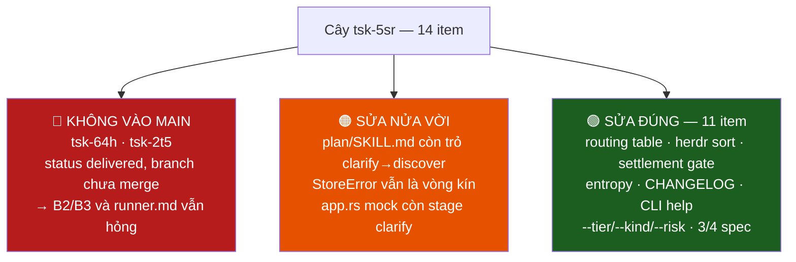
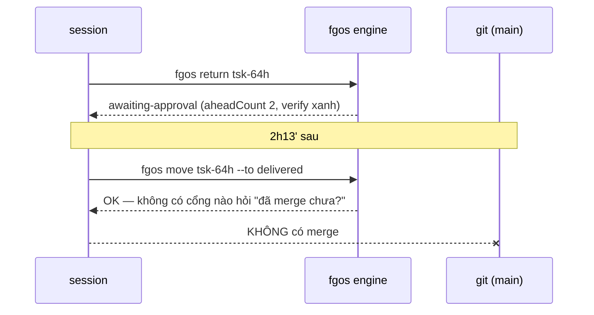
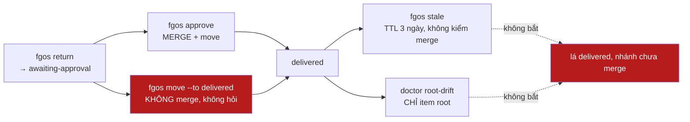

# Kiểm toán vòng 2 — cây `tsk-5sr` sau merge

**Ngày:** 2026-08-12 · **Nhánh:** `main` @ `f82786db` · **Phạm vi:** `tsk-5sr` +
9 con + 4 cháu dưới `tsk-5eq`, cộng `tsk-2mt` (vòng 1) và 7 item vừa submit.
**Xuất phát:** `docs/history/discover-stage-graph-and-skill-layering/FINDINGS.md`
(đã đọc, coi là giả thuyết cần kiểm chứ không phải kết luận).

---

## Tóm tắt 30 giây

Cây làm đúng phần lớn việc nó khai — **nhưng hai trong mười bốn item mang
status `delivered` mà nhánh của chúng CHƯA HỀ vào `main`**: `tsk-64h` và
`tsk-2t5`. Hệ quả: hai bất ổn vòng 1 xếp hạng cao nhất (B2 nguồn-sự-thật-đôi,
B3 bất biến stage) **chưa được sửa**, và spec `runner.md` vẫn nguyên bản cũ.
Nặng thêm: **lập luận `--acknowledge-iron-law` của `tsk-5sr` dẫn `tsk-64h` làm
một trong ba bằng chứng đỏ-trước — trong khi diff của `tsk-64h` không nằm
trong diff được approve.** Và đây **không phải lỗi mới**: `tsk-13z` đã ghi
đúng cơ chế này cho `tsk-4b2` từ 2026-08-10 và đang ở `cleanup`.

`npm test` xanh (2980/0/5 skipped). `cargo test -p herdr` xanh (129). Không có
regression.



---

## G1 🔴 Hai item `delivered` mà nội dung không có trên `main`

### Bằng chứng

```bash
$ for id in ...; do git merge-base --is-ancestor fgw/$id main; done
tsk-5sr MERGED   tsk-2el MERGED   tsk-3zi MERGED   tsk-31lz MERGED
tsk-64h NOT-MERGED ahead=2        tsk-2t3 MERGED   tsk-q88 MERGED
tsk-2so MERGED   tsk-19m MERGED   tsk-5eq MERGED   tsk-1uw MERGED
tsk-2t5 NOT-MERGED ahead=2        tsk-3j1 MERGED   tsk-1xn MERGED
tsk-2mt MERGED
```

Xác nhận ở mức nội dung, không chỉ mức commit:

| Item khai | Kiểm trên `main` | Kết quả |
|---|---|---|
| `tsk-64h` (1) `discover-pool` gọi `discoverableStages` | `src/state/discover-pool.mjs:26` | vẫn `const CANDIDATE_STAGES = new Set(['clarify','discovery','exploring'])` — **chưa sửa** |
| `tsk-64h` (2) doctor check bất biến stage | `grep -rn "unregistered-stage\|stage-vocabulary" src/ bin/ test/` | **0 kết quả** |
| `tsk-2t5` `runner.md` | verify string của chính item, chạy trên `main` | **FAIL 3/3** (`Quét làm-rõ trước dispatch (clarify sweep)` còn nguyên; 22 lần "clarify", 1 lần "planning") |

Mười một verify grep của các item còn lại **đều xanh** trên `main` (chạy lại
từng dòng, xem §"Đối chiếu từng item").

### Cách nó xảy ra

Cả hai đi `awaiting-approval → delivered` bằng `work.move` với `role: "human"`,
không có friction, không có merge commit. Đó là chữ ký của một `fgos move`
tay chứ không phải `fgos approve` (verb duy nhất merge nhánh).



`fgw/tsk-64h` xung đột **rất nhẹ** với `main` (một dòng `import` trong
`bin/fgos.mjs` do `tsk-19m` đổi, cộng `CHANGELOG.md`); `fgw/tsk-2t5` merge
**sạch hoàn toàn** (`git merge-tree` → 0 conflict). Nên đây không phải "không
merge được", mà là "không ai merge".

### Tiền lệ đã có item, đã đóng, và vừa tái diễn

`tsk-13z` — *"BUG: fgw/tsk-4b2's real content never reached main — marked
delivered via a manual status bypass"* — status `cleanup`, có cả thư mục
`docs/history/tsk-13z-land-tsk-4b2-on-main/`. Cùng cơ chế, cùng chữ ký sự
kiện, xảy ra 2026-08-10. Đợt này tái diễn **hai lần** và không ai nộp item.

### Vì sao không có gì báo động

| Cơ chế | Có bắt được không | Lý do |
|---|---|---|
| `fgos stale` → `postDelivery` | ❌ | ngưỡng 3 ngày (`deliveredMs: 259200000`), và chỉ báo "bị quên", không bao giờ kiểm merge state |
| `fgos doctor` → `root-drift` | ❌ | chỉ quét item **root** (đang báo tsk-4n7/5d4/2sj/51m); `tsk-64h`/`tsk-2t5` là **lá** |
| `fgos check` / `rollup` | ❌ | không có trục nào so `status` với reachability của nhánh |

**→ Xem B8 ở §"Bất ổn thiết kế" — đây là lỗ hổng cơ chế, không phải lỗi người làm.**

---

## G2 🔴 Lập luận `--acknowledge-iron-law` của `tsk-5sr` sai về chính diff nó approve

Merge commit `0c293249 Merge branch 'fgw/tsk-5sr'` mang vào đúng 16 commit:

```
46ef3124 tsk-3j1   c3eedadd tsk-1xn   27f99cc8 tsk-3j1   fd33f26c tsk-19m
52ac7ebb tsk-1xn   ab1dc027 tsk-19m   650c775b tsk-1uw   4a4b60ca tsk-1uw
9f26cf2c tsk-5eq   cefb0d6f (tsk-2so) a1abf10d tsk-q88   6a6dbf1e tsk-2el
2035ebc6 tsk-31lz  b124ed8a tsk-2t3   737b28d6 tsk-2t3   73aec03f tsk-3zi
```

Phủ **11 item**, không phải 13. **Không có một commit nào của `tsk-64h`** —
`git branch --contains a8728e2a` chỉ trả `fgw/tsk-64h`.

Lập luận được ghi lại là "diff gộp chỉ là union của ba con đã kiểm bằng chứng
đỏ-trước (`tsk-64h`, `tsk-2t3`, `tsk-19m`)". Một phần ba số bằng chứng đó
**không nằm trong diff**. Union thật thiếu `tsk-64h` và `tsk-2t5`.

Phụ chú về chính `tsk-5sr`: toàn bộ vòng đời của nó là **6 sự kiện**
(`add → doing → awaiting-approval → delivered`), `aheadCount: 0`,
`branchHeadAtReturn == branchHeadAtTake == 2b009efb`, **không có bản ghi
`work.gate-approve` nào**, `stage` không hề đổi (đứng `executing` từ đầu),
và **không có `docs/history/tsk-5sr/iron-law-evidence.md`**. Với cha gom con
thì `aheadCount 0` là hợp lý; nhưng nghĩa là dấu vết state của cha không ghi
lại được bất cứ điều gì về nội dung nó đang bảo lãnh.

---

## G3 🔴 `tsk-21f` (vừa submit) khẳng định một điều không đúng sự thật

Mô tả kết thúc bằng:

> *"Lưu ý item tsk-64h vừa merge đã thêm doctor check bắt item mở đứng ở stage
> không còn đăng ký, **nên nay có lưới đỡ ở tầng doctor**; vấn đề còn lại là
> hành vi câm của driver ngay lúc chạy."*

Không có lưới đỡ nào. `tsk-64h` chưa merge (G1). Câu này hạ mức khẩn của
`tsk-21f` xuống dựa trên một biện pháp không tồn tại — đúng loại sai lệch sẽ
khiến người đọc sau xếp nó xuống cuối hàng.

---

## G4 🟠 `tsk-2t5` — sản phẩm có thật, nhưng dấu vết thiếu che đúng chỗ

Chuỗi sự kiện đầy đủ (`.fgos/events.jsonl`):

```mermaid
gantt
    dateFormat HH:mm
    axisFormat %H:%M
    title tsk-2t5 — 2026-08-12 (UTC)
    section Claim 1
    doing                        :a1, 05:53, 40m
    return → awaiting-approval (2fb7ee2b, ahead=1) :milestone, 06:33, 0m
    section Ngoài claim
    commit ab24d0bb được tạo     :crit, a2, 06:34, 4m
    section Claim 2
    human withdraw → todo        :milestone, 06:38, 0m
    take (branchHeadAtTake = ab24d0bb) :a3, 06:38, 1m
    return --no-new-commits-ok (ahead=0) :milestone, 06:39, 0m
    move → delivered (KHÔNG merge) :crit, milestone, 06:49, 0m
```



- Sản phẩm **là thật**: `fgw/tsk-2t5` có 2 commit, commit thứ hai
  (`ab24d0bb docs: describe the entropy entry-stage signal by intent, not by
  literal`) xử lý đúng lý do rút lại mà người ghi trong `reason` của
  `work.move`.
- `--no-new-commits-ok` **giải thích được**: commit đã tồn tại **trước** lần
  claim thứ hai (`branchHeadAtTake == branchHeadAtReturn == ab24d0bb`), tức
  lần claim đó thật sự không sinh commit mới. Đây đúng là dấu vết mà `tsk-249`
  mô tả — mô tả của `tsk-249` chính xác.
- `stage` vẫn là `planning`, **không có `work.gate-approve` gate `planApprove`**
  — item nhảy `planning → awaiting-approval` không qua `executing`.
- **Cái mà dấu vết thiếu đang che, hoá ra không phải phần việc chưa làm — mà
  là phần việc đã làm rồi bị vứt đi.** Nội dung không bao giờ tới `main` (G1).

---

## G5 🟠 Sửa nửa vời — `plugins/fgOS/skills/plan/SKILL.md` sót lại đúng lỗi F1f

`tsk-2el` sửa `description` frontmatter của 5 skill (kiểm chứng: cả 5 đã sạch)
và thân bài `discover/SKILL.md` (`:43` nay ghi đúng *"`clarify` is NOT in the
set for coding"*). Nhưng **file anh em `plan/SKILL.md` không nằm trong danh
sách 19 file `tsk-2el` đụng tới**, và vẫn viết:

| Vị trí | Nội dung | Thật |
|---|---|---|
| `plan/SKILL.md:11-12` (**frontmatter** — vào listing mọi session) | "For an item at stage clarify, use /fgOS:discover instead." | `discoverableStages(coding)` = `['discovery','exploring']`, verb **từ chối** `clarify` |
| `plan/SKILL.md:37` (thân bài) | "Use `/fgOS:discover <id>` for a `clarify`-stage item instead" | như trên |

Nguyên nhân gốc: bảng F1f của vòng 1 liệt kê 5 skill và **không có `plan`**;
`tsk-2el` chép đúng danh sách đó vào mô tả rồi làm theo. Đây là lỗi kế thừa từ
phép liệt-kê-thủ-công, không phải cẩu thả khi thi công.

*(Cùng loại, nhẹ hơn: `plugins/fgOS/skills/pick/SKILL.md:169` còn "the driver's
own decompose pass".)*

---

## G6 🟠 Sửa nửa vời — vòng kín hai `StoreError` vẫn nguyên văn trên `main`

Vòng 1 vẽ vòng kín `discover → "dùng fgos plan" → plan → "dùng fgos discover"`.
`tsk-2so` sửa **chuỗi help/description** (`src/cli/command-registry.mjs`, kèm 3
drift guard trong `test/cli/command-registry.test.mjs` — làm tốt), nhưng
**chuỗi lỗi runtime thì không**:

```
bin/fgos.mjs:1214  discover: work "<id>" is at stage "<s>", not "discovery"/"exploring" -- use "fgos plan <id>" instead.
bin/fgos.mjs:1280  plan: work "<id>" is at stage "<s>", not "planning" (or legacy "decompose") -- use "fgos discover <id>" instead.
```

Hiện **latent**: không còn item nào ở `clarify` (kiểm bằng histogram stage trên
store thật — `discovery` 91, `executing` 301, `exploring` 9, `planning` 9,
`decompose` 8, `compound-learn` 158, **`clarify` 0**). Lưới đỡ đúng cho việc
tái diễn chính là doctor check của `tsk-64h` — chưa merge.

---

## G7 🟡 Sửa nửa vời — `herdr-plugin/src/app.rs` mock

`tsk-3zi` sửa `fgos.rs::doing_tier` hoàn chỉnh (`executing`=1,
`planning|decompose`=2, `exploring`=3, `discovery`=4) và đổi
`app.rs:517 stage:"decompose"` → `"planning"`. Nhưng **ngay trong cùng một
`vec!`**, `app.rs:529` vẫn là `stage: "clarify"` — trong khi doc comment mới
của chính `fgos.rs` viết *"`clarify` is not kept — that stage retired with its
items migrated off, so no item can hold it"*. Mock-only, ảnh hưởng thấp; nhưng
là đúng khuôn "sửa một dòng, bỏ dòng kề bên".

`cargo test --manifest-path herdr-plugin/Cargo.toml` → **129 passed**.

---

## G8 🟡 Spec mới có khớp code hiện tại không? — gần như có, ba chỗ lệch

Vòng 1 phát hiện spec nói dối. Bản mới **không nói dối kiểu cũ**: `work-state.md`
hạ `coverage: full → partial` (trung thực), `updated: 2026-08-12`, đổi tên mục
sang `Giai đoạn Soi-rõ (stage discovery) và Đào-sâu (stage exploring)` /
`Giai đoạn Lập-kế-hoạch (stage planning)`, và §"Chạy context-discovery
(discover)" mô tả đúng ba cạnh (`discovery→planning` clear,
`discovery→exploring` unclear, `exploring→planning`). Ba chỗ còn lệch:

| # | Vị trí | Vấn đề |
|---|---|---|
| 1 | `work-state.md:877-903` §discover | **Không hề nhắc** ba cờ `--tier/--kind/--risk` mà `tsk-19m` vừa thêm cho chính verb này, trong cùng cây |
| 2 | `work-state.md:1160` RUL60 | Vẫn khẳng định đường sản xuất phân loại còn sống *"đi qua `fgos edit` SAU `submit` (bước 6b)"* — sau `tsk-19m`, đường tương tác là chính verb `discover`. Câu đúng lúc viết, sai sau khi anh em merge |
| 3 | `work-state.md:250-252` | *"Cửa khai từ chối `stage: clarify` trên **bất kỳ item mới nào**"* — đúng cho `coding`, sai tuyệt đối: `DOMAINS['fixture-marketing'].stages = ["clarify","decompose","executing"]`, nên `validateWork` (`src/state/work.mjs:437`) vẫn nhận `clarify` cho domain đó |

**Không có mục nào là "nói dối kiểu khác"** theo nghĩa vòng 1 — đây là lệch do
thứ tự merge giữa anh em và một câu tổng quát hoá quá tay.

Ngoài ra `.claude/skills/fgos-routing/SKILL.md:160` viết *"the 90 items open on
it at rename time were **migrated off for real**"*. Log thật đếm được **85**
sự kiện `work.stage {from:clarify, to:discovery, role:system}` trên 85 id phân
biệt. Con số 90 là **đếm trước migration** trong `RESEARCH.md`, không phải kết
quả migration. Lỗi có sẵn (`workflow-stage-graphs.mjs:82` đã ghi 90 từ trước);
`tsk-2el` chép tiếp chứ không tạo ra.

*(Điểm SẠCH đáng ghi: `fgos-coding-driving/SKILL.md:373` mô tả discover-pool là
"its candidate set is `discovery`/`exploring` plus a **now-dead `clarify`
entry**" — câu này **đúng** trên `main` chính vì `tsk-64h` chưa merge. Nếu
`tsk-64h` merge thì câu này thành sai. Một cặp prose/code sẽ lệch ngay khi ai đó
land `tsk-64h`.)*

---

## G9 🟢 Bác bỏ / xác nhận các nghi ngờ của vòng 1

| Nghi ngờ | Kiểm bằng | Phán |
|---|---|---|
| Bảng route `fgos-routing` còn dạy `discovery → fgos-researching` (F1d) | đọc `SKILL.md:143-152` | **ĐÃ SỬA** — `discovery → fgos-coding-discovering`, có dòng `planning` (tách shaping/proving), có dòng `decompose` legacy, có đoạn giải thích `clarify` không còn là stage. Bảng còn dạy tra registry bằng lệnh `node -e` thay vì tin bảng |
| 3 item kẹt ở `clarify` (F1) | histogram stage trên store thật | **ĐÃ VÉT** — 0 item ở `clarify` |
| Settlement `clarify-pass` giả khi unclear (F1c) | `git show 2035ebc6 -- src/state/replay.mjs` | **ĐÃ SỬA ĐÚNG** — gác trên `view.discovery?.[id]?.at(-1)?.clear !== false`, cố ý không dùng `to !== 'exploring'` (giữ RUL27), cố ý không thêm payload field mới (replay là fold thuần) — lập luận được ghi trong comment 28 dòng, có test |
| Entropy đếm stage chết (F5) | `src/report/entropy.mjs:126+` | **ĐÃ SỬA** — `countStageEntry` resolve `stages[0]` theo domain của từng item, không hardcode |
| `AGENTS.md`/`CLAUDE.md` gọi tên skill chết (F3) | verify grep của `tsk-2el` | **ĐÃ SỬA** — 3/3 xanh |
| `.agents/skills` lệch `.claude/skills` | `diff -rq` | **KHỚP** (chỉ dư `.claude/skills/gitnexus`, do công cụ ngoài, không thuộc cây) |
| 7 file `docs/how-to` cần đổi tên (hành động #12) | `plan.md:93-106` | **CỐ Ý KHÔNG LÀM, có lập luận** — thật ra là **10 file** (cây tự sửa số của vòng 1); đổi tên sẽ cắt vĩnh viễn `sourceCaptureId` (`enduser-index.mjs:72-79`) vì nó khớp `docPath` chính xác trên log append-only, `fgos docs-index` không vá lại được. 9/10 file đang giữ back-link sống. **Đây là quyết định đúng, không phải phát hiện bị rơi** |

---

## Q4 — Regression?

```
npm test        → tests 2985 · pass 2980 · fail 0 · skipped 5 · exit 0 · 70.0s
cargo test -p herdr-fgos → 129 passed (4 suites)
```

**Không có regression.** Không cần phân biệt flake vì không có test nào đỏ.

### Phán lại hai lần tự-gỡ-block

**`tsk-31lz` — bằng chứng ĐỦ. Giữ nguyên kết luận.**
Kiểm độc lập: test hỏng là `porting-store.test.mjs` (`addPorting under
concurrent OS processes racing the SAME id`); diff của `tsk-31lz`
(`git show 2035ebc6 --stat`) chỉ chạm `replay.mjs`, `discovery.mjs`,
`CHANGELOG.md`, `work-state.md` + 2 file test — không dính porting. Hôm nay,
với thay đổi đó đã trên `main`, suite xanh. Đây là flake thật, không phải
regression. Có item riêng cho nó (`tsk-597`), và có item root-cause đã đóng
(`tsk-1jp`: `porting-store.mjs` làm read-check-append NGOÀI events lock).

**`tsk-2t3` — bằng chứng KHÔNG ĐỦ tại thời điểm đó. Kết luận đúng, phương pháp sai.**
Đọc nguyên văn rationale: phép tái hiện chạy trong worktree tạm **không có
`node_modules`** và fail với `ERR_MODULE_NOT_FOUND` cho package `yaml`. Tức
phép tái hiện **chưa bao giờ tái hiện được một lượt sạch** — nó không thể phân
biệt flake với regression. Phần còn lại của lập luận là **suy loại** từ
`tsk-31lz` ("cùng điều kiện đã làm tsk-31lz flake trước đó") cộng một giả định
về tải máy không đo được. Chính rationale tự thú nhận: *"giữ nguyên output để
đọc lỗi thật nếu còn hỏng"* — tức lần hỏng đầu **không có output để đọc**.
Kết quả cuối đúng (nội dung đã trên `main`, suite xanh, `entropy.test.mjs`
pass), nhưng theo luật `feedback_fgos_move_exception_for_verified_flake` thì
lần tự-gỡ-block này chưa đạt ngưỡng "đã xác nhận là flake thật".

---

## Q5 — Bảy item vừa submit

| Item | Trạng thái | Trùng lặp | Mô tả có đúng sự thật? |
|---|---|---|---|
| `tsk-1y0` worktree-isolation per-session | todo | không thấy trùng | ✅ khớp cảnh báo môi trường của chính phiên này |
| `tsk-kv3` approve/sync-root đòi cây sạch | awaiting-human | **chồng lấn** `tsk-66t`, `tsk-4s0`, và đang được `tsk-51m` shaping gom | ✅ |
| `tsk-1zd` merge next nghẽn đầu hàng | wontfix | **đã hấp thụ đúng** — `tsk-xyr` ghi rõ *"HẤP THỤ tsk-1zd (D6)"* | ✅ đóng đúng |
| `tsk-4gr` cổng auto-approve khớp chuỗi | todo | **VẾ (3) TRÙNG THẲNG `tsk-5ea`** (open, todo): cùng một `hasOpenItems` `/\b(TODO\|FIXME)\b/i` | ✅ cả 3 vế kiểm chứng được: `gate-bypass.mjs:132` dùng `matchesKeyword` (đã qua `tsk-1gj`), nên `AUDIT.md` khớp `\baudit\b` là hệ quả **mới** của biên-từ, không phải lỗi cũ |
| `tsk-21f` driver báo câm | todo | không trùng | ❌ **SAI** — xem G3 |
| `tsk-597` porting-store flake | todo | **root cause đã có item**: `tsk-1jp`; cùng lớp: `tsk-3wn` (events.test.mjs), `tsk-1u7` (session.test.mjs) → **4 item cho một lớp lỗi** | ✅ |
| `tsk-249` return nhận item stage chưa tiến | todo | không trùng | ✅ kiểm chứng lại đúng từng chi tiết trên `tsk-2t5` (G4) |

**Chất lượng chung:** cả bảy đều mang `verify` placeholder; sáu mang đúng chuỗi
mà code tự đặt tên là `RETIRED_P14_PLACEHOLDER` (`discovery.mjs:84` ↔
`bin/fgos.mjs:83 SUBMIT_VERIFY_SENTINEL` — hai bản sao của một literal, có
comment thừa nhận). Ba item bị submit gán `risk: heavy` từ đếm từ khoá
(`tsk-4gr`, `tsk-21f`, `tsk-249`) — sẽ phải chờ `discovery` phán lại theo D12.

### Bug đã quan sát được mà CHƯA ai nộp

**`tsk-64h` và `tsk-2t5` `delivered` nhưng chưa merge (G1).** Đây là lỗi
nghiêm trọng nhất của cả đợt, đã có tiền lệ có item (`tsk-13z`), và không nằm
trong bảy item vừa nộp.

---

## Q6 — Bốn bất ổn vòng 1 chưa sửa: còn đúng không?

| | Trạng thái | Bằng chứng |
|---|---|---|
| **B1** migration chạy trước merge | **CÒN NGUYÊN** | `grep -rn "migrat" src/runner/merge.mjs src/setup/ bin/fgos.mjs` → 0. `scripts/migrate-clarify-split.mjs` vẫn là script chạy tay |
| **B4** `.fgos` git-track → phantom store | **CÒN NGUYÊN** | `git ls-files .fgos` → 8 file tracked (gồm `events.jsonl`); `bin/fgos.mjs:92-103 dataDir()` vẫn `resolveFgosDir(process.cwd(), { strict: true })` |
| **B5** spec/prose không phải artifact bắt buộc | **GẦN NHƯ CÒN NGUYÊN** | Mảnh vá duy nhất là `test/cli/command-registry.test.mjs` của `tsk-2so` (3 test đối chiếu prose với live source) — **chỉ phủ `src/cli/command-registry.mjs`**. Không có gì kiểm `docs/specs/**` hay `.claude/skills/**`. Doctor check của `tsk-64h` phủ chiều *state*, và chưa merge |
| **B6** `npm test` mù với Rust + prose | **CÒN NGUYÊN Ở TẦNG GATE** | `package.json`: `"test": "node --test 'test/**/*.test.mjs'"` — không có `cargo`. `tsk-3zi` tự đặt `cargo test --manifest-path herdr-plugin/Cargo.toml` vào `verify` **của riêng nó** (kỷ luật cá nhân, không phải cổng); `tsk-2so` tự viết drift guard (kỷ luật cá nhân). Cả hai là tiền lệ tốt, không phải cơ chế |

---

## Bất ổn thiết kế cần raise

### B8 🔴 MỚI — `delivered` không hàm ý "đã merge", và không cơ chế nào kiểm



Ba chân của lỗ hổng: (1) `move` nhận `awaiting-approval → delivered` không đòi
bằng chứng merge; (2) không verb/advisory nào so `status: delivered` với
`git merge-base --is-ancestor fgw/<id> main`; (3) `stale` đợi 3 ngày rồi báo
sai thứ ("bị quên", không phải "chưa merge"). **Ba lần xảy ra: `tsk-4b2`
(2026-08-10), `tsk-64h`, `tsk-2t5` (2026-08-12).**

Hướng rẻ nhất, cùng khuôn B3: một doctor check
`delivered-item-not-on-trunk` — với mọi item `status ∈ {delivered,
retrospective, cleanup, done}` có nhánh `fgw/<id>` tồn tại, kiểm reachability
từ `main`. Đây là phép kiểm **cơ học, không cần LLM, không có false negative**,
và nó sẽ bắt cả ba ca trên ngay ngày chúng xảy ra. Đòn bẩy cao hơn B3 vì mất
mát ở đây là **mất việc đã làm xong**, không chỉ mất tín hiệu.

### B9 🟠 MỚI — Cây cha bảo lãnh Iron Law cho một union nó không tự kiểm được

`tsk-5sr` được approve bằng lập luận "diff cha = union các con đã kiểm". Không
có gì trong engine ràng buộc mệnh đề đó: cha có thể được approve với **bất kỳ**
tập con nào đã thật sự merge vào nhánh cha, và người approve phải tự đối chiếu
bằng mắt. Ở đây phép đối chiếu sai một phần ba (G2) và không ai phát hiện.

Hướng: khi approve một item có con, in ra bảng "con nào đã có commit trong
nhánh này / con nào ở `delivered` nhưng vắng mặt" trước khi hỏi ack — dữ liệu
đã có sẵn (`parent` trong state, `git branch --contains`), chỉ là chưa ai trình
ra đúng lúc.

### B10 🟡 MỚI — Phép liệt-kê-thủ-công là cách phát hiện rơi

`F1f` liệt 5 skill → `tsk-2el` sửa đúng 5 → `plan/SKILL.md` sót (G5). Cùng
khuôn: `F2` nói "7 file how-to", thật ra 10 (cây tự sửa được vì nó đi đếm lại).
Chừng nào một phát hiện được chuyển thành *danh sách file* thay vì *vị từ chạy
được*, phần sót sẽ bằng đúng phần người viết bảng bỏ quên. `tsk-2so` là ví dụ
làm đúng: nó biến phát hiện thành 3 drift guard chạy trên live source, nên
không phụ thuộc vào bảng.

### Ngoài phạm vi — `fgos doctor` đỏ 7/18

`shell-integration-sourced`, `config-not-stale`, `root-drift`,
`invariant-checks-configured`, `gate-bypass-configured`,
`herdr-launcher-configured`, `enduser-docs-index-stale`.

Đáng chú ý: `gateBypass.level` **vẫn thiếu** — vòng 1 đã ghi, và đó chính là
thứ cây này dựa vào để auto-approve các gate. `root-drift` đang báo 4 root
lệch (`tsk-4n7` +4, `tsk-5d4` +2, `tsk-2sj` +13, `tsk-51m` +13).

---

## Đối chiếu từng item — chạy lại verify của chính nó trên `main`

| Item | Verify (phần grep) | Kết quả |
|---|---|---|
| `tsk-2el` | `grep -q fgos-coding-discovering .claude/skills/fgos-routing/SKILL.md` · `! grep -q fgos-code-implement CLAUDE.md` · `! grep -q fgos-exploring AGENTS.md` | ✅ 3/3 |
| `tsk-3zi` | `grep -q planning herdr-plugin/src/fgos.rs` + `cargo test` | ✅ (129 passed) |
| `tsk-31lz` | `npm test` | ✅ |
| **`tsk-64h`** | `npm test` (verify không phân biệt được) | ⚠️ xanh nhưng **code không có trên `main`** |
| `tsk-2t3` | `npm test` | ✅ |
| `tsk-q88` | `grep -q exploring CHANGELOG.md` | ✅ |
| `tsk-2so` | `! grep -q judgeDiscovery src/cli/command-registry.mjs` | ✅ |
| `tsk-19m` | `npm test` | ✅ (`assertCallerClassification` tại `discovery.mjs:214`, cờ CLI + 84 dòng test) |
| `tsk-5eq` | `grep -q planning docs/specs/work-state.md` | ✅ |
| `tsk-1uw` | 3 vế | ✅ 3/3 |
| **`tsk-2t5`** | 3 vế | ❌ **0/3** |
| `tsk-3j1` | 4 vế | ✅ 4/4 |
| `tsk-1xn` | 3 vế | ✅ 3/3 |
| `tsk-2mt` | nội dung mang vào `main` | ✅ merge `292b428f` = đúng 1 file, `FINDINGS.md` 764 dòng, khớp khai báo. Return ghi `aheadCount: 67` (không phải 0) |

---

## Việc nên làm tiếp, theo đòn bẩy

| # | Việc | Vì sao trước |
|---|---|---|
| 1 | **Land `fgw/tsk-2t5`** (merge sạch, 0 conflict) và **`fgw/tsk-64h`** (1 conflict import + CHANGELOG) | việc đã làm xong đang nằm ngoài `main`; `tsk-64h` mang cả B2 lẫn B3 |
| 2 | Doctor check `delivered-item-not-on-trunk` (B8) | cơ học, không false-negative, bắt cả 3 ca đã xảy ra |
| 3 | Sửa mô tả `tsk-21f` (bỏ câu về lưới đỡ doctor) | đang nói dối về biện pháp bảo vệ |
| 4 | Gộp `tsk-4gr` vế (3) với `tsk-5ea`; gộp `tsk-597` dưới `tsk-1jp` | 4 item cho 1 lớp flake, 2 item cho 1 dòng regex |
| 5 | `plan/SKILL.md` frontmatter + `:37`; `pick/SKILL.md:169` (G5) | frontmatter vào listing **mọi** session |
| 6 | Hai `StoreError` `bin/fgos.mjs:1214/1280` (G6) | latent hôm nay, chỉ vì pool đang rỗng |
| 7 | Ba chỗ lệch spec (G8) + `app.rs:529` (G7) | nhỏ |
| 8 | Bảng con-đã-merge lúc approve cha (B9) | chặn G2 tái diễn |

---

## Câu chưa trả lời được

1. **Vì sao `fgos approve` không được gọi cho `tsk-64h`/`tsk-2t5`?** Log chỉ
   ghi kết quả (`work.move` role human), không ghi verb nào đã chạy. Không có
   friction, không có `invocation-faults` tương ứng. Có thể là người gõ nhầm
   `move` thay `approve`, có thể là một vòng merge bỏ sót — không phân biệt
   được bằng dữ liệu hiện có.
2. **`tsk-5sr` được approve bằng cờ gì?** Không có `work.gate-approve` nào và
   không có `docs/history/tsk-5sr/iron-law-evidence.md`; chỉ suy được từ merge
   commit `0c293249` rằng approve đã chạy thật.
3. Con số **90 vs 85** item migration: 90 là đếm trước migration; 85 là số
   event thật. 5 item chênh lệch đi đâu — chưa truy.
