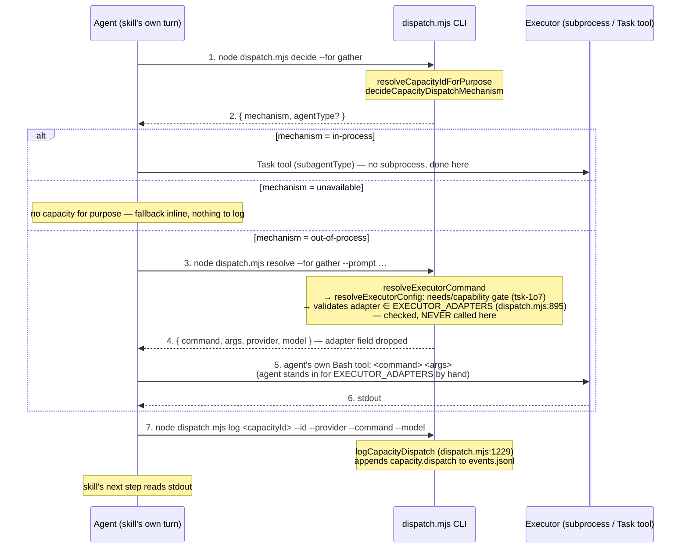
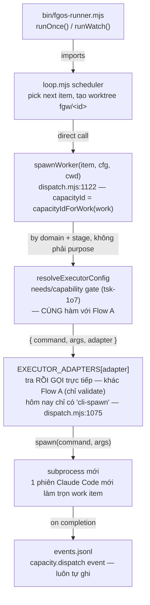
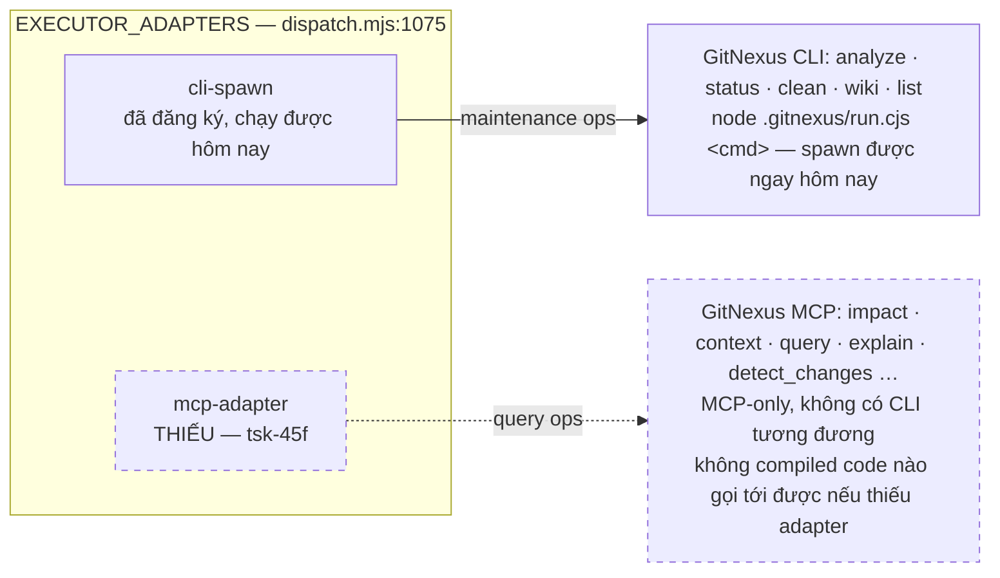
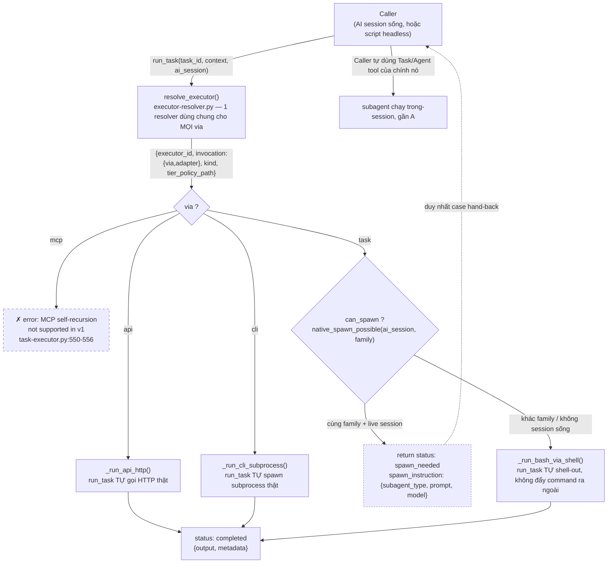

# Capacity dispatch, two ways

`forgentX` · `src/runner/dispatch.mjs` · Q&A ngày 2026-08-13

fgOS có đúng 1 cách để resolve 1 `capacity` ra 1 backend thật — nhưng 2 caller khác nhau đi vào nó theo 2 đường cấu trúc khác hẳn nhau. Đây là trace cả 2, tới tận file:line.

- **Flow A** — 1 skill (prose) dispatch 1 capacity
- **Flow B** — `fgos-runner` dispatch 1 capacity
- **Shared kernel** — `resolveExecutorConfig`
- **Gap còn mở** — chưa có MCP adapter (`tsk-45f`)

---

## Cái cả 2 luồng dùng chung

Mọi thứ dưới đây cuối cùng đều gọi vào `resolveExecutorConfig` (`dispatch.mjs:674`). Nó resolve `capacities.<id>` trước `executors.<tier>` trước `executor` global, và — khi capacity khai `needs: "<capability>"` — gate trên presence của capability đó trong tool-registry (`tsk-1o7`) trước khi trả bất cứ gì. Đây là đúng compiled check mà `fgos tool query` expose ra ngoài; 1 capacity cần 1 tool đang thiếu sẽ không bao giờ tới được bước spawn.

---

## Flow A — agent-mediated

### 1 skill dispatch 1 capacity

Skill không có entry point compiled nào vào dispatch — nó chỉ có thể bảo agent, bằng prose, tự chạy CLI. Agent tự đi 2 vòng round-trip và tự quyết định làm gì với từng câu trả lời.



*Fig. 1 — Flow A đầy đủ cho case out-of-process (đường dài nhất). `in-process` và `unavailable` thoát sớm ở nhánh. `EXECUTOR_ADAPTERS` được `resolveExecutorCommand` tra để validate tên adapter có tồn tại không — KHÔNG bao giờ được gọi ở luồng này; `resolveCapacityCli` cũng drop hẳn field `adapter` trước khi trả JSON, nên agent còn không biết tên adapter là gì. **Đính chính** so bản trước: event AUDIT CÓ được ghi ở luồng này — `fgos-researching/SKILL.md` tự bảo agent chạy thêm bước 7 (`dispatch.mjs log`) cho cả 2 nhánh in-process/out-of-process — nhưng chỉ vì prose skill nói vậy và agent tuân theo, không có gì bắt buộc bằng code.*

### Các bước

1. **Decide.** Skill prose bảo agent chạy `node src/runner/dispatch.mjs decide --for <purpose>`. Vào `decideCapacityCli` (`dispatch.mjs:1313`), resolve capacity theo **purpose** — `resolveCapacityIdForPurpose` (`dispatch.mjs:666`) quét `cfg.capacities` tìm entry đầu tiên có `for` khớp purpose (hôm nay: `gather` hoặc `judge`, `CAPACITY_PURPOSES` tại `dispatch.mjs:406`).
2. **Đọc mechanism.** CLI trả `{"mechanism": "in-process" | "out-of-process" | "unavailable", "agentType"?}`. Agent — không phải code compiled nào — tự quyết bước tiếp.
3. **Resolve, nếu out-of-process.** Agent chạy `node src/runner/dispatch.mjs resolve --for <purpose> --prompt "…"`, vào `resolveCapacityCli` (`dispatch.mjs:1236`), gọi `resolveExecutorCommand` → `resolveExecutorConfig` — kernel dùng chung, kèm gate `needs`/capability.
4. **EXECUTOR_ADAPTERS được check, không được gọi.** Vẫn trong `resolveExecutorCommand` (`dispatch.mjs:895`): tên adapter được tra trong `EXECUTOR_ADAPTERS`, phải tồn tại nếu không sẽ throw — nhưng hàm adapter KHÔNG bao giờ được gọi ở đây, và `resolveCapacityCli` còn drop field `adapter` trước khi trả (chỉ destructure `{command, args, provider}`).
5. **Tự thực thi.** CLI trả `{command, args, provider, model}` dạng JSON. Agent tự chạy lệnh đó qua chính Bash tool của nó — tự đóng vai adapter bằng tay — tự đọc stdout vào context của mình.
6. **Log — tường minh.** `fgos-researching/SKILL.md` tự bảo agent chạy thêm 1 lệnh CLI thứ 3, `node dispatch.mjs log <capacityId> --id … --provider … --command … --model …`, cho cả 2 nhánh in-process/out-of-process. Vào `logCapacityDispatch` (`dispatch.mjs:1229`), có ghi event `capacity.dispatch` thật — audit trail tồn tại, nhưng chỉ vì prose skill nói vậy và agent tuân theo, không có code nào bắt buộc.

| Bước | Hàm | Vị trí |
|---|---|---|
| capacity → purpose match | `resolveCapacityIdForPurpose` | `dispatch.mjs:666` |
| adapter được validate, không invoke | EXECUTOR_ADAPTERS membership check | `dispatch.mjs:895` (trong resolveExecutorCommand) |
| decide subcommand | `decideCapacityCli` | `dispatch.mjs:1313` |
| resolve subcommand | `resolveCapacityCli` | `dispatch.mjs:1236` |
| shared kernel + gate | `resolveExecutorConfig` | `dispatch.mjs:674`, gate ở 600–613 |
| log subcommand (audit, opt-in qua prose) | `logCapacityDispatch` | `dispatch.mjs:1229`, wire ở CLI entry point ~1385 |

---

## Flow B — compiled

### `fgos-runner` dispatch 1 capacity

Không prose, không round-trip, không phán đoán của agent. `fgos-runner` là 1 binary riêng, import thẳng scheduler và gọi thẳng vào cùng 1 kernel như 1 lời gọi hàm bình thường.



*Fig. 2 — Flow B là 1 pipeline 1 chiều: mọi mũi tên là 1 lời gọi hàm thật, không phải 1 message mà agent có thể đọc sai hay bỏ qua.*

### Các bước

1. **Daemon khởi động.** `bin/fgos-runner.mjs` là binary riêng (package.json's `bin.fgos-runner`), import thẳng `runOnce`/`runWatch` từ `src/runner/loop.mjs`.
2. **Scheduler tự chọn việc.** Logic của `loop.mjs` — không phải LLM — tự chọn item kế tiếp, tự dựng dispatch worktree.
3. **spawnWorker chạy trong-process.** `loop.mjs:801` và `:1188` gọi thẳng `spawnWorker(item, config, wt.path, opts)` — 1 lời gọi hàm, không phải CLI subprocess.
4. **Capacity resolve theo hình dạng, không theo purpose.** `capacityIdForWork(work)` (`dispatch.mjs:1090`) map domain + stage `executing` của work item ra 1 capacity id qua `skillForStage` — khác cách lookup của Flow A, cùng kernel phía sau.
5. **Cùng gate, cùng kernel.** `resolveExecutorCommand` → `resolveExecutorConfig` — y hệt hàm của Flow A, kể cả check `needs`/capability.
6. **Adapter tự spawn thật.** `EXECUTOR_ADAPTERS[adapter]` được tra và gọi thẳng; hôm nay luôn là `cliSpawnAdapter`, vì đó là adapter duy nhất đăng ký.
7. **Audit tự ghi.** `loop.mjs` tự append 1 event `capacity.dispatch` vào `.fgos/events.jsonl` qua cùng hàng đợi one-door-write mọi state khác dùng — xảy ra dù có ai theo dõi hay không.

| Bước | Hàm | Vị trí |
|---|---|---|
| worker spawn call site | `spawnWorker(...)` | `loop.mjs:801`, `:1188` |
| worker body | `spawnWorker` | `dispatch.mjs:1122` |
| capacity → work-shape match | `capacityIdForWork` | `dispatch.mjs:1090` |
| shared kernel + gate | `resolveExecutorConfig` | `dispatch.mjs:674`, gate ở 600–613 |
| adapter registry | `EXECUTOR_ADAPTERS` | `dispatch.mjs:1075` |

---

## Cùng kernel, khác mọi thứ còn lại

| | Flow A — skill | Flow B — fgos-runner |
|---|---|---|
| **Trigger** | Agent đọc prose, tự quyết định shell out | Scheduler tự chọn item theo nhịp riêng |
| **Capacity lookup** | Match theo `for`/purpose (`gather`, `judge`) | Match theo `domain` + stage `executing` |
| **Round trip** | 2 — `decide` rồi `resolve`, agent tự đọc từng cái | 0 — 1 chuỗi gọi hàm trong-process, từ đầu tới cuối |
| **Ai thực thi lệnh** | Bash tool của chính agent, thủ công | Chính hàm adapter |
| **Audit trail** | Có ghi, nhưng opt-in — 1 lệnh CLI thứ 3 (`log`) mà skill's prose phải tự bảo và agent phải tự tuân theo | Event `capacity.dispatch`, luôn luôn, code tự ghi |

---

## Chỗ shared kernel hết giúp được

Cả 2 luồng hội tụ vào `EXECUTOR_ADAPTERS` — nhưng registry đó hôm nay chỉ biết đúng 1 hình adapter, và nó giả định luôn có 1 process ngoài để spawn.



*Fig. 3 — CLI riêng của GitNexus chỉ phủ maintenance index; bề mặt query mà cả 2 luồng cần cho compiled cross-check chỉ tồn tại qua MCP.*

**Ý nghĩa thực tế:** 1 capacity auto-refresh (`analyze`/`status`/`clean`) làm được ngay hôm nay, 0 code mới ngoài 1 entry `capacities.<id>` — `cli-spawn` đã đủ dùng. 1 compiled cross-check trên kết quả "0 impacted" đáng ngờ của `impact()` thì KHÔNG — cần đúng adapter chưa tồn tại.

---

## Đối chiếu: marketing-cockpit giải bài toán này ra sao

`marketing-cockpit` (`upstreams/marketing-cockpit`, framework `.fgOS/` riêng — cùng gốc tên, khác dòng máu code với forgentX) là nguồn prior-art thật đứng sau vocab `adapter`/`kind: agent|tool` mà fgOS mượn (ADR 0042, `docs/07-decisions/0042-task-first-routing-and-executor-kinds.md`). Đọc thẳng code thật của họ — không phải qua bản tóm tắt distillery — lộ ra 1 khác biệt kiến trúc đáng kể so với fgOS.

### Cơ chế thật

**1 điểm resolve, không tách 2 luồng như fgOS.** `.fgOS/runtime/scripts/lib/executor-resolver.py`'s `resolve_executor()` gộp cả việc `resolveExecutorConfig` + `resolveExecutorCommand` làm: đọc `stage.task` → task artifact (`.fgOS/tasks/{id}.yaml`) → `preferred_executor` (hoặc fallback theo `capability-routing.yaml`) → chọn `invocation_paths[via=X]` → trả **nguyên cục** `{executor_id, interface, invocation: {via, adapter, ...}, tier_policy_path, kind, timeout_sec, reason}`.

**Khác biệt cốt lõi: họ không bao giờ drop field `adapter`.** Không có caller "thin" nào giống `resolveCapacityCli` của fgOS chỉ lấy `{command, args, provider}` rồi bỏ phần còn lại — `task-executor.py`'s `run_task()` luôn trả `invocation: {via, adapter}` đầy đủ (dòng 546) cho mọi caller.

**`run_task()` tự thực thi trong hầu hết case, chỉ hand-back đúng 1 case duy nhất** (`task-executor.py:550-611`):
- `via=mcp` → **từ chối tường minh, chưa support v1**: `"MCP self-recursion not supported in v1: use via=cli or via=task instead"` — lý do: chính server MCP nội bộ của họ (`.fgOS/runtime/scripts/mcp/server.py`) expose `run_task` ra ngoài; nếu 1 task lại `via=mcp` gọi ngược vào đúng server đó → đệ quy vô hạn.
- `via=api` → tự gọi HTTP thật (`_run_api_http`), tự trả kết quả.
- `via=cli` → tự spawn subprocess thật (`_run_cli_subprocess`), tự trả kết quả.
- `via=task` — **chỉ case này mới hand-back**, có điều kiện rõ: `can_spawn = native_spawn_possible(ai_session, executor_family)`. Cùng family (Claude gọi Claude) + có live AI session → trả `spawn_instruction` để AI session tự dùng Task tool của chính nó (khớp `in-process` của Flow A fgOS). Khác family hoặc không có session sống → `run_task()` **tự** `_run_bash_via_shell` — không đẩy raw command ra ngoài cho ai đó tự đoán cách chạy như Flow A đang làm.



*Fig. 4 — `run_task()` của marketing-cockpit: 1 hàm duy nhất, tự thực thi 3/4 nhánh (`api`/`cli`/`task`-khác-family), chỉ hand-back đúng 1 nhánh (`task`-cùng-family-có-session, nét đứt) — và từ chối tường minh nhánh `mcp` thay vì lặng im. So với fgOS: không có caller "thin" nào giống `resolveCapacityCli` bỏ bớt field `adapter`.*

### Ai đang gọi `run_task()`/`run_workflow()` thật, và gọi ra sao

`run_task()` không tự đứng một mình — grep thẳng repo ra đúng 3 caller thật (`task-executor.py` chỉ định nghĩa, không tự gọi chính nó):

| Caller | File | Ai dùng | Gọi cụ thể |
|---|---|---|---|
| MCP tool `fgos.run_task` | `mcp/tools/run_task.py:76` | AI session sống, qua MCP protocol | `_handle(arguments)` forward thẳng `task_executor.run_task(task_id, context, ai_session, timeout_sec)` — "thin facade", 0 logic riêng, input schema validate `task_id` required, `ai_session` enum `claude\|codex\|agy\|openai` |
| CLI `fgos run-task` | `cli/fgos.py:150-168` (`cmd_run_task`) | Agent tự gõ qua Bash, hoặc script | `fgos run-task <task_id> --context '<json>' [--brand] [--ai-session] [--background] [--timeout N] [--pretty]` → gọi thẳng `te.run_task(...)`, in kết quả JSON ra stdout, `exit 2` nếu `status: error` |
| `workflow-executor.py`'s `_execute_stage()` | `workflow-executor.py:476-557`, gọi từ vòng lặp trong `run_workflow()` (dòng 914+) | Engine tự lặp — KHÔNG phải agent tự loop từng stage | `run_workflow()` gọi `_execute_stage()` cho TỪNG stage trong workflow, tự động, tuần tự — invoke qua CLI `fgos run-workflow <workflow_id> ...` (`cmd_run_workflow`, cùng file `cli/fgos.py`) |

**Điểm hay nhất: cơ chế pause-and-resume ở mức workflow, không phải ở mức từng lệnh gọi.** `run_workflow()`'s docstring (dòng 929): *"sync: If True (default), block until completion or first spawn_pending."* — vòng lặp qua các stage (dòng 1094): `if any_error or any_spawn_pending: break`. Tức: engine tự động chạy LIÊN TỤC qua mọi stage tự thực thi được (`cli`/`api`/`task`-khác-family) — không cần agent giục từng bước — nhưng **dừng cứng ngay khi gặp 1 stage cần native spawn cùng-family** (`run_state["status"] = "in_progress"`, checkpoint xuống đĩa), trả quyền lại cho đúng AI session đã gọi `fgos run-workflow` từ đầu. Session đó tự spawn subagent bằng Task tool của chính nó, rồi gọi lại `fgos run-workflow` (idempotent resume — stage đã `completed`/`spawn_pending` bị skip, dòng 501) để chạy tiếp từ stage kế.

### Cú pháp dispatch cụ thể (executor dispatch — ADR 0042)

4 cách gọi thật, tuỳ `next_stage_interface` đọc từ `run.yaml` (`.fgOS/skills/fg-mkt/SKILL.md` Step 3, dòng 159-163):

| `interface` | Ai thực thi | Cú pháp thật |
|---|---|---|
| `cli` / `api` | Python runtime tự dispatch, KHÔNG cần AI session | CLI: `python3 .fgOS/runtime/scripts/cli/fgos.py run-task <task_id> --context '<json>' [--brand <id>] [--ai-session claude\|codex\|agy\|gemini] [--timeout <sec>] [--pretty]` (`cli/fgos.py:1521-1534`) — hoặc MCP tool `fgos.run_task(task_id, context?, ai_session?, timeout_sec?)` (`mcp/tools/run_task.py:76`, thin facade forward thẳng `task_executor.run_task()`) |
| `task` (cùng family + session sống) | Agent tự dùng native subagent tool của chính nó | `Task(subagent_type="<agent>", prompt=<nội dung .claude/agents/{agent}.md> + "\n\n## Task\n<mô tả stage>")` — vd thật: `Task(subagent_type="creative-director", prompt=<.claude/agents/creative-director.md> + task instructions)`, đúng Stage 2 của workflow `brand-identity-build` |
| `mcp` | Agent tự gọi MCP tool đích **trực tiếp**, KHÔNG qua `run_task()` | Native MCP tool call của chính session (y hệt cách gọi `mcp__gitnexus__impact` trong phiên này) — `run_task()`/`task-executor.py` hoàn toàn không tham gia đường này |

**Đây từng là gánh nặng thủ công thật, mới được dọn sạch gần đây.** ADR 0050's "Gap A" tự ghi: trước ADR này, việc loop qua nhiều slot (vd batch social-production) là **"agent-driven": AI agent tự lặp danh sách slot, tự gọi `run-init.py` mỗi slot, tự nhớ đã xử lý slot nào** — không có checkpoint, agent bị ngắt giữa chừng là dễ tạo trùng lặp. `loop-dispatcher.py`/`batch-dispatch.py` (ADR 0050/0051) sinh ra đúng để dời phần LOOP đó từ trí nhớ agent vào code compiled — cùng bài học fgOS đang đối mặt với Flow A's "agent phải tự nhớ log" hôm nay.

**Doctor check mirror `probeTool` nhưng đơn giản hơn** (`doctor_executors.py`): chỉ `shutil.which(binary)` — thiếu = WARN không FAIL (cùng doctrine "absent = clean degrade"), nhưng **không có khái niệm staleness** như `isIndexStale` — executor của họ toàn LLM CLI (claude/codex/agy/gemini), không phải index-based tool như GitNexus.

### MCP — họ cũng chỉ mới thiết kế, chưa triển khai thật

Schema (`docs/02-design/executor-schema-v2.md`) + `executor-registry.example.yaml` có ví dụ MCP đầy đủ, gần nhất với GitNexus: `brave-search` (`kind: tool`), nhánh `via: mcp` khai `server: {type: external, command: "npx -y @modelcontextprotocol/server-brave-search", transport: stdio}`. Registry SỐNG (`executor-registry.yaml`) không đăng ký entry `mcp` nào, và chính `task-executor.py` từ chối thẳng mọi `via=mcp` gọi VÀO NÓ ("self-recursion not supported in v1").

**Đính chính sau khi đọc thêm `fg-mkt/SKILL.md`'s Step 3:** refusal đó không phải gap thật — vì theo đúng thiết kế, case `interface: mcp` **không bao giờ đi qua `run_task()` cả**, agent tự gọi MCP tool trực tiếp (xem bảng cú pháp trên). Vậy MCP với marketing-cockpit không phải "thiết kế trước, chưa triển khai" như em tưởng ban đầu — mà là **"cố tình để ngoài `run_task()`, giao thẳng cho agent's native MCP call"**, khớp chính xác cách fgOS đang làm với GitNexus hôm nay (CLAUDE.md bảo agent tự gọi `mcp__gitnexus__*` thẳng). Đây là xác nhận độc lập, không phải gap cần vá.

*(Ngoài lề, không mở rộng ở đây: marketing-cockpit còn 1 hệ "dispatch" thứ 2, hoàn toàn khác — signal dispatch, ADR 0055/0058 — route 1 signal quyết định đang chờ (vd `review.approved`) tới đúng run đang `spawn_pending` để resume, qua `fgos dispatch sweep` (cron, daemonless) hoặc 1 Go daemon thường trú. Đây mới là "Flow B" production-grade thật của họ — khác `run_task()`/`workflow-executor.py` đang bàn ở đây.)*

### Bản đồ file — `upstreams/marketing-cockpit`

Toàn bộ path thật đã đọc/trích trong phần đối chiếu này, gộp theo lớp:

**Config/registry**
- `.fgOS/runtime/config/executor-registry.yaml` — registry SỐNG (chỉ `bash`/`python_subprocess`, chưa có `mcp`)
- `.fgOS/runtime/config/executor-registry.example.yaml` — schema đầy đủ, có ví dụ `mcp` (`brave-search`)
- `docs/02-design/executor-schema-v2.md` — tài liệu schema tham chiếu (§3 = MCP `server` discriminator)

**Core resolver + executor (lớp tương đương `dispatch.mjs` của fgOS)**
- `.fgOS/runtime/scripts/lib/executor-resolver.py` — `resolve_executor()`, 1 resolver dùng chung mọi `via`
- `.fgOS/runtime/scripts/lib/task-executor.py` — `run_task()`, `emit_spawn_request()`
- `.fgOS/runtime/scripts/lib/workflow-executor.py` — `run_workflow()`, `_execute_stage()`, vòng lặp pause-resume
- `.fgOS/runtime/scripts/lib/task_loader.py` — load task YAML
- `.fgOS/runtime/scripts/lib/agent_dispatcher.py` — detect adapter/model theo ADR 0026

**CLI hợp nhất**
- `.fgOS/runtime/scripts/cli/fgos.py` — `run-task`, `run-workflow`, `get-task`, `list-tasks`, `dispatch sweep`, `signal emit|consume|resolve|sweep|query`...

**MCP server (local, tự expose capability của chính họ)**
- `.fgOS/runtime/scripts/mcp/server.py`
- `.fgOS/runtime/scripts/mcp/tools/run_task.py`, `run_workflow.py`, `get_task.py`, `list_tasks.py`, `list_workflows.py`, `get_run_state.py`, `_registry.py`

**Batch/loop dispatch (fan-out nhiều child run song song)**
- `.fgOS/runtime/scripts/lib/loop-dispatcher.py`
- `.fgOS/runtime/scripts/batch-dispatch.py`, `social-batch-dispatch.py`

**Signal dispatch (hệ "Flow B" production thật — ADR 0055/0058, khác `run_task()`)**
- `.fgOS/runtime/scripts/orchestrator-signal-router.py`
- `.fgOS/runtime/scripts/dispatch-queued-run.py`
- `.fgOS/runtime/scripts/doctor_dispatcher.py` — doctor check DP1-DP4
- `.fgOS/runtime/scripts/lib/signal_claim.py` — rename-CAS claim exclusivity
- `.fgOS/runtime/scripts/lib/services/dispatch_service.py`, `signal_service.py`
- `.fgOS/runtime/scripts/lib/store/signal_store.py` — single write-path (ADR 0057)

**Doctor/health-check**
- `.fgOS/runtime/scripts/doctor_executors.py` — mirror `probeTool`, chỉ `shutil.which`, không có staleness

**Skill + adapter (nơi native agent thật sự đọc để biết cách gọi)**
- `.fgOS/skills/fg-mkt/SKILL.md` — canonical spec, Step 3 = dispatch-by-interface table
- `.claude/skills/fg-mkt/SKILL.md` — wrapper Claude Code (`/fg:mkt`)
- `.claude/ADAPTER.md` — Capability Matrix, cú pháp `Task(subagent_type=..., prompt=...)`, Agent Mapping table
- `.codex/ADAPTER.md` — đối chứng: Codex KHÔNG có native spawn, phải "manual orchestration"
- `.claude/agents/creative-director.md` — ví dụ thật 1 agent prompt template được nối vào `Task()`

**ADR liên quan trực tiếp (đọc theo thứ tự cho dễ hiểu tiến hoá)**
- `docs/07-decisions/0025-cognitive-tier-model-selection.md`
- `docs/07-decisions/0026-multi-provider-adapter-extension.md`
- `docs/07-decisions/0027-executor-capability-routing.md` (superseded bởi 0042)
- `docs/07-decisions/0042-task-first-routing-and-executor-kinds.md` — quyết định gốc `kind`/`invocation_paths`
- `docs/07-decisions/0049-hook-sync-cross-executor.md`
- `docs/07-decisions/0050-loop-workflow-engine-dispatch-and-context-inheritance.md` — "Gap A" (agent-driven loop → engine-owned)
- `docs/07-decisions/0051-loop-dispatcher-retry-and-edge-case-amendment.md`
- `docs/07-decisions/0055-resident-dispatcher-daemon-and-claim-convergence.md` — signal-dispatch gốc
- `docs/07-decisions/0057-runtime-cli-unification-single-write-path.md` — `fgos <entity> <verb>`, manifest discovery
- `docs/07-decisions/0058-embedding-contract-daemonless-dispatch.md` — `fgos dispatch sweep`, embedding contract D4

**Điểm vào tổng quan** (đọc trước nếu muốn tự explore tiếp)
- `CLAUDE.md` (root) — trỏ tới `.fgOS/runtime/config/executor-registry.yaml` + ADR 0027, dòng "dispatch by interface per `.claude/skills/fg-mkt/SKILL.md` Step 3"

### Fit vào fgOS

1. **Sửa rẻ, làm ngay, không cần chờ `tsk-45f`:** đổi `resolveCapacityCli` trả nguyên `{command, args, adapter, provider, model}` thay vì drop `adapter` — đóng ngay phần "agent không biết tên adapter là gì" đã tìm ra ở trên.
2. **Gộp Flow A/B thành 1 entry point cho case `cli`/`api` (KHÔNG áp dụng cho MCP)** — đúng mẫu `run_task()`: thêm 1 subcommand `execute` cho `dispatch.mjs` để CLI tự gọi `EXECUTOR_ADAPTERS[adapter](...)` ngay trong chính nó, CHỈ hand-back cho agent đúng case "in-process, cùng family, có Task tool sống" (`can_spawn`). **Sửa lại so với bản trước:** khuyến nghị này KHÔNG áp dụng cho GitNexus — marketing-cockpit tự xác nhận case `mcp` nên để agent tự gọi trực tiếp, không route qua resolver.
3. **`tsk-45f` (mcp-adapter) có thể không cần thiết nữa, xét lại phạm vi.** Bằng chứng mới: marketing-cockpit chủ động thiết kế để `interface: mcp` **bỏ qua hẳn lớp resolver Python**, agent tự gọi MCP tool trực tiếp — khớp đúng cách fgOS đang làm với GitNexus qua CLAUDE.md hôm nay. Vậy phần "compiled dispatch cho MCP" của `tsk-45f` có thể không phải gap cần vá — chỉ còn phần cross-check (`tsk-3y2`) là đáng làm, và nó **không nhất thiết phải đợi `tsk-45f`** nữa nếu cross-check được viết như 1 bước agent tự làm (tự gọi `mcp__gitnexus__impact`, tự chạy `rg` đối chiếu, tự so sánh) thay vì 1 compiled adapter. Cần quay lại hỏi người quyết trước khi thay đổi scope 2 item đã file.

---

## Đã file từ phiên này

| id | trạng thái |
|---|---|
| `tsk-1lg` | enrich — auto-refresh qua cli-spawn có sẵn ghi là bổ sung, không phải fix chính (bug query-vs-check cache đã chẩn riêng) |
| `tsk-45f` | mới — mcp-adapter cho EXECUTOR_ADAPTERS + đăng ký GitNexus impact-analysis thành capacity |
| `tsk-3y2` | mới, deps tsk-45f — compiled cross-check khi `impact()` trả `impactedCount:0`/not-found |
| `tsk-xi9` | giữ nguyên — phạm vi của nó là kỷ luật bằng chứng skill-prose, không riêng GitNexus |

---

## Kết luận tổng: khung 4 tầng của 1 hệ capability, rút ra từ cả 2 project

Đối chiếu fgOS/marketing-cockpit xuyên suốt research này hội tụ về đúng 4 trách nhiệm tách biệt — nhầm 2 tầng cuối làm 1 là lỗi thường gặp nhất:

| Tầng | Trả lời câu hỏi gì | fgOS | marketing-cockpit |
|---|---|---|---|
| **1. Presence** (khai báo có mặt, để query) | "Capability CÓ tồn tại/fresh không?" | ✅ `tool-registry.mjs` — `fgos tool query --capability X --status present`, có staleness (`isIndexStale`) | ✅ đơn giản hơn — `doctor_executors.py`, `shutil.which`, không có staleness |
| **2. Orchestration config** (điều phối thực thi — chủ động cách gọi + provider/tier, khai báo trước) | "Gọi bằng CÁCH NÀO, provider/tier NÀO?" | ⚠️ có, non hơn — `capacities.<id>` + `EXECUTOR_ADAPTERS` (1 adapter), không có lớp override 2 tầng | ✅ trưởng thành hơn — `executor-registry.yaml` + `studio/infra/` override (2 lớp, "studio thắng") |
| **3. Handback instruction** (trả instruction để AGENT tự thực thi khi compiled code không tự chạy được) | "Nếu tôi không tự chạy được, tôi TRẢ GÌ để agent chạy hộ?" | ⚠️ có, có bug — `resolveCapacityCli` trả `{command,args,provider,model}` nhưng DROP mất `adapter` | ✅ sạch hơn — `run_task()`'s `spawn_needed` → `{subagent_type,prompt,model}`, không drop field |
| **4. Injected trigger-instruction** (bộ hướng dẫn TIÊM SẴN vào agent.md — "gặp tình huống X thì dùng capacity Y") | "KHI NÀO tôi (agent) nên nghĩ tới capacity này?" | ❌ gần như trống — phần duy nhất có là do GitNexus TỰ inject (vendor, không phải fgOS sở hữu) | ⚠️ có, nhưng CHỈ trong phạm vi workflow đã khai (`stages:` frontmatter, structured, compiled-consumed) — **0 cho case ad-hoc**, cùng gap fgOS |

**Tầng 3 và Tầng 4 hay bị nhầm là 1, nhưng khác bản chất:** Tầng 3 là runtime protocol (mỗi lần gọi mới tính), Tầng 4 là static content nạp sẵn vào context (không tính lúc runtime — nằm chờ sẵn trong CLAUDE.md/AGENTS.md/SKILL.md để agent đọc TRƯỚC khi quyết định gọi gì). Có Tầng 3 tốt không tự sinh ra Tầng 4 — 2 tầng độc lập, phải build riêng.

---

## Đào sâu Tầng 2 (executor_config): so sánh chi tiết, thiết kế, và phản biện sửa hướng

*(Đổi tên "Orchestration config" → "executor_config" cho đúng bản chất, theo góp ý — đây là tầng khai báo backend, không phải "điều phối" chung chung.)*

### So sánh chi tiết fgOS vs marketing-cockpit

**1. Cardinality — khác biệt kiến trúc lớn nhất, không chỉ khác field.**

fgOS: 1 capacity = 1 `command`/`args`/`adapter` cố định (`gather` thật):
```json
"gather": { "kind": "cli", "for": "gather", "needs": "prompt-completion", "carries": "repo-content",
  "adapter": "cli-spawn", "command": "agy", "provider": "agy",
  "args": ["-p", "{prompt}", "--model", "{model}"], "tier": "light",
  "model": "Gemini 3.5 Flash (Medium)", "allowCrossProvider": true }
```
Muốn `gather` chạy qua cả `cli` LẪN `mcp` → phải đăng ký **2 capacity riêng**, không có cách gộp.

marketing-cockpit: 1 executor = N `invocation_paths`, chọn lúc resolve — executor `agy` có sẵn CẢ HAI trong 1 định nghĩa (`executor-registry.yaml:23-38`):
```yaml
agy:
  invocation_paths:
    - {via: task, adapter: bash, cmd_template: "agy -p {prompt} --dangerously-skip-permissions"}
    - {via: cli, adapter: python_subprocess, cmd_template: [...agy_cli_wrapper.py...]}
```
Task (caller) chỉ khai `preferred_invocation` — KHÔNG cần đăng ký lại executor.

**2. Override — single-source vs 2-lớp.**

| | fgOS | marketing-cockpit |
|---|---|---|
| Nguồn config | `.fgos/config.json` — 1 file duy nhất | `executor-registry.yaml` (framework) + `studio/infra/executor-registry.yaml` (override) |
| Cơ chế merge | Không có | `{**framework, **studio}` — studio thắng theo từng `executor_id` |

fgOS chưa có "project tự override capacity mà không sửa file gốc" — khoảng trống thật nếu sau này đa-deployment.

**3. Governance rời-hệ-sinh-thái — có/không, phản ánh 2 triết lý platform khác nhau.**

fgOS: `allowCrossProvider: true` — cờ bảo mật tường minh, thiếu thì `resolveExecutorCommand` throw (tsk-32n). marketing-cockpit: **không có khái niệm này** — gọi agy/codex/gemini là bình thường, không gate gì thêm. Không phải thiếu sót — marketing-cockpit tự nhận "agent-agnostic từ đầu" (`CLAUDE.md`'s dòng đầu), còn fgOS sinh ra trong hệ Claude Code, đa-provider là ngoại lệ cần cảnh giác.

**4. Giới hạn song song — chỉ họ có ở cấp backend.**

`max_parallel_tasks` khai riêng từng executor (`claude: 2`, `gemini-web: 1` — *"web-based — serialize to prevent session conflicts"*). fgOS chỉ có ceiling TOÀN CỤC (`fgos slots`), không per-capacity.

### So sánh cơ chế model/tier — khác biệt kiến trúc, không chỉ khác field

**fgOS: 1 map phẳng, toàn cục, ngầm định Claude.**
```json
// .fgos/config.json's runner.models
"models": { "light": "haiku", "standard": "sonnet", "heavy": "opus" }
```
```js
// dispatch.mjs:577-583
export function modelForTier(cfg, tier) {
  const models = cfg && cfg.models;
  if (!models || !(tier in models)) throw new RunnerConfigError(`no model configured for tier "${tier}".`);
  return models[tier];
}
```
Chỉ 1 map dùng chung MỌI capacity, ngầm định model Claude — đây là lý do `gather` (agy/Gemini) buộc phải hardcode đè cả `tier`+`model` ngay trên chính nó, nếu không đè, `modelForTier` trả "haiku" cho 1 lệnh gọi `agy` — sai hoàn toàn. Không throw để báo sai, chỉ âm thầm trả tên model không tồn tại phía Gemini.

**marketing-cockpit: N policy file, tách theo provider, fallback graceful.**
```python
# task-executor.py:154-175
def _resolve_model(task_def, tier_policy_path):
    tier = task_def.get("cognitive_tier", "standard")
    policy_path = _ROOT / tier_policy_path if tier_policy_path else None
    if policy_path is None or not policy_path.exists():
        policy_path = _ROOT / ".claude/config/model-policy.yaml"   # fallback = policy CỦA CLAUDE
    if policy_path is None: return ""                               # graceful, KHÔNG throw
    tiers = yaml.safe_load(policy_path.read_text())["tiers"]
    return tiers.get(tier, tiers.get("standard", ""))
```
Mỗi executor tự khai `tier_policy_path` riêng — `agy` trỏ `.gemini/config/model-policy.yaml`:
```yaml
tiers:
  lightweight: gemini-2.0-flash
  standard: gemini-2.5-flash
  creative: gemini-2.5-flash
  analytical: gemini-2.5-pro
  critical: gemini-2.5-pro
rigor_overrides:            # thêm 1 trục nữa, fgOS không có
  critical: critical
  thorough: analytical
```

| | fgOS | marketing-cockpit |
|---|---|---|
| Số map | 1 duy nhất, dùng chung mọi provider | N file, mỗi provider-family 1 file riêng |
| Vocab tier | 3 cố định: `light/standard/heavy` | 5: `lightweight/standard/creative/analytical/critical` + trục phụ `rigor_overrides` |
| Non-Claude capacity | Phải tự hardcode đè `tier`+`model` (duplicate nếu nhiều capacity cùng provider) | Chỉ trỏ `tier_policy_path` — N capacity cùng provider dùng chung 1 file |
| Thiếu config | Throw `RunnerConfigError`, dừng cứng | Fallback về policy Claude mặc định, cuối cùng trả `""` — graceful |

### Bản schema kết hợp v1 — ĐÃ ĐƯỢC SỬA LẠI, xem bản chốt cuối mục

Bản đầu tiên (key theo purpose, backend nhúng bên trong) — giữ lại làm lịch sử thiết kế, **không dùng bản này**:

```jsonc
"gather": {
  "kind": "tool", "for": "gather", "needs": "prompt-completion", "carries": "repo-content",
  "providerModel": "gemini",
  "invocations": [{ "via": "cli", "adapter": "cli-spawn", "command": "agy",
                     "args": ["-p", "{prompt}", "--model", "{model}"] }],
  "allowCrossProvider": true
}
```
```jsonc
"modelPolicies": {
  "claude": { "tiers": {"lightweight":"haiku","standard":"sonnet","creative":"sonnet","analytical":"opus","critical":"opus"},
              "rigorOverrides": {"critical":"critical","thorough":"analytical","standard":null,"quick":null} },
  "gemini": { "tiers": {"lightweight":"gemini-2.0-flash","standard":"gemini-2.5-flash","creative":"gemini-2.5-flash","analytical":"gemini-2.5-pro","critical":"gemini-2.5-pro"},
              "rigorOverrides": {"critical":"critical","thorough":"analytical","standard":null,"quick":null} }
}
```

**Đổi tên theo yêu cầu, giữ trong bản chốt:** `invocationPaths`→`invocations`, `modelProvider`→`providerModel`, `kind` đổi vocab sang `agent|tool`.

**`command_template` (string, marketing-cockpit) vs `command`+`args` (mảng, fgOS) — KHÔNG đổi, giữ mảng:**
`command_template` linh hoạt hơn về biểu đạt (pipe/redirect) nhưng phải qua `bash -c`, và chính code họ tự thú nhận là hack (`task-executor.py:280-282`: *"Naive template substitution — {prompt} is shell-escaped inline... cmd_template is advisory"*). `command`+`args` (mảng) truyền thẳng vào `spawn()`, không qua shell parser, an toàn theo cấu trúc — đúng quyết định bảo mật đã có sẵn trong `dispatch.mjs` (*"per the security panel"*). **Giữ nguyên `command`+`args`.**

### Ví dụ brave-search đặt cạnh config thật (gather) — kiểm tra độ đa dạng của schema

marketing-cockpit — thật, từ `executor-registry.example.yaml`:
```yaml
brave-search:
    kind: tool
    invocation_paths:
      - via: cli
        adapter: python_http
        url: "https://api.search.brave.com/res/v1/web/search"
        headers: {X-Subscription-Token: "${env:BRAVE_SEARCH_API_KEY}"}
      - via: mcp
        adapter: mcp
        server: {type: external, command: "npx -y @modelcontextprotocol/server-brave-search", transport: stdio}
```

Dịch sang schema v1 (đã lỗi thời, xem bản chốt) — vẫn hé lộ phát hiện đáng giữ: **fgOS thiếu cả 2 adapter cần cho ví dụ này** — không chỉ thiếu `mcp` (đã biết = `tsk-45f`), mà còn thiếu hẳn **adapter gọi HTTP trực tiếp** (`http-fetch`/`python_http`-tương-đương). `EXECUTOR_ADAPTERS` hôm nay: `{ 'cli-spawn': cliSpawnAdapter }` — đúng 1 cái. **Khuyến nghị bổ sung:** nếu mở `tsk-45f`, nên làm CẢ 2 adapter cùng lúc (`http-fetch` + `mcp`), không chỉ `mcp`.

### `for`/`needs`/`carries` — giải thích chi tiết (đã cập nhật theo phản biện bên dưới)

**`for`** — (Ý NGHĨA ĐÃ SỬA, xem phản biện) trỏ CAPACITY/purpose mà backend này phục vụ — dùng cho purpose-lookup (`resolveCapacityIdForPurpose`, `dispatch.mjs:666-672`).

**`needs`** — capability PHẢI CÓ MẶT để backend tự chạy được — match theo field `capability` của tool-registry (`tsk-1o7`), KHÔNG match theo tên trùng ngẫu nhiên. Chỉ đáng khai khi tool-registry biết được tín hiệu RICHER hơn "có/không" (vd staleness của GitNexus) — với binary CLI đơn giản như `agy`, OS tự throw `FileNotFoundError` lúc spawn nếu thiếu, `needs` không thêm giá trị gì, nên **để optional, không bắt buộc mọi backend phải khai**.

**`carries`** — hạng RỦI RO NỘI DUNG được phép đi qua (`dispatch.mjs:408-417`, `CAPACITY_CARRIES = ['user-text', 'repo-content']`) — quan hệ BAO HÀM, không phải so khớp bằng nhau: `repo-content` ⊇ `user-text` (rộng hơn, rủi ro cao hơn — có thể lộ bí mật commit nhầm). Backend khai `carries:"repo-content"` được duyệt cho hạng cao → nhận CẢ 2. Backend khai `carries:"user-text"` chỉ được duyệt hạng thấp → **từ chối** nếu dispatch thật mang `repo-content` (check 1 chiều, `dispatch.mjs:744-747`). `secrets`/credentials cố tình KHÔNG BAO GIỜ là giá trị hợp lệ — cấm hẳn, không có "rung" nào cho nó.

### Capacity-registry (Tầng 1) vs executor-registry (Tầng 2) — 2 bảng riêng, `needs` là khoá ngoại

fgOS thật ra ĐÃ CÓ 2 registry tách biệt — hay bị lẫn vì cùng dùng chữ "capacity":

**Capacity-registry** (`tool-registry.mjs`, field thật từ `validateToolRegistration:67-103`): `name`, `kind` (cli/binary/mcp/skill/http), `capability`, `command`, `scanTarget`, `responsibility`, `description`.
```jsonc
{ "name": "gitnexus", "kind": "mcp", "capability": "impact-analysis", "scanTarget": ".gitnexus", "command": "mcp:gitnexus" }
```

**Executor-registry** (`runner.capacities`, tên hiện tại đặt sai — nên đổi `runner.executors`): `needs` trỏ đúng `capacity-registry.<name>.capability` — KHÔNG trỏ theo `name` (cố ý, tránh trùng tên tình cờ, `tsk-1o7`).

```
capacity-registry (bảng "fact")          executor-registry (bảng "config")
  capability: "impact-analysis"  ←──needs── impact-analysis-check
  capability: "web-search"       ←──needs── brave-search
```

1 capability có thể có N executor cùng trỏ vào; 1 executor bắt buộc có `needs` trỏ đúng 1 capability đã đăng ký.

### Phản biện quan trọng — sửa lại hướng thiết kế: key theo BACKEND, không key theo purpose

**Sai ở bản v1:** `capacities.gather = {command: "agy", ...}` gộp nhầm 2 khái niệm — lấy TÊN NHU CẦU ("gather") làm key, nhét BACKEND (agy) vào bên trong, như thể chúng là 1. **Đúng phải là: `gather` là capacity/purpose, `agy` là 1 backend cụ thể phục vụ nó** (về sau có thể có backend thứ 2 cùng phục vụ).

**Cấu trúc đúng — key theo TÊN BACKEND, `for` trỏ ngược lại capacity:**
```jsonc
"backends": {                      // đổi tên khỏi "capacities" — key = TÊN BACKEND
  "agy": {
    "for": "llm",                   // SỬA — xem mục kế, không phải "gather"
    "kind": "agent",
    "invocations": [{ "via": "cli", "adapter": "cli-spawn", "command": "agy",
                       "args": ["-p", "{prompt}", "--dangerously-skip-permissions", "--model", "{model}"] }],
    "providerModel": "gemini",
    "allowCrossProvider": true
  },
  "gitnexus": {
    "for": "impact-analysis",
    "kind": "tool", "needs": "impact-analysis",
    "invocations": [{ "via": "mcp", "adapter": "mcp" }]
  },
  "brave-search": {
    "for": "web-search",
    "kind": "tool", "needs": "web-search", "carries": "user-text",
    "invocations": [
      { "via": "cli", "adapter": "http-fetch", "url": "https://api.search.brave.com/res/v1/web/search" },
      { "via": "mcp", "adapter": "mcp" }
    ]
  }
}
```

Khớp đúng cấu trúc thật của marketing-cockpit (`executor-registry.yaml` cũng key theo tên executor: `agy`/`claude`/`codex`, KHÔNG key theo purpose) — không phải trùng hợp, mà tự suy luận lại đúng cấu trúc họ đã dùng.

### `agy.for` phải là `"llm"`, không phải `"gather"` — và `needs` chưa rõ mục đích với backend tổng quát

**Sai ở đâu:** `agy` là backend TỔNG QUÁT (LLM gì cũng prompt được — gather, dịch, judge, tóm tắt...), khác `gitnexus`/`brave-search` là backend CHUYÊN BIỆT (chỉ làm đúng 1 việc). `for` của backend tổng quát phải là NĂNG LỰC CHUNG (`"llm"` hoặc `"prompt-completion"` — khớp giá trị fgOS ĐÃ DÙNG SẴN trên `gather.needs` bản cũ), không phải TÊN 1 CA SỬ DỤNG CỤ THỂ. `"gather"` (ca sử dụng) chuyển sang phía SKILL/consumer tự khai khi cần — skill tự hỏi "tôi cần `for: llm`", không phải backend tự nhận "tôi for gather".

**`needs` — chỉ có ý nghĩa THẬT trong 1 trường hợp hẹp:**

| Backend | `for` | `needs` có giá trị thật không? |
|---|---|---|
| `gitnexus` | `impact-analysis` | **Có** — tool-registry biết STALENESS (`.gitnexus/meta.json` vs HEAD), tín hiệu richer hơn presence trần |
| `brave-search` | `web-search` | Có, NẾU đăng ký tool-registry riêng — hiện chưa có entry thật |
| `agy` | `llm` | **Không rõ** — không có entry tool-registry nào cho `agy`, OS tự throw nếu binary thiếu, `needs` không thêm tín hiệu gì mới |

**Kết luận:** `needs` nên optional, chỉ khai khi backend có 1 tool-registry entry THẬT mang tín hiệu freshness/version đáng kiểm trước (như GitNexus) — không phải field bắt buộc trên mọi backend.

---

### Đề xuất cụ thể cho fgOS — vá Tầng 4 (chưa viết vào `AGENTS.md`, đang chờ xác nhận)

```
## Dispatch một capacity ngoài luồng bình thường

▎ Cần 1 capacity đã đăng ký (`gather`, `judge`, ...) ngay lúc này, không chờ work item lo hộ?
  `node src/runner/dispatch.mjs decide --for <purpose>` rồi `resolve --for <purpose> --prompt "..."`
  — xem `node src/runner/dispatch.mjs` (không kèm subcommand) để biết cú pháp đầy đủ.

▎ Cần 1 capability NGOÀI (GitNexus impact-analysis, hoặc capability đăng ký sau này)?
  Query TRƯỚC: `fgos tool query --capability <name> --status present`
  — inactive/degraded/full quyết định có nên tin kết quả không, xem CLAUDE.md's gate.
  Nếu present/full, gọi thẳng tool đó (vd impact({target, direction})) — không qua resolver nào.
```

**3 câu hỏi mở, chưa quyết:**
1. Đặt ở `AGENTS.md` hay `CLAUDE.md` gốc?
2. Dòng `decide`/`resolve` cho capacity nội bộ — giữ cú pháp cụ thể, hay chỉ trỏ `--help` để tránh drift (đúng triết lý ADR 0057's discoverability)?
3. Bundle chung với `tsk-45f`/`tsk-3y2`, hay tách 1 item riêng, nhỏ, độc lập?
