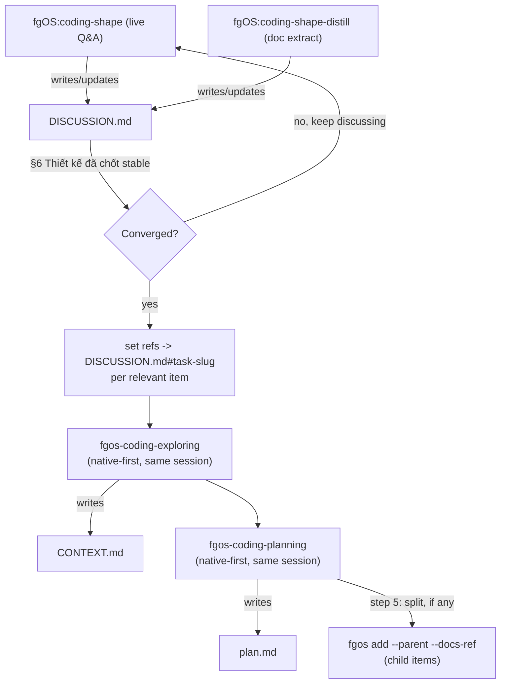

# Collab brainstorm — fgos-coding-shaping skill design

Item: tsk-69g. Stage: clarify (not yet run). This report is scout evidence
for that clarify pass — every decision below already has human sign-off
from this conversation; fgos-coding-exploring should extract, not re-ask.

## Mục tiêu & đề bài

fgOS lacks a phase for collaborative, multi-turn, multi-day design
brainstorming upstream of `fgos-coding-exploring`/`fgos-coding-planning`. Discussion
today either happens ad hoc (lost) or gets forced into the Socratic-lock
shape those two skills already use — wrong fit for open-ended
exploration where the human wants to revisit, compare options, and change
their mind before anything is "locked."

Need: a skill that (a) holds a real back-and-forth design conversation,
resumable across days/sessions, (b) keeps one coherent human-readable
document per feature (not fragmented per task), (c) hands off cleanly
into the existing clarify/decompose machinery once converged, without
duplicating that machinery's own decision-authoring logic, and (d) can
also run in a fast, non-interactive mode that distills an
already-written document straight into the same shape.

## Vấn đề rõ / chưa rõ

All rõ (resolved this session):

| # | Question | Resolution |
|---|---|---|
| 1 | Domain-agnostic name ("shape") or domain-scoped? | Domain-scoped — only `coding` domain is real (`src/state/workflow-stage-graphs.mjs`: `synthetic` is illustrative/disposable, never loads a skill; `discovery.mjs`/`decompose.mjs` hardcode coding's stage literals). |
| 2 | Reuse fgos-coding-exploring/fgos-coding-planning, or build parallel logic? | Reuse — never re-implement their CONTEXT.md/plan.md authoring. |
| 3 | 1 skill or 2, for interactive vs. fast-distill mode? | 1 skill, 2 entry commands (matches discover/discover-next, merge-list/merge-next precedent). |
| 4 | Separate index file per parent's children? | No — reuse `parent` field + `fgos rollup <id>` + plan.md's own split-list section. Zero-index-file precedent across all 162 existing `docs/history/*/` folders. |
| 5 | How does a later cold session (different day) extract the right content without missing it? | 3-layer mitigation: native-first in-session invoke (primary), per-task scoped `refs` anchors written to stranger-readable standard (fallback for cold pickup), real `fgos decision` calls per stabilized point (machine-readable trail independent of doc-reading quality). |
| 6 | One coherent narrative doc vs. fragmenting per task? | One file per feature; internal per-task anchors inside it, not separate files — human reads straight through, machine extraction still scoped via anchors. |
| 7 | Brainstorm tone — Socratic-lock like discover/decompose, or open discussion? | Open, conversational, prose-only. No `AskUserQuestion` forcing convergence each round. D-ID only minted once a point is stable across rounds, not on first answer. |
| 8 | What does the reference material (Superpowers/ck) actually say? | See below. |

## Quyết định đã chốt

- **D1** — Command/skill naming: `fgOS:coding-shape` (interactive) and
  `fgOS:coding-shape-distill <doc-path>` (fast doc-ingest), internal
  driving skill `fgos-coding-shaping`. Domain-prefixed per the
  `fgos-coding-driving` precedent, since `coding` is the only real
  domain today. Rejected: `coding-design` (name overlap with the
  existing `design` skill's branding/visual-identity meaning),
  `coding-brainstorm` (name overlap with the existing generic
  `brainstorm` skill).
- **D2** — No duplicated authoring logic. The skill never writes
  `CONTEXT.md`/`plan.md` itself. It sets the item's existing `refs`
  field (already read by `fgos-coding-exploring` step 1) to a scoped anchor
  inside its own document, then invokes `fgos-coding-exploring` and
  `fgos-coding-planning` directly in the same session once the discussion has
  converged — Native-First Dispatch Doctrine (tsk-27y D1/D2), the same
  reason that doctrine already exists: the live session has full context,
  a later blind session would have to re-derive it.
- **D3** — Document shape: one `docs/history/<feature>/DISCUSSION.md`
  per feature (not one file per task — avoids clutter for the human
  reading straight through). Sections, in order:
  1. **Trạng thái hiện tại** — short recap updated every round, so a
     session resuming days later re-orients without rereading history.
  2. **Mục tiêu & đề bài** — one continuous paragraph, full picture.
  3. **Vấn đề rõ / chưa rõ** — living table, updated in place.
  4. **Quyết định đã chốt** — D-ID table, append-only. Each D-ID is also
     recorded via a real `fgos decision --text "<D-ID>: ..." --rationale
     "..."` call the moment it stabilizes (not deferred to a later
     formalization pass) — this is the machine-readable safety net,
     independent of anyone re-reading the prose correctly.
  5. **Q&A log** — append-only, timestamped, never edited after the fact.
  6. **Thiết kế đã chốt** {#design} — the one section that gets
     **regenerated in full**, not appended, every time a new decision
     changes the shape of the design. A coherent synthesis — as if
     written fresh for a stranger — plus a diagram when the design has
     real structure/flow worth drawing. Never a list of D-IDs standing
     in for prose.
  7. **Danh mục hạng mục / task** {#tasks} — one subsection per
     candidate task, each with its own anchor (`#task-<slug>`): its own
     goal, the excerpt of §6 it draws from, the D-IDs that apply, its
     relationship to sibling tasks, and a draft verify command.
- **D4** — Brainstorm tone: open conversational prose, never a
  structured-choice tool forcing a decision each round (matches
  `fgos-coding-exploring`'s own existing "ask as open conversational prose, not
  `AskUserQuestion`" rule, extended here to the whole loop, not just
  individual questions). A D-ID is minted only once a point holds across
  multiple rounds without changing — revisiting and changing one's mind
  mid-discussion is expected, not a failure. Locking/gating only happens
  at the terminal handoff (D2) — never mid-brainstorm.
- **D5** — No new index file for a parent's children. Reuse `parent`
  field, `fgos rollup <id>` (live status), and `plan.md`'s own mandatory
  split-list section (`fgos-coding-planning` step 5 already requires this).
  Matches the observed zero-index-file convention across all 162
  existing `docs/history/*/` folders (checked directly, no exceptions
  found).
- **D6** — Reference-learning input: `docs/distillery/sources/
  superpowers.md` (already distilled, no new scan needed) supplies the
  hard separation rule — "the ONLY skill you invoke after brainstorming
  is writing-plans" — brainstorm and lock/plan are strictly separate
  phases, matching D2/D4's split. Local `ck:brainstorm` skill
  (`~/.claude/skills/brainstorm/SKILL.md`) supplies scout-first and
  present-analysis-before-asking discipline (adopted); its
  per-phase `AskUserQuestion` forced-decision-capture pattern is
  explicitly rejected (conflicts with D4).

## Q&A log (condensed)

1. Q: suggest a name; can distill learn from superpowers/ck first? →
   A: scouted `fgos-coding-exploring`/`fgos-coding-planning`/`distill` conventions
   before naming (see D1).
2. Q: should there be one index file per task to manage child files? →
   A: no — checked all 162 `docs/history/*/` folders, zero index-file
   precedent; live `fgos rollup` + `plan.md` split-list already serve
   that need (D5).
3. Q: enrich-in-place or add-ref-and-let-phases-extract? → A: latter,
   invoked natively in-session so extraction isn't a cold blind read
   (D2).
4. Q: worry that skills won't extract fully from a big multi-report
   discussion later → A: 3-layer mitigation — native-first (primary),
   scoped per-task refs anchors (fallback), real `fgos decision` calls
   (machine trail) — see Vấn đề #5.
5. Q: single doc for human readability vs. per-task scoping tension? →
   A: resolved by anchors within one file, not separate files (D3/#6).
6. Q: multi-day discussion is common; brainstorm should feel
   conversational, not forced like discover/decompose → A: D4, plus
   distilled confirmation from Superpowers + local ck:brainstorm (D6).
7. Q: add a consolidated "final design" section before the task list? →
   A: yes, §6 "Thiết kế đã chốt", regenerate-not-append (D3).
8. Q: submit as one task or split? → A: one — no hard-gate flags
   (auth/data-model/external-system/public-contract-break) present yet
   to justify a pre-split guess; let `fgos-coding-planning`'s own mode-gate
   (decompose stage) decide.

## Thiết kế đã chốt

`fgos-coding-shaping` is a new coding-domain driving skill, exposed
through two command wrappers that share one implementation:

- `fgOS:coding-shape [id|free-text]` — the default, interactive entry.
  Opens or resumes a `docs/history/<feature>/DISCUSSION.md`, holds an
  open-ended design conversation (scout-first, present-before-ask, no
  forced-choice tooling), keeps §§1–5 current every round, and
  regenerates §6 whenever the design's shape changes.
- `fgOS:coding-shape-distill <doc-path>` — the fast entry. Same document
  shape, but §§2–6 are populated by extracting from a supplied existing
  document instead of live Q&A; §5 gets one entry recording the
  extraction instead of a real back-and-forth.

Both entries converge on the same terminal step: once the human confirms
the discussion has converged (§6 is stable, §7's task list is real),
the skill sets each relevant item's `refs` to point at its own
`#task-<slug>` anchor, then — in the same session — invokes
`fgos-coding-exploring` and `fgos-coding-planning` directly for each item
(Native-First Dispatch). Those two skills do the actual `CONTEXT.md`/
`plan.md` authoring exactly as they do today; because `refs` already
resolves their own material/grounded/answerable gray-area check, they
find little or nothing left to ask and move straight to their own Gate.
`fgos-coding-planning`'s step 5 (existing mechanism, unchanged) creates any
child items via `fgos add --parent <id> --docs-ref ...`.

Never duplicated: `CONTEXT.md`/`plan.md` authoring rules, D-ID gate
mechanics, mode-flag counting, split logic. All of it stays exactly
where it already lives, in `fgos-coding-exploring`/`fgos-coding-planning`.

## Danh mục hạng mục / task

Single task for now (D-decompose stage will decide whether to split):

### task-fgos-coding-shaping-skill {#task-fgos-coding-shaping-skill}

- **Goal:** ship `fgos-coding-shaping/SKILL.md` plus the two command
  wrappers (`fgOS:coding-shape`, `fgOS:coding-shape-distill`).
- **Draws from:** §6 in full.
- **D-IDs:** D1–D6.
- **Relations:** none yet (first item in this line of work).
- **Draft verify:** manual — new skill files exist, both commands
  invocable, produced `DISCUSSION.md` matches §D3's section shape, and
  a smoke run against a throwaway item shows `refs` set + native-first
  `fgos-coding-exploring` invocation producing a non-empty `CONTEXT.md` with
  zero re-asked questions when `refs` already answered them. (Real
  verify command to be finalized during `fgos-coding-planning`'s own pass —
  this skill's own rule (D2) says this report never authors that for
  it.)

## Unresolved questions

None outstanding from this session. Everything above is locked pending
`fgos-coding-exploring`'s own formal pass (which should find near-zero new
gray areas, per this report's own §Vấn đề #5 mitigation).
