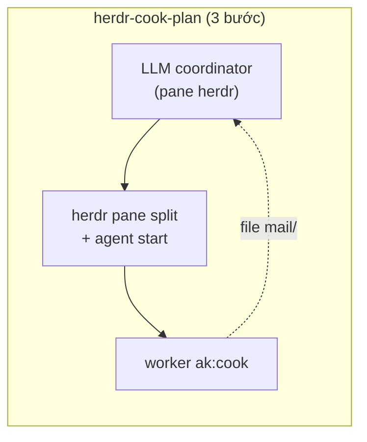
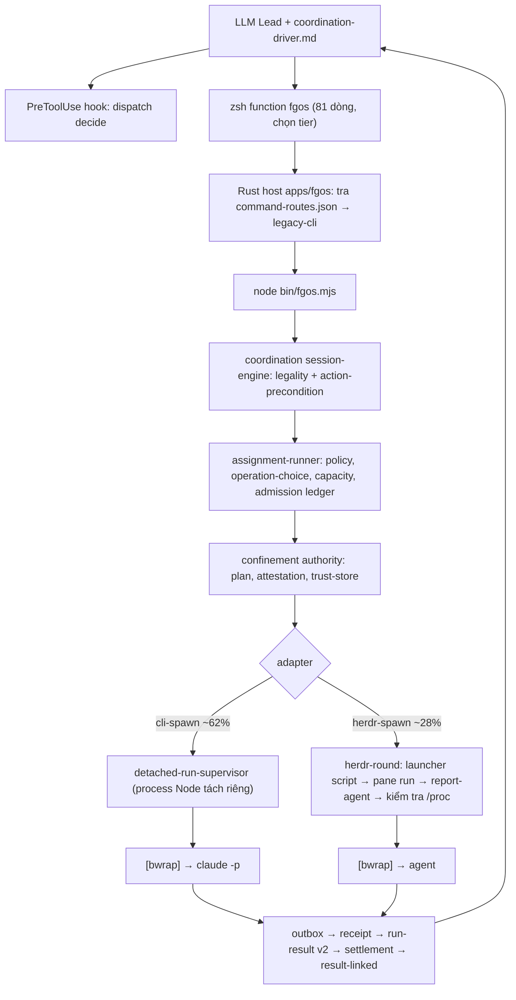

# So sánh sâu: độ đơn giản của harness — herdr-cook-plan vs fgOS

Ngày 2026-09-29. Tiếp nối [báo cáo so sánh đầu](research-260929-1203-herdr-cook-plan-vs-fgos-dispatch-coordination.md). **Đính chính 2026-09-29 15:05:** tỉ lệ run theo adapter đã sửa theo 1.028 `assignments/*/runs/*/result.json` (bản đầu đếm nhầm store `dispatch-runs/`). Mọi số liệu đo trên `main` @ `a15e1b454`, state thật `.fgos/`, và `thieung/herdr-cook-plan` @ `619b8cd`. Dòng code = file nguồn không phải test (`.rs/.mjs/.js/.ts/.py/.sh`), đếm bằng `wc -l`.

## 0. Kết luận trước

Anh lo là đúng. Số liệu cho thấy **phần lớn độ sâu của harness không đến từ bài toán, mà từ ba nguồn tự sinh**:

1. **Xây cho tương lai chưa tới.** 13 coordination protocol, thực dùng 3 (một cái chiếm 96%). Rust host có 75 route, chỉ 2 route native (`version`, `gate-bypass`), 73 route còn lại chỉ chuyển tiếp sang Node. Confinement 5.9k dòng phục vụ khoảng 10% số run (99/1.028 assignment run có bwrap). Đường herdr-spawn 3.5k dòng phục vụ khoảng 28% số run (286/1.028).
2. **Cơ chế nhân đôi.** 2 supervisor, 2–3 bản reconcile, 3 result ladder, 3 định nghĩa `workerCommandDigest`, 5 selector cho cùng một ý "chạy cái này", 2 cây docs gần trùng (`docs/architect` 451 file vs `docs/platform` 475 file).
3. **Không tin LLM nên chứng minh mọi thứ bằng code.** Ví dụ kiểm tra `/proc/<pid>/{exe,environ,cwd}` chống tamper, digest của prepared invocation, control-token fencing. Đây là giá trị thật nếu fgOS chạy headless không người canh ở quy mô lớn. **Nhưng hiện tại engine gần như chỉ phục vụ chính việc xây fgOS**: ngoài repo này chỉ có 11 coordination session trên toàn `~/projects`.

herdr-cook-plan không "giỏi hơn" mình: nó **chọn đúng một bài toán, rồi đứng trên vai người khác**. herdr là 230k dòng Rust không phải của họ, `ak:cook` là skill không phải của họ, và LLM thi hành 1.4k dòng prose. Việc duy nhất họ tự làm bằng code là **kiểm tra đóng run** (151 dòng).

Khuyến nghị: không đập bỏ, nhưng **mở một track "thu gọn" có tiêu chí xoá rõ ràng**, và đo bằng bake-off trước khi xây thêm. Chi tiết ở mục 8.

## 1. "150 dòng" thật ra đứng trên cái gì

| Tầng | herdr-cook-plan | Tự viết? | fgOS | Tự viết? |
|---|---|---|---|---|
| Terminal/agent runtime | herdr (230.312 dòng Rust) | Không | herdr, cộng fork patch | Không (+16 dòng) |
| Worker skill | `ak:cook` (~980 dòng md) | Không | `ak:cook`/fgos-coding-* + worker contract | Một phần |
| Điều phối | LLM + 1.400 dòng prose | Có | LLM Lead + `coordination-driver.md` + **engine 46k dòng** | Có |
| Bất biến bằng code | `check-run-closed.py` 151 dòng; context-guard 270 dòng (chỉ OMP) | Có | dispatch 31.5k + coordination 14.6k + state 12.7k + runner khác 13.5k | Có |
| Host/phân phối | Không có (copy thư mục) | — | Rust host 1k + host-runtime 6k + distribution 4.5k + shell function 81 dòng | Có |
| Visibility | herdr UI | Không | herdr-plugin gateway/MCP/dashboard 13k Rust | Có |

Tổng tự viết: **herdr-cook-plan ≈ 420 dòng code + 1.4k dòng prose**, còn **fgOS ≈ 144k dòng code + 195k dòng test + ~3.800 file md (41 MB) trong `docs/` + `plans/`**. Riêng docs agent-coordination là 13.9 MB.

## 2. Chuỗi process của một lần dispatch

Đếm số hop: bên họ **3**, bên mình **9–11**. Mỗi hop là một chỗ có thể vỡ. Memory của repo ghi lại đúng các chỗ đã vỡ:
- **Hop shell → Rust host → Node:** "fgos shell function stale staged release shim", và "rtk proxy fgos hits stale global binary".
- **Hop admission/lock:** "assignment-id allocator races", và "`main-checkout-reset --confirm` wiped `.fgos` state".
- **Hop cwd:** "dispatch execute cwd hazards".
- **Hop supervisor:** "claude executor Bash sandboxed in headless dispatch".
- **Hop session:** "`dispatch.claim` always empty file", và "maxRounds cap".

## 3. Kiểm kê từng lớp: có đáng không?

Nhãn: **Cốt lõi** = thiếu nó thì không còn giá trị; **Đúng mission nhưng sớm** = phục vụ mission #1/#2 nhưng chưa có người dùng thật; **Trùng** = có bản khác làm cùng việc; **Tự sinh** = sinh ra để vá chính độ phức tạp của mình.

| Lớp | Dòng | Dùng thật (bằng chứng) | Tương đương bên cook-plan | Nhãn |
|---|---|---|---|---|
| Event log / state (L3) `src/state` | 12.7k | Mọi thao tác | `ledger.jsonl` + checkpoint (prose) | **Cốt lõi**, nhưng to gấp 10–20 lần mức cần |
| Coordination engine | 14.6k | 605 session thật; **3/13 protocol**; `standalone-master-coordination-loop` chiếm 232/242 | Vòng coordinator trong SKILL.md | Cốt lõi cho master loop; phần group-thinking/deliberation là **đúng mission nhưng sớm** (10 session) |
| Contract/policy/choice/assignment | 12.4k | Mọi dispatch | Wave table + chọn `--runtime` | Một phần cốt lõi. Review 20/9 chỉ ra 5 selector, 4 allow-list, 3 precedence list → **trùng** |
| Confinement/trust/attestation | 5.9k | 99/1.028 assignment run có bwrap (~10%) | Không có | **Đúng mission nhưng sớm** |
| Recovery/reconcile/liveness/lock | 5.1k (14 file) | Chủ yếu để vá lỗi của chính nó | Lease + boundary check + stall ladder (prose) | Phần lớn là **tự sinh**: 2 hàm `reconcileCliSpawnRun` cùng tên, 3 vocabulary, 3 bản copy parser `/proc` |
| Adapter herdr-spawn | 3.5k | 286/1.028 run (~28%), chủ yếu reviewer | herdr `agent start/wait/prompt` trực tiếp | **Trùng một phần** với herdr; launcher script + tamper check tồn tại vì herdr thiếu `--executable` |
| Detached supervisor (Node) | 1.2k | ~62% run (cli), +10% bwrap | Không cần: worker là pane herdr, sống độc lập | Cốt lõi cho headless |
| `BoundInvocationSupervisor` (Rust) | 0.9k | **0 consumer** (theo D-ADR0043) | — | **Sớm / chết** |
| Rust host + host-runtime + distribution | 11.5k | 2/75 route native | Không có | **Sớm**. Hiện là một hop chuyển tiếp, và đã gây bug stale shim |
| herdr-plugin gateway/MCP/dashboard | 13k | Visibility, không nằm trên hot path | herdr UI | Tuỳ giá trị dashboard; không phải harness |
| Work lifecycle (merge/worktree/session/loop) | 6.8k (+verbs 9.4k) | Mọi item | Commit-per-phase + đóng pane | Cốt lõi cho mission; nhưng `merge.mjs` 99 KB, `worktree.mjs` 71 KB là dấu hiệu tùm lum |
| Result/settlement | 1.9k | Mọi run | Report `status: complete` + diff + check | Cốt lõi; có 3 ladder **trùng** |

Tính thô: nếu bỏ phần **chết/sớm** (Rust supervisor, phần lớn Rust host trên hot path, protocol chưa dùng) và gộp phần **trùng/tự sinh** theo đúng đề xuất trong review 20/9, harness có thể co khoảng **30–40%** mà không mất tính năng đang được dùng. Con số này là ước lượng, cần xác minh bằng spike xoá thật.

## 4. So sánh tính năng chi tiết

| Tính năng | cook-plan | fgOS | Ai cần thật (hiện tại) |
|---|---|---|---|
| Chạy plan theo phase, worker sạch context | ✅ trọng tâm | ✅ (qua cell/track + master loop) | Cả hai |
| Song song theo dependency + write-scope | ✅ wave, mặc định 2 | ✅ fanout, cohort-planner | Cả hai |
| Hỏi người qua mailbox, chỉ block phase liên quan | ✅ | ✅ ask/answer + awaiting-human | Cả hai |
| `--auto` quyết trong scope, ghi lý do | ✅ | ✅ gate-bypass level | Cả hai |
| Commit 1 phase / 1 commit, stage đúng path | ✅ | ✅ (per cell, qua approve/merge) | Cả hai |
| Reviewer độc lập + red-team, khác provider | ❌ | ✅ `distinctProviderFrom` | **Lợi thế thật** của fgOS; hiện chưa đo được chất lượng |
| Headless, không herdr, không người | ❌ | ✅ | Mission #1/#2; chưa có dùng thật ngoài repo |
| Nhiều executor, fallback, capacity/quota | chọn 1 kind | ✅ | Có giá trị (memory ghi agy/gemini hay trượt) |
| Sandbox bwrap + attestation | ❌ | ✅ | Sớm (~10% run) |
| Group-thinking / panel / delphi / RFC | ❌ | ✅ 10 protocol | Sớm (10 session) |
| Backlog/Work lifecycle, approve, cleanup, retro | ❌ | ✅ | Cốt lõi cho fgOS như sản phẩm |
| Replay xác định từ event log | ❌ (resume được) | ✅ | Có ích khi debug; chưa thấy ai dùng thường xuyên |
| Nhiều run đồng thời cross-session | ❌ cấm | ✅ (kèm race đã biết) | Có ích nhưng là nguồn bug lớn nhất |
| Kiểm chứng đóng run | ✅ script | ❌ (216 session mở) | **Lỗ hổng thật của fgOS** |
| Chống tamper worker (`/proc`) | ❌ | ✅ | Chỉ cần khi threat model có same-uid attacker |
| Cài đặt | copy thư mục | setup/doctor/distribution/Rust host | cook-plan thắng tuyệt đối |

## 5. So sánh kỹ thuật theo cơ chế

**Nguồn sự thật.** Họ: checkpoint (hot section ~40 dòng) cộng ledger 6 loại event, bất biến giữ bằng prose. Mình: event log với ~15 loại event, snapshot, schema versioned, validator. Mình vững hơn về lý thuyết. Nhưng khi đo, **session thật không được đóng (216/305)** nên sự thật trên đĩa không phản ánh thực tế, tức vững hơn chỉ trên giấy.

**Recovery.** Họ: đọc lại file ở mọi boundary; full reconcile chỉ khi có dấu hiệu bất thường; resume hay abandon bằng một câu của người. Mình: recovery-planner (2 bản: dispatch và coordination), reconciliation-planner, runtime-inspection, cold-resumable DAG. Review 20/9 tìm ra C1 "resume spawn worker thứ hai", tức chính cỗ máy recovery sinh ra lỗi critical.

**Liveness/stall.** Họ: `revision`/`state_change_seq` của herdr, 3 vòng không đổi thì nudge → interrupt → thay 1 lần → blocker. Mình: poll `agent get` mỗi 500 ms kèm `pane process-info` mỗi tick, khoảng 5k spawn process cho một round 30 phút (review mục Perf), cộng detached supervisor và lock PID. Phase 8a vừa rồi vẫn còn đang vá liveness.

**Concurrency.** Họ: cấm hẳn run song song, lease cooperative, và nói thẳng là "fences nothing". Mình: main-checkout lock, run-lock, admission ledger, control token, epoch. Đổi lại được song song, nhưng đây là nhóm bug nhiều nhất (169 commit tháng 9 có chữ lock/race/stale/cwd/stuck).

**Xác minh "xong".** Họ: report `status: complete` cộng agent settled, diff đúng scope, và check pass; coordinator (khác worker) kiểm. Mình: RunResult v2, evidence classification, disposition từng finding, reviewer/red-team. Mình sâu hơn thật, nhưng review 20/9 tìm ra H4/H5: hai consumer bỏ qua fail-closed, và `[DONE]` bị biến thành `verifiedSha` bất kể exit code. Tức độ sâu chưa chuyển thành độ tin cậy.

**Định danh attempt.** Họ: `p02a01` có trong mọi tên file, nên worker thay thế không bao giờ đọc nhầm answer của attempt cũ. Mình: `runId`, `assignmentId`, `retryId`, `predecessorRunId`. Fencing là opt-in, chỉ schema-2 dùng (review H1/M1).

**Trung thực về trạng thái.** Họ tách rõ `installed / preflight / smoke passed`, và ghi NOT RUN khắp nơi. Mình: review 20/9 mục 5 ghi rằng "Docs mô tả proposed/target như đã ship ở ≥10 chỗ".

## 6. Vì sao mình phức tạp: chẩn đoán gốc

1. **Vị trí của niềm tin.** cook-plan tin LLM coordinator trong phạm vi một lease và một người ngồi gần. fgOS không tin LLM ở bất kỳ đâu, nên mọi bất biến phải thành code, rồi code đó lại cần recovery, fencing và proof. Mỗi tầng không-tin sinh thêm tầng kiểm chứng tầng trước. Đây là **vòng xoáy**, không phải bản chất bài toán.
2. **Xây platform trước khi có tenant.** D-ADR0035 nói fgOS tồn tại cho mission #1/#2. Nhưng số đo cho thấy engine chạy gần như 100% cho mission #3 (ngoài repo: mdview 5 session, fgos-test-drive 6 session). Nghĩa là những tính năng "đúng mission" (headless, confinement, group-thinking, Rust host) **chưa có người dùng thật để kéo thiết kế về đúng kích cỡ**.
3. **Harness tự dogfood chính nó.** Engine được dùng để xây engine, nên mỗi bug của engine sinh ra thêm một cell/track đi qua chính engine đó, rồi mỗi track thêm cơ chế an toàn. 516 commit trong 6 tuần, đỉnh 107 commit/tuần (W38), 19 thư mục plan chỉ cho các track dispatch/coordination/runtime/confinement/rust-host.
4. **Không có tiêu chí xoá.** Có quy trình thêm (spec → ADR → phase → proof), nhưng không có quy trình bỏ: protocol không ai dùng, route Rust không consumer, cây docs trùng vẫn nằm đó. RUL11 nói "gom tới khi hết", nhưng thực tế mình thêm nhanh hơn gom.

## 7. Cái gì không thay được bằng prose (giữ)

- Event log append-only làm nguồn sự thật cho Work lifecycle, dù có thể gọn hơn nhiều.
- Detached supervisor cho headless (run sống sót khi dispatcher chết).
- Reviewer/red-team khác provider, là lợi thế chất lượng duy nhất cook-plan không có. Cần đo để chứng minh.
- Admission ledger một Run chưa settle cho mỗi Assignment. Bất biến này không thể giữ bằng kỷ luật LLM khi chạy song song.
- Confinement, **khi** có workload headless thật chạy code không tin cậy. Giữ code, nhưng đưa ra khỏi hot path mặc định.

## 8. Đề xuất: track "thu gọn harness"

Nguyên tắc: **mỗi cơ chế phải chỉ ra được người dùng thật hoặc sự cố thật; không có thì đóng băng hoặc xoá.**

1. **Bake-off trước tiên** (như báo cáo trước): cùng một plan 3–4 phase, chạy trên project ngoài repo, qua cook-plan và qua fgOS. Đo wall time, số lần người phải can thiệp, token, lỗi mà review sau đó bắt được, số lần kẹt hạ tầng. Đây là trọng tài cho mọi đề xuất dưới đây.
2. **Xoá hoặc đóng băng thứ chết:**
   - Bỏ Rust host khỏi hot path (shell gọi thẳng Node) cho tới khi có ≥1 route native thật cần nó.
   - Đóng băng `BoundInvocationSupervisor`.
   - Đánh dấu 10 protocol chưa dùng là `experimental`, không nhận tính năng mới.
3. **Gộp thứ trùng**, theo bảng Simplicity Audit của review 20/9:
   - Một supervisor cho mọi cli-spawn.
   - Một reconcile contract.
   - Một result ladder.
   - Một `deriveProviderFamily`.
   - Một typed `DispatchRequest` thay cho 5 selector.
   - Một cây docs: bỏ `docs/architect` hoặc bỏ `docs/platform`.
4. **Vay của cook-plan những thứ rẻ:**
   - Kiểm tra đóng session, bắt buộc trước khi merge; `doctor` báo session mở.
   - Hot-section snapshot ≤40 dòng cho Lead.
   - Attempt-keyed identity.
   - Stall ladder dựa trên `state_change_seq` của herdr thay vì poll 500 ms.
   - Báo cáo tách `installed / preflight / smoke passed / NOT RUN`.
5. **Dùng herdr thay vì bắt chước herdr:** nối dây `--executable` (fork patch) để bỏ launcher script, `pane run` và `report-agent`. Phần tamper check `/proc` chỉ bật khi confinement `required`.
6. **Một lối vào mỏng "chạy plan này"** trên kernel đã gọn. Người dùng chỉ thấy một skill như cook-plan; bất biến cứng (admission, event log, reviewer độc lập) nằm phía sau.
7. **Ngân sách độ phức tạp:** mỗi quý đặt trần dòng code cho `src/runner` + `packages` + `apps`. Tính năng mới phải kèm phần xoá tương ứng, hoặc có bằng chứng dùng thật từ project ngoài repo.

## Câu hỏi chưa giải quyết (cần anh quyết)

- Rust host (R1 kernel track) là chiến lược dài hạn anh đã chốt. Anh có chấp nhận **tạm rút nó khỏi hot path** trong lúc nó mới có 2 route native không?
- Group-thinking/panel (10 protocol) là năng lực mission #2 hay mới chỉ là thí nghiệm? Nếu là thí nghiệm thì có đóng băng được không?
- Threat model của confinement/tamper check là gì: có kịch bản thật nào mà agent cùng uid sẽ phá launcher, hay đây là phòng xa?
- Bake-off chạy trên project nào? `mdview` là ứng viên, vì nó đã có 5 coordination session.
