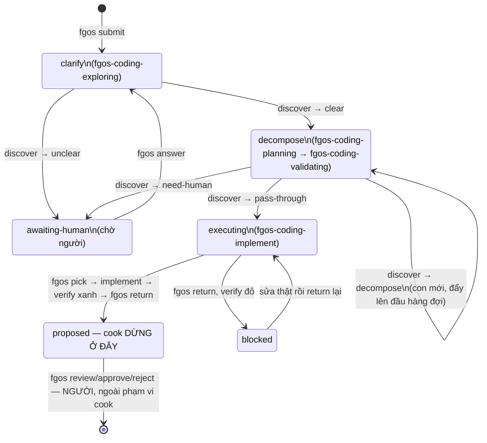

# /fgOS:cook — vòng đời một task, từ một câu nói tới `proposed`

`/fgOS:cook` nối các bước một người sẽ tự tay chạy — submit → fgos-coding-exploring
→ fgos-coding-planning/fgos-coding-validating → thực thi thật → return — thành một phiên
liên tục, dừng lại đúng bốn lần để hỏi người, không bao giờ tự merge. Tài
liệu này lắp ráp lại toàn bộ đường đi từ `plugins/fgOS/skills/cook/SKILL.md`
và các skill nó gọi.

## 1. Kiến trúc: ai gọi ai, ghi ra đâu

`cook` chỉ điều phối trình tự — không bao giờ ghi `.fgos/` trực tiếp. Mọi
thay đổi trạng thái đi qua một cửa duy nhất, CLI `bin/fgos.mjs`; phần
"chất" của mỗi giai đoạn (câu hỏi, quyết định, kế hoạch, code) giao hẳn cho
bốn dev-skill con qua Skill tool.

```mermaid
flowchart TB
  Cook["/fgOS:cook skill\n(điều phối trong phiên Claude)"]
  CLI[["bin/fgos.mjs\nCLI một-cửa-ghi (CTR001)"]]
  Explore["fgos-coding-exploring\nstage: clarify"]
  Plan["fgos-coding-planning\nstage: decompose · shape"]
  Validate["fgos-coding-validating\nstage: decompose · prove"]
  Execute["fgos-coding-implement\nstage: executing"]
  Events[("`.fgos/events.jsonl`\nnguồn sự thật, committed")]
  View[("`.fgos/state.json`\nview dựng lại, gitignored")]
  CtxDoc["docs/history/&lt;feature&gt;/CONTEXT.md"]
  PlanDoc["docs/history/&lt;feature&gt;/plan.md"]
  WT["git worktree fgw/&lt;id&gt;"]
  Commit["commit(s), id trong message"]

  Cook -->|"submit / ask / answer / discover / pick / return"| CLI
  Cook -.invoke.-> Explore
  Cook -.invoke.-> Plan
  Cook -.invoke.-> Validate
  Cook -.invoke.-> Execute
  CLI --> Events --> View
  Explore --> CtxDoc
  Plan --> PlanDoc
  Validate -.đọc.-> PlanDoc
  Validate -.đọc.-> CtxDoc
  Execute -.đọc.-> CtxDoc
  Execute -.đọc.-> PlanDoc
  CLI -- "pick: dựng worktree" --> WT
  Execute --> Commit
  Commit --> WT
  CLI -- "return: re-verify + CAS" --> Events
```

Nét liền = ghi CLI · nét chấm = invoke skill / đọc tài liệu.

Ba dev-skill (`fgos-coding-exploring`, `fgos-coding-planning`, `fgos-coding-validating`) không tự
áp chuyển stage — chỉ viết tài liệu và kết thúc bằng một câu hỏi gate.
`cook` mới là bên gọi lệnh máy móc thật sự (`fgos discover`) sau khi người
đã trả lời "có" ở gate đó.

## 2. Máy trạng thái: stage đi qua đâu



Hai gate của `fgos-coding-planning` và `fgos-coding-validating` đều nằm bên trong stage
`decompose` — "shape" và "prove" là hai lần dừng thật riêng biệt trong
cùng một stage, không phải hai stage khác nhau.

## 3. Trình tự đầy đủ (vòng lặp "drain the queue")

`cook` giữ một hàng đợi id. Với id ở đầu hàng, nó đọc lại `fgos list --json`
mỗi vòng (không bao giờ giả định trạng thái cũ còn đúng), rồi rẽ theo bốn
nhánh:

```mermaid
sequenceDiagram
  actor Người
  participant Cook as /fgOS:cook
  participant CLI as bin/fgos.mjs
  participant Dev as dev-skill\n(exploring/planning/validating/executing)
  participant WT as worktree fgw/&lt;id&gt;

  Người->>Cook: /fgOS:cook "&lt;mô tả tự do&gt;"
  Cook->>CLI: submit "&lt;text&gt;" [--deps ...]
  CLI-->>Cook: id mới · todo · clarify

  loop Drain queue (mỗi id)
    Cook->>CLI: list --json (đọc tươi)
    alt status = awaiting-human
      Cook->>Người: hỏi câu hỏi đã ghi
      Người-->>Cook: trả lời
      Cook->>CLI: answer &lt;id&gt; --text "..."
    else stage = clarify
      Cook->>Dev: invoke fgos-coding-exploring
      Dev->>Người: Socratic Q&A, gate "Approve CONTEXT.md?"
      Người-->>Dev: approve
      Cook->>CLI: discover &lt;id&gt; --json
      CLI-->>Cook: clear → stage=decompose
    else stage = decompose
      Cook->>Dev: invoke fgos-coding-planning → gate "Approve plan?"
      Người-->>Dev: approve
      Cook->>Dev: invoke fgos-coding-validating → gate "Approve → executing?"
      Người-->>Dev: approve
      Cook->>CLI: discover &lt;id&gt; --json
      CLI-->>Cook: pass-through / decompose(childIds) / need-human
    else stage = executing
      Cook->>CLI: pick &lt;id&gt;
      CLI-->>Cook: worktree path
      Cook->>WT: EnterWorktree
      Cook->>Dev: invoke fgos-coding-implement (implement + verify)
      Dev->>WT: commit
      Cook->>CLI: return &lt;id&gt;
      CLI-->>Cook: proposed (hoặc blocked)
    end
  end
  Cook->>Người: report — mọi id → proposed, review là việc của người
```

## 4. Bảng bước theo skill / lệnh / gate / output

| Stage | Skill chạy | Lệnh CLI (bin/fgos.mjs) | Gate hỏi người | Output |
|---|---|---|---|---|
| submit | `submit` (protocol, không phải dev-skill) | `fgos submit "<text>" [--deps]` | xác nhận/sửa/từ chối dependency đề xuất | item mới, id, stage `clarify` |
| awaiting-human | — (nhánh cơ học của cook) | `answer <id> --text` | relay câu hỏi đã park, chờ trả lời thật | item resume về stage trước đó |
| clarify | `fgos-coding-exploring` | `decision --text`, rồi `discover <id> --json` | "Decisions locked. Approve CONTEXT.md before planning?" | `docs/history/<feature>/CONTEXT.md` |
| decompose · shape | `fgos-coding-planning` | (không ghi CLI; đọc `fgos graph --json`) | "Work shape is ready. Approve before execution?" | `docs/history/<feature>/plan.md` |
| decompose · prove | `fgos-coding-validating` | `discover <id> --json` (sau gate) | "Feasibility validated. Approve moving to executing?" | ma trận khả thi trong `plan.md`; outcome `pass-through`/`decompose`/`need-human` |
| executing | `fgos-coding-implement` | `pick <id>` → (verify command của item) → `return <id>` | không có — headless, chỉ park qua `ask` nếu thật sự mơ hồ | worktree `fgw/<id>`, commit, item → `proposed`/`blocked` |

4 gate thật, không tự trả lời: CONTEXT.md (exploring) → plan.md (planning)
→ feasibility (validating) → report cuối chỉ ra review/approve là việc
người. Cả bốn lần, `cook` hỏi nguyên văn câu hỏi của dev-skill rồi chờ;
không bao giờ tự cho là "rõ ràng" để bỏ qua.

## 5. Harness binary nào chạy — và cái nào KHÔNG

fgOS có hai binary khác nhau. `cook` chỉ chạm vào một trong hai; nhầm lẫn ở
đây là nhầm lẫn phổ biến nhất khi đọc code fgOS.

**`bin/fgos.mjs` — dùng bởi cook.** CLI một-cửa-ghi (CTR001), mỗi lệnh là
một transition CAS lên `.fgos/events.jsonl`:
- `submit`, `ask`, `answer`, `decision`
- `discover` — chạy judge model cho clarify/decompose
- `pick` — claim + dựng worktree trong một lệnh
- `return` — re-verify thật + CAS sang `proposed`/`blocked`
- `list`, `graph` — đọc, không ghi

**`bin/fgos-runner.mjs` — KHÔNG dùng bởi cook.** Vòng tự hành (autonomous
loop) — dispatch song song nhiều item, recovery, anti-loop, write-queue.
Một cỗ máy khác, cho một chế độ chạy khác:
- dùng khi muốn nhiều item chạy không giám sát, theo `--watch`
- `cook` thay thế nó bằng driving thủ công, một phiên, từng gate được
  người thật duyệt
- không có write-queue/anti-loop nào chạy trong đường đi của `cook` — mọi
  thứ tuần tự trong một session

## 6. Mọi thứ được tạo ra, gom một chỗ

| Output | Mô tả |
|---|---|
| `.fgos/events.jsonl` | nhật ký sự kiện append-only, committed — nguồn sự thật cho mọi transition submit/ask/answer/decision/discover/pick/return |
| `.fgos/state.json` | view dựng lại từ replay events, gitignored — không phải nguồn thật |
| `docs/history/<feature>/CONTEXT.md` | quyết định khoá D1/D2/… do fgos-coding-exploring viết, nguồn thật cho mọi bước sau |
| `docs/history/<feature>/plan.md` | mode + approach + shape (fgos-coding-planning), cộng ma trận khả thi (fgos-coding-validating) trên cùng file |
| item con mới | nếu discover trả outcome `decompose` — mỗi con mang `parent` trỏ về gốc, đẩy lên đầu hàng đợi trước gốc |
| `fgw/<id>` | git worktree cách ly, dựng bởi `fgos pick`, nơi fgos-coding-implement implement thật |
| commit(s) | một commit mỗi item, id trong message — bằng chứng traceability thay cho cell-trace file |
| `proposed` | trạng thái cuối của mọi id gốc + con khi hàng đợi rỗng — **cook dừng ở đây**, không bao giờ gọi review/approve/reject |

## Khoảng trống đã biết

Flagged trong chính `cook/SKILL.md`, không phải đoán: tài liệu
`fgos-routing` nói một item còn ở `clarify`/`decompose` có thể `fgos take
--id` trực tiếp. Kiểm chứng thật trên repo này thì lệnh đó bị từ chối —
`"<id> is todo but not in the frontier yet (stage/deps/lineage)"`. `cook`
đi theo hành vi đã kiểm chứng (không claim trước `executing`) chứ không
theo văn bản đó; sửa lại `fgos-routing` là việc khác, ngoài phạm vi `cook`.

## Nguồn

- `plugins/fgOS/skills/cook/SKILL.md`
- `.claude/skills/fgos/fgos-{exploring,planning,validating,executing}/SKILL.md`
- `plugins/fgOS/skills/{submit,pick,discover}/SKILL.md`
- `docs/specs/reading-map.md`

## Câu hỏi chưa giải quyết

- Không có.
