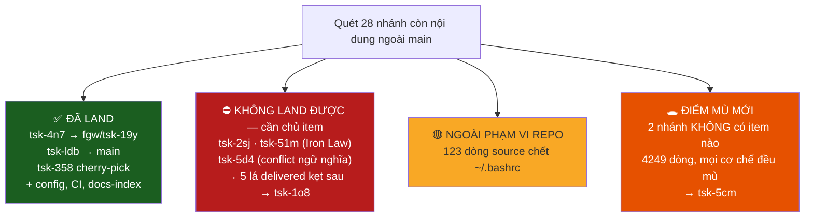

# Bàn giao — quét đồng bộ mọi thứ về `main`

**Ngày:** 2026-08-12 · **Kết thúc tại:** `main` @ `7b01c70e`, đã push, cây sạch
**Kiểm chứng cuối:** `npm test` 3008 test / 3003 pass / 0 fail / 5 skipped ·
`cargo test -p herdr-fgos` 129 pass · `fgos doctor` 3 đỏ / 20

---

## Kết luận một dòng

Mọi thứ **em có quyền land** đã lên `main` và đã push. Phần còn lại — 5 item đã
giao đang kẹt ngoài `main` — **không** land được bằng thao tác cơ học: cả ba
gốc chặn chúng đều đòi một quyết định chỉ chủ item mới có quyền ra. Em dừng
đúng ở ranh giới đó và ghi thành hai item mới.



---

## 1. Đã land

| Việc | Kết quả |
|---|---|
| `sync-root tsk-4n7` | synced → `fgw/tsk-19y` (nó là gốc lồng, target không phải main) |
| `sync-root tsk-ldb` | synced → `main` |
| `tsk-358` — commit duy nhất thật sự còn thiếu | cherry-pick `2bafa2d0` |
| `invariantChecks` cho cổng merge | `08814318` |
| CI chạy `cargo test` | `08814318` |
| `fgos docs-index` | `d564c8fd` — 14/282 doc thiếu → 0 |
| Hiệu chỉnh check `delivered-not-on-trunk` (2 vòng) | `8062df46`, `d564c8fd` |

`fgos doctor` **8 đỏ → 3 đỏ**.

### `fgw/tsk-19y` hoá ra rỗng

Sau khi `tsk-4n7` sync vào nó, `root-drift` báo `fgw/tsk-19y` là "closed out
with work still outside their target — 5 commit ahead". Kiểm thật:
`git diff --name-only $(git merge-base main fgw/tsk-19y) fgw/tsk-19y` **rỗng**
— cây nhánh trùng y hệt fork point. Nó không mang gì cả. Đây chính là ca đã
dạy em sửa check lần hai (§3).

---

## 2. Không land được — và vì sao em dừng

Ghi ở **`tsk-1o8`**. Việc đã giao còn ngoài `main` đúng bằng **5 lá**, và cả
năm **đã merge đúng vào nhánh gốc của mình rồi kẹt ở đó**:

| lá | status | commit | kẹt trên |
|---|---|---|---|
| `tsk-3dt` | delivered | 16 | `fgw/tsk-2sj` |
| `tsk-3ac` | delivered | 16 | `fgw/tsk-2sj` |
| `tsk-4xq` | delivered | 14 | `fgw/tsk-51m` |
| `tsk-2ypd` | delivered | 12 | `fgw/tsk-51m` |
| `tsk-3fk` | retrospective | 1 | `fgw/tsk-5d4` |

**Không được merge lại từng lá** — chúng đã merge đúng chỗ. Phải gỡ ba gốc:

| gốc | fgos sync-root trả về | Vì sao em không tự quyết |
|---|---|---|
| `tsk-2sj` | Iron Law, modules `bin/fgos.mjs`, `src/runner/claim-port.mjs` | `--acknowledge-iron-law` là lời khẳng định "đã có bằng chứng failing-test-first". Em không có bằng chứng đó cho diff của họ. Ký vào là ngụy tạo đúng thứ cổng này sinh ra để đòi. Item đang có session claim — việc còn chạy dở |
| `tsk-51m` | Iron Law, module `src/runner/merge.mjs` | như trên |
| `tsk-5d4` | `blocked`, `reason: merge-conflict` | Xung đột **ngữ nghĩa** thật, 3 file Rust. Nhánh đổi chữ ký trait `launch_cleanup_loop(&self, pane_id)` → `(&self)` và thay hẳn hình dạng `loop_run_argv` cố định bằng `fg:operation` on-demand, comment tự khai *"supersedes tsk-57q"*. Chọn bên nào là quyết định thiết kế. **`cargo test` xanh KHÔNG chứng minh chọn đúng ý định** |

`tsk-5d4` hiện **chưa ai claim** — đây là gốc rẻ nhất để gỡ trước, nhưng vẫn
cần người đọc thiết kế rồi chọn.

---

## 3. Check của chính em sai hai lần — đã sửa cả hai

Đây là phần đáng đọc nhất, vì nó là bài học về đo sai đại lượng.

| vòng | Nó đo nhầm gì | Ca lộ ra | Sửa |
|---|---|---|---|
| gốc | "nhánh chưa merge" ≠ "việc bị mất" | `tsk-67g` đủ nội dung trên main, vẫn bị hô mất | bỏ qua nhánh mà **mọi commit có patch-equivalent** trên trunk |
| 2 | merge commit **không có patch-id** nên `--cherry-pick` không bao giờ khớp → đếm mãi là unmatched | `fgw/tsk-19y`: 5 ahead, **0 file** khác fork point | thêm `--no-merges`, **và** chặn dứt khoát khi cây nhánh trùng merge-base |

Còn lại đúng 1 dòng (`tsk-3um`, 1 commit) — em đã kiểm tay: đó là bản split
CLI suite mà `main` đã có ở **phiên bản mới hơn** (+819 dòng trên cùng nhóm
file). Superseded, không mất. Không cơ chế cơ học nào phân biệt được
"superseded bởi bản áp lại có sửa đổi", nên em để nó báo và ghi rõ trong
`tsk-118`.

**Đính chính con số em đã nói với anh:** em từng báo *"~12.000 dòng nằm ngoài
main"*. Sai — đó là `git diff main...<branch>`, đo nhánh lệch bao nhiêu, không
đo nội dung nào thiếu. Nội dung thật sự thiếu là **một commit doc**.

---

## 4. Điểm mù mới — `tsk-5cm`

Hai nhánh mang **4249 dòng** mà **không có work item nào**:

- `dispatch-terminology-rename-260803` — 26 file, +2133, 9 commit chưa vào main
- `retro-loop-docs-260802` — 22 file, +2116, 8 commit

Đặt tên theo lối cũ ngày-tháng, không phải `fgw/tsk-<id>`. Hệ quả: check
`delivered-not-on-trunk` duyệt **theo danh sách item** rồi mới suy ra tên
nhánh, nên **không thể** thấy chúng. `root-drift` và `fgos stale` cũng vậy.

Đây là điểm mù **ngược** với cái `tsk-1l9` vừa vá: chỗ đó là *item có mà nhánh
không lên main*; chỗ này là *nhánh có mà item không tồn tại*. Đề xuất trong
item: thêm một phép quét theo chiều ngược — duyệt `refs/heads/fgw/*` rồi hỏi
item nào ứng với nó.

---

## 5. Hai chỗ em cố ý KHÔNG đụng

**`fgos setup` đầy đủ.** Nó ghi global config ở `~/.fgos/`, chèn dòng vào shell
rc, và chạy **mọi registered fix** — gồm `events-jsonl-contiguous` **ghi lại
event log dùng chung**. Nhiều session đang chạy; rewrite event log là rủi ro
không cần. Em chỉ gọi `ensureSharedConfigDefaults(repoRoot)`.

> Suýt dính bẫy ở đây: bước đó điền `gateBypass.level: "off"` trong khi giá trị
> hiệu lực của anh là `standard`. Shared config được ưu tiên hơn file legacy,
> nên để nguyên là **hạ cấp âm thầm quyết định của anh**. Đã set lại `standard`
> và kiểm `readGateBypassLevel` vẫn trả `standard`.

**`~/.bashrc`.** Doctor báo **123 dòng `source` chết** trỏ vào worktree/temp đã
xoá, mỗi dòng lỗi mỗi lần mở shell. Chính thông báo của doctor ghi *"delete
them by hand (fgos never edits your shell profile to remove a line)"*. Đó là
file cá nhân ngoài repo, không thuộc "đồng bộ về main" — em để anh quyết.
`~/.zshrc` (shell anh đang dùng) đã đúng, chỉ có 1 dòng trỏ về checkout thật.

---

## 6. Trạng thái cuối

```
main @ 7b01c70e — pushed, origin/main đồng bộ (0/0), cây sạch
npm test    3008 / 3003 pass / 0 fail / 5 skipped
cargo test  129 pass
fgos doctor 3 đỏ / 20:
  - shell-integration-sourced   (123 dòng chết trong ~/.bashrc — §5)
  - root-drift                  (3 gốc chặn — §2)
  - delivered-not-on-trunk      (5 lá sau 3 gốc + tsk-3um superseded — §2, §3)
```

Ba check đỏ còn lại **đều đã có item và đều đúng như thiết kế** — không phải
nợ ẩn.

Item mở trong lượt này: `tsk-1l9` (delivered, đã land), `tsk-118`, `tsk-1o8`,
`tsk-5cm`.

---

## Câu chưa trả lời được

1. **`fgw/tsk-3um` và `fgw/tsk-67g` có nên xoá ref không?** Nội dung đã trên
   main (kiểm từng file). Xoá sẽ dọn sạch dòng cuối của
   `delivered-not-on-trunk`. Em không tự xoá branch khi anh vắng.
2. **Ai sở hữu `tsk-5d4`?** Item `todo`, không ai claim, nhưng nhánh mang một
   thay đổi thiết kế thật (`supersedes tsk-57q`). Cần người nhận rồi quyết.
3. **`tsk-2sj`/`tsk-51m` có bằng chứng failing-test-first chưa?** Nếu session
   chủ đã có, `sync-root --acknowledge-iron-law` là xong ngay.
