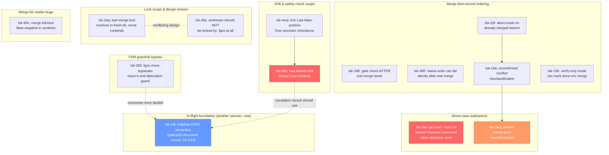

# Research Report: Merge/Approve Mechanism — Design for a "Grand Orchestrator" (Merge Conductor)

Conducted: 2026-08-01. Scope: fgOS's merge/approve subsystem — cluster `tsk-5t3a` (10 targets) + 5 adjacent items + external best-practice survey.

## Table of Contents

1. [Executive Summary](#executive-summary)
2. [Research Methodology](#research-methodology)
3. [Problem Inventory (16 items, evidence-based)](#problem-inventory)
4. [Relationship Graph](#relationship-graph)
5. [External Best Practices](#external-best-practices)
6. [Design: The Merge Conductor](#design-the-merge-conductor)
7. [Sequencing / Implementation Order](#sequencing--implementation-order)
8. [Open Questions Requiring a Human Decision](#open-questions-requiring-a-human-decision)
9. [References](#references)

---

## Executive Summary

fgOS's merge/approve code (`src/runner/merge.mjs`, `bin/fgos.mjs`'s `approve` case, `src/runner/main-checkout-lock.mjs`) is individually well-engineered — every function reviewed today behaves exactly per its own documented contract. The problem is not any single function; it's the ABSENCE of a coordinating layer above them. Confirmed by direct code read: `src/runner/loop.mjs` (the one autonomous background process fgOS runs) never calls `approve`/`merge` at all — grep for `approve|mergeRunnerItem|merge next` returns zero hits. Every merge today is triggered by an independent operator (human or agent session) with no shared view of what any other operator is doing.

16 real, evidence-backed items (10 in the just-created milestone `tsk-5t3a`, 6 adjacent) map to five failure families:

1. **Drift** — an integration branch (`fgw/<root-id>`) advances after being synced to `main` once; nothing re-syncs or warns (`tsk-3bn`, today's live incident).
2. **Scope-too-broad safety checks** — Iron Law diffs `trunk...branch`, inheriting a not-yet-merged ancestor's files as if they were the current commit's own change (`tsk-4voj`).
3. **Ordering / atomicity gaps around the merge-then-record sequence** — real `git merge` lands before the gate that's supposed to guard it (`tsk-396`), or lands and then the status-write can silently fail (`tsk-480`), or the code assumes a conflict happened when it didn't (`tsk-18a`, `tsk-2j9`).
4. **Lock-scope bugs** — the leaf-merge path resolves its lock against a directory that's guaranteed fresh every time, so it never actually contends (`tsk-2eq`); a genuinely unresolved design tension exists between "worktrees should never be blocked by `.fgos`" (`tsk-45y`) and "leaf merges must hold the real lock" (`tsk-2eq`).
5. **Worst-case realizations** — a session's `cd`/`git reset --hard` mistake on a SHARED main checkout destroyed other sessions' uncommitted work (`tsk-3au`); the shared `events.jsonl` state log itself was raced and truncated by a concurrent rebuild (`tsk-3wq`, self-healed, but real).

External research (5 sources, cited below) confirms the missing patterns have established names and solutions: **merge queues** solve "merge skew" (main changes between test-and-merge); **stacked-diff restacking** solves "child drifts after parent changes"; **stale-branch/drift bots** solve "nobody notices divergence"; **DAG-based build ordering** (Bazel/Nx) solves "wrong order for non-strict-hierarchy dependencies" — exactly the "collected merge" case the user described; and multi-agent coding research confirms fgOS's worktree-per-item isolation is already the right base pattern, while flagging that footprint overlap between concurrently-modified areas is the real conflict driver (41.7% cross-agent conflict rate vs 19.8% same-agent) — fgOS already computes footprint overlap for ranking (`rankImpact`/`footprintOverlapAmong`) but doesn't yet use it as a hard serialization gate.

**Recommendation**: build a **Merge Conductor** — not a rewrite, a coordinating layer reusing fgOS's own proven lock lineage (`acquireMainCheckoutLock` et al.) and graph data (`deps`/`parent`/`targets`/`footprint`) — that (a) makes every merge target's own lock actually contend, (b) auto-detects and offers to fix drift, (c) computes topological merge order and "collected merge" clusters from the real graph instead of requiring a human to hand-curate them (as this report's own author had to do for `tsk-5t3a`), (d) enforces a strictly narrower autonomous-safe zone with an explicit, small escalation list, and (e) applies a two-tier strictness: leaf→root cheap/scoped, root→main full-suite + drift-checked. One hard sequencing note: `tsk-19j` (in progress, 14 decisions already locked) is mid-flight redefining what "gate approved" means — the Conductor's escalation/audit trail must be built ON TOP of that once it lands, not as a second parallel mechanism.

---

## Research Methodology

- Internal sources: `fgos show` on 16 work items (full description/decisions/friction), direct reads of `src/runner/merge.mjs`, `src/runner/worktree.mjs`, `src/runner/main-checkout-lock.mjs`, `src/evolve/iron-law.mjs`, `bin/fgos.mjs`'s `approve`/`pick` cases, `docs/specs/runner.md`.
- External sources: 5 web searches (capped per skill policy), one per topic — stacked diffs, merge queues, drift detection, multi-agent AI coding conflict handling, DAG-based monorepo build/merge ordering.
- Date range: internal items filed 2026-07-28 through 2026-08-01 (today); external sources are current tool documentation/engineering blogs (2023–2026).
- Key search terms: "stacked diffs restacking", "merge queue merge skew Bors GitHub", "branch drift detection stale branch bot", "multi-agent AI coding merge conflict worktree", "DAG dependency graph build ordering monorepo Bazel Nx".

---

## Problem Inventory

Grouped by failure family. Every entry is a real, filed fgOS work item — not speculation.

### Family 1 — Drift (integration branch vs its eventual target)

**`tsk-3bn`** (heavy, dep: `tsk-4voj`) — *today's live incident*. `fgw/<root>` synced to `main` once; a later child merges into `fgw/<root>` afterward; nothing re-syncs `main` a second time. Verified via `git merge-base --is-ancestor` — code was never lost, just not yet reachable from `main`. No verb exists for "sync a root's branch to main early without closing the root item" and no read-only check exists for "which `fgw/*` branches have commits main doesn't have yet."

### Family 2 — Safety-check scope too broad

**`tsk-4voj`** (light) — `classifyIronLaw`'s `filesChanged` comes from `changedFiles()` (`src/runner/merge.mjs:316-330`), which runs `git diff --name-only trunk...fgw/<id>`. For a leaf forked from a root whose OTHER children already merged, this diff includes every ancestor commit's files — so Iron Law fires on modules the CURRENT item's own commit never touched, and the evidence-file lookup (keyed by the item's own id) can't find the ancestor's real evidence even though it exists on the same branch. Live-reproduced 2026-07-30 on `tsk-52g-2`.

### Family 3 — Ordering / atomicity around merge-then-record

**`tsk-396`** (heavy) — the real `git merge` into `main` lands BEFORE the compound-learn stage-gate check. A failed gate after a successful merge leaves `main` with a partial merge; a later successful `approve` re-merges over it. Reproduced on `tsk-424` (2026-07-28): merge commit `20bfb95` landed, gate then failed, a second approve created `d00be89` on top. Harmless in that instance (merge-base already-ancestor makes the second call idempotent) but the ordering itself is backwards — the gate should run before the merge commits, or the merge should stay reversible until the gate passes.

**`tsk-480`** (standard) — `mergeRunnerItem` lands the real commit, then the immediate next step (`moveWork(...to:'done')`, `bin/fgos.mjs:1873`) can throw on unrelated lock contention. When this happens the merge is real and permanent, but the item's own status never advances past `proposed`/`awaiting-approval` — and NO friction record is written on this specific path (friction is only added on the conflict/verify-fail branches earlier in the same function). Observed directly on `tsk-3wr`: commit `2766e60` landed on `main` while the item sat unrecorded for minutes, discovered only by manually diffing `git log` against `fgos list`.

**`tsk-2j9`** (standard) — when a branch is already fully merged (a genuine `git merge --no-ff` no-op, no `MERGE_HEAD`), if the post-merge verify then fails, `mergeRunnerItem` unconditionally calls `git merge --abort` and crashes with `fatal: There is no merge to abort` instead of returning the defined `verify-fail` outcome.

**`tsk-18a`** (light, dep: `tsk-2j9`) — a DIFFERENT trigger of the same abort-crash symptom, still unconfirmed. Empirical retest (documented in the item's own decision log) DISPROVED the "real git conflict" framing: manually re-running `git merge --no-commit --no-ff` at the exact same HEAD, isolated, succeeded cleanly with zero conflict. So the real checkout's initial `git merge` call is failing for some OTHER, still-undiagnosed reason that the code broadly classifies as "conflicted." Timing correlated with concurrent sessions doing real git ops on the same shared checkout. Same root-cause CLASS as a sibling repo's own documented incident (STR65, 13 prior occurrences, one with an actual lost commit) — that repo's mitigation (a pre-commit hook) does not cover this mid-merge race.

**`tsk-15k`** (standard) — brief but real: the engine's "verify-only" merge mode can mark an item `done` without actually merging divergent content.

### Family 4 — Lock-scope bugs and open design tension

**`tsk-2eq`** (light) — precise, already-diagnosed: leaf approve passes `ephemeral.path` (a freshly-created, freshly-deleted-and-recreated worktree) into `mergeRunnerItem`, which resolves its lock file inside THAT directory (`merge.mjs:371`) — a directory `worktree.mjs` just wiped per ADR0020 and `acquireMainCheckoutLock` just recreated. The lock is therefore ALWAYS fresh, ALWAYS acquires, NEVER contends. The real `<repoRoot>/.fgos/main-checkout.lock` is never held during a leaf→root merge's `git merge --no-commit`/verify window — exactly the gap the surrounding code comments claim is closed. Root-level approve is unaffected (it passes the real `repoRoot`). Fix direction already scoped (separate `lockRoot` param from git-op `cwd`) — but flagged with an explicit acceptance-criterion warning not to just swap in the real `repoRoot`, since that would make the merge land on `main` instead of `fgw/<root>`.

**`tsk-45y`** (standard, deps: `tsk-56t`, `tsk-49a`) — an OPPOSING design proposal: worktrees should NOT be blocked by `.fgos` locking at all; `.fgos` should be a single-writer append-only area that "someone commits by hand at a convenient moment," decoupled from git-checkout contention entirely. **This directly conflicts with `tsk-2eq`'s fix direction** — `tsk-2eq`'s own acceptance criteria explicitly says so.

### Family 5 — Symptom-adjacent, worst-case realizations

**`tsk-3au`** (heavy) — a session, after `EnterWorktree`, accidentally used absolute paths pointing back at the MAIN checkout for edits and `git commit`, landing a commit on `main` directly. The recovery attempt (`git reset --hard`) was run WITHOUT a full `git status` first — it destroyed other concurrent sessions' uncommitted work (`claim-port.mjs`, `loop.mjs`, `worktree.mjs`, plus `.fgos/entropy-history.jsonl`/`events.jsonl`/`coexistence.json`), unrecoverable (never staged, no stash/reflog). This is not a merge-mechanism bug per se — it's proof of what a careless destructive operation costs on a checkout shared by concurrent operators.

**`tsk-3wq`** (heavy, dep: `tsk-18a`) — the shared `events.jsonl` itself (not just git) was raced: a concurrent session's rebuild/repair truncated/replaced it, silently dropping another session's recorded events (though the underlying git commits survived — only tracking was lost). Self-healed by the time of a later check, but real and reproducible in principle.

### Family 6 — Correctness of the read layer merge tooling exposes

**`tsk-66x`** (standard) — `fgos merge list`/`merge next` return a silently-EMPTY-but-VALID-LOOKING result (`{picked:null, reason:"nothing ready to merge"}`) when run from inside a worktree, instead of refusing the way `approve` does. Live-reproduced: same store, `merge next` from a nested worktree said "nothing ready", `merge list --dir <real-root>` from the main checkout said 2 items ready. An unattended merge-loop would silently stop and misreport "done" — the article's own author hit exactly this bug in this session, during today's investigation of `tsk-g18`.

### Family 7 — Guardrail-bypass at the FSM layer

**`tsk-280`** (standard, dep: `tsk-4on`) — `return`'s anti-fabrication guard (branch-advanced + clean tree + verify pass) is enforced ONLY inside the `return` handler. `fgos move <id> --to <status>` has zero preconditions beyond FSM-legal transition, so `fgos move` silently bypasses every one of `return`'s guarantees. Reproduced live: an item `return` correctly refused (branch not advanced) was then closed via `fgos move ... --to proposed` on user instruction, skipping verify with no warning. **This is not hypothetical for this report's author** — `fgos move tsk-g18 --to awaiting-approval` and `fgos move tsk-u9k --to doing` were both used today, by necessity, to recover from the drift incident (`tsk-3bn`), which is precisely the unguarded escape hatch this item warns about.

### Family 8 — Foundational, in-flight redesign (context, not a bug)

**`tsk-19j`** (standard, status **doing** — actively worked by another concurrent session right now) — a deep redesign (14 locked decisions, D1–D14) of what a "gate" means: separating "is the current stage's OUTPUT approved" (a fact, recorded with actor/timestamp/verify) from "should we advance to the next stage" (a mechanical decision made by whichever driver/loop is running — `cook`, `pick`, `discover-loop`, etc., via a to-be-consolidated `fgos-coding-driving` driver skill). This is foundational: any Merge Conductor design that invents its own "human said yes" recording mechanism would collide with `tsk-19j`'s `gates[id]` structured field (D11: `{actor, at, verify}` per skill-gate).

---

## Relationship Graph

Not shown as a formal `deps` edge but real in practice: `tsk-2vd` (another session, status **doing** right now) is independently fixing a SECOND, separate ad-hoc-worktree-missing-`node_modules` path (`bin/fgos.mjs`'s own detached worktree for `return`'s verify) — distinct from the `createWorktree` symlink fix already landed on `main` today (commit `4123318`). Two different code paths creating verify worktrees, each needing its own patch — a DRY gap worth folding into the Conductor design (see §6.F).

---

## External Best Practices

### 1. Stacked diffs / dependent-branch restacking (Graphite, git-town, Sapling)

**Mechanism**: model review as a stack of dependent branches; when a branch merges, descendants are automatically **restacked** (rebased) onto the new parent tip; `gt stack sync` brings the whole stack current with upstream.
**Prevents**: orphaned children diverging from a merged parent — this is *structurally* `tsk-3bn`, just for review branches instead of integration branches.
**Terms**: restacking, stack sync, logical commit chain.
**Sources**: graphite.com/guides/stacked-diffs, graphite.com/guides/rebasing-and-updating-refs, graphite.com/guides/stacked-diffs-on-github.

### 2. Merge queues / merge trains (GitHub Merge Queue, Bors, Mergify, GitLab merge trains)

**Mechanism**: PRs queue; each is tested against a synthetic branch reflecting the CURRENT target tip, sequentially; only green merges land, one at a time (or batched with GitLab's trains).
**Prevents**: "merge skew" — target changes between test-and-merge windows, breaking an already-approved change. This is exactly the class of bug `tsk-2eq`/`tsk-18a`/`tsk-480` sit in: multiple operators racing the same target without a serialized queue.
**Terms**: merge skew, merge train, zero-merge-skew guarantee, synthetic test branch.
**Sources**: graphite.dev/blog/bors-google-tap-merge-queue, mergify.com/blog/the-origin-story-of-merge-queues, github.com/bors-ng/bors-ng.

### 3. Branch/integration drift detection (stale-branch bots, ahead/behind tracking)

**Mechanism**: periodic `git rev-list --left-right --count` (or equivalent) tags branches ahead/behind/diverged/identical relative to trunk; some CI pipelines fail early past a divergence threshold.
**Prevents**: late discovery of conflict potential — directly the missing capability behind `tsk-3bn`'s gap C.
**Terms**: ahead/behind metrics, divergence, stale-branch bot.
**Sources**: github.com/marketplace/actions/stale-branches, researchgate.net "Branch Drift: A Visually Explainable Metric...".

### 4. Multi-agent AI coding systems' concurrent integration handling

**Mechanism**: one agent per git worktree per branch (never a shared working directory) — the SAME base pattern fgOS already uses. Published research: cross-agent PRs (agents editing overlapping areas independently) show a 41.7% merge-conflict rate vs 19.8% for same-agent sequential work — i.e., footprint/area overlap between concurrently-running agents is the dominant conflict driver, more than raw concurrency itself.
**Prevents**: simultaneous-edit clobbering (worktree isolation); the residual risk is SEMANTIC conflict (no textual conflict, but logically inconsistent) between agents that touched adjacent/related code — those get escalated to a human in practice, not auto-resolved.
**Terms**: worktree-per-agent isolation, cross-agent conflict rate, semantic vs textual conflict.
**Sources**: arxiv.org/html/2607.04697v2, arxiv.org/pdf/2604.03551 (AgenticFlict dataset).

### 5. DAG-based build/merge ordering (Bazel, Nx, Turborepo)

**Mechanism**: a dependency graph of targets (not necessarily a strict tree — a real DAG) is the single source of truth for valid execution/merge order; `affected`-style commands compute which downstream targets need attention given a change; topological sort determines order, including for targets that share no direct parent/child relationship but do share a dependency edge.
**Prevents**: out-of-order integration (a dependent merged before its dependency, breaking main); redundant work on unaffected targets.
**Terms**: DAG-based scheduling, affected-graph, topological sort.
**Sources**: aviator.co/blog/monorepo-tools, dev.to "Monorepos in 2026: Turborepo vs Nx vs Bazel".

---

## Design: The Merge Conductor

Not a rewrite. A coordinating layer that reuses fgOS's own proven primitives (the four-times-proven wx-atomic-create lock lineage; the existing `deps`/`parent`/`targets`/`footprint` graph fields; the existing `rankImpact`/`footprintOverlapAmong` functions already used for `merge list` ranking) and closes the specific gaps the 16 items above document.

### A. Lock scope, fixed and extended (closes `tsk-2eq`, informs `tsk-45y`'s resolution)

Every merge operation (leaf→root, root→main, or any future "sync-root" action) must acquire a lock keyed to its REAL target branch's real backing directory — never an ephemeral, always-fresh worktree path. `tsk-2eq`'s own scoped fix (separate `lockRoot` from git-op `cwd`) is directionally correct and should land, but **only after** the `tsk-45y` question is explicitly answered by a human (see §8) — building the Conductor on top of a lock whose scope is still contested would bake in the wrong answer.

### B. Drift detection as a standing pre-flight check, not a periodic report (closes `tsk-3bn` gap C)

Before ANY merge action, the Conductor checks `git merge-base --is-ancestor <expected-target-tip> <actual-target-tip>` for the branch it's about to act on. A mismatch is not an error to work around — it's the signal that a `sync-root` (see C) is needed first. This is the same information this report's author had to derive by hand today in ~20 minutes; making it a pre-flight assertion makes the failure mode structurally impossible to miss again.

### C. `sync-root` as a first-class, non-terminal action (closes `tsk-3bn` gap B)

A new supported action — `fgos sync-root <root-id>` or equivalent — merges `fgw/<root-id>`'s current tip into `main` (or into ITS OWN parent, for a deeper nesting level), records a real decision/event, and explicitly does NOT change the root item's own `status`/`stage`. This replaces the ad-hoc `git merge` this report's author had to invent live today. Crucially: **restacking** (§External Practice 1) applies here too — after a `sync-root`, any OTHER open leaf still forked from an older tip of that root should be flagged (or auto-rebased, if safe) so it doesn't independently drift further.

### D. Topological, graph-computed "merge sets" — the "collected merge" case (directly answers the user's ask)

Today, grouping related-but-not-parent-child items into a mergeable cluster is a MANUAL act — this report's author did it by hand for `tsk-5t3a` because no tooling computes it. The Conductor should:

1. Build the real dependency DAG from `deps` (blocking order) + `parent` (branch topology) + `footprint` (file-overlap risk) — not just `parent`, which today is the only signal `merge list`'s ranking uses for topology.
2. Compute, for any item entering `awaiting-approval`, its full "merge set": every item it transitively depends on that isn't `done` yet, AND every sibling/cousin whose `footprint` overlaps its own. This is exactly Bazel/Nx's `affected`-graph concept, applied to merge readiness instead of build freshness.
3. A merge set with NO footprint overlap and NO unmet deps can proceed autonomously, one item at a time, through the queue (§E). A merge set WITH footprint overlap between two items that are each individually ready is the fgOS-native equivalent of "cross-agent conflict risk" from the external research (41.7% rate) — serialize them (merge one, re-diff the other against the new tip, THEN merge) rather than parallelizing; only escalate to a human if that serialized re-check itself produces a genuine conflict.
4. When `fgos-coding-planning`/decompose creates children of a root, it should proactively record real `deps` edges between siblings whenever a genuine ordering constraint exists (today, most of the graph's real structure — e.g., "these two touch the same file" — exists only in `footprint`, an advisory field `merge list` reads for ranking but nothing enforces as a hard constraint).

### E. Single queue per target branch, not N independent operators (closes the root cause behind `tsk-2eq`/`tsk-18a`/`tsk-480`, informed by merge-queue pattern)

Reframe "any session can `fgos approve` any item anytime" into "every merge action is a request submitted to that target branch's own serialized queue" — literally the SAME primitive fgOS already has for `main` (`acquireMainCheckoutLock`), generalized to also apply per-`fgw/<root-id>`. A session/agent doesn't need to BE the queue; it just needs to acquire the SAME lock every other merge-attempt for that target acquires, which `tsk-2eq`'s fix makes possible for the first time (today it silently never contends).

### F. Consolidate ad-hoc verify-worktree provisioning (closes the DRY gap behind `tsk-2vd` existing alongside today's `worktree.mjs` fix)

Two independent code paths create throwaway worktrees for verification today (`createWorktree` in `worktree.mjs`, now fixed to symlink `node_modules`; and `bin/fgos.mjs`'s own separate detached-worktree logic for `return`, which `tsk-2vd` is fixing separately right now). The Conductor's own additions (drift pre-flight, sync-root) should not add a THIRD. Fold all throwaway-worktree creation through one shared helper so a fix like the `node_modules` symlink (or any future fix) lands once, not N times.

### G. Strict two-tier verification (per the user's explicit request: leaf→root looser, root→main stricter)

| | Leaf → root | Root → main |
|---|---|---|
| Verify scope | item's own declared `verify` (already fgOS's default today) | full suite (`npm test`, already fgOS's actual behavior today per `docs/how-to/diagnose-a-verify-fail-post-merge-block-on-approve.md`) |
| Drift pre-flight (§B) | check against root's own last-known tip | check against `main`'s own last-known tip |
| Footprint/merge-set check (§D) | against siblings under the SAME root only | against every OTHER open root's already-merged content too (this is what Iron Law's `tsk-4voj` fix must also narrow correctly — the safety check should scope to the item's OWN real diff against its OWN immediate parent, not blindly `trunk`) |
| Escalation trigger | genuine footprint overlap, or item's own Iron Law hit | ANY of the above, plus: drift detected and not yet resolved by a `sync-root`; a merge set spanning more than one root not-yet-synced |

### H. Escalation policy — ask only when truly necessary

Escalate to a human ONLY for:
1. A genuine (confirmed, not `tsk-18a`-style misclassified) git textual conflict.
2. Footprint overlap between two independently-ready items that a serialized re-check STILL conflicts on.
3. An Iron Law hit that survives the `tsk-4voj` rescoping (i.e., the item's OWN commits genuinely touch a gated module).
4. A `main`-bound merge set spanning a root that itself isn't fully synced — this is a real, load-bearing policy decision (should partial roots ever land on `main`?), not something to auto-decide.
5. Anything the drift pre-flight (§B) can't resolve via an automatic `sync-root` (e.g., the sync itself would conflict).

Everything else — clean, no overlap, verify green, no Iron Law hit, no drift — proceeds autonomously. This directly targets the user's stated goal: automate the common case, escalate only the genuinely load-bearing decisions.

### I. Auditable trail for every Conductor action

Every automatic action (sync-root, autonomous leaf/root merge, serialized-reorder decision) and every escalation appends a real decision/event via the mechanism `tsk-19j` is already formalizing (`gates[id]` structured records, D11) — never a parallel, second recording mechanism. This turns today's ~20-minute manual forensic reconstruction (`git merge-base --is-ancestor`, `git reflog`, `git log --graph --all`) into an instant `fgos check <id>` / drift-report read.

---

## Sequencing / Implementation Order

Respects the real `deps` already recorded, plus risk/foundational ordering:

1. **`tsk-4voj`** (light, no deps) — rescope Iron Law's diff to the item's own real ancestor, not blind `trunk`. Foundational for the Conductor's own escalation policy (§H.3) and unblocks `tsk-3bn`.
2. **`tsk-2j9`** (standard, no deps) — guard the `git merge --abort` call on a missing `MERGE_HEAD`. Small, well-scoped, unblocks `tsk-18a`'s own next investigation step (its decision log already says the known no-op case must be ruled out first).
3. **`tsk-18a`** (light, dep: `tsk-2j9`) — re-investigate the still-unconfirmed "conflict" misclassification with `tsk-2j9`'s fix in place; capture real stderr/exit-code per the item's own left-for-next-session note. Unblocks `tsk-3wq`.
4. **`tsk-3wq`** (heavy, dep: `tsk-18a`) — confirm/fix the shared `events.jsonl` race once the git-layer race behind it is understood.
5. **`tsk-3bn`** (heavy, dep: `tsk-4voj`) — build `sync-root` (§C) and the drift pre-flight (§B). This is the Conductor's actual first shippable slice.
6. **`tsk-2eq`** — land ONLY after the `tsk-45y` open question (§8) is answered by a human; implements §A.
7. **`tsk-480`**, **`tsk-396`**, **`tsk-15k`**, **`tsk-66x`** — independent, mechanical, can proceed in parallel by separate sessions once 1–6 stabilize the foundation they sit on.
8. **`tsk-280`** — land before the Conductor is trusted to act autonomously via `fgos move`-adjacent operations, since its whole premise (§E/§H) depends on FSM transitions actually being guarded.
9. **`tsk-19j`** — already in progress elsewhere; the Conductor's audit trail (§I) is a CONSUMER of this, not a blocker on the rest of the above — but should not be duplicated in parallel.
10. **`tsk-3au`** — not a merge-mechanism code fix; feed its lesson (no destructive git op on a shared checkout without a full `git status` + confirmation) into the Conductor's OWN operating rules as a hard constraint, and into general agent-safety guidance.

---

## Open Questions Requiring a Human Decision

1. **`tsk-2eq` vs `tsk-45y`**: should worktrees be blocked by `.fgos`'s lock at all? `tsk-2eq`'s fix (real lock scope for leaf merges) assumes yes; `tsk-45y` argues no, proposing `.fgos` as a decoupled single-writer area committed by hand at convenience. The Conductor's entire lock strategy (§A, §E) depends on this being resolved first — building on the wrong assumption bakes in more rework later.
2. **Should a `main`-bound merge ever land a PARTIAL merge-set** (a root synced early, per `sync-root`, while siblings are still open)? Today's incident (`tsk-3bn`) happened precisely because this was done ad hoc without a policy. §H.4 proposes always escalating this — confirm.
3. **Restacking**: should the Conductor ever AUTO-rebase a still-open leaf onto a newly-synced root tip (true stacked-diff restacking), or only WARN/flag it for the operator to handle? Auto-rebase is more automated (matches the stated goal) but riskier (rewrites a branch another session might be actively working on).
4. **Scope of `tsk-3au`'s lesson**: should there be a hard tool-level block on `git reset --hard`/similar destructive ops on the MAIN checkout specifically (vs a worktree, where it's low-risk), enforced structurally rather than left to session discipline?

---

## References

### Internal (fgOS)
- `src/runner/merge.mjs` — `changedFiles`, `mergeRunnerItem`, `mergeRunnerItemLocked`.
- `src/runner/worktree.mjs` — `createWorktree`, ADR0020 `.fgos`-removal comment.
- `src/runner/main-checkout-lock.mjs` — lock lineage design (D4–D6, str65-worktree-isolation-enforcement).
- `src/evolve/iron-law.mjs` — `classifyIronLaw`, `MODULE_RULES`.
- `docs/specs/runner.md` — merge/approve spec of record.
- `docs/how-to/close-out-a-decomposed-root-item-after-all-children-are-done.md` — today's own stop-gap doc for the `tsk-3bn` drift trap.
- `docs/how-to/diagnose-a-verify-fail-post-merge-block-on-approve.md` — approve's full-suite verify behavior.
- fgOS items: `tsk-5t3a`, `tsk-3bn`, `tsk-4voj`, `tsk-396`, `tsk-480`, `tsk-19j`, `tsk-18a`, `tsk-2eq`, `tsk-2j9`, `tsk-15k`, `tsk-66x`, `tsk-2vd`, `tsk-280`, `tsk-45y`, `tsk-3au`, `tsk-3wq`.

### External
- Stacked diffs: graphite.com/guides/stacked-diffs, graphite.com/guides/rebasing-and-updating-refs, graphite.com/guides/stacked-diffs-on-github.
- Merge queues: graphite.dev/blog/bors-google-tap-merge-queue, mergify.com/blog/the-origin-story-of-merge-queues, github.com/bors-ng/bors-ng.
- Drift detection: github.com/marketplace/actions/stale-branches, researchgate.net/publication/393484424 (Branch Drift metric paper).
- Multi-agent AI coding: arxiv.org/html/2607.04697v2, arxiv.org/pdf/2604.03551 (AgenticFlict dataset).
- DAG-based monorepo ordering: aviator.co/blog/monorepo-tools, dev.to/zny10289/monorepos-in-2026-turborepo-vs-nx-vs-bazel-what-actually-works-1j85.

---

## Unresolved Questions (per report policy)

Listed in full in §8 above. Summary: (1) `.fgos`-lock-vs-worktree design tension must be settled before `tsk-2eq`/Conductor §A lands; (2) partial-merge-set-to-main policy must be explicit, not ad hoc; (3) auto-restack vs warn-only is an automation-risk tradeoff needing a human call; (4) whether destructive git ops on the shared main checkout need a structural (tool-level) block, not just session discipline.
