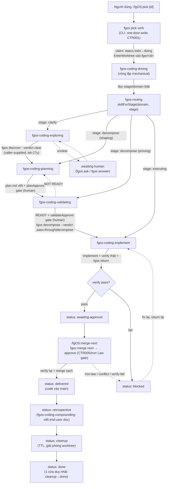
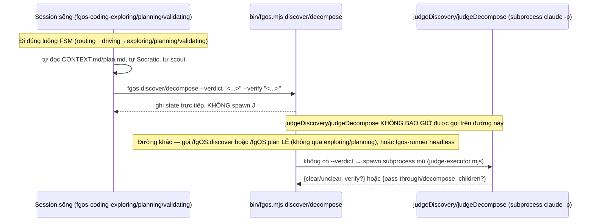
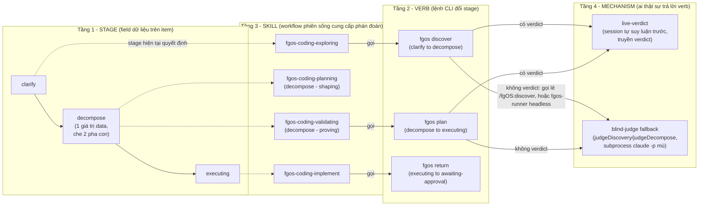
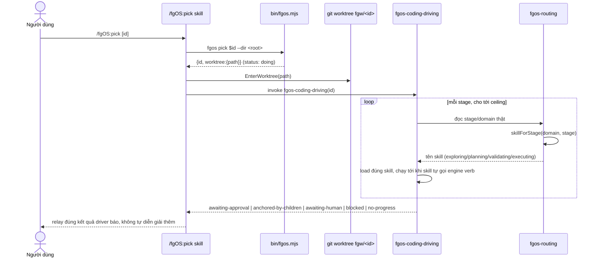
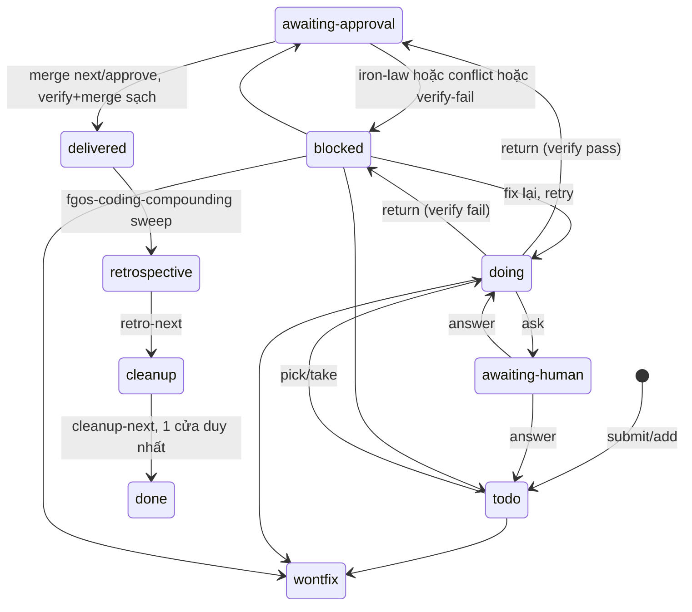

# Internal Research: `/fgOS:pick` → hoàn tất task — full lifecycle, mỗi stage kích hoạt gì

Nghiên cứu nội bộ (đọc code + SKILL.md thật, không web search). Verified 2026-08-03.
Item: yêu cầu trực tiếp từ user — dựng tài liệu mô tả toàn bộ quy trình
`/fgOS:pick` cho tới khi task hoàn tất (merged, `done`), có diagram mỗi
stage: skill/harness nào kích hoạt, cơ chế nào, input/output gì.

Nguồn đọc trực tiếp: `plugins/fgOS/skills/{pick,return,merge-next}/SKILL.md`,
`.claude/skills/fgos-{routing,coding-driving,exploring,planning,validating,
executing,compounding}/SKILL.md`, `src/state/{work,fsm,workflow-stage-graphs}.mjs`,
`src/intake/{discovery,decompose,judge-executor}.mjs`, `src/runner/dispatch.mjs`,
`docs/decisions/0026-vision-orchestrator-roottask-capacity-native-vs-cli-spawn.md`.

## 1. Tổng quan — 1 flowchart cho toàn bộ vòng đời

## 2. Bảng mỗi stage: skill/harness — cơ chế — input — output

| Stage/bước | Skill/harness kích hoạt | Cơ chế (native LLM vs mechanical vs subprocess mù) | Input | Output / state write |
|---|---|---|---|---|
| Claim | `/fgOS:pick` → `fgos pick` CLI | Mechanical (Node CLI, one-door-write) | id (optional, mặc định frontier head) | `status: doing`, worktree `.claude/worktrees/<id>-*` đứng lên, branch `fgw/<id>` |
| Điều phối | `fgos-coding-driving` | Mechanical loop — đọc `stage`, gọi `fgos-routing`'s registry, KHÔNG tự suy ra mapping | item id | không tự ghi state — chỉ load đúng skill và lặp tới ceiling |
| Route | `fgos-routing` | Mechanical lookup: `skillForStage(getDomain(domain), stage)` từ `src/state/workflow-stage-graphs.mjs` | `stage`, `domain` | tên skill (`fgos-coding-exploring`/`fgos-coding-planning`/`fgos-coding-validating`/`fgos-coding-implement`) |
| `clarify` | `fgos-coding-exploring` | **Native LLM trước** — session tự đọc description/refs/deps, tự scout (`rg`, capability-gate), tự Socratic; chỉ SAU đó gọi `fgos discover --verdict clear --verify "<...>"` — bypass hẳn `judgeDiscovery` subprocess | title/description/refs/deps, capability-gate impact-analysis | `docs/history/<feature>/CONTEXT.md` (D-ID, bằng chứng scout), gate `contextApprove` (human), `stage: clarify→decompose` |
| `decompose` — shaping | `fgos-coding-planning` | Native LLM — mode gate (10 cờ), risk map, chọn approach, viết plan.md | CONTEXT.md, item's tier/risk | `docs/history/<feature>/plan.md`, gate `planApprove` (human), verify command thật gắn vào item |
| `decompose` — proving | `fgos-coding-validating` | Native LLM — feasibility matrix, mỗi dòng cần bằng chứng thật (file đọc, lệnh chạy, test có sẵn), KHÔNG chấp nhận "should work" | plan.md, CONTEXT.md, capability-gate | Gate `validateApprove` (human) + verdict READY/NOT READY; nếu READY, **tự gọi** `fgos plan --verdict pass-through\|decompose --children '<...>'` — bypass hẳn `judgeDecompose` subprocess (tsk-27y D1/D2), `stage: decompose→executing` |
| `executing` | `fgos-coding-implement` | Native LLM implement thật; verify **chạy thật** (không nhận lời khẳng định) | docsRef (CONTEXT.md/plan.md nếu có), item's `verify` command | code diff thật, `iron-law-evidence.md` nếu `classifyIronLaw` yêu cầu, 1 commit/item |
| Return | `fgos return <id>` (gọi từ trong `fgos-coding-implement`) | Mechanical — tự chạy lại `verify`, check working-tree sạch + commit history tiến | commit(s), verify command | `status: awaiting-approval` (verify pass) hoặc `status: blocked` (verify fail) |
| Merge | `/fgOS:merge-next` → `fgos merge next` → `approve` | Mechanical — CTR005/Iron Law gate, re-verify, ranking (dependency-wait, no footprint conflict, `rankImpact`) | ranking từ `fgos merge list` | `status: delivered` (merge sạch) hoặc giữ `awaiting-approval`/`blocked` (iron-law/conflict/verify-fail) |
| Retrospective | `fgos-coding-compounding` (qua `/fgOS:retro-next`) | Native LLM — phân loại Diataxis, viết end-user doc từ tín hiệu thật đã capture | item's discovery/decisions/gates/outcome/friction đã ghi suốt vòng đời | end-user doc (`docType`/`docPath`), `status: retrospective→cleanup` |
| Cleanup | `/fgOS:cleanup-next` | Mechanical, TTL-bounded | — | giải phóng worktree, `status: cleanup→done` (1 cửa duy nhất) |

## 3. Cơ chế dispatch — 2 đường discover/decompose khác hẳn nhau

Đây là điểm dễ hiểu lầm nhất (đã tự kiểm chứng bằng code trong phiên này):

- **FSM thật** (routing → coding-driving → exploring/planning/validating) **luôn** đi nhánh trên — native, session tự suy luận trước, CLI chỉ ghi nhận (`resolveDiscovery`/`resolveDecompose` thấy `callerVerdict` thì bỏ qua hẳn `judgeDiscovery`/`judgeDecompose`).
- Nhánh subprocess mù chỉ bị chạm ở 2 nơi, cả 2 NGOÀI FSM: (1) `fgos-runner`/`loop.mjs` headless (không có soul để suy luận trước, cố ý theo thiết kế); (2) gọi tay `/fgOS:discover <id>`/`/fgOS:plan <id>` như 1 lệnh lẻ, tách biệt khỏi vòng lặp routing/driving.
- Helper quyết định native-vs-cli/spawn chung (`decideCapacityDispatchMechanism`, `src/runner/dispatch.mjs`, xây ở tsk-3ik Pha 4) **không áp dụng** cho `judgeDiscovery`/`judgeDecompose` — lớp đó là hàm Node thuần, cấu trúc không thể có live Task access dù caller là ai (tsk-3ik-2 tự điều tra và đóng dạng pass-through). Helper đó chỉ thật sự dùng ở `capacities.submit-assist-classify` (skill-facing, có thể chạy trong session sống).

## 3.5. Vấn đề đặt tên — 4 tầng đang bị gộp lẫn dưới cùng 1-2 chữ

Nguồn gây khó hiểu xuyên suốt phần trên: **"discover" và "decompose" bị dùng
để chỉ 4 tầng khác nhau cùng lúc**, không có ranh giới rõ trong tên gọi.
Đây là quan sát/đề xuất vocabulary — KHÔNG phải đề xuất đổi tên verb/CLI/skill
thật (đổi verb là breaking change, cần quyết riêng, không tự làm ở đây).

**Vì sao rối:** tra 1 chữ "discover" có thể đang nói tới verb CLI, tới stage
`clarify`, hay tới riêng nhánh `judgeDiscovery` (blind-judge) — 3 nghĩa khác
nhau, cùng 1 chữ. Tương tự "decompose" vừa là stage (1 giá trị, che 2 pha),
vừa là verb, vừa là tên hàm judge subprocess.

**Đề xuất (mức doc/vocabulary, không đổi code):**

- Gọi riêng 2 nhánh Tầng 4 bằng tên tách hẳn khỏi verb: **"live-verdict"**
  (session tự suy luận trước) vs **"blind-judge fallback"** (subprocess mù)
  — thay vì để trần `judgeDiscovery`/`judgeDecompose` (dễ lẫn với verb) hay
  mượn chữ "native" (đã có nghĩa khác ở doctrine 0026: native-vs-cli/spawn
  dispatch cho Task tool, không cùng khái niệm).
- Mọi chỗ nhắc `fgos-coding-validating` nên kèm `(stage: decompose — proving)` —
  tên skill không tự nói nó thuộc stage nào, phải tra bảng mới biết.
- Đặt tên prose chính thức cho 2 pha con của stage `decompose`:
  "decompose-shaping" / "decompose-proving" — data field vẫn giữ nguyên 1
  giá trị `decompose`, chỉ thêm hậu tố khi VIẾT VỀ nó, không đổi state.

## 4. Sequence diagram chi tiết — pick tới return

## 5. State/status transition (toàn bộ, kể cả sau return)

## 6. Artifact/state thật được ghi ở mỗi bước

| Artifact | Ghi khi nào | Committed? |
|---|---|---|
| `.fgos/events.jsonl` | mọi verb one-door-write (pick/discover/decompose/gate-approve/return/approve/move) | Có — nguồn sự thật |
| `.fgos/state.json` | dựng lại từ events.jsonl | Không — gitignored, view |
| `docs/history/<feature>/CONTEXT.md` | `fgos-coding-exploring` | Có, trên branch `fgw/<id>` trước khi gọi `fgos discover` |
| `docs/history/<feature>/plan.md` | `fgos-coding-planning`, có thể sửa bởi `fgos-coding-validating` (NOT READY loop) | Có, trước khi `fgos-coding-validating` gọi `fgos plan` |
| `docs/history/<id>/iron-law-evidence.md` | `fgos-coding-implement`, chỉ khi `classifyIronLaw` trả `required:true` | Có, cùng commit implementation |
| commit(s) trên `fgw/<id>` | `fgos-coding-implement` (1 commit/item, id trong message) | Có |
| end-user doc (Diataxis) | `fgos-coding-compounding` tại status `retrospective` | Có |

## Unresolved questions

- `fgos-routing/SKILL.md`'s bảng route ghi `executing` load skill `null`
  ("today", tức "chưa có skill") nhưng code thật
  (`src/state/workflow-stage-graphs.mjs`) đã có `executing: 'fgos-coding-implement'`
  từ `str89-fgos-domain-skills D4/D6` — SKILL.md đang lệch so với code, có
  thể chỉ chưa update sau khi `fgos-coding-implement` được thêm. Không tự sửa doc
  ở đây vì ngoài phạm vi câu hỏi gốc.
- Chưa xác nhận trực tiếp `approve`/CTR005/Iron Law gate implementation
  (`src/runner/merge.mjs`, `src/evolve/iron-law.mjs`) — chỉ dựa vào mô tả
  trong `merge-next/SKILL.md` và `fgos-coding-implement/SKILL.md`'s iron-law-evidence
  bước, chưa đọc trực tiếp 2 file nguồn đó trong phiên này.
