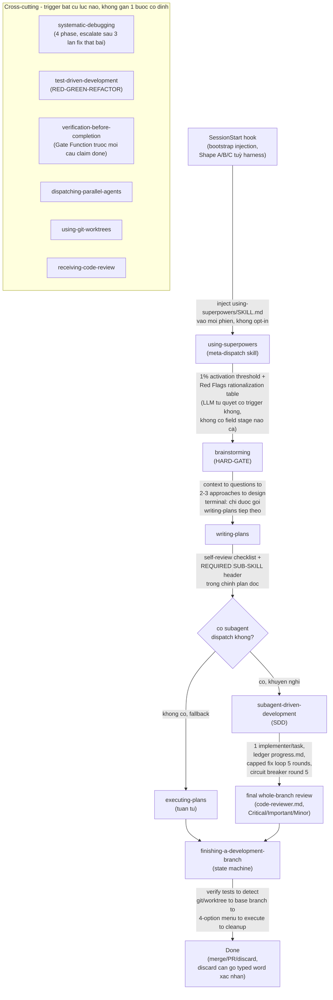
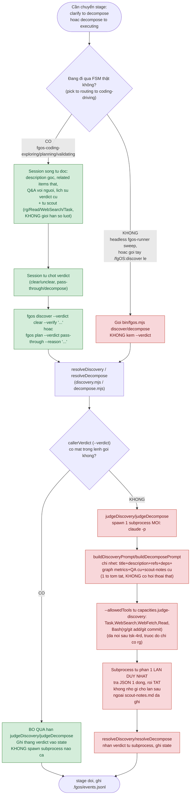

# Internal Research: superpowers (obra) — lifecycle tương ứng với fgOS pick-lifecycle

Nghiên cứu nội bộ, đọc trực tiếp `docs/distillery/sources/superpowers.md`
(distill index thật, git-repo `obra/superpowers`, HEAD `3dcbd5c`, phân tích
2026-07-28) — không web search, không đọc source thật của repo `superpowers`
(chỉ đọc feature-index đã distill sẵn). Verified 2026-08-04.

Bối cảnh: so sánh với report trước
(`internal-research-260803-2223-fgos-pick-lifecycle-diagrams-report.md`) —
superpowers là 1 thư viện skill cho coding agent (khác kiến trúc fgOS: không
có work-item FSM/state store, mỗi skill là 1 quy trình prose độc lập, tự
trigger theo mô tả, không route qua 1 field `stage` như fgOS).

## 1. Lifecycle tương ứng — 1 flowchart

## 2. Bảng mỗi bước: skill — cơ chế — input — output

| Bước | Skill | Cơ chế | Input | Output |
|---|---|---|---|---|
| Bootstrap | SessionStart hook | Mechanical injection — Shape A (hook stdout JSON), Shape B (plugin lifecycle, user-role message, KHÔNG BAO GIỜ system message — tránh token bloat + vỡ model), Shape C (Gemini, `@`-include vào context file) | không có | `using-superpowers/SKILL.md` body nằm trong context, gói `<EXTREMELY_IMPORTANT>` |
| Dispatch | `using-superpowers` (meta-skill) | LLM judgment — "1% chance áp dụng → PHẢI invoke", 12-dòng Red Flags table bẻ mọi lý do trì hoãn; `<SUBAGENT-STOP>` tự tắt khi đang trong 1 subagent đã scoped sẵn | yêu cầu người dùng (raw text) | tên skill tiếp theo được trigger |
| Design | `brainstorming` | HARD-GATE literal: cấm mọi skill implementation cho tới khi thiết kế được duyệt — kể cả việc "nhìn đơn giản" | yêu cầu + Socratic Q&A | design write-up (`docs/superpowers/specs/<date>-<topic>-design.md`) |
| Plan | `writing-plans` | Self-review checklist tác giả tự chạy (placeholder scan, consistency, scope) — KHÔNG dispatch reviewer riêng | design doc | plan doc (`docs/superpowers/plans/<date>-<feature>.md`), header bắt buộc Goal/Architecture/Tech Stack/Global Constraints, task bite-sized 2-5 phút |
| Execute (song song) | `subagent-driven-development` | 1 implementer subagent/task, ledger `progress.md` (grep-able line format, sống sót qua compaction), fix loop tối đa 5 vòng (1-3 resume implementer cũ, 4-5 dispatch implementer mới model mạnh hơn), round 5 circuit breaker → controller tự phán mỗi finding (park/park/STOP) | plan doc | commit(s) mỗi task, ledger cập nhật |
| Execute (tuần tự) | `executing-plans` | Fallback khi không có subagent — tự thực thi tuần tự từng task, cấm implement trên main/master không có consent rõ | plan doc | commit(s), hand off `finishing-a-development-branch` |
| Review | `code-reviewer.md` (template dùng chung, dispatch qua `requesting-code-review` hoặc SDD's final review) | Subagent riêng, read-only contract (không được mutate working tree/index/HEAD), severity Critical/Important/Minor, verdict "Ready to merge? Yes\|No\|With fixes" | diff (BASE_SHA/HEAD_SHA) | verdict + finding list |
| Đóng branch | `finishing-a-development-branch` | State machine: verify tests → detect git/worktree env → xác định base branch → menu 4 lựa chọn cố định → thực thi → cleanup. Lựa chọn "discard" cần gõ đúng chữ `discard`, không chấp nhận diễn giải | branch đã review | merge/PR/discard thật |

## 3. Cross-cutting skills — không gắn 1 bước cố định

| Skill | Trigger khi nào | Cơ chế lõi |
|---|---|---|
| `systematic-debugging` | Gặp bug bất cứ lúc nào trong Execute | 4 pha bắt buộc (Root Cause → Pattern → Hypothesis/Testing → Implementation), cấm fix trước khi hiểu root cause; ≥3 lần fix thất bại → "STOP, question the architecture" |
| `test-driven-development` | Viết code mới bất cứ lúc nào | RED-GREEN-REFACTOR literal, cấm giữ code viết sẵn "làm tham khảo" khi viết test |
| `verification-before-completion` | Trước MỌI câu khẳng định "xong" | Gate Function 5 bước (IDENTIFY→RUN→READ→VERIFY→claim), cấm cả ngôn ngữ diễn giải ngụ ý thành công |
| `dispatching-parallel-agents` | Cần fan-out nhiều việc độc lập | Quy tắc cơ học: nhiều lời gọi dispatch trong 1 response = song song; 1 lời gọi/response = tuần tự |
| `using-git-worktrees` | Cần cô lập môi trường làm việc | Ưu tiên tool native của harness, fallback `git worktree add` thủ công có cảnh báo "tạo phantom state harness không thấy được" |
| `receiving-code-review` | Nhận feedback review | restate→verify→evaluate→respond→implement, cấm đồng ý trình diễn ("You're absolutely right!") |

## 4. So sánh nhanh với fgOS (khác kiến trúc gốc, không chỉ khác tên)

| Khía cạnh | fgOS | superpowers |
|---|---|---|
| Trigger bước tiếp theo | Field `stage` thật trên work item, route mechanically (`skillForStage`) | Không có field nào — LLM tự phán "có nên trigger skill này" theo mô tả prose (1% threshold), route hoàn toàn bằng judgment |
| State lưu trữ | `.fgos/events.jsonl`/`state.json`, FSM đầy đủ (`todo→doing→awaiting-approval→delivered→retrospective→cleanup→done`) | Không có FSM bền vững — chỉ có 1 ledger `progress.md` mỗi plan (SDD), mục đích sống sót qua compaction, không phải work-item tracking dài hạn |
| "Gray area" ai trả lời | 2 nhánh: live-verdict (session tự suy luận) HOẶC blind-judge subprocess fallback (`judgeDiscovery`/`judgeDecompose`, `claude -p` mù headless) | Luôn là 1 lượt agent sống — KHÔNG có khái niệm subprocess judge mù nào; mọi skill giả định đang chạy trong 1 phiên có người/agent thật |
| Cổng review/QA | Mechanical: `fgos return` tự chạy lại `verify`; merge/approve qua CTR005 + Iron Law gate | Subagent review thật (`code-reviewer.md`), phán đoán LLM có severity taxonomy, không phải lệnh cơ học re-run |
| Đa harness | 1 harness (Claude Code + fgOS CLI riêng) | Cố ý harness-agnostic: 8 harness, lớp dịch verb-to-tool riêng (`references/{codex,gemini,pi,antigravity}-tools.md`), 3 Shape bootstrap khác nhau |
| Cổng hành động phá huỷ | Chưa khảo sát trong phiên này | Gõ đúng chữ `discard` mới cho xoá branch — không chấp nhận "yes"/diễn giải |
| Escalate khi bí/lặp lỗi | `fgos ask`/`fgos answer` park item | `systematic-debugging`: 3+ lần fix thất bại → dừng, đặt lại câu hỏi kiến trúc; SDD: circuit breaker ở fix-round 5, controller phải tự phán từng finding |
| Đóng góp bằng chứng thay vì lời khẳng định | `fgos return` không nhận lời khẳng định, tự verify | `verification-before-completion`'s Gate Function — cùng triết lý "proof, not assertion", tên khác |

### 4.1 Giải thích dễ hiểu từng dòng (ví dụ cụ thể)

- **Trigger:** fgOS có 1 ô dữ liệu `stage` trên item — code tra bảng
  `{clarify: fgos-coding-exploring}` như tra từ điển, không cần nghĩ. superpowers
  không có ô nào cả — mỗi skill tự có 1 đoạn "khi nào tôi nên chạy", và
  chính AI phải tự đọc yêu cầu rồi tự phán có nên gọi skill này không —
  như thủ thư đoán sách bằng cảm nhận, không tra mã số.
- **State lưu trữ:** fgOS có 1 database vĩnh viễn, ghi MỌI thay đổi của
  MỌI item từ đầu tới cuối, mãi mãi. superpowers không có database nào —
  chỉ 1 file ghi chú tạm mỗi plan ("đang làm task mấy, tới đâu rồi"), mục
  đích duy nhất là nếu AI bị "mất trí nhớ" giữa chừng (context nén lại)
  thì đọc lại để nhớ tiếp. Xong việc thì thôi, không ai theo dõi lâu dài.
- **"Gray area" ai trả lời — vì sao `judgeDiscovery`/`judgeDecompose` gọi
  là "mù":** đây là 1 process `claude -p` HOÀN TOÀN MỚI, bật lên trả lời
  1 câu rồi tắt ngay. Nó không hề thấy cuộc hội thoại thật giữa người
  dùng và session đang sống — chỉ nhận 1 tờ tóm tắt (title/description/
  refs/deps/lịch sử verdict cũ/scout-notes cũ) rồi phải trả lời NGAY
  trong 1 lượt, không được hỏi lại — giống thuê 1 tư vấn viên chưa từng
  gặp khách, đưa 1 tờ giấy tóm tắt, bắt trả lời có/không ngay. Không thể
  làm nó "hết mù" bằng cách cho thêm quyền — nó luôn tách biệt, cấu trúc
  không với tới được cuộc hội thoại sống. Cách "hết mù" thật sự đã có
  sẵn: đừng gọi nó — để session sống tự trả lời, truyền thẳng `--verdict`
  (tsk-27y). Nhánh mù chỉ còn là phao cứu sinh khi không có ai sống để
  hỏi (headless runner, hoặc gọi lệnh lẻ ngoài luồng FSM thật). superpowers
  không có khái niệm này — họ giả định luôn có 1 AI sống đang ngồi làm.
- **Cổng review/QA:** fgOS là 1 cái máy chạy lại đúng 1 lệnh test, coi
  pass/fail — không có ý kiến, không có "gần đúng". superpowers dùng 1 AI
  KHÁC đóng vai reviewer, thật sự đọc diff, cho ý kiến kiểu con người —
  nhẹ/vừa/nặng, "nên merge không".
- **Đa harness:** fgOS chỉ chạy trong Claude Code, CLI riêng của chính
  nó. superpowers chạy y hệt trên 8 công cụ AI khác nhau, có 1 lớp dịch
  riêng để mỗi công cụ hiểu đúng hành động cần làm.
- **Cổng hành động phá huỷ:** fgOS chưa khảo sát trong phiên này.
  superpowers xoá branch bắt buộc gõ đúng chữ `discard` — nói "yes"/"ừ
  xoá đi" không được chấp nhận.
- **Bí quá thì làm gì:** fgOS dừng lại, hỏi người 1 câu, chờ trả lời.
  superpowers có 2 cơ chế riêng: sửa lỗi 3 lần không được thì dừng hẳn,
  nghĩ lại cách làm từ đầu; review-sửa 5 vòng không xong thì bắt buộc 1
  người thật tự quyết định từng lỗi còn sót, máy không tự quyết nữa.
- **Không tin lời khẳng định:** fgOS tự chạy lại lệnh test trước khi tin
  "xong". superpowers có 1 skill riêng bắt AI làm đủ 5 bước (tìm lệnh
  đúng → chạy → đọc kết quả → so khớp → LÚC ĐÓ mới được nói "xong") — cấm
  nói "xong" khi chưa đủ 5 bước.

## 5. Self-improvement / testing-evals — so sánh sâu hơn với fgOS

Đọc thêm 2 domain còn lại trong distill index (`## self-improvement` dòng
499-527, `## testing-evals` dòng 552-608) + đối chiếu code thật fgOS
(`src/evolve/` chỉ có 2 file: `iron-law.mjs`, `candidates.mjs`;
`package.json`'s `"test": "node --test 'test/**/*.test.mjs'"`).

**Lưu ý tên gây hiểu lầm:** thư mục `src/evolve/` trong fgOS nghe như "cơ
chế tự cải thiện", nhưng nội dung thật chỉ là **Iron Law gate** — chặn
merge 1 diff tự sửa chính lõi fgOS nếu chưa có bằng chứng failing-test-
first. Đây là **an toàn** khi tự sửa chính mình, KHÔNG phải 1 vòng lặp
học/đo lường như self-improvement domain của superpowers dưới đây.

| Khía cạnh | fgOS | superpowers |
|---|---|---|
| Framework test | `node:test` (built-in Node), dùng DUY NHẤT, `node --test 'test/**/*.test.mjs'` | Chủ yếu hand-rolled `assert` + counter tự viết (chủ ý zero-dependency) — `node:test` chỉ là 1 NGOẠI LỆ duy nhất trong cả kho |
| Test cái gì | Code logic (hàm, verb CLI, state transition) | Cả code LẪN văn bản skill/prompt — coi cách diễn đạt SKILL.md là "production code" cần test riêng (`tdd-for-skill-authoring`) |
| Eval hành vi AI thật (không chỉ code) | Chưa thấy cơ chế nào ngoài `node:test` thường | Có "Drill" — harness Python riêng, LLM actor + LLM verifier lái phiên `tmux` thật của Claude Code/Codex/Gemini/Copilot, chấm theo YAML scenario, coi là bằng chứng hành vi CHÍNH THỐNG (mạnh hơn cả unit test), nhưng chậm (3-30+ phút/lần) và tốn tiền thật, "chưa chạy trong CI" |
| Test rẻ để lặp nhanh cách diễn đạt | Chưa thấy | "Micro-test harness" — 1 lệnh API/mẫu (~$0.15-0.30), dùng thử cách diễn đạt skill trước khi chạy eval đầy đủ (~$12/lần); từng dùng để KHÔNG ship 1 thay đổi (đo thấy không cần) |
| Tự cải thiện có đo lường hình thức | Chưa thấy cơ chế riêng — sửa lỗi/cải thiện đi qua đúng pipeline item bình thường (vd tsk-1ni/tsk-27y/tsk-53h/tsk-3ik tự sửa cơ chế dispatch của chính fgOS, submit/discover/decompose/executing/return như mọi item khác) | Có "cost experiment ladder" L1-L5, `"hard invariant: quality"` + `"judgment guardrail: cheapen mechanics, never judgment"` — 2 nấc từng CHẾT vì đo được chất lượng giảm thật (model controller rẻ: lỗi cài sẵn lọt 4/5 lần; reviewer rẻ: bỏ sót 10/10 lỗi cài sẵn) |
| Đảo ngược quyết định bằng bằng chứng đo được | Chưa thấy ví dụ ghi lại trong repo | Có case thật: 1 tính năng ĐÃ SHIP (vòng review tài liệu qua subagent) bị RÚT LẠI ở v5.0.6 sau khi đo thấy điểm chất lượng y hệt dù tắt/bật, chỉ tốn thêm ~25 phút mỗi lần |
| Test hành vi qua transcript AI thật | `judge-executor.mjs` (`extractScoutTranscript`) tự đọc NDJSON transcript của subprocess — nhưng để CAPTURE scout-notes (1 cơ chế vận hành), không phải để làm bằng chứng TEST | Có test thật grep transcript `claude -p` thật (`session-transcript-mining-tests`): kiểm skill có được gọi tên đúng không, có dispatch đủ số subagent không, có sinh file/commit/test-pass đúng không |

**Kết luận domain này:** fgOS chưa có lớp "tự đo lường việc tự cải thiện"
tách biệt — mọi cải thiện (kể cả cải thiện chính cơ chế dispatch của fgOS,
như 5 item Native-First Dispatch Doctrine đã làm trong phiên trước) đi qua
CÙNG pipeline dùng cho tính năng thường, không có ladder chi phí/chất lượng
riêng hay eval hành vi tách biệt khỏi `node --test`. superpowers có hẳn 1
domain riêng cho việc này, với bằng chứng đo lường thật (kể cả case tự rút
lại tính năng đã ship) — đây là khoảng cách thật, không phải khác biệt tên
gọi.

## 6. Chi tiết kích hoạt `judgeDiscovery`/`judgeDecompose` — mù vs hết mù

Diagram này trả lời trực tiếp: chỗ nào trong fgOS thật sự bật subprocess
mù, chỗ nào tránh được, và "cách hết mù" cụ thể là gì (không phải ý tưởng
mới — là cơ chế `tsk-27y` đã xây, chỉ cần LUÔN đi đúng nhánh đó).

**Đọc diagram:** khối xanh = "hết mù" (session sống tự trả lời, subprocess
không bao giờ bật). Khối đỏ = "mù" (subprocess `claude -p` tự phán, không
thấy hội thoại thật). Nút quyết định thật sự chỉ có 1: **`Q2` — lệnh gọi
verb có kèm `--verdict` hay không**. `resolveDiscovery`/`resolveDecompose`
kiểm tra đúng 1 điều kiện này để chọn nhánh.

**"Cách hết mù" cụ thể — không phải sửa code mới, mà là đảm bảo LUÔN đi
tới `Q2 = CÓ`:**

1. Luôn để item đi qua đúng cửa `fgos-routing` → `fgos-coding-driving` →
   `fgos-coding-exploring`/`fgos-coding-planning`/`fgos-coding-validating` (nhánh `Q1 = CÓ`).
   3 skill này đã tự động gọi `--verdict` sẵn (code đã xác nhận trước:
   `fgos-coding-exploring/SKILL.md:237`, `fgos-coding-validating/SKILL.md`'s Gate
   section) — không cần sửa gì thêm, chỉ cần KHÔNG bỏ qua đường này.
2. Tránh gọi `/fgOS:discover <id>`/`/fgOS:plan <id>` như 1 lệnh lẻ,
   tách khỏi luồng FSM (dù đang ngồi trong agent-terminal thật) — wrapper
   skill đó tự nó không suy luận trước, luôn rơi vào `Q2 = KHÔNG` (đã xác
   nhận: `discover/SKILL.md` không hề truyền `--verdict`).
3. Trường hợp `fgos-runner` headless (không có ai sống) — **không thể**
   "hết mù" theo nghĩa này, vì đúng bản chất không có soul nào đứng sẵn để
   tự trả lời. Việc đã làm được ở đây chỉ là "bớt mù" (tsk-4rd: nới
   `--allowedTools` từ chỉ `rg` lên `Task,WebSearch,WebFetch,Read`), không
   phải hết mù hoàn toàn — vẫn là 1 process không thấy hội thoại thật.

## Unresolved questions

- Report này chỉ đọc distill index (`superpowers.md`), không đọc source thật
  của `upstreams/superpowers` — nếu cần chi tiết implementation (ví dụ
  chính xác nội dung `using-superpowers/SKILL.md`'s Red Flags table), phải
  đọc trực tiếp repo đó (`docs/distillery/` có clone local theo frontmatter
  `local: upstreams/superpowers`).
- Chưa xác nhận fgOS có cơ chế "bootstrap injection mỗi session" tương
  đương Shape A/B/C không (report trước không đề cập) — không tự suy đoán,
  cần đọc thêm nếu muốn so sánh đầy đủ khía cạnh này.
