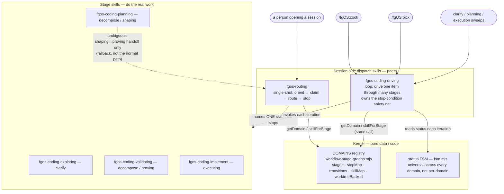
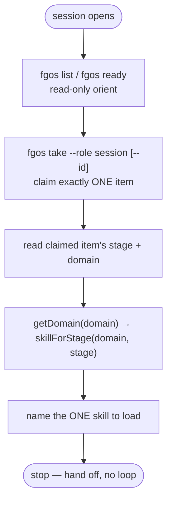
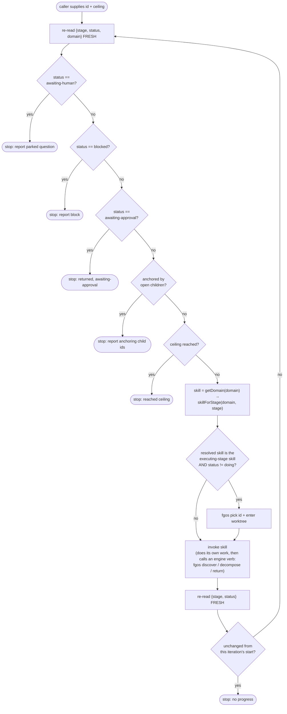
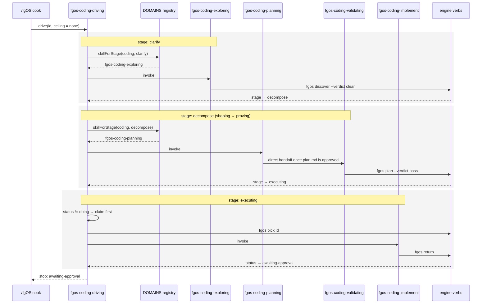
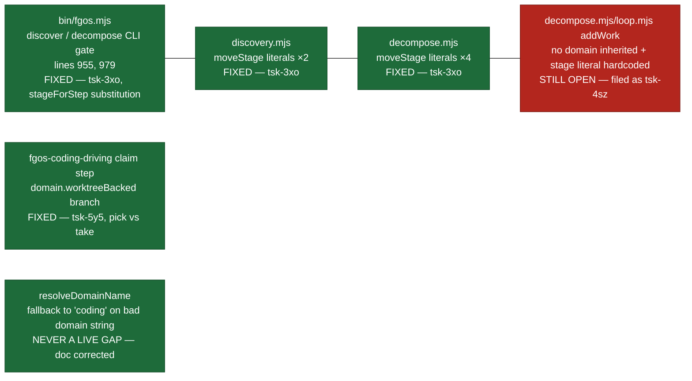

# fgos-routing vs fgos-coding-driving — multi-domain gap plan

Session discussion (2026-08-04) on how `fgos-routing` and `fgos-coding-driving`
collaborate, what "foundation soul + domain sidecar" should actually mean for
fgOS's multi-domain vision, and a brainstormer-agent pressure-tested, re-verified
plan for the concrete gaps found. Advisory only — nothing here has been
implemented. Findings logged as a decision on `tsk-3w3`; this report is the
fuller writeup requested afterward.

## 1. Architecture question: how do the two skills relate

Initial framing to correct: `fgos-routing` is not a governing "foundation" layer
above `fgos-coding-driving`, and `fgos-coding-driving` is not a "domain advisor"
providing higher-order judgment. Both are peer consumers of the same kernel.

- **Real foundation / cross-domain soul**: the `DOMAINS` registry in
  `src/state/workflow-stage-graphs.mjs` (pure data/code) — `stages`, `stepMap`,
  `transitions`, `skillMap`, `worktreeBacked` per domain. Already serves 2
  domains (`coding` real, `synthetic` illustrative/throwaway). The universal
  status FSM (`src/state/fsm.mjs`, `STATUSES` from `work.mjs`) is a *separate*
  axis, shared across all domains (not per-domain) — only `stage` is
  domain-scoped.
- **fgos-routing**: single-shot session entry point. Orient → claim one item →
  read `stage`/`domain` → resolve skill via `getDomain`/`skillForStage` → name
  it → stop. Never loops, never classifies domain (only reads the `domain`
  field already set at intake).
- **fgos-coding-driving**: autonomous loop wrapper other callers (`/fgOS:cook`,
  `/fgOS:pick`, sweeps) build on — drives one already-claimed item through
  multiple stages until a ceiling or person-shaped stop. Owns a whole
  stop-condition safety net (awaiting-human/blocked/awaiting-approval,
  anchored-by-children, no-progress, ceiling) that a single-shot skill
  structurally doesn't need. Resolves stage→skill via the *same* registry call
  routing uses — never invokes routing itself. Deliberately named
  `fgos-coding-driving`, not domain-neutral `fgos-driving` (decision "D12" in
  this repo's internal log): the loop body is already ~100% mechanically
  domain-agnostic, but the name stays scoped until a *real* second domain has
  actually been driven through it — `synthetic` never wired real skills into
  its `skillMap`, so there's no evidence yet, only a structural argument.
- Why not collapse into one skill (user's direct pushback): they solve
  different consumption modes of the same kernel — one interactive decision
  vs. an autonomous loop with its own safety bookkeeping. Merging would force
  every interactive call through loop-only machinery it doesn't need, or force
  the loop to re-derive "is this an interactive resume" every iteration.

Existing precedent for "domain sidecar strictness": `gate-bypass.mjs`'s
`level` knob, already consulted by `fgos-coding-exploring`'s/`fgos-coding-planning`'s own
approval gates (`canAutoApprove(item, artifact, level)`) — currently global,
not per-domain, but the template for extending strictness-injection per
domain the same way `worktreeBacked` is already per-domain.

## 2. First pressure-test pass (brainstormer, agent `aaf9472eac7ffdc19`)

Verified 3 findings by reading code, not guessing:

1. `src/intake/discovery.mjs`/`src/intake/plan.mjs` hardcode literal
   stage names (`'clarify'`, `'decompose'`, `'executing'`) instead of
   resolving via `stageForStep(domain, 'Clarify'/'Divide')` — flagged as a
   silent-overwrite risk for a second domain.
2. `fgos-coding-driving`'s claim step hardcodes `fgos pick` + worktree-enter
   unconditionally on entering the executing-stage skill, instead of branching
   on `domain.worktreeBacked` (a field the registry already exposes and
   `cleanup-harness.mjs` already consumes for the identical question).
3. `resolveDomainName` silently folds an unrecognized/typo'd `domain` string
   to `'coding'` instead of failing loud.

Also flagged: `skillMap` is stage→single-skill only (no multi-skill-per-stage
support yet); per-domain extra statuses would require touching the kernel FSM
directly (no domain param anywhere in `fsm.mjs`'s transition table).

These 3 were logged as a `fgos decision` on `tsk-3w3` (the multi-domain
milestone item) before the second pass below corrected them.

## 3. Second pass — re-verified against live code (agent `a6726d917c4779318`)

Explicitly re-read the repo instead of trusting the first pass from memory.
Materially revises findings 1 and 3.

### Finding 1 — real, and bigger than first scoped

**Not silent.** `stage.mjs`'s `transitionStage` is already domain-aware and
throws `FsmError('precondition'|'conflict')` on an unrecognized `(from,to)`
pair — a loud crash, not silent corruption. The `domains.mjs` header comment
and the decision text already logged on `tsk-3w3` both describe this wrong;
needs a correction (see Finding 3 below, folded together).

**A 4th hardcoded-literal call site found**, not in the original 3:
`bin/fgos.mjs` lines 955 and 979 hardcode `stage !== 'clarify'` /
`stage !== 'decompose'` as the sync CLI gate for the `discover`/`decompose`
verbs — a second domain's item can never reach `resolveDiscovery`/
`resolveDecompose` through the sync CLI at all.

**Confirmed call sites:**

| File | Line(s) | Hardcoded literal |
|---|---|---|
| `bin/fgos.mjs` | 955 | `if (stage !== 'clarify')` — `discover` verb gate |
| `bin/fgos.mjs` | 979 | `if (stage !== 'decompose')` — `decompose` verb gate |
| `src/intake/discovery.mjs` | 593-599, 663-669 | `moveStage(..., to:'decompose', expectedStage:'clarify', ...)` ×2 |
| `src/intake/plan.mjs` | 542, 604, 685, 759 | `moveStage(..., to:'executing', expectedStage:'decompose', ...)` ×4 |

**Real failure mode (corrected severity):** sync CLI path rejects outright
before reaching the engine (confusing error for a legitimately-staged
second-domain item). Runner sweep path (`loop.mjs`) is domain-aware at its
*entry* gate (`stageForStep(domain,'Clarify')`, line 975) so it correctly
picks the item up — but `resolveDiscovery`'s internal `moveStage` then throws.
That's caught by `runOnce`'s outer catch (`loop.mjs:1095-1104`) and turned
into a `halted` outcome for the whole tick — **one second-domain item with a
mismatched stage name blocks every other ready item, including unrelated
coding items, from dispatching that poll.**

**Test coverage: zero.** `test/e2e/synthetic-domain.test.mjs` deliberately
never exercises this path — its own header (and `domains.mjs` lines 32-40)
states `synthetic` "deliberately skips the discovery step" specifically to
sidestep this exact gap rather than test it.

**Fix shape:** replace literals with
`stageForStep(getDomain(work.domain), 'Clarify'|'Divide'|'Execute')`. No new
parameter needed — `work.domain` is already in scope at every call site.
Proven pattern already exists in the same neighborhood: `bin/fgos.mjs`'s own
`submitWork` (744-745) already does this substitution for stage assignment on
intake. For `coding`, `stageForStep(getDomain(undefined), 'Clarify') ===
'clarify'` (verified against the registry) — **zero-behavior-change refactor
for every existing coding item.**

**New test needed:** extend `synthetic` (or add a disposable second domain)
with a stage mapped to `Clarify`/`Divide` under a non-coding-literal name
(e.g. `triage` → Clarify), driven through `fgos submit --domain X` → sync
`fgos discover` → runner sweep. Assert: no throw, item lands on the domain's
own correct next stage, and a plain coding item in the same tick is
unaffected.

**Risk:** low-to-medium. 3 files, pattern already proven in adjacent code in
the same files. Run a live `impact()` GitNexus call before actual editing —
this session's `fgos tool query --capability impact-analysis` errored
("command not found"), so this pass fell back to manual grep/read
cross-checks per the capability gate's own fallback guidance; that fallback
is not a substitute for the real impact check at implementation time.

### Finding 2 — confirmed, but a scope judgment call, not an obvious bug

Two spots, unchanged: the "claim right before FIRST invocation" hard rule
(`fgos-coding-driving/SKILL.md` lines 97-119) and the loop pseudocode's claim
line (194-196). Neither branches on `domain.worktreeBacked`.

The skill's own doc explicitly disclaims exactly this generalization twice
(D9/D10) and lists "asserting this loop generalizes to a domain other than
coding without new evidence" as a Red Flag. Two legitimate options:

- **Fix now** — cheap (the field and branching pattern already exist and are
  proven by `cleanup-harness.mjs`), low risk, removes a landmine for whenever
  domain 2 arrives.
- **Defer** — strict YAGNI/D9: no real second-domain driving loop exists yet;
  fixing ahead of evidence is exactly the speculative generalization the
  skill's own philosophy argues against.

No test surface exists for skill-body prose in this repo. Risk trivial either
way — one file (+ `.agents/skills/` mirror), no code path, no coding
regression surface regardless of choice.

### Finding 3 — not a live gap; correct the record instead of the code

`validateWork` (`work.mjs:283-287`) already rejects any `work.domain` not in
`DOMAINS`, at every write door (`add`, `submit`, `edit`). `submitWork`
(`bin/fgos.mjs` 735-743) has a comment citing a named prior finding
("review-20260717-self-improve-base-workflow finding f3") explaining it
deliberately silences `getDomain`'s warn-fallback at intake *because*
`validateWork` is about to reject the bad value anyway. `resolveDomainName`'s
no-throw fallback is a deliberately locked, already-tested (`must_have`)
hot-path contract for `frontier.mjs`/`loop.mjs`/`stage.mjs` readers — a
mistyped domain is already rejected loudly at the door today.

**Action taken: documentation correction only, done.** Two places claimed
"silently overwritten" incorrectly; both corrected:

- `domains.mjs` lines 32-40 (the `synthetic` domain's own doc comment) —
  rewritten to state the real behavior (throws `FsmError`, halts the runner
  tick — Finding 1 / `tsk-3xo`), not a silent overwrite.
- The decision log on `tsk-3w3` (append-only — the original wrong sentence
  in decision 0 can't be edited in place) — a new decision appended
  explicitly correcting both wrong claims from decision 0: the "silent
  stage overwrite" framing and the `resolveDomainName` "never errors"
  framing.

Correct statement: the write door already rejects a bad domain; the only
remaining theoretical risk is a domain *removed* from `DOMAINS` in a future
release while old events still reference it — where folding to `coding` is
arguably correct graceful degradation, not a bug.

Risk: zero — comment/decision-text only, no code path or test changed.

### Adjacent gap found, not part of the original 3 — flagging only

`decompose.mjs`'s child `addWork` (lines 741-756) never sets `domain` on
children — every decomposed child lazy-defaults to `coding` regardless of the
parent's real domain. Same for `loop.mjs`'s discovered-from auto-created
items. Will bite the moment Finding 1 is fixed and a real second domain
actually uses decompose. Not scoped into the plan below — noted so it isn't
lost; see open question 3.

## 4. Sequencing

No real dependency between the 3 findings — disjoint files:

| Finding | Files touched | Depends on another finding? |
|---|---|---|
| 1 | `bin/fgos.mjs`, `discovery.mjs`, `decompose.mjs` | No |
| 2 | `fgos-coding-driving/SKILL.md` (+ `.agents/` mirror) | No |
| 3 | `domains.mjs` comment, `tsk-3w3` decision text | No |

Recommended order if sequencing matters at all: Finding 3 first (near-zero
cost, corrects the record before anyone builds on the wrong claim), Finding 1
whenever domain-2-readiness work is actually picked up (the one item with
real functional payoff), Finding 2 whenever the fix-now-vs-defer call is made
— it neither gates nor is gated by the other two.

## 5. How this should land in fgOS's item system

**Recommendation: 2 items, not 1, not 3, neither folded into `tsk-38t`.**

- **Item A — filed as `tsk-3xo`, DONE.** Bundled Finding 1's real fix + its
  new test + Finding 3's doc correction. Implemented, verified (`npm test`
  full suite green, 2459/2464, 5 unrelated skips; new
  `test/e2e/domain-aware-stage-literals.test.mjs` 2/2 pass), merged to main,
  retrospective-synthesized into
  `docs/how-to/make-discover-decompose-domain-aware-via-stageforstep.md`,
  linked as a **child of `tsk-3w3`** (`parent: tsk-3w3`), status `cleanup`
  (parked briefly at `blocked` — reason "only 0d elapsed since entering
  cleanup, TTL is 7d" — mechanical TTL park, not a problem; resolves itself
  once the 7-day window elapses and `fgos cleanup` re-runs).
- **Item B — filed as `tsk-5y5`, DONE.** Fix-now was chosen (open question 1
  below, now resolved). Root cause sharpened past the original framing:
  `claimWork` (`src/runner/claim-port.mjs:88`) already exposes `isolate`
  (`true` = `pick`/worktree, `false` = `take`/no worktree, stage-agnostic —
  `take` already claims executing-stage items too, per `bin/fgos.mjs:1787`).
  Implemented as a prose-only branch in `fgos-coding-driving/SKILL.md` (+
  `.agents/` mirror) choosing `pick` vs `take` by `domain.worktreeBacked`, no
  `bin/fgos.mjs` change — matched the plan exactly. Merged, retrospective-
  synthesized into `docs/how-to/branch-fgos-coding-driving-claim-step-by-
  domain-worktreebacked.md`, linked as a **child of `tsk-3w3`**, status
  `cleanup`.

**Relative to `tsk-31l`** (unify `/fgOS:discover`/`decompose`/`discover-next`
dispatch through `fgos-routing`/`fgos-coding-driving`): confirmed independent
by `tsk-31l`'s own item text, which explicitly excludes touching
`discovery.mjs`/`decompose.mjs` engine internals and excludes generalizing
`fgos-coding-driving` beyond coding (same D10 boundary Finding 2 sits
against). No file overlap with Item A/B. Can run before, after, or in
parallel with no coordination needed.

**Relative to `tsk-38t`'s acceptance criterion #7** (`DOMAINS` registry being
a hardcoded `Object.freeze` in source, not runtime-addable): orthogonal, not
blocking either direction. Item A doesn't need `DOMAINS` to become
runtime-configurable — both `coding` and `synthetic` already have real
`stageForStep` primitives; the bug is *consumers* not calling them, not the
registry's shape. Conversely, resolving #7 alone (making domains addable
without a code change) would not fix Item A's bug — a runtime-added domain
would hit the same hardcoded literals immediately. Worth stating wherever
this gets filed: **Item A is a prerequisite-quality fix that makes #7's
eventual feature safe to ship** — without it, even a hardcoded-source second
domain crashes the runner the moment it reaches Clarify/Divide.

## 6. Open questions — resolved / still open

1. **Finding 2 — fix now or defer? RESOLVED: fix now.** Done as `tsk-5y5`,
   merged.
2. **Finding 3 — doc-only, or defense-in-depth too? RESOLVED: doc-only.**
   Closed as a comment/decision-text correction in
   `src/state/workflow-stage-graphs.mjs` — no code change, no test. No
   defense-in-depth was added; if the domain-removed-from-registry scenario
   becomes real, revisit then.
3. **Adjacent gap — expanded and filed as `tsk-4sz`.** Confirmed still true
   post-`tsk-3xo` merge (Item A's scope was the 4 hardcoded-literal
   `moveStage` call sites only, never `addWork`). Turns out to be bigger
   than originally logged: `decompose.mjs`'s child `addWork` (744-756) and
   `loop.mjs`'s discovered-from `addWork` (593-604) don't just skip
   `domain` — both ALSO hardcode `stage: 'executing'`/`'clarify'` literally,
   the same pattern Finding 1 fixed, in the same two call sites. Evidence
   it's being actively avoided, not just untested:
   `test/e2e/domain-aware-stage-literals.test.mjs` deliberately uses verdict
   `pass-through` ("single fixture item, no split needed") specifically to
   dodge exercising the child-creation path for domain `triage`. The
   original YAGNI-defer rationale ("no domain 2 exists yet to trip over it")
   is weaker now — `tsk-48i`/`tsk-1hb` shipped real infrastructure
   (`parkReasonForStatus`) on top of the multi-domain registry, proving
   real development is already happening there.
4. **GitNexus impact-analysis check — RESOLVED retroactively.** GitNexus is
   now confirmed `present` (`fgos tool query --capability impact-analysis`),
   unlike the "command not found" state during planning. A retroactive
   `impact(stageForStep, upstream, depth 2)` on the now-merged code found 12
   impacted symbols, `risk: CRITICAL` — expected for a hub function
   (`resolveDiscovery`/`resolveDecompose`/`frontier`/`anti-loop`/`loop.mjs`
   all call through it), not a sign of a missed regression: `tsk-3xo` never
   changed `stageForStep`'s own signature or behavior, only added correctly-
   formed call sites in 3 files that already depended on it. The full suite
   (2459/2464 green) plus the new e2e fixture already provided evidence
   proportionate to that fan-out; the retroactive check confirms the risk
   level, finds nothing new. Logged as a decision on `tsk-3w3`; closed.

Updates since this report was first written, on `tsk-3w3`'s three deps:
**`tsk-3p1`** closed **`wontfix`** (stuck on its own unresolved RUL12
semantics question, never answered) — `wontfix` still counts as *resolved*
(`RESOLVED_STATUSES`, `src/state/frontier.mjs:186`), so it doesn't block.
**`tsk-38t`** is now **`delivered`** (split into 8 children, all delivered,
parent verify green) — also resolved. Only **`tsk-2rp`** (`verifyKind`
for `manual-confirm` goal-check timing) is still `awaiting-human` — the
one thing left blocking `tsk-3w3`.

## 7. Diagrams

Same design as sections 1-3, drawn out. Five diagrams: the shape, each
dispatch skill's own flow, how they connect end to end, and where the four
findings from section 3 sit on that flow.

### 7.1 Shape — kernel, two peer consumers, stage skills, callers

Neither dispatch skill classifies a `domain` — that's set upstream at intake.
Neither calls the other as a subroutine; both resolve stage→skill through the
same registry function.

### 7.2 fgos-routing — single-shot

No stop-condition machinery here — that structurally belongs to the loop
below, not to a one-decision skill.

### 7.3 fgos-coding-driving — the loop

Six exits, every one a report back to the caller — the loop never decides
what happens next on its own authority.

### 7.4 End-to-end drive, one coding item, no ceiling

The shaping→proving split inside `decompose` is a direct hand-off between
two stage skills, not a second pass through the registry — the registry maps
`decompose` to `fgos-coding-planning` only, as the entry-point default.

### 7.5 Where the four findings sit — updated post-implementation

Original coloring (red/amber = open) is stale as of `tsk-3xo`/`tsk-5y5`
merging — updated to reflect what's actually fixed vs. still open today.

**Green — fixed, merged, retro-synthesized:** `tsk-3xo` (CLI gate + both
`moveStage` files, verified `npm test` full suite + new e2e fixture,
retroactive GitNexus `impact()` confirms only expected hub fan-out, no new
gap), `tsk-5y5` (claim step now branches on `domain.worktreeBacked`), and
the `resolveDomainName` doc correction (never a live gap — `validateWork`
already rejected a bad domain at every write door).

**Red — still open, filed as `tsk-4sz`:** decompose/discovered-from
children neither inherit `work.domain` nor resolve their own `stage`
through `stageForStep` — same hardcode-literal shape Finding 1 fixed, in
`addWork`'s call sites instead of `moveStage`'s.

## 8. Would fgos-routing rename to fgos-domain-routing today?

Follow-up question raised after the diagrams: since `fgos-routing`'s body
(orient → claim → read stage/domain → `getDomain`/`skillForStage` → name one
skill → stop) is already close to domain-neutral by construction, would
renaming it to something like `fgos-domain-routing` be close to a no-op
design-wise? Partially yes, partially no.

**Where the instinct holds:** the mechanical steps carry no coding-specific
literals — unlike `fgos-coding-driving` before Finding 2, routing's own body
never hardcodes a coding assumption. Less would need to change here than had
to change in the loop skill.

**Where it doesn't — two real gaps, both in the skill's own prose, not the
registry:**

1. Routing's "Route by stage" table's `decompose` row splits into "shaping"
   vs "proving" (→ `fgos-coding-planning` vs `fgos-coding-validating`) — a judgment call
   routing itself makes in prose, not something `skillForStage` returns (the
   registry maps `decompose` → `fgos-coding-planning` only, as the entry-point
   default). A domain without a stage named `decompose`, or with different
   shaping/proving semantics, has no equivalent split defined anywhere for
   routing to fall back on. This would need real generalization work, not a
   rename.
2. Renaming ahead of the Finding 1 fix (section 3, Finding 1) would be a
   claim ahead of evidence: routing could correctly name `fgos-coding-exploring` for
   a domain-2 item, but that stage skill's own engine-verb call
   (`fgos discover`) would still crash on the hardcoded literal underneath.
   Naming the dispatcher "domain-routing" while the kernel beneath it still
   can't cross Clarify/Divide for a second domain overstates what's actually
   true.

**Symmetry with the D9/D10/D12 discipline already governing
`fgos-coding-driving`:** that skill stays scoped-named until a *real* second
domain has actually been driven through it, not just structurally argued to
work. The same bar applies to `fgos-routing` — it hasn't routed a real
domain-2 item through its own shaping/proving judgment either. Renaming now
would be the identical premature-generalization pattern this repo's own
decisions already reject for the sibling skill.

**Net:** don't rename yet. When domain 2 is real: fix Finding 1 first,
generalize the shaping/proving split (or explicitly scope it as coding-only
prose layered on a domain-neutral base), then drive a real domain-2 item
through routing end to end — only then does a rename reflect reality rather
than assert it.

## References

- `tsk-3w3` — multi-domain-readiness milestone; carries the (now partially
  outdated) decision log from the first pressure-test pass.
- `tsk-38t` — Phase 2 status/statusCategory split; now `delivered`;
  orthogonal axis, was never a dependency of Item A.
- `tsk-31l` — discover/decompose/discover-next dispatch unification; confirmed
  independent, no file overlap.
- `plans/reports/research-260730-0931-work-item-schema-multi-domain-upgrade-report.md`
  — prior research this session's findings sit alongside, different scope
  (status/kind schema, not stage/domain-routing).
