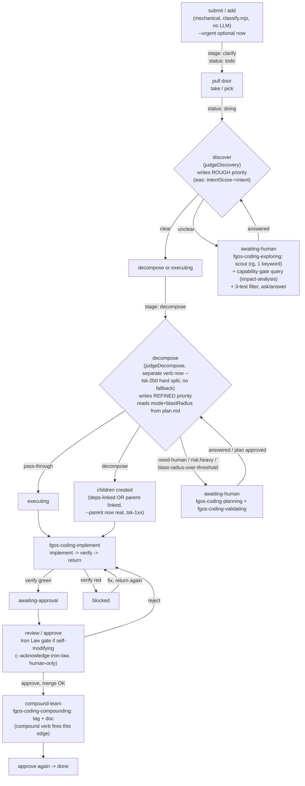

# Work-item pipeline refresh: state after `tsk-4y5`/`tsk-17w`/`tsk-1xx` merged

Report, same structure as `docs/reference/work-item-pipeline-stages-verbs-and-handoffs.md`
(that file's own pre-feature snapshot, 2026-07-31). Scope: what actually
changed in the day-to-day pipeline now that all three items are merged to
`main`, verified by re-reading the real source at merge time — not a
repeat of that file's own content.

## Stage/status flow (updated)

Note the two-step approve in practice (`N`): `compound` fires the
`executing→compound-learn` edge but does not itself flip status to
`done` — `approve` refuses `done` while stage is still `executing`
(FSM guard), so a `compound` + doc-write + a second `approve` pass is
the real observed sequence, not a single call. Neither existing doc
had this exact detail confirmed by a live run before now.

## What actually changed for daily use

| Area | Before | Now | Risk to daily flow |
|---|---|---|---|
| `add`/`edit` flags | `--priority`/`--intent`/`--docs-ref`/... | + `--urgent`/`--impact`/`--effort` (`tsk-4y5`), + `--parent` (`tsk-1xx`, gap #1 below is now CLOSED) | None — purely additive |
| `priority` | Explicit-only (STR7), absent=sorts-last | Also auto-written by `discover`/`decompose` on every clarify/decompose pass, rough then refined | **Real gap, see below — no guard against clobbering a human's explicit `edit --priority`** |
| `intent` | Auto-written at clarify | Retired in place — stops being written for new items; old data/flag untouched | None for old items; new items simply never populate it |
| `list`/`ready`/`triage` order | Most items had no `priority` (tie-broken by `intent`/FIFO) | Most NEW items now carry a real computed `priority` number, actively sorting ASC | **Expect visible reordering** for anything processed after this merge — not a bug, but a surprise if unannounced |
| `decompose`'s human gate | Only `risk: heavy` (keyword) forced `awaiting-human` | + blast-radius over threshold (20) also forces it, independently | **More items may pause for confirmation** than before, even when `risk` looks light |
| `fgos-coding-exploring` | No capability query | Now also runs `fgos tool query --capability impact-analysis` (`tsk-17w`) | Low — one more read-only line in the scout step |

## Known gaps — status after merge

1. ~~**`parent` field has no CLI writer.**~~ **RESOLVED (`tsk-1xx`, merged).**
   `add --parent`/`edit --parent` are real now (`src/cli/command-registry.mjs:82,227`,
   `bin/fgos.mjs:783,1046-1050`). `fgos-coding-planning`'s SKILL.md step 5 can
   actually be executed as written today.
2. ~~**`clarify` has no capability-gate for `impact-analysis`.**~~ **RESOLVED
   (`tsk-17w`, merged).** `fgos-coding-exploring/SKILL.md` now queries it too,
   matching `fgos-coding-planning`/`fgos-coding-validating`/`fgos-coding-implement`.
3. **NEW — `priority` has no "don't clobber an explicit human value"
   guard.** Verified by direct read: `resolveDiscovery`
   (`src/intake/discovery.mjs:309-310`) and `resolveDecompose`
   (`src/intake/plan.mjs:394-401`) both call
   `editWork(dir, { id, patch: { priority }, role })` unconditionally —
   neither checks whether the item already carries a `priority` a human
   set via `edit --priority` before this pass ran. `docs/history/
   work-item-priority-matrix/CONTEXT.md` D6 only guarantees the override
   door stays open ("a human keeps the same override door... to force a
   value at any time"), never that a forced value survives the *next*
   automated pass (every re-clarify after an answer, and the decompose
   refined pass, both recompute unconditionally). Not yet filed as its
   own item.
4. **NEW — the `approve` → `done` edge is two calls in practice, not
   documented anywhere as such until this report.** `compound` opens
   `executing→compound-learn`; a second, separate `approve` call (git
   merge again, now idempotent on an already-merged branch) is what
   actually reaches `done`. Confirmed live on `tsk-4y5` itself this
   session — first `approve --acknowledge-iron-law` merged the code but
   refused the `done` flip (`stage` was still `executing`); `compound`
   + doc write + a second `approve --acknowledge-iron-law` finished it.

## Sources (verified 2026-07-31, post-merge)

`src/intake/discovery.mjs`, `src/intake/plan.mjs`,
`src/cli/command-registry.mjs`, `bin/fgos.mjs`,
`.claude/skills/fgos-coding-exploring/SKILL.md`,
`docs/history/work-item-priority-matrix/CONTEXT.md`/`plan.md`,
`docs/reference/priority-formula-and-intent-retirement.md`, live
`fgos show tsk-1xx`/`tsk-17w`/`tsk-4y5` output, and this session's own
live `approve`/`compound` run against `tsk-4y5`.

## Unresolved questions

- Should gap #3 (priority-clobber) file as its own item now, or fold into
  a future refinement of `tsk-4y5`'s own design? Not decided.
- Should `docs/reference/work-item-pipeline-stages-verbs-and-handoffs.md`
  itself be edited in place to fold this report's updates in, or stay as
  a dated snapshot with this report as the delta? Not decided — this
  report was written standalone per the explicit ask, not merged into
  that file.
