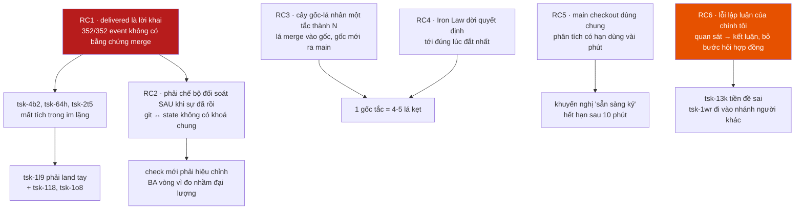

# Vì sao việc này phức tạp đến thế — dò lại tiến trình

**Ngày:** 2026-08-12 · **Phạm vi:** cả phiên, từ kiểm toán vòng 2 cây `tsk-5sr`
đến lúc dừng · **Cách làm:** đo trên `.fgos/events.jsonl` và git thật, không
dựa vào trí nhớ phiên.

---

## Kết luận một dòng

fgOS **mô hình hoá công việc bằng item, nhưng giao công việc bằng commit — và
không có gì ràng buộc hai thứ đó với nhau.** Mọi rối rắm của phiên này đều mọc
ra từ đúng đường nối đó.

Số đo dứt điểm:

```
work.move -> delivered : 352 lần, 345 item khác nhau
hình dạng payload      : 352/352 giống hệt nhau — keys = ('role',)
```

**Không một lần nào** mang sha merge, tên nhánh đích, hay bất kỳ bằng chứng
nào. Nghĩa là trong sổ sự thật của fgOS, *"đã giao"* là một **lời khai**, không
bao giờ là một **sự kiện đã kiểm chứng**. Không thể phân biệt một item merge
thật qua `approve` với một item bị gõ tay `move --to delivered` — bằng chính
dữ liệu mà hệ thống ghi.

---

## Chuỗi nhân quả



---

## RC1 — `delivered` ghi được mà không cần chứng minh gì

`fgos move <id> --to delivered` không merge gì và không đòi bằng chứng đã
merge. `fgos approve` thì merge thật. **Hai đường để lại dấu vết giống hệt
nhau.**

Hệ quả đã xảy ra **ba lần trước phiên này và hai lần trong phiên này**:
`tsk-4b2` (tsk-13z phải vét), rồi `tsk-64h` và `tsk-2t5` (tsk-1l9 phải vét).
Mỗi lần đều là việc đã viết, đã test, đã review — nằm ngoài `main` mà không ai
biết, cho tới khi có người đọc đồ thị bằng tay.

Đây là gốc rễ. Toàn bộ phần còn lại của phiên là hậu quả.

## RC2 — Bộ đối soát bị buộc phải chế sau, và bài toán đó khó thật

Vì state không giữ sha, câu hỏi *"việc này đã lên main chưa"* không tra được —
phải **suy ra** từ git. Và suy ra thì có ba cái bẫy, tôi dính đủ ba, mỗi cái
một vòng hiệu chỉnh:

| Vòng | Đo nhầm gì | Ca lộ ra |
|---|---|---|
| 1 | "nhánh chưa merge" ≠ "việc bị mất" | `tsk-67g` đủ nội dung trên main, vẫn bị hô mất |
| 2 | merge commit **không có patch-id** nên `--cherry-pick` không bao giờ khớp | `fgw/tsk-19y`: 5 commit ahead, **0 file** khác fork point |
| 3 | `root-drift` (check có sẵn) mang y nguyên lỗi vòng 1 | `fgw/tsk-4n7`, `fgw/tsk-19y` bị hô drift vĩnh viễn, không lệnh nào xoá được |

Ba vòng này **không phải tôi cẩu thả** — mỗi vòng là một phân biệt thật giữa
*ref* và *nội dung*. Nhưng cả ba sẽ **không tồn tại** nếu lúc `approve` merge
xong nó ghi sha vào chính event `delivered`. Khi đó câu hỏi là một phép tra
cứu, không phải một bài suy luận trên đồ thị git.

Chi phí: gần trọn một phiên, ba lần sửa cùng một file.

## RC3 — Cây gốc-lá biến một chỗ tắc thành N chỗ kẹt

Lá merge vào `fgw/<gốc>`, chỉ gốc mới ra `main`. Nên **một** gốc bị chặn thì
**toàn bộ** lá đã xong nằm kẹt sau nó.

`tsk-51m` đầu phiên: 5 con, 2 `delivered`, kẹt. Cuối phiên: 4 `delivered`, vẫn
kẹt, gốc phình từ 13 lên 31 commit. Số chỗ tắc là O(1), số việc kẹt là
O(số con).

Và `fgos stale` không thấy được: ngưỡng 3 ngày, mà lại báo *"bị quên"* chứ
không phải *"chưa merge"*.

## RC4 — Iron Law dời quyết định tới lúc đắt nhất

Bằng chứng viết lúc **implement**; cổng bật lúc **merge**, có thể nhiều ngày
sau, khi nhánh đã phình. Người phải quyết trong bối cảnh đã thay đổi.

Nặng hơn, quét 181 file bằng chứng trên `main`: **5 file tự khai có khoảng
trống** — và **4/5 nằm trong đúng hệ con merge/lock/claim**:

```
tsk-3dt · tsk-1zq · tsk-3jk · tsk-3bn-merge-conductor-harness-v2
(+ gate-approve-vs-movenext-semantics)
```

Không ngẫu nhiên: `tsk-xyr` **viện dẫn `tsk-3bn` làm tiền lệ** cho khoảng trống
của chính nó. Tức đây là một **dây chuyền tiền lệ** lan trong một hệ con, chứ
không phải vài ca lẻ. Cổng vì thế tích lại một hàng đợi quyết định-người treo,
đúng ở hệ con cần chúng nhất.

Điểm đáng khen: **các file đó rất trung thực** — chúng tự tố cáo mình thay vì
diễn. Đó là lý do đọc được ra. Vấn đề không phải người viết, mà là cơ chế đẩy
nợ tới cuối.

## RC5 — Main checkout dùng chung: phân tích có hạn dùng vài phút

238 nhánh `fgw/*` tồn tại; nhiều phiên chạy song song. Trong phiên này:

- `fgw/tsk-51m`: 13 → 17 → 23 → 31 commit
- `fgw/tsk-2sj`: 21 → 27 → **land** — trong lúc đang nói chuyện
- `tsk-xyr`: `doing` → `delivered` **giữa hai lần đo của tôi**, làm Iron Law
  nhảy từ 1 module lên 3

Khuyến nghị "`tsk-51m` sẵn sàng ký" của tôi **hết hạn trong chưa tới 10 phút**.
Không phải tôi ẩu — bất kỳ bằng chứng nào gom trên nhánh đang chạy cũng thế.
Bài học đã ghi vào `tsk-1o8`: **phải gom lại ngay trước khi ký**.

## RC6 — Lỗi của chính tôi, và nó có một khuôn

Ba lần bị chặn, cùng một hình dạng: **nhảy từ quan sát sang kết luận, bỏ mất
bước hỏi "hợp đồng ở đây là gì".**

| Quan sát | Tôi kết luận | Sự thật |
|---|---|---|
| nhánh `delivered` chưa vào main | "mất ~12.000 dòng" | đo nhầm đại lượng; thiếu thật **1 commit doc** |
| `tsk-3dt` khai không failing-test-first | "thiếu test → nộp tsk-13k" | test **đã có sẵn**; thiếu là **thứ tự**, không sửa được bằng viết thêm |
| test hai tiến trình đỏ | "lỗi thật, nghiêm trọng" | ca đó **chưa được đặc tả**; thiết kế chưa bao giờ hứa |

Cộng một lỗi ranh giới: coi *"item là của tôi"* đồng nghĩa *"được ghi vào nhánh
gốc của item khác"*.

---

## Nếu chỉ sửa được một thứ

**Ghi sha merge vào chính event `delivered`.**

Một trường. Nó xoá sạch RC1, làm RC2 thành thừa (câu hỏi thành phép tra cứu,
`delivered-not-on-trunk` và cả ba vòng hiệu chỉnh của nó trở nên không cần),
và làm RC3 nhìn thấy được ngay ngày xảy ra thay vì sau ba ngày TTL.

Kèm theo, rẻ và cùng hướng: **`move --to delivered` phải từ chối** khi nhánh
`fgw/<id>` tồn tại mà chưa reachable từ trunk, trừ khi có cờ ghi đè có lý do —
biến lời khai thành sự kiện có kiểm.

Hai thứ đó cộng lại rẻ hơn nhiều so với bộ đối soát mà phiên này vừa phải chế.

---

## Câu chưa trả lời được

1. Trong 345 item từng đạt `delivered`, bao nhiêu đi qua `approve` thật và bao
   nhiêu bị gõ tay? **Không truy được** — dữ liệu đã ghi không phân biệt nổi.
   Đây vừa là câu hỏi, vừa là bằng chứng mạnh nhất cho RC1.
2. 238 nhánh `fgw/*` còn tồn tại: bao nhiêu là ref chết nên dọn? Chưa quét.
3. Dây chuyền tiền lệ ở RC4 nên xử thế nào — siết lại chuẩn, hay thừa nhận
   "informed tradeoff" là một hạng bằng chứng hợp lệ và đặt tên cho nó?
