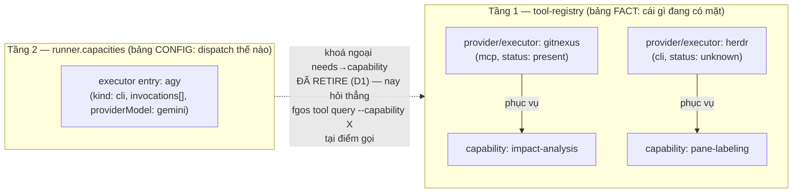
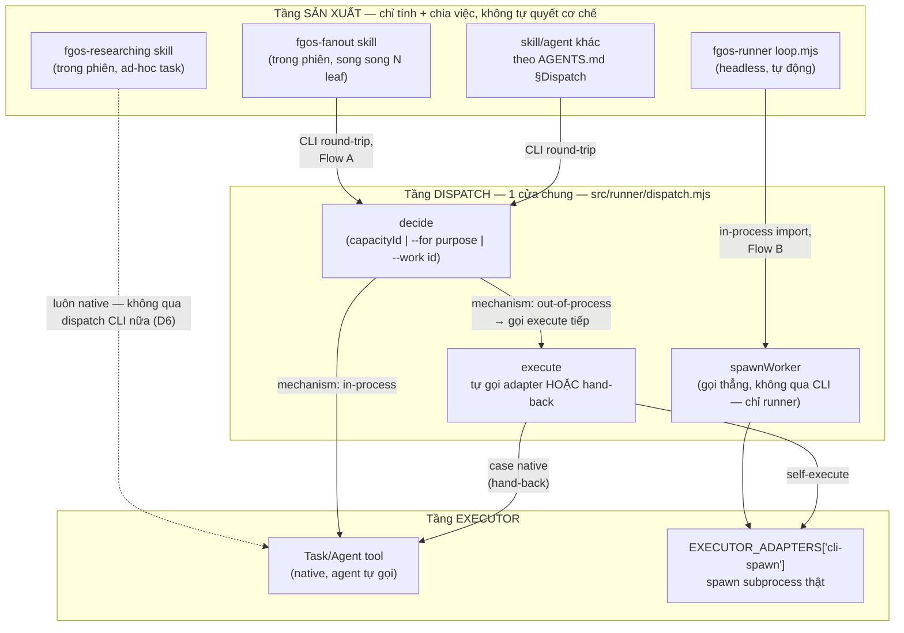
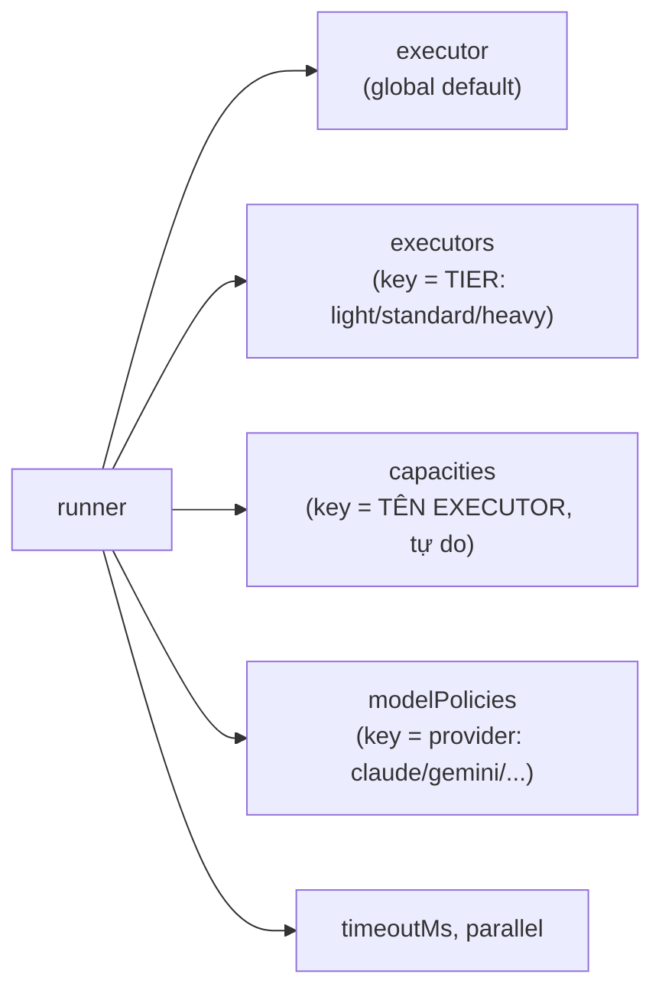
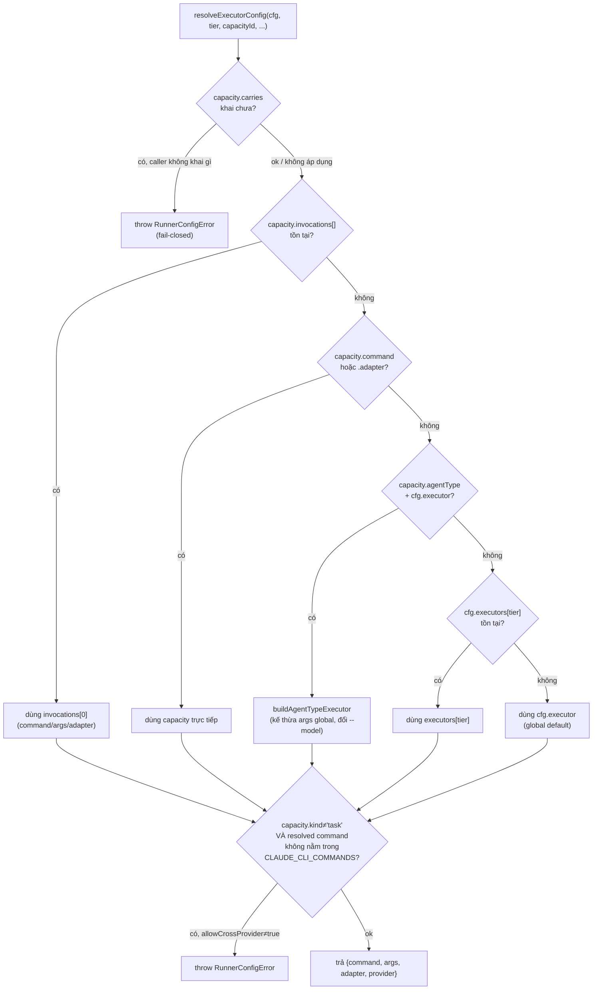
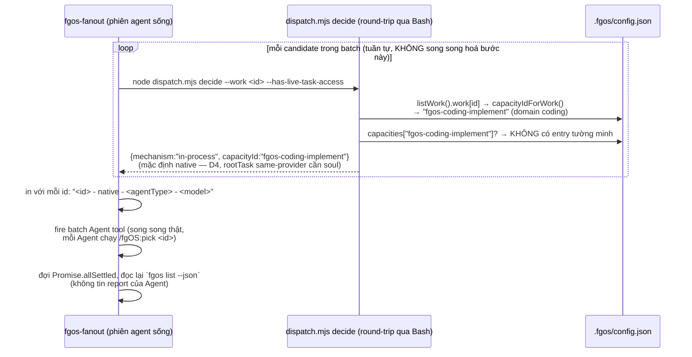
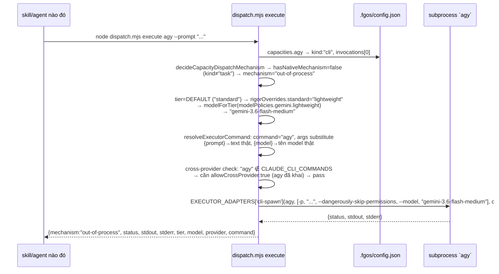
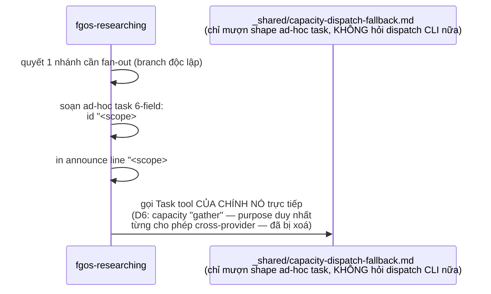

# Task Dispatch System — Spec Documentation

Tổng hợp từ `tsk-5tm` (task-dispatch-unification, D1-D12) + 6 con
(`tsk-5tm-1..6`) + `tsk-2te` (viết contract vào `AGENTS.md`) + `tsk-1qn`
(review, không bug) + `tsk-4w4` (dọn 2 capacity chết `judge-discovery`/
`judge-decompose`, landed sau tsk-1qn). Đối chiếu trực tiếp với code đang
chạy trên `main` (`src/runner/dispatch.mjs`, `.fgos/config.json`,
`.agents/skills/fgos-fanout/SKILL.md`, `.agents/skills/fgos-researching/
SKILL.md`, `.agents/skills/_shared/capacity-dispatch-fallback.md`,
`AGENTS.md`) — mọi số dòng/tên hàm dưới đây là số dòng THẬT tại thời điểm
viết tài liệu này (2026-08-15), không phải trích từ bản nháp thiết kế.

Nguồn gốc: đây là phần mở rộng đúng phạm vi đã khoá của `tsk-3ik`'s D3
(Native-First Dispatch Doctrine Phase 4) sang 1 loại target D3 chưa phủ
tới — `fgos-fanout`. Doctrine gốc: `docs/decisions/0026-vision-
orchestrator-roottask-capacity-native-vs-cli-spawn.md`.

---

## 1. Khái niệm cốt lõi

Cặp khái niệm nền (DISCUSSION.md vòng 1, đoạn b — verdict giữ 2 bảng tách
riêng): **capacity = lời hứa, executor = hiện thực hoá lời hứa.** Ví dụ
chuẩn: `impact-analysis` là 1 capacity; GitNexus là executor phục vụ nó.
Một capacity có 0..N executor — capacity-với-0-executor là trạng thái bằng
chứng HỢP LỆ (chính là 3 mức Inactive/Degraded/Full của impact-analysis
gate trong `CLAUDE.md`), không phải config lỗi.

| Khái niệm | Nghĩa | Nguồn |
|---|---|---|
| **task** | Khái niệm tổng quát (mượn vocab marketing-cockpit) bao trùm 4 hình dạng dưới đây — bất cứ thứ gì cần dispatch ra khỏi lượt hiện tại | D4 |
| **capacity** (capability) | LỜI HỨA — năng lực trừu tượng hệ thống cần, độc lập với việc ai phục vụ: `impact-analysis`, `pane-labeling`, purpose `judge`. Trục JOB. | vòng 1 đoạn b |
| **executor** | HIỆN THỰC HOÁ lời hứa — 1 tool/agent cụ thể: `gitnexus`, `herdr`, `agy`, `claude`. KHÔNG gọi "backend" (khớp code/ADR0042/marketing-cockpit). Trục MECHANISM. | D2 |
| **entry `runner.capacities.<id>`** | Bản đăng ký DISPATCH của 1 **executor** — key là TÊN EXECUTOR (từ tsk-5tm-4). Tên field JSON vẫn là `capacities` CHỈ vì D11 (tránh va chạm `cfg.executors` tier-keyed) — *"từ 'executor' vẫn dùng để GỌI TỪNG ENTRY, không phải tên field JSON"* (D11 nguyên văn). Đọc field name mà suy ra "mỗi entry là 1 capacity" là sai — chính lỗi tài liệu này từng mắc ở bản đầu. | D2/D11 |
| **provider** (tool-registry) | Cách bảng fact Tầng 1 gọi executor đang có mặt trên máy — cùng phía hiện-thực-hoá, khác tầng: tool-registry ghi NHẬN SỰ THẬT (executor nào tồn tại, phục vụ capability nào, `status` ra sao), còn `runner.capacities` ghi CẤU HÌNH DISPATCH (executor nào gọi được, bằng lệnh gì) | — |
| **adapter** | Cơ chế spawn thật đứng sau 1 executor (`EXECUTOR_ADAPTERS` key, hôm nay chỉ có `cli-spawn`) | CTR009 v2 |
| **for** | Trục JOB — việc được giao, dùng purpose-lookup (enum hiện tại: `['judge']`, sau khi D6 xoá `'gather'`) | D3 |
| **needs** | Trục MECHANISM — cơ chế phải có mặt để chạy. Khái niệm còn giữ, nhưng field trên `capacities.<id>` **đã retire** (D1) — hỏi presence/staleness qua `fgos tool query` thay vì dispatch tái tạo gate này | D1/D3 |
| **mechanism** | Kết quả quyết định của dispatch — 3 giá trị, xem §5.3 | D5 |
| **tier** | `light` / `standard` / `heavy` — nhãn 3 mức trên `work.tier`, KHÔNG đổi (D9 chỉ đổi cách nó ánh xạ ra tên model) | — |
| **policy tier** | `lightweight`/`standard`/`creative`/`analytical`/`critical` — 5 mức thật của `modelPolicies`, tier 3-mức map vào qua `DEFAULT_TIER_TO_POLICY` (mặc định `light→lightweight`, `standard→standard`, `heavy→critical`) hoặc `rigorOverrides` riêng của từng capacity | D9 |
| **providerModel** | Capacity tự khai mình đọc bảng `modelPolicies` nào (`claude`/`gemini`/...) — không khai thì mặc định `claude` | D9 |
| **carries** | Trục permission nội dung — `user-text` (hẹp) vs `repo-content` (rộng); capacity khai `carries` thì caller BẮT BUỘC tự khai dispatch này mang gì, fail-closed nếu thiếu | tsk-5td D15 |
| **allowCrossProvider** | Cổng chặn 1 capacity `kind≠"task"` resolve ra lệnh không phải Claude CLI, trừ khi tự khai `true` | tsk-32n |

### Hai bảng, một khoá ngoại (đã retire)



Hai bảng cố tình KHÔNG gộp (verdict vòng 1): Tầng 1 trả lời *"lời hứa X có
ai phục vụ không, còn tươi không"* (`fgos tool query --capability
impact-analysis --status present`); Tầng 2 trả lời *"executor Y gọi bằng
lệnh gì, model nào, qua adapter nào"*. Field `needs` từng là khoá ngoại nối
hai bảng — đã retire (D1) vì chết 100% với mọi entry `kind:"task"`; nơi hỏi
presence/staleness chuyển hẳn sang Tầng 1 tại điểm gọi. Một executor có thể
có mặt ở cả hai bảng (gitnexus hôm nay chỉ ở Tầng 1 — agent gọi MCP trực
tiếp, chưa từng cần entry dispatch; agy hôm nay chỉ ở Tầng 2 — entry
tool-registry của nó đã xoá cùng capacity `gather` theo D6).

### 4 hình dạng "task"

| Hình dạng | Ý nghĩa | Trạng thái |
|---|---|---|
| `work` | work-item đầy đủ lifecycle (claim/stage/status) | sống — `fgos-fanout` sinh |
| `childwork` | exec-packet B2, ghi file, id ephemeral | **GATED** — chưa ship |
| `capacity` (tên shape theo D4; đọc đúng: *dispatch qua 1 executor đã đăng ký*) | job gửi tới 1 executor entry trong `capacities.<id>` | sống — hôm nay đúng 1 executor entry thật: `agy` |
| `ad-hoc task` | 6-field runtime-composed (`id`/`goal`/`inputs`/`boundary`/`expected shape`/`return contract`), `id` dạng `<scope>#p<n>` cố ý invalid `ID_PATTERN` | sống — `fgos-researching` dùng cho mọi fan-out branch |

---

## 2. Kiến trúc tổng quan



Điểm mấu chốt: **tầng sản xuất không bao giờ tự quyết cơ chế** — nó chỉ
sinh ra 1 trong 4 hình dạng task rồi hỏi dispatch. `dispatch.mjs` áp 4 quy
tắc của Native-First Dispatch Doctrine (`docs/decisions/0026`) tại
RUNTIME, không phải build-time.

---

## 3. Nguồn kích hoạt dispatch — 3 cấp

### Cấp 1 — Runner tự động (Flow B, in-process, headless)

`src/runner/loop.mjs` import thẳng `spawnWorker`/`modelForTier` từ
`dispatch.mjs` (dòng 79) — KHÔNG qua CLI, không có agent nào ra quyết định
giữa chừng. 2 điểm gọi chính:

- dòng 806 — dispatch 1 item đã claim, đang ở stage `executing`.
- dòng 1193 — dispatch stage `discovery` (qua `opts.stage: 'discovery'`).

`spawnWorker(work, cfg, cwd, opts)` tự tính `capacityId =
capacityIdForWork(work)` (executing-stage skill theo domain của item —
domain `coding` → `fgos-coding-implement`), tự resolve model/executor,
rồi gọi thẳng `EXECUTOR_ADAPTERS[adapter]`. Không có bước "hand-back" ở
tầng này — runner luôn tự thực thi vì bản thân nó chính là process chạy
`claude -p ...` như 1 subprocess, không có khái niệm "native Task tool"
ở cấp headless.

### Cấp 2 — Skill trong phiên (Flow A, CLI round-trip)

Một skill đang chạy trong 1 phiên agent sống (có Task/Agent tool thật) gọi
`node src/runner/dispatch.mjs decide ...` rồi (nếu cần) `execute ...` qua
Bash. 2 sub-case:

- **`fgos-fanout`** — hỏi theo work-item (`decide --work <id>
  --has-live-task-access`), 1 lần mỗi candidate, ngay trước khi fire.
  Xem §7.2.
- **Bất kỳ skill nào theo `AGENTS.md`'s §Dispatch** — trỏ vào fragment
  dùng chung `.agents/skills/_shared/capacity-dispatch-fallback.md`
  (mirror byte-identical, `.claude/skills/_shared/` — lưu ý: tại thời
  điểm viết tài liệu này, bản mirror phía `.claude/skills/` CHƯA tồn tại
  trên đĩa, chỉ `.agents/skills/_shared/` có — xem §9 caveat) thay vì tự
  viết lại logic gọi dispatch.

`fgos-researching` là 1 trường hợp đặc biệt: nó VẪN dùng shape "ad-hoc
task" 6-field của fragment này để đóng khung mỗi fan-out branch, nhưng từ
D6 (xoá capacity `gather`) nó không còn hỏi dispatch CLI nữa — mọi branch
đều dispatch thẳng native Task-tool (§7.4).

### Cấp 3 — Agent gọi trực tiếp (tầng harness, ngoài mọi skill cụ thể)

`AGENTS.md`'s `## Dispatch — routing work to a capacity` (landed bởi
`tsk-2te`, dòng ~120-129) là điểm vào phổ quát nhất — 1 agent KHÔNG chạy
qua skill nào cụ thể vẫn phải biết "muốn chạy 1 job thì hỏi dispatch
trước, không tự quyết cơ chế". Đoạn văn thật:

> `src/runner/dispatch.mjs` is the one door for deciding which executor a
> job runs under and, where possible, running it.

Lưu ý (§9): đây LÀ đoạn contract đã landed, nhưng KHÔNG phải câu chữ
bold-paragraph gốc mà D7 soạn cho `## fgOS Workflow` (đoạn "Muốn dispatch
1 task... gọi decide trước") — đoạn đó vẫn chưa có mặt trong `AGENTS.md`
hôm nay.

---

## 4. Cấu hình — `.fgos/config.json`'s `runner` section



**`executor`** (mặc định toàn cục, dùng khi không có `capacities`/
`executors` nào khớp) — trạng thái thật hôm nay:

```jsonc
"executor": {
  "command": "claude",
  "args": ["-p", "{prompt}", "--model", "{model}",
            "--permission-mode", "acceptEdits",
            "--allowedTools", "Bash(git add:*),Bash(git commit:*)"]
}
```

**`executors`** — override theo TIER (`light`/`standard`/`heavy`), validate
chặt bởi `tsk-4eu`'s fix (`dispatch.mjs:521-528`) — **không được** dùng
key theo tên executor ở đây (đó chính là bug lịch sử D10/D11 vừa dọn).
Hôm nay: không set (`undefined`) → mọi dispatch rơi thẳng về `executor`
toàn cục.

**`capacities`** — bảng đăng ký EXECUTOR, key theo TÊN EXECUTOR (tên field
là di sản D11: không đổi thành `executors` chỉ để tránh va chạm ý nghĩa
tier-keyed ở trên — mỗi entry vẫn ĐỌC là 1 executor, không phải 1
capacity). Hôm nay đúng 1 executor entry thật:

```jsonc
"capacities": {
  "agy": {
    "kind": "cli",
    "allowCrossProvider": true,
    "providerModel": "gemini",
    "rigorOverrides": { "light": "lightweight", "standard": "lightweight", "heavy": "lightweight" },
    "invocations": [{
      "via": "cli", "adapter": "cli-spawn", "command": "agy",
      "args": ["-p", "{prompt}", "--dangerously-skip-permissions", "--model", "{model}"]
    }]
  }
}
```

(2 entry cũ `judge-discovery`/`judge-decompose`, `kind:"task"`, đã bị xoá
bởi `tsk-4w4` — chết vì consumer của chúng, `judgeDiscovery`/
`judgeDecompose`, đã rút trước đó theo Native-First Dispatch Doctrine.)

**`modelPolicies`** — N-map theo provider, mỗi provider 5 policy-tier:

```jsonc
"modelPolicies": {
  "claude": { "lightweight": "haiku", "standard": "sonnet", "creative": "sonnet", "analytical": "sonnet", "critical": "opus" },
  "gemini": { "lightweight": "gemini-3.6-flash-medium" }
}
```

`agy` chỉ khai `providerModel: "gemini"` + `rigorOverrides` ép cả 3 tier
(`light/standard/heavy`) về `lightweight` — vì `modelPolicies.gemini` hôm
nay chỉ có đúng 1 policy-tier thật (`lightweight`); không override sẽ
throw `RunnerConfigError` cho `standard`/`heavy`.

**`timeoutMs: 900000`** (15 phút/dispatch), **`parallel: {maxRoots: 4,
maxLeavesPerRoot: 4}`** — trần song song của runner loop, không phải của
`fgos-fanout` (fanout có batch cap riêng, 5).

---

## 5. Thuật toán giải quyết

### 5.1 `resolveExecutorConfig` — thứ tự ưu tiên



Thứ tự ưu tiên: `capacities.<id>` (invocations[] > command/adapter phẳng >
agentType) **>** `executors.<tier>` **>** `executor` (global). Không có
`capacityId`/`tier` nào giữ hành vi mọi call site cũ y hệt (backward
compat có chủ đích).

### 5.2 Cross-provider gate + carries gate

- **carries** (`dispatch.mjs:872-888`) — chạy TRƯỚC, trả lời "nội dung
  nào được đi" (không phải "có được ra ngoài không"). `capacity.carries:
  "user-text"` từ chối 1 dispatch tự khai `contentCarries: "repo-content"`
  trước khi spawn.
- **allowCrossProvider** (`dispatch.mjs:908-912`) — chạy SAU, trên lệnh
  ĐÃ resolve xong (không phải trên `capacity.kind`/`provider` khai báo) —
  `kind≠"task"` + lệnh không phải Claude CLI + không tự khai
  `allowCrossProvider: true` → throw trước mọi spawn.

### 5.3 `decideDispatchMechanism` — bảng chân trị

`dispatch.mjs:945-949`, thuần, không đọc `cfg` — nhận 3 boolean caller tự
khai (không bao giờ tự suy luận/probe môi trường):

| `hasNativeMechanism` | `forceCliSpawn` | `hasLiveTaskAccess` | → `mechanism` |
|---|---|---|---|
| false | — | — | `out-of-process` |
| true | true | — | `out-of-process` |
| true | false | true | **`in-process`** |
| true | false | false | `out-of-process` |

`decideCapacityDispatchMechanism(cfg, capacityId, {hasLiveTaskAccess})`
là lớp tiện ích riêng cho `capacities.<id>`: tự suy `hasNativeMechanism =
capacity.kind === 'task'`, `forceCliSpawn = capacity.forceCliSpawn ===
true` từ chính config, rồi gọi hàm thuần trên. Với `decide --work <id>`
mà `capacityId` đó KHÔNG có entry `capacities` tường minh (trường hợp
`fgos-coding-implement` hôm nay), `decideCapacityCli` không đi qua nhánh
này — nó tự coi `hasNativeMechanism: true` luôn (D4: 1 candidate của
`fgos-fanout` luôn là 1 rootTask same-provider, cần soul → mặc định
native, không rơi về fallback "không đăng ký → out-of-process" vốn chỉ
đúng cho 1 executor helper đặt tên đích danh, vd `agy`).

`mechanism: "unavailable"` — giá trị thứ 3, chỉ `decide` trả (không
`execute`) — hợp lệ khi không tìm được capacityId nào (purpose không
khớp, hoặc gọi `--for` một purpose chưa đăng ký) — KHÔNG PHẢI lỗi, caller
tự làm inline.

---

## 6. Bề mặt CLI — `node src/runner/dispatch.mjs <subcommand> ...`

| Subcommand | Input | Output | Tự thực thi? |
|---|---|---|---|
| `decide <capacityId>` \| `decide --for <purpose>` \| `decide --work <id>` | 1 trong 3 selector + `[--has-live-task-access]` | `{mechanism}` hoặc `{mechanism, agentType}` hoặc thêm `capacityId` nếu resolve gián tiếp | Không — chỉ trả quyết định |
| `execute <capacityId>` \| `execute --for <purpose>` | selector + `--prompt` + `[--model][--tier][--carries][--has-live-task-access]` | `mechanism:"in-process"` → `{mechanism, agentType, prompt}` (hand-back). Mọi case khác → `{mechanism:"out-of-process", ...kết quả thật (status/stdout/stderr/tier/model/provider/command)}` | **Có**, trừ đúng 1 case native |
| `resolve <capacityId>` \| `resolve --for <purpose>` | selector + cờ giống `execute` | `{command, args, adapter, provider}` trần (Flow A hôm nay-trước-D5, vẫn còn cho backward compat) | Không — caller tự chạy qua Bash |
| `log <capacityId> --id <workId> --provider <p> --command <c> [--model <m>]` | ghi 1 sự kiện dispatch | event ghi vào `.fgos/logs/` | — |

`decide --work <id>` (D4/D12(iii), duy nhất trong `decide`, không có ở
`execute`/`resolve`): resolve `capacityId = capacityIdForWork(workItem)`
trước (đọc `listWork(fgosDir).work[id]`, lấy skill executing-stage theo
domain item) rồi mới áp bảng chân trị §5.3.

---

## 7. Luồng thực tế — từ config → agent trigger → dispatch → executor

### 7.1 Runner tự động (headless) — item claimed rơi vào `executing`

```mermaid
sequenceDiagram
    participant Loop as loop.mjs (runOnce)
    participant Disp as dispatch.mjs (in-process import)
    participant Cfg as .fgos/config.json
    participant Sub as subprocess `claude -p ...`

    Loop->>Loop: view frontier, chọn item ready ở stage executing
    Loop->>Disp: spawnWorker(work, cfg, worktreePath, opts)
    Disp->>Disp: capacityId = capacityIdForWork(work)<br/>domain "coding" → "fgos-coding-implement"
    Disp->>Cfg: đọc capacities["fgos-coding-implement"] → KHÔNG có
    Disp->>Disp: rơi về executors[tier] (undefined) → cfg.executor (global)
    Disp->>Disp: modelForTier(cfg, work.tier, {providerModel:"claude"})<br/>→ vd tier "standard" → "sonnet"
    Disp->>Disp: buildPrompt(work, feedback, "executing")<br/>+ resolveExecutorCommand thay {prompt}/{model}
    Disp->>Sub: EXECUTOR_ADAPTERS['cli-spawn'](command, args, cwd, opts)
    Sub-->>Disp: {status, stdout, stderr}
    Disp-->>Loop: kết quả thật — Loop đọc lại state qua goal-check, KHÔNG tin report của worker
```

### 7.2 `fgos-fanout` fire 1 batch — consult trước khi fire (D4)



Nếu `decide --work` trả `mechanism` khác `"in-process"` (case chưa xảy ra
hôm nay vì mọi domain hiện có đều native-first, nhưng đúng đường D4 đã
đóng) — `fgos-fanout` KHÔNG có nhánh out-of-process của riêng nó, báo id
đó về caller là "cần người", không fire Agent cho id đó.

### 7.3 Dispatch qua `agy` (out-of-process, cli-spawn thật)



### 7.4 `fgos-researching` fan-out — purpose lookup rỗng → luôn native (D6)



Trước D6, nếu 1 branch cần cross-provider, `fgos-researching` sẽ gọi
`decide --for gather` → (kể cả khi còn sống) resolve ra capacity `gather`
→ `mechanism: "out-of-process"`. Hôm nay `'gather'` đã bị xoá khỏi
`CAPACITY_PURPOSES` enum (`Object.freeze(['judge'])`) — gọi `--for
gather` sẽ THROW ở bước validate input, không còn là 1 giá trị hợp lệ.
Nếu gọi `--for judge` (giá trị enum còn lại) hôm nay:
`resolveCapacityIdForPurpose` quét `cfg.capacities` tìm entry có
`for:"judge"` — không còn entry nào (2 entry `judge-discovery`/
`judge-decompose` đã bị `tsk-4w4` xoá) → trả `null` → `decide` trả
`{mechanism:"unavailable"}` — hợp lệ, không phải lỗi, caller tự làm
inline.

---

## 8. Lịch sử quyết định (tóm tắt D1-D12)

Nguồn đầy đủ: `docs/history/task-dispatch-unification/DISCUSSION.md`.

| D-ID | 1 dòng | Việc landed |
|---|---|---|
| D1 | Retire field `needs` — chết 100% với `kind:"task"` | `tsk-5tm-1` |
| D2 | Tên "executor", không "backend" | kỷ luật đặt tên, không đổi code |
| D3 | `for`/`needs` = JOB vs MECHANISM, 2 trục trực giao | khái niệm, áp ngay trong D1 |
| D4 | Tổng quát dispatch quanh "task", mở rộng phạm vi `tsk-3ik` D3 sang `fgos-fanout` | `tsk-5tm-6` |
| D5 | `execute` tự thực thi case adapter-resolvable, khớp `run_task()` marketing-cockpit | `tsk-5tm-3` |
| D6 | Xoá capacity `gather` — cross-provider duy nhất, không lý do kiến trúc | `tsk-5tm-2` |
| D7 | Hoãn viết contract vào `AGENTS.md` tới khi D5/`--work` ship | landed bởi `tsk-2te` (đoạn khác câu chữ gốc D7, xem §9) |
| D8 | "ad-hoc packet" → "ad-hoc task" | đổi tên trong vocab, không đổi `id` shape |
| D9 | `modelPolicies` N-map theo provider, tier 3→5, `rigorOverrides` | `tsk-5tm-5` |
| D10 | `judge-*` `for:"judge"` collision vô hại, không sửa | không sửa gì (đã đúng đường D10 dự đoán) |
| D11 | Registry giữ field `capacities`, không đổi `executors` | `tsk-5tm-4` |
| D12 | Shared prose helper: 3 sub-phần gộp 1 fragment | fragment `_shared/capacity-dispatch-fallback.md` |

Timeline landing thật (14/8 → 15/8/2026): `tsk-5tm-1` (needs) →
`tsk-5tm-2` (gather) → `tsk-5tm-3` (execute self-execute) →
`tsk-5tm-4` (registry restructure) → `tsk-5tm-5` (modelPolicies) →
`tsk-5tm-6` (fanout consult) → merge `tsk-5tm` vào main → `tsk-2te`
(AGENTS.md contract) → `tsk-1qn` (review, no bug) → `tsk-4w4` (dọn 2
capacity `judge-*` chết, không thuộc D-list nào, phát hiện phụ).

---

## 9. Trạng thái hiện tại & caveats

- **Chỉ 1 executor entry thật đang đăng ký trong `runner.capacities`:
  `agy`** (Gemini, cli-spawn). 2 entry
  `judge-discovery`/`judge-decompose` đã bị xoá — consumer của chúng
  (`judgeDiscovery`/`judgeDecompose`) đã rút trước đó theo Native-First
  Doctrine, capacity trở thành dead config.
- **`.claude/skills/_shared/` KHÔNG tồn tại trên đĩa** tại thời điểm viết
  tài liệu này — chỉ `.agents/skills/_shared/capacity-dispatch-fallback.md`
  có thật (16.6K). `AGENTS.md` mô tả nó là "mirror byte-identical" 2
  chiều — cần xác nhận lại có mirror-generator nào đang thiếu chạy hay
  đường dẫn tài liệu mô tả sai, không tự sửa trong phạm vi tài liệu này.
- **D7's câu chữ bold-paragraph gốc chưa vào `AGENTS.md`.** Đoạn đã
  landed (`tsk-2te`) là 1 section riêng "## Dispatch — routing work to a
  capacity" — đúng tinh thần D7 (chờ `execute`/`--work` ship rồi mới viết)
  nhưng không phải verbatim câu chữ D7 soạn ở vòng 8 của DISCUSSION.md §3.
  `REVIEW-FINDINGS.md` (tsk-1qn) ghi "D7 matches (deferral honored)" dựa
  trên đúng khác biệt này — không phải bug, chỉ là 2 cách viết cùng 1 chủ
  đích.
- **`childwork` (exec-packet B2) vẫn GATED**, chưa ship — 4 hình dạng task
  hôm nay thực sự chỉ có 3 cái sống.
- **`fgos-researching` không còn tuyến out-of-process nào qua dispatch
  CLI** — mọi fan-out branch của nó luôn native kể từ D6. Fragment dùng
  chung nó vẫn tham chiếu chỉ còn giữ lại shape "ad-hoc task" (6-field
  discipline), không còn Step A/B/C dispatch thật nào được gọi từ đây.

---

## 10. Cấu trúc đăng ký 1 entry `runner.capacities.<id>` — field-by-field

Đăng ký = thêm 1 key vào `runner.capacities` trong `.fgos/config.json`
(`ensureRunnerConfigForDir`/`loadRunnerConfigFromDir` tự load + validate
qua `validateCapacityShape` mỗi lần đọc config). Key chính là tên
executor (D11's ví dụ: `"agy"`). Toàn bộ field 1 entry được phép khai —
liệt kê thật từ `validateCapacityShape` (`dispatch.mjs:555-671`), không
diễn giải thêm:

| Field | Bắt buộc? | Kiểu | Ý nghĩa | Trục |
|---|---|---|---|---|
| `kind` | **Bắt buộc** | enum `CAPACITY_KINDS` (`cli/binary/mcp/skill/http/task`) | Loại executor | executor |
| `command` + `args` | tuỳ chọn (shape phẳng, cũ) | string + string[] | Lệnh spawn thật | executor |
| `invocations[]` | tuỳ chọn (shape mới, D11, ưu tiên hơn `command`/`args` nếu cả 2 cùng có) | `{via, command, args, adapter?}[]` | Danh sách cách gọi, `via` hôm nay chỉ nhận `'cli'` | executor |
| `adapter` | tuỳ chọn | enum `EXECUTOR_ADAPTERS` (hôm nay chỉ `'cli-spawn'`) | Cơ chế spawn — mặc định `DEFAULT_ADAPTER` nếu bỏ trống | executor |
| `agentType` | tuỳ chọn | string non-empty | Tên `.claude/agents/<name>.md`, cho `kind:"task"` không tự khai `command` | executor |
| `model` | tuỳ chọn | string non-empty | Ép cứng 1 model, thắng cả `modelForTier` | executor |
| `tier` | tuỳ chọn | string | Ép cứng 1 tier (`execute` mới đọc field này) | executor |
| `providerModel` | tuỳ chọn | string non-empty | Bảng nào trong `cfg.modelPolicies` sẽ đọc (mặc định `"claude"`) | executor |
| `rigorOverrides` | tuỳ chọn | `{<TIERS>: <MODEL_POLICY_TIERS>}` | Override riêng map tier→policy-tier mặc định | executor |
| `allowCrossProvider` | tuỳ chọn | boolean | Bắt buộc `true` nếu lệnh resolve ra không phải Claude CLI và `kind≠"task"` | executor (gate) |
| `forceCliSpawn` | tuỳ chọn | boolean | Ép `out-of-process` dù `kind:"task"` (Doctrine rule 4) | executor (gate) |
| `carries` | tuỳ chọn | enum `CAPACITY_CARRIES` (`user-text`/`repo-content`) | Lớp nội dung được phép nhận | executor (permission gate) |
| `for` | tuỳ chọn | enum `CAPACITY_PURPOSES` (hôm nay chỉ `'judge'`) | Purpose/job — cho `resolveCapacityIdForPurpose` quét theo `--for` | **capacity (duy nhất)** |
| `needs` | đã retire (D1) | — | Còn parse được nhưng KHÔNG còn đọc ở đâu — inert nếu để sót | (chết) |

**Đọc thẳng ra:** trong 14 field, đúng **1 field** (`for`) mô tả khái
niệm "capacity" (lời hứa/purpose, §1). 13 field còn lại — kể cả field bắt
buộc duy nhất, `kind` — mô tả danh tính và cơ chế gọi của **executor**.
Đăng ký 1 entry vào `runner.capacities` về bản chất luôn là khai báo 1
executor; gắn nó với 1 job/purpose cụ thể (`for`) là bước phụ, hoàn toàn
tuỳ chọn, và hôm nay không entry sống nào dùng bước phụ đó (`agy` không
khai `for`; 2 entry từng khai `for:"judge"` đã bị `tsk-4w4` xoá).

`resolveCapacityIdForPurpose(cfg, purpose)` (§5.3) là con đường DUY NHẤT
đọc field `for` — quét toàn bộ `cfg.capacities`, trả entry đầu tiên có
`for === purpose`. Không có field/registry nào khác cho "capacity" tồn
tại độc lập với 1 executor entry cụ thể — muốn khai 1 lời hứa mà chưa có
executor nào phục vụ, cách duy nhất là tạo 1 entry `capacities.<id>` với
`for` khai nhưng cố tình không khai `command`/`invocations`/`agentType`
(rơi qua fallback `executors.<tier>`/global — §5.1 nhánh "Flat: không" →
"Agent: không" → "PerTier"/"Global").

---

## Câu hỏi còn mở

- `.claude/skills/_shared/` thiếu mirror trên đĩa — cần xác nhận có phải
  lỗi mirror-generator hay tài liệu mô tả sai đường dẫn.
- D7's bold-paragraph gốc (câu chữ đã soạn sẵn ở DISCUSSION.md vòng 8) có
  còn cần đưa vào `AGENTS.md` nữa không, hay section "## Dispatch" của
  `tsk-2te` đã coi là đủ thay thế? Chưa có quyết định chốt nào phủ câu
  hỏi này sau khi `tsk-2te` landed.
